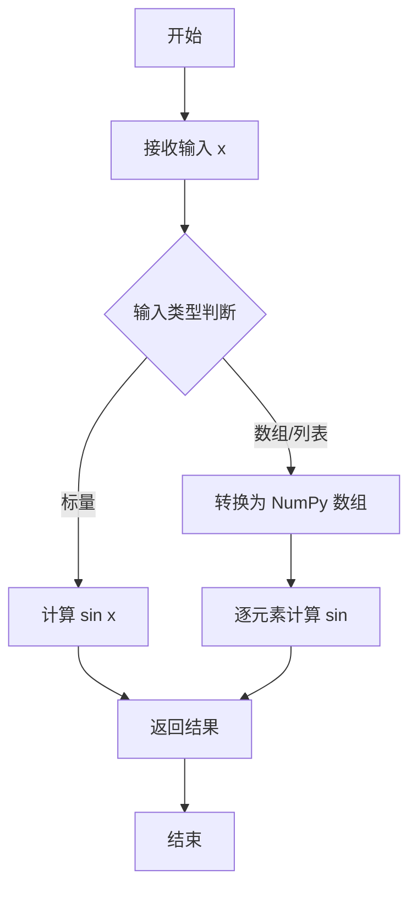
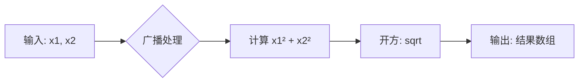
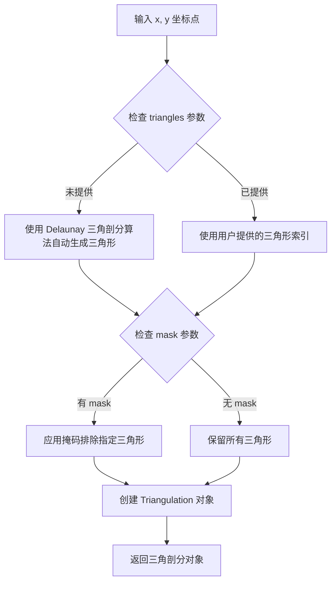
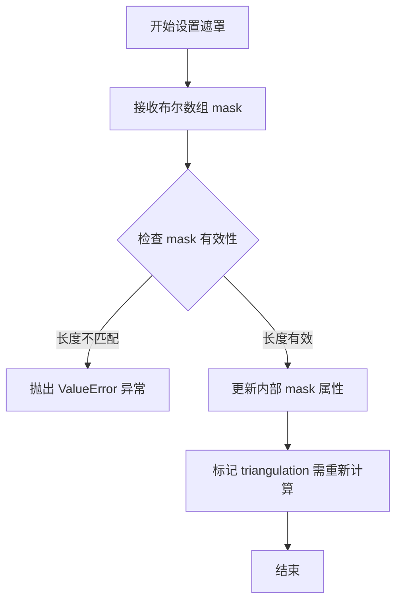
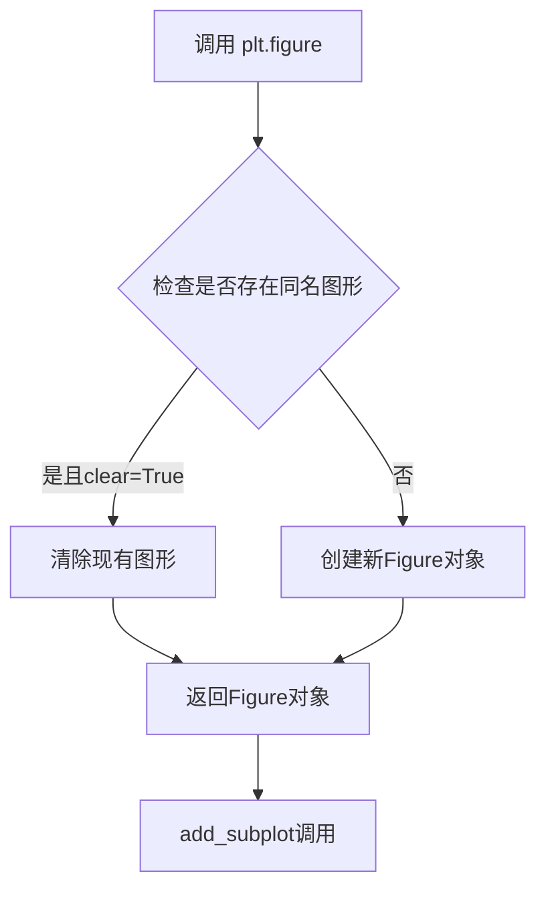
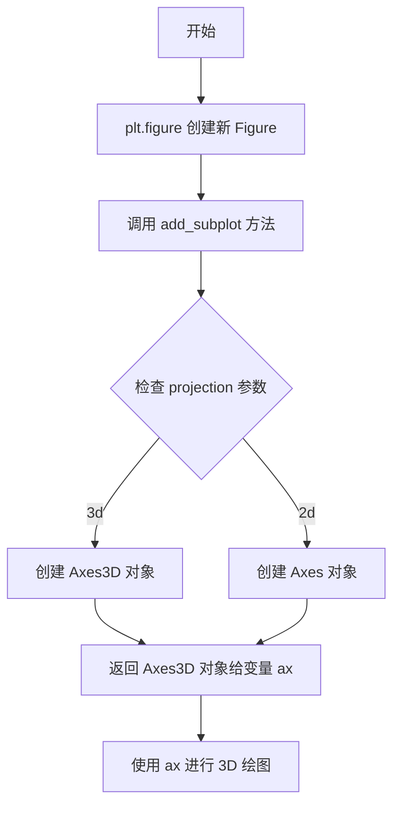
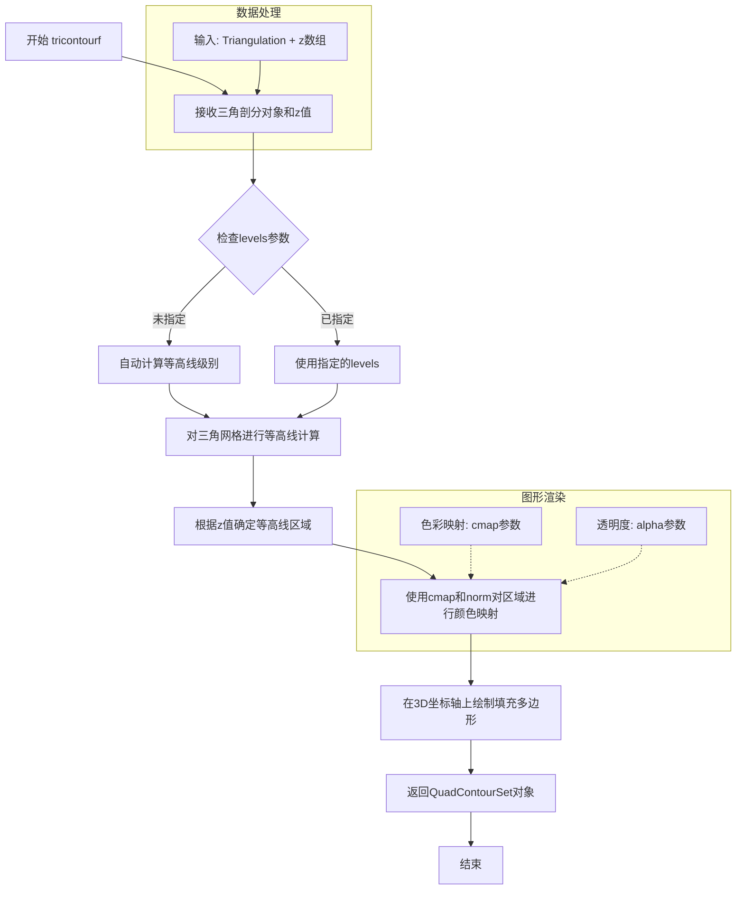
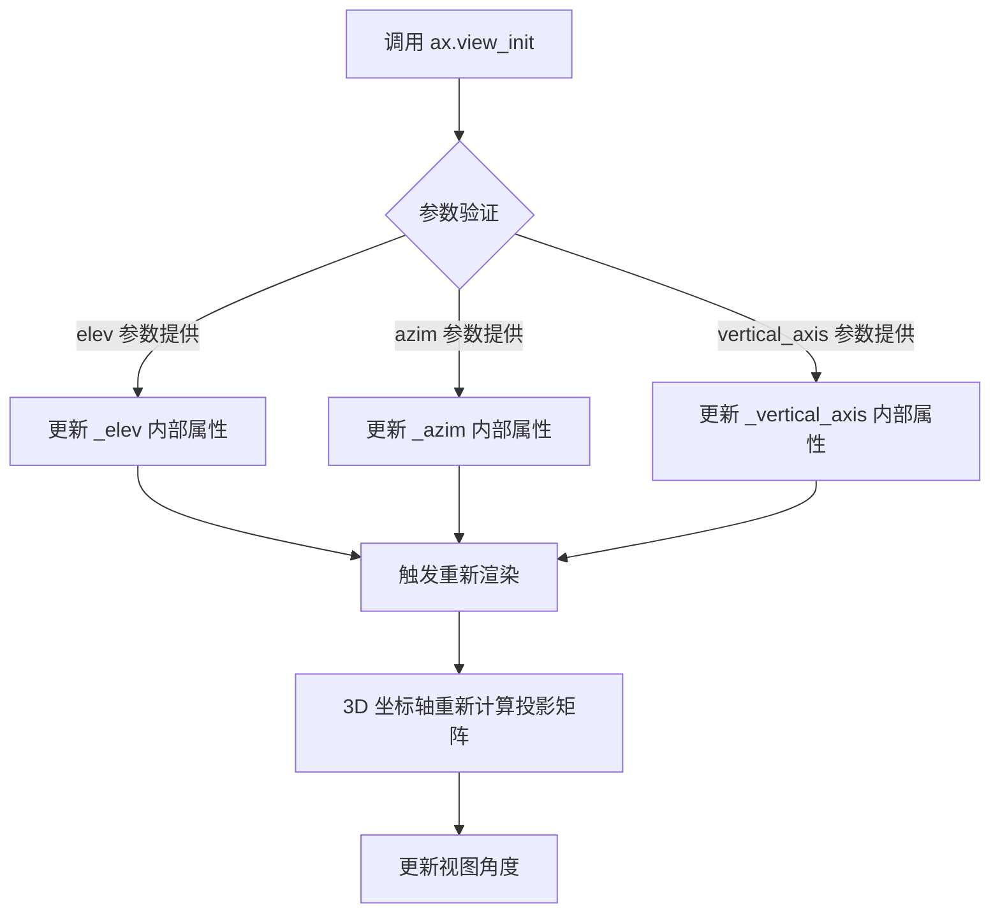
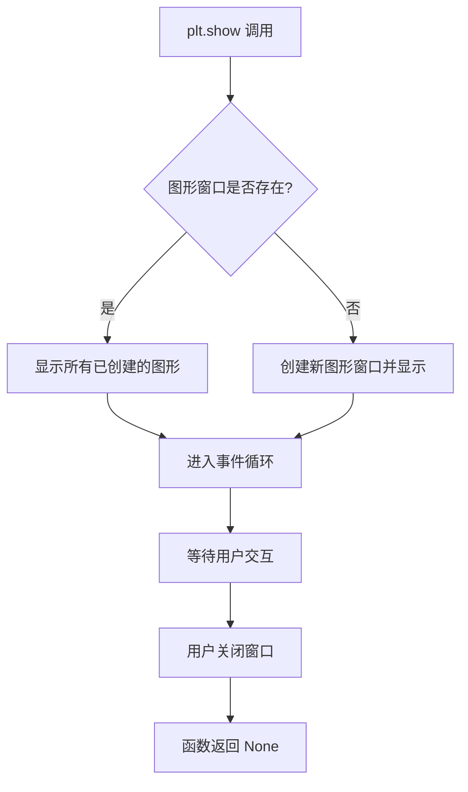

```mermaid
flowchart TD
    A[输入角度 x] --> B{判断输入类型}
    B -->|标量| C[计算 cos&#40;x&#41;]
    B -->|数组| D[对每个元素计算 cos&#40;xi&#41;]
    C --> E[返回标量结果]
    D --> F[返回数组结果]
    E --> G[完成]
    F --> G
```

# `matplotlib\galleries\examples\mplot3d\tricontourf3d.py` 详细设计文档

该脚本使用matplotlib和numpy在3D空间中绘制非结构化三角网格的填充等高线图，通过极坐标生成点数据并进行三角剖分，最终展示一个环形山形的3D可视化效果。

## 整体流程

```mermaid
graph TD
    A[开始] --> B[导入库: matplotlib.pyplot, numpy, matplotlib.tri]
B --> C[设置参数: n_angles=48, n_radii=8, min_radius=0.25]
C --> D[生成极坐标网格: radii, angles]
D --> E[极坐标转笛卡尔坐标: x, y, z]
E --> F[创建Triangulation对象]
F --> G[设置遮罩: 移除中心过小的三角形]
G --> H[创建3D子图: ax = plt.figure().add_subplot(projection='3d')]
H --> I[调用tricontourf绘制填充等高线]
I --> J[设置视角: ax.view_init(elev=45.)]
J --> K[显示图表: plt.show()]
K --> L[结束]
```

## 类结构

```
无自定义类
主要使用库类:
├── matplotlib.tri.Triangulation (三角剖分)
├── matplotlib.figure.Figure (图形容器)
├── matplotlib.axes._axes.Axes3D (3D坐标轴)
└── numpy.ndarray (数组对象)
```

## 全局变量及字段


### `n_angles`
    
角度采样点数

类型：`int`
    


### `n_radii`
    
半径采样点数

类型：`int`
    


### `min_radius`
    
最小半径阈值

类型：`float`
    


### `radii`
    
半径数组

类型：`numpy.ndarray`
    


### `angles`
    
角度数组

类型：`numpy.ndarray`
    


### `x`
    
笛卡尔坐标X

类型：`numpy.ndarray`
    


### `y`
    
笛卡尔坐标Y

类型：`numpy.ndarray`
    


### `z`
    
笛卡尔坐标Z (基于cos函数计算)

类型：`numpy.ndarray`
    


### `triang`
    
三角剖分对象

类型：`matplotlib.tri.Triangulation`
    


### `ax`
    
3D坐标轴对象

类型：`matplotlib.axes._axes.Axes3D`
    


    

## 全局函数及方法


### `np.linspace`

`np.linspace` 是 NumPy 库中的一个函数，用于在指定的间隔内生成等间距的数值序列（等差数列）。该函数常用于创建测试数据、坐标轴、插值等场景。

参数：

- `start`：`float`，序列的起始值
- `stop`：`float`，序列的结束值（当 endpoint=True 时包含该值）
- `num`：`int`（可选，默认 50），生成的样本数量
- `endpoint`：`bool`（可选，默认 True），是否包含结束点
- `retstep`：`bool`（可选，默认 False），是否返回步长
- `dtype`：`dtype`（可选），输出数组的数据类型
- `axis`：`int`（可选，默认 0），结果数组的存储轴

返回值：`ndarray`，返回等差数列数组。如果 `retstep=True`，则返回 (array, step) 元组。

#### 流程图

```mermaid
flowchart TD
    A[开始] --> B[验证参数<br/>num >= 0<br/>start/stop为有限值]
    B --> C{retstep=True?}
    C -->|Yes| D[计算步长 step = (stop-start)/(num-1)]
    C -->|No| E[计算步长 step = (stop-start)/num]
    D --> F[生成num个等间距点]
    E --> F
    F --> G{endpoint=False?}
    G -->|Yes| H[不包含stop值<br/>范围为start到stop-step]
    G -->|No| I[包含stop值<br/>范围为start到stop]
    H --> J{dtype指定?}
    I --> J
    J -->|Yes| K[转换为指定dtype]
    J -->|No| L[自动推断dtype]
    K --> M{retstep=True?}
    L --> M
    M -->|Yes| N[返回数组和步长元组]
    M -->|No| O[返回等差数列数组]
    N --> P[结束]
    O --> P
```

#### 带注释源码

```python
# 代码中的实际使用示例 1：生成半径数组
radii = np.linspace(min_radius, 0.95, n_radii)
# min_radius: float, 最小半径值（如0.25）
# 0.95: float, 最大半径值
# n_radii: int, 样本数量（如8）
# 返回: ndarray, 从min_radius到0.95的n_radii个等间距值

# 代码中的实际使用示例 2：生成角度数组
angles = np.linspace(0, 2*np.pi, n_angles, endpoint=False)
# 0: float, 起始角度（0弧度）
# 2*np.pi: float, 结束角度（2π弧度，即360度）
# n_radii: int, 样本数量（如48）
# endpoint=False: bool, 不包含结束点（0到2π但不包括2π）
# 返回: ndarray, 从0到2π（不含2π）的n_radii个等间距弧度值

# 实际运行结果示例：
# radii = [0.25, 0.35, 0.45, 0.55, 0.65, 0.75, 0.85, 0.95]  (n_radii=8)
# angles = [0, π/24, π/12, π/8, π/6, π/4, 5π/12, ..., 23π/24]  (n_radii=48, 不含2π)
```


### `np.repeat`

`np.repeat` 是 NumPy 库中的一个函数，用于沿指定轴重复数组元素。该函数接收一个数组、一个重复次数（或重复次数数组）以及可选的轴参数，返回一个重复后的新数组。

参数：

- `a`：`array_like`，要重复的输入数组，在此代码中为 `angles[..., np.newaxis]`（对 angles 增加新维度后的数组）
- `repeats`：`int` 或 `int 数组`，重复次数，在此代码中为 `n_radii`（值为 8）
- `axis`：`int`，指定沿哪个轴重复，在此代码中为 `1`（沿列方向）

返回值：`ndarray`，重复后的数组，shape 为 `(n_angles, n_radii)` 即 `(48, 8)`

#### 流程图

```mermaid
graph TD
    A[开始 np.repeat] --> B[输入数组 angles[..., np.newaxis]<br/>shape: 48×1]
    B --> C[设置重复次数 repeats=n_radii=8]
    C --> D[设置重复轴 axis=1]
    D --> E[沿列方向重复每个元素8次]
    E --> F[输出新数组<br/>shape: 48×8]
    F --> G[结束]
    
    style A fill:#f9f,stroke:#333
    style F fill:#9f9,stroke:#333
    style G fill:#9f9,stroke:#333
```

#### 带注释源码

```python
# np.repeat 函数在代码中的实际应用
# 原始 angles 数组: shape = (48,) - 48个角度值，范围 [0, 2π)
angles = np.linspace(0, 2*np.pi, n_angles, endpoint=False)

# 步骤1: 使用 np.newaxis 增加新维度
# angles[..., np.newaxis] 将 shape 从 (48,) 转换为 (48, 1)
# 这样可以在后续操作中与 n_radii 进行广播
angles_expanded = angles[..., np.newaxis]  # shape: (48, 1)

# 步骤2: 调用 np.repeat 沿 axis=1 重复
# 参数说明:
#   - a: angles_expanded，要重复的数组
#   - repeats: n_radii，重复次数（值为8）
#   - axis: 1，沿第二个维度（列）重复
# 结果: 每个角度值重复8次，形成 (48, 8) 的数组
angles_repeated = np.repeat(angles_expanded, n_radii, axis=1)
# 此时 angles_repeated shape = (48, 8)

# 步骤3: 对偶数列添加偏移量，实现交错排列
#[:, 1::2] 选取所有行，步长为2选取列（即奇数列）
# 加上 np.pi/n_angles 实现角度偏移，使网格更密集
angles_repeated[:, 1::2] += np.pi/n_angles

# 最终 angles 数组用于后续计算:
# x = (radii * np.cos(angles)).flatten()
# y = (radii * np.sin(angles)).flatten()
```


### `np.cos`

`np.cos` 是 NumPy 库中的三角函数，用于计算输入数组或标量的余弦值。在本代码中，该函数用于将极坐标角度转换为笛卡尔坐标系的 x 和 y 分量，并计算 z 坐标的数值。

参数：

- `x`：`float` 或 `array_like`，输入角度值（以弧度为单位），可以是标量或数组

返回值：`ndarray` 或 `scalar`，输入角度的余弦值，返回值范围为 [-1, 1]

#### 流程图



#### 带注释源码

```python
# np.cos 函数使用示例

# 1. 生成角度数组（弧度制）
angles = np.linspace(0, 2*np.pi, n_angles, endpoint=False)

# 2. 计算角度的余弦值，用于生成 x 坐标
#    公式: x = radii * cos(angles)
x = (radii*np.cos(angles)).flatten()

# 3. 在 z 坐标计算中组合使用 cos 函数
#    z = cos(radii) * cos(3*angles)
z = (np.cos(radii)*np.cos(3*angles)).flatten()

# 说明：
# - np.cos 接受弧度输入，不是角度制
# - 输入可以是标量、列表或 NumPy 数组
# - 输出与输入形状相同的数组（或标量）
# - 计算基于数学余弦函数: cos(x) = adjacent/hypotenuse
```


### `np.sin`

`np.sin` 是 NumPy 库提供的正弦函数，用于计算输入数组或标量中每个元素的正弦值（以弧度为单位）。

参数：

- `x`：`array_like`，输入角度（弧度），可以是标量、列表或 NumPy 数组

返回值：`ndarray`，输入角度对应的正弦值，类型为 float64，与输入数组形状相同

#### 流程图



#### 带注释源码

```python
# np.sin 函数的调用示例（在给定代码中）
y = (radii * np.sin(angles)).flatten()

# 参数说明：
#   radii: np.linspace(min_radius, 0.95, n_radii) 生成的半径数组
#   angles: np.linspace(0, 2*np.pi, n_angles, endpoint=False) 生成的角度数组（弧度制）
# 
# 返回值：
#   y: 半径乘以角度正弦值后的展平数组，用于后续三角网格的 y 坐标
#
# 实现原理：
#   1. np.sin 计算 angles 数组中每个角度（弧度）的正弦值
#   2. 结果与 radii 数组逐元素相乘
#   3. .flatten() 将结果展平为一维数组
```


### `np.hypot`

该函数用于计算两个数组对应元素的欧几里得范数（即欧几里得距离），返回值为输入数组每个元素对的平方和的平方根，常用于几何计算中距离的快速求解。

参数：
- `x1`：`array_like`，第一个数组，表示x坐标或第一组数值。
- `x2`：`array_like`，第二个数组，表示y坐标或第二组数值。

返回值：`ndarray`，返回输入数组对应元素的欧几里得范数，形状与输入数组的广播后形状一致。

#### 流程图



#### 带注释源码

```python
# 调用 np.hypot 计算三角形中心的坐标到原点的欧几里得距离
# x[triang.triangles].mean(axis=1) 提取三角形所有顶点x坐标的平均值
# y[triang.triangles].mean(axis=1) 提取三角形所有顶点y坐标的平均值
# 返回每个三角形中心到原点的距离数组
distances = np.hypot(x[triang.triangles].mean(axis=1),
                     y[triang.triangles].mean(axis=1))

# 使用距离数组创建遮罩：距离小于最小半径的三角形被排除
triang.set_mask(distances < min_radius)
```


### `tri.Triangulation`

创建三角剖分对象，用于将散点坐标转换为可进行三角剖分操作的数据结构，支持掩码操作以排除不需要的三角形。

参数：

- `x`：`array_like`，x 坐标数组，表示平面上的点的横坐标
- `y`：`array_like`，y 坐标数组，表示平面上的点的纵坐标
- `triangles`：`array_like`，可选，三角形顶点索引数组，形状为 (n_triangles, 3)，默认为 None
- `mask`：`array_like`，可选，布尔数组，用于掩码不需要的三角形，默认为 None

返回值：`tri.Triangulation`，返回三角剖分对象，包含三角形索引、掩码和坐标信息

#### 流程图



#### 带注释源码

```python
# 创建三角剖分对象
# 参数：
#   x: array_like - x 坐标数组
#   y: array_like - y 坐标数组
# 返回：Triangulation 对象
triang = tri.Triangulation(x, y)

# 示例中后续使用 set_mask 方法设置掩码
# 掩码逻辑：计算每个三角形中心点到原点的距离
# 如果距离小于 min_radius，则排除该三角形
triang.set_mask(
    np.hypot(
        x[triang.triangles].mean(axis=1),  # 三角形中心的 x 坐标
        y[triang.triangles].mean(axis=1)   # 三角形中心的 y 坐标
    ) < min_radius  # 距离阈值判断
)
```


### `Triangulation.set_mask`

设置三角网格的遮罩，用于隐藏不符合条件的三角形。在该示例中，遮罩用于隐藏中心距离原点过近的三角形，使绘图仅显示外部区域的等高线。

参数：

- `mask`：`numpy.ndarray`（布尔类型），一个布尔数组，长度等于三角形数量。为 `True` 时表示对应的三角形将被隐藏（不渲染），为 `False` 时表示显示。

返回值：`None`，该方法直接修改 `Triangulation` 对象的状态，不返回任何值。

#### 流程图



#### 带注释源码

```python
# 调用 set_mask 方法设置三角网格的遮罩
# 参数：一个布尔数组，条件为三角形中心到原点的欧几里得距离小于 min_radius
# np.hypot(x[triang.triangles].mean(axis=1), y[triang.triangles].mean(axis=1)) 
#   计算每个三角形中心的极坐标半径
# < min_radius 
#   返回布尔数组，True 表示该三角形中心距离原点小于最小半径，应被遮罩
triang.set_mask(
    np.hypot(
        x[triang.triangles].mean(axis=1),  # 获取每个三角形 x 坐标均值
        y[triang.triangles].mean(axis=1)   # 获取每个三角形 y 坐标均值
    ) < min_radius  # 判断是否小于最小半径阈值，返回布尔 mask
)
```

#### 额外说明

- **mask 数组长度**：必须与 `Triangulation` 对象中的三角形数量相同
- **效果**：遮罩设置后，所有渲染操作（如 `tricontourf`）将自动忽略被遮罩的三角形
- **重新计算**：设置新遮罩后，matplotlib 会自动标记相关缓存需要重新计算


### `plt.figure`

创建并返回一个全新的 Figure 对象，用于容纳图形内容。在本代码中用于创建 3D 图形所需的画布。

参数：

- `figsize`：`tuple`，可选，图形尺寸，格式为 (宽度, 高度)，单位为英寸
- `dpi`：`int`，可选，每英寸点数（分辨率）
- `facecolor`：`str` 或 `tuple`，可选，图形背景颜色
- `edgecolor`：`str` 或 `tuple`，可选，图形边框颜色
- `frameon`：`bool`，可选，是否绘制边框
- `FigureClass`：`type`，可选，自定义 Figure 子类
- `clear`：`bool`，可选，如果为 True 则清除现有图形
- `**kwargs`：其他关键字参数传递给 Figure 构造函数

返回值：`matplotlib.figure.Figure`，新创建的图形对象

#### 流程图



#### 带注释源码

```python
# 调用 plt.figure() 创建新图形
# 等效于 matplotlib.pyplot.figure() 函数
# 在本例中：
#   - 未指定参数，使用所有默认值
#   - figsize 默认 (6.4, 4.8) 英寸
#   - dpi 默认 100
#   - facecolor 默认 'white'
# 返回一个 Figure 实例
fig = plt.figure()

# 在返回的 Figure 对象上调用 add_subplot
# 参数 projection='3d' 指定创建 3D 坐标轴
ax = fig.add_subplot(projection='3d')
```


### Figure.add_subplot

该方法用于在 matplotlib 的 Figure 对象上创建一个子图（Axes），支持指定投影类型。在本代码中用于创建一个带有 3D 投影的子图，以便后续绘制 3D 等高线图。

参数：

- `*args`：`tuple` 或 `int`，位置参数，可接收 (rows, columns, index) 形式的元组或三位数（如 111 表示 1行1列第1个位置）。本例中未直接使用位置参数。
- `projection`：`str`，可选参数，指定子图的投影类型。本例中传入 `'3d'` 表示创建 3D 坐标系。
- `polar`：`bool`，可选参数，指定是否为极坐标投影，默认为 False。
- `aspect`：`None` 或 `tuple` 或 `str`，可选参数，控制坐标轴的纵横比。
- `label_visibility`：`str`，可选参数，控制共享子图时轴标签的可见性。
- `**kwargs`：其他关键字参数，将传递给 Axes 类的构造函数。

返回值：`matplotlib.axes.Axes`（具体为 `mpl_toolkits.mplot3d.axes3d.Axes3D`），返回创建的子图轴对象，包含了各种绘图方法如 `tricontourf`、`view_init` 等。

#### 流程图



#### 带注释源码

```python
# 导入 matplotlib 的 pyplot 模块并重命名为 plt
import matplotlib.pyplot as plt

# 调用 plt.figure() 创建一个新的图形窗口/Figure 对象
# 然后在该 Figure 对象上调用 add_subplot 方法
ax = plt.figure().add_subplot(projection='3d')
#   |---|       |--------------------|
#   |   |       |
#   |   |       └── add_subplot 方法调用，创建子图
#   |   |
#   |   └── plt.figure() 返回 Figure 实例
#   |
#   └── 赋值给变量 ax，ax 成为 Axes3D 对象
#       （后续用于调用 ax.tricontourf, ax.view_init 等 3D 绘图方法）

# 使用返回的 Axes3D 对象 ax 绘制 3D 填充等高线图
ax.tricontourf(triang, z, cmap="CMRmap")

# 设置 3D 视图角度
ax.view_init(elev=45.)

# 显示图形
plt.show()
```


### `ax.tricontourf` (或 `Axes3D.tricontourf`)

该函数是matplotlib库中`Axes3D`类的方法，用于在3D坐标轴上绘制填充的三角形等高线图。它接受一个三角剖分对象和对应的z值数据，将三角网格的等高线区域进行颜色填充，常用于可视化三维空间中标量场（如温度、压力、高度等）的分布情况。

参数：

- `triangulation`：`matplotlib.tri.Triangulation`对象，三角剖分对象，定义x,y坐标的网格连接关系
- `z`：`array-like`，与三角剖分顶点对应的标量值数组，用于计算等高线
- `levels`：`int`或`array-like`，可选，等高线的数量或具体的等高线级别值，默认为None
- `zdir`：`str`，可选，指定投影方向，默认为'z'
- `offset`：`float`，可选，等高线在z方向的偏移量，用于避免多曲面重叠，默认为None
- `**kwargs`：可选，传递给`QuadContourSet`的其他关键字参数，如`cmap`（色彩映射）、`norm`（归一化）、`alpha`（透明度）等

返回值：`matplotlib.contour.QuadContourSet`，返回填充等高线图形对象，可用于后续添加颜色条等操作

#### 流程图



#### 带注释源码

```python
# 示例代码展示 tricontourf 的使用方式
import matplotlib.pyplot as plt
import numpy as np
import matplotlib.tri as tri

# 1. 创建示例数据
n_angles = 48
n_radii = 8
min_radius = 0.25

# 2. 生成极坐标网格并转换为笛卡尔坐标
radii = np.linspace(min_radius, 0.95, n_radii)
angles = np.linspace(0, 2*np.pi, n_angles, endpoint=False)
angles = np.repeat(angles[..., np.newaxis], n_radii, axis=1)
angles[:, 1::2] += np.pi/n_angles

x = (radii*np.cos(angles)).flatten()
y = (radii*np.sin(angles)).flatten()
z = (np.cos(radii)*np.cos(3*angles)).flatten()

# 3. 创建三角剖分对象
triang = tri.Triangulation(x, y)

# 4. 可选：设置蒙版遮盖不需要的三角形
triang.set_mask(np.hypot(x[triang.triangles].mean(axis=1),
                         y[triang.triangles].mean(axis=1))
                < min_radius)

# 5. 创建3D坐标轴
ax = plt.figure().add_subplot(projection='3d')

# 6. 调用 tricontourf 绘制填充等高线
# 参数说明：
#   triang: 三角剖分对象
#   z: 每个顶点的高度值
#   cmap: 色彩映射方案 ("CMRmap"是一种彩虹色系)
contourf = ax.tricontourf(triang, z, cmap="CMRmap")

# 7. 可选：添加颜色条
# plt.colorbar(contourf, ax=ax, shrink=0.5)

# 8. 设置视角
ax.view_init(elev=45.)

# 9. 显示图形
plt.show()
```


### `ax.view_init`

设置 3D 坐标轴的视角（elevation 和 azimuth 角度），用于自定义 3D 图表的观察方向。

参数：

- `elev`：`float`，仰角（elevation angle），以度为单位，表示观察点相对于 XY 平面的垂直角度。值为 90 表示从正上方俯视，值为 0 表示从水平方向观察。
- `azim`：`float`，方位角（azimuth angle），以度为单位，表示观察点绕垂直轴旋转的水平角度。默认为 -90。
- `vertical_axis`：`str`，指定哪个轴作为 3D 图表的垂直轴，可选值为 'x'、'y' 或 'z'，默认为 'z'。

返回值：`None`，该方法无返回值，直接修改 Axes3D 对象的视图角度属性。

#### 流程图



#### 带注释源码

```python
# 在示例代码中的调用方式
ax.view_init(elev=45.)

# view_init 方法的典型签名和功能说明：
# def view_init(self, elev=None, azim=None, vertical_axis='z'):
#     """
#     Set the elevation and azimuth angles of the view.
#     
#     Parameters
#     ----------
#     elev : float, default: None
#         The elevation angle in degrees, with 0 meaning looking from the front
#         and 90 meaning looking from directly above.
#     azim : float, default: None
#         The azimuth angle in degrees, with 0 meaning from the front side.
#     vertical_axis : {'x', 'y', 'z'}, default: 'z'
#         The axis that is vertical.
#     """
#     
#     # 内部会设置 _elev、_azim、_vertical_axis 等属性
#     # 并触发坐标轴重绘以应用新的视角
```


### `plt.show`

`plt.show()` 是 matplotlib.pyplot 模块中的核心函数，用于显示所有当前已创建的图形窗口并进入事件循环，是 matplotlib 绘图的最终展示步骤。

参数：此函数无显式参数。

返回值：`None`，无返回值。

#### 流程图



#### 带注释源码

```python
# 导入matplotlib的pyplot模块，这是最常用的绘图接口
import matplotlib.pyplot as plt

# ... [前序代码创建3D三角填充等高线图] ...

# 创建3D坐标轴，设置投影为3D
ax = plt.figure().add_subplot(projection='3d')

# 绘制3D三角填充等高线图
# triang: Triangulation对象，包含三角网格信息
# z: 对应每个点的z轴数值
# cmap: 颜色映射方案，"CMRmap"是一种连续的颜色映射
ax.tricontourf(triang, z, cmap="CMRmap")

# 设置3D视图的仰角为45度
ax.view_init(elev=45.)

# ============================================
# plt.show() 函数的核心实现逻辑（简化版）:
# ============================================

def show(block=None, _block=True):
    """
    显示所有打开的图形窗口。
    
    参数:
        block: 布尔值或None，控制是否阻塞程序执行
              - True: 阻塞直到所有窗口关闭
              - False: 立即返回（非阻塞）
              - None: 在交互模式下为False，非交互模式下为True
    
    返回值:
        None
    """
    
    # 1. 获取当前所有的图形对象
    # _pylab_helpers.Gcf.get_all_fig_managers()
    
    # 2. 对于每个图形管理器，调用其show()方法
    # 这会渲染图形并显示在窗口中
    
    # 3. 进入主事件循环（如果block=True）
    # 处理鼠标点击、键盘输入等事件
    
    # 4. 当所有窗口关闭后，函数返回
    
# 调用plt.show()显示图形
plt.show()  # <--- 这是代码中的实际调用
```

## 关键组件


### 极坐标网格生成

生成极坐标网格参数，包括角度和半径数组，为后续坐标转换做准备。使用numpy的linspace函数创建均匀分布的角度（48个）和半径（8个）序列，其中角度数组通过repeat和切片操作实现交错排列以优化网格分布。

### 笛卡尔坐标转换

将极坐标转换为笛卡尔坐标（x, y, z）。通过三角函数cos和sin计算x、y坐标，使用cos(radii)*cos(3*angles)公式计算z坐标，所有坐标使用flatten()展平为一维数组供后续Triangulation使用。

### 三角剖分创建

使用matplotlib.tri.Triangulation创建非结构化三角网格。将展平后的x、y坐标作为输入，自动生成三角形连接关系，为后续等高线绘制提供网格拓扑结构。

### 三角形屏蔽

基于三角形中心到原点的距离屏蔽不需要的三角形。使用np.hypot计算三角形顶点平均坐标的欧几里得距离，小于min_radius的三角形被屏蔽，从而移除靠近原点的无效三角形区域。

### 3D填充等高线绘制

使用ax.tricontourf在3D坐标系中绘制填充等高线图。接收三角剖分对象和z值数据，使用"CMRmap"颜色映射将高度值可视化，创建3D表面的色彩表示。

### 视角自定义

通过ax.view_init设置3D坐标轴的视角，elev=45度指定仰角，将观察点提升至45度俯视角度，以便更清晰地展示3D等高线图的空间结构。


## 问题及建议


### 已知问题

-   代码缺乏模块化，所有逻辑直接执行在全局作用域，难以复用和测试。
-   存在大量硬编码的数值（如n_angles=48, n_radii=8, min_radius=0.25等），缺乏可配置性。
-   缺少错误处理机制，例如未验证Triangulation输入的有效性、数组维度不匹配等潜在问题。
-   魔法数字（如np.pi/n_angles、0.95等）未作解释，影响代码可读性和可维护性。
-   图表缺少标题、轴标签等元数据，降低了 plot 的可解释性。
-   view_init 仅设置 elev 参数，azim 参数使用默认值，可能导致视图方向不可预测。

### 优化建议

-   将核心绘图逻辑封装为函数，接受参数（如 n_angles、n_radii、min_radius 等），以提高可复用性和可测试性。
-   将硬编码数值提取为模块级常量或配置字典，便于统一管理和调整。
-   添加输入验证和异常处理，例如检查数组长度一致性、Triangulation 有效性等。
-   为关键变量和复杂计算添加注释，说明魔法数字的来源和意义。
-   为图表添加标题、轴标签和图例，提升可视化效果。
-   明确设置 view_init 的 azim 参数，确保视图方向一致。


## 其它


### 设计目标与约束

本示例旨在展示如何使用matplotlib在3D空间中绘制三角形网格的填充等高线图。设计目标是创建一个可视化的极坐标数据表示，将二维的极坐标数据(x, y)与z值映射到3D空间并生成填充等高线。主要约束包括：必须使用matplotlib.tri模块的Triangulation类处理非结构化三角形网格，且数据点需预先计算为直角坐标形式。

### 错误处理与异常设计

代码主要依赖numpy和matplotlib库进行数据处理和绘图。在数据生成阶段，可能出现的错误包括：n_angles和n_radii参数为非正数时会导致数组创建失败；min_radius为负数或大于0.95时会影响数据有效性。在Triangulation创建时，若x和y数组长度不匹配会抛出异常。set_mask方法要求mask数组长度与三角形数量一致，否则会引发维度不匹配错误。绘图阶段若数据包含NaN或Inf值，可能导致等高线计算警告或空白输出。

### 数据流与状态机

数据流从极坐标生成开始：首先生成角度数组(angles)和半径数组(radii)，然后通过三角函数转换为笛卡尔坐标(x, y)，同时计算z值。接着创建Triangulation对象进行三角网格划分，通过set_mask方法过滤掉不符合条件的三角形。最后将 triang对象、z值和颜色映射传递给tricontourf方法进行渲染。整个过程是线性数据流，无状态循环。

### 外部依赖与接口契约

代码依赖三个主要外部包：numpy提供数值计算功能，matplotlib.pyplot提供绘图框架，matplotlib.tri提供三角形网格处理工具。关键接口包括：tri.Triangulation(x, y)接受一维坐标数组返回网格对象；ax.tricontourf(triang, z, cmap)接受网格对象、标量值数组和颜色映射名称，返回TriContourSet对象。所有numpy数组应为一维float64类型。

### 性能考虑与优化空间

当前实现对于小规模数据集(n_angles=48, n_radii=8)性能足够。但对于大规模数据，可优化的方向包括：预先分配数组空间避免重复flatten操作；使用向量化运算替代可能存在的显式循环；mask设置可考虑使用布尔索引替代hypot计算。在渲染方面，3D等高线计算复杂度为O(n log n)，其中n为数据点数量。

### 可测试性分析

代码的可测试性较好，主要因为各步骤相对独立。可测试的内容包括：坐标转换函数的数值精度验证；Triangulation创建后三角形数量与预期的一致性验证；mask数组维度的正确性检查；等高线级别数量的边界情况测试。由于代码位于脚本顶层，可通过重构为函数形式提高可测试性。

### 配置参数说明

核心配置参数包括：n_angles=48 控制角度采样点数，决定圆周方向分辨率；n_radii=8 控制径向采样圈数；min_radius=0.25 控制内圆半径，用于排除中心区域；cmap="CMRmap" 指定颜色映射方案；ax.view_init(elev=45.) 设置3D视图仰角为45度。这些参数均可通过变量修改以适应不同的可视化需求。

### 使用示例与变体

示例展示了基础的3D填充等高线绘制。变体包括：修改cmap参数使用不同颜色方案如"viridis"、"plasma"；调整view_init的azim参数改变方位角；使用tricontour替代tricontourf获得线框等高线；结合tricontour3d展示未填充版本；通过set_mask调整过滤条件改变三角形显示范围。

    