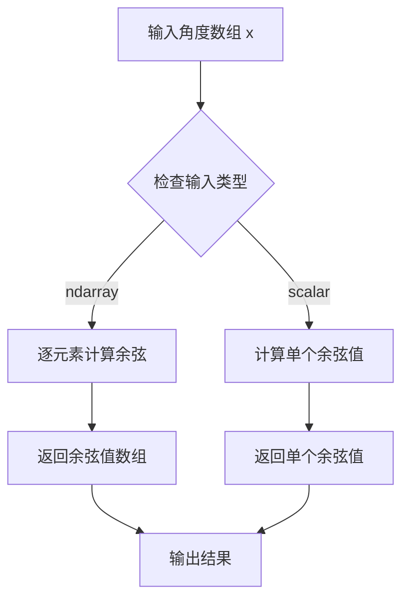
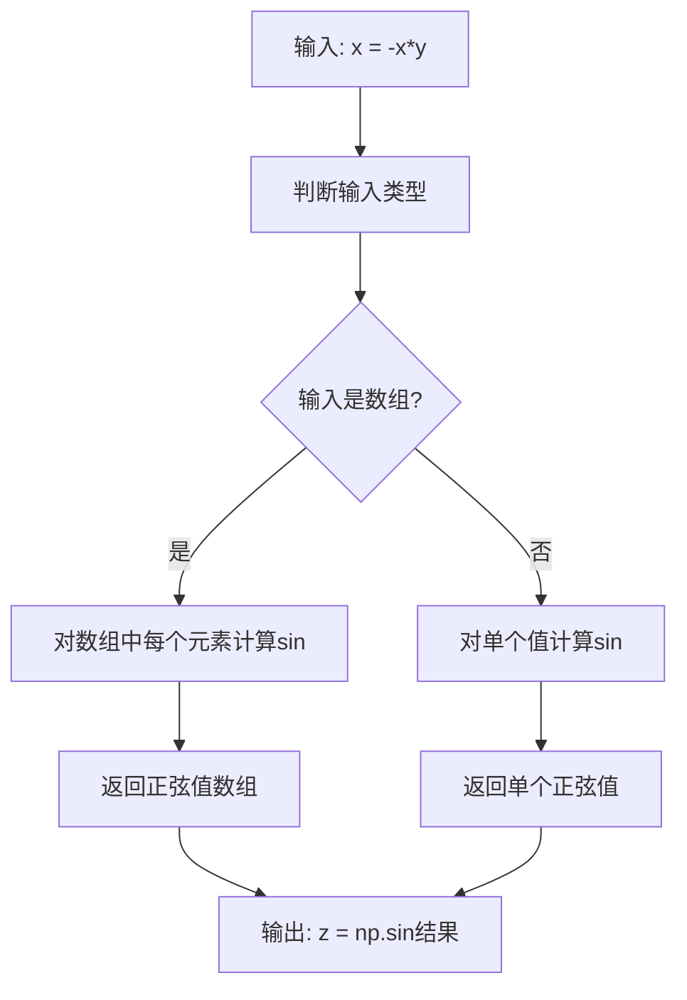
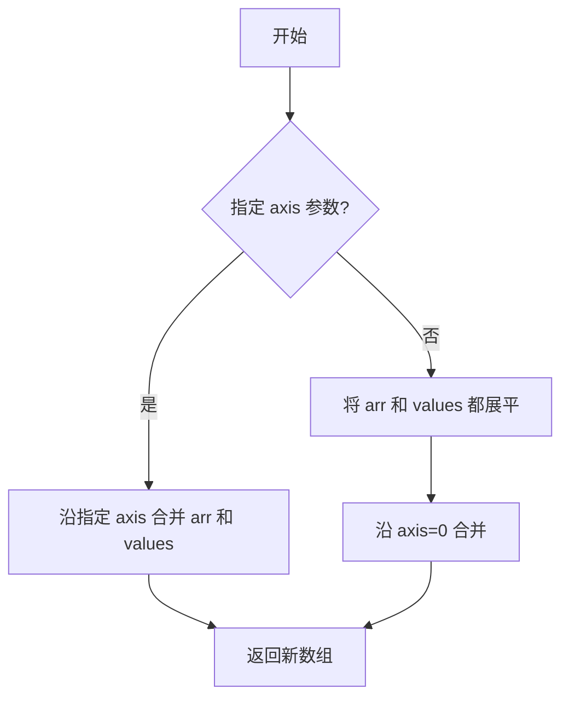
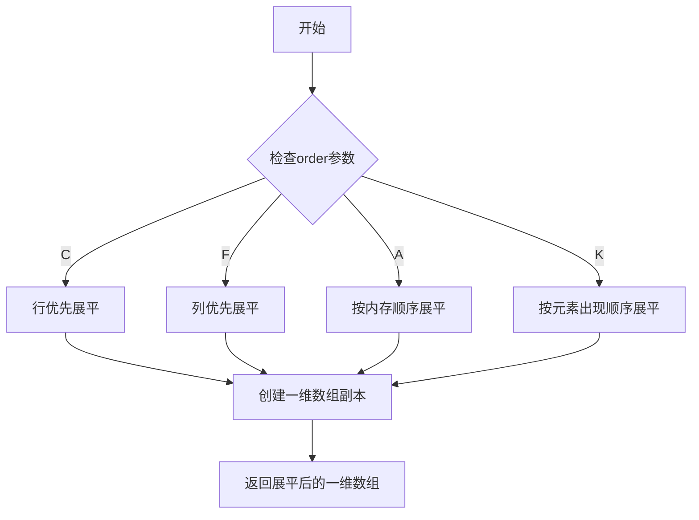
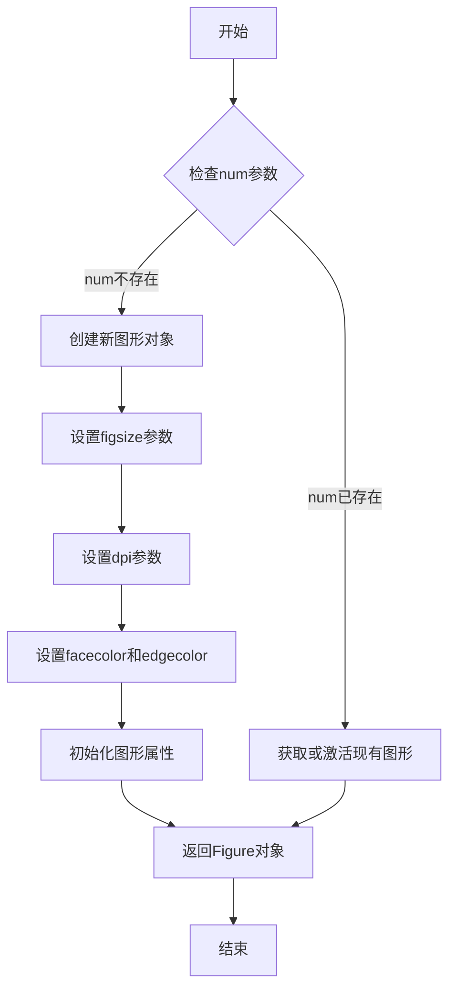
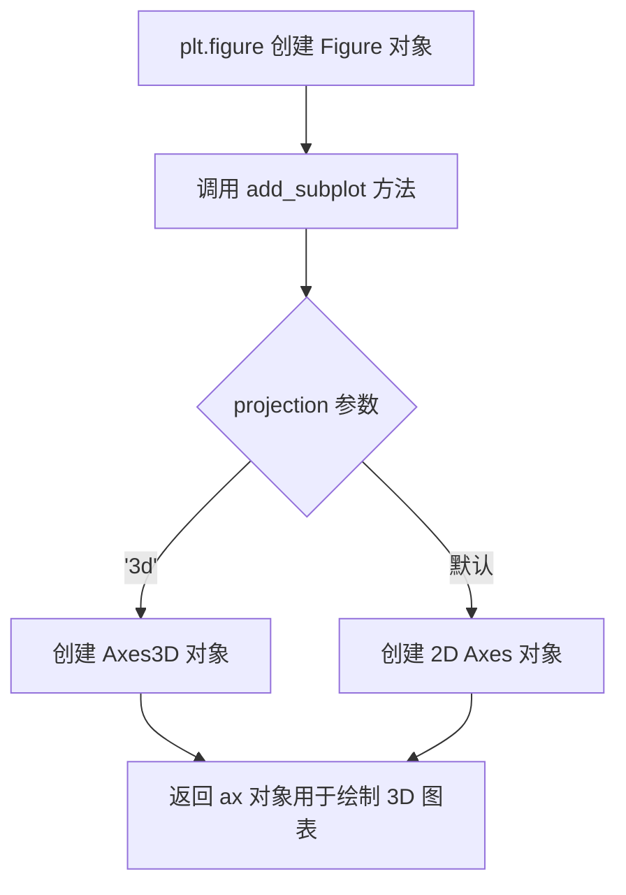
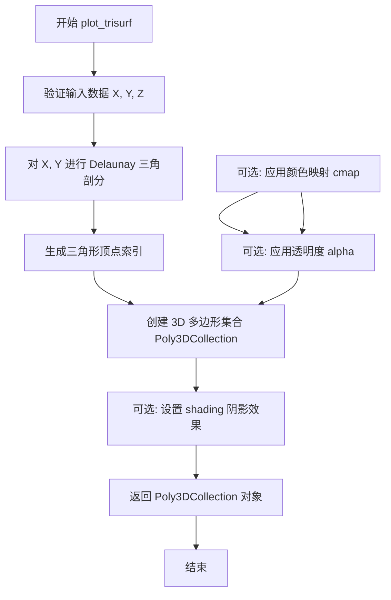
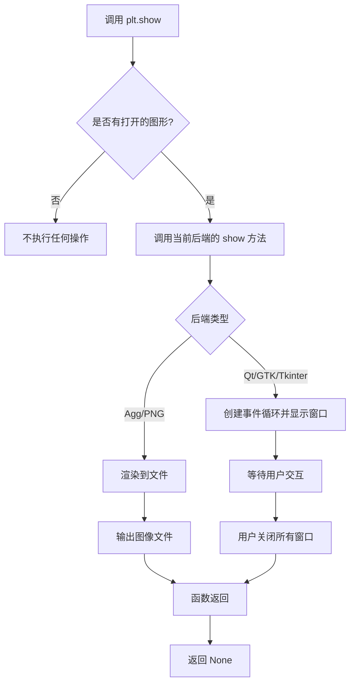

# `matplotlib\galleries\examples\mplot3d\trisurf3d.py` 详细设计文档

该代码使用matplotlib和numpy创建一个基于极坐标系统的三维三角网格曲面，通过将极坐标(radii, angles)转换为笛卡尔坐标(x, y)，然后使用公式z=sin(-x*y)计算高度值，最后通过plot_trisurf函数绘制并展示一个类似薯片形状的3D表面图形。

## 整体流程

```mermaid
graph TD
    A[开始] --> B[导入matplotlib.pyplot和numpy库]
B --> C[设置参数: n_radii=8, n_angles=36]
C --> D[创建半径数组: np.linspace(0.125, 1.0, 8)]
D --> E[创建角度数组: np.linspace(0, 2π, 36)]
E --> F[极坐标转笛卡尔坐标: x = r*cos(θ), y = r*sin(θ)]
F --> G[添加原点(0,0)避免重复点]
G --> H[计算z坐标: z = sin(-x*y)]
H --> I[创建3D axes: add_subplot(projection='3d')]
I --> J[调用plot_trisurf绘制三角网格曲面]
J --> K[调用plt.show()显示图形]
K --> L[结束]
```

## 类结构

```
该脚本为面向过程代码，无自定义类定义
仅使用matplotlib.pyplot和numpy两个库的函数
```

## 全局变量及字段


### `n_radii`
    
半径方向采样点数量

类型：`int`
    


### `n_angles`
    
角度方向采样点数量

类型：`int`
    


### `radii`
    
半径数组，从0.125到1.0的等间距数组

类型：`np.ndarray`
    


### `angles`
    
角度数组，从0到2π的等间距数组

类型：`np.ndarray`
    


### `x`
    
笛卡尔坐标x值（包含原点）

类型：`np.ndarray`
    


### `y`
    
笛卡尔坐标y值（包含原点）

类型：`np.ndarray`
    


### `z`
    
高度坐标，由sin(-x*y)计算得出

类型：`np.ndarray`
    


### `ax`
    
3D坐标轴对象

类型：`matplotlib.axes.Axes`
    


    

## 全局函数及方法


### np.linspace

`np.linspace` 是 NumPy 库中的一个函数，用于生成指定范围内的等间距数值序列。在本代码中用于生成半径数组和角度数组，为后续的三维曲面绘图提供坐标数据。

#### 参数：

- `start`：`float`，序列的起始值
- `stop`：`float`，序列的结束值
- `num`：`int`（可选，默认50），要生成的样本数量
- `endpoint`：`bool`（可选，默认True），若为True则包含stop值，若为False则不包含
- `retstep`：`bool`（可选，默认False），若为True则返回步长
- `dtype`：`dtype`（可选），输出数组的数据类型

#### 返回值：

- `ndarray`，返回num个在闭区间[start, stop]或半开区间[start, stop)内的等间距样本

#### 流程图

```mermaid
graph TD
    A[开始] --> B[接收start, stop, num参数]
    B --> C{endpoint=True?}
    C -->|是| D[包含stop值]
    C -->|否| E[不包含stop值]
    D --> F[计算步长step = (stop-start) / (num-1)]
    E --> F
    F --> G[生成等间距数组]
    G --> H[返回ndarray]
```

#### 带注释源码

```python
# np.linspace 函数在代码中的实际调用示例

# 调用1: 生成半径数组
radii = np.linspace(0.125, 1.0, n_radii)
# 参数说明:
#   start=0.125: 起始半径值
#   stop=1.0: 结束半径值
#   num=n_radii=8: 生成8个样本点
#   endpoint默认为True: 包含1.0这个值
# 返回: array([0.125, 0.25, 0.375, 0.5, 0.625, 0.75, 0.875, 1.0])

# 调用2: 生成角度数组
angles = np.linspace(0, 2*np.pi, n_angles, endpoint=False)
# 参数说明:
#   start=0: 起始角度
#   stop=2*np.pi: 结束角度 (约6.283)
#   num=n_angles=36: 生成36个样本点
#   endpoint=False: 不包含2*np.pi终点值,避免与起点0重复
#   [..., np.newaxis]: 增加新维度,将1D数组转为2D列向量
# 返回: shape=(36,1) 的2D数组,用于后续广播计算
```


### `np.cos`

计算余弦值，接受一个表示角度的数组（弧度制），返回对应角度的余弦值。

参数：

- `x`：`ndarray` 或 `scalar`，输入的角度值（弧度制），可以是单个数值或数组

返回值：`ndarray` 或 `scalar`，输入角度的余弦值，类型与输入相同

#### 流程图



#### 带注释源码

```python
# np.cos 函数源码示例
# 注意：这是基于numpy.cos的典型使用模式

# 1. 输入准备：angles 是一个形状为 (36, 1) 的二维数组，包含36个角度值
angles = np.linspace(0, 2*np.pi, n_angles, endpoint=False)[..., np.newaxis]

# 2. 调用 np.cos 计算余弦值
#    - 输入：angles 数组（弧度制）
#    - 输出：与输入形状相同的余弦值数组
#    - np.cos 会对数组中的每个元素逐个计算余弦
cos_values = np.cos(angles)  # 返回 angles 数组中每个角度的余弦值

# 3. 后续使用：将余弦值与半径相乘，转换为笛卡尔坐标
#    x = np.append(0, (radii * cos_values).flatten())
x = np.append(0, (radii * np.cos(angles)).flatten())
```

#### 详细说明

**函数概述：**
`np.cos` 是 NumPy 库中的三角函数，用于计算输入角度（弧度制）的余弦值。该函数支持标量输入和数组输入，对数组中的每个元素逐个计算余弦值。

**技术特性：**

- 输入必须是弧度制，角度与 π 的关系：π 弧度 = 180 度
- 函数向量化操作，无需显式循环即可处理大规模数组
- 返回值范围：[-1, 1]
- 支持广播（broadcasting）机制

**在此代码中的作用：**
在绘制3D三角网格表面的示例中，`np.cos(angles)` 用于将极坐标系的 angle（角度）转换为笛卡尔坐标系的 x 坐标分量，结合 `np.sin(angles)` 生成的 y 坐标分量，从而在3D空间中绘制出圆形/扇形的网格结构。


### np.sin

计算输入数组（或标量）的正弦值（三角函数），返回对应角度的正弦结果。

参数：

- `x`：`array_like`，输入角度，单位为弧度，可以是标量、列表或NumPy数组

返回值：`ndarray` 或 `scalar`，输入角度的正弦值，类型与输入类型相同

#### 流程图



#### 带注释源码

```python
# 计算正弦值
# 参数 x: -x*y 的结果（一个NumPy数组，包含坐标运算后的值）
# 返回值: 对应角度的正弦值数组
z = np.sin(-x*y)
```

---

### 完整代码上下文

```python
"""
======================
Triangular 3D surfaces
======================

Plot a 3D surface with a triangular mesh.
"""

import matplotlib.pyplot as plt
import numpy as np

# 定义参数：径向数量和角度数量
n_radii = 8
n_angles = 36

# 创建半径和角度空间（半径r=0省略以消除重复）
radii = np.linspace(0.125, 1.0, n_radii)
angles = np.linspace(0, 2*np.pi, n_angles, endpoint=False)[..., np.newaxis]

# 将极坐标（半径，角度）转换为笛卡尔坐标（x, y）
# (0, 0) 在此阶段手动添加，以避免(x, y)平面中的重复点
x = np.append(0, (radii*np.cos(angles)).flatten())
y = np.append(0, (radii*np.sin(angles)).flatten())

# 计算z以形成pringle表面
# 使用np.sin计算-x*y的正弦值作为z坐标
z = np.sin(-x*y)

# 创建3D图表
ax = plt.figure().add_subplot(projection='3d')

# 绘制三角网格表面
ax.plot_trisurf(x, y, z, linewidth=0.2, antialiased=True)

# 显示图形
plt.show()
```


### `np.append`

将值附加到数组末尾，返回一个新的数组。在本代码中用于在计算得到的坐标数组开头手动添加原点坐标 (0, 0)，以消除 (x, y) 平面中的重复点。

参数：

-  `arr`：`array_like`，原始数组或要附加到的值（代码中传入的是标量 `0`）
-  `values`：`array_like`，要附加的值（代码中传入的是 `(radii*np.cos(angles)).flatten()` 和 `(radii*np.sin(angles)).flatten()`）
-  `axis`：`int`（可选），指定沿哪个轴附加，未指定时数组会被展平

返回值：`ndarray`，包含原始数组加上附加值的新数组

#### 流程图



#### 带注释源码

```python
# 代码中第一次使用 np.append：
# 将标量 0 追加到 (radii*np.cos(angles)).flatten() 数组的开头
# 目的：在 (x, y) 平面中手动添加原点 (0, 0)，避免后续点生成时产生重复
x = np.append(0, (radii*np.cos(angles)).flatten())

# 代码中第二次使用 np.append：
# 同样方式处理 y 坐标
y = np.append(0, (radii*np.sin(angles)).flatten())

# np.append 函数签名：
# numpy.append(arr, values, axis=None)
# 
# 参数说明：
# - arr: 输入数组
# - values: 要追加的值，形状必须与 arr 沿 axis 匹配（除该轴外）
# - axis: 整数，可选。指定沿哪个轴追加。若为 None，则先展平两者
#
# 返回值：
# - 新的 ndarray，包含 arr 和 values 的拼接
```


### `ndarray.flatten`

将多维数组展平（flatten）为一维数组，返回一个展平后的一维数组副本。该方法在代码中用于将极坐标转换后的二维数组（radii * cos(angles) 和 radii * sin(angles)）展平为一维数组，以便后续与原点坐标合并。

参数：

- `order`：`str`，可选，默认值为 `'C'`。指定展平顺序：`'C'` 表示按行优先（C风格）展平，`'F'` 表示按列优先（Fortran风格）展平，`'A'` 表示按内存中的顺序展平，`'K'` 表示按元素在内存中出现的顺序展平。

返回值：`numpy.ndarray`，返回一个新的展平后的一维数组，是原数组的副本。

#### 流程图



#### 带注释源码

```python
def flatten(self, order='C'):
    """
    将数组展平为一维数组。
    
    参数:
        order : {'C', 'F', 'A', 'K'}, 可选
            - 'C': 行优先展平（C风格）
            - 'F': 列优先展平（Fortran风格）
            - 'A': 如数组在内存中是Fortran连续则按列优先，否则按行优先
            - 'K': 按元素在内存中出现的顺序展平
    
    返回:
        numpy.ndarray
            展平后的一维数组副本
    
    示例:
        >>> x = np.array([[1, 2], [3, 4]])
        >>> x.flatten()
        array([1, 2, 3, 4])
        >>> x.flatten('F')
        array([1, 3, 2, 4])
    """
    # 在代码中的实际使用:
    # x = np.append(0, (radii*np.cos(angles)).flatten())
    #   - radii * cos(angles) 是二维数组
    #   - .flatten() 将其转换为一维数组
    #   - np.append(0, ...) 在开头添加原点 (0, 0)
    
    # 实现逻辑（简化版）:
    # 1. 根据order参数确定展平顺序
    # 2. 创建一个新的连续内存空间的一维数组
    # 3. 将原数组的数据拷贝到新数组中
    # 4. 返回新数组
```


### `plt.figure`

创建并返回一个新的图形窗口（Figure对象），作为后续绘图操作的容器。

参数：

- `num`：`int`、`str` 或 `None`，可选，用于指定图形的标识符或标题。如果传递整数，则表示图形编号；如果传递字符串，则表示图形窗口的标题。默认值为 `None`，会自动分配一个唯一的编号。
- `figsize`：`tuple` of `float`，可选，指定图形的宽度和高度（英寸）。默认值为 `None`，使用 rcParams 中的默认值。
- `dpi`：`int` 或 `None`，可选，指定图形的分辨率（每英寸点数）。默认值为 `None`，使用 rcParams 中的默认值。
- `facecolor`：`str` 或 `tuple`，可选，指定图形背景颜色。默认值为 `None`，使用 rcParams 中的默认值。
- `edgecolor`：`str` 或 `tuple`，可选，指定图形边框颜色。默认值为 `None`，使用 rcParams 中的默认值。
- `frameon`：`bool`，可选，决定是否绘制图形边框。默认值为 `True`。
- `**kwargs`：其他关键字参数，将传递给 `matplotlib.figure.Figure` 构造函数。

返回值：`matplotlib.figure.Figure`，返回创建的图形对象，后续可以通过该对象添加子图、绘制数据等。

#### 流程图



#### 带注释源码

```python
# 创建新的图形窗口
# 参数说明：
#   - figsize: 图形窗口大小，默认为 (8, 6) 英寸
#   - dpi: 分辨率，默认为 100
#   - facecolor: 背景色，可使用颜色名称如 'white' 或 RGB 元组如 (1, 1, 1)
# 返回值：Figure 对象，可用于添加子图和绘制图形
ax = plt.figure().add_subplot(projection='3d')

# 在代码中：
# plt.figure() 创建新的空白图形
# .add_subplot(projection='3d') 添加3D子图并返回 Axes3D 对象
# 后续可以通过 ax 对象调用 plot_trisurf 等3D绘图方法
```


### `Figure.add_subplot`

在 matplotlib 中，`add_subplot` 是 Figure 对象的方法，用于向图形添加子图。在此代码中，它用于创建一个 3D 坐标轴对象，以便后续绘制 3D 表面图。

参数：

- `projection`：`str` 类型，关键字参数，指定投影类型为 `'3d'`，用于创建 3D 坐标轴

返回值：返回 `matplotlib.axes._axes.Axes3D` 类型，这是 matplotlib 的 3D 坐标轴对象，用于绘制 3D 图表

#### 流程图



#### 带注释源码

```python
ax = plt.figure().add_subplot(projection='3d')
# plt.figure() 创建一个新的空白图形窗口/Figure 对象
# .add_subplot() 方法向该 Figure 添加一个子图
# projection='3d' 参数指定创建 3D 坐标轴系统
# 返回的 ax 是 Axes3D 对象，用于后续的 3D 绘图操作
```


### `Axes3D.plot_trisurf`

绘制三角网格曲面。该函数接受x、y、z坐标数据，通过 Delaunay 三角剖分算法将数据点连接成三角形网格并绘制成3D曲面，适用于不规则分布的数据点。

参数：

- `X`：array-like，X轴坐标数据，用于确定曲面在X方向上的位置
- `Y`：array-like，Y轴坐标数据，用于确定曲面在Y方向上的位置
- `Z`：array-like，Z轴坐标数据，用于确定曲面在Z方向上的高度值
- `cmap`：colormap or str or Colormap，可选，颜色映射，用于根据Z值对曲面进行着色
- `color`：color，可选，单一颜色，当指定时将覆盖cmap的着色效果
- `linewidth`：float，可选，网格线的宽度，默认值为0（无线条）
- `antialiased`：bool，可选，是否启用抗锯齿，默认值为True
- `alpha`：float，可选，曲面透明度，范围0-1
- `shade`：bool，可选，是否启用着色（产生光照效果），默认值为True

返回值：`Poly3DCollection`，返回创建的三角网格曲面多边形集合对象，可用于进一步自定义外观

#### 流程图



#### 带注释源码

```python
def plot_trisurf(self, X, Y, Z, cmap=None, color=None, linewidth=0.2, 
                  antialiased=True, shade=True, alpha=None):
    """
    绘制三角网格曲面
    
    参数:
        X, Y, Z: 数组形式的坐标数据
        
    该函数的主要执行流程:
    1. 将输入的X, Y坐标进行Delaunay三角剖分
    2. 根据剖分结果生成三角形顶点连接关系
    3. 创建Poly3DCollection对象存储三角形面片
    4. 应用颜色映射和光照效果
    5. 返回绘制的曲面对象
    """
    
    # 步骤1: 获取三角形索引
    # 使用matplotlib的tri模块进行Delaunay三角剖分
    triangles = tri.Triangulation(X, Y)
    
    # 步骤2: 创建3D多边形集合
    # 每个三角形由三个顶点定义
    pts = np.stack([X, Y, Z], axis=-1)
    faces = triangles.get_masked_triangles()
    
    # 步骤3: 构建多边形数据
    # 将三角形顶点坐标堆叠成多边形面
    polygons = [pts[face] for face in faces]
    
    # 步骤4: 创建Poly3DCollection对象
    collection = art3d.Poly3DCollection(polygons, ...)
    
    # 步骤5: 应用颜色和着色
    if cmap is not None:
        collection.set_array(Z)  # 设置Z值用于颜色映射
        collection.set_cmap(cmap)
    
    if shade:
        # 计算面法线用于光照
        normals = self._shade_colors(Z, faces, X, Y, Z)
    
    # 添加到坐标轴
    self.add_collection(collection)
    
    return collection
```


### `plt.show`

`plt.show` 是 Matplotlib 库中的全局函数，用于显示当前所有打开的图形窗口并进入事件循环。在调用此函数之前，图形仅存在于内存中，不会实际渲染到屏幕。该函数会阻塞程序执行直到用户关闭所有图形窗口（取决于后端设置），是可视化流程的最后一步。

参数：

- `*args`：可变位置参数，传递给底层图形后端的额外参数（通常不使用）
- `**kwargs`：可变关键字参数，传递给底层图形后端的额外配置选项

返回值：`None`，该函数不返回任何值，仅用于显示图形

#### 流程图



#### 带注释源码

```python
def show(*args, **kwargs):
    """
    显示所有打开的图形窗口。
    
    该函数会调用当前使用的Matplotlib后端的show方法。
    在交互式后端（如Qt、Tkinter等）中，会弹出图形窗口；
    在非交互式后端（如Agg）中，可能不会有可见的窗口效果。
    
    参数:
        *args: 传递给后端show方法的位置参数
        **kwargs: 传递给后端show方法的关键字参数
    
    返回值:
        None: 此函数不返回任何值
    """
    
    # 获取当前全局图形列表
    # _pylab_helpers.Gcf 是Matplotlib内部管理图形对象的类
    # 它维护着一个所有打开的图形窗口的列表
    for manager in _pylab_helpers.Gcf.get_all_fig_managers():
        
        # 遍历每个图形管理器，调用其后端的show方法
        # 不同的后端（Qt, Tk, GTK, 等）有不同的实现
        manager.show()
    
    # 对于交互式后端，这通常会启动事件循环
    # 程序会在这里阻塞，直到用户关闭图形窗口
    
    # 刷新缓冲区，确保所有待渲染的内容被绘制
    # 这一步确保图形完整显示
    for canvas in _pylab_helpers.Gcf.get_all_canvases():
        canvas.flush_events()
        
    # 返回 None
    return None
```

## 关键组件


### 极坐标到笛卡尔坐标转换

将极坐标系中的半径和角度转换为笛卡尔坐标系中的x、y坐标，并在中心添加原点以避免重复点。

### 三角形网格3D表面绘制

使用Matplotlib的plot_trisurf函数绘制三角剖分的3D表面，支持线条宽度和抗锯齿参数设置。

### Pringle表面生成

通过z = sin(-x*y)公式计算Z轴坐标，生成类似薯片形状的数学曲面。

### 3D投影与渲染

使用add_subplot创建3D投影，配置坐标轴的视觉参数实现3D可视化。


## 问题及建议


### 已知问题

-   缺少对matplotlibfigure对象的引用管理，plt.figure()创建的图形对象未保存，可能导致内存泄漏
-   代码中包含拼写错误："pringle"在注释中被写成"prite"
-   存在硬编码的魔法数字（如0.125、1.0、0.2等），缺乏配置化和可维护性
-   缺少错误处理机制，没有try-except块来捕获可能的异常（如无效的数据输入）
-   缺少plt.close()调用，图形对象在使用后未显式释放资源
-   代码未封装为可重用的函数，难以在不同场景下复用
-   缺少类型注解（type hints），降低代码可读性和IDE支持
-   缺少数据验证逻辑，未对输入参数的范围和有效性进行检查

### 优化建议

-   将绘图逻辑封装为函数，接受参数（如n_radii、n_angles、linewidth等）以提高可复用性
-   添加类型注解和完整的文档字符串
-   在plt.show()后添加plt.close()或使用with语句管理图形生命周期
-   使用配置字典或 dataclass 替代硬编码的魔法数字
-   添加输入参数验证和数据类型检查
-   添加异常处理来捕获和处理潜在的运行时错误
-   考虑使用numpy的向量化操作优化计算过程
-   修复注释中的拼写错误


## 其它


### 设计目标与约束

本代码旨在演示如何使用Matplotlib的plot_trisurf函数绘制3D三角形网格表面。约束条件：需要安装matplotlib和numpy库，运行时需要图形显示环境。

### 错误处理与异常设计

代码未显式实现错误处理机制。潜在的异常包括：ImportError（缺少依赖库）、RuntimeError（图形后端问题）、内存不足（大数据集）。建议添加try-except块捕获导入错误和绘图错误。

### 数据流与状态机

数据流：输入参数(n_radii, n_angles) → 极坐标生成(radii, angles) → 笛卡尔坐标转换(x, y) → Z值计算(z) → 3D绘图 → 显示。无复杂状态机，为单向数据流。

### 外部依赖与接口契约

外部依赖：matplotlib.pyplot（绘图）、numpy（数值计算）。接口契约：numpy数组作为输入数据格式，matplotlib Axes3D对象作为输出。

### 性能考虑

当前数据规模较小（8x36=288个点）。对于大规模数据，plot_trisurf可能存在性能瓶颈，可考虑使用更少的采样点或降采样技术。

### 可维护性与扩展性

代码结构简单，参数(n_radii, n_angles)可调整以改变表面密度。可通过修改z的计算公式生成不同形状的表面。

### 测试策略

建议添加测试用例验证：坐标数组形状一致性、非空性、图形对象创建成功、z值计算正确性。

### 配置管理

关键配置参数包括n_radii（半径采样数）、n_angles（角度采样数）、linewidth、antialiased标志。可考虑提取为配置文件或函数参数。

### 版本兼容性

代码使用标准的matplotlib 3D绘图API，需matplotlib 3.0+版本支持。numpy API无特殊版本要求。

    