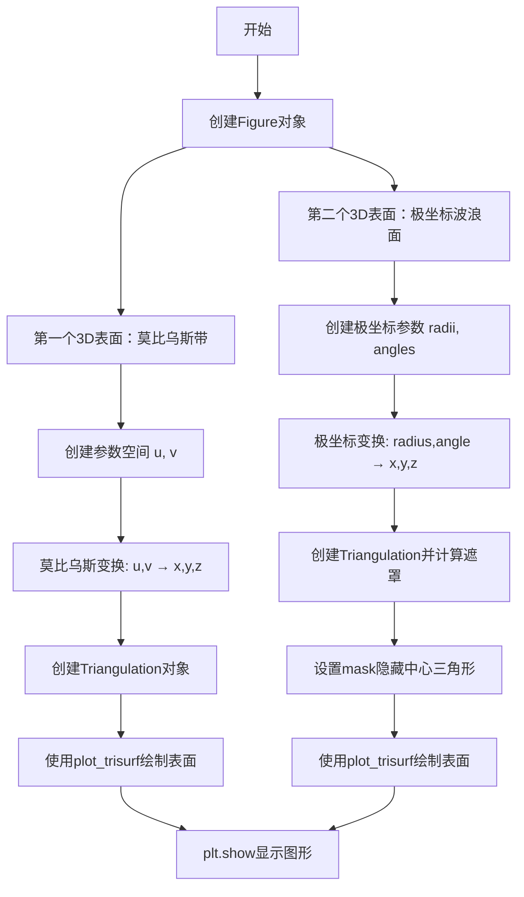
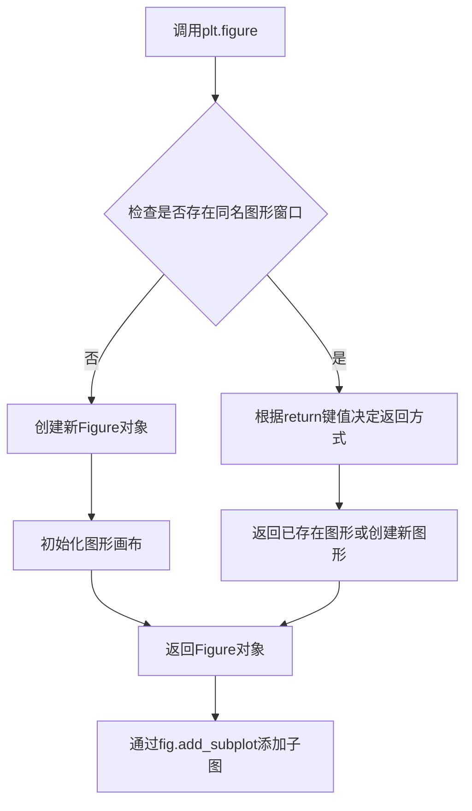
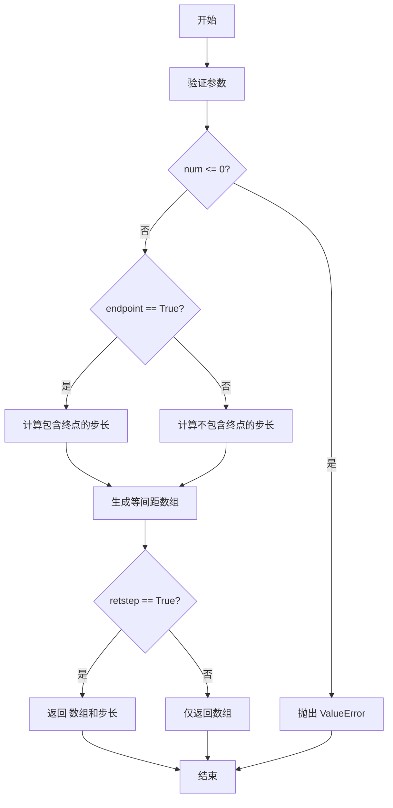
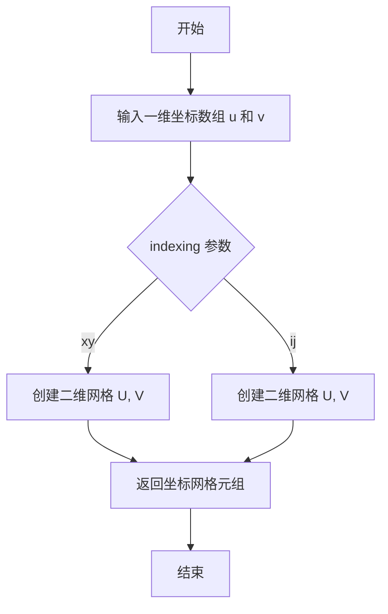
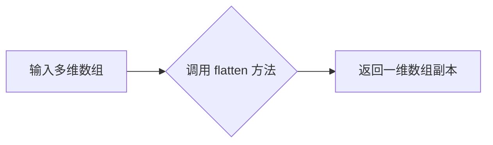
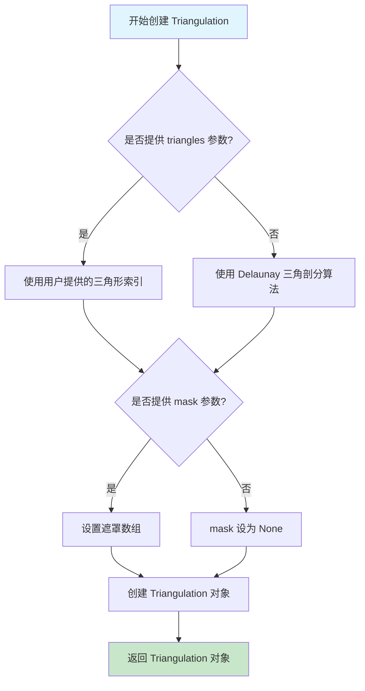
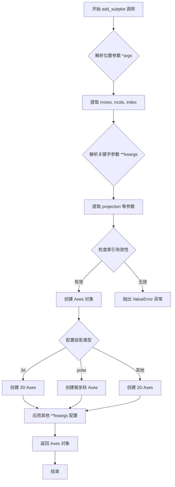
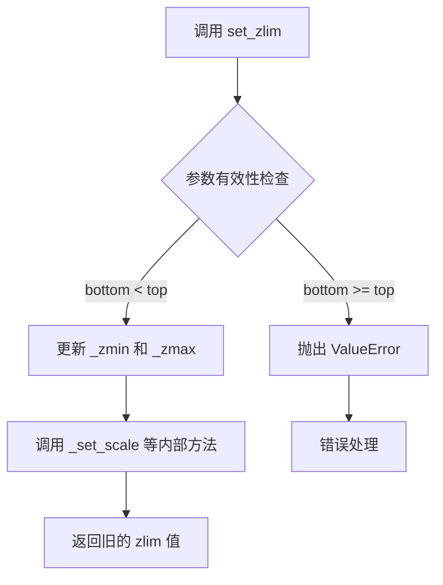
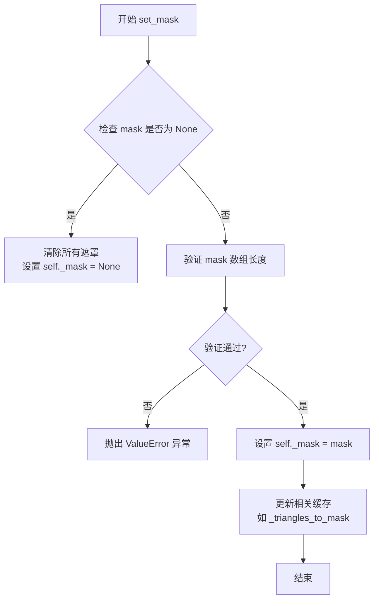
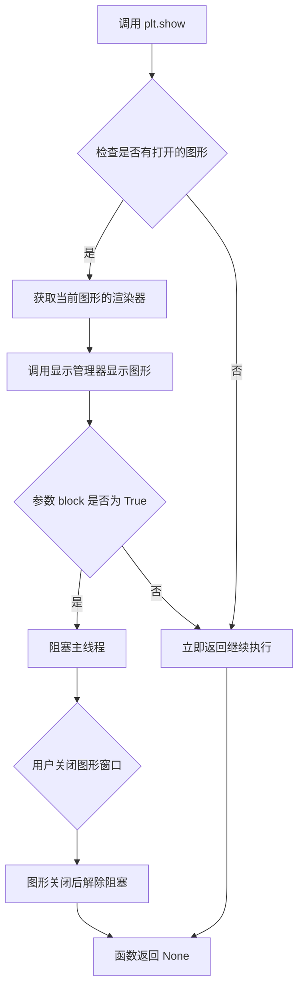

# `matplotlib\galleries\examples\mplot3d\trisurf3d_2.py` 详细设计文档

这是一个matplotlib官方文档示例代码，演示了如何使用plot_trisurf函数绘制两个不同的3D三角网格表面：第一个是通过莫比乌斯带参数化创建的曲面，第二个是通过极坐标参数化创建的带遮罩的波浪形曲面。

## 整体流程



## 类结构

```
此代码为脚本式示例，无自定义类
主要使用 matplotlib.tri.Triangulation (库类)
主要使用 matplotlib.pyplot (库模块)
主要使用 numpy (库模块)
```

## 全局变量及字段


### `fig`
    
matplotlib Figure对象，用于容纳所有子图

类型：`matplotlib.figure.Figure`
    


### `u`
    
第一个示例的水平方向参数数组，范围从0到2π

类型：`numpy.ndarray`
    


### `v`
    
第一个示例的垂直方向参数数组，范围从-0.5到0.5

类型：`numpy.ndarray`
    


### `x`
    
第一个/第二个示例的3D x坐标，通过Mobius映射或极坐标计算得到

类型：`numpy.ndarray`
    


### `y`
    
第一个/第二个示例的3D y坐标，通过Mobius映射或极坐标计算得到

类型：`numpy.ndarray`
    


### `z`
    
第一个/第二个示例的3D z坐标，通过Mobius映射或极坐标计算得到

类型：`numpy.ndarray`
    


### `tri`
    
第一个示例的Triangulation对象，用于三角网格化参数空间

类型：`matplotlib.tri.Triangulation`
    


### `ax`
    
第一个3D坐标轴对象，用于绘制第一个Mobius带表面图

类型：`matplotlib.axes._axes.Axes`
    


### `n_angles`
    
第二个示例的角度数量，设置为36

类型：`int`
    


### `n_radii`
    
第二个示例的半径数量，设置为8

类型：`int`
    


### `min_radius`
    
第二个示例的最小半径，用于遮罩计算

类型：`float`
    


### `radii`
    
第二个示例的半径数组，从min_radius到0.95的线性间隔

类型：`numpy.ndarray`
    


### `angles`
    
第二个示例的角度数组，从0到2π（不含端点）

类型：`numpy.ndarray`
    


### `triang`
    
第二个示例的Triangulation对象，用于Delaunay三角剖分

类型：`matplotlib.tri.Triangulation`
    


### `xmid`
    
三角形中心x坐标数组，通过三角形顶点平均计算，用于遮罩判断

类型：`numpy.ndarray`
    


### `ymid`
    
三角形中心y坐标数组，通过三角形顶点平均计算，用于遮罩判断

类型：`numpy.ndarray`
    


### `mask`
    
布尔数组，用于隐藏中心区域三角形（半径小于min_radius的三角形）

类型：`numpy.ndarray`
    


    

## 全局函数及方法


### `plt.figure`

创建图形窗口，用于后续绘制图表。在本代码中用于初始化一个Figure对象，以便添加子图进行3D表面绘图。

参数：

- `figsize`：`tuple` (宽度, 高度)，指定图形的宽和高（英寸），本例中使用 `plt.figaspect(0.5)` 计算得到宽高比为0.5的尺寸
- `**kwargs`：其他可选参数，如dpi、facecolor、edgecolor等，用于进一步配置图形属性

返回值：`matplotlib.figure.Figure`，返回新创建的图形对象，后续可通过其方法添加子图

#### 流程图



#### 带注释源码

```python
# 创建图形窗口，设置宽高比为0.5（宽度是高度的一半）
# figsize参数指定图形的尺寸，格式为(宽度, 高度)单位为英寸
# 返回一个Figure对象，用于后续添加子图和绘图
fig = plt.figure(figsize=plt.figaspect(0.5))

# figaspect(0.5)计算得到适合当前显示器的尺寸
# 使得图形的宽度是高度的一半，保持适当的宽高比例
# 返回的fig对象将用于承载所有的子图（subplots）
```


### `np.linspace`

`np.linspace` 是 NumPy 库中的一个函数，用于创建等间距的数值序列（数组）。它在数值计算中常用于生成测试数据、坐标轴、参数空间等场景。

参数：

- `start`：`float`，序列的起始值
- `stop`：`float`，序列的结束值（当 `endpoint=True` 时包含该值）
- `num`：`int`，生成的样本数量，默认为 50
- `endpoint`：`bool`，可选，是否包含 `stop` 值，默认为 True
- `retstep`：`bool`，可选，如果为 True，则返回 (samples, step)，默认为 False
- `dtype`：`dtype`，可选，输出数组的数据类型

返回值：`ndarray`，返回指定数量的等间距数值组成的数组

#### 流程图



#### 带注释源码

```python
def linspace(start, stop, num=50, endpoint=True, retstep=False, dtype=None, axis=0):
    """
    返回指定间隔内均匀间隔的数字。
    
    参数:
        start: 序列的起始值
        stop: 序列的结束值（当endpoint=True时包含）
        num: 生成样本的数量，默认为50
        endpoint: 默认为True，包含stop值
        retstep: 默认为False，如果为True则返回samples和step
        dtype: 输出数组的数据类型
        axis: 结果数组中创建样本的轴（默认为0）
    
    返回:
        samples: num个等间距的样本
        step: 仅当retstep=True时返回，表示样本之间的间距
    """
    # 验证num参数
    if num <= 0:
        return np.empty(0, dtype=dtype)
    
    # 计算步长
    if endpoint:
        step = (stop - start) / (num - 1) if num > 1 else 0.0
    else:
        step = (stop - start) / num
    
    # 生成数组
    y = np.arange(num, dtype=dtype) * step + start
    
    # 处理endpoint情况
    if endpoint and num > 1:
        y[-1] = stop
    
    # 处理retstep返回值
    if retstep:
        return y, step
    else:
        return y
```

#### 代码中的实际使用示例

```python
# 示例1：创建从0到2π的50个等间距点（包含终点）
u = np.linspace(0, 2.0 * np.pi, endpoint=True, num=50)

# 示例2：创建从-0.5到0.5的10个等间距点（包含终点）
v = np.linspace(-0.5, 0.5, endpoint=True, num=10)

# 示例3：创建从min_radius到0.95的8个等间距点（包含终点）
radii = np.linspace(min_radius, 0.95, n_radii)

# 示例4：创建从0到2π的36个等间距点（不包含终点）
angles = np.linspace(0, 2*np.pi, n_angles, endpoint=False)
```

#### 技术债务和优化空间

1. **参数验证**：实际 NumPy 实现中包含更多边界情况处理
2. **性能优化**：对于大规模数组生成，可考虑使用更高效的向量化实现
3. **精度问题**：浮点数运算可能累积误差，极端情况下可考虑使用 Decimal 或分数运算


### `np.meshgrid`

创建坐标网格矩阵，用于获取坐标向量数组的所有组合。在代码中用于生成 u 和 v 的网格坐标，以便后续计算 Möbius 带表面的坐标点。

参数：

- `u`：`ndarray`，一维数组，表示第一个坐标轴的值，由 `np.linspace` 生成，范围为 0 到 2π
- `v`：`ndarray`，一维数组，表示第二个坐标轴的值，由 `np.linspace` 生成，范围为 -0.5 到 0.5
- `indexing`：`str`（可选），默认为 `'xy'`，表示使用的索引顺序（'xy' 为笛卡尔坐标，'ij' 为矩阵索引）

返回值：`tuple of ndarrays`，返回两个二维数组（U, V），其中 U 是沿 x 轴重复的网格，V 是沿 y 轴重复的网格。

#### 流程图



#### 带注释源码

```python
# 定义一维坐标数组
u = np.linspace(0, 2.0 * np.pi, endpoint=True, num=50)  # 生成0到2π的50个点
v = np.linspace(-0.5, 0.5, endpoint=True, num=10)       # 生成-0.5到0.5的10个点

# 使用 meshgrid 创建二维网格坐标
# 默认 indexing='xy'，生成形状为 (len(v), len(u)) 的网格
u, v = np.meshgrid(u, v)

# 展平为一维数组用于后续计算
u, v = u.flatten(), v.flatten()
```


### `flatten`

该函数是 NumPy 数组对象的方法，用于将多维数组展平为一维数组，返回一个副本。在代码中用于将网格生成的多维数组转换为一维数组，以适应绘图函数的需求。

参数：

- `order`：可选，字符串类型，指定展平顺序，默认为 'C'（按行优先）。代码中未指定，使用默认值。

返回值：`numpy.ndarray`，返回展平后的一维数组。

#### 流程图



#### 带注释源码

```python
# 在代码中，u 和 v 是通过 meshgrid 生成的多维数组
u = np.linspace(0, 2.0 * np.pi, endpoint=True, num=50)
v = np.linspace(-0.5, 0.5, endpoint=True, num=10)
u, v = np.meshgrid(u, v)  # u 和 v 现在是二维数组

# 使用 flatten 方法将二维数组展平为一维，用于后续绘图
u, v = u.flatten(), v.flatten()
# 同样，x, y, z 也是通过类似方式展平
x = (1 + 0.5 * v * np.cos(u / 2.0)) * np.cos(u)
y = (1 + 0.5 * v * np.cos(u / 2.0)) * np.sin(u)
z = 0.5 * v * np.sin(u / 2.0)

# 在第二个示例中，也有类似的调用
x = (radii*np.cos(angles)).flatten()
y = (radii*np.sin(angles)).flatten()
z = (np.cos(radii)*np.cos(3*angles)).flatten()
```


# mtri.Triangulation 类详细设计文档

## 1. 概述

`mtri.Triangulation` 是 matplotlib 中用于创建三角剖分（Triangulation）对象的核心类，它将二维点集转换为可由 `plot_trisurf` 等函数使用的三角形网格结构。该类支持通过指定坐标点自动进行 Delaunay 三角剖分，也可通过 `triangles` 参数手动定义三角形连接关系，并提供了遮罩（mask）功能以排除不需要的三角形。

## 2. 文件整体运行流程

```
┌─────────────────────────────────────────────────────────────┐
│                     代码执行流程                              │
├─────────────────────────────────────────────────────────────┤
│  1. 初始化 matplotlib 图表 (plt.figure)                       │
│         ↓                                                    │
│  2. 第一部分：Mobius 带状曲面                                  │
│     ├── 生成参数空间网格 (u, v)                                │
│     ├── 应用 Mobius 映射转换为 3D 坐标 (x, y, z)              │
│     ├── 创建 Triangulation 对象 (u, v)                       │
│     └── 使用 plot_trisurf 绘制曲面                           │
│         ↓                                                    │
│  3. 第二部分：圆形曲面                                         │
│     ├── 生成极坐标网格 (radii, angles)                        │
│     ├── 转换为笛卡尔坐标 (x, y, z)                            │
│     ├── 创建 Triangulation 对象 (x, y)                       │
│     ├── 计算遮罩排除中心区域                                  │
│     ├── 应用遮罩 set_mask()                                  │
│     └── 使用 plot_trisurf 绘制曲面                           │
│         ↓                                                    │
│  4. 显示图表 (plt.show())                                     │
└─────────────────────────────────────────────────────────────┘
```

## 3. 类详细信息

### 3.1 mtri.Triangulation 类

#### 类字段

| 字段名称 | 类型 | 描述 |
|---------|------|------|
| `x` | ndarray | 二维坐标点的 x 坐标数组 |
| `y` | ndarray | 二维坐标点的 y 坐标数组 |
| `triangles` | ndarray | 三角形索引数组，形状为 (n_triangles, 3) |
| `mask` | ndarray 或 None | 布尔数组，用于遮罩不需要的三角形 |
| `is_delaunay` | bool | 标记是否使用 Delaunay 三角剖分生成 |

#### 类方法

| 方法名称 | 功能描述 |
|---------|---------|
| `__init__` | 构造函数，创建三角剖分对象 |
| `set_mask` | 设置遮罩数组，排除特定三角形 |
| `get_masked_triangles` | 获取遮罩后的三角形数组 |
| `calculate_plane_coefficients` | 计算三角形平面系数 |
| `get_edges` | 获取所有边的列表 |

### 3.2 全局变量和全局函数

| 名称 | 类型 | 描述 |
|------|------|------|
| `plt` | matplotlib.pyplot | matplotlib 绘图库导入 |
| `np` | numpy | 数值计算库导入 |
| `mtri` | matplotlib.tri | matplotlib 三角剖分子模块 |
| `fig` | Figure | matplotlib 图形对象 |
| `ax` | Axes3D | 3D 坐标轴对象 |

## 4. Triangulation 构造函数详细设计

### `mtri.Triangulation.__init__`

创建三角剖分对象，将二维点集转换为三角形网格

#### 参数

-  `x`：`ndarray`，一维数组，表示二维点的 x 坐标
-  `y`：`ndarray`，一维数组，表示二维点的 y 坐标
-  `triangles`：`ndarray`，可选参数，二维数组，形状为 (n_triangles, 3)，指定三角形的顶点索引
-  `mask`：`ndarray`，可选参数，一维布尔数组，指定需要排除的三角形

#### 返回值

`Triangulation` 对象，包含以下属性：
-  `x`：输入的 x 坐标数组
-  `y`：输入的 y 坐标数组
-  `triangles`：三角形索引数组
-  `mask`：遮罩数组（如果设置）

#### 流程图



#### 带注释源码

```python
# 创建 Triangulation 对象 - 方式一：使用参数空间坐标
# u, v 是参数化空间的坐标数组
u = np.linspace(0, 2.0 * np.pi, endpoint=True, num=50)  # u: 0 到 2π，50个点
v = np.linspace(-0.5, 0.5, endpoint=True, num=10)      # v: -0.5 到 0.5，10个点
u, v = np.meshgrid(u, v)                                # 创建网格
u, v = u.flatten(), v.flatten()                         # 展平为一维数组

# 使用 Mobius 映射将 (u, v) 转换为 3D 坐标 (x, y, z)
x = (1 + 0.5 * v * np.cos(u / 2.0)) * np.cos(u)
y = (1 + 0.5 * v * np.cos(u / 2.0)) * np.sin(u)
z = 0.5 * v * np.sin(u / 2.0)

# 创建 Triangulation 对象 - 基于参数空间坐标
tri = mtri.Triangulation(u, v)


# 创建 Triangulation 对象 - 方式二：使用笛卡尔坐标
# 定义极坐标网格
n_angles = 36        # 角度方向采样点数
n_radii = 8          # 径向采样点数
min_radius = 0.25    # 最小半径
radii = np.linspace(min_radius, 0.95, n_radii)  # 半径数组

angles = np.linspace(0, 2*np.pi, n_angles, endpoint=False)
angles = np.repeat(angles[..., np.newaxis], n_radii, axis=1)
angles[:, 1::2] += np.pi/n_angles  # 交错角度偏移

# 转换为笛卡尔坐标
x = (radii*np.cos(angles)).flatten()
y = (radii*np.sin(angles)).flatten()
z = (np.cos(radii)*np.cos(3*angles)).flatten()

# 创建 Triangulation - 使用 Delaunay 三角剖分
triang = mtri.Triangulation(x, y)


# 使用 set_mask 方法遮罩三角形
# 计算每个三角形中心点
xmid = x[triang.triangles].mean(axis=1)
ymid = y[triang.triangles].mean(axis=1)

# 创建遮罩：排除中心圆形区域内的三角形
mask = xmid**2 + ymid**2 < min_radius**2
triang.set_mask(mask)  # 应用遮罩
```

## 5. 关键组件信息

| 组件名称 | 描述 |
|---------|------|
| `plot_trisurf` | 使用三角剖分绘制 3D 曲面图的函数 |
| `Delaunay 三角剖分` | matplotlib 内部使用的三角网格生成算法 |
| `Triangulation.triangles` | 存储三角形顶点索引的二维数组 |
| `Triangulation.mask` | 用于排除特定三角形的布尔数组 |

## 6. 潜在技术债务与优化空间

1. **性能考虑**：大规模点集上 Delaunay 三角剖分可能较慢，可考虑使用 `scipy.spatial.Delaunay` 的 Cython 实现作为替代
2. **内存占用**：保存完整的三角形索引可能占用大量内存，对于简单场景可以考虑即时计算
3. **边界情况**：对共线点或高度稀疏的点集，三角剖分结果可能不符合预期，缺乏健壮的错误提示
4. **API 一致性**：Delaunay 三角剖分的 mask 设置方式与手动指定 triangles 的方式存在差异，可能造成混淆

## 7. 其它项目

### 设计目标与约束
- **主要目标**：提供灵活的 2D 点到 3D 曲面三角网格的转换能力
- **约束**：输入坐标必须是一维数组，且长度必须一致

### 错误处理与异常设计
- 当 x 和 y 长度不同时抛出 `ValueError`
- 当 triangles 索引超出点范围时可能产生未定义行为
- Delaunay 剖分失败时可能抛出 `matplotlib.tri.TriangulationError`

### 数据流与状态机
```
输入坐标 (x, y) 
    → 验证坐标有效性 
    → 选择剖分策略 (手动 triangles / Delaunay) 
    → 生成三角形索引 
    → 可选：应用遮罩 
    → 输出 Triangulation 对象
```

### 外部依赖与接口契约
- 依赖 `numpy` 进行数值计算
- 依赖 `matplotlib.tri` 模块内部的 C++ 扩展 `_triangulation` 进行高效计算
- `plot_trisurf` 函数期望接收 Triangulation 对象或等效的 triangles 参数


### `Figure.add_subplot`

`fig.add_subplot` 是 Matplotlib 中 `Figure` 类的方法，用于在当前图形中添加一个子图（Axes）。它根据指定的位置参数（行数、列数、索引）和关键字参数（如投影类型）创建一个新的 Axes 对象，并返回该对象以便进一步配置和绘图。

参数：

- `*args`：`tuple` 或 `int`，位置参数，通常为三个整数 (nrows, ncols, index)，分别表示子图的行数、列数和当前子图的索引。索引从1开始，可以使用如 `111`、`'1,2,1'` 或 `(1, 2, 1)` 的形式。
- `projection`：`str`，可选关键字参数，指定子图的投影类型，如 `'3d'`（三维投影）、`'polar'`（极坐标投影）等。默认为 `None`（二维正交投影）。
- `**kwargs`：其他关键字参数，将传递给 `Axes` 的构造函数，用于配置Axes的各种属性，如标题、轴标签等。

返回值：`matplotlib.axes.Axes`，返回新创建的子图Axes对象，可用于在该子图上进行绘图操作。

#### 流程图



#### 带注释源码

```python
def add_subplot(self, *args, **kwargs):
    """
    在当前图形中添加一个子图。
    
    参数:
        *args: 位置参数，可以是:
            - 三个整数 (nrows, ncols, index): 行数, 列数, 子图索引
            - 一个三位数整数: 如 121 表示 1行2列的第1个
            - 一个三位数字符串: 如 '121'
        **kwargs: 关键字参数，用于配置 Axes，常见参数包括:
            - projection: 投影类型 ('3d', 'polar', None 等)
            - title: 子图标题
            - xlabel, ylabel: 轴标签
            - 等等
    
    返回:
        axes.Axes: 新创建的子图对象
    """
    # 1. 解析位置参数，确定子图布局和索引
    #    例如: add_subplot(1, 2, 1) 表示1行2列的第1个位置
    #    也可以直接使用三位数: add_subplot(121)
    
    # 2. 解析关键字参数，特别是 projection 参数
    #    projection='3d' 会创建一个三维坐标轴
    #    projection='polar' 会创建一个极坐标轴
    
    # 3. 根据解析的参数创建适当的 Axes 子类
    #    - 普通二维图: Axes
    #    - 三维图: Axes3D
    #    - 极坐标图: PolarAxes
    
    # 4. 应用其他关键字参数到新创建的 Axes
    #    例如设置标题、轴标签、图例等
    
    # 5. 返回创建的 Axes 对象，供后续绘图使用
    #    例如: ax.plot(x, y), ax.set_title('Title') 等
    
    # 注意: 这是 add_subplot 的概念性描述
    # 实际实现位于 Matplotlib 库中，代码更为复杂
    pass
```


### `Axes3D.plot_trisurf`

绘制三角网格表面（Triangular Surface），是matplotlib中用于从非结构化数据创建3D表面的核心方法。该函数接收x、y、z坐标数据或Triangulation对象，结合三角剖分信息将数据点连接成三角形面并渲染为3D曲面图。

参数：

- `X`：`array-like`，一维数组，表示3D曲面上点的x坐标
- `Y`：`array-like`，一维数组，表示3D曲面上点的y坐标
- `Z`：`array-like`，一维数组，表示3D曲面上点的z坐标（高度值）
- `triangles`：`array-like`，可选，整数数组，形状为(ntri, 3)，定义每个三角形的顶点索引
- `triangulation`：`matplotlib.tri.Triangulation`，可选，预创建的Triangulation对象，包含三角剖分信息
- `cmap`：`colormap`，可选，颜色映射，用于根据Z值着色曲面
- `linewidth`：`float`，可选，线条宽度，默认0（无边框）
- `antialiased`：`bool`，可选，是否启用抗锯齿
- ` shade`：`bool`，可选，是否应用阴影效果
- `**kwargs`：其他传递给`Poly3DCollection`的参数

返回值：`Poly3DCollection`，返回创建的3D多边形集合对象，可用于进一步自定义外观

#### 流程图

```mermaid
flowchart TD
    A[开始 plot_trisurf 调用] --> B{是否提供 triangulation 对象?}
    B -->|是| C[从 triangulation 获取三角顶点索引]
    B -->|否| D{是否提供 triangles 参数?}
    D -->|是| E[使用指定的 triangles 数组]
    D -->|否| F[使用默认 Delaunay 三角剖分]
    C --> G[验证 x, y, z 维度一致性]
    E --> G
    F --> G
    G --> H[将 (x, y, z) 坐标转换为顶点多边形列表]
    H --> I[创建 Poly3DCollection 对象]
    I --> J[应用 cmap 颜色映射]
    J --> K[设置 linewidth, antialiased, shade 等属性]
    K --> L[将集合添加到 Axes3D]
    L --> M[设置轴限制和标签]
    M --> N[返回 Poly3DCollection 对象]
```

#### 带注释源码

```python
# 代码中展示的两种调用方式：

# ========== 方式一：使用 triangles 参数 ==========
# 1. 创建参数空间网格
u = np.linspace(0, 2.0 * np.pi, endpoint=True, num=50)
v = np.linspace(-0.5, 0.5, endpoint=True, num=10)
u, v = np.meshgrid(u, v)
u, v = u.flatten(), v.flatten()

# 2. 应用 Möbius 映射将 (u,v) 转换为 (x,y,z)
x = (1 + 0.5 * v * np.cos(u / 2.0)) * np.cos(u)
y = (1 + 0.5 * v * np.cos(u / 2.0)) * np.sin(u)
z = 0.5 * v * np.sin(u / 2.0)

# 3. 创建 Triangulation 对象确定三角形连接
tri = mtri.Triangulation(u, v)

# 4. 调用 plot_trisurf，传入坐标和三角形索引
ax.plot_trisurf(x, y, z, triangles=tri.triangles, cmap="Spectral")

# ========== 方式二：使用 Triangulation 对象 ==========
# 1. 创建极坐标参数空间
n_angles = 36
n_radii = 8
min_radius = 0.25
radii = np.linspace(min_radius, 0.95, n_radii)
angles = np.linspace(0, 2*np.pi, n_angles, endpoint=False)
angles = np.repeat(angles[..., np.newaxis], n_radii, axis=1)
angles[:, 1::2] += np.pi/n_angles

# 2. 转换为笛卡尔坐标
x = (radii*np.cos(angles)).flatten()
y = (radii*np.sin(angles)).flatten()
z = (np.cos(radii)*np.cos(3*angles)).flatten()

# 3. 创建 Triangulation 并设置遮罩
triang = mtri.Triangulation(x, y)
xmid = x[triang.triangles].mean(axis=1)
ymid = y[triang.triangles].mean(axis=1)
mask = xmid**2 + ymid**2 < min_radius**2
triang.set_mask(mask)

# 4. 直接传入 Triangulation 对象
ax.plot_trisurf(triang, z, cmap="CMRmap")
```


### `Axes.set_zlim`

设置Z轴的显示范围，用于控制3D坐标图中Z轴的最小值和最大值。

参数：

- `bottom`：`float` 或 `int`，Z轴范围的底部边界（最小值）
- `top`：`float` 或 `int`，Z轴范围的顶部边界（最大值）
- `**kwargs`：其他关键字参数，如`emit`（是否通知观察者变化）等

返回值：`tuple`，返回旧的Z轴范围 `(old_min, old_max)`

#### 流程图



#### 带注释源码

```python
# 在示例代码中的调用方式
ax.set_zlim(-1, 1)

# 方法签名（简化版）
def set_zlim(self, bottom=None, top=None, emit=False, auto=False, **kwargs):
    """
    设置Z轴的范围
    
    Parameters
    ----------
    bottom : float
        Z轴底部（最小）值
    top : float
        Z轴顶部（最大）值
    emit : bool
        是否通知观察者范围已更改
    auto : bool
        是否自动调整范围
    
    Returns
    -------
    tuple
        旧的 (bottom, top) 范围值
    """
    # ... 方法实现（位于 matplotlib 库中）
```


### `Triangulation.set_mask`

设置三角形遮罩，用于在绘制三角形网格时隐藏不需要的三角形。该方法通过接收一个布尔数组（或 None），标记哪些三角形应该被排除在渲染之外。

参数：

- `mask`：`numpy.ndarray` 或 `None`，布尔数组，指定要遮罩的三角形索引。值为 `True` 表示对应的三角形将被隐藏，`False` 表示显示。如果为 `None`，则移除所有遮罩。

返回值：`None`，该方法直接修改 Triangulation 对象的内部状态，不返回任何值。

#### 流程图



#### 带注释源码

```python
def set_mask(self, mask):
    """
    Set the triangulation mask array.

    Parameters
    ----------
    mask : array-like or None
        Boolean mask array which specifies the triangles to be hidden.
        True values indicate that the corresponding triangle will be hidden.
        If None, all triangles are shown.

    Examples
    --------
    >>> import matplotlib.tri as mtri
    >>> import numpy as np
    >>> x = [0, 1, 2, 0, 1, 2]
    >>> y = [0, 0, 0, 1, 1, 1]
    >>> triangles = [[0, 1, 3], [1, 4, 3], [1, 2, 4], [3, 4, 5]]
    >>> triang = mtri.Triangulation(x, y, triangles)
    >>> mask = [True, False, True, False]  # 隐藏第一个和第三个三角形
    >>> triang.set_mask(mask)
    """
    # 如果 mask 为 None，清除所有遮罩
    if mask is None:
        self._mask = None
        self._triangles_to_mask = None
    else:
        # 将输入转换为布尔数组
        mask = np.array(mask, dtype=bool)
        
        # 验证 mask 长度是否与三角形数量匹配
        if mask.shape[0] != self._triangles.shape[0]:
            raise ValueError(
                f"mask length {mask.shape[0]} does not match "
                f"number of triangles {self._triangles.shape[0]}"
            )
        
        # 设置内部遮罩属性
        self._mask = mask
        
        # 预计算三角形索引到遮罩的映射，用于优化
        if self._mask is not None:
            self._triangles_to_mask = np.where(self._mask)[0]
        else:
            self._triangles_to_mask = None
```


### `plt.show`

显示图形函数是 Matplotlib 库的核心输出函数，用于将当前所有打开的图形窗口渲染并显示到屏幕上。该函数会激活图形交互式显示，阻塞程序执行（除非设置 block=False），直到用户关闭图形窗口或程序结束。在示例代码中，plt.show() 负责将前面通过 plot_trisurf() 创建的两个 3D 三角网格表面图最终呈现给用户。

参数：

- `block`：`bool`，可选参数，控制是否阻塞程序执行直到图形窗口关闭。默认为 True，在交互式模式下会阻塞；在非交互式后端可能行为不同。

返回值：`None`，该函数仅用于显示图形，不返回任何值。

#### 流程图



#### 带注释源码

```python
def show(*, block=None):
    """
    Display all open figures.
    
    This function is designed to display all open figure windows on the user's
    screen. It works with the current backend to render and show the figures.
    
    Parameters
    ----------
    block : bool, optional
        If True, block until all figures are closed (the default).
        If False, display figures but do not block.
        If None, block only in interactive mode.
    
    Returns
    -------
    None
    
    Examples
    --------
    >>> import matplotlib.pyplot as plt
    >>> plt.plot([1, 2, 3], [1, 4, 9])
    >>> plt.show()  # 阻塞直到用户关闭窗口
    
    >>> plt.show(block=False)  # 不阻塞，立即返回
    """
    # 获取全局图形管理器
    global _show_backend
    
    # 检查是否有打开的图形
    figs = get_figids()  # 获取所有打开的图形ID
    
    if not figs:
        # 如果没有打开的图形，直接返回
        return
    
    # 根据block参数决定是否阻塞
    if block is None:
        # 默认行为：根据交互模式决定
        block = rcParams['interactive']
    
    # 调用后端显示函数
    for manager in get_all_fig_managers():
        # 获取后端显示管理器
        backend = manager.canvas.manager
        
        # 调用后端的show方法
        backend.show()
        
        # 如果后端支持，更新图形
        manager.canvas.draw_idle()
    
    # 如果需要阻塞，等待图形关闭
    if block:
        # 在交互式后端中，这通常会启动事件循环
        # 并阻塞直到所有图形窗口关闭
        _wait_for_manager()
    
    return None
```

## 关键组件


### 参数空间网格生成

使用np.linspace和np.meshgrid生成u、v参数空间网格，并通过flatten()展平为1D数组，为后续三角剖分和3D坐标映射做准备。

### Mobius映射变换

将参数空间中的(u,v)坐标对映射到三维空间(x,y,z)坐标的数学变换，生成Mobius带的表面数据。

### Triangulation三角剖分

使用matplotlib.tri.Triangulation类对参数空间进行三角剖分，生成三角形网格连接信息，是plot_trisurf绑定的核心数据结构。

### 三角形遮罩处理

通过计算三角形重心坐标(xmid, ymid)，利用set_mask方法屏蔽半径小于min_radius的内部三角形，实现选择性渲染。

### plot_trisurf 3D表面绘制

matplotlib的核心3D绘图函数，接收x、y、z坐标和三角形索引信息，生成带色彩映射的三角网格表面图。

### 网格数据展平操作

使用flatten()方法将meshgrid生成的2D网格数据转换为1D数组，满足Triangulation和plot_trisurf的输入格式要求。


## 问题及建议


### 已知问题

-   **硬编码参数过多**：num=50、num=10、n_angles=36、n_radii=8、min_radius=0.25等参数直接写在代码中，降低了代码的可维护性和可复用性
-   **魔法数字缺乏解释**：0.5、0.95、np.pi/n_angles等数值缺乏注释说明其含义和来源
-   **变量名重复使用**：x、y、z变量在两个绘图部分被重复赋值，没有使用有区分度的命名，容易造成混淆
-   **缺少参数验证**：没有对输入参数（如num、n_angles、min_radius）进行有效性检查
-   **代码重复**：两个子图的创建流程（创建figure、添加subplot、绘图、设置属性）有重复模式
-   **文档不完整**：模块级docstring较为简单，函数和类缺乏详细文档

### 优化建议

-   将关键参数（如网格密度、半径范围、角度数等）提取为常量或配置文件
-   为重要的数值参数添加注释说明其数学意义
-   使用更明确的变量命名，如将第一个图的坐标命名为x1/y1/z1，第二个图为x2/y2/z2
-   封装绘图逻辑为函数，接收参数以提高复用性
-   添加参数范围检查和异常处理
-   为matplotlib的3D绘图方法添加类型注解提高代码健壮性
-   考虑将colormap名称也参数化，便于主题切换


## 其它


### 设计目标与约束

本代码示例旨在演示matplotlib库中plot_trisurf函数在绘制3D三角网格表面时的两种典型用法：第一种通过显式指定三角形索引数组绘制参数化曲面（如Mobius带），第二种通过Triangulation对象结合遮罩（mask）过滤不需要的三角形。设计约束包括：依赖matplotlib、numpy两个核心库；图形输出依赖后端渲染能力；数据点数量影响渲染性能；需要正确设置3D投影。

### 错误处理与异常设计

代码中未显式包含try-except异常处理块，错误主要来源于：numpy维度不匹配（如meshgrid后flatten数量不一致）、Triangulation创建时点数过少无法形成有效三角网格、mask数组维度与三角形数量不匹配导致set_mask失败、matplotlib后端不可用或内存不足导致图形渲染失败。建议在实际应用中添加参数验证和数据合法性检查。

### 数据流与状态机

数据流分为两个独立分支：第一分支（左侧图）u、v参数空间经meshgrid生成网格 → flatten展平 → Mobius变换映射到x、y、z坐标 → Triangulation构建三角网格 → plot_trisurf渲染；第二分支（右侧图）radii和angles数组 → 极坐标到笛卡尔坐标变换 → 自动Delaunay三角化 → 计算三角形中心坐标 → 构建mask过滤 → plot_trisurf渲染。无复杂状态机，仅plt.show()触发最终渲染。

### 外部依赖与接口契约

核心依赖包括：matplotlib.pyplot（图形窗口和 axes 创建）、matplotlib.tri.Triangulation（三角网格构建）、numpy（数值计算、数组操作、meshgrid）。接口契约方面：plot_trisurf接受(x, y, z)坐标数组和triangles参数或Triangulation对象；Triangulation构造函数接受(x, y)坐标数组，可选mask参数；set_mask接受布尔数组，长度须等于三角形数量。

### 性能考虑与优化空间

当前代码在数据量较小时运行正常，但存在优化空间：u、v网格使用50×10=500点，x、y、z展平后为500个点，三角形约958个，性能开销较小。若增加点数（如u方向增至200以上），可考虑预先计算三角形索引并缓存；mask计算中xmid、ymid重复计算可向量化优化；多子图渲染时可考虑共享部分计算结果。当前实现无明显性能瓶颈。

### 可维护性与扩展性

代码结构清晰但作为示例脚本，缺乏模块化封装。若要扩展支持更多3D表面类型，建议：将参数化方程抽取为函数、将Triangulation构建逻辑封装为类、添加配置参数（如颜色映射、视角、坐标轴范围）统一管理。当前硬编码的cmap参数（Spectral、CMRmap）和固定zlim（-1, 1）可通过参数化提升灵活性。

### 版本兼容性

代码使用Python 3语法（类型注解隐式），兼容Python 3.6+；matplotlib推荐使用3.0以上版本以获得完整3D绘图功能；numpy推荐1.16以上版本确保所有数组操作兼容。plot_trisurf的triangles参数在旧版本中可能行为略有差异。

### 配置与参数说明

关键可配置参数包括：u、v网格分辨率（num参数）决定曲面精度；cmap颜色映射决定视觉风格；figsize控制图形尺寸；min_radius决定右侧图的孔洞大小；n_angles和n_radii决定第二图的网格密度。这些参数可根据具体可视化需求调整。


    