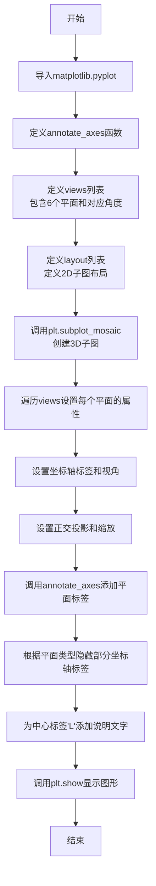
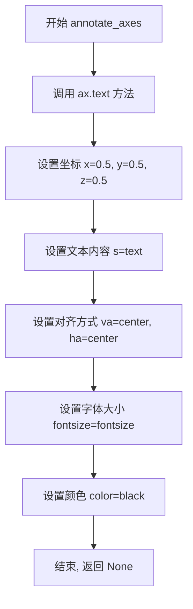

# `matplotlib\galleries\examples\mplot3d\view_planes_3d.py` 详细设计文档

该代码使用matplotlib创建一个「展开」的3D图，展示六个主3D视图平面（XY、XZ、YZ及其负向平面），每个平面标注了对应的仰角(elev)、方位角(azim)和滚转角(roll)角度，可用于打印并折叠成盒子。

## 整体流程



## 类结构

```
无自定义类
使用matplotlib内置类：
Figure (.figure对象)
└── Axes3D (子图集合axd字典)
```

## 全局变量及字段


### `views`
    
定义6个主要3D视图平面的名称和对应的视角参数（仰角、方位角、滚转角）

类型：`List[Tuple[str, Tuple[int, int, int]]]`
    


### `layout`
    
定义子图的网格布局，用于plt.subplot_mosaic创建多子图

类型：`List[List[str]]`
    


### `fig`
    
Matplotlib生成的图形对象，包含所有子图

类型：`matplotlib.figure.Figure`
    


### `axd`
    
存储各个3D视图平面的坐标轴对象字典，键为平面名

类型：`Dict[str, matplotlib.axes._axes.Axes]`
    


    

## 全局函数及方法


### `annotate_axes`

在3D坐标轴的中心位置（坐标0.5, 0.5, 0.5）添加文本注释，无返回值。

参数：

- `ax`：`axes对象`，matplotlib的3D坐标轴对象
- `text`：`str`，要显示的文本内容
- `fontsize`：`int`，默认值18，字体大小

返回值：`None`，无返回值

#### 流程图



#### 带注释源码

```python
def annotate_axes(ax, text, fontsize=18):
    """
    在3D坐标轴中心添加文本注释
    
    参数:
        ax: matplotlib的3D坐标轴对象
        text: 要显示的文本内容
        fontsize: 字体大小,默认值为18
    """
    # 使用ax.text方法在3D坐标空间中添加文本
    # x, y, z: 文本在3D空间中的位置 (0.5, 0.5, 0.5) 即中心位置
    # s: 文本字符串内容
    # va: 垂直对齐方式, "center" 表示垂直居中
    # ha: 水平对齐方式, "center" 表示水平居中
    # fontsize: 字体大小
    # color: 文本颜色设置为黑色
    ax.text(x=0.5, y=0.5, z=0.5, s=text,
            va="center", ha="center", fontsize=fontsize, color="black")
```

## 关键组件


### annotate_axes 函数

用于在3D坐标轴中心添加文本注释的辅助函数，接收轴对象、文本内容和字体大小参数。

### views 列表

定义6个主3D视图平面（XY、XZ、YZ及其负向视图）所需的仰角(elev)、方位角(azim)和滚转角(roll)参数。

### layout 矩阵

使用字符串矩阵定义子图Mosaic布局，指定各视图平面在画布上的排列位置。

### fig, axd 变量

通过plt.subplot_mosaic创建的图形对象和子图字典，配置3D投影类型和图形尺寸(12x8.5英寸)。

### 视图配置循环

为每个平面设置xyz轴标签、正投影类型('ortho')、视角参数和盒子缩放比例(zoom=1.25)，并生成包含平面名和角度值的标签。

### 坐标轴标签隐藏逻辑

根据不同视图平面隐藏不需要的坐标轴标签：XY平面隐藏z轴，XZ平面隐藏y轴，YZ平面隐藏x轴，以模拟"展开"的3D盒子效果。

### L 标签位置

在布局中的特定位置添加总标题"mplot3d primary view planes"，说明ax.view_init参数的用途，并关闭该子图的坐标轴显示。


## 问题及建议


### 已知问题

- **硬编码的布局配置**：`layout`列表的表示方式不够直观，`.`表示空白的约定不够明确，可维护性较差
- **魔法数字和硬编码值**：如`figsize=(12, 8.5)`、`fontsize=18/14`、`zoom=1.25`等数值散布在代码中，缺乏统一配置
- **重复代码模式**：设置坐标轴属性的代码（`set_xlabel`、`set_ylabel`、`set_zlabel`、`view_init`等）在循环中重复出现
- **缺乏错误处理**：未检查`axd`字典是否包含所有必需的键（如'L'），若布局变更可能导致KeyError
- **代码模块化不足**：`annotate_axes`作为独立函数定义，但与具体的坐标轴操作耦合，未封装为可复用的组件
- **注释不一致**：代码中注释提到"fold it into a box"，但实际未实现任何折叠逻辑，可能造成误导
- **视图角度与标签显示顺序**：`views`元组顺序为`(elev, azim, roll)`，但标签显示顺序可能导致用户困惑

### 优化建议

- 将所有配置参数（视图角度、布局定义、样式参数）提取到顶部常量或配置字典中
- 封装重复的坐标轴设置逻辑为辅助函数，如`configure_axis(ax, plane, angles)`
- 为`layout`和`views`添加类型注解和数据验证，确保布局与视图定义一致
- 添加错误处理逻辑，检查必要的键是否存在，提供有意义的错误信息
- 考虑将`annotate_axes`功能集成到配置函数中，减少全局函数定义
- 将文档注释完善，说明布局中`.`的含义和具体折叠实现方式（如适用）

## 其它


### 设计目标与约束

本示例的设计目标是生成一个"展开"的3D图，展示每个主3D视图平面（XY、XZ、YZ及其负向平面），并标注每个视图所需的仰角(elevation)、方位角(azimuth)和滚转角(roll)角度。用户可以将生成的图像打印出来并折叠成一个盒子，每个平面形成盒子的一面。约束条件：使用matplotlib的subplot_mosaic布局，需要matplotlib版本支持3D子图和正交投影类型。

### 错误处理与异常设计

代码本身的错误处理较为简单，主要依赖matplotlib的异常机制。可能的异常情况包括：1) plt.subplot_mosaic不支持3D投影的版本兼容性问题；2) views列表中的平面名称与layout不匹配导致的KeyError；3) set_proj_type('ortho')方法在某些matplotlib版本中不存在。建议添加版本检查和异常捕获机制，确保代码在不同版本的matplotlib中都能优雅降级或给出明确的错误提示。

### 数据流与状态机

数据流主要分为三个阶段：初始化阶段创建Figure和Axes字典；配置阶段为每个平面设置标签、投影类型、视角和纵横比；后处理阶段根据平面类型隐藏不需要的坐标轴标签。状态机方面，代码没有复杂的状态管理，主要状态是各个3D axes对象的配置状态，通过遍历views列表和不同的平面分组来应用不同的配置。

### 外部依赖与接口契约

主要外部依赖是matplotlib库，具体需要matplotlib 3.4.0及以上版本以支持subplot_mosaic和set_proj_type方法。接口契约包括：annotate_axes函数接收ax对象、文本内容和字体大小参数，返回None；views列表包含6个元组，每个元组由平面名称字符串和角度三元组(elev, azim, roll)组成；layout是3x4的列表结构，用于定义子图布局。

### 性能考虑

当前实现性能良好，因为只是静态绘图没有动画或实时交互。主要性能开销在于创建6个3D子图和设置正交投影。如果需要扩展到更多平面，可以考虑按需渲染或使用静态缓存。figsize=(12, 8.5)的设置适中，不会产生过大的内存消耗。

### 可维护性与扩展性

代码的可维护性较好，结构清晰。扩展建议：1) 可以将views和layout定义为配置常量，便于修改；2) 可以将平面分组逻辑抽象为配置字典，避免多次遍历；3) 可以添加类型注解提高代码可读性；4) 可以将annotate_axes函数改为更通用的类或使用matplotlib的annotation功能。扩展方向包括：支持更多视角平面、自定义颜色主题、添加交互式控件等。

### 测试策略

由于这是一个示例脚本而非生产代码，测试相对简单。建议的测试策略包括：1) 验证views列表中所有平面名称都在layout中定义；2) 验证每个ax对象都正确初始化了3D投影；3) 验证set_proj_type调用成功；4) 验证最终生成的figure对象不为空。可以使用pytest-mpl进行图像回归测试，确保输出一致性。

### 配置与参数说明

关键配置参数包括：views列表定义6个平面及其对应视角；layout定义3x4的子图网格布局；figsize设置图形尺寸为12x8.5英寸；zoom=1.25设置轴纵横比缩放；各平面特定的刻度标签隐藏规则。字体大小参数：annotate_axes中的fontsize=14用于平面标签，fontsize=18用于中心标签。所有这些参数都可以通过函数参数化或配置文件进行外部化。

### 平台与兼容性

代码在Windows、Linux和macOS平台均可运行，只要安装了兼容版本的matplotlib。建议的matplotlib版本要求：>=3.4.0（支持subplot_mosaic和set_proj_type）。Python版本要求：>=3.6（支持f-string格式化）。代码不涉及平台特定的功能调用，具有良好的跨平台兼容性。

### 安全性考虑

代码本身不涉及用户输入、网络请求或敏感数据处理，安全性风险较低。唯一需要注意的是plt.show()会阻塞主线程，在某些GUI环境下可能需要使用plt.savefig()直接保存图像而非显示。代码中使用的字符串格式化不存在注入风险，因为都是内部定义的常量。

### 文档与注释规范

代码已包含docstring说明示例用途，注释清晰说明了(plane, (elev, azim, roll))的数据结构。建议补充的文档包括：1) 每个3D视图平面的视觉含义说明；2) 正交投影与透视投影的区别；3) 仰角、方位角和滚转角的定义及取值范围；4) 如何将打印输出折叠成盒子的操作说明。代码注释可以更加详细地解释set_box_aspect和zoom参数的交互效果。

    