# `matplotlib\galleries\examples\mplot3d\voxels_numpy_logo.py` 详细设计文档

This code generates a 3D voxel plot of the NumPy logo using matplotlib and numpy.

## 整体流程

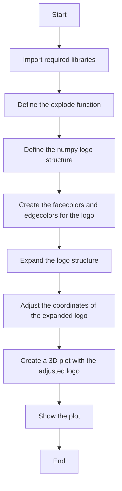

## 类结构

```
Explode (Function)
├── NumpyLogo (Function)
│   ├── Facecolors (Global variable)
│   ├── Edgecolors (Global variable)
│   └── Filled (Global variable)
│       ├── Explode (Function call)
│       └── Adjust coordinates (Function call)
└── Plotting (Function call)
```

## 全局变量及字段


### `data_e`
    
An array of zeros with twice the size of the original data, used to upscale the voxel image.

类型：`numpy.ndarray`
    


### `facecolors`
    
An array representing the face colors of the voxel plot, with True values corresponding to the specified color.

类型：`numpy.ndarray`
    


### `edgecolors`
    
An array representing the edge colors of the voxel plot, with True values corresponding to the specified color.

类型：`numpy.ndarray`
    


### `filled`
    
An array representing the filled status of the voxel plot, with True values indicating filled voxels.

类型：`numpy.ndarray`
    


### `filled_2`
    
An upscaled version of the filled array, used to create gaps in the voxel plot.

类型：`numpy.ndarray`
    


### `fcolors_2`
    
An upscaled version of the facecolors array, used to create gaps in the voxel plot.

类型：`numpy.ndarray`
    


### `ecolors_2`
    
An upscaled version of the edgecolors array, used to create gaps in the voxel plot.

类型：`numpy.ndarray`
    


### `x`
    
An array of x-coordinates for the voxel plot, adjusted to create gaps.

类型：`numpy.ndarray`
    


### `y`
    
An array of y-coordinates for the voxel plot, adjusted to create gaps.

类型：`numpy.ndarray`
    


### `z`
    
An array of z-coordinates for the voxel plot, adjusted to create gaps.

类型：`numpy.ndarray`
    


    

## 全局函数及方法


### explode(data)

This function takes a 3D boolean array and expands it by a factor of 2 in each dimension, filling the new spaces with zeros.

参数：

- `data`：`numpy.ndarray`，A 3D boolean array representing the original data to be expanded.

返回值：`numpy.ndarray`，An expanded 3D boolean array with dimensions twice as large as the input, filled with zeros except for the original data positions.

#### 流程图

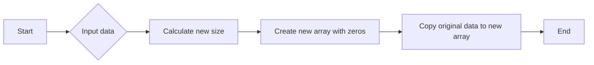

#### 带注释源码

```python
def explode(data):
    # Calculate the new size by doubling the dimensions of the input data
    size = np.array(data.shape) * 2
    
    # Create a new array with zeros, one less than the new size in each dimension
    data_e = np.zeros(size - 1, dtype=data.dtype)
    
    # Copy the original data to the new array at the correct positions
    data_e[::2, ::2, ::2] = data
    
    # Return the expanded array
    return data_e
```


### explode(data)

创建一个与输入数据相同形状的数组，但每个维度的大小翻倍，并将原始数据放置在新的数组中对应位置的一半。

参数：

- `data`：`numpy.ndarray`，输入数据数组，其值将被复制到新数组中。

返回值：`numpy.ndarray`，与输入数据形状相同，但每个维度大小翻倍的新数组。

#### 流程图

```mermaid
graph LR
A[Start] --> B{Is data empty?}
B -- No --> C[Create new array with size 2 * data.shape]
B -- Yes --> D[Return empty array]
C --> E[Copy data to new array at positions (0,0,0) and (1,1,1)]
E --> F[Return new array]
```

#### 带注释源码

```python
def explode(data):
    size = np.array(data.shape) * 2  # Calculate new size
    data_e = np.zeros(size - 1, dtype=data.dtype)  # Create new array
    data_e[::2, ::2, ::2] = data  # Copy data to new array at specified positions
    return data_e
```


### explode(data)

将给定的数据数组进行放大，增加其尺寸。

参数：

- `data`：`numpy.ndarray`，原始数据数组，其值用于确定放大后的数组中的相应位置是否填充。

返回值：`numpy.ndarray`，放大后的数据数组。

#### 流程图

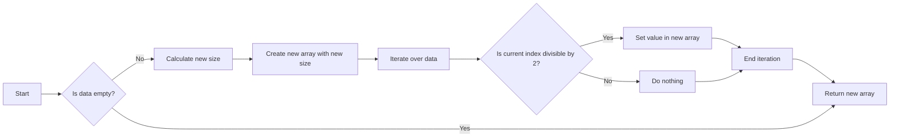

#### 带注释源码

```python
def explode(data):
    # Calculate new size by doubling each dimension
    size = np.array(data.shape) * 2
    # Create a new array with the new size, initialized to zeros
    data_e = np.zeros(size - 1, dtype=data.dtype)
    # Iterate over the original data and set the corresponding values in the new array
    for i in range(data.shape[0]):
        for j in range(data.shape[1]):
            for k in range(data.shape[2]):
                # Check if the current index is divisible by 2
                if i % 2 == 0 and j % 2 == 0 and k % 2 == 0:
                    # Set the value in the new array
                    data_e[i, j, k] = data[i, j, k]
    # Return the new array
    return data_e
```


### np.where

`np.where` 是 NumPy 库中的一个函数，用于找出数组中满足条件的元素的索引。

参数：

- `condition`：`bool` 或 `numpy.ndarray`，条件表达式，用于判断数组元素是否满足条件。
- `indices`：`None` 或 `int`，可选参数，如果提供，则返回满足条件的元素的索引。
- `fill_value`：`None` 或 `numpy.ndarray`，可选参数，如果提供，则将不满足条件的元素替换为 `fill_value`。

返回值：`numpy.ndarray`，满足条件的元素的索引。

#### 流程图

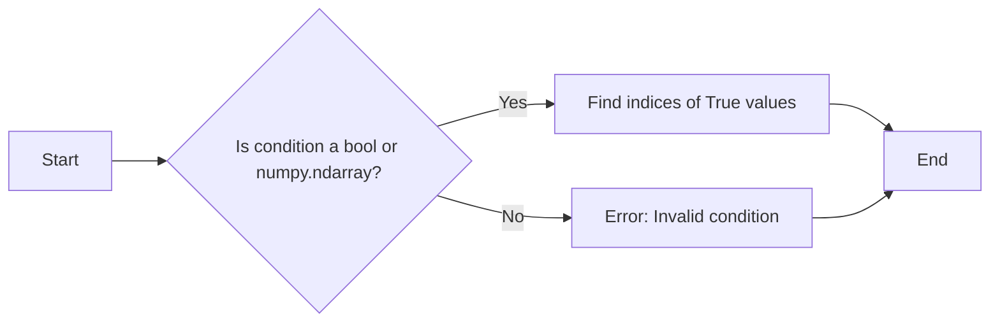

#### 带注释源码

```python
import numpy as np

def np_where(condition, indices=None, fill_value=None):
    """
    Find indices of True values in a boolean or numpy.ndarray condition.

    Parameters:
    - condition: bool or numpy.ndarray, the condition expression to evaluate.
    - indices: None or int, optional. If provided, return the indices of the elements that satisfy the condition.
    - fill_value: None or numpy.ndarray, optional. If provided, replace elements that do not satisfy the condition with fill_value.

    Returns:
    - numpy.ndarray, the indices of the elements that satisfy the condition.
    """
    if not isinstance(condition, (bool, np.ndarray)):
        raise ValueError("Invalid condition. Condition must be a bool or numpy.ndarray.")

    if indices is not None:
        if not isinstance(indices, int):
            raise ValueError("Invalid indices. Indices must be an integer.")
        return np.where(condition)[indices]

    if fill_value is not None:
        if not isinstance(fill_value, np.ndarray):
            raise ValueError("Invalid fill_value. Fill_value must be a numpy.ndarray.")
        return np.where(condition, fill_value, condition)

    return np.where(condition)
```


### np.indices

生成三维索引数组。

#### 描述

`np.indices` 函数用于生成一个形状与给定形状相同的数组，其中每个元素都是对应维度的索引。

#### 参数

- `shape`：`int` 或 `tuple`，指定输出的索引数组的形状。

#### 返回值

- `indices`：`ndarray`，形状与 `shape` 相同的数组，其中每个元素都是对应维度的索引。

#### 流程图

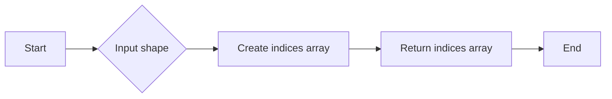

#### 带注释源码

```python
import numpy as np

def np_indices(shape):
    """
    Generate an array of indices with the same shape as the input shape.

    Parameters:
    - shape: int or tuple, the shape of the output indices array.

    Returns:
    - indices: ndarray, an array of indices with the same shape as the input shape.
    """
    return np.indices(shape)
```


### np.astype

将NumPy数组中的数据类型转换为指定的类型。

参数：

- `data`：`numpy.ndarray`，需要转换数据类型的NumPy数组。
- `dtype`：`numpy.dtype`或`str`，目标数据类型。

返回值：`numpy.ndarray`，转换后的NumPy数组。

#### 流程图

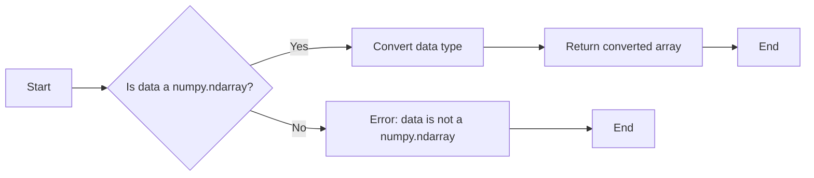

#### 带注释源码

```python
import numpy as np

def np_astype(data, dtype):
    """
    Convert the data type of a numpy array to the specified type.

    Parameters:
    - data: numpy.ndarray, the numpy array to convert the data type.
    - dtype: numpy.dtype or str, the target data type.

    Returns:
    - numpy.ndarray, the converted numpy array.
    """
    return data.astype(dtype)
```


### np.zeros

创建一个形状为给定尺寸的全零数组。

参数：

- `shape`：`int`或`tuple`，指定数组的形状。
- `dtype`：`dtype`，可选，指定数组的类型，默认为`float`。

返回值：`numpy.ndarray`，形状为`shape`的全零数组。

#### 流程图

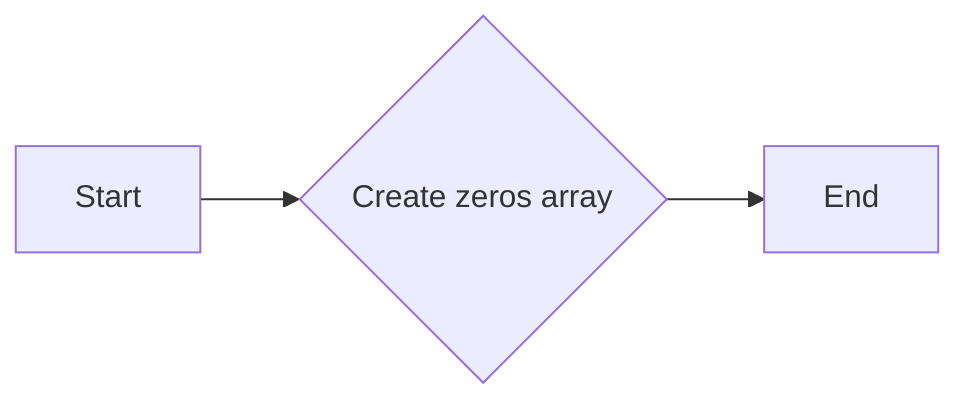

#### 带注释源码

```python
import numpy as np

def np_zeros(shape, dtype=np.float64):
    """
    Create a new array of zeros with the shape and dtype specified.

    Parameters:
    - shape: int or tuple, the shape of the array to be created.
    - dtype: dtype, the data type of the array to be created, default is float.

    Returns:
    - numpy.ndarray: a new array of zeros with the specified shape and dtype.
    """
    return np.zeros(shape, dtype=dtype)
```


### plt.figure()

该函数创建一个新的图形窗口，并返回一个Axes对象，用于绘制图形。

参数：

- 无

返回值：`Axes`，一个用于绘制图形的Axes对象。

#### 流程图

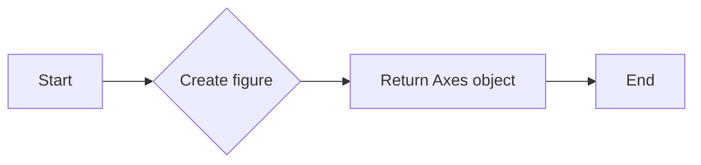

#### 带注释源码

```python
import matplotlib.pyplot as plt

def plt_figure():
    """
    Create a new figure and return an Axes object.
    """
    ax = plt.figure().add_subplot(projection='3d')
    return ax
```


### plt.subplot

`plt.subplot` is a function from the `matplotlib.pyplot` module that is used to create a subplot within a figure. It is used to divide the figure into multiple subplots and specify which subplot to work with.

参数：

- `nrows`：`int`，Number of rows of subplots.
- `ncols`：`int`，Number of columns of subplots.
- `index`：`int`，Index of the subplot to be created.

参数描述：

- `nrows`：指定子图的总行数。
- `ncols`：指定子图的总列数。
- `index`：指定要创建的子图在当前行和列中的位置。

返回值：`AxesSubplot`，返回创建的子图对象。

返回值描述：返回的子图对象可以用来绘制图形、添加标签、设置标题等。

#### 流程图

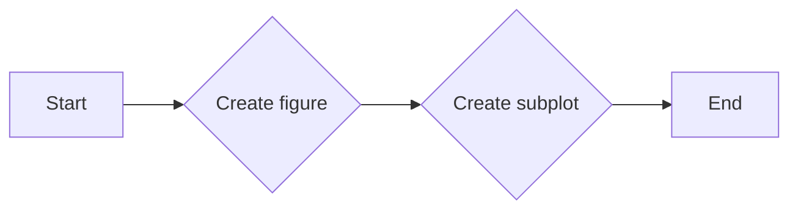

#### 带注释源码

```
ax = plt.figure().add_subplot(projection='3d')
```

在这个例子中，`plt.figure()` 创建了一个新的图形，然后 `add_subplot(projection='3d')` 创建了一个三维子图，并将其赋值给变量 `ax`。这个子图用于后续的绘图操作。


### explode

`explode` is a function that takes a 3D boolean array and returns a new array with the same shape but with the specified elements expanded.

参数：

- `data`：`numpy.ndarray`，3D boolean array to be expanded.

参数描述：

- `data`：输入的3D布尔数组，表示一个三维空间中的元素是否被填充。

返回值：`numpy.ndarray`，返回一个与输入数组形状相同的数组，但指定元素被扩展。

返回值描述：返回的数组中，指定元素的位置被复制到相邻的位置，从而扩大了数组。

#### 流程图

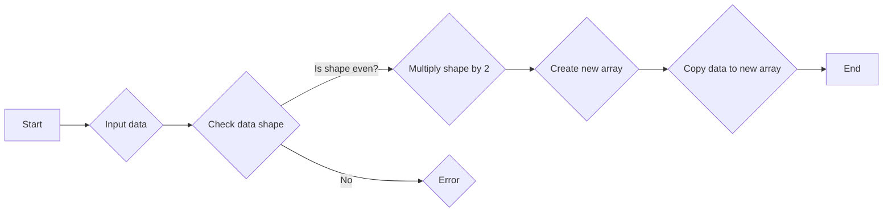

#### 带注释源码

```
def explode(data):
    size = np.array(data.shape)*2
    data_e = np.zeros(size - 1, dtype=data.dtype)
    data_e[::2, ::2, ::2] = data
    return data_e
```

在这个例子中，`explode` 函数首先计算输入数组 `data` 的形状的两倍，然后创建一个新的数组 `data_e`，其大小为原始数组形状的两倍减一。接着，将原始数组中每个元素的位置复制到新数组中相应的位置，从而实现了元素的扩展。


### ax.voxels

`ax.voxels` 是一个用于在 3D 图形中绘制体素的方法。

参数：

- `x`：`numpy.ndarray`，表示体素在 x 轴上的坐标。
- `y`：`numpy.ndarray`，表示体素在 y 轴上的坐标。
- `z`：`numpy.ndarray`，表示体素在 z 轴上的坐标。
- `filled`：`numpy.ndarray`，表示体素是否被填充，布尔值。
- `facecolors`：`numpy.ndarray`，表示体素的面颜色。
- `edgecolors`：`numpy.ndarray`，表示体素的边颜色。

返回值：无

#### 流程图

```mermaid
graph LR
A[Start] --> B{Call ax.voxels()}
B --> C[End]
```

#### 带注释源码

```python
ax.voxels(x, y, z, filled_2, facecolors=fcolors_2, edgecolors=ecolors_2)
```


### ax.set_aspect

`ax.set_aspect` 是一个方法，用于设置3D轴的纵横比。

参数：

- `equal`：`None`，设置纵横比为1:1，使得所有轴的长度相等。

返回值：无

#### 流程图

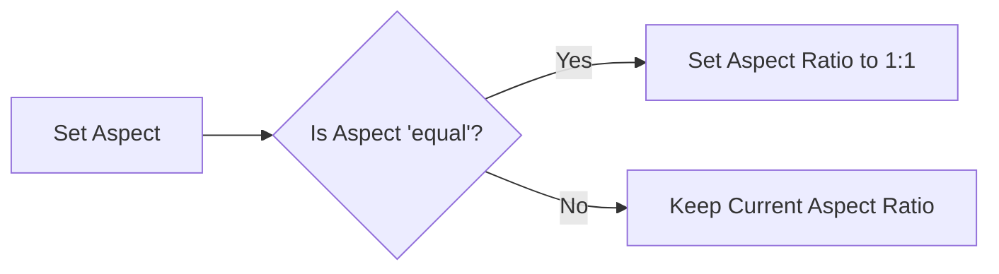

#### 带注释源码

```python
ax = plt.figure().add_subplot(projection='3d')
ax.voxels(x, y, z, filled_2, facecolors=fcolors_2, edgecolors=ecolors_2)
ax.set_aspect('equal')  # Set the aspect ratio to be equal
```


### plt.show()

显示matplotlib图形。

参数：

- 无

返回值：无

#### 流程图

```mermaid
graph LR
A[开始] --> B{调用plt.show()}
B --> C[结束]
```

#### 带注释源码

```python
plt.show()  # 显示当前matplotlib图形
```


## 关键组件


### 张量索引与惰性加载

张量索引与惰性加载用于在处理三维体素数据时，通过索引操作来访问和修改数据，同时采用惰性加载的方式减少内存消耗。

### 反量化支持

反量化支持允许在量化过程中将量化后的数据恢复到原始精度，以便进行后续处理。

### 量化策略

量化策略定义了数据量化的方法和参数，包括量化位数、范围等，以优化模型性能和存储空间。


## 问题及建议


### 已知问题

-   {问题1}：代码中使用了 `explode` 函数来放大图像，但该函数的实现可能不够高效，特别是对于大型数据集。如果数据集很大，这个函数可能会成为性能瓶颈。
-   {问题2}：代码中使用了 `np.where` 来设置颜色，这种方法在处理大型数组时可能会比较慢，可以考虑使用更高效的方法来设置颜色。
-   {问题3}：代码中使用了 `plt.show()` 来显示图形，这通常会导致图形在显示后立即关闭。如果需要保存图形或进行进一步分析，可能需要考虑其他方法来显示图形。

### 优化建议

-   {建议1}：优化 `explode` 函数，例如通过使用 NumPy 的广播功能来减少循环的使用，从而提高性能。
-   {建议2}：使用 NumPy 的向量化操作来设置颜色，这样可以减少循环的使用，提高代码的执行效率。
-   {建议3}：使用 `plt.savefig()` 来保存图形，而不是使用 `plt.show()`，这样可以在图形显示后继续使用它。
-   {建议4}：考虑使用更高级的图形库，如 Mayavi 或 Plotly，这些库提供了更丰富的3D图形功能，并且可能具有更好的性能和可扩展性。


## 其它


### 设计目标与约束

- 设计目标：实现一个3D voxel plot，展示NumPy logo。
- 约束条件：使用matplotlib和numpy库进行绘图，不使用额外的库。

### 错误处理与异常设计

- 错误处理：代码中未包含显式的错误处理机制。
- 异常设计：未设计特定的异常处理逻辑，但应确保所有外部库调用都遵循其异常处理规范。

### 数据流与状态机

- 数据流：数据从numpy数组开始，经过explode函数处理，然后通过matplotlib进行可视化。
- 状态机：代码中没有状态机，它是一个线性流程。

### 外部依赖与接口契约

- 外部依赖：matplotlib和numpy。
- 接口契约：explode函数接受一个numpy数组，返回一个扩大后的数组；matplotlib用于绘图。


    