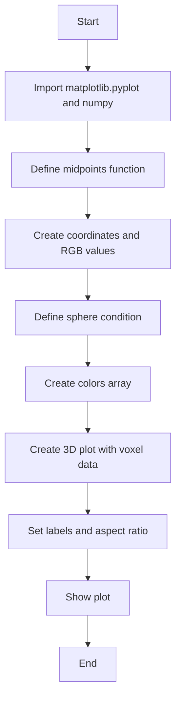
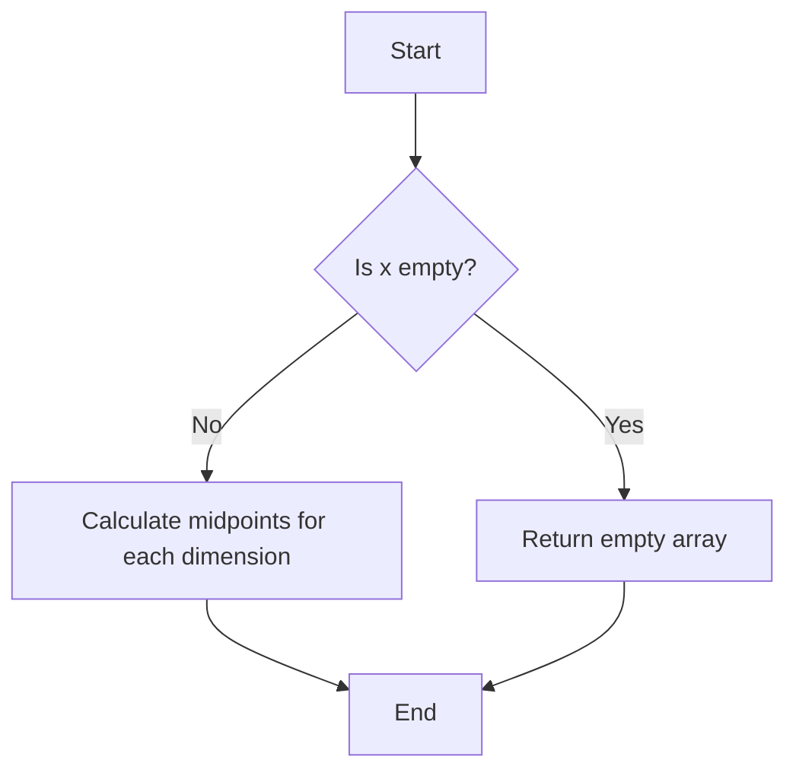
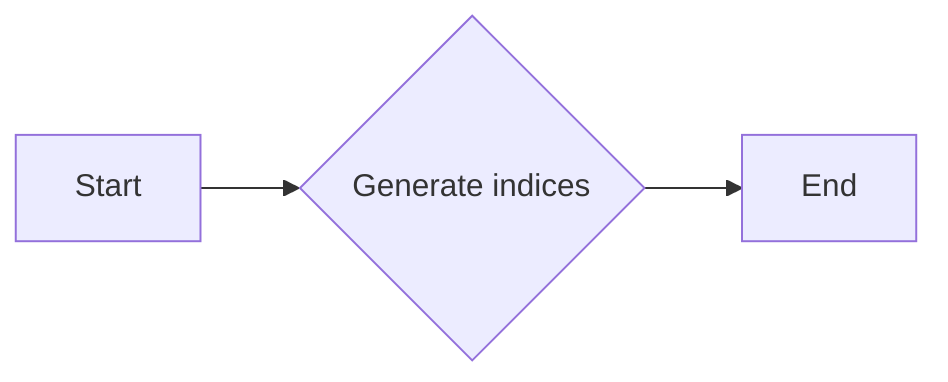
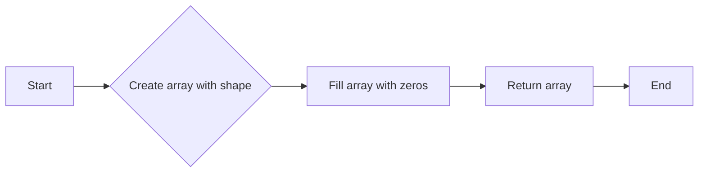
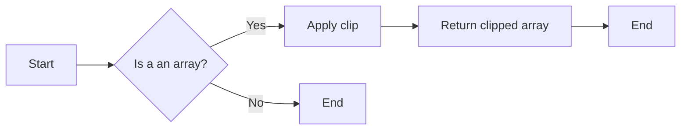
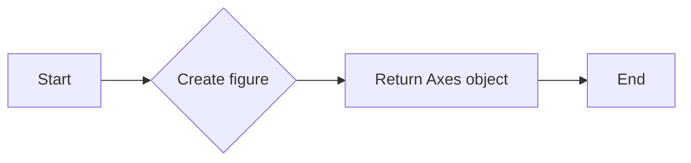
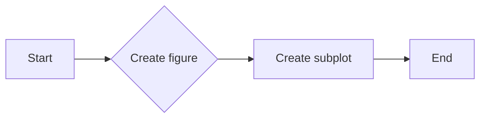
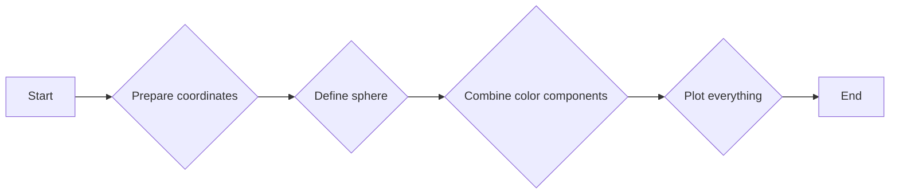
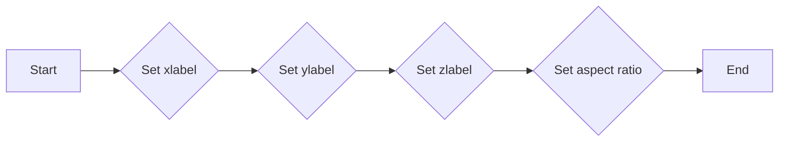
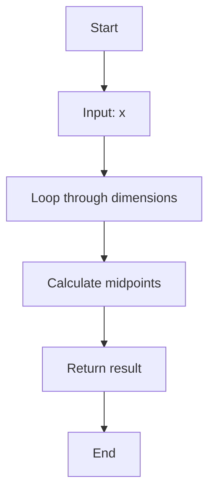

# `matplotlib\galleries\examples\mplot3d\voxels_rgb.py` 详细设计文档

This code generates a 3D voxel plot with RGB colors, visualizing a color space using matplotlib and numpy.

## 整体流程



## 类结构

```
None (No classes defined)
```

## 全局变量及字段


### `midpoints`
    
Calculates the midpoints of an array.

类型：`function`
    


### `r`
    
Array of indices for the red color component.

类型：`numpy.ndarray`
    


### `g`
    
Array of indices for the green color component.

类型：`numpy.ndarray`
    


### `b`
    
Array of indices for the blue color component.

类型：`numpy.ndarray`
    


### `rc`
    
Midpoints of the red color component indices.

类型：`numpy.ndarray`
    


### `gc`
    
Midpoints of the green color component indices.

类型：`numpy.ndarray`
    


### `bc`
    
Midpoints of the blue color component indices.

类型：`numpy.ndarray`
    


### `sphere`
    
Boolean array indicating the points within the sphere.

类型：`numpy.ndarray`
    


### `colors`
    
Array of RGB color values.

类型：`numpy.ndarray`
    


### `ax`
    
3D plot axis object for visualization.

类型：`matplotlib.axes._subplots.Axes3D`
    


### `matplotlib.axes._subplots.Axes3D.None`
    
No fields or methods defined for this object instance.

类型：`None`
    
    

## 全局函数及方法


### midpoints

计算数组中每个维度的中点。

参数：

- `x`：`numpy.ndarray`，输入数组，其维度将被计算中点。

返回值：`numpy.ndarray`，包含输入数组每个维度的中点的数组。

#### 流程图



#### 带注释源码

```python
def midpoints(x):
    # Initialize the slice tuple
    sl = ()
    for _ in range(x.ndim):
        # Calculate the midpoint for the current dimension
        x = (x[sl + np.index_exp[:-1]] + x[sl + np.index_exp[1:]]) / 2.0
        # Update the slice tuple to include the current dimension
        sl += np.index_exp[:]
    return x
```


### np.indices

生成三维索引数组。

参数：

- `shape`：`int`或`tuple`，表示要生成的索引数组的形状。

返回值：`numpy.ndarray`，形状与`shape`相同的三维索引数组。

#### 流程图



#### 带注释源码

```python
import numpy as np

def np_indices(shape):
    """
    Generate indices for a given shape.

    :param shape: int or tuple, the shape of the indices array to be generated.
    :return: numpy.ndarray, a 3D indices array with the same shape as `shape`.
    """
    return np.indices(shape)
```


### np.zeros

创建一个形状为给定元组的数组，并填充为零。

参数：

- `shape`：`int`或`tuple`，指定数组的形状。
- ...

返回值：`numpy.ndarray`，一个形状为`shape`且所有元素都为零的数组。

#### 流程图



#### 带注释源码

```python
import numpy as np

def np_zeros(shape):
    """
    Create an array of given shape and fill it with zeros.

    Parameters:
    - shape: int or tuple, the shape of the array to be created.

    Returns:
    - numpy.ndarray: an array of shape `shape` with all elements set to zero.
    """
    return np.zeros(shape)
```


### np.clip

`np.clip` is a function from the NumPy library that is used to limit the values of an array within a specified range.

参数：

- `a`：`numpy.ndarray`，要限制的数组。
- `a_min`：`float` 或 `numpy.ndarray`，限制下界，默认为 `np.NINF`。
- `a_max`：`float` 或 `numpy.ndarray`，限制上界，默认为 `np.inf`。

返回值：`numpy.ndarray`，限制后的数组。

#### 流程图



#### 带注释源码

```python
import numpy as np

def np_clip(a, a_min=None, a_max=None):
    """
    Clip (limit) the values in an array.
    
    Parameters
    ----------
    a : ndarray
        Input array.
    a_min : float or ndarray, optional
        Clipping minimum. If `a_min` is `None`, it is set to -inf.
    a_max : float or ndarray, optional
        Clipping maximum. If `a_max` is `None`, it is set to inf.
    
    Returns
    -------
    ndarray
        Clipped array.
    """
    return np.clip(a, a_min, a_max)
```


### plt.figure()

该函数创建一个新的图形窗口，并返回一个Axes对象，该对象可以用于绘制图形。

参数：

- 无

返回值：`Axes`，一个matplotlib的Axes对象，用于绘制图形。

#### 流程图



#### 带注释源码

```python
import matplotlib.pyplot as plt

def plt_figure():
    """
    Create a new figure and return an Axes object.
    """
    return plt.figure()
```


### plt.subplot

`plt.subplot` is a function from the `matplotlib.pyplot` module that is used to create a new subplot (or axes) in a figure.

参数：

- `nrows`：`int`，Number of rows of subplots.
- `ncols`：`int`，Number of columns of subplots.
- `index`：`int`，Index of the subplot to be created.

参数描述：

- `nrows`：指定子图的总行数。
- `ncols`：指定子图的总列数。
- `index`：指定要创建的子图在当前行和列中的位置。

返回值：`AxesSubplot`，返回创建的子图对象。

返回值描述：返回的子图对象可以用来绘制图形、添加标签、设置标题等。

#### 流程图



#### 带注释源码

```python
import matplotlib.pyplot as plt

# Create a figure
fig = plt.figure()

# Create a subplot
ax = fig.add_subplot(1, 1, 1)

# Plot something
ax.plot([1, 2, 3], [1, 4, 9])

# Show the plot
plt.show()
```

请注意，上述代码中的 `plt.subplot` 被用于创建一个子图，但实际的 `plt.subplot` 函数调用并未在提供的代码段中出现。因此，流程图和源码是基于 `plt.subplot` 的常规用法。在提供的代码段中，`plt.figure().add_subplot(projection='3d')` 实际上是在创建一个具有3D投影的子图，而不是使用 `plt.subplot`。


### ax.voxels

`ax.voxels` 是一个用于在 3D 图形中绘制体素的方法，它将三维坐标和布尔数组作为输入，并在指定的轴上绘制颜色填充的体素。

参数：

- `r`：`numpy.ndarray`，表示 x 坐标轴上的体素位置。
- `g`：`numpy.ndarray`，表示 y 坐标轴上的体素位置。
- `b`：`numpy.ndarray`，表示 z 坐标轴上的体素位置。
- `sphere`：`numpy.ndarray`，表示布尔数组，其中 `True` 表示体素应该被绘制。
- `facecolors`：`numpy.ndarray`，表示体素的颜色。
- `edgecolors`：`numpy.ndarray`，表示体素边缘的颜色。
- `linewidth`：`float`，表示体素边缘的线宽。

返回值：无，该方法直接在传入的轴对象 `ax` 上绘制图形。

#### 流程图



#### 带注释源码

```python
ax.voxels(r, g, b, sphere,
          facecolors=colors,
          edgecolors=np.clip(2*colors - 0.5, 0, 1),  # brighter
          linewidth=0.5)
```

在这段代码中，`ax.voxels` 方法被调用，它接受一系列参数来绘制一个 3D 图形。`r`、`g` 和 `b` 是体素的位置坐标，`sphere` 是一个布尔数组，用于确定哪些体素应该被绘制。`facecolors` 和 `edgecolors` 分别定义了体素和边缘的颜色，而 `linewidth` 定义了边缘的宽度。


### ax.set

`ax.set` 是一个用于设置matplotlib图形轴（Axes）属性的函数。

参数：

- `xlabel`：`str`，设置x轴标签。
- `ylabel`：`str`，设置y轴标签。
- `zlabel`：`str`，设置z轴标签。
- `aspect`：`str` 或 `float`，设置轴的纵横比。

返回值：`None`，没有返回值。

#### 流程图



#### 带注释源码

```python
ax.set(xlabel='r', ylabel='g', zlabel='b', aspect='equal')
```


### plt.show()

显示matplotlib图形。

参数：

- 无

返回值：无

#### 流程图

```mermaid
graph LR
A[Start] --> B[Call plt.show()]
B --> C[End]
```

#### 带注释源码

```python
plt.show()  # 显示当前matplotlib图形
```


### midpoints

Calculate the midpoints of the given array along each dimension.

参数：

- `x`：`numpy.ndarray`，The input array for which to calculate the midpoints.

返回值：`numpy.ndarray`，The array with midpoints calculated along each dimension.

#### 流程图



#### 带注释源码

```python
def midpoints(x):
    sl = ()
    for _ in range(x.ndim):
        x = (x[sl + np.index_exp[:-1]] + x[sl + np.index_exp[1:]]) / 2.0
        sl += np.index_exp[:]
    return x
```


## 关键组件


### 张量索引与惰性加载

张量索引与惰性加载功能允许在处理大型数据集时，只对需要的数据进行计算，从而提高效率。

### 反量化支持

反量化支持使得代码能够处理不同精度的数值，提供更灵活的数据处理能力。

### 量化策略

量化策略允许在保持精度的情况下，减少数据的大小，从而提高存储和计算效率。


## 问题及建议


### 已知问题

-   **性能问题**：代码中使用了大量的循环和数组操作，这可能导致在处理大型数据集时性能下降。
-   **可读性**：代码中的一些变量命名不够清晰，例如 `rc`、`gc` 和 `bc`，这可能会降低代码的可读性。
-   **重复代码**：在定义 `colors` 数组时，重复了多次相同的操作，这可以通过循环或向量化操作来简化。

### 优化建议

-   **性能优化**：考虑使用更高效的数组操作方法，例如使用 NumPy 的向量化操作来减少循环的使用。
-   **代码重构**：改进变量命名，使其更具描述性，提高代码的可读性。
-   **代码简化**：通过使用循环或向量化操作来简化重复的代码段，减少代码冗余。
-   **异常处理**：添加异常处理来确保代码在遇到错误输入时能够优雅地处理。
-   **文档注释**：为代码添加更详细的文档注释，解释代码的功能和操作，以便其他开发者更容易理解和使用。
-   **模块化**：将代码分解成更小的模块或函数，以提高代码的可维护性和可重用性。
-   **测试**：编写单元测试来验证代码的正确性和稳定性。


## 其它


### 设计目标与约束

- 设计目标：实现一个3D voxel图，用于可视化颜色空间。
- 约束条件：使用matplotlib和numpy库进行绘图和数据处理。

### 错误处理与异常设计

- 错误处理：确保在数据处理和绘图过程中捕获并处理可能的异常，如numpy数组操作错误或matplotlib绘图错误。
- 异常设计：定义清晰的异常类型和错误消息，以便于调试和用户理解。

### 数据流与状态机

- 数据流：数据从numpy数组开始，经过计算和转换，最终通过matplotlib进行可视化。
- 状态机：程序从初始化数据开始，经过数据处理，最后展示3D可视化图形。

### 外部依赖与接口契约

- 外部依赖：matplotlib和numpy库。
- 接口契约：确保matplotlib和numpy库的API正确使用，遵循库的规范和约定。

### 测试与验证

- 测试策略：编写单元测试来验证数据处理和绘图功能的正确性。
- 验证方法：通过可视化结果来验证程序是否正确实现了3D voxel图的功能。

### 性能优化

- 性能优化：分析代码性能瓶颈，如数组操作和绘图过程，进行优化以提高效率。

### 安全性与隐私

- 安全性：确保代码中没有安全漏洞，如注入攻击或数据泄露。
- 隐私：确保处理的数据符合隐私保护的要求，不泄露敏感信息。

### 可维护性与可扩展性

- 可维护性：编写清晰、可读的代码，便于后续维护和修改。
- 可扩展性：设计模块化的代码结构，便于添加新的功能或修改现有功能。

### 文档与注释

- 文档：编写详细的文档，包括代码说明、使用方法和示例。
- 注释：在代码中添加必要的注释，解释复杂逻辑和关键步骤。

### 用户界面与交互

- 用户界面：如果适用，设计直观易用的用户界面。
- 交互：确保用户能够与程序进行有效的交互。

### 部署与分发

- 部署：提供部署指南，确保程序能够在不同环境中运行。
- 分发：提供分发机制，方便用户获取和使用程序。


    