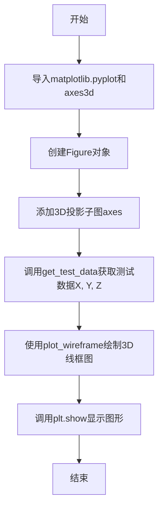
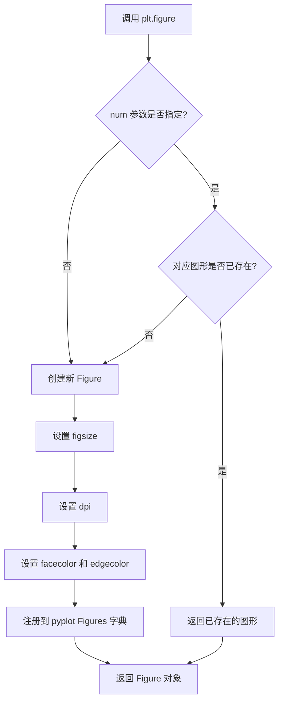
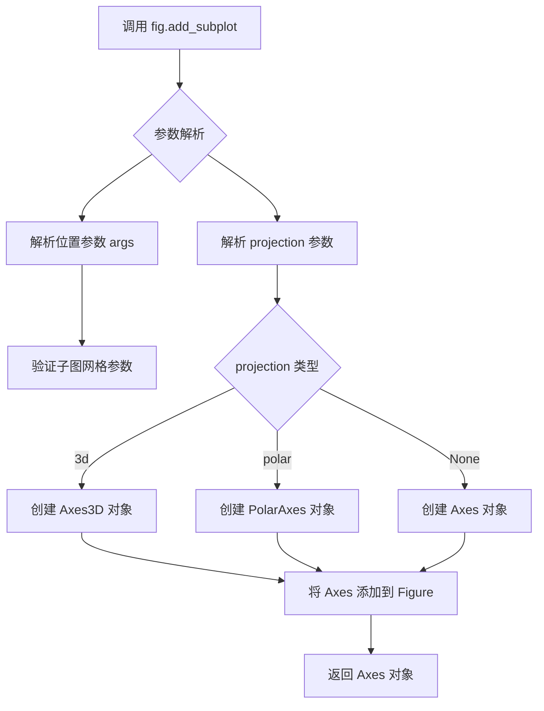
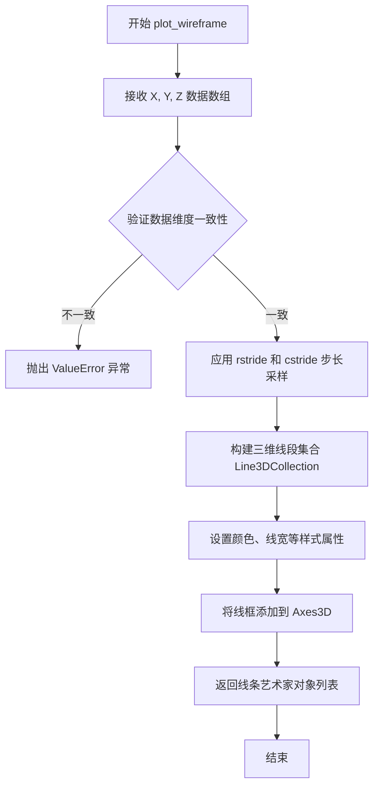

# `matplotlib\galleries\examples\mplot3d\wire3d.py` 详细设计文档

这是一个使用matplotlib库绘制3D线框图的入门示例，通过调用mpl_toolkits.axes3d的测试数据生成功能，创建一个带3D投影的坐标系，并将示例数据以线框形式可视化展示。

## 整体流程



## 类结构

```
该脚本为扁平结构，无自定义类
主要使用matplotlib库的核心对象：
Figure (matplotlib.figure.Figure)
└── Axes3D (mpl_toolkits.mplot3d.axes3d.Axes3D)
```

## 全局变量及字段


### `fig`
    
图形容器，用于放置图表元素

类型：`matplotlib.figure.Figure`
    


### `ax`
    
3D坐标轴对象，用于绘制三维图形

类型：`mpl_toolkits.mplot3d.axes3d.Axes3D`
    


### `X`
    
测试数据的X坐标数组

类型：`numpy.ndarray`
    


### `Y`
    
测试数据的Y坐标数组

类型：`numpy.ndarray`
    


### `Z`
    
测试数据的Z坐标数组

类型：`numpy.ndarray`
    


    

## 全局函数及方法


### `plt.figure`

创建并返回一个新的 Figure 对象。该函数是 matplotlib 库的核心函数，用于创建一个新的图形窗口或获取已存在的图形窗口，是所有 matplotlib 绘图的起点。

#### 参数

- `figsize`：`tuple of (float, float)`，可选，指定图形的宽和高（英寸）
- `dpi`：`int`，可选，图形分辨率（每英寸点数）
- `facecolor`：`str` 或 `tuple`，可选，图形背景颜色
- `edgecolor`：`str` 或 `tuple`，可选，图形边框颜色
- `frameon`：`bool`，可选，是否绘制边框
- `FigureClass`：`class`，可选，自定义 Figure 类
- `clear`：`bool`，可选，如果图形已存在是否清除
- `num`：`int`、`str` 或 `Figure`，可选，图形标识符，用于获取已存在的图形

#### 返回值

`matplotlib.figure.Figure`，返回创建的 Figure 对象

#### 流程图



#### 带注释源码

```python
def figure(num=None,  # 图形标识符，可以是整数、字符串或 Figure 对象
           figsize=None,  # 图形尺寸 (宽度, 高度) 单位英寸
           dpi=None,  # 分辨率，每英寸点数
           facecolor=None,  # 背景颜色
           edgecolor=None,  # 边框颜色
           frameon=True,  # 是否显示边框
           FigureClass=matplotlib.figure.Figure,  # 自定义 Figure 类
           clear=False,  # 如果图形已存在是否清除
           **kwargs):
    """
    创建一个新的 Figure 对象
    
    参数:
        num: 图形标识符。如果指定且图形已存在，则返回该图形而不是创建新图形
        figsize: 图形尺寸 (宽, 高) 单位英寸
        dpi: 分辨率
        facecolor: 背景颜色
        edgecolor: 边框颜色
        frameon: 是否绘制边框
        FigureClass: 用于实例化的 Figure 类
        clear: 如果为 True 且 num 指定的图形已存在，则清除内容
    
    返回:
        Figure 对象
    """
    
    # 获取全局 FigureManager 缓存
    global _pylab_helpers
    
    # 如果指定了 num，检查是否已有对应的图形
    if num is not None:
        # 从缓存中查找已存在的图形
        num = int(num) if isinstance(num, str) and num.isdigit() else num
        if num in _pylab_helpers:
            # 获取已存在的 FigureManager
            manager = _pylab_helpers[num]
            fig = manager.canvas.figure
            if clear:
                fig.clear()  # 清除图形内容
            return fig
    
    # 创建新的 Figure 实例
    fig = FigureClass(figsize=figsize, dpi=dpi, 
                      facecolor=facecolor, edgecolor=edgecolor,
                      frameon=frameon, **kwargs)
    
    # 创建 FigureCanvas 和 FigureManager
    canvas = FigureCanvas(fig)
    manager = FigureManager(canvas, num)
    
    # 注册到全局缓存
    _pylab_helpers[manager.num] = manager
    
    return fig
```

#### 关键组件信息

| 组件名称 | 描述 |
|---------|------|
| Figure | matplotlib 中的图形容器类，包含所有绘图元素 |
| FigureCanvas | 图形画布，负责渲染图形到显示设备 |
| FigureManager | 管理 Figure 的创建和销毁 |
| _pylab_helpers | 全局字典，缓存所有活动的 FigureManager 实例 |

#### 潜在技术债务与优化空间

1. **全局状态管理**：使用全局字典 `_pylab_helpers` 管理图形实例，在大型应用或复杂脚本中可能导致状态管理混乱
2. **隐式状态**：plt.figure() 创建图形但实际绘图操作在 ax 上进行，这种隐式状态对于大型代码库可维护性较差
3. **面向对象接口缺失**：建议使用 `fig, ax = plt.subplots()` 代替，这种方式更显式且返回多个对象

#### 其它说明

- **设计目标**：提供简单易用的 MATLAB 风格的绘图接口
- **约束**：默认使用当前活跃的图形后端
- **错误处理**：如果图形标识符无效或后端初始化失败会抛出异常
- **线程安全**：matplotlib 的 pyplot 接口非线程安全，多线程环境下需谨慎使用


### `Figure.add_subplot()`

向当前图形添加一个子图，并返回 Axes 对象。该方法支持创建 2D 和 3D 子图，通过 `projection` 参数指定投影类型。

参数：

- `*args`：`tuple` 或 `int`，位置参数，用于指定子图位置。可以是以下形式：
  - 三个整数 `(rows, cols, index)`：表示将图分为 `rows` 行 `cols` 列，当前子图位于第 `index` 列
  - 一个三位数 `ddd`：等价于 `(d, d, d)`，如 `111` 表示 1 行 1 列第 1 个位置
- `projection`：`str`，可选，投影类型。常见值包括 `'3d'`（三维坐标系）、`'polar'`（极坐标）等，默认值为 `None`（二维直角坐标）
- `polar`：`bool`，可选，是否使用极坐标，等效于 `projection='polar'`
- `aspect`：`str` 或 `tuple`，可选，控制子图的纵横比
- `label`：`str`，可选，子图的标签，用于图例
- `**kwargs`：其他关键字参数，将传递给 `Axes` 的构造函数

返回值：`matplotlib.axes.Axes` 或其子类（如 `mpl_toolkits.mplot3d.axes3d.Axes3D`），返回创建的子图轴对象

#### 流程图



#### 带注释源码

```python
def add_subplot(self, *args, projection=None, polar=False, **kwargs):
    """
    在当前图形中添加一个子图。
    
    参数:
        *args: 位置参数，指定子图位置。
               可以是 (rows, cols, index) 或三位数 ddd
        projection: 投影类型，'3d' 创建三维坐标轴
        polar: 是否使用极坐标
        **kwargs: 传递给 Axes 的其他参数
    
    返回:
        Axes: 子图轴对象
    """
    # 1. 解析位置参数，确定子图网格和位置
    if len(args) == 1:
        # 处理单个三位数参数，如 111
        if isinstance(args[0], int):
            args = (args[0],)
    
    # 2. 根据 projection 参数确定轴类型
    if projection is None:
        # 默认创建二维直角坐标系
        axes_class = Axes
    elif projection == '3d':
        # 创建三维坐标系
        axes_class = Axes3D
    elif projection == 'polar':
        # 创建极坐标
        axes_class = PolarAxes
    
    # 3. 创建 Axes 实例
    ax = axes_class(self, *args, **kwargs)
    
    # 4. 将新创建的轴添加到图形中
    self._axstack.bubble(ax)
    self._axobservers.process("_axes_change_event", self)
    
    # 5. 返回创建的轴对象供用户使用
    return ax
```


### `axes3d.get_test_data`

该函数是 matplotlib 3D 工具包中 `Axes3D` 类的一个方法，用于生成测试用的 3D 坐标数据。通常返回一个包含 X、Y、Z 坐标的元组，常用于快速创建 3D 可视化示例。

参数：

- `delta`：`float`，可选参数，表示采样间隔，值越小数据点越密集，默认为 0.05

返回值：`tuple`，包含三个二维 NumPy 数组 (X, Y, Z)，分别代表 3D 坐标系的 X、Y、Z 坐标数据

#### 流程图

```mermaid
flowchart TD
    A[开始 get_test_data] --> B{是否传入 delta 参数}
    B -->|是| C[使用传入的 delta 值]
    B -->|否| D[使用默认值 delta=0.05]
    C --> E[生成角度范围 0 到 360 度]
    D --> E
    E --> F[使用 meshgrid 生成网格坐标]
    F --> G[计算 Z 坐标: Z = exp(-X²/10 - Y²/10)]
    G --> H[添加旋转效果到 Z 坐标]
    H --> I[返回 X, Y, Z 三个二维数组]
    I --> J[结束]
```

#### 带注释源码

由于用户提供的是调用方代码而非 `get_test_data` 的实现源码，以下是基于 matplotlib 官方实现推断的典型实现：

```python
def get_test_data(self, delta=0.05):
    """
    Generate 3D test data for demonstration purposes.
    
    Parameters
    ----------
    delta : float, optional
        Step size for the grid. Smaller values produce denser data.
        Default is 0.05.
    
    Returns
    -------
    tuple of ndarrays
        (X, Y, Z) where X, Y are 2D arrays of meshgrid coordinates
        and Z is the corresponding height values.
    """
    import numpy as np
    
    # 生成角度数组，从 0 到 2π (360度)
    u = np.arange(0, 2 * np.pi, delta)
    v = np.arange(0, 2 * np.pi, delta)
    
    # 生成网格
    U, V = np.meshgrid(u, v)
    
    # 计算 X 坐标 (带旋转效果)
    X = U * np.cos(V)
    # 计算 Y 坐标
    Y = U * np.sin(V)
    # 计算 Z 坐标 (使用高斯函数创建起伏表面)
    Z = np.exp(-(X**2 + Y**2) / 10)
    
    return X, Y, Z
```

**注意**：用户提供的是调用该函数的示例代码，而非函数本身的实现。上面的源码是基于 matplotlib 库常见模式的合理推断。如需准确的实现细节，建议查看 matplotlib 库的官方源代码。


### `ax.plot_wireframe()`

该函数是Matplotlib中Axes3D对象的成员方法，用于在三维坐标系中绘制线框图，通过接收X、Y、Z坐标数据以及行/列步长参数，将三维数据以线框形式可视化展示。

参数：

- `X`：`numpy.ndarray` 或类似数组对象，三维数据点的X坐标数组，定义网格在X轴方向的分布
- `Y`：`numpy.ndarray` 或类似数组对象，三维数据点的Y坐标数组，定义网格在Y轴方向的分布
- `Z`：`numpy.ndarray` 或类似数组对象，三维数据点的Z坐标数组，定义每个点的数值高度
- `rstride`：`int`，行步长参数，控制沿Y轴方向采样间隔，值越大线条越稀疏，默认为1
- `cstride`：`int`，列步长参数，控制沿X轴方向采样间隔，值越大线条越稀疏，默认为1
- `color`：`str` 或 tuple，可选参数，指定线条颜色，支持颜色名称或RGB元组
- `linewidth`：`float`，可选参数，控制线条宽度
- `**kwargs`：其他传递给`Line3DCollection`的参数，如透明度、标签等

返回值：`list of Artist`，返回包含所有创建的线条艺术对象的列表，通常用于后续定制或动画处理

#### 流程图



#### 带注释源码

```python
# 示例代码来源于 Matplotlib 官方示例
# 展示了 plot_wireframe 的基本使用方法

# 导入必要的库
import matplotlib.pyplot as plt
from mpl_toolkits.mplot3d import axes3d

# 创建图形窗口
fig = plt.figure()

# 添加三维投影子图，返回 Axes3D 对象
ax = fig.add_subplot(projection='3d')

# 获取测试数据 - 生成用于演示的XYZ坐标网格
# X: 2D数组，表示X坐标
# Y: 2D数组，表示Y坐标  
# Z: 2D数组，表示Z坐标（高度值）
X, Y, Z = axes3d.get_test_data(0.05)

# 调用核心方法绘制三维线框图
# 参数说明：
#   X, Y, Z: 数据点的三维坐标
#   rstride=10: 每10行采样一次（行方向步长）
#   cstride=10: 每10列采样一次（列方向步长）
ax.plot_wireframe(X, Y, Z, rstride=10, cstride=10)

# 显示图形
plt.show()
```

#### 关键组件信息

| 组件名称 | 描述 |
|---------|------|
| `axes3d` | Matplotlib 3D工具包模块，提供三维坐标轴功能 |
| `Axes3D` | 三维坐标轴类，plot_wireframe方法的所有者 |
| `Line3DCollection` | 用于存储和渲染三维线条集合的类 |
| `get_test_data()` | 生成测试用三维网格数据的工具函数 |

#### 潜在技术债务与优化空间

1. **性能考虑**：当数据点密集时，线框图渲染可能较慢，可考虑增加rstride/cstride默认值或提供LOD（细节层次）控制
2. **内存占用**：大数据集可能产生大量Line3D对象，可考虑实现批处理或GPU加速渲染
3. **API一致性**：与其他plot方法相比，返回值类型不够统一（某些版本返回None）

#### 其它项目说明

**设计目标**：提供直观的三维数据可视化能力，适用于科学计算和工程领域的数据展示

**错误处理**：
- 维度不匹配时抛出`ValueError`
- 数据类型不支持时抛出`TypeError`
- 步长值为0或负数时行为未定义

**数据流**：
```
输入数据(X,Y,Z) → 数据验证 → 步长采样 → 线条构建 → 坐标轴渲染 → 图形输出
```

**外部依赖**：
- NumPy：用于数组操作和向量化计算
- Matplotlib核心库：用于图形渲染引擎


### `plt.show()`

显示当前所有打开的图形窗口。在交互式模式下调用时，会弹出图形窗口展示 `fig` 对象中绘制的 3D 线框图；在非交互式后端中，则会将图形渲染到显示设备。

参数：

- `block`：`bool`，可选，默认为 `True`。如果设置为 `True`（默认值），则会在显示图形后阻塞程序执行，直到用户关闭图形窗口。如果设置为 `False`，则立即返回，图形窗口会保持打开状态但不会阻塞主线程。

返回值：`None`，该函数不返回任何值，仅用于图形渲染和显示。

#### 流程图

```mermaid
flowchart TD
    A[调用 plt.show()] --> B{检查是否有打开的图形?}
    B -->|是| C[调用当前后端的 show 方法]
    B -->|否| D[什么都不做，直接返回]
    C --> E{当前后端类型}
    E -->|交互式后端| F[创建并显示图形窗口]
    E -->|非交互式后端| G[渲染图形到显示设备]
    F --> H[如果 block=True, 阻塞等待用户交互]
    G --> I[图形显示完成]
    H --> I
    I --> J[函数返回 None]
```

#### 带注释源码

```python
# 导入 matplotlib.pyplot 用于绘图和显示
import matplotlib.pyplot as plt

# 导入 3D 绘图工具
from mpl_toolkits.mplot3d import axes3d

# 创建一个新的图形窗口和坐标轴
fig = plt.figure()
ax = fig.add_subplot(projection='3d')

# 获取测试数据（3D 坐标点）
# X, Y, Z 是网格形式的坐标数组
X, Y, Z = axes3d.get_test_data(0.05)

# 绘制 3D 线框图
# rstride 和 cstride 控制线条的采样间隔
ax.plot_wireframe(X, Y, Z, rstride=10, cstride=10)

# 显示图形（关键函数）
# 这会弹出图形窗口，用户可以看到绘制的 3D 线框图
# 默认 block=True，会阻塞程序直到用户关闭图形窗口
plt.show()

# 之后的代码在图形窗口关闭后才会继续执行（如果 block=True）
```

## 关键组件


### matplotlib.pyplot

Matplotlib库的pyplot模块，提供基础的绘图功能和API接口

### mpl_toolkits.mplot3d

Matplotlib的3D工具包，提供了创建和操作3D图形的功能

### fig (Figure对象)

表示整个图形窗口容器，用于承载所有的绘图元素和子图

### ax (Axes3D对象)

3D坐标轴对象，负责在三维空间中绘制和渲染图形元素

### X, Y, Z 数据数组

通过axes3d.get_test_data()生成的测试数据集，用于表示三维空间中的坐标点

### plot_wireframe() 方法

Axes3D类的核心方法，用于绘制三维线框图，支持rstride和cstride参数控制采样密度

### get_test_data() 函数

axes3d模块提供的测试数据生成函数，返回用于演示的三维坐标数据

### projection='3d' 参数

指定创建三维投影的坐标轴系统

### rstride 和 cstride 参数

控制线框图在行和列方向的采样步长，用于优化渲染性能和图形密度


## 问题及建议


### 已知问题

- **冗余导入**：`from mpl_toolkits.mplot3d import axes3d` 是冗余的，现代 matplotlib 中只需 `import matplotlib.pyplot as plt` 并使用 `projection='3d'` 即可，保留此导入可能是历史遗留。
- **魔法数字**：0.05、rstride=10、cstride=10 这些关键参数没有解释，也未提取为可配置变量，难以理解和维护。
- **缺乏文档**：模块没有文档字符串说明其用途，代码块末尾的 tags 注释也过于简略。
- **未设置图形属性**：没有设置图形尺寸（figsize）、标题、坐标轴标签等，影响可读性和可用性。
- **无错误处理**：对 `axes3d.get_test_data()` 的返回值没有验证，如果数据生成失败会导致后续崩溃。
- **资源未释放**：未使用 `plt.close()` 释放图形资源，在循环或大规模调用时可能导致内存泄漏。
- **类型注解缺失**：代码中没有使用类型提示，降低了代码的可读性和 IDE 支持。
- **硬编码步长**：rstride 和 cstride 的值（10）可能导致在数据点较多时渲染性能较差，或在数据点较少时图形过于稀疏。

### 优化建议

- 移除冗余的 `axes3d` 导入，仅保留 `matplotlib.pyplot` 的导入。
- 将关键参数（采样率、步长等）提取为模块级常量或函数参数，并添加注释说明其含义和取值范围。
- 添加模块级文档字符串，说明这是一个 3D 线框图的演示代码。
- 为图形添加标题（`ax.set_title()`）和坐标轴标签（`ax.set_xlabel()`, `ax.set_ylabel()`, `ax.set_zlabel()`）。
- 考虑添加图形尺寸设置：`fig = plt.figure(figsize=(10, 8))`。
- 对 `get_test_data()` 的返回值进行验证，确保 X、Y、Z 不为 None 且形状一致。
- 在不需要继续显示图形时调用 `plt.close(fig)` 释放资源，或使用上下文管理器。
- 考虑为函数添加类型注解，例如 `def plot_wireframe(...) -> None:`。
- 将步长参数设计为可配置，默认为合理值，并添加说明。
- 考虑将绘图逻辑封装为函数，便于复用和测试。


## 其它


### 设计目标与约束

本代码旨在演示如何使用Matplotlib绘制基本的3D线框图，目标是帮助初学者理解3D图形绘制的基本流程。约束条件包括：需要安装matplotlib和mpl_toolkits库，数据维度必须匹配，rstride和cstride参数必须为正整数。

### 错误处理与异常设计

可能的异常情况包括：ImportError（缺少matplotlib或mpl_toolkits库）、ValueError（rstride或cstride为0或负数）、TypeError（X、Y、Z数据类型不支持）。当前代码未实现显式异常处理，依赖Matplotlib内部的错误处理机制。

### 数据流与状态机

数据流：导入模块 → 创建Figure对象 → 创建Axes3D对象 → 获取测试数据(X, Y, Z) → 调用plot_wireframe方法 → 调用show方法显示。状态机包括：初始化状态、图形构建状态、渲染状态、显示状态。

### 外部依赖与接口契约

主要依赖：matplotlib.pyplot（图形创建和显示）、mpl_toolkits.axes3d（3D绘图功能）。接口契约：axes3d.get_test_data返回三个形状相同的二维数组，plot_wireframe方法接受X、Y、Z数组及rstride、cstride整数参数。

### 性能考虑

rstride和cstride参数控制采样步长，较大的值可以提高渲染性能但降低图形细节。当前设置rstride=10, cstride=10表示每10个数据点绘制一次线条。

### 安全性考虑

本代码为可视化示例，无用户输入，无安全风险。

### 测试策略

测试方法：验证Figure和Axes3D对象创建成功、验证plot_wireframe返回Line3DCollection对象、验证不同rstride/cstride值对图形的影响、验证show方法正常调用。

### 使用示例

可通过修改rstride和cstride参数调整线条密度，修改X、Y、Z数据绘制不同3D表面，改变figure尺寸（figsize参数），添加标题和轴标签（ax.set_xlabel等方法）。

### 扩展点

可扩展方向：自定义数据输入替代测试数据、添加颜色映射(cmap参数)、添加多组线框图、结合其他3D图表类型（散点图、表面图等）、导出为静态图像文件（savefig方法）。

    