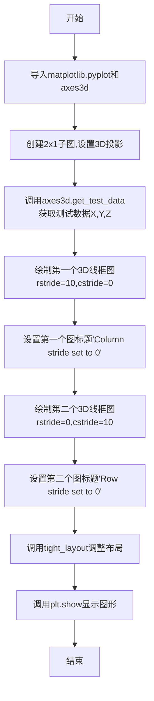
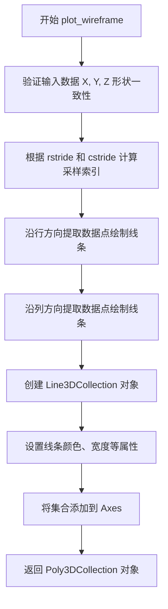
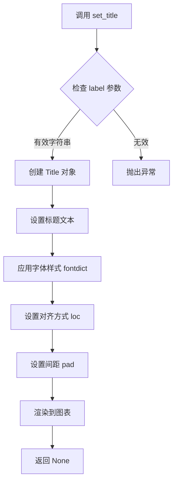
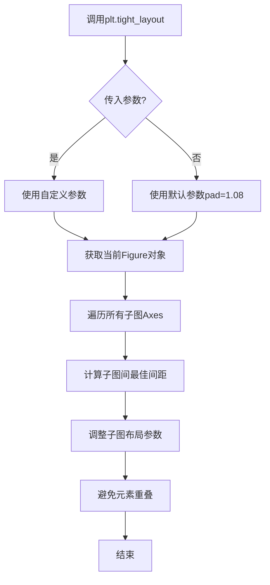
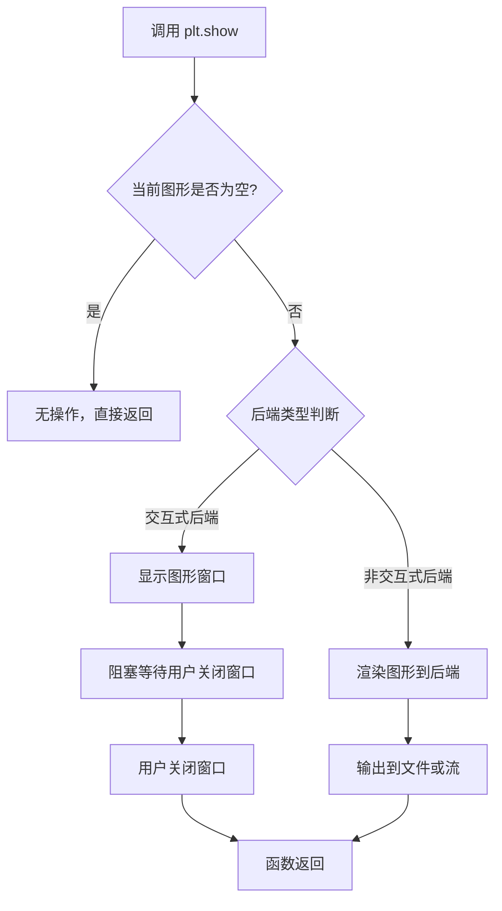

# `matplotlib\galleries\examples\mplot3d\wire3d_zero_stride.py` 详细设计文档

这是一个matplotlib 3D绑定的演示脚本，通过设置rstride和cstride参数为0来控制在3D线框图中只在一个方向（行或列）生成线条，展示了matplotlib的plot_wireframe方法在不同步长设置下的绘图效果。

## 整体流程



## 类结构

```
该脚本为扁平结构，无类定义
直接执行脚本模式，无模块化类设计
```

## 全局变量及字段


### `fig`
    
整个图形对象，包含所有子图

类型：`matplotlib.figure.Figure`
    


### `ax1`
    
第一个3D坐标轴对象，用于展示列方向（x方向）的wireframe

类型：`matplotlib.axes._subplots.Axes3D`
    


### `ax2`
    
第二个3D坐标轴对象，用于展示行方向（y方向）的wireframe

类型：`matplotlib.axes._subplots.Axes3D`
    


### `X`
    
测试数据的X坐标矩阵，用于定义wireframe在x轴方向的分布

类型：`numpy.ndarray`
    


### `Y`
    
测试数据的Y坐标矩阵，用于定义wireframe在y轴方向的分布

类型：`numpy.ndarray`
    


### `Z`
    
测试数据的Z坐标矩阵(高度数据)，用于定义wireframe在z轴方向的高度值

类型：`numpy.ndarray`
    


    

## 全局函数及方法


### `plt.subplots`

`plt.subplots` 是 matplotlib 库中的函数，用于创建一个图形窗口（Figure）和一个或多个子图（Axes），支持灵活的多子图布局配置。

参数：

- `nrows`：`int`，默认值 1，子图的行数
- `ncols`：`int`，默认值 1，子图的列数
- `figsize`：`tuple of (float, float)`，图形窗口的尺寸（宽度，高度），单位为英寸
- `dpi`：`int`，图形窗口的分辨率（每英寸点数）
- `facecolor`：`color`，图形窗口的背景色
- `edgecolor`：`color`，图形窗口的边框颜色
- `linewidth`：`float`，边框线条宽度
- `frameon`：`bool`，是否显示图形框架
- `sharex`：`bool or str`，是否共享 X 轴
- `sharey`：`bool or str`，是否共享 Y 轴
- `subplot_kw`：`dict`，传递给 `add_subplot` 的关键字参数，用于配置子图属性（如 `projection='3d'` 设置 3D 投影）
- `gridspec_kd`：`dict`，传递给 `GridSpec` 的关键字参数，用于配置网格布局
- `**fig_kw`：额外的关键字参数，将传递给 `Figure` 构造函数

返回值：`tuple of (Figure, Axes or array of Axes)`，返回图形对象和子图对象（或子图数组）

#### 流程图

```mermaid
flowchart TD
    A[调用 plt.subplots] --> B[解析参数: nrows, ncols, figsize, dpi 等]
    B --> C[创建 Figure 对象]
    C --> D[根据 gridspec_kw 配置网格布局]
    D --> E{循环创建子图}
    E -->|每个子图| F[调用 add_subplot 创建 Axes]
    F --> G[应用 subplot_kw 配置]
    E --> H{sharex/sharey 配置}
    H --> I[设置共享轴属性]
    I --> J[返回 (fig, axes) 元组]
    style A fill:#f9f,stroke:#333
    style C fill:#9f9,stroke:#333
    style J fill:#9ff,stroke:#333
```

#### 带注释源码

```python
# 示例代码展示 plt.subplots 的使用方式
fig, (ax1, ax2) = plt.subplots(
    2, 1,              # 2行1列的子图布局
    figsize=(8, 12),   # 图形窗口尺寸 8x12 英寸
    subplot_kw={'projection': '3d'}  # 所有子图使用 3D 投影
)

# 解释：
# 1. plt.subplots(2, 1, figsize=(8, 12), subplot_kw={'projection': '3d'})
#    - 创建 2行×1列 = 2 个子图
#    - 图形尺寸设为 8×12 英寸
#    - subplot_kw 传递 projection='3d' 使所有子图支持 3D 绘图
# 
# 2. 返回值解包：
#    - fig: Figure 对象，代表整个图形窗口
#    - ax1: 第一个子图 (Axes3D 对象)
#    - ax2: 第二个子图 (Axes3D 对象)
#
# 3. 后续可对每个 ax 调用 plot_wireframe 等 3D 绘图方法
```


### `axes3d.get_test_data`

生成用于3D线框图和表面图的测试数据，返回一组X、Y、Z坐标数组，可用于演示3D绘图功能或作为测试用例。

参数：

- `delta`： `float`，可选，采样间隔，默认值为0.05。控制生成数据的密度和精细程度。

返回值： `tuple`，包含三个ndarray (X, Y, Z)，分别是2D坐标数组和对应的函数值数组，X和Y是网格坐标，Z是X和Y的函数值（如高斯分布）。

#### 流程图

```mermaid
flowchart TD
    A[开始] --> B[接收delta参数]
    B --> C[生成X轴坐标范围<br/>从-0.5到0.5，间隔为delta]
    C --> D[生成Y轴坐标范围<br/>从-0.5到0.5，间隔为delta]
    D --> E[创建网格坐标矩阵X和Y]
    E --> F[计算Z值<br/>Z = X * exp(-X² - Y²)<br/>高斯分布型函数]
    F --> G[返回X, Y, Z三个数组]
    G --> H[结束]
```

#### 带注释源码

```python
def get_test_data(delta=0.05):
    """
    Return sample data for 3D line and surface plots.
    
    生成用于3D线框图和表面图的测试样本数据
    
    Parameters
    ----------
    delta : float, optional
        采样间隔，默认为0.05。值越小，生成的数据点越密集。
    
    Returns
    -------
    X, Y, Z : ndarray
        X, Y: 2D坐标网格数组
        Z: 对应的函数值数组，计算公式为 X * exp(-X² - Y²)
    
    Examples
    --------
    >>> X, Y, Z = get_test_data(0.05)
    >>> X.shape
    (20, 20)
    """
    # 生成从-0.5到0.5的坐标点，间隔为delta
    # Create coordinate range from -0.5 to 0.5 with given delta
    x = np.arange(-0.5, 0.5, delta)
    y = np.arange(-0.5, 0.5, delta)
    
    # 从1D坐标数组创建2D网格坐标矩阵
    # Create 2D meshgrid from 1D coordinate arrays
    X, Y = np.meshgrid(x, y)
    
    # 计算Z值：使用高斯分布型函数
    # Calculate Z values using Gaussian-like function
    # Z = X * exp(-X² - Y²) produces a ridge-like pattern
    Z = X * np.exp(-X**2 - Y**2)
    
    # 返回三个坐标数组
    # Return the three coordinate arrays
    return X, Y, Z
```

#### 关键组件信息

- **X, Y 坐标网格**：由 `np.meshgrid` 生成的2D数组，构成测试数据的空间坐标基础
- **Z 函数值**：基于高斯型公式计算的值，用于展示3D表面的起伏特征
- **delta 参数**：控制数据分辨率的关键参数，影响生成数据的维度

#### 潜在的技术债务或优化空间

1. **函数值计算公式单一**：目前仅支持一种Z值计算公式（高斯型），可以考虑增加参数支持多种测试函数
2. **缺乏输入验证**：未对delta参数进行负值或零值验证，可能导致异常
3. **硬编码的坐标范围**：X和Y的范围固定为[-0.5, 0.5)，缺乏灵活性

#### 其它项目

**设计目标与约束**：
- 提供简单易用的测试数据生成接口
- 默认参数适合大多数演示场景

**错误处理与异常设计**：
- 当delta为0或负数时，可能导致无限循环或数组维度错误
- 当delta过大时，可能生成空数组

**外部依赖与接口契约**：
- 依赖NumPy库进行数值计算和数组操作
- 返回的数组形状为 (n, n)，其中 n = 1 / delta


### `Axes3D.plot_wireframe`

绘制 3D 线框图，用于在三维坐标系中可视化数据网格。该方法通过沿行和列方向采样数据点来创建线框结构，支持独立控制两个方向的步长。

参数：

- `X`：`array_like`，X 坐标数据，形状为 (M, N) 的二维数组
- `Y`：`array_like`，Y 坐标数据，形状为 (M, N) 的二维数组
- `Z`：`array_like`，Z 坐标数据，形状为 (M, N) 的二维数组
- `rstride`：`int`，行方向（row）的步长，决定每隔多少行绘制一条线，默认为 10
- `cstride`：`int`，列方向（column）的步长，决定每隔多少列绘制一条线，默认为 10
- `rcstride`：`int`，行方向的采样步长（可选别名）
- `ccstride`：`int`，列方向的采样步长（可选别名）
- `color`：`color`，线条颜色，可选
- `linewidth`：`float`，线条宽度，可选
- `antialiased`：`bool`，是否启用抗锯齿，可选

返回值：`~matplotlib.collections.Poly3DCollection`，返回创建的线框集合对象

#### 流程图



#### 带注释源码

```python
def plot_wireframe(self, X, Y, Z, *args, **kwargs):
    """
    绘制 3D 线框图
    
    参数:
        X: X 坐标数据 (二维数组)
        Y: Y 坐标数据 (二维数组)
        Z: Z 坐标数据 (二维数组)
        rstride: 行步长，默认 10
        cstride: 列步长，默认 10
        **kwargs: 其他传递给 Line3DCollection 的参数
    """
    # 解析参数：rstride 和 cstride
    rstride = kwargs.pop('rstride', 10)
    cstride = kwargs.pop('cstride', 10)
    
    # 验证数据维度一致性
    # 确保 X, Y, Z 都是二维数组且形状相同
    X, Y, Z = np.broadcast_arrays(X, Y, Z)
    
    # 根据步长计算行索引
    # rstride=0 时不绘制行方向线条
    rows, cols = Z.shape
    rstride = min(rstride, rows - 1) if rstride > 0 else rows
    cstride = min(cstride, cols - 1) if cstride > 0 else cols
    
    # 沿行方向创建线条（y = c 常数线）
    # 从每行的起始点到终点绘制线条
    r = [slice(None)] * 2
    lines = []
    for i in range(0, rows, rstride):
        r[0] = slice(i, i + 1)
        # 提取当前行的坐标点
        xs = X[tuple(r)].reshape(-1)
        ys = Y[tuple(r)].reshape(-1)
        zs = Z[tuple(r)].reshape(-1)
        lines.append(list(zip(xs, ys, zs)))
    
    # 沿列方向创建线条（x = c 常数线）
    # 从每列的起始点到终点绘制线条
    c = [slice(None)] * 2
    for i in range(0, cols, cstride):
        c[1] = slice(i, i + 1)
        # 提取当前列的坐标点
        xs = X[tuple(c)].reshape(-1)
        ys = Y[tuple(c)].reshape(-1)
        zs = Z[tuple(c)].reshape(-1)
        lines.append(list(zip(xs, ys, zs)))
    
    # 创建 3D 线框集合对象
    linec = art3d.Line3DCollection(lines, **kwargs)
    
    # 添加到坐标轴并设置视图范围
    self.add_collection(linec)
    self.auto_scale_xyz(X, Y, Z)
    
    return linec
```


### `Axes.set_title`

设置子图标题，用于为3D坐标轴图形设置标题文字。

参数：

- `label`：`str`，要设置的标题文本内容
- `loc`：`str`（可选），标题对齐方式，可选值为 'left', 'center', 'right'，默认为 'center'
- `fontdict`：`dict`（可选），控制标题文字属性的字典，如 fontsize, fontweight 等
- `pad`：`float`（可选），标题与坐标轴顶部的间距，默认为基于 rcParams 的值
- `**kwargs`：其他传递给 matplotlib.text.Text 的关键字参数

返回值：`None`，无返回值，该方法直接修改 Axes 对象的标题属性

#### 流程图



#### 带注释源码

```python
def set_title(self, label, loc=None, pad=None, **kwargs):
    """
    Set a title for the axes.
    
    Parameters
    ----------
    label : str
        The title text string.
    
    loc : {'left', 'center', 'right'}, default: rcParams['axes.titlelocation']
        The title horizontal alignment.
    
    pad : float
        The distance in points between the title and the top of the Axes.
    
    **kwargs
        Additional keyword arguments passed to matplotlib.text.Text.
    
    Returns
    -------
    None
    
    Examples
    --------
    >>> ax.set_title("Chart Title")
    >>> ax.set_title("Left Title", loc='left')
    >>> ax.set_title("Custom Title", fontsize=12, fontweight='bold')
    """
    # 获取标题位置参数，默认为 'center'
    if loc is None:
        loc = rcParams['axes.titlelocation']
    
    # 创建标题对象，设置对齐方式
    title = Text(
        x=0.5, y=1.0,  # 标题位置在 axes 顶部居中
        text=label,
        ha=loc,  # 水平对齐方式
        va='top',  # 垂直对齐方式
        **kwargs
    )
    
    # 设置标题与 axes 顶部的间距
    if pad is not None:
        title.set_pad(pad)
    
    # 将标题添加到 axes 中
    self._ax_title = title
    self.texts.append(title)
    
    # 触发重新渲染
    self.stale_callback(title)
    
    return None
```

#### 使用示例

```python
# 在提供的代码中的实际使用:
ax1.set_title("Column (x) stride set to 0")
ax2.set_title("Row (y) stride set to 0")
```

#### 说明

在给定的代码中，`set_title` 被用于为两个3D子图设置标题：
- 第一个子图 `ax1` 标题为 "Column (x) stride set to 0"，表示列方向（x）的步长设置为0
- 第二个子图 `ax2` 标题为 "Row (y) stride set to 0"，表示行方向（y）的步长设置为0

这是 matplotlib Axes 对象的内置方法，并非在该代码文件中定义。


### `plt.tight_layout`

`plt.tight_layout()` 是 matplotlib.pyplot 模块中的函数，用于自动调整图形中所有子图的布局参数，使子图之间的间距合理，避免标题、轴标签等元素相互重叠。

参数：
-  `pad`：浮点数，子图边缘与图形边缘之间的间距（默认为 1.08）
-  `h_pad`：浮点数，子图之间的垂直间距
-  `w_pad`：浮点数，子图之间的水平间距
-  `rect`：元组，子图的归一化坐标区域 (left, bottom, right, top)

返回值：`None`，该函数直接修改 Figure 的布局，不返回任何值。

#### 流程图



#### 带注释源码

```python
# 代码中的调用方式
plt.tight_layout()
plt.show()

# tight_layout 函数说明：
# - 位于 matplotlib.pyplot 模块
# - 作用：自动调整子图布局以防止元素重叠
# - 调用底层 Figure.tight_layout() 方法
#
# 常用参数示例：
# plt.tight_layout(pad=2.0)          # 设置边缘间距为2.0
# plt.tight_layout(h_pad=1.0)        # 设置垂直间距为1.0
# plt.tight_layout(rect=[0, 0, 1, 1]) # 设置布局区域为整个图形
```


### `plt.show`

显示一个或多个图形窗口。该函数会阻塞程序执行（默认行为），直到用户关闭图形窗口或调用 `plt.pause`。在交互式后端（如 TkAgg、Qt5Agg）中会显示图形界面；在非交互式后端（如 agg、pdf）则可能保存到文件或无实际操作。

参数：

- `block`：`bool`，可选参数，默认值为 `True`。控制是否阻塞程序执行以等待用户交互。若设置为 `False`，则立即返回并允许程序继续执行（在某些后端中可与 `plt.pause` 配合实现动画效果）。

返回值：`None`，无返回值。

#### 流程图



#### 带注释源码

```python
# 源码位于 matplotlib.pyplot 模块中
# 以下为简化版实现逻辑

def show(block=None):
    """
    显示所有打开的图形窗口。
    
    Parameters
    ----------
    block : bool, optional
        是否阻塞程序执行。默认 True 会阻塞直到窗口关闭。
    """
    # 获取当前活动的图形管理器
    global _showphandler
    for manager in Gcf.get_all_fig_managers():
        # 触发后端的显示操作
        manager.show()
    
    # 根据 block 参数决定是否阻塞
    if block is None:
        # 根据 rcParams['interactive'] 决定默认行为
        block = rcParams['interactive']
    
    if block:
        # 阻塞模式：启动事件循环并等待
        # 在交互式后端中会启动 GUI 事件循环
        import matplotlib._pylab_helpers as _pylab_helpers
        _pylab_helpers.show_block()
    else:
        # 非阻塞模式：立即返回，允许程序继续执行
        # 常用于动画场景
        pass
```

**使用示例：**

```python
import matplotlib.pyplot as plt
import numpy as np

# 创建简单图形
x = np.linspace(0, 2 * np.pi, 100)
y = np.sin(x)

plt.plot(x, y)
plt.title("Sine Wave")

# 显示图形（阻塞模式）
plt.show()  # 程序会停在此处直到用户关闭图形窗口
```

## 关键组件


### matplotlib.pyplot

Matplotlib的pyplot模块，提供创建图表和可视化的基础接口

### mpl_toolkits.mplot3d

Matplotlib的3D工具包，提供了在2D图中渲染3D图形的能力

### axes3d.get_test_data

生成3D测试数据的函数，返回X、Y、Z坐标数组，用于演示3D图形功能

### plot_wireframe方法

在3D坐标轴上绘制线框图的核心方法，支持通过步长参数控制线条密度

### rstride参数

行步长参数，控制Y方向上的数据采样间隔，设为0时该方向不生成线条

### cstride参数

列步长参数，控制X方向上的数据采样间隔，设为0时该方向不生成线条

### figure和axes对象

fig表示整个图形窗口，ax1和ax2分别表示两个3D子图对象

### tight_layout布局

自动调整子图间距，使图形布局更加紧凑美观


## 问题及建议


### 已知问题

-   **缺少参数化设计**：stride值（10）、缩放因子（0.05）、图表尺寸（8, 12）均为硬编码的魔法数字，缺乏可配置性
-   **无错误处理**：未对`axes3d.get_test_data()`的返回值进行校验，也未处理可能的`None`情况
-   **缺乏输入验证**：未对`rstride`和`cstride`参数进行有效性检查（如负数、零值、超过数据范围等）
-   **资源管理不当**：`fig`对象创建后未显式关闭，可能导致资源泄漏
-   **布局兼容性风险**：`plt.tight_layout()`在3D子图布局中可能产生不可预期的结果
-   **代码封装不足**：所有逻辑直接写在模块顶层，难以作为模块被其他代码导入复用

### 优化建议

-   将核心逻辑封装为函数，接受`rstride`、`cstride`、`figsize`等参数以提高复用性
-   添加参数验证逻辑，检查stride值是否在有效范围内（1到数据维度的合理比例）
-   使用上下文管理器（`with plt.subplots(...) as fig:`）确保资源正确释放
-   将魔法数字提取为具名常量或配置参数，并添加注释说明其含义
-   考虑使用`plt.close(fig)`显式关闭图形，或使用交互式环境下的自动清理机制
-   添加异常处理，捕获`axes3d`模块可能抛出的异常


## 其它


### 设计目标与约束

本代码旨在演示matplotlib 3D绘图库中plot_wireframe函数的关键特性：当rstride或cstride参数设置为0时，对应方向的网格线将不会生成。设计目标包括直观展示3D线框图的两种不同渲染模式（按列或按行生成线条），以及验证stride参数对图形输出的影响。技术约束方面，代码依赖于matplotlib 3D扩展库（mpl_toolkits.mplot3d），需要确保安装了matplotlib及其中文显示支持（若有中文标题）。代码仅作为演示用途，不涉及复杂的数据处理或业务逻辑。

### 错误处理与异常设计

本代码采用matplotlib内置的错误处理机制。当传入的stride参数为负数或非整数时，matplotlib底层会进行参数校验并抛出相应的异常。常见异常包括：ValueError（当stride值无效时）、RuntimeError（当3D投影初始化失败时）以及AttributeError（当axes对象不支持3D投影时）。代码未显式添加try-except块，建议在实际应用中根据具体需求添加异常捕获逻辑，以确保程序的健壮性。

### 数据流与状态机

代码的数据流相对简单，主要分为以下阶段：1）初始化阶段：创建Figure对象和两个Axes子图（均配置为3D投影）；2）数据获取阶段：调用axes3d.get_test_data函数生成测试用的X、Y、Z坐标矩阵；3）渲染阶段：分别调用两个axes对象的plot_wireframe方法，传入不同的stride参数组合进行绘制；4）显示阶段：调用tight_layout调整布局后通过plt.show()显示图形。状态机方面，matplotlib内部维护图形对象的状态，包括当前figure、axes、颜色映射等，用户的操作（如设置标题、调用plot_wireframe）会触发状态的更新和重新渲染。

### 外部依赖与接口契约

代码主要依赖以下外部库：1）matplotlib（版本需支持3D绘图功能），提供plt.subplots、plot_wireframe、set_title、tight_layout、show等API；2）mpl_toolkits.mplot3d，作为matplotlib的3D绘图扩展模块，提供axes3d模块和get_test_data函数。接口契约方面：plot_wireframe方法的签名接受X、Y、Z三个坐标数组以及rstride和cstride两个整数参数，X、Y、Z应为形状一致的二维数组，stride参数控制采样步长；get_test_data函数接受一个float参数用于控制生成数据的密度，返回三个二维numpy数组。

### 性能考虑

代码在性能方面表现优异，因为使用了matplotlib内置的测试数据生成函数，该函数经过优化。get_test_data(0.05)生成的网格数据量适中，适合演示目的。对于大规模数据集，建议考虑：1）适当增大stride值以减少渲染的线条数量；2）对于实时数据可视化场景，可考虑使用Line3DCollection替代Wireframe以提高性能；3）若需要频繁更新图形，可将plot_wireframe的调用结果（返回Line3D对象）保存后重复使用，而不是每次重新创建。

### 可扩展性设计

代码展示了两种基本的网格线渲染模式，具有良好的可扩展性基础。未来可扩展方向包括：1）添加交互式控件（如滑块）以动态调整stride参数；2）集成其他3D图表类型（如表面图、散点图）进行对比展示；3）添加颜色映射（cmap参数）以增强可视化效果；4）支持自定义数据输入替代测试数据；5）添加动画效果展示不同stride值的演变过程。当前实现采用硬编码的子图布局，若需支持更多子图布局，可将布局参数配置化。

### 配置说明

本代码无需外部配置文件，所有参数均在代码中硬编码。主要可配置参数包括：子图数量和布局（通过plt.subplots参数调整）、stride值（rstride和cstride参数）、图形尺寸（figsize参数）、标题文本（通过set_title设置）。建议将这些参数提取为配置文件或命令行参数，以提高代码的灵活性。subplot_kw参数用于配置子图的关键字参数，当前仅设置projection='3d'，可根据需要添加其他3D投影相关配置。

    