# `matplotlib\galleries\examples\pie_and_polar_charts\bar_of_pie.py` 详细设计文档

该代码创建一个'饼图之条形图'（bar of pie）复合可视化图表，通过matplotlib将左侧饼图的第一扇区与右侧条形图连接，展示数据的层次化分布（饼图展示总体投票比例，条形图细化第一扇区的人群年龄分布），演示了多子图布局和ConnectionPatch连线技术。

## 整体流程

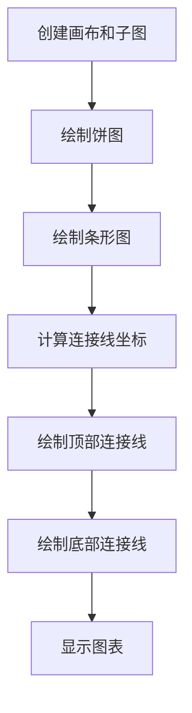

## 类结构

```
该脚本为扁平结构，无自定义类定义
主要使用matplotlib对象层次：
Figure
└── Axes (ax1, ax2)
    └── Patch (ConnectionPatch)
```

## 全局变量及字段


### `fig`
    
matplotlib Figure对象，画布容器

类型：`matplotlib.figure.Figure`
    


### `ax1`
    
matplotlib Axes对象，饼图坐标轴

类型：`matplotlib.axes.Axes`
    


### `ax2`
    
matplotlib Axes对象，条形图坐标轴

类型：`matplotlib.axes.Axes`
    


### `overall_ratios`
    
饼图各部分比例数据 [.27, .56, .17]

类型：`list[float]`
    


### `labels`
    
饼图标签 ['Approve', 'Disapprove', 'Undecided']

类型：`list[str]`
    


### `explode`
    
饼图扇区突出显示参数 [0.1, 0, 0]

类型：`list[float]`
    


### `angle`
    
饼图起始角度，基于第一扇区比例计算

类型：`float`
    


### `pie`
    
饼图返回的 wedges 元组

类型：`tuple`
    


### `age_ratios`
    
条形图各年龄段比例 [.33, .54, .07, .0.06]

类型：`list[float]`
    


### `age_labels`
    
条形图年龄段标签 ['Under 35', '35-49', '50-65', 'Over 65']

类型：`list[str]`
    


### `bottom`
    
条形图堆叠起始位置

类型：`float`
    


### `width`
    
条形图宽度

类型：`float`
    


### `j`
    
循环计数器

类型：`int`
    


### `height`
    
当前条形高度

类型：`float`
    


### `label`
    
当前条形标签

类型：`str`
    


### `bc`
    
条形图容器对象

类型：`matplotlib.container.BarContainer`
    


### `theta1`
    
饼图第一扇区起始角度

类型：`float`
    


### `theta2`
    
饼图第一扇区结束角度

类型：`float`
    


### `center`
    
饼图圆心坐标

类型：`tuple[float, float]`
    


### `r`
    
饼图半径

类型：`float`
    


### `bar_height`
    
条形图总高度

类型：`float`
    


### `x`
    
连接线x坐标

类型：`float`
    


### `y`
    
连接线y坐标

类型：`float`
    


### `con`
    
连接线补丁对象

类型：`matplotlib.patches.ConnectionPatch`
    


    

## 全局函数及方法


### `plt.subplots`

创建画布和坐标轴，返回包含图形和坐标轴的元组。

参数：

- `nrows`：`int`，默认值为 1，子图网格的行数。
- `ncols`：`int`，默认值为 1，子图网格的列数。
- `figsize`：`tuple[float, float]`，默认值为 `rcParams["figure.figsize"]`（即 [6.4, 4.8]），画布的尺寸（宽度，高度），单位为英寸。
- `squeeze`：`bool`，默认值为 True，如果为 True，则从返回的 Axes 数组中挤出额外的维度。
- `sharex`：`bool` or `str`，默认值为 False，如果为 True，则所有子图共享 x 轴。
- `sharey`：`bool` or `str`，默认值为 False，如果为 True，则所有子图共享 y 轴。
- `gridspec_kw`：`dict`，默认值为 {}，传递给 GridSpec 构造器的关键字参数字典。
- `**kwargs`：字典，传递给图形和子图创建的其他关键字参数。

返回值：`tuple[Figure, Axes or array of Axes]`，返回包含图形对象和坐标轴对象（或坐标轴对象数组）的元组。

#### 流程图

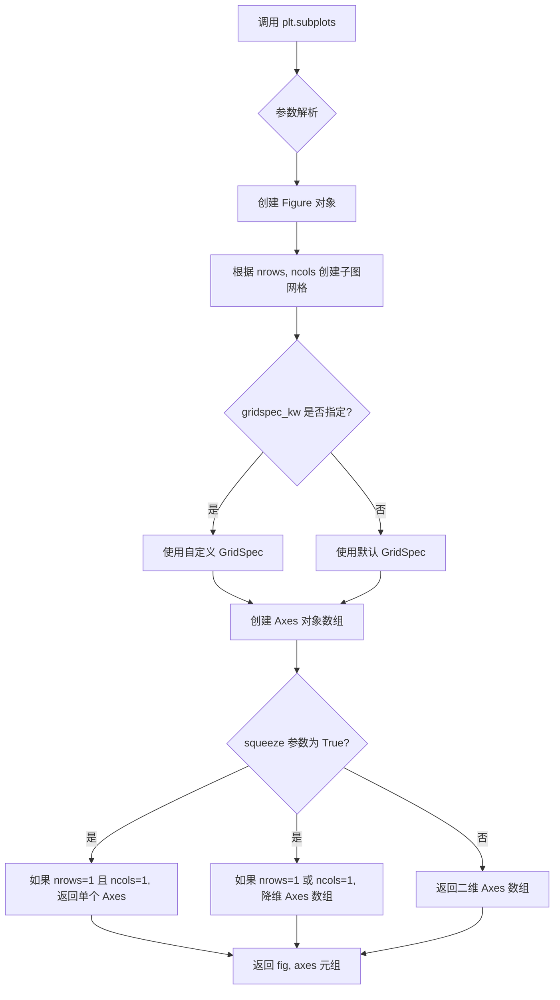

#### 带注释源码

```python
# 导入必要的库
import matplotlib.pyplot as plt
import numpy as np

from matplotlib.patches import ConnectionPatch

# 使用 plt.subplots 创建画布和坐标轴
# 参数说明：
# - 1, 2 表示创建 1 行 2 列的子图网格
# - figsize=(9, 5) 设置画布宽度为 9 英寸，高度为 5 英寸
# 返回值：
# - fig: Figure 对象，代表整个画布
# - (ax1, ax2): 包含两个 Axes 对象的元组，分别代表左侧的饼图和右侧的条形图
fig, (ax1, ax2) = plt.subplots(1, 2, figsize=(9, 5))

# 调整子图之间的水平间距为 0，使两个图紧密相邻
fig.subplots_adjust(wspace=0)

# 饼图参数设置
# overall_ratios: 各部分的比例
overall_ratios = [.27, .56, .17]
# labels: 各部分的标签
labels = ['Approve', 'Disapprove', 'Undecided']
# explode: 第一个切片突出显示
explode = [0.1, 0, 0]
# 计算起始角度，使第一个 wedge 被 x 轴分割
angle = -180 * overall_ratios[0]
# 绘制饼图
# 参数：比例、自动格式化标签、起始角度、标签、突出显示
pie = ax1.pie(overall_ratios, autopct='%1.1f%%', startangle=angle,
              labels=labels, explode=explode)

# 条形图参数设置
age_ratios = [.33, .54, .07, .06]
age_labels = ['Under 35', '35-49', '50-65', 'Over 65']
bottom = 1
width = .2

# 从上往下添加条形，与图例顺序匹配
for j, (height, label) in enumerate(reversed([*zip(age_ratios, age_labels)])):
    bottom -= height
    bc = ax2.bar(0, height, width, bottom=bottom, color='C0', label=label,
                 alpha=0.1 + 0.25 * j)
    ax2.bar_label(bc, labels=[f"{height:.0%}"], label_type='center')

ax2.set_title('Age of approvers')
ax2.legend()
ax2.axis('off')
ax2.set_xlim(- 2.5 * width, 2.5 * width)

# 使用 ConnectionPatch 在两个图之间绘制连接线
theta1, theta2 = pie.wedges[0].theta1, pie.wedges[0].theta2
center, r = pie.wedges[0].center, pie.wedges[0].r
bar_height = sum(age_ratios)

# 绘制顶部连接线
x = r * np.cos(np.pi / 180 * theta2) + center[0]
y = r * np.sin(np.pi / 180 * theta2) + center[1]
con = ConnectionPatch(xyA=(-width / 2, bar_height), coordsA=ax2.transData,
                      xyB=(x, y), coordsB=ax1.transData)
con.set_color([0, 0, 0])
con.set_linewidth(4)
ax2.add_artist(con)

# 绘制底部连接线
x = r * np.cos(np.pi / 180 * theta1) + center[0]
y = r * np.sin(np.pi / 180 * theta1) + center[1]
con = ConnectionPatch(xyA=(-width / 2, 0), coordsA=ax2.transData,
                      xyB=(x, y), coordsB=ax1.transData)
con.set_color([0, 0, 0])
ax2.add_artist(con)
con.set_linewidth(4)

plt.show()
```


### `fig.subplots_adjust`

调整子图的布局参数，用于控制子图之间的间距（水平间距 wspace 和垂直间距 hspace）以及子图与 figure 边缘的距离（left, right, top, bottom）。

参数：

- `left`：`float`，子图左侧与 figure 左侧边缘的距离（ normalized 0-1）
- `right`：`float`，子图右侧与 figure 右侧边缘的距离（ normalized 0-1）
- `top`：`float`，子图顶部与 figure 顶部边缘的距离（ normalized 0-1）
- `bottom`：`float`，子图底部与 figure 底部边缘的距离（ normalized 0-1）
- `wspace`：`float`，子图之间的水平间距（相对于子图宽度）
- `hspace`：`float`，子图之间的垂直间距（相对于子图高度）

返回值：`None`，该方法无返回值，直接修改 figure 的子图布局属性。

#### 流程图

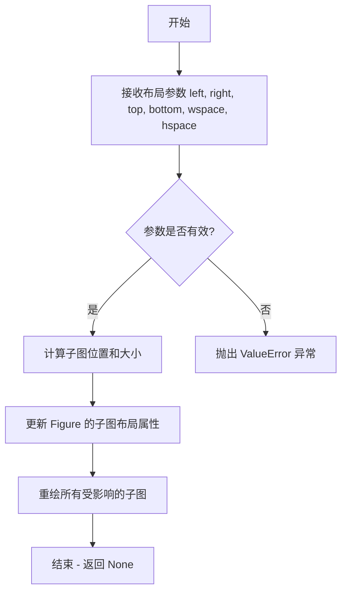

#### 带注释源码

```python
# 使用 fig.subplots_adjust() 调整子图之间的布局间距
# 参数 wspace=0 表示将两个子图之间的水平间距设为0，使它们紧邻在一起
fig.subplots_adjust(wspace=0)
```

#### 在完整上下文中

```python
# 创建包含两个子图的 figure，1行2列
fig, (ax1, ax2) = plt.subplots(1, 2, figsize=(9, 5))

# 调整子图布局参数
# wspace=0 表示子图之间的水平间距为0，使左右子图紧邻
# 这样可以让 pie chart 和 bar chart 连接在一起，形成视觉上的连续性
fig.subplots_adjust(wspace=0)
```

#### 额外说明

| 属性 | 值 |
|------|-----|
| 所属类 | `matplotlib.figure.Figure` |
| 调用方式 | 实例方法 |
| 作用对象 | 当前 figure 的子图布局 |
| 常见用途 | 创建紧凑型多子图布局、连接不同类型图表 |

**技术债务/优化空间**：该函数直接修改全局布局状态，在复杂场景下建议使用 `GridSpec` 对象进行更灵活的布局控制。

**错误处理**：传入无效的数值（如负数或大于1的值）可能导致子图重叠或越界，建议在调用前验证参数范围。


### `Axes.pie`

绘制饼图，返回由楔形（Wedges）、文本标签（Texts）和自动文本（Autotexts）组成的元组，用于展示分类数据的比例分布。

参数：

- `x`：`list 或 array`，饼图各扇区的数值比例或权重
- `explode`：`list 或 array`，可选，默认值为 None，表示每个扇区偏离中心的距离
- `labels`：`list`，可选，默认值为 None，用于标注每个扇区的文字标签
- `colors`：`list`，可选，默认值为 None，扇区的填充颜色序列
- `autopct`：`str 或 callable`，可选，默认值为 None，用于显示百分比格式（如 `'%1.1f%%'`）
- `pctdistance`：`float`，可选，默认值为 0.6，自动文本相对于饼图中心的距离比例
- `shadow`：`bool`，可选，默认值为 False，是否在饼图下方添加阴影
- `startangle`：`float`，可选，默认值为 0，饼图的起始旋转角度（度）
- `radius`：`float`，可选，默认值为 1，饼图的半径长度
- `counterclock`：`bool`，可选，默认值为 True，指定扇区是否按逆时针排列
- `wedgeprops`：`dict`，可选，默认值为 None，传递给楔形对象（Wedge）的参数字典
- `textprops`：`dict`，可选，默认值为 None，传递给文本对象的参数字典
- `center`：`tuple`，可选，默认值为 (0, 0)，饼图的中心坐标
- `frame`：`bool`，可选，默认值为 False，是否显示边框
- `rotatelabels`：`bool`，可选，默认值为 False，是否旋转标签以匹配扇区角度
- `labeldistance`：`float`，可选，默认值为 1.1，标签相对于半径的距离比例

返回值：`tuple(Wedges, Texts, Autotexts)`，返回三个元素的元组
- `Wedges`：matplotlib.patches.Wedge 对象列表，代表饼图的各个扇区
- `Texts`：matplotlib.text.Text 对象列表，代表手动设置的标签文本
- `Autotexts`：matplotlib.text.Text 对象列表，代表自动生成的百分比文本

#### 流程图

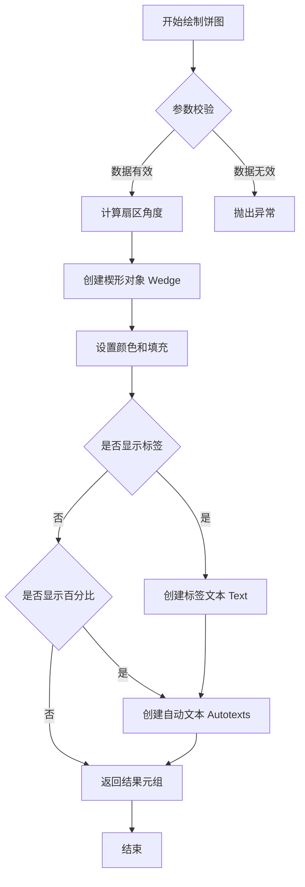

#### 带注释源码

```python
# 示例代码：ax1.pie 的调用方式
# 导入必要的库
import matplotlib.pyplot as plt
import numpy as np

# 创建画布和子图
fig, (ax1, ax2) = plt.subplots(1, 2, figsize=(9, 5))
fig.subplots_adjust(wspace=0)

# 饼图数据参数
overall_ratios = [.27, .56, .17]  # 各扇区的比例数据
labels = ['Approve', 'Disapprove', 'Undecided']  # 扇区标签
explode = [0.1, 0, 0]  # 第一个扇区突出显示，偏离中心 0.1

# 计算起始角度，使第一个楔形被 x 轴分割
angle = -180 * overall_ratios[0]  # angle = -48.6 度

# 调用 pie 方法绘制饼图
# 返回三个元素的元组：wedges, texts, autotexts
pie = ax1.pie(
    overall_ratios,        # 扇区比例数据
    autopct='%1.1f%%',      # 百分比格式：显示一位小数
    startangle=angle,      # 起始旋转角度
    labels=labels,         # 扇区标签
    explode=explode        # 扇区突出偏移量
)

# pie 返回值结构：
# pie[0] - wedges: 楔形对象列表 (list of Wedge)
#   pie.wedges[0] 表示第一个楔形，可访问 .theta1, .theta2, .center, .r 属性
# pie[1] - texts: 标签文本对象列表 (list of Text)
# pie[2] - autotexts: 自动百分比文本对象列表 (list of Text)

# 使用 ConnectionPatch 连接饼图和条形图
theta1, theta2 = pie.wedges[0].theta1, pie.wedges[0].theta2
center, r = pie.wedges[0].center, pie.wedges[0].r
bar_height = sum(age_ratios)

# 计算连接线坐标
x = r * np.cos(np.pi / 180 * theta2) + center[0]
y = r * np.sin(np.pi / 180 * theta2) + center[1]
```


### `Axes.bar`

这是 matplotlib 中 Axes 类的 bar 方法，用于在 Axes 对象上绘制条形图，并返回一个 BarContainer 容器对象，该容器包含所有绘制的条形（BarPatch）和标签。

参数：

- `x`：`float` 或 array-like，条形中心的 x 坐标
- `height`：`float` 或 array-like，条形的高度
- `width`：`float` 或 array-like，条形的宽度（默认 0.8）
- `bottom`：`float` 或 array-like，条形的底部 y 坐标（默认 None，即从 0 开始）
- `align`：`str`，条形的对齐方式，可选 'center' 或 'edge'（默认 'center'）
- `color`：`color` 或 color 列表，条形的填充颜色
- `label`：`str`，条形的标签，用于图例
- `alpha`：`float`，透明度（0-1 之间）

返回值：`~matplotlib.container.BarContainer`，包含所有条形补丁（BarPatch）的容器对象，可用于添加标签

#### 流程图

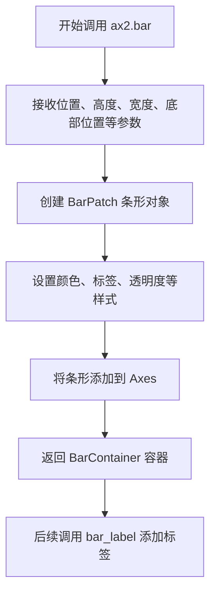

#### 带注释源码

```python
# 在代码中实际调用 bar 方法的位置
for j, (height, label) in enumerate(reversed([*zip(age_ratios, age_labels)])):
    # 每次迭代更新 bottom 位置，实现堆叠效果
    bottom -= height
    
    # 调用 bar 方法绘制单个条形
    # 参数说明：
    # x=0: 条形位于 x=0 位置
    # height: 条形高度来自 age_ratios
    # width=0.2: 条形宽度
    # bottom=bottom: 底部位置（实现堆叠）
    # color='C0': 使用默认颜色
    # label=label: 年龄段标签
    # alpha=0.1 + 0.25 * j: 透明度随索引递增
    bc = ax2.bar(0, height, width, bottom=bottom, color='C0', label=label,
                 alpha=0.1 + 0.25 * j)
    
    # 使用 bar_label 方法在条形中心添加百分比标签
    # 参数 labels 指定显示内容，label_type='center' 表示在条形中心显示
    ax2.bar_label(bc, labels=[f"{height:.0%}"], label_type='center')
```


### `Axes.bar_label`

该方法是 matplotlib 库中 `Axes` 类的一个成员方法，用于在条形图（bar chart）上自动添加数值标签或自定义文本标签，支持多种位置配置（边缘或中心）和格式化选项。

参数：

- `container`：`BarContainer`，由 `Axes.bar()` 返回的容器对象，包含需要添加标签的条形数据。
- `labels`：`list of str`，可选参数，一个字符串列表，用于指定每个条形要显示的文本。如果为 `None`，则自动显示数值。
- `fmt`：`str`，可选参数，格式化字符串，默认为 `'%g'`，用于格式化数值标签（例如 `'%1.1f%%'` 显示百分比）。
- `label_type`：`str`，可选参数，指定标签的位置。可选值为 `'edge'`（条形边缘）或 `'center'`（条形中心），默认为 `'edge'`。
- `padding`：`float`，可选参数，标签与条形边界之间的间距，默认为 0。
- `**kwargs`：可选关键字参数，将传递给 `matplotlib.text.Text` 对象的构造函数，用于自定义文本样式（如字体大小、颜色等）。

返回值：`list[Text]`，返回一个包含所有创建的文本标签对象的列表。

#### 流程图

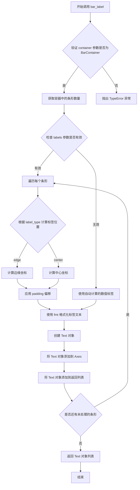

#### 带注释源码

```python
# 示例代码来自 matplotlib 官方示例 "Bar of pie"
# 展示了 bar_label 方法的典型用法

# 创建条形图并获取返回的 BarContainer 对象 bc
bc = ax2.bar(0, height, width, bottom=bottom, color='C0', label=label,
             alpha=0.1 + 0.25 * j)

# 调用 bar_label 方法为条形添加标签
# 参数 container: bc，传入由 bar() 返回的 BarContainer 对象
# 参数 labels: [f"{height:.0%}"]，自定义标签文本，这里将数值格式化为百分比
# 参数 label_type: 'center'，指定标签放置在条形的中心位置
ax2.bar_label(bc, labels=[f"{height:.0%}"], label_type='center')
```


### `ax2.set_title`

设置子图的标题文本和样式。

参数：

- `s`：`str`，要设置的标题文本内容，例如 'Age of approvers'
- `fontdict`：`dict`，可选，用于控制标题外观的字体字典（如 fontfamily, fontsize, fontweight, color 等）
- `loc`：`str`，可选，标题对齐方式，可选值为 'center'（默认）, 'left', 'right'
- `pad`：`float`，可选，标题与 Axes 顶部的间距（以点为单位），默认为 None
- `**kwargs`：可变关键字参数，直接传递给 matplotlib.text.Text 构造函数，用于自定义文本属性

返回值：`matplotlib.text.Text`，返回创建的标题文本对象，可用于后续修改标题样式

#### 流程图

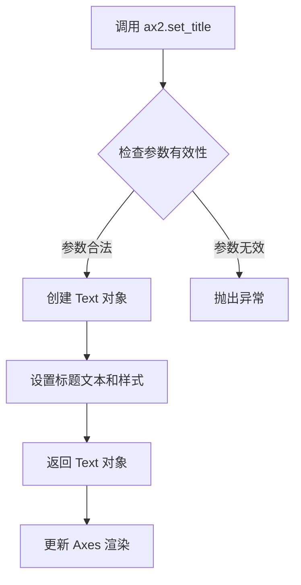

#### 带注释源码

```python
# 在代码中的实际调用
ax2.set_title('Age of approvers')

# 完整的函数签名（来自 matplotlib 库）
# Axes.set_title(self, s, fontdict=None, loc=None, pad=None, **kwargs)

# 参数说明：
# - s: 字符串类型，标题文本 'Age of approvers'
# - fontdict: 默认为 None，可传入如 {'fontsize': 12, 'fontweight': 'bold'}
# - loc: 默认为 'center'，可选 'left' 或 'right'
# - pad: 默认为 None，通常为标题与轴顶部的距离（单位：点）
# - **kwargs: 可传入 color, fontsize, fontweight, rotation 等 Text 属性

# 返回值：
# 返回一个 matplotlib.text.Text 对象，可以赋值给变量进行后续操作
# 例如：title = ax2.set_title('Age of approvers')
#      title.set_fontsize(16)
#      title.set_color('red')
```


### ax2.legend

描述：`ax2.legend()` 是 matplotlib 库中 `Axes` 类的方法，用于自动收集并显示当前 Axes 上的图例条目，通常与 `label` 参数配合使用，将数据系列的名称显示为图例。

参数：

- 此调用未使用任何参数，使用默认行为
- 完整方法签名包含以下可选参数：
  - `*labels`：`list of str`，图例项的标签列表
  - `handles`：`list of Artist`，要添加的图例句柄
  - `loc`：`str` 或 `int`，图例位置（如 `'best'`, `'upper right'`）
  - `bbox_to_anchor`：`tuple`，用于定位图例的外部坐标
  - `ncol`：`int`，图例列数
  - `fontsize`：`int`，字体大小
  - `title`：`str`，图例标题

返回值：`matplotlib.legend.Legend`，返回创建的 Legend 对象，可用于进一步自定义

#### 流程图

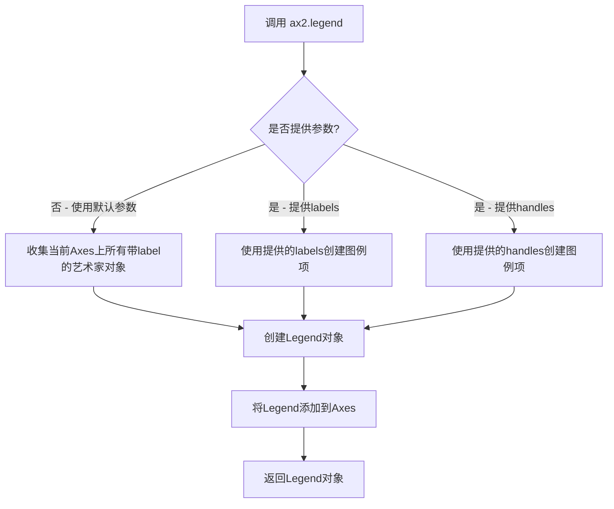

#### 带注释源码

```python
# 在示例代码中的调用位置（第47行）
ax2.set_title('Age of approvers')  # 设置子图标题
ax2.legend()                        # 调用legend方法显示图例
ax2.axis('off')                     # 隐藏坐标轴
ax2.set_xlim(- 2.5 * width, 2.5 * width)

# ax2.legend() 的内部逻辑简化说明：
#
# 1. 首先，legend() 方法会扫描 ax2 上的所有艺术家对象（如条形图 BarContainer）
# 2. 检查这些对象是否具有 'label' 属性且不为空
# 3. 在示例代码中，bc = ax2.bar(..., label=label) 创建的每个条形图容器
#    都被赋予了标签（'Under 35', '35-49', '50-65', 'Over 65'）
# 4. legend() 方法收集这些标签，并从对应的艺术家对象获取图例句柄
# 5. 创建一个 Legend 对象，默认放置在 Axes 的 'best' 位置
# 6. 将 Legend 对象添加到 Axes 的 legend 属性，并渲染到图表上
#
# 调用效果：
# 在图表的右上角显示四个彩色矩形条，每个旁边标注对应的年龄组名称
```


### `ax2.axis`

控制坐标轴的显示/隐藏状态，是matplotlib中Axes类的方法，用于开启、关闭或设置坐标轴的属性。

参数：

- `visible`：布尔值或字符串，指定坐标轴的显示状态。可选值包括 `'on'`/`True`（显示）、`'off'`/`False`（隐藏）、`'equal'`（等比例）、`'scaled'`（缩放）、`'tight'`（紧凑）、`'auto'`（自动）等

返回值：`tuple`，返回坐标轴边界和范围的元组 `(xmin, xmax, ymin, ymax)`，或者在设置为'off'时返回None

#### 流程图

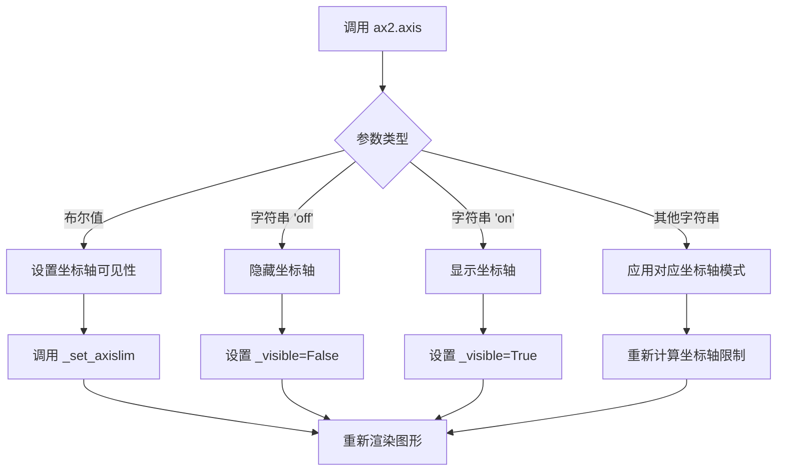

#### 带注释源码

```python
# matplotlib.axes.Axes.axis 核心实现逻辑

def axis(self, visible=None, *args, **kwargs):
    """
    控制坐标轴的显示/隐藏或设置坐标轴属性
    
    参数:
        visible: 布尔值或字符串
            - True/'on': 显示坐标轴
            - False/'off': 隐藏坐标轴
            - 'equal': 设置等比例坐标
            - 'scaled': 缩放坐标
            - 'tight': 紧凑布局
            - 'auto': 自动计算
    """
    
    # 处理 'off' 字符串 - 隐藏坐标轴
    if visible is not None and visible == 'off':
        # 遍历x轴和y轴，设置可见性为False
        for ax in self._axaxis:
            ax.set_visible(False)
        # 关闭轴脊（边框）
        for sp in self.spines.values():
            sp.set_visible(False)
        return None
    
    # 处理 'on' 字符串 - 显示坐标轴
    if visible is not None and visible == 'on':
        for ax in self._axaxis:
            ax.set_visible(True)
        for sp in self.spines.values():
            sp.set_visible(True)
    
    # 处理其他参数（坐标轴范围、比例等）
    if args or kwargs:
        # 调用底层方法设置坐标轴属性
        return self._set_axislim(visible=visible, *args, **kwargs)
    
    # 返回坐标轴边界 (xmin, xmax, ymin, ymax)
    return self._get_axislim()
```


### `ax2.set_xlim`

设置x轴（x-axis）的显示范围，限制图表在x轴方向上显示的数据区间。

参数：

- `left`：`float`，x轴的左边界值，定义x轴显示范围的最小值
- `right`：`float`，x轴的右边界值，定义x轴显示范围的最大值

返回值：`tuple`，返回新的x轴边界值 (left, right)

#### 流程图

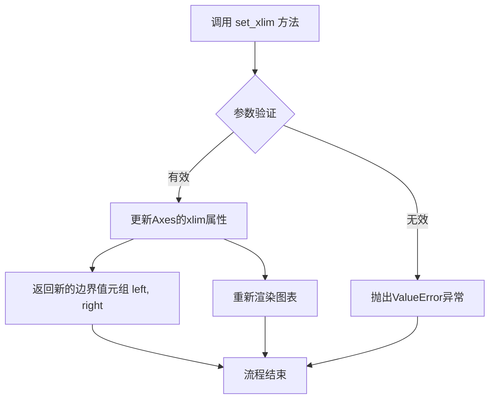

#### 带注释源码

```python
# 设置x轴的显示范围
# left = -2.5 * width = -0.5
# right = 2.5 * width = 0.5
# 这里的width = 0.2，所以范围是[-0.5, 0.5]
ax2.set_xlim(- 2.5 * width, 2.5 * width)

# 底层实现原理（简化版）：
# def set_xlim(self, left=None, right=None, emit=True, auto=False, xmin=None, xmax=None):
#     """
#     设置x轴的上下限
#     
#     参数:
#         left: x轴下限（左边界的数值）
#         right: x轴上限（右边界的数值）
#         emit: 布尔值，变化时是否通知观察者（如轴 Autoscaling）
#         auto: 布尔值，是否启用自动边界调整
#     
#     返回:
#         tuple: 新的 (left, right) 边界值
#     """
#     self._process_unit_info(xdata=(left, right))
#     # 更新内部存储的xlim数据
#     self._xmin = left
#     self._xmax = right
#     # 通知观察者边界已更改（如果emit=True）
#     if emit:
#         self.callbacks.process('xlim_changed', self)
#     # 返回新的边界值
#     return (left, right)
```


### `ax2.add_artist`

向坐标轴（Axes）添加一个艺术家对象（Artist），使其成为坐标轴的一部分并可被渲染。

参数：
- `artist`：`matplotlib.artist.Artist`，需要添加的艺术家对象（例如 ConnectionPatch、Rectangle 等）。

返回值：`matplotlib.artist.Artist`，返回添加的艺术家对象，通常是同一个对象。

#### 流程图

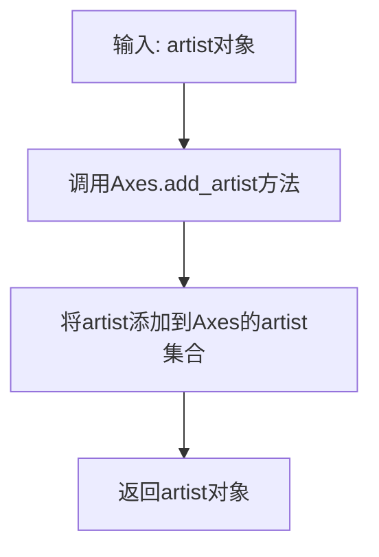

#### 带注释源码

在代码中，有两次调用 `add_artist`，用于将 ConnectionPatch 对象添加到 ax2 坐标轴上。以下是第一次调用的源码及注释：

```python
# 创建连接线对象，连接饼图和条形图
con = ConnectionPatch(xyA=(-width / 2, bar_height), coordsA=ax2.transData,
                      xyB=(x, y), coordsB=ax1.transData)
# 设置连接线颜色为黑色
con.set_color([0, 0, 0])
# 设置连接线宽度为4
con.set_linewidth(4)
# 将连接线对象添加到ax2坐标轴上，使其成为坐标轴的一部分
ax2.add_artist(con)
```

第二次调用类似：

```python
# 再次创建连接线对象
con = ConnectionPatch(xyA=(-width / 2, 0), coordsA=ax2.transData,
                      xyB=(x, y), coordsB=ax1.transData)
con.set_color([0, 0, 0])
# 第二次添加到ax2坐标轴
ax2.add_artist(con)
con.set_linewidth(4)
```


### `ConnectionPatch`

ConnectionPatch是matplotlib.patches模块中的一个类，用于在两个不同的坐标系统之间绘制连接线（常用于将子图中的元素进行视觉连接）。在代码中，它被用于连接饼图的第一块和条形图，创建一个"条形饼图"的视觉效果。

参数：

- `xyA`：元组(float, float)，连接线在坐标系A中的终点坐标
- `coordsA`：str 或 `matplotlib.transforms.Transform`，坐标系A的坐标系统指定器（如ax.transData、ax.transAxes）
- `xyB`：元组(float, float)，连接线在坐标系B中的起点坐标
- `coordsB`：str 或 `matplotlib.transforms.Transform`，坐标系B的坐标系统指定器
- `axesA`：matplotlib.axes.Axes，可选，坐标系A对应的Axes对象，默认为None
- `axesB`：matplotlib.axes.Axes，可选，坐标系B对应的Axes对象，默认为None
- `arrowstyle`：str 或 `matplotlib.patches.ArrowStyle`，可选，箭头样式，默认为None（无箭头）
- `connectionstyle`：str 或 `matplotlib.patches.ConnectionStyle`，可选，连接线样式，默认为"arc3"
- `patchA`：matplotlib.patches.Patch，可选，连接线起点的补丁对象，默认为None
- `patchB`：matplotlib.patches.Patch，可选，连接线终点的补丁对象，默认为None
- `shrinkA`：float，可选，起点的收缩距离，默认为2
- `shrinkB`：float，可选，终点的收缩距离，默认为2
- `mutation_scale`：float，可选，箭头/连接样式的缩放比例，默认为1
- `clip_on`：bool，可选，是否启用裁剪，默认为False
- `snap`：bool，可选，是否捕捉到像素边界，默认为None
- `width`：float，可选，连接线宽度，默认为None（使用箭头样式默认值）
- `headwidth`：float，可选，箭头头部宽度，默认为3
- `headlength`：float，可选，箭头头部长度，默认为5
- `color`：颜色，可选，连接线颜色，默认为"k"（黑色）
- `linewidth`：float，可选，连接线线宽，默认为None（使用箭头样式默认值）
- `linestyle`：str，可选，连接线线型，默认为"-"（实线）

返回值：`matplotlib.patches.ConnectionPatch`，返回创建的连接线补丁对象

#### 流程图

```mermaid
graph TD
    A[开始创建ConnectionPatch] --> B[定义连接线起点坐标xyA和对应坐标系统coordsA]
    B --> C[定义连接线终点坐标xyB和对应坐标系统coordsB]
    C --> D[创建ConnectionPatch对象con]
    D --> E[设置连接线颜色set_color]
    E --> F[设置连接线线宽set_linewidth]
    F --> G[将连接线添加到Axes中add_artist]
    G --> H[完成连接线绘制]
    
    subgraph 第一个连接线
    B1[xyA=(-width/2, bar_height)<br/>coordsA=ax2.transData<br/>xyB=(x2, y2)<br/>coordsB=ax1.transData]
    end
    
    subgraph 第二个连接线
    B2[xyA=(-width/2, 0)<br/>coordsA=ax2.transData<br/>xyB=(x1, y1)<br/>coordsB=ax1.transData]
    end
```

#### 带注释源码

```python
# ============================================================
# 使用ConnectionPatch创建连接线 - 代码片段解析
# ============================================================

# ------------------------------------------------------------
# 第一个ConnectionPatch: 连接饼图顶部和条形图顶部
# ------------------------------------------------------------

# 计算饼图第一个扇形顶部边缘在数据坐标系中的坐标
# theta2是饼图第一块扇形的终止角度（度）
# r是饼图的半径
# center是饼图的中心点坐标
x = r * np.cos(np.pi / 180 * theta2) + center[0]  # 转换为弧度并计算x坐标
y = r * np.sin(np.pi / 180 * theta2) + center[1]  # 转换为弧度并计算y坐标

# 创建ConnectionPatch对象
# 参数说明：
#   xyA=(-width / 2, bar_height)  : 条形图上的连接点坐标（数据坐标）
#   coordsA=ax2.transData          : 条形图的坐标系（数据坐标系）
#   xyB=(x, y)                     : 饼图上的连接点坐标（数据坐标）
#   coordsB=ax1.transData          : 饼图的坐标系（数据坐标系）
con = ConnectionPatch(xyA=(-width / 2, bar_height), coordsA=ax2.transData,
                      xyB=(x, y), coordsB=ax1.transData)

# 设置连接线颜色为黑色 [0, 0, 0]
con.set_color([0, 0, 0])

# 设置连接线宽度为4
con.set_linewidth(4)

# 将ConnectionPatch添加到ax2的艺术家列表中
# 这样连接线才会被绘制出来
ax2.add_artist(con)

# ------------------------------------------------------------
# 第二个ConnectionPatch: 连接饼图底部和条形图底部
# ------------------------------------------------------------

# 计算饼图第一个扇形底部边缘在数据坐标系中的坐标
# theta1是饼图第一块扇形的起始角度（度）
x = r * np.cos(np.pi / 180 * theta1) + center[0]
y = r * np.sin(np.pi / 180 * theta1) + center[1]

# 创建第二个连接线
con = ConnectionPatch(xyA=(-width / 2, 0), coordsA=ax2.transData,
                      xyB=(x, y), coordsB=ax1.transData)

# 设置连接线颜色为黑色
con.set_color([0, 0, 0])

# 将连接线添加到ax2
ax2.add_artist(con)

# 设置连接线宽度为4
con.set_linewidth(4)

# ------------------------------------------------------------
# ConnectionPatch的关键特性说明：
# ------------------------------------------------------------
# 1. 支持不同的坐标系:
#    - ax.transData     : 数据坐标系（原始坐标）
#    - ax.transAxes     : 轴坐标系（0-1范围）
#    - ax.transFigure   : 图形坐标系（0-1范围）
#    - plt.gca().transData : 当前Axes的数据坐标系
#
# 2. 坐标转换:
#    - ConnectionPatch会自动处理两个不同坐标系之间的坐标转换
#    - 这使得在不同子图之间绘制连接线变得简单
#
# 3. 常用方法:
#    - set_color(color)           : 设置颜色
#    - set_linewidth(width)       : 设置线宽
#    - set_linestyle(style)       : 设置线型
#    - set_alpha(alpha)           : 设置透明度
#    - set_arrowstyle(style)      : 设置箭头样式
#    - get_path()                 : 获取连接线的路径对象
# ------------------------------------------------------------
```


### np.cos

这是 NumPy 库中的余弦函数，用于计算角度（弧度）的余弦值。在该代码中，它被用于将饼图切片的极坐标角度转换为笛卡尔坐标系的 x 坐标。

参数：

- `angle`：`float` 或 `array_like`，输入角度，单位为弧度。在代码中通过 `np.pi / 180 * theta` 将角度（度）转换为弧度后传入。

返回值：`float` 或 `ndarray`，返回输入角度的余弦值，范围在 [-1, 1] 之间。

#### 流程图

```mermaid
flowchart TD
    A[开始] --> B[接收弧度角度参数]
    B --> C[计算余弦值]
    C --> D[返回余弦结果]
    D --> E[用于极坐标到笛卡尔坐标转换]
    
    subgraph 具体应用
    F[theta: 饼图切片角度] --> G[乘以 np.pi/180 转换为弧度]
    G --> H[调用 np.cos 计算余弦]
    H --> I[乘以半径 r]
    I --> J[加上中心点 x 坐标 center[0]]
    J --> K[得到笛卡尔坐标系 x 坐标]
    end
```

#### 带注释源码

```python
# 在 matplotlib 的 bar_of_pie 示例中，np.cos 的具体使用

# 第一条连接线的计算（顶部连接线）
# theta2 是第一个饼图切片的终止角度（度）
# 步骤1: 将角度转换为弧度
radians_theta2 = np.pi / 180 * theta2

# 步骤2: 计算余弦值（得到 x 方向的分量）
cos_theta2 = np.cos(radians_theta2)

# 步骤3: 乘以半径 r 并加上中心点 x 坐标，得到绝对 x 坐标
x = r * cos_theta2 + center[0]

# 同样地，第二条连接线的计算（底部连接线）
# theta1 是第一个饼图切片的起始角度（度）
radians_theta1 = np.pi / 180 * theta1
cos_theta1 = np.cos(radians_theta1)
x = r * cos_theta1 + center[0]

# 等价的三角函数调用（np.sin 用于计算 y 坐标）
# y = r * np.sin(np.pi / 180 * theta2) + center[1]
```

#### 关键技术细节

| 项目 | 描述 |
|------|------|
| 函数定位 | NumPy 库数学函数 |
| 输入单位 | 弧度（非度） |
| 输出范围 | [-1, 1] |
| 代码中的作用 | 极坐标 → 笛卡尔坐标转换 |
| 配套函数 | 通常与 `np.sin` 配合使用完成坐标转换 |


### `np.sin`

正弦函数，用于计算角度（弧度）的正弦值。在该代码中用于将角度转换为笛卡尔坐标系中的 y 坐标，结合 ConnectionPatch 在饼图和条形图之间绘制连接线。

参数：

-  `x`：`float` 或 `array-like`，输入的角度值（弧度制）

返回值：`float` 或 `ndarray`，输入角度的正弦值（范围在 -1 到 1 之间）

#### 流程图

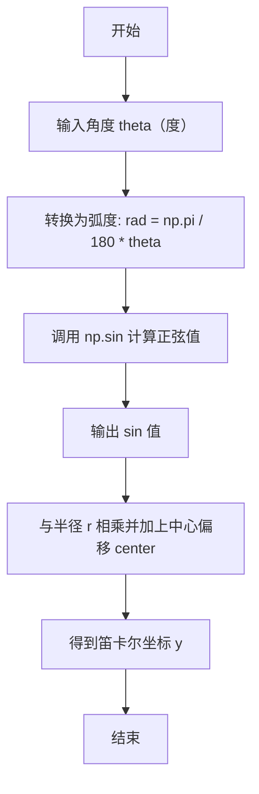

#### 带注释源码

```python
# 从代码中提取的 np.sin 使用示例

# 第一条连接线（顶部）
# 将角度 theta2（度）转换为弧度，然后计算正弦值得到 y 坐标
x = r * np.cos(np.pi / 180 * theta2) + center[0]  # x 坐标：半径 * cos(弧度) + 中心x
y = r * np.sin(np.pi / 180 * theta2) + center[1]  # y 坐标：半径 * sin(弧度) + 中心y

# 第二条连接线（底部）
# 同样的计算方式，用于 theta1 角度
x = r * np.cos(np.pi / 180 * theta1) + center[0]  # x 坐标计算
y = r * np.sin(np.pi / 180 * theta1) + center[1]  # y 坐标计算

# np.sin 函数说明：
# - 输入：弧度制的角度值
# - 输出：该角度的正弦值（-1 到 1 之间的浮点数）
# - 在此场景中：配合 np.cos 将极坐标（角度、半径）转换为笛卡尔坐标（x、y）
```


### `plt.show`

该函数是Matplotlib库中用于显示所有已创建图表的核心函数。它会阻塞程序执行并打开一个交互式窗口，展示当前figure对象中的所有图形内容，直到用户关闭该窗口。

参数：

- `*args`：可变位置参数，传递给show函数的额外参数（通常不使用）。
- `**kwargs`：可变关键字参数，以关键字形式传递给show函数的额外参数（通常不使用）。

返回值：`None`，该函数不返回任何值，仅用于图形展示。

#### 流程图

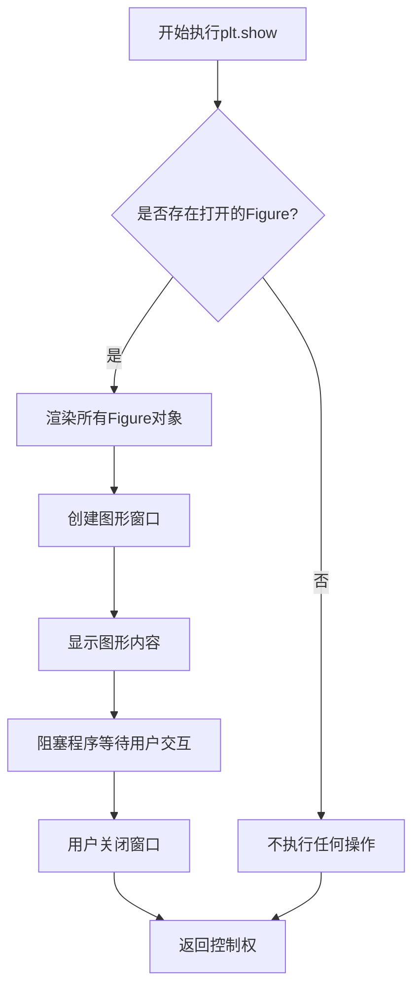

#### 带注释源码

```python
# plt.show 函数是 matplotlib.pyplot 模块的核心显示函数
# 位置：matplotlib.pyplot 模块

# 函数签名：plt.show(*, block=None)
# 
# 参数说明：
# - block: 布尔值或None，可选参数
#   * True: 阻塞调用，显示窗口并等待用户关闭
#   * False: 在某些后端中非阻塞运行
#   * None: 默认值，根据后端和行为自动决定
#
# 返回值：None
#
# 使用示例（来自提供的代码）：
plt.show()

# 代码解析：
# 1. fig, (ax1, ax2) = plt.subplots(1, 2, figsize=(9, 5))
#    创建包含两个子图的Figure对象
#
# 2. pie = ax1.pie(overall_ratios, ...)
#    在ax1上绘制饼图，返回饼图对象
#
# 3. bc = ax2.bar(0, height, width, ...)
#    在ax2上绘制条形图
#
# 4. con = ConnectionPatch(...)
#    添加连接线，连接饼图和条形图
#
# 5. plt.show()
#    最终调用show()函数，将所有创建的图形渲染并显示给用户
#    程序会阻塞在此处，直到用户关闭显示窗口
```


## 关键组件


### 饼图与条形图组合布局

使用matplotlib的subplots创建1x2的子图布局，左侧为饼图展示整体比例，右侧为条形图展示第一个饼图切片的详细分解

### 饼图绘制组件

使用ax1.pie()绘制饼图，设置autopct显示百分比，startangle旋转使第一个 wedge 被x轴分开，explode参数将第一个切片突出显示

### 条形图绘制组件

使用ax2.bar()从顶部向下堆叠绘制条形图，通过bar_label在条形中心添加百分比标签，展示第一个切片（赞成者）的年龄分布

### 连接线组件

使用matplotlib.patches.ConnectionPatch在饼图切片边缘和条形图之间绘制两条连接线，通过坐标转换（transData）实现不同坐标系之间的对齐

### 坐标计算组件

使用numpy计算极坐标到笛卡尔坐标的转换，根据饼图切片的theta1、theta2角度和半径r计算连接线的端点坐标


## 问题及建议


### 已知问题

-   **全局作用域代码缺乏封装**：所有代码直接在模块级别执行，未封装为可复用的函数或类，导致难以在其他项目中复用或进行单元测试。
-   **硬编码数据缺乏灵活性**：数据（`overall_ratios`、`age_ratios`、`labels`等）直接硬编码，若数据源变化需要直接修改代码核心逻辑。
-   **魔数使用降低可读性**：多处使用未命名的数值如`0.1 + 0.25 * j`、`- 2.5 * width`、`180`等，缺乏常量定义影响可读性和维护性。
-   **变量命名混淆**：`pie`变量实际接收的是`ax1.pie()`返回的元组列表（非单一pie对象），命名具有误导性；`con`变量被重复用于两个不同的连接线对象。
-   **重复代码模式**：绘制上下两条连接线的代码结构高度相似，仅参数不同，可抽象为通用函数减少冗余。
-   **缺少类型注解**：无Python类型提示，降低了静态分析工具的效能和代码自文档化能力。
-   **API兼容性风险**：使用`ax2.bar_label()`（matplotlib 3.4+新增API）和`ConnectionPatch`的部分属性，旧版本matplotlib可能不支持。
-   **错误处理缺失**：未对输入数据进行验证（如比例总和是否为1、是否为空列表等），也未处理`pie.wedges`可能为空的情况。

### 优化建议

-   将核心图表创建逻辑封装为函数，接受数据参数并返回图表对象，提高可复用性。
-   将数据定义为配置文件或外部参数，使用 dataclass 或 NamedTuple 定义数据结构。
-   提取魔数为模块级常量或配置类，命名应具有描述性（如`DEFAULT_BAR_WIDTH`、`CONNECTION_LINE_WIDTH`等）。
-   重命名变量：`pie`改为`pie_elements`或`pie_returns`，分别为两个连接线对象使用独立变量名如`con_top`和`con_bottom`。
-   抽象连接线绘制逻辑为通用函数，参数化起点坐标、终点坐标和样式配置。
-   添加Python类型注解（typing），使用`matplotlib.axes.Axes`、`matplotlib.figure.Figure`等类型提示。
-   添加版本检查或try-except包装兼容性问题代码，使用`matplotlib.__version__`进行版本判断。
-   添加数据验证函数，检查比例数组总和、标签长度匹配等前置条件，并给出有意义的错误信息。
-   考虑使用面向对象设计，创建`BarOfPieChart`类封装图表创建逻辑和配置。


## 其它


### 设计目标与约束

本代码的设计目标是创建一个"bar of pie"（饼中条）复合图表，用于直观展示调查数据中"赞成"群体的年龄分布特征。约束条件包括：使用matplotlib作为唯一可视化库，图表需同时展示饼图和条形图两部分，且两者之间需要通过连接线保持视觉关联。整体布局采用1x2的子图结构，左侧为饼图，右侧为条形图，两者共享相同的图形空间以形成统一的视觉效果。

### 错误处理与异常设计

代码主要依赖matplotlib和numpy库进行数据可视化。潜在的错误场景包括：数据比例数组总和不为1导致饼图显示异常、标签数组与比例数组长度不匹配、ConnectionPatch坐标计算错误导致连线位置不正确等。代码中通过固定的数据结构（列表）提供数据，未包含显式的异常捕获机制。在实际应用中应添加数据验证逻辑，确保overall_ratios和age_ratios的总和符合预期，标签数量与数据点数量一致，以及ConnectionPatch的坐标参数在有效范围内。

### 数据流与状态机

数据流从输入数据（比例和标签）开始，经过以下处理流程：首先计算饼图旋转角度，使第一块切片与x轴对齐；然后绘制饼图并获取第一块切片的参数（theta1, theta2, center, r）；接着根据年龄比例数据从下往上堆叠绘制条形图；最后根据饼图切片的边界角度计算连接线的端点坐标，使用ConnectionPatch在两个子图之间绘制两条连线。状态转换主要体现在图表元素的逐步构建过程中：创建画布 → 绘制饼图 → 绘制条形图 → 添加连接线 → 显示图表。

### 外部依赖与接口契约

代码依赖以下外部库：matplotlib（版本需支持ConnectionPatch、bar_label等API）、numpy（用于三角函数计算）。关键接口包括：plt.subplots()返回Figure和Axes对象元组；ax1.pie()返回包含Wedge对象的元组；ax2.bar()返回BarContainer对象；ax2.bar_label()用于在条形图上添加标签；ConnectionPatch构造函数接收xyA（坐标A）、coordsA（坐标A的坐标系）、xyB（坐标B）、coordsB（坐标B的坐标系）等参数。所有绘图操作遵循matplotlib的对象层次结构，Figure包含Axes，Axes包含各种图形元素（Patch、Artist等）。

### 性能考虑

代码的性能开销主要来自于图表渲染过程，数据量较小（仅包含7个数据点），对内存和计算资源的需求极低。潜在的优化方向包括：如果数据量增大，可考虑使用bar_label的fmt参数控制标签格式以减少字符串格式化开销；对于大量图表实例，可将Figure对象的创建和保存进行缓存复用。ConnectionPatch的添加操作在每条连接线创建时都会调用add_artist，如果需要大量连接线可考虑批量处理。

### 可测试性

由于本代码为一次性可视化脚本而非函数库，其可测试性主要体现在视觉输出验证上。测试策略可包括：单元测试验证数据计算的准确性（如角度转换、三角函数计算）；集成测试验证图表对象的正确创建（如饼图切片数量、条形图柱状数量、连接线添加成功）；回归测试对比渲染输出图像的像素级差异。代码结构清晰地将数据参数与绘图逻辑分离，便于提取为可测试的函数单元。

### 配置与参数管理

代码中的可配置参数包括：overall_ratios（饼图比例）、labels（饼图标签）、explode（饼图分离距离）、age_ratios（条形图比例）、age_labels（条形图标签）、width（条形宽度）、angle（饼图起始角度）等。这些参数目前以硬编码形式存在，更好的设计是将所有可视化配置封装为配置字典或YAML/JSON配置文件，支持通过参数调整实现不同数据的可视化而不修改代码逻辑。配色方案目前使用matplotlib的默认色系C0，可考虑提取为可配置的配色方案。


    