# `matplotlib\galleries\examples\pie_and_polar_charts\nested_pie.py` 详细设计文档

这是一个Matplotlib示例代码，演示了两种创建嵌套饼图（甜甜圈图表）的方法：第一种使用ax.pie()方法通过设置wedgeprops的width参数实现环形效果，第二种使用极坐标系的ax.bar()方法通过条形图模拟饼图。

## 整体流程

```mermaid
graph TD
    A[开始] --> B[导入matplotlib.pyplot和numpy]
B --> C[方法1: 使用ax.pie创建嵌套饼图]
C --> C1[创建子图fig, ax = plt.subplots]
C1 --> C2[定义size=0.3和vals数据数组]
C2 --> C3[获取tab20c颜色序列]
C3 --> C4[设置外圈颜色outer_colors]
C4 --> C5[设置内圈颜色inner_colors]
C5 --> C6[绘制外圈饼图: ax.pie(vals.sum(axis=1), radius=1, colors=outer_colors, wedgeprops=dict(width=size, edgecolor='w'))]
C6 --> C7[绘制内圈饼图: ax.pie(vals.flatten(), radius=1-size, colors=inner_colors, wedgeprops=dict(width=size, edgecolor='w'))]
C7 --> C8[设置坐标轴属性: ax.set(aspect='equal', title='Pie plot with `ax.pie`')]
C8 --> C9[显示图形: plt.show]
C9 --> D[方法2: 使用极坐标条形图创建嵌套饼图]
D --> D1[创建极坐标子图: fig, ax = plt.subplots(subplot_kw=dict(projection='polar'))]
D1 --> D2[定义size和vals数据]
D2 --> D3[归一化vals到2π: valsnorm = vals/np.sum(vals)*2*np.pi]
D3 --> D4[计算条形图边缘位置: valsleft = np.cumsum(np.append(0, valsnorm.flatten()[:-1])).reshape(vals.shape)]
D4 --> D5[获取颜色映射: cmap = plt.colormaps['tab20c']]
D5 --> D6[设置外圈和内圈颜色]
D6 --> D7[绘制外圈条形图: ax.bar(x=valsleft[:, 0], width=valsnorm.sum(axis=1), bottom=1-size, height=size, ...)]
D7 --> D8[绘制内圈条形图: ax.bar(x=valsleft.flatten(), width=valsnorm.flatten(), bottom=1-2*size, height=size, ...)]
D8 --> D9[设置标题和隐藏坐标轴: ax.set(title=...), ax.set_axis_off()]
D9 --> D10[显示图形: plt.show]
D10 --> E[结束]
```

## 类结构

```
该脚本为面向过程代码，无类定义
主要使用matplotlib.pyplot和numpy库
包含两个主要的可视化实现方法
```

## 全局变量及字段


### `fig`
    
图形容器对象

类型：`matplotlib.figure.Figure`
    


### `ax`
    
坐标轴/绘图区域对象

类型：`matplotlib.axes.Axes`
    


### `size`
    
环形宽度参数

类型：`float`
    


### `vals`
    
三组二维数据数组

类型：`numpy.ndarray`
    


### `tab20c`
    
tab20c颜色序列列表

类型：`list`
    


### `outer_colors`
    
外圈饼图颜色列表

类型：`list`
    


### `inner_colors`
    
内圈饼图颜色列表

类型：`list`
    


### `valsnorm`
    
归一化到2π的数据数组

类型：`numpy.ndarray`
    


### `valsleft`
    
条形图边缘位置数组

类型：`numpy.ndarray`
    


### `cmap`
    
颜色映射对象

类型：`matplotlib.colors.Colormap`
    


    

## 全局函数及方法


### `plt.subplots`

`plt.subplots` 是 Matplotlib 库中的一个函数，用于创建一个新的图形（Figure）和一个或多个子图坐标轴（Axes）。它是对 `figure()` 和 `add_subplot()` 的封装，提供了一种更便捷的方式来同时创建图形及其坐标轴对象。

参数：

- `nrows`：`int`，可选，默认值为 1，表示子图的行数。
- `ncols`：`int`，可选，默认值为 1，表示子图的列数。
- `sharex`：`bool` 或 `str`，可选，默认值为 False。如果为 True，则所有子图共享 x 轴；如果为 'row'，则每行的子图共享 x 轴；如果为 'col'，则每列的子图共享 x 轴。
- `sharey`：`bool` 或 `str`，可选，默认值为 False。如果为 True，则所有子图共享 y 轴；如果为 'row'，则每行的子图共享 y 轴；如果为 'col'，则每列的子图共享 y 轴。
- `squeeze`：`bool`，可选，默认值为 True。如果为 True，则返回的 axes 数组维度会被压缩：对于单行或单列会返回一维数组，否则返回二维数组。
- `width_ratios`：`array-like`，可选，定义每列子图的相对宽度。
- `height_ratios`：`array-like`，可选，定义每行子图的相对高度。
- `subplot_kw`：`dict`，可选，传递给 `add_subplot` 的关键字参数，用于配置子图属性，例如 `projection='polar'` 用于创建极坐标图。
- `gridspec_kw`：`dict`，可选，传递给 `GridSpec` 构造函数的关键参数，用于配置网格布局。
- `figsize`：`tuple`，可选，定义图形的宽和高（英寸）。
- `dpi`：`int`，可选，定义图形的分辨率（每英寸点数）。
- `facecolor`：`color`，可选，图形背景色。
- `edgecolor`：`color`，可选，图形边框色。
- `linewidth`：`float`，可选，图形边框宽度。
- `tight_layout`：`bool`，可选，如果为 True，则自动调整子图参数以适应图形区域。

返回值：`tuple`，返回 (fig, ax) 元组，其中 fig 是 Figure 对象，ax 是 Axes 对象（当 nrows=1 且 ncols=1 时）或 Axes 数组（当有多个子图时）。

#### 流程图

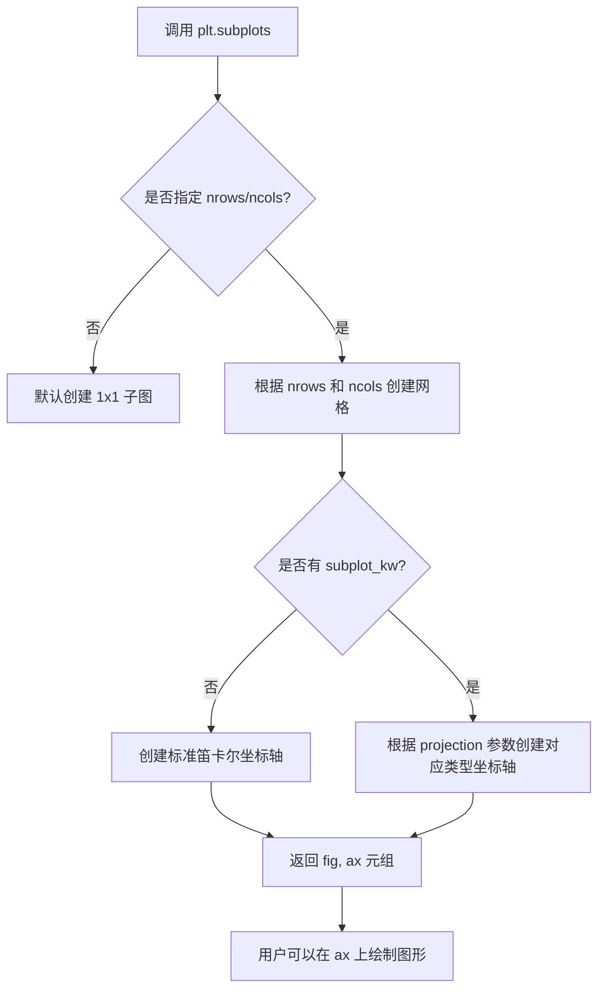

#### 带注释源码

```python
# 示例 1：创建标准 2D 坐标轴的子图
# 这是代码中使用的方式，用于绘制普通的嵌套饼图
fig, ax = plt.subplots()

# 等价于以下操作的组合：
# fig = plt.figure()  # 创建图形
# ax = fig.add_subplot(111)  # 添加子图
# 但 subplots 更简洁，直接返回 figure 和 axes 对象

# ---------------------------------------------------------

# 示例 2：创建极坐标系统的子图
# 这是代码中第二种使用方式，用于通过 bar chart 模拟饼图
# subplot_kw 参数用于传递额外的关键字参数给 add_subplot
# projection='polar' 指定创建极坐标轴而非笛卡尔坐标轴
fig, ax = plt.subplots(subplot_kw=dict(projection="polar"))

# 后续可以在 ax 上使用极坐标绘图
# 例如：ax.bar(x=valsleft[:, 0], width=valsnorm.sum(axis=1), ...)
```

#### 关键组件信息

| 组件名称 | 描述 |
|---------|------|
| Figure | 整个图形容器，可以包含一个或多个子图 |
| Axes | 坐标轴对象，用于绘制数据的画布区域 |
| subplot_kw | 传递给子图的关键字参数字典，用于配置坐标轴类型 |
| projection | 子图投影类型，如 'polar' 表示极坐标 |

#### 潜在的技术债务或优化空间

1. **代码重复**：示例代码中 `vals` 数组被定义了两次，可以提取为共享的测试数据。
2. **魔法数字**：如 `size = 0.3` 这样的值缺乏解释，可以定义为具名常量。
3. **缺少错误处理**：没有对输入数据有效性进行验证，例如 `vals` 不应为负数。

#### 其它说明

- **设计目标**：简化创建图形和坐标轴的流程，提供一致的接口。
- **约束**：当使用 `sharex=True` 或 `sharey=True` 时，子图之间会共享刻度标签。
- **错误处理**：如果 `nrows` 或 `ncols` 小于 1，会抛出 `ValueError`。
- **外部依赖**：依赖 Matplotlib 库本身，需要确保已正确安装 matplotlib。
- **数据流**：用户通过 `plt.subplots()` 获取 Axes 对象后，调用如 `ax.pie()`、`ax.bar()` 等方法进行绘图。


### `plt.color_sequences`

`plt.color_sequences` 是 Matplotlib 中的一个属性，用于获取预定义的颜色序列字典，允许用户通过颜色序列名称（如 "tab20c"）快速访问一组预定义的颜色值。

参数：

- 无（这是一个属性访问，而非函数调用）

返回值：`matplotlib.colors.Colormap` 或类似颜色序列对象，返回指定颜色序列中的颜色数组

#### 流程图

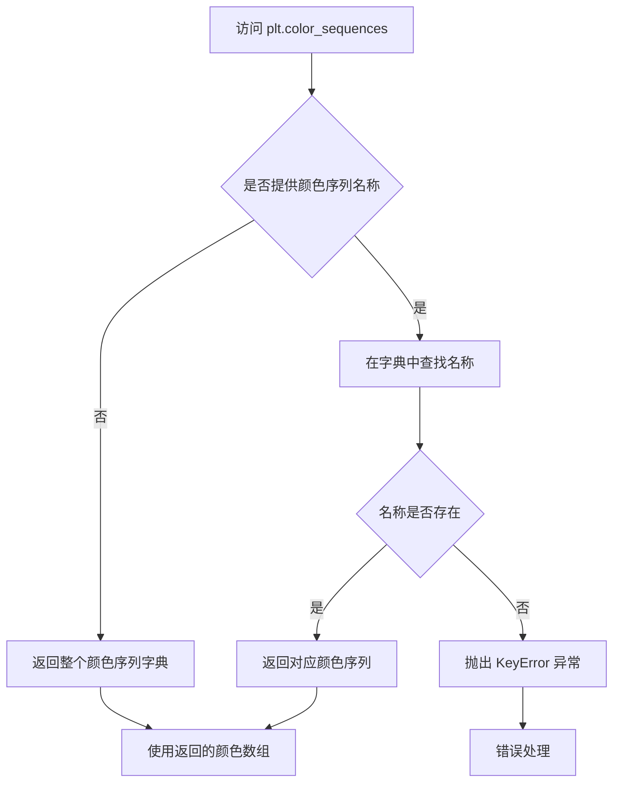

#### 带注释源码

```python
# 使用示例（来自嵌套饼图示例代码）
tab20c = plt.color_sequences["tab20c"]
# plt.color_sequences 是一个字典-like 对象
# 通过键 "tab20c" 访问预定义的颜色序列
# 返回值是一个颜色数组，可用于图表着色

# 访问方式
outer_colors = [tab20c[i] for i in [0, 4, 8]]
# 从 tab20c 颜色序列中按索引提取颜色
# 用于外圈饼图的着色

inner_colors = [tab20c[i] for i in [1, 2, 5, 6, 9, 10]]
# 从 tab20c 颜色序列中按索引提取颜色
# 用于内圈饼图的着色
```

#### 补充说明

在代码中的实际使用展示了 `plt.color_sequences` 的典型用法：
- 这是一个模块级别的属性，返回颜色序列字典
- 支持多种预定义颜色序列（如 "tab20c", "tab20b" 等）
- 返回的颜色序列可用于 `ax.pie()` 等绘图方法的 `colors` 参数
- 提供了便捷的颜色访问方式，无需手动定义颜色数组


### `plt.colormaps`

`plt.colormaps` 是 matplotlib.pyplot 模块中的一个属性（类似于字典的对象），用于访问和获取注册在 matplotlib 中的所有颜色映射（Colormap）。通过提供颜色映射的名称，可以获取对应的 Colormap 对象，以便在绘图时应用颜色方案。

参数：

-  `{键/名称}`：`str`，颜色映射的名称字符串（如 "tab20c"、"viridis" 等）

返回值：`matplotlib.colors.Colormap`，返回指定名称的颜色映射对象

#### 流程图

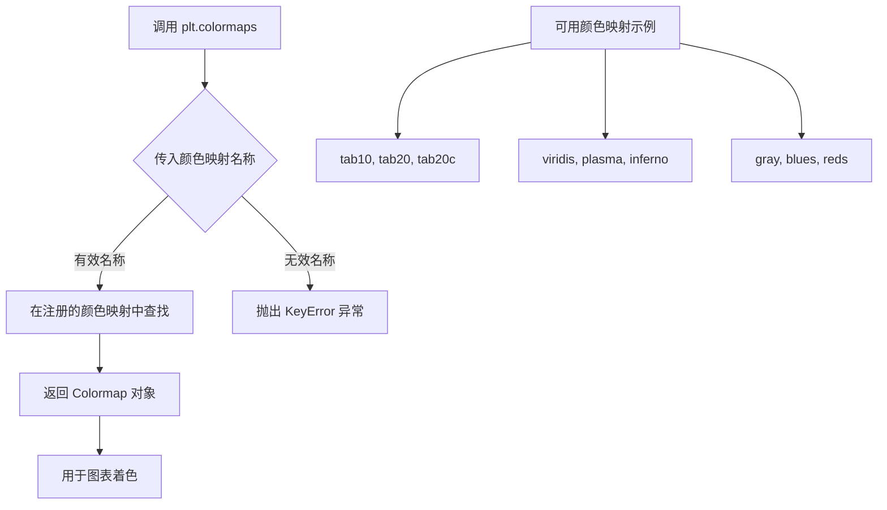

#### 带注释源码

```python
import matplotlib.pyplot as plt
import numpy as np

# %%
# 获取颜色映射的示例用法

# 方式1：使用 plt.colormaps["名称"] 获取颜色映射对象
cmap = plt.colormaps["tab20c"]  # 获取名为 "tab20c" 的颜色映射

# 方式2：使用 plt.get_cmap("名称") 获取颜色映射（等价方式）
cmap_alternative = plt.get_cmap("tab20c")

# 使用获取的颜色映射生成颜色
# np.arange(3) * 4 生成 [0, 4, 8]，从颜色映射中选取这3个位置的颜色
outer_colors = cmap(np.arange(3) * 4)

# [1, 2, 5, 6, 9, 10] 这些位置的颜色
inner_colors = cmap([1, 2, 5, 6, 9, 10])

# %%
# 在实际图表中使用
fig, ax = plt.subplots(subplot_kw=dict(projection="polar"))

size = 0.3
vals = np.array([[60., 32.], [37., 40.], [29., 10.]])
valsnorm = vals / np.sum(vals) * 2 * np.pi
valsleft = np.cumsum(np.append(0, valsnorm.flatten()[:-1])).reshape(vals.shape)

# 使用获取的颜色映射为条形图着色
ax.bar(x=valsleft[:, 0],
       width=valsnorm.sum(axis=1), bottom=1-size, height=size,
       color=outer_colors, edgecolor='w', linewidth=1, align="edge")

ax.bar(x=valsleft.flatten(),
       width=valsnorm.flatten(), bottom=1-2*size, height=size,
       color=inner_colors, edgecolor='w', linewidth=1, align="edge")

ax.set(title="Pie plot with `ax.bar` and polar coordinates")
ax.set_axis_off()
plt.show()
```

#### 相关信息

| 项目 | 说明 |
|------|------|
| **所属模块** | `matplotlib.pyplot` |
| **实际类型** | `matplotlib.cm.ColormapRegistry` |
| **常用颜色映射** | tab10, tab20, tab20c, viridis, plasma, inferno, magma, cividis, gray, Blues, Reds 等 |
| **获取所有可用映射** | `plt.colormaps.names` 或 `list(plt.colormaps)` |


### `Axes.pie` / `ax.pie`

绘制饼图的方法，接受一系列数值并将其表示为饼图（扇形）切片。可选地支持标签、颜色、百分比显示、阴影效果等配置，常用于展示分类数据的占比关系。

参数：

- `x`：`array-like`，饼图各个切片的数值（权重），方法内部会自动计算各数值占总和的比例
- `explode`：`array-like`，可选参数，长度与x相同，表示每个切片偏离圆心的距离（用于突出显示某些切片）
- `labels`：`list`，可选参数，每个切片的标签文本
- `colors`：`array-like`，可选参数，每个切片对应的颜色序列
- `autopct`：`str` 或 `callable`，可选参数，指定百分比显示格式（如 `'%1.1f%%'`）
- `pctdistance`：`float`，可选参数，百分比文本距离圆心的比例（默认为0.6）
- `shadow`：`bool`，可选参数，是否在饼图下方绘制阴影（默认为False）
- `startangle`：`float`，可选参数，饼图起始角度（默认为0度，12点钟方向）
- `radius`：`float`，可选参数，饼图的半径长度（默认为1）
- `wedgeprops`：`dict`，可选参数，传递给楔形对象（wedge）的属性字典，如设置宽度实现甜甜圈效果
- `normalize`：`bool`，可选参数，是否将数值规范化为总和为1（默认为True）
- `labeldistance`：`float`，可选参数，标签文本距离圆心的比例（默认为1.1）

返回值：`tuple of (Wedge, list[Text]]`，返回一个元组，包含表示饼图切片的楔形对象列表（Wedge对象组成的列表），以及用于显示百分比或标签的文本对象列表

#### 流程图

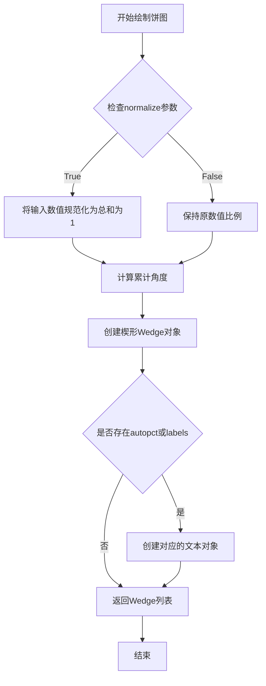

#### 带注释源码

```python
# 示例代码来源：Matplotlib官方示例 - Nested pie charts
# 演示ax.pie方法的基本用法

fig, ax = plt.subplots()  # 创建画布和 Axes 对象

size = 0.3  # 甜甜圈宽度
vals = np.array([[60., 32.], [37., 40.], [29., 10.]])  # 2D数组测试数据

# 获取颜色序列
tab20c = plt.color_sequences["tab20c"]
# 外圈颜色：取索引0,4,8的元素（每组第一个颜色）
outer_colors = [tab20c[i] for i in [0, 4, 8]]
# 内圈颜色：取索引1,2,5,6,9,10的元素（每组剩余颜色）
inner_colors = [tab20c[i] for i in [1, 2, 5, 6, 9, 10]]

# 第一次调用 ax.pie：绘制外圈
# x: vals.sum(axis=1) 对每行求和，得到 [60+32, 37+40, 29+10] = [92, 77, 39]
# radius: 1 设置外圈半径
# colors: outer_colors 外圈颜色
# wedgeprops: 设置楔形属性，width=size 实现甜甜圈效果，edgecolor='w' 设置白色边框
ax.pie(vals.sum(axis=1), radius=1, colors=outer_colors,
       wedgeprops=dict(width=size, edgecolor='w'))

# 第二次调用 ax.pie：绘制内圈
# x: vals.flatten() 将2D数组展平为1D [60, 32, 37, 40, 29, 10]
# radius: 1-size 设置内圈半径（小于外圈形成嵌套效果）
# colors: inner_colors 内圈颜色
ax.pie(vals.flatten(), radius=1-size, colors=inner_colors,
       wedgeprops=dict(width=size, edgecolor='w'))

# 设置坐标轴属性
ax.set(aspect="equal", title='Pie plot with `ax.pie`')  # 等比例，设置标题
plt.show()  # 显示图形
```


### `matplotlib.axes.Axes.bar`

在极坐标投影的 Axes 上使用 bar 方法绘制嵌套条形图（甜甜圈图），通过将 x 值映射到圆形的弧度位置，并设置 bottom 和 height 参数来形成环形效果。

参数：

- `x`：参数类型为 `float` 或 `array_like`，表示条形图的水平位置（对应极坐标中的角度/弧度）
- `width`：参数类型为 `float` 或 `array_like`，表示条形图的宽度（对应极坐标中的弧长）
- `bottom`：参数类型为 `float` 或 `array_like`，表示条形图的底部位置（用于控制环形内外位置），代码中设置为 `1-size` 和 `1-2*size` 来形成嵌套效果
- `height`：参数类型为 `float` 或 `array_like`，表示条形图的高度（对应极坐标中的半径距离），代码中设置为 `size` 控制环的宽度
- `color`：参数类型为 `color` 或 `array_like`，表示条形的填充颜色
- `edgecolor`：参数类型为 `color`，表示条形的边框颜色，代码中设置为 `'w'`（白色）
- `linewidth`：参数类型为 `float`，表示边框宽度，代码中设置为 `1`
- `align`：参数类型为 `str`，表示条形与 x 位置的对齐方式，代码中设置为 `"edge"` 以便条形边缘对齐到指定的 x 位置

返回值：返回 `BarContainer` 对象，包含所有条形的艺术元素（Patch 实例）

#### 流程图

```mermaid
flowchart TD
    A[开始调用 ax.bar] --> B[初始化极坐标投影 Axes]
    B --> C[计算数据归一化和累积和]
    C --> D[设置 x 位置为累积弧度值]
    D --> E[设置 width 为归一化值乘以 2π]
    E --> F[设置 bottom 控制环形半径内边界]
    F --> G[设置 height 为固定宽度 size]
    G --> H[绘制外环条形图: valsleft[:, 0], width=sum axis=1]
    H --> I[绘制内环条形图: valsleft.flatten(), width=flatten()]
    I --> J[应用颜色和边框样式]
    J --> K[返回 BarContainer]
```

#### 带注释源码

```python
# 设置极坐标投影的子图
fig, ax = plt.subplots(subplot_kw=dict(projection="polar"))

size = 0.3  # 环的宽度
vals = np.array([[60., 32.], [37., 40.], [29., 10.]])

# 第一步：将数据归一化到 0-2π 范围（弧度）
valsnorm = vals / np.sum(vals) * 2 * np.pi

# 第二步：计算条形的起始位置（累积和）
# 使用 np.append(0, ...) 添加起始点 0
# 展平后去掉最后一个元素，避免重复
valsleft = np.cumsum(np.append(0, valsnorm.flatten()[:-1])).reshape(vals.shape)

# 获取颜色映射
cmap = plt.colormaps["tab20c"]
outer_colors = cmap(np.arange(3) * 4)      # 外环颜色：索引 0, 4, 8
inner_colors = cmap([1, 2, 5, 6, 9, 10])   # 内环颜色：6 个颜色

# 绘制外环（第一组数据）
# x: 每行数据的起始角度（弧度）
# width: 每行数据的总和（弧度）
# bottom: 1-size = 0.7，确定环的内半径
# height: size = 0.3，确定环的外半径（半径差）
ax.bar(x=valsleft[:, 0],                      # 外环 x 位置（角度）
       width=valsnorm.sum(axis=1),            # 外环宽度（弧长）
       bottom=1-size,                         # 外环底部位置（内半径）
       height=size,                           # 外环高度（环宽度）
       color=outer_colors,                    # 外环颜色
       edgecolor='w',                         # 边框颜色为白色
       linewidth=1,                           # 边框宽度
       align="edge")                          # 边缘对齐

# 绘制内环（展平后的所有数据）
# x: 所有数据点的起始角度（展平后的累积值）
# width: 每个数据点的宽度（弧度）
# bottom: 1-2*size = 0.4，确定更靠内的环
ax.bar(x=valsleft.flatten(),                  # 内环 x 位置（角度）
       width=valsnorm.flatten(),             # 内环宽度（弧长）
       bottom=1-2*size,                       # 内环底部位置（更靠内）
       height=size,                           # 内环高度（环宽度）
       color=inner_colors,                    # 内环颜色
       edgecolor='w',                         # 边框颜色为白色
       linewidth=1,                           # 边框宽度
       align="edge")                          # 边缘对齐

# 设置标题并隐藏坐标轴
ax.set(title="Pie plot with `ax.bar` and polar coordinates")
ax.set_axis_off()
plt.show()
```


### `np.array`

创建numpy数组，将Python列表、元组或嵌套序列转换为多维numpy数组对象。

参数：

- `object`：任意接受数组接口的序列（如list、tuple、nested sequence），需要转换的输入数据
- `dtype`：`dtype`（可选），指定数组的数据类型（如int、float、str等），默认为None表示自动推断
- `copy`：`bool`（可选），是否复制数据，默认为True表示强制复制，为False在可能情况下共享内存
- `order`：`str`（可选），内存布局选项，可选值包括'C'（行优先）、'F'（列优先）、'A'（任意），默认为'K'（保持原顺序）
- `subok`：`bool`（可选），是否允许返回子类，默认为True
- `ndmin`：`int`（可选），指定最小维度数，默认为0

返回值：`numpy.ndarray`，返回一个numpy数组对象，包含输入数据的多维表示

#### 流程图

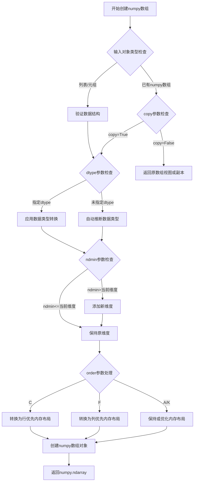

#### 带注释源码

```python
# 定义一个嵌套的Python列表，包含3组数据
# 外层列表有3个元素（3个组），每个元素是包含2个数值的子列表
vals = np.array([[60., 32.],    # 第一组：60和32
                 [37., 40.],    # 第二组：37和40
                 [29., 10.]])   # 第三组：29和10

# np.array执行过程详解：
# 1. 接收[[60., 32.], [37., 40.], [29., 10.]]作为object参数
# 2. 自动推断数据类型：由于输入包含浮点数，dtype推断为float64
# 3. 维度推断：输入是嵌套列表，外层3个元素，内层各2个元素
#    推断结果为2维数组，shape为(3, 2)
# 4. 默认order为'K'，保持输入数据的内存布局
# 5. 创建并返回numpy.ndarray对象

# 验证数组属性
print(vals.shape)    # 输出: (3, 2) - 3行2列
print(vals.dtype)    # 输出: float64 - 默认浮点数类型
print(vals.ndim)     # 输出: 2 - 二维数组
print(vals)
# 输出:
# [[60. 32.]
#  [37. 40.]
#  [29. 10.]]

# 后续代码中对该数组的使用：
# 1. vals.sum(axis=1) - 按行求和，得到[92., 77., 39.]
# 2. vals.flatten() - 展平为一维数组，得到[60., 32., 37., 40., 29., 10.]
# 3. valsnorm = vals/np.sum(vals)*2*np.pi - 用于极坐标转换
# 4. valsleft = np.cumsum(...) - 计算累积和用于条形图定位
```


### `np.sum`

NumPy 的求和函数，用于计算数组元素的累计和，支持指定轴向求和及多种数据类型选项。

参数：

- `a`：`array_like`，需要求和的数组或类数组对象
- `axis`：`int` 或 `tuple of ints`，可选，指定求和的轴向，默认为 None 表示对所有元素求和
- `dtype`：`dtype`，可选，指定输出数组的数据类型，默认为 None 表示使用输入数组的 dtype
- `out`：`ndarray`，可选，指定输出数组
- `keepdims`：`bool`，可选，是否保持原来的维度，默认为 False
- `initial`：`scalar`，可选，指定起始值
- `where`：`array_like of bool`，可选，指定哪些元素参与求和

返回值：`ndarray` 或 `scalar`，返回求和结果，如果 axis 为 None 则返回标量，否则返回数组

#### 流程图

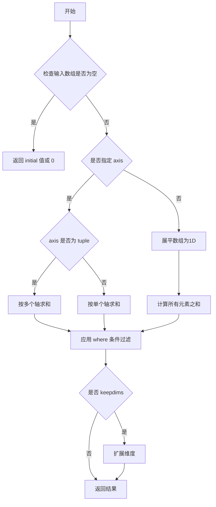

#### 带注释源码

```python
# 代码中的实际使用示例

# 示例1：在 ax.pie 中使用 vals.sum(axis=1)
# 对二维数组 vals 的每一行（axis=1）求和
# vals = [[60., 32.], [37., 40.], [29., 10.]]
# 结果：array([92., 77., 39.])
vals = np.array([[60., 32.], [37., 40.], [29., 10.]])
outer_values = vals.sum(axis=1)  # 计算每行的总和，用于外圈饼图

# 示例2：计算数组总和管理用于归一化
# 将 vals 所有元素求和后用于归一化到 2*pi
# vals 总和：208.0
# valsnorm = vals/208.0 * 2*np.pi，用于后续计算角度
valsnorm = vals/np.sum(vals)*2*np.pi  # 计算总和管理归一化

# np.sum 函数原型（NumPy 内部实现逻辑）
# def sum(a, axis=None, dtype=None, out=None, keepdims=False, initial=np._NoValue, where=np._NoValue):
#     """
#     Sum of array elements over given axis.
#     
#     Parameters
#     ----------
#     a : array_like
#         Elements to sum.
#     axis : None or int or tuple of ints, optional
#         Axis or axes along which the sum is computed.
#     dtype : dtype, optional
#         The type of the returned array and of the accumulator.
#     out : ndarray, optional
#         Alternative output array.
#     keepdims : bool, optional
#         If True, the axes which are reduced are left in the result.
#     initial : scalar, optional
#         Starting value for the sum.
#     where : array_like of bool, optional
#         Elements to include in the sum.
#     
#     Returns
#     -------
#     sum_along_axis : ndarray or scalar
#         The sum of array elements over the given axis.
#     """
```

#### 关键组件信息

- **vals**：2D numpy array，存储嵌套饼图的内层数据
- **valsnorm**：归一化后的角度值数组，用于极坐标系的条形图
- **valsleft**：累积和计算的边界位置

#### 技术债务与优化空间

1. 代码中使用 `np.sum(vals)` 计算总和管理归一化，可以预先缓存总和管理避免重复计算
2. `vals.sum(axis=1)` 和 `np.sum(vals)` 两次调用可以合并部分计算逻辑
3. 建议将魔法数字 `2*np.pi` 提取为常量 `TWO_PI`

#### 其它说明

- 设计目标：展示两种构建嵌套饼图的方法
- 数据流：原始数据 → 分类求和 → 颜色映射 → 图形渲染
- 错误处理：当数组为空时，`np.sum` 返回 0 或 initial 值
- 外部依赖：NumPy 库提供求和功能，Matplotlib 用于可视化


### `np.cumsum`

NumPy 的 `cumsum` 函数是累积求和函数，用于计算数组元素的累积和。在本代码中，该函数用于计算归一化数值的累积和，以确定极坐标下饼图（条形图形式）的条形起始位置。

参数：

- `a`：`array_like`，输入的需要进行累积求和的数组，即 `np.append(0, valsnorm.flatten()[:-1])`

返回值：`ndarray`，返回数组元素的累积和，形状与输入数组相同

#### 流程图

```mermaid
graph TD
    A[开始] --> B[输入数组: np.append<br/>0, valsnorm.flatten<br/>[:-1]]
    B --> C[初始化累加器为0]
    C --> D{遍历数组元素}
    D -->|每个元素| E[累加当前元素到累加器]
    E --> F[将累加结果存入<br/>输出数组对应位置]
    F --> D
    D -->|遍历完成| G[返回累积和数组]
    G --> H[通过.reshape<br/>重塑为目标形状]
    H --> I[结束: 用于确定<br/>条形图的起始角度]
```

#### 带注释源码

```python
# 代码中的实际使用方式
valsleft = np.cumsum(np.append(0, valsnorm.flatten()[:-1])).reshape(vals.shape)

# 详细分解：
# 1. valsnorm 是原始数据归一化到 2*pi 后的数组
valsnorm = vals/np.sum(vals)*2*np.pi

# 2. valsnorm.flatten() 将数组展平为一维
#    [: -1] 去掉最后一个元素，避免累积和超出范围
# 3. np.append(0, ...) 在开头添加 0 作为起始点
#    这样第一个条形从 0 开始，而不是从累积和的第一个元素开始
# 4. np.cumsum(...) 计算累积和
#    例如：[0, a, b, c] -> [0, a, a+b, a+b+c]
# 5. .reshape(vals.shape) 重塑为原始形状，用于后续 ax.bar 的 x 参数
```

#### 上下文使用说明

在极坐标饼图实现中，`np.cumsum` 的作用是：

1. **数据准备**：将角度值归一化到 2π 弧度
2. **边界计算**：通过累积和计算每个扇区的边界角度
3. **条形定位**：结果用于 `ax.bar` 的 `x` 参数，指定每个条形的起始位置

具体参数值为：
- 输入数组示例：`[0, 0.5, 1.2, 2.0, 2.5, 3.1]`（归一化后的角度值）
- 输出累积和示例：`[0, 0.5, 1.7, 3.7, 6.2, 9.3]`
- 最终通过 `.reshape(vals.shape)` 重塑为 `(3, 2)` 形状


### np.append

`np.append` 是 NumPy 库中的数组追加函数，用于将值附加到数组的末尾，返回一个新的数组而不修改原始数组。

参数：

- `arr`：`array_like`，输入数组，要追加值的数组
- `values`：`array_like`，要追加的值，可以是单个元素或数组
- `axis`：`int，可选`，指定沿哪个轴追加。如果为 None，则数组会被展平后再连接

返回值：`ndarray`，返回一个新的数组，包含原始数组和追加的值

#### 流程图

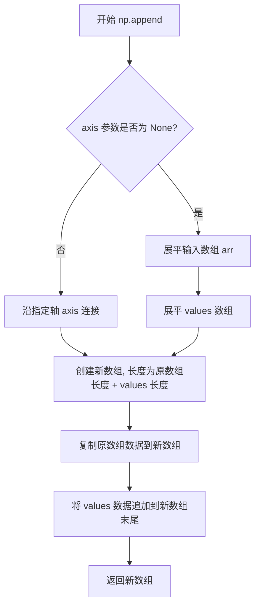

#### 带注释源码

```python
def append(arr, values, axis=None):
    """
    将值附加到数组的末尾。
    
    参数:
        arr : array_like
            输入数组。
        values : array_like
            要附加到数组副本末尾的值。
            如果 axis 为 None，values 可以是任意形状，并且会先被展平。
            如果指定了 axis，values 必须与 arr 沿该轴的形状匹配。
        axis : int, optional
            附加值的轴。如果为 None，则数组会被展平后再追加。
    
    返回值:
        ndarray
            包含 arr 和 values 的新数组。原始数组 arr 不会被修改。
    """
    # 将输入转换为数组
    arr = np.asarray(arr)
    values = np.asarray(values)
    
    # 如果没有指定轴，则将两个数组都展平
    if axis is None:
        # 展平数组为一维
        arr = arr.ravel()
        # 展平 values 为一维
        values = values.ravel()
        # 沿 axis=0 连接（展平后的数组只有一维）
        return np.concatenate([arr, values], axis=0)
    else:
        # 沿指定轴连接数组
        return np.concatenate([arr, values], axis=axis)
```

#### 代码中的实际使用

在提供的代码中，`np.append` 的使用方式如下：

```python
valsleft = np.cumsum(np.append(0, valsnorm.flatten()[:-1])).reshape(vals.shape)
```

- **第一个参数 (arr)**: `0` - 初始值，用于在数组开头插入一个 0
- **第二个参数 (values)**: `valsnorm.flatten()[:-1]` - 展平后的数组去掉最后一个元素
- **axis 参数**: 未指定（默认为 None）

此操作的目的是：创建一个累积和计算的起始点，将 valsnorm 展平后去掉最后一个元素，并在开头添加 0，然后计算累积和，最后重塑为与原 vals 相同的形状。这用于生成环形图中各个扇形块的起始角度。


### np.arange

创建等差数组，返回一个均匀间隔的数值序列组成的ndarray。

参数：

- `start`：`int` 或 `float`，起始值（可选，默认为0）
- `stop`：`int` 或 `float`，结束值（必填，不包含）
- `step`：`float`，步长（可选，默认为1）
- `dtype`：`dtype`，输出数组的数据类型（可选，默认根据start、stop、step推断）

返回值：`numpy.ndarray`，包含等差数列的一维数组

#### 流程图

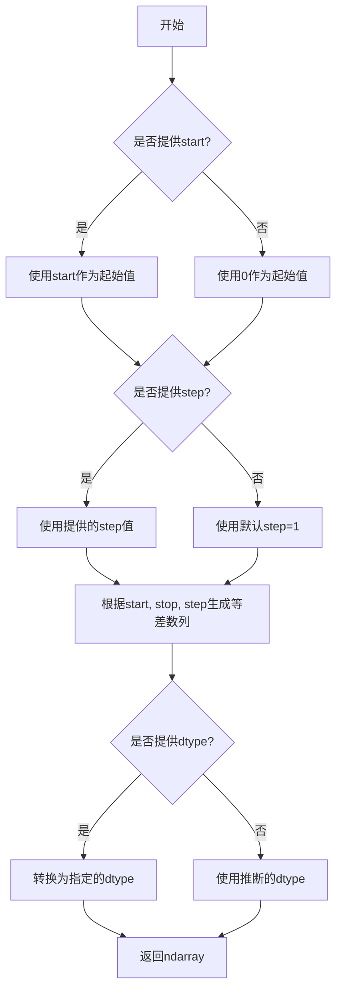

#### 带注释源码

```python
def arange(start=0, stop=None, step=1, dtype=None):
    """
    返回一个均匀间隔的数值序列。
    
    Parameters
    ----------
    start : int 或 float, 可选
        序列的起始值。默认为0。
    stop : int 或 float
        序列的结束值（不包含）。
    step : float, 可选
        相邻值之间的差值。默认为1。
    dtype : dtype, 可选
        输出数组的数据类型。如果没有提供，则从输入参数推断。
    
    Returns
    -------
    ndarray
        包含等差数列的一维数组。
    
    Examples
    --------
    >>> np.arange(5)
    array([0, 1, 2, 3, 4])
    
    >>> np.arange(1, 5)
    array([1, 2, 3, 4])
    
    >>> np.arange(0, 10, 2)
    array([0, 2, 4, 6, 8])
    """
    # 内部实现（简化版）
    # NumPy会根据参数计算序列长度：num = ceil((stop - start) / step)
    # 然后使用_start + step * np.arange(num)生成数组
    pass
```


### `np.reshape`

`np.reshape` 是 NumPy 库中的一个核心函数，用于将数组重新排列为不同的形状，而不改变其数据。该函数在处理多维数据转换、数据预处理和机器学习特征工程中广泛应用，特别适用于将一维或多维数组适配为特定模型输入格式的场景。

参数：

- `self`（隐式）：`numpy.ndarray`，调用 reshape 方法的数组对象，在函数式调用中为第一个位置参数 `a`
- `a`：`numpy.ndarray` 或类似数组对象，要重塑的原始数组
- `newshape`：`int` 或 `tuple of ints`，目标形状，可以是单个整数（用于一维结果）或整数元组
- `order`：`{'C', 'F', 'A'}`，可选参数，默认为 'C'。'C' 表示按行优先（C风格）重塑，'F' 表示按列优先（Fortran风格），'A' 表示如果数组是 Fortran 连续的则按列优先，否则按行优先

返回值：`numpy.ndarray`，返回重塑后的新视图（如果可能）或副本。该函数返回一个新的数组对象，其数据与原始数组共享内存。

#### 流程图

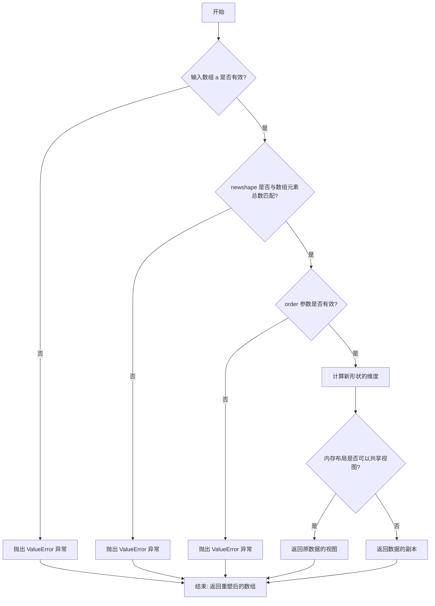

#### 带注释源码

```python
# NumPy reshape 函数的简化实现原理
# 实际源码位于 numpy/core/fromnumeric.py

def reshape(array, newshape, order='C'):
    """
    在不更改数据的情况下为数组赋予新的形状。
    
    参数:
        array: 输入数组，可以是任何可迭代对象
        newshape: 整数或整数元组，指定新的形状
        order: 'C', 'F', 'A' 之一，指定内存中数据的读取顺序
    
    返回:
        重塑后的数组视图或副本
    """
    # 将输入转换为 numpy 数组（如果还不是）
    arr = np.asarray(array)
    
    # 获取数组的总元素数
    newshape = _validate_shape(newshape, arr.size)
    
    # 根据 order 参数选择不同的重塑策略
    if order == 'C':
        # C 风格（行优先）：索引变化最快的是最后一维
        # 例如: shape (2,3) -> 元素排列为 [0,1,2,3,4,5]
        return arr.reshape(newshape, order='C')
    elif order == 'F':
        # Fortran 风格（列优先）：索引变化最快的是第一维
        # 例如: shape (2,3) -> 元素排列为 [0,3,1,4,2,5]
        return arr.reshape(newshape, order='F')
    elif order == 'A':
        # 自动检测：根据原数组的内存布局选择
        # 如果原数组是 Fortran 连续则用 'F'，否则用 'C'
        return arr.reshape(newshape, order='A')
    else:
        raise ValueError(f"order must be 'C', 'F', or 'A', got {order}")
```

```python
# 代码中的实际使用示例
valsnorm = vals / np.sum(vals) * 2 * np.pi  # 归一化并转换为弧度
# valsnorm.shape = (3, 2)

# 使用 cumsum 计算累计和，然后展平取[:-1]去掉最后一个元素
# np.append(0, valsnorm.flatten()[:-1]) 在开头插入0
cumsum_result = np.cumsum(np.append(0, valsnorm.flatten()[:-1]))
# cumsum_result 形状为 (6,)，包含累计和值

# 使用 reshape 将结果重塑为与原始 vals 相同的形状 (3, 2)
valsleft = cumsum_result.reshape(vals.shape)
# valsleft.shape = (3, 2)
# 这样每一行的累计起始位置对应原始 vals 的每一行
```


### `matplotlib.axes.Axes.set`

`ax.set` 是 Matplotlib 中 Axes 类的核心方法，用于通过关键字参数（kwargs）批量设置坐标轴的多种属性，如标题、宽高比、坐标轴范围等。该方法采用 `**kwargs` 模式，支持动态传入任意数量的属性名-值对，提供了统一且灵活的坐标轴配置接口。

参数：

-  `**kwargs`：`关键字参数`，支持多种坐标轴属性设置，常见属性包括：
  - `aspect`：设置坐标轴的宽高比（如 "equal"）
  - `title`：设置坐标轴标题（字符串类型）
  - `xlim`/`ylim`：设置x/y轴的显示范围（tuple类型）
  - `xlabel`/`ylabel`：设置x/y轴的标签（字符串类型）
  - `axis`：控制坐标轴可见性（如 "on"/"off"）
  - 等其他Axes属性

返回值：`set` 方法返回 `self`（Axes 对象），支持链式调用。

#### 流程图

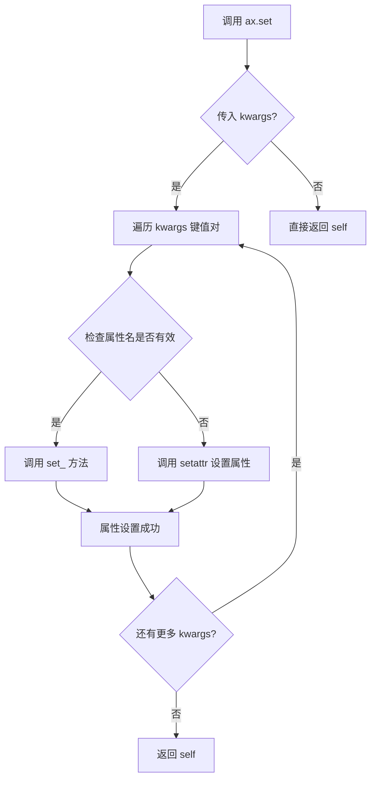

#### 带注释源码

```python
# matplotlib.axes.Axes.set 方法源码示例（简化版）
def set(self, **kwargs):
    """
    设置Axes的多个属性。
    
    参数:
        **kwargs: 关键字参数，用于设置各种Axes属性。
                  例如: aspect='equal', title='My Title', xlim=(0, 10)
    
    返回值:
        self: 返回Axes对象本身，支持链式调用。
    """
    # 遍历所有传入的关键字参数
    for attr, value in kwargs.items():
        # 尝试调用 set_<attr> 方法（如有对应方法）
        method_name = f'set_{attr}'
        if hasattr(self, method_name):
            setter = getattr(self, method_name)
            setter(value)
        else:
            # 直接通过 setattr 设置属性
            setattr(self, attr, value)
    
    # 返回 self 以支持链式调用
    return self

# 在示例代码中的实际使用：
ax.set(aspect="equal", title='Pie plot with `ax.pie`')  # 设置宽高比和标题
ax.set(title="Pie plot with `ax.bar` and polar coordinates")  # 仅设置标题
```


### `Axes.set_axis_off`

该方法是Matplotlib中Axes类的成员函数，用于隐藏坐标轴（包括坐标轴线、刻度、刻度标签等），常用于纯图表展示场景，如饼图、极坐标图等不需要显示坐标轴的图形。

参数：此方法无参数。

返回值：`None`，该方法直接修改Axes对象的属性，不返回任何值。

#### 流程图

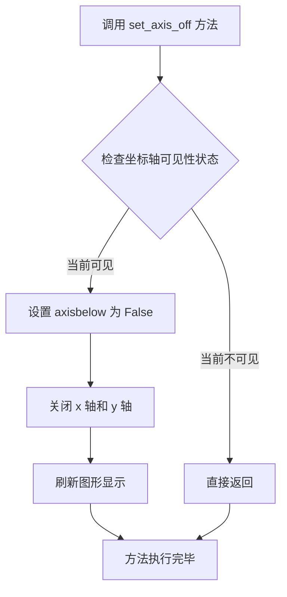

#### 带注释源码

```python
def set_axis_off(self):
    """
    关闭坐标轴的显示。
    
    此方法会关闭坐标轴线、刻度、刻度标签以及网格，
    使得图表看起来更加简洁，常用于饼图、极坐标图等场景。
    
    参数:
        无参数
        
    返回值:
        无返回值 (None)
        
    示例:
        >>> import matplotlib.pyplot as plt
        >>> fig, ax = plt.subplots()
        >>> ax.plot([1, 2, 3], [1, 4, 9])
        >>> ax.set_axis_off()  # 隐藏坐标轴
        >>> plt.show()
    """
    # 1. 设置坐标轴显示属性为 False
    # axisbelow 属性控制坐标轴是否在其他元素下方
    self.axisbelow = False
    
    # 2. 关闭 x 轴的显示
    # xaxis 属性控制 x 轴的可见性
    self.xaxis.set_visible(False)
    
    # 3. 关闭 y 轴的显示
    # yaxis 属性控制 y 轴的可见性
    self.yaxis.set_visible(False)
    
    # 4. 关闭 spines（边框线）的显示
    # spines 是坐标轴的边框线容器
    for spine in self.spines.values():
        spine.set_visible(False)
    
    # 5. 刷新画布以应用更改
    # 确保更改立即反映在图形中
    self.stale_callback = None
```

#### 在示例代码中的实际应用

```python
# 在第二个示例中，使用极坐标系统绘制饼图
fig, ax = plt.subplots(subplot_kw=dict(projection="polar"))

# ... 绘制条形图代码 ...

# 调用 set_axis_off() 隐藏坐标轴
# 这样可以隐藏极坐标系统的径向线和角度刻度
# 只保留条形图本身的内容
ax.set_axis_off()
plt.show()
```


### `plt.show`

显示当前图形窗口，将所有未显示的 Figure 对象呈现给用户。该函数是 matplotlib.pyplot 模块的核心函数之一，负责将 Figure 对象渲染到屏幕并进入事件循环。

参数：

- `block`：`bool`，可选参数，控制是否阻塞程序执行。默认为 `True`，表示阻塞直到用户关闭图形窗口；设置为 `False` 时则立即返回。

返回值：`None`，无返回值，该函数仅用于图形显示的副作用。

#### 流程图

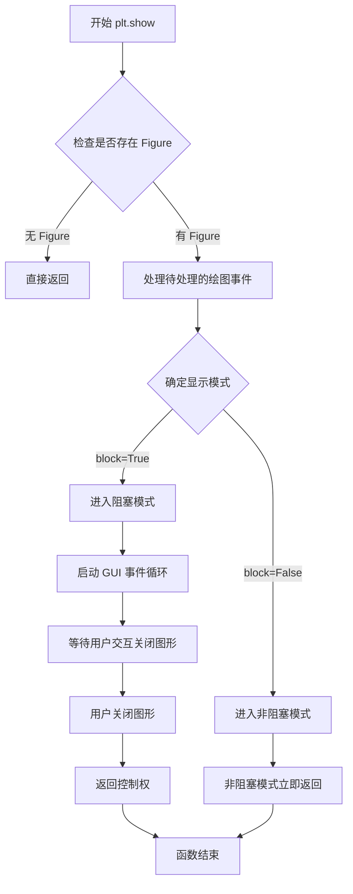

#### 带注释源码

```python
# plt.show() 函数的典型调用方式（在示例代码中）
# 显示第一个嵌套饼图（donut chart）
fig, ax = plt.subplots()

size = 0.3
vals = np.array([[60., 32.], [37., 40.], [29., 10.]])

tab20c = plt.color_sequences["tab20c"]
outer_colors = [tab20c[i] for i in [0, 4, 8]]
inner_colors = [tab20c[i] for i in [1, 2, 5, 6, 9, 10]]

# 绘制外圈饼图
ax.pie(vals.sum(axis=1), radius=1, colors=outer_colors,
       wedgeprops=dict(width=size, edgecolor='w'))

# 绘制内圈饼图
ax.pie(vals.flatten(), radius=1-size, colors=inner_colors,
       wedgeprops=dict(width=size, edgecolor='w'))

ax.set(aspect="equal", title='Pie plot with `ax.pie`')

# 显示图形窗口并进入事件循环
plt.show()  # <-- 此处调用 plt.show()

# 使用极坐标系的 bar 图绘制第二个嵌套饼图
fig, ax = plt.subplots(subplot_kw=dict(projection="polar"))

size = 0.3
vals = np.array([[60., 32.], [37., 40.], [29., 10.]])
# 归一化 vals 到 2π 弧度
valsnorm = vals/np.sum(vals)*2*np.pi
# 计算 bar 的起始位置（边缘）
valsleft = np.cumsum(np.append(0, valsnorm.flatten()[:-1])).reshape(vals.shape)

cmap = plt.colormaps["tab20c"]
outer_colors = cmap(np.arange(3)*4)
inner_colors = cmap([1, 2, 5, 6, 9, 10])

# 绘制外圈 bar
ax.bar(x=valsleft[:, 0],
       width=valsnorm.sum(axis=1), bottom=1-size, height=size,
       color=outer_colors, edgecolor='w', linewidth=1, align="edge")

# 绘制内圈 bar
ax.bar(x=valsleft.flatten(),
       width=valsnorm.flatten(), bottom=1-2*size, height=size,
       color=inner_colors, edgecolor='w', linewidth=1, align="edge")

ax.set(title="Pie plot with `ax.bar` and polar coordinates")
ax.set_axis_off()

# 再次显示第二个图形窗口
plt.show()  # <-- 第二次调用 plt.show()
```

## 关键组件


### 嵌套饼图绘制（Donut Chart）

使用Matplotlib的ax.pie方法，通过设置wedgeprops的width参数实现甜甜圈形状的嵌套饼图，外圈显示3个组，内圈显示每个数据的独立分布。

### 数据准备与规范化

使用numpy数组vals存储二维数据，通过sum(axis=1)计算每行总和作为外圈数据，通过flatten()展平数组作为内圈数据。valsnorm通过除以总和并乘以2π将数值转换为弧度。

### 颜色管理

从Matplotlib的color_sequences获取tab20c颜色序列，外圈使用索引[0,4,8]的三个颜色，内圈使用索引[1,2,5,6,9,10]的六个颜色，实现视觉层次区分。

### 极坐标条形图方案

使用projection="polar"创建极坐标系统，通过cumsum计算累积和得到条形边缘位置，使用ax.bar方法绘制嵌套甜甜圈形状，提供更灵活的设计选项。

### wedgeprops参数配置

通过wedgeprops=dict(width=size, edgecolor='w')设置饼图块宽度和白色边框，创建甜甜圈视觉效果，size变量控制环的宽度比例。

### 坐标轴配置与显示

使用ax.set(aspect="equal", title='...')设置等比例和标题，ax.set_axis_off()隐藏极坐标系统的坐标轴，优化图表显示效果。


## 问题及建议


### 已知问题

-   **代码重复**：两个图表的创建逻辑中存在大量重复代码，如 `size`、`vals` 变量定义、颜色序列处理逻辑等未进行复用
-   **魔法数字**：代码中存在多个硬编码的数值（如 `0.3`、`1`、`2*np.pi`、`1-size`、`1-2*size`），缺乏常量定义和注释说明其含义
-   **API 使用不一致**：第一个方法使用 `plt.color_sequences["tab20c"]`，第二个方法使用 `plt.colormaps["tab20c"]`，两者的 API 调用方式不统一
-   **缺乏输入验证**：未对 `vals` 数组进行有效性检查（如负值、NaN 值、空数组等情况）
-   **无函数抽象**：所有代码均为线性脚本形式，缺乏可复用的函数或类封装，难以在其他项目中迁移使用
-   **变量命名不清晰**：`valsnorm`、`valsleft` 等变量命名过于简略，可读性较差
-   **缺乏类型注解**：代码中未使用 Python 类型提示（type hints），不利于静态分析和 IDE 支持
-   **无文档字符串**：除了模块级文档外，缺少函数级或类级的文档说明

### 优化建议

-   **提取通用函数**：将 `vals` 数据处理、颜色生成等逻辑抽取为独立函数，减少重复代码
-   **定义常量**：将魔法数字提取为命名常量，如 `WEDGE_WIDTH = 0.3`、`OUTER_RADIUS = 1` 等
-   **统一 API 调用**：统一使用 `plt.colormaps` 或 `plt.color_sequences` 中的一种方式访问颜色序列
-   **添加数据验证**：在数据处理前添加校验逻辑，确保输入数据符合预期（如非负、数值类型正确等）
-   **封装为类**：考虑创建 `NestedPieChart` 类，将两种绘制方法封装为类方法，提供更好的复用性和扩展性
-   **改进变量命名**：使用更描述性的变量名，如 `outer_radius`、`inner_radius`、`normalized_values` 等
-   **添加类型注解**：为函数参数和返回值添加类型提示，提升代码可维护性
-   **补充文档**：为抽取出的函数添加 docstring，说明参数、返回值和功能
-   **考虑配置对象**：将颜色、半径、宽度等配置通过字典或配置类传递，提高灵活性


## 其它


### 设计目标与约束

本代码旨在展示两种在Matplotlib中创建嵌套饼图（甜甜圈图）的方法。第一种方法使用ax.pie()直接绘制，通过wedgeprops参数设置宽度来实现环形效果；第二种方法使用极坐标系统上的ax.bar()来模拟饼图。设计约束包括：必须使用Matplotlib库，数据必须是数值型，需要预先计算角度和比例。

### 错误处理与异常设计

代码主要依赖NumPy和Matplotlib库，未包含显式的异常处理机制。潜在错误包括：数据为空或包含负值时pie方法会抛出异常；valsnorm计算中若vals总和为0会导致除零错误；颜色映射无效时会导致绘制失败。建议在实际应用中添加数据验证逻辑。

### 数据流与状态机

数据流路径：首先定义size参数（环宽度）和vals数组（2D数组），然后计算颜色序列，接着根据不同方法进行数据转换（求和、扁平化、归一化、累积求和），最后调用相应的绘图API完成渲染。状态机包含：数据准备状态、颜色配置状态、绘图执行状态和显示状态。

### 外部依赖与接口契约

主要依赖包括：matplotlib.pyplot（绘图框架）、numpy（数值计算）、matplotlib.color_sequences和matplotlib.colormaps（颜色管理）。接口契约方面：ax.pie()接受values、radius、colors、wedgeprops参数；ax.bar()接受x、width、bottom、height、color、edgecolor、linewidth、align参数。

### 性能考虑

代码性能主要受数据规模和渲染复杂度影响。第一种方法（pie）性能较好，因为是原生饼图实现；第二种方法（bar with polar）由于需要手动计算角度和绘制多个条形，性能略差。对于大数据集，建议预先计算角度值并复用颜色映射对象。

### 安全性考虑

本代码为纯前端可视化代码，不涉及用户输入处理、网络通信或敏感数据操作，安全性风险较低。潜在风险包括：颜色序列名称拼写错误可能导致意外行为；动态颜色映射可能引入显示不一致问题。

### 可维护性与扩展性

代码采用模块化结构，两种方法分离清晰，易于维护和扩展。可扩展方向包括：添加更多嵌套层级、支持动态数据更新、添加交互式功能（如鼠标悬停显示数值）、自定义颜色方案。代码注释完善，符合Matplotlib官方示例文档规范。

### 测试策略

建议测试场景包括：空数据测试、负值数据测试、超出范围的颜色索引测试、不同窗口大小下的渲染测试、多种输出格式（PNG、SVG、PDF）测试。单元测试应验证数据转换逻辑的正确性，集成测试应验证最终图像输出的完整性。

### 部署与运维注意事项

本代码为独立脚本，无特殊部署要求。运维注意事项：需确保Matplotlib和NumPy版本兼容性（建议Matplotlib>=3.4.0以支持color_sequences）；运行时需要图形后端支持（headless环境需设置Agg后端）；生产环境建议添加日志记录以便问题排查。


    