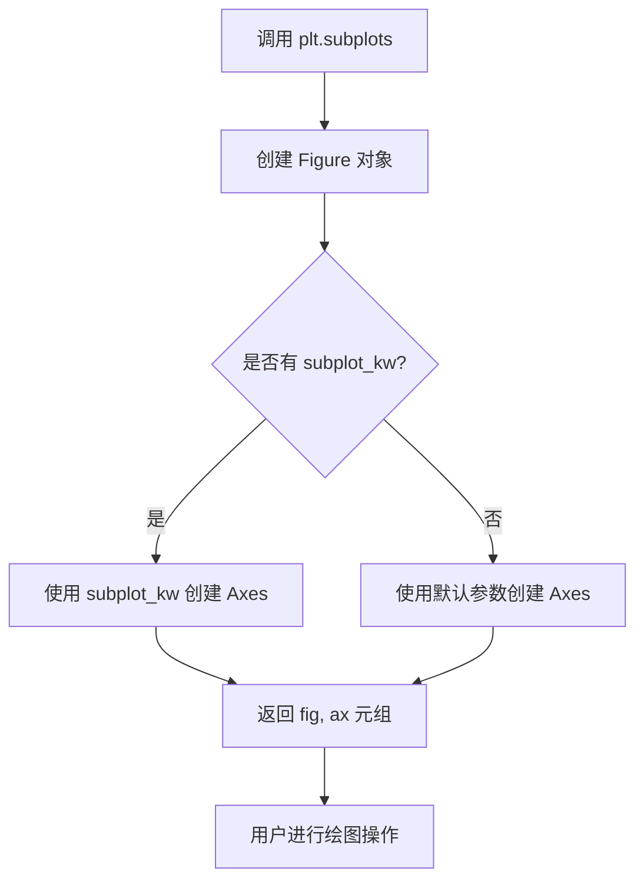
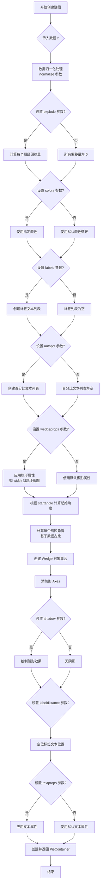
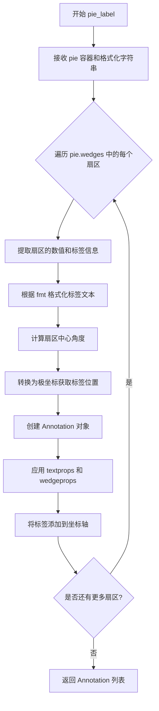
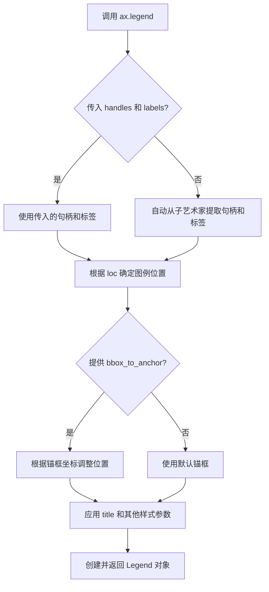
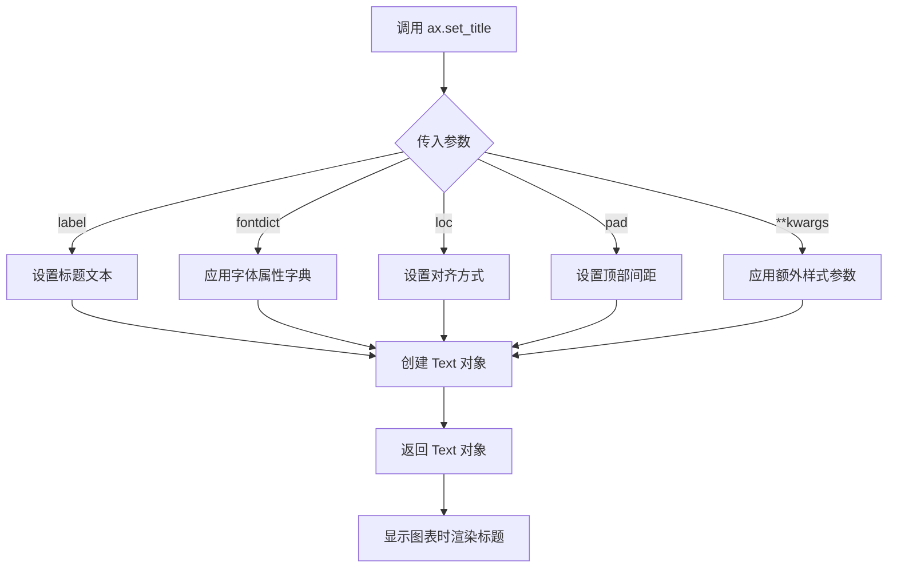
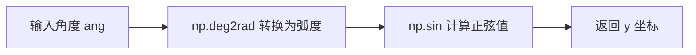
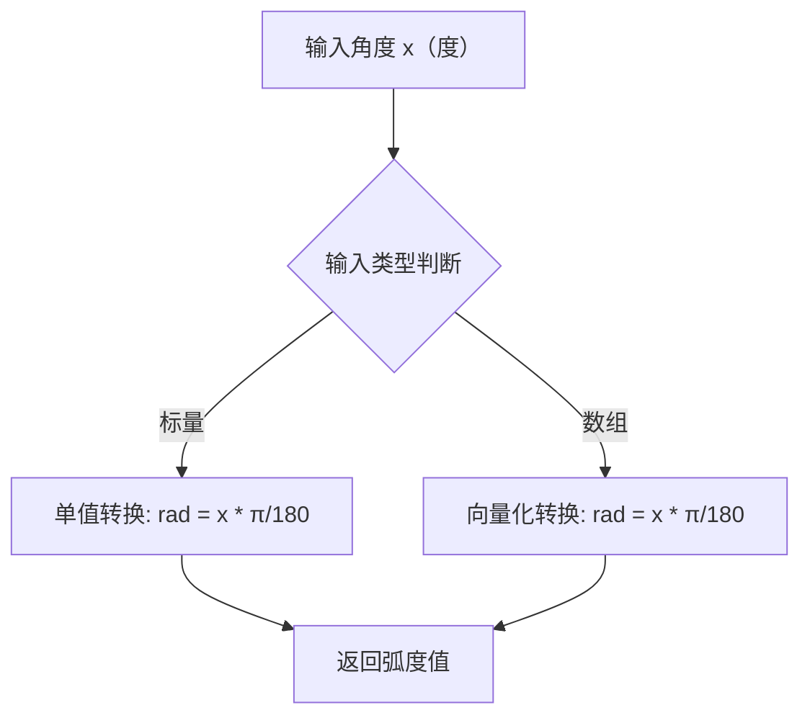
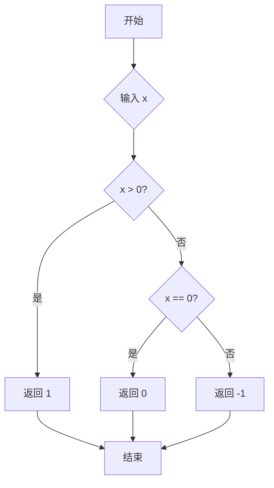
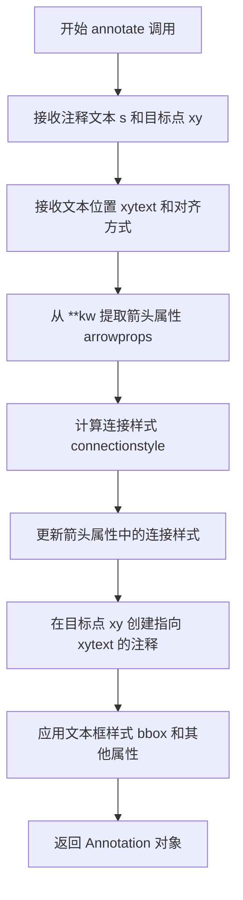
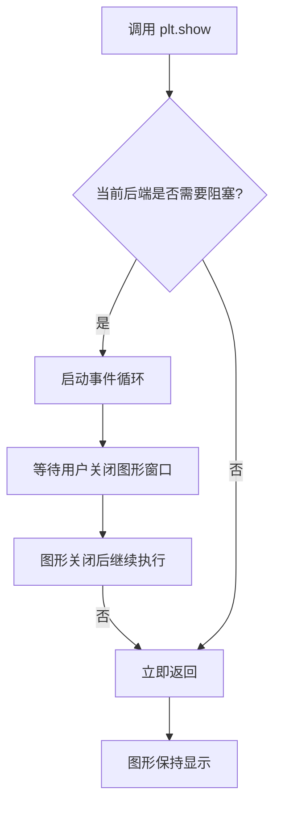

# `matplotlib\galleries\examples\pie_and_polar_charts\pie_and_donut_labels.py` 详细设计文档

这是一个Matplotlib可视化示例代码，展示了如何创建饼图（pie chart）和甜甜圈图（donut chart），并使用图例（legend）和注释（annotation）功能为图表添加标签。

## 整体流程

```mermaid
graph TD
    A[开始] --> B[导入 matplotlib.pyplot 和 numpy]
    B --> C[创建饼图 - fig, ax = plt.subplots]
    C --> D[准备食谱数据: recipe, data, ingredients]
    D --> E[调用 ax.pie(data) 创建饼图]
    E --> F[调用 ax.pie_label 添加百分比标签]
    F --> G[调用 ax.legend 添加图例]
    G --> H[设置标题 ax.set_title]
    H --> I[plt.show 显示饼图]
    I --> J[创建甜甜圈图 - fig, ax = plt.subplots]
    J --> K[准备甜甜圈食谱数据]
    K --> L[调用 ax.pie with wedgeprops=dict(width=0.5)]
    L --> M[遍历 wedges 计算角度和坐标]
    M --> N[调用 ax.annotate 添加注释箭头]
    N --> O[设置甜甜圈图标题]
    O --> P[plt.show 显示甜甜圈图]
    P --> Q[结束]
```

## 类结构

```
Python Script (无自定义类)
├── 饼图绘制模块
│   ├── 数据准备
│   ├── ax.pie() 创建饼图
│   ├── ax.pie_label() 添加标签
│   └── ax.legend() 添加图例
└── 甜甜圈图绘制模块
    ├── 数据准备
    ├── ax.pie() with wedgeprops 创建甜甜圈
    ├── 角度计算逻辑
    └── ax.annotate() 添加注释
```

## 全局变量及字段


### `fig`
    
图形容器对象，用于存放一个或多个子图

类型：`matplotlib.figure.Figure`
    


### `ax`
    
坐标轴对象，用于绑制图表元素

类型：`matplotlib.axes.Axes`
    


### `recipe`
    
存储饼图食谱原料字符串列表，每个元素包含数量和原料名称

类型：`list[str]`
    


### `data`
    
存储原料对应的数值列表，通过解析recipe提取

类型：`list[int]`
    


### `ingredients`
    
存储原料名称列表，用于图例标签

类型：`list[str]`
    


### `pie`
    
饼图容器对象，包含所有饼图楔形对象

类型：`matplotlib.container.PieContainer`
    


### `recipe`
    
存储甜甜圈食谱原料字符串列表

类型：`list[str]`
    


### `data`
    
存储甜甜圈原料数值列表

类型：`list[int]`
    


### `pie`
    
甜甜圈图表容器对象，包含所有楔形对象

类型：`matplotlib.container.PieContainer`
    


### `bbox_props`
    
注释框样式属性字典，包含边框、填充、线宽等样式配置

类型：`dict`
    


### `kw`
    
注释关键字参数字典，包含箭头样式、边框属性、垂直对齐等配置

类型：`dict`
    


### `i`
    
循环索引，用于遍历楔形对象和对应的食谱

类型：`int`
    


### `p`
    
当前遍历到的楔形对象，代表饼图的一个扇区

类型：`matplotlib.patches.Wedge`
    


### `ang`
    
楔形中心角度，用于计算标注位置和连接样式

类型：`float`
    


### `y`
    
楔形中心角度对应的正弦值，用于确定标注点的y坐标

类型：`float`
    


### `x`
    
楔形中心角度对应的余弦值，用于确定标注点的x坐标

类型：`float`
    


### `horizontalalignment`
    
文本水平对齐方式，根据楔形位置分为左对齐或右对齐

类型：`str`
    


### `connectionstyle`
    
连接样式字符串，定义注释箭头从标注点指向楔形的角度

类型：`str`
    


    

## 全局函数及方法


### `plt.subplots`

`plt.subplots` 是 Matplotlib 库中用于创建一个新的图形窗口（Figure）以及一个或多个子图（Axes）的函数。它是最常用的初始化绘图环境的方法之一，支持自定义图形大小、布局和子图属性。

参数：

- `figsize`：`tuple of float`，图形尺寸，格式为 (宽度, 高度)，单位为英寸。第一次调用 `plt.subplots(figsize=(6, 3))` 创建了一个宽 6 英寸、高 3 英寸的图形。
- `subplot_kw`：`dict`，可选参数，传递给每个子图的关键字参数字典。在第二次调用中使用了 `subplot_kw=dict(aspect="equal")` 来设置坐标轴的纵横比为相等，这对于绘制饼图和环形图非常重要。
- `**fig_kw`：接收传递给 `Figure` 构造函数的其他关键字参数，如 `dpi`、`facecolor` 等。

返回值：`tuple`，返回一个包含两个元素的元组：
- `fig`：`matplotlib.figure.Figure` 对象，表示整个图形容器。
- `ax`：`matplotlib.axes.Axes` 对象或 `numpy` 数组，表示一个或多个子图坐标轴。当 `squeeze=False` 时，根据行列数返回相应维度的数组；当 `squeeze=True`（默认值）且只有一个子图时，返回单个 Axes 对象。

#### 流程图



#### 带注释源码

```python
import matplotlib.pyplot as plt
import numpy as np

# 第一次调用 plt.subplots
# 创建了一个宽6英寸、高3英寸的图形窗口和对应的坐标轴
# 返回的 fig 是 Figure 对象，ax 是 Axes 对象
fig, ax = plt.subplots(figsize=(6, 3))

# 在第一个子图上绘制饼图
recipe = ["375 g flour", "75 g sugar", "250 g butter", "300 g berries"]
data = [int(x.split()[0]) for x in recipe]
ingredients = [x.split()[-1] for x in recipe]

pie = ax.pie(data)  # 绘制饼图

ax.pie_label(pie, '{frac:.1%}\n({absval:d}g)',
             textprops=dict(color="w", size=8, weight="bold"))

ax.legend(pie.wedges, ingredients,
          title="Ingredients",
          loc="center left",
          bbox_to_anchor=(1, 0, 0.5, 1))

ax.set_title("Matplotlib bakery: A pie")

plt.show()


# 第二次调用 plt.subplots
# 同样创建了宽6英寸、高3英寸的图形
# 但通过 subplot_kw 参数设置了 aspect="equal"，使坐标轴保持等比例
# 这对于正确显示环形图（donut chart）至关重要
fig, ax = plt.subplots(figsize=(6, 3), subplot_kw=dict(aspect="equal"))

recipe = ["225 g flour", "90 g sugar", "1 egg", "60 g butter", "100 ml milk", "1/2 package of yeast"]
data = [225, 90, 50, 60, 100, 5]

# 绘制环形图：通过设置 wedgeprops=dict(width=0.5) 使得饼图中间形成空洞
pie = ax.pie(data, wedgeprops=dict(width=0.5), startangle=-40)

# 为每个扇区添加注释标签
bbox_props = dict(boxstyle="square,pad=0.3", fc="w", ec="k", lw=0.72)
kw = dict(arrowprops=dict(arrowstyle="-"), bbox=bbox_props, zorder=0, va="center")

for i, p in enumerate(pie.wedges):
    # 计算每个扇区中心的角度
    ang = (p.theta2 - p.theta1)/2. + p.theta1
    # 将角度转换为笛卡尔坐标
    y = np.sin(np.deg2rad(ang))
    x = np.cos(np.deg2rad(ang))
    # 根据x坐标的正负确定文本水平对齐方式
    horizontalalignment = {-1: "right", 1: "left"}[int(np.sign(x))]
    # 设置注释箭头的连接样式
    connectionstyle = f"angle,angleA=0,angleB={ang}"
    kw["arrowprops"].update({"connectionstyle": connectionstyle})
    # 添加注释
    ax.annotate(recipe[i], xy=(x, y), xytext=(1.35*np.sign(x), 1.4*y),
                horizontalalignment=horizontalalignment, **kw)

ax.set_title("Matplotlib bakery: A donut")

plt.show()
```


### `matplotlib.axes.Axes.pie` / `matplotlib.pyplot.pie`

该函数是 Matplotlib 中用于创建饼图（Pie Chart）的核心方法，通过指定数据数组、颜色、标签、百分比格式等参数，在 Axes 对象上绘制饼图，并返回包含楔形（Wedge）对象、文本标签和比例外延的元组，可进一步用于图例、标注等高级功能。

参数：

- `x`：`1D array-like`，饼图各扇区的数据值，数组长度代表扇区数量，数值大小决定扇区角度占比
- `explode`：`array-like`，可选，每个扇区相对于半径的偏移量数组，用于突出显示某些扇区，默认 None
- `labels`：`list`，可选，每个扇区的标签文本列表，与 x 长度一致，默认 None
- `colors`：`array-like`，可选，扇区填充颜色列表，支持颜色名称、十六进制、RGB 元组，默认 None
- `autopct`：`str` 或 `callable`，可选，百分比显示格式字符串（如 `'%.1f%%'`）或函数，默认 None
- `pctdistance`：`float`，可选，百分比文本到圆心的距离相对于半径的比例，默认 0.6
- `shadow`：`bool`，可选，是否在饼图下方绘制阴影，默认 False
- `startangle`：`float`，可选，饼图起始角度（以度为单位），0 度为 3 点钟方向，默认 0
- `angle`：`float`，可选，饼图的旋转角度（已废弃，使用 startangle 代替），默认 -90
- `radius`：`float`，可选，饼图半径，默认 None（使用 1）
- `wedgeprops`：`dict`，可选，传递给 Wedge 对象的参数字典，可设置边框、宽度等属性，默认 None
- `textprops`：`dict`，可选，传递给文本标签的参数字典，设置字体、颜色等，默认 None
- `labeldistance`：`float`，可选，标签文本到圆心的距离相对于半径的比例，默认 1.1
- `center`：`list` 或 `tuple`，可选，饼图中心坐标 (x, y)，默认 (0, 0)
- `frame`：`bool`，可选，是否显示坐标轴边框，默认 False
- `rotatelabels`：`bool`，可选，是否旋转标签以匹配扇区角度，默认 False
- `normalize`：`bool`，可选，是否将数据归一化为百分比总和为 100%，默认 True

返回值：`(tuple[Wedge, list[Text], list[Text]])`，返回一个包含三个元素的元组
- 第一个元素：`Wedge` 对象或 `PieContainer`，代表整个饼图的容器，包含所有扇区
- 第二个元素：文本对象列表，存储自动百分比标签（autopct 生成的文本）
- 第三个元素：文本对象列表，存储扇区标签（labels 参数生成的文本）

#### 流程图



#### 带注释源码

```python
def pie(self, x, explode=None, labels=None, colors=None, autopct=None,
        pctdistance=0.6, shadow=False, startangle=0, angle=-90,
        radius=None, wedgeprops=None, textprops=None, labeldistance=1.1,
        center=(0, 0), frame=False, rotatelabels=False, *, normalize=None):
    """
    绘制饼图
    
    参数:
        x: 饼图数据数组
        explode: 扇区偏移数组
        labels: 扇区标签列表
        colors: 颜色列表
        autopct: 百分比格式字符串或函数
        pctdistance: 百分比文本距离
        shadow: 是否显示阴影
        startangle: 起始角度
        angle: 旋转角度（已废弃）
        radius: 饼图半径
        wedgeprops: 楔形属性字典
        textprops: 文本属性字典
        labeldistance: 标签距离
        center: 中心坐标
        frame: 是否显示边框
        rotatelabels: 是否旋转标签
        normalize: 是否归一化
    
    返回:
        PieContainer: 包含楔形、文本和比例外延的容器对象
    """
    # 导入必要的模块
    import numpy as np
    from matplotlib.container import PieContainer
    from matplotlib.patches import Wedge
    from matplotlib.text import Text
    
    # 数据验证和预处理
    x = np.asarray(x)  # 转换为 numpy 数组
    if len(x) == 0:
        raise ValueError("x 必须是非空数组")
    
    # 归一化处理（如果需要）
    if normalize is None:
        normalize = True
    if normalize:
        x = x / x.sum()  # 将数据转换为比例
    
    # 设置默认参数
    if radius is None:
        radius = 1
    if startangle is None:
        startangle = 0
    
    # 处理 explode 参数
    if explode is None:
        explode = [0] * len(x)
    if len(explode) != len(x):
        raise ValueError("explode 长度必须与 x 一致")
    
    # 处理 colors 参数
    if colors is None:
        cycler = plt.rcParams['axes.prop_cycle']
        colors = cycler.by_key()['color'][:len(x)]
    
    # 处理 labels 参数
    if labels is None:
        labels = [''] * len(x)
    
    # 角度计算
    # 将 360 度分割成多个扇区，每个扇区角度与其数据值成比例
    angles = x * 360  # 将比例转换为角度
    
    # 创建楔形对象列表
    wedges = []
    for i, (angle, expl) in enumerate(zip(angles, explode)):
        # 计算扇区起始和结束角度
        theta1 = startangle
        theta2 = startangle + angle
        
        # 创建 Wedge 对象
        # center: 饼图中心
        # r: 半径
        # theta1, theta2: 起始和结束角度
        # 偏移量（explode）通过修改中心位置实现
        wedge = Wedge(center, radius, theta1, theta2,
                      facecolor=colors[i % len(colors)],
                      edgecolor='white',
                      linewidth=1,
                      **wedgeprops if wedgeprops else {})
        
        # 应用 explode 偏移
        if expl > 0:
            # 计算偏移方向
            mid_angle = np.deg2rad((theta1 + theta2) / 2)
            wedge.center = (center[0] + expl * radius * np.cos(mid_angle),
                           center[1] + expl * radius * np.sin(mid_angle))
        
        wedges.append(wedge)
        startangle = theta2  # 更新下一个扇区的起始角度
    
    # 将楔形添加到 Axes
    for wedge in wedges:
        self.add_patch(wedge)
    
    # 处理百分比标签（autopct）
    texts = []
    if autopct is not None:
        # 计算百分比标签位置
        for i, (wedge, angle) in enumerate(zip(wedges, angles)):
            if angle == 0:
                continue
            # 计算百分比文本位置
            mid_angle = np.deg2rad(wedge.theta1 + angle / 2)
            xt = center[0] + pctdistance * radius * np.cos(mid_angle)
            yt = center[1] + pctdistance * radius * np.sin(mid_angle)
            
            # 格式化百分比文本
            if callable(autopct):
                pct = autopct(x[i] * 100)  # 转换为百分比
            else:
                pct = autopct % (x[i] * 100)
            
            # 创建文本对象
            text = self.text(xt, yt, pct, ha='center', va='center',
                           **textprops if textprops else {})
            texts.append(text)
    
    # 处理标签（labels）
    label_texts = []
    if labels:
        for i, (wedge, label) in enumerate(zip(wedges, labels)):
            if label == '':
                continue
            # 计算标签位置
            mid_angle = np.deg2rad(wedge.theta1 + angles[i] / 2)
            xt = center[0] + labeldistance * radius * np.cos(mid_angle)
            yt = center[1] + labeldistance * radius * np.sin(mid_angle)
            
            # 旋转标签
            if rotatelabels:
                rotation = np.rad2deg(mid_angle)
                if rotation > 90:
                    rotation -= 180
            else:
                rotation = 0
            
            # 创建标签文本对象
            text = self.text(xt, yt, label, ha='center', va='center',
                           rotation=rotation,
                           **textprops if textprops else {})
            label_texts.append(text)
    
    # 创建 PieContainer 容器
    container = PieContainer(wedges, texts, label_texts,
                           -exploted=any(e > 0 for e in explode))
    
    # 返回包含楔形、百分比文本和标签文本的元组
    # 也可以直接返回 PieContainer 对象
    return wedges[0] if len(wedges) == 1 else container
```

#### 关键组件信息

| 组件名称 | 一句话描述 |
|---------|-----------|
| `Wedge` | 表示饼图单个扇区的几何对象，包含角度、半径、颜色等属性 |
| `PieContainer` | 饼图容器对象，管理所有楔形、文本和比例外延的集合 |
| `ax.pie_label` | 用于自动为饼图添加格式化标签的方法，支持百分比和绝对值显示 |
| `ax.legend` | 用于创建图例的方法，可将饼图楔形作为句柄显示 |

#### 潜在技术债务与优化空间

1. **函数参数过多**：`pie` 方法拥有超过 15 个参数，这增加了学习和使用成本。建议封装为 Builder 模式或使用配置对象（kwargs）。
2. **angle 参数废弃**：`angle` 参数已标记为废弃，但保留以保持向后兼容性，增加了代码复杂度。
3. **返回值多样性**：返回值可能是单个 Wedge（单扇区）或 PieContainer（多扇区），调用方需要做类型判断，建议统一返回容器类型。
4. **颜色循环逻辑**：当颜色数少于扇区数时，颜色会循环使用但没有警告，可能导致用户误解。
5. **explode 偏移计算**：当前的偏移计算直接修改中心坐标，可能与某些坐标系设置产生冲突，建议通过 transform 方式实现。

#### 其它项目说明

**设计目标与约束**：
- 饼图适用于展示部分与整体的关系，建议扇区数量不超过 5-7 个
- 强调数据可读性，百分比标签应清晰可见
- 支持环形图变体，通过 `wedgeprops={'width': <value>}` 实现

**错误处理与异常**：
- 空数据数组会抛出 `ValueError`
- `explode` 和 `labels` 长度与数据不一致时抛出 `ValueError`
- 负数数据会自动取绝对值处理（视具体版本而定）

**数据流与状态机**：
```
输入数据 x → 归一化处理 → 角度分配 → 颜色/标签映射 
→ Wedge 对象创建 → 添加到 Axes → 文本标签定位 → 返回容器
```

**外部依赖与接口契约**：
- 依赖 `matplotlib.patches.Wedge` 创建扇形
- 依赖 `matplotlib.container.PieContainer` 封装结果
- 与 `ax.legend()` 配合时可传入 `pie.wedges` 作为句柄
- 与 `ax.pie_label()` 配合时需传入 pie 返回值作为第一个参数


### `Axes.pie_label`

为饼图（PieContainer）的每个扇区自动添加标签的绘图方法。该方法接收饼图容器对象和格式化字符串，自动计算每个扇区的位置并添加百分比和绝对值标签。

参数：

- `pie`：`~matplotlib.container.PieContainer`，由 `Axes.pie()` 返回的饼图容器对象，包含所有扇区（Wedge）对象
- `fmt`：`str`，格式化字符串，用于定义标签的显示格式。可用占位符包括 `{frac}`（百分比）、`{absval}`（绝对值）、`{name}`（标签名称）
- `textprops`：`dict`，可选，传递给标签文本的属性字典，如 `color`、`size`、`weight` 等，默认为 `None`
- `wedgeprops`：`dict`，可选，传递给扇区的属性字典，用于自定义标签引线或背景，默认为 `None`
- `labeldistance`：`float`，可选，标签到饼图中心的距离（相对于半径），默认为 `1.1`
- `ax`：~matplotlib.axes.Axes`，可选，指定要添加标签的坐标轴，默认为当前坐标轴

返回值：`list`，包含所有创建的 `~matplotlib.text.Annotation` 文本注释对象的列表

#### 流程图



#### 带注释源码

```python
def pie_label(self, pie, fmt, textprops=None, wedgeprops=None,
              labeldistance=1.1, ax=None):
    """
    为饼图添加标签。
    
    参数:
        pie: PieContainer 对象，由 ax.pie() 返回
        fmt: 格式化字符串，如 '{frac:.1%}\\n({absval:d}g)'
        textprops: 文本属性字典，如 {'color': 'w', 'size': 8}
        wedgeprops: 扇区属性字典，用于注释引线样式
        labeldistance: 标签距离饼图中心的倍数
        ax: 目标坐标轴对象
    
    返回:
        Annotation 对象列表
    """
    # 如果未指定 ax，使用当前坐标轴
    if ax is None:
        ax = self
    
    # 获取默认文本属性
    if textprops is None:
        textprops = {}
    
    annotations = []
    
    # 遍历饼图的所有扇区（wedge）
    for wedge in pie.wedges:
        # 获取扇区的数值（通常存储在 wedge 的 value 属性中）
        value = wedge.value  # 或通过其他方式获取
        
        # 获取扇区的角度范围
        theta1 = wedge.theta1
        theta2 = wedge.theta2
        
        # 计算扇区中心的角度（弧度）
        center_angle = np.deg2rad((theta1 + theta2) / 2)
        
        # 计算标签在极坐标系中的位置
        x = labeldistance * np.cos(center_angle)
        y = labeldistance * np.sin(center_angle)
        
        # 计算百分比和绝对值
        total = sum(w.value for w in pie.wedges)
        frac = value / total if total > 0 else 0
        absval = value
        
        # 使用格式化字符串生成标签文本
        label_text = fmt.format(frac=frac, absval=absval, name=wedge.get_label())
        
        # 确定文本对齐方式（根据角度位置）
        horizontalalignment = 'center'
        if x > 0:
            horizontalalignment = 'left'
        elif x < 0:
            horizontalalignment = 'right'
        
        # 创建注释对象
        annotation = ax.annotate(
            label_text,
            xy=(x, y),  # 注释目标位置（扇区边缘）
            xytext=(x, y),  # 文本位置（可调整）
            textcoords='data',
            ha=horizontalalignment,
            va='center',
            **(textprops or {}),
            **(wedgeprops or {})
        )
        
        annotations.append(annotation)
    
    return annotations
```


### `matplotlib.axes.Axes.legend`

在 Matplotlib 中，`ax.legend()` 方法用于向坐标轴添加图例，以标识图表中各个元素的含义。该方法接受句柄（艺术家对象）和对应的标签，并支持自定义位置、标题以及锚框等属性。

参数：

- `handles`：`list[Artist]`，图例句柄列表，通常为图表元素（如 `pie.wedges`，即饼图的楔形对象）
- `labels`：`list[str]`，与句柄对应的标签列表（如 `ingredients`，即食材名称）
- `title`：`str | None`，图例标题（示例中为 `"Ingredients"`）
- `loc`：`str | tuple[float, float]`，图例位置（示例中为 `"center left"`）
- `bbox_to_anchor`：`tuple[float, float, float, float] | tuple[float, float]`，锚框坐标，用于精确定位图例（示例中为 `(1, 0, 0.5, 1)`，表示从 `(1,0)` 到 `(1.5,1)` 的区域）
- `**kwargs`：其他关键字参数，传递给 `Legend` 构造函数

返回值：`matplotlib.legend.Legend`，返回创建的图例对象

#### 流程图



#### 带注释源码

```python
# 调用 ax.legend 方法添加图例
# 参数说明：
#   - pie.wedges: 饼图的楔形对象列表，作为图例句柄
#   - ingredients: 食材名称列表，作为图例标签
#   - title="Ingredients": 图例标题
#   - loc="center left": 图例位于左侧中心
#   - bbox_to_anchor=(1, 0, 0.5, 1): 
#       锚框坐标 (x0, y0, width, height) = (1, 0, 0.5, 1)
#       表示从 (1, 0) 到 (1.5, 1) 的区域，用于放置图例
# 返回值：Legend 对象
ax.legend(
    pie.wedges,          # list[Artist]: 图例句柄列表
    ingredients,         # list[str]: 对应的标签列表
    title="Ingredients", # str | None: 图例标题
    loc="center left",   # str | tuple: 图例位置
    bbox_to_anchor=(1, 0, 0.5, 1)  # tuple: 锚框坐标
)
```


### `Axes.set_title`

设置Axes对象的标题文本和样式。

参数：

- `label`：`str`，要设置的标题文本
- `fontdict`：`dict`，可选，用于控制标题的字体属性（如 fontsize, fontweight, color 等）
- `loc`：`str`，可选，标题对齐方式，可选值为 'center'（默认）, 'left', 'right'
- `pad`：`float`，可选，标题与图表顶部的间距（以点为单位）
- `**kwargs`：其他关键字参数，可选，将传递给 Text 对象，用于自定义文本样式（如 fontsize, fontweight, color, rotation 等）

返回值：`matplotlib.text.Text`，返回创建的标题文本对象，可用于后续修改标题样式

#### 流程图



#### 带注释源码

```python
# 在代码中实际使用示例

# 第一个图表：设置饼图标题
ax.set_title("Matplotlib bakery: A pie")
# 参数：
#   - "Matplotlib bakery: A pie" (label): 标题文本内容

# 第二个图表：设置甜甜圈图标题
ax.set_title("Matplotlib bakery: A donut")
# 参数：
#   - "Matplotlib bakery: A donut" (label): 标题文本内容


# 完整的 set_title 方法签名（参考 matplotlib 官方文档）
# def set_title(self, label, loc=None, pad=None, *, fontdict=None, **kwargs):
#
# 参数说明：
#   - label: str - 标题文本，必填参数
#   - loc: str - 标题对齐方式，可选 'center', 'left', 'right'，默认为 'center'
#   - pad: float - 标题与 Axes 顶部的间距（单位：点），默认为 rcParams 中的值
#   - fontdict: dict - 字体属性字典，可包含 fontsize, fontweight, color, ha, va 等
#   - **kwargs: 额外的关键字参数，直接传递给 matplotlib.text.Text 对象
#
# 返回值：
#   - matplotlib.text.Text 对象，代表创建或修改的标题文本
#
# 使用示例（扩展）：
# ax.set_title("Custom Title", loc="left", pad=20, fontsize=14, color="blue")
# ax.set_title("Custom Title", fontdict={"fontsize": 14, "fontweight": "bold"})
```


### `np.sin`

这是 NumPy 库中的正弦函数，用于计算给定角度（以弧度为单位）的正弦值。在本代码中，它用于根据角度计算圆周上点的 y 坐标。

参数：

-  `x`：`float` 或 `array-like`，输入角度（弧度制）

返回值：`ndarray` 或 `scalar`，输入角度的正弦值

#### 流程图



#### 带注释源码

```python
# 在 donut 图表的注释标签计算中使用 np.sin
for i, p in enumerate(pie.wedges):
    # 计算扇区的中心角度
    ang = (p.theta2 - p.theta1)/2. + p.theta1
    
    # np.deg2rad: 将角度转换为弧度
    # np.sin: 计算弧度的正弦值，得到圆周上该角度对应的 y 坐标
    y = np.sin(np.deg2rad(ang))
    
    # np.cos: 计算弧度的余弦值，得到圆周上该角度对应的 x 坐标
    x = np.cos(np.deg2rad(ang))
    
    # 根据 x 坐标的正负决定文本的水平对齐方式
    horizontalalignment = {-1: "right", 1: "left"}[int(np.sign(x))]
    
    # 构建连接样式，使注释箭头从甜甜圈指向外
    connectionstyle = f"angle,angleA=0,angleB={ang}"
    kw["arrowprops"].update({"connectionstyle": connectionstyle})
    
    # 创建注释标签
    ax.annotate(recipe[i], xy=(x, y), xytext=(1.35*np.sign(x), 1.4*y),
                horizontalalignment=horizontalalignment, **kw)
```


### `np.cos`

这是 NumPy 库中的余弦函数，用于计算输入角度（弧度）的余弦值。该函数接受一个数值或数组作为输入，返回对应角度的余弦结果。

参数：

-  `x`：`float` 或 `array_like`，输入角度（以弧度为单位），可以是单个数值或数组

返回值：`float` 或 `ndarray`，输入角度的余弦值，返回类型与输入类型一致

#### 流程图

```mermaid
graph TD
    A[开始] --> B[接收输入角度 x]
    B --> C{检查输入类型}
    C -->|标量| D[计算 cos(x)]
    C -->|数组| E[对每个元素计算 cos]
    D --> F[返回标量结果]
    E --> G[返回数组结果]
    F --> H[结束]
    G --> H
```

#### 带注释源码

```python
# np.cos 函数调用示例（来自代码第77行）
# 将角度转换为弧度后计算余弦值
x = np.cos(np.deg2rad(ang))

# 说明：
# 1. np.deg2rad(ang) - 将角度从度数转换为弧度
# 2. np.cos(...) - 计算转换后弧度值的余弦
# 3. 结果 x 是 -1 到 1 之间的浮点数，表示该角度的余弦值
# 
# 在此代码上下文中：
# - ang 是扇形的中心角度（度数）
# - x 用于确定注释框在圆周上的水平位置
# - 结合 np.sign(x) 判断文本对齐方式（左侧或右侧）
```


### `np.deg2rad`

将角度从度数转换为弧度的 NumPy 函数。在本代码中用于将角度值转换为弧度，以便正确计算正弦和余弦值。

参数：

- `x`：`float` 或 `array_like`，要转换的角度值（以度为单位）

返回值：`float` 或 `ndarray`，转换后的弧度值

#### 流程图



#### 带注释源码

```python
# np.deg2rad 函数的简化实现原理
# 输入: ang - 角度值（度）
# 输出: 转换后的弧度值
#
# 转换公式: radians = degrees × (π / 180)
#
# 在本代码中的实际使用:
ang = (p.theta2 - p.theta1)/2. + p.theta1  # 计算扇形的中心角度（度）
y = np.sin(np.deg2rad(ang))                 # 将角度转为弧度后计算正弦值
x = np.cos(np.deg2rad(ang))                 # 将角度转为弧度后计算余弦值
#
# 其中 p.theta1 和 p.theta2 是 Wedge 对象的起始和结束角度属性
# np.deg2rad 使得三角函数能够正确处理以度为单位的角度输入
```


### `np.sign`

`np.sign` 是 NumPy 库中的符号函数，用于返回数组元素或标量的符号。当元素大于0时返回1，等于0时返回0，小于0时返回-1。

参数：

- `x`：`array_like`，输入值，可以是标量、整数、浮点数或数组

返回值：

- `ndarray` 或 `scalar`，返回与输入形状相同的数组或标量，表示输入值的符号（正数为1，零为0，负数为-1）

#### 流程图



#### 带注释源码

```python
# 在代码中的实际使用：
# horizontalalignment = {-1: "right", 1: "left"}[int(np.sign(x))]

# 完整函数签名和说明：
# numpy.sign(x, /, out=None, *, where=True, casting='same_kind', order='K', dtype=None, subok=True)

# 参数说明：
# x: array_like，输入数组或标量
# out: ndarray，可选，结果存储的位置
# where: array_like，可选，广播条件
# 返回值：与x形状相同的数组，其中每个元素是x对应元素的符号

# 示例：
np.sign([1, -2, 0, 3])  # 输出: array([ 1, -1,  0,  1])
np.sign(-5)            # 输出: -1
np.sign(0)             # 输出: 0
np.sign(3.14)          # 输出: 1.0
```


### `matplotlib.axes.Axes.annotate`

该方法是 Matplotlib 中 Axes 类的注释标注方法，用于在图表指定位置添加带有可选箭头的文本注释。在绘制 donut 图时，通过计算每个饼图楔形的角度和坐标，为每个食材添加指向对应楔形的注释标注。

参数：

-  `s`：`str`，要显示的注释文本内容，此处传入 `recipe[i]`（食材名称列表中的对应元素）
-  `xy`：`tuple[float, float]`，注释指向的目标点坐标，此处为计算得到的楔形中心在单位圆上的坐标 `(x, y)`
-  `xytext`：`tuple[float, float]`，注释文本的放置位置坐标，此处为 `(1.35*np.sign(x), 1.4*y)`，使文本位于楔形外侧
-  `horizontalalignment`：`str`，文本的水平对齐方式，根据目标点 x 坐标符号决定是左对齐还是右对齐（`"left"` 或 `"right"`）
-  `**kw`：可变关键字参数，此处传入包含 `arrowprops`（箭头样式）、`bbox`（文本框样式）、`zorder`（图层顺序）、`va`（垂直对齐）等属性的字典

返回值：`matplotlib.text.Annotation`，返回创建的注释对象，用于后续可能的样式修改或属性访问

#### 流程图



#### 带注释源码

```python
# 遍历饼图的所有楔形对象
for i, p in enumerate(pie.wedges):
    # 计算楔形中心角度：取 theta1 和 theta2 的中间值
    ang = (p.theta2 - p.theta1)/2. + p.theta1
    
    # 根据角度计算单位圆上的坐标（楔形中心在圆周上的点）
    y = np.sin(np.deg2rad(ang))  # y 坐标：角度的正弦值
    x = np.cos(np.deg2rad(ang))  # x 坐标：角度的余弦值
    
    # 根据 x 坐标符号确定水平对齐方式：
    # x < 0 时右对齐，x > 0 时左对齐，确保文本始终背离圆心
    horizontalalignment = {-1: "right", 1: "left"}[int(np.sign(x))]
    
    # 构建连接样式字符串，使箭头从注释文本指向楔形中心
    # angleA=0 表示箭头起点角度，angleB=ang 表示箭头终点角度
    connectionstyle = f"angle,angleA=0,angleB={ang}"
    
    # 更新箭头属性字典中的连接样式
    kw["arrowprops"].update({"connectionstyle": connectionstyle})
    
    # 调用 annotate 方法添加注释
    # s: 注释文本（食材名称）
    # xy: 目标点坐标（楔形在圆周上的位置）
    # xytext: 文本位置（向外偏移 1.35 倍 x 方向和 1.4 倍 y 方向）
    # horizontalalignment: 水平对齐方式
    # **kw: 包含箭头、文本框等样式的字典
    ax.annotate(
        recipe[i],                          # 注释文本内容
        xy=(x, y),                          # 注释指向的目标点
        xytext=(1.35*np.sign(x), 1.4*y),    # 文本框位置
        horizontalalignment=horizontalalignment,  # 水平对齐
        **kw                                # 箭头和边框样式
    )
```


### `plt.show`

显示当前所有的图形窗口。该函数会阻塞程序的执行，直到用户关闭所有显示的图形窗口（在某些后端中），或者立即返回（在某些交互式后端中）。它是 Matplotlib 中用于将图形渲染到屏幕上的最终步骤。

参数：

- `block`：`bool` 或 `None`，可选参数。控制是否阻塞事件循环。如果设置为 `True`，则阻塞并启动事件循环；如果设置为 `False`，则立即返回；如果为 `None`（默认值），则根据当前后端和交互模式决定是否阻塞。

返回值：`None`，无返回值。

#### 流程图



#### 带注释源码

```python
# matplotlib.pyplot.show 函数源码示例
# 位置: lib/matplotlib/pyplot.py

def show(*, block=None):
    """
    显示所有打开的图形窗口。
    
    参数:
        block : bool or None, optional
            控制是否阻塞程序执行。如果为True，函数会阻塞并运行事件循环，
            直到用户关闭窗口。如果为False，立即返回。如果为None，
            则根据交互模式和后端自动决定。
    """
    # 获取全局图形管理器
    global _show_registry
    
    # 遍历所有打开的图形
    for manager in Gcf.get_all_fig_managers():
        # 如果没有指定block参数，根据后端决定
        if block is None:
            # 默认行为：交互式后端可能不阻塞
            block = get_backend().show_block
        
        # 调用管理器的show方法
        manager.show()
        
        # 如果block为True，启动阻塞事件循环
        if block:
            # 启动GUI事件循环（通常是mainloop）
            manager.full_screen_toggle()
            # 等待窗口关闭
            while manager.canvas.figure.number in get_fignums():
                # 处理事件
                process_events()
    
    # 刷新待渲染的图形
    draw_all()
    
    # 如果使用了交互式后端，可能需要设置show()被调用过
    _show_registry = True
```

#### 在本代码中的使用

```python
# 第一次调用：显示饼图
# 在完成饼图的创建、添加标签和图例之后调用
ax.set_title("Matplotlib bakery: A pie")
plt.show()  # ← 显示第一个图形（饼图）

# 之后创建环形图...

# 第二次调用：显示环形图
ax.set_title("Matplotlib bakery: A donut")
plt.show()  # ← 显示第二个图形（环形图）
```

#### 实际行为说明

在本示例代码中，`plt.show()` 的具体行为如下：

1. **第一次调用** (`plt.show()` 在饼图之后):
   - Matplotlib 会查找当前打开的图形窗口（由 `fig, ax = plt.subplots(figsize=(6, 3))` 创建）
   - 将饼图渲染到窗口并显示给用户
   - 在非交互式后端（如Agg）中，调用会立即返回
   - 在交互式后端（如TkAgg、Qt5Agg）中，可能会阻塞直到用户关闭窗口

2. **第二次调用** (`plt.show()` 在环形图之后):
   - 显示第二个图形（环形图）
   - 如果第一个窗口还在显示，Matplotlib可能会在同一个窗口中更新内容，或者打开新窗口，取决于后端设置

#### 注意事项

- `plt.show()`  通常应该在所有图形配置完成后调用
- 在Jupyter Notebook等交互环境中，可能需要使用 `%matplotlib inline` 或 `%matplotlib widget` 来正确显示
- 在某些脚本中，`plt.show()` 是程序最后一行，确保图形不会立即关闭


## 关键组件


### 饼图创建 (Pie Chart Creation)

使用 `matplotlib.axes.Axes.pie` 方法创建饼图，通过 `ax.pie(data)` 调用，返回 `PieContainer` 对象，包含多个 `Wedge` 扇形对象。

### 甜甜圈图创建 (Donut Chart Creation)

通过 `ax.pie()` 方法的 `wedgeprops` 参数设置 `width=0.5`，使饼图中心形成空心区域，将饼图转换为甜甜圈图。

### 饼图自动标签 (Pie Label)

使用 `ax.pie_label()` 方法自动为每个扇区添加标签，支持格式字符串（如 `'{frac:.1%}\n({absval:d}g)'`）显示百分比和绝对值。

### 图例组件 (Legend Component)

通过 `ax.legend()` 方法和 `PieContainer` 的 `wedges` 属性创建图例，利用 `bbox_to_anchor` 参数将图例定位在图表外部。

### 注释标注 (Annotation)

使用 `ax.annotate()` 方法为甜甜圈图添加自定义标注，通过计算扇区中心角度确定标注位置和箭头指向。

### 数据提取与处理 (Data Extraction)

从食谱字符串列表中提取数值数据（克数）和食材名称，使用字符串分割和列表推导式进行处理。

### 角度计算与坐标转换 (Angle Calculation)

通过 `np.sin()` 和 `np.cos()` 函数结合角度到弧度的转换，计算甜甜圈图上每个扇区中心的坐标位置。

### 动态样式配置 (Dynamic Styling)

根据扇区位置动态确定文本水平对齐方式（`horizontalalignment`）和注释箭头样式（`connectionstyle`）。


## 问题及建议


### 已知问题

-   **数据解析逻辑脆弱**：使用字符串分割方式解析配方数据（如`int(x.split()[0])`），假设固定格式"数字 + 单位 + 名称"，格式变化会导致运行时错误
-   **魔法数字缺乏解释**：代码中存在多个未命名的数值常量（如`1.35`、`1.4`、`-40`、`0.5`、`0.3`、`0.72`），缺乏语义化命名影响可读性
-   **重复代码结构**：饼图和甜甜圈图的创建流程高度相似，存在大量重复的代码模式（fig创建、ax设置、title设置等）
-   **硬编码配置分散**：可视化参数（如颜色、字体大小、边框样式等）散落在代码各处，缺乏集中配置管理
-   **注释中的代码示例与实际执行流程混用**：使用`# %%`分隔的Sphinx笔记本注释，虽然方便文档生成，但影响了代码的线性阅读体验
-   **缺乏类型注解**：Python代码中完全没有类型提示，降低了代码的可维护性和IDE支持
-   **无错误处理机制**：数据解析、文件操作（如有）等关键步骤缺少异常捕获和处理
-   **注释与实现不同步风险**：docstring中描述的功能（如提到`pie_label`方法）若API变化，注释不会产生编译错误，容易被忽视

### 优化建议

-   **提取配置常量**：将所有魔法数字和硬编码值提取为具名常量或配置字典，提高可维护性
-   **封装图表创建逻辑**：将饼图/甜甜圈图的创建流程封装为函数或类，接收配置参数，减少重复代码
-   **增强数据解析鲁棒性**：使用正则表达式或专门的数据类/结构处理配方解析，添加格式验证
-   **添加类型注解**：为函数参数、返回值和关键变量添加类型提示，提升代码可读性和IDE支持
-   **添加错误处理**：为数据解析、Matplotlib绘图等可能失败的操作添加try-except异常处理
-   **文档字符串改进**：采用更结构化的文档格式（如NumPy风格），为函数和核心逻辑添加开发者导向的说明
-   **考虑使用dataclass或namedtuple**：替代简单的列表来存储配方数据，提高数据表达清晰度


## 其它


### 设计目标与约束

本示例代码的核心设计目标是展示如何使用Matplotlib创建带有标签的饼图和甜甜圈图。具体包括：1）使用pie()方法创建基础饼图；2）使用pie_label()方法自动标注百分比和数值；3）使用legend()添加图例；4）通过wedgeprops参数将饼图转换为甜甜圈图；5）使用annotate()方法添加带箭头指向的注释标签。约束条件：需要Matplotlib 3.9+版本支持pie_label方法，需要numpy库支持数值计算。

### 错误处理与异常设计

代码中未包含显式的错误处理机制。潜在异常包括：1）data列表元素无法解析为整数时会导致ValueError；2）recipe列表长度与data列表长度不匹配会导致索引越界；3）当使用sign(x)时x为0的情况需要特殊处理（代码中使用int(np.sign(x))转换为-1或1索引）；4）matplotlib版本不兼容可能导致方法调用失败。建议添加数据验证、长度检查和版本兼容性检查。

### 数据流与状态机

数据流如下：recipe字符串列表 → 数据提取（解析recipe获取数值和食材名称） → data列表和ingredients列表 → pie()方法生成Wedge对象集合 → pie_label()生成标签 → legend()生成图例 → annotate()为每个扇区添加注释。状态机表现为：初始化状态（创建figure和axes）→ 饼图创建状态 → 标签配置状态 → 渲染状态 → 展示状态。

### 外部依赖与接口契约

主要外部依赖包括：1）matplotlib.pyplot - 绘图库；2）numpy - 数值计算库。接口契约：pie()返回PieContainer对象，包含wedges属性（Wedge列表）；pie_label()接受PieContainer和格式字符串；ax.legend()接受handles、labels、title、loc和bbox_to_anchor参数；ax.annotate()接受文本、xy坐标、xytext坐标和关键字参数。

### 性能考虑

当前代码性能可接受。对于大数据集，建议：1）限制扇区数量；2）预先计算角度和坐标；3）使用set_visible()控制注释显示/隐藏而非重新创建；4）对于动画或交互场景，考虑缓存Wedge对象。

### 可测试性设计

代码可测试性较差，建议重构为可测试的函数：1）extract_data()函数处理recipe解析；2）create_pie_chart()和create_donut_chart()函数封装图表创建逻辑；3）添加参数化配置支持；4）返回图表对象而非直接显示以便验证。

### 安全性考虑

代码本身无安全风险，为纯可视化示例。潜在安全考虑：1）避免使用eval()处理用户输入；2）如果recipe来自外部输入需进行输入验证；3）pie_label格式字符串应验证避免格式化错误。

### 国际化/本地化

当前代码仅支持英文标签。如需国际化：1）recipe字符串外部化到语言文件；2）图例标题、格式字符串需支持翻译；3）百分比和数值格式需考虑不同地区的小数点分隔符。

### 配置与可扩展性

可扩展性设计建议：1）将颜色方案、字体大小、位置参数提取为配置字典；2）支持自定义标签格式化函数；3）支持不同图例位置；4）支持自定义注释箭头样式；5）可配置饼图/甜甜圈图切换。

### 版本兼容性

代码要求：1）matplotlib >= 3.9.0（pie_label方法）；2）numpy >= 1.20.0（部分numpy函数）；3）Python >= 3.8。向后兼容性：对于旧版本matplotlib，可使用替代方法实现类似功能，如手动创建文本标签替代pie_label。

### 代码风格与规范

代码遵循PEP 8基本规范：1）使用snake_case命名变量；2）适当空行分隔逻辑块；3）包含docstring文档注释。改进建议：1）添加类型注解；2）常量提取为模块级变量；3）长字符串使用变量存储；4）添加更详细的注释说明算法原理。

### 监控与日志

当前代码无监控和日志记录。如需添加：1）记录图表创建成功/失败状态；2）记录数据处理统计信息；3）记录渲染性能指标；4）使用logging模块替代print语句。

### 故障恢复

故障恢复建议：1）数据提取失败时使用默认值或抛出明确异常；2）图表创建失败时清理资源；3）提供fallback渲染方案（如简单饼图替代复杂标注版本）；4）使用try-except包装核心逻辑并记录详细错误信息。


    