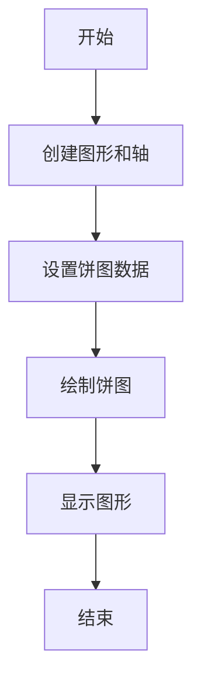
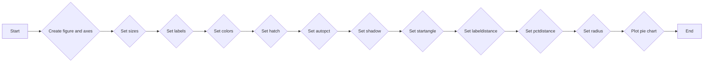
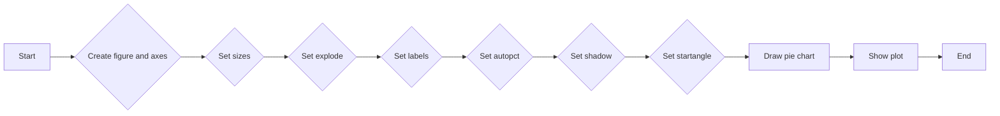
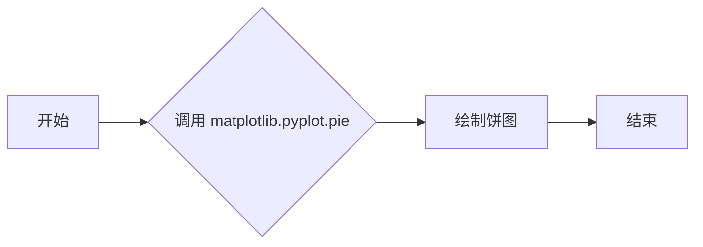
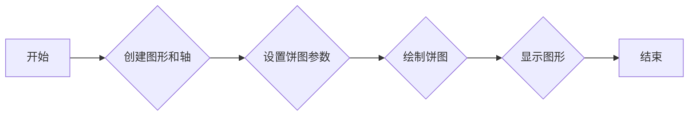
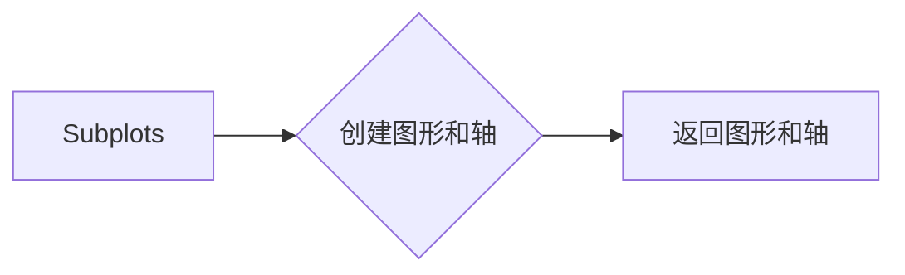

# `matplotlib\galleries\examples\pie_and_polar_charts\pie_features.py` 详细设计文档

This code generates pie charts with various customization options such as labels, colors, hatching, and text positioning.

## 整体流程



## 类结构

```
matplotlib.pyplot (全局模块)
├── plt (全局变量)
│   ├── subplots()
│   ├── pie()
│   └── show()
```

## 全局变量及字段


### `labels`
    
List of labels for the pie chart slices.

类型：`list of str`
    


### `sizes`
    
List of sizes for the pie chart slices, representing the percentage of the whole each slice takes.

类型：`list of int`
    


### `fig`
    
The figure object containing the pie chart.

类型：`matplotlib.figure.Figure`
    


### `ax`
    
The axes object containing the pie chart.

类型：`matplotlib.axes._subplots.AxesSubplot`
    


### `matplotlib.pyplot`
    
The matplotlib.pyplot module containing various plotting functions.

类型：`module`
    


### `matplotlib.pyplot.plt`
    
The matplotlib.pyplot module containing various plotting functions.

类型：`module`
    
    

## 全局函数及方法


### plt.pie

`plt.pie` 是 `matplotlib.pyplot` 模块中的一个函数，用于绘制饼图。

参数：

- `sizes`：`list`，表示每个饼图切片的大小。
- `explode`：`list`，表示每个切片是否突出显示，其中每个元素对应于 `sizes` 列表中的一个切片。
- `labels`：`list`，表示每个切片的标签。
- `autopct`：`str` 或 `function`，表示每个切片的百分比标签格式。
- `shadow`：`bool` 或 `dict`，表示是否添加阴影以及阴影的属性。
- `startangle`：`float`，表示饼图切片的起始角度。

返回值：`AxesSubplot` 对象，包含饼图。

#### 流程图

```mermaid
graph LR
A[开始] --> B{调用 plt.pie()}
B --> C{绘制饼图}
C --> D[结束]
```

#### 带注释源码

```python
import matplotlib.pyplot as plt

# 定义数据
sizes = [15, 30, 45, 10]
labels = 'Frogs', 'Hogs', 'Dogs', 'Logs'
explode = (0, 0.1, 0, 0)

# 绘制饼图
plt.pie(sizes, explode=explode, labels=labels, autopct='%1.1f%%', shadow=True, startangle=90)
plt.show()
```


### matplotlib.pyplot.pie

`matplotlib.pyplot.pie` is a function used to create pie charts. It is a part of the `matplotlib.pyplot` module and is used to plot a pie chart from the given data.

参数：

- `sizes`：`list`，A list of sizes for each slice of the pie chart. Each size represents the proportion of the whole that the slice represents.
- `explode`：`list`，A list of values to offset each slice from the center of the pie chart. Only the first value in the list is used for the first slice, and so on.
- `labels`：`list`，A list of labels for each slice of the pie chart.
- `colors`：`list`，A list of colors for each slice of the pie chart.
- `hatch`：`list`，A list of hatch patterns for each slice of the pie chart.
- `autopct`：`str` or `function`，A string or function to use for labeling the pie chart slices with their percentage values.
- `shadow`：`dict`，A dictionary of arguments to pass to the `.Shadow` patch for adding a shadow to the pie chart slices.
- `startangle`：`float`，The starting angle for the pie chart slices in degrees.
- `labeldistance`：`float`，The distance of the labels from the center of the pie chart as a fraction of the radius.
- `pctdistance`：`float`，The distance of the percentage labels from the center of the pie chart as a fraction of the radius.
- `radius`：`float`，The radius of the pie chart.

返回值：`AxesSubplot`，The `AxesSubplot` object that contains the pie chart.

#### 流程图



#### 带注释源码

```python
import matplotlib.pyplot as plt

def plot_pie_chart(sizes, labels=None, colors=None, hatch=None, autopct='%1.1f%%', shadow=None, startangle=90, labeldistance=1.1, pctdistance=0.85, radius=1):
    fig, ax = plt.subplots()
    ax.pie(sizes, explode=[0.1 if i == 1 else 0 for i in range(len(sizes))], labels=labels, colors=colors, hatch=hatch, autopct=autopct, shadow=shadow, startangle=startangle, labeldistance=labeldistance, pctdistance=pctdistance, radius=radius)
    plt.show()
```


### matplotlib.pyplot.pie

`matplotlib.pyplot.pie` 是一个用于绘制饼图的函数。

参数：

- `sizes`：`list`，表示每个饼图切片的大小。
- `explode`：`list`，表示每个切片是否突出显示，默认为 `[0, 0, 0, 0]`。
- `labels`：`list`，表示每个切片的标签。
- `autopct`：`str` 或 `function`，表示切片的百分比格式。
- `shadow`：`dict`，表示阴影的属性，默认为 `None`。
- `startangle`：`float`，表示饼图切片的起始角度，默认为 `0`。

返回值：`AxesSubplot` 对象，包含饼图。

#### 流程图



#### 带注释源码

```python
import matplotlib.pyplot as plt

# Create figure and axes
fig, ax = plt.subplots()

# Set sizes
sizes = [15, 30, 45, 10]

# Set explode
explode = (0, 0.1, 0, 0)

# Set labels
labels = 'Frogs', 'Hogs', 'Dogs', 'Logs'

# Set autopct
autopct='%1.1f%%'

# Set shadow
shadow = True

# Set startangle
startangle = 90

# Draw pie chart
ax.pie(sizes, explode=explode, labels=labels, autopct=autopct, shadow=shadow, startangle=startangle)

# Show plot
plt.show()
```


### matplotlib.pyplot.pie

matplotlib.pyplot.pie 函数用于绘制饼图。

参数：

- `sizes`：`list`，表示每个饼图切片的大小。
- `explode`：`list`，表示每个切片是否突出显示，默认为 None。
- `labels`：`list`，表示每个切片的标签。
- `colors`：`list`，表示每个切片的颜色。
- `autopct`：`str` 或 `function`，表示切片的百分比格式。
- `shadow`：`dict`，表示阴影的属性。
- `startangle`：`float`，表示饼图的起始角度。
- `textprops`：`dict`，表示文本属性的字典。

返回值：`AxesSubplot` 对象，包含饼图。

#### 流程图



#### 带注释源码

```python
import matplotlib.pyplot as plt

sizes = [15, 30, 45, 10]
labels = 'Frogs', 'Hogs', 'Dogs', 'Logs'
explode = (0, 0.1, 0, 0)
fig, ax = plt.subplots()
ax.pie(sizes, explode=explode, labels=labels, autopct='%1.1f%%', shadow=True, startangle=90)
plt.show()
```


### matplotlib.pyplot.pie

`matplotlib.pyplot.pie` 是一个用于绘制饼图的函数。

参数：

- `sizes`：`list`，表示每个饼块的大小，数值总和为100。
- `explode`：`list`，表示每个饼块的突出程度，默认为 `[0, 0, 0, 0]`。
- `labels`：`list`，表示每个饼块的标签。
- `colors`：`list`，表示每个饼块的颜色。
- `hatch`：`list`，表示每个饼块的纹理。
- `autopct`：`str` 或 `function`，表示饼块标签的格式。
- `shadow`：`dict`，表示饼块的阴影效果。
- `startangle`：`float`，表示饼块的起始角度。
- `textprops`：`dict`，表示饼块文本的属性。

返回值：`AxesSubplot` 对象，包含饼图。

#### 流程图



#### 带注释源码

```python
import matplotlib.pyplot as plt

labels = 'Frogs', 'Hogs', 'Dogs', 'Logs'
sizes = [15, 30, 45, 10]

fig, ax = plt.subplots()
ax.pie(sizes, labels=labels, autopct='%1.1f%%')
plt.show()
```


### matplotlib.pyplot.subplots

`subplots` 是 `matplotlib.pyplot` 模块中的一个函数，用于创建一个图形和一个轴（axes）对象。

#### 描述

`subplots` 函数用于创建一个图形和一个轴（axes）对象，可以用于绘制各种图表。

#### 参数

- `figsize`：`tuple`，图形的大小，默认为 `(6, 4)`。
- `dpi`：`int`，图形的分辨率，默认为 `100`。
- `facecolor`：`color`，图形的背景颜色，默认为 `'white'`。
- `edgecolor`：`color`，图形的边缘颜色，默认为 `'none'`。
- `frameon`：`bool`，是否显示图形的边框，默认为 `True`。
- `num`：`int`，轴的数量，默认为 `1`。
- `gridspec_kw`：`dict`，用于定义网格的参数，默认为 `{}`。
- `constrained_layout`：`bool`，是否启用约束布局，默认为 `False`。

#### 返回值

- `fig`：`matplotlib.figure.Figure`，图形对象。
- `axes`：`numpy.ndarray`，轴（axes）对象数组。

#### 流程图



#### 带注释源码

```python
import matplotlib.pyplot as plt

fig, ax = plt.subplots()
ax.plot([1, 2, 3], [1, 2, 3])
plt.show()
```

#### 关键组件信息

- `fig`：图形对象。
- `ax`：轴（axes）对象。

#### 潜在的技术债务或优化空间

- 该函数没有明显的技术债务或优化空间。

#### 设计目标与约束

- 设计目标：创建一个图形和一个轴（axes）对象，用于绘制图表。
- 约束：无特殊约束。

#### 错误处理与异常设计

- 该函数没有特定的错误处理或异常设计。

#### 数据流与状态机

- 数据流：从函数输入到图形和轴（axes）对象的创建。
- 状态机：无状态机。

#### 外部依赖与接口契约

- 外部依赖：`matplotlib.pyplot` 模块。
- 接口契约：`subplots` 函数的参数和返回值。


### matplotlib.pyplot.pie

matplotlib.pyplot.pie 是一个用于绘制饼图的函数。

参数：

- `sizes`：`list`，表示每个饼块的大小，数值总和为100。
- `explode`：`list`，表示每个饼块的突出程度，默认为None，即不突出。
- `labels`：`list`，表示每个饼块的标签，默认为None。
- `colors`：`list`，表示每个饼块的颜色，默认为None。
- `hatch`：`list`，表示每个饼块的纹理，默认为None。
- `autopct`：`str` 或 `function`，表示饼块标签的格式，默认为None。
- `shadow`：`bool` 或 `dict`，表示是否添加阴影，默认为False。
- `startangle`：`float`，表示饼块的起始角度，默认为0。
- `textprops`：`dict`，表示饼块标签的文本属性，默认为None。
- `radius`：`float`，表示饼图的半径，默认为1。

返回值：`AxesSubplot` 对象，包含饼图。

#### 流程图


#### 带注释源码

```python
import matplotlib.pyplot as plt

labels = 'Frogs', 'Hogs', 'Dogs', 'Logs'
sizes = [15, 30, 45, 10]

fig, ax = plt.subplots()
ax.pie(sizes, labels=labels)
plt.show()
```


### plt.show()

显示matplotlib图形。

参数：

- 无

返回值：无

#### 流程图

```mermaid
graph LR
A[开始] --> B{调用plt.show()}
B --> C[结束]
```

#### 带注释源码

```python
plt.show()
```


## 关键组件


### 张量索引与惰性加载

张量索引与惰性加载是用于高效处理大型数据集的关键组件，它允许在数据被实际访问之前不进行计算，从而节省内存和计算资源。

### 反量化支持

反量化支持是用于将量化后的模型转换回原始精度模型的关键组件，它允许模型在训练和推理阶段之间进行灵活切换。

### 量化策略

量化策略是用于优化模型性能和减少模型大小的关键组件，它通过减少模型中使用的数值精度来降低模型的复杂性和计算需求。


## 问题及建议


### 已知问题

-   **代码重复性**：代码中多次使用相同的 `fig, ax = plt.subplots()` 来创建图形和轴对象，这可能导致维护困难，因为任何对图形或轴对象属性的更改都需要在多个地方进行。
-   **缺乏异常处理**：代码中没有显示任何异常处理机制，如果绘图过程中发生错误（例如，文件路径错误或权限问题），程序可能会崩溃。
-   **全局变量和函数**：代码中使用了全局变量和函数，这可能导致代码难以理解和维护，尤其是在大型项目中。

### 优化建议

-   **减少代码重复性**：可以通过定义一个函数来创建图形和轴对象，并在需要时调用该函数，从而减少代码重复性。
-   **添加异常处理**：应该在绘图代码中添加异常处理，以确保在发生错误时程序能够优雅地处理异常，而不是直接崩溃。
-   **使用类封装**：将绘图逻辑封装在类中，可以更好地组织代码，并使代码更加模块化和可重用。
-   **文档化**：为代码添加详细的文档注释，说明每个函数和类的用途、参数和返回值，这有助于其他开发者理解和使用代码。
-   **代码风格**：遵循一致的代码风格指南，以提高代码的可读性和可维护性。


## 其它


### 设计目标与约束

- 设计目标：实现一个功能完整、易于使用的饼图绘制功能，支持多种自定义选项，如标签、颜色、阴影等。
- 约束条件：代码应遵循matplotlib库的API规范，确保与matplotlib版本兼容。

### 错误处理与异常设计

- 错误处理：当输入参数不符合要求时，应抛出相应的异常，如`ValueError`或`TypeError`。
- 异常设计：定义自定义异常类，如`InvalidPieChartException`，以提供更具体的错误信息。

### 数据流与状态机

- 数据流：数据从用户输入的参数开始，经过matplotlib的绘图函数处理，最终生成饼图。
- 状态机：饼图绘制过程中，状态可能包括初始化、绘制、显示等。

### 外部依赖与接口契约

- 外部依赖：代码依赖于matplotlib库，需要确保matplotlib库已正确安装。
- 接口契约：定义matplotlib库中`Axes.pie`方法和`pyplot.pie`函数的接口契约，包括参数和返回值。

### 测试与验证

- 测试策略：编写单元测试，覆盖各种自定义选项和异常情况。
- 验证方法：通过可视化检查饼图是否正确绘制，并验证自定义选项是否生效。

### 性能优化

- 性能优化：分析代码性能瓶颈，如绘图函数的调用次数，并进行优化。

### 安全性

- 安全性：确保代码不会因为外部输入而受到攻击，如SQL注入或跨站脚本攻击。

### 维护与扩展

- 维护策略：定期更新代码，修复已知问题，并添加新功能。
- 扩展性：设计代码结构，以便于添加新的自定义选项和功能。


    