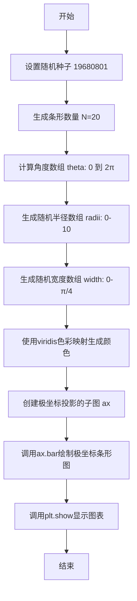
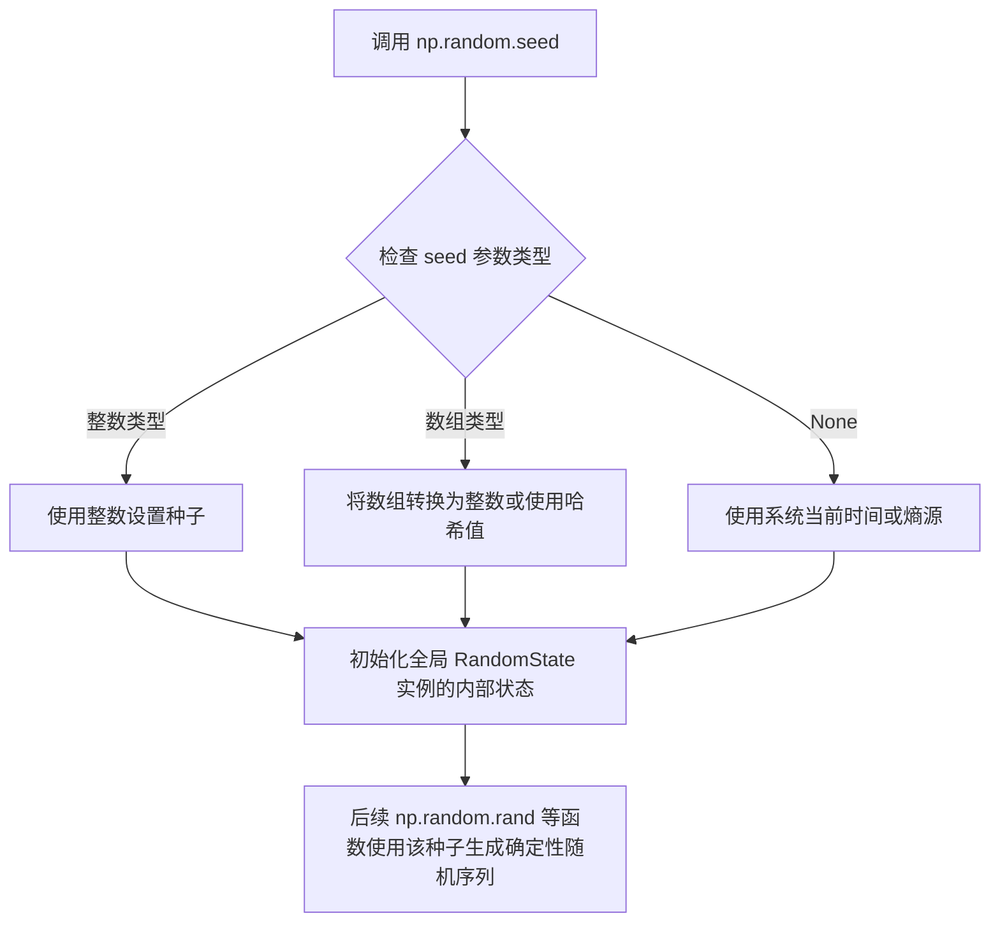
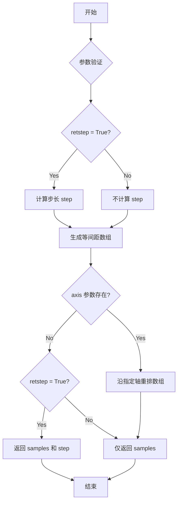
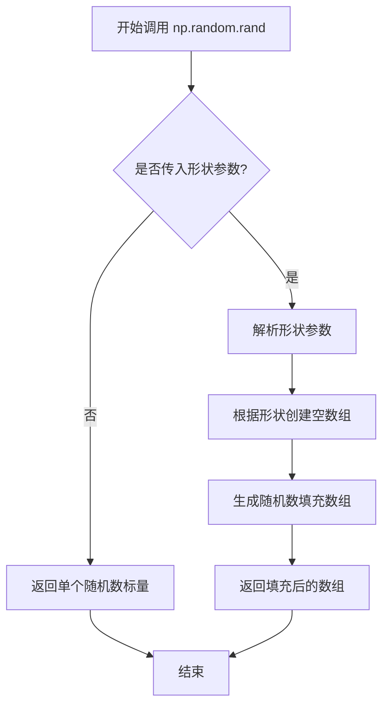
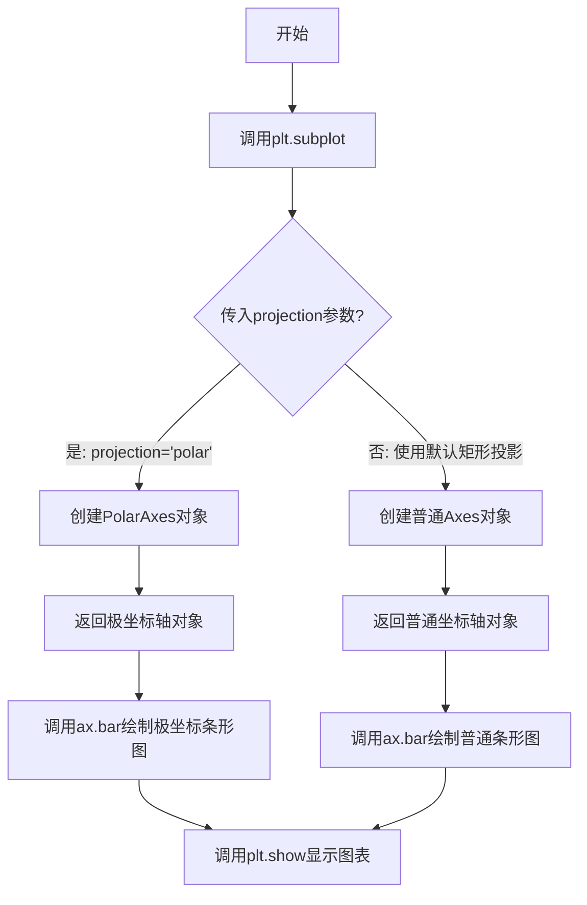
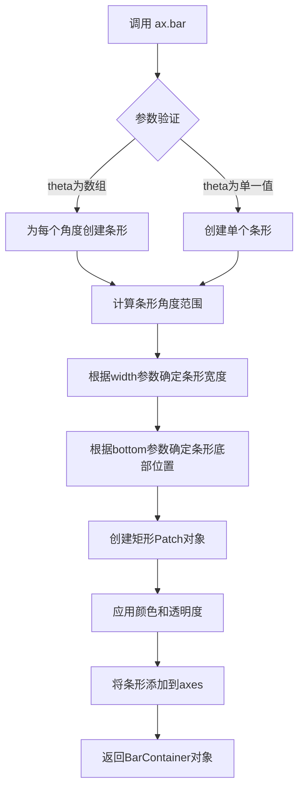

# `matplotlib\galleries\examples\pie_and_polar_charts\polar_bar.py` 详细设计文档

该代码使用matplotlib在极坐标轴上绘制了一个动态生成的条形图，通过numpy生成随机数据（角度、半径、宽度），并使用viridis色彩映射为条形上色，展示了数据可视化中极坐标系统的应用。

## 整体流程



## 类结构

```
该脚本为单文件脚本，无类定义
纯过程式代码，由上而下顺序执行
主要依赖matplotlib.pyplot和numpy两个外部库
```

## 全局变量及字段


### `N`
    
条形图中条形的数量

类型：`int`
    


### `theta`
    
极坐标角度数组，范围0到2π

类型：`numpy.ndarray`
    


### `radii`
    
条形的半径长度数组，由随机数生成

类型：`numpy.ndarray`
    


### `width`
    
条形的宽度角度数组，由随机数生成

类型：`numpy.ndarray`
    


### `colors`
    
条形的颜色数组，通过viridis色彩映射生成

类型：`numpy.ndarray`
    


### `ax`
    
极坐标投影的子图对象

类型：`matplotlib.axes.Axes`
    


    

## 全局函数及方法


### `np.random.seed`

设置NumPy随机数生成器的种子，确保后续生成的随机数序列可复现。通过传入特定种子值，使得每次运行程序时生成相同的随机数序列，便于调试和结果验证。

参数：

- `seed`：`int` 或 `array_like`，可选，用于初始化随机数生成器的种子值。代码中传入`19680801`作为固定种子，以确保随机结果可复现。

返回值：`None`，该函数无返回值，直接修改全局随机数生成器的内部状态。

#### 流程图



#### 带注释源码

```python
# 调用 NumPy 的随机数种子函数，设置全局随机数生成器的种子
# 传入固定值 19680801，确保每次运行程序时生成的随机数序列相同
# 这样可以使代码的随机结果可复现，便于调试和验证
np.random.seed(19680801)

# 之后生成的随机数将基于这个种子值
# 例如：np.random.rand(N) 每次运行都会产生相同的随机数序列
```


### `np.linspace`

创建指定范围内的等间距数值数组，返回一个包含 num 个等间距样本的 ndarray。

参数：

- `start`：`float`，序列的起始值
- `stop`：`float`，序列的结束值（取决于 endpoint 参数）
- `num`：`int`，生成的样本数量，默认为 50
- `endpoint`：`bool`，若为 True，则 stop 为最后一个样本；若为 False，则不包含最后一个样本，默认为 True
- `retstep`：`bool`，若为 True，则返回 (samples, step)，默认为 False
- `dtype`：`dtype`，输出数组的数据类型，若未指定，则从输入参数推断
- `axis`：`int`，当 stop 为数组时使用的轴

返回值：`ndarray`，等间距的样本数组

#### 流程图



#### 带注释源码

```python
def linspace(start, stop, num=50, endpoint=True, retstep=False, dtype=None, axis=0):
    """
    创建指定范围内的等间距数值数组。
    
    Parameters
    ----------
    start : array_like
        序列的起始值。
    stop : array_like
        序列的结束值。如果 stop 是数组，则沿 axis 生成对应的点。
    num : int, optional
        生成的样本数量。默认为 50。
    endpoint : bool, optional
        若为 True，则 stop 为最后一个样本；否则不包含。默认为 True。
    retstep : bool, optional
        若为 True，则返回 (samples, step)，其中 step 是样本之间的间距。
    dtype : dtype, optional
        输出数组的数据类型。
    axis : int, optional
        当 stop 是数组时使用的轴。默认为 0。
    
    Returns
    -------
    samples : ndarray
        有 num 个等间距样本。
    step : float
        仅当 retstep 为 True 时返回，表示样本之间的间距。
    """
    # 验证 num 参数
    if num <= 0:
        return np.empty(0, dtype=dtype)
    
    # 计算步长
    if endpoint:
        step = (stop - start) / (num - 1) if num > 1 else 0.0
    else:
        step = (stop - start) / num if num > 0 else 0.0
    
    # 生成数组
    if np.isnan(stop) or np.isnan(start):
        y = np.empty(num, dtype=dtype)
        y.fill(np.nan)
        if retstep:
            return y, step
        return y
    
    # 使用 Python 的 float 计算以避免精度问题
    delta = stop - start
    y = _np.arange(num, dtype=dtype) * delta + start
    
    # 处理 endpoint
    if endpoint and num > 1:
        y[-1] = stop
    
    if retstep:
        return y, step
    
    return y
```


### `np.random.rand`

生成指定形状的 [0, 1) 区间内随机数数组。该函数是 NumPy 随机数生成模块的核心函数之一，常用于初始化数据、生成测试样本或模拟随机过程。

参数：

- `*shape`：`int` 或 `tuple of ints`，可选参数，用于指定输出数组的形状。如果没有参数，则返回单个随机数。
- 返回值：`numpy.ndarray`，包含指定形状的 [0, 1) 区间内均匀分布的随机浮点数。

#### 流程图



#### 带注释源码

```python
# np.random.rand 函数源码分析
# 位置: numpy/random/mtrand.pyx (Cython 实现)
# 以下为 Python 等效实现逻辑

def rand(*shape):
    """
    生成指定形状的 [0, 1) 区间随机数数组
    
    参数:
        *shape: 可变数量的整数或整数元组，定义输出数组的维度
        
    返回:
        ndarray: 包含随机浮点数的数组，值域为 [0, 1)
    """
    # 如果没有提供形状参数，返回单个随机数
    if not shape:
        # 调用底层随机数生成器
        return random_sample()
    
    # 将形状转换为整数元组
    shape = (int(shape[0]),) if len(shape) == 1 else tuple(map(int, shape))
    
    # 计算总元素数量
    size = 1
    for dim in shape:
        size *= dim
    
    # 调用 random_sample 生成随机数数组
    # random_sample 是核心实现，内部调用 MT19937 算法
    return random_sample(size).reshape(shape)
```

#### 补充说明

**使用场景**：
- 初始化神经网络权重（配合特定种子）
- 生成模拟数据集
- 随机抽样和蒙特卡洛模拟

**与类似函数对比**：
- `np.random.random()`：与 rand 功能相同，参数形式不同
- `np.random.randn()`：生成标准正态分布随机数
- `np.random.randint()`：生成指定范围内的整数随机数

**注意事项**：
- 该函数使用梅森旋转算法（MT19937）生成伪随机数
- 在需要严格密码学安全的场景下，应使用 `numpy.random.Generator`
- 随机数序列可通过 `np.random.seed()` 控制


### `plt.colormaps.__getitem__` (或 `plt.colormaps[]`)

从 matplotlib 的颜色映射（colormap）注册表中根据名称获取对应的颜色映射对象。该函数返回一个可调用对象，传入数据值（通常归一化到 [0, 1] 范围）后可返回对应的颜色值（RGBA 格式）。

参数：

- `name`：`str`，颜色映射的名称，如 "viridis"、"plasma"、"inferno" 等 matplotlib 内置颜色映射的字符串标识符

返回值：`matplotlib.colors.Colormap`，返回一个 Colormap 对象，该对象是可调用的，调用时接收数值数组（通常需要归一化到 [0, 1]），返回对应的 RGBA 颜色数组

#### 流程图

```mermaid
flowchart TD
    A[开始调用 plt.colormaps[name]] --> B{检查名称是否在注册表中}
    B -->|是| C[返回对应的 Colormap 对象]
    B -->|否| D[抛出 KeyError 异常]
    C --> E[调用 Colormap 对象]
    E --> F[传入归一化的数值数组]
    F --> G[返回 RGBA 颜色数组]
```

#### 带注释源码

```python
# 在 matplotlib 中，plt.colormaps 是一个 ColormapRegistry 实例
# 以下是 plt.colormaps["viridis"] 的内部调用逻辑（简化版）

# 1. 获取名为 "viridis" 的颜色映射
cmap = plt.colormaps["viridis"]
# 内部实现类似于：
# cmap = plt.colormaps._cmap_registry["viridis"]

# 2. cmap 现在是一个 Colormap 对象（如 Viridis）
#    当调用它时，传入归一化的数据值（0-1之间的数值）
colors = cmap(radii / 10.)
# 内部实现（简化）：
# normalized_values = radii / 10.  # 假设数据已经归一化
# colors = cmap(normalized_values)  
# -> 返回形状为 (N, 4) 的 RGBA 数组

# 3. 最终 colors 是一个 Nx4 的数组，每行是一个 RGBA 颜色值
#    然后用于设置条形的颜色
ax.bar(theta, radii, width=width, bottom=0.0, color=colors, alpha=0.5)
```

#### 关键组件信息

| 组件名称 | 一句话描述 |
|---------|-----------|
| `plt.colormaps` | matplotlib 的全局颜色映射注册表，管理所有可用的颜色映射 |
| `Colormap` | 颜色映射基类，定义了将数值映射到颜色的核心逻辑 |
| `Viridis` | matplotlib 内置的感知均匀颜色映射，默认推荐使用 |

#### 潜在的技术债务或优化空间

1. **返回值类型不一致风险**：不同颜色映射可能返回不同的颜色格式（如返回 uint8 或 float32），可能导致下游代码处理困难
2. **归一化假设**：调用 Colormap 对象时假设输入已归一化到 [0, 1]，但实际使用中容易忘记归一化，导致颜色映射失效
3. **错误信息不够友好**：当颜色映射名称不存在时，KeyError 的错误信息可能不够直观

#### 其它项目

**设计目标与约束**：
- 颜色映射设计遵循感知均匀性原则，确保数据值的变化对应视觉上均匀的颜色变化
- 支持离散化和归一化处理，以适应不同的数据范围

**错误处理与异常设计**：
- 当请求的颜色映射名称不存在时，抛出 `KeyError` 异常
- 当传入超出 [0, 1] 范围的数值时，颜色映射的行为取决于具体实现（通常会 clamp 或抛出警告）

**数据流与状态机**：
```
输入数据 -> 归一化处理 -> Colormap 调用 -> RGBA 颜色输出 -> 图形渲染
```

**外部依赖与接口契约**：
- 依赖于 `matplotlib.colors` 模块中的 Colormap 实现
- 颜色映射注册表通过 `matplotlib.cm` 模块的 `get_cmap()` 函数访问


### `plt.subplot(projection='polar')`

创建具有极坐标投影的子图，返回一个极坐标轴对象（PolarAxes），用于在极坐标系中绘制条形图、饼图等可视化图表。

参数：

- `projection`：`str`，指定投影类型。当设置为 `'polar'` 时，创建极坐标轴，使后续的绘图操作（如 `bar()`）能够在极坐标系中进行，支持极角（theta）和极径（radius）作为坐标系统。

返回值：`matplotlib.axes._subplots.Axes`，返回一个 Axes 子类对象（PolarAxes），该对象继承自 Axes 类，用于在极坐标系中进行绘图操作。通过该对象可以调用各类绘图方法，如 `bar()`、`plot()`、`scatter()` 等。

#### 流程图



#### 带注释源码

```python
# 导入matplotlib的pyplot模块，用于创建图表和子图
import matplotlib.pyplot as plt
import numpy as np

# 固定随机种子以确保结果可复现
np.random.seed(19680801)

# 计算饼图的切片参数
N = 20
# 生成0到2*pi之间的N个等间距角度（不包含终点）
theta = np.linspace(0.0, 2 * np.pi, N, endpoint=False)
# 生成10个随机半径值
radii = 10 * np.random.rand(N)
# 生成随机条形宽度
width = np.pi / 4 * np.random.rand(N)
# 使用viridis颜色映射根据半径值映射颜色
colors = plt.colormaps["viridis"](radii / 10.)

# 创建具有极坐标投影的子图
# projection='polar' 参数指定使用极坐标系统
# 返回一个PolarAxes对象，赋值给变量ax
ax = plt.subplot(projection='polar')

# 在极坐标轴上绘制条形图
# theta: 极角（条形的角度位置）
# radii: 极径（条形的长度）
# width: 条形的宽度（弧度）
# bottom: 条形的起始位置（默认为0.0，即从圆心开始）
# color: 条形的颜色
# alpha: 透明度
ax.bar(theta, radii, width=width, bottom=0.0, color=colors, alpha=0.5)

# 显示绘制的图表
plt.show()
```

#### 关键组件信息

| 名称 | 一句话描述 |
|------|-----------|
| `plt.subplot()` | matplotlib的子图创建函数，支持多种投影类型 |
| `PolarAxes` | 极坐标轴类，继承自Axes，用于极坐标系绘图 |
| `ax.bar()` | 在极坐标轴上绘制条形图的方法 |
| `theta` | 极坐标角度数组，表示条形的角度位置 |
| `radii` | 极坐标半径数组，表示条形的长度 |

#### 潜在的技术债务或优化空间

1. **缺少错误处理**：代码未对无效的投影类型或参数进行验证
2. **魔法数字**：颜色映射范围 `radii / 10.` 和随机种子 `19680801` 缺乏明确注释
3. **硬编码参数**：颜色映射名称 `"viridis"` 可考虑作为配置项
4. **返回值未使用完整**：创建的 `ax` 对象可直接调用更多方法，但示例仅使用了 `bar()`

#### 其它项目

- **设计目标**：展示如何在极坐标轴上绘制条形图
- **约束条件**：需要matplotlib版本支持polar投影
- **错误处理**：若 `projection` 参数无效，可能抛出 `ValueError` 异常
- **数据流**：NumPy生成随机数据 → 转换为极坐标参数 → plt.subplot创建极坐标轴 → ax.bar渲染可视化
- **外部依赖**：matplotlib.pyplot, numpy


### `Axes.bar()`

在极坐标轴上绘制条形图，用于展示角度-半径关系的数据，常用于绘制极坐标下的条形图或饼图的变体。

参数：

- `theta`：`numpy.ndarray`，角度数组，表示每个条形的角度位置（弧度制）
- `radii`：`numpy.ndarray`，半径数组，表示每个条形的长度/高度
- `width`：`float` 或 `numpy.ndarray`，条形的宽度（角度范围），可以是一个值或与theta长度相同的数组
- `bottom`：`float`，条形底部距离原点的距离，默认为0.0
- `color`：`str` 或 `array`，条形的颜色，可以是单一颜色或颜色数组
- `alpha`：`float`，透明度，范围0-1，默认为1（不透明）

返回值：`matplotlib.container.BarContainer`，包含所有条形 artists 的容器对象，可用于进一步操作（如设置误差线等）

#### 流程图



#### 带注释源码

```python
# 极坐标条形图绘制示例 (源码位于 matplotlib/lib/matplotlib/axes/_axes.py 中的 bar 方法)

# 创建极坐标子图
ax = plt.subplot(projection='polar')

# 调用 bar 方法绘制条形图
# 参数说明：
# theta: 角度数组 [0, 2*pi) 范围内
ax.bar(
    theta,        # 角度位置 (弧度)
    radii,        # 条形长度 (半径值)
    width=width,  # 条形宽度 (角度范围)
    bottom=0.0,   # 条形底部距原点距离
    color=colors, # 条形颜色
    alpha=0.5    # 透明度 (0=完全透明, 1=完全不透明)
)

# bar 方法内部执行流程：
# 1. 验证并规范化输入参数
# 2. 计算每个条形的角度范围 [theta - width/2, theta + width/2]
# 3. 将极坐标 (theta, radii) 转换为笛卡尔坐标 (x, y)
#    x = radii * cos(theta)
#    y = radii * sin(theta)
# 4. 创建 Rectangle Patch 对象
# 5. 设置颜色 (colormap 或指定颜色)
# 6. 设置透明度 alpha
# 7. 将 Patch 添加到 Axes
# 8. 返回 BarContainer 容器对象

plt.show()  # 显示图形
```


### `plt.show`

**描述**：  
`plt.show()` 是 `matplotlib.pyplot` 模块的全局函数，用于 **显示当前所有未关闭的 Figure 对象**。该函数根据可选的 `block` 参数决定是否阻塞程序执行——若 `block` 为 `True` 或在交互式后端下默认阻塞，则会进入后端的主事件循环，等待用户关闭所有图形窗口；若 `block` 为 `False`，则立即返回并通过非阻塞方式刷新图形。

---

#### 参数

- **`block`**：`bool | None`，可选（关键字参数）  
  - **说明**：控制是否阻塞程序直至所有图形窗口关闭。  
    - `True`：强制阻塞。  
    - `False`：非阻塞，函数立即返回并触发图形刷新。  
    - `None`（默认）：依据当前后端是否为交互式后端自动决定是否阻塞（即调用 `isinteractive()` 或 `rcParams['interactive']`）。

---

#### 返回值

- **`None`**：该函数没有返回值，执行完毕后直接返回 `None`。

---

#### 流程图

```mermaid
flowchart TD
    A([开始 plt.show]) --> B{是否显式传入 block?}
    B -- 否 --> C[block = isinteractive()]  # 根据交互式后端决定
    B -- 是 --> D[使用传入的 block 值]
    C --> E{block 为 True?}
    D --> E
    E -- 是 --> F[遍历所有 Figure 管理器并调用 manager.show()]
    F --> G[进入后端主循环 / 阻塞]
    E -- 否 --> H[对所有 Figure 执行 draw_idle]
    H --> I[调度非阻塞定时器 (plt.pause)]
    G --> J([结束])
    I --> J
```

*注*：在实际的交互式后端（如 Tk、Qt）中，`manager.show()` 会触发后端的 `show()`，随后进入对应的 GUI 主循环（阻塞）。在非交互式后端（如 Agg）则只会把渲染任务排入事件队列并通过 `plt.pause` 立即返回。

---

#### 带注释源码

```python
def show(*, block=None):
    """
    显示所有未关闭的 Figure 对象。

    Parameters
    ----------
    block : bool or None, optional
        控制函数是否阻塞。默认值为 None，表示根据当前后端
        是否为交互式后端自动决定。

    Returns
    -------
    None
    """
    # 1. 获取当前所有 Figure 的管理器（FigureManager）
    #    Gcf（全局 Figure 管理器）保存了所有活跃的图形窗口。
    from matplotlib._pylab_helpers import Gcf

    # 2. 对每个管理器调用其 show()，完成渲染并让后端显示窗口
    for manager in Gcf.get_all_fig_managers():
        manager.show()   # 后端的绘制方法（可能启动 GUI 事件循环）

    # 3. 决定是否阻塞
    if block is None:
        # 默认行为：在交互式后端下阻塞，非交互式后端不阻塞
        # isinteractive() 读取 rcParams['interactive']
        block = isinteractive()

    # 4. 若是阻塞模式，则进入后端的主事件循环（阻塞调用）
    if block:
        # 在交互式后端（如 Tk、Qt）中，这里会真正启动主循环。
        # 具体实现依赖于后端的 show() 方法，通常会在 manager.show()
        # 内部已经进入主循环。这里的 return 实际上是让调用者
        # 退出函数后仍保持在后端的阻塞状态，直至所有窗口关闭。
        return
    else:
        # 5. 非阻塞模式：立即返回并通过极短的 pause 触发后端事件循环，
        #    从而把待渲染的图形绘制到屏幕上。
        #    pause(1e-10) 会在极短时间内处理后端事件但不明显停顿。
        plt.pause(1e-10)

    # 6. 返回 None（函数不返回任何值）
    return None
```

*代码说明*：  
- 第 1 步使用 `Gcf.get_all_fig_managers()` 取得当前所有打开的图形管理器。  
- 第 2 步遍历管理器并调用后端的 `show()`，这一步在交互式后端会弹出窗口。  
- 第 3–4 步依据 `block` 参数决定是否进入后端的阻塞主循环（在 `manager.show()` 中实现）。  
- 第 5 步针对非阻塞情况调用 `plt.pause`，确保图形能够在函数返回前被绘制。  
- 第 6 步返回 `None`，符合 `plt.show` 的设计约定。  

---

> **技术债务与优化建议**  
> 1. **行为不一致**：`plt.show` 的实际表现强依赖后端实现（是否真的阻塞、是否真的绘制），建议在文档中进一步明确每种后端的行为差异。  
> 2. **阻塞逻辑分散**：阻塞逻辑分散在 `manager.show()` 与 `isinteractive()` 之间，建议抽取统一的入口，提供更清晰的调用栈。  
> 3. **错误处理缺失**：当前实现没有对“没有打开的 Figure”或“后端未正确初始化”时的异常处理，可能导致用户困惑。可在入口处加入适当的警告或异常提示。  

---

## 关键组件


### 数据生成模块

使用 `numpy` 库生成极坐标条形图所需的随机数据，包括角度值、半径值和条形宽度。`np.random.seed(19680801)` 设置随机种子确保可复现性，`np.linspace` 生成均匀分布的角度数组，`np.random.rand` 生成随机半径和宽度数据。

### 颜色映射模块

使用 `plt.colormaps["viridis"]` 将归一化的半径值映射为颜色，生成与数据关联的视觉编码。颜色数组通过 `radii / 10.` 进行归一化处理。

### 极坐标轴创建模块

通过 `plt.subplot(projection='polar')` 创建极坐标投影的子图 axes 对象，用于在极坐标系中绘制数据。

### 条形图绘制模块

调用 `ax.bar(theta, radii, width=width, bottom=0.0, color=colors, alpha=0.5)` 在极坐标轴上绘制条形图，其中 theta 为角度位置，radii 为半径长度，width 为条形宽度，bottom=0.0 设置起始半径，alpha=0.5 设置透明度。

### 图表渲染模块

使用 `plt.show()` 触发图形窗口显示，完成整个可视化流程的渲染输出。


## 问题及建议


### 已知问题

- **缺乏错误处理**：代码未对可能出现的异常进行处理，如`np.random.rand(N)`生成负数时`colormaps`调用可能失败，或`plt.subplot`创建极坐标轴失败时无降级方案
- **魔法数字过多**：`N=20`、`10 * np.random.rand(N)`、`np.pi/4`、`bottom=0.0`、`alpha=0.5`等数值缺乏明确语义，可维护性差
- **无类型注解**：变量和方法缺乏类型提示，降低了代码可读性和IDE支持
- **资源未释放**：`plt.show()`后未调用`plt.close()`或`fig.clear()`，可能导致内存泄漏（尤其在非交互环境中）
- **数据非确定性风险**：虽然设置了随机种子，但`radii`和`width`仍依赖随机生成，测试用例难以复现
- **硬编码配置**：颜色映射名称"viridis"直接写入代码，更换主题需修改源码
- **缺少模块级文档**：除顶部示例说明外，无代码功能、参数说明或使用限制的文档

### 优化建议

- 添加try-except块包装绘图逻辑，捕获`ValueError`、`KeyError`等异常并给出友好提示
- 将魔法数字提取为具名常量或配置文件，例：`BAR_COUNT = 20`、`DEFAULT_ALPHA = 0.5`
- 为核心变量添加类型注解（`theta: np.ndarray`, `radii: np.ndarray`等）
- 使用上下文管理器或显式关闭：`fig = ax.figure; plt.show(); plt.close(fig)`
- 提供返回值或回调机制，使`ax`对象可被外部调用者获取
- 抽象颜色映射逻辑为函数，支持通过参数动态注入配色方案
- 补充函数级docstring，说明输入输出约束和副作用


## 其它


### 设计目标与约束

该代码是一个演示脚本，旨在展示如何在matplotlib的极坐标轴上绘制条形图。设计目标是创建一个可复现的、可视化演示，帮助用户理解极坐标条形图（也称为玫瑰图或极坐标条形图）的使用方法。约束条件包括：需要matplotlib和numpy作为依赖，需要设置随机种子以确保可复现性，图形需要显示在支持GUI的环境中。

### 错误处理与异常设计

该代码采用最简化设计，未包含显式的错误处理机制。潜在的异常情况包括：1) matplotlib.pyplot.show()在无显示环境中可能抛出异常（如在headless服务器上），可使用matplotlib.use('Agg')或检查DISPLAY环境变量；2) np.random.seed()调用失败（极少见）；3) colormap名称无效时抛出KeyError；4) 参数值不合法（如负数半径）可能导致警告或异常。建议添加try-except块和参数验证以提高健壮性。

### 数据流与状态机

数据流为：随机种子设置→计算角度theta数组→生成随机半径radii数组→生成随机宽度width数组→选择colormap并映射颜色→创建极坐标子图→调用bar()绘制条形图→显示图形。状态机相对简单，主要处于初始化、计算、渲染、显示四个状态，状态转换是线性的。

### 外部依赖与接口契约

主要依赖包括：matplotlib（版本需支持projection='polar'参数）、numpy（用于数值计算和随机数生成）。接口契约方面：plt.subplot(projection='polar')返回Axes对象，ax.bar()接受(theta, radii, width, bottom, color, alpha)参数，返回BarContainer对象。colormap通过plt.colormaps["viridis"]访问（matplotlib 3.7+新API，旧版本使用plt.cm.viridis）。

### 性能考虑

当前代码数据量很小（N=20），性能不是问题。但如需扩展到更大的N值，可考虑：1) 预先分配theta数组；2) 颜色计算可缓存；3) 对大量条形图考虑使用fill_between而非bar；4) 静态图像生成时可使用plt.switch_backend('Agg')避免GUI开销。

### 可维护性分析

代码可维护性较好，变量命名清晰，注释完整。改进空间：1) 将硬编码参数（N=20, 颜色映射名称）提取为常量或配置；2) 封装为可复用的函数而非脚本；3) 添加类型注解提高可读性；4) 将数据生成逻辑与绘图逻辑分离；5) 添加文档字符串说明函数用途。

### 使用示例与扩展

该代码可扩展为：1) 函数形式，接受N、颜色映射等参数；2) 支持传入自定义theta和radii数据；3) 添加交互功能如鼠标悬停显示数值；4) 支持导出为静态图像（PNG、SVG）；5) 可集成到Jupyter notebook中作为教学示例；6) 可添加图例、标题、刻度标签等装饰元素。

    