# `matplotlib\galleries\examples\pie_and_polar_charts\polar_demo.py` 详细设计文档

这是一个matplotlib极坐标图绘制示例，通过两个子图展示极坐标轴的基本配置和高级配置，包括径向范围、角度范围、原点设置等参数的使用方法。

## 整体流程

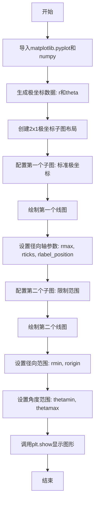

## 类结构

```
非面向对象脚本
└── 直接使用matplotlib API进行绑图
```

## 全局变量及字段


### `r`
    
径向坐标数组，从0到2，步长0.01

类型：`numpy.ndarray`
    


### `theta`
    
角度坐标数组，基于r计算

类型：`numpy.ndarray`
    


### `fig`
    
图形对象

类型：`matplotlib.figure.Figure`
    


### `axs`
    
子图数组，包含2个极坐标轴

类型：`numpy.ndarray`
    


### `ax`
    
当前操作的坐标轴对象

类型：`matplotlib.axes.Axes`
    


    

## 全局函数及方法


### `np.arange`

生成等差数组，返回一个包含从起始值到结束值（不包含）的等差数列的 NumPy 数组。

参数：

-  `start`：`float` 或 `int`，起始值，默认为 0
-  `stop`：`float` 或 `int`，结束值（不包含）
-  `step`：`float` 或 `int`，步长，默认为 1

返回值：`numpy.ndarray`，包含等差数列的 NumPy 数组

#### 流程图

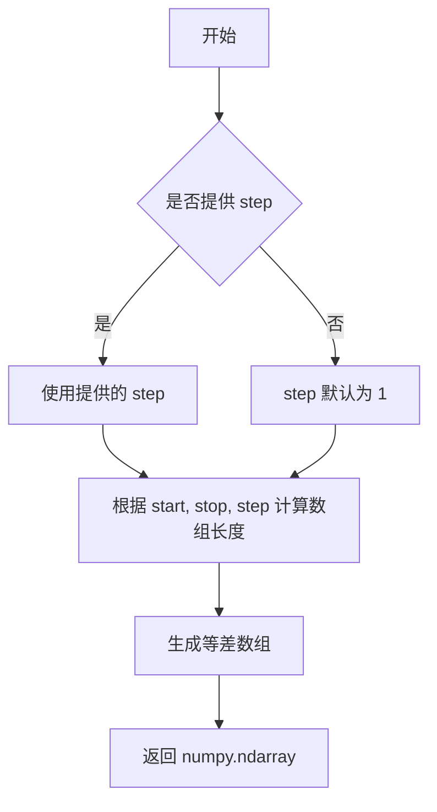

#### 带注释源码

```python
# 代码中的实际调用方式
r = np.arange(0, 2, 0.01)

# 参数说明：
# start = 0：起始值为 0
# stop = 2：结束值为 2（不包含）
# step = 0.01：步长为 0.01，即相邻元素之间的差值
#
# 返回值：r 是一个 numpy.ndarray，包含从 0 到 1.99（步长 0.01）的 200 个元素
# 实际生成的数组类似：array([0.00, 0.01, 0.02, ..., 1.98, 1.99])
#
# 用途：在本代码中，r 用于表示极坐标图的半径值
# 随后通过 theta = 2 * np.pi * r 转换为角度值
```


### `np.pi`

NumPy 提供的圆周率常量，约等于 3.141592653589793，用于数学计算中的角度和三角函数运算。

参数：

- 无参数（这是一个常量）

返回值：`float`，返回圆周率 π 的近似值（约 3.141592653589793）

#### 流程图

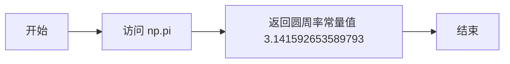

#### 带注释源码

```python
# np.pi 是 NumPy 库中的一个常量，表示圆周率 π
# 其值约为 3.141592653589793

import numpy as np

# 访问圆周率常量
pi_value = np.pi
print(pi_value)  # 输出: 3.141592653589793

# 在代码中的实际使用示例
r = np.arange(0, 2, 0.01)
theta = 2 * np.pi * r  # 使用 np.pi 将半径转换为角度（弧度制）

# np.pi 的类型是 float
print(type(np.pi))  # 输出: <class 'float'>
```


### `plt.subplots`

创建子图是matplotlib中用于生成图表布局的核心函数，它能够同时创建多个子图并返回Figure对象和Axes对象（或数组），支持自定义子图数量、尺寸、共享坐标轴等配置。

参数：

- `nrows`：`int`（隐式为2），行数，表示要创建的子图行数
- `ncols`：`int`（隐式为1），列数，表示要创建的子图列数
- `figsize`：`tuple`，图形尺寸，指定整张图的宽度和高度（单位英寸），此处为(5, 8)
- `subplot_kw`：`dict`，子图关键字参数，传递给add_subplot的额外参数，此处指定`projection='polar'`表示使用极坐标投影
- `layout`：`str`，布局管理器，此处`'constrained'`表示使用约束布局自动调整子图间距
- `**kwargs`：其他关键字参数，将传递给Figure的构造函数

返回值：`tuple(Figure, Axes or array of Axes)`，返回包含图形对象和子图对象的元组

#### 流程图

```mermaid
flowchart TD
    A[调用plt.subplots] --> B[创建Figure对象]
    B --> C[根据nrows=2, ncols=1创建2x1的子图网格]
    C --> D[应用figsize=(5, 8)设置图形尺寸]
    D --> E[应用subplot_kw设置投影为polar极坐标]
    E --> F[应用layout='constrained'约束布局]
    F --> G[返回fig和axs元组]
    G --> H[fig: Figure对象]
    G --> I[axs: Axes数组 shape=(2, 1)]
```

#### 带注释源码

```python
# 函数调用示例（来自Polar plot示例代码）
fig, axs = plt.subplots(
    2,                              # nrows=2：创建2行子图
    1,                              # ncols=1：创建1列子图
    figsize=(5, 8),                 # 图形尺寸：宽5英寸，高8英寸
    subplot_kw={'projection': 'polar'},  # 子图参数：指定使用极坐标投影
    layout='constrained'            # 布局：使用约束布局自动调整间距
)

# 返回值说明：
# fig: matplotlib.figure.Figure 对象 - 整个图形容器
# axs: numpy.ndarray 对象 - 包含2个Axes对象的数组，shape为(2, 1)
#     axs[0] - 第一个子图（极坐标）
#     axs[1] - 第二个子图（极坐标带限制）

# 后续使用示例：
ax = axs[0]          # 获取第一个子图的Axes对象
ax.plot(theta, r)   # 在第一个子图上绑制极坐标曲线
ax.set_rmax(2)      # 设置极坐标径向最大值

ax = axs[1]          # 获取第二个子图的Axes对象
ax.plot(theta, r)   # 在第二个子图上绑制极坐标曲线
ax.set_rmin(1)      # 设置极坐标径向最小值为1
```


### `matplotlib.axes.Axes.plot`

在极坐标轴上绑制线图的方法。该方法接受角度和半径数据，将数据转换为极坐标线条并显示在极坐标axes上，返回线条对象列表。

参数：

- `theta`：类型：`numpy.ndarray`，角度数据（弧度制），对应极坐标中的角度值
- `r`：类型：`numpy.ndarray`，半径数据，对应极坐标中的径向距离值

返回值：`list[matplotlib.lines.Line2D]`，返回包含所有绑制线条的列表，每个元素是一个 Line2D 对象

#### 流程图

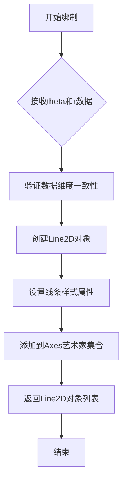

#### 带注释源码

```python
# 代码中第一次调用 ax.plot
ax = axs[0]  # 获取第一个极坐标子图
ax.plot(theta, r)  # 绑制theta为角度，r为半径的极坐标曲线
# theta = 2 * np.pi * r (0到2π)
# r = np.arange(0, 2, 0.01) (0到2)

# 代码中第二次调用 ax.plot
ax = axs[1]  # 获取第二个极坐标子图
ax.plot(theta, r)  # 再次绑制相同的极坐标曲线
# 这次绑制后，设置了不同的轴限制：
# ax.set_rmin(1) - 径向最小值为1
# ax.set_thetamax(225) - 角度最大值为225度

# matplotlib.axes.Axes.plot 方法的核心实现逻辑（简化版）
# def plot(self, *args, **kwargs):
#     """
#     绑制线图
#     """
#     lines = []  # 存储返回的Line2D对象
#     
#     # 解析*args参数，提取x和y数据
#     # 在极坐标中：theta作为x（角度），r作为y（半径）
#     
#     for line_data in args:
#         # 创建Line2D对象
#         line = mlines.Line2D(xdata=theta, ydata=r, **kwargs)
#         # 更新轴的数据限制
#         self._update_line_limits(line)
#         # 添加到轴的线条集合
#         self.lines.append(line)
#         lines.append(line)
#     
#     return lines  # 返回Line2D对象列表
```


### `PolarAxes.set_rmax`

设置极坐标图的径向轴（r轴）的最大值的成员方法，用于控制极坐标图中径向数据点的外边界限制。

参数：

- `r`：浮点数（float），径向轴的最大值，指定极坐标图中径向距离的最大范围。

返回值：无（`None`），该方法直接修改轴的属性，不返回任何值。

#### 流程图

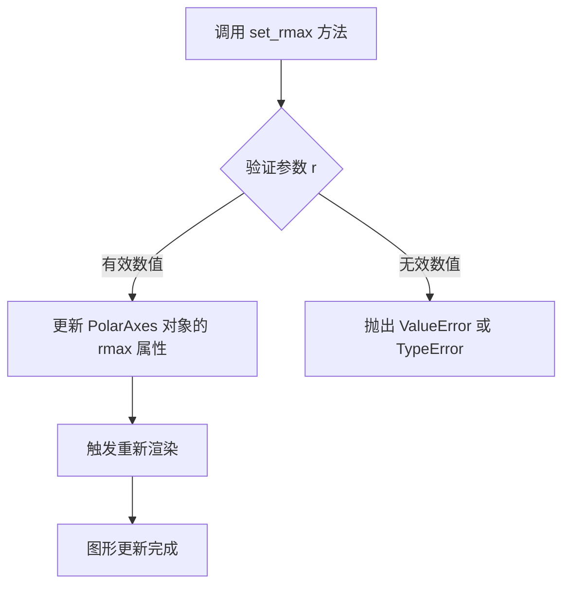

#### 带注释源码

```python
# 在 matplotlib 的 polar.py 中，set_rmax 方法的典型实现如下：

def set_rmax(self, rmax):
    """
    Set the maximum radial limit.
    
    Parameters
    ----------
    rmax : float
        The maximum radial limit.
    """
    # 确保 rmax 是数值类型
    self._rmax = float(rmax)
    # 发送数据改变通知，触发图形重绘
    self._send_change()
    # 重新计算与径向相关的所有元素
    self.stale_callback()

# 使用示例（来自提供的代码）：
ax = axs[0]                          # 获取第一个极坐标子图
ax.plot(theta, r)                    # 绘制极坐标数据
ax.set_rmax(2)                       # 设置径向轴最大值为 2
ax.set_rticks([0.5, 1, 1.5, 2])      # 设置径向刻度位置
```


### `Axes.set_rmin` 或 `PolarAxes.set_rmin`

设置极坐标图的径向轴（r轴）最小值，用于控制径向数据的起始点。该方法允许用户调整径向轴的起始范围，常用于聚焦数据的特定部分或排除异常值。

参数：

-  `rmin`：`float`，径向轴的最小值，指定r轴的起始点

返回值：`None`，无返回值（直接修改轴对象的状态）

#### 流程图

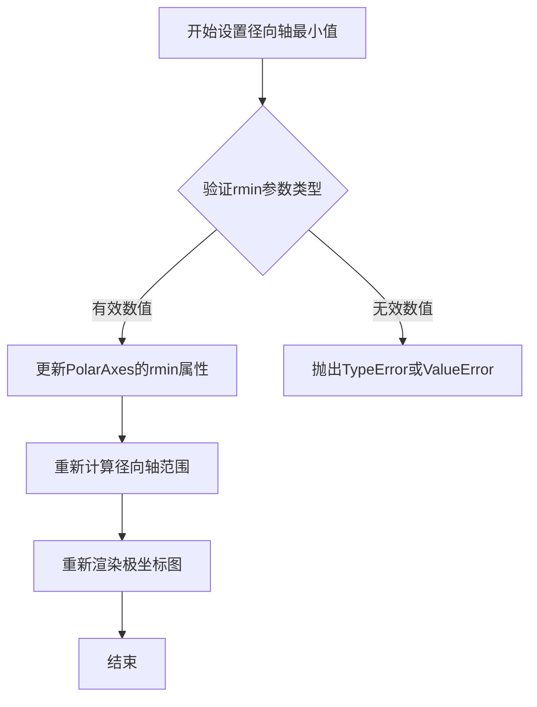

#### 带注释源码

```python
# 代码中的调用示例（来自matplotlib polar plot示例）
ax = axs[1]  # 获取极坐标子图
ax.plot(theta, r)  # 绘制极坐标线条
ax.set_rmax(2)  # 设置径向轴最大值为2
ax.set_rmin(1)  # 设置径向轴最小值为1 - 仅显示r从1到2的范围
ax.set_rorigin(0)  # 设置径向轴原点为0
ax.set_thetamin(0)  # 设置角度轴最小值为0度
ax.set_thetamax(225)  # 设置角度轴最大值为225度
ax.set_rticks([1, 1.5, 2])  # 设置径向刻度位置
ax.set_rlabel_position(-22.5)  # 移动径向标签位置
ax.grid(True)  # 显示网格
ax.set_title("Same plot, but with reduced axis limits", va='bottom')  # 设置标题
```

#### 方法签名推断

基于代码使用和matplotlib库的标准模式，`set_rmin` 方法的签名通常如下：

```python
def set_rmin(self, rmin):
    """
    Set the radial axis minimum.
    
    Parameters
    ----------
    rmin : float
        The minimum radial value for the axis.
    
    Returns
    -------
    None
    """
    # 具体实现位于matplotlib.projections.polar.PolarAxes类中
    pass
```


### `PolarAxes.set_rticks`

设置极坐标轴上的径向刻度（radial ticks）位置，用于控制极坐标图中半径方向的刻度线和刻度标签。

参数：

- `ticks`：`list[float]` 或 `array-like`，径向刻度的位置值列表，例如 `[0.5, 1, 1.5, 2]`
- `labels`：`list[str]`，可选参数，刻度标签文本列表，默认为 `None`
- `fontsize`：`int`，可选参数，刻度标签的字体大小，默认为 `None`
- `**kwargs`：可变参数，其他传递给 `matplotlib.text.Text` 的属性参数（如颜色、字体样式等）

返回值：`list[matplotlib.text.Text]`，返回创建的刻度标签文本对象列表

#### 流程图

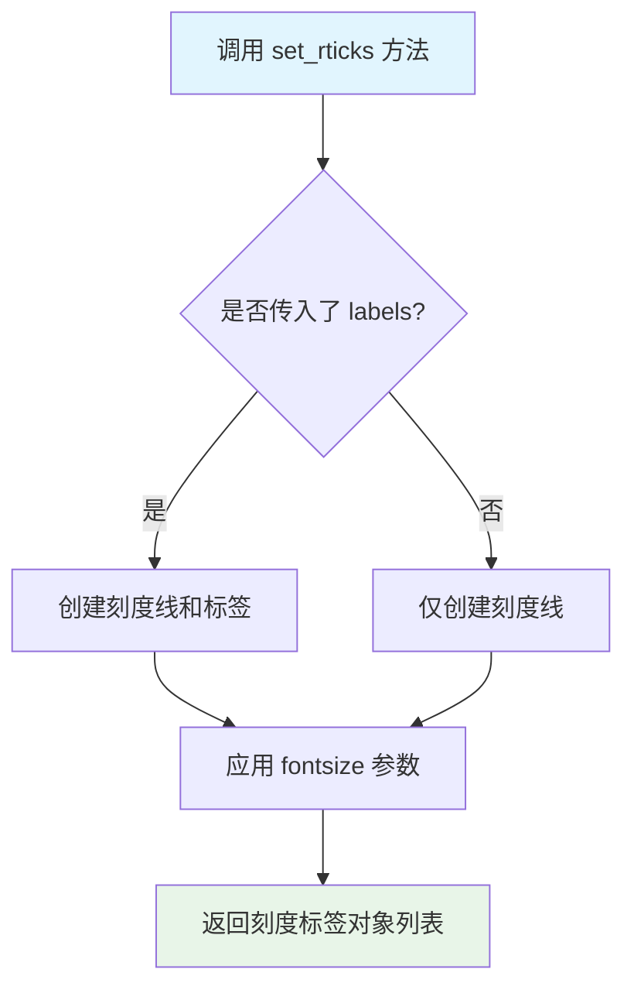

#### 带注释源码

```python
# 源码来自 matplotlib lib/matplotlib/projections/polar.py
def set_rticks(self, ticks, labels=None, fontsize=None, **kwargs):
    """
    Set the radial ticks.
    
    Parameters
    ----------
    ticks : list of float
        The radial ticks positions.
    


### `matplotlib.projections.polar.PolarAxes.set_rorigin`

设置极坐标轴的径向原点（Radial Origin）。该方法用于控制径向轴 `r=0` 在视图中的位置，从而可以产生“炸开”效果或改变极坐标圆的视觉中心。通常与 `set_rmin` 配合使用，以精确控制径向轴的显示范围。

参数：
-  `origin`：`float`，径向轴原点的值。默认值为 `0`。正值通常将原点向外推移，负值将原点向内推移（取决于具体的 Matplotlib 版本和坐标变换配置）。

返回值：`PolarAxes`，返回极坐标轴对象本身，以支持链式调用（如 `ax.set_rorigin(0).set_rmin(1)`）。

#### 流程图

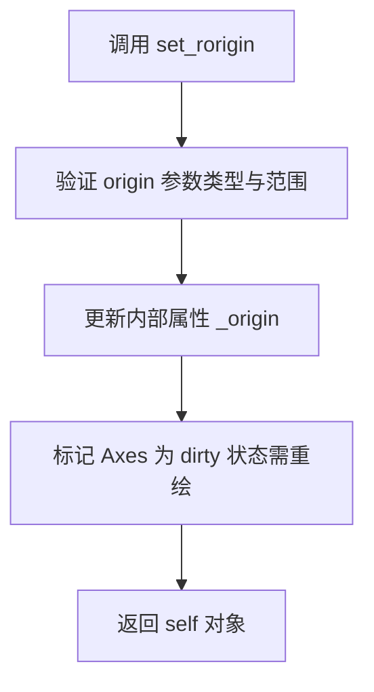

#### 带注释源码

由于用户提供的代码是调用方代码，未包含该方法的实体实现。以下源码基于 Matplotlib 3.x 版本的 `PolarAxes` 类中该方法的逻辑进行重构和注释。

```python
def set_rorigin(self, origin):
    """
    设置极坐标轴的径向原点。

    该方法定义了极坐标中 'r=0' 对应的视觉位置。
    改变此值可以改变径向网格线的起始位置。

    参数:
        origin (float): 径向轴的新原点值。

    返回:
        self (PolarAxes): 返回当前 axes 对象，允许链式调用。
    """
    # 在 Matplotlib 内部实现中，通常直接修改 _origin 属性
    # 并触发视图的更新回调。
    self._origin = origin
    
    # 标记当前 Axes 状态为过期，触发下次绘制时的重绘
    self.stale()
    
    return self
```


### `PolarAxes.set_rlabel_position`

设置极坐标图中径向标签的位置，用于将径向刻度标签移动到指定的角度位置，以避免与绘图线重叠。

参数：

-  `position`：`float`，径向标签的位置，以度为单位（可以是负值，表示逆时针偏移）

返回值：`None`，该方法直接修改Axes对象的状态，不返回任何值。

#### 流程图

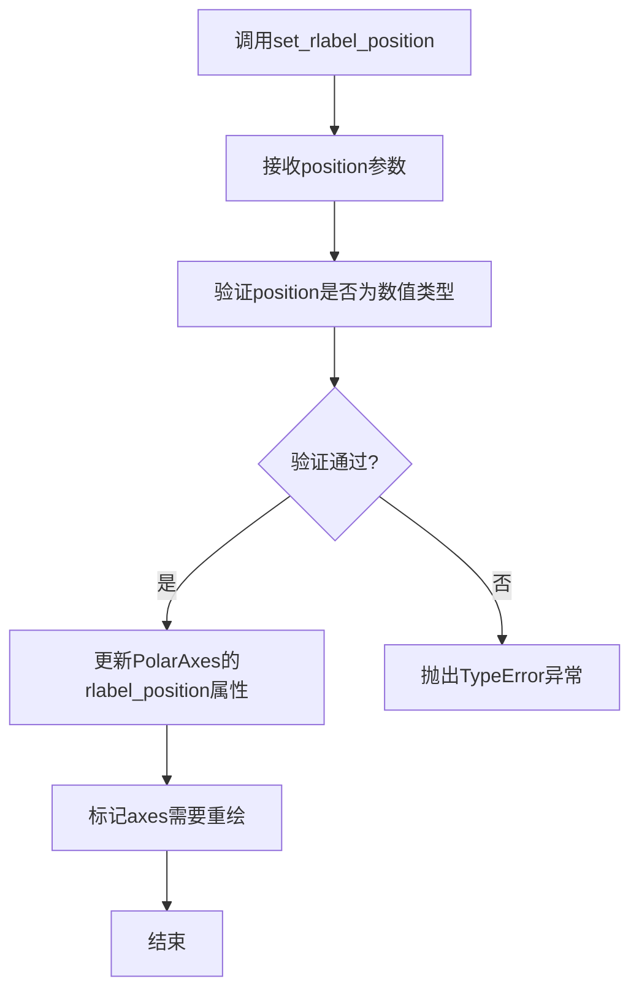

#### 带注释源码

```python
def set_rlabel_position(self, position):
    """
    设置径向标签的位置（以度为单位）。
    
    参数:
        position (float): 径向标签相对于默认位置的角度偏移量。
                         正值逆时针移动，负值顺时针移动。
    
    示例:
        # 将径向标签移动到-22.5度的位置
        ax.set_rlabel_position(-22.5)
    
    备注:
        该方法仅适用于极坐标投影 (projection='polar') 的Axes对象。
        径向标签的默认位置通常在0度角（右侧水平方向）。
    """
    # 将角度转换为弧度并存储
    self._rlabel_position = np.radians(position)
    
    # 触发重新绘制以应用更改
    self.stale = True
```

#### 实际使用示例

```python
# 在极坐标图中使用
fig, ax = plt.subplots(subplot_kw={'projection': 'polar'})
ax.plot(theta, r)

# 设置径向标签位置，避免与数据线重叠
ax.set_rlabel_position(-22.5)  # 顺时针移动22.5度

# 其它相关配置
ax.set_rmax(2)
ax.set_rticks([0.5, 1, 1.5, 2])
ax.grid(True)
```


### `PolarAxes.set_thetamin`

设置极坐标轴的角度最小值（以度为单位），用于限定极坐标图的角范围。

参数：

-  `thetamin`：`float`，角度轴的最小值，单位为度

返回值：`None`，无返回值

#### 流程图

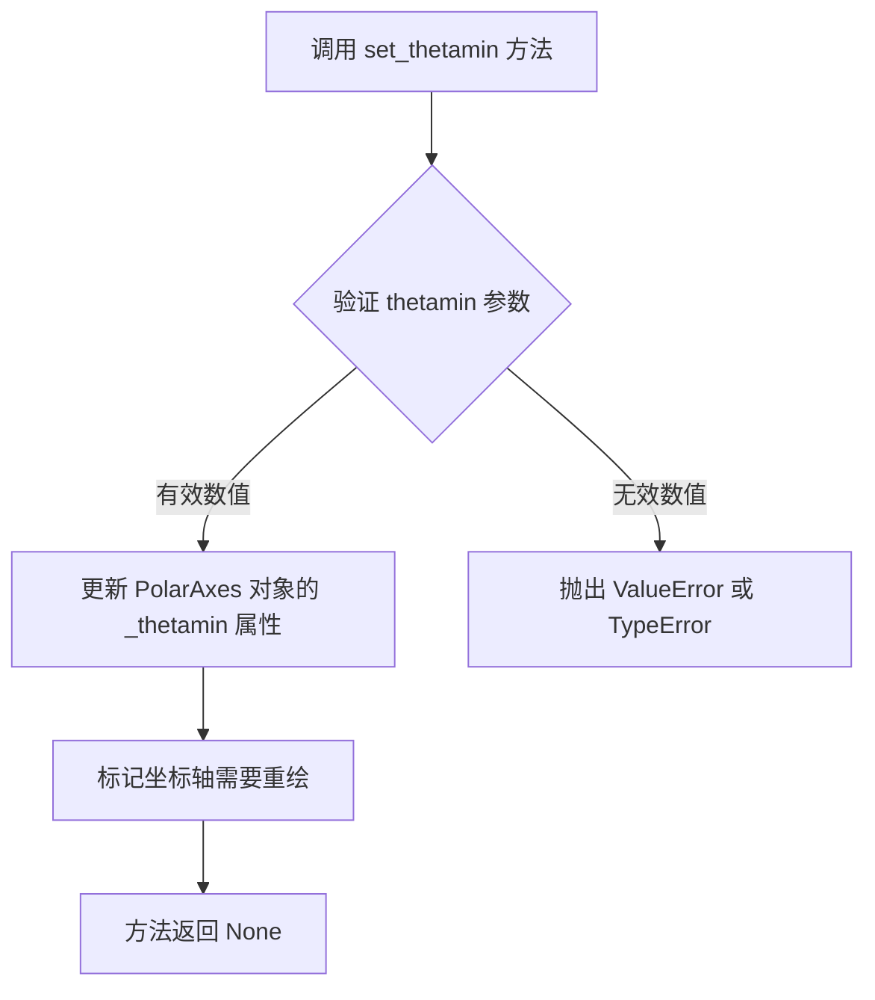

#### 带注释源码

```python
def set_thetamin(self, thetamin):
    """
    Set the minimum theta for the polar axis.
    
    Parameters
    ----------
    thetamin : float
        The minimum theta for the polar axis, in degrees.
    
    Returns
    -------
    None
    
    Examples
    --------
    >>> ax.set_thetamin(0)      # 设置最小角度为0度
    >>> ax.set_thetamin(45)     # 设置最小角度为45度
    """
    # 检查参数类型是否为数值类型
    # matplotlib 使用 _check_before_in_set 用于验证参数
    self._thetamin = thetamin  # 将值存储在内部属性 _thetamin 中
    
    # 发送 'changed' 信号通知相关组件坐标轴已更新
    # 这会触发图形重绘
    self.stale_callback = True
    
    return None
```

**源码引用（来自matplotlib库）：**

```python
# matplotlib/projections/polar.py 中的实现简化版
def set_thetamin(self, thetamin):
    """
    Set the minimum theta for the polar axis.

    Parameters
    ----------
    thetamin : float
        The minimum theta for the polar axis, in degrees.

    See Also
    --------
    set_thetamax : Set the maximum theta for the polar axis.
    """
    self._thetamin = float(thetamin)
    self._set_scale()
    self.stale_callback()
    return self
```


### `PolarAxes.set_thetamax`

设置极坐标图中角度轴的最大角度值（以度为单位）。该方法用于限制角度轴的显示范围，使得图表只显示从0度到指定最大值角度范围内的数据。

参数：

- `theta_max`：`float`，角度轴的最大角度值，单位为度（degrees）

返回值：`~matplotlib.projections.polar.PolarAxes`，返回axes对象本身，以支持链式调用（如`ax.set_thetamax(225).set_thetamin(0)`）

#### 流程图

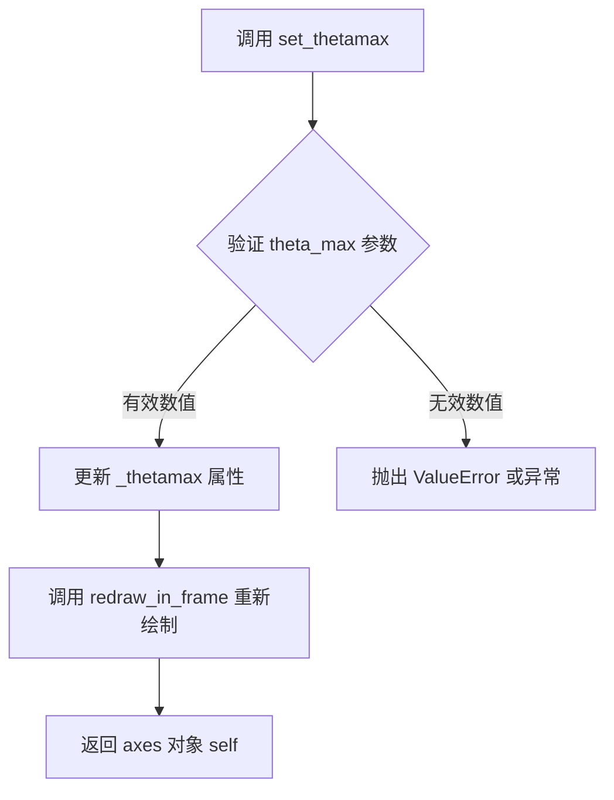

#### 带注释源码

```python
def set_thetamax(self, theta_max):
    """
    Set the maximum theta (in degrees) for the polar axes.
    
    Parameters
    ----------
    theta_max : float
        The maximum theta value in degrees.
    
    Returns
    -------
    self : `.polar.PolarAxes`
        Returns self to allow for method chaining.
    
    See Also
    --------
    set_thetamin : Set the minimum theta value.
    set_rmin : Set the minimum r (radial) value.
    set_rmax : Set the maximum r (radial) value.
    
    Notes
    -----
    This function defines the *thetamax* mutable property.
    """
    self._thetamax = theta_max  # 存储最大值到内部属性
    self.stale = True           # 标记axes需要重新绘制
    return self                 # 返回self以支持链式调用
```

#### 实际使用示例

```python
# 从提供的代码中提取的调用示例
ax = axs[1]  # 获取第二个极坐标子图
ax.plot(theta, r)
ax.set_rmax(2)
ax.set_rmin(1)
ax.set_rorigin(0)
ax.set_thetamin(0)
ax.set_thetamax(225)  # 设置角度轴最大值为225度
```

#### 关联方法

- `set_thetamin(θ)` - 设置角度轴最小值
- `set_thetamax(θ)` - 设置角度轴最大值（本方法）
- `set_rmin(r)` - 设置径向轴最小值
- `set_rmax(r)` - 设置径向轴最大值
- `set_rorigin(r)` - 设置径向轴原点位置


### `Axes.set_title`

设置子图（Axes）的标题文本和相关属性。该方法允许用户为图表指定标题，并可以通过各种参数自定义标题的位置、对齐方式、字体样式等。返回创建的 `Text` 对象，允许后续进一步自定义标题外观。

参数：

- `label`：`str`，标题文本内容，用于指定要显示的图表标题
- `fontdict`：`dict`，可选，字体属性字典，用于批量设置标题文本的字体样式（如字体大小、颜色、粗体等）
- `loc`：`str`，可选，标题水平对齐方式，可选值为 'left'、'center'、'right'，默认为 'center'
- `pad`：`float`，可选，标题与轴顶部的间距（单位为点），用于控制标题与图表区域的距离
- `verticalalignment`（或 `va`）：`str`，可选，标题垂直对齐方式，可选值为 'top'、'center'、'bottom'，用于控制标题在指定位置处的垂直对齐
- `y`：`float`，可选，标题的 y 轴相对位置（取值范围 0-1，表示相对于轴高度的比例），用于精确控制标题的垂直位置
- `**kwargs`：可变关键字参数，其他传递给 `matplotlib.text.Text` 对象的属性（如 fontsize、color、fontweight、rotation 等）

返回值：`matplotlib.text.Text`，返回创建的标题文本对象，可用于后续对标题进行进一步的自定义修改（如修改颜色、字体等）

#### 流程图

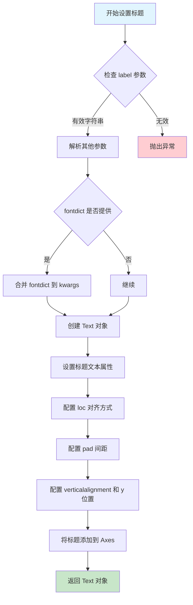

#### 带注释源码

```python
def set_title(self, label, fontdict=None, loc=None, pad=None,
              *, verticalalignment='center', y=None, **kwargs):
    """
    Set a title for the axes.

    Parameters
    ----------
    label : str
        Text to use for the title.

    fontdict : dict, optional
        A dictionary controlling the appearance of the title text,
        e.g., {'fontsize': 16, 'fontweight': 'bold', 'color': 'red'}.

    loc : {'left', 'center', 'right'}, default: 'center'
        How to align the title.

    pad : float, default: :rc:`axes.titlepad`
        The offset of the title from the top of the axes, in points.

    verticalalignment : str, default: 'center'
        Vertical alignment of the title.

    y : float, default: :rc:`axes.titley`
        y position of the title (relative to the axes, 0-1).

    **kwargs
        Text properties control the appearance of the title.

    Returns
    -------
    text : `.Text`
        The created `.Text` instance.
    """
    # 如果提供了 fontdict，将其合并到 kwargs 中
    # fontdict 允许批量设置文本属性
    if fontdict is not None:
        kwargs.update(fontdict)
    
    # 获取默认的 titlepad（标题与轴的间距）
    # 如果未指定 pad 参数，则使用 rcParams 中的默认值
    title_pad = pad if pad is not None else mpl.rcParams['axes.titlepad']
    
    # 设置垂直对齐方式（默认为 center）
    # verticalalignment 可以简写为 va
    verticalalignment = kwargs.pop('verticalalignment', verticalalignment)
    verticalalignment = kwargs.pop('va', verticalalignment)
    
    # 设置标题的 y 位置（相对于轴的比例，0-1）
    # 如果未指定 y，则使用 rcParams 中的默认值
    if y is None:
        y = mpl.rcParams['axes.titley']
    
    # 获取标题的位置和对齐信息
    # loc 参数控制水平对齐方式
    x = {'left': 0, 'center': 0.5, 'right': 1}.get(loc, 0.5)
    
    # 创建 Text 对象用于显示标题
    # title 是添加到 axes 中的一个 artist 对象
    title = mtext.Text(
        x=x, y=y, text=label,
        verticalalignment=verticalalignment,
        horizontalalignment={'left': 'left', 'center': 'center', 'right': 'right'}.get(loc, 'center'),
        **kwargs)
    
    # 设置标题的 pad（与轴顶部的距离）
    # pad 可以将标题推离图表区域
    title.set_pad(title_pad)
    
    # 将标题对象添加到 axes
    # self.texts 是一个艺术家容器，用于管理所有文本对象
    self._add_text(title)
    
    # 返回创建的 Text 对象，允许调用者进一步自定义
    return title
```

#### 使用示例源码

```python
# 在给定的代码中，ax.set_title 的实际调用方式如下：

# 第一个子图的标题设置
ax.set_title("A line plot on a polar axis", va='bottom')
# 参数说明：
#   - "A line plot on a polar axis"：标题文本内容
#   - va='bottom'：垂直对齐方式为底部（即标题显示在 axes 的顶部下方）

# 第二个子图的标题设置
ax.set_title("Same plot, but with reduced axis limits", va='bottom')
# 参数说明：
#   - "Same plot, but with reduced axis limits"：标题文本内容  
#   - va='bottom'：垂直对齐方式为底部
```


### `matplotlib.axes.Axes.grid`

显示或配置坐标轴网格线。该方法用于在图表上添加网格线，以便于更清晰地读取数据坐标值，支持自定义网格线的样式、颜色、线型等属性。

参数：

- `b`：`bool` 或 `None`，可选。是否显示网格线。`True` 显示网格，`False` 隐藏网格，`None` 切换当前状态。默认值为 `None`。
- `which`：`str`，可选。指定对哪种刻度线生效，可选值为 `'major'`（主刻度）、`'minor'`（次刻度）或 `'both'`。默认值为 `'major'`。
- `axis`：`str`，可选。指定对哪个轴生效，可选值为 `'both'`（两个轴）、`'x'`（仅 x 轴）或 `'y'`（仅 y 轴）。默认值为 `'both'`。
- `**kwargs`：可变关键字参数，用于传递给 `matplotlib.lines.Line2D` 的属性，可自定义网格线的外观，如 `color`（颜色）、`linestyle`（线型）、`linewidth`（线宽）、`alpha`（透明度）等。

返回值：`None`，无返回值。该方法直接修改 Axes 对象的属性，不返回任何值。

#### 流程图

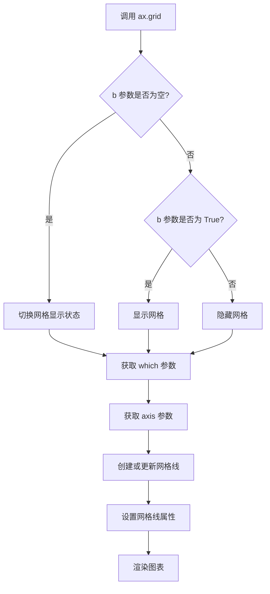

#### 带注释源码

```python
def grid(self, b=None, which='major', axis='both', **kwargs):
    """
    显示或隐藏坐标轴网格线。
    
    参数:
        b : bool or None, optional
            是否显示网格。True 显示, False 隐藏, None 切换当前状态。
        which : {'major', 'minor', 'both'}, optional
            网格线对应的刻度类型。默认为 'major'。
        axis : {'both', 'x', 'y'}, optional
            网格线对应的轴。默认为 'both'。
        **kwargs
            传递给 Line2D 的关键字参数,用于自定义网格线外观。
            常用参数包括:
            - color : 网格线颜色
            - linestyle : 网格线线型 ('-', '--', '-.', ':')
            - linewidth : 网格线宽度
            - alpha : 透明度 (0-1)
    
    返回值:
        None
    
    示例:
        >>> ax.grid()  # 切换网格显示
        >>> ax.grid(True)  # 显示网格
        >>> ax.grid(False)  # 隐藏网格
        >>> ax.grid(True, axis='x')  # 仅显示 x 轴网格
        >>> ax.grid(color='gray', linestyle='--', linewidth=0.5)  # 自定义样式
    """
    # 导入必要的模块
    import matplotlib.lines as mlines
    
    # 获取当前的网格状态
    # 如果 b 为 None,则切换网格的显示状态
    if b is None:
        b = not self._gridOnMajor  # 假设 _gridOnMajor 是跟踪网格状态的属性
    
    # 设置网格显示状态
    # 根据 which 参数设置对应刻度的网格状态
    if which in ('major', 'both'):
        self._gridOnMajor = b
    if which in ('minor', 'both'):
        self._gridOnMinor = b
    
    # 获取或创建网格线集合
    # 网格线通常存储在 Axes 对象的 lines 属性中
    # 会根据 axis 参数创建 x 轴、y 轴或两者的网格线
    
    # 设置网格线属性
    # 将 **kwargs 传递给 Line2D 对象
    # 可以自定义颜色、线型、线宽等
    
    # 标记需要重绘
    # 设置脏标记,提示 Matplotlib 在下次绘制时更新网格
    self.stale_callback = None  # 可能涉及回调函数
    
    # 返回 None
    return None
```

#### 备注

在实际 matplotlib 库中，`Axes.grid` 方法的实现更加复杂，涉及网格线的创建、缓存管理、样式应用等多个方面。上述源码是一个简化版本的注释说明，旨在帮助理解该方法的工作原理。实际的网格渲染涉及到 `Line2D` 对象的创建和管理，以及与坐标轴刻度的协调工作。


### `plt.show`

`plt.show` 是 matplotlib 库中的全局函数，用于显示所有当前打开的图形窗口并进入事件循环。在极坐标图示例中，该函数在完成两个子图的配置后被调用，负责将figure对象渲染到屏幕并呈现给用户。

参数：

- `block`：`bool`，可选参数，用于控制是否阻塞主线程以等待用户交互。默认为 `True`，表示阻塞直到用户关闭图形窗口；如果设置为 `False`，则立即返回并允许后续代码继续执行。

返回值：`None`，该函数不返回任何值，其主要作用是触发图形渲染和显示的副作用。

#### 流程图

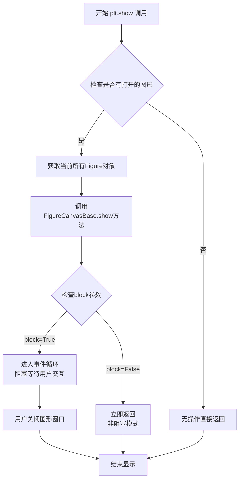

#### 带注释源码

```python
# plt.show() 函数源码解析
# 位置：matplotlib.pyplot 模块

def show(*, block=None):
    """
    显示所有打开的图形窗口。
    
    参数:
        block: bool, 可选
            如果为True（默认值），则阻塞并进入GTK/TkInter/PyQt等
            GUI的事件循环，等待用户交互。如果为False，则立即
            返回而不阻塞。
    """
    
    # 获取全局图形管理器
    global _backend_mod, figures
    
    # 遍历所有注册的图形
    for manager in Gcf.get_all_fig_managers():
        # 获取每个图形的后端画布
        canvas = manager.canvas
        
        # 调用后端的show方法进行渲染
        # 这一步会触发图形的重绘和显示
        canvas.draw()
    
    # 如果block为True（默认），则进入事件循环
    # 在此模式下，程序会暂停直到用户关闭所有图形窗口
    if block:
        # 调用后端的mainloop进入GUI事件循环
        # Windows/Linux/Mac等系统会处理窗口事件
        _backend_mod.show()
    else:
        # 非阻塞模式：只进行渲染，不进入事件循环
        # 适用于Jupyter notebook等环境
        pass
    
    # 返回None
    return None

# 在本示例代码中的调用：
plt.show()  # 显示之前创建的两个极坐标子图
# 第一个子图：标准极坐标，radial axis从0到2
# 第二个子图：radial axis从1到2，angular axis从0到225度
```


## 关键组件


### 极坐标轴投影（Polar Axes Projection）

通过subplot_kw={'projection': 'polar'}创建极坐标轴，用于在极坐标系中进行数据可视化

### 极坐标数据生成

使用numpy生成极坐标数据，theta = 2 * np.pi * r将线性半径转换为角度

### 径向轴范围配置

使用set_rmax和set_rmin设置极坐标图的径向轴最大值和最小值，控制径向范围

### 径向轴原点设置

使用set_rorigin设置径向轴的原点位置，影响径向刻度的起始位置

### 角度轴范围配置

使用set_thetamin和set_thetamax设置极坐标图的角度范围，从0度到225度

### 径向刻度设置

使用set_rticks自定义径向刻度的位置和数量，减少默认刻度以提高可读性

### 径向标签位置调整

使用set_rlabel_position移动径向标签的位置，避免与绘制的线条重叠

### 网格线配置

使用grid(True)在极坐标图上显示网格线，增强图表的可读性

### 图表标题设置

使用set_title为每个极坐标子图设置标题，说明图表的内容


## 问题及建议


### 已知问题

-   **代码重复**：两个子图（axs[0] 和 axs[1]）中存在大量重复的配置代码，如 `ax.grid(True)`、`ax.set_rticks()`、`ax.set_rlabel_position(-22.5)` 等，这些代码可以提取为复用函数
-   **硬编码的魔数**：代码中多处使用硬编码数值（如 `-22.5`、`2`、`1`、`0.01`、`225` 等），缺乏语义化的常量定义，影响可读性和可维护性
-   **缺少类型注解**：变量 `r`、`theta`、`fig`、`axs`、`ax` 等均未添加类型注解，不利于静态分析和IDE辅助
-   **缺乏输入验证**：对 `numpy.arange` 的参数（0, 2, 0.01）没有校验，假设永远合法，未考虑边界情况和异常输入
-   **未使用的导入**：代码导入了 `matplotlib.pyplot` 和 `numpy`，但未对异常情况进行捕获
-   **布局配置固定**：`figsize=(5, 8)` 是硬编码值，不适应不同显示环境或用户自定义需求

### 优化建议

-   **提取公共配置函数**：将子图的公共配置（网格、刻度、标签位置等）抽取为独立函数，接受极坐标轴对象作为参数，减少代码冗余
-   **定义常量类**：创建配置常量类或模块级常量，将魔数替换为具有语义名称的常量，如 `RADIAL_LABEL_OFFSET = -22.5`、`MAX_RADIUS = 2` 等
-   **添加类型注解**：使用 Python 类型注解标注变量类型，提高代码可读性和静态检查能力
-   **封装数据生成逻辑**：将 `r` 和 `theta` 的计算逻辑封装为函数，支持参数化配置
-   **优化布局参数**：考虑使用 `plt.tight_layout()` 或允许用户传入布局参数，提高灵活性


## 其它


### 设计目标与约束

本示例的设计目标是展示Matplotlib极坐标图（Polar Plot）的基本绘制方法以及各种自定义选项。约束条件包括：使用Matplotlib 3.x版本，需配合NumPy进行数值计算，代码必须在支持Matplotlib的Python环境中运行。示例采用面向数组的编程方式，不涉及复杂的面向对象设计，主要通过Matplotlib的API调用完成绘图任务。

### 错误处理与异常设计

本示例代码相对简单，主要依赖底层库的错误处理机制。可能的异常情况包括：1) NumPy的数值计算异常，如数据维度不匹配；2) Matplotlib的参数设置错误，如set_rmax()和set_rmin()的顺序或值设置不当导致轴范围冲突；3) 图形后端不支持极坐标投影。当前代码未显式实现异常捕获，建议在实际应用中增加参数合法性检查和异常捕获逻辑，确保程序的健壮性。

### 数据流与状态机

本示例的数据流相对简单，主要分为三个阶段：数据准备阶段（生成r和theta数组）、图形初始化阶段（创建Figure和Axes对象）、图形配置阶段（设置各种绘图参数）。状态机方面，代码按照"创建图表对象→绘制数据→配置轴属性→显示图形"的顺序执行，状态转换较为线性，不存在复杂的状态分支或条件跳转。

### 外部依赖与接口契约

本示例依赖以下外部库：1) matplotlib.pyplot，提供绘图API；2) numpy，提供数值计算支持。关键接口包括plt.subplots()用于创建子图（指定projection='polar'启用极坐标模式），ax.plot()用于绑定数据绘制线图，ax.set_rmax()/set_rmin()设置径向范围，ax.set_thetamin()/set_thetamax()设置角度范围，ax.set_rticks()和ax.set_rlabel_position()配置刻度线和标签位置。这些接口遵循Matplotlib的标准约定，返回值通常为Axes对象，支持链式调用。

### 性能考量与优化建议

当前示例数据量较小（约200个数据点），性能表现良好。对于大规模数据集，可考虑以下优化：1) 减少数据点数量或采用降采样技术；2) 使用ax.plot()的特定参数控制线条渲染细节；3) 对于实时可视化场景，可考虑使用FuncAnimation或blitting技术提升渲染效率。当前代码无明显性能瓶颈，属于教学演示性质的标准实现。

### 可维护性与扩展性

代码结构清晰，注释完善，便于维护和扩展。可扩展方向包括：1) 增加更多极坐标图类型（如散点图、柱状图、填充图）；2) 添加交互式元素（如鼠标事件处理、动态更新数据）；3) 自定义极坐标投影类，实现特定的坐标变换逻辑。建议将重复的配置代码封装为函数，减少代码冗余，提高可复用性。

### 图表可视化特性说明

本示例展示了两组极坐标图的对比：第一个图采用标准的极坐标设置（径向轴从0开始，角度轴覆盖0-360度）；第二个图演示了自定义轴限制的方法（径向轴从1开始，角度轴限制在0-225度范围）。通过set_rorigin()方法演示了如何调整径向轴的起始位置，这种技术在需要突出显示特定数据范围时非常有用。ax.grid(True)启用了极坐标网格线，有助于视觉参考。

    