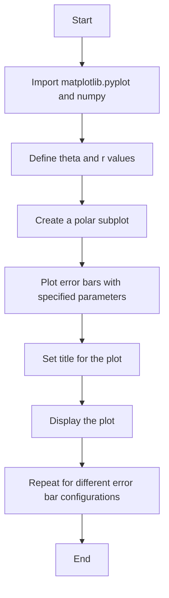
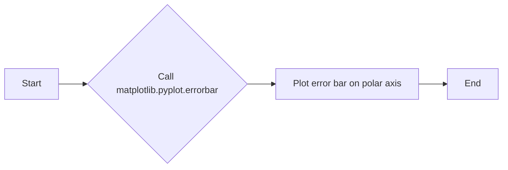
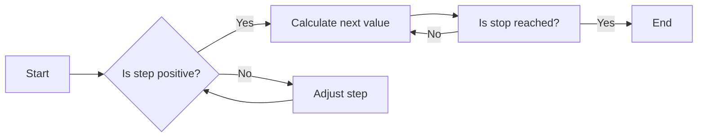
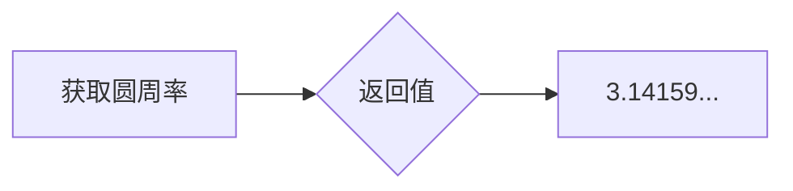
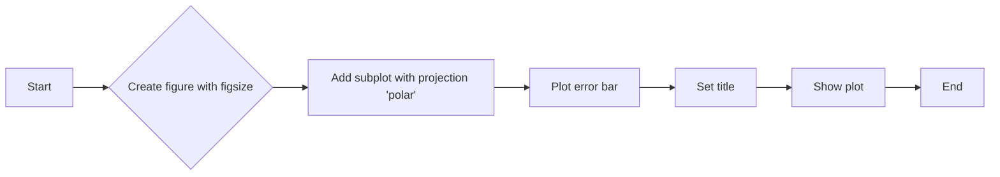
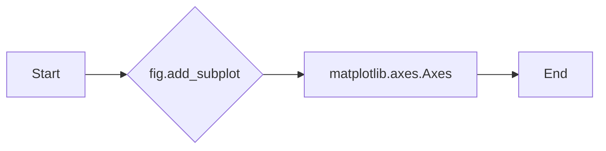
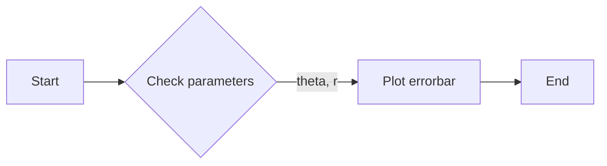
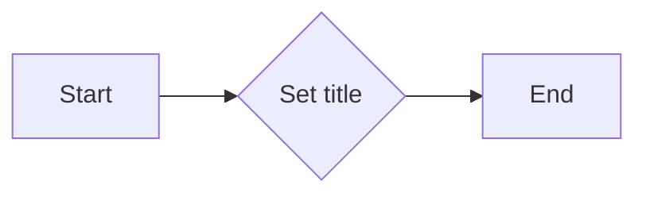
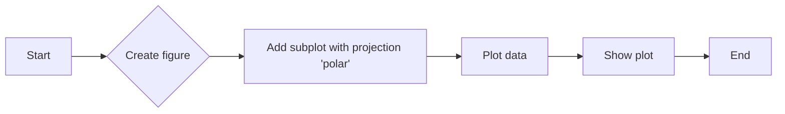
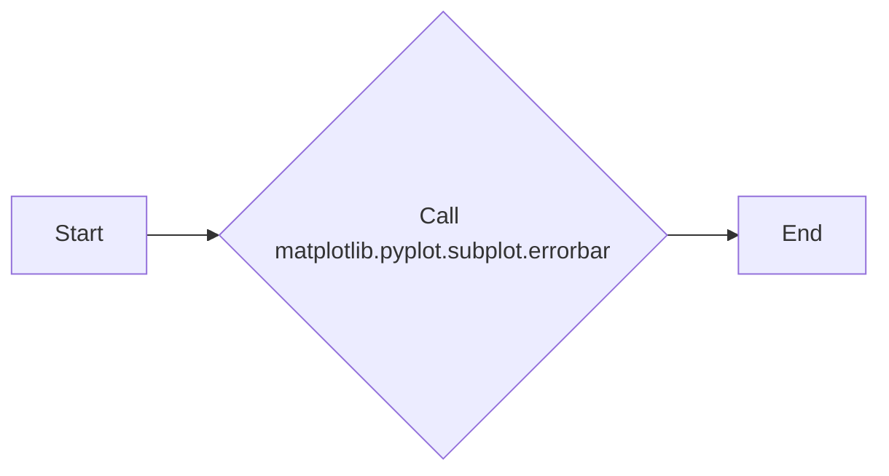

# `matplotlib\galleries\examples\pie_and_polar_charts\polar_error_caps.py` 详细设计文档

This code generates error bar plots on a polar axis, demonstrating different error bar configurations and their visual effects.

## 整体流程



## 类结构

```
matplotlib.pyplot
├── figure
│   ├── add_subplot
│   │   ├── errorbar
│   │   └── set_title
│   └── show
└── numpy
```

## 全局变量及字段


### `plt`
    
Matplotlib's pyplot module for plotting

类型：`module`
    


### `np`
    
NumPy module for numerical operations

类型：`module`
    


### `theta`
    
Array of theta values for the polar plot

类型：`numpy.ndarray`
    


### `r`
    
Array of radius values for the polar plot

类型：`numpy.ndarray`
    


### `fig`
    
Matplotlib figure object

类型：`matplotlib.figure.Figure`
    


### `ax`
    
Matplotlib subplot object in polar projection

类型：`matplotlib.projections.polar.AxesSubplot`
    


### `matplotlib.pyplot.figure.Figure.figsize`
    
Figure size in inches

类型：`tuple`
    


### `matplotlib.projections.polar.AxesSubplot.projection`
    
Projection type of the subplot

类型：`str`
    
    

## 全局函数及方法


### matplotlib.pyplot.show()

展示matplotlib图形的函数。

参数：

- 无

返回值：无

#### 流程图


#### 带注释源码

```python
plt.show()
```


### matplotlib.pyplot.errorbar

matplotlib.pyplot.errorbar 是一个用于在极坐标轴上绘制误差棒的函数。

参数：

- `theta`：`numpy.ndarray`，极坐标中的角度值。
- `r`：`numpy.ndarray`，极坐标中的半径值。
- `xerr`：`numpy.ndarray` 或 `float`，可选，x方向的误差值。
- `yerr`：`numpy.ndarray` 或 `float`，可选，y方向的误差值。
- `capsize`：`int`，可选，误差棒端点的帽子大小。
- `fmt`：`str`，可选，用于指定误差棒的样式。
- `c`：`str`，可选，用于指定误差棒的颜色。

返回值：`AxesSubplot`，绘图的子图对象。

#### 流程图



#### 带注释源码

```python
import matplotlib.pyplot as plt
import numpy as np

theta = np.arange(0, 2 * np.pi, np.pi / 4)
r = theta / np.pi / 2 + 0.5

fig = plt.figure(figsize=(10, 10))
ax = fig.add_subplot(projection='polar')
ax.errorbar(theta, r, xerr=0.25, yerr=0.1, capsize=7, fmt="o", c="seagreen")
ax.set_title("Pretty polar error bars")
plt.show()
```


### np.arange

`np.arange` 是 NumPy 库中的一个函数，用于生成一个沿指定间隔的数组。

参数：

- `start`：`int`，数组的起始值。
- `stop`：`int`，数组的结束值（不包括）。
- `step`：`int`，数组的步长，默认为 1。

返回值：`numpy.ndarray`，一个沿指定间隔的数组。

#### 流程图



#### 带注释源码

```python
import numpy as np

theta = np.arange(0, 2 * np.pi, np.pi / 4)
# theta starts at 0, ends at 2 * np.pi (exclusive), with a step of np.pi / 4
```


### np.pi

`np.pi` 是一个全局变量，用于获取圆周率 π 的值。

参数：

- 无

返回值：`float`，圆周率 π 的值，大约为 3.14159。

#### 流程图



#### 带注释源码

```
# 获取圆周率 π 的值
np.pi
```


### plt.figure

`plt.figure` 是 Matplotlib 库中的一个函数，用于创建一个新的图形窗口。

参数：

- `figsize`：`tuple`，图形的宽度和高度，单位为英寸。

返回值：`Figure`，表示创建的图形对象。

#### 流程图



#### 带注释源码

```python
import matplotlib.pyplot as plt
import numpy as np

theta = np.arange(0, 2 * np.pi, np.pi / 4)
r = theta / np.pi / 2 + 0.5

fig = plt.figure(figsize=(10, 10))  # Create figure with figsize
ax = fig.add_subplot(projection='polar')  # Add subplot with projection 'polar'
ax.errorbar(theta, r, xerr=0.25, yerr=0.1, capsize=7, fmt="o", c="seagreen")  # Plot error bar
ax.set_title("Pretty polar error bars")  # Set title
plt.show()  # Show plot
```


### fig.add_subplot

`fig.add_subplot` 是一个用于创建子图的方法，它允许用户在matplotlib的图形对象中添加一个子图。

参数：

- `projection='polar'`：`str`，指定子图的投影类型为极坐标。

返回值：`matplotlib.axes.Axes`，返回创建的子图对象。

#### 流程图



#### 带注释源码

```python
fig = plt.figure(figsize=(10, 10))
ax = fig.add_subplot(projection='polar')
```

在这个例子中，`fig` 是一个matplotlib的图形对象，`add_subplot` 方法被调用以创建一个新的子图，其投影类型被设置为极坐标。返回的 `ax` 对象是一个matplotlib的子图对象，可以用来绘制图形。


### ax.errorbar

`ax.errorbar` 是一个用于在极坐标轴上绘制误差棒的函数。

参数：

- `theta`：`numpy.ndarray`，极坐标中的角度值。
- `r`：`numpy.ndarray`，极坐标中的半径值。
- `xerr`：`numpy.ndarray` 或 `float`，可选，x方向的误差值。
- `yerr`：`numpy.ndarray` 或 `float`，可选，y方向的误差值。
- `capsize`：`int`，可选，误差棒顶端的帽子大小。
- `fmt`：`str`，可选，用于指定误差棒的样式。
- `c`：`str` 或 `color`，可选，误差棒的颜色。

返回值：无

#### 流程图



#### 带注释源码

```python
"""
Demo of error bar plot in polar coordinates.
Theta error bars are curved lines ended with caps oriented towards the
center.
Radius error bars are straight lines oriented towards center with
perpendicular caps.
"""
import matplotlib.pyplot as plt
import numpy as np

theta = np.arange(0, 2 * np.pi, np.pi / 4)
r = theta / np.pi / 2 + 0.5

fig = plt.figure(figsize=(10, 10))
ax = fig.add_subplot(projection='polar')
ax.errorbar(theta, r, xerr=0.25, yerr=0.1, capsize=7, fmt="o", c="seagreen")
ax.set_title("Pretty polar error bars")
plt.show()
```


### ax.set_title

设置极坐标轴的标题。

参数：

- `title`：`str`，要设置的标题文本。

返回值：`None`，没有返回值。

#### 流程图



#### 带注释源码

```python
# 设置极坐标轴的标题
ax.set_title("Pretty polar error bars")
```


### plt.show()

`plt.show()` 是一个全局函数，用于显示当前图形。

参数：

- 无

返回值：无

#### 流程图

```mermaid
graph LR
A[Start] --> B[Call plt.show()]
B --> C[Display Plot]
C --> D[End]
```

#### 带注释源码

```python
plt.show()  # 显示当前图形
```


### matplotlib.pyplot.figure(figsize=(10, 10))

`matplotlib.pyplot.figure(figsize=(10, 10))` 是一个全局函数，用于创建一个新的图形，并设置其大小。

参数：

- `figsize`：`tuple`，图形的宽度和高度，单位为英寸。

返回值：`Figure` 对象

#### 流程图

```mermaid
graph LR
A[Start] --> B[Call plt.figure(figsize=(10, 10))]
B --> C[Create Figure with Size]
C --> D[End]
```

#### 带注释源码

```python
fig = plt.figure(figsize=(10, 10))  # 创建一个大小为10x10英寸的图形
```


### fig.add_subplot(projection='polar')

`fig.add_subplot(projection='polar')` 是一个方法，用于向图形中添加一个极坐标子图。

参数：

- `projection`：`str`，指定子图的投影类型，这里为 'polar'。

返回值：`AxesSubplot` 对象

#### 流程图

```mermaid
graph LR
A[Start] --> B[Call fig.add_subplot(projection='polar')]
B --> C[Add Polar Subplot]
C --> D[End]
```

#### 带注释源码

```python
ax = fig.add_subplot(projection='polar')  # 向图形中添加一个极坐标子图
```


### ax.errorbar(theta, r, xerr=0.25, yerr=0.1, capsize=7, fmt="o", c="seagreen")

`ax.errorbar(theta, r, xerr=0.25, yerr=0.1, capsize=7, fmt="o", c="seagreen")` 是一个方法，用于在极坐标子图上绘制带有误差线的点。

参数：

- `theta`：`array_like`，极坐标的theta值。
- `r`：`array_like`，极坐标的r值。
- `xerr`：`array_like`，x方向的误差线长度。
- `yerr`：`array_like`，y方向的误差线长度。
- `capsize`：`float`，误差线端点的帽子大小。
- `fmt`：`str`，点的样式。
- `c`：`color`，点的颜色。

返回值：`Line2D` 对象

#### 流程图

```mermaid
graph LR
A[Start] --> B[Call ax.errorbar(theta, r, xerr=0.25, yerr=0.1, capsize=7, fmt="o", c="seagreen")]
B --> C[Plot Error Bar on Polar Subplot]
C --> D[End]
```

#### 带注释源码

```python
ax.errorbar(theta, r, xerr=0.25, yerr=0.1, capsize=7, fmt="o", c="seagreen")  # 绘制带有误差线的点
```


### ax.set_title("Pretty polar error bars")

`ax.set_title("Pretty polar error bars")` 是一个方法，用于设置极坐标子图的标题。

参数：

- `title`：`str`，子图的标题。

返回值：无

#### 流程图

```mermaid
graph LR
A[Start] --> B[Call ax.set_title("Pretty polar error bars")]
B --> C[Set Title on Polar Subplot]
C --> D[End]
```

#### 带注释源码

```python
ax.set_title("Pretty polar error bars")  # 设置极坐标子图的标题
```


### matplotlib.pyplot.figure.add_subplot

`matplotlib.pyplot.figure.add_subplot` 是一个用于创建子图的方法，它允许用户在单个图形窗口中绘制多个子图。

参数：

- `projection`：`str`，指定子图的投影类型，例如 'polar' 用于极坐标图。
- `*args` 和 `**kwargs`：用于传递给 `AxesSubplot` 类的其他参数。

返回值：`matplotlib.axes.Axes`，返回创建的子图对象。

#### 流程图



#### 带注释源码

```python
import matplotlib.pyplot as plt
import numpy as np

theta = np.arange(0, 2 * np.pi, np.pi / 4)
r = theta / np.pi / 2 + 0.5

fig = plt.figure(figsize=(10, 10))
ax = fig.add_subplot(projection='polar')  # Create a polar subplot
ax.errorbar(theta, r, xerr=0.25, yerr=0.1, capsize=7, fmt="o", c="seagreen")
ax.set_title("Pretty polar error bars")
plt.show()
```


### plt.show()

显示matplotlib图形。

参数：

- 无

返回值：无

#### 流程图

```mermaid
graph LR
A[开始] --> B{调用plt.show()}
B --> C[结束]
```

#### 带注释源码

```python
plt.show()
```

该函数是matplotlib.pyplot模块的一部分，用于显示当前图形。当调用此函数时，它会打开一个窗口并显示当前图形的内容。此函数没有参数，也没有返回值。在提供的代码示例中，它被用于显示由`errorbar`函数创建的极坐标错误条形图。在流程图中，我们展示了函数的调用和结束过程。在源码中，我们直接看到了函数的调用，没有额外的参数或返回值。


### matplotlib.pyplot.subplot.errorbar

matplotlib.pyplot.subplot.errorbar 是一个用于在极坐标轴上绘制误差棒的函数。

参数：

- `x`：`array_like`，x坐标数据点。
- `y`：`array_like`，y坐标数据点。
- `xerr`：`array_like`，x方向上的误差棒长度。
- `yerr`：`array_like`，y方向上的误差棒长度。
- `capsize`：`float`，误差棒端点的帽子大小。
- `fmt`：`str`，用于指定数据点的标记样式。
- `c`：`color`，数据点的颜色。

返回值：`Line2D`，绘制的误差棒对象。

#### 流程图



#### 带注释源码

```python
import matplotlib.pyplot as plt
import numpy as np

theta = np.arange(0, 2 * np.pi, np.pi / 4)
r = theta / np.pi / 2 + 0.5

fig = plt.figure(figsize=(10, 10))
ax = fig.add_subplot(projection='polar')
ax.errorbar(theta, r, xerr=0.25, yerr=0.1, capsize=7, fmt="o", c="seagreen")
ax.set_title("Pretty polar error bars")
plt.show()
```


### matplotlib.pyplot.subplot.set_title

设置极坐标子图的标题。

参数：

- `title`：`str`，要设置的标题文本。
- `loc`：`str` 或 `int`，标题的位置，默认为 'center'。
- `fontsize`：`int` 或 `float`，标题的字体大小，默认为 10。
- `color`：`str` 或 `color`，标题的颜色，默认为 'black'。
- `weight`：`str`，标题的字体粗细，默认为 'normal'。
- `verticalalignment`：`str`，垂直对齐方式，默认为 'bottom'。
- `horizontalalignment`：`str`，水平对齐方式，默认为 'center'。

返回值：`None`

#### 流程图


#### 带注释源码

```python
ax.set_title("Pretty polar error bars")
```


## 关键组件


### 张量索引

张量索引用于在多维数组（张量）中定位和访问特定元素。

### 惰性加载

惰性加载是一种延迟计算或初始化数据的技术，直到实际需要时才进行，以提高性能和资源利用率。

### 反量化支持

反量化支持是指系统或算法能够处理和解释非量化数据，以便进行更精确的计算和分析。

### 量化策略

量化策略是指将浮点数数据转换为固定点数表示的方法，以减少计算资源消耗和提高处理速度。


## 问题及建议


### 已知问题

-   **代码重复性**：代码中多次重复创建图形和子图，这可以通过函数封装来减少重复。
-   **错误处理**：代码中没有错误处理机制，如果出现异常（如matplotlib库未安装），程序可能会崩溃。
-   **可读性**：代码注释主要集中在描述性内容上，缺乏对代码逻辑的详细解释，这可能会影响其他开发者理解代码。

### 优化建议

-   **封装函数**：将创建图形和子图的代码封装成函数，以提高代码的可重用性和可读性。
-   **添加异常处理**：在代码中添加异常处理，确保在出现错误时程序能够优雅地处理异常，并提供有用的错误信息。
-   **代码注释**：增加对代码逻辑的注释，帮助其他开发者更好地理解代码的工作原理。
-   **参数化输入**：将theta、r、xerr、yerr等参数作为函数的输入，以便于调整和测试不同的数据集。
-   **测试代码**：编写单元测试来验证代码的功能，确保代码的稳定性和可靠性。
-   **文档化**：为代码编写详细的文档，包括函数的用途、参数、返回值和示例用法。


## 其它


### 设计目标与约束

- 设计目标：实现一个能够绘制极坐标下带有误差线的图表的功能。
- 约束条件：使用matplotlib库进行绘图，确保代码简洁且易于理解。

### 错误处理与异常设计

- 错误处理：代码中未包含显式的错误处理机制，但应确保输入参数符合预期，避免运行时错误。
- 异常设计：未设计特定的异常处理机制，但应确保在异常情况下程序能够优雅地退出。

### 数据流与状态机

- 数据流：输入参数（theta, r, xerr, yerr）通过函数传递，最终生成极坐标下的误差线图表。
- 状态机：代码执行过程中没有状态变化，属于线性执行流程。

### 外部依赖与接口契约

- 外部依赖：代码依赖于matplotlib和numpy库。
- 接口契约：matplotlib库的errorbar函数和polar投影功能提供绘图接口。


    