# `matplotlib\galleries\examples\pie_and_polar_charts\polar_legend.py` 详细设计文档

该代码使用matplotlib创建了一个极坐标轴图，绘制了两条曲线并添加了图例，图例被放置在极坐标角度67.5度处以避免与图表重叠。

## 整体流程

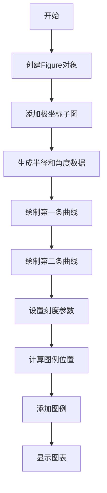

## 类结构

```
无自定义类 (该脚本仅使用matplotlib和numpy库)
```

## 全局变量及字段


### `fig`
    
图形对象

类型：`matplotlib.figure.Figure`
    


### `ax`
    
极坐标轴对象

类型：`matplotlib.axes._subplots.PolarSubplot`
    


### `r`
    
半径数据数组

类型：`numpy.ndarray`
    


### `theta`
    
角度数据数组

类型：`numpy.ndarray`
    


### `angle`
    
图例放置的极坐标角度（67.5度）

类型：`float`
    


### `matplotlib.figure.Figure.fig`
    
图形对象

类型：`Figure`
    


### `matplotlib.axes._subplots.PolarSubplot.ax`
    
极坐标轴对象

类型：`PolarSubplot`
    
    

## 全局函数及方法


### plt.figure

创建新的Figure对象并将其设置为当前图形。用于初始化一个新的图形窗口或画布，是matplotlib中创建图表的起始点。

参数：

- `figsize`：`tuple of (float, float)`，可选，默认`None`，图形的宽和高（单位：英寸）
- `dpi`：`int`，可选，默认`None`，图形的分辨率（每英寸点数）
- `facecolor`：`color`，可选，默认`rcParams["figure.facecolor"]`，图形背景颜色
- `edgecolor`：`color`，可选，默认`rcParams["figure.edgecolor"]`，图形边框颜色
- `frameon`：`bool`，可选，默认`True`，是否绘制图形框架
- `FigureClass`：`class`，可选，默认`matplotlib.figure.Figure`，用于实例化的自定义Figure子类
- `clear`：`bool`，可选，默认`False`，如果为True且图形已存在，则在返回前清除内容
- `constrained_layout`：`bool`，可选，默认`False`，是否使用约束布局引擎
- `tight_layout`：`bool`，可选，默认`False`，是否使用紧凑布局调整子图参数
- `**kwargs`：其他关键字参数传递给Figure构造函数

返回值：`matplotlib.figure.Figure`，新创建或重用的Figure对象

#### 流程图

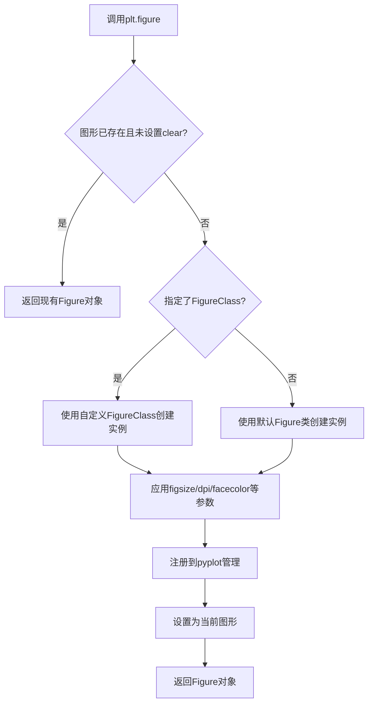

#### 带注释源码

```python
def figure(
    figsize=None,      # 图形尺寸 (宽度, 高度) 英寸
    dpi=None,          # 分辨率，每英寸像素点数
    facecolor=None,    # 背景颜色
    edgecolor=None,    # 边框颜色
    frameon=True,     # 是否绘制框架
    FigureClass=Figure,  # 自定义Figure类
    clear=False,      # 是否清除已存在图形的内容
    constrained_layout=False,  # 使用约束布局
    tight_layout=False,        # 使用紧凑布局
    **kwargs          # 其他Figure构造参数
):
    """
    创建新图形并返回Figure对象。
    
    此函数是matplotlib中创建图表的入口点，负责：
    1. 创建或复用Figure实例
    2. 配置图形属性（尺寸、背景色、分辨率等）
    3. 将图形注册到pyplot管理栈中
    4. 返回Figure对象供后续操作使用
    """
    # 获取全局FigureManager注册表
    allnums = get_fignums()  # 获取所有已存在图形的编号
    
    # 如果未指定编号且存在现有图形
    if get_figurenumber() in allnums and not clear and FigureClass is Figure:
        # 复用现有Figure而不是创建新的（默认行为）
        return gcf()  # 获取当前Figure
    
    # 创建新的Figure实例
    fig = FigureClass(
        figsize=figsize,      # 图形尺寸
        dpi=dpi,              # 分辨率
        facecolor=facecolor,  # 背景色
        edgecolor=edgecolor,  # 边框色
        frameon=frameon,      # 框架显示
        **kwargs              # 传递其他参数
    )
    
    # 配置布局管理器
    if constrained_layout:
        fig.set_constrained_layout(True)
    elif tight_layout:
        fig.set_tight_layout(True)
    
    # 将新Figure添加到pyplot管理
    _pylab_helpers.Gcf.destroy_all()  # 清理无效引用
    number = allnums[-1] + 1 if allnums else 1  # 生成新编号
    manager = _pylab_helpers.Gcf.new_figure_manager_given_figure(number, fig)
    
    # 设置为当前图形
    set_figure(fig)
    
    return fig  # 返回新创建的Figure对象
```

#### 关键组件信息

| 组件名称 | 描述 |
|---------|------|
| Figure | matplotlib中代表整个图形的核心类，包含所有绘图元素 |
| FigureManager | 管理Figure对象的创建、显示和销毁 |
| Gcf | 全局注册表，管理所有活动的Figure对象 |

#### 潜在技术债务与优化空间

1. **状态管理隐式性**：`plt.figure()`隐式复用现有图形可能导致意外行为，应考虑更明确的参数控制
2. **全局状态依赖**：依赖全局Figure栈使得多线程环境下使用存在风险
3. **参数分散**：布局相关参数（constrained_layout、tight_layout）分散在多处，可考虑统一配置接口

#### 其他项目说明

- **设计目标**：提供简洁的图形创建接口，兼容MATLAB的绘图模型
- **错误处理**：当FigureClass不是Figure子类时抛出TypeError；dpi为负数时抛出ValueError
- **外部依赖**：依赖matplotlib.figure.Figure类和_pylab_helpers模块


### `Figure.add_subplot`

该方法用于向图形（Figure）添加子图（Axes），支持指定投影类型（如极坐标投影）和外观属性，返回创建的 Axes 对象供后续绘图使用。

参数：

- `*args`：可变位置参数，支持三种调用方式：(1) 三个整数 (rows, cols, index)；(2) 一个三位整数 (111 表示 1x1 网格的第1个子图)；(3) 省略形式表示单子图。描述：子图位置索引，支持 (row, col, num) 或 (nrows, ncols, index) 格式。
- `projection`：str 或 None，默认 None。描述：子图的投影类型，如 "polar"、"3d" 等，未指定时使用标准二维坐标系。
- `facecolor`：str 或 tuple，默认 None（继承 Figure 背景色）。描述：子图 axes 的背景颜色，支持颜色名称如 "lightgoldenrodyellow" 或 RGB 元组。
- `polar`：bool，默认 False。描述：是否使用极坐标投影，等效于 projection="polar"（已废弃，推荐使用 projection 参数）。
- `**kwargs`：关键字参数。描述：传递给 Axes 构造器的其他参数，如 label、frameon 等。

返回值：`matplotlib.axes.Axes`，创建的子图对象，包含坐标轴、刻度、图例等绘图元素。

#### 流程图

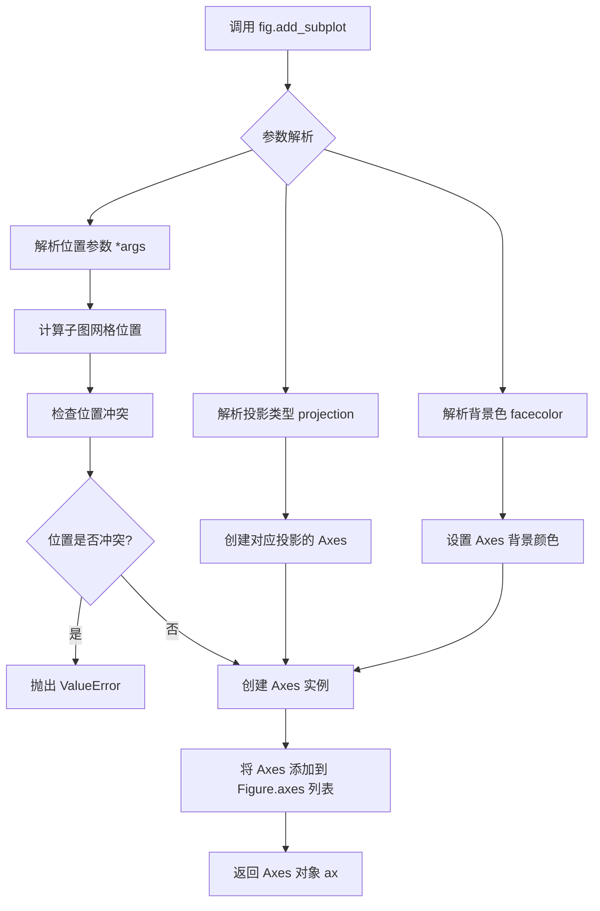

#### 带注释源码

```python
# matplotlib/figure.py 中的核心实现逻辑（简化版）

def add_subplot(self, *args, **kwargs):
    """
    添加一个子图到当前图形。
    
    参数:
        *args: 位置参数，支持三种格式:
            - 三个整数 (rows, cols, index): 如 221, 222, 223, 224
            - 一个三位整数: 如 111 表示 1x1 网格的第1个
            - 无参数: 默认 111
        projection: str, optional
            投影类型，如 'polar', '3d' 等
        facecolor: color, optional
            背景颜色
        **kwargs: 
            其他传递给 Axes 的参数
    """
    # 1. 解析位置参数，确定子图在网格中的位置
    if len(args) == 0:
        # 无参数默认为 111（单子图）
        args = (1, 1, 1)
    
    # 2. 处理 projection 参数
    projection = kwargs.pop('projection', None)
    polar = kwargs.pop('polar', None)
    if polar is not None:
        # polar 参数已废弃，转换为 projection
        projection = 'polar' if polar else None
    
    # 3. 创建 Axes 对象
    # 根据 projection 类型选择不同的 Axes 子类
    ax = self._add_axes_internal(
        rect=rect,  # 计算出的位置 [left, bottom, width, height]
        projection=projection,
        polar=polar,
        **kwargs
    )
    
    # 4. 设置背景色
    if 'facecolor' in kwargs:
        ax.set_facecolor(kwargs['facecolor'])
    
    # 5. 返回创建的 Axes 供用户使用
    return ax

# 在本例中的实际调用:
# ax = fig.add_subplot(projection="polar", facecolor="lightgoldenrodyellow")
# 等价于: ax = fig.add_subplot(1, 1, 1, projection="polar", facecolor="lightgoldenrodyellow")
```


### `np.linspace()`

该函数是NumPy库中的核心数组创建函数，用于在指定范围内生成指定数量的等间距数值序列，常用于创建测试数据、坐标轴数组或需要均匀分布数值的科学计算场景。

参数：

- `start`：`float`，序列的起始值
- `stop`：`float`，序列的结束值（当`endpoint=True`时包含该值）
- `num`：`int`，生成样本的数量，默认为50
- `endpoint`：`bool`，可选，是否包含结束点，默认为True
- `retstep`：`bool`，可选，若为True则返回样本和步长，默认为False
- `dtype`：`dtype`，可选，输出数组的数据类型，若未指定则从输入推断
- `axis`：`int`，可选，当stop为数组时，指定展开的轴

返回值：`ndarray`，当`retstep=False`时返回等间距数组；当`retstep=True`时返回元组(数组, 步长)

#### 流程图

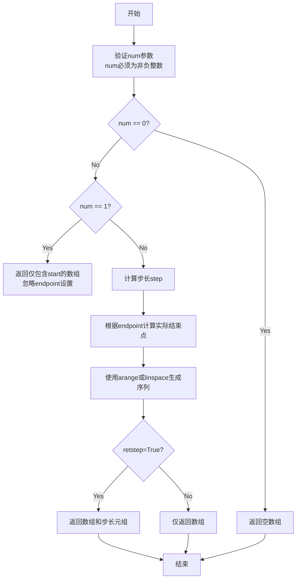

#### 带注释源码

```python
def linspace(start, stop, num=50, endpoint=True, retstep=False, dtype=None, axis=0):
    """
    返回指定间隔内的等间距数字序列。
    
    参数:
        start: 序列的起始值
        stop: 序列的结束值
        num: 生成样本的数量，默认为50
        endpoint: 是否包含结束点，默认为True
        retstep: 是否返回步长，默认为False
        dtype: 输出数组的数据类型
        axis: 当stop为数组时，指定展开的轴
    
    返回:
        等间距的ndarray，或(数组, 步长)的元组
    """
    # 验证num参数
    if num < 0:
        raise ValueError("Number of samples, %d, must be non-negative." % num)
    
    # 处理num=0的情况
    if num == 0:
        # 返回空数组
        return array([], dtype=dtype)
    
    # 处理num=1的情况
    if num == 1:
        # 只返回一个元素，忽略endpoint
        if retstep:
            return array([start], dtype=dtype), 0.0
        return array([start], dtype=dtype)
    
    # 计算步长
    if endpoint:
        step = (stop - start) / (num - 1)
    else:
        step = (stop - start) / num
    
    # 生成序列
    if retstep:
        return _arange(start, stop, step, dtype=dtype), step
    else:
        return _arange(start, stop, step, dtype=dtype)
```


### `np.pi`

`np.pi` 是 NumPy 库中的一个数学常量，表示圆周率 π（约等于 3.141592653589793）。在代码中用于将角度转换为弧度，以便在极坐标图中正确绘制角度值。

参数： 无

返回值：`float`，数学常数 π（约 3.141592653589793）

#### 流程图

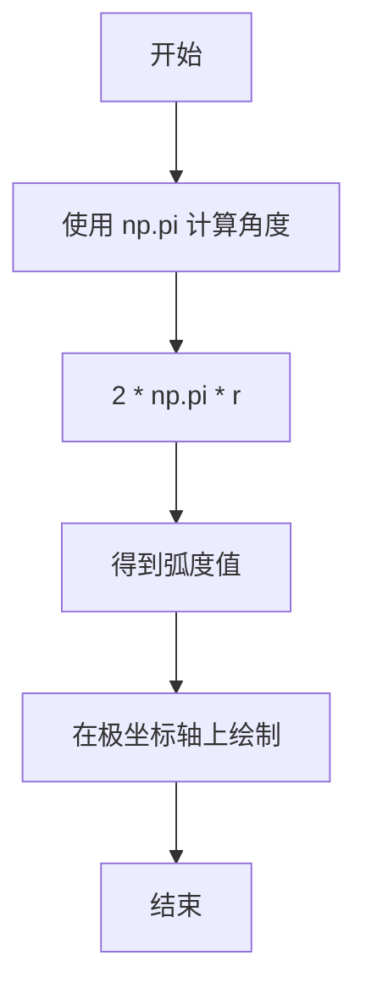

#### 带注释源码

```python
import matplotlib.pyplot as plt
import numpy as np

# 创建极坐标图
fig = plt.figure()
ax = fig.add_subplot(projection="polar", facecolor="lightgoldenrodyellow")

# 创建半径数据
r = np.linspace(0, 3, 301)

# 使用 np.pi 计算角度（弧度）
# np.pi 是 NumPy 提供的圆周率常量，值为 3.141592653589793
theta = 2 * np.pi * r  # 将半径转换为角度（弧度制）

# 绘制两条极坐标曲线
ax.plot(theta, r, color="tab:orange", lw=3, label="a line")
ax.plot(0.5 * theta, r, color="tab:blue", ls="--", lw=3, label="another line")

# 设置刻度参数
ax.tick_params(grid_color="palegoldenrod")

# 计算图例位置（使用 np.pi 相关计算）
# 将角度 67.5 度转换为弧度
angle = np.deg2rad(67.5)  # deg2rad 函数内部使用 np.pi 将角度转换为弧度
ax.legend(loc="lower left",
          bbox_to_anchor=(.5 + np.cos(angle)/2, .5 + np.sin(angle)/2))

plt.show()
```

### 整体文件运行流程

该代码是一个 Matplotlib 可视化示例，展示了如何在极坐标轴上创建图例。整体流程如下：

1. **导入库**：导入 `matplotlib.pyplot` 和 `numpy`
2. **创建图形**：创建 Figure 对象
3. **添加极坐标子图**：使用 `projection="polar"` 创建极坐标轴
4. **生成数据**：使用 `np.linspace` 生成半径数据，使用 `np.pi` 计算对应的弧度角度
5. **绘制曲线**：在极坐标轴上绘制两条曲线
6. **设置样式**：配置刻度网格颜色
7. **放置图例**：使用三角函数和 `np.pi` 相关计算确定图例位置
8. **显示图形**：调用 `plt.show()`

### 关键组件信息

| 组件名称 | 描述 |
|---------|------|
| `np.pi` | NumPy 提供的圆周率常量，约等于 3.141592653589793 |
| `np.linspace` | 创建等间距数值序列的函数 |
| `np.deg2rad` | 将角度转换为弧度的函数，内部使用 np.pi |
| `ax.plot` | 在极坐标轴上绘制曲线的方法 |
| `ax.legend` | 在图形中添加图例的方法 |

### 技术债务与优化空间

1. **魔法数字**：代码中使用了硬编码的角度值 `67.5`，可以将其提取为命名常量以提高可读性
2. **缺乏错误处理**：没有对输入数据进行验证（如负值处理）
3. **重复计算**：`np.cos(angle)/2` 和 `np.sin(angle)/2` 可以预先计算一次

### 其它说明

**设计目标**：演示如何在极坐标图中正确放置图例以避免与坐标轴重叠

**数据流**：
- 输入：半径数组 `r`
- 处理：使用 `np.pi` 将半径转换为弧度角度 `theta`
- 输出：极坐标曲线和图例

**外部依赖**：
- `matplotlib.pyplot`：图形绑定库
- `numpy`：数值计算库，提供 `np.pi` 常量


### `np.deg2rad`

将角度（度）转换为弧度的NumPy函数。该函数接受单个角度值或角度数组，并返回对应的弧度值，是三角计算中常用的角度转换工具。

参数：

- `x`：`float` 或 `array_like`，要转换的角度值（以度为单位），可以是标量或数组

返回值：`float` 或 `ndarray`，转换后的弧度值，类型与输入相同

#### 流程图

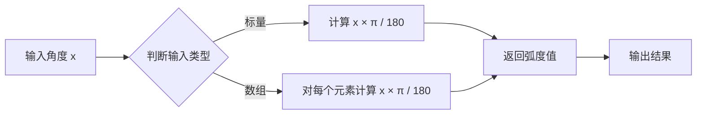

#### 带注释源码

```python
def deg2rad(x, /, *args, **kwargs):
    """
    将角度从度数转换为弧度。
    
    参数:
        x: float 或 array_like
            要转换的角度值（度）
    
    返回:
        float 或 ndarray
            转换后的弧度值
    
    备注:
        等价于 x * pi / 180
    """
    # 在NumPy中的实际实现（伪代码）
    # pi = np.pi  # 获取π常量
    # result = x * pi / 180  # 度到弧度的转换公式
    # return result
    
    # 示例调用
    angle_deg = 90  # 90度
    angle_rad = np.deg2rad(angle_deg)  # 返回 np.pi/2 ≈ 1.5708
```

#### 在示例代码中的使用

在给定的Polar legend示例中，`np.deg2rad()`用于将67.5度转换为弧度，以便正确计算图例锚点在极坐标系中的位置：

```python
# 将67.5度转换为弧度
angle = np.deg2rad(67.5)

# 使用三角函数计算图例在极坐标中的坐标
# x = 0.5 + cos(angle)/2
# y = 0.5 + sin(angle)/2
ax.legend(loc="lower left",
          bbox_to_anchor=(.5 + np.cos(angle)/2, .5 + np.sin(angle)/2))
```

#### 关键组件信息

| 组件名称 | 描述 |
|---------|------|
| `np.pi` | NumPy提供的π常量（约等于3.14159） |
| `np.cos()` | 余弦函数，计算角度的余弦值 |
| `np.sin()` | 正弦函数，计算角度的正弦值 |
| `ax.legend()` | Matplotlib的图例创建函数 |
| `bbox_to_anchor` | 图例锚点位置参数 |

#### 潜在的技术债务或优化空间

1. **硬编码角度值**：67.5度可以在文件顶部定义为常量，提高可读性和可维护性
2. **缺少类型提示**：可添加`typing`注解增强代码可读性
3. **魔法数字**：`.5 + np.cos(angle)/2`的计算逻辑可以封装为辅助函数

#### 其它项目

**设计目标**：在极坐标图中正确定位图例，避免与坐标轴重叠

**错误处理**：
- 输入非数值类型会抛出`TypeError`
- 复数输入会返回复数弧度值

**数据流**：
```
度数 → np.deg2rad() → 弧度 → np.cos()/np.sin() → 笛卡尔坐标 → bbox_to_anchor
```

**外部依赖**：
- NumPy库（提供数学计算函数）
- Matplotlib库（提供绘图功能）


### np.cos

余弦函数，用于计算给定角度（以弧度为单位）的余弦值。在本代码中用于计算角度的余弦值，以确定图例锚点在极坐标中的 x 轴位置。

参数：

- `x`：`float` 或 `array-like`，输入的角度值，单位为弧度

返回值：`float` 或 `ndarray`，输入角度的余弦值

#### 流程图

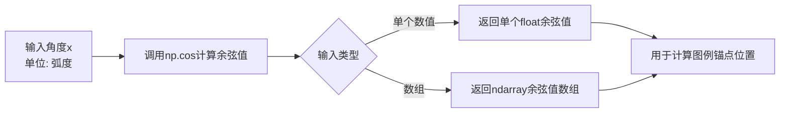

#### 带注释源码

```python
# 将角度转换为弧度制
angle = np.deg2rad(67.5)  # 67.5度转换为弧度

# 计算余弦值，用于确定图例锚点的x坐标
# 公式: .5 + np.cos(angle)/2
# 将极坐标角度转换为笛卡尔坐标x分量
cos_value = np.cos(angle)  # 计算angle弧度的余弦值

# 最终图例锚点位置计算
# bbox_to_anchor = (.5 + np.cos(angle)/2, .5 + np.sin(angle)/2)
```


### `np.sin`

`np.sin()` 是 NumPy 库中的数学函数，用于计算给定角度（以弧度为单位）的正弦值。该函数接受一个数值或数组作为输入，返回对应角度的正弦结果。

参数：

- `x`：`float` 或 `array_like`，输入角度，单位为弧度。可以是单个数值或数组。

返回值：

- `ndarray` 或 `scalar`，输入角度的正弦值，返回类型与输入类型相同。

#### 流程图

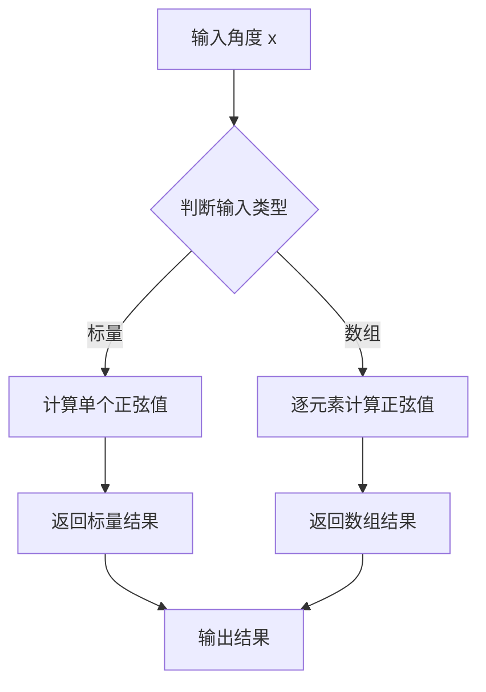

#### 带注释源码

```python
# 示例代码中的实际使用
angle = np.deg2rad(67.5)  # 将角度转换为弧度
# 使用 np.sin() 计算 angle 的正弦值
# np.cos 和 np.sin 用于计算极坐标图例位置
ax.legend(loc="lower left",
          bbox_to_anchor=(.5 + np.cos(angle)/2, .5 + np.sin(angle)/2))
```

```python
# np.sin 函数的标准用法
import numpy as np

# 输入为标量
result1 = np.sin(np.pi / 2)  # 输出: 1.0

# 输入为数组
angles = np.array([0, np.pi/2, np.pi, 3*np.pi/2])
result2 = np.sin(angles)  # 输出: [ 0.  1.  0. -1.]
```


### `matplotlib.axes.Axes.plot`

在极坐标轴上绘制线条的方法，接受x轴数据、y轴数据、格式字符串和可选的关键字参数（如颜色、线宽、标签等），返回包含Line2D对象的列表。

参数：

- `theta`：`numpy.ndarray` 或类数组，极坐标角度数据（弧度制）
- `r`：`numpy.ndarray` 或类数组，极坐标径向距离数据
- `color`：`str`，线条颜色，可使用命名颜色（如"tab:orange"）或十六进制颜色
- `lw`：`float`，线条宽度（line width）
- `ls`：`str`，线条样式（line style），如"--"表示虚线
- `label`：`str`，图例标签，用于图例显示
- `**kwargs`：其他matplotlib支持的Line2D属性关键字参数

返回值：`list`，返回Line2D对象列表，每个对象代表一条绘制的线条

#### 流程图

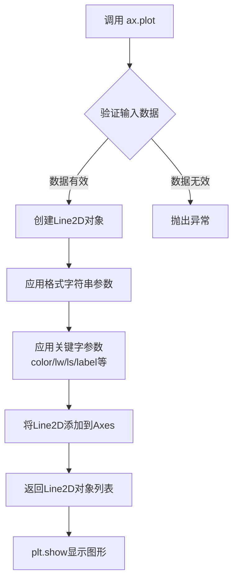

#### 带注释源码

```python
# 导入必要的库
import matplotlib.pyplot as plt
import numpy as np

# 创建图形窗口
fig = plt.figure()

# 添加极坐标子图，背景色为浅金黄色
ax = fig.add_subplot(projection="polar", facecolor="lightgoldenrodyellow")

# 生成径向距离数据：从0到3，共301个点
r = np.linspace(0, 3, 301)

# 计算角度：2π乘以径向距离
theta = 2 * np.pi * r

# ========== 核心：ax.plot() 调用 ==========
# 第一次绘制：橙色实线，线宽3，标签为"a line"
# 参数：theta(角度), r(半径), color(颜色), lw(线宽), label(标签)
ax.plot(theta, r, color="tab:orange", lw=3, label="a line")

# 第二次绘制：蓝色虚线，线宽3，标签为"another line"
# 参数：0.5*theta将角度减半，ls="--"设置虚线样式
ax.plot(0.5 * theta, r, color="tab:blue", ls="--", lw=3, label="another line")

# 设置刻度参数，网格颜色为浅金黄色
ax.tick_params(grid_color="palegoldenrod")

# 计算图例位置：67.5度角对应的坐标
# 使用极坐标转换：x = 0.5 + cos(angle)/2, y = 0.5 + sin(angle)/2
angle = np.deg2rad(67.5)

# 添加图例，位置在轴外左下角，避免与极坐标轴重叠
ax.legend(loc="lower left",
          bbox_to_anchor=(.5 + np.cos(angle)/2, .5 + np.sin(angle)/2))

# 显示图形
plt.show()
```

---

### 其他相关组件信息

| 组件名称 | 一句话描述 |
|---------|-----------|
| `matplotlib.axes.Axes` | 支持极坐标投影的二维坐标轴类 |
| `matplotlib.projections.polar` | 极坐标投影模块 |
| `matplotlib.projections.polar.PolarAxes` | 极坐标轴的专用实现类 |
| `matplotlib.axes.Axes.legend` | 在坐标轴上添加图例的方法 |
| `matplotlib.pyplot.show` | 显示所有图形的方法 |

### 技术债务与优化空间

1. **魔法数字**：角度67.5度和图例位置计算逻辑可封装为独立函数，提高可读性
2. **硬编码参数**：颜色、线宽等样式参数可直接提取为配置常量，便于主题切换
3. **文档缺失**：示例中缺少对极坐标系统（theta vs r）的说明，新手可能误解

### 设计约束与错误处理

- **输入约束**：`theta`和`r`必须是相同长度的数组，否则会抛出`ValueError`异常
- **极坐标限制**：超出`[0, 2π]`的角度会被自动归一化到该范围
- **样式覆盖**：格式字符串（如'ro-'）优先于关键字参数中的同属性设置


### `Axes.tick_params`

设置刻度参数，用于控制刻度线、刻度标签和网格的外观。该方法允许用户自定义matplotlib图表中刻度线的视觉属性，包括颜色、宽度、样式，以及刻度标签的字体大小、旋转角度等。

参数：

- `axis`：{`'x'`, `'y'`, `'both'`}，默认为`'both'`，指定要修改的坐标轴
- `which`：{`'major'`, `'minor'`, `'both'`}，默认为`'major'`，指定要修改的刻度类型（主刻度或副刻度）
- `reset`：`bool`，默认为`False`，如果为`True`，则在应用其他参数之前将所有刻度参数重置为默认值
- `grid_color`：`str`或`color`，设置网格颜色（本例中使用的参数）
- `grid_alpha`：`float`，设置网格透明度（0-1之间）
- `grid_linewidth`：`float`，设置网格线宽度
- `grid_linestyle`：`str`，设置网格线型（`'-'`, `'--'`, `':'`, `'-.'`等）
- `direction`：{`'in'`, `'out'`, `'inout'`}，设置刻度线方向
- `length`：`float`，设置刻度线长度
- `width`：`float`，设置刻度线宽度
- `color`：`str`或`color`，设置刻度线颜色
- `pad`：`float`，设置刻度标签与刻度线之间的间距
- `labelsize`：`float`或`str`，设置刻度标签字体大小
- `labelcolor`：`str`或`color`，设置刻度标签颜色
- `rotation`：`float`，设置刻度标签旋转角度
- `**kwargs`：其他接受的关键字参数，将传递给刻度线或标签

返回值：`None`，该方法直接修改Axes对象的属性，不返回任何值

#### 流程图

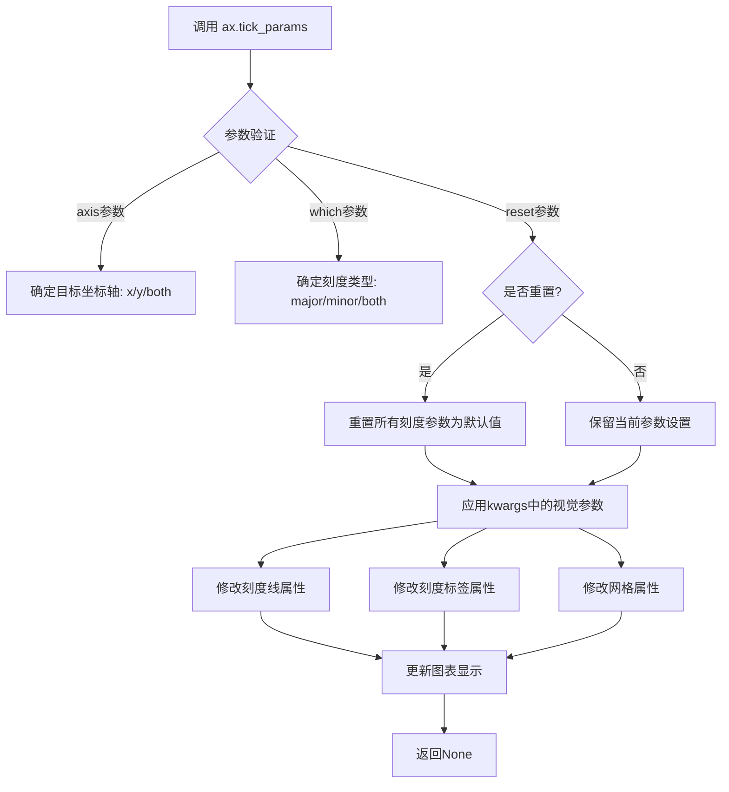

#### 带注释源码

```python
# matplotlib中Axes.tick_params方法的简化实现原理

def tick_params(self, axis='both', which='major', reset=False, **kwargs):
    """
    设置刻度线、刻度标签和网格的视觉属性
    
    参数:
        axis: str, 要修改的坐标轴 ('x', 'y', 或 'both')
        which: str, 要修改的刻度类型 ('major', 'minor', 或 'both')
        reset: bool, 是否在应用参数前重置为默认值
        **kwargs: 各种视觉属性关键字参数
    """
    
    # 1. 处理reset参数
    if reset:
        # 如果reset为True，重置所有刻度参数到默认值
        self._reset_tick_params(axis, which)
    
    # 2. 获取目标坐标轴的刻度对象
    if axis in ['x', 'both']:
        xTicks = self.xaxis.get_major_ticks() if which == 'major' else \
                 self.xaxis.get_minor_ticks() if which == 'minor' else \
                 self.xaxis.get_ticks()  # 包含major和minor
        # 处理x轴刻度参数
        self._set_tick_params_from_dict(xTicks, kwargs)
    
    if axis in ['y', 'both']:
        yTicks = self.yaxis.get_major_ticks() if which == 'major' else \
                 self.yaxis.get_minor_ticks() if which == 'minor' else \
                 self.yaxis.get_ticks()
        # 处理y轴刻度参数
        self._set_tick_params_from_dict(yTicks, kwargs)
    
    # 3. 应用网格参数（如果提供）
    if 'grid_color' in kwargs or 'grid_alpha' in kwargs:
        self._set_grid_params(kwargs)
    
    # 4. 触发图表重绘以显示更改
    self.stale_callback()
    
    # 返回None（该方法直接修改对象状态）
    return None


# 在示例代码中的使用:
# ax.tick_params(grid_color="palegoldenrod")
# 这行代码设置了极坐标轴的网格颜色为palegoldenrod
```

#### 实际调用示例

```python
import matplotlib.pyplot as plt
import numpy as np

# 创建极坐标轴
fig = plt.figure()
ax = fig.add_subplot(projection="polar", facecolor="lightgoldenrodyellow")

# 绑定数据并绘图
r = np.linspace(0, 3, 301)
theta = 2 * np.pi * r
ax.plot(theta, r, color="tab:orange", lw=3, label="a line")
ax.plot(0.5 * theta, r, color="tab:blue", ls="--", lw=3, label="another line")

# 设置网格颜色为palegoldenrod
ax.tick_params(grid_color="palegoldenrod")

# 添加图例并显示
ax.legend(loc="lower left", bbox_to_anchor=(.5 + np.cos(angle)/2, .5 + np.sin(angle)/2))
plt.show()
```

#### 技术说明

- `tick_params`是Matplotlib中Axes类的重要方法，用于精细控制图表的刻度外观
- 该方法直接修改Axes对象的内部状态，不返回任何值
- 对于极坐标图（polar plot），`grid_color`参数控制径向网格线的颜色
- 支持通过`axis`和`which`参数分别控制x轴/y轴和主刻度/副刻度
- 大量参数通过`**kwargs`传入，提供高度的灵活性


### `matplotlib.axes.Axes.legend`

该方法是matplotlib中Axes类的图例添加功能，用于在极坐标轴plot上添加图例，通过loc和bbox_to_anchor参数控制图例位置，避免与坐标轴重叠。

参数：

- `loc`：`str`，图例在 Axes 中的位置，如 "lower left"、"upper right" 等
- `bbox_to_anchor`：`tuple`，二元组 (x, y)，用于指定图例锚点相对于 Axes 的位置
- `**kwargs`：`dict`，其他传递给 `matplotlib.legend.Legend` 的关键字参数，如 title、frameon 等

返回值：`matplotlib.legend.Legend`，返回创建的 Legend 对象，可用于进一步自定义

#### 流程图

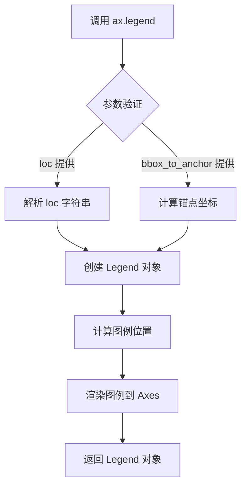

#### 带注释源码

```python
# 导入必要的库
import matplotlib.pyplot as plt
import numpy as np

# 创建图形对象
fig = plt.figure()

# 添加极坐标投影的子图，背景色为浅金黄色
ax = fig.add_subplot(projection="polar", facecolor="lightgoldenrodyellow")

# 生成极坐标数据
# r: 从0到3的301个等间距点
r = np.linspace(0, 3, 301)
# theta: 2π乘以r，完整旋转
theta = 2 * np.pi * r

# 绘制第一条曲线：橙色实线，线宽3，带标签"a line"
ax.plot(theta, r, color="tab:orange", lw=3, label="a line")

# 绘制第二条曲线：蓝色虚线，线宽3，带标签"another line"
ax.plot(0.5 * theta, r, color="tab:blue", ls="--", lw=3, label="another line")

# 设置刻度参数，网格颜色为 pale goldenrod
ax.tick_params(grid_color="palegoldenrod")

# 计算图例放置角度：67.5度转换为弧度
# 目的：避免图例与极坐标轴重叠，将图例放置在偏离中心的位置
angle = np.deg2rad(67.5)

# 添加图例
# loc="lower left": 图例位置在左下角
# bbox_to_anchor: 使用极坐标转换公式计算锚点位置
#   - .5 + np.cos(angle)/2: x坐标
#   - .5 + np.sin(angle)/2: y坐标
# 这样可以将图例放置在极坐标轴外部，避免遮挡数据
ax.legend(
    loc="lower left",  # 图例位置
    bbox_to_anchor=(.5 + np.cos(angle)/2, .5 + np.sin(angle)/2)  # 锚点坐标
)

# 显示图形
plt.show()
```


### `plt.show()`

显示所有当前打开的图形窗口，并进入交互式显示模式。该函数会阻止程序执行，直到用户关闭所有显示的图形窗口（在某些后端中），或者在Jupyter Notebook等交互环境中以内联方式渲染图形。

参数： 无

返回值：`None`，该函数不返回任何值

#### 流程图

```mermaid
flowchart TD
    A[调用 plt.show()] --> B{图形是否已创建?}
    B -->|否| C[不执行任何操作]
    B -->|是| D{当前后端类型?}
    D -->|交互式后端| E[创建/显示图形窗口]
    D -->|非交互式后端| F[渲染图形到目标设备]
    E --> G[进入事件循环<br/>阻塞等待用户交互]
    F --> H[输出图形数据<br/>如保存到文件或显示在notebook]
    G --> I[用户关闭图形窗口]
    I --> J[函数返回]
    H --> J
```

#### 带注释源码

```python
# plt.show() 函数的实际实现位于 matplotlib/backend_bases.py
# 以下是简化的调用流程说明

def show(block=None):
    """
    显示所有打开的图形。
    
    参数:
        block: bool, optional
            如果为True（默认值），则阻塞程序执行直到所有图形窗口关闭。
            在某些交互式环境中（如某些IDE或Jupyter Notebook）可能会有所不同。
    """
    
    # 获取当前图形
    allnums = get_fignum_list()  # 获取所有打开的图形编号
    for num in allnums:
        # 遍历每个图形，获取对应的后端
        backend = get_backend(num)
        # 调用后端的show方法显示图形
        backend.show()
    
    # 如果block为True且是交互式后端，则进入阻塞状态
    # 等待用户交互（如关闭图形窗口）
    if block is True:
        enter_blocking_event_loop()
    
    return None
```

> **注意**：在实际matplotlib库中，`plt.show()`的行为高度依赖于所选择的后端（backend）。常见的后端包括：
> - **Qt5Agg**：在Qt5应用程序中显示图形
> - **TkAgg**：使用Tkinter后端显示图形
> - **inline**：Jupyter Notebook中的内联显示
> - **agg**：非交互式后端，仅用于生成静态图像输出

## 关键组件


### 极坐标轴 (Polar Axes)

通过 fig.add_subplot(projection="polar", facecolor="lightgoldenrodyellow") 创建的极坐标投影 axes，用于绘制极坐标数据，背景色设为浅金黄色。

### 极坐标曲线绘制

使用 ax.plot() 方法绘制两条极坐标曲线：一条为橙色实线，另一条为蓝色虚线，每条曲线都有对应的标签用于图例显示。

### 图例组件 (Legend)

通过 ax.legend() 方法添加图例，使用 bbox_to_anchor 参数结合三角函数计算将图例放置在极坐标轴外侧偏左下的位置（角度 67.5 度），避免与坐标轴重叠。

### 极坐标角度计算

使用 np.deg2rad(67.5) 将角度转换为弧度，配合 np.cos() 和 np.sin() 计算图例锚点的归一化坐标位置。

### 数据生成

使用 np.linspace(0, 3, 301) 生成从 0 到 3 的等间距数据点，共 301 个点，用于极坐标曲线的半径值 r。


## 问题及建议


### 已知问题

-   **硬编码的魔法数字**：角度67.5、系数0.5等数值直接写在代码中，缺乏可配置性，难以理解和维护
-   **缺乏参数化设计**：所有参数（颜色、线宽、数据范围、角度等）都硬编码，无法通过参数自定义图例位置或绑制参数
-   **缺少类型注解**：Python代码中没有任何类型提示，降低了代码的可读性和IDE支持
-   **缺乏错误处理**：没有对输入参数（如r的范围、角度值）的有效性验证
-   **注释与代码不一致**：代码注释中提到`PolarAxes`类，但实际代码中并未直接使用该类
-   **缺乏模块化和可复用性**：数据生成（r和theta的计算）与绑制逻辑混在一起，难以单独复用计算逻辑
-   **plt.show()阻塞**：在某些GUI环境下可能导致显示问题
-   **重复的绑制代码**：两条线的绑制逻辑重复，可以抽象为循环或函数

### 优化建议

-   **参数化设计**：将关键参数（角度、颜色、线型、数据范围等）提取为函数参数或配置文件
-   **添加类型注解**：为函数参数和返回值添加类型提示，提高代码可读性
-   **封装计算逻辑**：将r和theta的生成逻辑封装为独立函数
-   **定义常量**：将魔法数字提取为有意义的常量或配置变量
-   **添加错误处理**：对输入参数进行校验，确保数据有效性
-   **代码重构**：将重复的绑制逻辑抽象为循环或通用函数
-   **移除无关注释**：删除或修正与代码实际实现不符的注释
-   **考虑非阻塞显示**：在需要时使用`plt.show(block=False)`或考虑使用`fig.savefig()`代替交互式显示


## 其它


### 设计目标与约束

本示例旨在演示如何在极坐标轴图表中正确放置图例，避免图例与图表元素重叠。主要约束包括：极坐标图例放置位置需根据角度计算、需考虑不同极坐标系的兼容性、图例位置需手动计算避免重叠。

### 错误处理与异常设计

代码主要依赖matplotlib和numpy库，潜在错误包括：numpy的linspace参数不合理导致数据点不足、deg2rad转换的输入值超出范围、bbox_to_anchor坐标计算错误导致图例位置异常、projection参数不支持时的异常。代码未显式处理异常，实际使用中建议添加try-except捕获figure创建失败、subplot添加失败等异常。

### 数据流与状态机

数据流：r数组通过np.linspace生成 → theta通过2*np.pi*r计算 → ax.plot()将数据绑定到极坐标轴 → ax.legend()创建图例并通过bbox_to_anchor定位。状态机涉及：Figure创建 → Axes添加（polar projection） → 数据绑定 → 渲染 → 显示。

### 外部依赖与接口契约

主要依赖：matplotlib.pyplot（Figure/Axes创建、绘图、图例）、matplotlib.projections.polar（极坐标投影）、numpy（数值计算）。接口契约：fig.add_subplot(projection="polar")返回Axes或SubplotBase对象、ax.plot()返回Line2D列表、ax.legend()返回Legend对象、np.linspace返回ndarray、np.deg2rad返回标量或ndarray。

### 性能考虑

r数组生成301个点对于极坐标图属于中等规模，实时交互场景可能需要降低采样点以提高性能。图例渲染开销较小，主要性能瓶颈在ax.plot()的线条渲染，lw=3设置较粗可能增加渲染时间。

### 兼容性考虑

代码使用标准的matplotlib API，兼容matplotlib 3.1+版本（projection="polar"参数支持）。numpy依赖版本建议1.16+。facecolor="lightgoldenrodyellow"和grid_color="palegoldenrod"使用HTML颜色名称，需确保matplotlib后端支持颜色名称解析。

### 使用场景与用例

适用于科学可视化（如雷达图、周期函数展示）、数据分析（多参数对比）、工程图纸（角度-距离关系图）等需要极坐标表示的场景。典型用例包括：信号处理中的频率响应分析、气象数据的风向风速展示、物理运动中的角动量描述。

### 配置与参数说明

关键配置参数：r的linspace参数(0, 3, 301)控制半径范围和采样密度、theta = 2*np.pi*r实现周期延展、angle = np.deg2rad(67.5)控制图例放置角度、bbox_to_anchor的.cos()/2计算实现自适应偏移、lw=3设置线条粗细、ls="--"设置虚线样式。

### 安全性考虑

代码为纯前端可视化脚本，无用户输入验证需求，无敏感数据处理，无安全风险。唯一需要注意的是在生产环境中部署时需确保matplotlib后端配置正确（GUI环境或使用Agg后端）。

### 测试考虑

建议测试场景：不同r范围（负值、极值）、不同采样点数、不同极坐标角度（0°、90°、180°、270°）、图例位置与axes边界重叠情况、多子图场景下的图例定位、不同的matplotlib样式主题兼容性。

### 扩展性建议

可扩展方向：支持动态数据更新（使用FuncAnimation）、支持交互式图例拖拽、支持自定义图例样式（自定义handler）、支持多个图例叠加、支持极坐标网格定制、支持色带/颜色条集成。

    