# `matplotlib\galleries\examples\pie_and_polar_charts\polar_scatter.py` 详细设计文档

This code generates scatter plots on a polar axis using the matplotlib library, demonstrating various configurations such as offset origin, sector confinement, and color mapping.

## 整体流程

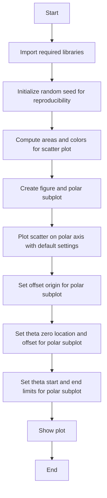

## 类结构

```
matplotlib.pyplot (module)
├── scatter (function)
│   ├── theta (parameter)
│   ├── r (parameter)
│   ├── c (parameter)
│   ├── s (parameter)
│   ├── cmap (parameter)
│   └── alpha (parameter)
├── figure (function)
│   ├── ax (parameter)
│   └── projection='polar' (parameter)
├── add_subplot (function)
│   ├── projection='polar' (parameter)
│   └── ax (return value)
├── set_rorigin (function)
│   ├── rorigin (parameter)
│   └── ax (parameter)
├── set_theta_zero_location (function)
│   ├── location ('W') (parameter)
│   ├── offset (parameter)
│   └── ax (parameter)
├── set_thetamin (function)
│   ├── thetamin (parameter)
│   └── ax (parameter)
├── set_thetamax (function)
│   ├── thetamax (parameter)
│   └── ax (parameter)
└── show (function)
```

## 全局变量及字段


### `np`
    
NumPy module for numerical operations

类型：`module`
    


### `plt`
    
Matplotlib module for plotting

类型：`module`
    


### `fig`
    
Matplotlib figure object

类型：`matplotlib.figure.Figure`
    


### `ax`
    
Matplotlib polar axes object

类型：`matplotlib.projections.polar.PolarAxes`
    


### `c`
    
Matplotlib path collection object for scatter plot

类型：`matplotlib.collections.PathCollection`
    


### `theta`
    
Array of theta values for the scatter plot

类型：`numpy.ndarray`
    


### `r`
    
Array of radius values for the scatter plot

类型：`numpy.ndarray`
    


### `area`
    
Array of area values for the scatter plot, used for size of scatter plot symbols

类型：`numpy.ndarray`
    


### `colors`
    
Array of color values for the scatter plot

类型：`numpy.ndarray`
    


### `N`
    
Number of points in the scatter plot

类型：`int`
    


    

## 全局函数及方法


### matplotlib.pyplot.scatter

matplotlib.pyplot.scatter 是一个用于创建散点图的函数。

参数：

- `theta`：`numpy.ndarray`，表示极坐标中的角度。
- `r`：`numpy.ndarray`，表示极坐标中的半径。
- `c`：可选，颜色映射的值。
- `s`：可选，散点的大小。
- `cmap`：可选，颜色映射的名称。
- `alpha`：可选，散点的透明度。

返回值：`matplotlib.collections.PathCollection`，散点图对象。

#### 流程图


#### 带注释源码

```python
import matplotlib.pyplot as plt
import numpy as np

# Fixing random state for reproducibility
np.random.seed(19680801)

# Compute areas and colors
N = 150
r = 2 * np.random.rand(N)
theta = 2 * np.pi * np.random.rand(N)
area = 200 * r**2
colors = theta

fig = plt.figure()
ax = fig.add_subplot(projection='polar')
c = ax.scatter(theta, r, c=colors, s=area, cmap='hsv', alpha=0.75)

ax.set_rorigin(-2.5)
ax.set_theta_zero_location('W', offset=10)

fig = plt.figure()
ax = fig.add_subplot(projection='polar')
c = ax.scatter(theta, r, c=colors, s=area, cmap='hsv', alpha=0.75)

ax.set_thetamin(45)
ax.set_thetamax(135)

plt.show()
```


### matplotlib.pyplot.scatter

matplotlib.pyplot.scatter 是一个用于创建散点图的函数。

参数：

- `theta`：`numpy.ndarray`，表示极坐标中的角度。
- `r`：`numpy.ndarray`，表示极坐标中的半径。
- `c`：可选，颜色映射的值。
- `s`：可选，散点的大小。
- `cmap`：可选，颜色映射的名称。
- `alpha`：可选，散点的透明度。

返回值：`matplotlib.collections.PathCollection`，散点图的集合。

#### 流程图


#### 带注释源码

```python
import matplotlib.pyplot as plt
import numpy as np

# Fixing random state for reproducibility
np.random.seed(19680801)

# Compute areas and colors
N = 150
r = 2 * np.random.rand(N)
theta = 2 * np.pi * np.random.rand(N)
area = 200 * r**2
colors = theta

fig = plt.figure()
ax = fig.add_subplot(projection='polar')
c = ax.scatter(theta, r, c=colors, s=area, cmap='hsv', alpha=0.75)

ax.set_rorigin(-2.5)
ax.set_theta_zero_location('W', offset=10)

fig = plt.figure()
ax = fig.add_subplot(projection='polar')
c = ax.scatter(theta, r, c=colors, s=area, cmap='hsv', alpha=0.75)

ax.set_thetamin(45)
ax.set_thetamax(135)

plt.show()
```

### matplotlib.projections.polar.PolarAxes.set_rorigin

matplotlib.projections.polar.PolarAxes.set_rorigin 是一个用于设置极坐标轴原点半径的函数。

参数：

- `rorigin`：`float`，原点半径。

返回值：无。

#### 流程图


#### 带注释源码

```python
ax.set_rorigin(-2.5)
```

### matplotlib.projections.polar.PolarAxes.set_theta_zero_location

matplotlib.projections.polar.PolarAxes.set_theta_zero_location 是一个用于设置极坐标轴零角度位置的函数。

参数：

- `location`：`str`，位置（'N', 'E', 'S', 'W', 'NE', 'NW', 'SE', 'SW'）。
- `offset`：可选，偏移量。

返回值：无。

#### 流程图


#### 带注释源码

```python
ax.set_theta_zero_location('W', offset=10)
```

### matplotlib.projections.polar.PolarAxes.set_thetamin

matplotlib.projections.polar.PolarAxes.set_thetamin 是一个用于设置极坐标轴最小角度的函数。

参数：

- `thetamin`：`float`，最小角度。

返回值：无。

#### 流程图


#### 带注释源码

```python
ax.set_thetamin(45)
```

### matplotlib.projections.polar.PolarAxes.set_thetamax

matplotlib.projections.polar.PolarAxes.set_thetamax 是一个用于设置极坐标轴最大角度的函数。

参数：

- `thetamax`：`float`，最大角度。

返回值：无。

#### 流程图


#### 带注释源码

```python
ax.set_thetamax(135)
```


### np.random.seed(19680801)

设置NumPy随机数生成器的种子，以确保每次运行代码时生成的随机数序列相同。

参数：

- `19680801`：`int`，用于初始化随机数生成器的种子值。

返回值：`None`，该函数没有返回值。

#### 流程图

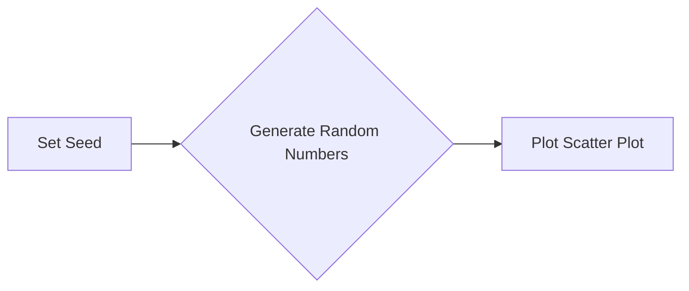

#### 带注释源码

```python
np.random.seed(19680801)  # Set the seed for reproducibility
```


### N

`N` is a global variable used to define the number of points to be used in the scatter plot.

参数：

- `N`：`int`，Number of points to be used in the scatter plot. It is set to 150 by default.

返回值：无

#### 流程图

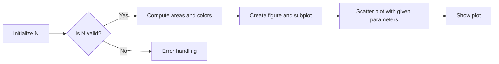

#### 带注释源码

```python
# Fixing random state for reproducibility
np.random.seed(19680801)

# Compute areas and colors
N = 150
r = 2 * np.random.rand(N)
theta = 2 * np.pi * np.random.rand(N)
area = 200 * r**2
colors = theta
```


### r = 2 * np.random.rand(N)

生成一个长度为N的随机浮点数数组，每个元素在0到2之间。

参数：

- `N`：`int`，表示数组的长度
- `np`：`numpy`，表示NumPy库
- `random`：`numpy.random`，表示NumPy随机数生成模块

返回值：`r`：`numpy.ndarray`，表示生成的随机浮点数数组

#### 流程图

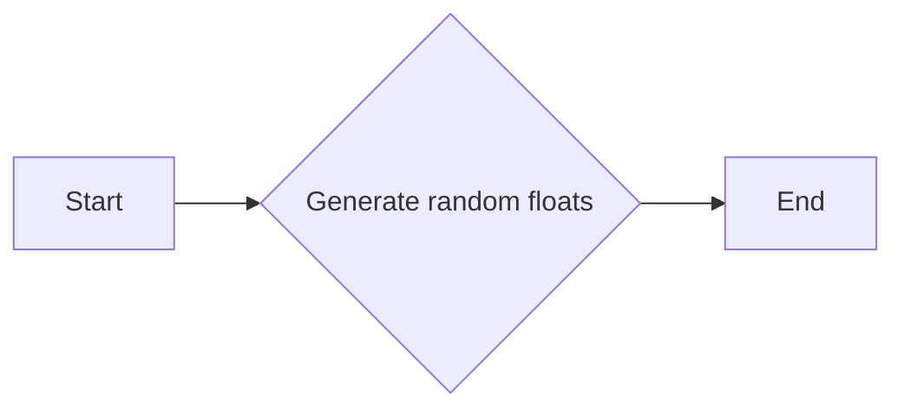

#### 带注释源码

```python
r = 2 * np.random.rand(N)
# 生成一个长度为N的随机浮点数数组，每个元素在0到2之间。
```


### theta = 2 * np.pi * np.random.rand(N)

生成一个长度为N的数组，其中每个元素是0到2π之间的随机浮点数。

参数：

- `N`：`int`，表示生成随机数的数量。它决定了数组的长度。

返回值：`numpy.ndarray`，一个包含随机浮点数的数组，每个元素在0到2π之间。

#### 流程图

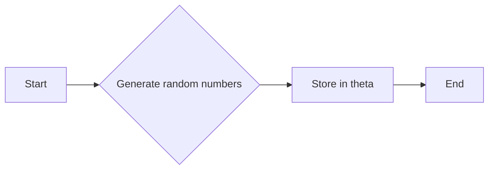

#### 带注释源码

```python
theta = 2 * np.pi * np.random.rand(N)
```


### area

计算给定半径的圆的面积。

参数：

- `r`：`numpy.ndarray`，圆的半径数组

返回值：`numpy.ndarray`，圆的面积数组

#### 流程图

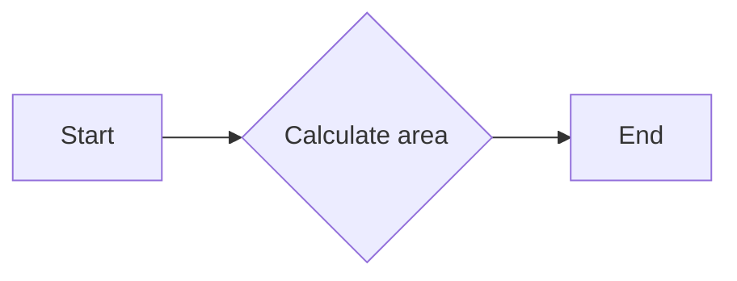

#### 带注释源码

```python
area = 200 * r**2
```


### colors = theta

This function assigns the `theta` values to the `colors` variable.

参数：

- `theta`：`numpy.ndarray`，随机生成的角度值，用于确定颜色。

返回值：`numpy.ndarray`，与 `theta` 相同的数组，用于设置颜色。

#### 流程图

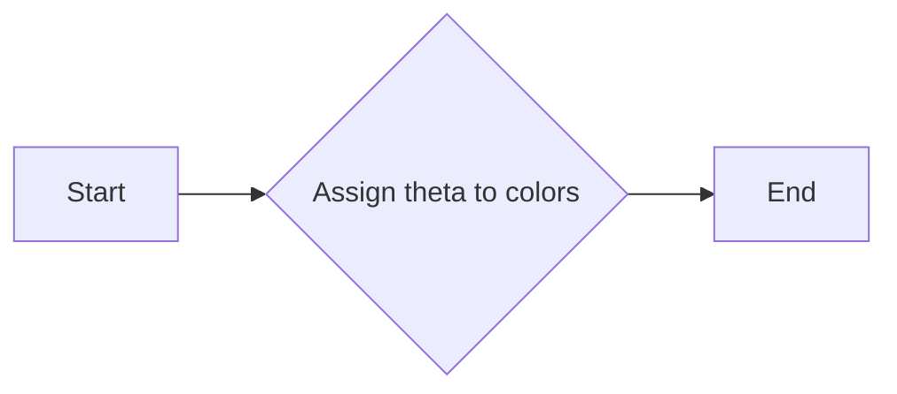

#### 带注释源码

```
colors = theta
```


### fig = plt.figure()

创建一个新的matplotlib图形对象。

参数：

- 无

返回值：`matplotlib.figure.Figure`，一个matplotlib图形对象，用于绘制图形。

#### 流程图

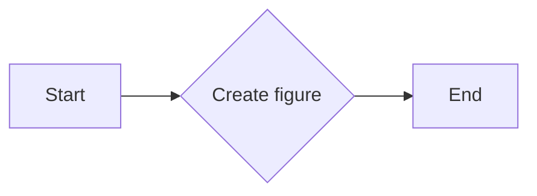

#### 带注释源码

```python
fig = plt.figure()  # 创建一个新的图形对象
```


### fig.add_subplot(projection='polar')

创建一个极坐标子图。

参数：

- `projection='polar'`：`str`，指定子图使用极坐标投影。

返回值：`matplotlib.projections.polar.PolarAxes`，极坐标子图对象。

#### 流程图

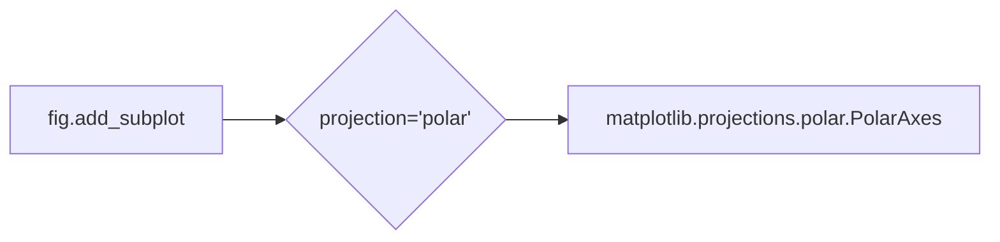

#### 带注释源码

```python
fig = plt.figure()
ax = fig.add_subplot(projection='polar')
```

在这个例子中，`fig` 是一个 `matplotlib.figure.Figure` 对象，它代表一个图形窗口。`add_subplot` 方法用于向图形中添加一个子图，其中 `projection='polar'` 参数指定了子图使用极坐标投影。返回的 `ax` 是一个 `matplotlib.projections.polar.PolarAxes` 对象，它提供了绘制极坐标图所需的接口。


### ax.scatter

该函数用于在极坐标轴上绘制散点图。

参数：

- `theta`：`numpy.ndarray`，极坐标的角度值。
- `r`：`numpy.ndarray`，极坐标的半径值。
- `c`：`numpy.ndarray`，颜色值，用于散点图的颜色映射。
- `s`：`numpy.ndarray`，散点的大小。
- `cmap`：`str`或`Colormap`实例，颜色映射的名称或实例。
- `alpha`：`float`，散点的透明度。

返回值：`scatter`对象，表示绘制的散点图。

#### 流程图

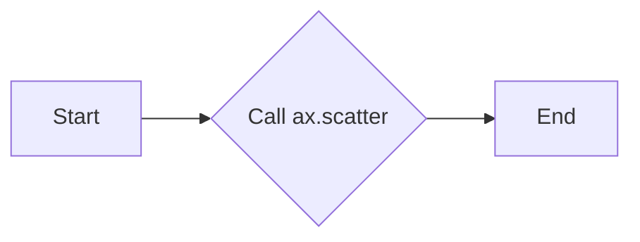

#### 带注释源码

```python
c = ax.scatter(theta, r, c=colors, s=area, cmap='hsv', alpha=0.75)
```


### ax.set_rorigin(-2.5)

设置极坐标图中原点的径向位置。

参数：

- `origin`：`float`，指定原点的径向位置。正值表示向右移动，负值表示向左移动。

返回值：无

#### 流程图

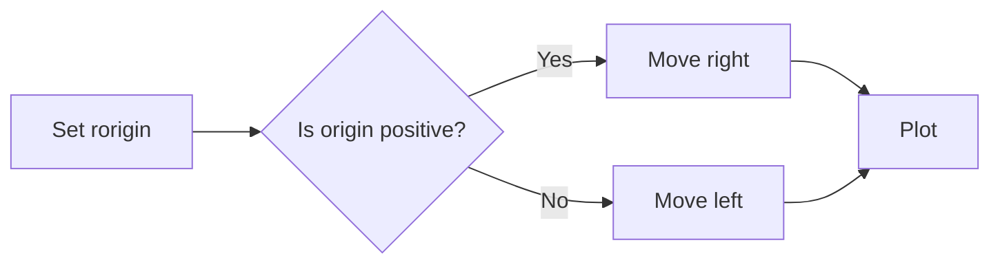

#### 带注释源码

```python
ax.set_rorigin(-2.5)
```

在这段代码中，`ax.set_rorigin(-2.5)` 被调用来将极坐标图的原点向左移动 2.5 个单位。这意味着所有的径向数据都会相对于新的原点进行绘制，从而产生一个偏移的极坐标图。


### ax.set_theta_zero_location('W', offset=10)

This function sets the location of the zero degree (or 0 radians) on the polar plot to the west direction with an offset of 10 units.

参数：

- `location`：`str`，指定零度位置的方向，'W' 表示西方向。
- `offset`：`int`，指定从零度位置到实际零度位置的偏移量。

返回值：`None`，此函数没有返回值。

#### 流程图

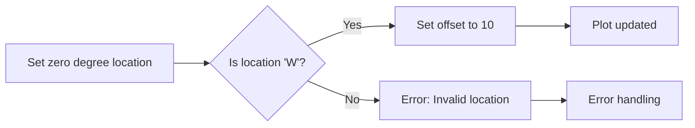

#### 带注释源码

```python
ax.set_theta_zero_location('W', offset=10)
# This line sets the zero degree location to the west direction with an offset of 10 units.
# The function does not return any value.
```


### ax.set_thetamin(45)

`set_thetamin` 方法用于设置极坐标图中角度的最小值。

参数：

- `45`：`int`，表示角度的最小值，单位为度。

返回值：无，该方法不返回任何值。

#### 流程图

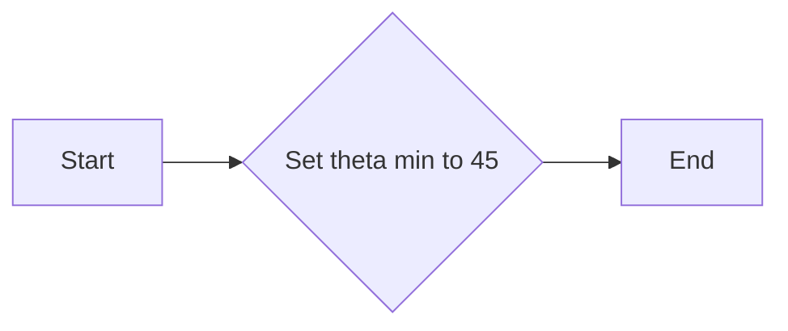

#### 带注释源码

```python
# 设置角度的最小值为45度
ax.set_thetamin(45)
```


### ax.set_thetamax(135)

`set_thetamax` 方法用于设置极坐标图中 theta 轴的最大值。

参数：

- `135`：`int`，表示 theta 轴的最大值，单位为度。

返回值：无，该方法不返回任何值。

#### 流程图

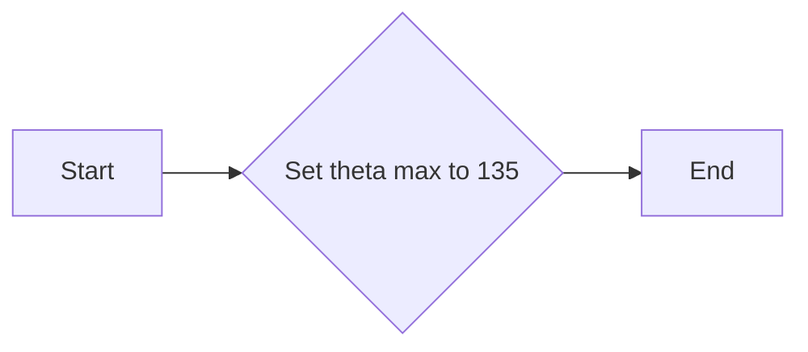

#### 带注释源码

```python
# Scatter plot on polar axis confined to a sector
# -----------------------------------------------
#
# The main difference with the previous plots is the configuration of the
# theta start and end limits, producing a sector instead of a full circle.

fig = plt.figure()
ax = fig.add_subplot(projection='polar')
c = ax.scatter(theta, r, c=colors, s=area, cmap='hsv', alpha=0.75)

ax.set_thetamin(45)  # Set the minimum theta value
ax.set_thetamax(135) # Set the maximum theta value
```


### plt.show()

显示所有当前图形。

参数：

- 无

返回值：无

#### 流程图

```mermaid
graph LR
A[开始] --> B{调用plt.show()}
B --> C[结束]
```

#### 带注释源码

```
plt.show()
```


## 关键组件


### 张量索引

张量索引用于在多维数组（张量）中定位和访问特定元素。

### 惰性加载

惰性加载是一种延迟计算或初始化数据的技术，直到实际需要时才进行，以提高性能和资源利用率。

### 反量化支持

反量化支持是指系统或算法能够处理非整数数据类型，如浮点数，以提供更精确的计算结果。

### 量化策略

量化策略是指将高精度数据（如浮点数）转换为低精度数据（如整数）的过程，以减少计算资源消耗和提高效率。


## 问题及建议


### 已知问题

-   **代码重复性**：在代码中，`fig` 和 `ax` 的创建和配置被重复了三次，每次都是相同的操作。这增加了代码的维护难度，并且可能导致错误。
-   **全局变量**：代码中使用了全局变量 `N`、`r`、`theta`、`area` 和 `colors`，这些变量在每次循环中都被重新定义。这可能导致变量作用域不清晰，增加出错的可能性。
-   **注释**：虽然代码中包含了一些注释，但它们并不详细，不足以解释代码的每个部分和目的。

### 优化建议

-   **减少代码重复**：将 `fig` 和 `ax` 的创建和配置提取到一个单独的函数中，并在每个循环调用该函数。
-   **使用局部变量**：将全局变量替换为局部变量，并在函数中传递这些变量，以确保变量作用域清晰。
-   **增强注释**：为每个函数和重要的代码块添加详细的注释，解释其目的和操作。
-   **代码结构**：考虑将代码分解为多个函数，每个函数负责一个特定的任务，以提高代码的可读性和可维护性。
-   **异常处理**：添加异常处理来捕获可能发生的错误，例如在绘图过程中可能出现的错误。
-   **代码风格**：遵循一致的代码风格指南，以提高代码的可读性和一致性。


## 其它


### 设计目标与约束

- 设计目标：实现一个在极坐标轴上的散点图，展示不同大小的点和颜色。
- 约束条件：使用matplotlib库进行绘图，确保代码的可复现性和可读性。

### 错误处理与异常设计

- 错误处理：代码中未包含显式的错误处理机制，但应确保所有外部库调用都在try-except块中，以捕获并处理可能发生的异常。
- 异常设计：对于matplotlib库的调用，应定义适当的异常处理策略，例如在绘图失败时提供错误信息。

### 数据流与状态机

- 数据流：数据流从随机生成的极坐标角度和半径开始，然后通过matplotlib库进行可视化。
- 状态机：代码中没有明确的状态机，但绘图函数的调用顺序定义了执行流程。

### 外部依赖与接口契约

- 外部依赖：代码依赖于matplotlib和numpy库。
- 接口契约：matplotlib库的接口契约用于创建和配置极坐标轴，以及绘制散点图。


    