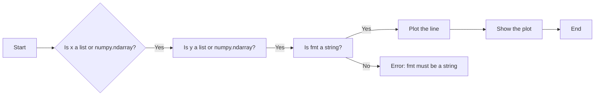
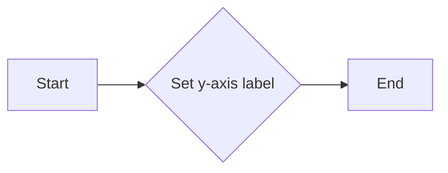

# `matplotlib\galleries\examples\pyplots\pyplot_simple.py` 详细设计文档

This code generates a simple plot where a list of numbers are plotted against their index, resulting in a straight line.

## 整体流程

```mermaid
graph TD
    A[开始] --> B[导入matplotlib.pyplot模块]
    B --> C[调用plt.plot()绘制图形]
    C --> D[设置y轴标签]
    D --> E[显示图形]
    E --> F[结束]
```

## 类结构

```
matplotlib.pyplot
```

## 全局变量及字段


### `matplotlib.pyplot`
    
A module for creating static, animated, and interactive visualizations in Python.

类型：`module`
    


### `matplotlib.pyplot.plot`
    
Plots a line or lines on a plot.

类型：`function`
    


### `matplotlib.pyplot.ylabel`
    
Sets the label for the y-axis of the current axes.

类型：`function`
    


### `matplotlib.pyplot.show`
    
Displays the figure.

类型：`function`
    
    

## 全局函数及方法


### matplotlib.pyplot.plot

matplotlib.pyplot.plot 是一个用于绘制二维数据的函数。

参数：

- `[x]`：`list` 或 `numpy.ndarray`，x轴的数据点。
- `[y]`：`list` 或 `numpy.ndarray`，y轴的数据点。
- `[fmt]`：`str`，用于指定标记、线型和颜色。
- `[data]`：`dict`，包含额外的绘图参数。
- `[**kwargs]`：`dict`，传递给绘图函数的其他关键字参数。

返回值：`Line2D`，绘制的线对象。

#### 流程图



#### 带注释源码

```python
import matplotlib.pyplot as plt

# x轴数据点
x = [1, 2, 3, 4]
# y轴数据点
y = [1, 2, 3, 4]
# 绘制线，使用圆圈标记、实线和红色
plt.plot(x, y, 'o-r')
# 设置y轴标签
plt.ylabel('some numbers')
# 显示图形
plt.show()
```


### matplotlib.pyplot.ylabel

matplotlib.pyplot.ylabel 是一个用于设置当前轴的 y 轴标签的函数。

参数：

- `label`：`str`，要设置的 y 轴标签的文本。

返回值：`None`，没有返回值，该函数用于设置标签，不返回任何值。

#### 流程图



#### 带注释源码

```python
# 设置 y 轴标签
plt.ylabel('some numbers')
```


### matplotlib.pyplot.show

matplotlib.pyplot.show 是一个全局函数，用于显示当前图形。

参数：

- 无参数

返回值：无返回值，该函数用于显示图形，不返回任何值。

#### 流程图

```mermaid
graph LR
A[Start] --> B[Call plt.show()]
B --> C[End]
```

#### 带注释源码

```
# 显示当前图形
plt.show()
```


### matplotlib.pyplot.plot

matplotlib.pyplot.plot 是一个全局函数，用于绘制二维数据。

参数：

- x：`array_like`，x轴的数据点。
- y：`array_like`，y轴的数据点。
- fmt：`str`，用于设置标记、线型和颜色。

返回值：`Line2D`，表示绘制的线。

#### 流程图

```mermaid
graph LR
A[Start] --> B[Call plt.plot()]
B --> C[End]
```

#### 带注释源码

```
# 绘制二维数据
plt.plot([1, 2, 3, 4], 'o-r')
```


### matplotlib.pyplot.ylabel

matplotlib.pyplot.ylabel 是一个全局函数，用于设置y轴标签。

参数：

- label：`str`，y轴标签的文本。

返回值：无返回值。

#### 流程图

```mermaid
graph LR
A[Start] --> B[Call plt.ylabel()]
B --> C[End]
```

#### 带注释源码

```
# 设置y轴标签
plt.ylabel('some numbers')
```

## 关键组件


### 张量索引

张量索引用于访问和操作多维数组中的元素。

### 惰性加载

惰性加载是一种延迟计算或初始化数据的技术，直到实际需要时才进行。

### 反量化支持

反量化支持允许在代码中处理未知的量化值，通常用于处理动态数据。

### 量化策略

量化策略定义了如何将浮点数转换为固定点数或整数表示，以减少计算资源的使用。


## 问题及建议


### 已知问题

-   **代码复用性低**：代码仅用于绘制一个简单的折线图，没有提供通用接口或参数化配置，导致无法复用于其他数据集或图表类型。
-   **错误处理缺失**：代码中没有错误处理机制，如果matplotlib库不可用或数据格式不正确，程序可能会崩溃。
-   **文档不足**：代码注释和文档描述有限，对于不熟悉matplotlib库的用户来说，难以理解代码的功能和使用方法。

### 优化建议

-   **增加代码复用性**：将绘图逻辑封装成一个函数或类，允许用户传入不同的数据集和配置参数，提高代码的通用性和可复用性。
-   **添加错误处理**：在代码中添加异常处理，确保在matplotlib库不可用或数据格式错误时，程序能够优雅地处理错误并给出有用的错误信息。
-   **完善文档**：编写详细的文档，包括函数或类的说明、参数说明、返回值说明以及示例代码，帮助用户更好地理解和使用代码。
-   **考虑性能优化**：如果数据集很大，绘制图表可能会很慢。可以考虑使用更高效的绘图库或优化绘图算法来提高性能。
-   **国际化支持**：如果代码被用于国际项目，应考虑添加国际化支持，以便在不同语言环境中正确显示文本。


## 其它


### 设计目标与约束

- 设计目标：实现一个简单的绘图功能，将数字列表与其索引绘制成直线图。
- 约束条件：使用matplotlib库进行绘图，遵循matplotlib的绘图规范。

### 错误处理与异常设计

- 错误处理：确保输入的数字列表不为空，否则抛出异常。
- 异常设计：捕获matplotlib绘图过程中可能出现的异常，并给出相应的错误信息。

### 数据流与状态机

- 数据流：输入数字列表 -> 绘制图形 -> 显示图形。
- 状态机：程序从初始化开始，经过绘图和显示图形两个状态，最终结束。

### 外部依赖与接口契约

- 外部依赖：matplotlib库。
- 接口契约：遵循matplotlib的绘图接口规范。


    