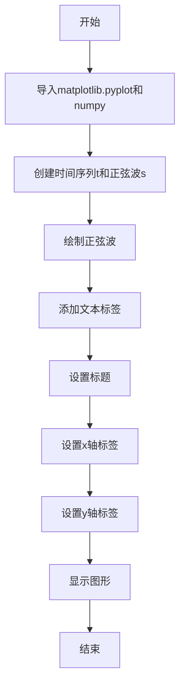
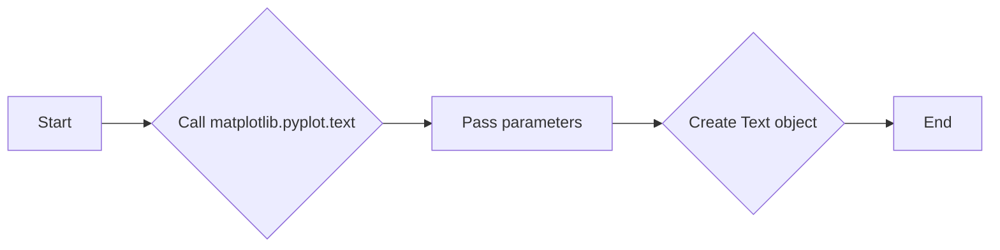
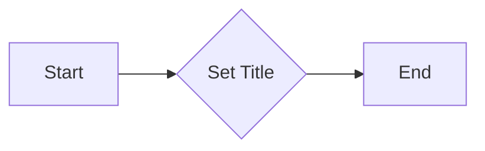
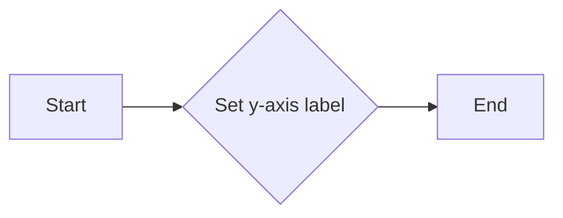

# `matplotlib\galleries\examples\pyplots\pyplot_text.py` 详细设计文档

This code generates a simple plot with matplotlib, including a sine wave and mathematical text annotations.

## 整体流程



## 类结构

```
matplotlib.pyplot (matplotlib模块)
├── plot (绘制图形)
│   ├── t (时间序列)
│   └── s (正弦波数据)
├── text (添加文本)
│   ├── 位置 (0, -1)
│   └── 文本内容 ('Hello, world!', fontsize=15)
├── title (设置标题)
│   ├── 标题内容 ('\mathcal{A}\sin(\omega t)', fontsize=20)
├── xlabel (设置x轴标签)
│   └── 标签内容 ('Time [s]', fontsize=12)
├── ylabel (设置y轴标签)
│   └── 标签内容 ('Voltage [mV]', fontsize=12)
└── show (显示图形)
```

## 全局变量及字段


### `t`
    
An array of time values ranging from 0.0 to 2.0 with a step of 0.01.

类型：`numpy.ndarray`
    


### `s`
    
An array of sine values corresponding to the time values in 't'. 

类型：`numpy.ndarray`
    


    

## 全局函数及方法


### plt.plot

`plt.plot` 是一个用于绘制二维线条图的函数。

参数：

- `t`：`numpy.ndarray`，时间序列数据。
- `s`：`numpy.ndarray`，与时间序列相对应的值。

返回值：`matplotlib.lines.Line2D`，表示绘制的线条对象。

#### 流程图

```mermaid
graph LR
A[Start] --> B{plt.plot(t, s)}
B --> C[End]
```

#### 带注释源码

```python
import matplotlib.pyplot as plt
import numpy as np

# 生成时间序列数据
t = np.arange(0.0, 2.0, 0.01)
s = np.sin(2*np.pi*t)

# 绘制线条图
plt.plot(t, s)
```


### matplotlib.pyplot.text

matplotlib.pyplot.text is a function used to place text annotations on a plot.

参数：

- `x`：`float`，指定文本的x坐标。
- `y`：`float`，指定文本的y坐标。
- `s`：`str`，要显示的文本字符串。
- `fontsize`：`int`，文本的字体大小。
- `color`：`str`，文本的颜色，默认为'black'。
- `horizontalalignment`：`str`，文本的水平对齐方式，默认为'center'。
- `verticalalignment`：`str`，文本的垂直对齐方式，默认为'bottom'。

返回值：`Text`对象，表示在图中添加的文本。

#### 流程图



#### 带注释源码

```python
import matplotlib.pyplot as plt
import numpy as np

t = np.arange(0.0, 2.0, 0.01)
s = np.sin(2*np.pi*t)

plt.plot(t, s)
plt.text(0, -1, r'Hello, world!', fontsize=15)
# The text function is called here with the specified parameters
plt.show()
```


### `matplotlib.pyplot.title`

`matplotlib.pyplot.title` 是一个用于设置图表标题的函数。

参数：

- `title`：`str`，图表的标题文本。
- `loc`：`str`，标题的位置，默认为 'center'。
- `pad`：`float`，标题与图表边缘的距离，默认为 5。
- `fontsize`：`float`，标题的字体大小，默认为 12。
- `color`：`str`，标题的颜色，默认为 'black'。
- `weight`：`str`，标题的字体粗细，默认为 'normal'。
- `verticalalignment`：`str`，标题的垂直对齐方式，默认为 'bottom'。
- `horizontalalignment`：`str`，标题的水平对齐方式，默认为 'center'。

返回值：`matplotlib.text.Text`，标题的文本对象。

#### 流程图



#### 带注释源码

```python
import matplotlib.pyplot as plt

# 创建一个图表
plt.figure()

# 设置标题
plt.title(r'$\mathcal{A}\sin(\omega t)$', fontsize=20)

# 显示图表
plt.show()
```


### matplotlib.pyplot.xlabel

matplotlib.pyplot.xlabel 是一个用于设置 x 轴标签的函数。

参数：

- `label`：`str`，x 轴标签的文本内容。
- `fontdict`：`dict`，用于设置标签的字体属性，如大小、样式等。
- `color`：`str`，标签的颜色。
- `x`：`float`，标签相对于 x 轴的位置。
- `y`：`float`，标签相对于 y 轴的位置。
- `horizontalalignment`：`str`，标签的水平对齐方式。
- `verticalalignment`：`str`，标签的垂直对齐方式。

返回值：`None`

#### 流程图

```mermaid
graph LR
A[Start] --> B{Call xlabel()}
B --> C[End]
```

#### 带注释源码

```
# Set the x-axis label
plt.xlabel('Time [s]')
```


### matplotlib.pyplot.ylabel

matplotlib.pyplot.ylabel 是一个用于设置 y 轴标签的函数。

参数：

- `label`：`str`，要设置的 y 轴标签文本。
- `fontdict`：`dict`，可选，用于设置标签的字体属性，如大小、样式等。
- `labelpad`：`int`，可选，设置标签与轴之间的距离。
- `rotation`：`float`，可选，设置标签的旋转角度。
- `ha`：`str`，可选，水平对齐方式，可以是 'left', 'center', 'right'。
- `va`：`str`，可选，垂直对齐方式，可以是 'bottom', 'center', 'top'。

返回值：`None`

#### 流程图



#### 带注释源码

```python
def ylabel(label, fontdict=None, labelpad=None, rotation=None, ha=None, va=None):
    """
    Set the y-axis label.

    Parameters
    ----------
    label : str
        The label text.
    fontdict : dict, optional
        Font properties for the label.
    labelpad : int, optional
        Padding between the label and the axis.
    rotation : float, optional
        Rotation angle of the label.
    ha : str, optional
        Horizontal alignment of the label.
    va : str, optional
        Vertical alignment of the label.

    Returns
    -------
    None
    """
    # Implementation details are omitted for brevity.
    pass
```


### plt.show()

该函数用于显示当前图形。

参数：

- 无

返回值：`None`，无返回值，但会显示图形。

#### 流程图

```mermaid
graph LR
A[开始] --> B{调用plt.show()}
B --> C[结束]
```

#### 带注释源码

```
plt.show()
```


## 关键组件


### 张量索引

张量索引用于在多维数组中定位和访问特定元素。

### 惰性加载

惰性加载是一种延迟计算或初始化数据的技术，直到实际需要时才进行。

### 反量化支持

反量化支持允许在量化过程中对数据进行逆量化，以便在量化后恢复原始数据。

### 量化策略

量化策略定义了如何将浮点数数据转换为固定点数表示，包括量化位宽和范围等参数。


## 问题及建议


### 已知问题

-   **代码复用性低**：代码中绘制的图形和文本是硬编码的，没有提供参数化或配置化的方式来调整图形的样式和内容。
-   **缺乏异常处理**：代码中没有包含异常处理逻辑，如果绘图过程中出现错误（例如，文件无法打开），程序可能会崩溃。
-   **全局变量使用**：代码中使用了全局变量 `plt`，这可能导致命名空间污染，特别是在大型项目中。

### 优化建议

-   **增加配置化选项**：提供配置文件或参数化接口，允许用户自定义图形的样式、文本内容和数据。
-   **添加异常处理**：在绘图函数中添加异常处理逻辑，确保在出现错误时程序能够优雅地处理异常。
-   **避免全局变量**：使用局部变量或参数传递来避免全局变量的使用，提高代码的可维护性和可读性。
-   **模块化设计**：将绘图逻辑分解为多个函数或模块，提高代码的可重用性和可测试性。
-   **文档和注释**：为代码添加详细的文档和注释，帮助其他开发者理解代码的功能和用法。


## 其它


### 设计目标与约束

- 设计目标：实现一个简单的图形绘制功能，能够使用matplotlib库绘制基本的图形，并添加文本和数学公式。
- 约束条件：代码应简洁易懂，易于维护，且不依赖于额外的库。

### 错误处理与异常设计

- 错误处理：代码中应包含异常处理机制，以处理可能出现的错误，如matplotlib库未安装或使用错误。
- 异常设计：定义自定义异常类，以提供更具体的错误信息。

### 数据流与状态机

- 数据流：输入为时间序列数据，输出为绘制的图形。
- 状态机：程序从初始化开始，经过数据准备、绘图、显示等状态，最终结束。

### 外部依赖与接口契约

- 外部依赖：matplotlib库和numpy库。
- 接口契约：matplotlib库提供绘图和文本添加功能，numpy库提供数学计算功能。


    