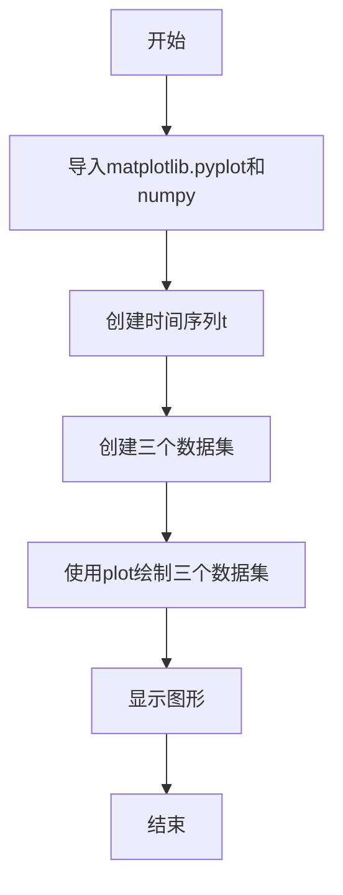
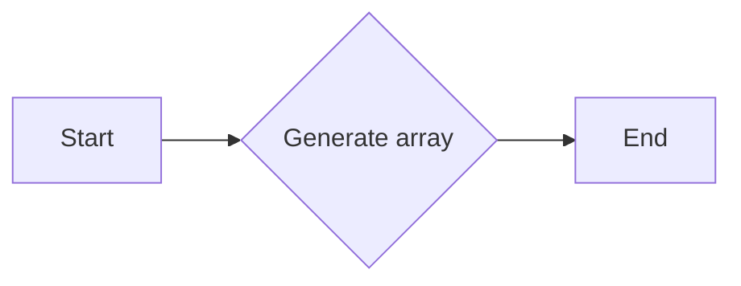
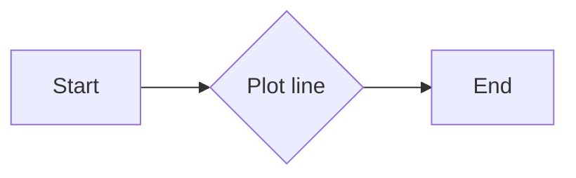
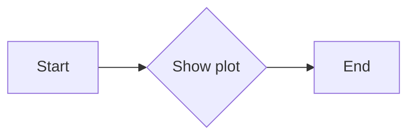
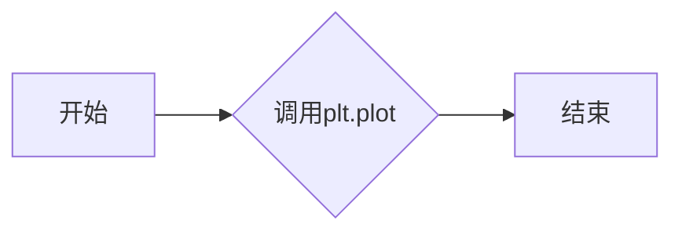
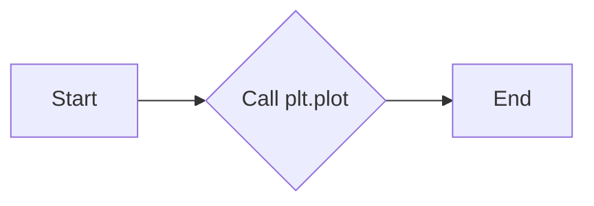

# `matplotlib\galleries\examples\pyplots\pyplot_three.py` 详细设计文档

This script generates a plot with three different datasets using matplotlib and numpy.

## 整体流程



## 类结构

```
matplotlib.pyplot
├── plot(t, t, 'r--', t, t**2, 'bs', t, t**3, 'g^')
```

## 全局变量及字段


### `t`
    
An array of evenly sampled time values at 200ms intervals used for plotting.

类型：`numpy.ndarray`
    


    

## 全局函数及方法


### np.arange

`np.arange` 是 NumPy 库中的一个函数，用于生成一个在指定范围内的浮点数数组。

参数：

- `start`：`int`，数组的起始值。
- `stop`：`int`，数组的结束值，但不包括该值。
- `step`：`int`，步长，默认为 1。

返回值：`numpy.ndarray`，一个指定范围内的浮点数数组。

#### 流程图



#### 带注释源码

```
import numpy as np

# evenly sampled time at 200ms intervals
t = np.arange(0., 5., 0.2)
```


### matplotlib.pyplot.plot

`matplotlib.pyplot.plot` 是 Matplotlib 库中的一个函数，用于绘制二维数据。

参数：

- `x`：`array_like`，x 轴数据。
- `y`：`array_like`，y 轴数据。
- `fmt`：`str`，用于指定线型、颜色和标记的字符串。
- ...

返回值：`Line2D`，绘制的线对象。

#### 流程图



#### 带注释源码

```
# red dashes, blue squares and green triangles
plt.plot(t, t, 'r--', t, t**2, 'bs', t, t**3, 'g^')
```


### matplotlib.pyplot.show

`matplotlib.pyplot.show` 是 Matplotlib 库中的一个函数，用于显示图形。

参数：

- `block`：`bool`，如果为 True，则等待用户关闭图形窗口。

返回值：无。

#### 流程图



#### 带注释源码

```
plt.show()
```


### plt.plot

`plt.plot` 是一个用于绘制二维线条图的函数。

参数：

- `t`：`numpy.ndarray`，时间序列，用于定义线条图的 x 轴数据。
- `'r--'`：`str`，线条样式，这里表示红色虚线。
- `t`：`numpy.ndarray`，数据序列，用于定义线条图的 y 轴数据。
- `'bs'`：`str`，线条样式，这里表示蓝色方块。
- `t**2`：`numpy.ndarray`，数据序列，用于定义线条图的 y 轴数据。
- `'g^'`：`str`，线条样式，这里表示绿色三角形。

返回值：`None`，该函数不返回任何值，它直接在当前图形上绘制线条。

#### 流程图



#### 带注释源码

```
import matplotlib.pyplot as plt
import numpy as np

# evenly sampled time at 200ms intervals
t = np.arange(0., 5., 0.2)

# red dashes, blue squares and green triangles
plt.plot(t, 'r--', t, 'bs', t, t**2, 'g^')
plt.show()
```


### plt.show()

`plt.show()` 是一个全局函数，用于显示当前图形。

参数：

- 无

返回值：`None`，该函数不返回任何值，其作用是显示当前图形。

#### 流程图

```mermaid
graph LR
A[Start] --> B[Call plt.show()]
B --> C[Display Plot]
C --> D[End]
```

#### 带注释源码

```
# evenly sampled time at 200ms intervals
t = np.arange(0., 5., 0.2)

# red dashes, blue squares and green triangles
plt.plot(t, t, 'r--', t, t**2, 'bs', t, t**3, 'g^')

# Show the plot
plt.show()
```


### `matplotlib.pyplot.plot`

`matplotlib.pyplot.plot` 是一个用于绘制二维线条图的函数。

参数：

- `t`：`numpy.ndarray`，时间序列，用于定义线条图中的x轴值。
- `'r--'`：`str`，线条样式，这里表示红色虚线。
- `t`：`numpy.ndarray`，y轴值，与`t`对应，用于定义线条图中的y轴值。
- `'bs'`：`str`，线条样式，这里表示蓝色方块。
- `t**2`：`numpy.ndarray`，y轴值，与`t`对应，用于定义线条图中的y轴值。
- `'g^'`：`str`，线条样式，这里表示绿色三角形。

返回值：`matplotlib.lines.Line2D`，线条对象，表示绘制的线条。

#### 流程图



#### 带注释源码

```python
import matplotlib.pyplot as plt
import numpy as np

# evenly sampled time at 200ms intervals
t = np.arange(0., 5., 0.2)

# red dashes, blue squares and green triangles
plt.plot(t, 'r--', t, t**2, 'bs', t, t**3, 'g^')
plt.show()
```


## 关键组件


### 张量索引

张量索引是用于访问和操作多维数组（张量）中特定元素的方法。

### 惰性加载

惰性加载是一种延迟计算或初始化数据的方法，直到实际需要时才进行，以优化性能和资源使用。

### 反量化支持

反量化支持是指系统或库能够处理和操作非量化数据，以便在需要时进行量化处理。

### 量化策略

量化策略是指将浮点数数据转换为固定点数表示的方法，以减少计算资源的使用和提高效率。


## 问题及建议


### 已知问题

-   **代码复用性低**：代码仅用于展示如何使用`matplotlib.pyplot.plot`一次性绘制多个数据集，缺乏通用性，无法适应不同的数据集和绘图需求。
-   **注释不足**：代码块中包含的注释仅描述了代码的功能，但没有提供详细的实现细节和设计思路。
-   **缺乏错误处理**：代码没有包含错误处理机制，如果遇到绘图库不可用或数据问题，程序可能会崩溃。

### 优化建议

-   **封装绘图逻辑**：将绘图逻辑封装成一个函数或类，以便在不同的上下文中重用，并接受参数以适应不同的数据集和绘图选项。
-   **增加详细的注释**：在代码中添加详细的注释，解释每个函数和代码块的目的，以及如何使用它们。
-   **实现错误处理**：添加异常处理机制，确保在遇到错误时程序能够优雅地处理异常，并提供有用的错误信息。
-   **考虑性能优化**：如果数据集非常大，可以考虑使用更高效的绘图方法，例如使用`Agg`后端进行离屏渲染，或者使用`blit`技术减少重绘次数。
-   **文档化**：为代码编写文档，包括如何安装依赖、如何使用代码以及代码的局限性。


## 其它


### 设计目标与约束

- 设计目标：实现一个能够使用matplotlib库一次性绘制三个数据集的函数。
- 约束条件：必须使用matplotlib库进行绘图，且代码应简洁高效。

### 错误处理与异常设计

- 错误处理：确保在绘图过程中，如果发生matplotlib库相关的错误，能够给出清晰的错误信息。
- 异常设计：对于可能出现的异常，如数据类型不匹配等，应设计相应的异常处理机制。

### 数据流与状态机

- 数据流：输入数据通过numpy生成，经过matplotlib的plot函数处理后，输出图形。
- 状态机：程序从数据生成到绘图展示，没有复杂的状态转换，属于线性流程。

### 外部依赖与接口契约

- 外部依赖：依赖于matplotlib和numpy库。
- 接口契约：matplotlib的plot函数接口用于绘图，numpy的arange函数用于生成时间序列数据。


    