# `matplotlib\galleries\examples\pyplots\pyplot_two_subplots.py` 详细设计文档

该代码是一个matplotlib数据可视化示例程序，通过pyplot模块创建一个包含两个子图的图表。上子图展示衰减余弦函数 f(t)=e^(-t)*cos(2πt) 在两组不同采样率下的对比曲线，下子图展示余弦函数 cos(2πt) 的曲线，用于演示matplotlib子图布局和绑图功能。

## 整体流程

```mermaid
graph TD
    A[开始] --> B[导入模块]
    B --> C[定义函数 f(t) = exp(-t) * cos(2πt)]
    C --> D[生成时间数组 t1 和 t2]
    D --> E[创建新图表 plt.figure()]
    E --> F[创建上子图 plt.subplot(211)]
    F --> G[绑制 f(t1) 曲线 - 蓝色带圆点标记]
    G --> H[绑制 f(t2) 曲线 - 黑色]
    H --> I[创建下子图 plt.subplot(212)]
    I --> J[绑制 cos(2πt2) 曲线 - 橙色虚线]
    J --> K[显示图表 plt.show()]
    K --> L[结束]
```

## 类结构

```
该代码为脚本文件，无面向对象结构
所有代码均在模块级执行
使用 matplotlib.pyplot 和 numpy 两个外部库
```

## 全局变量及字段


### `t1`
    
时间数组，范围0.0-5.0，步长0.1

类型：`numpy.ndarray`
    


### `t2`
    
时间数组，范围0.0-5.0，步长0.02（更高采样率）

类型：`numpy.ndarray`
    


    

## 全局函数及方法


### `f`

计算衰减余弦值 `exp(-t) * cos(2πt)`，用于生成随时间衰减的振荡信号。

参数：

- `t`：`float` 或 `numpy.ndarray`，时间变量，可以是单个时间点或时间数组

返回值：`float` 或 `numpy.ndarray`，衰减余弦值，对应输入时间 t 的函数结果

#### 流程图

```mermaid
graph TD
    A[开始] --> B[输入参数 t]
    B --> C[计算 exp&#40;-t&#41;]
    B --> D[计算 cos&#40;2πt&#41;]
    C --> E[元素乘法: exp&#40;-t&#41; × cos&#40;2πt&#41;]
    D --> E
    E --> F[返回结果]
```



#### 带注释源码

```python
def f(t):
    """
    计算衰减余弦值 exp(-t) * cos(2πt)
    
    参数:
        t: 时间变量，可以是标量或numpy数组
    
    返回:
        衰减余弦值，类型与输入t相同
    """
    return np.exp(-t) * np.cos(2*np.pi*t)
```

## 关键组件


### 函数 f(t)

数学函数，计算并返回 exp(-t) * cos(2πt) 的值，用于生成衰减振荡波形数据

### 数组 t1

时间数组，范围 0.0 到 5.0，步长 0.1，用于第一组数据的 x 轴坐标

### 数组 t2

时间数组，范围 0.0 到 5.0，步长 0.02，用于第二组数据的 x 轴坐标，提供更高的时间分辨率

### plt.figure()

Matplotlib 图形创建函数，用于创建一个新的图形窗口

### plt.subplot(211)

Matplotlib 子图创建函数，在图形中创建 2 行 1 列布局的第一个子图（上方）

### plt.subplot(212)

Matplotlib 子图创建函数，在图形中创建 2 行 1 列布局的第二个子图（下方）

### plt.plot()

Matplotlib 绘图函数，用于在当前子图中绘制数据曲线，支持颜色、线型和标记样式参数

### plt.show()

Matplotlib 图形显示函数，用于渲染并显示所有创建的图形和子图


## 问题及建议


### 已知问题

-   **全局作用域污染**：函数 `f(t)` 定义在全局作用域，容易与其他模块的函数名冲突
-   **硬编码的魔法数字**：时间范围 (0.0, 5.0)、步长 (0.1, 0.02) 等数值散落在代码中，缺乏解释性命名
-   **子图布局硬编码**：使用 `211`、`212` 这样的数字指定子图位置，不够直观，难以动态调整
-   **重复的绘图参数**：颜色、线型等样式参数在多处重复出现，如 `color='tab:blue'`
-   **缺少类型标注**：函数参数和返回值没有类型提示，影响代码可读性和 IDE 支持
-   **缺乏函数封装**：核心逻辑全部在模块级别执行，无法作为函数被其他模块调用，缺乏可测试性
-   **颜色和样式未抽取为常量**：如 `'tab:blue'`、`'tab:orange'` 等应定义为命名常量
-   **资源管理不明确**：没有显式的图形窗口管理或资源释放注释

### 优化建议

-   将 `f(t)` 函数封装到独立的类或模块中，或添加命名空间前缀避免全局污染
-   将所有魔法数字提取为具名常量，如 `TIME_RANGE = (0.0, 5.0)`、`T1_STEP = 0.1` 等
-   使用 `plt.subplots(2, 1, ...)` 或 `GridSpec` 替代 `subplot` 数字编码，提高可读性
-   将颜色、线型等样式配置抽取为配置字典或 dataclass，提高复用性和可维护性
-   为函数添加类型注解，如 `def f(t: np.ndarray) -> np.ndarray: ...`
-   将绘图逻辑封装为函数，接受参数以增强可配置性和可测试性
-   添加详细的 docstring 说明函数用途、参数和返回值
-   考虑使用上下文管理器或显式 `plt.close()` 明确资源生命周期
-   将可配置的参数提取为配置文件或命令行参数，增强脚本的通用性


## 其它


### 设计目标与约束

本代码示例的核心目标是演示如何使用matplotlib创建包含两个子图的图表，并绑制不同的函数曲线。设计约束包括：依赖matplotlib和numpy两个外部库，需要Python科学计算环境支持，图表采用固定的2x1子图布局。

### 错误处理与异常设计

代码未实现显式的错误处理机制。潜在异常包括：导入模块失败（ImportError）、numpy数组生成异常、matplotlib后端初始化失败、图形窗口创建失败等。建议在实际项目中添加try-except块捕获异常，并提供用户友好的错误提示信息。

### 数据流与状态机

数据流如下：首先定义时间数组t1和t2作为输入数据，然后通过f(t)函数计算衰减余弦曲线数据，最后将数据传递给plt.plot()进行绑制。状态机流程为：创建画布(plt.figure) -> 创建子图区域(plt.subplot) -> 绑制数据(plt.plot) -> 显示图形(plt.show)。

### 外部依赖与接口契约

本代码依赖两个外部库：matplotlib.pyplot提供绑图API，numpy提供数值计算功能。接口契约包括：plt.figure()返回Figure对象，plt.subplot()返回Axes对象，plt.plot()返回Line2D对象列表，f(t)函数接受numpy数组并返回计算后的numpy数组。

### 配置参数说明

代码中涉及的可配置参数包括：子图布局参数(211/212表示2行1列第1/2个子图)、曲线样式参数(color指定颜色、marker指定标记、linestyle指定线型)、时间范围参数(0.0到5.0)、步长参数(0.1和0.02)。

### 性能考量

当前代码绑制数据量较小(t1有50个点，t2有250个点)，性能无明显瓶颈。若数据量增大，建议考虑：使用blitting技术优化动态绑图、减少不必要的数据点、使用set_data代替重新创建Line2D对象以提高绑制效率。

### 安全性考虑

本代码为演示脚本，安全性风险较低。潜在风险包括：未验证用户输入（虽然本例无用户输入）、图表输出可能包含敏感信息（建议在实际项目中注意数据脱敏）、matplotlib默认后端可能存在安全漏洞（建议使用Agg后端用于服务器端绑图）。

### 测试策略建议

建议添加以下测试用例：验证函数f(t)输出的数学正确性、验证子图数量和布局、验证曲线颜色和样式参数、验证plt.show()调用不抛出异常、验证在不同matplotlib后端下的兼容性。

### 扩展方向与使用建议

可扩展方向包括：添加图例(plt.legend)、添加坐标轴标签(plt.xlabel/ylabel)、添加标题(plt.title)、支持交互式工具条、保存图像到文件(plt.savefig)、封装为可复用的函数或类以支持不同数据源的绑制。

### 版本与环境要求

代码兼容Python 3.x环境，matplotlib建议版本≥3.0，numpy建议版本≥1.20。需要安装matplotlib和numpy库，建议通过pip install matplotlib numpy进行安装。


    