# `matplotlib\galleries\examples\scales\aspect_loglog.py` 详细设计文档

This code generates two log-log plots using matplotlib, demonstrating different adjustable settings for the plot's limits.

## 整体流程

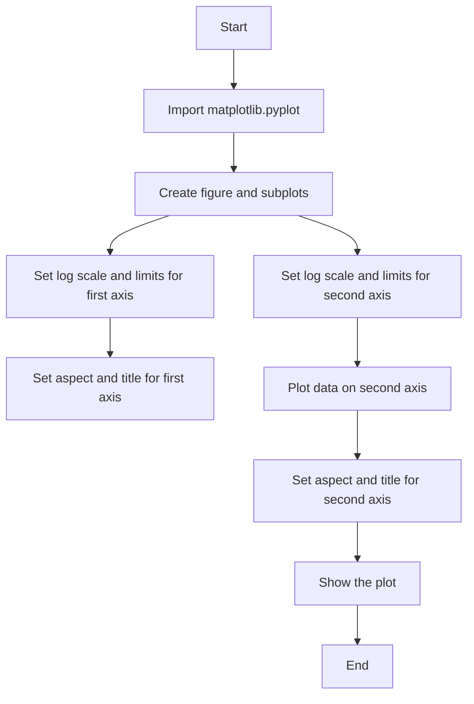

## 类结构

```
matplotlib.pyplot
```

## 全局变量及字段


### `fig`
    
The main figure object created by subplots.

类型：`matplotlib.figure.Figure`
    


### `ax1`
    
The first subplot with logarithmic scales and adjustable set to 'box'.

类型：`matplotlib.axes._subplots.AxesSubplot`
    


### `ax2`
    
The second subplot with logarithmic scales and adjustable set to 'datalim'.

类型：`matplotlib.axes._subplots.AxesSubplot`
    


### `matplotlib.pyplot.fig`
    
The main figure object created by subplots.

类型：`matplotlib.figure.Figure`
    


### `matplotlib.pyplot.ax1`
    
The first subplot with logarithmic scales and adjustable set to 'box'.

类型：`matplotlib.axes._subplots.AxesSubplot`
    


### `matplotlib.pyplot.ax2`
    
The second subplot with logarithmic scales and adjustable set to 'datalim'.

类型：`matplotlib.axes._subplots.AxesSubplot`
    
    

## 全局函数及方法


### plt.subplots

`subplots` 是 `matplotlib.pyplot` 模块中的一个函数，用于创建一个或多个子图。

参数：

- `nrows`：`int`，指定子图的行数。
- `ncols`：`int`，指定子图的列数。
- `sharex`：`bool`，如果为 `True`，则所有子图共享 x 轴。
- `sharey`：`bool`，如果为 `True`，则所有子图共享 y 轴。
- `fig`：`matplotlib.figure.Figure`，如果提供，则在该图上创建子图。
- `gridspec_kw`：`dict`，用于指定 `GridSpec` 的关键字参数。
- `constrained_layout`：`bool`，如果为 `True`，则使用 `constrained_layout` 自动调整子图参数。

返回值：`matplotlib.figure.Figure`，包含子图的图对象。

#### 流程图

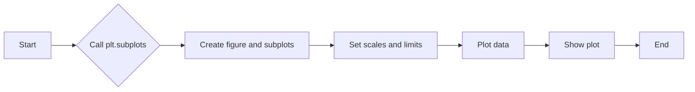

#### 带注释源码

```python
import matplotlib.pyplot as plt

fig, (ax1, ax2) = plt.subplots(1, 2)
# 创建一个包含两个子图的图对象
ax1.set_xscale("log")
ax1.set_yscale("log")
# 设置 x 轴和 y 轴为对数尺度
ax1.set_xlim(1e1, 1e3)
ax1.set_ylim(1e2, 1e3)
# 设置 x 轴和 y 轴的显示范围
ax1.set_aspect(1)
# 设置子图的纵横比
ax1.set_title("adjustable = box")
# 设置子图的标题

ax2.set_xscale("log")
ax2.set_yscale("log")
# 设置 x 轴和 y 轴为对数尺度
ax2.set_adjustable("datalim")
# 设置子图的调整方式为数据限制
ax2.plot([1, 3, 10], [1, 9, 100], "o-")
# 在子图上绘制数据点
ax2.set_xlim(1e-1, 1e2)
ax2.set_ylim(1e-1, 1e3)
# 设置 x 轴和 y 轴的显示范围
ax2.set_aspect(1)
# 设置子图的纵横比
ax2.set_title("adjustable = datalim")
# 设置子图的标题

plt.show()
# 显示图形
```


### matplotlib.pyplot.set_xscale

matplotlib.pyplot.set_xscale is a method used to set the scaling of the x-axis of a plot to logarithmic or linear.

参数：

- `scale`：`str`，指定x轴的缩放类型，可以是"linear"或"log"。

返回值：`None`，该方法不返回任何值。

#### 流程图

```mermaid
graph LR
A[Start] --> B{scale is "log"?}
B -- Yes --> C[Set x-axis to logarithmic scale]
B -- No --> D[Set x-axis to linear scale]
C --> E[End]
D --> E
```

#### 带注释源码

```
# Set the x-axis scaling to logarithmic
ax1.set_xscale("log")

# Set the x-axis scaling to linear
ax2.set_xscale("linear")
```


### matplotlib.pyplot.set_yscale

设置当前轴的y轴尺度。

参数：

- `scale`：`str`，指定y轴尺度类型，可以是"linear"、"log"、"symlog"、"logit"、"pow"或"sqrt"。

返回值：`None`，没有返回值。

#### 流程图

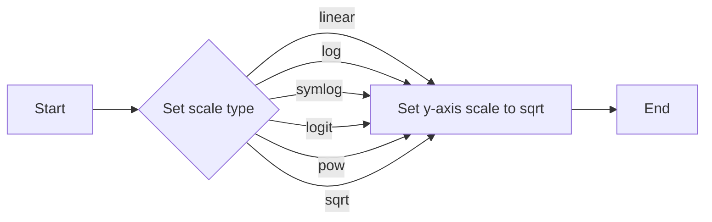

#### 带注释源码

```
# matplotlib.pyplot.set_yscale
# Set the y-axis scale of the current axis.
# Parameters:
# - scale: str, specify the type of y-axis scale, can be "linear", "log", "symlog", "logit", "pow" or "sqrt".
# Returns: None, no return value.

# Example usage:
# ax.set_yscale("log")
```


### matplotlib.pyplot.subplots

Create a figure and a set of subplots.

参数：

- `nrows`：`int`，Number of rows of subplots.
- `ncols`：`int`，Number of columns of subplots.
- `sharex`：`bool`，Whether the subplots share x-axis.
- `sharey`：`bool`，Whether the subplots share y-axis.
- `fig`：`matplotlib.figure.Figure`，Figure to which the subplots are added.
- `gridspec`：`matplotlib.gridspec.GridSpec`，GridSpec to which the subplots are added.
- `subplot_kw`：`dict`，Keyword arguments to be passed to each subplot.
- `fig_kw`：`dict`，Keyword arguments to be passed to the figure.

返回值：`matplotlib.figure.Figure`，The figure containing the subplots.

#### 流程图

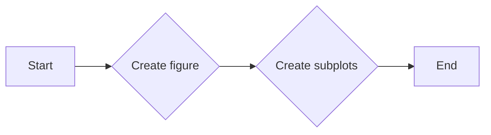

#### 带注释源码

```
# matplotlib.pyplot.subplots
# Create a figure and a set of subplots.
# Parameters:
# - nrows: int, number of rows of subplots.
# - ncols: int, number of columns of subplots.
# - sharex: bool, whether the subplots share x-axis.
# - sharey: bool, whether the subplots share y-axis.
# - fig: matplotlib.figure.Figure, figure to which the subplots are added.
# - gridspec: matplotlib.gridspec.GridSpec, GridSpec to which the subplots are added.
# - subplot_kw: dict, keyword arguments to be passed to each subplot.
# - fig_kw: dict, keyword arguments to be passed to the figure.
# Returns: matplotlib.figure.Figure, the figure containing the subplots.

# Example usage:
# fig, axs = plt.subplots(1, 2)
```


### matplotlib.pyplot.plot

Plot y versus x as lines and/or markers.

参数：

- `x`：`array_like`，The x data.
- `y`：`array_like`，The y data.
- `fmt`：`str`，The line style and marker symbol.
- `data`：`matplotlib.lines.Line2D`，The line2d object to be plotted.
- `label`：`str`，The label for the line.
- `color`：`color`，The color of the line.
- `linewidth`：`float`，The line width.
- `linestyle`：`str`，The line style.
- `marker`：`str`，The marker symbol.
- `markersize`：`float`，The marker size.
- `markeredgewidth`：`float`，The marker edge width.
- `markerfacecolor`：`color`，The marker face color.
- `markeredgecolor`：`color`，The marker edge color.
- `alpha`：`float`，The alpha blending value.
- `zorder`：`float`，The zorder of the line.
- `pickradius`：`float`，The pick radius.

返回值：`matplotlib.lines.Line2D`，The line2d object.

#### 流程图

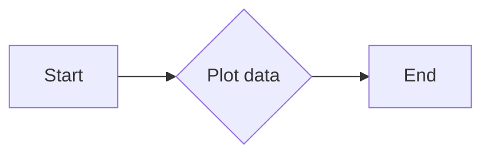

#### 带注释源码

```
# matplotlib.pyplot.plot
# Plot y versus x as lines and/or markers.
# Parameters:
# - x: array_like, the x data.
# - y: array_like, the y data.
# - fmt: str, the line style and marker symbol.
# - data: matplotlib.lines.Line2D, the line2d object to be plotted.
# - label: str, the label for the line.
# - color: color, the color of the line.
# - linewidth: float, the line width.
# - linestyle: str, the line style.
# - marker: str, the marker symbol.
# - markersize: float, the marker size.
# - markedgewidth: float, the marker edge width.
# - markerfacecolor: color, the marker face color.
# - markeredgecolor: color, the marker edge color.
# - alpha: float, the alpha blending value.
# - zorder: float, the zorder of the line.
# - pickradius: float, the pick radius.
# Returns: matplotlib.lines.Line2D, the line2d object.

# Example usage:
# ax.plot([1, 2, 3], [1, 4, 9], "o-")
```


### matplotlib.pyplot.show

Display a figure.

参数：

- `block`：`bool`，Whether to block until the figure is closed.
- `clear`：`bool`，Whether to clear the figure after displaying it.

返回值：`None`，没有返回值。

#### 流程图

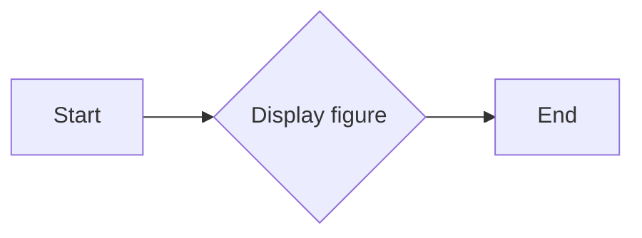

#### 带注释源码

```
# matplotlib.pyplot.show
# Display a figure.
# Parameters:
# - block: bool, whether to block until the figure is closed.
# - clear: bool, whether to clear the figure after displaying it.
# Returns: None, no return value.

# Example usage:
# plt.show()
```


### matplotlib.pyplot.set_xscale

Set the x-axis scale of the current axis.

参数：

- `scale`：`str`，指定x轴尺度类型，可以是"linear"、"log"、"symlog"、"logit"、"pow"或"sqrt"。

返回值：`None`，没有返回值。

#### 流程图


#### 带注释源码

```
# matplotlib.pyplot.set_xscale
# Set the x-axis scale of the current axis.
# Parameters:
# - scale: str, specify the type of x-axis scale, can be "linear", "log", "symlog", "logit", "pow" or "sqrt".
# Returns: None, no return value.

# Example usage:
# ax.set_xscale("log")
```


### matplotlib.pyplot.set_adjustable

Set the adjustable parameters for the current axis.

参数：

- `mode`：`str`，The mode of adjustment, can be "box", "datalim", "none", or "datalim, box".

返回值：`None`，没有返回值。

#### 流程图

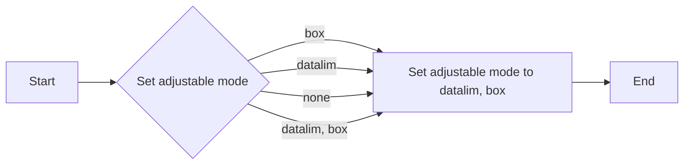

#### 带注释源码

```
# matplotlib.pyplot.set_adjustable
# Set the adjustable parameters for the current axis.
# Parameters:
# - mode: str, the mode of adjustment, can be "box", "datalim", "none", or "datalim, box".
# Returns: None, no return value.

# Example usage:
# ax.set_adjustable("datalim")
```


### matplotlib.pyplot.set_xlim

Set the x-axis limits of the current axis.

参数：

- `xmin`：`float`，The minimum x-axis limit.
- `xmax`：`float`，The maximum x-axis limit.

返回值：`None`，没有返回值。

#### 流程图

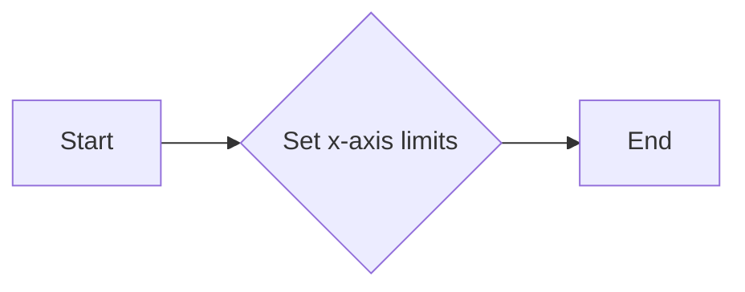

#### 带注释源码

```
# matplotlib.pyplot.set_xlim
# Set the x-axis limits of the current axis.
# Parameters:
# - xmin: float, the minimum x-axis limit.
# - xmax: float, the maximum x-axis limit.
# Returns: None, no return value.

# Example usage:
# ax.set_xlim(1e-1, 1e2)
```


### matplotlib.pyplot.set_ylim

Set the y-axis limits of the current axis.

参数：

- `ymin`：`float`，The minimum y-axis limit.
- `ymax`：`float`，The maximum y-axis limit.

返回值：`None`，没有返回值。

#### 流程图


#### 带注释源码

```
# matplotlib.pyplot.set_ylim
# Set the y-axis limits of the current axis.
# Parameters:
# - ymin: float, the minimum y-axis limit.
# - ymax: float, the maximum y-axis limit.
# Returns: None, no return value.

# Example usage:
# ax.set_ylim(1e-1, 1e3)
```


### matplotlib.pyplot.set_aspect

Set the aspect of the current axis.

参数：

- `aspect`：`str`，The aspect ratio, can be "equal", "auto", or a tuple (x_ratio, y_ratio).

返回值：`None`，没有返回值。

#### 流程图

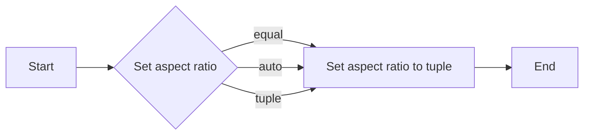

#### 带注释源码

```
# matplotlib.pyplot.set_aspect
# Set the aspect of the current axis.
# Parameters:
# - aspect: str, the aspect ratio, can be "equal", "auto", or a tuple (x_ratio, y_ratio).
# Returns: None, no return value.

# Example usage:
# ax.set_aspect(1)
```


### matplotlib.pyplot.set_title

Set the title of the current axis.

参数：

- `title`：`str`，The title string.

返回值：`None`，没有返回值。

#### 流程图

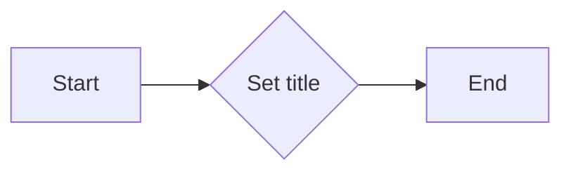

#### 带注释源码

```
# matplotlib.pyplot.set_title
# Set the title of the current axis.
# Parameters:
# - title: str, the title string.
# Returns: None, no return value.

# Example usage:
# ax.set_title("adjustable = box")
```


### matplotlib.pyplot.set_xlim

`matplotlib.pyplot.set_xlim` 是一个用于设置轴的 x 轴限制的全局函数。

参数：

- `xmin`：`float`，x 轴的最小值。
- `xmax`：`float`，x 轴的最大值。

返回值：无

#### 流程图

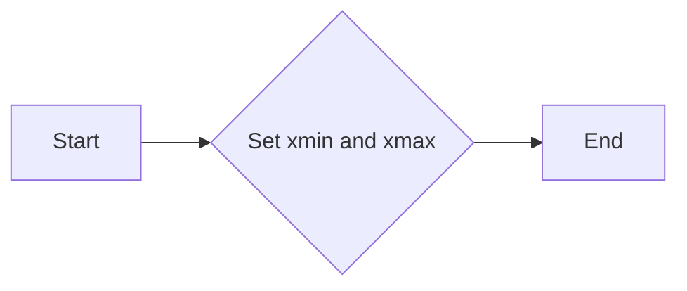

#### 带注释源码

```python
import matplotlib.pyplot as plt

fig, (ax1, ax2) = plt.subplots(1, 2)
ax1.set_xscale("log")
ax1.set_yscale("log")
# 设置 x 轴限制为 1e1 到 1e3
ax1.set_xlim(1e1, 1e3)
ax1.set_ylim(1e2, 1e3)
ax1.set_aspect(1)
ax1.set_title("adjustable = box")

ax2.set_xscale("log")
ax2.set_yscale("log")
ax2.set_adjustable("datalim")
ax2.plot([1, 3, 10], [1, 9, 100], "o-")
# 设置 x 轴限制为 1e-1 到 1e2
ax2.set_xlim(1e-1, 1e2)
ax2.set_ylim(1e-1, 1e3)
ax2.set_aspect(1)
ax2.set_title("adjustable = datalim")

plt.show()
```


### matplotlib.pyplot.set_ylim

matplotlib.pyplot.set_ylim 是一个用于设置轴的 y 轴限制的函数。

参数：

- `ymin`：`float`，y 轴的最小值。
- `ymax`：`float`，y 轴的最大值。

返回值：`None`，没有返回值。

#### 流程图

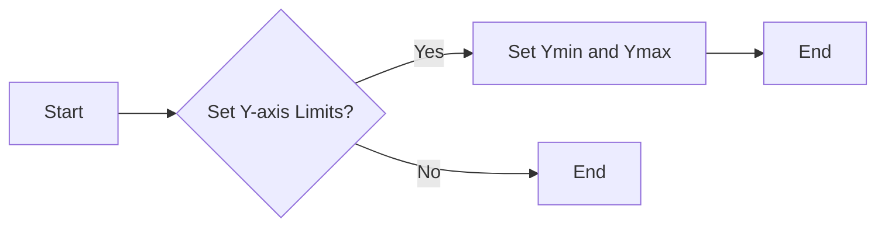

#### 带注释源码

```
# 设置 y 轴的上下限
ax1.set_ylim(1e2, 1e3)
```


### matplotlib.pyplot.set_aspect

设置轴的纵横比。

参数：

- `aspect`：`float`，指定纵横比。如果为 'auto'，则自动调整纵横比以适应数据。

返回值：`None`，没有返回值。

#### 流程图

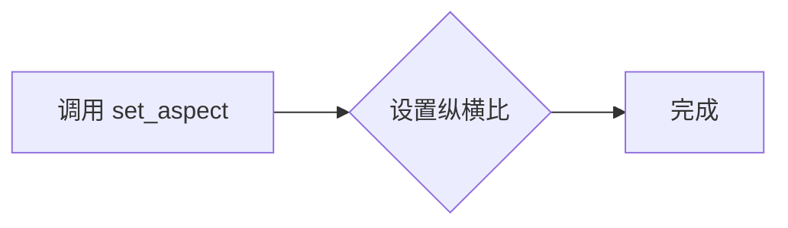

#### 带注释源码

```
# matplotlib.pyplot.set_aspect
# 设置轴的纵横比

# 假设 ax 是一个轴对象，aspect 是要设置的纵横比
def set_aspect(self, aspect):
    """
    Set the aspect of the axes.

    Parameters
    ----------
    aspect : float or str
        The aspect ratio. If 'auto', the aspect ratio is automatically adjusted to fit the data.

    Returns
    -------
    None
    """
    # 设置纵横比
    self._ax.set_aspect(aspect)
```


### matplotlib.pyplot.set_title

设置当前轴的标题。

参数：

- `title`：`str`，标题文本
- `loc`：`str`，位置，默认为'center'，可选值包括'left', 'right', 'center', 'upper left', 'upper right', 'lower left', 'lower right'
- `pad`：`float`，标题与轴边缘的距离，默认为3.0
- `fontsize`：`float`，字体大小，默认为10.0
- `color`：`str`，字体颜色，默认为'black'
- `fontweight`：`str`，字体粗细，默认为'normal'
- `fontstyle`：`str`，字体样式，默认为'normal'
- `verticalalignment`：`str`，垂直对齐方式，默认为'bottom'
- `horizontalalignment`：`str`，水平对齐方式，默认为'center'

返回值：`None`

#### 流程图

```mermaid
graph LR
A[Start] --> B{Call set_title()}
B --> C[End]
```

#### 带注释源码

```
# 设置当前轴的标题
ax.set_title("adjustable = datalim")
```


### `plot`

`matplotlib.pyplot.plot` 是一个用于绘制二维线图的函数。

参数：

- `x`：`array_like`，x轴的数据点。
- `y`：`array_like`，y轴的数据点。
- `fmt`：`str`，用于指定线型、标记和颜色。

返回值：`Line2D`，表示绘制的线。

#### 流程图

```mermaid
graph LR
A[Start] --> B{Call plot()}
B --> C[End]
```

#### 带注释源码

```
import matplotlib.pyplot as plt

# 创建图形和轴
fig, (ax1, ax2) = plt.subplots(1, 2)

# 设置轴的缩放和限制
ax1.set_xscale("log")
ax1.set_yscale("log")
ax1.set_xlim(1e1, 1e3)
ax1.set_ylim(1e2, 1e3)
ax1.set_aspect(1)
ax1.set_title("adjustable = box")

ax2.set_xscale("log")
ax2.set_yscale("log")
ax2.set_adjustable("datalim")

# 绘制线图
ax2.plot([1, 3, 10], [1, 9, 100], "o-")

# 设置轴的限制和标题
ax2.set_xlim(1e-1, 1e2)
ax2.set_ylim(1e-1, 1e3)
ax2.set_aspect(1)
ax2.set_title("adjustable = datalim")

# 显示图形
plt.show()
```


### plt.show()

`plt.show()` 是 Matplotlib 库中的一个全局函数，用于显示当前图形窗口。

参数：

- 无

返回值：`None`，该函数不返回任何值，其作用是触发图形窗口的显示。

#### 流程图

```mermaid
graph LR
A[Start] --> B{plt.show() called?}
B -- Yes --> C[Show plot window]
B -- No --> D[End]
```

#### 带注释源码

```
import matplotlib.pyplot as plt

fig, (ax1, ax2) = plt.subplots(1, 2)
ax1.set_xscale("log")
ax1.set_yscale("log")
ax1.set_xlim(1e1, 1e3)
ax1.set_ylim(1e2, 1e3)
ax1.set_aspect(1)
ax1.set_title("adjustable = box")

ax2.set_xscale("log")
ax2.set_yscale("log")
ax2.set_adjustable("datalim")
ax2.plot([1, 3, 10], [1, 9, 100], "o-")
ax2.set_xlim(1e-1, 1e2)
ax2.set_ylim(1e-1, 1e3)
ax2.set_aspect(1)
ax2.set_title("adjustable = datalim")

plt.show()  # This line triggers the display of the plot window
```


## 关键组件


### 张量索引与惰性加载

张量索引与惰性加载是指在处理大型数据集时，只对需要的数据进行索引和加载，以减少内存消耗和提高处理速度。

### 反量化支持

反量化支持是指代码能够处理非整数类型的量化数据，例如浮点数，以便在量化过程中进行更精确的计算。

### 量化策略

量化策略是指在将浮点数数据转换为低精度整数表示时，采用的算法和参数，以优化计算效率和存储空间。


## 问题及建议


### 已知问题

-   {问题1}：代码中使用了 `matplotlib.pyplot` 库，但没有进行异常处理，如果该库无法正常加载或使用，程序将无法正常运行。
-   {问题2}：代码中使用了硬编码的数值，如 `1e1`, `1e3`, `1e2`, `1e3` 等，这些数值在代码中多次出现，如果需要调整图表的显示范围或比例，需要手动修改多个地方。
-   {问题3}：代码没有提供任何用户交互功能，无法根据用户的需求动态调整图表的显示参数。

### 优化建议

-   {建议1}：添加异常处理，确保 `matplotlib.pyplot` 库能够正常加载和使用。
-   {建议2}：使用变量来存储硬编码的数值，以便于集中管理和修改。
-   {建议3}：实现用户交互功能，允许用户输入参数来动态调整图表的显示参数。
-   {建议4}：考虑使用面向对象编程方法，将图表的创建和展示封装在类中，提高代码的可重用性和可维护性。
-   {建议5}：如果代码用于生产环境，应考虑添加日志记录功能，以便于追踪程序的运行状态和错误信息。


## 其它


### 设计目标与约束

- 设计目标：实现一个简单的日志记录功能，用于展示不同调整选项下的对数刻度图。
- 约束条件：使用matplotlib库进行绘图，不使用额外的日志库。

### 错误处理与异常设计

- 错误处理：代码中未包含异常处理机制，应考虑添加异常捕获和处理逻辑，以确保程序的健壮性。
- 异常设计：对于matplotlib绘图过程中可能出现的异常，应设计相应的异常处理机制。

### 数据流与状态机

- 数据流：代码中数据流较为简单，主要涉及matplotlib绘图参数的设置和绘图操作。
- 状态机：代码中未涉及状态机设计。

### 外部依赖与接口契约

- 外部依赖：代码依赖于matplotlib库进行绘图。
- 接口契约：matplotlib库提供的绘图接口符合代码中的使用要求。

### 测试与验证

- 测试策略：编写单元测试，验证代码在不同参数设置下的绘图结果是否符合预期。
- 验证方法：通过对比实际绘图结果与预期结果，验证代码的正确性。

### 维护与扩展

- 维护策略：定期检查代码的健壮性和性能，及时修复潜在问题。
- 扩展方向：根据实际需求，考虑添加更多日志记录功能，如日志级别控制、日志格式化等。


    