# `matplotlib\galleries\examples\scales\custom_scale.py` 详细设计文档

This code defines a custom scale for matplotlib, specifically designed for latitude data in a Mercator projection. It includes a scale class, a transform class, and a main block that demonstrates the usage of the scale in a plot.

## 整体流程

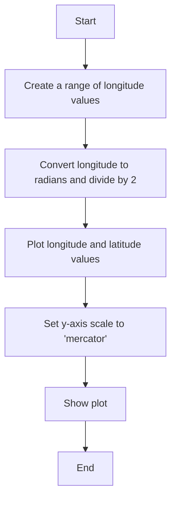

## 类结构

```
MercatorLatitudeScale (Scale class)
├── MercatorLatitudeTransform (Transform class)
│   ├── InvertedMercatorLatitudeTransform (Transform class)
```

## 全局变量及字段


### `t`
    
Array of longitude values ranging from -180.0 to 180.0.

类型：`numpy.ndarray`
    


### `s`
    
Array of latitude values calculated from longitude values using the Mercator projection formula.

类型：`numpy.ndarray`
    


### `MercatorLatitudeScale.name`
    
The name of the scale, used to select the scale in Matplotlib.

类型：`str`
    


### `MercatorLatitudeScale.thresh`
    
The threshold in degrees above which to crop the data in the Mercator projection.

类型：`numpy.ndarray`
    


### `MercatorLatitudeTransform.input_dims`
    
The number of input dimensions for the transformation.

类型：`int`
    


### `MercatorLatitudeTransform.output_dims`
    
The number of output dimensions for the transformation.

类型：`int`
    


### `MercatorLatitudeTransform.thresh`
    
The threshold in degrees above which to crop the data in the Mercator projection.

类型：`numpy.ndarray`
    


### `InvertedMercatorLatitudeTransform.thresh`
    
The threshold in degrees above which to crop the data in the Mercator projection.

类型：`numpy.ndarray`
    


### `InvertedMercatorLatitudeTransform.input_dims`
    
The number of input dimensions for the transformation.

类型：`int`
    


### `InvertedMercatorLatitudeTransform.output_dims`
    
The number of output dimensions for the transformation.

类型：`int`
    


### `InvertedMercatorLatitudeTransform.thresh`
    
The threshold in degrees above which to crop the data in the Mercator projection.

类型：`numpy.ndarray`
    
    

## 全局函数及方法


### mscale.register_scale(MercatorLatitudeScale)

This function registers the `MercatorLatitudeScale` class with Matplotlib so that it can be used as a scale in plots.

参数：

- `MercatorLatitudeScale`：`class`，The `MercatorLatitudeScale` class instance to be registered.

返回值：`None`，This function does not return any value.

#### 流程图

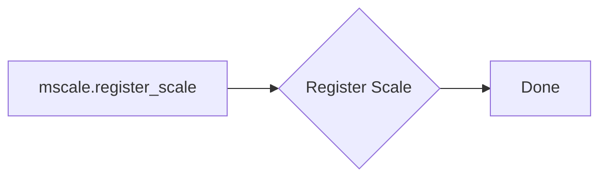

#### 带注释源码

```python
# Now that the Scale class has been defined, it must be registered so
# that Matplotlib can find it.
mscale.register_scale(MercatorLatitudeScale)
```


### MercatorLatitudeScale.__init__

This method initializes a new instance of the `MercatorLatitudeScale` class, setting up the scale for latitude data in a Mercator projection.

参数：

- `axis`：`matplotlib.axes.Axes`，The axis on which the scale is applied.
- `thresh`：`numpy.ndarray`，The degree above which to crop the data. Defaults to `np.deg2rad(85)`.
- `**kwargs`：Additional keyword arguments to be passed to the scale's constructor.

返回值：`None`，This method does not return a value.

#### 流程图

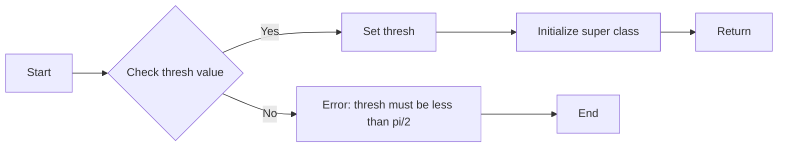

#### 带注释源码

```python
def __init__(self, axis, *, thresh=np.deg2rad(85), **kwargs):
    """
    Any keyword arguments passed to ``set_xscale`` and ``set_yscale`` will
    be passed along to the scale's constructor.

    thresh: The degree above which to crop the data.
    """
    super().__init__(axis)
    if thresh >= np.pi / 2:
        raise ValueError("thresh must be less than pi/2")
    self.thresh = thresh
```


### MercatorLatitudeScale.get_transform

This method returns a new instance of the `MercatorLatitudeTransform` class, which is responsible for the actual transformation of the data.

参数：

- `self`：`MercatorLatitudeScale`，The instance of the scale being used.
- `thresh`：`float`，The threshold in radians above which to crop the data. Defaults to `np.deg2rad(85)`.

返回值：`MercatorLatitudeTransform`，An instance of the `MercatorLatitudeTransform` class that performs the transformation.

#### 流程图

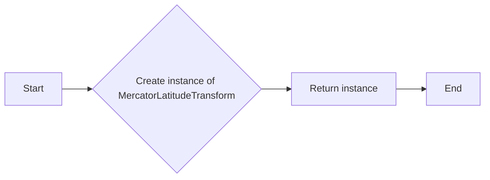

#### 带注释源码

```python
def get_transform(self):
    """
    Override this method to return a new instance that does the
    actual transformation of the data.

    The MercatorLatitudeTransform class is defined below as a
    nested class of this one.
    """
    return self.MercatorLatitudeTransform(self.thresh)
``` 


### MercatorLatitudeScale.set_default_locators_and_formatters

This method sets up the locators and formatters to use with the MercatorLatitudeScale. It is used to define how the scale displays tick marks and labels on the axis.

参数：

- `axis`：`matplotlib.axes.Axes`，The axis on which the scale is applied.

返回值：`None`，This method does not return any value.

#### 流程图

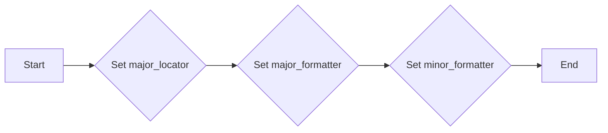

#### 带注释源码

```python
def set_default_locators_and_formatters(self, axis):
    """
    Override to set up the locators and formatters to use with the
    scale.  This is only required if the scale requires custom
    locators and formatters.  Writing custom locators and
    formatters is rather outside the scope of this example, but
    there are many helpful examples in :mod:`.ticker`.

    In our case, the Mercator example uses a fixed locator from -90 to 90
    degrees and a custom formatter to convert the radians to degrees and
    put a degree symbol after the value.
    """
    fmt = FuncFormatter(
        lambda x, pos=None: f"{np.degrees(x):.0f}\N{DEGREE SIGN}")
    axis.set(major_locator=FixedLocator(np.radians(range(-90, 90, 10))),
             major_formatter=fmt, minor_formatter=fmt)
```


### MercatorLatitudeScale.limit_range_for_scale

This method limits the bounds of the axis to the domain of the transform for the Mercator latitude scale. It ensures that the axis range is restricted to the user-defined threshold, preventing values beyond this range from being plotted.

参数：

- `vmin`：`float`，The minimum value of the axis range.
- `vmax`：`float`，The maximum value of the axis range.
- `minpos`：`float`，The minimum position of the axis.

返回值：`tuple`，A tuple containing the minimum and maximum values of the axis range after applying the limit.

#### 流程图

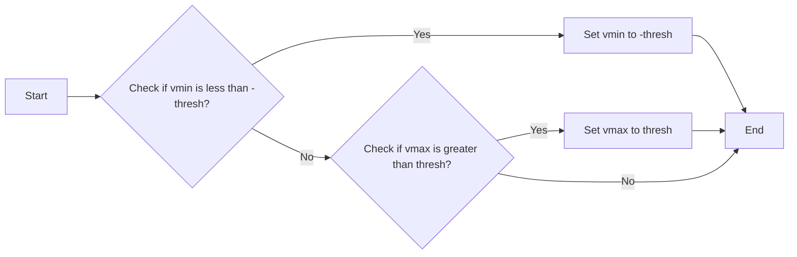

#### 带注释源码

```python
def limit_range_for_scale(self, vmin, vmax, minpos):
    """
    Override to limit the bounds of the axis to the domain of the
    transform.  In the case of Mercator, the bounds should be
    limited to the threshold that was passed in.  Unlike the
    autoscaling provided by the tick locators, this range limiting
    will always be adhered to, whether the axis range is set
    manually, determined automatically or changed through panning
    and zooming.

    Parameters
    ----------
    vmin : float
        The minimum value of the axis range.
    vmax : float
        The maximum value of the axis range.
    minpos : float
        The minimum position of the axis.

    Returns
    -------
    tuple
        A tuple containing the minimum and maximum values of the axis range after applying the limit.
    """
    return max(vmin, -self.thresh), min(vmax, self.thresh)
```


### MercatorLatitudeTransform.__init__

This method initializes the `MercatorLatitudeTransform` class, which is a nested class within `MercatorLatitudeScale`. It sets up the transformation for latitude data in a Mercator projection.

参数：

- `thresh`：`np.float64`，The degree above which to crop the data. This is the threshold for the Mercator scale, beyond which the data will not be plotted. It defaults to `np.deg2rad(85)`.

返回值：无

#### 流程图

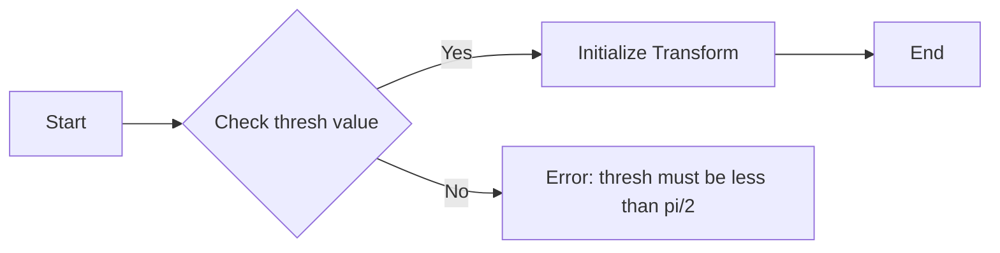

#### 带注释源码

```python
class MercatorLatitudeTransform(mtransforms.Transform):
    # ... (other class members)

    def __init__(self, thresh):
        mtransforms.Transform.__init__(self)
        self.thresh = thresh  # Set the threshold for the transformation

    def transform_non_affine(self, a):
        # ... (transform method implementation)
```


### MercatorLatitudeTransform.transform_non_affine

This method performs the non-affine transformation of the input array using the Mercator projection formula. It returns a transformed copy of the input array.

参数：

- `a`：`numpy.ndarray`，The input array to be transformed. This array should contain latitude values in radians.

返回值：`numpy.ndarray`，The transformed array. If the input array contains values outside the valid range, the corresponding elements in the output array will be masked.

#### 流程图

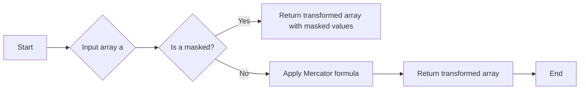

#### 带注释源码

```python
def transform_non_affine(self, a):
    """
    This transform takes a numpy array and returns a transformed copy.
    Since the range of the Mercator scale is limited by the
    user-specified threshold, the input array must be masked to
    contain only valid values.  Matplotlib will handle masked arrays
    and remove the out-of-range data from the plot.  However, the
    returned array *must* have the same shape as the input array, since
    these values need to remain synchronized with values in the other
    dimension.
    """
    masked = ma.masked_where((a < -self.thresh) | (a > self.thresh), a)
    if masked.mask.any():
        return ma.log(np.abs(ma.tan(masked) + 1 / ma.cos(masked)))
    else:
        return np.log(np.abs(np.tan(a) + 1 / np.cos(a)))
``` 


### MercatorLatitudeTransform.inverted

This method returns the inverse transform of the MercatorLatitudeTransform class.

参数：

- `a`：`numpy.ndarray`，The input array to be transformed.

返回值：`numpy.ndarray`，The transformed array.

#### 流程图

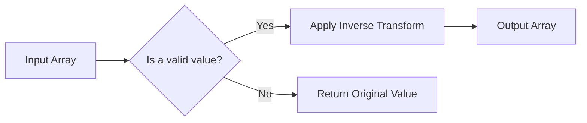

#### 带注释源码

```python
class InvertedMercatorLatitudeTransform(mtransforms.Transform):
    input_dims = output_dims = 1

    def __init__(self, thresh):
        mtransforms.Transform.__init__(self)
        self.thresh = thresh

    def transform_non_affine(self, a):
        return np.arctan(np.sinh(a))

    def inverted(self):
        return MercatorLatitudeScale.MercatorLatitudeTransform(self.thresh)
``` 


### InvertedMercatorLatitudeTransform.__init__

This method initializes an instance of the `InvertedMercatorLatitudeTransform` class, which is a nested class of `MercatorLatitudeScale`. It sets up the transformation for converting latitude values back to their original degrees in a Mercator projection.

参数：

- `thresh`：`float`，The threshold in radians above which to crop the data. This is used to limit the range of the transformation to avoid infinite values in the Mercator projection.

返回值：`None`，This method does not return any value.

#### 流程图

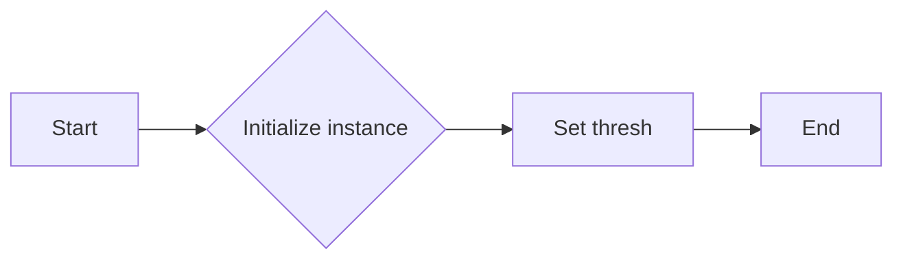

#### 带注释源码

```python
class InvertedMercatorLatitudeTransform(mtransforms.Transform):
    input_dims = output_dims = 1

    def __init__(self, thresh):
        mtransforms.Transform.__init__(self)
        self.thresh = thresh

    def transform_non_affine(self, a):
        return np.arctan(np.sinh(a))

    def inverted(self):
        return MercatorLatitudeScale.MercatorLatitudeTransform(self.thresh)
```


### InvertedMercatorLatitudeTransform.transform_non_affine

This method performs the inverse transformation of the Mercator latitude scale, converting an array of latitude values in radians to their corresponding longitude values.

参数：

- `a`：`numpy.ndarray`，The input array of latitude values in radians.

返回值：`numpy.ndarray`，The transformed array of longitude values in radians.

#### 流程图

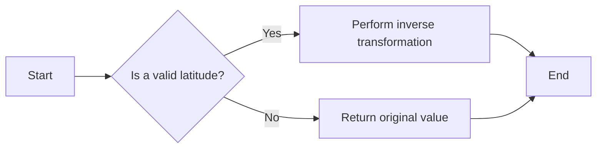

#### 带注释源码

```python
def transform_non_affine(self, a):
    return np.arctan(np.sinh(a))
```


### InvertedMercatorLatitudeTransform.inverted

This method returns the inverse transform of the MercatorLatitudeTransform class, which is used to convert latitude values in a Mercator projection back to their original values.

参数：

- `a`：`numpy.ndarray`，The input array of latitude values in radians.

返回值：`numpy.ndarray`，The transformed array of latitude values in radians.

#### 流程图

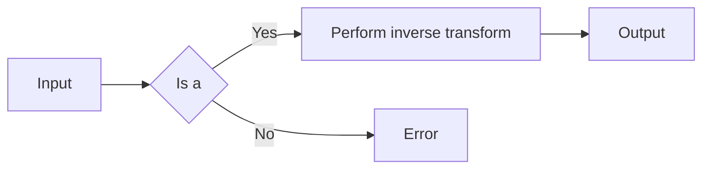

#### 带注释源码

```python
class InvertedMercatorLatitudeTransform(mtransforms.Transform):
    input_dims = output_dims = 1

    def __init__(self, thresh):
        mtransforms.Transform.__init__(self)
        self.thresh = thresh

    def transform_non_affine(self, a):
        return np.arctan(np.sinh(a))

    def inverted(self):
        return MercatorLatitudeScale.MercatorLatitudeTransform(self.thresh)
``` 


## 关键组件


### 张量索引与惰性加载

张量索引与惰性加载是代码中用于处理数据转换和掩码的关键组件。它们允许对输入数据进行高效的操作，同时只处理有效的数据值，从而优化性能。

### 反量化支持

反量化支持是代码中用于将Mercator投影中的纬度值转换回原始值的关键组件。它通过逆变换函数实现，确保数据在转换过程中保持精确。

### 量化策略

量化策略是代码中用于限制Mercator投影中纬度值范围的关键组件。它通过设置阈值来避免在极值处出现无限大的值，从而保持数据的稳定性和可绘制性。


## 问题及建议


### 已知问题

-   **性能问题**：在 `transform_non_affine` 方法中，使用了 `ma.masked_where` 和 `ma.log`，这些操作可能会对大型数组造成性能瓶颈，尤其是在处理大量数据时。
-   **代码可读性**：代码中存在一些复杂的逻辑，例如 `transform_non_affine` 方法中的条件判断和 `ma` 库的使用，这可能会降低代码的可读性和可维护性。
-   **异常处理**：代码中没有明确的异常处理机制，如果输入数据不符合预期，可能会导致程序崩溃。

### 优化建议

-   **性能优化**：考虑使用 NumPy 的内置函数来替代 `ma` 库，这样可以提高代码的执行效率。例如，可以使用 `np.where` 和 `np.log` 来替代 `ma.masked_where` 和 `ma.log`。
-   **代码重构**：对复杂的逻辑进行重构，提高代码的可读性和可维护性。例如，可以将 `transform_non_affine` 方法中的条件判断逻辑提取到一个单独的函数中。
-   **异常处理**：添加异常处理机制，确保程序在遇到错误输入时能够优雅地处理异常，并提供有用的错误信息。
-   **文档注释**：增加对代码中复杂逻辑的注释，帮助其他开发者理解代码的工作原理。
-   **测试用例**：编写单元测试用例，确保代码在各种输入情况下都能正常工作，并验证代码的性能。

## 其它


### 设计目标与约束

- 设计目标：
  - 实现一个适用于经纬度数据的Mercator投影比例尺。
  - 提供一个自定义比例尺，可以用于matplotlib的Axes对象。
  - 确保比例尺在-π/2到π/2（-90到90度）范围内有效。
  - 允许用户设置阈值，以限制数据范围。
- 约束：
  - 比例尺必须在matplotlib环境中使用。
  - 比例尺必须与matplotlib的Axes对象兼容。
  - 比例尺的转换函数和逆转换函数必须正确实现。

### 错误处理与异常设计

- 错误处理：
  - 如果用户设置的阈值大于π/2，将抛出ValueError异常。
  - 如果输入数据超出阈值范围，将使用matplotlib的掩码功能进行处理。
- 异常设计：
  - 定义自定义异常类，以处理特定于MercatorLatitudeScale的错误情况。

### 数据流与状态机

- 数据流：
  - 用户输入数据（经纬度）。
  - 数据通过MercatorLatitudeScale进行转换。
  - 转换后的数据用于绘制图形。
- 状态机：
  - 无状态机，因为MercatorLatitudeScale是一个比例尺，不涉及状态转换。

### 外部依赖与接口契约

- 外部依赖：
  - NumPy：用于数学运算和数组处理。
  - Matplotlib：用于图形绘制和比例尺实现。
- 接口契约：
  - Matplotlib的Axes对象必须支持自定义比例尺。
  - 自定义比例尺必须遵循matplotlib的比例尺接口规范。


    