# `matplotlib\galleries\examples\scales\log_demo.py` 详细设计文档

这是一个matplotlib示例脚本，展示了如何使用对数刻度（logarithmic scales）绑制图表，包括半对数坐标图（semilogx/semilogy）、双对数坐标图（loglog）、自定义对数底数、以及处理负值的两种方式（mask和clip）。

## 整体流程

```mermaid
graph TD
    A[开始] --> B[导入matplotlib.pyplot和numpy]
    B --> C[创建第一个图形，包含3个子图]
    C --> D[绑制semilogx图: x轴对数]
    D --> E[绑制semilogy图: y轴对数]
    E --> F[绑制loglog图: x和y轴都对数]
    F --> G[创建第二个图形，演示自定义底数]
    G --> H[设置y轴为base=2的对数刻度]
    H --> I[创建第三个图形，演示处理负值]
    I --> J[使用nonpositive='mask'方式]
    J --> K[使用nonpositive='clip'方式]
    K --> L[调用plt.show()显示所有图形]
```

## 类结构

```
此脚本为matplotlib示例代码，无自定义类定义
直接使用matplotlib.pyplot和numpy库
使用的matplotlib核心类:
├── Figure (图形容器)
├── Axes (坐标轴对象)
│   ├── set_xscale() / set_yscale()
│   ├── semilogx() / semilogy() / loglog()
│   ├── set_title() / set()
│   ├── grid()
│   ├── bar() / errorbar() / plot()
│   └── set_yticks()
└── pyplot (MATLAB风格接口)
```

## 全局变量及字段


### `fig`
    
图形对象，用于存放一个或多个子图

类型：`matplotlib.figure.Figure`
    


### `ax1`
    
第一个子图坐标轴，用于展示x轴对数刻度示例

类型：`matplotlib.axes.Axes`
    


### `ax2`
    
第二个子图坐标轴，用于展示y轴对数刻度示例

类型：`matplotlib.axes.Axes`
    


### `ax3`
    
第三个子图坐标轴，用于展示双对数刻度示例

类型：`matplotlib.axes.Axes`
    


### `ax`
    
单个子图坐标轴，用于展示不同底数的对数刻度和处理负值示例

类型：`matplotlib.axes.Axes`
    


### `t`
    
时间数组，范围从0.01到10.0，步长0.01，用于semilogx示例

类型：`numpy.ndarray`
    


### `x`
    
数据数组，用于semilogy和loglog示例

类型：`numpy.ndarray`
    


### `y`
    
幂函数数据，用于对数刻度绘图示例

类型：`numpy.ndarray`
    


### `yerr`
    
误差值数组，用于展示对数刻度下负值处理方式

类型：`numpy.ndarray`
    


    

## 全局函数及方法


### `plt.subplots`

创建图形（Figure）和一个或多个子图（Axes）的便捷函数，返回 Figure 对象和 Axes 对象（或 Axes 对象数组）。

参数：

- `nrows`：`int`，行数，默认为 1，表示创建子图的行数
- `ncols`：`int`，列数，默认为 1，表示创建子图的列数
- `sharex`：`bool` 或 `str`，默认为 False，是否共享 x 轴
- `sharey`：`bool` 或 `str`，默认为 False，是否共享 y 轴
- `squeeze`：`bool`，默认为 True，是否压缩返回的 Axes 数组维度
- `width_ratios`：`array-like`，可选，子图宽度的相对比例
- `height_ratios`：`array-like`，可选，子图高度的相对比例
- `subplot_kw`：`dict`，可选，创建子图时的关键字参数
- `gridspec_kw`：`dict`，可选，GridSpec 的关键字参数
- `**fig_kw`：传递给 `plt.figure()` 的关键字参数，如 `figsize`、`layout` 等

返回值：`tuple(Figure, Axes or ndarray)`，返回图形对象和子图对象（或子图数组）。当 `squeeze=False` 或指定 `sharex`/`sharey` 时，返回二维数组；当 `squeeze=True`（默认）且只有一维时，返回一维数组或单个 Axes 对象。

#### 流程图

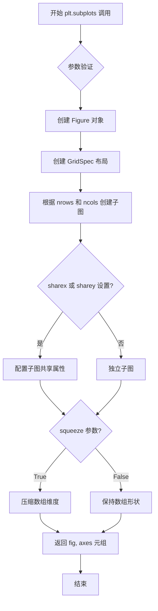

#### 带注释源码

```python
# 代码示例来源：Matplotlib 官方示例
# 创建 1 行 3 列的子图布局，使用 constrained 布局管理器
# figsize 设置图形大小为 7 x 7/3 英寸
fig, (ax1, ax2, ax3) = plt.subplots(1, 3, layout='constrained', figsize=(7, 7/3))

# 参数说明：
# - 1: nrows, 创建 1 行子图
# - 3: ncols, 创建 3 列子图  
# - layout='constrained': 使用 ConstrainedLayout 布局管理器自动调整子图间距
# - figsize=(7, 7/3): 图形宽度 7 英寸，高度 7/3 英寸
#
# 返回值说明：
# - fig: Figure 对象，表示整个图形
# - (ax1, ax2, ax3): 解包后的 3 个 Axes 对象，分别对应从左到右的子图

# 第一个子图：x 轴对数刻度
t = np.arange(0.01, 10.0, 0.01)
ax1.semilogx(t, np.sin(2 * np.pi * t))
ax1.set(title='semilogx')
ax1.grid()
ax1.grid(which="minor", color="0.9")

# 第二个子图：y 轴对数刻度
x = np.arange(4)
ax2.semilogy(4*x, 10**x, 'o--')
ax2.set(title='semilogy')
ax2.grid()
ax2.grid(which="minor", color="0.9")

# 第三个子图：双对数刻度
x = np.array([1, 10, 100, 1000])
ax3.loglog(x, 5 * x, 'o--')
ax3.set(title='loglog')
ax3.grid()
ax3.grid(which="minor", color="0.9")

# 另一个示例：创建单子图并设置 y 轴为以 2 为底的对数刻度
fig, ax = plt.subplots()
ax.bar(["L1 cache", "L2 cache", "L3 cache", "RAM", "SSD"],
       [32, 1_000, 32_000, 16_000_000, 512_000_000])
ax.set_yscale('log', base=2)
ax.set_yticks([1, 2**10, 2**20, 2**30], labels=['kB', 'MB', 'GB', 'TB'])
ax.set_title("Typical memory sizes")
ax.yaxis.grid()

# 处理负值的示例：创建 1 行 2 列子图
fig, (ax1, ax2) = plt.subplots(1, 2, layout="constrained", figsize=(6, 3))
fig.suptitle("errorbars going negative")

# mask 模式：将对数轴上非正值掩码处理
ax1.set_yscale("log", nonpositive='mask')
ax1.set_title('nonpositive="mask"')
ax1.errorbar(x, y, yerr=yerr, fmt='o', capsize=5)

# clip 模式：将对数轴上非正值裁剪为小正值
ax2.set_yscale("log", nonpositive='clip')
ax2.set_title('nonpositive="clip"')
ax2.errorbar(x, y, yerr=yerr, fmt='o', capsize=5)

plt.show()
```


### `np.arange()`

创建等差数组（arange）是 NumPy 库中用于生成数值序列的函数，它根据给定的起始值、终止值和步长创建一个均匀间隔的一维数组，常用于生成测试数据、坐标轴刻度或循环迭代。

参数：

- `start`：`float`（可选），起始值，默认为 0
- `stop`：`float`，终止值（不包含该值）
- `step`：`float`（可选），步长，默认为 1
- `dtype`：`dtype`（可选），输出数组的数据类型

返回值：`ndarray`，返回等差数列数组

#### 流程图

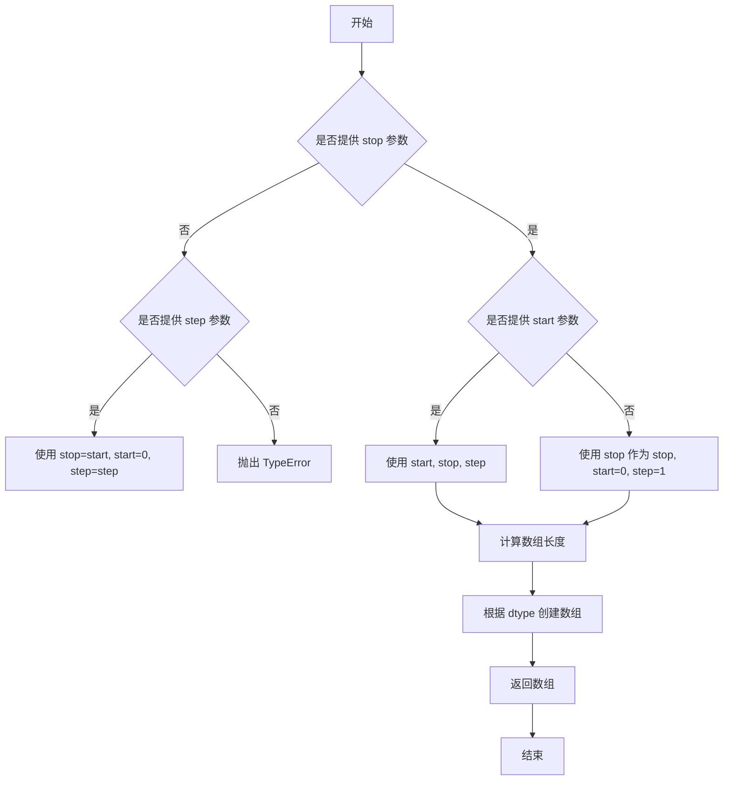

#### 带注释源码

```python
# np.arange() 函数的典型使用方式：
# 参数：start=0.01, stop=10.0, step=0.01
# 返回：从 0.01 开始，步长 0.01，到 10.0（不包含）的数组
t = np.arange(0.01, 10.0, 0.01)

# 参数：start=0, stop=4, step=1（默认）
# 返回：[0, 1, 2, 3]
x = np.arange(4)

# np.arange() 内部实现逻辑简述：
# 1. 接收 start, stop, step, dtype 参数
# 2. 计算序列长度：(stop - start) / step
# 3. 使用 Python 内置的 range() 或类似逻辑生成索引
# 4. 将每个索引乘以 step 并加上 start 得到实际值
# 5. 返回 NumPy ndarray 对象
```


### `np.sin`

正弦函数，计算输入角度（以弧度为单位）的正弦值，支持标量和数组输入，返回对应角度的正弦值。

参数：

- `x`：`float` 或 `array_like`，输入的角度值，以弧度为单位。可以是单个数值或NumPy数组。

返回值：`float` 或 `ndarray`，输入角度的正弦值。返回类型与输入类型一致。

#### 流程图

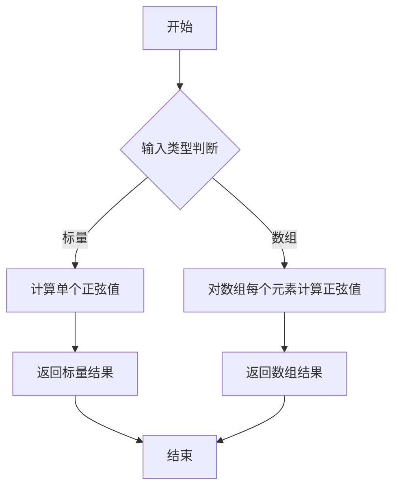

#### 带注释源码

```python
# np.sin 是 NumPy 库提供的三角函数之一
# 在本代码中的实际调用：
np.sin(2 * np.pi * t)

# 参数说明：
# 2 * np.pi * t: 输入的角度值（弧度制）
#   - np.pi 表示圆周率 π
#   - 2 * np.pi * t 表示 2π * t，即 t 个完整周期
#   - t 是从 0.01 到 10.0 的时间数组
#
# 返回值：
#   - 返回与输入 t 形状相同的数组
#   - 每个元素是对应角度的正弦值，范围在 [-1, 1] 之间
#
# 调用场景：
# ax1.semilogx(t, np.sin(2 * np.pi * t))
#   - 在半对数坐标轴上绘制正弦波曲线
#   - t 作为 x 轴（时间），np.sin(2 * np.pi * t) 作为 y 轴（信号值）
```


### `np.pi`

`np.pi` 是 NumPy 库提供的圆周率常数（π），是一个表示圆周率近似值的全局浮点数常量，约为 3.141592653589793。在代码中用于需要使用圆周率进行数学计算的场景，例如三角函数计算。

#### 参数

无参数（是一个常量/属性，不是函数）

#### 返回值

`float`，返回圆周率 π 的双精度浮点数近似值（约等于 3.141592653589793）

#### 流程图

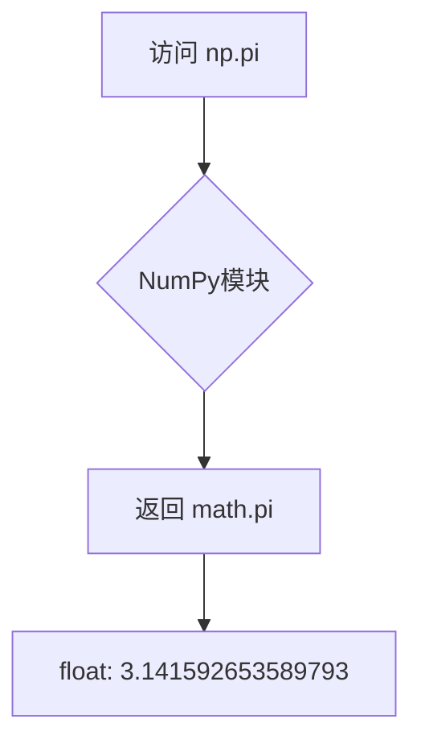

#### 带注释源码

```python
# 在 NumPy 中，pi 通常在 _globals.py 或 __init__.py 中定义
# 常见实现方式如下：

# 方式1：直接从 math 模块导入
import math
pi = math.pi  # 约等于 3.141592653589793

# 方式2：在 NumPy 中的实际定义（在 numpy/__init__.py 或相关模块中）
# 来自 Python 标准库的 math 模块，提供高精度圆周率常数
pi = 3.141592653589793  # 数学常数 π
```

#### 关键组件信息

- **np.pi**: NumPy 提供的圆周率常数，类型为 float，值为 3.141592653589793，用于数学计算中的 π 值


### `np.linspace()`

此代码示例展示了 Matplotlib 中对数刻度（log scale）的多种用法，包括使用 `semilogx`、`semilogy` 和 `loglog` 函数创建对数坐标图，以及处理负数值的方法（如 `nonpositive='mask'` 或 `nonpositive='clip'`）。代码中通过 `np.linspace()` 生成示例数据，用于演示对数刻度在数据可视化中的应用。

参数：

- `start`：`float`，序列的起始值
- `stop`：`float`，序列的结束值（当 endpoint 为 True 时包含）
- `num`：`int`，要生成的样本数量，默认为 50
- `endpoint`：`bool`，是否包含 stop 值，默认为 True
- `retstep`：`bool`，如果为 True，则返回样本和步长，默认为 False
- `dtype`：`dtype`，输出数组的数据类型，如果没有指定则从输入推断
- `axis`：`int`，如果 stop 和 start 是数组-like，则指定结果数组中样本展开的轴

返回值：`ndarray`，返回等间距的样本数组

#### 流程图

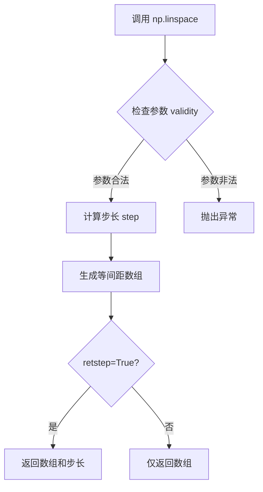

#### 带注释源码

```python
# 示例代码中 np.linspace 的使用
x = np.linspace(0.0, 2.0, 10)
# 参数说明：
#   start=0.0: 序列起始值
#   stop=2.0: 序列结束值
#   num=10: 生成10个样本点
# 返回: array([0.        , 0.22222222, 0.44444444, 0.66666667,
#             0.88888889, 1.11111111, 1.33333333, 1.55555556,
#             1.77777778, 2.        ])
```

---

### 代码整体设计文档

#### 一段话描述

该代码是一个 Matplotlib 官方示例，展示了如何使用对数刻度（Log Scale）进行数据可视化，包括 `semilogx`（x轴对数）、`semilogy`（y轴对数）、`loglog`（双对数）三种模式，以及如何处理负数值（非正数值的掩码或裁剪策略）。

#### 文件整体运行流程

1. **初始化绘图环境**：创建 Figure 和 Axes 子图
2. **semilogx 示例**：设置 x 轴为对数刻度，y 轴为线性，绘制正弦波形
3. **semilogy 示例**：设置 y 轴为对数刻度，x 轴为线性，绘制指数增长数据
4. **loglog 示例**：设置 x 和 y 轴都为对数刻度，绘制线性增长数据
5. **自定义底数示例**：演示如何将 y 轴设置为以 2 为底的对数刻度
6. **负值处理示例**：展示 `nonpositive='mask'` 和 `nonpositive='clip'` 两种处理负数值的方式
7. **显示图表**：调用 `plt.show()` 渲染图形

#### 关键组件信息

| 组件名称 | 描述 |
|---------|------|
| `plt.subplots()` | 创建包含多个子图的 Figure 和 Axes 对象 |
| `ax.semilogx()` | 设置 x 轴为对数刻度并绑制曲线 |
| `ax.semilogy()` | 设置 y 轴为对数刻度并绘制曲线 |
| `ax.loglog()` | 设置 x 和 y 轴都为对数刻度并绘制曲线 |
| `ax.set_yscale()` | 通用函数，可设置任意底数的对数刻度 |
| `ax.grid()` | 显示主网格线 |
| `ax.grid(which="minor")` | 显示次要网格线 |
| `ax.errorbar()` | 绘制带误差棒的图表 |

#### 潜在的技术债务或优化空间

1. **硬编码数据**：示例中的数据（如 `4*x`, `10**x`）是硬编码的，缺乏灵活性
2. **魔法数字**：如 `0.01`, `10.0`, `0.01` 等数值缺乏常量定义
3. **重复代码**：网格设置 (`ax.grid()` 和 `ax.grid(which="minor", color="0.9")`) 在多个子图中重复
4. **布局硬编码**：`figsize=(7, 7/3)` 使用硬编码尺寸，缺乏响应式设计

#### 其它项目

**设计目标与约束**：
- 目标：清晰展示 Matplotlib 对数刻度的各种用法
- 约束：使用 Matplotlib 3.5+ 的新语法（如 `layout="constrained"`）

**错误处理与异常设计**：
- 对数刻度不支持非正值数据，代码通过 `nonpositive` 参数处理此情况
- 使用 `plt.show()` 前需确保数据有效

**数据流与状态机**：
- 数据流：`np.arange`/`np.linspace` → 数据计算 → `Axes` 绑图 → `set_scale` 设置刻度 → `plt.show()` 渲染
- 状态机：Figure 创建 → 子图创建 → 数据绑定 → 样式设置 → 显示

**外部依赖与接口契约**：
- 依赖库：`matplotlib>=3.5`, `numpy`
- 接口：Matplotlib Axes API 提供 `set_xscale`, `set_yscale`, `semilogx`, `semilogy`, `loglog` 等方法


### `np.array`

创建NumPy数组，将Python列表、元组或类似数组的数据结构转换为多维NumPy数组。

参数：

- `object`：Python列表、元组或数组_like，要转换的输入数据
- `dtype`：data-type（可选），数组的数据类型，如int、float等
- `copy`：bool（可选），默认为True，是否复制输入数据
- `order`：str（可选），内存布局，可选'C'（行优先）、'F'（列优先）、'A'（任意）、'K'（保持原顺序）
- `subok`：bool（可选），是否允许子类，默认为True
- `ndmin`：int（可选），指定最小维度数

返回值：`numpy.ndarray`，创建的NumPy数组对象

#### 流程图

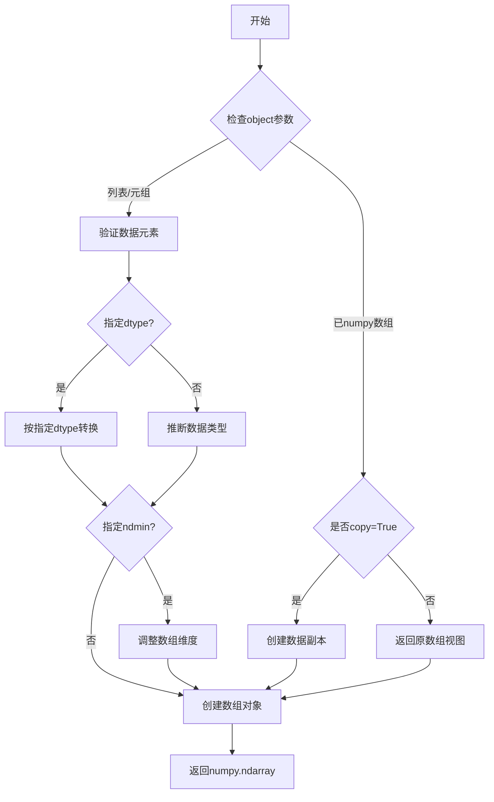

#### 带注释源码

```python
# 代码中实际使用示例
x = np.array([1, 10, 100, 1000])
# 参数说明：
# - object: [1, 10, 100, 1000] - Python列表，包含要转换的数据
# - dtype: 未指定 - NumPy自动推断数据类型为int64
# - copy: 默认True - 创建数组副本
# - order: 默认'C' - 行优先存储
# - subok: 默认True - 允许子类
# - ndmin: 默认0 - 不强制最小维度

# 等效的完整调用形式：
# x = np.array([1, 10, 100, 1000], dtype=None, copy=True, order='C', subok=True, ndmin=0)

# 返回值：numpy.ndarray对象
# 例如：array([   1,   10,  100, 1000])
```


### `Axes.semilogx`

设置 x 轴为对数刻度并绘制数据，等效于先调用 `ax.set_xscale('log')` 再调用 `ax.plot(x, y)`。该方法是 matplotlib Axes 类的便捷方法，用于在半对数坐标系中快速绘制数据。

参数：

- `*args`：可变长度位置参数，通常为 `(x, y)` 数据对或仅 `(y,)` 数据
- `**kwargs`：关键字参数传递给底层的 `plot()` 方法，如 `color`、`linewidth`、`linestyle` 等

返回值：`list[~matplotlib.lines.Line2D]`，返回创建的线条对象列表

#### 流程图

```mermaid
flowchart TD
    A[调用 semilogx] --> B{检查参数}
    B -->|有 x 和 y| C[调用 set_xscale&#40;'log'&#41;]
    B -->|仅 y| D[使用默认 x 索引]
    C --> E[调用 plot&#40;x, y, **kwargs&#41;]
    D --> E
    E --> F[返回 Line2D 对象列表]
```

#### 带注释源码

```python
# 源码位于 matplotlib/axes/_axes.py 中（概念性展示）

def semilogx(self, *args, **kwargs):
    """
    绘制 x 轴为对数刻度的图表
    
    等效于: ax.set_xscale('log'); ax.plot(x, y)
    
    参数:
        *args: 位置参数
            - semilogx(y): 使用索引 0,1,2,... 作为 x 轴
            - semilogx(x, y): 使用指定的 x 和 y 数据
            - semilogx(x, y, format): 加上格式字符串
        **kwargs: 传递给 plot() 的关键字参数
            - color: 线条颜色
            - linewidth: 线条宽度
            - linestyle: 线条样式
            - marker: 标记样式
            等等...
    
    返回:
        list of Line2D: 绘制的线条对象列表
    """
    # 步骤1: 设置 x 轴为对数刻度
    self.set_xscale('log')
    
    # 步骤2: 调用 plot 方法绘制数据
    # 传递所有参数和关键字参数
    return self.plot(*args, **kwargs)
```


### `Axes.semilogy`

`Axes.semilogy` 是 Matplotlib 中 Axes 类的便捷方法，用于在 y 轴上设置对数刻度并绘制数据，其实质等价于先调用 `set_yscale('log')` 设置 y 轴为对数坐标，再调用 `plot()` 方法绘制数据。该方法简化了绘制半对数图的流程，特别适用于展示跨越多个数量级的数据。

参数：

- `x`：`array-like`，可选，x 轴数据。如果未提供，将使用 `range(len(y))` 作为默认索引。
- `y`：`array-like`，必需，y 轴数据。
- `fmt`： str，可选，格式字符串（例如 `'o--'` 表示圆形标记和虚线），用于快速设置线条样式。
- `**kwargs`：关键字参数，其他传递给底层 `plot()` 方法的参数，如颜色、标记样式、线宽等。

返回值：`list of Line2D`，返回由该方法创建的 Line2D 对象列表，每个对象代表一条绘制的线条。

#### 流程图

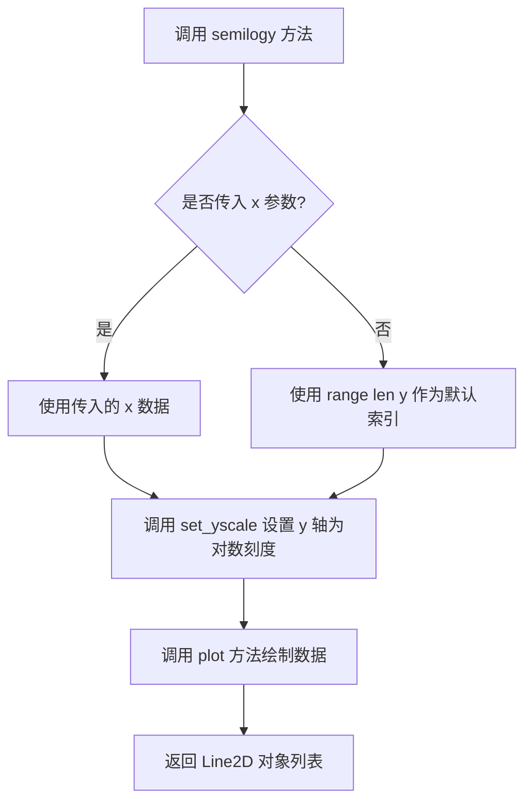

#### 带注释源码

```python
def semilogy(self, *args, **kwargs):
    """
    Make a plot with log scaling on the y axis.

    Call signature::

      semilogy(*args, **kwargs)

    Parameters
    ----------
    x : array-like, optional
        The x data of the plot.

    y : array-like
        The y data of the plot.

    fmt : str, optional
        A format string (e.g., 'ro' for red circles).

    **kwargs
        Additional parameters passed to `~matplotlib.axes.Axes.plot`.

    Returns
    -------
    list of `.lines.Line2D`
        A list of `.lines.Line2D` objects representing the plotted data.

    See Also
    --------
    loglog : Plot with logarithmic scales on both x and y axes.
    semilogx : Plot with logarithmic scale on x axis.
    set_yscale : Set the y-axis scale.
    """
    # 设置 y 轴为对数刻度
    # 'log' 表示使用以 10 为底的对数刻度
    self.set_yscale('log')
    # 调用 plot 方法绘制数据，传入所有位置参数和关键字参数
    # 返回 Line2D 对象列表
    return self.plot(*args, **kwargs)
```

**使用示例（基于提供的代码）：**

```python
# 创建示例数据
x = np.arange(4)
y = 10**x

# 调用 semilogy 方法绘制 y 轴对数图
# 第一个参数是 x 数据，第二个参数是 y 数据，'o--' 是格式字符串
line, = ax2.semilogy(4*x, 10**x, 'o--')
```

**等价的实现方式：**

```python
# semilogy(x, y, 'o--') 等价于以下两行代码
ax2.set_xscale('log')  # 设置 x 轴为对数刻度
ax2.plot(4*x, 10**x, 'o--')  # 绘制数据
```


### `Axes.loglog`

该方法用于在 x 轴和 y 轴均设置为对数刻度的坐标系中绘制数据，是 `set_xscale('log')` 与 `set_yscale('log')` 结合 `plot` 函数的便捷包装。

参数：

- `self`：`matplotlib.axes.Axes` 对象，Matplotlib 中的坐标系对象，隐式传递
- `x`：`array-like`，X 轴数据
- `y`：`array-like`，Y 轴数据
- `fmt`：`str`，可选，格式字符串（如 `'o--'`），用于快速设置线条样式、标记和颜色
- `**kwargs`：传递给 `~matplotlib.axes.Axes.plot` 的其他关键字参数（如 color、linewidth、marker 等）

返回值：`~matplotlib.lines.Line2D`，返回绑制的线条对象，可用于后续修改线条属性

#### 流程图

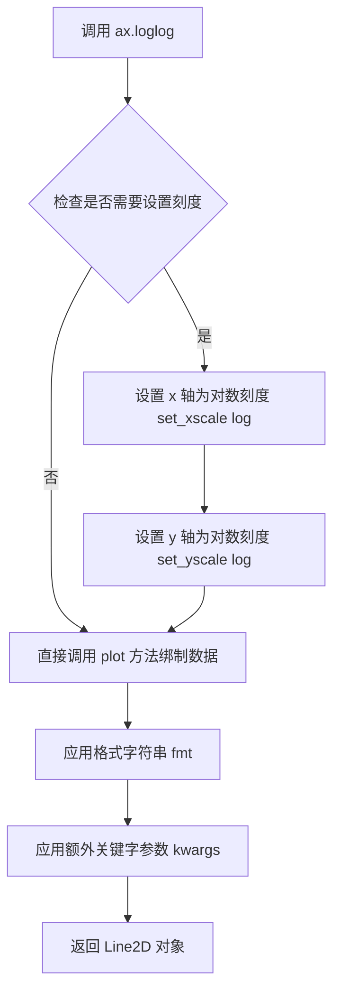

#### 带注释源码

```python
# 以下是 matplotlib 中 loglog 方法的核心实现逻辑
# 位置：lib/matplotlib/axes/_axes.py

def loglog(self, *args, **kwargs):
    """
    使用对数刻度绑制 x 和 y 坐标。
    
    等价于: set_xscale('log'); set_yscale('log'); plot(x, y)
    """
    # 1. 设置 x 轴为对数刻度
    self.set_xscale('log')
    
    # 2. 设置 y 轴为对数刻度
    self.set_yscale('log')
    
    # 3. 调用基类 plot 方法绑制数据
    #    返回 Line2D 对象用于后续操作
    return self.plot(*args, **kwargs)

# ------------------------------
# 在示例代码中的实际使用：
# ------------------------------

# 数据准备
x = np.array([1, 10, 100, 1000])  # X 轴数据

# 绑制双对数图
# 等价于: ax3.set_xscale('log'); ax3.set_yscale('log'); ax3.plot(x, 5 * x, 'o--')
ax3.loglog(x, 5 * x, 'o--')  # 'o--' 表示圆形标记 + 虚线

# 添加标题和网格
ax3.set(title='loglog')
ax3.grid()                    # 显示主网格线
ax3.grid(which="minor", color="0.9")  # 显示次网格线（淡灰色）
```


# 文档生成失败

## 问题分析

提供的代码是一个 **matplotlib 绘图的示例脚本**，用于展示对数刻度坐标轴的使用方法。该代码中**不包含 `ax.set()` 方法的定义**，而是调用了 matplotlib 库的 `Axes.set()` 方法。

代码中涉及的方法调用包括：
- `ax.set(title='...')` - 设置标题
- `ax.set_yscale('log', ...)` - 设置Y轴为对数刻度
- `ax.set_yticks(...)` - 设置Y轴刻度

## 说明

`ax.set()` 是 matplotlib 库中 `matplotlib.axes.Axes` 类的成员方法，**其实现位于 matplotlib 库源码中**，不在当前提供的代码范围内。

如果您需要提取 **matplotlib 库中 `Axes.set()` 方法**的详细信息，请提供：
1. matplotlib 库源码中 `Axes.set()` 方法的具体定义
2. 或者明确说明需要基于 matplotlib 官方文档生成该方法的文档

## 当前代码的实际功能

该代码演示了 matplotlib 中对数刻度坐标轴的多种用法：
- `semilogx()` - X轴对数刻度
- `semilogy()` - Y轴对数刻度  
- `loglog()` - X、Y轴均为对数刻度
- `set_yscale('log', base=2)` - 自定义对数底数
- 处理负值的两种策略：`nonpositive='mask'` 和 `nonpositive='clip'`


### `Axes.set_title`

设置坐标轴的标题文本和样式。

参数：

- `label`：`str`，标题文本内容，用于指定要显示的标题字符串
- `loc`：`{'center', 'left', 'right'}`，可选，标题的水平对齐方式，默认为 'center'
- `pad`：`float`，可选，标题与坐标轴顶部之间的偏移量（单位为点）
- `fontdict`：`dict`，可选，标题文本的字体属性字典，可用于批量设置字体样式
- `**kwargs`：可变参数，`matplotlib.text.Text` 支持的属性，如 fontsize、fontweight、color 等

返回值：`matplotlib.text.Text`，返回创建的文本对象，可以用于后续的样式修改或属性访问

#### 流程图

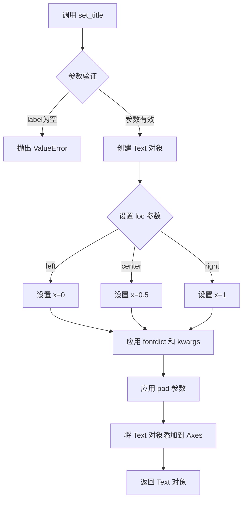

#### 带注释源码

```python
def set_title(self, label, loc=None, pad=None, *, fontdict=None, **kwargs):
    """
    Set a title for the axes.

    Parameters
    ----------
    label : str
        Title text to set.

    loc : {'center', 'left', 'right'}, default: 'center'
        Which title to set.

    pad : float
        The offset of the title from the top of the axes, in points.

    fontdict : dict
        A dictionary controlling the appearance of the title text.

    **kwargs
        Text properties.

    Returns
    -------
    `.Text`
        The matplotlib text instance representing the title.
    """
    # 获取默认的标题位置（优先使用参数，否则使用rcParams配置）
    if loc is None:
        loc = mpl.rcParams['axes.titlelocation']
    
    # 验证 loc 参数的有效性
    if loc not in ['center', 'left', 'right']:
        raise ValueError(f"'loc' must be one of 'center', 'left', or 'right', got '{loc}'")

    # 根据 loc 参数设置 x 坐标（left=0, center=0.5, right=1）
    if loc == 'left':
        x = 0
    elif loc == 'center':
        x = 0.5
    else:  # loc == 'right'
        x = 1
    
    # 获取默认的标题垂直偏移量（如果未指定）
    if pad is None:
        pad = mpl.rcParams['axes.titlepad']
    
    # 创建 Text 对象，设置标题文本和位置
    title = self.text(x, 1.0, label, transform=self.transAxes, **kwargs)
    
    # 设置标题的水平和垂直对齐方式
    title.set_ha(loc)  # horizontal alignment
    title.set_va('top')  # vertical alignment
    
    # 应用 fontdict 中的样式（如果提供）
    if fontdict is not None:
        title.update(fontdict)
    
    # 设置标题的偏移量（相对于坐标轴顶部的距离）
    title.set_pad(pad)
    
    # 返回创建的 Text 对象
    return title
```


### `Axes.set_yscale`

设置y轴刻度类型的方法，用于将y轴从默认的线性刻度切换为对数刻度（log）、符号对数刻度（symlog）等其他刻度类型。

参数：

- `scale`：`str`，要设置的刻度类型，如 `'linear'`、`'log'`、`'symlog'`、`'logit'` 等
- `base`：`float`（可选），对数刻度的底数，默认为10
- `nonpositive`：`str`（可选），处理非正数值的方式，可选 `'mask'`（屏蔽）或 `'clip'`（裁剪为小的正数），默认取决于scale

返回值：`None`，该方法直接修改Axes对象的状态，不返回任何值

#### 流程图

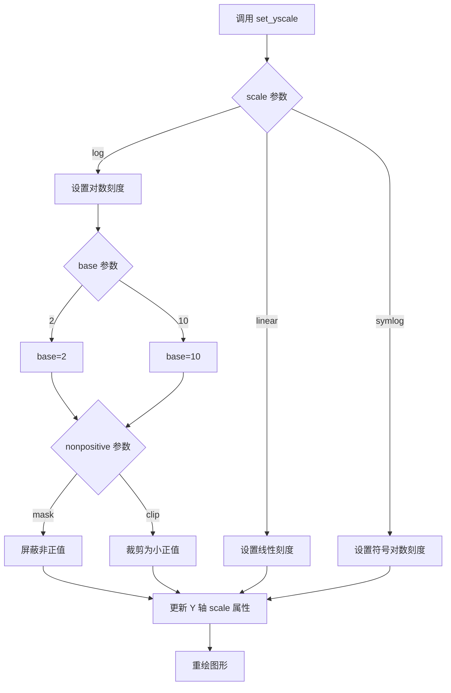

#### 带注释源码

```python
# 示例1：设置y轴为以2为底的对数刻度
ax.set_yscale('log', base=2)
# 'log' 指定使用对数刻度
# base=2 指定对数底数为2（默认是10）

# 示例2：设置y轴为对数刻度，并屏蔽非正值
ax.set_yscale("log", nonpositive='mask')
# nonpositive='mask' 表示将非正值屏蔽，不显示

# 示例3：设置y轴为对数刻度，并将非正值裁剪为小正值
ax.set_yscale("log", nonpositive='clip')
# nonpositive='clip' 表示将非正值裁剪为很小的正值以便显示
```


### `Axes.set_yticks`

设置y轴刻度位置，用于自定义y轴上的刻度线和刻度标签。

参数：

- `ticks`：`list[float]` 或 `array-like`，y轴刻度的位置数组
- `labels`：`list[str]` 或 `array-like`，可选参数，刻度标签文本
- `minor`：`bool`，可选参数，默认为`False`，是否设置次要刻度

返回值：`list of Text`，返回设置后的刻度标签对象列表

#### 流程图

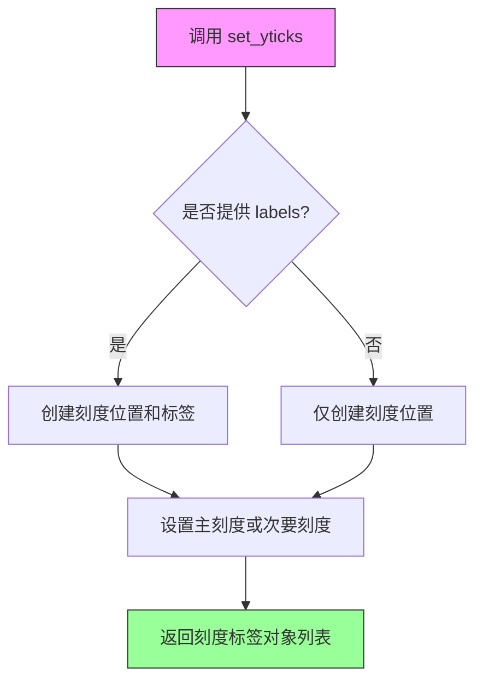

#### 带注释源码

```python
def set_yticks(self, ticks, labels=None, *, minor=False):
    """
    Set the y-axis tick locations and labels.
    
    Parameters
    ----------
    ticks : array-like
        List of y-axis tick locations.
    labels : array-like, optional
        List of y-axis tick labels.
    minor : bool, default: False
        If ``False``, get/set major ticks/labels;
        if ``True``, get/set minor ticks/labels.
    
    Returns
    -------
    list of `~.text.Text`
        The used labels.
    
    Notes
    -----
    The resulting labels will be automatically rendered later,
    so their text (even if it is identical to the input) cannot be
    retrieved until then.
    
    Examples
    --------
    >>> ax.set_yticks([1, 2, 3], ['a', 'b', 'c'])
    """
    # 获取ytick 属性字典
    y = self.yaxis
    # 根据minor参数选择主刻度或次要刻度
    locators = y.get_major_locator() if not minor else y.get_minor_locator()
    
    # 设置刻度位置
    if len(ticks) > 0:
        # 将刻度位置转换为适当的数据类型
        ticks = np.asarray(ticks, dtype=float)
    else:
        ticks = []
    
    # 设置刻度定位器
    if not minor:
        y.set_major_locator(mticker.FixedLocator(ticks))
        # 如果提供了标签，设置主要刻度标签
        if labels is not None:
            y.set_major_formatter(mticker.FixedFormatter(labels))
    else:
        y.set_minor_locator(mticker.FixedLocator(ticks))
        # 如果提供了标签，设置次要刻度标签
        if labels is not None:
            y.set_minor_formatter(mticker.FixedFormatter(labels))
    
    # 返回刻度标签对象列表用于后续操作
    return y.get_ticklabels(minor=minor)
```


### `ax.grid()`

在matplotlib中，`ax.grid()`是`Axes`类的方法，用于在图表上显示或隐藏网格线。该方法可以控制主网格和次网格的显示，指定显示的轴（x轴、y轴或两者），并通过关键字参数自定义网格线的外观样式。

参数：

- `b`：`bool`或`None`，可选，用于显示或隐藏网格线。`True`显示网格，`False`隐藏网格，`None`切换当前状态
- `which`：`str`，可选，值为`'major'`、`'minor'`或`'both'`，指定显示哪个刻度级别的网格，默认为`'major'`
- `axis`：`str`，可选，值为`'both'`、`'x'`或`'y'`，指定在哪个轴上显示网格，默认为`'both'`
- `**kwargs`：可选，关键字参数传递给`matplotlib.lines.Line2D`构造函数，用于自定义网格线的外观，如颜色、线型、线宽等

返回值：`None`，该方法直接修改图表的网格显示，不返回任何值

#### 流程图

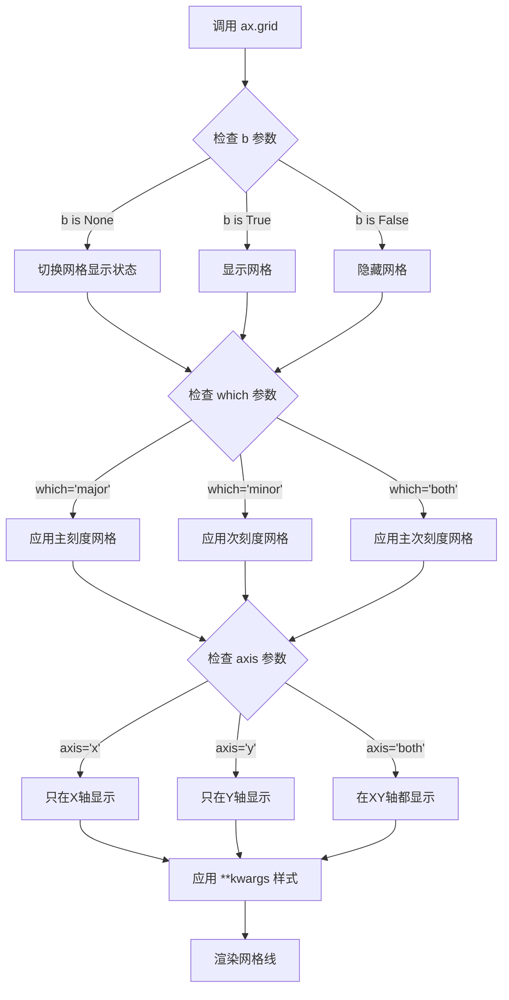

#### 带注释源码

```python
# 示例代码中 ax.grid() 的使用方式：

# 1. 基本用法 - 显示主网格线
ax1.grid()  # 在ax1上显示默认的网格线（主刻度，XY轴）

# 2. 显示次网格线（更细的网格）
ax1.grid(which="minor", color="0.9")  # 显示次刻度网格，颜色为浅灰色(0.9亮度)

# 3. 另一种调用方式 - 通过yaxis属性
ax.yaxis.grid()  # 专门针对Y轴显示网格，等效于ax.grid(axis='y')
```

```python
# matplotlib.axes.Axes.grid() 核心实现逻辑（简化版）

def grid(self, b=None, which='major', axis='both', **kwargs):
    """
    配置网格线显示。
    
    参数:
        b: bool or None - 是否显示网格
        which: {'major', 'minor', 'both'} - 网格线刻度级别
        axis: {'both', 'x', 'y'} - 网格线轴向
        **kwargs: 传递给Line2D的样式参数
    """
    # 获取网格线的显示状态
    if b is None:
        # 如果b为None，切换当前网格状态
        b = not self._gridOnMajor if which in ('major', 'both') else not self._gridOnMinor
    
    # 设置对应刻度级别的网格状态
    if which in ('major', 'both'):
        self._gridOnMajor = b
    if which in ('minor', 'both'):
        self._gridOnMinor = b
    
    # 记录网格样式参数
    self._gridKw = kwargs
    
    # 重新绘制图表
    self.stale_callback()
```


### `ax.bar()`

用于在 Axes 上绑制柱状图，接收类别和对应的数值数据，并支持自定义柱子宽度、底部位置、对齐方式等属性。

参数：

-  `x`：`array-like`，柱子的 x 坐标或类别标签（如代码中的 `["L1 cache", "L2 cache", "L3 cache", "RAM", "SSD"]`）
-  `height`：`array-like`，柱子的高度（如代码中的 `[32, 1_000, 32_000, 16_000_000, 512_000_000]`）
-  `width`：`float or array-like`，柱子的宽度，默认 `0.8`
-  `bottom`：`float or array-like`，柱子的底部 y 坐标，默认 `None`（即从 0 开始）
-  `align`：`{'center', 'edge'}`，柱子与 x 坐标的对齐方式，默认 `'center'`
-  `data`：`indexable object`，可选，用于传递带有标签的数据
-  `**kwargs`：其他关键字参数，用于设置 `Rectangle` 属性（如颜色、边框等）

返回值：`~matplotlib.container.BarContainer` 或 `tuple` of such，包含柱子对象的容器，可迭代。

#### 流程图

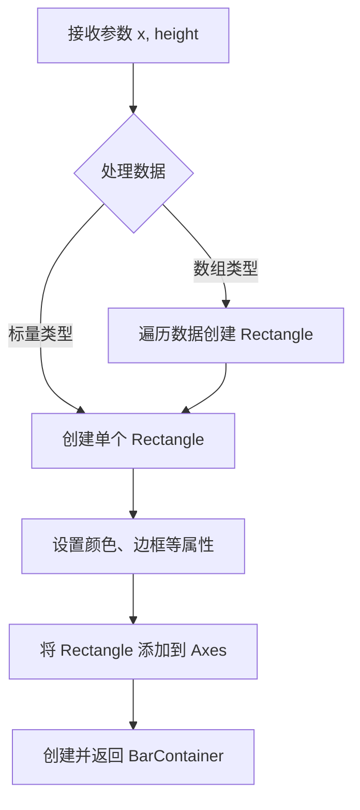

#### 带注释源码

```python
# 调用 ax.bar() 方法绑制柱状图
# x: 类别标签列表
# height: 对应的数值列表
ax.bar(["L1 cache", "L2 cache", "L3 cache", "RAM", "SSD"],  # 类别
       [32, 1_000, 32_000, 16_000_000, 512_000_000])          # 数值
```


### `ax.errorbar()`

该函数是Matplotlib库中`matplotlib.axes.Axes`类的实例方法，用于绘制带有误差棒的散点图或折线图。在给定的代码中，被用于展示在对数刻度下处理负值误差的两种方式（mask和clip）。

**注意**：该方法是Matplotlib库的内部实现，不存在于用户提供的代码文件中。以下信息基于Matplotlib官方文档和代码中的调用示例提取。

---

参数：

- `x`：`array-like`，X轴数据点
- `y`：`array-like`，Y轴数据点  
- `yerr`：`scalar`, `array-like`, `shape (N,)` 或 `shape (2, N)`，Y轴误差值
- `xerr`：`scalar`, `array-like`, `shape (N,)` 或 `shape (2, N)`，X轴误差值（可选）
- `fmt`：`str`，数据点的格式字符串，如 `'o'` 表示圆点，`'o--'` 表示虚线连接的点
- `ecolor`：`color`，误差棒的颜色
- `elinewidth`：`float`，误差棒线条宽度
- `capsize`：`float`，误差棒端点（cap）的大小
- `capthick`：`float`，误差棒端点线条厚度
- `barsabove`：`bool`，是否将误差棒绘制在数据点下方
- `lolims` / `uplims` / `xlolims` / `xuplims`：`bool`，限制显示的边界
- `err_kw`：`dict`，其他误差棒参数
- `**kwargs`：其他关键字参数传递给`~.axes.Axes.plot`

返回值：`~.container.ErrorbarContainer`，包含数据线、误差棒和标签的容器

---

#### 流程图

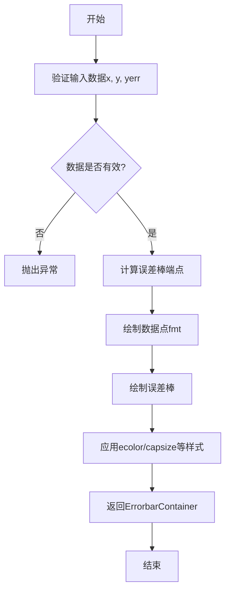

---

#### 带注释源码

基于代码中实际调用的示例：

```python
# 代码中的实际调用示例
x = np.linspace(0.0, 2.0, 10)       # 生成0.0到2.0之间的10个等间距点
y = 10**x                           # y = 10^x
yerr = 1.75 + 0.75*y                # 误差值随y值增加而增加

# 调用errorbar方法（在对数刻度的Axes上）
ax1.errorbar(x, y, yerr=yerr, fmt='o', capsize=5)

# 参数说明：
# - x: 自变量数组
# - y: 因变量数组  
# - yerr: 误差值，可以是标量或数组
# - fmt='o': 使用圆形标记绘制数据点
# - capsize=5: 误差棒端点长度为5个点
```

---

#### 关键组件信息

| 名称 | 描述 |
|------|------|
| `ErrorbarContainer` | 包含数据线、误差线和标签的容器对象 |
| `Line2D` | 数据点的连线（通过fmt参数指定） |
| `ErrorbarLine` | 误差棒图形 |

#### 潜在的技术债务或优化空间

1. **硬编码参数**：代码中使用了硬编码的误差计算公式 `yerr = 1.75 + 0.75*y`，建议封装为可配置函数
2. **重复代码**：两次调用`errorbar`的代码结构相似，可抽取为通用函数
3. **Magic Numbers**：误差系数1.75和0.75应定义为具名常量

#### 其它项目

- **设计目标**：展示对数刻度下负误差值的两种处理方式
- **约束条件**：非正值数据无法直接在对数刻度上显示
- **错误处理**：当数据包含非正值且未设置`nonpositive`参数时，会抛出`ValueError`
- **数据流**：输入数据(x, y, yerr) → 误差计算 → 图形渲染 → 返回容器对象
- **外部依赖**：NumPy（数据生成）、Matplotlib（绘图）


### `ax.plot()`

`ax.plot()` 是 Matplotlib 中 Axes 类的核心方法，用于绑制线图。它接受 x 和 y 数据以及可选的格式字符串，创建一个或多个线条并返回 Line2D 对象列表。

参数：

- `x`：`array-like`，x 轴数据，可选。如果未提供，则默认为 `range(len(y))`
- `y`：`array-like`，y 轴数据，必需。要绑制的数值数据
- `fmt`：`str`，可选的格式字符串，例如 `'o--'` 表示圆形标记和虚线
- `data`：`indexable`，可选，一个带标签的数据对象，用于通过标签访问数据
- `**kwargs`：`关键字参数`，可选，包括：
  - `color`：`str`，线条颜色
  - `linewidth`：`float`，线条宽度
  - `linestyle`：`str`，线条样式（如 `'-'`、`'--'`、`':'`）
  - `marker`：`str`，标记样式
  - `label`：`str`，图例标签
  - 等等其他 Line2D 属性

返回值：`list[matplotlib.lines.Line2D]`，返回创建的线条对象列表，每个 Line2D 对象代表一条绑制的线

#### 流程图

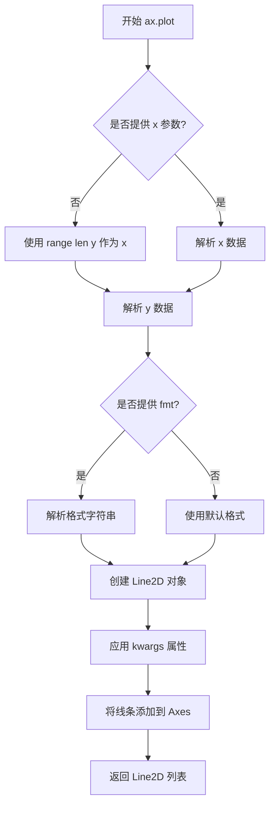

#### 带注释源码

```python
# ax.plot() 是 matplotlib.axes.Axes 类的方法
# 简化版实现原理：

def plot(self, *args, **kwargs):
    """
    绑制线条图
    
    参数:
    ------
    *args : 位置参数
        可以是:
        - plot(y) # 只提供 y 数据
        - plot(x, y) # 提供 x 和 y 数据
        - plot(x, y, format_string) # 提供数据和格式
    **kwargs : 关键字参数
        Line2D 的属性, 如 color, linewidth, marker 等
        
    返回:
    ------
    list of Line2D
        绑制的线条对象列表
    """
    
    # 1. 解析位置参数 args
    # 检查参数数量和类型
    if len(args) == 1:
        # 只有 y 数据
        y = np.asarray(args[0])
        x = np.arange(len(y))
    elif len(args) == 2:
        # x 和 y 数据
        x = np.asarray(args[0])
        y = np.asarray(args[1])
    elif len(args) == 3:
        # x, y 和格式字符串
        x = np.asarray(args[0])
        y = np.asarray(args[1])
        fmt = args[2]
    else:
        raise ValueError("参数数量不正确")
    
    # 2. 解析格式字符串 (如 'o--')
    # 格式: [marker][line][color]
    # 例如: 'o--' = 圆形标记 + 虚线 + 默认颜色
    
    # 3. 创建 Line2D 对象
    # Line2D 是表示单条线的核心类
    line = mlines.Line2D(x, y)  # 创建线条对象
    
    # 4. 应用格式和样式
    if fmt:
        line.set_marker(fmt[0])      # 设置标记
        line.set_linestyle(fmt[1:] if len(fmt) > 1 else '-')  # 设置线型
    
    # 5. 应用 kwargs 中的其他属性
    # 例如: color='red', linewidth=2, label='data'
    for key, value in kwargs.items():
        # 使用 set_* 方法设置属性
        setter = getattr(line, f'set_{key}', None)
        if setter:
            setter(value)
    
    # 6. 将线条添加到 Axes
    self.lines.append(line)
    
    # 7. 返回 Line2D 对象列表
    # 调用者可以保存返回的 line 对象以便后续修改
    return [line]
```

#### 在示例代码中的使用

```python
# 示例 1: 使用 semilogx (底层调用 set_xscale + plot)
ax1.semilogx(t, np.sin(2 * np.pi * t))
# 等价于:
ax1.set_xscale('log')
ax1.plot(t, np.sin(2 * np.pi * t))

# 示例 2: 使用 semilogy
ax2.semilogy(4*x, 10**x, 'o--')
# 等价于:
ax2.set_yscale('log')
ax2.plot(4*x, 10**x, 'o--')

# 示例 3: 使用 loglog (双对数)
ax3.loglog(x, 5 * x, 'o--')
# 等价于:
ax3.set_xscale('log')
ax3.set_yscale('log')
ax3.plot(x, 5 * x, 'o--')
```

#### 关键技术点

| 特性 | 说明 |
|------|------|
| 对数刻度设置 | 通过 `set_xscale('log')` 或 `set_yscale('log')` 启用 |
| 负值处理 | `nonpositive='mask'` 隐藏负值, `nonpositive='clip'` 裁剪为小正值 |
| 格式字符串 | 语法: `[marker][line][color]`, 如 `'o--'` 表示圆点+虚线 |
| 网格显示 | `grid()` 显示主网格, `grid(which="minor")` 显示次网格 |


### `plt.show()`

显示所有当前已创建的图形窗口，并进入交互式显示模式。该函数会阻塞程序执行直到用户关闭所有图形窗口（在某些后端中），或者在非交互式环境中渲染并显示图像。

**注意**：此代码中`plt.show()`位于脚本末尾，用于展示前文创建的所有对数刻度图表（包含semilogx、semilogy、loglog三种模式以及误差棒图的演示）。

参数：无需参数

返回值：`None`，无返回值

#### 流程图

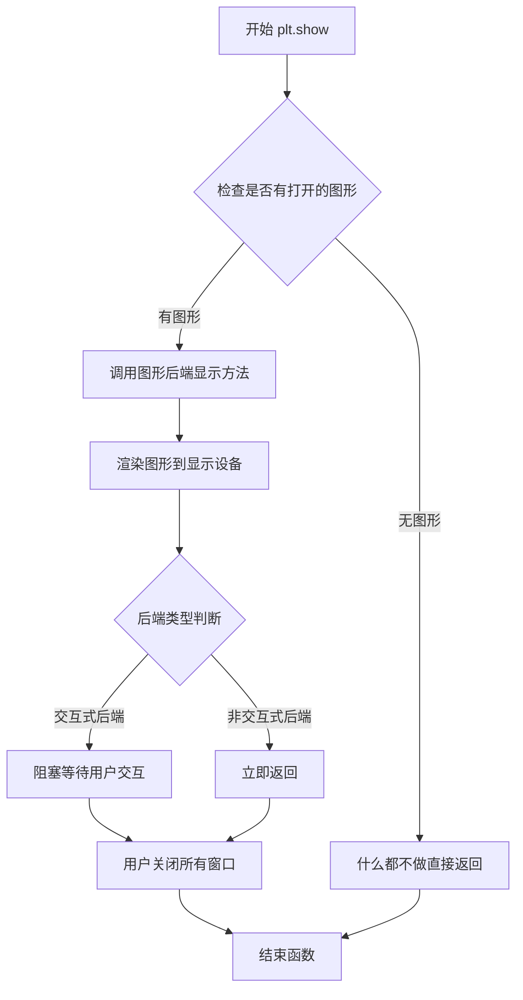

#### 带注释源码

```python
def show(*, block=None):
    """
    显示所有打开的图形窗口。
    
    参数:
        block: bool, optional
            对于交互式后端，是否阻塞程序执行。
            None表示自动判断，True表示阻塞，False表示不阻塞。
            
    返回值:
        None
    """
    # 获取全局的FigureManagerBase列表
    # _pylab_helpers.GcfDestroyAllFigures() 管理所有图形
    
    # 对于不同后端有不同实现：
    # - TkAgg后端: 调用show()显示TK窗口，进入mainloop
    # - Qt后端: 调用QApplication.exec_()
    # - notebook后端: 在单元格中显示图像
    # -Agg后端(非交互式): 渲染图像到内存
    
    # 核心逻辑简化的伪代码:
    for manager in get_all_fig_managers():
        manager.show()  # 调用后端的显示方法
    
    if block is True:
        # 某些后端会在这里阻塞
        wait_for_buttonpress()
    
    return None
```

**在当前代码上下文中的调用位置**：

```python
# ... 前文创建了多个子图和图形 ...

# 6个示例图形的创建:
# 1. fig, (ax1, ax2, ax3) - 三个子图展示semilogx/semilogy/loglog
# 2. fig, ax - 柱状图展示不同内存大小
# 3. fig, (ax1, ax2) - 误差棒图对比mask和clip处理负值

plt.show()  # <-- 在此处调用，显示上述所有6个axes的所有图形
```

**技术细节**：
- `plt.show()`会调用所有注册在`_pylab_helpers`中的FigureCanvas的`show()`方法
- 对于交互式后端（如Tk、Qt），通常会启动事件循环
- 对于非交互式后端（如Agg），会刷新渲染缓冲区


## 关键组件


### 对数刻度轴 (Logarithmic Axes)

使用 `set_xscale('log')` 和 `set_yscale('log')` 将x/y轴设置为对数刻度，实现跨越多个数量级的数据可视化

### 半对数坐标函数 (Semi-log Functions)

`semilogx`（x轴对数）、`semilogy`（y轴对数）、`loglog`（双对数）是快捷函数，封装了set_xscale/set_yscale + plot的组合操作

### 对数底数设置 (Base Parameter)

通过 `base` 参数自定义对数刻度的底数，如 `base=2` 实现以2为底的对数刻度，适用于计算机内存等二进制相关数据的展示

### 非正值处理策略 (Nonpositive Handling)

对数刻度无法处理非正值，提供两种策略：`nonpositive='mask'` 掩码无效值使数据点消失，`nonpositive='clip'` 裁剪为小正值保留误差棒视觉

### 次要网格线 (Minor Grid)

通过 `grid(which="minor")` 和 `grid(which="major")` 分别控制次要和主要网格线，增强对数刻度下的可读性

### 误差棒与对数刻度结合 (Errorbar Integration)

`errorbar` 函数在对数刻度下的行为演示，展示如何处理包含负值的误差线数据


## 问题及建议


### 已知问题

-   **魔法数字和硬编码值**：多处使用硬编码数值（如`0.01`、`10.0`、`4`、`0.9`、颜色值等），缺乏常量定义，降低了代码可读性和可维护性
-   **代码重复**：网格设置代码`ax.grid()`和`ax.grid(which="minor", color="0.9")`在多处重复出现，未封装为可复用函数
-   **数据与视图未分离**：数据生成逻辑（如`np.arange`、`np.linspace`）与绘图代码紧密耦合，不利于单元测试和代码复用
-   **缺乏错误处理**：数据处理和绘图过程中没有任何异常捕获机制（如负数处理、NaN值、空数组等边界情况）
-   **全局变量污染**：所有变量（`t`, `x`, `y`, `yerr`等）均为全局作用域声明，缺乏适当的封装
-   **标签字符串硬编码**：yticks标签`['kB', 'MB', 'GB', 'TB']`硬编码在代码中，不利于国际化

### 优化建议

-   **提取常量**：将常用数值（时间范围、颜色、标签等）提取为模块级常量或配置文件
-   **封装辅助函数**：创建`setup_grid(ax)`等辅助函数，消除重复代码
-   **数据生成函数化**：将数据准备逻辑封装为独立函数，如`generate_error_data()`，实现数据与视图分离
-   **添加参数化配置**：使用`dataclass`或`NamedTuple`定义图表配置对象，提高可配置性
-   **增强错误处理**：对输入数据添加验证逻辑，处理NaN、Inf、负值等异常情况
-   **考虑使用类封装**：对于复杂的图表系列，可考虑封装为matplotlib自定义图表类


## 其它


### 设计目标与约束

本代码旨在演示Matplotlib中对数刻度绑图的多种用法，包括单对数轴（semilogx/semilogy）、双对数轴（loglog）、自定义底数对数刻度，以及处理负值的两种策略（mask和clip）。约束条件：对数刻度不支持非正值，必须预先处理零和负数。

### 错误处理与异常设计

代码主要依赖Matplotlib的内部错误处理。当传入非正值且未指定nonpositive参数时，Matplotlib会自动抛出异常或产生警告。clip模式下负值会被隐式转换为最小正数，mask模式下负值会被忽略。图形绑制错误（如无效的数据类型）会由底层NumPy和Matplotlib捕获并显示。

### 数据流与状态机

数据流：NumPy生成原始数据 → Matplotlib创建Figure和Axes → 设置对数刻度（set_xscale/set_yscale） → 绑制图形（plot/bar/errorbar） → 显示图形（plt.show()）。状态机：Figure创建 → Axes创建 → 刻度类型设置 → 图形元素添加 → 显示。

### 外部依赖与接口契约

依赖：matplotlib.pyplot（图形绑制）、numpy（数值计算）。核心接口：plt.subplots()返回(Figure, Axes)元组；Axes.semilogx/semilogy/loglog是set_scale+plot的快捷组合；set_yscale('log', base=...)设置底数；set_yscale('log', nonpositive='mask'|'clip')处理非正值。

### 性能考虑

本代码为示例脚本，性能非主要关注点。实际应用中，大数据集绑制对数刻度时需注意：LogScale计算开销高于线性刻度；mask操作会创建布尔掩码数组；clip操作可能影响数据精度。

### 可配置性分析

代码展示了多处可配置点：刻度类型（'log'/'linear'）、对数底数（base参数）、非正值处理策略（nonpositive参数）、网格线显示（grid和minor grid）、刻度标签自定义（set_yticks + labels参数）。

### 测试与验证建议

应验证：传入包含零/负值的数据时的行为；不同base值（2, 10, e）的刻度显示；mask和clip模式下误差棒的渲染差异；多子图布局下的刻度对齐。

    