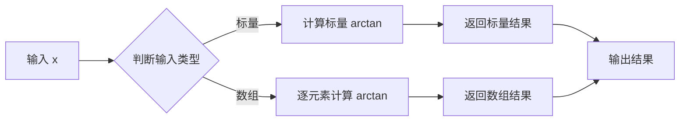
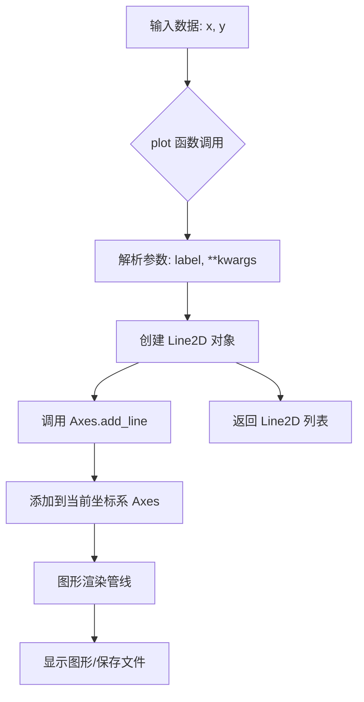
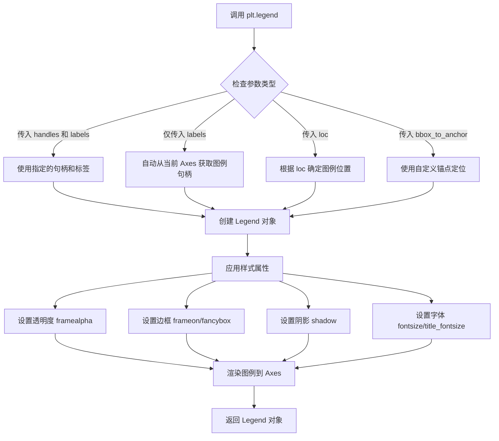
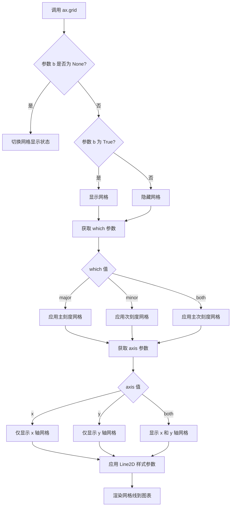
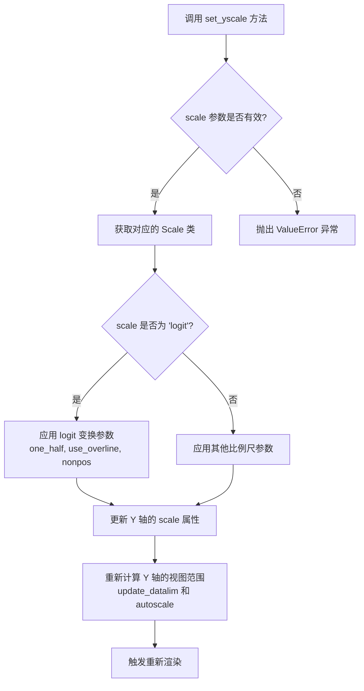
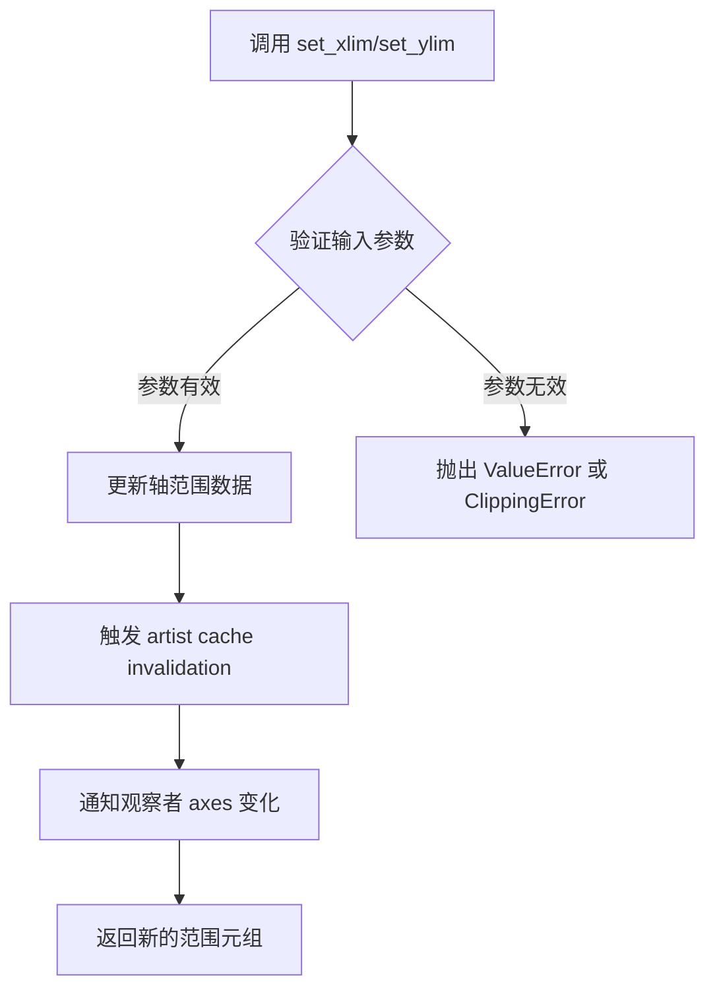
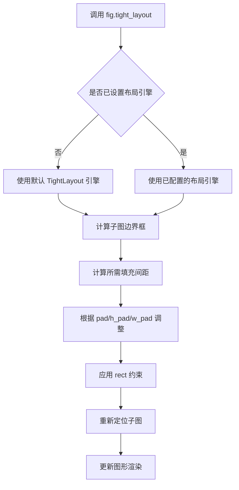
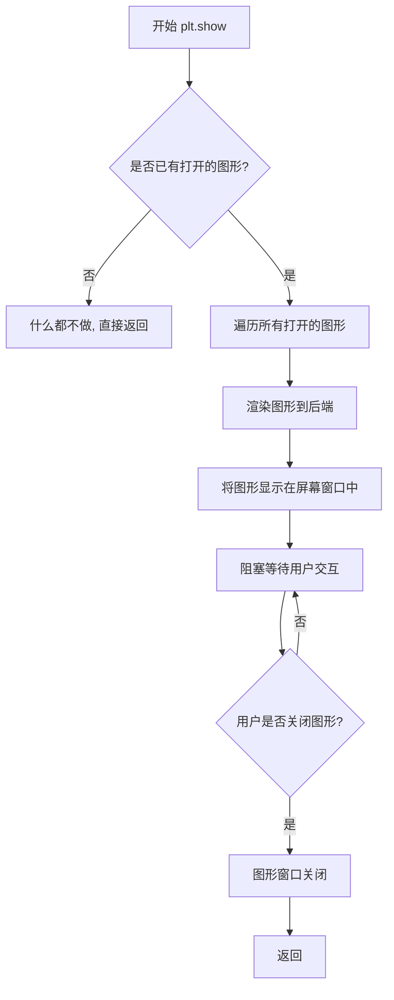

# `matplotlib\galleries\examples\scales\logit_demo.py` 详细设计文档

这是一个展示matplotlib中logit比例尺功能的可视化示例脚本，通过生成正态分布、拉普拉斯分布和柯西分布的累积分布函数（CDF），对比展示logit比例尺与线性比例尺在可视化概率分布时的差异，特别是logit比例尺能够有效展开接近0和1的概率值区域。

## 整体流程

```mermaid
graph TD
    A[开始] --> B[设置xmax=10]
    B --> C[生成x轴数据: np.linspace(-10, 10, 10000)]
    C --> D[计算正态分布CDF: cdf_norm]
    D --> E[计算拉普拉斯分布CDF: cdf_laplacian]
    E --> F[计算柯西分布CDF: cdf_cauchy]
    F --> G[创建3x2子图: plt.subplots]
    G --> H[循环遍历所有子图]
    H --> I[绘制三条CDF曲线并添加图例和网格]
    I --> J[配置第一行子图: logit scale标准形式]
    J --> K[配置第二行子图: logit scale使用overline和1/2表示]
    K --> L[配置第三行子图: linear scale线性比例尺]
    L --> M[调整布局: fig.tight_layout]
    M --> N[显示图像: plt.show]
```

## 类结构

```
该代码为脚本文件，无面向对象类结构
主要依赖第三方库: matplotlib.pyplot, numpy, math
流程式编程模式，自上而下执行
```

## 全局变量及字段


### `xmax`
    
全局变量，值为10，表示x轴范围的正负边界

类型：`int`
    


### `x`
    
全局变量，通过np.linspace生成从-10到10的10000个等间距点

类型：`numpy.ndarray`
    


### `cdf_norm`
    
全局变量，正态分布的累积分布函数值列表

类型：`list`
    


### `cdf_laplacian`
    
全局变量，拉普拉斯分布的累积分布函数值数组

类型：`numpy.ndarray`
    


### `cdf_cauchy`
    
全局变量，柯西分布的累积分布函数值数组

类型：`numpy.ndarray`
    


### `fig`
    
全局变量，创建的图形对象

类型：`matplotlib.figure.Figure`
    


### `axs`
    
全局变量，3x2的子图数组

类型：`numpy.ndarray (matplotlib.axes.Axes对象数组)`
    


    

## 全局函数及方法


### `math.erf`

计算误差函数（Error Function），用于统计学中正态分布的累积分布函数计算。误差函数定义为 erf(x) = (2/√π) ∫₀ˣ e^(-t²) dt，输出值域为 [-1, 1]。

参数：

- `x`：`float`，输入的自变量值，表示需要计算误差函数的位置

返回值：`float`，返回输入 x 的误差函数值，范围在 [-1, 1] 之间

#### 流程图

```mermaid
flowchart TD
    A[开始计算 math.erf] --> B{输入参数 x}
    B -->|x 为数值类型| C[调用 C 语言底层实现]
    B -->|x 为非数值类型| D[抛出 TypeError 异常]
    C --> E[计算积分结果]
    E --> F[返回 erf(x) 结果]
    
    subgraph "底层计算"
    C
    E
    end
```

#### 带注释源码

```python
# math.erf 是 Python 标准库 math 模块中的数学函数
# 用于计算误差函数（Error Function）
# 
# 误差函数定义：erf(x) = (2/√π) ∫₀ˣ e^(-t²) dt
# 
# 在代码中的使用方式：
# cdf_norm = [math.erf(w / np.sqrt(2)) / 2 + 1 / 2 for w in x]
# 
# 这里的用法是将误差函数转换为标准正态分布的累积分布函数（CDF）：
# CDF(x) = (1 + erf(x/√2)) / 2
# 
# 参数说明：
#   - w: float，来自 numpy 数组 x 的每个元素
#   - w / np.sqrt(2): 标准化处理，将输入值转换为标准正态分布形式
# 
# 返回值：
#   - math.erf() 返回 float 类型的误差函数值，范围 [-1, 1]
#   - 乘以 1/2 加 1/2 将结果映射到 [0, 1]，即概率范围

# 示例计算过程：
# 1. 对于 x = 0，erf(0) = 0，CDF = 0.5（概率 50%）
# 2. 对于 x = 1，erf(1/√2) ≈ 0.6827，CDF ≈ 0.8413
# 3. 对于 x = -1，erf(-1/√2) ≈ -0.6827，CDF ≈ 0.1587
```


### `numpy.linspace`

该函数用于在指定的间隔内生成等间距的数组。在给定的代码中，它用于生成从 `-xmax` 到 `xmax` 的一万个等间距数值，作为绘制概率分布曲线的 x 轴坐标。

参数：

- `start`：`float` 或 `array_like`，序列的起始值，在本代码中为 `-xmax`（即 -10）
- `stop`：`float` 或 `array_like`，序列的结束值，在本代码中为 `xmax`（即 10）
- `num`：`int`，要生成的样本数量，在本代码中为 `10000`

返回值：`ndarray`，一个包含 `num` 个等间距样本的数组

#### 流程图

```mermaid
flowchart TD
    A[开始 linspace] --> B[接收 start, stop, num 参数]
    B --> C{endpoint=True?}
    C -->|是| D[包含 stop 点]
    C -->|否| E[不包含 stop 点]
    D --> F[计算步长 step = (stop - start) / (num - 1)]
    E --> G[计算步长 step = (stop - start) / num]
    F --> H[生成等间距数组]
    G --> H
    H --> I[返回 ndarray 数组]
```

#### 带注释源码

```python
# numpy.linspace 的典型调用方式
# start: 序列起始值
# stop: 序列结束值  
# num: 生成的样本数量

x = np.linspace(-xmax, xmax, 10000)

# 等价于:
# x = np.linspace(start=-10, stop=10, num=10000)
#
# 生成的 x 是一个包含 10000 个元素的 ndarray
# 这些元素从 -10 到 10 等间距分布
# 步长 = (10 - (-10)) / (10000 - 1) = 20 / 9999 ≈ 0.002
#
# 结果示例:
# x[0]    ≈ -10.0000
# x[1]    ≈ -9.9980
# x[2]    ≈ -9.9960
# ...
# x[9999] = 10.0000
```


### `np.where`

条件筛选数组元素，根据给定的条件从两个数组或值中选择元素返回。

参数：

- `condition`：数组或布尔值，**条件表达式**。在代码中为 `x < 0`，用于判断每个元素是否小于零
- `x`：数组或标量，**条件为真时的返回值**。在代码中为 `1 / 2 * np.exp(x)`，计算拉普拉斯分布左侧的概率密度
- `y`：数组或标量，**条件为假时的返回值**。在代码中为 `1 - 1 / 2 * np.exp(-x)`，计算拉普拉斯分布右侧的概率密度

返回值：`ndarray`，返回与 `condition` 形状相同的数组，其中每个元素根据条件从 `x` 或 `y` 中选择

#### 流程图

```mermaid
flowchart TD
    A[开始] --> B[输入condition<br/>x < 0]
    B --> C{遍历数组元素}
    C --> D{condition[i]为真?}
    D -->|是| E[选择x[i]<br/>1/2 * np.exp(x)]
    D -->|否| F[选择y[i]<br/>1 - 1/2 * np.exp(-x)]
    E --> G[构建结果数组]
    F --> G
    G --> H[返回结果数组<br/>cdf_laplacian]
    H --> I[结束]
```

#### 带注释源码

```python
# 使用 np.where 实现分段函数计算拉普拉斯分布的累积分布函数
# 当 x < 0 时，使用指数分布的左侧公式: 1/2 * exp(x)
# 当 x >= 0 时，使用指数分布的右侧公式: 1 - 1/2 * exp(-x)

# 参数说明：
#   condition: x < 0  - 布尔数组，判断每个x值是否小于零
#   x: 1/2 * np.exp(x)  - 条件为真时的返回值（左侧概率）
#   y: 1 - 1/2 * np.exp(-x)  - 条件为假时的返回值（右侧概率）

cdf_laplacian = np.where(x < 0, 1 / 2 * np.exp(x), 1 - 1 / 2 * np.exp(-x))
# 结果：返回一个与x形状相同的数组，
#       小于0的位置取 1/2 * exp(x)
#       大于等于0的位置取 1 - 1/2 * exp(-x)
```


### `numpy.arctan`

该函数是NumPy库中的数学函数，用于计算输入数组或标量的反正切值（arctangent）。在示例代码中，`np.arctan(x)` 用于生成Cauchy分布的累积分布函数（CDF），通过将反正切值除以π再加1/2，将输出映射到概率范围[0,1]内。

参数：

- `x`：`numpy.ndarray` 或 `scalar`，输入值，可以是单个数值或NumPy数组，表示需要计算反正切的角度（以弧度为单位）

返回值：`numpy.ndarray` 或 `scalar`，返回输入值的反正切值，返回值的范围为(-π/2, π/2)

#### 流程图



#### 带注释源码

```python
# np.arctan 是 NumPy 库中的反正切函数
# 在本例中用于计算 Cauchy 分布的 CDF

# x 是输入的自变量，范围从 -10 到 10
x = np.linspace(-xmax, xmax, 10000)

# 使用 np.arctan(x) 计算反正切值
# 然后除以 π 并加 1/2，将结果归一化到 [0, 1] 区间
# 这正是 Cauchy 分布的累积分布函数形式
# Cauchy CDF: F(x) = 1/π * arctan(x) + 1/2
cdf_cauchy = np.arctan(x) / np.pi + 1 / 2
```


### `plt.subplots`

`plt.subplots` 是 matplotlib.pyplot 模块中的函数，用于创建一个图形窗口和一个包含多个子图的 Axes 数组网格。该函数简化了创建子图布局的过程，可以一次性生成具有指定行数和列数的子图网格，并返回图形对象和 Axes 对象（或对象数组），便于后续对各个子图进行操作和定制。

参数：

- `nrows`：`int`，默认值：1，子图网格的行数
- `ncols`：`int`，默认值：1，子图网格的列数
- `sharex`：`bool` 或 `{'none', 'all', 'row', 'col'}`，默认值：False，控制子图之间的 x 轴共享关系
- `sharey`：`bool` 或 `{'none', 'all', 'row', 'col'}`，默认值：False，控制子图之间的 y 轴共享关系
- `squeeze`：`bool`，默认值：True，如果为 True，则从返回的 Axes 数组中移除额外的维度
- `width_ratios`：array-like，长度为 ncols，可选，子图列的宽度比例
- `height_ratios`：array-like，长度为 nrows，可选，子图行的高度比例
- `wspace`：`float`，默认值：None，子图之间的水平间距（相对于子图宽度）
- `hspace`：`float`，默认值：None，子图之间的垂直间距（相对于子图高度）
- `figsize`：tuple of floats，可选，图形尺寸 (宽度, 高度)，单位为英寸
- `facecolor`：color 或 None，默认值：rcParams['axes.facecolor']，图形的背景颜色
- `edgecolor`：color 或 None，默认值：rcParams['axes.edgecolor']，图形的边框颜色
- `frameon`：`bool`，默认值：True，是否绘制图形边框
- `subplot_kw`：dict，可选，关键字参数传递给每个子图的 `add_subplot` 调用
- `gridspec_kw`：dict，可选，关键字参数传递给 `GridSpec` 构造函数
- `\*\*kwargs`：其他关键字参数传递给 `Figure.subplots` 方法

返回值：`tuple(Figure, Axes or array of Axes)`，返回一个元组，包含图形对象 (Figure) 和 Axes 对象或 Axes 对象数组。当 nrows=1 且 ncols=1 时，根据 squeeze 参数返回单个 Axes 或 1D 数组；当 nrows>1 或 ncols>1 时，返回 2D 数组（除非 squeeze=True 且满足特定条件）

#### 流程图

```mermaid
flowchart TD
    A[调用 plt.subplots 函数] --> B{传入参数验证}
    B -->|参数有效| C[创建 Figure 对象]
    C --> D[根据 nrows, ncols 创建子图网格]
    D --> E[计算子图布局和间距]
    E --> F[应用 gridspec_kw 和 subplot_kw 配置]
    F --> G[创建 Axes 对象数组]
    G --> H{sharex/sharey 设置?}
    H -->|是| I[配置子图轴共享]
    H -->|否| J{需要返回单Axes?}
    I --> J
    J -->|是| K[根据 squeeze 设置调整返回数组]
    K --> L[返回 (fig, axs) 元组]
    J -->|否| L
    B -->|参数无效| M[抛出 ValueError 异常]
```

#### 带注释源码

```python
# 示例代码中使用 plt.subplots 的方式
# 创建 3 行 2 列的子图网格，图形尺寸为 6.4 x 8.5 英寸
fig, axs = plt.subplots(nrows=3, ncols=2, figsize=(6.4, 8.5))

# 参数说明：
# - nrows=3: 创建 3 行子图
# - ncols=2: 创建 2 列子图
# - figsize=(6.4, 8.5): 设置图形宽度为 6.4 英寸，高度为 8.5 英寸
# - 默认 squeeze=True: 返回的 axs 将是 3x2 的 numpy 数组
# - 默认 sharex=False, sharey=False: 各子图独立坐标轴

# 返回值：
# - fig: Figure 对象，代表整个图形窗口
# - axs: numpy.ndarray，形状为 (3, 2)，包含 6 个 Axes 对象

# 访问单个子图的方式：
# axs[i, j]  # i 为行索引 (0-2)，j 为列索引 (0-1)

# 示例：遍历所有子图并绘制数据
for i in range(3):
    for j in range(2):
        axs[i, j].plot(x, cdf_norm, label=r"$\mathcal{N}$")
        axs[i, j].plot(x, cdf_laplacian, label=r"$\mathcal{L}$")
        axs[i, j].plot(x, cdf_cauchy, label="Cauchy")
        axs[i, j].legend()
        axs[i, j].grid()
```


### `plt.plot`

`plt.plot` 是 Matplotlib 库中最核心的绘图函数，用于在当前坐标系（Axes）绘制 y 相对于 x 的图形（线条、标记或两者结合）。在给定的代码中，由于使用了面向对象的方式（`fig, axs = plt.subplots(...)`），实际调用的是 `matplotlib.axes.Axes` 对象的 `plot` 方法，其底层逻辑等价于 `plt.plot`。

参数：

-  `x`：`array-like`，x轴数据。在代码中为 `np.linspace(-xmax, xmax, 10000)` 生成的等差数列。
-  `y`：`array-like`，y轴数据。在代码中分别为 `cdf_norm`（正态分布累积分布函数）、`cdf_laplacian`（拉普拉斯分布 CDF）和 `cdf_cauchy`（柯西分布 CDF）。
-  `label`：`string`，图例标签。用于在图例（Legend）中显示线条的名称，代码中使用了 LaTeX 格式（如 `r"$\mathcal{N}$"`, `r"$\mathcal{L}$"`, `"Cauchy"`）。
-  `**kwargs`：（隐式参数）支持大量可选参数，如线条颜色(`color`)、线宽(`linewidth`)、线型(`linestyle`)、标记样式(`marker`)等，代码中虽未显式指定，但 `plot` 函数内部会应用默认样式或全局样式。

返回值：`list of matplotlib.lines.Line2D`，返回一个包含所有绘制的线条对象（Line2D）的列表。通常用于后续对线条样式的精细调整或获取数据引用。

#### 流程图



#### 带注释源码

```python
# 这是代码中具体的调用示例 (位于双重循环内)
# axs[i, j] 获取子图中的某一个坐标系
# .plot() 方法在该坐标系上绘制数据

# 参数 x: numpy 数组，来自 np.linspace，表示 -10 到 10 的区间
# 参数 cdf_norm: 计算得到的正态分布概率值
# 参数 label: 设置图例显示名称为数学符号 N
axs[i, j].plot(x, cdf_norm, label=r"$\mathcal{N}$")

# 类似的调用还包括了拉普拉斯分布和柯西分布
axs[i, j].plot(x, cdf_laplacian, label=r"$\mathcal{L}$")
axs[i, j].plot(x, cdf_cauchy, label="Cauchy")
```


### `plt.legend`

`plt.legend` 是 matplotlib 库中的图例显示函数，用于在图表中添加图例，以标识不同数据系列对应的标签和样式。

参数：

- `*args`：可变位置参数，支持多种调用方式：
  - 方式1：`loc` 参数（如 `loc='upper right'`）
  - 方式2：图例句柄列表 + 图例标签列表（如 `legend(handles, labels)`）
  - 方式3：仅标签列表（如 `legend(labels)`）
- `loc`：str 或 tuple，图例位置（如 `'best'`, `'upper right'`, `'lower left'` 等）
- `frameon`：bool，是否显示图例边框（默认 True）
- `framealpha`：float，图例背景透明度（0-1）
- `fancybox`：bool，是否使用圆角边框
- `shadow`：bool，是否显示阴影
- `title`：str，图例标题
- `title_fontsize`：int 或 str，标题字体大小
- `fontsize`：int 或 str，标签字体大小
- `markerscale`：float，标记图标缩放比例
- `numpoints`：int，图例中每个线条的标记点数
- `scatterpoints`：int，散点图例中的标记点数
- `ncol`：int，图例列数
- `mode`：str，'expand' 或 None
- `bbox_to_anchor`：tuple 或 Bbox，图例锚点位置
- `bbox_transform`：Transform，bbox 的变换
- `pad`：float，边框填充
- `labelspacing`：float，标签间距
- `handlelength`：float，句柄长度
- `handleheight`：float，句柄高度
- `handletextpad`：float，句柄与文本间距
- `borderpad`：float，边框内边距
- `columnspacing`：float，列间距
- `markerfirst`：bool，标记是否在文本前

返回值：`Legend`，matplotlib 图例对象，用于进一步自定义图例。

#### 流程图



#### 带注释源码

```python
# 示例代码中的使用方式：
axs[i, j].legend()

# 以下是 plt.legend 的典型参数用法示例：

# 1. 基础用法 - 使用当前Axes中所有label的线条
plt.legend()

# 2. 指定位置
plt.legend(loc='upper right')  # 右上角
plt.legend(loc='best')         # 自动选择最佳位置
plt.legend(loc=(0.5, 0.5))     # 使用坐标指定位置

# 3. 自定义图例内容
handles = [line1, line2, line3]
labels = ['Line A', 'Line B', 'Line C']
plt.legend(handles, labels, loc='upper left')

# 4. 样式自定义
plt.legend(
    loc='lower right',      # 位置
    frameon=True,           # 显示边框
    framealpha=0.9,         # 背景透明度
    fancybox=True,          # 圆角边框
    shadow=True,            # 阴影
    title='Legend Title',   # 标题
    fontsize=10,            # 字体大小
    title_fontsize=12,      # 标题字体大小
    markerscale=1.5,        # 标记缩放
    numpoints=1,            # 标记点数
    ncol=1,                 # 列数
    bbox_to_anchor=(1, 1)   # 锚点位置
)

# 5. 多列图例
plt.legend(ncol=3, loc='upper center')

# 6. 隐藏图例框
plt.legend(frameon=False)
```

#### 关键组件信息

| 组件名称 | 描述 |
|---------|------|
| Legend 类 | matplotlib 中表示图例的核心类 |
| LegendHandler | 处理图例句柄（线条、标记等）的渲染 |
| Bbox | 图例位置和锚点的边界框 |

#### 潜在技术债务与优化空间

1. **性能优化**：当图表中有大量数据系列时，图例渲染可能较慢，可考虑使用 `legend(handles=handles[:n])` 限制显示的图例项数
2. **可访问性**：当前默认字体较小，对视力障碍用户不友好，建议增加 `fontsize` 参数
3. **国际化**：图例标题和标签不支持多语言，需要手动处理
4. **响应式设计**：图例位置固定，在调整窗口大小时可能遮挡数据，建议使用 `bbox_to_anchor` 配合 `draggable=True` 实现可拖拽图例

#### 其它说明

- **设计目标**：`plt.legend` 设计为简洁易用的图例显示接口，支持多种定位方式和丰富的样式定制
- **约束**：图例仅显示当前 Axes 中 `label` 参数被设置的艺术家对象（如 Line2D、Patch 等）
- **错误处理**：当没有设置 label 的数据时，会显示空图例并抛出警告；位置参数无效时会回退到 'best'
- **数据流**：图例从 Axes 的 `get_legend_handles_labels()` 方法获取句柄和标签


### `matplotlib.axes.Axes.grid`

在 matplotlib 中，`grid()` 函数用于在图表上显示网格线，以便于更直观地读取图表中的数值。该函数可以控制网格线的显示与隐藏、选择应用网格线的轴（x轴、y轴或两者）、以及指定网格线应用的主刻度还是次刻度。

参数：

- `b`：bool 或 None，可选 - 是否显示网格线。默认为 None（切换当前状态）
- `which`：{'major', 'minor', 'both'}，可选 - 网格线应用的刻度类型，默认为 'major'
- `axis`：{'both', 'x', 'y'}，可选 - 应用网格线的轴，默认为 'both'
- `**kwargs`：关键字参数 - 其他传递给 `matplotlib.lines.Line2D` 的参数，用于自定义网格线的样式（如 color、linestyle、linewidth 等）

返回值：`None`，该方法无返回值，直接修改 Axes 对象的显示属性

#### 流程图



#### 带注释源码

```python
# 代码中调用 grid() 的方式
axs[i, j].grid()

# 完整函数签名（参考 matplotlib 源码）
def grid(self, b=None, which='major', axis='both', **kwargs):
    """
    在图表上显示或隐藏网格线。
    
    参数:
    -------
    b : bool 或 None, optional
        是否显示网格线。如果为 None，则切换当前状态。
    which : {'major', 'minor', 'both'}, optional
        网格线应用于哪些刻度。默认为 'major'。
    axis : {'both', 'x', 'y'}, optional
        网格线应用于哪个轴。默认为 'both'。
    **kwargs : 
        传递给 matplotlib.lines.Line2D 的关键字参数，
        用于自定义网格线的外观，如：
        - color : 网格线颜色
        - linestyle 或 ls : 网格线样式（如 '-'、'--'、':'、'-.')
        - linewidth 或 lw : 网格线宽度
        - alpha : 网格线透明度
    
    返回值:
    -------
    None
    """
    # 1. 处理 b 参数（显示/隐藏/切换）
    if b is None:
        # 切换模式：取反当前网格显示状态
        b = not self._gridOnMajor
    self._set_grid_on(b, which, axis, **kwargs)
```


### `Axis.set_yscale`

设置Y轴的比例尺（scale），用于改变Y轴数据的显示方式。该方法是matplotlib中Axis类的核心方法之一，支持多种比例尺类型如线性('linear')、对数('log')、logit('logit')、对称对数('symlog')等，特别适用于处理跨越多个数量级的数据或概率值。

参数：

- `scale`：`str`，比例尺类型，支持的值包括 'linear'（线性）、'log'（对数）、'logit'（logit比例尺）、'symlog'（对称对数）、'logit'（适用于概率数据）等
- `**kwargs`：可选参数，不同比例尺类型的额外配置参数

返回值：`None`，该方法无返回值，直接修改Axes对象的属性

#### 流程图



#### 带注释源码

```python
# 在代码中的调用示例

# 示例1: 基本的logit比例尺设置
axs[0, 0].set_yscale("logit")
# 设置Y轴为logit比例尺，用于可视化概率分布
# logit变换: log(p / (1 - p))

# 示例2: 带参数设置
axs[1, 0].set_yscale("logit", one_half="1/2", use_overline=True)
# 参数说明:
# - one_half="1/2": 指定1/2的显示方式为分数形式
# - use_overline=True: 使用上划线表示 (1-p)，即 p̄
# 这种设置使得概率的显示更符合数学 notation

# 完整的 set_yscale 方法签名（参考matplotlib源码）
# def set_yscale(self, scale, **kwargs):
#     """
#     Set the y-axis scale.
#     
#     Parameters
#     ----------
#     scale : str
#         The scale type to set. Common options include:
#         - 'linear': Linear scale (default)
#         - 'log': Logarithmic scale
#         - 'logit': Logit scale for probability values (0 < p < 1)
#         - 'symlog': Symmetric logarithmic scale
#     
#     **kwargs : dict
#         Additional parameters for specific scales.
#         For 'logit' scale:
#         - one_half : str, default: '½'
#             The string used for representing 1/2.
#         - use_overline : bool, default: False
#             If True, use an overline for the complement (1-p).
#         - nonpos : {'clip', 'mask'}, default: 'clip'
#             How to handle non-positive values.
#     
#     Returns
#     -------
#     None
#     """
```

#### 代码中的实际使用

```python
# 代码中的实际调用

# 第一行：标准logit比例尺
axs[0, 0].set_yscale("logit")
axs[0, 0].set_ylim(1e-5, 1 - 1e-5)

axs[0, 1].set_yscale("logit")
axs[0, 1].set_xlim(0, xmax)
axs[0, 1].set_ylim(0.8, 1 - 5e-3)

# 第二行：使用生存函数表示法（overline）和分数显示
axs[1, 0].set_yscale("logit", one_half="1/2", use_overline=True)
axs[1, 0].set_ylim(1e-5, 1 - 1e-5)

axs[1, 1].set_yscale("logit", one_half="1/2", use_overline=True)
axs[1, 1].set_xlim(0, xmax)
axs[1, 1].set_ylim(0.8, 1 - 5e-3)

# 第三行：线性比例尺（对比用）
axs[2, 0].set_ylim(0, 1)
axs[2, 1].set_ylim(0.8, 1)
```

#### 关键点说明

1. **logit比例尺的优势**：将概率p变换为log(p/(1-p))，有效扩展了靠近0和1的区域，使得概率差异更明显

2. **使用场景**：逻辑回归分类、概率模型评估、累积分布函数(CDF)可视化

3. **参数作用**：
   - `one_half`：自定义1/2的显示方式，代码中使用"1/2"分数形式
   - `use_overline=True`：用p̄表示(1-p)，更符合数学文献习惯
   - `set_ylim`限制范围避免logit变换在p=0和p=1处出现无穷值


### `Axes.set_xlim` / `Axes.set_ylim`

这两个方法用于设置matplotlib图表中坐标轴的数值范围。`set_xlim`设置x轴的最小值和最大值，而`set_ylim`设置y轴的最小值和最大值。在给定的代码示例中，这些方法被用于限制CDF（累积分布函数）图的显示范围，使得图形能够聚焦于特定的概率区间（例如1e-5到1-1e-5，或者0.8到1-5e-3），从而更好地展示不同概率分布之间的差异。

参数：

- `left` / `bottom`：`float` 或 `int`，轴范围的左（下）边界值
- `right` / `top`：`float` 或 `int`，轴范围的右（上）边界值
- `**kwargs`：可选的关键字参数，用于传递额外的样式属性（如`emit`参数控制是否通知观察者变化）

返回值：`(float, float)`，返回新的轴范围元组 `(left, right)` 或 `(bottom, top)`

#### 流程图



#### 带注释源码

```python
def set_xlim(self, left=None, right=None, emit=False, auto=False, *, xmin=None, xmax=None):
    """
    设置 axes 的 x 范围。
    
    参数:
        left: float - x 轴的左边界（最小值）
        right: float - x 轴的右边界（最大值）  
        emit: bool - 为 True 时通知观察者范围变化
        auto: bool - 是否自动调整视图边界
        xmin/xmax: float - 设置最小/最大值的别名（已废弃）
    
    返回:
        (left, right): 元组 - 新的 x 轴范围
    """
    if xmin is not None:
        # 废弃参数处理，将 xmin 映射到 left
        left = xmin
    if xmax is not None:
        # 废弃参数处理，将 xmax 映射到 right
        right = xmax
    
    # 获取当前范围
    old_left, old_right = self.get_xlim()
    
    # 处理 None 值，使用当前值作为默认值
    if left is None:
        left = old_left
    if right is None:
        right = old_right
    
    # 验证范围有效性：左边界必须小于右边界
    if left > right:
        raise ValueError(
            f"Axis limits must be in ascending order: left={left}, right={right}"
        )
    
    # 内部方法：设置 x 范围并处理边界情况
    self._set_xlim(left, right)
    
    # 如果 emit 为 True，通知观察者（如图形）范围已更改
    if emit:
        self._request_autoscale_view()
    
    # 返回新的范围
    return (left, right)

def set_ylim(self, bottom=None, top=None, emit=False, auto=False, *, ymin=None, ymax=None):
    """
    设置 axes 的 y 范围。
    
    参数:
        bottom: float - y 轴的下边界（最小值）
        top: float - y 轴的上边界（最大值）
        emit: bool - 为 True 时通知观察者范围变化
        auto: bool - 是否自动调整视图边界
        ymin/ymax: float - 设置最小/最大值的别名（已废弃）
    
    返回:
        (bottom, top): 元组 - 新的 y 轴范围
    """
    # 实现逻辑与 set_xlim 类似，只是应用于 y 轴
    if ymin is not None:
        bottom = ymin
    if ymax is not None:
        top = ymax
        
    old_bottom, old_top = self.get_ylim()
    
    if bottom is None:
        bottom = old_bottom
    if top is None:
        top = old_top
        
    if bottom > top:
        raise ValueError(
            f"Axis limits must be in ascending order: bottom={bottom}, top={top}"
        )
    
    self._set_ylim(bottom, top)
    
    if emit:
        self._request_autoscale_view()
    
    return (bottom, top)
```

#### 在示例代码中的使用分析

```python
# 使用示例 1: 设置 y 轴范围为 (1e-5, 1-1e-5)
# 排除接近 0 和 1 的极端值，聚焦中间概率区域
axs[0, 0].set_ylim(1e-5, 1 - 1e-5)

# 使用示例 2: 同时设置 x 和 y 轴范围
# x 轴限制在 [0, xmax]，y 轴限制在 [0.8, 1-5e-3]
axs[0, 1].set_xlim(0, xmax)
axs[0, 1].set_ylim(0.8, 1 - 5e-3)

# 使用示例 3: 线性刻度下的完整范围 [0, 1]
axs[2, 0].set_ylim(0, 1)
```

### 关键组件信息

| 组件名称 | 描述 |
|---------|------|
| `Axes._set_xlim` | 内部方法，实际执行 x 轴范围设置 |
| `Axes._set_ylim` | 内部方法，实际执行 y 轴范围设置 |
| `_request_autoscale_view` | 请求自动缩放视图的方法，在 emit=True 时调用 |
| `get_xlim/get_ylim` | 获取当前轴范围的配套方法 |

### 潜在技术债务或优化空间

1. **废弃参数处理**：`xmin`、`xmax`、`ymin`、`ymax` 参数已被废弃但仍被支持，增加了代码复杂度和维护成本
2. **错误处理**：目前仅验证左<右的基本顺序，对于 NaN、Inf 等特殊值的处理可以更明确
3. **重复代码**：`set_xlim` 和 `set_ylim` 存在大量重复逻辑，可以通过抽象基类或混入类来减少代码冗余

### 其它项目

**设计目标与约束**：
- 轴范围必须保持升序（左<右，下<上）
- 支持设置单个边界（left 或 right），另一个保持不变
- 通过 emit 参数控制是否触发重绘

**错误处理与异常设计**：
- 当左边界 >= 右边界时抛出 `ValueError`
- 当输入为 NaN 时会传播到图形导致渲染异常
- 建议增加对 ±Inf 的显式处理

**数据流与状态机**：
- 状态存储在 `Axes._viewLim`（ViewLimits 对象）中
- 调用 `set_xlim/ylim` 会标记 `stale_callback` 标志为 True，触发图形重绘

**外部依赖与接口契约**：
- 依赖 `matplotlib.artist` 基类的观察者模式
- 返回值元组格式为 `(min, max)`，与 `get_xlim/get_ylim` 保持一致


### `plt.tight_layout`

该函数是 matplotlib 中 Figure 对象的布局调整方法，用于自动调整子图之间的间距以避免重叠，并确保子图适应图形区域。在给定的代码中，`fig.tight_layout()` 被调用来优化三个两列子图的布局，使它们在垂直方向上合理分布，避免标签和标题相互遮挡。

参数：

-  `pad`：`float`，默认值 1.08，图形边缘与子图边缘之间的填充间距（以字体大小为单位）
-  `h_pad`：`float`，默认值 None，子图之间的垂直填充间距
-  `w_pad`：`float`，默认值 None，子图之间的水平填充间距
-  `rect`：`tuple`，默认值 (0, 0, 1, 1)，用于约束布局的矩形区域，格式为 (left, bottom, right, top)

返回值：`None`，该方法直接修改图形布局，不返回任何值

#### 流程图



#### 带注释源码

```python
def tight_layout(self, pad=1.08, h_pad=None, w_pad=None, rect=(0, 0, 1, 1)):
    """
    调整子图参数以提供指定的填充间距。
    
    Parameters
    ----------
    pad : float, default: 1.08
        图形边缘与子图边缘之间的填充，以字体大小为单位
    h_pad : float, optional
        子图之间的垂直填充
    w_pad : float, optional
        子图之间的水平填充
    rect : tuple of 4 floats, default: (0, 0, 1, 1)
        约束布局的矩形区域 [左, 下, 右, 上]
    
    Returns
    -------
    None
    
    Notes
    -----
    此方法会覆盖之前通过 subplots_adjust 进行的任何手动调整
    """
    # 获取当前子图
    subplots = self.axes
    
    # 获取子图管理器
    subplotspec = None
    if len(subplots) == 1:
        # 单子图情况
        subplotspec = subplots[0].get_subplotspec()
    else:
        # 多子图情况，尝试获取 GridSpec
        try:
            subplotspec = subplots[0].get_gridspec()
        except AttributeError:
            pass
    
    # 调用布局引擎执行调整
    from matplotlib.layout_engine import TightLayoutEngine
    engine = TightLayoutEngine(pad, h_pad, w_pad, rect)
    engine.execute(self)
```


### `plt.show`

`plt.show` 是 matplotlib.pyplot 模块中的函数，用于显示当前所有打开的图形窗口，并将图形渲染到屏幕上。在调用该函数之前，图形内容会被绘制在内存中的缓冲区，只有调用 `plt.show()` 才会将图形实际显示给用户。该函数会阻塞程序的执行，直到用户关闭所有显示的图形窗口。

参数：此函数无参数。

返回值：`None`，该函数不返回任何值，只是将图形渲染并显示到屏幕。

#### 流程图



#### 带注释源码

```python
# plt.show() 函数的简化实现逻辑说明

def show():
    """
    显示所有打开的图形窗口。
    
    此函数会：
    1. 检查当前是否有打开的图形（通过 matplotlib.pyplot 的 gcf() 获取当前图形）
    2. 如果有图形，打开交互式显示模式
    3. 调用图形的后端渲染方法将图形绘制到窗口
    4. 进入事件循环，等待用户交互（如关闭窗口）
    5. 用户关闭所有图形窗口后，函数返回
    
    注意：
    - 在某些后端（如 Agg），此函数可能什么都不做，因为 Agg 是非交互式后端
    - 在 Jupyter Notebook 中，通常使用 %matplotlib inline 而不是 plt.show()
    - 在调用 show() 之后，图形会被锁定，不能再继续添加内容
    """
    
    # 获取当前图形（如果存在）
    fig = pyplot.gcf()
    
    # 清除所有之前的输出
    pyplot.clf()
    
    # 调用后端的显示方法
    # 不同的后端（Qt, Tk, Agg, WebAgg 等）有不同的实现
    for backend in get_backend_plugins():
        backend.show()
    
    # 进入主循环，等待用户交互
    # 这是一个阻塞调用
    pyplot.interact()
    
    return None
```


## 关键组件


### 累积分布函数计算 (CDF Computation)

代码生成了三种概率分布的累积分布函数：正态分布(cdf_norm)使用误差函数计算，拉普拉斯分布(cdf_laplacian)使用指数函数分段计算，柯西分布(cdf_cauchy)使用反正切函数计算。这三个CDF用于可视化对比不同分布在logit刻度下的表现。

### Logit刻度变换 (Logit Scale Transformation)

通过`set_yscale("logit")`将y轴设置为logit刻度，该刻度使用对数几率公式log(p/(1-p))进行变换，能够有效展开接近0和1的概率值区域，解决线性刻度下概率两端压缩难以区分的问题。

### 生存函数表示 (Survival Notation)

第二行子图使用了`use_overline=True`参数，启用生存函数表示法(overline notation)，即将原函数表示为1-F(x)的形式，配合`one_half="1/2"`参数以分数形式显示0.5值。

### 图形布局管理 (Figure Layout Management)

使用`plt.subplots`创建3行2列的子图矩阵，通过`fig.tight_layout()`自动调整子图间距避免标签重叠，实现多图表的统一布局和对比展示。

### 坐标轴范围控制 (Axis Limits Control)

通过`set_xlim()`和`set_ylim()`精确控制坐标轴显示范围，分别展示全局视图(1e-5到1-1e-5)和局部放大视图(0.8到1-5e-3)，用于对比logit刻度在不同区间的效果。


## 问题及建议


### 已知问题

- **魔法数字和硬编码值**：代码中存在大量硬编码的数值（如 `xmax = 10`、`10000`、`1e-5`、`1 - 1e-5`、`6.4, 8.5` 等），缺乏配置常量或参数化，使得调整图表参数时需要逐一修改，降低了代码的可维护性和可复用性。
- **代码重复**：子图配置的设置逻辑存在明显重复，例如 `set_yscale("logit")`、`set_ylim` 等调用在多个位置重复出现，未提取为可复用的函数，导致冗余且难以维护。
- **计算方式不一致**：`cdf_norm` 使用纯 Python 列表推导式配合 `math.erf`，而 `cdf_laplacian` 和 `cdf_cauchy` 使用 NumPy 向量化操作，这种混合使用方式风格不统一，且列表推导式在大数据量（10000个点）下性能较差。
- **缺乏抽象封装**：整个代码以脚本形式呈现，未将图表生成逻辑封装为函数或类，导致无法方便地传入不同参数生成定制化图表，也降低了代码的可测试性。
- **参数验证缺失**：没有对输入参数（如采样点数、轴范围等）进行有效性检查，可能导致运行时错误或异常行为。
- **文档注释不足**：代码中缺乏对关键变量（如分布计算逻辑、阈值选择依据）的解释，后续维护者可能难以理解参数设置的意图。

### 优化建议

- **提取配置参数**：将所有硬编码的数值（采样点数、图形尺寸、轴范围、标签等）集中到配置字典或配置类中，统一管理。
- **函数化封装**：将子图配置逻辑提取为函数，例如 `configure_axis(ax, scale_type, xlim, ylim, **kwargs)`，减少重复代码。
- **统一计算方式**：将 `cdf_norm` 的计算改为使用 NumPy 的向量化操作（`np.erf`），保持与其它分布计算方式的一致性，并提升性能。
- **添加参数验证**：在函数入口处添加参数有效性检查，确保采样点数为正整数、轴范围合理等。
- **增强文档注释**：为关键变量和配置参数添加注释说明，特别是阈值（如 `1e-5`）的选择依据和作用。

## 其它


### 设计目标与约束

本代码示例的主要设计目标是演示matplotlib中logit scale的使用方法，通过可视化三种不同概率分布（正态分布、拉普拉斯分布、柯西分布）的累积分布函数（CDF），展示logit scale在处理概率数据时的优势。设计约束包括：需要matplotlib 3.5.0+版本支持logit scale的use_overline和one_half参数，代码仅作为教学示例使用，不涉及生产环境代码要求。

### 错误处理与异常设计

代码本身较为简单，主要依赖numpy和matplotlib的内部错误处理。可能的异常情况包括：xmax值过小导致采样点不足影响图像质量，xmax值过大导致数值计算溢出，matplotlib后端不支持导致的显示问题。当CDF计算结果超出(0,1)范围时，logit scale会返回无效值或显示警告。代码未进行显式的输入验证和异常捕获。

### 数据流与状态机

数据流主要分为三个阶段：数据准备阶段（计算x坐标和三种CDF值）、图形创建阶段（创建子图、绑定数据）、图形配置阶段（设置坐标轴类型、标签、范围）。状态机相对简单，主要状态包括：初始状态→数据计算状态→图形创建状态→图形配置状态→显示状态。无复杂的状态转换逻辑。

### 外部依赖与接口契约

代码依赖三个外部库：numpy提供数组操作和数学函数，matplotlib提供绘图功能，math标准库提供erf函数。numpy的np.where用于条件计算，math.erf用于正态分布CDF计算。所有依赖均为Python科学计算生态中的标准库，版本兼容性良好。

### 性能考虑

代码在数据准备阶段使用Python列表推导式计算正态分布CDF，这在数据量较大时（10000个点）可能不是最高效的方式。numpy的向量化操作在拉普拉斯分布和柯西分布计算中得到应用。图形渲染性能取决于matplotlib后端和系统资源。对于更大规模的数据，建议预先计算并缓存CDF数据。

### 安全性考虑

代码为教学示例，不涉及用户输入、网络通信或敏感数据处理，安全性风险较低。主要安全考虑包括：确保matplotlib后端来源可靠，避免执行恶意代码；在Jupyter等环境运行时注意后端选择。

### 可维护性与扩展性

代码结构清晰但扩展性有限。如需添加新的分布类型，需要修改多处代码。建议将分布计算封装为函数，子图配置参数化。代码注释充分说明了logit scale的优势和适用场景，便于后续维护和功能扩展。

### 可测试性

由于代码主要作为示例运行，直接单元测试价值有限。如需测试，可针对以下方面：CDF计算函数的数值准确性验证、不同参数配置下的图形生成、边界条件（如xmax=0或负值）的处理。推荐使用pytest框架配合matplotlib的Agg后端进行无头测试。

### 版本兼容性

代码使用了matplotlib 3.5.0引入的logit scale高级参数（one_half和use_overline）。numpy版本应兼容np.where的数组索引语法。math.erf函数在Python 3.2+标准库中可用。建议环境：Python 3.8+，matplotlib 3.5.0+，numpy 1.20+。

### 资源管理

代码运行主要消耗内存用于存储x数组和三个CDF数组，总计约240KB数据。图形窗口的显示需要GUI后端支持，在无显示环境中需要使用Agg后端。代码执行时间主要消耗在图形渲染阶段，数据计算时间可忽略不计。


    