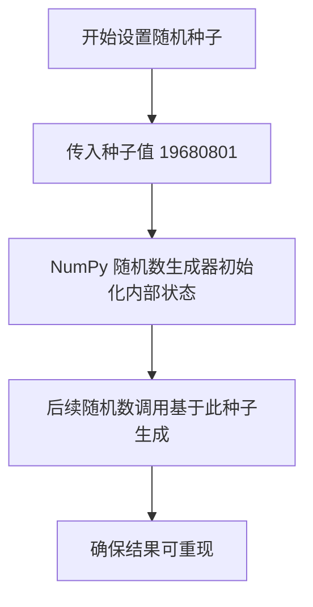
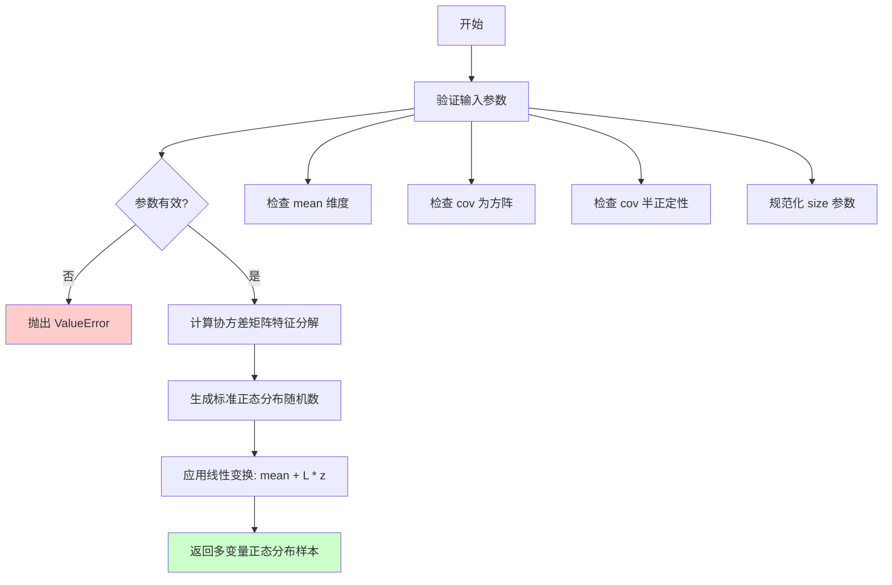
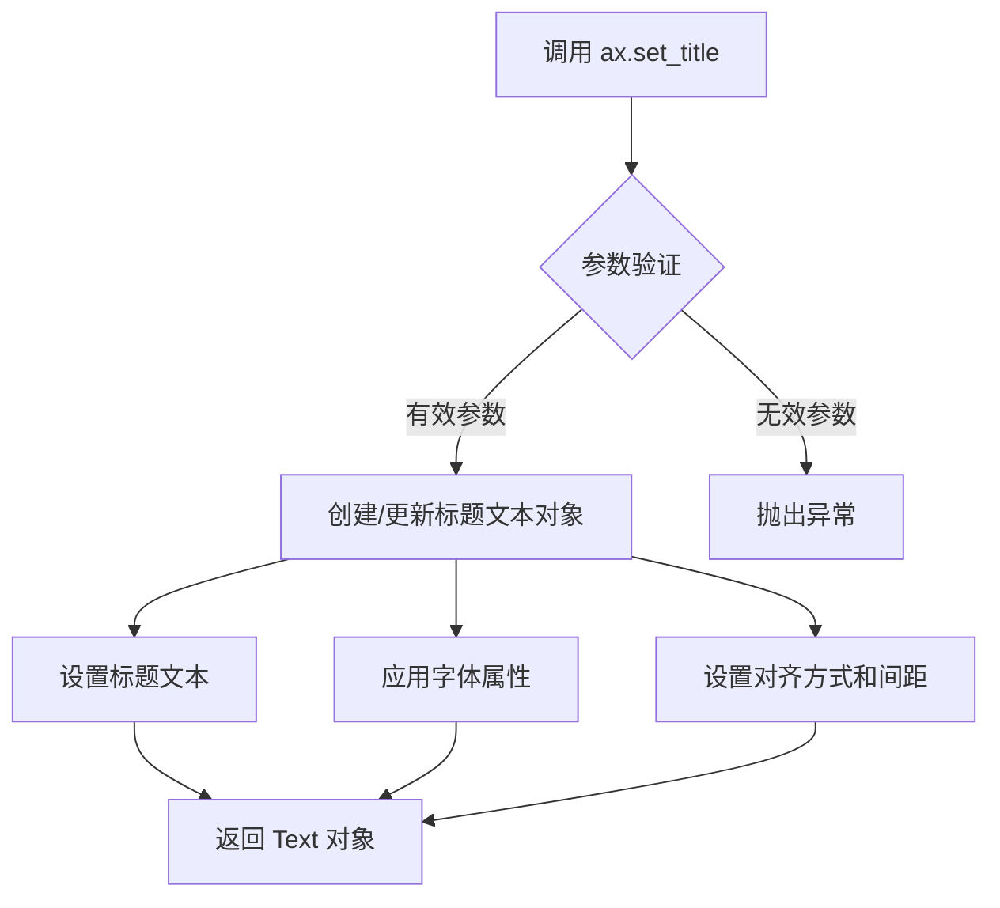
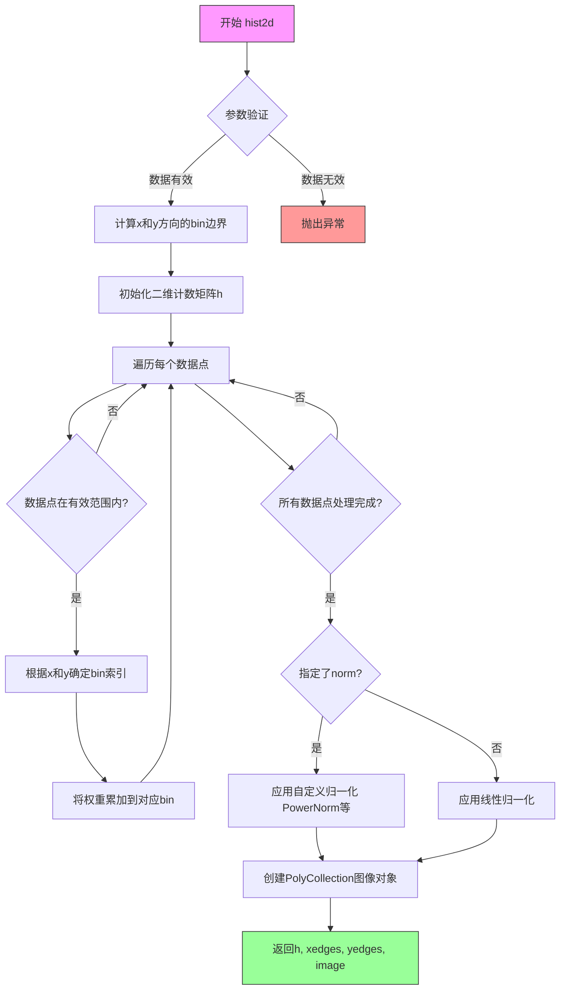
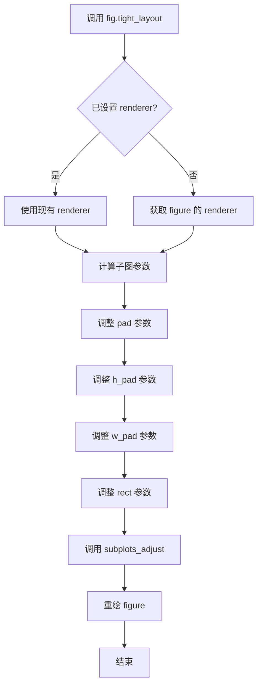
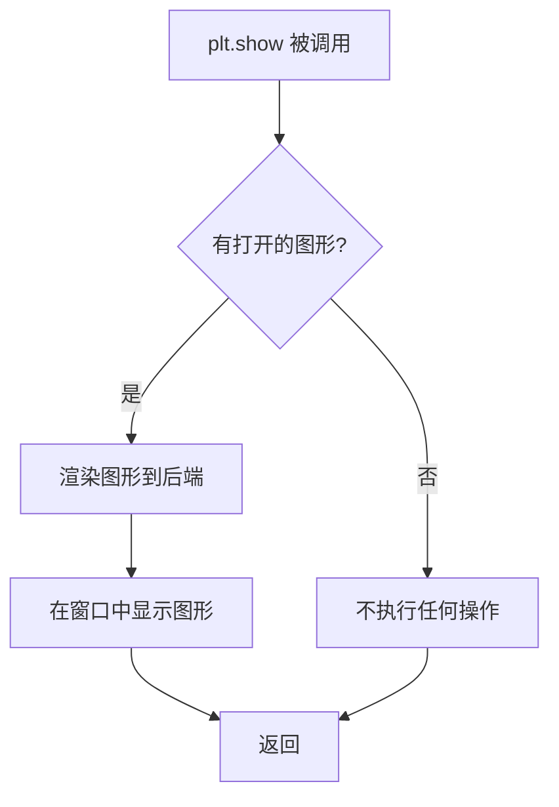

# `matplotlib\galleries\examples\scales\power_norm.py` 详细设计文档

该代码生成了两个多变量正态分布的数据集，并使用 matplotlib 的 hist2d 函数进行二维直方图可视化，同时应用了线性归一化和不同 gamma 值的幂律归一化（PowerNorm）来展示归一化效果。

## 整体流程

```mermaid
graph TD
    A[导入模块: matplotlib, numpy] --> B[设置随机种子: np.random.seed]
    B --> C[生成数据: multivariate_normal 和 np.vstack]
    C --> D[定义 gamma 列表: gammas]
    D --> E[创建子图: plt.subplots]
    E --> F[绘制第一个子图: 线性归一化 hist2d]
    F --> G{循环 gamma 值}
    G -- 是 --> H[绘制子图: 幂律归一化 hist2d (mcolors.PowerNorm)]
    H --> G
    G -- 否 --> I[调整布局: fig.tight_layout]
    I --> J[显示图形: plt.show]
```

## 类结构

```
无类层次结构（该脚本为过程式代码，未定义自定义类）
```

## 全局变量及字段


### `data`
    
多变量正态分布的合并数据

类型：`numpy.ndarray`
    


### `gammas`
    
幂律归一化的 gamma 值列表

类型：`list`
    


### `fig`
    
matplotlib 的 Figure 对象

类型：`matplotlib.figure.Figure`
    


### `axs`
    
子图Axes对象数组

类型：`numpy.ndarray`
    


### `np`
    
numpy 模块别名

类型：`module`
    


### `plt`
    
matplotlib.pyplot 模块别名

类型：`module`
    


### `mcolors`
    
matplotlib.colors 模块别名

类型：`module`
    


### `multivariate_normal`
    
从 numpy.random 导入的函数

类型：`function`
    


    

## 全局函数及方法


### `np.random.seed`

设置随机数生成器的种子，以确保结果的可重现性。在本代码中，使用固定种子值 `19680801` 确保每次运行程序时生成的随机数据保持一致，便于调试和结果复现。

参数：

- `seed`：`int`，随机数种子值，用于初始化随机数生成器

返回值：`None`，该函数无返回值，直接修改 NumPy 的全局随机状态

#### 流程图



#### 带注释源码

```python
# Fixing random state for reproducibility.
# 设置随机数生成器的种子为 19680801
# 作用：确保每次程序运行时，multivariate_normal 生成的随机数据保持一致
# 好处：便于调试、测试和结果复现
np.random.seed(19680801)
```


### `numpy.random.multivariate_normal`

生成多变量正态分布（多元正态分布）的随机样本。该函数从指定的均值向量和协方差矩阵中抽取样本，常用于统计建模、机器学习数据生成和蒙特卡洛模拟等场景。

参数：

- `mean`：`array_like`，分布的均值向量，默认为 None（此时使用零向量）。协方差矩阵 `cov` 的行维度应与此向量长度匹配。
- `cov`：`array_like`，协方差矩阵，必须是半正定矩阵，且为 2 维方阵。对角线元素表示各变量的方差，非对角线元素表示变量间的协方差。
- `size`：`int` 或 `tuple`（可选），输出样本的形状。若指定为整数 `n`，返回 `n` 个样本；若指定为形状 `(n, m, ...)`，返回 `n*m*...` 个样本。默认为 None，返回单个样本。

返回值：`ndarray`，生成的随机样本。若 `size` 为 None，返回形状为 `(len(mean),)` 的一维数组；若 `size` 为整数 `n`，返回形状为 `(n, len(mean))` 的二维数组。

#### 流程图



#### 带注释源码

```python
# numpy.random.multivariate_normal 源码示例
# 注意：以下为简化版本，实际 numpy 实现更复杂，包含更多边界检查和优化

def multivariate_normal(mean=None, cov=1, size=None, check_valid='warn', tol=1e-8):
    """
    生成多变量正态分布的随机样本。
    
    参数:
        mean: array_like, 分布均值
        cov: array_like, 协方差矩阵
        size: 输出形状
        check_valid: 是否检查协方差矩阵有效性
        tol: 协方差矩阵特征值容忍度
    
    返回:
        ndarray: 随机样本
    """
    from numpy.random import default_rng
    from scipy import linalg
    
    # 1. 参数规范化处理
    # 将 mean 转换为 numpy 数组
    mean = np.array(mean)
    
    # 2. 协方差矩阵处理
    cov = np.array(cov)
    
    # 3. 尺寸处理
    if size is None:
        size = ()
    
    # 4. 验证协方差矩阵（半正定性检查）
    if check_valid != 'ignore':
        # 使用特征分解检查半正定性
        eigvals = np.linalg.eigvalsh(cov)
        if np.any(eigvals < -tol):
            if check_valid == 'warn':
                import warnings
                warnings.warn("协方差矩阵不是半正定的")
            else:
                raise np.linalg.LinAlgError("协方差矩阵必须是半正定的")
    
    # 5. 生成随机样本的核心逻辑
    # 使用 Cholesky 分解: cov = L @ L.T
    # 样本 = mean + L @ standard_normal
    L = linalg.cholesky(cov, lower=True)
    
    # 生成标准正态分布随机数
    standard_normal = default_rng().standard_normal(size=size + (len(mean),))
    
    # 应用线性变换得到多元正态分布样本
    samples = mean + np.einsum('...ij,jk->...ik', standard_normal, L)
    
    # 若 size 为空（默认情况），返回单一样本而非数组
    if samples.shape == (len(mean),):
        return samples[0]
    
    return samples
```


### `np.vstack`

垂直堆叠数组以合并数据，将多个数组沿垂直方向（行方向）堆叠成一个数组。

参数：

-  `tup`：sequence of ndarray，要堆叠的数组序列，这些数组必须具有相同的形状（除了第一个轴之外）

返回值：`ndarray`，返回堆叠后的数组

#### 流程图

```mermaid
graph TD
    A[开始] --> B[接收tup参数<br/>sequence of ndarray]
    B --> C{检查数组数量}
    C -->|只有1个数组| D[直接返回该数组]
    C -->|多个数组| E{检查数组维度}
    E -->|1维数组| F[将1维数组 reshape 为2维<br/>a[np.newaxis, :]
    E -->|多维数组| G[检查形状兼容性<br/>除第一个轴外其他轴相同]
    F --> H[沿第一个轴堆叠<br/>concatenate along axis=0]
    G --> H
    H --> I[返回堆叠后的ndarray]
```

#### 带注释源码

```python
data = np.vstack([
    # 第一个参数：多元正态分布生成的100000个样本点
    # 每个样本是2维坐标 [x, y]
    multivariate_normal([10, 10], [[3, 2], [2, 3]], size=100000),
    
    # 第二个参数：多元正态分布生成的1000个样本点
    # 每个样本是2维坐标 [x, y]
    multivariate_normal([30, 20], [[3, 1], [1, 3]], size=1000)
])

# np.vstack 内部执行流程：
# 1. 接收包含两个二维数组的列表
# 2. 验证两个数组的列数相同（都是2列）
# 3. 将两个数组在垂直方向（行方向）拼接
# 4. 返回形状为 (101000, 2) 的数组
#    - 100000 + 1000 = 101000 行
#    - 2 列（x和y坐标）
```


### `plt.subplots`

`plt.subplots` 是 matplotlib 库中的一个函数，用于创建一个包含多个子图的图形（Figure）和对应的轴域（Axes）对象。它返回一个 Figure 对象和一个 Axes 对象（或 Axes 数组），允许用户在同一个窗口中组织多个子图。

参数：

- `nrows`：`int`，子图网格的行数（本例中为 2）
- `ncols`：`int`，子图网格的列数（本例中为 2）

返回值：

- `fig`：`matplotlib.figure.Figure`，整个图形对象，用于控制图形属性（如布局、标题等）
- `axs`：`numpy.ndarray` 或 `matplotlib.axes.Axes`，子图轴域对象数组，本例中为 2x2 的 Axes 数组

#### 流程图

```mermaid
flowchart TD
    A[调用 plt.subplots] --> B{参数验证}
    B -->|nrows=2, ncols=2| C[创建 2x2 子图网格]
    C --> D[生成 Figure 对象]
    D --> E[生成 2x2 Axes 数组]
    E --> F[返回 fig 和 axs]
    
    G[访问 axs[0, 0]] --> H[设置标题 'Linear normalization']
    H --> I[调用 hist2d 绘制 2D 直方图]
    
    J[遍历 axs.flat[1:]] --> K[对每个子图设置 PowerNorm]
    K --> L[绘制不同 gamma 值的 2D 直方图]
    
    M[调用 fig.tight_layout] --> N[自动调整子图间距]
    N --> O[调用 plt.show 显示图形]
```

#### 带注释源码

```python
# 调用 plt.subplots 创建包含 2 行 2 列子图的图形
# 参数:
#   nrows=2: 创建 2 行子图
#   ncols=2: 创建 2 列子图
# 返回值:
#   fig: Figure 对象，整个图形的容器
#   axs: 2x2 的 Axes 对象数组，可以通过索引访问每个子图
fig, axs = plt.subplots(nrows=2, ncols=2)

# 访问左上角子图 (第一行第一列)
axs[0, 0].set_title('Linear normalization')  # 设置子图标题
# 使用 hist2d 绘制 2D 直方图，数据使用默认的线性归一化
axs[0, 1].hist2d(data[:, 0], data[:, 1], bins=100)

# 遍历剩余的子图 (从第二个开始，即 flat[1:])
# 对每个子图应用不同的 PowerNorm (幂律归一化)
for ax, gamma in zip(axs.flat[1:], gammas):
    ax.set_title(r'Power law $(\gamma=%1.1f)$' % gamma)  # 设置带 gamma 值的标题
    # 使用 PowerNorm 进行归一化，gamma 控制对比度
    ax.hist2d(data[:, 0], data[:, 1], bins=100, norm=mcolors.PowerNorm(gamma))

# 调整图形布局，自动处理子图之间的间距，防止标签重叠
fig.tight_layout()

# 显示图形
plt.show()
```


### `Axes.set_title`

`Axes.set_title` 是 matplotlib 库中 `matplotlib.axes.Axes` 类的一个方法，用于设置子图（Axes）的标题。该方法允许用户为图表指定一个标题字符串，并可自定义标题的字体属性（如位置、字体大小、字体权重等）。

参数：

- `s`：`str`，要设置的标题文本内容
- `loc`：`{'center', 'left', 'right'}`，可选，标题的水平对齐方式，默认为 'center'
- `pad`：`float`，可选，标题与图表顶部的间距（以点为单位），默认为 None
- `fontsize`：`int` 或 `float`，可选，标题的字体大小，默认为 rcParams 中定义的大小
- `fontweight`：`str`，可选，标题的字体粗细（如 'normal', 'bold' 等）
- `**kwargs`：其他关键字参数，将传递给 `matplotlib.text.Text` 对象

返回值：`matplotlib.text.Text`，返回创建的标题文本对象

#### 流程图



#### 带注释源码

```python
# 在示例代码中的实际调用方式：

# 第一个子图的标题设置
axs[0, 0].set_title('Linear normalization')

# 后续子图的标题设置（带动态参数）
for ax, gamma in zip(axs.flat[1:], gammas):
    ax.set_title(r'Power law $(\gamma=%1.1f)$' % gamma)
    # 使用了 LaTeX 格式的字符串
    # gamma 参数被格式化到标题中
```

```python
# matplotlib 库中 set_title 方法的典型签名（简化版）
def set_title(self, s, loc='center', pad=None, **kwargs):
    """
    Set a title for the axes.
    
    Parameters
    ----------
    s : str
        The title text.
    loc : {'center', 'left', 'right'}, default: 'center'
        The title horizontal alignment.
    pad : float
        The offset of the title from the top of the axes.
    **kwargs
        Additional keyword arguments passed to Text.
    
    Returns
    -------
    text : matplotlib.text.Text
        The created Text object.
    """
    # 方法实现（来自 matplotlib 源码）
    title = Text(self.transSubfigure)
    # 设置文本、字体属性、对齐方式等
    # 返回创建的文本对象
    return title
```


### `matplotlib.axes.Axes.hist2d`

绘制二维直方图（热力图），用于可视化两个变量之间的联合分布，将数据点划分到二维的bin网格中并统计每个格子中的数据点数量，以颜色深浅表示密度分布。

参数：

- `x`：`array_like`，第一个维度的输入数据（一维数组）
- `y`：`array_like`，第二个维度的输入数据（一维数组），长度需与x一致
- `bins`：`int` 或 `array_like`，可以是单个整数（两个方向相同bin数）、两个整数元组(x方向bin数, y方向bin数)、或两个数组（x方向边界、y方向边界），默认值为10
- `range`：`array_like`，形状为(2,2)的数组，指定x和y的显示范围，格式为[[xmin, xmax], [ymin, ymax]]，默认值为None表示根据数据自动计算
- `density`：`bool`，如果为True，则将每个bin的计数归一化为概率密度（每个bin的面积之和为1），默认值为False
- `weights`：`array_like`，与x和y形状相同的数组，为每个数据点指定权重，用于计算加权直方图，默认值为None
- `cmin`：`float`，设置颜色映射的最小阈值，低于此值的bin将不显示，默认值为None
- `cmax`：`float`，设置颜色映射的最大阈值，高于此值的bin将使用cmax对应的颜色，默认值为None
- `norm`：`matplotlib.colors.Normalize`，用于映射计数到颜色空间的归一化对象，例如`mcolors.PowerNorm(gamma)`实现幂律归一化，默认值为None（线性归一化）
- `**kwargs`：`关键字参数`，传递给`matplotlib.collections.PolyCollection`的额外参数，用于定制热力图的外观，如`cmap`（颜色映射）、`alpha`（透明度）等

返回值：

- `h`：`ndarray`，形状为(nx bins, ny bins)的二维数组，表示每个bin中的数据点计数
- `xedges`：`ndarray`，长度为(nx bins + 1)的数组，表示x方向的bin边界
- `yedges`：`ndarray`，长度为(ny bins + 1)的数组，表示y方向的bin边界
- `image`：`matplotlib.collections.PolyCollection`，返回的图像对象，是一个多边形集合，可用于进一步定制颜色条或图例

#### 流程图



#### 带注释源码

```python
# matplotlib/axes/_axes.py 中的 hist2d 方法核心逻辑

def hist2d(self, x, y, bins=10, range=None, density=False, 
           weights=None, cmin=None, cmax=None, norm=None, **kwargs):
    """
    绘制二维直方图（热力图）
    
    参数:
        x: array_like - x方向数据
        y: array_like - y方向数据  
        bins: int or [int, int] or array - bin的数量或边界
        range: array-like - 数据范围 [[xmin,xmax],[ymin,ymax]]
        density: bool - 是否归一化为概率密度
        weights: array_like - 每个数据点的权重
        cmin: float - 颜色映射最小值
        cmax: float - 颜色映射最大值
        norm: Normalize - 自定义归一化对象
    """
    
    # Step 1: 数据类型转换和验证
    x = np.asarray(x)
    y = np.asarray(y)
    
    # Step 2: 计算bin边界
    # 如果bins是整数，创建等间距的bin边界
    if np.ndim(bins) == 0:
        # bins = 100 表示 x和y方向各100个bin
        bins = [bins, bins]
    
    # 计算直方图的边缘（edges）
    # histgram 函数返回 计数数组 和 边界数组
    h, xedges, yedges = np.histogram2d(x, y, bins=bins, 
                                         range=range, 
                                         weights=weights,
                                         density=density)
    
    # Step 3: 创建颜色映射的归一化对象
    if norm is not None:
        # 使用自定义归一化（如 PowerNorm）
        norm = norm
    else:
        # 默认使用线性归一化
        # 如果指定了cmin或cmax，需要调整归一化范围
        if cmin is not None or cmax is not None:
            vmin = cmin if cmin is not None else h.min()
            vmax = cmax if cmax is not None else h.max()
            norm = mcolors.Normalize(vmin=vmin, vmax=vmax)
    
    # Step 4: 创建多边形集合（PolyCollection）
    # 每个bin是一个四边形（矩形）
    # xedges和yedges定义了bin的边界
    pc = self.collections.PolyCollection(
        # 生成所有矩形的顶点坐标
        _get_polygons(xedges, yedges),
        edgecolors="face",  # 边缘颜色与面颜色相同
        facecolors="none",  # 稍后通过set_array设置颜色
        **kwargs
    )
    
    # Step 5: 设置颜色映射数据
    # 将直方图的值展平为一维数组用于颜色映射
    # h.T 是因为histogram2d返回的数组 axes 顺序与图像相反
    pc.set_array(h.T.ravel())  
    
    # Step 6: 应用归一化
    if norm is not None:
        pc.set_norm(norm)
    
    # Step 7: 添加到axes并设置自动缩放
    self.add_collection(pc)
    # 自动调整坐标轴范围以包含所有数据
    automin = autoscale_view_rollback(self, data_transform='both')
    # 禁用autoscale，确保范围固定
    if automin:
        self.autoscale_view()
    
    # Step 8: 返回结果
    # h: 二维计数数组
    # xedges: x方向边界
    # yedges: y方向边界
    # pc: 图像对象（可用于colorbar）
    return h, xedges, yedges, pc
```

#### 关键组件信息

| 组件名称 | 描述 |
|---------|------|
| `numpy.histogram2d` | 底层二维直方图计算函数，返回计数值和边界 |
| `PolyCollection` | matplotlib的多边形集合类，用于表示热力图的每个矩形bin |
| `mcolors.Normalize` | 归一化基类，线性归一化默认实现 |
| `mcolors.PowerNorm` | 幂律归一化，实现非线性颜色映射，增强低值或高值的可见性 |
| `colorbar` | 可通过返回的`image`对象添加颜色条，显示数值与颜色的对应关系 |

#### 潜在的技术债务或优化空间

1. **性能优化**：当数据点数量巨大（如100,000+）时，逐点遍历计算bin索引的性能较低，可考虑使用向量化操作或并行计算
2. **边界处理**：当前实现对边界外的数据点直接忽略，可能导致边缘数据的视觉偏差
3. **内存占用**：对于高分辨率的bin网格（如bins=1000），创建的PolyCollection可能占用大量内存，可考虑使用稀疏矩阵或图像渲染方式
4. **缺少缓存机制**：重复调用时相同参数的直方图计算未缓存，可添加Memoization优化

#### 其它项目

**设计目标与约束**：
- 目标是提供简洁的API实现二维密度可视化
- 约束是必须与matplotlib的其他绘图组件（如colorbar、legend）兼容
- 数据点数量必须为正整数，权重可为负数（用于某些特殊统计）

**错误处理与异常设计**：
- 当x和y长度不同时，numpy会抛出`ValueError`
- 当bins参数无效时，抛出`ValueError`
- 建议在文档中明确说明NaN值会被自动忽略

**数据流与状态机**：
- 输入数据 → 类型转换 → 直方图计算 → 颜色映射 → 渲染输出
- 状态机：IDLE → COMPUTING → MAPPING → RENDERING → COMPLETED

**外部依赖与接口契约**：
- 依赖`numpy`进行数值计算
- 依赖`matplotlib.colors`进行颜色映射
- 依赖`matplotlib.collections`进行图形渲染
- 返回的PolyCollection对象实现了`ScalarMappable`接口，可直接用于`fig.colorbar()`创建颜色条


### `Figure.tight_layout`

自动调整 figure 中所有子图的布局参数，以减少子图之间的重叠，并确保标签和标题不被裁剪。

参数：

-  `pad`：float，默认 1.08，子图外边缘与 figure 边缘之间的间距（以字体大小为单位）
-  `h_pad`：float 或 None，子图之间的最小垂直间距
-  `w_pad`：float 或 None，子图之间的最小水平间距
-  `rect`：tuple of 4 floats，默认 (0, 0, 1, 1)，规范化坐标 [左, 底, 右, 顶] 指定的子图区域

返回值：`None`，无返回值，该方法直接修改 figure 的布局

#### 流程图



#### 带注释源码

```python
# 代码中的调用方式
fig, axs = plt.subplots(nrows=2, ncols=2)  # 创建 2x2 的子图布局

# ... 设置各子图标题和内容 ...

# 调用 tight_layout 自动调整布局
# 这会根据子图中的标签、标题自动计算并应用最佳间距
fig.tight_layout()

# 内部原理（简化说明）:
# 1. tight_layout() 会获取 figure 的 renderer
# 2. 计算每个子图的坐标轴标签、刻度标签、标题所需的空间
# 3. 自动调整子图之间的间距 (pad, h_pad, w_pad)
# 4. 根据 rect 参数确定子图的整体区域
# 5. 调用 subplots_adjust() 应用这些调整
# 6. 重绘 figure 使布局生效
```


### plt.show

显示当前figure的所有图形。在matplotlib中，所有图形都是先在内存中绘制的，调用`plt.show()`才会将图形渲染并显示到屏幕上。

参数：

- 该函数不接受任何参数

返回值：`None`，无返回值

#### 流程图



#### 带注释源码

```python
plt.show()

# %%
# 解释：
# 1. plt.show() 会查找当前所有打开的 Figure 对象
# 2. 使用配置好的后端（如 Qt5Agg, TkAgg, MacOSX 等）进行渲染
# 3. 创建一个显示窗口并将图形呈现给用户
# 4. 在某些后端中，会阻塞程序执行直到用户关闭窗口
# 5. 在交互式模式下，可能不会阻塞
#
# 注意：
# - 在某些 IDE（如 Jupyter notebook）中，需要使用 %matplotlib inline 或 %matplotlib widget
# - 在脚本模式下，plt.show() 通常是程序的最后一行，因为之后程序会等待用户关闭图形窗口
```


### mcolors.PowerNorm

创建幂律归一化对象，用于对数据进行非线性映射，通过gamma参数控制映射的幂次，实现对数据分布的非线性拉伸或压缩，常用于hist2d等可视化方法中以改善显示效果。

参数：

- `gamma`：`float`，幂律指数，用于控制归一化的非线性程度。当gamma < 1时增强低值对比度，当gamma > 1时增强高值对比度

返回值：`matplotlib.colors.Normalize`，返回继承自Normalize基类的幂律归一化对象

#### 流程图

```mermaid
graph TD
    A[创建PowerNorm对象] --> B[传入gamma参数]
    B --> C[调用父类Normalize.__init__]
    C --> D[设置vmin, vmax等继承属性]
    D --> E[返回PowerNorm实例]
    E --> F[在hist2d中使用: norm=mcolors.PowerNorm(gamma)]
    F --> G[对输入数据应用__call__方法]
    G --> H[计算归一化后的值: result = (data - vmin) / (vmax - vmin)]
    H --> I[应用幂律: result = result ** gamma]
    I --> J[返回归一化后的数组]
```

#### 带注释源码

```python
# 该源码基于matplotlib.colors模块中的PowerNorm类实现
# 代码来源: matplotlib源码 lib/matplotlib/colors.py

class PowerNorm(Normalize):
    """
    Power law normalization: maps data values to the range [0, 1]
    using a power law transformation.
    
    This is useful for enhancing contrast in images with non-linear
    distributions.
    """
    
    def __init__(self, gamma, vmin=None, vmax=None, clip=False):
        """
        初始化PowerNorm对象
        
        参数:
        - gamma: float, 幂律指数，控制非线性映射的强度
        - vmin: float, optional, 数据范围的最小值
        - vmax: float, optional, 数据范围的最大值  
        - clip: bool, optional, 是否裁剪输出值到[0, 1]范围
        
        返回:
        - None
        """
        # 调用父类Normalize的初始化方法
        super().__init__(vmin=vmin, vmax=vmax, clip=clip)
        # 存储gamma参数
        self.gamma = gamma
    
    def __call__(self, value, clip=None):
        """
        对输入数据应用幂律归一化
        
        参数:
        - value: array_like, 需要归一化的输入数据
        - clip: bool, optional, 是否裁剪输出值
        
        返回:
        - ndarray, 归一化后的数据，范围在[0, 1]之间
        """
        # 如果未指定clip参数，使用实例的clip属性
        if clip is None:
            clip = self.clip
        
        # 调用父类的__call__方法进行基础归一化
        result = super().__call__(value, clip)
        
        # 应用幂律变换: output = input^gamma
        # 当gamma < 1时，增强低值区域的对比度
        # 当gamma > 1时，增强高值区域的对比度
        result = np.power(result, self.gamma)
        
        return result
    
    def inverse(self, value):
        """
        逆变换：从归一化值还原原始值
        
        参数:
        - value: array_like, 归一化后的值
        
        返回:
        - ndarray, 还原后的原始尺度值
        """
        # 逆幂律变换: input = output^(1/gamma)
        value = np.power(value, 1.0 / self.gamma)
        
        # 调用父类的inverse方法
        return super().inverse(value)
```

#### 在示例代码中的使用

```python
# 示例代码中的使用方式
gammas = [0.8, 0.5, 0.3]  # 定义不同的gamma值

fig, axs = plt.subplots(nrows=2, ncols=2)

# 第一个子图：线性归一化（baseline）
axs[0, 0].set_title('Linear normalization')
axs[0, 0].hist2d(data[:, 0], data[:, 1], bins=100)

# 后续子图：使用PowerNorm进行幂律归一化
for ax, gamma in zip(axs.flat[1:], gammas):
    ax.set_title(r'Power law $(\gamma=%1.1f)$' % gamma)
    # 创建PowerNorm对象并传递给hist2d
    ax.hist2d(data[:, 0], data[:, 1], bins=100, 
              norm=mcolors.PowerNorm(gamma))
```

#### 关键组件信息

| 组件名称 | 一句话描述 |
|---------|-----------|
| PowerNorm | 幂律归一化类，继承自Normalize基类，通过gamma指数实现非线性映射 |
| Normalize | 基类，提供数据归一化到[0,1]范围的通用框架 |
| hist2d | matplotlib的2D直方图绑定方法，支持norm参数接受归一化对象 |

#### 潜在技术债务或优化空间

1. **缺少输入验证**：gamma参数未进行有效性验证（如gamma <= 0的情况未处理）
2. **性能优化空间**：对于大规模数据，幂运算可考虑使用向量化优化或GPU加速
3. **文档完善**：inverse方法的数学逆变换逻辑可在文档中更详细说明

#### 其它项目

**设计目标与约束**：
- 设计目标：提供非线性数据映射能力，改善可视化对比度
- 约束：gamma必须为正数，vmin必须小于vmax

**错误处理与异常设计**：
- 当vmin >= vmax时，父类Normalize会抛出ValueError
- 当gamma <= 0时，可能导致计算异常（0的幂次运算或负数幂次）

**外部依赖与接口契约**：
- 依赖：numpy, matplotlib.colors.Normalize基类
- 接口契约：实现`__call__`方法使其可直接调用，实现`inverse`方法支持颜色条逆向映射

**数据流与状态机**：
- 创建态：PowerNorm(gamma) → 实例化
- 配置态：设置vmin, vmax边界
- 运行态：__call__(data) → 归一化输出
- 逆变换态：inverse(normalized_data) → 原始尺度


## 关键组件


### 数据生成与堆叠

使用numpy的multivariate_normal函数生成两组多元正态分布数据，然后使用np.vstack垂直堆叠成单一数据集，用于后续可视化。

### 随机状态固定

使用np.random.seed(19680801)固定随机种子，确保每次运行代码时生成相同的随机数据，保证结果可复现。

### 线性归一化

使用hist2d的默认参数进行二维直方图绘制，不指定norm参数时采用线性归一化，将数据值直接映射到颜色条。

### PowerNorm 幂律归一化

通过matplotlib.colors.PowerNorm实现幂律归一化，对不同gamma值（0.8, 0.5, 0.3）应用非线性变换，改变数据的对比度分布。

### 二维直方图可视化

使用Axes.hist2d方法将二维数据分箱成100x100的网格，通过颜色密度表示数据分布频率。

### 图表布局管理

使用fig.tight_layout()自动调整子图间距，防止标签和标题重叠。

## 问题及建议


### 已知问题

- **全局作用域代码**：所有代码直接在模块级别执行，未封装为可复用的函数或类，难以在其他项目中复用核心逻辑
- **硬编码参数**：随机种子、数据参数（均值、协方差矩阵）、样本数量、gamma值、bins等参数均硬编码，缺乏配置管理机制
- **魔法数字**：100000、1000、100等数值无任何注释说明其含义和选择依据
- **缺少类型注解**：无Python类型提示，降低了代码的可读性和IDE支持
- **无错误处理**：未对数据生成、绘图过程进行异常捕获与处理
- **代码耦合度高**：数据生成逻辑与可视化逻辑紧耦合，未分离关注点
- **资源管理**：未显式关闭figure对象，可能导致资源泄露（在某些使用场景下）
- **无文档字符串**：模块和代码块缺少docstring说明

### 优化建议

- 将数据生成逻辑封装为独立函数，参数化样本数、均值、协方差矩阵等
- 将可视化逻辑封装为可配置函数，接受数据和归一化参数
- 使用配置文件或命令行参数（如argparse）管理可变量
- 添加类型注解提升代码可维护性
- 增加异常处理机制，处理可能的数值异常或绘图错误
- 添加详细的docstring和注释说明各参数含义
- 使用`plt.close(fig)`显式管理图形资源，或使用`with`语句
- 考虑将gamma值等归一化参数提取为常量并添加说明


## 其它


### 设计目标与约束

本示例旨在演示matplotlib中不同的归一化方法（线性归一化和幂律归一化）在可视化多元正态分布数据时的效果差异，帮助开发者理解如何通过归一化改善数据可视化效果。约束条件包括：依赖matplotlib、numpy库，需在matplotlib支持的环境中运行。

### 错误处理与异常设计

代码未包含显式的错误处理机制。潜在异常包括：1) 数据生成时协方差矩阵非正定会导致`multivariate_normal`抛出`np.linalg.LinAlgError`；2) `hist2d`的`bins`参数为非正整数时抛出`ValueError`；3) `gamma`为负数或零时`PowerNorm`可能产生异常。

### 数据流与状态机

数据流：随机种子设置 → 多元正态分布数据生成 → 数据垂直堆叠 → 创建2x2子图 → 线性归一化绘制 → 循环幂律归一化绘制 → 布局调整 → 显示图表。无复杂状态机，仅plt.show()阻塞显示状态。

### 外部依赖与接口契约

主要依赖：numpy提供数值计算和随机数生成，matplotlib提供可视化能力，matplotlib.colors提供归一化类（PowerNorm）。接口契约：multivariate_normal(mean, cov, size)返回ndarray；hist2d(x, y, bins, norm)返回(H, xedges, yedges, image)；PowerNorm(gamma)返回Normalize实例。

### 性能考虑

数据规模：100000+1000=101000个数据点，hist2d使用100x100网格。潜在性能瓶颈：大规模数据的2D直方图计算和渲染。可优化方向：降低bins数量、使用稀疏矩阵、启用blitting技术。

### 安全性考虑

代码为纯可视化示例，无用户输入、无文件操作、无网络请求，安全性风险较低。唯一风险点：随机数种子固定为19680801，在某些安全场景下可能被预测。

### 测试策略

建议测试：1) 验证不同gamma值下PowerNorm正确应用；2) 验证数据点数量正确；3) 验证协方差矩阵正定性；4) 验证图形对象正确创建。单元测试可使用pytest-mock模拟plt.show()。

### 配置管理

所有配置硬编码在代码中，包括：随机种子(19680801)、数据参数(均值、协方差矩阵、样本数)、图形参数(2x2布局、100个bins、gamma值数组)。建议抽取为配置文件或命令行参数以提高灵活性。

### 版本兼容性

依赖版本要求：numpy、matplotlib。PowerNorm在matplotlib 3.1.0+支持。建议在requirements.txt中声明最低版本要求。

### 监控与日志

代码无日志记录功能。可添加：数据生成耗时统计、渲染性能监控、异常捕获日志记录。

### 部署考虑

本代码为Jupyter Notebook示例脚本，部署方式：1) 直接运行Python脚本；2) 在Jupyter环境执行；3) 导出为静态HTML/PDF。部署环境需安装matplotlib和numpy依赖。


    