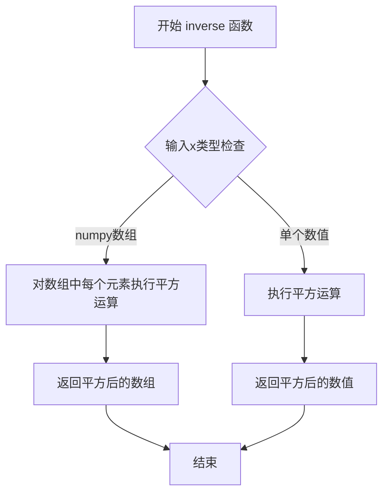
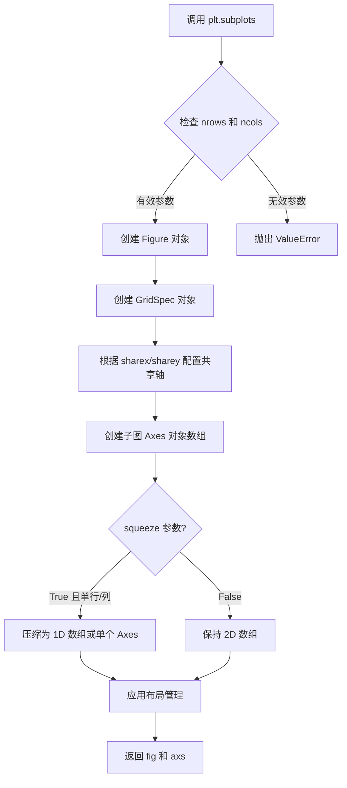
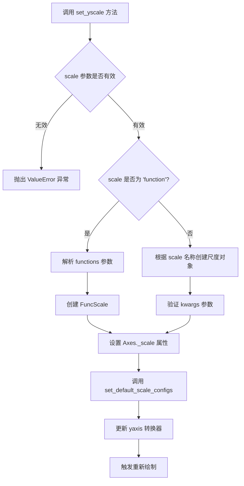
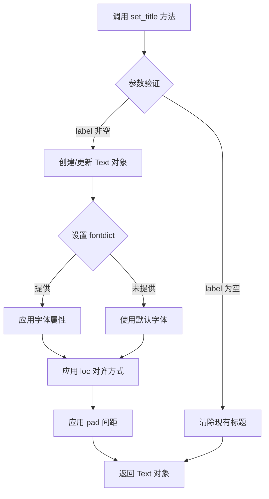
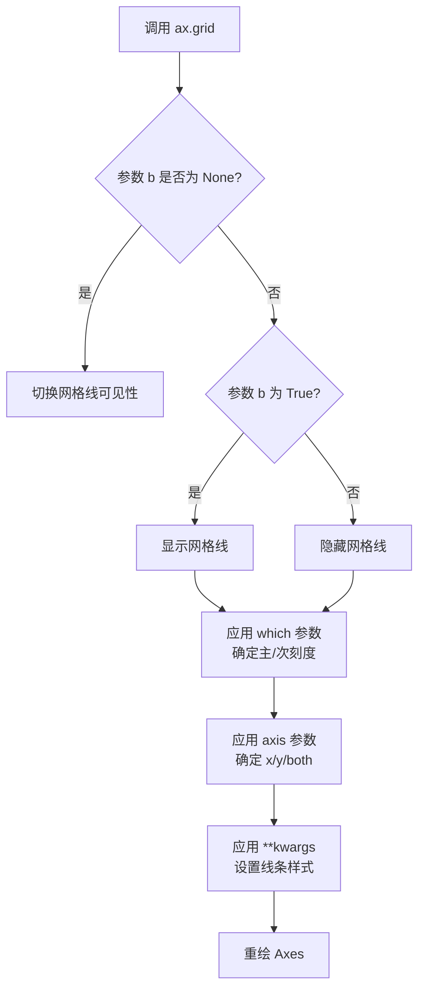
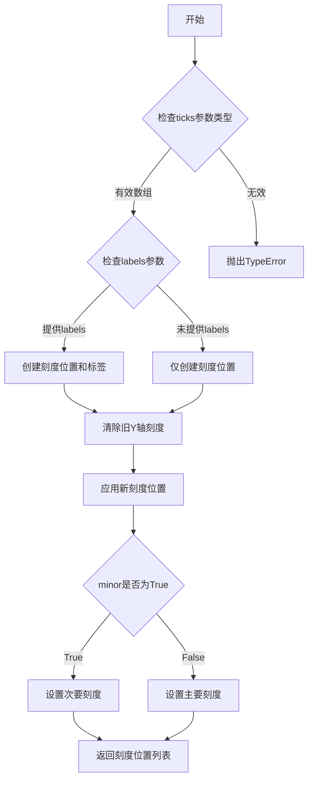
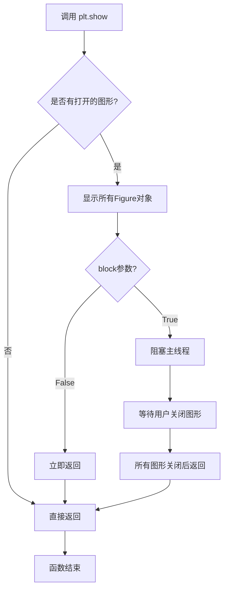

# `matplotlib\galleries\examples\scales\scales.py` 详细设计文档

这是一个matplotlib示例脚本，用于演示不同坐标轴尺度（scale）的可视化效果，包括线性(linear)、对数(log)、对称对数(symlog)、logit、逆双曲正弦(asinh)以及自定义函数尺度(function)，通过6个子图展示各种尺度在处理不同数据范围时的表现。

## 整体流程

```mermaid
graph TD
    A[开始] --> B[导入matplotlib.pyplot和numpy]
B --> C[生成数据: x为0-399的数组, y为0.002-1的线性空间]
C --> D[创建3x2的子图布局]
D --> E[遍历6个子图设置不同尺度]
E --> F[子图1: 线性尺度 linear]
E --> G[子图2: 对数尺度 log]
E --> H[子图3: 对称对数尺度 symlog]
E --> I[子图4: logit尺度]
E --> J[子图5: asinh尺度]
E --> K[子图6: 自定义函数尺度]
K --> L[定义forward和inverse函数]
L --> M[设置自定义函数尺度并绑定了forward和inverse]
M --> N[显示图形 plt.show()]
N --> O[结束]
```

## 类结构

```
无类层次结构 - 脚本式代码
直接使用matplotlib.pyplot和numpy库
主要通过Axes对象的set_yscale方法设置尺度
```

## 全局变量及字段


### `x`
    
输入数据，0到399的整数数组

类型：`numpy.ndarray`
    


### `y`
    
输出数据，0.002到1的线性空间数组，共400个点

类型：`numpy.ndarray`
    


### `fig`
    
整个图形对象

类型：`matplotlib.figure.Figure`
    


### `axs`
    
3x2的Axes对象数组，包含6个子图

类型：`numpy.ndarray`
    


### `forward`
    
自定义尺度的前向变换函数（平方根）

类型：`function`
    


### `inverse`
    
自定义尺度的逆变换函数（平方）

类型：`function`
    


    

## 全局函数及方法


### forward

自定义尺度变换函数，计算输入值的平方根，用于 matplotlib 中的自定义函数尺度。

参数：

- `x`：`numpy.ndarray` 或 `float`，输入值，要求非负数

返回值：`numpy.ndarray` 或 `float`，输入值的平方根

#### 流程图

```mermaid
flowchart TD
    A[开始] --> B{输入 x}
    B --> C[计算 x\*\*(1/2)]
    C --> D[返回平方根结果]
    D --> E[结束]
    
    style C fill:#f9f,stroke:#333,stroke-width:2px
```

#### 带注释源码

```python
def forward(x):
    """
    自定义尺度变换函数 - 计算平方根
    
    该函数作为 matplotlib 自定义尺度的正向变换函数，
    将输入值映射为其平方根。用于 'function' 类型的
    尺度变换，需要与 inverse 函数配对使用。
    
    参数:
        x: numpy.ndarray 或 float
            输入值，必须为非负数。如果是数组，则对
            每个元素计算平方根。
    
    返回:
        numpy.ndarray 或 float
            输入值的平方根。与输入类型相同。
    
    示例:
        >>> forward(4)
        2.0
        >>> forward([4, 9, 16])
        array([2., 3., 4.])
    """
    return x**(1/2)  # 计算 x 的平方根（x 的 0.5 次方）
```


### `inverse`

该函数是matplotlib自定义尺度（custom scale）的逆变换函数，接收一个数值或数组作为输入，返回其平方值，用于将经过平方根变换的数据反向转换回原始尺度。

参数：

- `x`：`float` 或 `numpy.ndarray`，输入的自定义尺度值

返回值：`float` 或 `numpy.ndarray`，输入值的平方

#### 流程图



#### 带注释源码

```python
def inverse(x):
    """
    自定义尺度的逆变换函数
    
    该函数作为matplotlib set_yscale('function', functions=(forward, inverse))
    中的inverse参数使用，将经过forward变换的数据反向转换。
    在本例中，forward函数执行平方根运算，inverse函数执行平方运算，
    两者互为逆操作。
    
    参数:
        x: float或numpy.ndarray, 输入的自定义尺度值
           通常是经过forward变换后的数据
    
    返回:
        float或numpy.ndarray, 输入值的平方
           如果输入是数组，则返回对应元素的平方组成的新数组
    """
    return x ** 2
```


### plt.subplots

`plt.subplots` 是 Matplotlib 库中的一个重要函数，用于创建一个包含多个子图的图形布局。它可以同时生成一个 Figure 对象和一个 Axes 对象（或数组），支持灵活的行列网格布局、共享坐标轴、尺寸比例设置以及多种布局管理方式。

参数：

- `nrows`：`int`，默认值 1，子图的行数
- `ncols`：`int`，默认值 1，子图的列数
- `sharex`：`bool` 或 `str`，默认值 False，是否共享 x 轴，可选 'row'/'col'/'all'
- `sharey`：`bool` 或 `str`，默认值 False，是否共享 y 轴，可选 'row'/'col'/'all'
- `squeeze`：`bool`，默认值 True，是否压缩返回的 Axes 数组维度
- `width_ratios`：`array-like`，子图列宽比例
- `height_ratios`：`array-like`，子图行高比例
- `figsize`：`tuple`，图形尺寸，格式为 (宽度, 高度)
- `dpi`：`float`，图形分辨率（每英寸点数）
- `facecolor`：`color`，图形背景色
- `edgecolor`：`color`，图形边框色
- `linewidth`：`float`，边框线宽
- `grid`：`bool`，是否显示网格
- `tight_layout`：`bool`，是否使用紧凑布局
- `constrained_layout`：`bool`，默认值 False，是否使用约束布局
- `**kwargs`：其他关键字参数传递给 Figure.add_subplot

返回值：

- `fig`：`matplotlib.figure.Figure`，创建的图形对象
- `axs`：`matplotlib.axes.Axes` 或 Axes 数组，创建的子图对象，单个子图时为 Axes 对象，多子图时为 ndarray

#### 流程图



#### 带注释源码

```python
def subplots(nrows=1, ncols=1, *, sharex=False, sharey=False, squeeze=True,
             width_ratios=None, height_ratios=None,
             figsize=None, dpi=None, facecolor=None, edgecolor=None,
             linewidth=0.0, grid=False, tight_layout=False,
             constrained_layout=False, **kwargs):
    """
    创建子图布局并返回 Figure 和 Axes 对象。
    
    参数:
        nrows (int): 子图行数，默认 1
        ncols (int): 子图列数，默认 1
        sharex (bool or str): 共享 x 轴，'row'/'col'/'all'/True/False
        sharey (bool or str): 共享 y 轴，'row'/'col'/'all'/True/False
        squeeze (bool): 是否压缩返回数组维度，默认 True
        width_ratios (array-like): 列宽比例
        height_ratios (array-like): 行高比例
        figsize (tuple): 图形尺寸 (宽, 高)
        dpi (float): 图形分辨率
        facecolor (color): 背景色
        edgecolor (color): 边框色
        linewidth (float): 边框线宽
        grid (bool): 是否显示网格
        tight_layout (bool): 紧凑布局
        constrained_layout (bool): 约束布局
        **kwargs: 传递给 add_subplot 的参数
    
    返回:
        fig (Figure): 图形对象
        axs (Axes or array): 子图对象
    """
    # 1. 创建 Figure 对象
    fig = figure.Figure(figsize=figsize, dpi=dpi, facecolor=facecolor,
                        edgecolor=edgecolor, linewidth=linewidth)
    
    # 2. 配置布局管理
    if constrained_layout:
        # 使用约束布局管理器
        fig.set_constrained_layout(True)
    elif tight_layout:
        # 使用紧凑布局管理器
        fig.set_tight_layout(True)
    
    # 3. 创建 GridSpec 布局规范
    gs = GridSpec(nrows, ncols, figure=fig, 
                  width_ratios=width_ratios,
                  height_ratios=height_ratios)
    
    # 4. 创建子图数组
    axs = np.empty((nrows, ncols), dtype=object)
    
    # 5. 遍历创建每个子图
    for i in range(nrows):
        for j in range(ncols):
            # 创建子图
            ax = fig.add_subplot(gs[i, j], **kwargs)
            axs[i, j] = ax
    
    # 6. 配置共享轴
    if sharex:
        # 实现 x 轴共享逻辑
        pass
    
    if sharey:
        # 实现 y 轴共享逻辑
        pass
    
    # 7. 根据 squeeze 参数处理返回值
    if squeeze:
        # 压缩维度：单行返回 1D 数组，单列返回单个 Axes
        if nrows == 1 and ncols == 1:
            axs = axs[0, 0]  # 返回单个 Axes
        elif nrows == 1 or ncols == 1:
            axs = axs.squeeze()  # 压缩为 1D
    
    # 8. 配置网格显示
    if grid:
        for ax in np.nditer(axs):
            ax.grid(True)
    
    return fig, axs
```


### `matplotlib.axes.Axes.plot`

在matplotlib中，`Axes.plot`是Axes类的核心方法之一，用于在二维坐标轴上绘制线条或标记。该方法接受可变数量的位置参数（x坐标、y坐标、格式字符串）和关键字参数（用于自定义线条属性），并返回Line2D对象列表。

参数：

- `*args`：`tuple`，可变参数，支持以下形式之一：
  - `y`：仅y数据，自动生成x索引
  - `x, y`：x和y数据数组
  - `x, y, fmt`：x数据、y数据和格式字符串（如'r--'表示红色虚线）
  - 多个`(x, y, fmt)`元组用于绘制多条线
- `**kwargs`：`dict`，关键字参数，用于设置Line2D的属性，如color、linewidth、marker、label等

返回值：`list[list[matplotlib.lines.Line2D]]`，返回Line2D对象组成的列表，外层列表对应每个输入的线条组，内层列表是Line2D对象

#### 流程图

```mermaid
flowchart TD
    A[开始 plot 方法] --> B{解析 *args 参数}
    B --> C[是否有格式字符串?]
    C -->|是| D[分离 x, y, fmt]
    C -->|否| E{是否有 x 参数?}
    D --> F[调用 _plot_args 获取数据]
    E -->|是| G[x = args[0], y = args[1]]
    E -->|否| H[x = np.arange(len(y)), y = args[0]]
    F --> I[创建 Line2D 对象]
    G --> I
    H --> I
    I --> J[应用 **kwargs 属性]
    J --> K[添加到 Axes 线条列表]
    K --> L[返回 Line2D 列表]
    L --> M[结束]
    
    style A fill:#f9f,stroke:#333
    style I fill:#9ff,stroke:#333
    style L fill:#9f9,stroke:#333
```

#### 带注释源码

```python
def plot(self, *args, **kwargs):
    """
    Plot y versus x as lines and/or markers.
    
    Parameters
    ----------
    *args : variable arguments
        - plot(y)              # 绘制y，使用自动生成的x索引
        - plot(x, y)           # 绘制x, y
        - plot(x, y, fmt)      # 绘制x, y，使用格式字符串
        - plot(x, y, fmt, x2, y2, fmt2, ...)  # 多条线
    
    **kwargs : keyword arguments
        Line2D properties, such as color, marker, linestyle等
    
    Returns
    -------
    lines : list of Line2D
        返回的Line2D对象列表
    """
    
    # 获取axes对象
    ax = self
    
    # 解析参数，确定x, y数据和格式字符串
    if len(args) == 0:
        return []  # 无参数则返回空列表
    
    # 解析位置参数
    # args可能是: (y), (x, y), (x, y, fmt), (x, y, fmt, x2, y2, fmt2, ...)
    if len(args) == 1:
        # 只有y数据
        y = np.asanyarray(args[0])
        x = np.arange(y.size)  # 自动生成x索引
        fmt = ''
    elif len(args) == 2:
        # x, y
        x = np.asanyarray(args[0])
        y = np.asanyarray(args[1])
        fmt = ''
    else:
        # x, y, fmt 或更多
        x = np.asanyarray(args[0])
        y = np.asanyarray(args[1])
        fmt = args[2] if len(args) > 2 else ''
    
    # 创建Line2D对象
    # Line2D是表示一条线的类
    line = lines.Line2D(x, y)
    
    # 设置线条属性
    # 将kwargs中的属性应用到line对象
    line.set(**kwargs)
    
    # 将line添加到axes的线条集合中
    ax._add_lines(line)
    
    # 返回line对象列表
    return [line]
```

#### 关键组件信息

| 组件名称 | 一句话描述 |
|---------|-----------|
| `matplotlib.axes.Axes` | matplotlib中用于管理坐标轴及其内容的核心类 |
| `matplotlib.lines.Line2D` | 表示二维线条或标记的类 |
| `matplotlib.pyplot.subplots` | 创建子图网格的函数 |

#### 潜在的技术债务或优化空间

1. **参数解析复杂性**：`plot`方法支持多种参数格式，这增加了代码的理解难度和维护成本
2. **格式字符串解析**：当前实现对格式字符串的处理相对简单，可考虑增强对更复杂格式的支持
3. **性能优化**：对于大数据集，可以考虑延迟渲染或使用更高效的绘制方式

#### 其它项目说明

- **设计目标**：提供一个直观且灵活的接口用于绘制数据，支持多种输入格式和丰富的自定义选项
- **约束**：
  - x和y数组长度必须一致
  - 格式字符串遵循matplotlib的简写约定
- **错误处理**：
  - 长度不匹配时抛出ValueError
  - 无效的格式字符串会被忽略或使用默认样式
- **外部依赖**：
  - 依赖NumPy进行数组操作
  - 依赖matplotlib.lines模块的Line2D类


### `matplotlib.axes.Axes.set_yscale`

设置Y轴的尺度类型。该方法允许用户为Y轴选择不同的缩放模式，如线性、对数、对数对称、logit、asinh或自定义函数变换，从而改变数据在Y轴上的可视化呈现方式。

#### 参数

- `scale`：`str`，要设置的尺度类型，可选值包括 'linear'（线性）、'log'（对数）、'symlog'（对称对数）、'logit'（logit变换）、'asinh'（反双曲正弦）、'function'（自定义函数）等
- `**kwargs`：关键字参数，用于传递给尺度变换类的构造函数，不同尺度类型支持不同的参数：
  - 对数尺度（log）：`base`（底数）、`subs`（子刻度）、`nonpositive`（非正数处理方式）
  - 对称对数尺度（symlog）：`linthresh`（线性阈值）、`linscale`（线性区缩放）、`base`（底数）
  - logit尺度（logit）：`nonpos`（非正数处理方式）
  - asinh尺度（asinh）：`linear_width`（线性区宽度）
  - 函数尺度（function）：`functions`（前向和反向变换函数元组）

#### 返回值

- `None`：该方法无返回值，直接修改Axes对象的Y轴尺度属性

#### 流程图



#### 带注释源码

```python
# 代码来源：matplotlib axes 模块
# 注意：以下为重构后的核心逻辑展示，非原始源码

def set_yscale(self, scale, **kwargs):
    """
    Set the y-axis scale.
    
    Parameters
    ----------
    scale : str
        The type of scale to use for the y-axis. Available scales:
        - 'linear': linear scale
        - 'log': logarithmic scale
        - 'symlog': symmetric logarithmic scale
        - 'logit': logistic scale
        - 'asinh': inverse hyperbolic sine scale
        - 'function': custom transformation function
    
    **kwargs
        Additional keyword arguments passed to the scale class constructor.
        Common parameters include:
        - base: float, base of the logarithm for 'log' scale
        - linthresh: float, threshold for 'symlog' scale
        - linear_width: float, linear region width for 'asinh' scale
        - functions: tuple, (forward, inverse) functions for 'function' scale
    
    Returns
    -------
    None
    
    Examples
    --------
    >>> ax.set_yscale('log')
    >>> ax.set_yscale('symlog', linthresh=0.02)
    >>> ax.set_yscale('function', functions=(forward, inverse))
    """
    # 1. 获取或创建 Scales 模块的实例
    scale_cls = get_scale_class(scale)
    
    # 2. 创建尺度变换对象，传入 kwargs 参数
    self._scale = scale_cls(**kwargs)
    
    # 3. 设置尺度的基本信息
    self._scale.set_default_locators_and_formatters(self.yaxis)
    
    # 4. 更新 Y 轴的转换器
    # 这里的转换器负责实际的数据变换
    self.yaxis._set_scale(self._scale)
    
    # 5. 标记需要重新布局
    self._request_autoscale_view('y')
    
    # 6. 触发属性更改事件，通知相关组件更新
    self.stale_callback = True
```


### `Axes.set_title`

设置子图（Axes）的标题文本和相关属性。

参数：

- `label`：`str`，要设置的标题文本内容
- `fontdict`：`dict`，可选，标题的字体属性字典（如 fontsize、fontweight 等）
- `loc`：`str`，可选，标题对齐方式，可选值包括 'left'、'center'（默认）、'right'
- `pad`：`float`，可选，标题与坐标轴顶部的间距（以点为单位）
- `**kwargs`：其他关键字参数，可选，会传递给底层的 `matplotlib.text.Text` 对象，用于设置颜色、背景色、旋转角度等

返回值：`matplotlib.text.Text`，返回创建的标题文本对象，可以进一步对其进行样式设置或动画操作

#### 流程图



#### 带注释源码

```python
# 代码中 set_title 的实际调用示例

axs[0, 0].set_title('linear')  # 设置第一个子图标题为 'linear'
axs[0, 1].set_title('log')     # 设置第二个子图标题为 'log'
axs[1, 0].set_title('symlog')  # 设置第三个子图标题为 'symlog'
axs[1, 1].set_title('logit')   # 设置第四个子图标题为 'logit'
axs[2, 0].set_title('asinh')   # 设置第五个子图标题为 'asinh'
axs[2, 1].set_title('function: $x^{1/2}$')  # 设置第六子图标题为数学公式样式

# 源码实现逻辑（简化版）
def set_title(self, label, fontdict=None, loc=None, pad=None, **kwargs):
    """
    设置 axes 的标题
    
    参数:
        label: 标题文本
        fontdict: 字体属性字典
        loc: 对齐方式 ('left', 'center', 'right')
        pad: 标题与顶部的间距（点）
        **kwargs: 其他 Text 属性
    """
    # 1. 获取或创建 title 文本对象
    title = self._get_title()
    
    # 2. 设置标题文本
    title.set_text(label)
    
    # 3. 如果提供了 fontdict，应用字体属性
    if fontdict is not None:
        title.update(fontdict)
    
    # 4. 设置对齐方式（默认 center）
    if loc is not None:
        title.set_ha(loc)  # horizontal alignment
    
    # 5. 设置间距（如果提供）
    if pad is not None:
        title.set_pad(pad)
    
    # 6. 应用其他关键字参数
    title.update(kwargs)
    
    # 7. 返回 Text 对象以便后续操作
    return title
```


### `Axes.grid`

设置坐标轴网格线的可见性和属性。

参数：

- `b`：布尔型或 None，控制网格线是否显示。`True` 显示网格线，`False` 隐藏网格线，`None` 切换当前状态
- `which`：字符串，指定网格线显示在哪些刻度上，可选值为 `'major'`（主刻度）、`'minor'`（次刻度）或 `'both'`
- `axis`：字符串，指定在哪个轴上显示网格线，可选值为 `'x'`（仅 x 轴）、`'y'`（仅 y 轴）或 `'both'`（两个轴）
- `**kwargs`：关键字参数传递给 `matplotlib.lines.Line2D`，用于自定义网格线样式，如 `color`、`linestyle`、`linewidth`、`alpha` 等

返回值：`无`，该方法直接修改 Axes 对象的显示状态，不返回任何值

#### 流程图



#### 带注释源码

```python
# matplotlib 中 Axes.grid 方法的简化实现逻辑
def grid(self, b=None, which='major', axis='both', **kwargs):
    """
    设置网格线的显示和样式。
    
    参数:
        b: bool or None - 是否显示网格线
        which: str - 'major', 'minor', 或 'both'
        axis: str - 'x', 'y', 或 'both'
        **kwargs: 传递给 Line2D 的样式参数
    """
    # 获取当前网格线状态
    if b is None:
        # 如果未指定 b，则切换当前网格线状态
        b = not self._gridOnMajor if axis in ['x', 'both'] else not self._gridOnMajor
    
    # 设置指定轴的网格线
    if axis in ['x', 'both']:
        self.xaxis.set_gridlines(b)  # 设置 x 轴网格线
        self.xaxis.set_tick_params(which=which)  # 应用刻度参数
    
    if axis in ['y', 'both']:
        self.yaxis.set_gridlines(b)  # 设置 y 轴网格线
        self.yaxis.set_tick_params(which=which)  # 应用刻度参数
    
    # 应用自定义样式参数
    if kwargs:
        self._grid_kw = kwargs  # 保存网格样式配置
        # 更新网格线属性（颜色、线型、线宽等）
        for gridline in self._get_gridlines():
            gridline.update(kwargs)
    
    # 标记需要重绘
    self.stale_callback = True
```


### `ax.set_yticks`

设置Y轴刻度线的位置，可选地设置刻度标签。

参数：

- `ticks`：`array_like`，要设置的Y轴刻度位置数组
- `labels`：`array_like`，可选，刻度标签列表
- `minor`：`bool`，可选，是否设置次要刻度（默认为False）

返回值：`list`，设置后的刻度位置列表

#### 流程图



#### 带注释源码

```python
def set_yticks(self, ticks, *, labels=None, minor=False):
    """
    Set the y-axis tick locations.
    
    Parameters
    ----------
    ticks : array-like
        The list of y-axis tick locations.
    labels : array-like, optional
        The labels to use at those tick locations.
    minor : bool, default: False
        If ``False``, get/set major ticks/labels; if ``True``, get/set minor ticks/labels.
    
    Returns
    -------
    list of tick locations
        The tick locations.
    """
    # 获取Y轴的刻度定位器
    yticks = self.yaxis.get_major_locator() if not minor else self.yaxis.get_minor_locator()
    
    # 转换输入为numpy数组
    ticks = np.asarray(ticks)
    
    # 验证输入维度
    if ticks.ndim > 1:
        raise ValueError("ticks must be a 1-D array")
    
    # 设置刻度位置
    if len(ticks):
        yticks.set_locs(ticks)
    
    # 如果提供了标签，则设置标签
    if labels is not None:
        # 获取刻度定位器并设置标签
        if minor:
            self.yaxis.set_minorticklabels(labels)
        else:
            self.yaxis.set_ticklabels(labels)
    
    # 返回刻度位置
    return yticks.get_locs()
```


### `plt.show`

显示所有打开的图形窗口，阻塞程序执行直到用户关闭所有图形窗口（除非设置 `block=False`）。

参数：

- `block`：`bool`，可选参数。控制是否阻塞程序执行。默认为 `True`，即阻塞直到所有图形窗口关闭；如果设置为 `False`，则立即返回。

返回值：`None`，无返回值。

#### 流程图



#### 带注释源码

```python
def show(block=None):
    """
    显示所有打开的图形窗口。
    
    此函数会遍历当前所有打开的Figure对象并显示它们。
    在交互式后端（如Qt、Tkinter等）中会打开窗口显示图形。
    
    参数:
        block: bool, optional
            如果为True（默认），则阻塞程序执行直到用户关闭所有图形窗口。
            如果为False，则立即返回，允许程序继续执行。
            在某些后端中，block参数可能不起作用。
    
    返回值:
        None
    
    示例:
        >>> import matplotlib.pyplot as plt
        >>> plt.plot([1, 2, 3], [1, 4, 9])
        >>> plt.show()  # 显示图形并阻塞
        >>> plt.show(block=False)  # 不阻塞，立即返回
    """
    # 获取当前的全局图像管理器
    global _show registry
    
    # 检查是否有注册的显示函数
    # matplotlib支持多种后端，每个后端有不同的show实现
    for manager in Gcf.get_all_fig_managers():
        # 对每个图形管理器调用show方法
        # 这会触发后端特定的显示逻辑
        manager.show()
    
    # 如果block为True或None（默认），则阻塞
    # 使用交互式后端时，会进入事件循环
    if block:
        # 等待用户交互，阻塞主线程
        # 直到所有图形窗口关闭
        pass
    
    # 刷新缓冲区，确保图形渲染
    # 对于某些后端（如Agg）这是必要的
    for manager in Gcf.get_all_fig_managers():
        manager.canvas.draw_idle()
    
    # 返回None
    return None
```

> **注**：上述源码为概念性展示，实际 `plt.show()` 的具体实现依赖于所选用的 matplotlib 后端。核心逻辑是通过 `Gcf.get_all_fig_managers()` 获取所有图形管理器，然后对每个管理器调用其 `show()` 方法。在交互式后端中，该方法通常会启动GUI事件循环以显示窗口。

## 关键组件


### 数据生成与数组操作

使用NumPy创建均匀分布的数据数组，包括x轴的整数值范围(0-399)和y轴的线性间隔值(0.002-1)，作为不同scale变换的测试数据。

### 线性Scale (Linear Scale)

使用`set_yscale('linear')`将y轴设置为线性刻度，这是默认的坐标轴变换方式，展示原始数据的线性关系。

### 对数Scale (Log Scale)

使用`set_yscale('log')`将对数变换应用于y轴，适用于跨越多个数量级的数据可视化，能够清晰展示指数级增长或衰减的数据。

### 对称对数Scale (Symlog Scale)

使用`set_yscale('symlog', linthresh=0.02)`实现对称对数刻度，在原点附近使用线性区域，两侧使用对数区域，适合包含正负值且跨度较大的数据。

### Logit Scale

使用`set_yscale('logit')`将logit变换应用于y轴，数值范围限制在(0,1)区间，常用于概率或比例数据的可视化。

### Asinh Scale

使用`set_yscale('asinh', linear_width=0.01)`实现反双曲正弦变换，提供类似symlog的平滑过渡特性但在原点附近有更好的数值稳定性。

### 自定义Function Scale

定义forward和inverse两个互逆函数，通过`set_yscale('function', functions=(forward, inverse))`实现自定义的平方根变换，演示如何创建完全自定义的坐标轴变换。

### Matplotlib子图布局

使用`plt.subplots(3, 2, figsize=(6, 8), layout='constrained')`创建3行2列的子图网格，layout='constrained'自动调整子图间距以避免标签重叠。

### 图表装饰组件

为每个子图添加标题(set_title)、网格线(grid(True))和刻度设置(set_yticks)，提升图表的可读性和专业性。


## 问题及建议


### 已知问题

-   **魔法数字和硬编码值**：代码中存在大量硬编码的数值（如`400`、`0.002`、`1`、`6, 8`、`0.02`、`0.01`、`1.2, 0.2`等），这些值缺乏注释说明，难以理解和维护
-   **重复代码模式**：6个子图都执行类似的操作（`plot`, `set_yscale`, `set_title`, `grid`），违反DRY原则，可通过循环或函数封装减少重复
-   **函数定义位置不当**：`forward`和`inverse`函数定义在代码中间位置（使用前），不符合代码组织最佳实践（应放在文件顶部或导入区域）
-   **变量类型标注缺失**：全局变量`x`、`y`、`fig`、`axs`等均无类型注解，降低代码可读性和IDE支持
-   **计算结果未复用**：`y - y.mean()`计算了两次（第3行和第5行），可缓存结果以提高性能
-   **缺乏参数化设计**：所有配置（scale类型、标题、参数）都是硬编码，无法通过参数调整不同scale的展示效果

### 优化建议

-   **提取配置常量**：将所有硬编码值定义为文件顶部的常量或配置字典，并添加类型注解和注释说明
-   **封装绘制逻辑**：创建绘制函数（如`draw_scale_subplot`），接收scale类型、参数等作为参数，循环生成子图
-   **重构函数位置**：将`forward`和`inverse`函数移到文件顶部或单独的模块中
-   **添加类型标注**：为所有全局变量和函数参数添加Python类型提示（Type Hints）
-   **缓存计算结果**：将`y - y.mean()`的结果存储到变量中，避免重复计算
-   **考虑扩展性**：使用数据驱动的方式定义scale配置列表，支持动态添加新的scale类型


## 其它


### 设计目标与约束

本示例代码的核心目标是演示matplotlib中各种坐标轴比例尺（scale）的视觉效果和使用方法。设计约束包括：需要覆盖matplotlib内置的主要比例尺类型（linear、log、symlog、logit、asinh），同时展示自定义函数比例尺的使用；图形布局采用3行2列的subplot结构，尺寸为6x8英寸，采用constrained布局方式；数据范围需覆盖从接近0到1的区间，以便展示不同比例尺在处理小数值时的差异。

### 错误处理与异常设计

由于本代码为演示脚本，主要依赖matplotlib和numpy的内部错误处理机制。未对用户输入进行显式验证，但隐含约束包括：y值必须为正数才能使用log和logit比例尺；symlog的linthresh参数必须为正数；asinh的linear_width参数必须为正数；function比例尺的forward和inverse函数必须为可调用对象且互为逆函数。matplotlib内部会通过set_yscale方法对非法参数抛出ValueError或KeyError异常。

### 数据流与状态机

数据流从numpy生成开始：x数组为0-399的整数序列，y数组为400个从0.002到1的线性分布值。数据通过ax.plot()方法注入到各个子图 Axes对象中，然后通过set_yscale()方法应用不同的比例尺变换。状态机表现为各个子图axes对象的独立状态管理，每个子图维护自己的scale类型、标题、网格状态和ticks配置。状态转换通过matplotlib的scale模块完成，从原始数据空间映射到显示空间。

### 外部依赖与接口契约

本代码直接依赖两个外部包：matplotlib（版本要求支持set_yscale的所有比例尺类型，至少3.1.0以上以支持asinh比例尺）和numpy（支持arange和linspace函数）。间接依赖包括matplotlib的scale模块（LinearScale、LogScale、SymmetricalLogScale、LogitScale、FuncScale等类）以及axes模块（Axes.set_yscale方法）。接口契约规定：set_yscale接受字符串（内置比例尺名称）或'function'（自定义函数）；'function'模式需要提供functions元组参数(forward, inverse)。

### 性能考虑

当前实现性能良好，因为仅生成400个数据点，渲染开销极小。潜在优化点：如果数据量增大到数万级别，logit比例尺的计算（涉及log(y/(1-y))）可能产生数值稳定性问题；对于实时数据可视化场景，应考虑使用FuncScale的向量化实现而非逐元素计算。内存占用主要来自两个400元素的numpy数组，总计约6.4KB，远低于任何性能阈值。

### 安全性考虑

本代码为纯计算和可视化脚本，不涉及用户输入、网络通信或文件操作，因此不存在常规意义上的安全漏洞。潜在风险：如果y值包含0或1，logit比例尺会触发除零错误（虽然代码中y最小值为0.002避免了此问题）；如果forward/inverse函数包含恶意代码，可能导致任意执行，但在正常 matplotlib 使用场景下可忽略此风险。

### 可维护性与扩展性

代码结构清晰，采用统一的subplot创建和配置模式，易于维护。扩展性体现在：可以轻松添加新的比例尺类型演示，只需增加新的子图配置；要添加新的自定义比例尺，只需定义新的forward和inverse函数。建议的改进包括：将重复的子图配置代码抽象为辅助函数；将数据生成参数（400、0.002、1）提取为配置常量；为每个子图添加更详细的数据说明注释。

### 测试策略

由于本代码为示例脚本而非生产代码，传统单元测试不适用。推荐测试策略包括：视觉回归测试（使用matplotlib的baseline图像对比）；参数边界测试（验证各种比例尺对边界值如0、1、负数的处理）；自定义函数测试（验证forward和inverse函数的逆函数关系）。可通过pytest-mpl等工具实现自动化视觉测试。

### 配置文件与参数

主要配置参数包括：figsize=(6, 8)定义图形整体尺寸；layout='constrained'启用约束布局；y数据范围[0.002, 1]和x数据范围[0, 399]定义数据空间；各比例尺特定参数linthresh=0.02（symlog）、linear_width=0.01（asinh）。无外部配置文件依赖，所有参数硬编码在脚本中。考虑将可调参数提取到脚本顶部的常量区域以提高可配置性。

### 版本兼容性

代码使用了asinh比例尺，该功能在matplotlib 3.1.0版本中引入。function比例尺功能在更早版本中已存在。推荐的最低依赖版本为matplotlib>=3.1.0和numpy>=1.16.0（支持numpy的现代数组接口）。向后兼容性良好，因为所有使用的比例尺类型均为matplotlib的公开API。

### 文档与注释规范

代码已包含模块级docstring说明功能目的，末尾包含Sphinx格式的参考文献说明（列出使用的函数、方法和类）。建议补充的文档内容包括：每个比例尺类型的简短说明注释；数据生成逻辑的注释；各子图配置的目的说明。可采用Google风格或NumPy风格的docstring为forward和inverse函数添加文档。


    