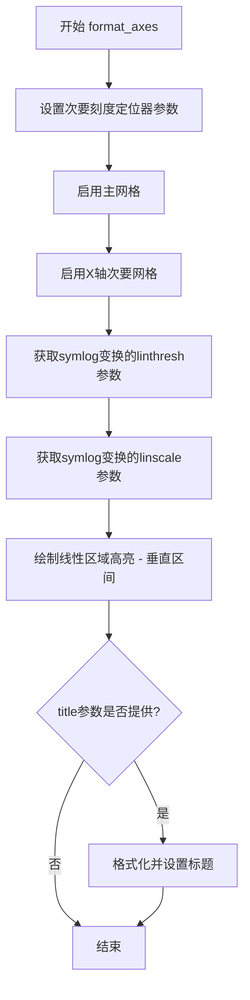

# `matplotlib\galleries\examples\scales\symlog_demo.py` 详细设计文档

这是一个matplotlib示例脚本，演示如何使用symlog（对称数轴）刻度来可视化跨越多个数量级且包含负值的数据，同时展示了linthresh和linscale参数对图形显示的影响以及其局限性。

## 整体流程

```mermaid
graph TD
    A[开始] --> B[导入 matplotlib.pyplot 和 numpy]
    B --> C[设置时间步长 dt=0.01]
    C --> D[生成数据 x 和 y 数组]
    D --> E[创建 3行子图 fig, (ax0, ax1, ax2)]
    E --> F[绘制第一组数据并设置 symlog 刻度]
    F --> G[绘制第二组数据并设置 symlog 刻度]
    G --> H[绘制第三组数据并设置 symlog 刻度和 linthresh]
    H --> I[调用 tight_layout 和 show 显示图形]
    I --> J[定义 format_axes 辅助函数]
    J --> K[生成新的 x, y 数据用于后续示例]
    K --> L[创建 2行子图展示 linthresh 参数效果]
    L --> M[创建 2行子图展示 linscale 参数效果]
    M --> N[创建单子图展示梯度不连续问题]
    N --> O[结束]
```

## 类结构

```
Python脚本 (无类定义)
└── format_axes 函数 (辅助函数)
```

## 全局变量及字段


### `dt`
    
时间步长，值为0.01

类型：`float`
    


### `x`
    
从-50到50的数组，间隔dt

类型：`numpy.ndarray`
    


### `y`
    
从0到100的数组，间隔dt

类型：`numpy.ndarray`
    


### `fig`
    
图形对象

类型：`matplotlib.figure.Figure`
    


### `ax0`
    
第一个子图的坐标轴

类型：`matplotlib.axes.Axes`
    


### `ax1`
    
第二个子图的坐标轴

类型：`matplotlib.axes.Axes`
    


### `ax2`
    
第三个子图的坐标轴

类型：`matplotlib.axes.Axes`
    


### `linthresh`
    
symlog刻度的线性阈值参数

类型：`float`
    


### `linscale`
    
symlog刻度的线性比例参数

类型：`float`
    


### `ax`
    
单个子图的坐标轴 (第三个fig)

类型：`matplotlib.axes.Axes`
    


    

## 全局函数及方法


### `format_axes`

该辅助函数用于可视化symlog刻度的属性，包括设置次要网格、获取linthresh和linscale参数、绘制线性区域高亮，并可选地设置图表标题。

参数：

- `ax`：`matplotlib.axes.Axes`，Matplotlib坐标轴对象，需要进行symlog刻度可视化的坐标轴
- `title`：`str`，可选，图表标题，支持通过`{linthresh}`和`{linscale}`占位符插入参数值

返回值：`None`，该函数无返回值，仅修改传入的坐标轴对象的状态

#### 流程图



#### 带注释源码

```python
def format_axes(ax, title=None):
    """A helper function to better visualize properties of the symlog scale."""
    # 设置X轴次要刻度定位器的子刻度位置
    # subs参数指定在每个十进制区间内显示的次要刻度位置
    ax.xaxis.get_minor_locator().set_params(subs=[2, 3, 4, 5, 6, 7, 8, 9])
    
    # 启用主网格显示
    ax.grid()
    
    # 启用X轴次要网格，以便更清楚地看到对称数刻度在小值区域的行为
    ax.xaxis.grid(which='minor')  # minor grid on too
    
    # 获取symlog变换的线性阈值参数linthresh
    # 该参数定义了从线性映射过渡到对数映射的边界值
    linthresh = ax.xaxis.get_transform().linthresh
    
    # 获取symlog变换的线性缩放参数linscale
    # 该参数定义了在(-linthresh, linthresh)线性区域内使用的视觉空间比例
    linscale = ax.xaxis.get_transform().linscale
    
    # 使用半透明灰色区域高亮显示线性区域
    # 即(-linthresh, linthresh)区间，帮助直观理解symlog刻度的线性区域范围
    ax.axvspan(-linthresh, linthresh, color='0.9')
    
    # 如果提供了标题，则格式化并设置坐标轴标题
    # 支持使用{linthresh}和{linscale}占位符插入实际参数值
    if title:
        ax.set_title(title.format(linthresh=linthresh, linscale=linscale))
```

## 关键组件


### Symlog Scale (对称数轴刻度)

matplotlib 中的对称数轴刻度实现，扩展了对数刻度以同时支持负值和正值，特别适用于跨越广泛值范围的数值数据，特别是在涉及的数值大小存在显著差异时。

### Linear Threshold (linthresh)

定义线性区域与对数区域之间边界的参数。在 (-linthresh, linthresh) 范围内使用线性映射，超出该范围使用对数映射，确保零附近的数据能被合理可视化。

### Linear Scale (linscale)

控制线性区域相对于一个数量级所使用的视觉空间的参数。定义了从 0 到 linthresh 的线性区域在可视化空间中占据的比例。

### format_axes Helper Function

用于更好地可视化 symlog 刻度属性的辅助函数，设置次刻度定位器、网格显示、获取 linthresh 和 linscale 值，并可视化线性区域范围。

### Axis Transform (坐标变换)

symlog 使用的坐标变换实现，在线性和对数区域之间具有不连续梯度，这是 symlog 刻度的固有特性。

### Grid Handling (网格处理)

支持主网格和次网格的显示配置，通过 xaxis.grid(which='minor') 启用次网格线，增强数据点的可视化效果。

### Plot Demonstrations (绘图演示)

展示 symlog 刻度在不同场景下的应用：x 轴 symlog、y 轴 symlog、双轴 symlog、不同 linthresh 值的效果、不同 linscale 值的效果，以及线性与对数区域转换处的梯度不连续性。


## 问题及建议


### 已知问题

- 变量重复定义：`x`和`y`在代码开头定义后，在后续部分被重新赋值，导致变量作用域混乱
- 硬编码参数过多：`dt=0.01`、`linthresh=1`、`linscale=0.1`等数值散布在代码各处，缺乏配置集中管理
- 代码结构冗长：所有绘图逻辑堆积在一个脚本中，缺乏模块化设计
- 魔法数字：大量使用未命名的数值如`0.01`、`50.0`、`0.015`、`0.9`、`0.05`等，降低代码可读性
- 重复代码模式：`plt.subplots`的调用在不同位置多次出现，可封装为通用函数

### 优化建议

- 将配置参数（数据范围、阈值、缩放参数等）提取为配置文件或顶部常量
- 将`x`、`y`数据的生成逻辑封装为独立的函数或数据准备模块
- 对重复的子图创建和配置逻辑进行函数化抽象
- 使用有意义的常量替代魔法数字，如`LINTHRESH_DEFAULT = 1`
- 考虑添加类型注解和更完整的文档字符串
- 将`plt.show()`替换为更灵活的保存或显示选项
- 增加错误处理机制，如数据验证、异常捕获等


## 其它


### 设计目标与约束

本代码示例旨在演示matplotlib中symlog（对称数轴刻度）的使用方法，帮助用户理解如何处理跨越多个数量级且包含负值的数据可视化需求。核心设计目标包括：提供从负无穷到正无穷的连续数值映射，在接近零的区域使用线性映射以避免对数运算在零附近的不定义问题，同时在远离零的区域使用对数映射以有效展示大范围数据。设计约束方面，symlog变换在线性区域与对数区域的交界处存在梯度不连续性，这可能导致可视化上的视觉伪影，用户需根据数据特性选择合适的linthresh参数以平衡显示效果。

### 错误处理与异常设计

代码主要依赖matplotlib的set_xscale/set_yscale方法设置symlog变换，当传入无效参数时（如负数的linthresh或非正数的linscale），matplotlib内部会抛出ValueError异常。代码本身未实现额外的错误处理机制，建议在实际应用中通过try-except块捕获scale设置异常，并提供用户友好的错误提示。此外，linthresh参数应设置为正数，若设置为0将导致除零错误；linscale参数必须为正数，否则会导致无效的缩放计算。

### 数据流与状态机

代码演示了三种主要的symlog配置场景：第一种场景使用默认参数，展示基本的对称数轴刻度功能；第二种场景通过调整linthresh参数控制线性区域的宽度，使得用户可以扩大或缩小线性映射的范围；第三种场景通过linscale参数控制线性区域在可视化空间中所占的比例。数据流从原始numpy数组通过matplotlib的变换引擎（matplotlib.scale.SymmetricalLogScale）进行处理，该变换将原始数据坐标映射到显示坐标，转换过程中涉及linthresh判断以决定使用线性还是对数公式。

### 外部依赖与接口契约

本代码依赖以下外部库：matplotlib（版本需支持SymmetricalLogScale和SymmetricalLogLocator）、numpy（用于生成测试数据）。核心接口包括：ax.set_xscale('symlog', **kwargs)和ax.set_yscale('symlog', **kwargs)，其中kwargs支持linthresh（线性阈值，默认为1）和linscale（线性缩放比例，默认为1）参数。transform对象通过ax.xaxis.get_transform()获取，可访问linthresh和linscale属性。format_axes函数作为辅助工具，接收matplotlib.axes对象和可选标题参数，用于可视化线性区域范围。

### 性能考虑

代码中使用的numpy数组生成操作（arange、linspace）效率较高，适用于一般数据量级。对于极大数据集，symlog变换的计算开销主要来自逐点非线性运算，可能成为性能瓶颈。建议在实时可视化场景中预先计算变换结果或使用matplotlib的transforms缓存机制。grid相关的操作（set_params、grid）在每次调用时都会重新计算刻度位置，对于包含大量数据点的图表可能需要考虑优化。

### 安全性考虑

本代码为纯前端可视化示例，不涉及用户输入处理、网络通信或文件操作，因此不存在明显的安全风险。但在生产环境中部署时，应注意对外部输入的linthresh和linscale参数进行合法性校验，防止注入攻击或异常值导致的渲染错误。

### 可维护性与扩展性

代码采用函数式封装（format_axes函数），将重复的轴格式化逻辑提取出来，提高了代码的可维护性。注释清晰，使用了Sphinx标准的%%分隔符支持文档生成。建议未来可考虑将不同示例场景封装为独立函数或类，以便于扩展新的symlog配置示例，同时可以将配置参数外部化到配置文件或命令行参数，提高灵活性。

### 测试策略

本代码作为示例性质的教学代码，建议的测试策略包括：验证不同linthresh值（如0.001、1、100）下的变换正确性；验证linscale参数对视觉输出的影响；测试包含NaN和Inf值的数据处理；验证负数到正数的连续数据变换；测试与其它scale类型（如linear、log）的兼容性。matplotlib自身的单元测试已覆盖SymmetricalLogScale的核心变换逻辑，用户只需验证在特定应用场景下的行为符合预期。

### 配置与参数说明

symlog scale的核心配置参数包括：linthresh（线性阈值，类型为float，默认值为1），指定从线性映射切换到对数映射的绝对值边界，当|x| < linthresh时使用线性变换；linscale（线性缩放，类型为float，默认值为1），定义线性区域相对于一个数量级（decade）所占据的视觉空间比例，值越小表示线性区域在可视化中占用的空间越少；base（底数，类型为float，默认值为10），指定对数运算的底数。参数linthresh的选择应使大部分数据点落在对数区域内，建议linthresh约等于数据绝对值的最小值。

    