# `matplotlib\galleries\examples\shapes_and_collections\arrow_guide.py` 详细设计文档

This code demonstrates how to add and customize arrow patches to plots in matplotlib, focusing on different behaviors of arrow head and anchor points in data and display spaces.

## 整体流程

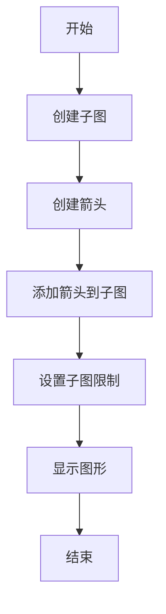

## 类结构

```
matplotlib.pyplot (主模块)
├── matplotlib.patches (子模块)
│   ├── FancyArrowPatch
│   ├── Arrow
│   └── FancyArrow
```

## 全局变量及字段


### `fig`
    
The main figure object where all plots are drawn.

类型：`matplotlib.figure.Figure`
    


### `axs`
    
An array of axes objects where the plots are added.

类型：`numpy.ndarray of matplotlib.axes.Axes`
    


### `x_tail`
    
The x-coordinate of the tail of the arrow.

类型：`float`
    


### `y_tail`
    
The y-coordinate of the tail of the arrow.

类型：`float`
    


### `x_head`
    
The x-coordinate of the head of the arrow.

类型：`float`
    


### `y_head`
    
The y-coordinate of the head of the arrow.

类型：`float`
    


### `dx`
    
The horizontal distance between the tail and head of the arrow.

类型：`float`
    


### `dy`
    
The vertical distance between the tail and head of the arrow.

类型：`float`
    


### `matplotlib.patches.FancyArrowPatch.FancyArrowPatch`
    
A class for creating an arrow patch with a fancy head.

类型：`tuple of floats, tuple of floats, int`
    


### `matplotlib.patches.Arrow.Arrow`
    
A class for creating an arrow patch with a simple head.

类型：`float, float, float, float`
    


### `matplotlib.patches.FancyArrow.FancyArrow`
    
A class for creating an arrow patch with a fancy head and additional properties.

类型：`float, float, float, float, float, bool, str`
    


### `FancyArrowPatch.x_tail`
    
The x-coordinate of the tail of the arrow.

类型：`float`
    


### `FancyArrowPatch.y_tail`
    
The y-coordinate of the tail of the arrow.

类型：`float`
    


### `FancyArrowPatch.x_head`
    
The x-coordinate of the head of the arrow.

类型：`float`
    


### `FancyArrowPatch.y_head`
    
The y-coordinate of the head of the arrow.

类型：`float`
    


### `FancyArrowPatch.mutation_scale`
    
The scale factor for the arrow patch.

类型：`int`
    


### `Arrow.x_tail`
    
The x-coordinate of the tail of the arrow.

类型：`float`
    


### `Arrow.y_tail`
    
The y-coordinate of the tail of the arrow.

类型：`float`
    


### `Arrow.dx`
    
The horizontal distance between the tail and head of the arrow.

类型：`float`
    


### `Arrow.dy`
    
The vertical distance between the tail and head of the arrow.

类型：`float`
    


### `FancyArrow.x_tail`
    
The x-coordinate of the tail of the arrow.

类型：`float`
    


### `FancyArrow.y_tail`
    
The y-coordinate of the tail of the arrow.

类型：`float`
    


### `FancyArrow.dx`
    
The horizontal distance between the tail and head of the arrow.

类型：`float`
    


### `FancyArrow.dy`
    
The vertical distance between the tail and head of the arrow.

类型：`float`
    


### `FancyArrow.width`
    
The width of the arrow stem.

类型：`float`
    


### `FancyArrow.length_includes_head`
    
Whether the length includes the head of the arrow.

类型：`bool`
    


### `FancyArrow.color`
    
The color of the arrow stem and head.

类型：`str`
    
    

## 全局函数及方法


### plt.subplots

`plt.subplots` 是 Matplotlib 库中用于创建子图（subplot）的函数。

参数：

- `nrows`：`int`，指定子图行数。
- `ncols`：`int`，指定子图列数。
- `sharex`：`bool`，指定子图是否共享 x 轴。
- `sharey`：`bool`，指定子图是否共享 y 轴。
- `figsize`：`tuple`，指定整个图形的大小。
- `gridspec_kw`：`dict`，用于指定 GridSpec 的关键字参数。

返回值：`Figure`，包含子图的图形对象。

#### 流程图

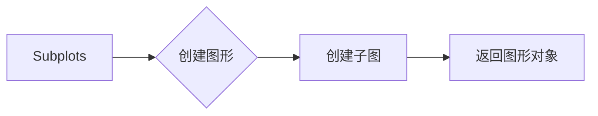

#### 带注释源码

```python
fig, axs = plt.subplots(nrows=2)
```


### axs.add_patch

`axs.add_patch` 是 Matplotlib 库中用于向子图添加图形补丁（patch）的方法。

参数：

- `patch`：`matplotlib.patches.Patch`，要添加的图形补丁。

返回值：`None`

#### 流程图

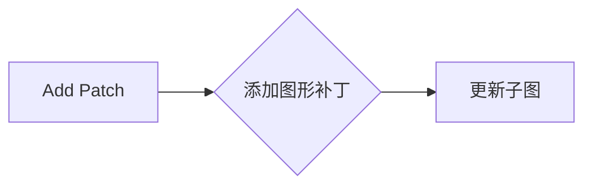

#### 带注释源码

```python
arrow = mpatches.FancyArrowPatch((x_tail, y_tail), (x_head, y_head),
                                 mutation_scale=100)
axs.add_patch(arrow)
```


### plt.show

`plt.show` 是 Matplotlib 库中用于显示图形的方法。

参数：无

返回值：无

#### 流程图

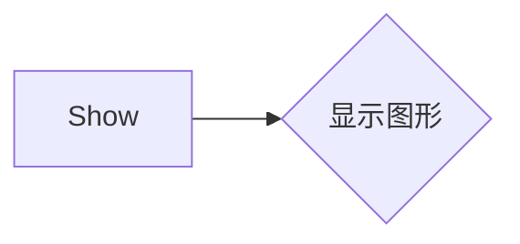

#### 带注释源码

```python
plt.show()
```


### mpatches.FancyArrowPatch

`mpatches.FancyArrowPatch` 是一个用于在 Matplotlib 图表中添加箭头的类。

参数：

- `(x_tail, y_tail)`：`float`，箭头尾部的起点坐标。
- `(x_head, y_head)`：`float`，箭头头部的终点坐标。
- `mutation_scale`：`int`，用于调整箭头的大小。

返回值：`FancyArrowPatch` 对象，表示添加到图表中的箭头。

#### 流程图

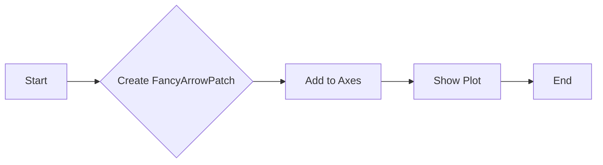

#### 带注释源码

```python
import matplotlib.pyplot as plt
import matplotlib.patches as mpatches

# 创建箭头
arrow = mpatches.FancyArrowPatch((x_tail, y_tail), (x_head, y_head),
                                 mutation_scale=100)

# 将箭头添加到图表
ax.add_patch(arrow)

# 显示图表
plt.show()
``` 


### mpatches.Arrow

`mpatches.Arrow` 是一个用于在 Matplotlib 图中绘制箭头的类。

参数：

- `x`: `float`，箭头起始点的 x 坐标。
- `y`: `float`，箭头起始点的 y 坐标。
- `dx`: `float`，箭头方向上的 x 偏移量。
- `dy`: `float`，箭头方向上的 y 偏移量。

返回值：`mpatches.Arrow` 实例，表示绘制的箭头。

#### 流程图

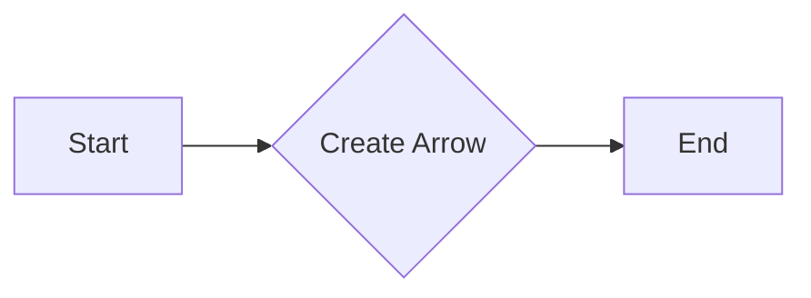

#### 带注释源码

```python
import matplotlib.patches as mpatches

# 创建箭头实例
arrow = mpatches.Arrow(x_tail, y_tail, dx, dy)
```


### mpatches.FancyArrowPatch

This function creates a FancyArrowPatch object, which is used to add an arrow to a plot in Matplotlib. The arrow has a head and a stem, and its position and shape can be specified.

参数：

- `(x_tail, y_tail)`：`tuple`，箭尾的坐标，指定在数据空间中的位置。
- `(x_head, y_head)`：`tuple`，箭头的坐标，指定在数据空间中的位置。
- `mutation_scale`：`int`，用于调整箭头的大小。

返回值：`FancyArrowPatch`，创建的箭头对象。

#### 流程图

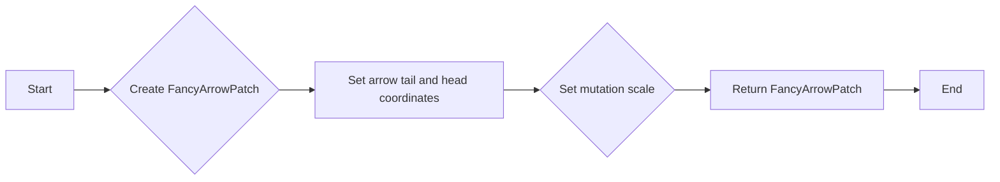

#### 带注释源码

```python
arrow = mpatches.FancyArrowPatch((x_tail, y_tail), (x_head, y_head),
                                 mutation_scale=100)
```


### axs.add_patch(arrow)

`axs.add_patch(arrow)` 是一个方法，用于将一个 patch 对象添加到 matplotlib 的 Axes 对象中。

参数：

- `arrow`：`matplotlib.patches.Patch`，表示要添加的 patch 对象。

返回值：无

#### 流程图

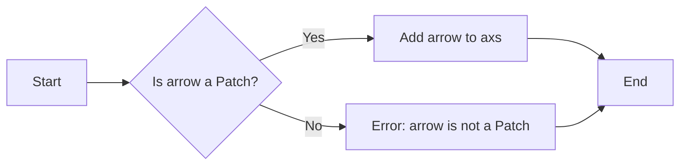

#### 带注释源码

```python
arrow = mpatches.FancyArrowPatch((x_tail, y_tail), (x_head, y_head),
                                 mutation_scale=100)
axs.add_patch(arrow)
```

在这段代码中，首先创建了一个 `FancyArrowPatch` 对象 `arrow`，然后将其添加到 `axs` 对象中。`FancyArrowPatch` 对象的参数包括箭头的起点和终点坐标，以及一个用于调整箭头大小的比例因子 `mutation_scale`。


### axs.set

`axs.set` 是一个假设的函数，因为在提供的代码中没有实际的 `set` 方法。然而，根据上下文，我们可以推断出它可能是用于设置轴（Axes）对象的属性或参数。以下是对该假设函数的描述：

**描述**：设置轴（Axes）对象的属性或参数，如限制、标题、标签等。

#### 参数：

- `xlim`：`tuple`，设置轴的 x 范围。
- `ylim`：`tuple`，设置轴的 y 范围。

#### 返回值：

- `None`，该方法不返回任何值。

#### 流程图

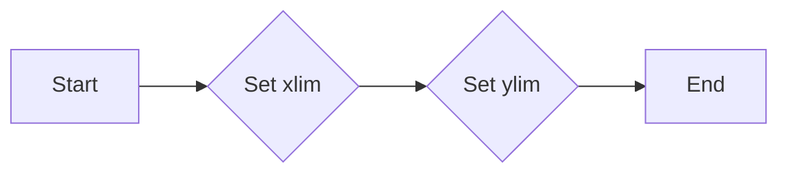

#### 带注释源码

```python
# 假设的 axs.set 方法
def axs_set(axs, xlim=None, ylim=None):
    """
    Set the limits of the axes object.

    Parameters:
    - axs: matplotlib.axes.Axes, the axes object to set the limits for.
    - xlim: tuple, the x-axis limits.
    - ylim: tuple, the y-axis limits.

    Returns:
    - None
    """
    if xlim:
        axs.set_xlim(*xlim)
    if ylim:
        axs.set_ylim(*ylim)
```


### plt.show()

显示当前图形。

参数：

- 无

返回值：无

#### 流程图

```mermaid
graph LR
A[开始] --> B{调用plt.show()}
B --> C[结束]
```

#### 带注释源码

```python
plt.show()
```


### FancyArrowPatch.add_patch

`FancyArrowPatch.add_patch` 方法用于将箭头补丁添加到matplotlib的Axes对象中。

参数：

- `axs`：`Axes`，matplotlib的Axes对象，箭头补丁将被添加到该对象中。

返回值：无

#### 流程图

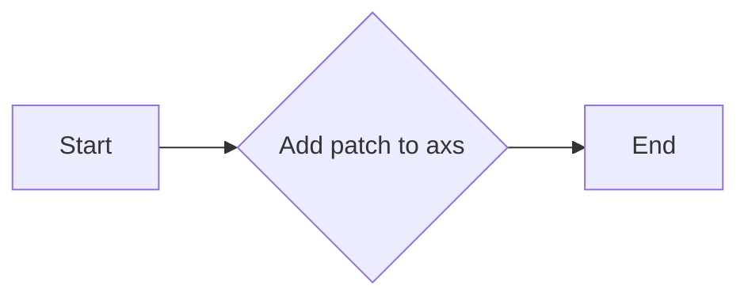

#### 带注释源码

```python
fig, axs = plt.subplots(nrows=2)
arrow = mpatches.FancyArrowPatch((x_tail, y_tail), (x_head, y_head),
                                 mutation_scale=100)
axs.add_patch(arrow)
```

在这段代码中，首先创建了一个matplotlib的Figure和Axes对象。然后，创建了一个`FancyArrowPatch`对象，该对象定义了箭头的起点和终点。最后，使用`add_patch`方法将箭头补丁添加到Axes对象中。


### mpatches.FancyArrowPatch

This function creates a FancyArrowPatch object, which is used to add an arrow to a plot. The arrow consists of a head (and possibly a tail) and a stem drawn between a start point and end point, called 'anchor points'.

参数：

- `(x_tail, y_tail)`：`tuple`，箭尾的坐标
- `(x_head, y_head)`：`tuple`，箭头的坐标
- `mutation_scale`：`int`，用于调整箭头的大小

返回值：`mpatches.FancyArrowPatch`，创建的箭头对象

#### 流程图

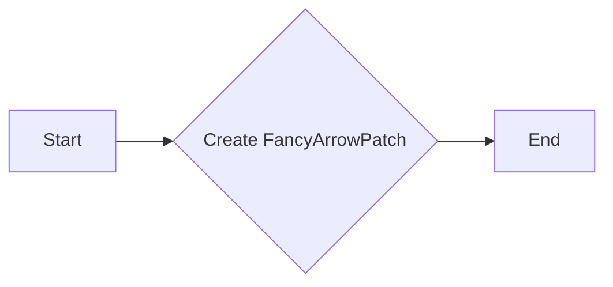

#### 带注释源码

```python
arrow = mpatches.FancyArrowPatch((x_tail, y_tail), (x_head, y_head),
                                 mutation_scale=100)
```


### FancyArrowPatch.add_patch

`FancyArrowPatch.add_patch` 方法用于将箭头补丁添加到matplotlib的Axes对象中。

参数：

- `axs`：`Axes`，matplotlib的Axes对象，用于添加箭头补丁。

返回值：无

#### 流程图


#### 带注释源码

```python
fig, axs = plt.subplots(nrows=2)
arrow = mpatches.FancyArrowPatch((x_tail, y_tail), (x_head, y_head),
                                 mutation_scale=100)
axs.add_patch(arrow)
```


### Arrow.add_patch

`Arrow.add_patch` 方法用于将箭头添加到matplotlib的Axes对象中。

参数：

- `axs`：`Axes`，matplotlib的Axes对象，用于添加箭头。

返回值：无

#### 流程图

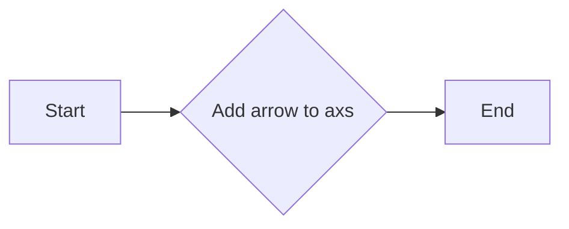

#### 带注释源码

```python
fig, axs = plt.subplots(nrows=2)
arrow = mpatches.Arrow(x_tail, y_tail, dx, dy)
axs.add_patch(arrow)
```


### FancyArrow.add_patch

`FancyArrow.add_patch` 方法用于将箭头添加到matplotlib的Axes对象中。

参数：

- `axs`：`Axes`，matplotlib的Axes对象，用于添加箭头。

返回值：无

#### 流程图


#### 带注释源码

```python
fig, axs = plt.subplots(nrows=2)
arrow = mpatches.FancyArrow(x_tail, y_tail - .4, dx, dy,
                            width=.1, length_includes_head=True, color="C1")
axs.add_patch(arrow)
```

## 关键组件


### 张量索引与惰性加载

张量索引与惰性加载是用于处理大型数据集时的高效数据访问策略。它允许在需要时才计算或加载数据，从而减少内存消耗和提高性能。

### 反量化支持

反量化支持是针对量化计算的一种优化技术，它通过将量化后的数据转换回原始精度，以减少量化误差并提高计算精度。

### 量化策略

量化策略是用于将浮点数数据转换为固定点数表示的方法，以减少数据存储和计算所需的资源。它包括不同的量化级别和精度设置，以适应不同的应用需求。


## 问题及建议


### 已知问题

-   **代码重复性**：代码中多次重复创建箭头并添加到轴上，这可以通过创建一个函数来减少重复。
-   **注释不足**：代码中的注释虽然描述了代码的目的，但缺乏对代码逻辑的详细解释，这可能会对其他开发者理解代码造成困难。
-   **全局变量**：代码中使用了全局变量 `x_tail`, `y_tail`, `x_head`, `y_head`, `dx`, `dy`，这可能会引起命名冲突或难以维护。
-   **代码风格**：代码风格不一致，例如变量命名和缩进，这可能会影响代码的可读性。

### 优化建议

-   **封装函数**：创建一个函数来创建和添加箭头，这样可以减少代码重复并提高可维护性。
-   **增强注释**：增加对代码逻辑的详细注释，帮助其他开发者理解代码的工作原理。
-   **避免全局变量**：使用局部变量或参数传递来避免使用全局变量，这可以提高代码的模块化和可测试性。
-   **统一代码风格**：遵循一致的代码风格指南，以提高代码的可读性和一致性。
-   **使用参数化**：对于重复的代码块，考虑使用参数化来减少代码量，并提高代码的灵活性。
-   **测试**：编写单元测试来验证代码的功能，确保代码的稳定性和可靠性。
-   **文档**：为代码编写文档，包括代码的目的、如何使用它以及它的限制。


## 其它


### 设计目标与约束

- 设计目标：
  - 提供一个模块，用于在matplotlib图表中添加箭头。
  - 支持不同类型的箭头，包括固定在数据空间或显示空间的箭头。
  - 确保箭头在图表缩放或平移时保持正确的位置和形状。
- 约束：
  - 必须使用matplotlib库进行绘图。
  - 箭头绘制功能应尽可能简单，易于使用。

### 错误处理与异常设计

- 错误处理：
  - 当传递无效的参数时，应抛出异常。
  - 异常应提供清晰的错误信息，以便用户了解问题所在。
- 异常设计：
  - 定义自定义异常类，如`InvalidArrowParameterError`，以处理特定的错误情况。

### 数据流与状态机

- 数据流：
  - 用户定义箭头的起点、终点和形状。
  - 系统根据用户定义的参数绘制箭头。
- 状态机：
  - 无状态机，因为箭头绘制是一个简单的操作，没有复杂的状态转换。

### 外部依赖与接口契约

- 外部依赖：
  - matplotlib库。
- 接口契约：
  - 提供一个简单的接口，允许用户轻松添加箭头到图表中。
  - 接口应包括设置箭头起点、终点、形状和位置的方法。


    