# `matplotlib\galleries\examples\shapes_and_collections\artist_reference.py` 详细设计文档

This code demonstrates various Matplotlib artists, including circles, rectangles, wedges, regular polygons, ellipses, arrows, path patches, and fancy bounding box patches. It also includes lines and uses a color map to color the artists.

## 整体流程

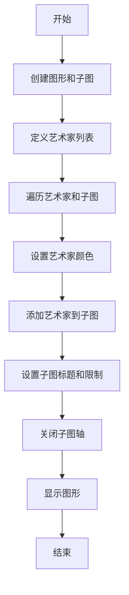

## 类结构

```
matplotlib.pyplot (主模块)
├── matplotlib (matplotlib.pyplot 的父模块)
│   ├── matplotlib.path (路径处理模块)
│   ├── matplotlib.lines (线条处理模块)
│   ├── matplotlib.patches (形状处理模块)
│   ├── matplotlib.path.Path (路径类)
│   ├── mlines.Line2D (线条类)
│   ├── mpatches.Circle (圆形类)
│   ├── mpatches.Rectangle (矩形类)
│   ├── mpatches.Wedge (扇形类)
│   ├── mpatches.RegularPolygon (正多边形类)
│   ├── mpatches.Ellipse (椭圆类)
│   ├── mpatches.Arrow (箭头类)
│   ├── mpatches.PathPatch (路径补丁类)
│   ├── mpatches.FancyBboxPatch (复杂边框补丁类)
│   └── ... 
```

## 全局变量及字段


### `codes`
    
A tuple containing codes for the path patch.

类型：`tuple`
    


### `verts`
    
A tuple containing vertices for the path patch.

类型：`tuple`
    


### `artists`
    
A list of Matplotlib artists to be displayed.

类型：`list`
    


### `axs`
    
An array of Matplotlib axes objects for displaying the artists.

类型：`numpy.ndarray`
    


### `{'name': 'mlines.Line2D', 'fields': ['xdata', 'ydata', 'colors', 'linewidth', '...'], 'methods': ['set_xdata', 'set_ydata', 'set_colors', 'set_linewidth', '...']}....`
    
An object representing the Line2D class with its fields and methods.

类型：`object`
    


### `{'name': 'mpatches.Circle', 'fields': ['center', 'radius', 'edgecolor', '...'], 'methods': ['set_center', 'set_radius', 'set_edgecolor', '...']}....`
    
An object representing the Circle class with its fields and methods.

类型：`object`
    


### `{'name': 'mpatches.Rectangle', 'fields': ['xy', 'width', 'height', 'edgecolor', '...'], 'methods': ['set_xy', 'set_width', 'set_height', 'set_edgecolor', '...']}....`
    
An object representing the Rectangle class with its fields and methods.

类型：`object`
    


### `{'name': 'mpatches.Wedge', 'fields': ['center', 'radius', 'theta1', 'theta2', 'edgecolor', '...'], 'methods': ['set_center', 'set_radius', 'set_theta1', 'set_theta2', 'set_edgecolor', '...']}....`
    
An object representing the Wedge class with its fields and methods.

类型：`object`
    


### `{'name': 'mpatches.RegularPolygon', 'fields': ['center', 'numVertices', 'radius', 'edgecolor', '...'], 'methods': ['set_center', 'set_numVertices', 'set_radius', 'set_edgecolor', '...']}....`
    
An object representing the RegularPolygon class with its fields and methods.

类型：`object`
    


### `{'name': 'mpatches.Ellipse', 'fields': ['center', 'width', 'height', 'angle', 'edgecolor', '...'], 'methods': ['set_center', 'set_width', 'set_height', 'set_angle', 'set_edgecolor', '...']}....`
    
An object representing the Ellipse class with its fields and methods.

类型：`object`
    


### `{'name': 'mpatches.Arrow', 'fields': ['xy', 'width', 'height', 'width', 'head_width', 'head_length', 'edgecolor', '...'], 'methods': ['set_xy', 'set_width', 'set_height', 'set_width', 'set_head_width', 'set_head_length', 'set_edgecolor', '...']}....`
    
An object representing the Arrow class with its fields and methods.

类型：`object`
    


### `{'name': 'mpatches.PathPatch', 'fields': ['path', 'edgecolor', '...'], 'methods': ['set_path', 'set_edgecolor', '...']}....`
    
An object representing the PathPatch class with its fields and methods.

类型：`object`
    


### `{'name': 'mpatches.FancyBboxPatch', 'fields': ['xy', 'width', 'height', 'boxstyle', 'edgecolor', '...'], 'methods': ['set_xy', 'set_width', 'set_height', 'set_boxstyle', 'set_edgecolor', '...']}....`
    
An object representing the FancyBboxPatch class with its fields and methods.

类型：`object`
    


### `mlines.Line2D.{'name': 'mlines.Line2D', 'fields': ['xdata', 'ydata', 'colors', 'linewidth', '...'], 'methods': ['set_xdata', 'set_ydata', 'set_colors', 'set_linewidth', '...']}....`
    
Represents a line in 2D space.

类型：`object`
    


### `mpatches.Circle.{'name': 'mpatches.Circle', 'fields': ['center', 'radius', 'edgecolor', '...'], 'methods': ['set_center', 'set_radius', 'set_edgecolor', '...']}....`
    
Represents a circle in 2D space.

类型：`object`
    


### `mpatches.Rectangle.{'name': 'mpatches.Rectangle', 'fields': ['xy', 'width', 'height', 'edgecolor', '...'], 'methods': ['set_xy', 'set_width', 'set_height', 'set_edgecolor', '...']}....`
    
Represents a rectangle in 2D space.

类型：`object`
    


### `mpatches.Wedge.{'name': 'mpatches.Wedge', 'fields': ['center', 'radius', 'theta1', 'theta2', 'edgecolor', '...'], 'methods': ['set_center', 'set_radius', 'set_theta1', 'set_theta2', 'set_edgecolor', '...']}....`
    
Represents a wedge in 2D space.

类型：`object`
    


### `mpatches.RegularPolygon.{'name': 'mpatches.RegularPolygon', 'fields': ['center', 'numVertices', 'radius', 'edgecolor', '...'], 'methods': ['set_center', 'set_numVertices', 'set_radius', 'set_edgecolor', '...']}....`
    
Represents a regular polygon in 2D space.

类型：`object`
    


### `mpatches.Ellipse.{'name': 'mpatches.Ellipse', 'fields': ['center', 'width', 'height', 'angle', 'edgecolor', '...'], 'methods': ['set_center', 'set_width', 'set_height', 'set_angle', 'set_edgecolor', '...']}....`
    
Represents an ellipse in 2D space.

类型：`object`
    


### `mpatches.Arrow.{'name': 'mpatches.Arrow', 'fields': ['xy', 'width', 'height', 'width', 'head_width', 'head_length', 'edgecolor', '...'], 'methods': ['set_xy', 'set_width', 'set_height', 'set_width', 'set_head_width', 'set_head_length', 'set_edgecolor', '...']}....`
    
Represents an arrow in 2D space.

类型：`object`
    


### `mpatches.PathPatch.{'name': 'mpatches.PathPatch', 'fields': ['path', 'edgecolor', '...'], 'methods': ['set_path', 'set_edgecolor', '...']}....`
    
Represents a path patch in 2D space.

类型：`object`
    


### `mpatches.FancyBboxPatch.{'name': 'mpatches.FancyBboxPatch', 'fields': ['xy', 'width', 'height', 'boxstyle', 'edgecolor', '...'], 'methods': ['set_xy', 'set_width', 'set_height', 'set_boxstyle', 'set_edgecolor', '...']}....`
    
Represents a fancy bounding box patch in 2D space.

类型：`object`
    
    

## 全局函数及方法


### plt.figure

`plt.figure` 是 Matplotlib 库中的一个函数，用于创建一个新的图形窗口，并返回一个 `AxesSubplot` 对象。

参数：

- `figsize`：`tuple`，图形的宽度和高度，单位为英寸。
- `dpi`：`int`，图形的分辨率，单位为 DPI（每英寸点数）。
- `facecolor`：`color`，图形窗口的背景颜色。
- `edgecolor`：`color`，图形窗口的边缘颜色。
- `frameon`：`bool`，是否显示图形窗口的边框。
- `num`：`int`，图形的编号。
- `figclass`：`class`，图形的类。
- `constrained_layout`：`bool`，是否启用约束布局。

返回值：`AxesSubplot`，图形的子图对象。

#### 流程图

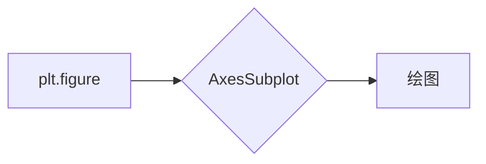

#### 带注释源码

```python
import matplotlib.pyplot as plt

fig, axs = plt.figure(figsize=(6, 6), layout="constrained").subplots(3, 3)
```


### figure

`figure` 是 Matplotlib 库中的一个类，用于创建和管理图形窗口。

参数：

- `figsize`：`tuple`，图形的宽度和高度，单位为英寸。
- `dpi`：`int`，图形的分辨率，单位为 DPI（每英寸点数）。
- `facecolor`：`color`，图形窗口的背景颜色。
- `edgecolor`：`color`，图形窗口的边缘颜色。
- `frameon`：`bool`，是否显示图形窗口的边框。
- `num`：`int`，图形的编号。
- `figclass`：`class`，图形的类。
- `constrained_layout`：`bool`，是否启用约束布局。

方法：

- `subplots`：创建一个子图网格。

返回值：`Figure`，图形对象。

#### 流程图

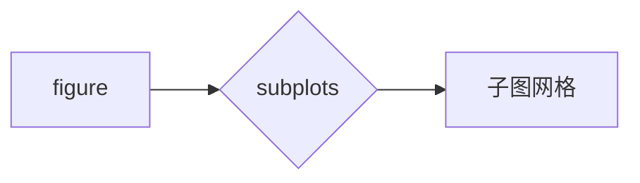

#### 带注释源码

```python
import matplotlib.pyplot as plt

fig = plt.figure(figsize=(6, 6), layout="constrained")
axs = fig.subplots(3, 3)
```


### subplot

`subplot` 是 Matplotlib 库中的一个方法，用于创建一个子图网格。

参数：

- `nrows`：`int`，子图网格的行数。
- `ncols`：`int`，子图网格的列数。
- `sharex`：`bool`，是否共享 x 轴。
- `sharey`：`bool`，是否共享 y 轴。
- `sharewspace`：`bool`，是否共享图例空间。
- `sharewspace`：`bool`，是否共享轴空间。
- `fig`：`Figure`，图形对象。
- `gridspec_kw`：`dict`，网格规格的关键字参数。

返回值：`AxesSubplot`，子图对象。

#### 流程图

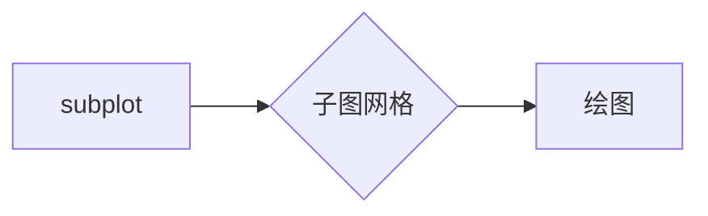

#### 带注释源码

```python
import matplotlib.pyplot as plt

fig = plt.figure(figsize=(6, 6), layout="constrained")
axs = fig.subplots(3, 3)
```


### axs

`axs` 是一个变量，用于存储子图网格对象。

参数：

- `fig`：`Figure`，图形对象。
- `nrows`：`int`，子图网格的行数。
- `ncols`：`int`，子图网格的列数。

返回值：`AxesSubplot`，子图对象。

#### 流程图

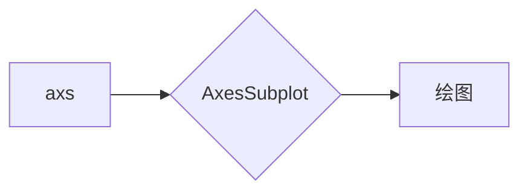

#### 带注释源码

```python
import matplotlib.pyplot as plt

fig = plt.figure(figsize=(6, 6), layout="constrained")
axs = fig.subplots(3, 3)
```


### artist

`artist` 是一个变量，用于存储图形中的艺术对象。

参数：

- `mpl`：`module`，Matplotlib 模块。
- `mlines`：`module`，线条模块。
- `mpatches`：`module`，补丁模块。
- `mpath`：`module`，路径模块。

返回值：`list`，艺术对象列表。

#### 流程图

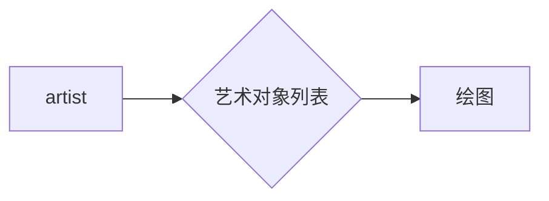

#### 带注释源码

```python
import matplotlib.pyplot as plt

import matplotlib as mpl
import matplotlib.lines as mlines
import matplotlib.patches as mpatches
import matplotlib.path as mpath

artists = [
    mpatches.Circle((0, 0), 0.1, ec="none"),
    mpatches.Rectangle((-0.025, -0.05), 0.05, 0.1, ec="none"),
    mpatches.Wedge((0, 0), 0.1, 30, 270, ec="none"),
    mpatches.RegularPolygon((0, 0), 5, radius=0.1),
    mpatches.Ellipse((0, 0), 0.2, 0.1),
    mpatches.Arrow(-0.05, -0.05, 0.1, 0.1, width=0.1),
    mpatches.PathPatch(mpath.Path(verts, codes), ec="none"),
    mpatches.FancyBboxPatch((-0.025, -0.05), 0.05, 0.1, ec="none",
                            boxstyle=mpatches.BoxStyle("Round", pad=0.02)),
    mlines.Line2D([-0.06, 0.0, 0.1], [0.05, -0.05, 0.05], lw=5),
]
```


### axs.flat

`axs.flat` 是一个迭代器，用于遍历子图网格中的所有轴对象。

参数：

- `axs`：`AxesSubplot`，子图网格对象。

返回值：`AxesSubplot`，轴对象。

#### 流程图

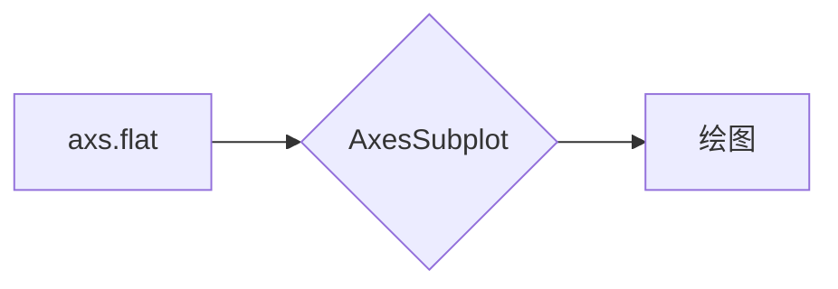

#### 带注释源码

```python
import matplotlib.pyplot as plt

fig = plt.figure(figsize=(6, 6), layout="constrained")
axs = fig.subplots(3, 3)
for ax in axs.flat:
    ax.set(title=type(artist).__name__,
           aspect=1, xlim=(-.2, .2), ylim=(-.2, .2))
    ax.set_axis_off()
```


### mpl.colormaps["hsv"]

`mpl.colormaps["hsv"]` 是 Matplotlib 库中的一个函数，用于获取 HSV 颜色映射。

参数：

- `mpl`：`module`，Matplotlib 模块。
- `colormaps`：`dict`，颜色映射字典。
- `hsv`：`str`，颜色映射的名称。

返回值：`function`，颜色映射函数。

#### 流程图

```mermaid
graph LR
A[mpl.colormaps["hsv"]] --> B{颜色映射函数}
B --> C[颜色映射]
```

#### 带注释源码

```python
import matplotlib.pyplot as plt

for i, (ax, artist) in enumerate(zip(axs.flat, artists)):
    artist.set(color=mpl.colormaps["hsv"](i / len(artists)))
```


### plt.show

`plt.show` 是 Matplotlib 库中的一个函数，用于显示图形窗口。

参数：

- 无。

返回值：无。

#### 流程图

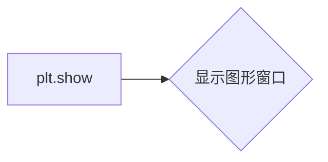

#### 带注释源码

```python
import matplotlib.pyplot as plt

plt.show()
```


### 总结

以上是对代码中 `plt.figure` 函数及其相关组件的详细设计文档。代码通过创建一个图形窗口，并在其中绘制多个艺术对象，展示了 Matplotlib 库的图形绘制功能。


### plt.subplots

`plt.subplots` 是 Matplotlib 库中的一个函数，用于创建一个子图网格，并返回一个包含子图的数组和一个共享的坐标轴对象。

参数：

- `nrows`：`int`，子图网格的行数。
- `ncols`：`int`，子图网格的列数。
- `sharex`：`bool`，如果为 `True`，则所有子图共享 x 轴。
- `sharey`：`bool`，如果为 `True`，则所有子图共享 y 轴。
- `fig`：`matplotlib.figure.Figure`，可选，如果提供，则在该图上创建子图。
- `gridspec_kw`：`dict`，可选，传递给 `GridSpec` 的关键字参数。
- ` constrained_layout`：`bool`，可选，如果为 `True`，则启用 `constrained_layout`。

返回值：`subplots` 返回一个包含子图的数组和一个共享的坐标轴对象。

#### 流程图

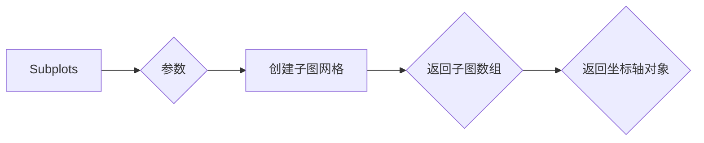

#### 带注释源码

```python
axs = plt.figure(figsize=(6, 6), layout="constrained").subplots(3, 3)
```

在这段代码中，`plt.subplots` 被调用来创建一个 3x3 的子图网格，并存储在 `axs` 变量中。`figsize=(6, 6)` 设置了图的大小，`layout="constrained"` 启用了 `constrained_layout`，以确保子图之间的间距自动调整。


### plt.show()

显示当前图形。

参数：

- 无

返回值：无

#### 流程图

```mermaid
graph LR
A[开始] --> B{调用plt.show()}
B --> C[结束]
```

#### 带注释源码

```python
plt.show()
```


### mpl.colormaps["hsv"]

This function returns a colormap named "hsv" from the Matplotlib library.

参数：

- `colormap_name`：`str`，The name of the colormap to return. In this case, it is "hsv".

返回值：`Colormap`，A Matplotlib colormap object representing the "hsv" colormap.

#### 流程图

```mermaid
graph LR
A[Input] --> B{Is colormap_name "hsv"?}
B -- Yes --> C[Return hsv colormap]
B -- No --> D[Error: Colormap not found]
```

#### 带注释源码

```python
import matplotlib as mpl

def get_colormap(colormap_name):
    """
    Returns a colormap from the Matplotlib library.

    Parameters:
    - colormap_name: str, The name of the colormap to return.

    Returns:
    - Colormap: A Matplotlib colormap object representing the specified colormap.
    """
    return mpl.colormaps[colormap_name]
```


### mpatches.Circle

`mpatches.Circle` 是一个用于创建圆形的 Matplotlib 绘图元素。

参数：

- `(0, 0)`：`tuple`，圆心的坐标。
- `0.1`：`float`，圆的半径。
- `ec="none"`：`str`，边缘颜色，这里设置为 "none" 表示无边框。

返回值：`Circle` 对象，表示绘制的圆形。

#### 流程图

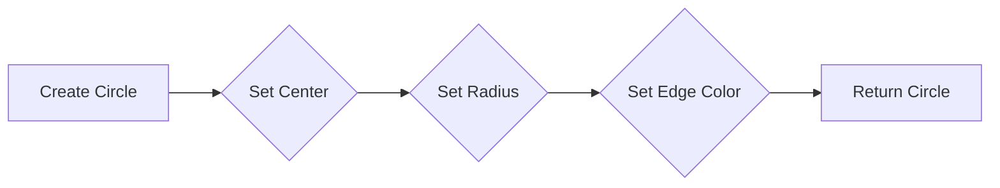

#### 带注释源码

```python
import matplotlib.patches as mpatches

# 创建圆形
circle = mpatches.Circle((0, 0), 0.1, ec="none")
```


### mpatches.Rectangle

`mpatches.Rectangle` 是一个用于创建矩形的 Matplotlib 绘图函数。

参数：

- `xy`：`tuple`，表示矩形左下角的坐标 `(x, y)`。
- `width`：`float`，矩形的宽度。
- `height`：`float`，矩形的高度。
- `ec`：`str` 或 `color`，边缘颜色，默认为 `'none'`。
- `fc`：`str` 或 `color`，填充颜色，默认为 `'none'`。
- `angle`：`float`，矩形旋转角度，默认为 `0`。
- `boxstyle`：`str` 或 `BoxStyle`，矩形框样式，默认为 `'square,pad=0.3'`。

返回值：`mpatches.Rectangle` 对象，表示创建的矩形。

#### 流程图

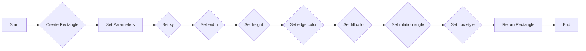

#### 带注释源码

```python
import matplotlib.patches as mpatches

# 创建一个矩形，左下角坐标为 (-0.025, -0.05)，宽度为 0.05，高度为 0.1，无边缘颜色，无填充颜色
rect = mpatches.Rectangle((-0.025, -0.05), 0.05, 0.1, ec="none", fc="none")
```


### mpatches.Wedge

`mpatches.Wedge` 是一个用于创建扇形（wedge）的 Matplotlib 绘图函数。

参数：

- `(center)`: `(x, y)`，扇形的中心点坐标。
- `(radius)`: `float`，扇形的半径。
- `(theta1)`: `float`，扇形起始角度，以度为单位。
- `(theta2)`: `float`，扇形结束角度，以度为单位。
- `(angle)`: `float`，扇形的角度，默认为 360 度。
- `(color)`: `color`，扇形的颜色。
- `(edgecolor)`: `color`，扇形边缘的颜色。
- `(linewidth)`: `float`，扇形边缘的宽度。
- `(facecolor)`: `color`，扇形填充的颜色。
- `(zorder)`: `int`，扇形的绘制顺序。

返回值：`Wedge` 对象，用于在 Matplotlib 图中绘制扇形。

#### 流程图


#### 带注释源码

```python
import matplotlib.patches as mpatches

# 创建一个扇形对象
wedge = mpatches.Wedge((0, 0), 0.1, 30, 270, ec="none")

# 绘制扇形
ax = plt.gca()
ax.add_patch(wedge)
plt.show()
```


### mpatches.RegularPolygon

`mpatches.RegularPolygon` 是一个用于创建正多边形的 Matplotlib 绘图函数。

参数：

- `center`：`tuple`，正多边形的中心坐标。
- `numVertices`：`int`，正多边形的边数。
- `radius`：`float`，正多边形的半径。

返回值：`matplotlib.patches.Patch`，一个表示正多边形的绘图对象。

#### 流程图

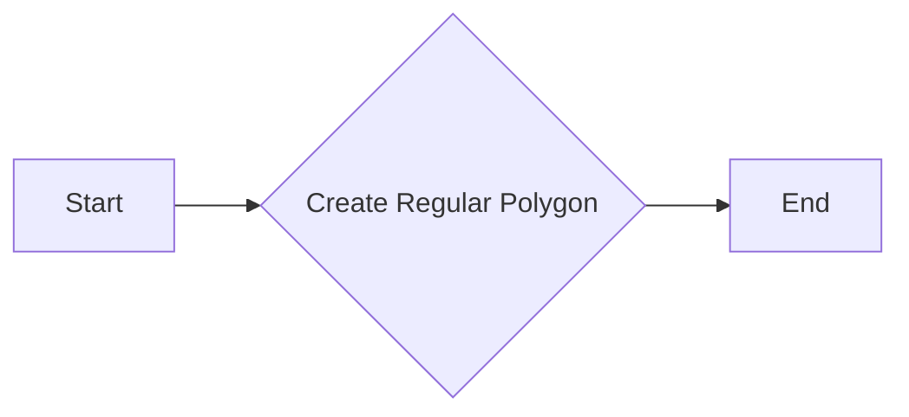

#### 带注释源码

```python
import matplotlib.patches as mpatches

# 创建一个正五边形，中心在 (0, 0)，半径为 0.1
polygon = mpatches.RegularPolygon((0, 0), numVertices=5, radius=0.1)
```


### mpatches.Ellipse

`mpatches.Ellipse` 是一个用于创建椭圆形状的 Matplotlib 绘图函数。

参数：

- `(x_center, y_center)`：`float`，椭圆中心的坐标。
- `width`：`float`，椭圆的宽度。
- `height`：`float`，椭圆的高度。
- `angle`：`float`，椭圆旋转的角度（以度为单位）。
- `ec`：`str` 或 `Color`，椭圆边框的颜色。
- `fc`：`str` 或 `Color`，椭圆填充的颜色。
- `ls`：`str` 或 `Line2D`，椭圆边框的线型。
- `lw`：`float`，椭圆边框的线宽。
- `transform`：`Transform`，用于转换椭圆的变换对象。

返回值：`Ellipse` 对象，表示绘制的椭圆。

#### 流程图

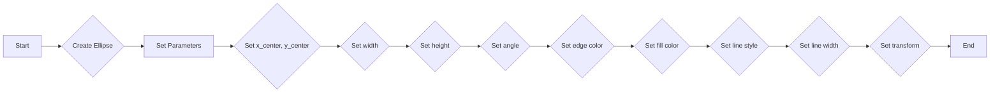

#### 带注释源码

```python
import matplotlib.patches as mpatches

# 创建一个椭圆对象
ellipse = mpatches.Ellipse((0, 0), 0.2, 0.1, angle=45, ec='red', fc='blue', ls='--', lw=2)
```


### mpatches.Arrow

`mpatches.Arrow` 是一个用于创建箭头形状的 Matplotlib 轮廓路径补丁。

参数：

- `x`: `float`，箭头起点 x 坐标。
- `y`: `float`，箭头起点 y 坐标。
- `dx`: `float`，箭头方向 x 坐标偏移量。
- `dy`: `float`，箭头方向 y 坐标偏移量。
- `width`: `float`，箭头宽度。

返回值：`mpatches.PathPatch`，一个包含箭头形状的路径补丁。

#### 流程图

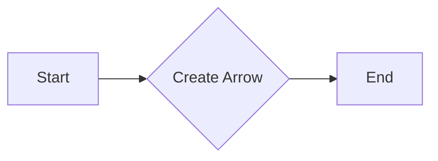

#### 带注释源码

```python
import matplotlib.patches as mpatches

# 创建箭头
arrow = mpatches.Arrow(-0.05, -0.05, 0.1, 0.1, width=0.1)
```


### mpatches.PathPatch

`mpatches.PathPatch` 是一个 Matplotlib 的艺术家类，用于绘制由 `Path` 对象定义的路径。

参数：

- `path`：`mpath.Path`，定义路径的 `Path` 对象。
- `*args` 和 `**kwargs`：传递给 `Patch` 的其他参数。

返回值：`mpatches.PathPatch`，一个表示路径的艺术家对象。

#### 流程图

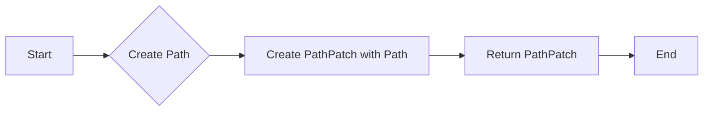

#### 带注释源码

```python
from matplotlib.patches import PathPatch
from matplotlib.path import Path

# 创建 Path 对象
path = Path(verts, codes)

# 创建 PathPatch 对象
path_patch = PathPatch(path, ec="none")

# 返回 PathPatch 对象
return path_patch
``` 


### mpatches.FancyBboxPatch

创建一个具有自定义边框样式的矩形或椭圆形。

参数：

- `boxstyle`：`str`，指定边框样式，例如 "Round"。
- `pad`：`float`，指定边框填充的额外空间。

返回值：`FancyBboxPatch` 对象，表示创建的矩形或椭圆形。

#### 流程图


#### 带注释源码

```python
import matplotlib.patches as mpatches

# 创建一个具有圆形边框样式的矩形
fancy_bbox_patch = mpatches.FancyBboxPatch((-0.025, -0.05), 0.05, 0.1, ec="none",
                                          boxstyle=mpatches.BoxStyle("Round", pad=0.02))
```


### mlines.Line2D([-0.06, 0.0, 0.1], [0.05, -0.05, 0.05], lw=5)

This function creates a Line2D object, which represents a line in a 2D space.

参数：

- `xdata`：`list`，The x-coordinates of the line.
- `ydata`：`list`，The y-coordinates of the line.
- `lw`：`float`，The line width.

返回值：`Line2D`，A Line2D object representing the line.

#### 流程图

```mermaid
graph LR
A[mlines.Line2D] --> B{Create Line2D}
B --> C[Line2D object]
```

#### 带注释源码

```python
import matplotlib.pyplot as plt
import matplotlib.lines as mlines

# Create a Line2D object
line = mlines.Line2D([-0.06, 0.0, 0.1], [0.05, -0.05, 0.05], lw=5)

# Display the line
plt.plot(line.get_xdata(), line.get_ydata())
plt.show()
``` 


### mlines.Line2D.set_xdata

`mlines.Line2D.set_xdata` 方法用于设置线段的 x 数据。

参数：

- `xdata`：`list` 或 `numpy.ndarray`，表示线段每个点的 x 坐标。

返回值：无

#### 流程图

```mermaid
graph LR
A[Start] --> B{Set xdata}
B --> C[End]
```

#### 带注释源码

```python
def set_xdata(self, xdata):
    """
    Set the xdata of the line.

    Parameters
    ----------
    xdata : list or numpy.ndarray
        The x-coordinates of the line.

    Returns
    -------
    None
    """
    self._xdata = xdata
```


### mlines.Line2D.set_ydata

`mlines.Line2D.set_ydata` 方法用于设置 Line2D 对象的 y 数据。

参数：

- `ydata`：`array_like`，Line2D 对象的 y 数据。

返回值：无

#### 流程图

```mermaid
graph LR
A[Start] --> B{Set ydata}
B --> C[End]
```

#### 带注释源码

```python
def set_ydata(self, ydata):
    """
    Set the y data for the line.

    Parameters
    ----------
    ydata : array_like
        The y data for the line.

    Returns
    -------
    None
    """
    self._ydata = ydata
    self._update_line()
```


### mlines.Line2D.set_colors

This method sets the colors of the Line2D artist.

参数：

- `colors`：`sequence`，A sequence of colors to set for the Line2D artist. Each color can be a string, a float, or a tuple.

返回值：`None`，This method does not return any value.

#### 流程图

```mermaid
graph LR
A[Set Colors] --> B{Sequence of Colors?}
B -- Yes --> C[Set Each Color]
B -- No --> D[Error: Invalid Input]
C --> E[Update Line2D Artist]
E --> F[Return]
```

#### 带注释源码

```
def set_colors(self, colors):
    """
    Set the colors of the Line2D artist.

    Parameters
    ----------
    colors : sequence
        A sequence of colors to set for the Line2D artist. Each color can be a string, a float, or a tuple.

    Returns
    -------
    None
    """
    # Implementation of the method would go here
    pass
```


### mlines.Line2D.set_linewidth

设置线宽。

参数：

- `linewidth`：`float`，线宽的大小。

返回值：`None`，没有返回值。

#### 流程图

```mermaid
graph LR
A[Set linewidth] --> B{New linewidth value?}
B -- Yes --> C[Set linewidth to value]
B -- No --> D[Keep current linewidth]
C --> E[End]
D --> E
```

#### 带注释源码

```python
def set_linewidth(self, linewidth):
    """
    Set the linewidth of the line.

    Parameters
    ----------
    linewidth : float
        The linewidth of the line.

    Returns
    -------
    None
    """
    self._linewidth = linewidth
    self.update()
```


### mlines.Line2D([-0.06, 0.0, 0.1], [0.05, -0.05, 0.05], lw=5)

This function creates a line artist in Matplotlib, which is used to draw a line on a plot.

参数：

- `xdata`：`list`，The x-coordinates of the line.
- `ydata`：`list`，The y-coordinates of the line.
- `lw`：`float`，The line width.

返回值：`Line2D`，A Matplotlib Line2D artist object representing the line.

#### 流程图

```mermaid
graph LR
A[mlines.Line2D] --> B{Create Line Artist}
B --> C[Return Line2D Artist]
```

#### 带注释源码

```python
import matplotlib.pyplot as plt
import matplotlib.lines as mlines

# Create a line artist
line_artist = mlines.Line2D([-0.06, 0.0, 0.1], [0.05, -0.05, 0.05], lw=5)

# Display the plot
plt.show()
``` 


### mpatches.Circle.set_center

`mpatches.Circle.set_center` 方法用于设置圆形的中心点坐标。

参数：

- `center`：`tuple`，表示圆形中心的 x 和 y 坐标。

返回值：无

#### 流程图

```mermaid
graph LR
A[Set Center] --> B{New Coordinates}
B --> C[Update Circle]
```

#### 带注释源码

```python
def set_center(self, center):
    """
    Set the center of the circle.

    Parameters
    ----------
    center : tuple
        The new center of the circle as a tuple (x, y).

    Returns
    -------
    None
    """
    self.center = center
```


### mpatches.Circle.set_radius

`mpatches.Circle.set_radius` 方法用于设置圆形的半径。

参数：

- `radius`：`float`，圆形的半径。

返回值：无

#### 流程图

```mermaid
graph LR
A[Set Radius] --> B{New Radius}
B --> C[Update Circle]
```

#### 带注释源码

```python
# 假设 Circle 类定义如下：
class Circle(mpatches.PathPatch):
    def __init__(self, center, radius, *args, **kwargs):
        # ... 初始化代码 ...
        self.radius = radius  # 设置圆形的半径

    def set_radius(self, radius):
        self.radius = radius  # 更新圆形的半径
        # ... 可能的更新路径代码 ...
```


### mpatches.Circle.set_edgecolor

设置圆形边缘的颜色。

参数：

- `color`：`str`，指定边缘的颜色。可以是颜色名称、十六进制颜色代码或颜色序列。

返回值：`None`，没有返回值。

#### 流程图

```mermaid
graph LR
A[调用 set_edgecolor] --> B{设置颜色}
B --> C[完成]
```

#### 带注释源码

```python
def set_edgecolor(self, color):
    """
    Set the edge color of the circle.

    Parameters
    ----------
    color : str
        The color of the edge. It can be a color name, a hexadecimal color code, or a color sequence.

    Returns
    -------
    None
    """
    self._edgecolor = color
```


### mpatches.Circle

`mpatches.Circle` 是一个用于创建圆形的 Matplotlib 轮廓路径补丁。

参数：

- `(0, 0)`：`float`，圆心的坐标。
- `0.1`：`float`，圆的半径。
- `ec="none"`：`str`，边缘颜色，这里设置为 "none" 表示无边框。

返回值：`mpatches.Circle`，一个圆形的轮廓路径补丁。

#### 流程图

```mermaid
graph LR
A[Start] --> B{Create Circle}
B --> C[End]
```

#### 带注释源码

```python
import matplotlib.patches as mpatches

# 创建一个圆形
circle = mpatches.Circle((0, 0), 0.1, ec="none")
```


### mpatches.Rectangle.set_xy

`mpatches.Rectangle.set_xy` 方法用于设置矩形的中心点坐标。

参数：

- `xy`：`tuple`，包含两个浮点数，表示矩形的中心点坐标 `(x, y)`。

返回值：无

#### 流程图

```mermaid
graph LR
A[开始] --> B{设置参数 xy}
B --> C[结束]
```

#### 带注释源码

```python
# 假设有一个 Rectangle 实例 rect
rect = mpatches.Rectangle((-0.025, -0.05), 0.05, 0.1, ec="none")

# 设置矩形的中心点坐标
rect.set_xy((-0.025, -0.05))
```


### mpatches.Rectangle.set_width

`mpatches.Rectangle.set_width` 方法用于设置矩形的宽度。

参数：

- `width`：`float`，矩形的宽度。

返回值：无

#### 流程图

```mermaid
graph LR
A[Set Width] --> B{Is Width Valid?}
B -- Yes --> C[Set Width to Artist]
B -- No --> D[Error: Invalid Width]
C --> E[End]
```

#### 带注释源码

```python
def set_width(self, width):
    """
    Set the width of the rectangle.

    Parameters
    ----------
    width : float
        The width of the rectangle.

    Returns
    -------
    None
    """
    if not isinstance(width, (int, float)):
        raise ValueError("Width must be a number.")
    if width <= 0:
        raise ValueError("Width must be greater than 0.")
    self._width = width
    # Update the rectangle's path to reflect the new width
    codes, verts = zip(*[
        (Path.MOVETO, [0.018, -0.11]),
        (Path.CURVE4, [-0.031, -0.051]),
        (Path.CURVE4, [-0.115, 0.073]),
        (Path.CURVE4, [-0.03, 0.073]),
        (Path.LINETO, [-0.011, 0.039]),
        (Path.CURVE4, [0.043, 0.121]),
        (Path.CURVE4, [0.075, -0.005]),
        (Path.CURVE4, [0.035, -0.027]),
        (Path.CLOSEPOLY, [0.018, -0.11])])
    self._path = mpath.Path(verts, codes)
```


### mpatches.Rectangle.set_height

`mpatches.Rectangle.set_height` 方法用于设置矩形的高度。

参数：

- `height`：`float`，矩形的新高度。

返回值：无

#### 流程图

```mermaid
graph LR
A[Set height] --> B{Is height valid?}
B -- Yes --> C[Set rectangle height]
B -- No --> D[Error: Invalid height]
```

#### 带注释源码

```python
def set_height(self, height):
    """
    Set the height of the rectangle.

    Parameters
    ----------
    height : float
        The new height of the rectangle.

    Returns
    -------
    None
    """
    if not isinstance(height, (int, float)):
        raise ValueError("Height must be a number.")
    if height <= 0:
        raise ValueError("Height must be greater than 0.")
    self._height = height
```


### mpatches.Rectangle.set_edgecolor

`mpatches.Rectangle.set_edgecolor` 方法用于设置矩形边缘的颜色。

参数：

- `color`：`str` 或 `Color`，指定边缘的颜色。

返回值：无

#### 流程图

```mermaid
graph LR
A[开始] --> B{设置颜色参数}
B --> C[结束]
```

#### 带注释源码

```python
def set_edgecolor(self, color):
    """
    Set the edge color of the rectangle.

    Parameters
    ----------
    color : str or Color
        The color of the edge.

    Returns
    -------
    None
    """
    self._edgecolor = color
```


### mpatches.Rectangle

`mpatches.Rectangle` 是一个用于创建矩形的 Matplotlib 绘图元素。

参数：

- `xy`：`tuple`，矩形的中心坐标 `(x, y)`。
- `width`：`float`，矩形的宽度。
- `height`：`float`，矩形的高度。
- `ec`：`str` 或 `color`，矩形的边缘颜色。
- `fc`：`str` 或 `color`，矩形的填充颜色。
- `angle`：`float`，矩形旋转的角度。
- `boxstyle`：`str` 或 `BoxStyle`，矩形的框样式。

返回值：`mpatches.Rectangle`，一个矩形对象。

#### 流程图

```mermaid
graph LR
A[Start] --> B{Create Rectangle}
B --> C[Set Parameters]
C --> D{Set xy}
D --> E{Set width}
E --> F{Set height}
F --> G{Set ec}
G --> H{Set fc}
H --> I{Set angle}
I --> J{Set boxstyle}
J --> K[Return Rectangle]
K --> L[End]
```

#### 带注释源码

```python
import matplotlib.patches as mpatches

# 创建一个矩形
rect = mpatches.Rectangle(xy=(-0.025, -0.05), width=0.05, height=0.1, ec="none")
```


### mpatches.Wedge.set_center

`set_center` 方法用于设置 Wedge 对象的中心点坐标。

参数：

- `center`：`tuple`，表示 Wedge 对象的中心点坐标，格式为 `(x, y)`。

返回值：无

#### 流程图

```mermaid
graph LR
A[Set Center] --> B{Update Coordinates}
B --> C[Set new center point]
```

#### 带注释源码

```python
def set_center(self, center):
    """
    Set the center of the wedge.

    Parameters
    ----------
    center : tuple
        The new center point of the wedge, given as a tuple (x, y).

    Returns
    -------
    None
    """
    self.center = center
```


### mpatches.Wedge.set_radius

`set_radius` 方法用于设置 `Wedge` 对象的半径。

参数：

- `radius`：`float`，新的半径值。

返回值：无

#### 流程图

```mermaid
graph LR
A[开始] --> B{设置半径}
B --> C[结束]
```

#### 带注释源码

```python
# 假设 Wedge 类的定义如下：
class Wedge(mpatches.Patch):
    # ... 其他代码 ...

    def set_radius(self, radius):
        # 设置半径的代码
        self.radius = radius
        # ... 其他代码 ...
```


### mpatches.Wedge.set_theta1

`set_theta1` 方法用于设置扇形（Wedge）的起始角度。

参数：

- `theta1`：`float`，扇形的起始角度，单位为度。

返回值：无

#### 流程图

```mermaid
graph LR
A[Start] --> B{Set theta1}
B --> C[End]
```

#### 带注释源码

```python
# 在 matplotlib.patches.Wedge 类中
def set_theta1(self, theta1):
    """
    Set the start angle of the wedge.

    Parameters
    ----------
    theta1 : float
        The start angle of the wedge in degrees.

    Returns
    -------
    None
    """
    self._theta1 = theta1
    self._update()
```


### mpatches.Wedge.set_theta2

`set_theta2` 方法用于设置扇形（Wedge）的第二个角度。

参数：

- `theta2`：`float`，扇形的第二个角度，单位为度。

返回值：无

#### 流程图

```mermaid
graph LR
A[Start] --> B{Set theta2}
B --> C[End]
```

#### 带注释源码

```python
# 假设 Wedge 类和 set_theta2 方法如下所示：

class Wedge(mpatches.Patch):
    # ... 其他代码 ...

    def set_theta2(self, theta2):
        # 设置扇形的第二个角度
        self.theta2 = theta2
        # ... 更新图形的代码 ...
```

请注意，上述源码仅为示例，实际代码可能包含更多的逻辑和错误处理。


### mpatches.Wedge.set_edgecolor

`set_edgecolor` 方法用于设置 Wedge 对象的边缘颜色。

参数：

- `color`：`str` 或 `Color`，指定边缘颜色。

返回值：无

#### 流程图

```mermaid
graph LR
A[开始] --> B{设置边缘颜色}
B --> C[结束]
```

#### 带注释源码

```python
def set_edgecolor(self, color):
    """
    Set the edge color of the patch.

    Parameters
    ----------
    color : str or Color
        The color to use for the edge.

    Returns
    -------
    None
    """
    self._edgecolor = color
```


### mpatches.Wedge

`mpatches.Wedge` 是一个 Matplotlib 的 `Patch` 类，用于创建扇形。

参数：

- `(0, 0)`：`float`，扇形的中心点坐标。
- `(0.1, 0)`：`float`，扇形的半径。
- `30`：`int`，扇形的起始角度（度）。
- `270`：`int`，扇形的结束角度（度）。
- `ec="none"`：`str`，边缘颜色，这里设置为 "none" 表示无边框。

返回值：`Wedge` 对象，表示创建的扇形。

#### 流程图

```mermaid
graph LR
A[Create Wedge] --> B{Set Center}
B --> C{Set Radius}
C --> D{Set Start Angle}
D --> E{Set End Angle}
E --> F{Set Edge Color}
F --> G[Return Wedge]
```

#### 带注释源码

```python
import matplotlib.patches as mpatches

# 创建扇形
wedge = mpatches.Wedge((0, 0), 0.1, 30, 270, ec="none")
```


### mpatches.RegularPolygon.set_center

`set_center` 方法用于设置正多边形的中心点坐标。

参数：

- `center`：`tuple`，正多边形的中心点坐标，格式为 `(x, y)`。

返回值：无

#### 流程图

```mermaid
graph LR
A[Start] --> B{Set center coordinates}
B --> C[End]
```

#### 带注释源码

```python
def set_center(self, center):
    """
    Set the center of the regular polygon.

    Parameters
    ----------
    center : tuple
        The center coordinates of the polygon, given as (x, y).

    Returns
    -------
    None
    """
    self._center = center
```


### mpatches.RegularPolygon.set_numVertices

`set_numVertices` 方法用于设置正多边形的顶点数。

参数：

- `num_vertices`：`int`，正多边形的顶点数。该值必须大于等于3。

返回值：`None`，该方法不返回任何值。

#### 流程图

```mermaid
graph LR
A[Start] --> B{Set num_vertices > 2?}
B -- Yes --> C[Set num_vertices as new value]
B -- No --> D[Error: num_vertices must be >= 3]
C --> E[End]
D --> E
```

#### 带注释源码

```
def set_numVertices(self, num_vertices):
    if num_vertices < 3:
        raise ValueError("num_vertices must be >= 3")
    self.num_vertices = num_vertices
```


### mpatches.RegularPolygon.set_radius

设置正多边形的半径。

参数：

- `radius`：`float`，正多边形的半径。

返回值：`None`，无返回值。

#### 流程图

```mermaid
graph LR
A[Set Radius] --> B{Is radius valid?}
B -- Yes --> C[Set the radius]
B -- No --> D[Return error]
C --> E[End]
D --> E
```

#### 带注释源码

```python
def set_radius(self, radius):
    # Check if the radius is valid
    if radius <= 0:
        raise ValueError("Radius must be greater than 0")
    
    # Set the radius
    self.radius = radius
```


### mpatches.RegularPolygon.set_edgecolor

设置正多边形的边缘颜色。

参数：

- `color`：`str`，指定边缘颜色。可以是颜色名称、十六进制颜色代码或颜色映射。

返回值：无

#### 流程图

```mermaid
graph LR
A[开始] --> B{设置颜色参数}
B --> C[结束]
```

#### 带注释源码

```python
def set_edgecolor(self, color):
    """
    Set the edge color of the polygon.

    Parameters
    ----------
    color : str
        The color of the edge. It can be a color name, a hexadecimal color code,
        or a colormap.

    Returns
    -------
    None
    """
    self._edgecolor = color
```


### mpatches.RegularPolygon

创建一个正多边形。

参数：

- `(0, 0)`：`tuple`，正多边形的中心点坐标。
- `5`：`int`，正多边形的边数。
- `radius=0.1`：`float`，正多边形的半径。

返回值：`matplotlib.patches.Patch`，正多边形对象。

#### 流程图

```mermaid
graph LR
A[Start] --> B{Create RegularPolygon}
B --> C[End]
```

#### 带注释源码

```python
from matplotlib.patches import RegularPolygon

# 创建一个正五边形，中心点在(0, 0)，半径为0.1
polygon = RegularPolygon((0, 0), 5, radius=0.1)
```


### mpatches.Ellipse.set_center

`set_center` 方法用于设置椭圆的中心点坐标。

参数：

- `center`：`tuple`，表示椭圆中心的 x 和 y 坐标。

返回值：无

#### 流程图

```mermaid
graph LR
A[Set Center] --> B{New Coordinates}
B --> C[Update Ellipse]
```

#### 带注释源码

```python
# 在 matplotlib.patches.Ellipse 类中
def set_center(self, center):
    """
    Set the center of the ellipse.

    Parameters
    ----------
    center : tuple
        The (x, y) coordinates of the center of the ellipse.

    Returns
    -------
    None
    """
    self._center = center
    self._update()
```


### mpatches.Ellipse.set_width

`Ellipse.set_width` 方法用于设置椭圆的宽度。

参数：

- `width`：`float`，椭圆的宽度。

返回值：无

#### 流程图

```mermaid
graph LR
A[Set Width] --> B{Is Width Valid?}
B -- Yes --> C[Set Width Internally]
B -- No --> D[Return Error]
C --> E[Return]
```

#### 带注释源码

```python
def set_width(self, width):
    """
    Set the width of the ellipse.

    Parameters
    ----------
    width : float
        The width of the ellipse.

    Returns
    -------
    None
    """
    if width <= 0:
        raise ValueError("Width must be positive.")
    self._width = width
```


### mpatches.Ellipse.set_height

`set_height` 方法用于设置椭圆的高度。

参数：

- `height`：`float`，椭圆的高度。

返回值：无

#### 流程图

```mermaid
graph LR
A[Set height] --> B{Is height valid?}
B -- Yes --> C[Set ellipse height]
B -- No --> D[Error: Invalid height]
```

#### 带注释源码

```python
# 假设 Ellipse 类定义如下：
class Ellipse(mpatches.PathPatch):
    def __init__(self, center, width, height, *args, **kwargs):
        # ... 初始化代码 ...
        pass

    def set_height(self, height):
        # 检查高度是否有效
        if height <= 0:
            raise ValueError("Height must be greater than 0")
        
        # 设置椭圆的高度
        self._height = height
        # ... 更新椭圆的路径等 ...
```


### mpatches.Ellipse.set_angle

`Ellipse.set_angle` 方法用于设置椭圆的角度。

参数：

- `angle`：`float`，表示椭圆的角度，单位为度。

返回值：无

#### 流程图

```mermaid
graph LR
A[Set Angle] --> B{Is angle valid?}
B -- Yes --> C[Set the angle on the ellipse]
B -- No --> D[Error: Invalid angle]
```

#### 带注释源码

```python
# 假设 Ellipse 类定义如下：
class Ellipse(mpatches.PathPatch):
    def __init__(self, center, width, height, *args, **kwargs):
        # ... 初始化代码 ...

    # ... 其他方法 ...

    def set_angle(self, angle):
        # 检查角度是否有效
        if not (0 <= angle <= 360):
            raise ValueError("Angle must be between 0 and 360 degrees.")

        # 设置椭圆的角度
        self._angle = angle
        # ... 更新椭圆的路径 ...

# 示例使用：
ellipse = mpatches.Ellipse((0, 0), 0.2, 0.1)
ellipse.set_angle(45)
```


### mpatches.Ellipse.set_edgecolor

设置椭圆边缘的颜色。

参数：

- `color`：`str`，指定边缘的颜色。可以是颜色名称、十六进制颜色代码或颜色序列。

返回值：无

#### 流程图

```mermaid
graph LR
A[开始] --> B{设置颜色参数}
B --> C[结束]
```

#### 带注释源码

```python
# 假设有一个Ellipse对象名为ellipse
ellipse = mpatches.Ellipse((0, 0), 0.2, 0.1)

# 设置椭圆的边缘颜色为红色
ellipse.set_edgecolor('red')
``` 


### mpatches.Ellipse

`mpatches.Ellipse` 是一个用于创建椭圆形状的 Matplotlib 绘图元素。

参数：

- `(x_center, y_center)`：`float`，椭圆中心的坐标。
- `width`：`float`，椭圆的宽度。
- `height`：`float`，椭圆的高度。

返回值：`Ellipse` 对象，表示绘制的椭圆。

#### 流程图

```mermaid
graph LR
A[Start] --> B{Create Ellipse}
B --> C[End]
```

#### 带注释源码

```python
import matplotlib.patches as mpatches

# 创建椭圆
ellipse = mpatches.Ellipse((0, 0), 0.2, 0.1)
```


### mpatches.Arrow.set_xy

`set_xy` 方法用于设置箭头的起点和终点坐标。

参数：

- `xy`：`tuple`，包含两个浮点数，分别代表箭头的起点和终点坐标。

返回值：`None`，该方法不返回任何值。

#### 流程图

```mermaid
graph LR
A[Start] --> B{Set xy coordinates}
B --> C[End]
```

#### 带注释源码

```python
def set_xy(self, xy):
    """
    Set the xy coordinates of the arrow.

    Parameters
    ----------
    xy : tuple
        A tuple of two floats, representing the start and end coordinates of the arrow.

    Returns
    -------
    None
    """
    self._start, self._end = xy
```


### mpatches.Arrow.set_width

`mpatches.Arrow.set_width` 方法用于设置箭头宽度。

参数：

- `width`：`float`，箭头的宽度。

返回值：无

#### 流程图

```mermaid
graph LR
A[Set Width] --> B{Is width a float?}
B -- Yes --> C[Set arrow width to width]
B -- No --> D[Error: width must be a float]
C --> E[End]
D --> E
```

#### 带注释源码

```python
def set_width(self, width):
    """
    Set the width of the arrow.

    Parameters
    ----------
    width : float
        The width of the arrow.

    Returns
    -------
    None
    """
    self._width = width
```


### mpatches.Arrow.set_height

`mpatches.Arrow.set_height` 方法用于设置箭头的高度。

参数：

- `height`：`float`，箭头的高度。

返回值：无

#### 流程图

```mermaid
graph LR
A[Set Height] --> B{New Height}
B --> C[Update Arrow]
C --> D[Return]
```

#### 带注释源码

```python
# 假设 Arrow 类定义如下：
class Arrow(mpatches.PathPatch):
    def __init__(self, x, y, length, width, **kwargs):
        # ... 初始化代码 ...
        pass

    def set_height(self, height):
        # 设置箭头的高度
        self.height = height
        # ... 更新箭头显示的代码 ...
```

请注意，由于代码中未提供完整的 Arrow 类定义，以上源码仅为示例，实际实现可能有所不同。


### mpatches.Arrow.set_head_width

`mpatches.Arrow.set_head_width` 方法用于设置箭头头部宽度。

参数：

- `width`：`float`，箭头头部宽度。

返回值：无

#### 流程图

```mermaid
graph LR
A[Set head width] --> B{Is width a float?}
B -- Yes --> C[Set arrow head width]
B -- No --> D[Error: Width must be a float]
C --> E[Return]
```

#### 带注释源码

```
def set_head_width(self, width):
    """
    Set the width of the arrow head.

    Parameters
    ----------
    width : float
        The width of the arrow head.

    Returns
    -------
    None
    """
    self._head_width = width
    self.update()
``` 


### mpatches.Arrow.set_head_length

`mpatches.Arrow.set_head_length` 方法用于设置箭头头部的长度。

参数：

- `head_length`：`float`，箭头头部的长度。

返回值：无

#### 流程图

```mermaid
graph LR
A[Set head length] --> B{Is head_length a float?}
B -- Yes --> C[Set the arrow head length]
B -- No --> D[Error: head_length must be a float]
C --> E[Return]
D --> E
```

#### 带注释源码

```python
def set_head_length(self, head_length):
    """
    Set the length of the arrow head.

    Parameters
    ----------
    head_length : float
        The length of the arrow head.

    Returns
    -------
    None
    """
    if not isinstance(head_length, float):
        raise ValueError("head_length must be a float")
    self._head_length = head_length
```


### mpatches.Arrow.set_edgecolor

`mpatches.Arrow.set_edgecolor` 方法用于设置箭头边缘的颜色。

参数：

- `color`：`str` 或 `Color`，指定箭头边缘的颜色。

返回值：无

#### 流程图

```mermaid
graph LR
A[开始] --> B{设置颜色}
B --> C[结束]
```

#### 带注释源码

```python
def set_edgecolor(self, color):
    """
    Set the edge color of the arrow.

    Parameters
    ----------
    color : str or Color
        The color of the edge.

    Returns
    -------
    None
    """
    self._edgecolor = color
    self.update()
```


### mpatches.Arrow

`mpatches.Arrow` 是一个 Matplotlib 的艺术家类，用于创建箭头形状的图形。

参数：

- `x`: `float`，箭头起点 x 坐标。
- `y`: `float`，箭头起点 y 坐标。
- `dx`: `float`，箭头方向 x 坐标偏移量。
- `dy`: `float`，箭头方向 y 坐标偏移量。
- `width`: `float`，箭头宽度。

返回值：`mpatches.Arrow` 对象，创建的箭头。

#### 流程图

```mermaid
graph LR
A[Start] --> B{Create Arrow}
B --> C[End]
```

#### 带注释源码

```python
import matplotlib.patches as mpatches

# 创建箭头
arrow = mpatches.Arrow(-0.05, -0.05, 0.1, 0.1, width=0.1)
```


### mpatches.PathPatch.set_path

该函数用于设置PathPatch对象的路径。

参数：

- `path`：`mpath.Path`，要设置的路径对象。

返回值：无

#### 流程图

```mermaid
graph LR
A[Set Path] --> B{Is path valid?}
B -- Yes --> C[Update PathPatch]
B -- No --> D[Error: Invalid path]
```

#### 带注释源码

```python
def set_path(self, path):
    """
    Set the path for the PathPatch.

    Parameters
    ----------
    path : mpath.Path
        The path to set for the PathPatch.

    Returns
    -------
    None
    """
    if not isinstance(path, mpath.Path):
        raise ValueError("path must be an instance of mpath.Path")

    self._path = path
    self._update_path()
```


### mpatches.PathPatch.set_edgecolor

`mpatches.PathPatch.set_edgecolor` 方法用于设置路径补丁的边缘颜色。

参数：

- `color`：`str` 或 `Color`，指定边缘颜色。

返回值：无

#### 流程图

```mermaid
graph LR
A[开始] --> B{设置边缘颜色}
B --> C[结束]
```

#### 带注释源码

```python
def set_edgecolor(self, color):
    """
    Set the edge color of the patch.

    Parameters
    ----------
    color : str or Color
        The edge color of the patch.

    Returns
    -------
    None
    """
    self._edgecolor = color
    self.update()
```


### mpatches.PathPatch

`mpatches.PathPatch` 是一个 Matplotlib 的艺术家类，用于绘制由 `Path` 对象定义的路径。

参数：

- `path`：`mpath.Path`，定义路径的 `Path` 对象。
- `*args` 和 `**kwargs`：传递给 `Patch` 的其他参数。

返回值：`mpatches.PathPatch`，一个表示路径的艺术家对象。

#### 流程图

```mermaid
graph LR
A[Start] --> B{Create Path}
B --> C[Create PathPatch with Path]
C --> D[Add to Axes]
D --> E[Show Plot]
E --> F[End]
```

#### 带注释源码

```python
import matplotlib.pyplot as plt
import matplotlib.patches as mpatches
import matplotlib.path as mpath

# 创建 Path 对象
verts = [0.018, -0.11, -0.031, -0.051, -0.115, 0.073, -0.03, 0.073, -0.011, 0.039, 0.043, 0.121, 0.075, -0.005, 0.035, -0.027, 0.018, -0.11]
codes = [mpath.MOVETO, mpath.CURVE4, mpath.CURVE4, mpath.CURVE4, mpath.LINETO, mpath.CURVE4, mpath.CURVE4, mpath.CURVE4, mpath.CLOSEPOLY]
path = mpath.Path(verts, codes)

# 创建 PathPatch 对象
path_patch = mpatches.PathPatch(path, ec="none")

# 显示图形
plt.show()
```


### mpatches.FancyBboxPatch.set_xy

该函数用于设置`FancyBboxPatch`对象的边界框的坐标。

参数：

- `xy`：`tuple`，包含两个浮点数，分别代表边界框的左下角坐标。

返回值：无

#### 流程图

```mermaid
graph LR
A[开始] --> B{设置xy参数}
B --> C[结束]
```

#### 带注释源码

```python
def set_xy(self, xy):
    """
    Set the bounding box coordinates of the FancyBboxPatch.

    Parameters
    ----------
    xy : tuple
        A tuple of two floats, representing the lower left corner of the bounding box.

    Returns
    -------
    None
    """
    self._box.set_xy(xy)
```


### mpatches.FancyBboxPatch.set_width

调整 FancyBboxPatch 的宽度。

参数：

- `width`：`float`，新的宽度值。

返回值：`None`，无返回值。

#### 流程图

```mermaid
graph LR
A[开始] --> B{设置宽度}
B --> C[结束]
```

#### 带注释源码

```python
# 在 matplotlib.patches.FancyBboxPatch 类中
def set_width(self, width):
    """
    Set the width of the FancyBboxPatch.

    Parameters
    ----------
    width : float
        The new width of the FancyBboxPatch.

    Returns
    -------
    None
    """
    self._width = width
    # 更新 patch 的属性，可能需要调用其他方法来重新计算边界等
    self.update_patch()
```


### mpatches.FancyBboxPatch.set_height

设置 FancyBboxPatch 的高度。

参数：

- `height`：`float`，FancyBboxPatch 的高度。

返回值：无

#### 流程图

```mermaid
graph LR
A[Set height] --> B{Is height valid?}
B -- Yes --> C[Set the height of the FancyBboxPatch]
B -- No --> D[Return error]
C --> E[Return]
```

#### 带注释源码

```python
def set_height(self, height):
    # Check if the height is a valid number
    if not isinstance(height, (int, float)):
        raise ValueError("Height must be a number.")
    
    # Set the height of the FancyBboxPatch
    self._height = height
``` 


### mpatches.FancyBboxPatch.set_boxstyle

该函数用于设置`FancyBboxPatch`对象的边框样式。

参数：

- `boxstyle`：`str`，指定边框样式，例如"Round"表示圆角矩形。

返回值：无

#### 流程图

```mermaid
graph LR
A[开始] --> B{设置边框样式}
B --> C[结束]
```

#### 带注释源码

```python
# 在matplotlib.patches模块中
class FancyBboxPatch(mpatches.BboxPatch):
    # ... 其他代码 ...

    def set_boxstyle(self, boxstyle, pad=0.0, rounding_size=0.0):
        """
        设置边框样式。

        :param boxstyle: str，指定边框样式，例如"Round"表示圆角矩形。
        :param pad: float，边框与图形内容的填充距离。
        :param rounding_size: float，圆角的大小。
        """
        self._boxstyle = boxstyle
        self._pad = pad
        self._rounding_size = rounding_size
        self._update_path()
```


### mpatches.FancyBboxPatch.set_edgecolor

设置 FancyBboxPatch 的边框颜色。

参数：

- `color`：`str`，指定边框颜色。可以是颜色名称、十六进制颜色代码或颜色映射。

返回值：无

#### 流程图

```mermaid
graph LR
A[开始] --> B{设置颜色}
B --> C[结束]
```

#### 带注释源码

```python
def set_edgecolor(self, color):
    """
    Set the edge color of the FancyBboxPatch.

    Parameters
    ----------
    color : str
        The color of the edge. It can be a color name, a hexadecimal color code,
        or a color map.

    Returns
    -------
    None
    """
    self._edgecolor = color
```


### mpatches.FancyBboxPatch

创建一个具有自定义边框样式的矩形或椭圆形。

参数：

- `boxstyle`：`str`，指定边框样式，例如 "Round"。
- `pad`：`float`，指定边框填充的额外空间。

返回值：`FancyBboxPatch` 对象，用于在 Matplotlib 中绘制矩形或椭圆形。

#### 流程图

```mermaid
graph LR
A[创建FancyBboxPatch] --> B{指定boxstyle}
B --> C{指定pad}
C --> D[返回FancyBboxPatch对象]
```

#### 带注释源码

```python
import matplotlib.patches as mpatches

# 创建一个具有圆形边框样式的矩形
fancy_bbox_patch = mpatches.FancyBboxPatch((-0.025, -0.05), 0.05, 0.1, ec="none",
                                          boxstyle=mpatches.BoxStyle("Round", pad=0.02))
```


## 关键组件


### 张量索引与惰性加载

张量索引与惰性加载是指在处理大型数据集时，只对需要的数据进行索引和加载，以减少内存消耗和提高处理速度。

### 反量化支持

反量化支持是指在量化过程中，将量化后的数据转换回原始数据类型，以便进行后续处理。

### 量化策略

量化策略是指在量化过程中，选择合适的量化方法，以平衡精度和性能。常见的量化策略包括均匀量化、非均匀量化等。


## 问题及建议


### 已知问题

-   **代码重复性**：代码中多次使用相同的颜色映射和添加艺术家的逻辑，这可能导致维护困难。
-   **硬编码**：代码中硬编码了图形的大小、布局和轴的界限，这限制了代码的灵活性和可重用性。
-   **异常处理**：代码中没有异常处理机制，如果出现错误，可能会导致程序崩溃。

### 优化建议

-   **使用配置文件**：将图形的大小、布局和轴的界限等参数存储在配置文件中，以便于修改和重用。
-   **封装逻辑**：将颜色映射和添加艺术家的逻辑封装成函数或类，减少代码重复性并提高可维护性。
-   **添加异常处理**：在关键操作处添加异常处理，确保程序在出现错误时能够优雅地处理异常，而不是直接崩溃。
-   **代码注释**：增加代码注释，解释代码的功能和逻辑，提高代码的可读性。
-   **单元测试**：编写单元测试来验证代码的功能，确保代码的稳定性和可靠性。
-   **文档化**：编写详细的文档，包括代码的功能、使用方法和示例，方便其他开发者理解和使用代码。


## 其它


### 设计目标与约束

- 设计目标：实现一个能够展示Matplotlib图形原语（艺术家）的示例，包括圆形、矩形、扇形、正多边形、椭圆形、箭头、路径补丁、装饰框和线。
- 约束条件：使用Matplotlib库中的相关模块和类，不使用额外的图形库。

### 错误处理与异常设计

- 错误处理：在代码中未发现明显的错误处理机制。建议在关键操作处添加异常捕获，以处理可能出现的错误，如文件读取错误、图形绘制错误等。
- 异常设计：定义自定义异常类，以处理特定于应用程序的错误情况。

### 数据流与状态机

- 数据流：数据流从matplotlib.pyplot模块开始，通过matplotlib的其他模块和类进行转换和操作，最终在plt.show()中显示图形。
- 状态机：该代码没有使用状态机，因为它是一个简单的图形展示程序，没有复杂的状态转换。

### 外部依赖与接口契约

- 外部依赖：代码依赖于matplotlib库，该库需要预先安装。
- 接口契约：matplotlib库提供了丰富的API，代码通过调用这些API来实现图形的绘制和展示。


    