# `matplotlib\galleries\examples\shapes_and_collections\collections.py` 详细设计文档

This code generates a series of plots using matplotlib to illustrate the use of LineCollection, PolyCollection, and RegularPolyCollection for visualizing spirals, polygons, and offset curves.

## 整体流程

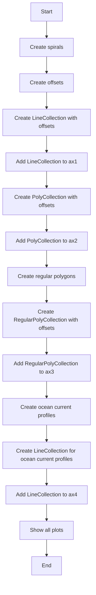

## 类结构

```
matplotlib.pyplot (主模块)
├── collections (子模块)
│   ├── LineCollection
│   ├── PolyCollection
│   └── RegularPolyCollection
└── transforms (子模块)
    └── Affine2D
```

## 全局变量及字段


### `nverts`
    
Number of vertices for the spirals and polygons.

类型：`int`
    


### `npts`
    
Number of points for the offsets.

类型：`int`
    


### `rs`
    
Random state for reproducibility of random numbers.

类型：`numpy.random.RandomState`
    


### `colors`
    
Dictionary containing colors from the default color cycle.

类型：`dict`
    


### `fig`
    
Figure object for the plot.

类型：`matplotlib.figure.Figure`
    


### `ax1`
    
Axes object for the first subplot.

类型：`matplotlib.axes.Axes`
    


### `ax2`
    
Axes object for the second subplot.

类型：`matplotlib.axes.Axes`
    


### `ax3`
    
Axes object for the third subplot.

类型：`matplotlib.axes.Axes`
    


### `ax4`
    
Axes object for the fourth subplot.

类型：`matplotlib.axes.Axes`
    


### `offs`
    
Offset for successive data offsets in data units.

类型：`tuple`
    


### `yy`
    
Array of y-coordinates for the spirals and polygons.

类型：`numpy.ndarray`
    


### `ym`
    
Maximum value of the y-coordinates for scaling purposes.

类型：`float`
    


### `xx`
    
Array of x-coordinates for the spirals and polygons.

类型：`numpy.ndarray`
    


### `segs`
    
List of curves for the successive data offsets.

类型：`list`
    


### `colors`
    
Dictionary containing colors from the default color cycle.

类型：`dict`
    


### `LineCollection.offsets`
    
List of tuples representing the offsets for the line segments.

类型：`list`
    


### `LineCollection.offset_transform`
    
Transform for the offsets.

类型：`matplotlib.transforms.Transform`
    


### `LineCollection.color`
    
Color of the line segments.

类型：`str`
    


### `LineCollection.set_transform`
    
Function to set the transform for the line segments.

类型：`function`
    


### `PolyCollection.offsets`
    
List of tuples representing the offsets for the polygon vertices.

类型：`list`
    


### `PolyCollection.offset_transform`
    
Transform for the offsets.

类型：`matplotlib.transforms.Transform`
    


### `PolyCollection.color`
    
Color of the polygons.

类型：`str`
    


### `PolyCollection.set_transform`
    
Function to set the transform for the polygons.

类型：`function`
    


### `RegularPolyCollection.sizes`
    
Array of sizes for the regular polygons.

类型：`numpy.ndarray`
    


### `RegularPolyCollection.offsets`
    
List of tuples representing the offsets for the regular polygons.

类型：`list`
    


### `RegularPolyCollection.offset_transform`
    
Transform for the offsets.

类型：`matplotlib.transforms.Transform`
    


### `RegularPolyCollection.color`
    
Color of the regular polygons.

类型：`str`
    


### `RegularPolyCollection.set_transform`
    
Function to set the transform for the regular polygons.

类型：`function`
    


### `Affine2D.scale`
    
Scale factor for the Affine2D transform.

类型：`float`
    
    

## 全局函数及方法


### plt.subplots

`plt.subplots` 是 Matplotlib 库中用于创建子图（subplot）的函数。

参数：

- `nrows`：`int`，指定子图行数。
- `ncols`：`int`，指定子图列数。
- `sharex`：`bool`，指定子图是否共享 x 轴。
- `sharey`：`bool`，指定子图是否共享 y 轴。
- `figsize`：`tuple`，指定整个图形的大小。
- `gridspec_kw`：`dict`，用于指定 GridSpec 的关键字参数。
- `constrained_layout`：`bool`，指定是否启用约束布局。

返回值：`Figure`，包含子图的 Figure 对象。

#### 流程图

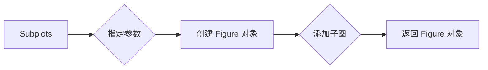

#### 带注释源码

```python
fig, ((ax1, ax2), (ax3, ax4)) = plt.subplots(2, 2)
```


### collections.LineCollection

`collections.LineCollection` 是 Matplotlib 库中用于创建线集合的类。

参数：

- `segments`：`list`，包含线段的列表。
- `offsets`：`list`，包含偏移量的列表。
- `offset_transform`：`Transform`，用于偏移的转换。
- `color`：`color`，指定线的颜色。

方法：

- `set_transform`：`Transform`，设置转换。

返回值：`LineCollection`，包含线集合的对象。

#### 流程图

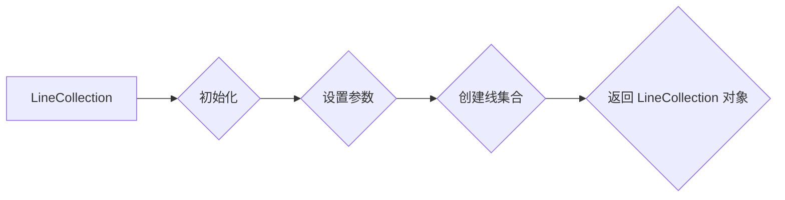

#### 带注释源码

```python
col = collections.LineCollection(
    [spiral], offsets=xyo, offset_transform=ax1.transData, color=colors)
```


### collections.PolyCollection

`collections.PolyCollection` 是 Matplotlib 库中用于创建多边形集合的类。

参数：

- `verts`：`list`，包含多边形顶点的列表。
- `offsets`：`list`，包含偏移量的列表。
- `offset_transform`：`Transform`，用于偏移的转换。
- `color`：`color`，指定多边形的颜色。

方法：

- `set_transform`：`Transform`，设置转换。

返回值：`PolyCollection`，包含多边形集合的对象。

#### 流程图

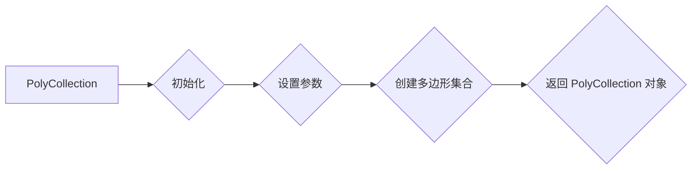

#### 带注释源码

```python
col = collections.PolyCollection(
    [spiral], offsets=xyo, offset_transform=ax2.transData, color=colors)
```


### collections.RegularPolyCollection

`collections.RegularPolyCollection` 是 Matplotlib 库中用于创建规则多边形集合的类。

参数：

- `num_poly`：`int`，指定多边形的数量。
- `sizes`：`list`，指定多边形的大小。
- `offsets`：`list`，包含偏移量的列表。
- `offset_transform`：`Transform`，用于偏移的转换。
- `color`：`color`，指定多边形的颜色。

方法：

- `set_transform`：`Transform`，设置转换。

返回值：`RegularPolyCollection`，包含规则多边形集合的对象。

#### 流程图

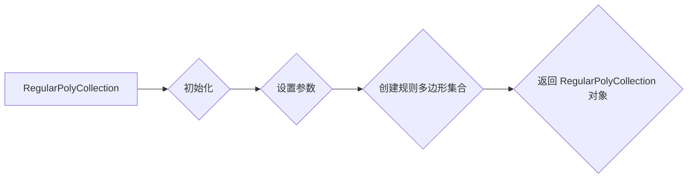

#### 带注释源码

```python
col = collections.RegularPolyCollection(
    7, sizes=np.abs(xx) * 10.0, offsets=xyo, offset_transform=ax3.transData,
    color=colors)
```


### plt.rcParams

`plt.rcParams` 是一个全局变量，用于存储和访问 Matplotlib 的配置参数。

参数：

- 无

返回值：`dict`，包含所有 Matplotlib 配置参数的字典。

#### 流程图

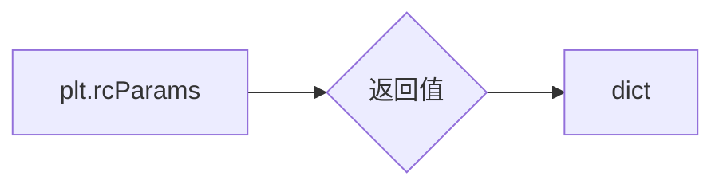

#### 带注释源码

```
# plt.rcParams
# -------------
# This is a dictionary that contains all the Matplotlib configuration parameters.
# It can be used to set and retrieve various properties of the Matplotlib backend.
# For example, plt.rcParams['axes.prop_cycle'] can be used to get the default color cycle.

# Example usage:
# colors = plt.rcParams['axes.prop_cycle'].by_key()['color']
```

### axes.prop_cycle

`axes.prop_cycle` 是 `plt.rcParams` 中的一个键，用于访问 Matplotlib 的默认属性周期。

参数：

- 无

返回值：`matplotlib.cycler.Cycler`，包含默认属性周期的对象。

#### 流程图

```mermaid
graph LR
A[plt.rcParams['axes.prop_cycle']] --> B{返回值}
B --> C[matplotlib.cycler.Cycler]
```

#### 带注释源码

```
# plt.rcParams['axes.prop_cycle']
# ------------------------------
# This key in plt.rcParams returns a Cycler object that contains the default property cycle.
# The property cycle is a sequence of properties that are applied to axes in a repeating pattern.

# Example usage:
# colors = plt.rcParams['axes.prop_cycle'].by_key()['color']
```

### by_key

`by_key` 是 `matplotlib.cycler.Cycler` 类的一个方法，用于根据键获取属性周期中的属性。

参数：

- `{key}`：`str`，要获取的属性的键。

返回值：`str`，属性周期中对应键的属性值。

#### 流程图

```mermaid
graph LR
A[matplotlib.cycler.Cycler.by_key()] --> B{返回值}
B --> C[str]
```

#### 带注释源码

```
# matplotlib.cycler.Cycler.by_key()
# ---------------------------------
# This method returns the value of the property in the property cycle that corresponds to the given key.

# Example usage:
# colors = plt.rcParams['axes.prop_cycle'].by_key()['color']
```


### plt.show()

显示所有当前活动图形的图形界面。

#### 描述

`plt.show()` 是 Matplotlib 库中的一个全局函数，用于显示所有当前活动图形的图形界面。当调用此函数时，所有之前使用 `plt.figure()` 创建的图形都会被显示出来。

#### 参数

- 无

#### 返回值

- 无

#### 流程图

```mermaid
graph LR
A[plt.show()] --> B{显示图形}
B --> C[结束]
```

#### 带注释源码

```python
plt.show()
```


### LineCollection.__init__

初始化LineCollection对象，用于创建线集合。

参数：

- `segments`：`list`，包含线段的列表，每个线段是一个二维数组。
- `offsets`：`list` 或 `tuple`，包含偏移量的列表或单个元组，用于偏移线段。
- `offset_transform`：`Transform`，用于偏移线段的转换。
- `color`：`color`，线段的颜色。
- `linewidths`：`float` 或 `list`，线段的宽度。
- `linestyles`：`str` 或 `list`，线段的样式。
- `transform`：`Transform`，用于转换线段的转换。

返回值：`None`

#### 流程图

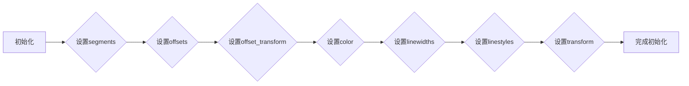

#### 带注释源码

```python
import matplotlib.pyplot as plt
import numpy as np
from matplotlib import collections, transforms

class LineCollection(collections.Collection):
    def __init__(self, segments, offsets=None, offset_transform=None, color=None,
                 linewidths=None, linestyles=None, transform=None):
        # Initialize the base class
        super().__init__(segments, color=color, linewidths=linewidths,
                         linestyles=linestyles, transform=transform)
        
        # Set the offsets
        if offsets is not None:
            self.offsets = offsets
        else:
            self.offsets = []
        
        # Set the offset transform
        if offset_transform is not None:
            self.offset_transform = offset_transform
        else:
            self.offset_transform = None
```


### LineCollection.add_collection

`add_collection` 方法是 `matplotlib.collections.LineCollection` 类的一个方法，用于将一个或多个线段集合添加到当前的坐标轴中。

参数：

- `collection`：`collections.LineCollection`，要添加到坐标轴的线段集合。
- `transform`：`matplotlib.transforms.Transform`，可选，用于转换线段集合的坐标。

返回值：无

#### 流程图

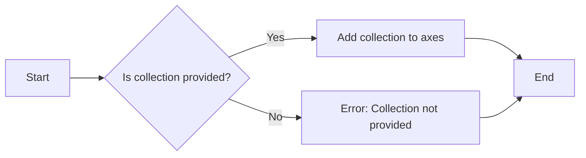

#### 带注释源码

```python
from matplotlib import collections, transforms

class LineCollection(collections.Collection):
    # ... (其他方法)

    def add_collection(self, collection, transform=None):
        """
        Add a collection of line segments to this collection.

        Parameters
        ----------
        collection : collections.LineCollection
            The collection of line segments to add.
        transform : matplotlib.transforms.Transform, optional
            The transform to apply to the collection's points.

        Returns
        -------
        None
        """
        # ... (实现细节)
```


### PolyCollection.__init__

PolyCollection 类的构造函数，用于初始化一个多边形集合。

参数：

- `verts`：`numpy.ndarray`，多边形的顶点坐标列表。
- `offsets`：`numpy.ndarray`，每个多边形相对于原始顶点的偏移量。
- `offset_transform`：`matplotlib.transforms.Transform`，用于偏移的转换。
- `color`：`list`，多边形的颜色列表。

返回值：无

#### 流程图

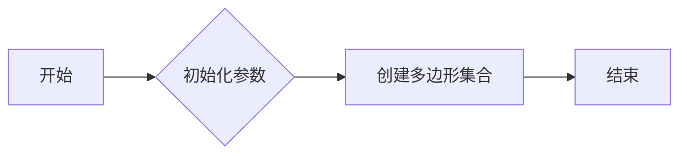

#### 带注释源码

```python
from matplotlib import collections, transforms

class PolyCollection(collections.Collection):
    def __init__(self, verts, offsets=None, offset_transform=None, color=None):
        """
        Initialize a PolyCollection.

        Parameters:
        - verts: numpy.ndarray, list of vertices for the polygons.
        - offsets: numpy.ndarray, offsets for each polygon relative to the original vertices.
        - offset_transform: matplotlib.transforms.Transform, transform for the offsets.
        - color: list, colors for the polygons.
        """
        collections.Collection.__init__(self)
        self._verts = verts
        self._offsets = offsets
        self._offset_transform = offset_transform
        self._color = color
```


### PolyCollection.add_collection

`PolyCollection.add_collection` 方法用于将一个或多个多边形集合添加到当前的轴（Axes）对象中。

参数：

- `spiral`：`numpy.ndarray`，表示多边形的顶点坐标。
- `offsets`：`numpy.ndarray`，表示每个多边形相对于原始多边形的偏移量。
- `offset_transform`：`matplotlib.transforms.Transform`，用于将偏移量转换为轴的坐标系。
- `color`：`str` 或 `list`，表示多边形的颜色。

返回值：`matplotlib.collections.PolyCollection`，返回添加到轴上的多边形集合对象。

#### 流程图

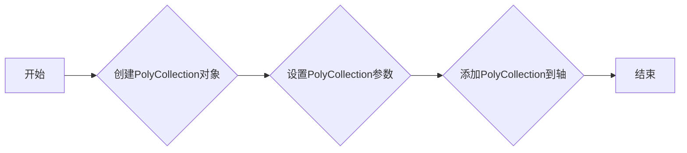

#### 带注释源码

```python
from matplotlib import collections, transforms

class PolyCollection(collections.PolyCollection):
    def __init__(self, *args, **kwargs):
        super().__init__(*args, **kwargs)
        # 初始化PolyCollection对象

    def add_collection(self, spiral, offsets, offset_transform, color):
        # 添加多边形集合到轴
        self.set_offsets(offsets)
        self.set_transform(offset_transform)
        self.set_color(color)
        # 返回添加的多边形集合对象
        return self
```


### RegularPolyCollection.__init__

初始化一个正多边形集合对象。

参数：

- `numverts`：`int`，正多边形的顶点数。
- `sizes`：`array_like`，正多边形的大小数组。
- `offsets`：`array_like`，正多边形的偏移量数组。
- `offset_transform`：`Transform`，偏移量的转换。
- `color`：`color`，正多边形的颜色。
- `zorder`：`float`，正多边形的z顺序。
- `alpha`：`float`，正多边形的透明度。

返回值：`None`，无返回值。

#### 流程图

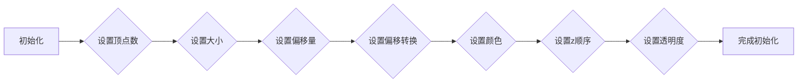

#### 带注释源码

```python
from matplotlib.collections import RegularPolyCollection

class RegularPolyCollection(collections.Collection):
    def __init__(self, numverts, sizes=None, offsets=None, offset_transform=None,
                 color=None, zorder=3, alpha=1.0):
        """
        Initialize a RegularPolyCollection object.

        Parameters:
        - numverts: int, the number of vertices of the regular polygon.
        - sizes: array_like, the sizes of the regular polygons.
        - offsets: array_like, the offsets of the regular polygons.
        - offset_transform: Transform, the transform for the offsets.
        - color: color, the color of the regular polygons.
        - zorder: float, the z-order of the regular polygons.
        - alpha: float, the alpha value of the regular polygons.

        Returns:
        - None, no return value.
        """
        # Initialize the base class
        super().__init__(color=color, zorder=zorder, alpha=alpha)

        # Set the number of vertices
        self.numverts = numverts

        # Set the sizes
        if sizes is not None:
            self.sizes = np.asarray(sizes)
        else:
            self.sizes = None

        # Set the offsets
        if offsets is not None:
            self.offsets = np.asarray(offsets)
        else:
            self.offsets = None

        # Set the offset transform
        self.offset_transform = offset_transform

        # Set the vertices
        self.vertices = self._compute_vertices()
```


### RegularPolyCollection.add_collection

`RegularPolyCollection.add_collection` 方法用于向 `RegularPolyCollection` 对象中添加一个或多个多边形。

参数：

- `sizes`：`numpy.ndarray`，表示多边形的边长。
- `offsets`：`numpy.ndarray`，表示多边形的偏移量。
- `offset_transform`：`matplotlib.transforms.Transform`，表示偏移量的转换。

返回值：`None`，该方法不返回任何值。

#### 流程图

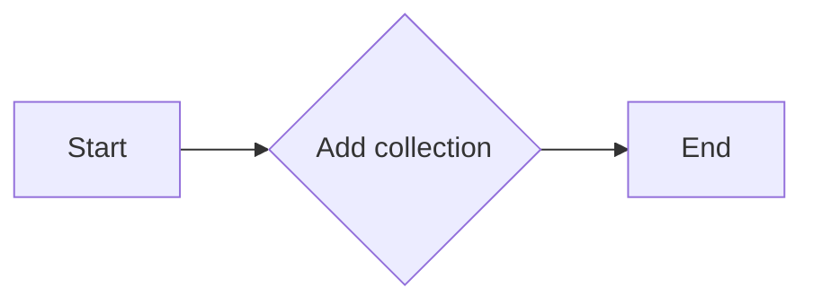

#### 带注释源码

```python
from matplotlib import collections, transforms

class RegularPolyCollection(collections.Collection):
    # ... (其他类代码)

    def add_collection(self, sizes, offsets, offset_transform):
        """
        Add a collection of regular polygons to the collection.

        :param sizes: numpy.ndarray, the sizes of the polygons.
        :param offsets: numpy.ndarray, the offsets of the polygons.
        :param offset_transform: matplotlib.transforms.Transform, the transform for the offsets.
        """
        # ... (方法实现)
```


### Affine2D.__init__

Affine2D.__init__ 是一个初始化方法，用于创建一个 Affine2D 对象，该对象表示一个二维仿射变换。

参数：

- `scale`：`float`，表示缩放因子，默认为 1.0。
- `translate`：`tuple`，表示平移向量，默认为 (0, 0)。
- `skew`：`tuple`，表示倾斜因子，默认为 (0, 0)。

返回值：`None`，该方法不返回任何值。

#### 流程图

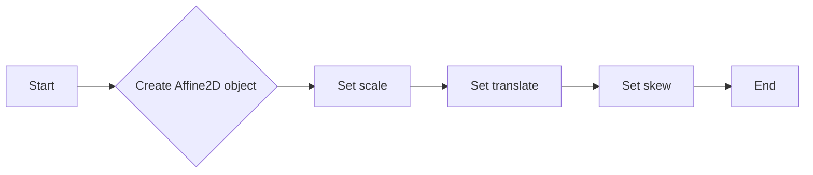

#### 带注释源码

```python
class Affine2D:
    def __init__(self, scale=1.0, translate=(0, 0), skew=(0, 0)):
        # Initialize the Affine2D object with the given scale, translate, and skew
        self.scale = scale
        self.translate = translate
        self.skew = skew
```


## 关键组件


### 张量索引与惰性加载

张量索引与惰性加载允许在处理大型数据集时，只计算和存储所需的数据部分，从而提高效率和内存使用。

### 反量化支持

反量化支持使得模型能够在量化过程中保持精度，通过将量化后的数据转换回原始数据类型。

### 量化策略

量化策略定义了如何将浮点数转换为固定点数，包括选择量化位宽和量化范围等参数。


## 问题及建议


### 已知问题

-   **代码重复性**：代码中多次使用相同的计算和绘图逻辑，例如计算螺旋线、正多边形和曲线偏移。这可能导致维护困难，如果需要修改这些逻辑，需要在多个地方进行更改。
-   **随机数生成**：使用随机数生成器来创建偏移量，这可能导致每次运行结果不同。如果需要可重复的结果，应该使用固定的随机种子。
-   **注释不足**：代码中包含了一些注释，但整体上注释不够详细，难以理解代码的意图和设计决策。
-   **全局变量**：代码中使用了全局变量，如`colors`和`fig`，这可能导致代码难以理解和维护。

### 优化建议

-   **提取重复逻辑**：将计算螺旋线、正多边形和曲线偏移的逻辑提取到单独的函数中，减少代码重复性，并提高可维护性。
-   **使用固定随机种子**：在生成随机数之前设置固定的随机种子，确保每次运行结果一致，便于调试和测试。
-   **增加注释**：在代码中添加更多注释，解释代码的意图和设计决策，提高代码的可读性。
-   **避免全局变量**：尽量减少全局变量的使用，使用局部变量或参数传递来管理状态，提高代码的可读性和可维护性。
-   **代码结构**：考虑将代码组织成模块或类，以更好地封装逻辑和功能，提高代码的可重用性和可维护性。
-   **性能优化**：检查代码中是否有性能瓶颈，例如循环或重复计算，并进行优化以提高性能。


## 其它


### 设计目标与约束

- 设计目标：
  - 创建一个能够绘制不同类型曲线（螺旋线、多边形、正多边形）的图形库。
  - 支持曲线的偏移和缩放。
  - 提供灵活的绘图选项，如颜色、偏移量等。
- 约束：
  - 使用matplotlib库进行绘图。
  - 保持代码的可读性和可维护性。

### 错误处理与异常设计

- 错误处理：
  - 捕获并处理matplotlib绘图相关的异常。
  - 检查输入参数的有效性，如曲线点数、偏移量等。
- 异常设计：
  - 定义自定义异常类，用于处理特定错误情况。
  - 提供清晰的错误信息，帮助用户定位问题。

### 数据流与状态机

- 数据流：
  - 输入：曲线数据、偏移量、缩放比例等。
  - 处理：根据输入数据绘制曲线。
  - 输出：绘制的图形。
- 状态机：
  - 无状态机，程序按顺序执行。

### 外部依赖与接口契约

- 外部依赖：
  - matplotlib库：用于绘图。
  - numpy库：用于数学运算。
- 接口契约：
  - 提供清晰的函数和类文档，说明其功能和参数。
  - 确保函数和类的一致性和可预测性。


    