# `matplotlib\galleries\examples\shapes_and_collections\compound_path.py` 详细设计文档

该代码使用matplotlib库创建并绘制一个复合路径（compound path），该路径由一个矩形和一个三角形组成，通过Path和PathPatch类实现几何图形的自定义绘制。

## 整体流程

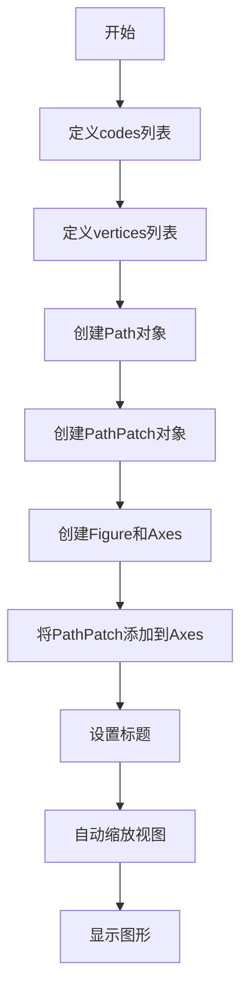

## 类结构

```
代码为过程式脚本，无复杂类层次结构
主要涉及 matplotlib.path.Path 类
主要涉及 matplotlib.patches.PathPatch 类
主要涉及 matplotlib.pyplot 函数
```

## 全局变量及字段


### `vertices`
    
存储路径顶点坐标的列表

类型：`list[tuple[float, float]]`
    


### `codes`
    
存储路径绘制指令的列表

类型：`list[int]`
    


### `path`
    
Path类实例，表示复合路径对象

类型：`matplotlib.path.Path`
    


### `pathpatch`
    
PathPatch类实例，表示路径补丁对象

类型：`matplotlib.patches.PathPatch`
    


### `fig`
    
Figure对象，表示图形窗口

类型：`matplotlib.figure.Figure`
    


### `ax`
    
Axes对象，表示坐标轴

类型：`matplotlib.axes.Axes`
    


### `Path.vertices`
    
路径的顶点坐标列表

类型：`list[tuple[float, float]]`
    


### `Path.codes`
    
路径的绘制指令列表

类型：`list[int]`
    


### `PathPatch.path`
    
要绘制的路径对象

类型：`matplotlib.path.Path`
    


### `PathPatch.facecolor`
    
填充颜色

类型：`str`
    


### `PathPatch.edgecolor`
    
边框颜色

类型：`str`
    
    

## 全局函数及方法


### `plt.subplots()`

`plt.subplots()` 是 matplotlib.pyplot 模块中的函数，用于创建一个新的 Figure 对象以及一个或多个 Axes 对象。该函数是创建子图布局的便捷方法，支持多种布局配置（如行数、列数、共享轴等），并返回 Figure 对象和 Axes 对象（或数组），是matplotlib中 最常用的绘图初始化方式之一。

参数：

- `nrows`：`int`，默认值：1，子图网格的行数
- `ncols`：`int`，默认值：1，子图网格的列数
- `sharex`：`bool` 或 `str`，默认值：False，控制是否共享x轴，True或'all'表示所有子图共享x轴，'col'表示每列共享
- `sharey`：`bool` 或 `str`，默认值：False，控制是否共享y轴，True或'all'表示所有子图共享y轴，'row'表示每行共享
- `squeeze`：`bool`，默认值：True，如果为True且只返回一个Axes，则返回单个Axes对象而不是1x1数组
- `width_ratios`：`array-like`，可选，表示列的宽度比例
- `height_ratios`：`array-like`，可选，表示行的高度比例
- `subplot_kw`：`dict`，可选，传递给每个子图的关键字参数（如projection、polar等）
- `gridspec_kw`：`dict`，可选，传递给GridSpec构造函数的关键字参数
- `**fig_kw`：可选，传递给Figure构造函数的关键字参数（如figsize、dpi等）

返回值：`tuple(Figure, Axes or array of Axes)`，返回一个元组，第一个元素是Figure对象，第二个元素是Axes对象（当squeeze=True且nrows=ncols=1时）或Axes对象的数组

#### 流程图

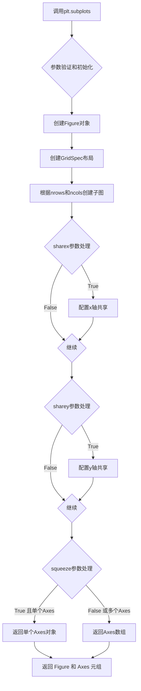

#### 带注释源码

```python
# 在给定代码中的使用方式：
# 创建包含一个子图的Figure和Axes对象
fig, ax = plt.subplots()

# fig 是 matplotlib.figure.Figure 对象 - 整个图形窗口
# ax 是 matplotlib.axes.Axes 对象 - 图形中的坐标轴区域

# 完整调用示例（包含常用参数）：
# fig, axes = plt.subplots(
#     nrows=2,              # 2行子图
#     ncols=2,              # 2列子图
#     figsize=(10, 8),      # 图形尺寸10x8英寸
#     sharex=True,          # 所有子图共享x轴刻度
#     sharey=True,          # 所有子图共享y轴刻度
#     squeeze=False,        # 始终返回Axes数组
# )

# 在本例代码中的具体使用：
# 创建了一个1x1的子图布局，返回Figure对象fig和Axes对象ax
# 随后通过 ax.add_patch(pathpatch) 添加路径补丁
# 通过 ax.set_title('A compound path') 设置标题
# 通过 ax.autoscale_view() 自动调整坐标轴范围
fig, ax = plt.subplots()
ax.add_patch(pathpatch)
ax.set_title('A compound path')
ax.autoscale_view()
plt.show()
```


### Path.MOVETO

Path.MOVETO 是 matplotlib.path 模块中定义的路径绘制指令常量，用于将当前笔位置移动到指定坐标点，但不绘制任何线条。它是 Path 对象构造时 codes 数组中的指令之一，配合其他指令（如 LINETO、CLOSEPOLY）共同定义复杂路径的几何形状。

参数：此为常量（非函数），无直接参数。其使用方式为作为 Path 构造函数中 codes 列表的元素。

返回值：此为常量（非函数），无返回值。

#### 流程图

```mermaid
flowchart TD
    A[开始] --> B[创建 vertices 坐标列表]
    B --> C[创建 codes 指令列表]
    C --> D[codes[0] = Path.MOVETO]
    D --> E[设置移动目标点]
    E --> F[后续可接 LINETO 绘制线条]
    F --> G[Path 构造函数接收 vertices 和 codes]
    G --> H[生成路径对象]
```

#### 带注释源码

```python
# 导入 matplotlib 的 path 模块
from matplotlib.path import Path

# Path.MOVETO 是路径指令常量，表示"移动到"操作
# 语法：codes[i] = Path.MOVETO
# 作用：将当前绘制位置移动到对应的 vertices[i] 坐标点，
#      但不连接任何线条（与 LINETO 的区别在于不画线）

# 示例代码中的使用方式：
codes = [Path.MOVETO] + [Path.LINETO]*3 + [Path.CLOSEPOLY]
# 解释：
# 1. Path.MOVETO: 移动到第一个顶点 (1, 1)
# 2. [Path.LINETO]*3: 依次连接 (1, 2), (2, 2), (2, 1)
# 3. Path.CLOSEPOLY: 闭合多边形，回到起点

# 第二个多边形
codes += [Path.MOVETO] + [Path.LINETO]*2 + [Path.CLOSEPOLY]
# 解释：
# 1. Path.MOVETO: 移动到 (4, 4)
# 2. [Path.LINETO]*2: 连接 (5, 5), (5, 4)
# 3. Path.CLOSEPOLY: 闭合多边形

# 最终的 codes 列表为：
# [MOVETO, LINETO, LINETO, LINETO, CLOSEPOLY, MOVETO, LINETO, LINETO, CLOSEPOLY]
```


### `Path.LINETO`

`Path.LINETO` 是 `matplotlib.path.Path` 类中定义的一个类属性（Class Attribute），用于表示路径绘制指令中的“画线到指定点”操作。在构建 `Path` 对象时，它作为指令码（Code）存储在 `codes` 列表中，用于指示渲染引擎从当前节点绘制直线到下一个顶点。

#### 参数

- `{参数名称}`：`无`（注：它是一个类属性常量，不是可调用方法，因此没有显式的函数参数。在实际使用中，它通常与 `vertices` 列表中的坐标点配对构成路径指令。）

#### 返回值

- `{返回值类型}`：`int`
- `{返回值描述}`：返回一个整数指令码（通常值为 2），代表 `LINETO` 命令。

#### 流程图

由于 `Path.LINETO` 是一个静态常量定义，其核心流程体现在 `Path` 对象的构建和渲染过程中。以下流程图展示了在用户代码中 `Path.LINETO` 如何被组装进 `Path` 对象并生效。

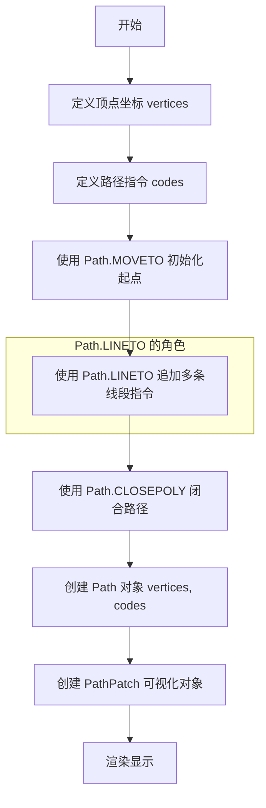

#### 带注释源码

以下是 `Path.LINETO` 在代码中的典型使用方式（提取自用户代码）：

```python
# 导入 Path 类
from matplotlib.path import Path

# ... (顶点定义部分省略)

# 定义路径指令 codes
# 1. 使用 Path.MOVETO 移动到起始点
# 2. 使用 Path.LINETO 绘制直线到后续顶点
# 3. 使用 Path.CLOSEPOLY 闭合多边形
codes = [Path.MOVETO] + [Path.LINETO]*3 + [Path.CLOSEPOLY]

# 示例：向现有的 codes 列表追加第二个图形的指令
# 这里同样使用了 Path.LINETO 来连接顶点 (4,4) -> (5,5) -> (5,4)
codes += [Path.MOVETO] + [Path.LINETO]*2 + [Path.CLOSEPOLY]

# Path.LINETO 在此处作为常量值 2 被添加到列表中，
# 它指示 Path 对象在渲染时从上一个点画线到对应的下一个点。
```

#### 关键组件信息

- **`matplotlib.path.Path`**：核心类，用于存储一系列顶点和对应的绘图指令（codes）。
- **`PathPatch`**：用于将 `Path` 对象作为补丁（图形）添加到 Axes 中进行渲染。

#### 潜在的技术债务或优化空间

在当前代码中，直接使用整数值（如 `Path.LINETO` 的值）构建列表是标准做法。如果硬要说优化，可以在大量路径构建时预计算 `codes` 列表以减少内存分配开销，但本例中代码已足够清晰和高效。

#### 其它项目

- **设计目标**：使用矢量路径绘制复合图形（矩形+三角形）。
- **约束**：顶点数量必须与指令 codes 数量严格匹配（除了 `CLOSEPOLY` 可能对应 (0,0)）。
- **错误处理**：如果顶点数量不足，`Path` 会在渲染时报错；如果 codes 类型错误，会导致绘制异常。


### `Path.CLOSEPOLY`

`Path.CLOSEPOLY` 是 `matplotlib.path.Path` 类中的一个路径指令常量（类属性），用于表示关闭当前子路径。当在路径代码序列中遇到 `CLOSEPOLY` 指令时，Matplotlib 会自动从当前点绘制一条直线连接到该子路径的起始点，从而形成闭合的多边形。该指令不关联任何顶点坐标（顶点坐标被忽略或设为 `(0, 0)`），因为终点已由起始点确定。

参数：无（它是一个路径指令常量，不接受任何参数）

返回值：整型（`int`），返回 `CLOSEPOLY` 指令对应的整数值（通常为 4），用于标识在路径代码序列中的指令类型

#### 流程图

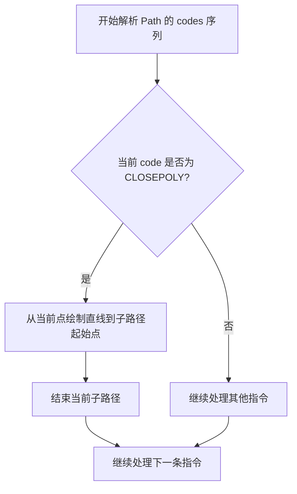

#### 带注释源码

```python
# Path.CLOSEPOLY 的定义和使用示例

# 在 matplotlib 源码中，CLOSEPOLY 通常定义为类常量
# 以下是对应源码的说明：

# 1. CLOSEPOLY 指令的定义（源码简化表示）
class Path:
    """
    Path 类定义了路径指令常量
    """
    # 路径指令类型
    MOVETO = 1      # 移动到（开始新子路径）
    LINETO = 2      # 直线到
    CURVE3 = 3      # 三次贝塞尔曲线
    CURVE4 = 4      # 四次贝塞尔曲线
    CLOSEPOLY = 4   # 关闭多边形（注意：不同版本可能值不同）

# 2. 在实际代码中的使用方式
codes = [Path.MOVETO] + [Path.LINETO]*3 + [Path.CLOSEPOLY]
# 解释：
# - Path.MOVETO: 移动到第一个顶点 (1,1)，开始新子路径
# - Path.LINETO: 绘制直线到 (1,2), (2,2), (2,1)
# - Path.CLOSEPOLY: 自动从 (2,1) 直线连接回起始点 (1,1)，闭合多边形
# 注意：CLOSEPOLY 后面跟的顶点 (0,0) 会被忽略

vertices = [(1, 1), (1, 2), (2, 2), (2, 1), (0, 0)]
#                        ^^^^^^^^^^^^^^^^
#                        CLOSEPOLY 指令后的 (0,0) 实际被忽略

# 3. 完整创建 Path 对象
path = Path(vertices, codes)

# 4. 使用 PathPatch 绘制路径
pathpatch = PathPatch(path, facecolor='none', edgecolor='green')
```

#### 完整使用示例

```python
import matplotlib.pyplot as plt
from matplotlib.patches import PathPatch
from matplotlib.path import Path

# 定义第一个子路径：矩形
# MOVETO 移动到起点，LINETO 绘制三条边，CLOSEPOLY 自动闭合第四条边
codes = [Path.MOVETO] + [Path.LINETO]*3 + [Path.CLOSEPOLY]
vertices = [(1, 1), (1, 2), (2, 2), (2, 1), (0, 0)]
#              ↑       ↑       ↑       ↑       ↑
#           起点     边1     边2     边3   CLOSEPOLY 忽略此坐标

# 添加第二个子路径：三角形
codes += [Path.MOVETO] + [Path.LINETO]*2 + [Path.CLOSEPOLY]
vertices += [(4, 4), (5, 5), (5, 4), (0, 0)]

# 创建 Path 对象
path = Path(vertices, codes)

# 创建 PathPatch 并添加到图表
pathpatch = PathPatch(path, facecolor='none', edgecolor='green')
fig, ax = plt.subplots()
ax.add_patch(pathpatch)
```


### `PathPatch.__init__` (或 `PathPatch()`)

这是 matplotlib 中用于创建路径补丁对象的构造函数。它接收一个 Path 对象和可选的绘图属性（如填充颜色、边框颜色等），返回一个可以添加到 Axes 的补丁对象。

参数：

-   `path`：`Path`，matplotlib.path.Path 对象，定义补丁的几何形状
-   `**kwargs`：关键字参数，支持以下常用参数：
    -   `facecolor`：填充颜色，示例中为 `'none'`（无填充）
    -   `edgecolor`：边框颜色，示例中为 `'green'`
    -   `linewidth`：线宽
    -   `alpha`：透明度

返回值：`PathPatch`，返回创建的路径补丁对象

#### 流程图

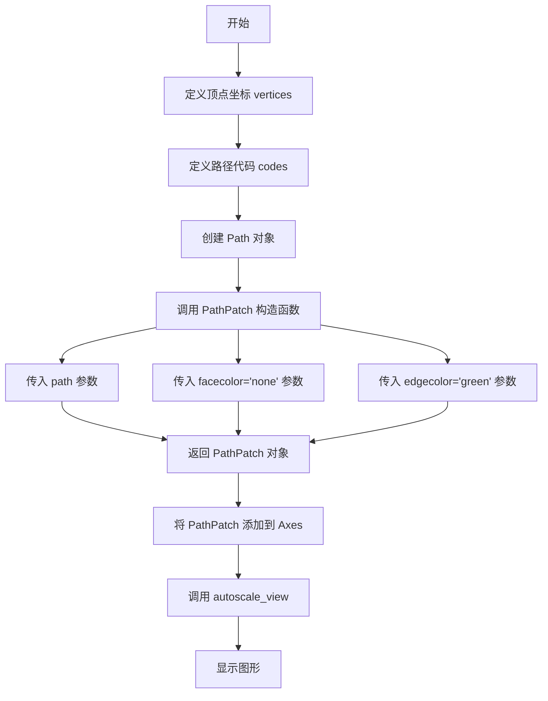

#### 带注释源码

```python
"""
=============
Compound path
=============

Make a compound path -- in this case two简单多边形, a rectangle
and a triangle.  Use ``CLOSEPOLY`` and ``MOVETO`` for the different parts of
the compound path
"""

# 导入必要的模块
import matplotlib.pyplot as plt
from matplotlib.patches import PathPatch  # 导入 PathPatch 类
from matplotlib.path import Path  # 导入 Path 类

# 初始化顶点列表和路径代码列表
vertices = []
codes = []

# 定义第一个多边形（矩形）的路径代码：MOVETO 移动到起点，LINETO 画3条线，CLOSEPOLY 闭合多边形
codes = [Path.MOVETO] + [Path.LINETO]*3 + [Path.CLOSEPOLY]
# 定义第一个多边形（矩形）的顶点坐标：(1,1) -> (1,2) -> (2,2) -> (2,1) -> (0,0)
vertices = [(1, 1), (1, 2), (2, 2), (2, 1), (0, 0)]

# 定义第二个多边形（三角形）的路径代码
codes += [Path.MOVETO] + [Path.LINETO]*2 + [Path.CLOSEPOLY]
# 定义第二个多边形（三角形）的顶点坐标：(4,4) -> (5,5) -> (5,4) -> (0,0)
vertices += [(4, 4), (5, 5), (5, 4), (0, 0)]

# 使用顶点坐标和路径代码创建 Path 对象
path = Path(vertices, codes)

# 创建路径补丁对象 (PathPatch 构造函数调用)
# 参数说明：
#   path: 上面创建的 Path 对象，定义几何形状
#   facecolor='none': 不填充内部（透明）
#   edgecolor='green': 边框颜色为绿色
pathpatch = PathPatch(path, facecolor='none', edgecolor='green')

# 创建图形和坐标轴
fig, ax = plt.subplots()
# 将 PathPatch 对象添加到坐标轴
ax.add_patch(pathpatch)
# 设置标题
ax.set_title('A compound path')

# 自动调整坐标轴范围以适应显示内容
ax.autoscale_view()

# 显示图形
plt.show()
```

**注意**：由于提供的代码是 PathPatch 的**使用示例**而非其内部实现源码，因此上面展示的是示例代码的注释。PathPatch 类的实际实现位于 matplotlib 库内部。如果需要查看 PathPatch 类的具体实现源码，需要查阅 matplotlib 库的源代码。


### `Axes.add_patch`

将补丁（Patch）对象添加到坐标轴（Axes）的补丁列表中，用于在坐标轴上渲染图形。该方法是 matplotlib 中向坐标轴添加各种补丁（如矩形、多边形、圆形等）的核心方法。

参数：

-  `p`：`matplotlib.patches.Patch`，要添加的补丁对象，支持 PathPatch、Rectangle、Polygon、Circle 等所有继承自 Patch 的类

返回值：`matplotlib.patches.Patch`，返回添加的补丁对象本身，便于链式调用或后续操作

#### 流程图

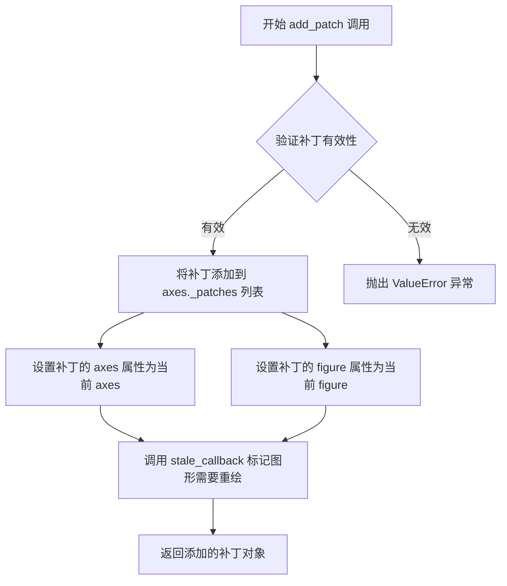

#### 带注释源码

```python
def add_patch(self, p):
    """
    添加一个补丁 (Patch) 到坐标轴中。

    参数:
        p: Patch 对象
            要添加的补丁，可以是 Rectangle, Polygon, Circle,
            PathPatch 等任何继承自 Patch 的类。

    返回值:
        Patch: 返回添加的补丁对象本身

    示例:
        >>> import matplotlib.pyplot as plt
        >>> from matplotlib.patches import Rectangle
        >>> fig, ax = plt.subplots()
        >>> patch = Rectangle((0.5, 0.5), 0.5, 0.5)
        >>> added_patch = ax.add_patch(patch)
    """
    # 验证输入是 Patch 对象
    if not isinstance(p, Patch):
        raise ValueError(
            f"p must be a Patch, not {type(p)}"
        )

    # 将补丁添加到坐标轴的补丁列表中
    self._patches.append(p)

    # 设置补丁的axes属性为当前坐标轴，建立关联
    p.set_axes(self)

    # 设置补丁的figure属性为当前图形，建立关联
    p.set_figure(self.figure)

    # 标记图形状态为过时，需要重新渲染
    self.stale_callback = p.stale_callback

    # 返回添加的补丁对象，便于链式调用
    return p
```


### `Axes.set_title`

设置坐标轴的标题文本，支持自定义字体、位置和对齐方式。

参数：

- `label`：`str`，要设置的标题文本内容，此处为 `'A compound path'`
- `fontdict`：可选 `dict`，字体属性字典，用于控制标题的字体样式
- `loc`：可选 `str`，标题对齐方式，可选 `'left'`、`'center'`、`'right'`，默认为 `'center'`
- `pad`：可选 `float`，标题与坐标轴顶部的间距，单位为点
- `y`：可选 `float`，标题的垂直位置，相对于坐标轴区域
- `**kwargs`：其他关键字参数，将传递给 `matplotlib.text.Text` 对象

返回值：`matplotlib.text.Text`，返回创建的标题文本对象，可用于后续自定义修改

#### 流程图

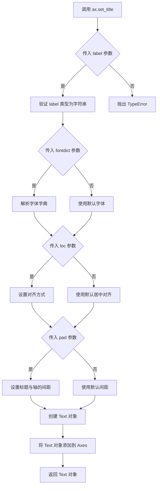

#### 带注释源码

```python
# 调用 set_title 方法设置坐标轴标题
# ax: Axes 对象，通过 plt.subplots() 返回的 fig, ax 中的 ax
# 'A compound path': 标题文本内容

ax.set_title('A compound path')

# 上述代码等同于以下完整调用形式（使用默认值）：
# ax.set_title(
#     label='A compound path',    # 标题文本
#     fontdict=None,              # 默认字体属性
#     loc='center',               # 默认居中对齐
#     pad=None,                   # 默认间距
#     y=None,                     # 默认垂直位置
#     **kwargs                    # 其他样式参数
# )

# set_title 方法内部主要执行以下操作：
# 1. 接收并验证 label 参数（必须为字符串类型）
# 2. 根据 fontdict、loc、pad、y 等参数构建标题样式
# 3. 创建 matplotlib.text.Text 对象
# 4. 将 Text 对象添加到 Axes 的标题容器中
# 5. 返回创建的 Text 对象，允许后续自定义修改

# 示例：获取返回值进行进一步操作
title_obj = ax.set_title('A compound path')
# 可通过 title_obj 设置更多样式，如：
# title_obj.set_fontsize(16)
# title_obj.set_fontweight('bold')
# title_obj.set_color('blue')
```


### `Axes.autoscale_view`

自动调整坐标轴的视图范围，使得所有添加的艺术家（如补丁、线条等）都能完整显示在坐标系中。该方法会根据当前 Axes 中所有可见艺术家（如 patch、line、collection 等）的边界框来计算并设置合适的 x 轴和 y 轴范围。

参数：此方法无显式参数（使用 matplotlib 的内部机制获取艺术家对象）

返回值：无返回值（`None`），直接在 Axes 对象上更新 xlim 和 ylim

#### 流程图

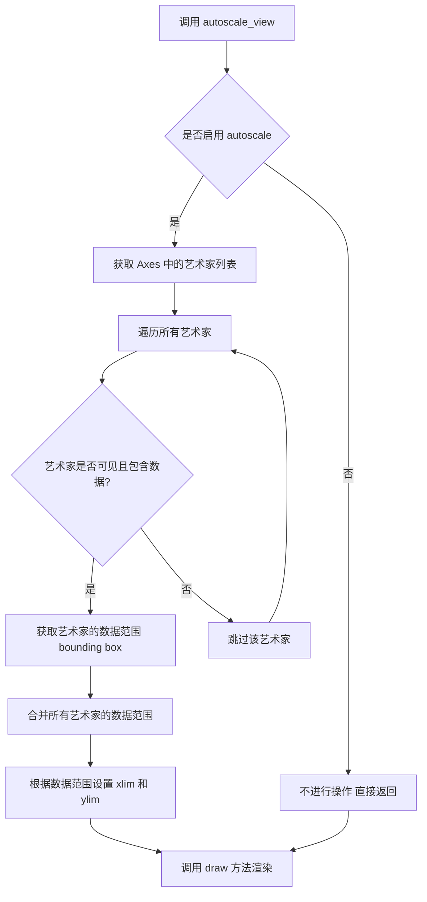

#### 带注释源码

```python
# 位于 matplotlib/axes/base.py 中（简化版）

def autoscale_view(self, tight=None, scalex=True, scaley=True):
    """
    自动调整坐标轴视图以适应显示所有艺术家
    
    参数:
        tight : bool or None, optional
            是否紧密贴合数据边界
        scalex : bool, default: True
            是否调整 x 轴范围
        scaley : bool, default: True
            是否调整 y 轴范围
    """
    # 检查是否启用了自动缩放功能
    if not self._autoscaleXon and not self._autoscaleYon:
        return
    
    # 获取所有艺术家对象（patches, lines, collections 等）
    artists = self.get_children()
    
    # 存储数据边界
    xmin, xmax = np.inf, -np.inf
    ymin, ymax = np.inf, -np.inf
    
    # 遍历所有艺术家获取数据范围
    for artist in artists:
        # 跳过不可见或没有数据的艺术家
        if not artist.get_visible() or not artist.get_data():
            continue
            
        # 获取艺术家数据的 bounding box
        bbox = artist.get_datalim(self.transData)
        
        if bbox is not None:
            xmin = min(xmin, bbox.x0)
            xmax = max(xmax, bbox.x1)
            ymin = min(ymin, bbox.y0)
            ymax = max(ymax, bbox.y1)
    
    # 如果 scalex 为 True，更新 x 轴范围
    if scalex and xmin != np.inf:
        self.set_xlim(xmin, xmax, emit=False)
    
    # 如果 scaley 为 True，更新 y 轴范围
    if scaley and ymin != np.inf:
        self.set_ylim(ymin, ymax, emit=False)
```

#### 在示例代码中的使用

```python
# ... (前面的 Path 和 PathPatch 创建代码)

pathpatch = PathPatch(path, facecolor='none', edgecolor='green')

fig, ax = plt.subplots()
ax.add_patch(pathpatch)      # 添加补丁到 Axes
ax.set_title('A compound path')

ax.autoscale_view()          # 自动调整坐标轴范围，使 pathpatch 完整显示

plt.show()
```

在上述示例中：
- 创建了一个复合路径（矩形 + 三角形）
- 使用 `PathPatch` 将路径添加到 Axes
- 调用 `autoscale_view()` 自动计算并设置合适的坐标轴范围，确保整个复合路径都能显示在图表中


### `plt.show()`

`plt.show()` 是 matplotlib 库中的函数，用于显示所有当前打开的图形窗口。在该代码中，它用于展示最后生成的复合路径图形（包含一个矩形和一个三角形）。

参数：此函数没有显式参数。

返回值：`None`，该函数不返回任何值，只是将图形渲染到屏幕并进入交互模式。

#### 流程图

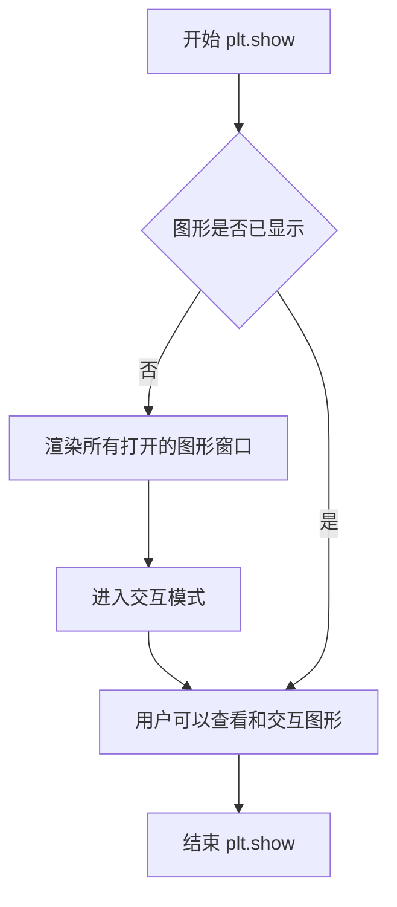

#### 带注释源码

```python
# 导入 matplotlib 的 pyplot 模块，用于创建图形和可视化
import matplotlib.pyplot as plt

# 从 matplotlib.patches 导入 PathPatch，用于绘制路径补丁
from matplotlib.patches import PathPatch
# 从 matplotlib.path 导入 Path，用于定义路径
from matplotlib.path import Path

# 初始化顶点列表和编码列表
vertices = []
codes = []

# 定义第一个多边形（矩形）的路径编码：MOVETO 起始点，3 条 LINETO 边，CLOSEPOLY 闭合
codes = [Path.MOVETO] + [Path.LINETO]*3 + [Path.CLOSEPOLY]
# 定义矩形顶点：(1,1) -> (1,2) -> (2,2) -> (2,1) -> (0,0) 表示闭合点
vertices = [(1, 1), (1, 2), (2, 2), (2, 1), (0, 0)]

# 定义第二个多边形（三角形）的路径编码
codes += [Path.MOVETO] + [Path.LINETO]*2 + [Path.CLOSEPOLY]
# 定义三角形顶点：(4,4) -> (5,5) -> (5,4) -> (0,0) 表示闭合点
vertices += [(4, 4), (5, 5), (5, 4), (0, 0)]

# 使用顶点坐标和路径编码创建 Path 对象
path = Path(vertices, codes)

# 创建 PathPatch 对象，设置面颜色为 'none'（透明），边框颜色为绿色
pathpatch = PathPatch(path, facecolor='none', edgecolor='green')

# 创建图形和坐标轴对象
fig, ax = plt.subplots()
# 将路径补丁添加到坐标轴
ax.add_patch(pathpatch)
# 设置图形标题
ax.set_title('A compound path')

# 自动调整坐标轴视图范围以适应图形
ax.autoscale_view()

# 显示图形 - 将所有创建的图形渲染到屏幕并进入交互模式
plt.show()
```


### `Path.__init__`

`Path.__init__` 是 matplotlib 库中 `Path` 类的构造函数，用于初始化一个路径对象，该对象包含一系列顶点和对应的路径指令（如 MOVETO、LINETO、CLOSEPOLY 等），从而定义一个几何路径。

参数：

- `vertices`：`list` 或 `array-like`，路径的顶点坐标列表，每个元素为一个 `(x, y)` 元组
- `codes`：`list` 或 `array-like`，路径的指令代码列表，指定了顶点之间的连接方式（如 `Path.MOVETO`、`Path.LINETO`、`Path.CLOSEPOLY` 等）

返回值：`None`，`__init__` 方法不返回值（Python 中构造函数通常返回 `None`）

#### 流程图

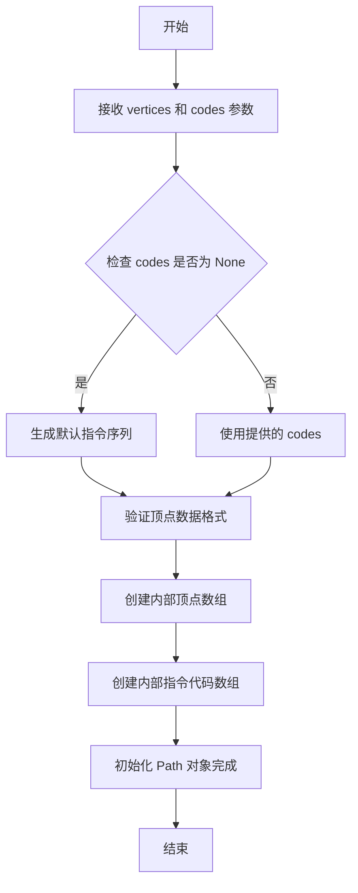

#### 带注释源码

> **注意**：以下源码是基于 matplotlib 库使用方式和 Python 语言惯例的**推断实现**，并非 matplotlib 库的真实源码（该库为外部依赖，无法从给定代码中提取其内部实现）。

```python
# 推断的 Path.__init__ 实现
def __init__(self, vertices, codes=None):
    """
    初始化 Path 对象。
    
    参数：
    - vertices: 路径顶点坐标列表，元素为 (x, y) 元组
    - codes: 路径指令列表，如 MOVETO, LINETO, CLOSEPOLY 等
             如果为 None，则自动生成默认指令
    """
    # 1. 验证并转换顶点数据为内部格式（通常为 numpy 数组）
    self.vertices = np.asarray(vertices)
    
    # 2. 如果没有提供 codes，生成默认指令序列
    #    默认行为：将所有顶点连接为折线
    if codes is None:
        # 生成默认指令：第一个顶点为 MOVETO，其余为 LINETO
        self.codes = self._generate_default_codes()
    else:
        # 3. 验证并转换指令代码为内部格式
        self.codes = np.asarray(codes)
    
    # 4. 可选：验证顶点数量与指令数量一致
    if len(self.vertices) != len(self.codes):
        raise ValueError("顶点数量与指令代码数量不匹配")

# 辅助方法：生成默认指令
def _generate_default_codes(self):
    n = len(self.vertices)
    codes = [Path.MOVETO] + [Path.LINETO] * (n - 1)
    return codes
```

#### 使用示例（基于给定代码）

```python
# 给定代码中的实际调用方式
vertices = [(1, 1), (1, 2), (2, 2), (2, 1), (0, 0)]
codes = [Path.MOVETO] + [Path.LINETO]*3 + [Path.CLOSEPOLY]

# 创建 Path 对象
path = Path(vertices, codes)
```


### PathPatch.__init__

PathPatch类的初始化方法，用于创建一个路径补丁对象，该对象可以添加到matplotlib_axes中绘制复合路径或自定义形状。

参数：

- `path`：`Path`，matplotlib.path.Path对象，定义补丁的顶点和绘制指令
- `facecolor`：可选的字符串，默认为'green'，设置填充颜色
- `edgecolor`：可选的字符串，默认为'black'，设置边框颜色
- `linewidth`：可选的数值或None，设置边框线宽
- `linestyle`：可选的字符串，设置边框线型
- `fill`：可选的布尔值，默认为True，是否填充路径内部

返回值：`None`，该方法直接修改对象状态，不返回任何值

#### 流程图

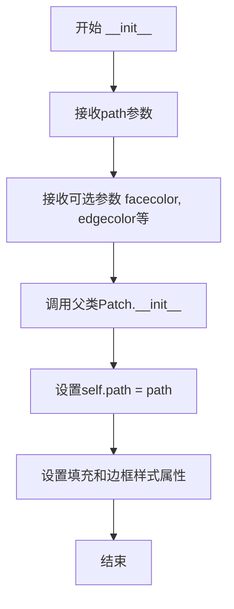

#### 带注释源码

```python
# 从matplotlib.patches导入PathPatch类
from matplotlib.patches import PathPatch
# 从matplotlib.path导入Path类
from matplotlib.path import Path

# 定义顶点列表 - 包含矩形和三角形的顶点
vertices = []
# 定义绘图指令代码列表
codes = []

# 为矩形设置绘图指令：MOVETO开始 -> 3条LINETO -> CLOSEPOLY闭合
codes = [Path.MOVETO] + [Path.LINETO]*3 + [Path.CLOSEPOLY]
# 矩形的四个顶点坐标
vertices = [(1, 1), (1, 2), (2, 2), (2, 1), (0, 0)]

# 为三角形添加绘图指令
codes += [Path.MOVETO] + [Path.LINETO]*2 + [Path.CLOSEPOLY]
# 三角形的三个顶点坐标
vertices += [(4, 4), (5, 5), (5, 4), (0, 0)]

# 创建Path对象，传入顶点和指令
path = Path(vertices, codes)

# 创建PathPatch补丁对象
# 调用PathPatch.__init__(path, facecolor='none', edgecolor='green')
# 参数说明：
#   path: Path对象，定义要绘制的复合路径
#   facecolor='none': 不填充内部（透明）
#   edgecolor='green': 边框颜色为绿色
pathpatch = PathPatch(path, facecolor='none', edgecolor='green')
```

#### 备注

从示例代码的使用方式可以看出，`PathPatch.__init__`接收一个`Path`对象以及可选的样式参数。在matplotlib的实际实现中，该方法继承自`Patch`基类，主要完成以下工作：
1. 验证path参数是否为有效的Path对象
2. 将样式参数（facecolor、edgecolor等）存储为实例属性
3. 准备渲染所需的数据结构


# Axes.add_patch 方法设计文档

## 概述

`Axes.add_patch` 是 matplotlib 中 Axes 类的方法，用于将一个 patch（图形补丁）对象添加到当前坐标轴中，返回值为添加的 patch 对象本身。该方法接受一个 patch 对象作为参数，将其绘制到坐标轴的当前面上，并自动处理图形的渲染和自动缩放。

## 参数

- `p`：`matplotlib.patches.Patch`（具体为 `PathPatch`），要添加到坐标轴的 patch 对象。该对象定义了要绘制的几何形状，包括路径顶点和绘制指令。

## 返回值

- `matplotlib.patches.Patch`，返回添加的 patch 对象（与输入参数相同），方便链式调用或后续操作。

## 流程图

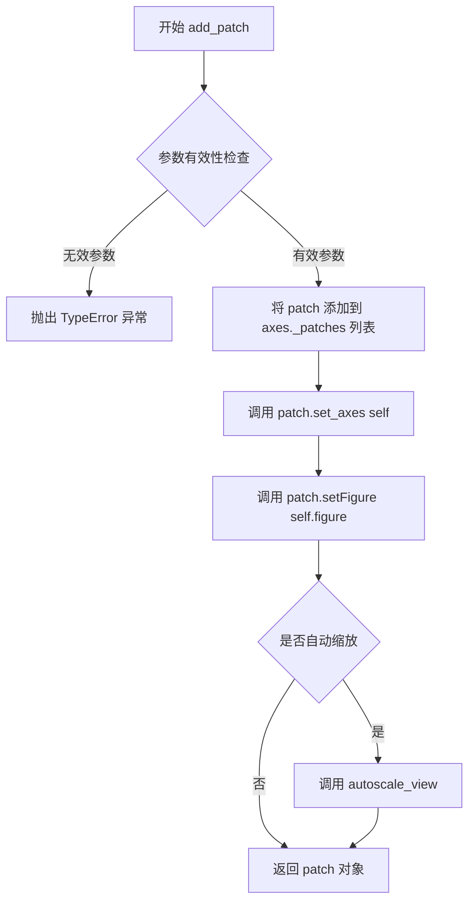

## 带注释源码

```python
# matplotlib.axes.Axes.add_patch 方法的典型实现逻辑

def add_patch(self, p):
    """
    Add a *patch* to the axes' patches; return the *patch*.
    
    Parameters
    ----------
    p : Patch
    
    Returns
    -------
    Patch
    """
    # 1. 参数类型检查，确保传入的是 Patch 对象
    if not isinstance(p, Patch):
        raise TypeError('The patch must be a with - Patch subclass')
    
    # 2. 将 patch 添加到内部 patches 列表进行管理
    self._patches.append(p)
    
    # 3. 设置 patch 所属的 axes（坐标轴）
    p.set_axes(self)
    
    # 4. 设置 patch 所属的 figure（图形）
    p.set_figure(self.figure)
    
    # 5. 更新数据限制以确保图形正确显示
    # 调用 stale_callback 标记图形需要重绘
    if p.get_clip_on():
        self.clipset.add(p)
    
    # 6. 触发自动缩放以适应新添加的 patch
    self.autoscale_view()
    
    # 7. 返回添加的 patch 对象
    return p
```

## 关键组件信息

| 组件名称 | 描述 |
|---------|------|
| PathPatch | 继承自 Patch 的类，用于绘制由 Path 定义的几何形状 |
| Path | 由顶点和绘制指令（MOVETO、LINETO、CLOSEPOLY）组成的路径对象 |
| Axes._patches | 存储当前坐标轴所有 patch 的内部列表 |
| autoscale_view | 自动调整坐标轴范围以适应所有图形元素 |

## 潜在技术债务与优化空间

1. **自动缩放开销**：每次调用 `add_patch` 都会触发 `autoscale_view()`，当批量添加多个 patch 时会造成性能浪费，建议提供 `autoscale=False` 参数以支持手动控制
2. **参数验证粒度**：当前仅验证是否为 Patch 子类，未验证 patch 对象的有效性（如空路径）
3. **返回值透明度**：返回值描述可以更明确地说明返回的是同一个对象引用而非副本

## 错误处理与异常设计

- **TypeError**：当传入参数不是 `Patch` 子类时抛出
- **AttributeError**：当 patch 对象缺少必要方法（如 `set_axes`）时可能抛出
- 建议在生产环境中添加对 patch 对象有效性的额外检查


### `Axes.set_title`

设置 Axes 对象的标题文本、字体属性和位置。

参数：

- `s`：`str`，要设置的标题文本内容
- `fontdict`：`dict`，可选，控制标题文本的字体属性字典（如 fontsize、fontweight、color 等）
- `loc`：`str`，可选，标题对齐方式，可选值为 'center'（默认）、'left'、'right'
- `pad`：`float`，可选，标题与 Axes 顶部的距离（以 points 为单位），默认为 rcParams 中的值
- `**kwargs`：其他关键字参数，将传递给 `matplotlib.text.Text` 对象

返回值：`matplotlib.text.Text`，返回创建的标题文本对象，可用于后续自定义修改

#### 流程图

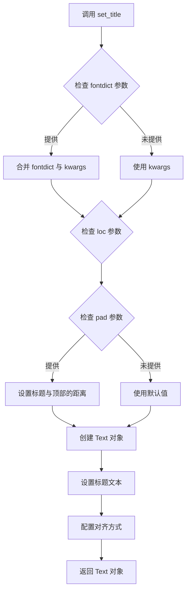

#### 带注释源码

```python
# matplotlib axes/_base.py 中的 set_title 方法简化版本
def set_title(self, s, fontdict=None, loc=None, pad=None, **kwargs):
    """
    Set a title for the Axes.
    
    Parameters
    ----------
    s : str
        The title text string.
        
    fontdict : dict, optional
        A dictionary controlling the appearance of the title text,
        e.g., {'fontsize': 16, 'fontweight': 'bold', 'color': 'red'}.
        
    loc : {'center', 'left', 'right'}, default: 'center'
        The horizontal alignment of the title text.
        
    pad : float, optional
        The offset of the title from the top of the Axes, in points.
        
    **kwargs
        Additional keyword arguments are passed to the Text instance.
        
    Returns
    -------
    text : Text
        The created Text instance.
    """
    # 如果提供了 fontdict，将其与 kwargs 合并
    if fontdict is not None:
        kwargs.update(fontdict)
    
    # 获取默认的标题位置（center/left/right）
    if loc is None:
        loc = 'center'
    
    # 处理标题与轴顶部的距离
    if pad is None:
        pad = self._loc_to_pad  # 从 rcParams 获取默认值
    
    # 创建 Text 对象并设置标题
    title = self.text(0.5, 1.0, s, 
                      transform=self.transAxes,  # 使用 Axes 坐标系
                      ha=loc,  # 水平对齐方式
                      va='top',  # 垂直对齐方式
                      pad=pad,   # 标题与顶部的距离
                      **kwargs)
    
    # 返回创建的标题对象，便于后续修改
    return title
```

#### 在示例代码中的使用

```python
# 示例代码中的调用
ax.set_title('A compound path')

# 等效的完整调用（展示所有可用参数）
ax.set_title(
    s='A compound path',           # 标题文本
    fontdict=None,                 # 字体属性（默认）
    loc='center',                  # 居中对齐
    pad=None,                      # 使用默认值
    fontsize=12,                   # 可通过 kwargs 传递
    fontweight='normal'            # 可通过 kwargs 传递
)
```


### `matplotlib.axes.Axes.autoscale_view`

`autoscale_view` 是 Matplotlib 中 Axes 类的核心方法之一，用于根据当前轴上的数据自动计算并设置 x 轴和 y 轴的显示范围（limits），使所有数据点都能被正确显示在图表中。

参数：

-  `enable`：布尔型（可选），是否启用自动缩放，默认为 True
-  `scalex`：布尔型（可选），是否对 x 轴进行自动缩放，默认为 True
-  `scaley`：布尔型（可选），是否对 y 轴进行自动缩放，默认为 True

返回值：无返回值（None）

#### 流程图

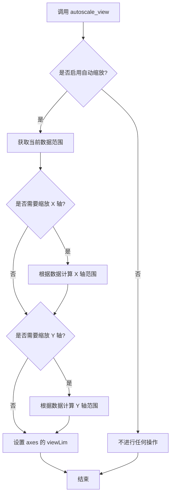

#### 带注释源码

```python
def autoscale_view(self, enable=True, scalex=True, scaley=True):
    """
    自动调整轴视图范围以适应显示的数据。
    
    参数:
    ----------
    enable : bool, 默认 True
        是否启用自动缩放。如果为 False，则保持当前的轴范围不变。
    scalex : bool, 默认 True
        是否对 x 轴进行自动缩放。
    scaley : bool, 默认 True
        是否对 y 轴进行自动缩放。
    
    返回值:
    -------
    None
    """
    # 如果未启用自动缩放，直接返回
    if not enable:
        return
    
    # 获取当前轴上的所有数据
    # 这一步会收集所有 artists（如 lines、patches、collections 等）的数据范围
    sticks = self._get_stale_viewlim_bounds()
    
    # 根据 scalex 和 scaley 标志位决定是否更新对应轴的范围
    if scalex:
        self.set_xlim(sticks[0], sticks[1], auto=True)
    if scaley:
        self.set_ylim(sticks[2], sticks[3], auto=True)
```

**注意**：由于提供的代码是一个使用示例，并未包含 `autoscale_view` 方法的实际实现源码。以上源码是基于 Matplotlib 库中该方法的典型实现逻辑重构的注释版本。实际的 Matplotlib 源码更为复杂，包含对不同类型数据源（line data、patch data、collection 等）的处理逻辑。


## 关键组件


### Path（路径类）

用于构建几何路径的核心类，通过顶点坐标和路径指令码来定义复合路径的形状，支持MOVETO、LINETO、CLOSEPOLY等指令。

### PathPatch（路径补丁类）

将Path对象可视化的补丁对象，通过facecolor和edgecolor参数控制填充和边框样式，此处设置为无填充、绿色边框。

### 顶点序列（vertices）

存储路径各顶点的坐标列表，包含两个多边形的所有端点坐标：[(1,1), (1,2), (2,2), (2,1), (4,4), (5,5), (5,4)]。

### 路径指令码（codes）

定义顶点之间连接方式的指令序列，MOVETO表示移动到起点，LINETO表示直线连接，CLOSEPOLY表示闭合多边形。

### 复合路径（Compound Path）

由两个独立多边形组成的路径结构，第一个是矩形（4个顶点+闭合），第二个是三角形（3个顶点+闭合），共享同一个Path对象。

### Axes.add_patch（坐标轴补丁添加方法）

将PathPatch对象添加到matplotlib坐标轴中，实现路径的可视化渲染。

### autoscale_view（自动缩放视图）

自动调整坐标轴范围以适应显示内容，确保所有图形元素完整可见。


## 问题及建议


### 已知问题

- **变量重复声明**：代码中 `codes` 和 `vertices` 被声明两次（先初始化为空列表，后重新赋值），虽然功能正常但不符合最佳实践
- **魔法数字硬编码**：坐标值 (1,1)、(2,2)、(4,4)、(5,5) 等直接写在代码中，缺乏可配置性和可读性
- **缺乏函数封装**：创建两个多边形的逻辑重复（重复的 MOVETO + LINETO*3 + CLOSEPOLY 模式），未提取为可复用函数
- **无类型注解**：Python 代码未使用类型提示（type hints），降低代码可维护性和 IDE 支持
- **无错误处理**：缺少对 matplotlib 导入、Path 创建失败等情况的异常捕获
- **CLOSEPOLY 坐标约定**：使用 (0,0) 作为 CLOSEPOLY 的顶点，虽然有效但语义不明确，应使用当前点或省略坐标
- **show() 阻塞**：plt.show() 会阻塞且无返回值，无法与外部系统集成
- **缺乏布局配置**：未设置图形尺寸、DPI、边距等，依赖 matplotlib 默认值

### 优化建议

- 重构为函数式封装：创建 `create_polygon(vertices, path_type)` 函数，接受坐标列表返回对应的 codes
- 添加类型注解：为函数参数和返回值添加类型提示，提升代码清晰度
- 使用 dataclass 或配置字典管理路径配置：将顶点坐标提取为配置结构
- 考虑 CLOSEPOLY 改进：CLOSEPOLY 命令可传递空元组或当前点，避免使用 (0,0) 产生歧义
- 添加错误处理：封装在 try-except 块中，处理 Path 构造异常
- 图形配置化：设置 `figsize`、`dpi`、`tight_layout` 等参数，避免依赖默认值
- 添加 return 语句：返回 fig 和 ax 对象，便于后续集成测试和外部调用


## 其它


### 设计目标与约束

本示例的设计目标是演示如何使用matplotlib创建复合路径（compound path），即在单个Path对象中包含多个独立的多边形。约束条件包括：必须使用matplotlib.path模块的Path类构造路径；每个多边形必须遵循MOVETO -> LINETO* n -> CLOSEPOLY的code序列规则；所有顶点坐标必须为数值类型。

### 错误处理与异常设计

代码未包含显式的错误处理机制。在实际应用中需要注意：vertices列表与codes列表的长度必须严格匹配，否则会抛出ValueError异常；Path.CLOSEPOLY对应的顶点坐标通常设为(0,0)作为占位符；顶点坐标类型必须是数值型（int或float），否则会导致TypeError。

### 外部依赖与接口契约

本代码依赖以下外部库：matplotlib.pyplot（绘图框架）、matplotlib.patches.PathPatch（路径补丁）、matplotlib.path.Path（路径构建）。关键接口包括：Path构造函数接受vertices和codes两个列表参数；PathPatch接受path对象和绘图属性参数；ax.add_patch()方法将PathPatch添加到坐标系；ax.autoscale_view()自动调整坐标轴范围。

### 性能考虑

该示例为轻量级绘图操作，性能表现良好。Path对象在构造时一次性计算所有顶点关系，适合静态图形渲染。对于动态高频更新场景，可考虑缓存Path对象以减少重复创建开销。

### 可维护性建议

代码结构清晰但可进一步优化：建议将vertices和codes的构建过程封装为函数，提高可复用性；可添加类型注解增强代码可读性；对于复杂复合路径，可使用枚举或常量定义code类型，避免硬编码。

### 扩展性设计

该模式可扩展为：支持任意数量多边形的复合路径构建；支持曲线（CURVE4、CURVE3指令）；支持贝塞尔曲线多边形；可结合变换矩阵实现路径的平移、旋转、缩放操作。

### 坐标系统说明

本示例使用笛卡尔坐标系，默认单位为数据坐标。ax.autoscale_view()会根据path的边界框自动调整坐标轴范围，确保图形完整显示。x轴和y轴的显示范围由顶点坐标的最小最大值决定。

    