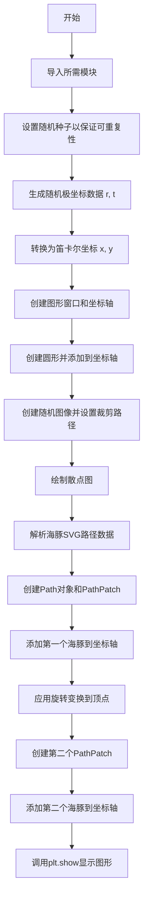
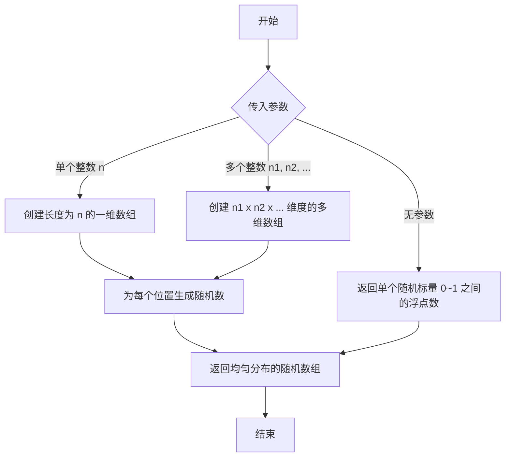
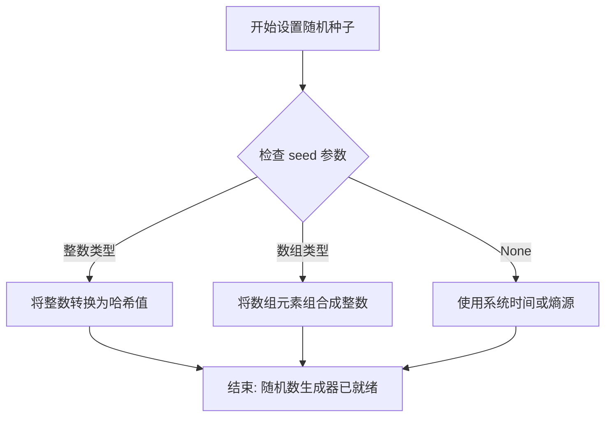
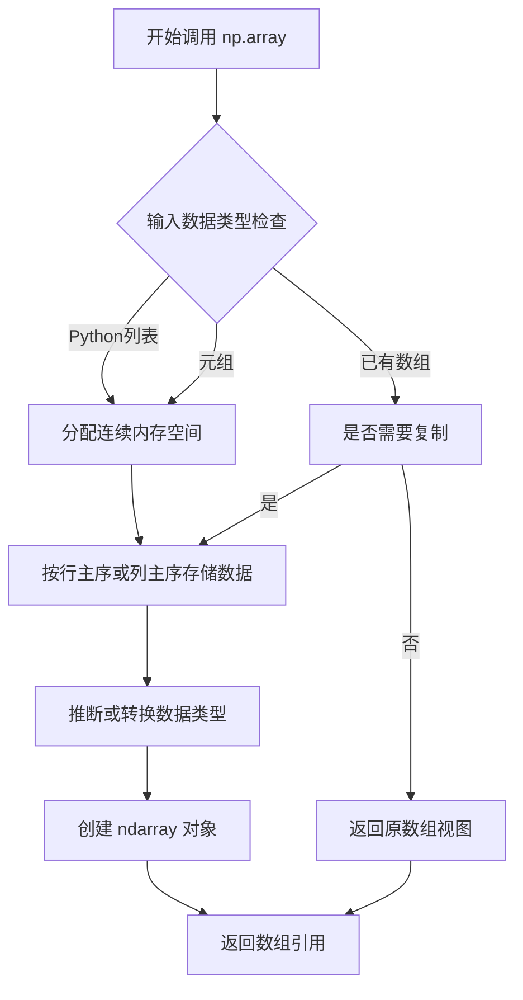
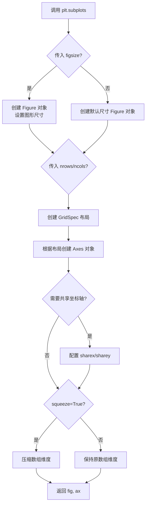
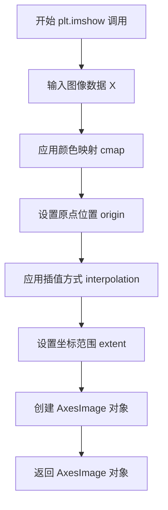
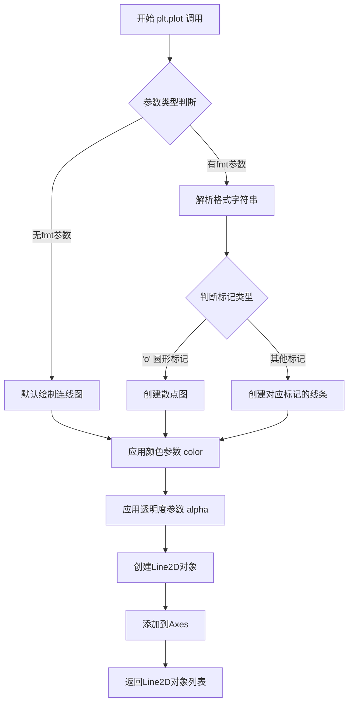
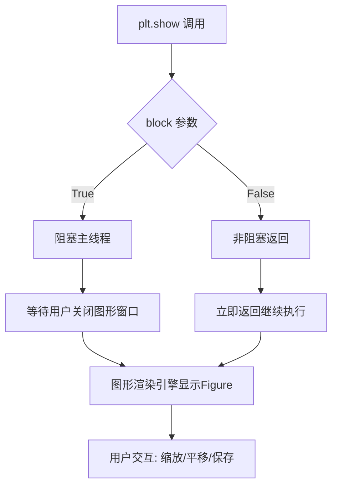
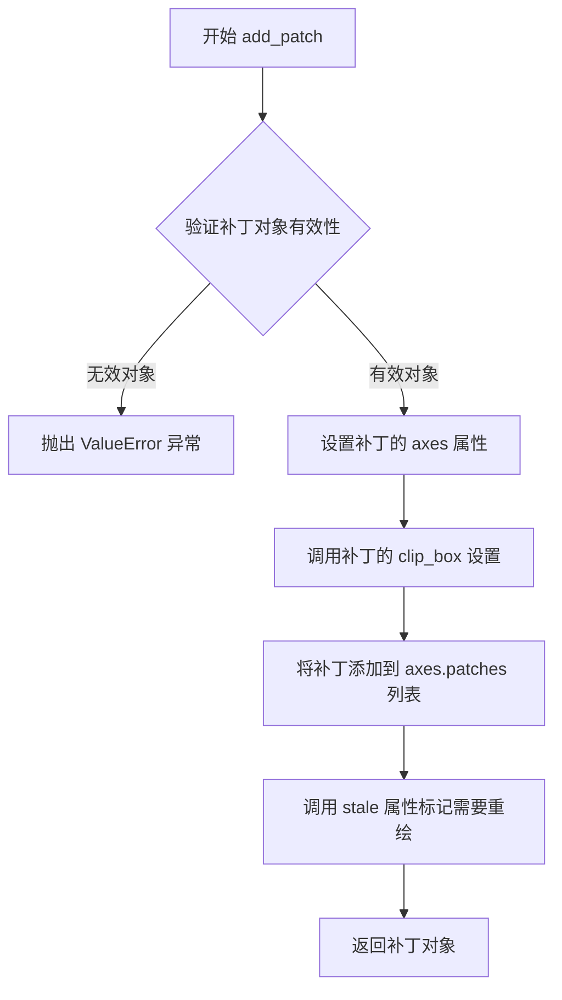
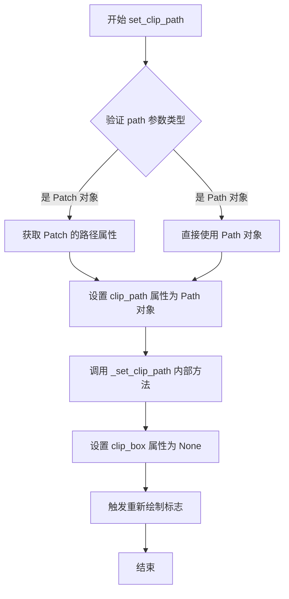

# `matplotlib\galleries\examples\shapes_and_collections\dolphin.py` 详细设计文档

这是一个matplotlib示例程序，演示如何使用Path、PathPatch和transforms类来绘制和处理形状。代码通过生成随机数据点、创建圆形以及解析SVG路径数据来绘制一个海豚形状，并对其应用仿射变换（旋转60度）创建第二个海豚图案。

## 整体流程



## 类结构

```
本代码无自定义类，仅使用matplotlib和numpy库的类
├── matplotlib.pyplot (fig, ax, plt)
├── numpy (np, 数组操作)
├── matplotlib.patches (Circle, PathPatch)
├── matplotlib.path (Path)
└── matplotlib.transforms (Affine2D)
```

## 全局变量及字段


### `np`
    
NumPy模块别名，用于数值计算和数组操作

类型：`module`
    


### `plt`
    
Matplotlib.pyplot模块别名，用于创建和显示图形

类型：`module`
    


### `r`
    
随机生成的半径数组，用于极坐标计算

类型：`numpy.ndarray`
    


### `t`
    
随机生成的角度数组，范围在0到2π之间

类型：`numpy.ndarray`
    


### `x`
    
由极坐标转换而来的x坐标数组

类型：`numpy.ndarray`
    


### `y`
    
由极坐标转换而来的y坐标数组

类型：`numpy.ndarray`
    


### `fig`
    
图形对象，表示整个matplotlib图形窗口

类型：`matplotlib.figure.Figure`
    


### `ax`
    
坐标轴对象，用于在图形上绘制元素

类型：`matplotlib.axes.Axes`
    


### `circle`
    
圆形补丁对象，用于绘制圆形边框和裁剪

类型：`matplotlib.patches.Circle`
    


### `im`
    
图像对象，用于显示填充的随机背景图像

类型：`matplotlib.image.AxesImage`
    


### `dolphin`
    
海豚SVG路径字符串，包含海豚形状的路径数据

类型：`str`
    


### `vertices`
    
路径顶点数组，存储海豚路径的坐标点

类型：`numpy.ndarray`
    


### `codes`
    
路径指令代码数组，存储SVG命令对应的路径指令

类型：`list`
    


### `parts`
    
按空格分割的路径字符串列表，用于解析SVG路径数据

类型：`list`
    


### `i`
    
循环计数器，用于遍历路径数据parts列表

类型：`int`
    


### `code_map`
    
SVG命令到Path代码的映射字典，将SVG命令转换为matplotlib路径指令

类型：`dict`
    


### `dolphin_path`
    
第一个海豚路径对象，包含原始海豚形状

类型：`matplotlib.path.Path`
    


### `dolphin_patch`
    
第一个海豚补丁对象，用于在图形上绘制原始海豚

类型：`matplotlib.patches.PathPatch`
    


### `dolphin_path2`
    
旋转后的海豚路径对象，经过60度旋转变换

类型：`matplotlib.path.Path`
    


### `dolphin_patch2`
    
旋转后的海豚补丁对象，用于在图形上绘制旋转后的海豚

类型：`matplotlib.patches.PathPatch`
    


### `matplotlib.patches.Circle.Circle`
    
来自matplotlib.patches的外部类，用于创建圆形补丁

类型：`class`
    


### `matplotlib.patches.PathPatch.PathPatch`
    
来自matplotlib.patches的外部类，用于创建基于路径的补丁形状

类型：`class`
    


### `matplotlib.path.Path.Path`
    
来自matplotlib.path的外部类，用于表示矢量路径

类型：`class`
    


### `matplotlib.transforms.Affine2D.Affine2D`
    
来自matplotlib.transforms的外部类，用于二维仿射变换

类型：`class`
    
    

## 全局函数及方法


### `np.random.rand`

生成指定形状的随机数组，数组元素服从区间 `[0, 1)` 上的均匀分布。

参数：

- `*shape`：`int`，可变长度参数，用于指定输出数组的维度，例如 `rand(50)` 生成一维长度为50的数组，`rand(2, 3)` 生成2行3列的二维数组。

返回值：`ndarray`，返回指定形状的随机值数组，元素类型为 float64，值域为 `[0.0, 1.0)`。

#### 流程图



#### 带注释源码

```python
# 示例 1: 生成一维数组，包含50个随机数
r = np.random.rand(50)

# 内部实现逻辑（简化说明）:
# 1. 解析参数: 接收可变长度参数 *shape
# 2. 确定输出形状: 将参数转换为输出数组的维度元组
# 3. 生成随机数: 使用底层随机数生成器生成 [0.0, 1.0) 区间内的均匀分布随机数
# 4. 返回数组: 返回指定形状的 numpy.ndarray

# 示例 2: 生成随机角度（0 到 2π 之间）
t = np.random.rand(50) * np.pi * 2.0

# 等价于:
# step1 = np.random.rand(50)    # 生成 [0,1) 区间的50个随机数
# step2 = step1 * np.pi * 2.0   # 乘以 2π 得到 [0, 2π) 区间

# 典型调用形式:
# np.random.rand()           # 返回标量: 0.84738224...
# np.random.rand(5)          # 返回形状 (5,) 的一维数组
# np.random.rand(2, 3)       # 返回形状 (2, 3) 的二维数组
# np.random.rand(2, 3, 4)    # 返回形状 (2, 3, 4) 的三维数组

# 注意: 若需要可复现的随机数，需先设置种子
np.random.seed(19680801)  # 设置随机种子以保证结果可复现
reproducible_random = np.random.rand(10)  # 每次运行结果相同
```


### `np.random.seed`

设置 NumPy 随机数生成器的种子，以确保程序运行的可重复性。通过传入特定的种子值（19680801），可以确保每次运行代码时生成相同的随机数序列，从而实现结果的可复现性。

参数：

- `seed`：`int` 或 `array_like`，可选，默认值为 `None`。用于初始化随机数生成器的种子值。如果传入整数，则直接用作种子；如果传入数组，则会转换为整数并用于初始化生成器。

返回值：`None`，该函数不返回任何值，仅修改全局随机状态。

#### 流程图



#### 带注释源码

```python
# 设置随机数生成器的种子，确保结果可复现
# 参数 19680801 是一个特定的整数种子值
# 这个值来自 Matplotlib 示例代码的创建日期 (1968-08-01)
np.random.seed(19680801)

# 后续代码使用该种子生成的随机数:
# r, t, x, y 将会是相同的随机值，每次运行程序时都一致
r = np.random.rand(50)
t = np.random.rand(50) * np.pi * 2.0
x = r * np.cos(t)
y = r * np.sin(t)

# 图像数据也会使用相同的随机模式
im = plt.imshow(np.random.random((100, 100)),
                origin='lower', cmap="winter",
                interpolation='spline36',
                extent=(-1, 1, -1, 1))
```

#### 详细说明

| 项目 | 描述 |
|------|------|
| **函数名** | `np.random.seed` |
| **所属模块** | `numpy.random` |
| **调用位置** | 代码第 20 行 |
| **使用目的** | 确保随机数生成的可重复性，便于调试和结果验证 |
| **影响范围** | 全局影响，后续所有 `np.random` 生成的随机数都会基于此种子 |


### `np.array`

将 Python 列表或类似数组结构转换为 NumPy 多维数组，是创建数组的核心函数。

参数：

- `object`：array_like，输入的数组_like对象（列表、元组等），这里传入的是 `vertices` 列表
- `dtype`：data-type，可选参数，数据类型，代码中未指定则自动推断
- `copy`：bool，可选参数，是否复制数据，代码中未指定
- `order`：{'K', 'A', 'C', 'F'}，可选参数，内存布局，代码中未指定
- `subok`：bool，可选参数，是否允许子类，代码中未指定
- `ndmin`：int，可选参数，最小维数，代码中未指定

返回值：`numpy.ndarray`，转换后的 NumPy 多维数组对象

#### 流程图



#### 带注释源码

```python
# 将 vertices 列表（包含从 SVG 路径解析出的顶点坐标）转换为 NumPy 数组
# 这一步是为了后续进行矩阵变换（如旋转）和图形绘制
vertices = np.array(vertices)  # 输入: Python list -> 输出: numpy.ndarray

# 具体使用场景：
# 解析 dolphin SVG 路径后，vertices 是一个包含 [x, y] 坐标对的列表
# 例如: [[-0.59739425, 160.18173], [-0.62740401, 160.18885], ...]
# np.array() 将其转换为:
# array([[-0.59739425, 160.18173],
#        [-0.62740401, 160.18885],
#        ...])
# 转换后可以:
# 1. 进行数学运算: vertices[:, 1] -= 160  # 调整 Y 坐标
# 2. 应用矩阵变换: Affine2D().rotate_deg(60).transform(vertices)
# 3. 作为 Path 构造函数参数: Path(vertices, codes)
```

#### 额外说明

| 项目 | 描述 |
|------|------|
| **函数位置** | `numpy.core.multiarray.array` |
| **时间复杂度** | O(n)，其中 n 为元素个数 |
| **空间复杂度** | O(n)，需要分配新内存 |
| **内存布局** | 默认 C contiguous（行主序） |
| **数据类型推断** | 自动从输入元素推断，如 float64 |


### `plt.subplots`

`plt.subplots` 是 matplotlib 库中用于创建一个新的图形窗口以及一个或多个坐标轴的函数。该函数是 `figure()` 和 `add_subplot()` 的组合简化版，常用于快速创建用于绑图的画布和坐标区域。

参数：

- `nrows`：`int`，默认值 1，表示子图的行数
- `ncols`：`int`，默认值 1，表示子图的列数
- `sharex`：`bool` 或 `{'none', 'all', 'row', 'col'}`，默认值 False，控制是否共享 x 轴
- `sharey`：`bool` 或 `{'none', 'all', 'row', 'col'}`，默认值 False，控制是否共享 y 轴
- `squeeze`：`bool`，默认值 True，控制是否压缩返回的 Axes 数组维度
- `width_ratios`：`array-like`，可选，表示列宽比例
- `height_ratios`：`array-like`，可选，表示行高比例
- `subplot_kw`：`dict`，可选，关键字参数传递给每个子图的创建函数
- `gridspec_kw`：`dict`，可选，关键字参数传递给 GridSpec 构造函数
- `**fig_kw`：关键字参数，传递给 `figure()` 函数调用，如 `figsize`、`dpi` 等

返回值：`tuple(Figure, Axes or ndarray of Axes)`，返回图形对象和坐标轴对象（或坐标轴数组）

#### 流程图



#### 带注释源码

```python
# 在示例代码中的调用方式
fig, ax = plt.subplots(figsize=(6, 6))

# 参数说明：
# figsize=(6, 6) - 设置图形窗口大小为 6x6 英寸
# 返回值：
# fig - Figure 对象，代表整个图形窗口
# ax - Axes 对象，代表图形中的坐标轴区域
```


### plt.imshow

该函数是 matplotlib 库中用于显示图像的核心函数，将数组数据可视化为 2D 图像，支持多种颜色映射、原点设置、插值方式和坐标范围配置。

#### 参数

- `X`：numpy.ndarray 要显示的图像数据，本例中为 `np.random.random((100, 100))` 生成的 100x100 随机数数组
- `cmap`：str，颜色映射方案，本例中为 "winter"，用于将数值映射为颜色
- `origin`：str，图像原点位置，本例中为 'lower'，表示坐标原点位于图像左下角
- `interpolation`：str，插值方式，本例中为 'spline36'，用于平滑图像显示
- `extent`：tuple，图像在 Axes 中的坐标范围，本例中为 (-1, 1, -1, 1)，定义图像的 x 轴范围为 [-1, 1]，y 轴范围为 [-1, 1]

#### 返回值

- `matplotlib.image.AxesImage`，返回 AxesImage 对象，本例中赋值给变量 `im`，用于后续操作如设置裁剪路径

#### 流程图



#### 带注释源码

```python
# 调用 plt.imshow 显示图像
# 参数1: np.random.random((100, 100)) - 生成100x100的随机数数组作为图像数据
# 参数2: origin='lower' - 设置原点位于左下角
# 参数3: cmap="winter" - 使用winter颜色映射方案
# 参数4: interpolation='spline36' - 使用spline36插值方式平滑图像
# 参数5: extent=(-1, 1, -1, 1) - 设置图像在坐标系中的范围
im = plt.imshow(np.random.random((100, 100)),
                origin='lower', cmap="winter",
                interpolation='spline36',
                extent=(-1, 1, -1, 1))

# 对返回的AxesImage对象进行后续操作
# 设置裁剪路径，将图像限制在圆形区域内显示
im.set_clip_path(circle)
```


### `plt.plot`

`plt.plot` 是 matplotlib 库中用于绘制线条或散点图的核心函数。在本代码中，该函数用于绘制随机生成的散点数据，以圆形标记样式显示在图表上。

参数：

- `x`：`array-like`，X轴数据坐标，接收随机生成的极坐标转换后的笛卡尔坐标
- `y`：`array-like`，Y轴数据坐标，接收随机生成的极坐标转换后的笛卡尔坐标
- `fmt`：`str`，格式字符串， `'o'` 表示使用圆形标记绘制散点图而非连线
- `**kwargs`：可选关键字参数，用于自定义线条属性
- `color`：`tuple`，颜色值， `(0.9, 0.9, 1.0)` 表示淡蓝色
- `alpha`：`float`，透明度， `0.8` 表示80%不透明度

返回值：`list[matplotlib.lines.Line2D]`，返回包含绘制的Line2D对象的列表

#### 流程图



#### 带注释源码

```python
# 在代码中的实际调用方式
plt.plot(x, y, 'o', color=(0.9, 0.9, 1.0), alpha=0.8)

# 参数说明：
# x: np.random.rand(50) * np.cos(np.random.rand(50) * np.pi * 2.0)
#    随机生成的50个X坐标值，范围在[-1, 1]
# y: np.random.rand(50) * np.sin(np.random.rand(50) * np.pi * 2.0)
#    随机生成的50个Y坐标值，范围在[-1, 1]
# 'o': 格式字符串，指定使用圆形标记（marker）绘制散点
# color=(0.9, 0.9, 1.0): RGB元组，设置标记颜色为淡蓝色
# alpha=0.8: 设置透明度为0.8，使标记略微透明以便观察重叠部分

# 函数内部执行逻辑（简化版）：
# 1. 接收x, y数据坐标
# 2. 解析fmt参数（'o'表示散点模式）
# 3. 创建Line2D对象并应用样式属性
# 4. 将线条对象添加到当前Axes（ax）
# 5. 返回包含Line2D对象的列表
```


### `plt.show`

`plt.show()` 是 matplotlib.pyplot 库中的核心函数，用于显示当前Figure对象创建的所有图形窗口，并将图形渲染到屏幕。在本代码中，它负责展示包含圆形、随机点阵以及两个旋转海豚形状的图形。

参数：

- `block`：`<class 'bool'>`，可选参数，默认为 True。控制是否阻塞程序执行以等待图形窗口关闭。设置为 False 时，图形窗口会显示但函数立即返回。

返回值：`None`，无返回值。该函数主要产生图形窗口的显示效果，不返回任何数据。

#### 流程图



#### 带注释源码

```python
# plt.show() 源码分析 (matplotlib.pyplot 模块内部实现原理)

# 1. 导入matplotlib.pyplot模块
import matplotlib.pyplot as plt

# 2. 在本示例代码中，plt.show() 之前的准备工作：
#    - 创建Figure和Axes对象: fig, ax = plt.subplots(figsize=(6, 6))
#    - 添加圆形: ax.add_patch(circle)
#    - 添加图像: ax.imshow(...)
#    - 添加散点: plt.plot(x, y, ...)
#    - 添加海豚路径: ax.add_patch(dolphin_patch)
#    - 添加旋转海豚: ax.add_patch(dolphin_patch2)

# 3. plt.show() 的核心调用流程:
plt.show()  # 显示上述所有图形元素组成的图像窗口

#    内部实现逻辑（简化）:
#    - 获取当前所有的Figure对象
#    - 调用后端显示管理器（如Qt、Tk、GTK等）的show()方法
#    - 创建一个阻塞事件循环（如果block=True）
#    - 等待用户交互或窗口关闭
#    - 释放图形资源
```


### `matplotlib.axes.Axes.add_patch`

该方法用于将图形补丁（Patch）对象添加到坐标轴（Axes）上，是Matplotlib中将各种形状（如圆形、多边形、路径等）渲染到图表核心方法之一。

参数：

-  `p`：`matplotlib.patches.Patch`，要添加到坐标轴的图形补丁对象（如Circle、PathPatch等）

返回值：`matplotlib.patches.Patch`，返回添加的补丁对象本身，便于链式调用或进一步操作

#### 流程图



#### 带注释源码

```python
def add_patch(self, p):
    """
    将补丁对象添加到坐标轴上。
    
    参数:
        p : Patch
            要添加的Patch对象（如Circle、PathPatch等）
    
    返回值:
        Patch
            添加的补丁对象
    """
    # 验证p是否为有效的Patch对象
    if not isinstance(p, Patch):
        raise ValueError('%s is not a Patch' % p)
    
    # 设置补丁的坐标轴属性，建立关联
    p.set_axes(self)
    
    # 配置补丁的剪裁框和剪裁路径
    p.set_clip_path(self.patch)
    
    # 将补丁添加到坐标轴的补丁列表中
    self._update_patch_limits(p)
    self.patches.append(p)
    
    # 标记图形为 stale（需要重绘）
    self.stale_callback(p)
    
    # 返回添加的补丁对象，便于后续操作
    return p
```

#### 详细说明

`add_patch` 方法是matplotlib中Axes类的核心方法之一，负责将各种图形补丁对象集成到坐标轴系统中。该方法主要完成以下工作：

1. **对象验证**：检查输入对象是否为有效的Patch实例，确保类型正确
2. **坐标轴关联**：通过 `set_axes(self)` 建立补丁对象与当前坐标轴的引用关系
3. **剪裁配置**：设置补丁的剪裁路径，通常与坐标轴的边界框关联
4. **范围更新**：调用 `_update_patch_limits(p)` 更新坐标轴的数据范围，确保视图能够正确容纳新添加的补丁
5. **列表管理**：将补丁追加到 `axes.patches` 列表中进行统一管理
6. **重绘标记**：设置 `stale=True` 触发后续的图形重绘

在示例代码中，通过三次调用 `add_patch` 分别添加了：
- 圆形补丁（Circle）：作为剪裁路径用于限制图像显示区域
- 海豚形状补丁（PathPatch）：绘制第一个海豚图形
- 旋转后的海豚补丁（PathPatch）：绘制旋转后的海豚图形

这种方法的设计模式允许用户灵活地向图表添加自定义图形，同时保持与Matplotlib现有架构的一致性。


### `AxesImage.set_clip_path`

该方法是 `matplotlib.image.AxesImage` 类（继承自 `matplotlib.artist.Artist`）的方法，用于设置图像的裁剪路径，使图像仅在指定路径定义的区域内可见。在本代码中，通过将图像的裁剪路径设置为圆形（Circle），使图像被限制在圆形区域内显示。

参数：

-  `path`：`matplotlib.patches.Patch` 或 `matplotlib.path.Path`，裁剪路径对象，定义了图像的可见区域边界。在本代码中为 `Circle` 对象
-  `transform`：`matplotlib.transforms.Transform`，可选参数，应用于路径的变换。默认为 `None`

返回值：`None`，该方法无返回值，直接修改对象的内部状态

#### 流程图



#### 带注释源码

```python
# 代码中的调用方式
im = plt.imshow(np.random.random((100, 100)),
                origin='lower', cmap="winter",
                interpolation='spline36',
                extent=(-1, 1, -1, 1))
# 创建圆形裁剪区域
circle = Circle((0, 0), 1, facecolor='none',
                edgecolor=(0, 0.8, 0.8), linewidth=3, alpha=0.5)
ax.add_patch(circle)

# 设置图像的裁剪路径为圆形
# 此处调用了 set_clip_path 方法
im.set_clip_path(circle)

# matplotlib 内部 set_clip_path 方法的简化实现逻辑：
# def set_clip_path(self, path, transform=None):
#     """
#     Set the clip path.
#     
#     Parameters:
#         path : Patch or Path or None
#             A patch will be transformed to a Path using get_transform().
#         transform : Transform or None
#             A transform to apply to the path.
#     """
#     from matplotlib.path import Path
#     from matplotlib.patches import Patch
#     
#     # 如果 path 是 Patch 对象，获取其路径
#     if isinstance(path, Patch):
#         path = path.get_path().get_transform().transform(path.get_path().vertices)
#     
#     # 设置裁剪路径
#     self._clippath = (path, transform)
#     
#     # 清除之前的 clip_box
#     self._clipbox = None
#     
#     # 标记需要重新绘制
#     self.stale_callback()
```


### Affine2D.rotate_deg

该方法用于创建二维仿射旋转变换，将旋转角度（以度为单位）添加到变换矩阵中，返回一个新的 Affine2D 对象包含组合后的变换。

参数：

- `degrees`：`float`，要旋转的角度（度），正值表示逆时针旋转，负值表示顺时针旋转

返回值：`Affine2D`，返回一个新的 Affine2D 实例，包含旋转后的变换矩阵

#### 流程图

```mermaid
graph TD
    A[输入: 旋转角度 degrees] --> B{degrees 是否为 0}
    B -->|是| C[返回单位变换]
    B -->|否| D[将 degrees 转换为弧度]
    D --> E[计算旋转矩阵 R = [cosθ, -sinθ, sinθ, cosθ, 0, 0]]
    E --> F[将旋转矩阵与当前变换矩阵相乘]
    F --> G[返回新的 Affine2D 实例]
    
    H[链式调用示例] --> I[Affine2D.rotate_deg 60]
    I --> J[.transform vertices]
    J --> K[应用旋转变换到顶点]
```

#### 带注释源码

```python
def rotate_deg(self, degrees):
    """
    添加旋转角度（以度为单位）到变换中。
    
    参数:
        degrees: float
            旋转角度（度）。正值逆时针旋转，负值顺时针旋转。
    
    返回:
        Affine2D
            包含旋转变换的新 Affine2D 实例（支持链式调用）。
    """
    # 将角度转换为弧度
    # degrees * (π/180) = radians
    return self.rotate(np.deg2rad(degrees))

# 底层实现 (numpy 数组操作)
# 旋转矩阵结构:
# [ cos(θ)  -sin(θ)  0 ]
# [ sin(θ)   cos(θ)  0 ]
# [   0        0     1 ]
#
# 在 Affine2D 中存储为 6 元组: (a, b, c, d, e, f)
# 对应矩阵: [a b c]
#           [d e f]
#           [0 0 1]
# 旋转矩阵对应: (cosθ, -sinθ, 0, sinθ, cosθ, 0)
```

## 关键组件


### 随机数据生成与坐标转换

使用 numpy 生成 50 个随机极坐标点（半径 r 和角度 t），并将它们转换为笛卡尔坐标（x, y），用于后续绘图。

### 圆形 (Circle) 组件

使用 matplotlib.patches.Circle 创建一个圆形，作为裁剪路径和视觉参考边框。圆形中心为 (0, 0)，半径为 1，边框颜色为青色，透明度为 0.5。

### 图像显示与裁剪 (imshow + set_clip_path)

使用 plt.imshow 显示一个 100x100 的随机矩阵图像，并通过 im.set_clip_path(circle) 将图像裁剪到圆形区域内，实现圆形遮罩效果。

### SVG 路径解析器

将海豚形状的 SVG 路径字符串解析为 matplotlib Path 对象。解析过程中使用 code_map 将 SVG 命令（M=移动, C=曲线, L=直线）映射到 Path 的内部码，并提取对应的顶点坐标。

### 路径补丁 (PathPatch) 组件

使用 PathPatch 将解析后的海豚路径转换为可绘制的补丁对象，支持填充色和边框色设置。代码中创建了两个海豚补丁：原始位置和旋转 60 度后的副本。

### 仿射变换 (Affine2D)

使用 matplotlib.transforms.Affine2D 对顶点坐标进行旋转变换，创建一个旋转后的海豚形状副本，演示了 2D 仿射变换的用法。

### 图形渲染与显示

整合所有图形组件（圆形、图像、海豚路径），通过 plt.show() 渲染并显示最终的组合图形。


## 问题及建议


### 已知问题

- **过时的随机数生成方式**：使用`np.random.seed()`是旧版NumPy的写法，新版本推荐使用`np.random.default_rng()`或`np.random.Generator`对象
- **脆弱的路径解析逻辑**：使用`while`循环手动解析路径数据，缺乏对无效path code的检查，若遇到未知指令会直接崩溃；索引操作`parts[i + 1:][:npoints]`没有边界保护
- **硬编码的Magic Numbers**：海豚顶点y坐标偏移`-160`、旋转角度`60`、颜色值等均为硬编码，缺乏可配置性
- **重复代码**：绘制两个海豚（原始和旋转后）的逻辑高度重复，未提取为可复用函数
- **缺乏输入验证**：对`parts`数组解析时未验证数据完整性，解析后的`vertices`也未检查形状是否符合预期
- **全局作用域污染**：所有代码直接运行在模块级别，无函数封装，降低了可测试性和可维护性
- **注释掉的代码片段**：代码中有多处注释掉的XML许可证信息，清理不彻底
- **缺少异常处理**：路径解析、数据转换等关键步骤均无try-except保护

### 优化建议

- 重构为面向对象设计，封装`DolphinPlotter`类，将绘制逻辑参数化
- 使用`np.random.default_rng(19680801)`替代`np.random.seed()`以兼容新版NumPy
- 将路径解析逻辑封装为独立函数并添加输入验证和异常处理
- 将硬编码配置（颜色、角度、偏移量）提取为类属性或配置字典
- 对重复的海豚绘制逻辑进行函数抽象，参数化位置、旋转角度和样式
- 使用`matplotlib.backends`方式非阻塞显示或显式调用`plt.close()`管理图形生命周期
- 添加类型注解和文档字符串提升代码可读性
- 考虑将海豚路径数据分离到独立的数据文件或常量定义中


## 其它


### 设计目标与约束

本示例代码旨在演示如何使用matplotlib的Path、PathPatch和transforms类来绘制和操作基于顶点的形状。设计目标包括：创建包含随机分布点的散点图、绘制圆形边界、使用图像剪辑、生成矢量图形（海豚形状）并对其进行旋转变换。约束条件为必须使用matplotlib 2.0+版本兼容的API，代码需要在Python 3.6+环境中运行，且依赖numpy和matplotlib两个核心库。

### 错误处理与异常设计

代码主要依赖matplotlib和numpy的底层错误处理机制。在路径解析过程中，code_map字典仅定义了'M'、'C'、'L'三种命令码，如果遇到未知命令会抛出KeyError；parts列表长度不足时访问越界会抛出IndexError；float类型转换失败会抛出ValueError。建议在路径解析循环前添加异常捕获机制，处理可能的格式错误或无效数据输入。

### 数据流与状态机

代码的数据流从随机数据生成开始，经过坐标计算、图形对象创建、补丁添加到坐标变换等阶段。状态转换顺序为：随机数生成 → 极坐标转笛卡尔坐标 → 创建基础图形（Circle、imshow、plot） → 解析SVG路径数据 → 创建Path对象 → 应用Affine2D变换 → 渲染输出。数据流为单向流动，无循环依赖或复杂状态机设计。

### 外部依赖与接口契约

核心依赖包括matplotlib.pyplot（图形窗口管理）、numpy（数值计算）、matplotlib.patches（图形补丁）、matplotlib.path（路径对象）、matplotlib.transforms（仿射变换）。各模块接口契约遵循matplotlib官方文档规范：Circle接受(center, radius, **kwargs)参数；Path接受(vertices, codes, readonly)参数；PathPatch接受(path, **kwargs)参数；Affine2D支持链式变换方法调用。

### 性能考虑与优化空间

当前代码在路径解析循环中使用while循环和列表extend操作，存在一定性能开销。建议使用列表推导式或numpy向量化操作优化顶点处理。对于大规模顶点数据，可预先分配numpy数组内存。图像插值使用spline36算法，计算开销较高，如需优化可考虑切换到'bilinear'或'nearest'模式。60度旋转变换直接修改原vertices数组，缺少深拷贝可能导致原始数据丢失。

### 兼容性考虑

代码兼容Python 3.6+版本和matplotlib 2.0+版本。numpy.random.seed(19680801)确保随机数可复现性。SVG路径解析假设使用相对坐标和小数点格式，可能无法处理绝对坐标或更复杂的SVG路径命令。matplotlib后端依赖plt.switch_backend或环境变量配置，在无GUI环境中需要使用Agg后端。

### 测试策略建议

建议添加单元测试验证：随机坐标生成的数量和范围、圆形补丁的边界框计算、图像剪辑路径的有效性、路径解析结果的顶点和代码数组维度匹配、旋转变换后的坐标范围是否符合预期。可使用pytest框架配合matplotlib的Agg后端进行无头测试。

### 部署和运维考虑

该代码为示例脚本，无需生产环境部署。运行依赖：安装matplotlib和numpy（可通过pip install matplotlib numpy或conda install matplotlib numpy）。建议在容器化环境中设置DISPLAY变量或使用MPLBACKEND=Agg环境变量确保图形渲染正常。代码中包含CC0 Public Domain许可证声明的海豚SVG路径数据，可自由使用。

    