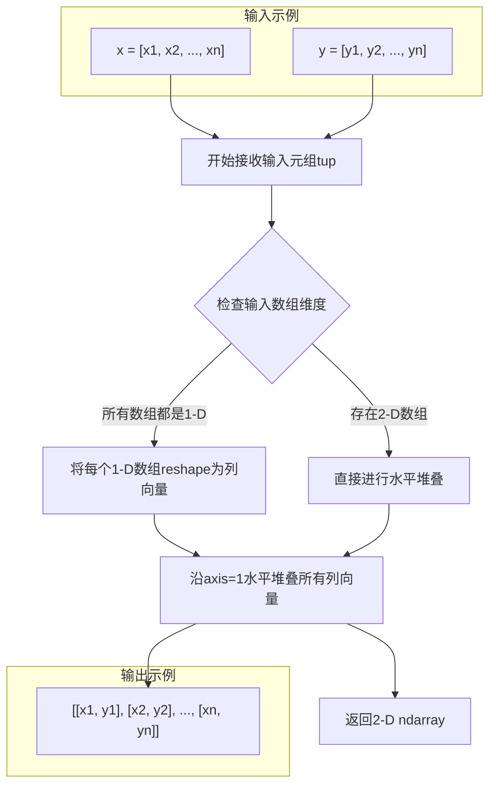
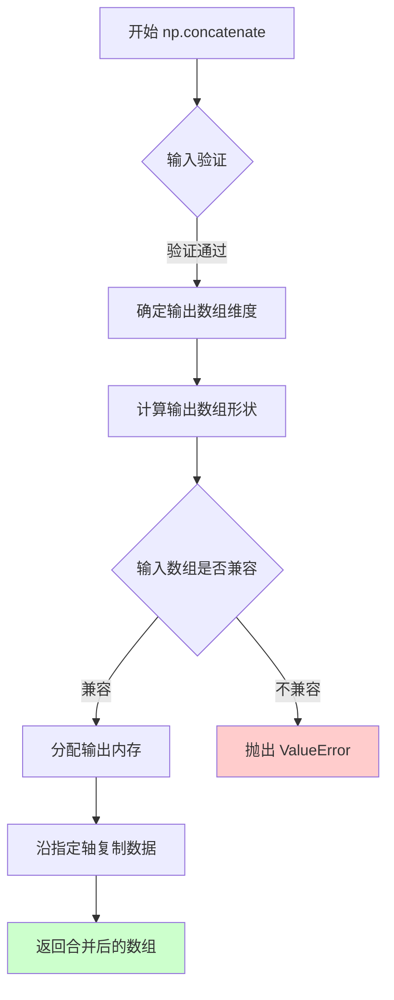
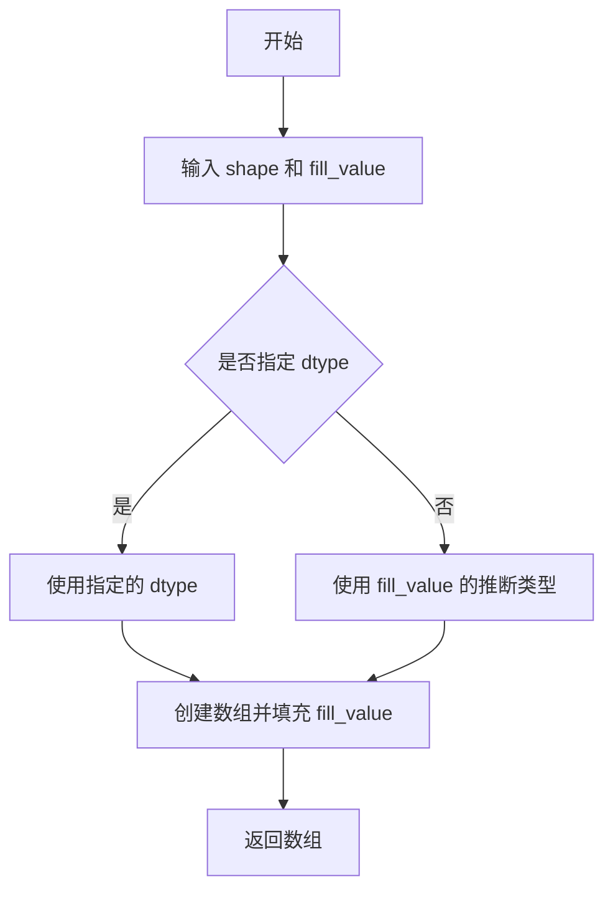
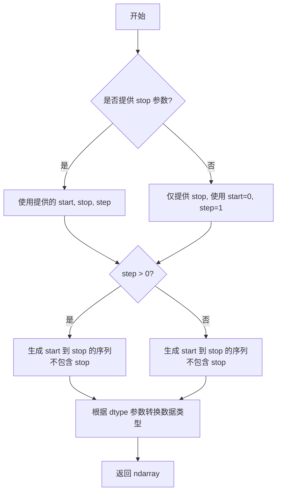
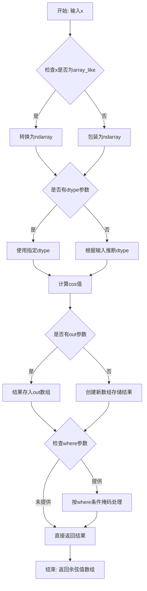
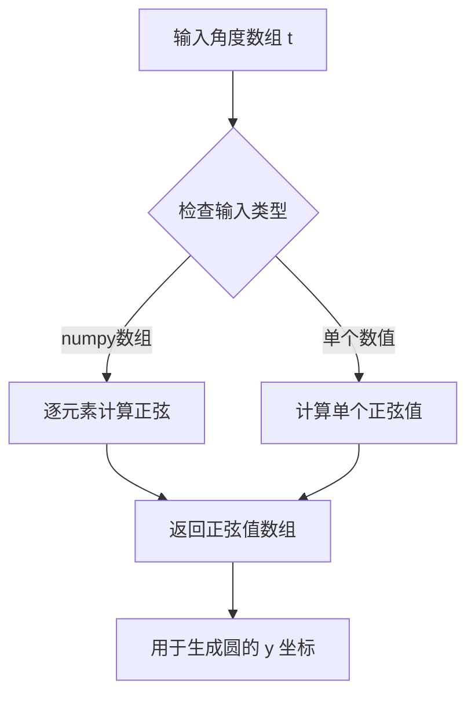
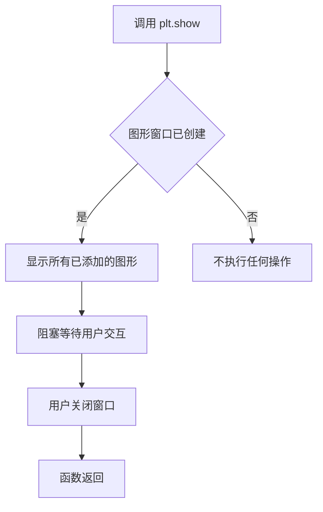
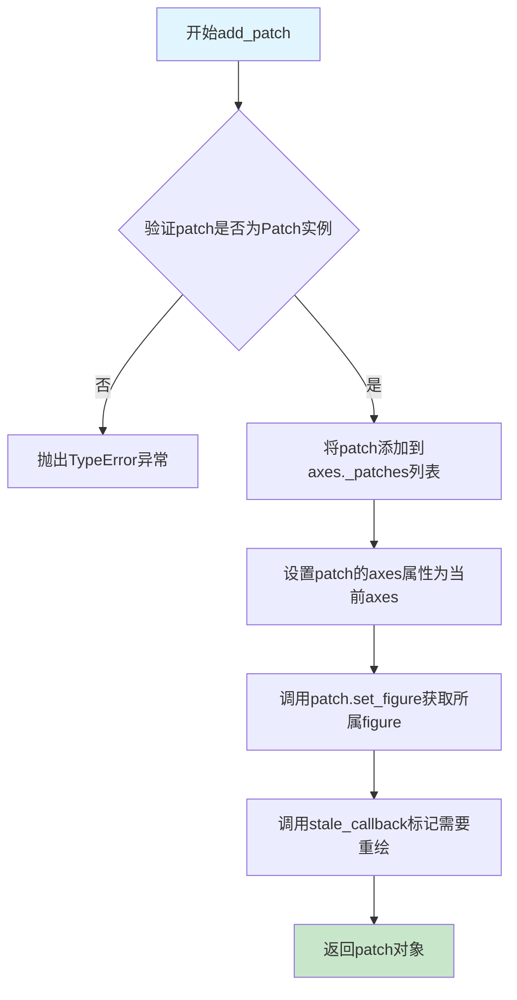
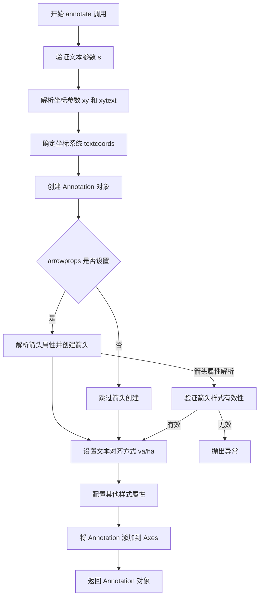
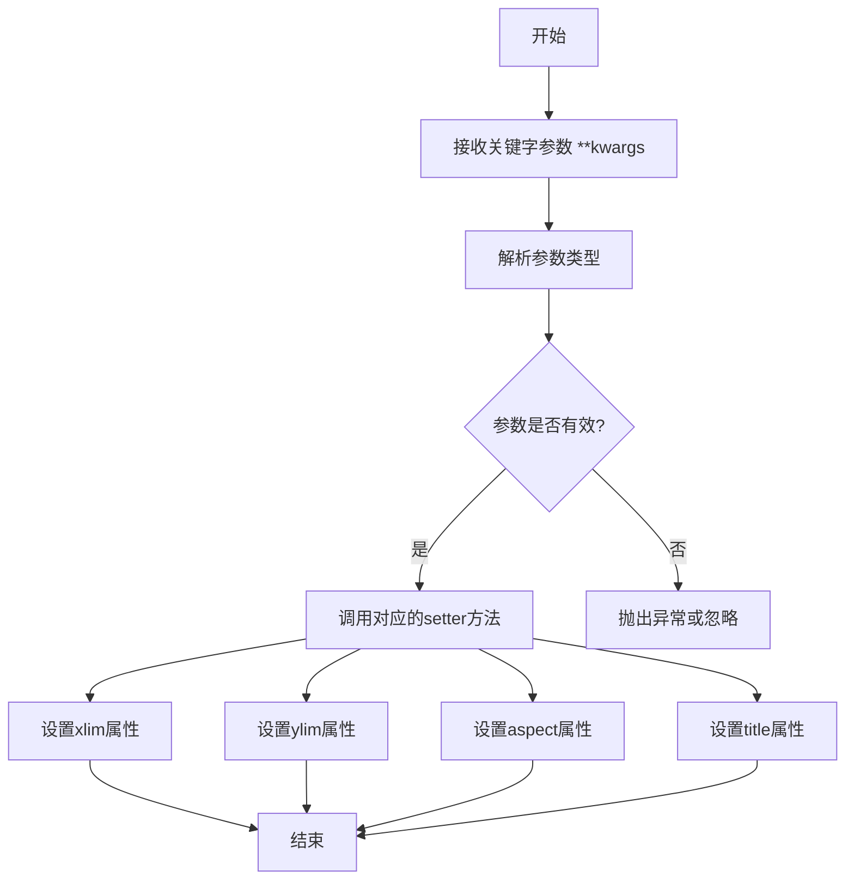

# `matplotlib\galleries\examples\shapes_and_collections\donut.py` 详细设计文档

该代码是一个matplotlib示例程序，通过使用Path和PathPatch绘制多个不同方向的甜甜圈形状，展示了复合路径中路径方向（顺时针CW和逆时针CCW）对填充效果的影响。

## 整体流程

```mermaid
graph TD
    A[开始] --> B[定义辅助函数 wise(v)]
    B --> C[定义辅助函数 make_circle(r)]
    C --> D[创建Figure和Axes对象]
    D --> E[生成内圆和外圆顶点]
    E --> F[设置路径codes数组]
    F --> G[循环遍历4种方向组合]
    G --> H{循环 i from 0 to 3}
    H --> I[根据方向组合拼接顶点和codes]
    H --> J[创建Path对象]
    H --> K[创建PathPatch并添加到Axes]
    H --> L[添加文本注释]
    I --> H
    K --> H
    L --> H
    H --> M[设置坐标轴属性]
    M --> N[调用plt.show()显示图形]
```

## 类结构

```
无自定义类（脚本级别代码）
├── 辅助函数模块
│   ├── wise(v) - 方向映射函数
│   └── make_circle(r) - 圆顶点生成函数
└── 主程序流程
    ├── 图形初始化
    ├── 顶点计算
    ├── 路径构建与渲染
    └── 图形展示
```

## 全局变量及字段


### `fig`
    
matplotlib Figure对象，图形容器

类型：`matplotlib.figure.Figure`
    


### `ax`
    
matplotlib Axes对象，坐标轴对象

类型：`matplotlib.axes.Axes`
    


### `inside_vertices`
    
numpy数组，内圆顶点坐标

类型：`numpy.ndarray`
    


### `outside_vertices`
    
numpy数组，外圆顶点坐标

类型：`numpy.ndarray`
    


### `codes`
    
numpy数组，路径绘制命令代码

类型：`numpy.ndarray`
    


### `vertices`
    
numpy数组，拼接后的顶点数据

类型：`numpy.ndarray`
    


### `all_codes`
    
numpy数组，完整的路径命令代码

类型：`numpy.ndarray`
    


### `path`
    
matplotlib.path.Path对象，几何路径

类型：`matplotlib.path.Path`
    


### `patch`
    
matplotlib.patches.PathPatch对象，路径补丁图形

类型：`matplotlib.patches.PathPatch`
    


### `t`
    
numpy数组，角度采样点

类型：`numpy.ndarray`
    


### `x`
    
numpy数组，圆的水平坐标

类型：`numpy.ndarray`
    


### `y`
    
numpy数组，圆的垂直坐标

类型：`numpy.ndarray`
    


### `i`
    
int，循环计数器

类型：`int`
    


### `inside`
    
int，方向符号(+1/-1)

类型：`int`
    


### `outside`
    
int，方向符号(+1/-1)

类型：`int`
    


    

## 全局函数及方法


### `wise(v)`

将方向值（+1 或 -1）映射为可读的方向字符串（"CCW" 表示逆时针，"CW" 表示顺时针），用于在图表注释中直观显示路径的走向。

参数：

-  `v`：`int`，方向值，+1 表示逆时针（Counter-Clockwise），-1 表示顺时针（Clockwise）

返回值：`str`，方向描述字符串，"CCW" 或 "CW"

#### 流程图

```mermaid
flowchart TD
    A[开始] --> B{判断 v 的值}
    B -->|v == +1| C[返回 "CCW"]
    B -->|v == -1| D[返回 "CW"]
    C --> E[结束]
    D --> E
```

#### 带注释源码

```python
def wise(v):
    """
    将方向值映射为字符串
    
    参数:
        v: 方向值，+1 表示逆时针(CCW)，-1 表示顺时针(CW)
    
    返回:
        方向描述字符串
    """
    # 使用字典映射：+1 -> "CCW", -1 -> "CW"
    # CCW = Counter-Clockwise (逆时针)
    # CW = Clockwise (顺时针)
    return {+1: "CCW", -1: "CW"}[v]
```


### `make_circle`

该函数接收一个半径参数 `r`，通过在 0 到 $2\pi$ 区间内以 0.01 为步长采样角度，利用三角函数 $\cos(t)$ 和 $\sin(t)$ 计算对应的 x 和 y 坐标，并将这些坐标对堆叠成一个二维 NumPy 数组返回，用于后续构成圆形路径。

参数：

-  `r`：`float` 或 `int`，圆的半径。

返回值：`numpy.ndarray`，返回形状为 (N, 2) 的二维数组，其中 N 是顶点的数量，每一行包含一个顶点的 (x, y) 坐标。

#### 流程图

```mermaid
graph TD
    A([开始]) --> B[输入半径 r]
    B --> C[生成角度数组 t: 0 到 2π, 步长 0.01]
    C --> D[计算 x 坐标: x = r * cos(t)]
    D --> E[计算 y 坐标: y = r * sin(t)]
    E --> F[合并 x, y 为二维数组]
    F --> G([返回顶点数组])
```

#### 带注释源码

```python
def make_circle(r):
    """
    生成圆的顶点坐标。

    参数:
        r: 圆的半径。

    返回:
        包含圆周上所有点 (x, y) 坐标的 numpy 数组。
    """
    # 生成从 0 到 2π (不含) 的角度数组，步长为 0.01
    # 这定义了圆周上的采样点
    t = np.arange(0, np.pi * 2.0, 0.01)
    
    # 根据极坐标公式 x = r * cos(θ) 计算 x 坐标
    x = r * np.cos(t)
    
    # 根据极坐标公式 y = r * sin(θ) 计算 y 坐标
    y = r * np.sin(t)
    
    # 将 x 和 y 数组按列合并，形成 (N, 2) 的二维数组
    # 每一行代表圆周上的一个顶点
    return np.column_stack((x, y))
```


### `np.column_stack`

`np.column_stack` 是 NumPy 库中的一个函数，用于将一组一维数组水平堆叠成二维数组的列。当输入为一维数组时，该函数会将它们视为列向量，并按顺序并排组合成二维矩阵，每列对应一个输入数组。这是创建坐标点、构建几何图形顶点等场景中的常用操作。

参数：

- `tup`：`tuple of 1-D arrays`，由一维数组组成的元组，这些数组将被堆叠成二维数组的列。所有输入数组的长度必须相同。

返回值：`ndarray`，返回的二维数组，其形状为 (n, m)，其中 n 是输入数组的长度，m 是输入数组的数量（即元组中的数组个数）。如果输入的是二维数组（每个数组形状为 (n, 1)），则直接返回这些数组的水平堆叠。

#### 流程图



#### 带注释源码

```python
def make_circle(r):
    """
    创建一个圆的顶点坐标数组
    
    参数:
        r: float - 圆的半径
    
    返回:
        ndarray - 形状为(n, 2)的二维数组，每行是圆上一点的(x, y)坐标
    """
    # 生成从0到2*pi的等间距角度值，步长为0.01
    t = np.arange(0, np.pi * 2.0, 0.01)
    
    # 计算圆上各点的x坐标（余弦）
    x = r * np.cos(t)
    
    # 计算圆上各点的y坐标（正弦）
    y = r * np.sin(t)
    
    # 核心操作：将x和y两个一维数组水平堆叠成二维数组
    # 输入: x = [x1, x2, ..., xn], y = [y1, y2, ..., yn]
    # 输出: [[x1, y1], [x2, y2], ..., [xn, yn]]
    # 这样每一行代表圆上一个点的平面坐标(x, y)
    return np.column_stack((x, y))
```

#### 关键组件信息

| 组件名称 | 一句话描述 |
|---------|-----------|
| `np.column_stack` | NumPy函数，将一维数组元组水平堆叠为二维数组的列 |
| `np.arange` | NumPy函数，用于创建等差数组 |
| `np.cos` / `np.sin` | NumPy三角函数，计算数组元素的余弦/正弦值 |

#### 潜在的技术债务或优化空间

1. **性能优化**：对于大批量的坐标生成，可以考虑使用向量化程度更高的方式或预先分配内存，以提高计算效率。
2. **参数验证**：未对输入半径 `r` 进行负值或零值验证，可能导致意外结果。
3. **硬编码步长**：`0.01` 的步长是硬编码的，对于不同大小的圆可能不够灵活。

#### 其它项目

- **设计目标**：生成圆的顶点坐标序列，用于后续 `matplotlib.path.Path` 对象的构造。
- **约束条件**：输入数组必须具有相同的长度，且函数仅接受一维或二维数组。
- **错误处理**：若输入数组长度不一致，会抛出 `ValueError`。
- **外部依赖**：依赖 NumPy 库，需要确保 NumPy 已正确安装。
- **数据流**：`make_circle` 返回的二维数组直接传递给 `Path` 构造器的 `vertices` 参数，用于定义路径的顶点。


### `np.concatenate`

`np.concatenate` 是 NumPy 库中的一个核心数组操作函数，用于沿指定轴将两个或多个数组连接（合并）成一个新的数组。该函数接受一个包含要合并数组的元组作为主要输入，并返回一个新的数组，不会修改原始输入数组。

参数：

- ` tup：`tuple of array_like`，要连接的数组序列。在代码中为 `(outside_vertices[::outside], inside_vertices[::inside])` 或 `(codes, codes)`。数组必须在除连接轴之外的其它维度上具有兼容的形状。
- `axis：`int`，可选参数，默认值为0。指定沿哪个轴连接数组。在代码中使用了默认值。
- `out：`ndarray`，可选参数。指定输出数组，如果提供，结果将被写入此数组。
- `dtype：`data-type`，可选参数。指定输出数组的数据类型，如果不指定，则推断自输入数组。
- `casting：`str`，可选参数。指定数据类型转换的规则，默认为'unsafe'。
- `equal_nan：`bool`，可选参数。默认为True，如果为True则在合并时保持NaN值相等性。

返回值：`ndarray`，返回连接后的新数组。如果所有输入数组都是视图，则返回视图；否则返回副本。

#### 流程图



#### 带注释源码

```python
# 在本示例代码中的第一种用法：合并外圆和内圆顶点
# outside_vertices[::outside] 根据 outside 值为 1 或 -1
# 决定是否反转外圆顶点的顺序（影响绘制方向：顺时针或逆时针）
# inside_vertices[::inside] 根据 inside 值为 1 或 -1
# 决定是否反转内圆顶点的顺序
vertices = np.concatenate((outside_vertices[::outside],
                           inside_vertices[::inside]))
# 结果：vertices 包含外圆顶点数组后接内圆顶点数组
# 返回类型：ndarray，形状为 (len(outside_vertices) + len(inside_vertices), 2)

# 在本示例代码中的第二种用法：合并路径命令代码
# 将两份 codes 数组连接起来，因为外圆和内圆都需要完整的路径命令
all_codes = np.concatenate((codes, codes))
# 结果：all_codes 包含两倍的原始 codes 数组
# 返回类型：ndarray，形状为 (2 * len(codes),)
```


### `np.full`

`np.full` 是 NumPy 库中的一个函数，用于创建一个指定形状并填充给定值的数组。

参数：
- `shape`：`int` 或 `tuple of ints`，输出数组的维度。对于一维数组，即为元素个数。
- `fill_value`：`scalar`，用于填充数组的值。
- `dtype`：`data-type`，可选，数组的数据类型。
- `order`：`{'C', 'F'}`，可选，数组在内存中的存储顺序。

返回值：`numpy.ndarray`，填充了指定值的数组。

#### 流程图



#### 带注释源码

在给定的代码中，`np.full` 的使用如下：

```python
# 创建一个与 inside_vertices 长度相同的数组，填充值为 mpath.Path.LINETO
# inside_vertices 是由 make_circle(0.5) 生成的圆顶点数组
codes = np.full(len(inside_vertices), mpath.Path.LINETO)
# 这行代码生成了一个由 LINETO 命令代码组成的数组，用于后续路径的构建
# np.full 确保数组中所有元素都被初始化为 LINETO
```


### `np.arange()`

`np.arange()` 是 NumPy 库中的一个函数，用于创建等差数组（arange 是 "array range" 的缩写）。在给定代码中，该函数用于生成从 0 到 2π 的角度序列，作为绘制圆形的参数基础。

参数：

- `start`：`float` 或 `int`，起始值，默认为 0。数组的起始值（包含）。
- `stop`：`float` 或 `int`，结束值。数组的终止值（不包含，除非在某些情况下由于浮点精度导致包含）。
- `step`：`float` 或 `int`，步长。数组元素之间的差值。默认为 1。
- `dtype`：`dtype`，输出数组的数据类型。如果未指定，则从输入参数推断。

返回值：`ndarray`，返回给定范围内的等差数组。

#### 流程图



#### 带注释源码

```python
# np.arange() 在 NumPy 源码中的简化实现逻辑
def arange(start=0, stop=None, step=1, dtype=None):
    """
    返回给定范围内的等差数组。
    
    参数:
        start: 起始值，默认为 0
        stop: 结束值（不包含）
        step: 步长
        dtype: 输出数组的数据类型
    """
    # 处理参数：如果只提供一个位置参数，它被视为 stop，start 默认为 0
    if stop is None:
        start, stop = 0, start
    
    # 计算数组长度: ceil((stop - start) / step)
    # 这是核心逻辑：确定需要多少个元素
    num = int(np.ceil((stop - start) / step)) if step else 0
    
    # 创建结果数组
    result = np.empty(num, dtype=dtype)
    
    # 使用步长填充数组
    result[0] = start
    if num > 1:
        result[1:] = start + np.arange(1, num) * step
    
    return result


# 在给定代码中的实际使用示例:
t = np.arange(0, np.pi * 2.0, 0.01)
# 创建从 0 到 2π（不包含）的数组，步长 0.01
# 结果是一个包含 628 个元素的浮点数数组
# 用于后续计算圆周上的点: x = r * cos(t), y = r * sin(t)
```


### `np.cos`

NumPy库的余弦函数，计算输入数组或单个值中每个元素的余弦值（基于弧度）。

参数：

- `x`：`array_like`，输入角度值（单位为弧度），可以是标量、列表或NumPy数组
- `out`：`ndarray, optional`，用于存储计算结果的输出数组，必须具有与输入兼容的形状
- `where`：`array_like, optional`，条件广播数组，值为True的位置计算cos，False的位置保持原值
- `casting`：`str, optional`，控制类型转换规则，默认为'unsafe'
- `order`：`str, optional`，指定输出数组的内存布局（'C'、'F'、'A'或'K'）
- `dtype`：`data-type, optional`，指定返回数组的数据类型
- `subok`：`bool, optional`，是否允许返回子类的实例，默认为True
- `signature`：`str, internal`，预留用于CUDA等设备的特定签名

返回值：`ndarray`，返回输入角度的余弦值，形状与输入相同，数据类型由dtype参数决定（如果指定）

#### 流程图



#### 带注释源码

```python
# np.cos 函数的简化实现原理说明
# 实际NumPy版本使用C/Fortran实现，此处展示Python层面的逻辑

def cos_implementation(x):
    """
    NumPy余弦函数的简化实现
    
    参数:
        x: array_like - 输入角度，弧度制
    
    返回:
        ndarray - 每个元素的余弦值
    """
    # 步骤1: 将输入转换为NumPy数组（如果还不是）
    x = np.asarray(x)
    
    # 步骤2: 使用NumPy底层的C/Fortran实现的cos函数
    # 泰勒展开近似: cos(x) = 1 - x²/2! + x⁴/4! - x⁶/6! + ...
    # 但NumPy使用更高效的查表法和多项式近似
    result = np.cos(x)  # 底层调用
    
    return result

# 使用示例
angles = np.array([0, np.pi/2, np.pi, 3*np.pi/2, 2*np.pi])
cos_values = np.cos(angles)
# 输出: [ 1.000000e+00  6.123234e-17 -1.000000e+00 -6.123234e-17  1.000000e+00]
# 即 [1, 0, -1, 0, 1]
```


### `np.sin`

正弦函数，计算输入角度（弧度）的正弦值。

参数：

- `t`：`ndarray`，输入的角度数组（弧度制）

返回值：`ndarray`，输入数组对应的正弦值数组

#### 流程图



#### 带注释源码

```python
def make_circle(r):
    """
    创建一个圆的路径点
    
    参数:
        r: float - 圆的半径
    
    返回:
        ndarray - 圆的顶点坐标数组
    """
    # 生成从 0 到 2π 的角度数组，步长 0.01
    t = np.arange(0, np.pi * 2.0, 0.01)
    
    # 计算每个角度对应的 x 坐标（余弦）
    x = r * np.cos(t)
    
    # 计算每个角度对应的 y 坐标（正弦）
    # np.sin() 函数计算输入角度数组的正弦值
    # 参数 t: ndarray 类型，包含 0 到 2π 的角度值（弧度）
    # 返回值: 与输入数组形状相同的正弦值数组
    y = r * np.sin(t)
    
    # 将 x 和 y 坐标组合成二维数组并返回
    return np.column_stack((x, y))
```


### `plt.subplots`

**概述**  
`plt.subplots` 是 `matplotlib.pyplot` 中的函数，用于一次性创建**一个figure（图形）**以及**一个或多个子图（axes）**。它内部会先创建一个 `Figure` 实例，再依据 `nrows`、`ncols` 参数使用 `GridSpec` 生成对应数量的 `Axes` 对象，最后返回 `(fig, ax)`（其中 `ax` 可能是单个 `Axes` 对象，也可能是一个 `ndarray`，取决于子图的数目）。该函数还支持共享坐标轴、传递子图关键字参数、图形关键字参数等高级配置。

---

#### 参数

- **`nrows`**：`int`，默认 `1`，子图的行数。  
- **`ncols`**：`int`，默认 `1`，子图的列数。  
- **`sharex`**：`bool` 或 `str`，默认 `False`。若为 `True` 或 `'all'`，所有子图共享 X 轴刻度；若为 `'col'`，每列共享。  
- **`sharey`**：`bool` 或 `str`，默认 `False`。若为 `True` 或 `'all'`，所有子图共享 Y 轴刻度；若为 `'row'`，每行共享。  
- **`squeeze`**：`bool`，默认 `True`。若为 `True`，且只有单个子图时返回的 `ax` 为 `Axes` 对象而非数组。  
- **`subplot_kw`**：`dict`，默认 `None`，传递给每个 `add_subplot`（或 `subplot2grid`）的关键字参数，如 `projection='polar'`、`facecolor` 等。  
- **`gridspec_kw`**：`dict`，默认 `None`，传递给 `GridSpec` 构造函数的关键字参数，如 `hspace`、`width_ratios` 等。  
- **`**fig_kw`**：任意关键字参数，传递给 `Figure` 构造函数（如 `figsize`、`dpi`、`facecolor` 等）。

---

#### 返回值

- **`fig`**：`matplotlib.figure.Figure`，创建的图形对象。  
- **`ax`**：`matplotlib.axes.Axes` 或 `numpy.ndarray` of `Axes`，子图对象。若 `nrows` 与 `ncols` 均为 `1` 且 `squeeze=True`，返回单个 `Axes`；若其中任一大于 `1`，返回形状为 `(nrows, ncols)` 的 `ndarray`。

---

#### 流程图

```mermaid
flowchart TD
    Start(调用 plt.subplots) --> ParseParams[解析参数 nrows, ncols, sharex, …]
    ParseParams --> CreateFigure[创建 Figure 实例]
    CreateFigure --> CreateGridSpec[依据 nrows/ncols 创建 GridSpec]
    CreateGridSpec --> CreateAxes[使用 subplot_kw、gridspec_kw 生成 Axes 子图]
    CreateAxes --> CheckShareX{sharex?}
    CheckShareX -->|True| ShareX[共享 X 轴标签/刻度]
    CheckShareX -->|False| CheckShareY{sharey?}
    CheckShareY -->|True| ShareY[共享 Y 轴标签/刻度]
    CheckShareY -->|False| CheckSqueeze{squeeze?}
    CheckSqueeze -->|True| SqueezeAxes[若单子图则降维返回 Axes]
    CheckSqueeze -->|False| ReturnArray[返回 ndarray 形式 axes]
    ShareX --> CheckShareY
    ShareY --> CheckSqueeze
    SqueezeAxes --> ReturnResult[返回 (fig, ax)]
    ReturnArray --> ReturnResult
```

---

#### 带注释源码

```python
# 调用 plt.subplots 创建一个 Figure 与一个 Axes（默认 1×1 子图）
fig, ax = plt.subplots()   # fig: matplotlib.figure.Figure
                            # ax : matplotlib.axes.Axes (单个子图时为 Axes 对象)

# --------------------------------------------------------------
# 下面的示例展示如何使用可选参数创建 2×2 子图并共享 X 轴：
# fig, axes = plt.subplots(nrows=2, ncols=2, sharex=True, squeeze=False)
#   - nrows=2, ncols=2  => 创建 2 行 2 列的子图网格
#   - sharex=True       => 所有子图共享 X 轴刻度
#   - squeeze=False     => 始终返回 shape 为 (2,2) 的 ndarray
# --------------------------------------------------------------

# 可以在 fig 上进一步设置属性，例如大小、标题等
fig.suptitle("示例图形")   # 设置图形的总标题
ax.set_title("子图标题")  # 设置当前子图的标题
ax.set_xlabel("X 轴标签")
ax.set_ylabel("Y 轴标签")

# 绘制示例数据
x = [1, 2, 3, 4]
y = [10, 20, 25, 30]
ax.plot(x, y, marker='o')

plt.show()  # 显示图形
```

> **注释说明**  
> - `fig, ax = plt.subplots()`：自动创建 `Figure` 与一个 `Axes`，返回值解包为 `fig`（图形）和 `ax`（坐标轴）。  
> - 若不指定任何参数，默认生成 **1 行 1 列** 的子图，即单个 `Axes`。  
> - 通过 `nrows`、`ncols` 可以一次性生成多个子图，`ax` 会变成 `ndarray`（除非 `squeeze=True` 且仅有一个子图）。  
> - `sharex`、`sharey` 用于控制子图之间的坐标轴共享，帮助避免重复的刻度标签。  

这样即可完整描述 `plt.subplots` 的功能、参数、返回值、内部工作流程以及在示例代码中的使用方式。


### plt.show()

`plt.show()` 是 matplotlib 库中的函数，用于显示当前打开的所有图形窗口。在给定的代码中，该函数被调用以展示绘制完成的甜甜圈图形。

参数：无需参数

返回值：无返回值（None），该函数会阻塞程序执行直到图形窗口被关闭

#### 流程图



#### 带注释源码

在给定代码中，`plt.show()` 的调用如下：

```python
# ... 前面的代码创建了图形和补丁 ...

# 设置坐标轴范围、纵横比和标题
ax.set(xlim=(-2, 10), ylim=(-3, 2), aspect=1, title="Mmm, donuts!")

# 调用 plt.show() 显示图形
# 这是 matplotlib.pyplot 模块的 show 函数
# 用于显示之前通过 subplots(), add_patch() 等方法创建的图形
plt.show()

# %%
#
# .. admonition:: References
#
#    The use of the following functions, methods, classes and modules is shown
#    in this example:
#
#    - `matplotlib.path`
#    - `matplotlib.path.Path`
#    - `matplotlib.patches`
#    - `matplotlib.patches.PathPatch`
#    - `matplotlib.patches.Circle`
#    - `matplotlib.axes.Axes.add_patch`
#    - `matplotlib.axes.Axes.annotate`
#    - `matplotlib.axes.Axes.set_aspect`
#    - `matplotlib.axes.Axes.set_xlim`
#    - `matplotlib.axes.Axes.set_ylim`
#    - `matplotlib.axes.Axes.set_title`
#
# .. tags::
#
#    component: patch
#    styling: shape
#    purpose: fun
```

#### 说明

`plt.show()` 本身不是在该代码文件中定义的，而是调用 matplotlib 库中的预定义函数。该函数会检查当前是否有打开的图形，如果有则显示它们，然后阻塞主线程直到用户关闭图形窗口。在该示例中，图形窗口会显示四个不同方向的甜甜圈图案。


### `ax.add_patch(patch)`

将补丁（Patch）对象添加到坐标轴中。该方法是matplotlib.axes.Axes类的重要方法，用于将各种补丁图形（如圆形、矩形、路径补丁等）添加到坐标轴区域，是绘制自定义形状和填充区域的核心方法。

参数：

- `patch`：`matplotlib.patches.Patch`，要添加的补丁对象，可以是Circle、Rectangle、PathPatch等继承自Patch类的对象

返回值：`matplotlib.patches.Patch`，返回添加的补丁对象本身，通常是传入的patch参数的引用

#### 流程图



#### 带注释源码

```python
# matplotlib/axes/_base.py 中的 add_patch 方法实现
def add_patch(self, p):
    """
    Add a *patch* to the axes-patches list; return the *patch*.
    
    This method是将补丁对象添加到坐标轴的关键方法
    """
    # 验证输入是否为Patch实例
    self._check_xyz_data(p)
    
    # 将补丁对象添加到axes的_patches列表中
    # _patches是一个列表，存储了所有添加到该axes的补丁对象
    self._patches.append(p)
    
    # 设置补丁的axes属性，使其知道它属于哪个axes
    p.set_figure(self.figure)
    
    # 设置补丁的axes属性
    p.axes = self
    
    # 标记图形需要重新绘制（通过stale机制）
    self.stale_callback = p.stale_callback
    
    # 返回添加的补丁对象
    return p
```

#### 实际使用示例

在给定的甜甜圈代码中：

```python
# 创建PathPatch对象
patch = mpatches.PathPatch(path, facecolor='#885500', edgecolor='black')

# 调用add_patch方法将补丁添加到坐标轴
# 参数：patch - PathPatch对象
# 返回值：返回添加的PathPatch对象本身
ax.add_patch(patch)
```

**关键点说明：**

1. **参数类型**：接受任何继承自`matplotlib.patches.Patch`的对象，如`Circle`、`Rectangle`、`PathPatch`、`Wedge`等
2. **返回值**：返回添加的补丁对象本身，便于链式调用或后续操作
3. **内部维护**：方法内部将补丁添加到`self._patches`列表中，并设置补丁的`axes`属性
4. **重绘机制**：通过回调机制标记图形为"stale"（过时），触发后续的图形更新


### `matplotlib.axes.Axes.annotate`

在matplotlib的Axes对象上添加文本注释，支持可选的箭头指向指定坐标点，可自定义文本位置、对齐方式、箭头样式等。

参数：

- `s`：`str`，要显示的注释文本内容
- `xy`：`tuple[float, float]`，注释箭头指向的目标坐标点（x, y）
- `xytext`：`tuple[float, float]`，可选参数，注释文本的位置坐标，默认与`xy`相同
- `textcoords`：`str`，可选参数，指定`xytext`坐标系统，如`'data'`、`'offset points'`、`'figure points'`等
- `arrowprops`：`dict`，可选参数，定义箭头的属性字典，包含arrowstyle、connectionstyle、color等
- `annotation_clip`：`bool`，可选参数，是否在坐标轴范围内裁剪注释
- `va`：`str`，可选参数，垂直对齐方式，可选`'center'`、`'top'`、`'bottom'`、`'baseline'`
- `ha`：`str`，可选参数，水平对齐方式，可选`'center'`、`'left'`、`'right'`
- `fontsize`：`float`或`str`，可选参数，文本字体大小
- `fontfamily`：`str`，可选参数，字体系列，如`'serif'`、`'sans-serif'`
- `color`：`str`，可选参数，文本颜色
- `fontweight`：`str`，可选参数，字体粗细
- `fontstyle`：`str`，可选参数，字体样式，如`'normal'`、`'italic'`
- `bbox`：`dict`，可选参数，文本框样式属性字典
- `xyann`：已废弃，使用`xytext`代替
- `annoust`：已废弃，使用`annotation_clip`代替

返回值：`matplotlib.text.Annotation`，返回创建的Annotation对象，可用于后续修改属性

#### 流程图



#### 带注释源码

```python
# 示例代码来自 matplotlib 官方示例 "Mmm Donuts!!!"
# 展示 ax.annotate() 方法的使用

# 创建图形和坐标轴
fig, ax = plt.subplots()

# ... (前面的代码创建了圆环 patches) ...

# 使用 annotate 方法添加文本注释
# 参数说明：
# 第一个参数 s: 要显示的文本字符串，支持 f-string 格式化
# 第二个参数 xy: 文本要放置的坐标位置 (x, y)
# va="top": vertical alignment 设置为顶部对齐
# ha="center": horizontal alignment 设置为居中对齐
ax.annotate(f"Outside {wise(outside)},\nInside {wise(inside)}",
            (i * 2.5, -1.5), va="top", ha="center")

# 完整参数形式的示例：
# ax.annotate(
#     s="注释文本",                          # 要显示的文本
#     xy=(x, y),                            # 箭头指向的坐标
#     xytext=(text_x, text_y),              # 文本放置位置
#     textcoords='data',                   # 坐标系统
#     arrowprops=dict(                     # 箭头属性
#         arrowstyle='->',                  # 箭头样式
#         connectionstyle='arc3,rad=0.2',  # 连接线样式
#         color='red'                       # 箭头颜色
#     ),
#     va='center',                          # 垂直对齐
#     ha='center',                          # 水平对齐
#     fontsize=12,                          # 字体大小
#     bbox=dict(boxstyle='round', facecolor='wheat'),  # 文本框样式
#     annotation_clip=True                  # 是否在轴范围内裁剪
# )

# 设置坐标轴范围和标题
ax.set(xlim=(-2, 10), ylim=(-3, 2), aspect=1, title="Mmm, donuts!")
plt.show()
```


### `Axes.set()`

设置坐标轴的多个属性。该方法是一个通用方法，通过关键字参数（kwargs）允许同时设置坐标轴的xlim、ylim、aspect、title等多种属性。

参数：

- `**kwargs`：关键字参数，用于设置坐标轴的各种属性。可用的关键参数包括：
  - `xlim`：tuple，设置x轴的显示范围
  - `ylim`：tuple，设置y轴的显示范围
  - `aspect`：float或'auto'，设置坐标轴的纵横比
  - `title`：str，设置坐标轴的标题
  - `xlabel`：str，设置x轴标签
  - `ylabel`：str，设置y轴标签
  - 以及其他matplotlib坐标轴属性

返回值：`None`，该方法直接在Axes对象上设置属性，不返回任何值。

#### 流程图



#### 带注释源码

```python
# 在示例代码中的调用方式
ax.set(xlim=(-2, 10),      # 设置x轴显示范围为-2到10
       ylim=(-3, 2),       # 设置y轴显示范围为-3到2
       aspect=1,           # 设置纵横比为1:1，保持正方形比例
       title="Mmm, donuts!")  # 设置图表标题

# Axes.set() 方法的典型实现逻辑（简化版）
def set(self, **kwargs):
    """
    设置坐标轴的一个或多个属性。
    
    参数:
        **kwargs: 关键字参数，键为属性名，值为属性值
    """
    # 解析关键字参数
    for key, value in kwargs.items():
        # 根据参数名调用对应的setter方法
        if key == 'xlim':
            self.set_xlim(value)
        elif key == 'ylim':
            self.set_ylim(value)
        elif key == 'aspect':
            self.set_aspect(value)
        elif key == 'title':
            self.set_title(value)
        # ... 其他参数处理
```

## 关键组件


### wise 函数

将方向值映射为可读字符串的辅助函数，将 +1 映射为 "CCW"（逆时针），-1 映射为 "CW"（顺时针）

### make_circle 函数

根据给定半径生成圆的顶点坐标序列，使用参数方程 x = r*cos(t), y = r*sin(t) 计算点集

### 圆顶点数据 (inside_vertices, outside_vertices)

分别存储内圆和外圆的顶点坐标数组，用于构建甜甜圈路径

### 路径构建循环

通过遍历四组方向组合 (1,1), (1,-1), (-1,1), (-1,-1) 创建四个不同的甜甜圈，每个组合决定外圆和内圆的方向

### Path 对象 (mpath.Path)

Matplotlib 路径对象，包含顶点坐标和绘制指令codes，用于定义甜甜圈的轮廓形状

### PathPatch 对象 (mpatches.PathPatch)

Matplotlib 补丁对象，将路径转换为可填充的图形对象，设置填充色为棕色 (#885500)，边框为黑色

### 注释标注 (ax.annotate)

在每个甜甜圈下方添加文字说明，标注外圆和内圆的方向组合

### 坐标变换 (vertices += (i * 2.5, 0))

通过水平偏移每个甜甜圈位置，使四个甜甜圈并排显示


## 问题及建议


### 已知问题

- **魔法数字（Magic Numbers）**：代码中存在多个硬编码的数值，如圆环半径 `0.5` 和 `1.0`、圆生成步长 `0.01`、间距 `2.5`、注释位置 `-1.5`、颜色 `#885500` 等，这些值未作为可配置参数提取，导致代码复用性差。
- **圆生成算法不够灵活**：`make_circle` 函数使用固定的 `0.01` 步长生成顶点，不根据圆的大小调整点数，可能导致大半径圆不够精细或小半径圆浪费内存。
- **`wise` 函数缺乏健壮性**：使用字典键访问，若传入非 `+1` 或 `-1` 的值会抛出 `KeyError`，缺少默认值或错误处理。
- **数组切片方向技巧可读性差**：`vertices[::outside]` 和 `vertices[::inside]` 利用 Python 负索引反转数组，逻辑巧妙但不易理解，增加了维护成本。
- **无文档字符串**：两个函数 `wise` 和 `make_circle` 均无 docstring，违反了 Python 最佳实践。
- **全局代码未封装**：所有绘图逻辑在模块顶层执行，无法独立调用或单元测试，限制了代码的可测试性和可复用性。
- **注释位置硬编码**：注释的 y 轴位置 `-1.5` 固定，未考虑不同半径圆环的尺寸变化，可能在某些配置下出现布局问题。
- **缺少参数验证**：未检查内圆半径是否小于外圆半径，若 `inside_vertices` 顶点数量多于 `outside_vertices`，可能导致视觉异常。

### 优化建议

- **提取配置参数**：将半径、步长、间距、颜色等硬编码值定义为函数参数或模块级常量，提供默认值以平衡灵活性和易用性。
- **改进圆生成算法**：根据半径动态计算采样点数（如基于弧长而非固定角度步长），或接受分辨率参数。
- **增强 `wise` 函数健壮性**：使用 `dict.get()` 方法并提供默认值，或改用 `if/else` 结构并添加类型提示。
- **提高代码可读性**：将数组切片逻辑提取为具名函数或添加详细注释说明逆时针/顺时针方向的处理逻辑。
- **添加文档字符串**：为所有函数编写 Google 风格或 NumPy 风格的 docstring，说明参数、返回值和用途。
- **封装绘图逻辑**：将主要代码封装为函数（如 `draw_donuts(ax, ...)`），接受参数并返回图形对象，便于测试和集成。
- **动态计算布局**：根据圆环尺寸动态计算注释位置，避免硬编码导致的布局问题。
- **添加输入验证**：在函数入口处验证参数合法性（如 `inside_radius < outside_radius`），并给出明确的错误信息。


## 其它


### 设计目标与约束

本示例的设计目标是演示如何使用matplotlib的Path和PathPatch创建复合路径图形（甜甜圈形状），并展示路径方向对图形填充效果的影响。约束条件包括：依赖matplotlib、numpy库，需要在matplotlib可用的环境中运行。

### 错误处理与异常设计

本代码较为简单，主要依赖matplotlib和numpy的内部错误处理。未显式定义异常处理逻辑，因为：输入数据为固定计算值，无用户输入；图形绘制失败时matplotlib会抛出自身异常；数组索引越界可能发生在`codes[0]`赋值处，但代码逻辑保证长度正确。

### 数据流与状态机

数据流：inside_vertices和outside_vertices（圆形顶点数据）→ vertices（拼接后的顶点）→ path（Path对象）→ patch（PathPatch对象）→ ax（Axes对象）。状态机：初始化→循环4次生成不同方向组合→绘制完成→显示图形。

### 外部依赖与接口契约

主要依赖：matplotlib.pyplot（绘图）、numpy（数值计算）、matplotlib.patches（图形补丁）、matplotlib.path（路径对象）。接口契约：make_circle返回numpy数组列堆叠的坐标；wise函数将±1映射为"CW"/"CCW"字符串；所有matplotlib API调用遵循其官方文档约定。

### 性能考虑

性能优化空间：make_circle函数使用0.01步长生成200*π≈628个点，可根据实际需求调整精度；顶点数组预先计算而非每次循环生成；可使用NumPy向量化操作替代显式循环进一步优化。

### 可维护性分析

代码结构清晰，函数职责明确。改进建议：将4种方向组合抽取为配置列表而非硬编码；将绘图逻辑封装为函数以便复用；添加类型注解提高可读性。

### 测试策略

建议添加测试：验证make_circle返回正确的顶点数量；验证不同方向组合生成的Path对象有效性；验证输出图像的预期特征（如4个子路径）。

### 配置管理

当前代码无外部配置接口，所有参数（半径、颜色、位置等）硬编码。改进建议：将可配置参数（圆半径、颜色、步长、布局参数等）抽取为模块级常量或配置字典。

### 扩展性分析

扩展方向：支持更多形状（椭圆、矩形等）；支持动态交互；支持导出为不同格式；增加动画效果。可通过参数化make_circle函数、添加更多方向组合、封装为可复用的绘图函数来实现扩展。

### 安全性考虑

本代码为纯前端图形绘制示例，无用户输入、无网络请求、无敏感数据处理，安全性风险较低。主要安全考虑为依赖库的版本兼容性和第三方库供应链安全。


    