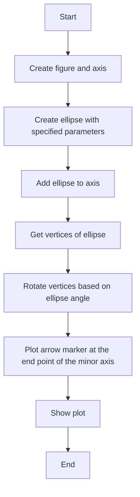
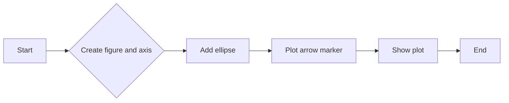
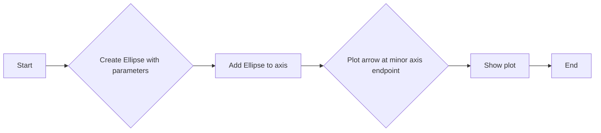
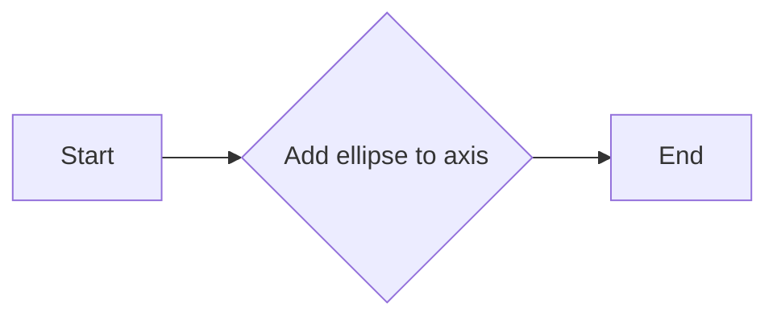
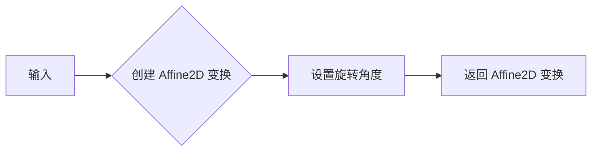

# `matplotlib\galleries\examples\shapes_and_collections\ellipse_arrow.py` 详细设计文档

This code demonstrates how to draw an ellipse with an orientation arrow using the matplotlib library in Python.

## 整体流程



## 类结构

```
Ellipse with orientation arrow demo (main script)
```

## 全局变量及字段


### `fig`
    
The main figure object where all the plots are drawn.

类型：`matplotlib.figure.Figure`
    


### `ax`
    
The axes object where the ellipse is drawn.

类型：`matplotlib.axes._subplots.AxesSubplot`
    


### `Ellipse.xy`
    
The center point of the ellipse (x, y).

类型：`tuple`
    


### `Ellipse.width`
    
The width of the ellipse.

类型：`float`
    


### `Ellipse.height`
    
The height of the ellipse.

类型：`float`
    


### `Ellipse.angle`
    
The rotation angle of the ellipse in degrees.

类型：`float`
    


### `Ellipse.facecolor`
    
The color of the face of the ellipse.

类型：`str`
    


### `Ellipse.edgecolor`
    
The color of the edge of the ellipse.

类型：`str`
    
    

## 全局函数及方法


### plt.subplots

`plt.subplots` 是 Matplotlib 库中的一个函数，用于创建一个图形和轴（Axes）的实例。

参数：

- `subplot_kw`：`dict`，关键字参数字典，用于传递给 `Subplot` 构造函数的参数。在这个例子中，它被设置为 `{"aspect": "equal"}`，这意味着轴的宽度和高度将被设置为相等，从而保持图形的纵横比。

返回值：`fig, ax`，一个图形对象和一个轴对象。

#### 流程图



#### 带注释源码

```python
import matplotlib.pyplot as plt

# Create a figure and axis with equal aspect ratio
fig, ax = plt.subplots(subplot_kw={"aspect": "equal"})

# Add an ellipse to the axis
ellipse = Ellipse(
    xy=(2, 4),
    width=30,
    height=20,
    angle=35,
    facecolor="none",
    edgecolor="b"
)
ax.add_patch(ellipse)

# Plot an arrow marker at the end point of the minor axis
vertices = ellipse.get_co_vertices()
t = Affine2D().rotate_deg(ellipse.angle)
ax.plot(
    vertices[0][0],
    vertices[0][1],
    color="b",
    marker=MarkerStyle(">", "full", t),
    markersize=10
)

# Show the plot
plt.show()
```


### Ellipse

This function demonstrates how to draw an ellipse with an orientation arrow, specifying its center, width, height, angle, and color.

参数：

- `xy`：`(float, float)`，The center coordinates of the ellipse.
- `width`：`float`，The width of the ellipse.
- `height`：`float`，The height of the ellipse.
- `angle`：`float`，The rotation angle of the ellipse.
- `facecolor`：`str`，The color of the ellipse face.
- `edgecolor`：`str`，The color of the ellipse edge.

返回值：`None`，This function does not return any value.

#### 流程图



#### 带注释源码

```python
import matplotlib.pyplot as plt
from matplotlib.markers import MarkerStyle
from matplotlib.patches import Ellipse
from matplotlib.transforms import Affine2D

# Create a figure and axis
fig, ax = plt.subplots(subplot_kw={"aspect": "equal"})

# Create an ellipse with specified parameters
ellipse = Ellipse(
    xy=(2, 4),
    width=30,
    height=20,
    angle=35,
    facecolor="none",
    edgecolor="b"
)

# Add the ellipse to the axis
ax.add_patch(ellipse)

# Plot an arrow marker at the end point of the minor axis
vertices = ellipse.get_co_vertices()
t = Affine2D().rotate_deg(ellipse.angle)
ax.plot(
    vertices[0][0],
    vertices[0][1],
    color="b",
    marker=MarkerStyle(">", "full", t),
    markersize=10
)

# Show the plot
plt.show()
```


### ax.add_patch(ellipse)

该函数将一个matplotlib.patches.Ellipse对象添加到当前的Axes对象中。

参数：

- `ellipse`：`Ellipse`，一个椭圆对象，用于在Axes对象中绘制。

返回值：无

#### 流程图



#### 带注释源码

```python
# Create a figure and axis
fig, ax = plt.subplots(subplot_kw={"aspect": "equal"})

# Create an ellipse object
ellipse = Ellipse(
    xy=(2, 4),
    width=30,
    height=20,
    angle=35,
    facecolor="none",
    edgecolor="b"
)

# Add the ellipse to the axis
ax.add_patch(ellipse)
```


### Affine2D.rotate_deg

`Affine2D.rotate_deg` 是一个方法，用于创建一个旋转的 Affine2D 变换。

参数：

- `angle`：`float`，旋转角度，以度为单位。

参数描述：`angle` 参数指定了旋转的角度，正值表示顺时针旋转，负值表示逆时针旋转。

返回值类型：`matplotlib.transforms.Affine2D`

返回值描述：返回一个旋转了指定角度的 Affine2D 变换对象。

#### 流程图



#### 带注释源码

```python
from matplotlib.transforms import Affine2D

# 创建 Affine2D 变换
affine = Affine2D()

# 设置旋转角度
affine.rotate_deg(35)

# 输出 Affine2D 变换
print(affine)
```


### ax.plot

This function is used to plot an arrow marker at the end point of the minor axis of an ellipse.

参数：

- `vertices[0][0]`：`float`，The x-coordinate of the end point of the minor axis of the ellipse.
- `vertices[0][1]`：`float`，The y-coordinate of the end point of the minor axis of the ellipse.
- `color`：`str`，The color of the arrow.
- `marker`：`MarkerStyle`，The style of the arrow marker.
- `markersize`：`int`，The size of the arrow marker.

返回值：`None`，This function does not return any value.

#### 流程图


#### 带注释源码

```python
# Plot an arrow marker at the end point of minor axis
vertices = ellipse.get_co_vertices()
t = Affine2D().rotate_deg(ellipse.angle)
ax.plot(
    vertices[0][0],
    vertices[0][1],
    color="b",
    marker=MarkerStyle(">", "full", t),
    markersize=10
)
```


### plt.show()

显示当前图形的窗口。

参数：

- 无

返回值：无

#### 流程图

```mermaid
graph LR
A[开始] --> B{调用plt.show()}
B --> C[结束]
```

#### 带注释源码

```python
plt.show()
```


### Ellipse.get_co_vertices

获取椭圆的顶点坐标。

参数：

- 无

返回值：`list`，包含椭圆四个顶点的坐标，每个坐标是一个包含两个元素的元组，分别代表x和y坐标。

#### 流程图

```mermaid
graph LR
A[Start] --> B{Ellipse.get_co_vertices()}
B --> C[Get vertices]
C --> D[Return vertices]
D --> E[End]
```

#### 带注释源码

```python
vertices = ellipse.get_co_vertices()
```


## 关键组件


### 张量索引与惰性加载

张量索引与惰性加载是深度学习框架中用于高效处理大型数据集的关键技术，它允许在需要时才计算数据，从而节省内存和提高计算效率。

### 反量化支持

反量化支持是深度学习模型优化中的一个重要特性，它允许模型在量化过程中保持较高的精度，从而在降低模型复杂度的同时保持性能。

### 量化策略

量化策略是深度学习模型压缩技术的一部分，它通过将模型中的浮点数转换为固定点数来减少模型大小和加速推理过程。


## 问题及建议


### 已知问题

-   **代码复用性低**：代码中绘制椭圆和箭头的逻辑是硬编码的，没有封装成可复用的函数或类。
-   **可配置性差**：椭圆的参数（如位置、大小、角度、颜色等）在代码中直接指定，缺乏外部配置或参数化机制。
-   **错误处理缺失**：代码中没有错误处理机制，如果matplotlib库或其功能不可用，可能会导致程序崩溃。
-   **文档不足**：代码注释较少，缺乏详细的文档说明，不利于其他开发者理解和使用。

### 优化建议

-   **封装成类或函数**：将绘制椭圆和箭头的逻辑封装成类或函数，提高代码复用性。
-   **增加配置参数**：为椭圆和箭头提供配置参数，允许用户自定义形状和样式。
-   **添加错误处理**：在代码中添加错误处理逻辑，确保在matplotlib库或其功能不可用时程序能够优雅地处理异常。
-   **完善文档**：编写详细的文档，包括代码的功能、使用方法、参数说明等，方便其他开发者理解和使用。
-   **使用配置文件**：考虑使用配置文件来存储椭圆和箭头的参数，以便于管理和修改。
-   **支持更多样式**：扩展代码以支持更多箭头样式和椭圆样式，如不同的线型、填充颜色等。
-   **单元测试**：编写单元测试以确保代码的稳定性和可靠性。


## 其它


### 设计目标与约束

- 设计目标：实现一个简单的椭圆与方向箭头的绘制示例，展示如何使用matplotlib库绘制椭圆及其方向箭头。
- 约束条件：使用matplotlib库进行图形绘制，不使用额外的图形库。

### 错误处理与异常设计

- 错误处理：代码中未包含显式的错误处理机制，但应确保matplotlib库的调用不会引发未处理的异常。
- 异常设计：未设计特定的异常处理机制，但应确保代码的健壮性，避免因外部因素导致的程序崩溃。

### 数据流与状态机

- 数据流：代码中数据流简单，从matplotlib库创建图形元素，然后进行绘制。
- 状态机：代码中没有状态转换，仅执行绘图操作。

### 外部依赖与接口契约

- 外部依赖：代码依赖于matplotlib库，需要确保该库已正确安装。
- 接口契约：matplotlib库的接口契约由其官方文档定义，代码应遵循这些契约进行操作。

### 测试与验证

- 测试策略：应编写单元测试来验证椭圆和方向箭头的绘制是否正确。
- 验证方法：通过比较实际绘制的图形与预期结果来验证代码的正确性。

### 性能考量

- 性能要求：代码应快速响应，绘制过程不应造成用户等待。
- 性能优化：由于代码简单，性能优化空间有限。

### 安全性考量

- 安全要求：代码应避免执行恶意操作，确保用户数据安全。
- 安全措施：代码中未涉及用户数据，因此安全性要求不高。

### 维护与扩展

- 维护策略：代码应具有良好的可读性和可维护性，便于后续修改和扩展。
- 扩展性：代码应设计为模块化，便于添加新的功能或修改现有功能。


    