# `matplotlib\galleries\examples\shapes_and_collections\ellipse_collection.py` 详细设计文档

This code generates a collection of ellipses using matplotlib and numpy, demonstrating the use of EllipseCollection for visual representation.

## 整体流程

```mermaid
graph TD
    A[Start] --> B[Import matplotlib.pyplot and numpy]
    B --> C[Define x and y ranges]
    C --> D[Create meshgrid for X and Y]
    D --> E[Calculate XY coordinates]
    E --> F[Calculate width (ww), height (hh), and angle (aa) for ellipses]
    F --> G[Create figure and axes]
    G --> H[Create EllipseCollection with calculated parameters]
    H --> I[Set array for color mapping based on X+Y values]
    I --> J[Add EllipseCollection to axes]
    J --> K[Set labels for axes]
    K --> L[Add colorbar with label]
    L --> M[Show plot]
    M --> N[End]
```

## 类结构

```
EllipseCollection (matplotlib.collections.EllipseCollection)
```

## 全局变量及字段


### `x`
    
Array of x-coordinates ranging from 0 to 9.

类型：`numpy.ndarray`
    


### `y`
    
Array of y-coordinates ranging from 0 to 14.

类型：`numpy.ndarray`
    


### `X`
    
Meshgrid of x-coordinates.

类型：`numpy.ndarray`
    


### `Y`
    
Meshgrid of y-coordinates.

类型：`numpy.ndarray`
    


### `XY`
    
Column stack of X and Y coordinates.

类型：`numpy.ndarray`
    


### `ww`
    
Widths of the ellipses, calculated as X divided by 10.0.

类型：`numpy.ndarray`
    


### `hh`
    
Heights of the ellipses, calculated as Y divided by 15.0.

类型：`numpy.ndarray`
    


### `aa`
    
Sizes of the ellipses, calculated as X times 9.

类型：`numpy.ndarray`
    


### `fig`
    
Figure object created by plt.subplots.

类型：`matplotlib.figure.Figure`
    


### `ax`
    
Axes object created by plt.subplots.

类型：`matplotlib.axes._subplots.AxesSubplot`
    


### `ec`
    
Ellipse collection object created by EllipseCollection.

类型：`matplotlib.collections.EllipseCollection`
    


### `cbar`
    
Colorbar object created by plt.colorbar.

类型：`matplotlib.colorbar.Colorbar`
    


### `EllipseCollection.units`
    
Units for the widths and heights of the ellipses.

类型：`str`
    


### `EllipseCollection.offsets`
    
Offset values for the ellipses.

类型：`numpy.ndarray`
    


### `EllipseCollection.offset_transform`
    
Transform for the offsets.

类型：`matplotlib.transforms.Transform`
    


### `EllipseCollection.set_array`
    
Method to set the data array for the color mapping.

类型：`numpy.ndarray`
    
    

## 全局函数及方法


### np.arange

`np.arange` 是 NumPy 库中的一个函数，用于生成一个沿指定轴的数组。

参数：

- `start`：`int`，数组的起始值。
- `stop`：`int`，数组的结束值（不包括）。
- `step`：`int`，步长，默认为 1。

返回值：`numpy.ndarray`，一个沿指定轴的数组。

#### 流程图

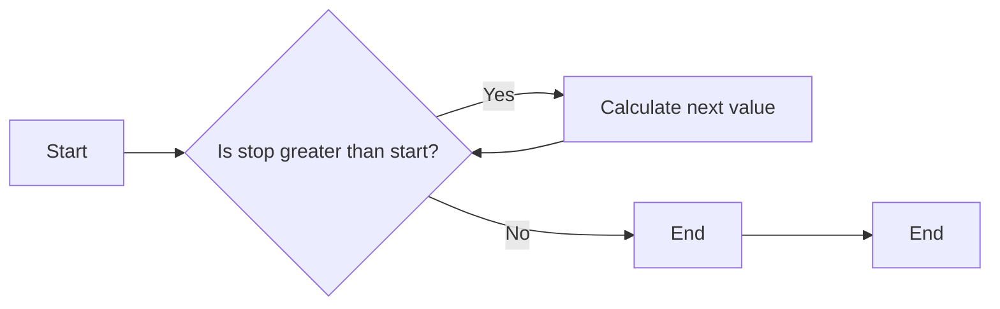

#### 带注释源码

```python
import numpy as np

# 生成一个从 0 到 9 的数组，步长为 1
x = np.arange(0, 10)

# 生成一个从 0 到 14 的数组，步长为 1
y = np.arange(0, 15)
```


### matplotlib.pyplot.subplots

`subplots` 是 matplotlib.pyplot 库中的一个函数，用于创建一个图形和一个轴。

参数：

- `figsize`：`tuple`，图形的大小（宽度和高度）。
- `dpi`：`int`，图形的分辨率（每英寸点数）。
- `facecolor`：`color`，图形的背景颜色。
- `frameon`：`bool`，是否显示图形的边框。
- `num`：`int`，要创建的轴的数量。
- `gridspec_kw`：`dict`，用于定义网格的参数。
- `constrained_layout`：`bool`，是否启用约束布局。

返回值：`Figure`，图形对象；`Axes`，轴对象。

#### 流程图

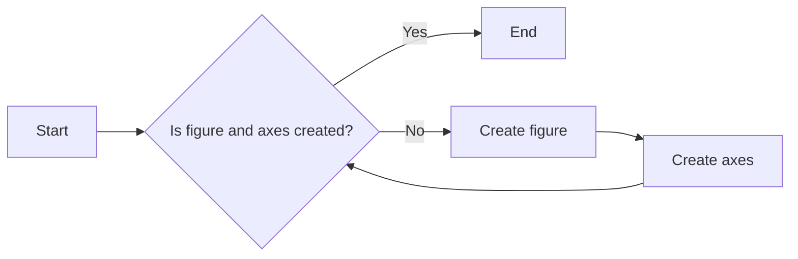

#### 带注释源码

```python
import matplotlib.pyplot as plt

# 创建一个图形和一个轴
fig, ax = plt.subplots()
```


### matplotlib.collections.EllipseCollection

`EllipseCollection` 是 matplotlib.collections 库中的一个类，用于创建一个椭圆集合。

参数：

- `x`：`array_like`，椭圆中心的 x 坐标。
- `y`：`array_like`，椭圆中心的 y 坐标。
- `widths`：`array_like`，椭圆的宽度。
- `heights`：`array_like`，椭圆的高度。
- `angles`：`array_like`，椭圆的角度。
- `units`：`str`，坐标的单位。
- `offsets`：`array_like`，偏移量。
- `offset_transform`：`Transform`，偏移量的转换。
- `colors`：`array_like`，颜色。
- `alpha`：`float`，透明度。
- `minsep`：`float`，最小分离距离。
- `mintheta`：`float`，最小角度。
- `maxtheta`：`float`，最大角度。
- `clip_on`：`bool`，是否启用裁剪。

#### 流程图

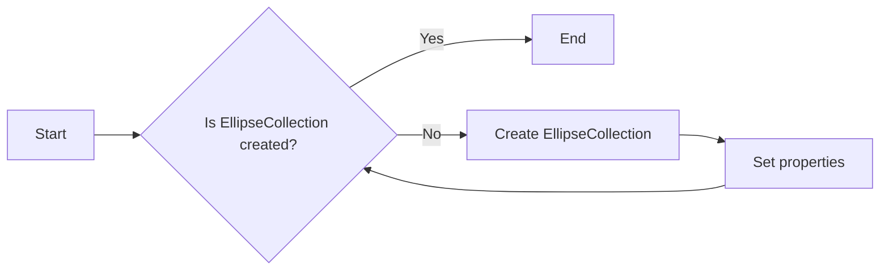

#### 带注释源码

```python
from matplotlib.collections import EllipseCollection

# 创建一个椭圆集合
ec = EllipseCollection(ww, hh, aa, units='x', offsets=XY,
                       offset_transform=ax.transData)
```


### matplotlib.axes.Axes.add_collection

`add_collection` 是 matplotlib.axes 库中的一个方法，用于将一个集合添加到轴上。

参数：

- `collection`：`Collection`，要添加的集合。

#### 流程图

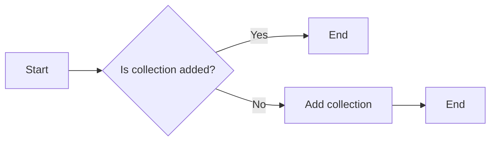

#### 带注释源码

```python
# 将椭圆集合添加到轴上
ax.add_collection(ec)
```


### matplotlib.pyplot.colorbar

`colorbar` 是 matplotlib.pyplot 库中的一个函数，用于创建一个颜色条。

参数：

- `mappable`：`ScalarMappable`，颜色映射对象。
- `orientation`：`str`，颜色条的方向。
- `ax`：`Axes`，轴对象。
- `fraction`：`float`，颜色条相对于轴的大小。
- `pad`：`float`，颜色条与轴之间的间距。
- `aspect`：`float`，颜色条的纵横比。

#### 流程图

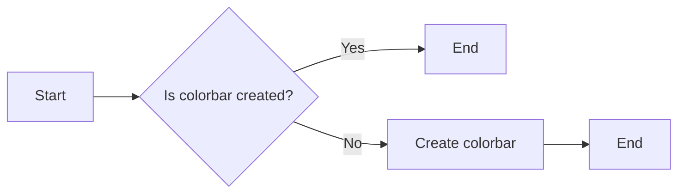

#### 带注释源码

```python
# 创建一个颜色条
cbar = plt.colorbar(ec)
```


### matplotlib.pyplot.show

`show` 是 matplotlib.pyplot 库中的一个函数，用于显示图形。

#### 流程图


#### 带注释源码

```python
# 显示图形
plt.show()
```


### 关键组件信息

- NumPy：用于数值计算和大型多维数组的库。
- Matplotlib：用于创建静态、交互式和动画可视化图表的库。
- EllipseCollection：用于创建椭圆集合的类。
- Axes：用于创建轴的类。
- Colorbar：用于创建颜色条的类。


### 潜在的技术债务或优化空间

- 代码中使用了硬编码的数值，例如椭圆的宽度和高度。这些值应该根据实际需求进行调整，以提高代码的灵活性和可维护性。
- 代码中没有使用异常处理来处理可能出现的错误，例如输入参数的类型错误或值错误。添加异常处理可以提高代码的健壮性。
- 代码中没有使用日志记录来记录程序的执行过程。添加日志记录可以帮助调试和监控程序的运行。


### 设计目标与约束

- 设计目标：创建一个能够绘制椭圆集合的函数。
- 约束：使用 NumPy 和 Matplotlib 库。


### 错误处理与异常设计

- 代码中没有使用异常处理来处理可能出现的错误。
- 建议添加异常处理来捕获和处理错误，例如输入参数的类型错误或值错误。


### 数据流与状态机

- 数据流：输入参数（start、stop、step）通过 `np.arange` 函数生成一个数组，然后通过 `EllipseCollection` 类创建一个椭圆集合，最后通过 `add_collection` 方法将椭圆集合添加到轴上。
- 状态机：代码中没有使用状态机。


### 外部依赖与接口契约

- NumPy 和 Matplotlib 是外部依赖。
- NumPy 和 Matplotlib 提供了相应的接口契约，例如 `np.arange` 函数和 `EllipseCollection` 类。
```


### np.meshgrid

`np.meshgrid` 是一个 NumPy 函数，用于生成网格数据，它将输入的数组转换为二维网格。

参数：

- `x`：`numpy.ndarray`，表示 x 轴上的数据。
- `y`：`numpy.ndarray`，表示 y 轴上的数据。

参数描述：

- `x` 和 `y` 是输入的数组，它们可以是相同长度的数组，也可以是不同长度的数组。

返回值：`numpy.ndarray`，包含网格数据的数组。

返回值描述：

- 返回的数组是一个二维数组，其中每个元素对应于输入数组中的一个点。

#### 流程图

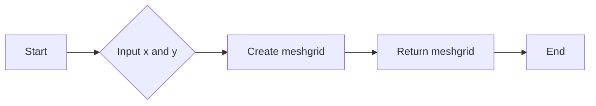

#### 带注释源码

```python
import numpy as np

# 创建 x 和 y 轴上的数据
x = np.arange(10)
y = np.arange(15)

# 使用 np.meshgrid 创建网格数据
X, Y = np.meshgrid(x, y)

# 打印网格数据
print("X:\n", X)
print("Y:\n", Y)
```


### np.column_stack

np.column_stack 是 NumPy 库中的一个函数，用于将一系列数组列堆叠成一个二维数组。

参数：

- `arrays`：一个数组或数组序列，每个数组将被视为一行。

返回值：`{返回值类型}`，一个二维数组，其中每个元素都是输入数组中相应位置的元素。

#### 流程图

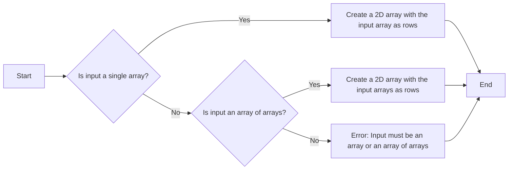

#### 带注释源码

```python
import numpy as np

def np_column_stack(arrays):
    """
    Stack 1-D arrays in sequence horizontally to form a 2-D array.
    
    Parameters
    ----------
    arrays : array_like
        An array or sequence of arrays. Each array must have the same shape, except
        in the last dimension, which can be increased by the number of arrays to be
        stacked.
    
    Returns
    -------
    out : ndarray
        The stacked array.
    
    Raises
    ------
    ValueError
        If the input arrays do not have the same shape, except in the last dimension.
    
    Examples
    --------
    >>> a = np.array([1, 2, 3])
    >>> b = np.array([4, 5, 6])
    >>> np.column_stack((a, b))
    array([[1, 4],
           [2, 5],
           [3, 6]])
    """
    return np.column_stack(arrays)
```


### plt.subplots

`plt.subplots` 是一个用于创建一个或多个子图的函数。

参数：

- `figsize`：`tuple`，指定整个图形的大小（宽度和高度），单位为英寸。
- `dpi`：`int`，指定图形的分辨率，单位为每英寸点数。
- `facecolor`：`color`，指定图形的背景颜色。
- `edgecolor`：`color`，指定图形的边缘颜色。
- `frameon`：`bool`，指定是否显示图形的边框。
- `num`：`int`，指定要创建的子图数量。
- `gridspec_kw`：`dict`，指定网格规格的参数。
- `constrained_layout`：`bool`，指定是否启用约束布局。
- `sharex`：`bool`，指定是否共享x轴。
- `sharey`：`bool`，指定是否共享y轴。
- `sharewx`：`bool`，指定是否共享宽x轴。
- `sharewy`：`bool`，指定是否共享宽y轴。
- `subplot_kw`：`dict`，指定子图的关键字参数。

返回值：`Figure`，包含子图的图形对象。

#### 流程图

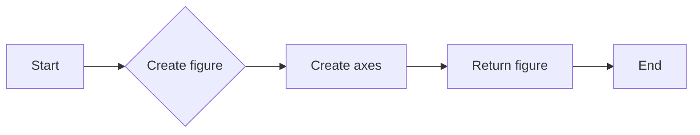

#### 带注释源码

```python
fig, ax = plt.subplots()
```

在这个例子中，`plt.subplots` 被用来创建一个图形对象 `fig` 和一个轴对象 `ax`。图形对象 `fig` 包含了所有的子图，而轴对象 `ax` 被用来添加图形元素，如线条、标记和文本等。


### plt.colorbar

`plt.colorbar` 是一个用于显示颜色条的全局函数，它通常与matplotlib的`EllipseCollection`一起使用，以显示颜色条与图形元素（如椭圆）关联的值。

参数：

- `mappable`：`matplotlib.cm.ScalarMappable`，颜色条关联的映射对象，通常是`EllipseCollection`实例。
- `ax`：`matplotlib.axes.Axes`，颜色条要添加的轴对象，默认为当前轴。
- `fraction`：`float`，颜色条相对于轴的宽度比例，默认为0.05。
- `pad`：`float`，颜色条与轴之间的填充距离，默认为0.05。
- `aspect`：`float`，颜色条的高度与宽度的比例，默认为30。

返回值：`matplotlib.colorbar.Colorbar`，颜色条对象。

#### 流程图

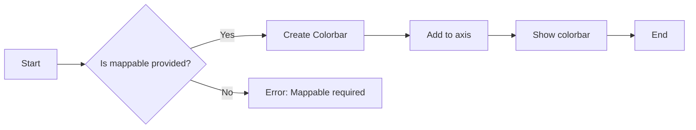

#### 带注释源码

```python
cbar = plt.colorbar(ec)
# 创建颜色条对象，关联到 EllipseCollection 实例 ec
# cbar.set_label('X+Y')  # 设置颜色条的标签
```


### plt.show()

`plt.show()` 是一个全局函数，用于显示当前图形。

参数：

- 无

返回值：无

#### 流程图

```mermaid
graph LR
A[Start] --> B[Call plt.show()]
B --> C[End]
```

#### 带注释源码

```python
plt.show()
```


### matplotlib.pyplot.pyplot

`plt.show()` 是 `matplotlib.pyplot` 模块中的一个全局函数，用于显示当前图形。

参数：

- 无

返回值：无

#### 流程图

```mermaid
graph LR
A[Start] --> B[Call plt.pyplot.show()]
B --> C[End]
```

#### 带注释源码

```python
import matplotlib.pyplot as plt

# ... (previous code)

plt.show()
```


### EllipseCollection.__init__

初始化一个椭圆集合对象。

参数：

- `ww`：`numpy.ndarray`，椭圆的宽度，单位为x。
- `hh`：`numpy.ndarray`，椭圆的高度，单位为x。
- `aa`：`numpy.ndarray`，椭圆的旋转角度，单位为度。
- `units`：`str`，指定宽度和高度的单位，默认为'x'。
- `offsets`：`numpy.ndarray`，椭圆的偏移量，形状为(n, 2)，其中n是椭圆的数量。
- `offset_transform`：`matplotlib.transforms.Transform`，偏移量的转换，默认为None。

返回值：无

#### 流程图

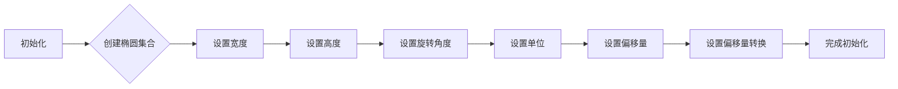

#### 带注释源码

```python
import numpy as np
from matplotlib.collections import EllipseCollection

def __init__(self, ww, hh, aa, units='x', offsets=None, offset_transform=None):
    # 创建椭圆集合
    self.ec = EllipseCollection(ww, hh, aa, units=units, offsets=offsets, offset_transform=offset_transform)
    # 设置椭圆集合的属性
    self.set_array((X + Y).ravel())
    # 添加椭圆集合到轴
    ax.add_collection(self.ec)
``` 


### EllipseCollection.set_array

设置椭圆集合的数组。

参数：

- `array`：`numpy.ndarray`，要设置的数组。该数组将用于确定椭圆的颜色映射。

返回值：无

#### 流程图

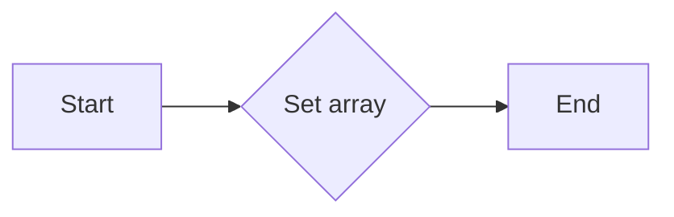

#### 带注释源码

```python
ec.set_array((X + Y).ravel())
```

在这段代码中，`ec` 是一个 `EllipseCollection` 对象，它被创建并初始化。`set_array` 方法被调用来设置椭圆的颜色映射。参数 `(X + Y).ravel()` 是一个 NumPy 数组，它将用于确定每个椭圆的颜色。`ravel()` 方法用于将多维数组转换为一维数组，这是 `set_array` 方法所期望的输入格式。


## 关键组件


### 张量索引与惰性加载

张量索引与惰性加载允许在绘制椭圆集合时，仅对需要显示的椭圆进行计算和渲染，从而提高性能。

### 反量化支持

反量化支持确保在量化过程中，可以正确地处理和转换数据，以保持精度和性能。

### 量化策略

量化策略定义了如何将浮点数数据转换为固定点数表示，以减少内存使用和提高计算效率。


## 问题及建议


### 已知问题

-   **代码复用性低**：代码中使用了硬编码的数值（如10和15）来定义椭圆的大小和位置，这降低了代码的可复用性。
-   **缺乏注释**：代码中缺少必要的注释，使得理解代码逻辑和功能变得困难。
-   **全局变量**：在代码中直接使用全局变量（如`x`和`y`），这可能导致代码难以维护和测试。
-   **依赖性**：代码依赖于`matplotlib`库，这可能会限制代码在其他环境中的运行。

### 优化建议

-   **参数化**：将硬编码的数值替换为参数，以提高代码的灵活性和可复用性。
-   **添加注释**：在代码中添加注释，以解释代码的功能和逻辑。
-   **使用局部变量**：将全局变量替换为局部变量，以减少全局状态的影响。
-   **模块化**：将代码分解为更小的函数或模块，以提高代码的可读性和可维护性。
-   **文档化**：编写文档，说明代码的功能、使用方法和依赖性。
-   **异常处理**：添加异常处理，以处理可能出现的错误情况。
-   **测试**：编写单元测试，以确保代码的正确性和稳定性。


## 其它


### 设计目标与约束

- 设计目标：实现一个简洁且高效的椭圆集合绘制功能，利用matplotlib库的EllipseCollection类。
- 约束条件：代码应尽可能简洁，避免使用额外的库，且需兼容matplotlib库。

### 错误处理与异常设计

- 错误处理：代码中应包含异常处理机制，以应对绘图过程中可能出现的错误，如matplotlib库版本不兼容等。
- 异常设计：定义自定义异常类，用于处理特定错误情况，如绘制失败等。

### 数据流与状态机

- 数据流：输入数据为x和y的数组，通过np.meshgrid生成网格点，然后计算每个点的椭圆参数。
- 状态机：代码执行过程中，状态从初始化到绘制完成，包括创建图形、添加集合、设置标签等步骤。

### 外部依赖与接口契约

- 外部依赖：代码依赖于matplotlib和numpy库。
- 接口契约：matplotlib库的EllipseCollection类和Axes.add_collection方法提供接口契约，用于绘制椭圆集合。


    