# `matplotlib\galleries\examples\shapes_and_collections\ellipse_demo.py` 详细设计文档

This code generates and displays multiple ellipses with random properties using the matplotlib library.

## 整体流程

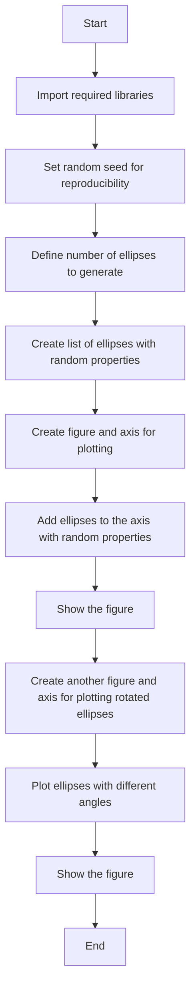

## 类结构

```
Ellipse_Demo (主模块)
```

## 全局变量及字段


### `NUM`
    
Number of ellipses to draw.

类型：`int`
    


### `ells`
    
List of Ellipse objects to be drawn.

类型：`list of matplotlib.patches.Ellipse`
    


### `fig`
    
The figure object containing the plot.

类型：`matplotlib.figure.Figure`
    


### `ax`
    
The axes object containing the plot.

类型：`matplotlib.axes._subplots.AxesSubplot`
    


### `angle_step`
    
Step size for the angles of the ellipses in degrees.

类型：`int`
    


### `angles`
    
Array of angles for the ellipses in degrees.

类型：`numpy.ndarray`
    


### `Ellipse.Ellipse.xy`
    
The center of the ellipse (x, y).

类型：`tuple of float`
    


### `Ellipse.Ellipse.width`
    
The width of the ellipse.

类型：`float`
    


### `Ellipse.Ellipse.height`
    
The height of the ellipse.

类型：`float`
    


### `Ellipse.Ellipse.angle`
    
The rotation angle of the ellipse in degrees.

类型：`float`
    


### `Ellipse.Ellipse.alpha`
    
The alpha value for the ellipse, controlling its transparency.

类型：`float`
    


### `Ellipse.Ellipse.facecolor`
    
The face color of the ellipse.

类型：`tuple of float`
    
    

## 全局函数及方法


### np.random.seed

设置NumPy随机数生成器的种子，以确保每次运行代码时生成的随机数序列相同。

参数：

- `seed`：`int`，用于初始化随机数生成器的种子值。

返回值：无

#### 流程图

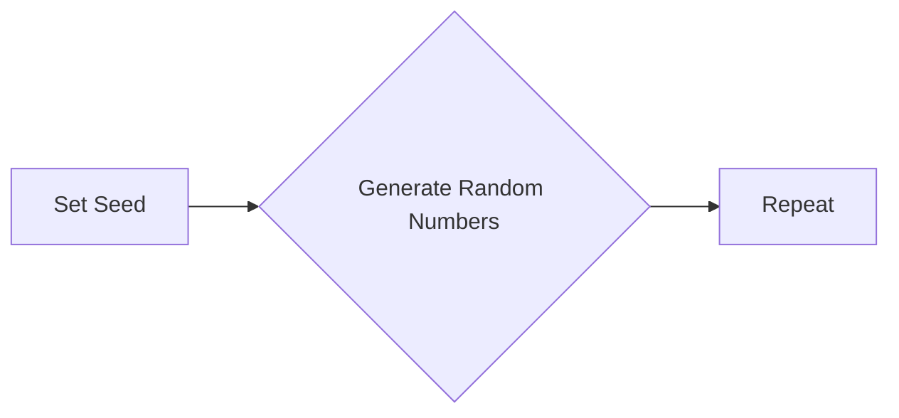

#### 带注释源码

```python
# Fixing random state for reproducibility
np.random.seed(19680801)
```


### np.random.seed

设置随机数生成器的种子，以确保每次运行代码时结果的可重复性。

参数：

- `seed`：`int`，用于初始化随机数生成器的种子值。

返回值：无

#### 流程图

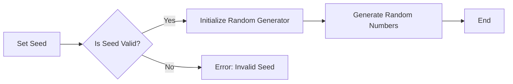

#### 带注释源码

```python
np.random.seed(19680801)
```


### np.random.rand

生成一个或多个在[0, 1)范围内的伪随机浮点数。

参数：

- `*args`：`int`，指定生成随机数的数量和维度。
- `dtype`：`dtype`，可选，指定返回值的类型。

返回值：`float`，生成的随机浮点数。

#### 流程图

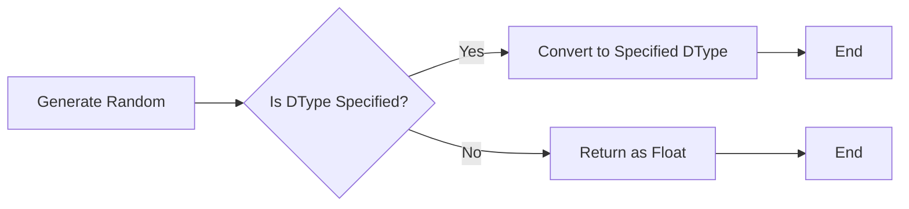

#### 带注释源码

```python
np.random.rand(2) * 10
```


### Ellipse

matplotlib.patches.Ellipse 类用于创建椭圆形状。

参数：

- `xy`：`tuple`，椭圆中心的坐标。
- `width`：`float`，椭圆的宽度。
- `height`：`float`，椭圆的高度。
- `angle`：`float`，椭圆旋转的角度。

返回值：`Ellipse` 对象。

#### 流程图

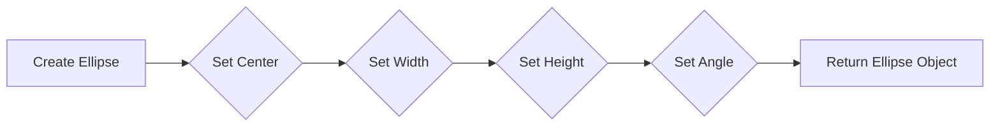

#### 带注释源码

```python
Ellipse(xy=np.random.rand(2) * 10,
         width=np.random.rand(), height=np.random.rand(),
         angle=np.random.rand() * 360)
```


### plt.subplots

创建一个新的图形和一个轴。

参数：

- `figsize`：`tuple`，图形的大小。
- `dpi`：`int`，图形的分辨率。
- `facecolor`：`color`，图形的背景颜色。
- `num`：`int`，可选，创建的轴的数量。

返回值：`Figure` 对象和 `Axes` 对象。

#### 流程图

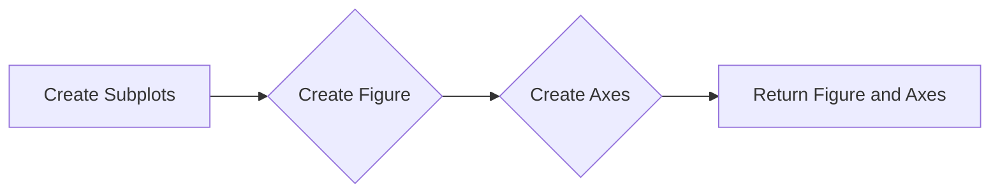

#### 带注释源码

```python
fig, ax = plt.subplots()
```


### ax.set

设置轴的属性。

参数：

- `xlim`：`tuple`，轴的 x 轴限制。
- `ylim`：`tuple`，轴的 y 轴限制。
- `aspect`：`str`，轴的纵横比。

#### 流程图

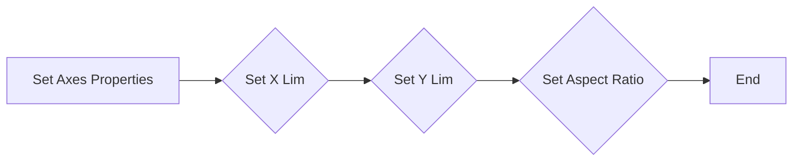

#### 带注释源码

```python
ax.set(xlim=(0, 10), ylim=(0, 10), aspect="equal")
```


### ax.add_artist

向轴添加一个艺术家。

参数：

- `artist`：`Artist` 对象，要添加到轴上的艺术家。

#### 流程图

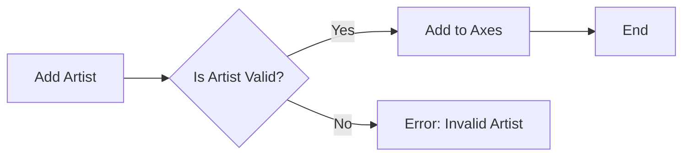

#### 带注释源码

```python
ax.add_artist(e)
```


### e.set_clip_box

设置艺术家的裁剪框。

参数：

- `box`：`Bbox` 对象，艺术家的裁剪框。

#### 流程图

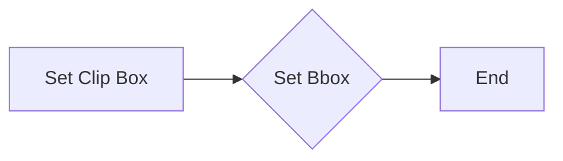

#### 带注释源码

```python
e.set_clip_box(ax.bbox)
```


### e.set_alpha

设置艺术家的透明度。

参数：

- `alpha`：`float`，艺术家的透明度。

#### 流程图

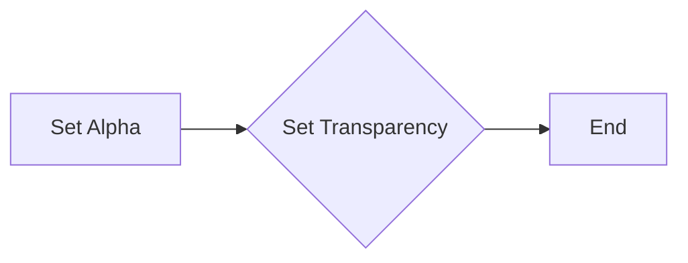

#### 带注释源码

```python
e.set_alpha(np.random.rand())
```


### e.set_facecolor

设置艺术家的面颜色。

参数：

- `color`：`color`，艺术家的面颜色。

#### 流程图

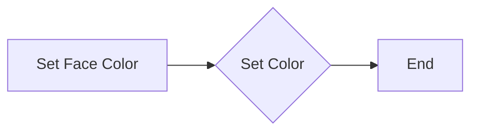

#### 带注释源码

```python
e.set_facecolor(np.random.rand(3))
```


### plt.show

显示图形。

参数：无

返回值：无

#### 流程图

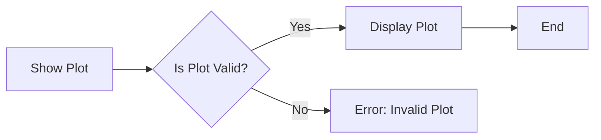

#### 带注释源码

```python
plt.show()
```


### Ellipse(xy, width, height, angle, **kwargs)

Ellipse 类的构造函数，用于创建一个椭圆对象。

参数：

- `xy`：`tuple`，椭圆中心的坐标，格式为 (x, y)。
- `width`：`float`，椭圆的宽度。
- `height`：`float`，椭圆的高度。
- `angle`：`float`，椭圆旋转的角度，单位为度。

返回值：`None`，无返回值。

#### 流程图

```mermaid
graph LR
A[Ellipse(xy, width, height, angle, **kwargs)] --> B{创建椭圆对象}
B --> C[结束]
```

#### 带注释源码

```python
from matplotlib.patches import Ellipse

def Ellipse(xy, width, height, angle, **kwargs):
    # 创建椭圆对象
    ellipse = Ellipse(xy=xy, width=width, height=height, angle=angle, **kwargs)
    return ellipse
```


### plt.subplots

`plt.subplots` 是 Matplotlib 库中的一个函数，用于创建一个图形和一个轴（Axes）对象。

参数：

- `figsize`：`tuple`，图形的大小（宽度和高度），默认为 (6, 4)。
- `dpi`：`int`，图形的分辨率，默认为 100。
- `facecolor`：`color`，图形的背景颜色，默认为 'white'。
- `edgecolor`：`color`，图形的边缘颜色，默认为 'none'。
- `frameon`：`bool`，是否显示图形的边框，默认为 True。
- `num`：`int`，轴的数量，默认为 1。
- `gridspec_kw`：`dict`，用于 GridSpec 的关键字参数。
- `constrained_layout`：`bool`，是否启用约束布局，默认为 False。

返回值：`Figure` 对象和 `Axes` 对象的元组。

#### 流程图

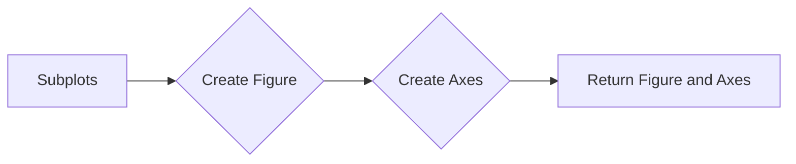

#### 带注释源码

```
fig, ax = plt.subplots()
# fig: 创建一个图形对象
# ax: 创建一个轴对象，用于绘制图形
```


### ax.set

`ax.set` 是一个方法，用于设置matplotlib图形的轴限制和比例。

参数：

- `xlim`：`tuple`，指定x轴的显示范围。
- `ylim`：`tuple`，指定y轴的显示范围。
- `aspect`：`str`，指定轴的比例，可以是 "equal" 或 "auto"。

返回值：`None`，该方法不返回任何值。

#### 流程图

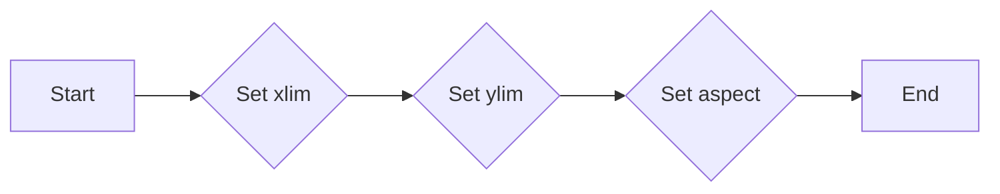

#### 带注释源码

```python
fig, ax = plt.subplots()
ax.set(xlim=(0, 10), ylim=(0, 10), aspect="equal")
```


### matplotlib.axes.Axes.add_artist

`add_artist` 方法用于向 `Axes` 对象中添加一个 `Artist` 对象。

参数：

- `artist`：`Artist`，要添加到 `Axes` 对象中的艺术家对象。在这个例子中，艺术家对象是一个 `Ellipse` 对象。

返回值：无

#### 流程图

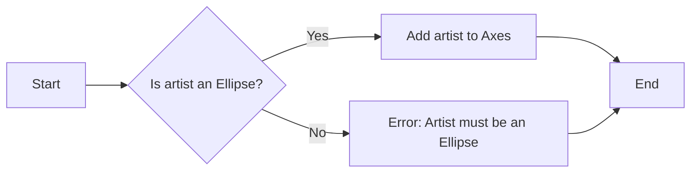

#### 带注释源码

```python
# 假设 ax 是一个 matplotlib.axes.Axes 对象
# e 是一个 matplotlib.patches.Ellipse 对象

# 向 ax 中添加椭圆 e
ax.add_artist(e)
```


### plt.show()

显示当前图形的界面。

参数：

- 无

返回值：无

#### 流程图

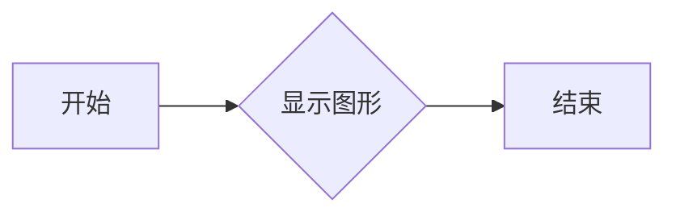

#### 带注释源码

```python
plt.show()
```


### matplotlib.pyplot.pyplot

显示当前图形的界面。

参数：

- 无

返回值：无

#### 流程图


#### 带注释源码

```python
import matplotlib.pyplot as plt

plt.show()
```


### matplotlib.pyplot.subplot

创建一个子图。

参数：

- `nrows`：行数
- `ncols`：列数
- `sharex`：是否共享x轴
- `sharey`：是否共享y轴
- `fig`：父图对象

返回值：子图对象

#### 流程图

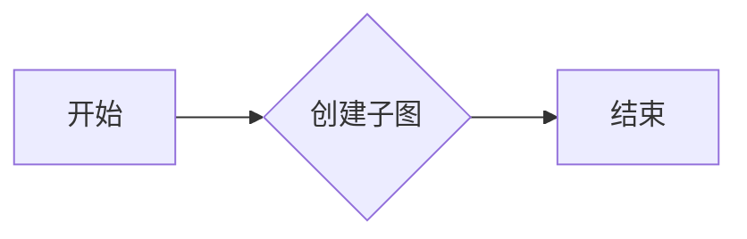

#### 带注释源码

```python
import matplotlib.pyplot as plt

fig, ax = plt.subplots()
```


### matplotlib.patches.Ellipse

创建一个椭圆。

参数：

- `xy`：椭圆中心的坐标
- `width`：椭圆的宽度
- `height`：椭圆的高度
- `angle`：椭圆的角度

返回值：椭圆对象

#### 流程图

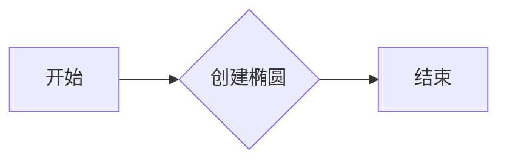

#### 带注释源码

```python
from matplotlib.patches import Ellipse

e = Ellipse(xy=np.random.rand(2) * 10,
            width=np.random.rand(), height=np.random.rand(),
            angle=np.random.rand() * 360)
```


### matplotlib.axes.Axes.add_artist

向子图添加一个艺术家。

参数：

- `artist`：艺术家对象

返回值：无

#### 流程图

```mermaid
graph LR
A[开始] --> B{添加艺术家}
B --> C[结束]
```

#### 带注释源码

```python
fig, ax = plt.subplots()
ax.add_artist(e)
```


### Ellipse.set_clip_box

`Ellipse.set_clip_box` 方法用于设置椭圆的裁剪框。

参数：

- `clip_box`：`matplotlib.transforms.Bbox`，裁剪框的边界，用于限制椭圆的绘制区域。

返回值：无

#### 流程图

```mermaid
graph LR
A[Ellipse.set_clip_box] --> B{设置裁剪框}
B --> C[绘制椭圆]
```

#### 带注释源码

```python
# Ellipse 类定义
class Ellipse(Patch):
    # ...

    # 设置椭圆的裁剪框
    def set_clip_box(self, clip_box):
        """
        Set the clip box for the ellipse.

        Parameters
        ----------
        clip_box : matplotlib.transforms.Bbox
            The clip box for the ellipse.

        Returns
        -------
        None
        """
        self._clip_box = clip_box
        self._update()
``` 


### Ellipse.set_alpha

设置椭圆的透明度。

参数：

- `alpha`：`float`，透明度值，范围从0（完全透明）到1（完全不透明）。

返回值：`None`，无返回值。

#### 流程图

```mermaid
graph LR
A[Ellipse.set_alpha(alpha)] --> B{透明度值是否在0到1之间?}
B -- 是 --> C[设置椭圆透明度为alpha]
B -- 否 --> D[抛出异常]
C --> E[结束]
D --> E
```

#### 带注释源码

```python
# Ellipse.set_alpha(alpha)
# 设置椭圆的透明度。
e.set_alpha(np.random.rand())
```


### Ellipse.set_facecolor

设置椭圆的填充颜色。

参数：

- `color`：`str` 或 `tuple`，指定颜色。可以是颜色名称、RGB值或RGBA值。

返回值：`None`，无返回值。

#### 流程图

```mermaid
graph LR
A[Ellipse.set_facecolor] --> B{设置颜色}
B --> C[完成]
```

#### 带注释源码

```python
# Ellipse.set_facecolor 方法被调用在以下代码行中：
e.set_facecolor(np.random.rand(3))

# 其中 e 是 Ellipse 对象，np.random.rand(3) 生成一个长度为 3 的随机数组，表示 RGBA 颜色值。
```


## 关键组件


### 张量索引

张量索引用于访问和操作多维数组（张量）中的元素。

### 惰性加载

惰性加载是一种延迟计算或初始化数据的技术，直到实际需要时才进行。

### 反量化支持

反量化支持允许在量化过程中恢复原始数据精度。

### 量化策略

量化策略定义了如何将浮点数数据转换为固定点数表示，以减少计算资源消耗。


## 问题及建议


### 已知问题

-   **代码重复性**：代码中存在重复的绘图逻辑，特别是在绘制多个椭圆和旋转椭圆的部分。这可能导致维护困难，如果绘图逻辑需要修改。
-   **随机性**：代码中使用了随机数生成来创建椭圆的位置、大小和角度，这可能导致可重复性差。如果需要重现结果，需要确保随机数生成器的种子是可预测的。
-   **全局变量**：代码中使用了全局变量 `NUM` 来控制椭圆的数量，这可能导致代码的可读性和可维护性降低。

### 优化建议

-   **代码重构**：将重复的绘图逻辑提取到函数中，以提高代码的可读性和可维护性。
-   **随机数生成**：确保随机数生成器的种子在代码开始时设置，以便结果可重现。
-   **参数化**：将 `NUM` 和其他绘图参数作为函数参数传递，而不是使用全局变量，以提高代码的灵活性和可测试性。
-   **异常处理**：添加异常处理来捕获可能发生的错误，例如绘图库的异常。
-   **文档**：为代码添加更详细的文档，包括函数和类的用途、参数和返回值。


## 其它


### 设计目标与约束

- 设计目标：实现一个能够绘制多个椭圆的图形界面，展示椭圆的不同属性和效果。
- 约束条件：使用matplotlib库进行图形绘制，确保代码的可读性和可维护性。

### 错误处理与异常设计

- 错误处理：在代码中未发现明显的错误处理机制，但应考虑在图形绘制过程中可能出现的异常，如matplotlib库版本不兼容等。
- 异常设计：在关键操作前添加异常捕获，确保程序在遇到错误时能够优雅地处理。

### 数据流与状态机

- 数据流：程序首先生成多个椭圆对象，然后通过matplotlib库进行绘制。
- 状态机：程序没有明显的状态转换，主要执行绘制操作。

### 外部依赖与接口契约

- 外部依赖：程序依赖于matplotlib和numpy库。
- 接口契约：matplotlib库提供了绘制椭圆的接口，numpy库用于生成随机数。


    