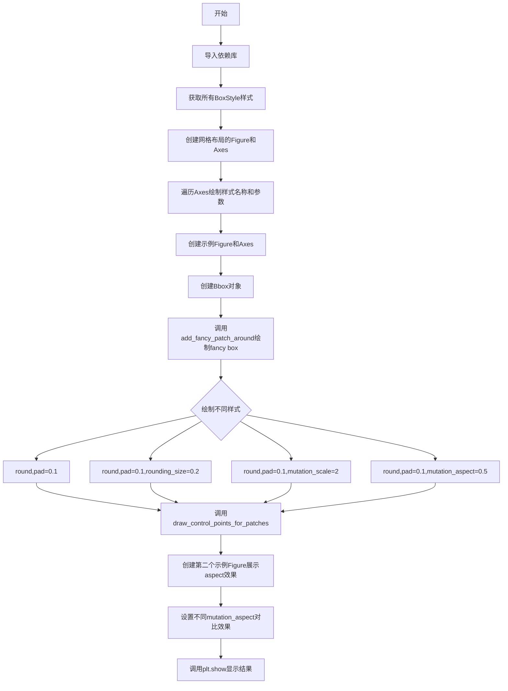
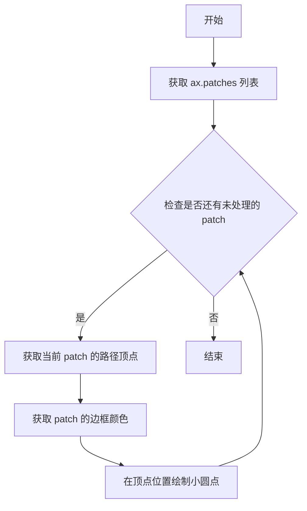

# `matplotlib\galleries\examples\shapes_and_collections\fancybox_demo.py` 详细设计文档

该代码是Matplotlib的示例程序，演示如何使用FancyBboxPatch绘制具有不同视觉属性的精美边框盒子，包括各种盒式样式、圆角参数、突变缩放和宽高比调整等功能。

## 整体流程



## 类结构

```
Matplotlib Built-in Classes (无自定义类)
├── matplotlib.patches.FancyBboxPatch
├── matplotlib.patches.BoxStyle
├── matplotlib.transforms.Bbox
├── matplotlib.figure.Figure
├── matplotlib.axes.Axes
└── ...
```

## 全局变量及字段


### `styles`
    
BoxStyle.get_styles()返回的所有样式字典，键为样式名称，值为对应的样式类

类型：`dict[str, type]`
    


### `ncol`
    
网格列数，固定值为2，用于布局子图

类型：`int`
    


### `nrow`
    
网格行数，根据样式数量计算得出，用于布局子图

类型：`int`
    


### `axs`
    
第一个示例的Axes数组，通过subplots()返回的子图网格

类型：`numpy.ndarray`
    


### `bb`
    
Bbox对象，定义盒子的位置和尺寸，格式为[[x0, y0], [x1, y1]]

类型：`matplotlib.transforms.Bbox`
    


### `fig`
    
Figure对象，表示整个图形窗口

类型：`matplotlib.figure.Figure`
    


### `axs`
    
第二个示例的2x2 Axes数组，用于展示不同参数效果

类型：`numpy.ndarray`
    


### `ax1`
    
用于aspect对比的左侧Axes对象，aspect=2且mutation_aspect=1

类型：`matplotlib.axes.Axes`
    


### `ax2`
    
用于aspect对比的右侧Axes对象，aspect=2且mutation_aspect=0.5

类型：`matplotlib.axes.Axes`
    


### `fancy`
    
FancyBboxPatch对象，用于绘制花哨的边框盒子

类型：`matplotlib.patches.FancyBboxPatch`
    


    

## 全局函数及方法


### `add_fancy_patch_around`

该函数用于在给定的Bbox周围添加一个装饰性的边框（FancyBboxPatch），默认使用淡紫色半透明的填充和边框颜色，并支持通过kwargs参数自定义外观属性。

参数：

- `ax`：`matplotlib.axes.Axes`，axes对象，用于将创建的FancyBboxPatch添加到图表中
- `bb`：`matplotlib.transforms.Bbox`，边界框对象，定义装饰框的大小和位置
- `**kwargs`：可变关键字参数，用于传递给FancyBboxPatch的额外参数（如boxstyle、mutation_scale等）

返回值：`matplotlib.patches.FancyBboxPatch`，返回创建的装饰框对象，可用于后续修改

#### 流程图

```mermaid
flowchart TD
    A[开始 add_fancy_patch_around] --> B[接收参数 ax, bb, **kwargs]
    B --> C[合并默认参数和用户参数]
    C --> D{默认参数}
    D -->|facecolor| E[设置为淡紫色半透明<br/>rgba(1, 0.8, 1, 0.5)]
    D -->|edgecolor| F[设置为淡粉色半透明<br/>rgba(1, 0.5, 1, 0.5)]
    E --> G[使用bb.p0作为起点<br/>bb.width作为宽度<br/>bb.height作为高度]
    F --> G
    G --> H[创建FancyBboxPatch实例]
    H --> I[调用ax.add_patch将patch添加到axes]
    I --> J[返回创建的fancy对象]
    J --> K[结束]
```

#### 带注释源码

```python
def add_fancy_patch_around(ax, bb, **kwargs):
    """
    在给定的Bbox周围添加FancyBboxPatch装饰框
    
    参数:
        ax: matplotlib.axes.Axes - axes对象，用于添加patch
        bb: matplotlib.transforms.Bbox - 边界框对象
        **kwargs: 可变关键字参数，用于FancyBboxPatch的额外配置
    """
    # 定义默认的填充色和边框色（淡紫色半透明）
    kwargs = {
        'facecolor': (1, 0.8, 1, 0.5),  # RGBA: 淡紫色, 50%透明度
        'edgecolor': (1, 0.5, 1, 0.5),   # RGBA: 淡粉色, 50%透明度
        **kwargs  # 用户提供的参数会覆盖默认参数
    }
    # 创建FancyBboxPatch对象
    # bb.p0: 边界框的左上角坐标 (x0, y0)
    # bb.width: 边界框的宽度
    # bb.height: 边界框的高度
    fancy = FancyBboxPatch(bb.p0, bb.width, bb.height, **kwargs)
    # 将创建的patch添加到axes中
    ax.add_patch(fancy)
    # 返回创建的FancyBboxPatch对象，便于后续操作
    return fancy
```


### `draw_control_points_for_patches`

该函数用于在给定的 Axes 上绘制所有补丁（patches）的控制点。它遍历 Axes 中的每个补丁，获取其路径顶点，并在这些顶点位置绘制小圆点，圆点颜色与对应补丁的边框颜色相同，主要用于调试和可视化目的，帮助开发者理解 FancyBboxPatch 的几何结构。

参数：

-  `ax`：`matplotlib.axes.Axes`，要在其上绘制控制点的 Axes 对象

返回值：`None`，该函数直接在 Axes 上绘制图形，不返回任何值

#### 流程图



#### 带注释源码

```python
def draw_control_points_for_patches(ax):
    """
    在给定的 Axes 上绘制所有补丁的控制点。
    
    参数:
        ax: matplotlib.axes.Axes 对象
        
    返回:
        None
    """
    # 遍历 Axes 中的所有补丁对象
    for patch in ax.patches:
        # 获取补丁的路径对象，并提取其顶点坐标
        # get_path() 返回一个 Path 对象
        # .vertices 属性包含所有顶点的 (x, y) 坐标
        # .T 表示转置，将坐标转换为适合 plot 函数的形式
        # patch.axes 获取补丁所在的 Axes 对象
        # plot 在指定位置绘制点，"." 表示使用小圆点标记
        # c=patch.get_edgecolor() 设置点的颜色为补丁的边框颜色
        patch.axes.plot(*patch.get_path().vertices.T, ".",
                        c=patch.get_edgecolor())
```


### `inspect.signature`

获取给定函数或类的签名信息，返回一个 `Signature` 对象，该对象包含函数的参数、返回值等元信息。在本代码中用于动态获取 `BoxStyle` 子类的构造函数签名，以便在文档中显示默认参数。

参数：

- `obj`：`callable`，要获取签名的函数、类或方法对象。在本例中为 `BoxStyle` 的某个子类（如 `Round`、`Square` 等）
- `follow_wrapped`：`bool`（可选），默认为 `True`，是否跟踪 `__wrapped__` 属性

返回值：`inspect.Signature`，包含函数参数信息的签名对象

#### 流程图

```mermaid
graph TD
    A[开始] --> B[获取BoxStyle子类stylecls]
    B --> C[调用inspect.signature stylecls]
    C --> D[返回Signature对象]
    D --> E[转换为字符串: str inspect.signature stylecls]
    E --> F[去除首尾括号: 1:-1]
    G[替换逗号为换行: replace ", ", "\n"]
    F --> G
    G --> H[在图表中显示参数]
```

#### 带注释源码

```python
# 获取所有可用的BoxStyle样式类及其名称
styles = mpatch.BoxStyle.get_styles()

# 遍历每个样式类及其名称
for ax, (stylename, stylecls) in zip(axs[1:, :].T.flat, styles.items()):
    # 使用inspect.signature获取样式类的构造函数签名
    # 返回例如: "pad=0, rounding_size=0.1" 这样的字符串
    signature_str = str(inspect.signature(stylecls))[1:-1].replace(", ", "\n")
    
    # 在图表中显示样式名称和签名参数
    ax.text(.2, .5, stylename, bbox=dict(boxstyle=stylename, fc="w", ec="k"),
            transform=ax.transAxes, size="large", color="tab:blue",
            horizontalalignment="right", verticalalignment="center")
    ax.text(.4, .5, signature_str,
            transform=ax.transAxes,
            horizontalalignment="left", verticalalignment="center")
```

#### 关键信息提取

在本代码上下文中，`inspect.signature` 的具体使用：

| 项目 | 值 |
|------|-----|
| 函数名 | `inspect.signature` |
| 输入参数 | `stylecls` (BoxStyle子类如Round, Square, Circle等) |
| 返回值示例 | `"pad=0, rounding_size=0.1"` (字符串形式) |
| 用途 | 动态获取并显示BoxStyle各子类的默认参数配置 |

#### 相关BoxStyle类签名示例

根据代码运行时的情况，以下是部分BoxStyle子类的签名：

- **Round**: `pad=0, rounding_size=0.1`
- **Round4**: `pad=0, rounding_size=0.1, corner4` (未使用)
- **Square**: `pad=0`
- **Circle**: `pad=0`
- **LArrow**: `pad=0`
- **RArrow**: `pad=0`
- **DArrow**: `pad=0`
- **Roundtooth**: `pad=0, tooth_size=0.2`
- **Sawtooth**: `pad=0, tooth_size=0.2`


## 关键组件


### FancyBboxPatch

matplotlib 中用于绘制具有圆角、填充、边框等视觉属性的花式盒子（补丁）的类，支持通过 boxstyle、mutation_scale、mutation_aspect 等参数自定义外观。

### BoxStyle

定义 FancyBboxPatch 盒子样式的类，包含多种预设样式（如 round、square、larrow、rarrow 等），可通过 BoxStyle.get_styles() 获取所有可用样式。

### mutation_scale 参数

控制 FancyBboxPatch 整体缩放的参数，会同时缩放 pad（填充）和 rounding_size（圆角大小），用于整体调整盒子大小。

### mutation_aspect 参数

控制盒子垂直方向影响力的参数，会将盒子高度按此参数值缩放后应用样式参数，再缩放回去，从而实现非等比例坐标轴上的视觉均匀填充。

### Bbox 类

表示二维坐标边界框的类，用于定义盒子的位置和尺寸，接收 [[x0, y0], [x1, y1]] 形式的坐标对作为构造参数。

### add_fancy_patch_around 函数

辅助函数，接收坐标轴、bbox 对象和关键字参数，在给定 bbox 周围创建并添加 FancyBboxPatch，返回创建的 FancyBboxPatch 对象。

### draw_control_points_for_patches 函数

辅助函数，遍历坐标轴上的所有补丁，绘制每个补丁路径的顶点作为控制点，用于可视化调试。

### boxstyle 参数

指定盒子样式的字符串参数，支持格式如 "round,pad=0.1" 或 "square,pad=0"，可配合 set_boxstyle() 方法动态修改。

### pad 参数

BoxStyle 样式参数，控制盒子内部内容与边框之间的填充距离。

### rounding_size 参数

BoxStyle 样式参数，控制圆角边框的圆角半径大小。


## 问题及建议


### 已知问题

- **缺少参数验证**：函数`add_fancy_patch_around`未对输入参数进行有效性检查，未处理可能的空值或无效的Bbox对象
- **类型注解缺失**：所有函数和参数都缺少类型提示，降低了代码的可读性和IDE的支持
- **魔法数字**：代码中存在大量硬编码的数值（如0.5、0.1、2等），缺乏常量定义，可维护性差
- **重复代码模式**：`ax.set(xlim=(0, 1), ylim=(0, 1), aspect=1, ...)`在多处重复出现，可提取为辅助函数
- **未使用的导入**：`inspect`模块被导入但仅用于获取函数签名，在某些使用场景下并非必需
- **函数设计局限性**：`add_fancy_patch_around`函数内部设置了默认的`facecolor`和`edgecolor`，这可能导致调用者难以完全覆盖这些默认值（尽管Python字典展开顺序正确，但这种隐式行为容易造成混淆）
- **全局状态**：代码中大量使用全局变量和直接操作matplotlib状态，单元测试困难

### 优化建议

- 为所有函数添加类型注解（参数类型和返回值类型）
- 将硬编码的数值提取为具名常量（如DEFAULT_PADDING、DEFAULT_COLOR等）
- 创建配置类或dataclass来管理样式参数
- 添加参数验证逻辑，确保Bbox对象有效
- 考虑使用`functools.partial`来创建可复用的patch创建函数
- 将重复的`ax.set()`调用封装为辅助函数
- 如果不需要inspect功能，移除该导入以减少依赖
- 添加docstring说明参数含义和返回值


## 其它


### 设计目标与约束

设计目标：展示matplotlib中FancyBboxPatch类的各种用法，包括不同的BoxStyle、参数配置以及在非等比例坐标轴中的应用。

设计约束：
- 依赖matplotlib 3.5+版本
- 需要支持matplotlib.patches、matplotlib.transforms、matplotlib.pyplot等模块
- 代码为示例性质，主要用于文档演示

### 错误处理与异常设计

代码主要通过matplotlib库函数进行绘图，异常处理主要依赖matplotlib的内部机制。add_fancy_patch_around函数使用字典解包(**kwargs)传递参数，可能存在参数不匹配的情况，但示例代码中未进行显式错误处理。

可能的异常场景：
- 无效的boxstyle参数会被matplotlib.patches内部验证并抛出异常
- 无效的bbox坐标可能导致绘制异常
- mutation_scale和mutation_aspect的非法值（负数、零等）可能产生未定义行为

### 数据流与状态机

数据流：
1. 初始化Bbox对象（bb）
2. 创建FancyBboxPatch对象，传入位置、尺寸和样式参数
3. 通过ax.add_patch()将patch添加到axes
4. 渲染时matplotlib内部处理坐标变换和绘制

状态转换：
- 初始状态：未创建patch
- 创建状态：FancyBboxPatch对象已创建但未添加到axes
- 激活状态：patch已添加到axes，可以进行属性修改
- 渲染状态：figure调用show()或savefig()时触发绘制

### 外部依赖与接口契约

外部依赖：
- matplotlib.pyplot: 绘图框架
- matplotlib.patches: 图形块绘制（FancyBboxPatch, BoxStyle）
- matplotlib.transforms: 坐标变换（Bbox）
- inspect模块: 用于获取函数签名信息
- numpy（隐式依赖，通过matplotlib）

接口契约：
- add_fancy_patch_around(ax, bb, **kwargs): 接受axes对象、Bbox对象和关键字参数，返回FancyBboxPatch对象
- draw_control_points_for_patches(ax): 接受axes对象，无返回值
- FancyBboxPatch构造函数参数：x, y, width, height, 以及可选的boxstyle, mutation_scale, mutation_aspect等

### 性能考虑

代码为示例演示用途，未进行特殊性能优化。实际应用中可考虑：
- 避免频繁创建和销毁FancyBboxPatch对象
- 对于大量patch，使用批量添加
- 静态展示时考虑保存为图片而非实时渲染

### 安全性考虑

代码运行于客户端绘图环境，无网络通信或敏感数据处理。主要安全考虑：
- 用户输入通过kwargs传递，需确保来源可信
- matplotlib渲染过程安全，无已知代码注入风险

### 可测试性

测试策略：
- 单元测试：验证add_fancy_patch_around返回正确的FancyBboxPatch类型
- 集成测试：验证patch正确添加到axes并可正确渲染
- 视觉回归测试：对比渲染结果与预期图像

测试用例示例：
- 测试不同boxstyle参数
- 测试mutation_scale和mutation_aspect的各种组合
- 测试边界条件（如pad=0, mutation_aspect极限值）

### 兼容性考虑

向后兼容性：
- BoxStyle的具体实现可能在不同版本间有变化
- get_styles()返回的样式字典结构可能改变

跨平台兼容性：
- matplotlib自动处理不同后端的渲染差异
- 需要确保字体可用性（代码中使用了"large"等相对大小）

版本兼容性：代码注释表明需要matplotlib 3.5+版本以支持所有展示的功能

### 配置与扩展性

扩展点：
- 自定义BoxStyle：通过继承BoxStyle.Base类
- 自定义颜色和透明度
- 通过set_boxstyle()动态修改样式
- mutation_scale和mutation_aspect提供灵活的缩放控制

配置选项：
- boxstyle: 边框样式（"round", "square"等）
- pad: 内边距
- rounding_size: 圆角大小
- mutation_scale: 整体缩放因子
- mutation_aspect: 垂直方向缩放因子

### 资源管理

资源类型：
- Figure对象：plt.figure()创建，需要适时关闭
- Axes对象：通过add_subplot或add_gridspec创建
- Patch对象：FancyBboxPatch实例

生命周期管理：
- plt.show()会阻塞直到窗口关闭
- 建议使用with语句或显式close()管理Figure资源
- 示例代码未显式关闭figure，符合演示脚本的通常做法

### 并发考虑

matplotlib的非线程安全特性：
- 避免从多个线程同时调用绘图函数
- GUI后端（如Qt, Tkinter）有自身的线程模型
- 示例代码为单线程顺序执行，无并发问题


    