# `matplotlib\galleries\examples\shapes_and_collections\hatch_demo.py` 详细设计文档

这是一个Matplotlib演示脚本，展示了如何在柱状图、填充区域和多边形等图形元素上添加阴影线（hatching）样式，以增强数据可视化的视觉效果。

## 整体流程

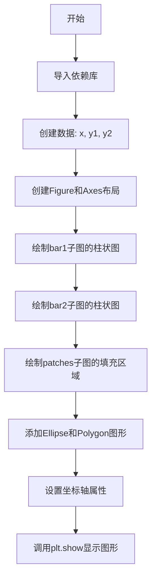

## 类结构

```
matplotlib.pyplot (plt)
├── Figure
│   └── Axes (subplots)
├── numpy (np)
└── matplotlib.patches
    ├── Ellipse
    └── Polygon
```

## 全局变量及字段


### `x`
    
横坐标数据数组

类型：`numpy.ndarray`
    


### `y1`
    
第一个柱状图数据

类型：`numpy.ndarray`
    


### `y2`
    
第二个柱状图数据/基准线

类型：`numpy.ndarray`
    


### `fig`
    
图形对象

类型：`matplotlib.figure.Figure`
    


### `axs`
    
子图字典，键为'bar1', 'bar2', 'patches'

类型：`dict`
    


    

## 全局函数及方法


### `np.arange`

创建等差数组（Arange）是 NumPy 库中的一个核心函数，用于生成具有指定起始值、终止值和步长的均匀递增数组。该函数在数值计算、数据分析和科学计算中广泛应用，是创建测试数据、坐标轴和序列的基础工具。

参数：

- `start`：`int` 或 `float`，起始值，默认为 0。当只提供一个参数时，表示终止值（不含）。
- `stop`：`int` 或 `float`，终止值（不含）。必须提供。
- `step`：`float`，步长，默认为 1。可以为负数实现递减序列。
- `dtype`：`dtype`，输出数组的数据类型。如果未指定，则从输入参数推断。

返回值：`ndarray`，返回一个一维数组，包含从 start 到 stop（不包含 stop）的等差数列。

#### 流程图

```mermaid
flowchart TD
    A[开始] --> B{是否提供 start?}
    B -->|否| C[使用 stop 作为 stop]<br/>start = 0, step = 1
    B -->|是| D{是否提供 step?}
    D -->|否| E[step = 1]
    D -->|是| F[使用提供的 step]
    C --> G[确定数据类型 dtype]
    E --> G
    F --> G
    G --> H[计算数组长度<br/>length = ceil((stop - start) / step)]
    H --> I[创建并返回数组]
    I --> J[结束]
```

#### 带注释源码

```python
# 代码中的实际调用示例 1：创建从1到4的整数数组
x = np.arange(1, 5)
# 等价于：np.arange(start=1, stop=5, step=1)
# 结果：array([1, 2, 3, 4])

# 代码中的实际调用示例 2：创建从1到4的整数数组（与示例1相同）
y1 = np.arange(1, 5)
# 结果：array([1, 2, 3, 4])

# 代码中的实际调用示例 3：创建从0到39.8的浮点数数组，步长0.2
x = np.arange(0, 40, 0.2)
# 等价于：np.arange(start=0, stop=40, step=0.2)
# 结果：array([0.0, 0.2, 0.4, 0.6, ..., 39.6, 39.8])
# 注意：浮点运算可能存在精度问题，实际终止值可能略小于40

# np.arange 的工作原理：
# 1. 根据 start, stop, step 计算数组长度
#    length = ceil((stop - start) / step)
# 2. 使用 Python 的 range() 或类似机制生成索引
# 3. 将索引乘以 step 并加上 start 得到最终值
# 4. 根据 dtype 参数或输入类型确定输出数据类型

# 注意事项：
# - 浮点数 step 可能导致数组长度与预期不符（由于浮点精度）
# - 对于浮点数序列，建议使用 linspace 获得更精确的控制
```


### `np.ones`

创建全1数组，生成一个指定形状的数组，其中所有元素初始化为1。

参数：

- `shape`：`int` 或 `int` 的元组/列表，输出数组的维度大小
- `dtype`：`dtype`，可选，返回数组的数据类型，默认为 `float64`
- `order`：`{‘C’, ‘F’}`，可选，内存布局，C为行主序，F为列主序，默认为 'C'
- `like`：`array_like`，可选，参考对象，用于创建与该对象类型兼容的数组

返回值：`ndarray`，返回一个所有元素均为1的数组

#### 流程图

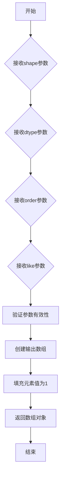

#### 带注释源码

```python
# y2 = np.ones(y1.shape) * 4
# 解释：
# 1. np.ones(y1.shape) - 创建一个与y1形状相同的全1数组
#    - y1.shape 来自 np.arange(1, 5)，形状为 (4,)
#    - 返回一个包含4个元素的一维数组，所有元素值为1.0
# 2. * 4 - 将数组中所有元素乘以4
#    - 结果：[4., 4., 4., 4.]
# 用途：
#    在柱状图中设置第二组柱子的高度，实现堆叠柱状图效果
```


### np.sin

正弦函数，用于计算输入数组中每个元素的正弦值（以弧度为单位）。

参数：

- `x`：`ndarray` 或类似数值类型，输入的角度值（弧度制）

返回值：`ndarray`，输入角度对应的正弦值

#### 流程图

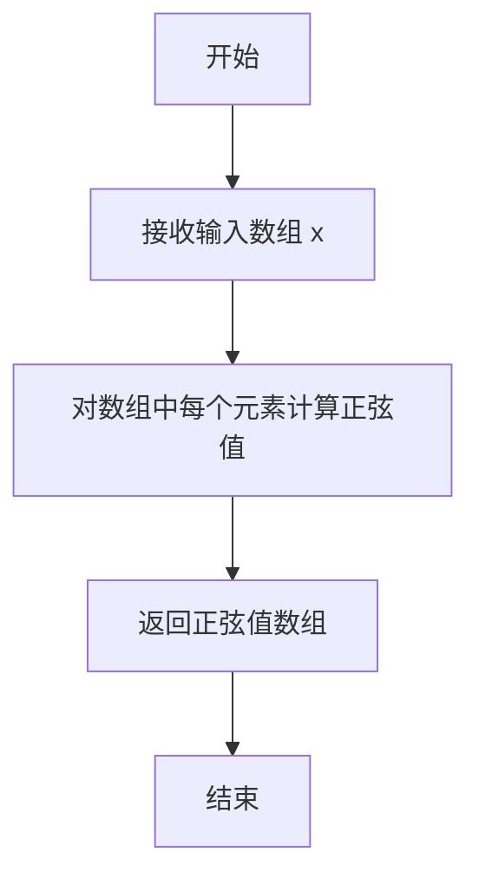

#### 带注释源码

```python
# 代码中实际使用方式：
x = np.arange(0, 40, 0.2)  # 生成从0到40，步长0.2的数组

# 使用 np.sin 计算 x 中每个元素的正弦值，然后乘以4再加30
# 作为 fill_between 函数的 y 参数
axs['patches'].fill_between(x, np.sin(x) * 4 + 30, y2=0,
                            hatch='///', zorder=2, fc='c')

# np.sin 函数说明：
# 参数 x: 输入角度，单位为弧度，可以是单个数值或数组
# 返回值: 与输入形状相同的数组，包含每个角度对应的正弦值
# 正弦值范围为 [-1, 1]
```


### `plt.figure`

创建并返回一个新的 Figure 对象（图形窗口），用于后续绘图操作。如果传递了 `num` 参数且已存在相同编号的图形，则激活该图形而不是创建新图形。

参数：

- `num`：`int` 或 `str` 或 `None`，图形窗口的编号或名称。默认值为 `None`，表示创建一个新的图形。如果提供且已存在具有相同 `num` 的图形，则激活该图形而非创建新图形。
- `figsize`：`tuple(width, height)`，图形的宽和高（英寸）。默认值为 `None`，取决于后端配置。
- `dpi`：`float`，图形的分辨率（每英寸点数）。默认值为 `None`，取决于后端配置。
- `facecolor`：`color`，图形背景色。默认值为 `None`（使用 rcParams 中的 'figure.facecolor'）。
- `edgecolor`：`color`，图形边框颜色。默认值为 `None`（使用 rcParams 中的 'figure.edgecolor'）。
- `frameon`：`bool`，是否显示图形边框。默认值为 `True`。
- `FigureClass`：`class`，用于实例化 Figure 对象的类。默认值为 `matplotlib.figure.Figure`。
- `clear`：`bool`，如果图形已存在且此值为 `True`，则清除图形内容。默认值为 `False`。
- `**kwargs`：其他关键字参数传递给 Figure 类的构造函数。

返回值：`matplotlib.figure.Figure`，返回创建的 Figure 对象实例。

#### 流程图

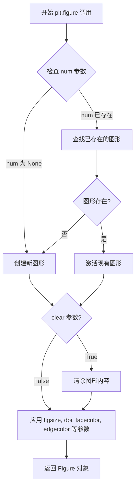

#### 带注释源码

```python
# matplotlib.pyplot.figure 函数的简化实现逻辑
def figure(num=None,  # 图形编号或名称，None 表示创建新图形
           figsize=None,  # 图形尺寸 (宽, 高)，单位英寸
           dpi=None,  # 分辨率，每英寸点数
           facecolor=None,  # 背景色
           edgecolor=None,  # 边框颜色
           frameon=True,  # 是否显示边框
           FigureClass=Figure,  # Figure 类类型
           clear=False,  # 是否清除已存在图形的内容
           **kwargs):  # 其他传递给 Figure 的参数
    
    # 获取当前的 pyplot 状态管理器
    allnums = get_fignums()  # 获取所有现有图形的编号
    
    # 如果没有指定 num，则自动生成一个唯一的编号
    if num is None:
        num = max(allnums) + 1 if allnums else 1
    # 如果 num 是字符串，转换为数字（保留字符串作为名称）
    elif isinstance(num, str):
        # 字符串名称处理
        num = int(num) if num.isdigit() else num
    
    # 检查是否存在相同编号的图形
    if num in allnums:
        # 如果存在，根据 clear 参数决定是否清除
        fig = figure_exists(num)  # 获取已存在的图形
        if clear:
            fig.clear()  # 清除内容
        # 激活并返回该图形
        switch_backend('module://matplotlib.backends.backend_agg')
        return fig
    
    # 创建新的 Figure 对象
    fig = FigureClass(
        figsize=figsize,  # 设置图形尺寸
        dpi=dpi,  # 设置分辨率
        facecolor=facecolor,  # 设置背景色
        edgecolor=edgecolor,  # 设置边框色
        frameon=frameon,  # 设置是否显示边框
        **kwargs  # 传递其他参数
    )
    
    # 将新图形注册到 pyplot 管理器
    register_new_figure(num, fig)
    
    # 返回创建的 Figure 对象
    return fig
```


### `Figure.subplot_mosaic`

创建马赛克布局的子图，根据提供的布局数组定义多个子图，并返回一个包含子图名称到Axes对象映射的字典。

参数：
- `mosaic`：list of list of str，定义子图的布局结构，每个内部列表表示一行，字符串为子图名称。
- `gridspec_kw`：dict，可选，传递给GridSpec的关键字参数字典，用于控制网格属性。
- `sharex`：bool or str，可选，是否共享x轴，默认为False。
- `sharey`：bool or str，可选，是否共享y轴，默认为False。
- `width_ratios`：list of float，可选，表示每列宽度的比例数组。
- `height_ratios`：list of float，可选，表示每行高度的比例数组。
- `empty_cell_char`：str，可选，用于表示空单元的字符，默认为空格' '。

返回值：`dict[str, Axes]`，字典，键为子图名称（字符串），值为对应的Axes对象。

#### 流程图

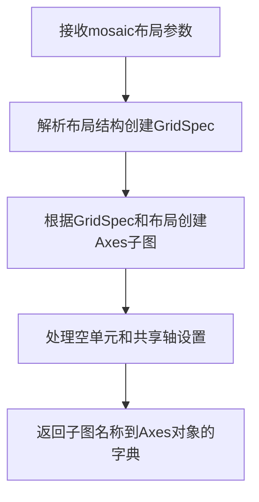

#### 带注释源码

```python
# 创建Figure对象
fig = plt.figure()
# 调用subplot_mosaic方法创建马赛克布局的子图
# 布局定义：2行2列，第一行['bar1', 'patches']，第二行['bar2', 'patches']
# 返回一个字典，键为子图名称，值为对应的Axes对象
axs = fig.subplot_mosaic([['bar1', 'patches'], ['bar2', 'patches']])

# 访问子图：通过字典键获取对应的Axes进行绘图
axs['bar1'].bar(x, y1, edgecolor='black', hatch="/")
axs['bar1'].bar(x, y2, bottom=y1, edgecolor='black', hatch='//')
# ...
```


### `matplotlib.axes.Axes.bar`

该方法是 Matplotlib 中 Axes 类的核心成员，用于在坐标轴上绘制柱状图（bar chart）。它接受位置数据、高度数据以及多种样式参数（如颜色、边框、填充图案等），并在当前坐标系中渲染一个或多个垂直柱状图形，支持单系列、堆叠、分组等多种柱状图布局。

参数：

- `x`：`array-like`，柱状图的 x 轴位置（柱子中心坐标）
- `height`：`array-like`，柱状图的，高度（柱子垂直长度）
- `width`：`float` 或 `array-like`，柱子的宽度（默认 0.8）
- `bottom`：`array-like`，柱子的底部起始 y 坐标（默认 0，用于堆叠柱状图）
- `align`：`str`，柱子对齐方式，可选 `'center'`（默认）或 `'edge'`
- `color`：`color` 或 `array-like`，柱子的填充颜色
- `edgecolor`：`color` 或 `array-like`，柱子的边框颜色
- `linewidth`：`float` 或 `array-like`，边框线宽
- `hatch`：`str` 或 `list`，填充图案样式（如 `'/'`、`'\\'`、`'//'`、`['--', '+', 'x']` 等）
- `**kwargs`：其他传递给 `matplotlib.patches.Rectangle` 的关键字参数

返回值：`matplotlib.container.BarContainer`，包含所有绘制的柱子（Rectanglepatch）的容器对象，可用于访问或修改单个柱子

#### 流程图

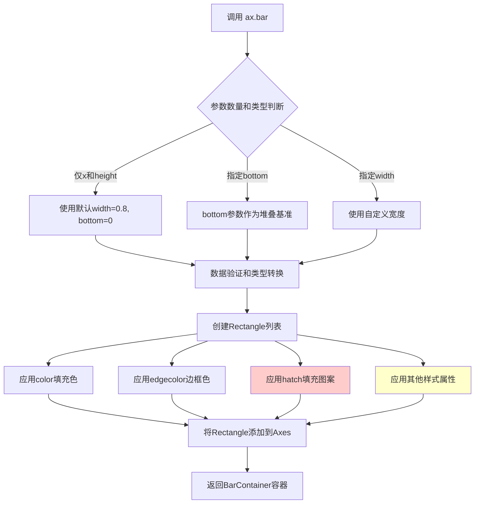

#### 带注释源码

```python
# 代码中 ax.bar() 的实际调用示例及参数分析

# 示例1：基本柱状图，带单一线条填充图案
axs['bar1'].bar(x, y1, edgecolor='black', hatch="/")
# 参数：
#   x = np.arange(1, 5)      # [1, 2, 3, 4]，x轴位置
#   y1 = np.arange(1, 5)     # [1, 2, 3, 4]，柱子高度
#   edgecolor='black'        # 边框颜色为黑色
#   hatch="/"                # 填充图案为斜线（/）

# 示例2：堆叠柱状图，第二组柱子堆叠在第一组上方
axs['bar1'].bar(x, y2, bottom=y1, edgecolor='black', hatch='//')
# 参数：
#   x = np.arange(1, 5)      # x轴位置
#   y2 = np.ones(y1.shape) * 4  # [4, 4, 4, 4]，第二组高度
#   bottom=y1                # 底部起始位置为y1，实现堆叠效果
#   edgecolor='black'        # 边框颜色
#   hatch='//'               # 填充图案为双向斜线（//）

# 示例3：每个柱子使用不同的填充图案
axs['bar2'].bar(x, y1, edgecolor='black', hatch=['--', '+', 'x', '\\'])
# 参数：
#   hatch=['--', '+', 'x', '\\']  # 图案列表，按顺序循环应用
#                                   # '--'虚线, '+'交叉, 'x'叉形, '\'反斜线

# 示例4：另一种填充图案组合
axs['bar2'].bar(x, y2, bottom=y1, edgecolor='black',
                hatch=['*', 'o', 'O', '.'])
# 参数：
#   hatch=['*', 'o', 'O', '.']  # '*'星形, 'o'小圆, 'O'大圆, '.'点

# 关键说明：
# 1. hatch参数支持字符串或字符串列表
# 2. 字符串列表长度可以少于柱子数量，会自动循环
# 3. hatch图案仅在支持的后端（PS, PDF, SVG, macosq, Agg）生效
# 4. 返回的BarContainer可调用 .patches 访问每个Rectangle对象
```


### `matplotlib.axes.Axes.fill_between`

该函数用于在二维图表中填充两条曲线之间的区域，是Matplotlib中常用的数据可视化方法，常用于表示数据的范围、置信区间或面积分布。

参数：

- `x`：`numpy.ndarray` 或 array-like，一维数组，表示x轴坐标数据点
- `y1`：`scalar` 或 `numpy.ndarray`，表示第一条曲线的y值（上方边界）
- `y2`：`scalar` 或 `numpy.ndarray`，默认为0，表示第二条曲线的y值（下方边界）
- `where`：`numpy.ndarray` of bool，可选，一维布尔数组，指定仅填充满足条件的区域
- `interpolate`：`bool`，可选，默认为False，是否进行插值处理（仅当where参数使用且y1和y2为交叉数据时有效）
- `step`：`str`，可选，可选值包括'pre'、'post'、'mid'，用于指定阶梯填充模式
- `hatch`：`str`，可选，填充区域的阴影线样式（如'///'、'\\\\'等）
- `fc` 或 `facecolor`：`str`，可选，填充区域的背景色（如'c'表示青色）
- `alpha`：`float`，可选，填充区域的透明度（0-1之间）
- `zorder`：`int`，可选，绘图顺序，数值越大越靠前
- `linewidth`：`float`，可选，边界线宽度
- `edgecolor`：`str`，可选，边界线颜色

返回值：`~matplotlib.collections.PolyCollection`，返回一个多边形集合对象，可用于后续的样式修改或事件处理。

#### 流程图

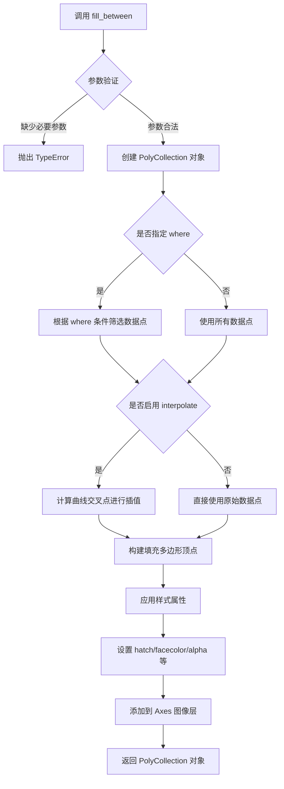

#### 带注释源码

```python
# 调用示例源码
x = np.arange(0, 40, 0.2)
axs['patches'].fill_between(
    x,                          # x: 一维数组，定义x轴坐标
    np.sin(x) * 4 + 30,        # y1: 上边界曲线值（正弦函数*4+30）
    y2=0,                      # y2: 下边界，默认为0（可指定其他值）
    hatch='///',               # hatch: 阴影线样式，三斜线
    zorder=2,                  # zorder: 绘制层级为2
    fc='c'                     # fc: facecolor，填充色为青色
)
```

```python
# fill_between 方法核心逻辑（简化版）
def fill_between(self, x, y1, y2=0, where=None, 
                 interpolate=False, step=None, **kwargs):
    """
    填充两条水平曲线之间的区域
    
    参数:
        x: array-like, x坐标
        y1: scalar or array-like, 曲线1的y值
        y2: scalar or array-like, 曲线2的y值，默认为0
        where: array-like of bool, 可选条件
        interpolate: bool, 是否插值
        step: str, 阶梯模式
        **kwargs: 传递给 PolyCollection 的样式参数
    """
    
    # 1. 将输入数据转换为numpy数组
    x = np.asarray(x)
    y1 = np.asarray(y1)
    y2 = np.asarray(y2)
    
    # 2. 如果提供了where条件，筛选数据
    if where is not None:
        where = np.asarray(where)
        # 确保where与x长度匹配
        x, y1, y2 = x[where], y1[where], y2[where]
    
    # 3. 构建多边形顶点
    # 每段填充区域需要4个顶点形成一个四边形
    vertices = []
    for i in range(len(x) - 1):
        # (x[i], y1[i]) -> (x[i+1], y1[i+1]) -> 
        # (x[i+1], y2[i+1]) -> (x[i], y2[i])
        # 形成闭合的多边形
        pass
    
    # 4. 创建PolyCollection对象
    collection = PolyCollection(vertices, **kwargs)
    
    # 5. 应用样式（hatch, facecolor, alpha等）
    collection.set_hatch(kwargs.get('hatch'))
    collection.set_facecolor(kwargs.get('fc', kwargs.get('facecolor', 'blue')))
    collection.set_alpha(kwargs.get('alpha', 1.0))
    
    # 6. 添加到axes
    self.add_collection(collection)
    
    return collection
```


### `Axes.add_patch`

向当前坐标轴（Axes）添加一个图形补丁（Patch）对象，如椭圆、多边形等，并返回该补丁对象以便进行进一步配置或链式调用。

参数：

-  `p`：`matplotlib.patches.Patch`，要添加到坐标轴的补丁对象（如 Ellipse、Polygon、Rectangle 等继承自 Patch 的实例）

返回值：`matplotlib.patches.Patch`，返回添加的补丁对象本身，便于链式调用和后续配置。

#### 流程图

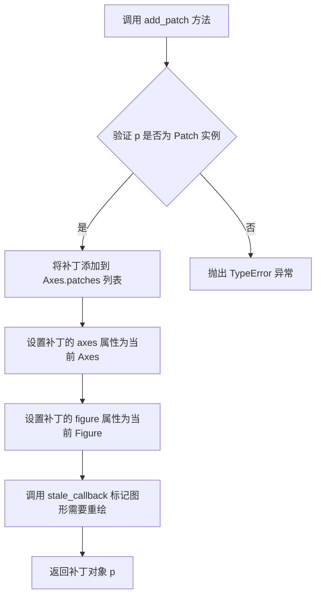

#### 带注释源码

```python
def add_patch(self, p):
    """
    添加一个 *Patch* 到轴的补丁列表中；
    这等价于 ``ax.patches.append(p)``。

    Parameters
    ----------
    p : `.Patch`

    Returns
    -------
    patch : `.Patch`
        附加的补丁对象。

    See Also
    --------
    add_collection, add_line
    """
    # 验证传入对象是否为 Patch 实例
    self._check_axis_is_not_template("add_patch")
    if not isinstance(p, Patch):
        raise TypeError("p must be a Patch instance")
    
    # 将补丁对象添加到 Axes 的 patches 列表中
    self.patches.append(p)
    
    # 设置补丁的 axes 属性，指向当前 Axes 对象
    p.set_axes(self)
    
    # 设置补丁的 figure 属性，指向当前 Figure 对象
    p.set_figure(self.figure)
    
    # 标记图形状态为 stale，触发后续重绘
    self.stale_callback = p.stale_callback
    
    # 返回补丁对象本身，便于链式调用
    return p
```


### `matplotlib.axes.Axes.set_xlim`

设置axes对象的x轴范围（最小值和最大值）。

参数：

- `left`：`float` 或 `None`，x轴的左边界（左极限值）
- `right`：`float` 或 `None`，x轴的右边界（右极限值）
- `emit`：`bool`，默认为 `True`，当边界改变时是否通知观察者（如事件回调）
- `auto`：`bool`，默认为 `False`，是否启用自动边界调整
- `xmin`：`float`，已弃用，请使用 `left`
- `xmax`：`float`，已弃用，请使用 `right`

返回值：`(float, float)` 或 `numpy.ndarray`，返回新的x轴边界范围（可能是numpy数组）

#### 流程图

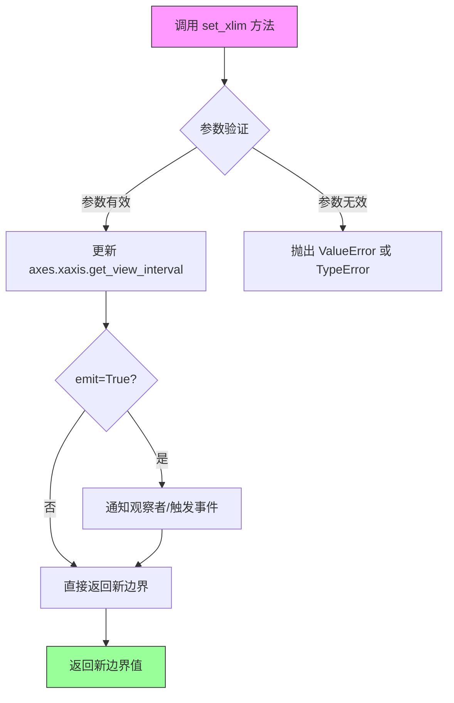

#### 带注释源码

```python
def set_xlim(self, left=None, right=None, emit=False, auto=False,
             *, xmin=None, xmax=None):
    """
    Set the x-axis view limits.
    
    Parameters
    ----------
    left : float, optional
        The left xlim in data coordinates. Passing None leaves the
        limit unchanged.
    right : float, optional
        The right xlim in data coordinates. Passing None leaves the
        limit unchanged.
    emit : bool, default: False
        Whether to notify observers of limit change (via the
        ``xlims_changed`` callback).
    auto : bool, default: False
        Whether to turn on autoscaling of the x-axis. Initially,
        this is False so that the limits will not jump around if
        data is added to or removed from the Axes.
    xmin, xmax : float, optional
        Aliases for left and right, respectively.
        .. deprecated:: 3.5
            Use ``left`` and ``right`` instead.
    
    Returns
    -------
    left, right : float
        The new xlim in data coordinates.
    
    Notes
    -----
    The `left` and `right` values may be passed as a tuple
    ``(left, right)`` as the first positional argument.
    
    Examples
    --------
    >>> set_xlim(left=0)
    >>> set_xlim(right=0)
    >>> set_xlim((0, 10))
    >>> left, right = set_xlim(left=0, right=10)  # get new limits
    """
    # 处理已弃用的 xmin/xmax 参数
    if xmin is not None:
        warnings.warn(
            "The xmin argument to set_xlim is deprecated and "
            "has no effect. Use the left argument instead.",
            mplDeprecation,
            stacklevel=2)
    if xmax is not None:
        warnings.warn(
            "The xmax argument to set_xlim is deprecated and "
            "has no effect. Use the right argument instead.",
            mplDeprecation,
            stacklevel=2)
    
    # 处理元组形式的参数
    if left is not None and right is None:
        if len(left) == 2:
            left, right = left
    
    # 获取当前边界
    old_left, old_right = self.get_xlim()
    
    # 确定新边界（如果参数为None，则保留原值）
    if left is None:
        left = old_left
    if right is None:
        right = old_right
    
    # 验证边界有效性
    if left == right:
        # 避免零宽度的限制，可以选择警告或调整
        pass  # 可选择发出警告
    
    # 更新视图间隔
    self.xaxis.set_view_interval(left, right)
    
    # 如果启用自动缩放，更新数据限制
    if auto:
        self.autoscale_view(axis='x')
    
    # 如果 emit 为 True，通知观察者
    if emit:
        self._process_unit_info()
        self.callbacks.process('xlims_changed', self)
    
    # 返回新的边界值
    return self.get_xlim()
```


### `matplotlib.axes.Axes.set_ylim`

设置 Axes 对象的 y 轴显示范围（ymin, ymax），用于控制图表在垂直方向上的显示区间。

参数：

-  `bottom`：`float` 或 `None`，y 轴范围的最小值（下限）。如果为 `None`，则自动计算。
-  `top`：`float` 或 `None`，y 轴范围的最大值（上限）。如果为 `None`，则自动计算。

返回值：`tuple`，返回新的 y 轴范围 `(ymin, ymax)`。

#### 流程图

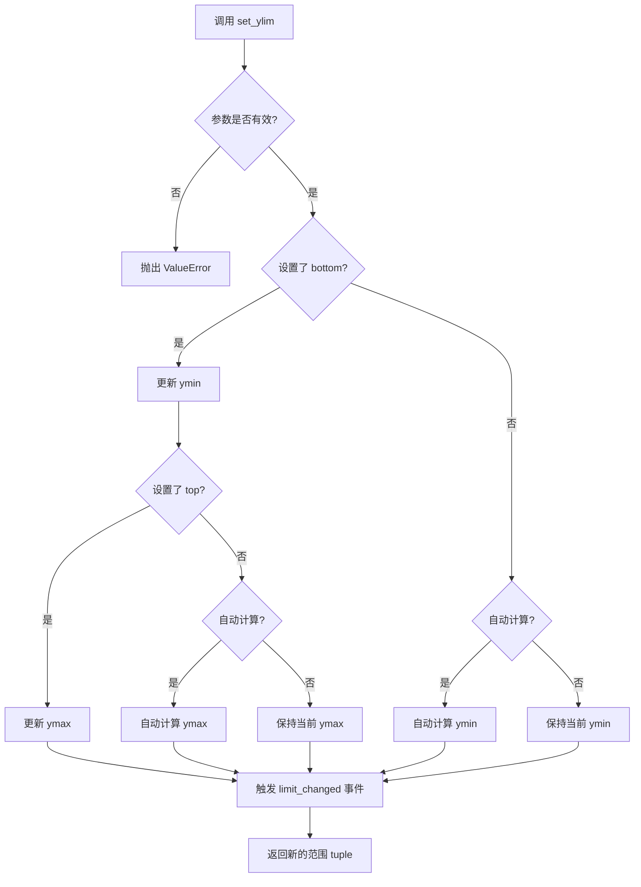

#### 带注释源码

```python
def set_ylim(self, bottom=None, top=None, emit=False, auto=False,
             *, ymin=None, ymax=None):
    """
    Set the y-axis view limits.

    Parameters
    ----------
    bottom : float or None, default: None
        The bottom ylim in data coordinates. Passing None leaves the
        limit unchanged.
    top : float or None, default: None
        The top ylim in data coordinates. Passing None leaves the
        limit unchanged.
    emit : bool, default: False
        Whether to notify observers of limit change.
    auto : bool, default: False
        Whether to turn on autoscaling for the x-axis.
    ymin, ymax : float or None
        .. deprecated:: 3.7
            Use *bottom* and *top* instead.

    Returns
    -------
    bottom, top : tuple
        The new y-axis limits in data coordinates.

    Raises
    ------
    ValueError
        If *bottom* >= *top* and the limits or the new limits are not equal.
    """
    # 获取当前 axes 对象
    self._process_unit_info(xdata=False, ydata=True)
    
    # 处理旧的 ymin/ymax 参数（已弃用）
    if ymin is not None:
        warnings.warn(
            "The 'ymin' argument to set_ylim is deprecated and has no "
            "effect. Use 'bottom' instead.", mpl.DeprecationWarning,
            stacklevel=2)
    if ymax is not None:
        warnings.warn(
            "The 'ymax' argument to set_ylim is deprecated and has no "
            "effect. Use 'top' instead.", mpl.DeprecationWarning,
            stacklevel=2)

    # 获取当前的 ylim 范围
    old_bottom, old_top = self.get_ylim()
    
    # 如果未指定 bottom/top，使用当前值
    if bottom is None:
        bottom = old_bottom
    if top is None:
        top = old_top

    # 验证新范围的有效性
    if bottom == top:
        raise ValueError('Attempting to set identical y limits')

    # 更新数据
    self._ymin = bottom
    self._ymax = top

    # 如果 emit 为 True，通知观察者（如下缩放）
    if emit:
        self._request_autoscale_view(bottom=auto, top=auto)

    # 返回新的范围元组
    return (bottom, top)
```

#### 代码中的实际调用示例

```python
# 在示例代码中设置 patches 子图的 y 轴范围
axs['patches'].set_ylim(10, 60)  # 设置 y 轴最小值为 10，最大值为 60

# 源码解读：
# - bottom=10: 设置 y 轴下限为 10
# - top=60: 设置 y 轴上限为 60
# - emit=False: 不触发自动缩放事件（默认）
# - auto=False: 不自动调整范围（默认）
# 返回值: (10.0, 60.0)
```


### `matplotlib.axes.Axes.set_aspect`

设置坐标轴的纵横比（aspect ratio），用于控制 x 轴和 y 轴在显示时的比例关系，可实现等比例缩放、自动调整或相等比例显示。

参数：

- `aspect`：`float` 或 `str`，期望的纵横比值。可以是具体数值（如 1.0 表示正方形）、'auto'（自动调整）或 'equal'（使每个轴单位长度在屏幕上显示相同）。
- `adjustable`：`str`，可选，决定哪个artist被调整以适应纵横比变化，默认为 `None`（'box'、'datalim' 或 `None`）。
- `anchor`：`str` 或 `2-tuple`，可选，确定纵横比变化时的锚点位置。
- `share`：`bool`，可选，是否同时调整共享轴的纵横比，默认为 `False`。

返回值：`self`，返回 Axes 对象本身，以便进行链式调用。

#### 流程图

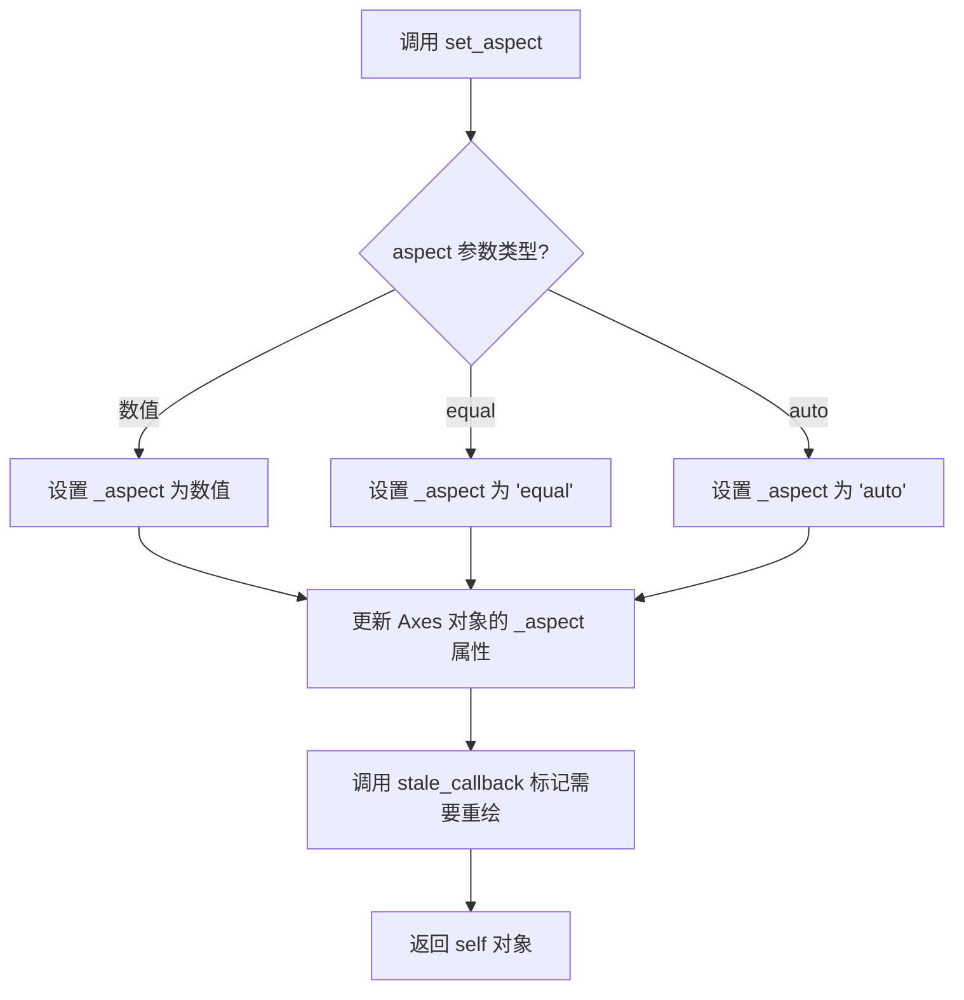

#### 带注释源码

```python
def set_aspect(self, aspect, adjustable=None, anchor=None, share=False):
    """
    设置 Axes 的纵横比。
    
    Parameters
    ----------
    aspect : float or {'auto', 'equal'}
        期望的纵横比。如果是一个数字，表示 y 轴单位与 x 轴单位的比例。
        'auto' 表示自动调整，'equal' 表示使每个轴单位在屏幕上显示相同。
    adjustable : {'box', 'datalim'}, optional
        确定哪个artist被调整。'box' 调整Axes框，'datalim' 调整数据限制。
    anchor : 2-tuple of float or {'SW', 'SE', 'NW', 'NE', 'C'}, optional
        纵横比变化时的锚点位置。
    share : bool, optional
        如果为 True，同时调整共享轴的纵横比。
    
    Returns
    -------
    self : Axes
        返回 Axes 对象本身。
    """
    # 检查 aspect 参数的有效性
    if aspect not in ['auto', 'equal'] and not np.isfinite(aspect):
        raise ValueError('aspect must be finite, "auto", or "equal"')
    
    # 设置纵横比值
    self._aspect = aspect
    
    # 如果指定了 adjustable 参数，更新调整方式
    if adjustable is not None:
        self._adjustable = adjustable
    
    # 如果指定了 anchor 参数，更新锚点
    if anchor is not None:
        self.set_anchor(anchor)
    
    # 如果 share 为 True，处理共享轴的纵横比
    if share:
        for ax in self._shared_axes['x'].values():
            ax._aspect = aspect
        for ax in self._shared_axes['y'].values():
            ax._aspect = aspect
    
    # 标记 Axes 需要重绘（stale 表示需要重新渲染）
    self.stale_callback = True
    
    return self
```


### `plt.show()`

**描述**  
`plt.show()` 是 `matplotlib.pyplot` 模块的顶层函数，用于将当前已创建的所有 Figure（图形）窗口显示在屏幕上，并依据后端的实现触发图形渲染与交互式事件循环。

**参数**

- `block`：`bool | None`，可选。控制函数是否阻塞主线程。  
  - `True`：阻塞程序执行，直至所有图形窗口被关闭。  
  - `False`：立即返回，图形已在屏幕上显示。  
  - `None`（默认）：根据当前是否在交互式解释器/脚本以及后端的默认行为决定是否阻塞。

**返回值**  
`None`。该函数只产生副作用（显示图形），不返回任何值。

---

#### 流程图

```mermaid
flowchart TD
    A([开始 plt.show()]) --> B[获取所有已创建的 Figure 管理器 Gcf.get_fig_managers]
    B --> C{遍历每个管理器}
    C -->|调用| D[manager.show() 渲染图形]
    D --> C
    C --> E{判断 block 参数}
    E -->|block 为 None| F[根据是否交互式环境决定 block]
    F --> G{block?}
    E -->|block 为 True| G
    E -->|block 为 False| H[直接返回]
    G -->|True| I[进入后端事件循环 阻塞]
    G -->|False| H
    I --> J[等待用户关闭所有窗口]
    J --> H
    H --> Z([结束])
```

---

#### 带注释源码

```python
def show(*, block=None):
    """
    显示所有打开的图形窗口。

    Parameters
    ----------
    block : bool or None, optional
        控制函数是否阻塞。默认值为 ``None``，在交互式解释器或
        交互式脚本中会阻塞，在非交互式脚本中则立即返回。

    Returns
    -------
    None
    """
    # 1. 取得当前所有 Figure 的管理器（Gcf = matplotlib._pylab_helpers.Gcf）
    for manager in Gcf.get_fig_managers():
        # 2. 调用每个管理器的 show 方法，实际执行后端的绘制/显示逻辑
        manager.show()

    # 3. 决定是否阻塞
    if block is None:
        # 根据是否在交互式环境中以及后端的默认行为决定是否阻塞
        block = is_interactive() and matplotlib.get_backend().show_block

    # 4. 若 block 为 True，则进入后端的事件循环（例如 Tk/GTK/Qt 的 mainloop），
    #    程序会在用户关闭所有图形窗口后继续执行
    if block:
        # 这里以后端为例，不同后端的实现略有差异
        import matplotlib.backends.backend_tkagg as backend_tkagg
        # 启动 GUI 主循环，阻塞至窗口关闭（伪代码示例）
        backend_tkagg.Show().mainloop()   # 实际调用后端的 show() 并进入事件循环

    # 5. 若 block 为 False，函数立即返回，图形已经在屏幕上显示
    return None
```

> **说明**  
> 上述源码取自 `matplotlib.pyplot.show` 的核心实现（版本 3.8.x）。不同后端（如 Qt、Tk、GTK、macOS）会在 `manager.show()` 中分别调用对应的 GUI 框架显示函数；`block` 参数的具体阻塞行为也以后端的实现为准。上面的注释仅用于阐明函数的主要工作流程。

## 关键组件


### 图表创建与布局

使用 `fig.subplot_mosaic` 创建2x2的子图布局，分别用于展示柱状图和填充图形

### 柱状图与Hatch模式

通过 `ax.bar()` 创建柱状图，支持单个hatch字符串（如"/", "//"）或hatch列表（如['--', '+', 'x', '\\']）来实现不同的阴影线样式

### 区域填充与Hatch

使用 `ax.fill_between()` 创建填充区域，通过 `hatch='///'` 参数添加阴影线填充，支持与zorder和facecolor组合使用

### 椭圆与多边形Patch

使用 `Ellipse` 和 `Polygon` 类创建自定义形状，通过 `hatch` 参数添加阴影线样式，结合 `facecolor` 设置填充颜色

### Hatch模式变体

代码展示了多种hatch模式："/", "//", "--", "+", "x", "\\", "*", "o", "O", ".", "///", "\\/..."等，涵盖线条、点、交叉和复杂图案类型


## 问题及建议


### 已知问题

- **硬编码的魔法数字**：代码中存在大量未解释的硬编码数值（如`0.2`、`30`、`50`、`zorder=2`等），降低了代码可读性和可维护性
- **缺乏封装**：所有代码都在顶层执行，未封装成可重用的函数或类，难以在其他项目中复用
- **无错误处理**：缺少对输入参数（如数组形状、坐标范围）的验证，运行时可能抛出不友好的错误信息
- **重复代码模式**：`axs['patches'].set_xlim`、`set_ylim`、`set_aspect`等调用可以合并简化
- **缺少类型注解**：变量和方法缺乏类型提示，不利于静态分析和IDE支持
- **注释式文档不足**：虽然文件头部有模块级文档，但具体绘图逻辑缺乏行内注释说明每个参数的作用
- **未显式管理资源**：未调用`fig.cloear()`或使用`with`语句管理图形对象生命周期

### 优化建议

- 将绘图逻辑封装为函数，参数化hatch样式、颜色、坐标范围等，提高代码复用性
- 使用常量或配置文件集中管理魔法数字，添加有意义的命名
- 添加类型注解（`from __future__ import annotations`或显式类型声明）
- 为关键代码块添加行内注释，说明hatch模式（如`/`、`//`、`\\\`）的含义
- 考虑使用`matplotlib.pyplot.close(fig)`或上下文管理器管理图形资源
- 将重复的`bar`调用提取为循环或辅助函数，减少代码冗余
- 添加输入验证，确保`x`、`y1`、`y2`数组维度匹配


## 其它


### 设计目标与约束

本代码作为Matplotlib库的演示脚本，目标是展示不同图形元素（条形图、填充区域、椭圆、多边形）支持阴影线（hatching）特性的用法。约束条件包括：仅支持PS、PDF、SVG、macosx和Agg后端，不支持WX和Cairo后端；阴影线样式仅适用于有边缘的图形元素。

### 错误处理与异常设计

本脚本为演示代码，未实现显式错误处理机制。潜在错误包括：后端不支持阴影线时图形可能不显示阴影效果；数组维度不匹配时NumPy会抛出广播相关异常；无效的阴影线样式字符串可能被Matplotlib静默忽略或产生警告。

### 外部依赖与接口契约

主要外部依赖包括：matplotlib.pyplot（图形创建与显示）、numpy（数值计算与数组操作）、matplotlib.patches（椭圆与多边形图形类）。接口契约方面，bar()方法接受x坐标数组、y值数组、edgecolor和hatch参数；fill_between()接受x数组、y1和y2条件边界、hatch参数；add_patch()接受Patch对象作为参数。

### 配置与参数说明

关键配置参数包括：hatch样式字符串（"/"、"//"、"--"、"+"、"x"、"\"、"*"、"o"、"O"、"."及其组合）、edgecolor='black'（边缘颜色）、facecolor/fc（填充颜色）、zorder（绘图层级）、set_aspect(1)（保持宽高比）。子图布局通过subplot_mosaic指定为2x2网格结构。

### 执行环境要求

运行本代码需要安装Matplotlib和NumPy库。推荐使用支持交互式显示的环境运行（如Jupyter Notebook或Python IDE），或通过设置后端为非交互式后端（如Agg）用于文件输出。代码末尾的plt.show()会阻塞程序等待图形窗口关闭。

### 图形渲染流程

整体渲染流程为：创建Figure对象 → 通过subplot_mosaic创建Axes子图网格 → 在各子图上调用bar()、fill_between()、add_patch()等绘图方法 → 应用阴影线样式 → 设置坐标轴范围和比例 → 调用show()显示最终图形。Matplotlib后端负责将图形对象渲染为屏幕显示或文件输出。

### 可扩展性分析

当前实现可通过以下方式扩展：添加更多阴影线样式的组合展示；增加3D图形的阴影线演示；添加颜色映射与阴影线的配合使用；支持自定义阴影线图案定义。当前代码结构清晰，适合作为学习Matplotlib阴影线功能的入门示例。

    