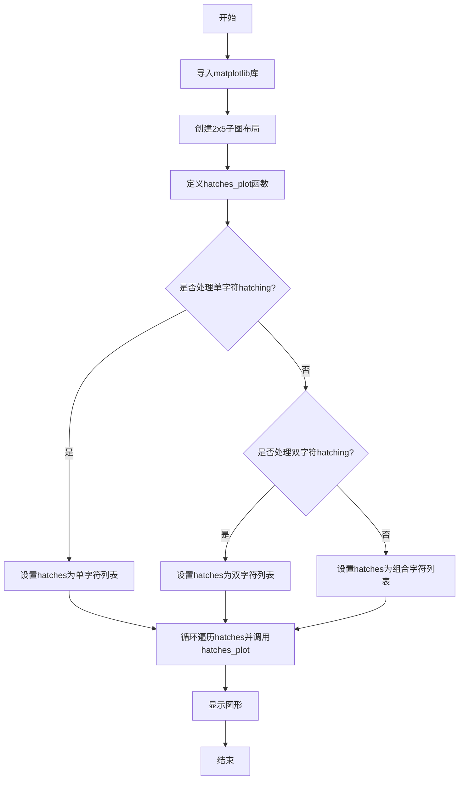

# `matplotlib\galleries\examples\shapes_and_collections\hatch_style_reference.py` 详细设计文档

该代码是一个Matplotlib示例脚本，用于演示各种hatching（填充图案）的视觉效果，包括单字符、双字符和组合字符的图案，并通过子图形式展示每种图案的矩形示例。

## 整体流程



## 类结构

```
无类定义
模块级别: matplotlib.pyplot, matplotlib.patches.Rectangle
函数: hatches_plot(ax, h)
```

## 全局变量及字段


### `fig`
    
图形对象

类型：`matplotlib.figure.Figure`
    


### `axs`
    
子图数组

类型：`numpy.ndarray`
    


### `hatches`
    
hatching图案列表

类型：`list`
    


    

## 全局函数及方法


### `hatches_plot`

该函数接受一个matplotlib轴对象和一个hatching图案字符串，在指定轴上绘制一个填充为False但带有指定hatching图案的矩形，并在矩形下方中心位置显示该图案的文本标签，用于展示matplotlib支持的不同hatching样式效果。

参数：

- `ax`：`matplotlib.axes.Axes`，matplotlib的轴对象，表示要在哪个子图上绘制图形
- `h`：`str`，hatching图案字符串，用于指定矩形内部填充的斜线图案样式

返回值：`None`，该函数没有返回值，仅执行绘图操作

#### 流程图

```mermaid
flowchart TD
    A[开始 hatches_plot] --> B[在ax上添加矩形补丁]
    B --> C[设置矩形: 位置(0,0), 宽2高2, fill=False, hatch=h]
    C --> D[在ax上添加文本标签]
    D --> E[设置文本: 位置(1,-0.5), 内容为'h'的值, 字号15, 水平居中]
    E --> F[设置轴属性]
    F --> G[设置ax.axis equal]
    G --> H[设置ax.axis off]
    H --> I[结束]
```

#### 带注释源码

```python
def hatches_plot(ax, h):
    """
    在指定轴上绘制带有hatching图案的矩形和文本标签
    
    参数:
        ax: matplotlib.axes.Axes对象，表示要绘图的轴
        h: str，hatching图案字符串
    """
    # 使用Rectangle创建一个矩形补丁，fill=False表示不填充只显示边框
    # hatch参数指定填充的hatching图案样式
    ax.add_patch(Rectangle((0, 0), 2, 2, fill=False, hatch=h))
    
    # 在矩形下方中心位置(1, -0.5)添加文本标签，显示hatching图案字符
    # size=15设置字体大小，ha="center"设置水平居中对齐
    ax.text(1, -0.5, f"' {h} '", size=15, ha="center")
    
    # 设置坐标轴为等比例，使矩形显示为正方形
    ax.axis('equal')
    
    # 隐藏坐标轴的刻度和边框
    ax.axis('off')
```

## 关键组件


### 填充图案列表（hatches）

定义不同样式的填充图案，包括单线、交叉、点状等基本图案

### hatches_plot 函数

在Axes上绘制带填充图案的矩形并添加文本标签的辅助函数

### Rectangle 矩形组件

Matplotlib的矩形patch，支持fill和hatch参数用于填充和图案设置

### 子图布局（subplots）

使用subplots创建2行5列的网格布局，管理多个子图的排列

### 文本渲染（ax.text）

在子图上添加文本标签，显示对应的填充图案字符

### 循环迭代器（zip）

将子图 axes 与填充图案列表配对，依次处理每个图案


## 问题及建议


### 已知问题

- **高度重复的代码结构**：三个代码块几乎完全相同，只是 `hatches` 列表内容不同，导致代码冗余，维护成本高
- **大量硬编码值**：`figsize=(6.4, 3.2)`、`layout='constrained'`、`subplots(2, 5)`、Rectangle 参数 `(0, 0), 2, 2`、text 位置 `(1, -0.5)`、字体大小 `size=15` 等被重复硬编码
- **魔法数字缺乏解释**：数值如 `2, 2`（矩形尺寸）、`1, -0.5`（文本位置）、`15`（字体大小）没有任何变量名或注释说明其含义
- **函数文档不完整**：`hatches_plot` 函数没有 docstring，参数和返回值没有类型注解
- **变量命名不够清晰**：`h` 作为循环变量名不够直观，可读性较差
- **缺乏错误处理和验证**：没有对 `hatches` 列表格式、ax 对象有效性的检查
- **可扩展性差**：如需添加新的 hatch pattern 展示，需要复制粘贴整个代码块

### 优化建议

- **提取通用配置为常量或参数**：将 `figsize`、`layout`、`subplots` 参数、矩形参数、文本参数等提取为配置字典或函数参数
- **封装重复逻辑为函数**：将三个代码块合并为一个接收 `hatches` 列表参数的函数，避免代码重复
- **添加类型注解和文档字符串**：为 `hatches_plot` 函数添加参数类型、返回值类型和详细的 docstring 说明
- **使用更语义化的变量名**：如将 `h` 改为 `hatch_pattern`，提高代码可读性
- **添加输入验证**：检查 `hatches` 列表是否为有效类型，检查 `ax` 对象是否有效
- **考虑数据驱动设计**：将所有 hatch patterns 定义为数据结构（如嵌套列表），通过循环动态生成图表


## 其它


### 设计目标与约束

本代码是一个Matplotlib填充图案（Hatching）样式参考文档，旨在展示Matplotlib库支持的各种填充图案类型及其用法。设计目标包括：1）演示单一填充图案（/、\、|、-、+、x、o、O、.、*）；2）演示重复填充图案以增加密度（//、\\\\、||、--、++、xx、oo、OO、..、**）；3）演示组合填充图案以创建更多样式（/o、\\|、|*、-\\、+o、x*、o-、O|、O.、*-）。代码约束包括：仅支持PS、PDF、SVG、macosx和Agg后端，WX和Cairo后端不支持填充图案。

### 错误处理与异常设计

本代码为演示脚本，未实现复杂的错误处理机制。潜在的错误场景包括：1）无效的填充图案字符串可能导致图形渲染异常或警告；2）后端不支持填充图案时可能静默失败；3）子图数量与填充图案数量不匹配时可能产生空白子图。建议在实际应用中添加填充图案有效性验证和后端兼容性检查。

### 数据流与状态机

数据流主要包括：hatches列表定义 → 循环遍历 → hatches_plot函数调用 → Rectangle对象创建 → patch添加到axes → 文本标签添加 → 图形渲染。状态机表现为：plt.subplots创建子图 → 设置布局和尺寸 → 循环处理每个填充图案 → 渲染输出。每个子图相互独立，共享相同的绘图逻辑。

### 外部依赖与接口契约

本代码依赖以下外部组件：1）matplotlib.pyplot - 图形创建和显示；2）matplotlib.patches.Rectangle - 创建填充图案矩形；3）matplotlib.axes.Axes - 图形坐标轴对象。接口契约：hatches_plot函数接收ax（Axes对象）和h（字符串）参数，返回None，直接操作传入的Axes对象进行绘图。

### 性能考虑

代码性能表现良好，主要性能特点：1）使用zip进行并行迭代，避免索引计算；2）add_patch和text方法为轻量级操作；3）子图数量较少（10个），渲染开销可控。优化建议：对于大量填充图案的场景，可考虑预先创建Rectangle对象池以减少重复创建开销。

### 安全性考虑

本代码为演示代码，无用户输入处理，无安全风险。实际应用中如需处理用户提供的填充图案字符串，应进行输入验证以防止注入攻击。

### 可测试性

代码可测试性较高，建议添加的测试用例包括：1）验证所有填充图案字符串均能正常渲染；2）验证子图数量与填充图案数量匹配；3）验证返回的图形对象结构正确；4）验证不同后端的兼容性表现。

### 配置说明

关键配置参数：1）figsize=(6.4, 3.2) - 图形整体尺寸；2）layout='constrained' - 约束布局管理器；3）ax.axis('equal') - 等比例坐标轴；4）ax.axis('off') - 隐藏坐标轴；5）size=15 - 文本标签字号；6）ha="center" - 水平居中对齐。

### 版本兼容性

本代码使用Matplotlib标准API，具有良好的版本兼容性。建议最低Matplotlib版本为3.0，以支持constrained布局管理器。Rectangle的fill参数和hatch参数在较旧版本中可能存在行为差异。

### 使用示例和API参考

代码展示了以下API用法：1）matplotlib.pyplot.subplots - 创建子图；2）matplotlib.patches.Rectangle - 创建带填充图案的矩形，参数包括位置(x,y)、宽度、高度、fill和hatch；3）Axes.add_patch - 将patch添加到坐标轴；4）Axes.text - 在指定位置添加文本标签；5）Axes.axis - 控制坐标轴显示和比例。

    