# `matplotlib\galleries\examples\shapes_and_collections\hatchcolor_demo.py` 详细设计文档

This code demonstrates the usage of the hatchcolor parameter in matplotlib to set the color of hatching patterns in various plot elements such as rectangles, bar plots, and scatter plots.

## 整体流程

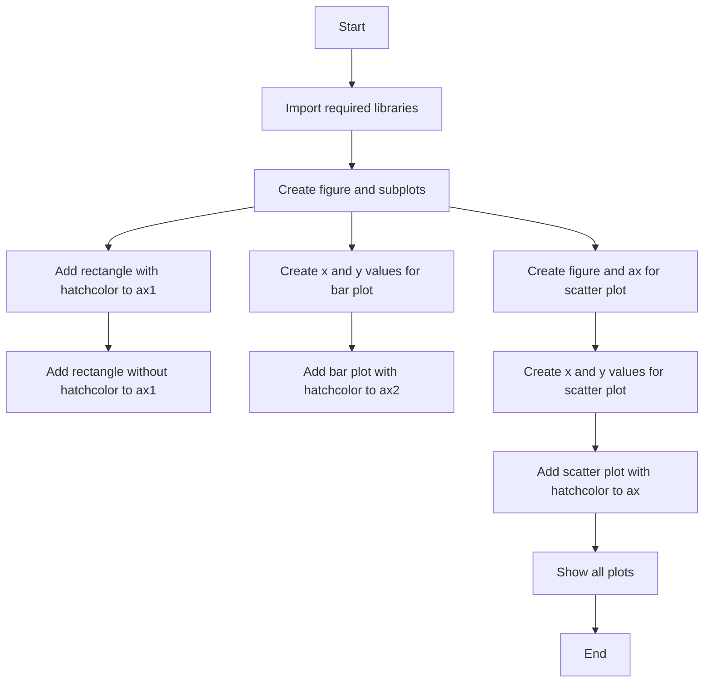

## 类结构

```
matplotlib.pyplot (module)
├── fig, (ax1, ax2) = plt.subplots(1, 2)
│   ├── ax1 (Axes object)
│   └── ax2 (Axes object)
├── Rectangle((0.1, 0.5), 0.8, 0.3, hatch=".", hatchcolor='red', edgecolor='black', lw=2)
├── Rectangle((0.1, 0.1), 0.8, 0.3, hatch='x', edgecolor='orange', lw=2)
├── x = np.arange(1, 5)
├── y = np.arange(1, 5)
├── ax2.bar(x, y, facecolor='none', edgecolor='red', hatch='//', hatchcolor='blue')
├── num_points_x = 10
├── num_points_y = 9
├── x = np.linspace(0, 1, num_points_x)
├── y = np.linspace(0, 1, num_points_y)
└── ax.scatter(X.ravel(), Y.ravel(), s=1700, facecolor="none", edgecolor="gray", linewidth=2, marker="h", hatch="xxx", hatchcolor=colors)
```

## 全局变量及字段


### `fig`
    
The main figure object where all plots are drawn.

类型：`matplotlib.figure.Figure`
    


### `ax1`
    
The first subplot where the rectangle plots are drawn.

类型：`matplotlib.axes._subplots.AxesSubplot`
    


### `ax2`
    
The second subplot where the bar plot is drawn.

类型：`matplotlib.axes._subplots.AxesSubplot`
    


### `x`
    
The x-axis values for the plots.

类型：`numpy.ndarray`
    


### `y`
    
The y-axis values for the plots.

类型：`numpy.ndarray`
    


### `num_points_x`
    
The number of points along the x-axis for the scatter plot.

类型：`int`
    


### `num_points_y`
    
The number of points along the y-axis for the scatter plot.

类型：`int`
    


### `colors`
    
The colors for the scatter plot markers.

类型：`list of tuples`
    


### `X`
    
The x-coordinates for the scatter plot markers.

类型：`numpy.ndarray`
    


### `Y`
    
The y-coordinates for the scatter plot markers.

类型：`numpy.ndarray`
    


### `matplotlib.patches.Rectangle.hatch`
    
The hatch pattern to use for the rectangle.

类型：`str`
    


### `matplotlib.patches.Rectangle.hatchcolor`
    
The color of the hatch pattern for the rectangle.

类型：`str`
    


### `matplotlib.patches.Rectangle.edgecolor`
    
The color of the edge of the rectangle.

类型：`str`
    


### `matplotlib.patches.Rectangle.lw`
    
The linewidth of the rectangle.

类型：`float`
    


### `matplotlib.axes.Axes.patches`
    
The collection of patches in the axes.

类型：`matplotlib.patches.PatchCollection`
    


### `matplotlib.axes.Axes.collections`
    
The collection of collections in the axes.

类型：`matplotlib.collections.Collection`
    


### `matplotlib.axes.Axes.lines`
    
The collection of lines in the axes.

类型：`matplotlib.lines.Line2D`
    


### `matplotlib.axes.Axes.texts`
    
The collection of texts in the axes.

类型：`matplotlib.texts.Text`
    


### `matplotlib.axes.Axes.spines`
    
The collection of spines in the axes.

类型：`matplotlib.spines.Spine`
    


### `matplotlib.axes.Axes.title`
    
The title of the axes.

类型：`matplotlib.texts.Text`
    


### `matplotlib.axes.Axes.xlabel`
    
The label for the x-axis.

类型：`matplotlib.texts.Text`
    


### `matplotlib.axes.Axes.ylabel`
    
The label for the y-axis.

类型：`matplotlib.texts.Text`
    


### `matplotlib.axes.Axes.xlim`
    
The limits for the x-axis.

类型：`tuple`
    


### `matplotlib.axes.Axes.ylim`
    
The limits for the y-axis.

类型：`tuple`
    
    

## 全局函数及方法


### plt.subplots

`plt.subplots` 是一个用于创建子图（subplot）的函数，它允许用户在一个图形窗口中创建多个独立的图表。

参数：

- `nrows`：`int`，指定子图行数。
- `ncols`：`int`，指定子图列数。
- `sharex`：`bool`，指定子图是否共享X轴。
- `sharey`：`bool`，指定子图是否共享Y轴。
- `fig`：`matplotlib.figure.Figure`，可选，指定要添加子图的Figure对象。
- `gridspec_kw`：`dict`，可选，用于定义GridSpec对象的关键字参数。
- `constrained_layout`：`bool`，可选，指定是否启用约束布局。

返回值：`matplotlib.figure.Figure`，包含子图的Figure对象。

#### 流程图

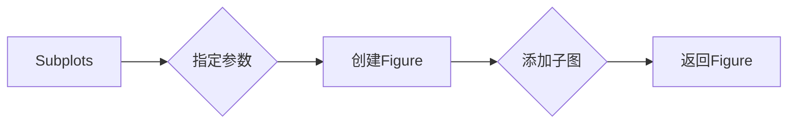

#### 带注释源码

```python
fig, (ax1, ax2) = plt.subplots(1, 2)
```

在这个例子中，`plt.subplots(1, 2)` 创建了一个包含两个子图的Figure对象，并将它们存储在元组 `(ax1, ax2)` 中。然后，这些子图被用于添加不同的图形元素，如矩形和条形图。


### np.arange

`np.arange` 是 NumPy 库中的一个函数，用于生成一个沿指定范围的数组。

参数：

- `start`：`int`，数组的起始值。
- `stop`：`int`，数组的结束值，但不包括该值。
- `step`：`int`，步长，默认为 1。

返回值：`numpy.ndarray`，一个沿指定范围的数组。

#### 流程图

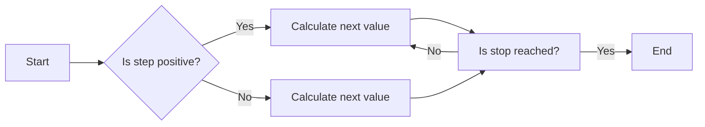

#### 带注释源码

```python
import numpy as np

def np_arange(start, stop=None, step=1):
    """
    Generate an array with values from start to stop with a specified step.

    Parameters:
    - start: The starting value of the array.
    - stop: The ending value of the array, exclusive.
    - step: The step between values, default is 1.

    Returns:
    - numpy.ndarray: An array with values from start to stop with a specified step.
    """
    return np.arange(start, stop, step)
```


### np.linspace

`np.linspace` 是 NumPy 库中的一个函数，用于生成线性间隔的数字数组。

参数：

- `start`：`float`，起始值。
- `stop`：`float`，结束值。
- `num`：`int`，生成的数组中的数字数量（不包括结束值）。
- `dtype`：`dtype`，可选，输出数组的类型。
- `endpoint`：`bool`，可选，是否包含结束值。

返回值：`numpy.ndarray`，一个包含线性间隔数字的数组。

#### 流程图


#### 带注释源码

```python
import numpy as np

def linspace(start, stop, num=50, dtype=None, endpoint=True):
    """
    Generate linearly spaced numbers over a specified interval.

    Parameters
    ----------
    start : float
        The starting value of the sequence.
    stop : float
        The end value of the sequence, not included in the output.
    num : int, optional
        Number of samples to generate. Default is 50.
    dtype : dtype, optional
        The type of the output array. If `dtype` is not specified, the type is
        determined by the `start` and `stop` values.
    endpoint : bool, optional
        If True, the stop value is included in the output sequence.

    Returns
    -------
    out : ndarray
        Array of linearly spaced values.

    Examples
    --------
    >>> np.linspace(0, 5, 10)
    array([0.  1.  2.  3.  4.  5.  6.  7.  8.  9.])

    >>> np.linspace(0, 5, 10, endpoint=False)
    array([0.  1.  2.  3.  4.  5.])

    >>> np.linspace(0, 5, num=3)
    array([0.  2.33333333  4.66666667])
    """
    return np.linspace(start, stop, num, dtype, endpoint)
```


### np.meshgrid

`np.meshgrid` 是一个 NumPy 函数，用于生成网格数据，它将输入的数组转换为二维网格。

参数：

- `x`：一维数组，表示网格的 x 坐标。
- `y`：一维数组，表示网格的 y 坐标。

参数描述：

- `x` 和 `y` 是输入的一维数组，它们定义了网格的行和列。
- 如果 `x` 和 `y` 的长度不同，`np.meshgrid` 会自动扩展它们以匹配。

返回值：

- 返回值类型：元组，包含两个二维数组。
- 返回值描述：第一个数组是 x 坐标的网格，第二个数组是 y 坐标的网格。

#### 流程图

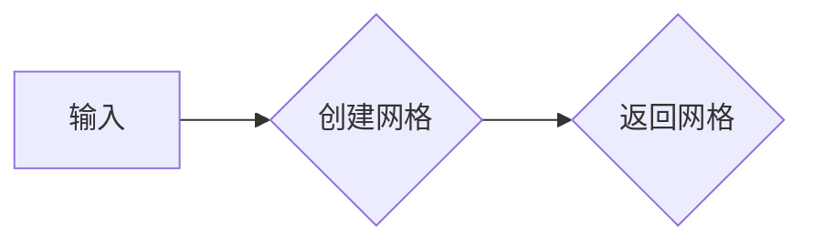

#### 带注释源码

```python
import numpy as np

# 定义输入数组
x = np.arange(1, 5)
y = np.arange(1, 5)

# 使用 np.meshgrid 创建网格
X, Y = np.meshgrid(x, y)

# 输出网格
print("X:\n", X)
print("Y:\n", Y)
```

```
X:
 [[1. 1. 1. 1.]
 [2. 2. 2. 2.]
 [3. 3. 3. 3.]
 [4. 4. 4. 4.]]
Y:
 [[1. 1. 1. 1.]
 [2. 2. 2. 2.]
 [3. 3. 3. 3.]
 [4. 4. 4. 4.]]
``` 


### plt.show()

显示当前图形。

参数：

- 无

返回值：无

#### 流程图

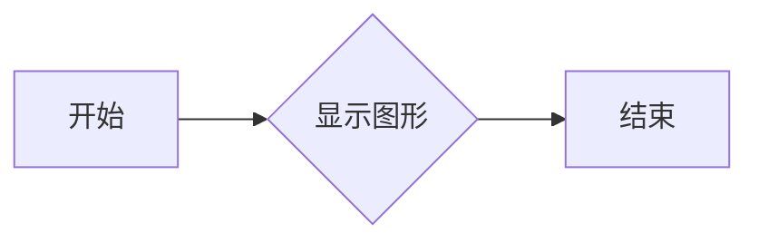

#### 带注释源码

```
plt.show()
```


### Rectangle.add_patch()

将一个 `Patch` 对象添加到 `Axes` 对象中。

参数：

- patch：`Patch` 对象，要添加的 `Patch` 对象。

返回值：无

#### 流程图

```mermaid
graph LR
A[开始] --> B{创建Axes对象}
B --> C{创建Rectangle对象}
C --> D{创建第二个Rectangle对象}
D --> E{调用add_patch()方法}
E --> F[结束]
```

#### 带注释源码

```python
ax1.add_patch(Rectangle((0.1, 0.5), 0.8, 0.3, hatch=".", hatchcolor='red',
                        edgecolor='black', lw=2))
```


### Rectangle.__init__()

创建一个矩形 `Patch` 对象。

参数：

- x：`float`，矩形左下角的 x 坐标。
- y：`float`，矩形左下角的 y 坐标。
- width：`float`，矩形的宽度。
- height：`float`，矩形的高度。
- hatch：`str`，填充图案。
- hatchcolor：`color`，填充图案的颜色。
- edgecolor：`color`，边框颜色。
- lw：`float`，边框宽度。

返回值：无

#### 流程图

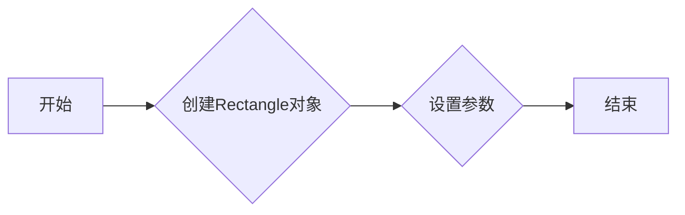

#### 带注释源码

```python
Rectangle((0.1, 0.5), 0.8, 0.3, hatch=".", hatchcolor='red',
           edgecolor='black', lw=2)
```


### bar()

绘制条形图。

参数：

- x：`array_like`，条形图的 x 坐标。
- y：`array_like`，条形图的 y 坐标。
- facecolor：`color`，条形图填充颜色。
- edgecolor：`color`，条形图边框颜色。
- hatch：`str`，填充图案。
- hatchcolor：`color`，填充图案的颜色。

返回值：`BarContainer` 对象。

#### 流程图

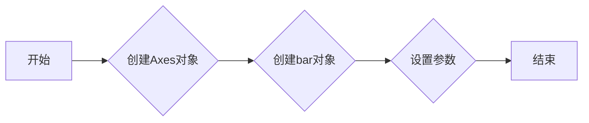

#### 带注释源码

```python
ax2.bar(x, y, facecolor='none', edgecolor='red', hatch='//', hatchcolor='blue')
```


### scatter()

绘制散点图。

参数：

- x：`array_like`，散点图的 x 坐标。
- y：`array_like`，散点图的 y 坐标。
- s：`array_like`，散点的大小。
- facecolor：`color`，散点填充颜色。
- edgecolor：`color`，散点边框颜色。
- linewidth：`float`，散点边框宽度。
- marker：`str`，散点标记。
- hatch：`str`，填充图案。
- hatchcolor：`color`，填充图案的颜色。

返回值：`PathCollection` 对象。

#### 流程图

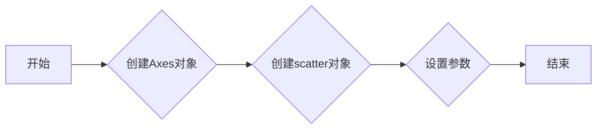

#### 带注释源码

```python
ax.scatter(
    X.ravel(),
    Y.ravel(),
    s=1700,
    facecolor="none",
    edgecolor="gray",
    linewidth=2,
    marker="h",  # Use hexagon as marker
    hatch="xxx",
    hatchcolor=colors,
)
```


### matplotlib.pyplot.subplots()

创建一个图形和一个轴。

参数：

- nrows：`int`，轴的数量。
- ncols：`int`，轴的列数。
- figsize：`tuple`，图形的大小。
- subplot_kw：`dict`，传递给 `subplots_adjust` 的关键字参数。
- gridspec_kw：`dict`，传递给 `GridSpec` 的关键字参数。

返回值：`Figure` 对象和轴的数组。

#### 流程图

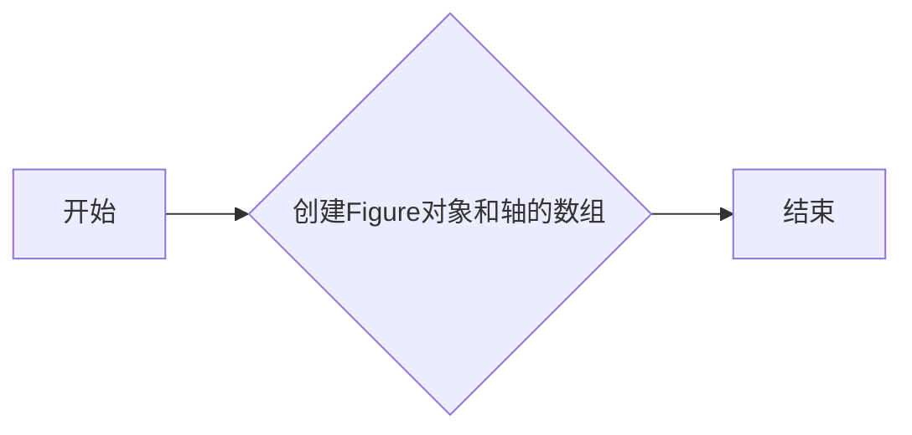

#### 带注释源码

```python
fig, (ax1, ax2) = plt.subplots(1, 2)
```


### matplotlib.cm.rainbow()

返回一个彩虹色的颜色映射。

参数：

- val：`float`，颜色映射的值。

返回值：`color`，颜色映射的颜色。

#### 流程图

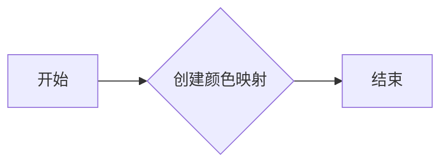

#### 带注释源码

```python
colors = [cm.rainbow(val) for val in x]
```


### numpy.linspace()

生成线性空间。

参数：

- start：`float`，线性空间的起始值。
- stop：`float`，线性空间的结束值。
- num：`int`，线性空间的点数。

返回值：`array`，线性空间。

#### 流程图

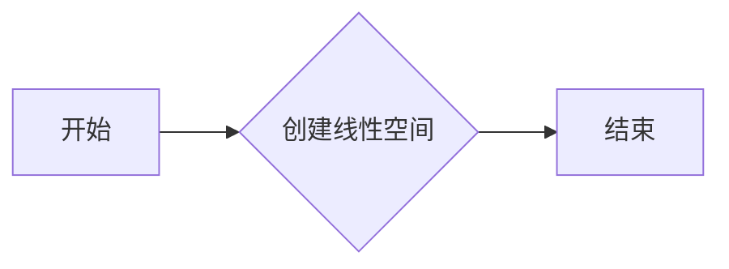

#### 带注释源码

```python
x = np.linspace(0, 1, num_points_x)
y = np.linspace(0, 1, num_points_y)
```


### numpy.meshgrid()

根据输入的数组生成网格。

参数：

- x：`array_like`，x 坐标。
- y：`array_like`，y 坐标。

返回值：`tuple`，网格的 x 和 y 坐标。

#### 流程图

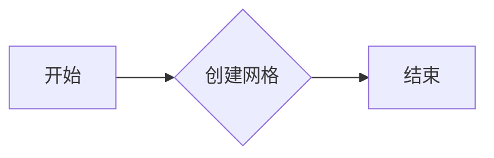

#### 带注释源码

```python
X, Y = np.meshgrid(x, y)
```


### Rectangle.__init__

Rectangle类的构造函数，用于初始化矩形对象。

参数：

- `self`：`None`，表示当前实例。
- `x`：`float`，矩形的左下角x坐标。
- `y`：`float`，矩形的左下角y坐标。
- `width`：`float`，矩形的宽度。
- `height`：`float`，矩形的高度。
- `hatch`：`str`，矩形的填充图案。
- `hatchcolor`：`str`，矩形的填充颜色。
- `edgecolor`：`str`，矩形的边缘颜色。
- `facecolor`：`str`，矩形的填充颜色。
- `linewidth`：`float`，矩形的边缘宽度。

返回值：`None`，无返回值。

#### 流程图

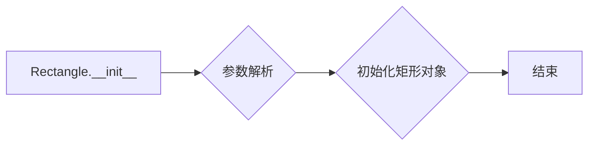

#### 带注释源码

```python
def __init__(self, x, y, width, height, hatch=' ', hatchcolor=None, edgecolor=None, facecolor=None, linewidth=1):
    self.x = x
    self.y = y
    self.width = width
    self.height = height
    self.hatch = hatch
    self.hatchcolor = hatchcolor
    self.edgecolor = edgecolor
    self.facecolor = facecolor
    self.linewidth = linewidth
```


### `Axes.add_patch`

`Axes.add_patch` 是一个方法，用于向 `Axes` 对象中添加一个 `Patch` 对象。

参数：

- `patch`：`Patch`，要添加到 `Axes` 的 `Patch` 对象。

返回值：无

#### 流程图

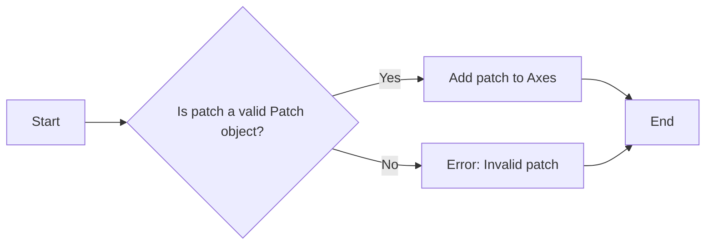

#### 带注释源码

```python
import matplotlib.pyplot as plt
import numpy as np
from matplotlib.patches import Rectangle

fig, ax = plt.subplots()

# Rectangle with red hatch color and black edge color
ax.add_patch(Rectangle((0.1, 0.5), 0.8, 0.3, hatch=".", hatchcolor='red',
                        edgecolor='black', lw=2))

# If hatchcolor is not passed, the hatch will match the edge color
ax.add_patch(Rectangle((0.1, 0.1), 0.8, 0.3, hatch='x', edgecolor='orange', lw=2))

plt.show()
```


### matplotlib.pyplot.bar

matplotlib.pyplot.bar 是一个用于创建条形图的函数。

参数：

- `x`：`array_like`，条形图的 x 坐标。
- `y`：`array_like`，条形图的 y 坐标。
- `width`：`float`，条形的宽度。
- `bottom`：`array_like`，条形的底部位置。
- `align`：`str`，条形对齐方式，可以是 'center'、'edge' 或 'center'。
- `data`：`matplotlib.colors.Normalize`，用于归一化数据的对象。
- `facecolor`：`color`，条形的填充颜色。
- `edgecolor`：`color`，条形的边缘颜色。
- `linewidth`：`float`，条形的边缘宽度。
- `capsize`：`float`，条形边缘的圆角大小。
- `hatch`：`str`，条形的纹理模式。
- `hatchcolor`：`color`，纹理的颜色。

返回值：`BarContainer`，包含条形图对象的容器。

#### 流程图


#### 带注释源码

```python
import matplotlib.pyplot as plt
import numpy as np

x = np.arange(1, 5)
y = np.arange(1, 5)

ax2.bar(x, y, facecolor='none', edgecolor='red', hatch='//', hatchcolor='blue')
```


### matplotlib.pyplot.scatter

matplotlib.pyplot.scatter 是一个用于创建散点图的函数。

参数：

- `X`：`numpy.ndarray`，散点在 x 轴上的坐标。
- `Y`：`numpy.ndarray`，散点在 y 轴上的坐标。
- `s`：`int` 或 `numpy.ndarray`，散点的大小。
- `facecolor`：`str` 或 `color`，散点的填充颜色。
- `edgecolor`：`str` 或 `color`，散点边缘的颜色。
- `linewidth`：`int` 或 `float`，散点边缘的宽度。
- `marker`：`str` 或 `path`，散点的形状。
- `hatch`：`str`，散点的纹理模式。
- `hatchcolor`：`str` 或 `color`，散点纹理的颜色。

返回值：`PathCollection`，散点图的路径集合。

#### 流程图


#### 带注释源码

```python
import numpy as np
import matplotlib.pyplot as plt
import matplotlib.cm as cm

fig, ax = plt.subplots()

num_points_x = 10
num_points_y = 9
x = np.linspace(0, 1, num_points_x)
y = np.linspace(0, 1, num_points_y)

X, Y = np.meshgrid(x, y)
X[1::2, :] += (x[1] - x[0]) / 2  # stagger every alternate row

colors = [cm.rainbow(val) for val in x]

ax.scatter(
    X.ravel(),
    Y.ravel(),
    s=1700,
    facecolor="none",
    edgecolor="gray",
    linewidth=2,
    marker="h",  # Use hexagon as marker
    hatch="xxx",
    hatchcolor=colors,
)

ax.set_xlim(0, 1)
ax.set_ylim(0, 1)

plt.show()
```


## 关键组件


### 张量索引与惰性加载

张量索引与惰性加载是指在处理大型数据集时，只对需要的数据进行索引和加载，以减少内存消耗和提高处理速度。

### 反量化支持

反量化支持是指对量化后的数据进行反量化处理，以便恢复原始数据精度。

### 量化策略

量化策略是指在模型训练和推理过程中，对模型参数进行量化处理，以减少模型大小和提高推理速度。

## 问题及建议


### 已知问题

-   **代码重复性**：在多个地方使用了相同的代码片段来创建图形和添加图形元素，这可能导致维护困难。
-   **文档不足**：代码注释和文档描述不够详细，对于不熟悉matplotlib库的用户来说，难以理解代码的功能和用法。
-   **全局变量和函数**：代码中使用了全局变量和函数，这可能导致代码的可读性和可维护性降低。

### 优化建议

-   **代码重构**：将重复的代码片段提取为函数或类，以减少代码重复并提高可维护性。
-   **增强文档**：为代码添加更详细的注释和文档，包括每个函数和类的用途、参数和返回值。
-   **避免全局变量和函数**：尽量使用局部变量和函数，以减少全局状态的影响，提高代码的模块化和可测试性。
-   **异常处理**：添加异常处理机制，以处理可能出现的错误情况，例如文件读取错误或图形绘制错误。
-   **代码风格**：遵循一致的代码风格指南，以提高代码的可读性和一致性。
-   **性能优化**：对于性能敏感的部分，考虑使用更高效的数据结构和算法。
-   **测试**：编写单元测试来验证代码的功能和正确性，确保代码的质量。

## 其它


### 设计目标与约束

- 设计目标：实现一个可配置的图案填充功能，允许用户通过`hatchcolor`参数设置图案的颜色。
- 约束条件：必须兼容`matplotlib.patches.Patch`和`matplotlib.collections.Collection`类。

### 错误处理与异常设计

- 错误处理：当传入无效的`hatchcolor`值时，应抛出异常，并给出明确的错误信息。
- 异常设计：定义自定义异常类，如`InvalidHatchColorError`，以处理特定的错误情况。

### 数据流与状态机

- 数据流：用户通过`hatchcolor`参数设置图案颜色，该参数随后被传递到绘图函数中。
- 状态机：无状态机，但存在一系列的函数调用，用于处理和绘制图案。

### 外部依赖与接口契约

- 外部依赖：依赖于`matplotlib`和`numpy`库。
- 接口契约：确保`hatchcolor`参数在`matplotlib.patches.Patch`和`matplotlib.collections.Collection`的子类中可用。


    