# `matplotlib\galleries\examples\shapes_and_collections\line_collection.py` 详细设计文档

该代码是Matplotlib示例程序，演示如何使用LineCollection高效绘制多条线条。程序包含两个示例：第一个示例绘制多个不同半径和颜色的半圆弧；第二个示例演示如何使用颜色映射（colormap）根据半径值为线条着色。

## 整体流程

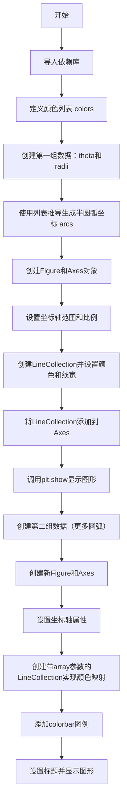

## 类结构

```
Python脚本（非面向对象设计）
使用Matplotlib和NumPy库
无自定义类定义
仅包含脚本级执行代码
```

## 全局变量及字段


### `colors`
    
颜色字符串列表，用于指定每条弧线的颜色

类型：`list[str]`
    


### `theta`
    
角度数组（0到π），用于生成半圆弧的采样点

类型：`numpy.ndarray`
    


### `radii`
    
半径数组（第一组），定义半圆弧的半径值

类型：`numpy.ndarray`
    


### `arcs`
    
半圆弧坐标列表，每个元素包含一组(x,y)坐标点

类型：`list[numpy.ndarray]`
    


### `fig`
    
matplotlib Figure对象，表示整个图形窗口

类型：`matplotlib.figure.Figure`
    


### `ax`
    
matplotlib Axes对象，表示图形中的坐标轴

类型：`matplotlib.axes.Axes`
    


### `line_collection`
    
LineCollection实例，用于高效绘制多条线段

类型：`matplotlib.collections.LineCollection`
    


### `num_arcs`
    
圆弧数量（第二组），用于颜色映射示例中的弧线数量

类型：`int`
    


### `LineCollection.arcs (线段坐标列表)`
    
线段坐标列表，存储要绘制的线段顶点数据

类型：`list[numpy.ndarray]`
    


### `LineCollection.colors (颜色序列)`
    
颜色序列，为每条线段指定独立颜色

类型：`list[str]`
    


### `LineCollection.linewidths (线宽)`
    
线宽，设置线条的粗细程度

类型：`float or list[float]`
    


### `LineCollection.array (数值数组，用于颜色映射)`
    
数值数组，用于颜色映射的数值数据

类型：`numpy.ndarray`
    


### `LineCollection.cmap (颜色映射名称)`
    
颜色映射名称，指定颜色映射方案

类型：`str`
    
    

## 全局函数及方法


### `np.linspace`

`np.linspace` 是 NumPy 库中的一个函数，用于生成指定范围内的等间距数值数组，常用于创建测试数据或作为绘图的 x 轴坐标。

参数：

- `start`：`float`，序列的起始值
- `stop`：`float`，序列的结束值（除非 `endpoint` 为 `False`）
- `num`：`int`，要生成的样本数量，默认为 50
- `endpoint`：`bool`，如果为 `True`，则包含结束值，默认为 `True`
- `retstep`：`bool`，如果为 `True`，则返回步长，默认为 `False`
- `dtype`：`dtype`，输出数组的数据类型，如果未指定，则从输入推断

返回值：`ndarray`，返回等间距的数组

#### 流程图

```mermaid
graph TD
    A[输入: start, stop, num] --> B{retstep=True?}
    B -->|Yes| C[计算步长 step = (stop-start) / (num-1)]
    B -->|No| D[计算步长 step = (stop-start) / num]
    C --> E[生成 num 个等间距样本]
    D --> E
    E --> F{endpoint=False?}
    F -->|Yes| G[排除 stop 值，使用 step 计算]
    F -->|No| H[包含 stop 值]
    G --> I[输出: ndarray]
    H --> I
    B -->|Yes| J[同时返回步长]
    I --> J
    J --> K[输出: (ndarray, step)]
```

#### 带注释源码

```python
# np.linspace 的典型用法示例

# 示例 1: 基本用法 - 生成从 0 到 pi 的 36 个等间距点
theta = np.linspace(0, np.pi, 36)
# 结果: array([0.        , 0.08979739, 0.17959479, ..., 2.96199879, 3.05179619, 3.14159265])

# 示例 2: 使用 num 参数指定数量
radii = np.linspace(4, 5, num=len(colors))
# 如果 colors 有 6 个元素，则生成 6 个从 4 到 5 的等间距值

# 示例 3: 不包含结束值
arr = np.linspace(0, 10, 5, endpoint=False)
# 结果: array([0., 2., 4., 6., 8.])

# 示例 4: 返回步长值
arr, step = np.linspace(0, 10, 5, retstep=True)
# arr: array([ 0. ,  2.5,  5. ,  7.5, 10. ])
# step: 2.5
```


### `np.column_stack`

将一维数组序列按列堆叠成二维数组。函数接受一个数组序列（通常为两个一维数组），将每个数组作为一列添加到输出矩阵中，形成一个二维数组。如果输入是一维数组，会先将其 reshape 为列向量后再堆叠。

参数：

-  `tensors`：`array_like`，一维或二维数组的序列。所有输入数组在堆叠方向（第一个轴）以外的维度必须兼容。

返回值：

-  `ndarray`，二维数组，其列数等于输入序列的长度，行数等于输入数组在第一个轴方向的大小。

#### 流程图

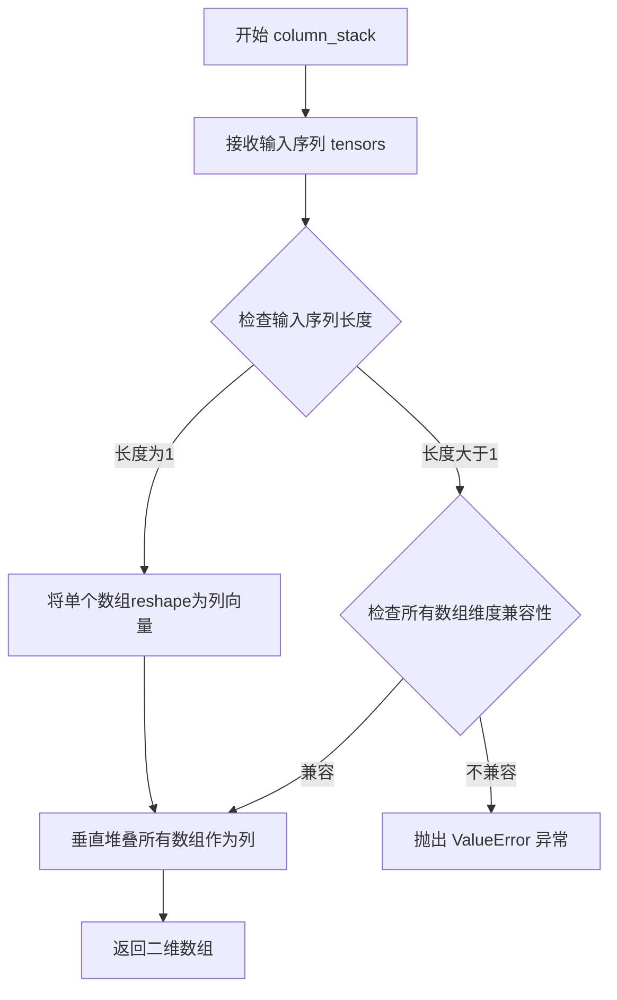

#### 带注释源码

```python
# 从给定的代码示例中提取的 np.column_stack 使用方式
# 示例：将极坐标转换为笛卡尔坐标

theta = np.linspace(0, np.pi, 36)    # 角度数组，从 0 到 π，共 36 个点
radii = np.linspace(4, 5, num=len(colors))  # 半径数组

# 使用 np.column_stack 将两个一维数组堆叠成二维数组
# 输入: [r * np.cos(theta), r * np.sin(theta)]
#   - r * np.cos(theta): x 坐标，一维数组 shape (36,)
#   - r * np.sin(theta): y 坐标，一维数组 shape (36,)
# 输出: 二维数组，shape (36, 2)，每行是一个点的 (x, y) 坐标
arcs = [np.column_stack([r * np.cos(theta), r * np.sin(theta)]) for r in radii]

# 详细解析：
# np.column_stack 的功能：
#   1. 接收数组列表或元组作为输入
#   2. 将每个输入数组视为一列
#   3. 垂直（沿第一个轴）堆叠这些数组
#   4. 返回二维 ndarray
#
# 参数类型说明：
#   - 输入必须是 array_like（列表、元组、numpy 数组等）
#   - 所有输入在非堆叠轴上的维度必须一致
#
# 返回值说明：
#   - 返回 ndarray，维度为二维
#   - 列数 = 输入序列的长度
#   - 行数 = 输入数组在第一个轴上的大小
```


### `np.cos`

`np.cos`是NumPy库中的三角函数计算函数，用于计算输入角度（弧度）的余弦值。该函数接受一个数值或数组作为输入，返回对应角度的余弦结果。在本代码中用于计算半圆弧的x坐标点。

参数：

- `x`：`numpy.ndarray` 或 `float`，输入角度，单位为弧度，可以是标量值或任意维度的数组

返回值：`numpy.ndarray` 或 `float`，返回输入角度的余弦值，类型与输入参数类型相同

#### 流程图

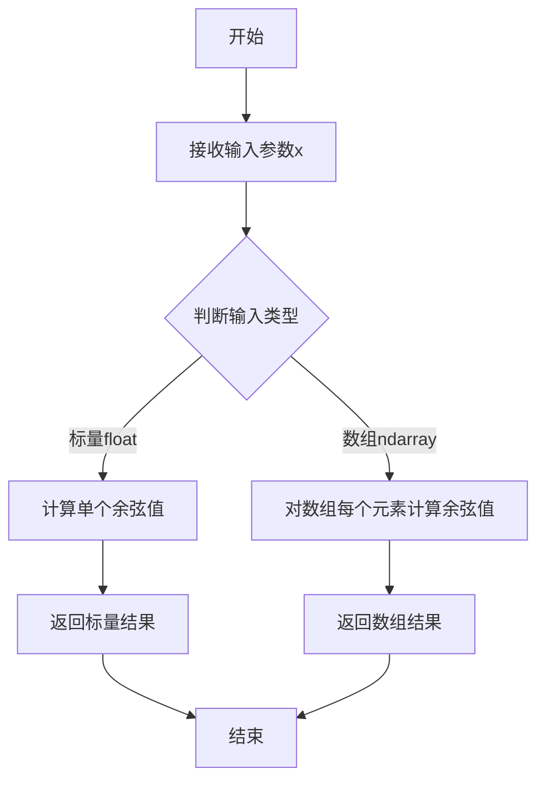

#### 带注释源码

```python
# np.cos 函数源码说明（NumPy内部实现）
# 以下为Python层面的使用示例和说明

# 导入numpy库
import numpy as np

# 定义角度数组（弧度制）
theta = np.linspace(0, np.pi, 36)  # 从0到π生成36个等间距点

# 调用np.cos计算余弦值
# 输入：theta - numpy.ndarray类型的弧度数组
# 输出：对应角度的余弦值数组
x_coords = np.cos(theta)

# 在本代码中的实际应用：
# np.column_stack([r * np.cos(theta), r * np.sin(theta)])
# 这行代码中：
# - np.cos(theta) 计算theta数组中每个角度的余弦值
# - 乘以半径r得到半圆弧的x坐标
# - np.sin(theta) 计算半圆弧的y坐标
# - np.column_stack 将x和y坐标组合成二维数组

# 示例：计算单个角度的余弦
single_cos = np.cos(np.pi)  # 返回 -1.0
# 示例：计算角度数组的余弦
array_cos = np.cos(np.array([0, np.pi/2, np.pi]))  # 返回 [1. 0. -1.]
```

#### 关键组件信息

- **numpy (np)**：Python科学计算基础库，提供高效的数组操作和数学函数
- **np.linspace**：用于生成等间距数值序列的函数
- **np.column_stack**：用于将多个一维数组合并成二维数组的函数

#### 潜在技术债务或优化空间

1. **重复计算**：代码中多次使用`np.cos(theta)`和`np.sin(theta)`，可以预先计算一次并复用
2. **硬编码参数**：颜色数组和线宽等参数直接硬编码，可考虑配置化

#### 其它说明

- **设计目标**：演示如何使用LineCollection高效绘制多条曲线，并展示两种颜色映射方式
- **输入约束**：theta必须是弧度制，如果是角度需要转换为弧度（角度 * π / 180）
- **数值精度**：对于非常大或非常小的输入值，由于浮点数精度问题可能会有误差
- **外部依赖**：完全依赖NumPy和Matplotlib库


### `np.sin`

正弦函数，计算输入角度（弧度制）的正弦值。这是 NumPy 库中的数学函数，用于逐元素计算输入数组或标量的正弦值。

参数：

-  `theta`：`numpy.ndarray` 或 `float`，输入的角度值（弧度制），可以是标量或数组
-  `out`：`numpy.ndarray`，可选，用于存储结果的输出数组
-  `where`：`numpy.ndarray`，可选，条件索引，用于指定计算位置
-  `dtype`：`numpy.dtype`，可选，指定输出数组的数据类型
-  `subok`：可选，暂未使用
-  `signature`：可选，暂未使用
-  `extobj`：可选，暂未使用

返回值：`numpy.ndarray`，输入角度的正弦值，返回与输入形状相同的数组

#### 流程图

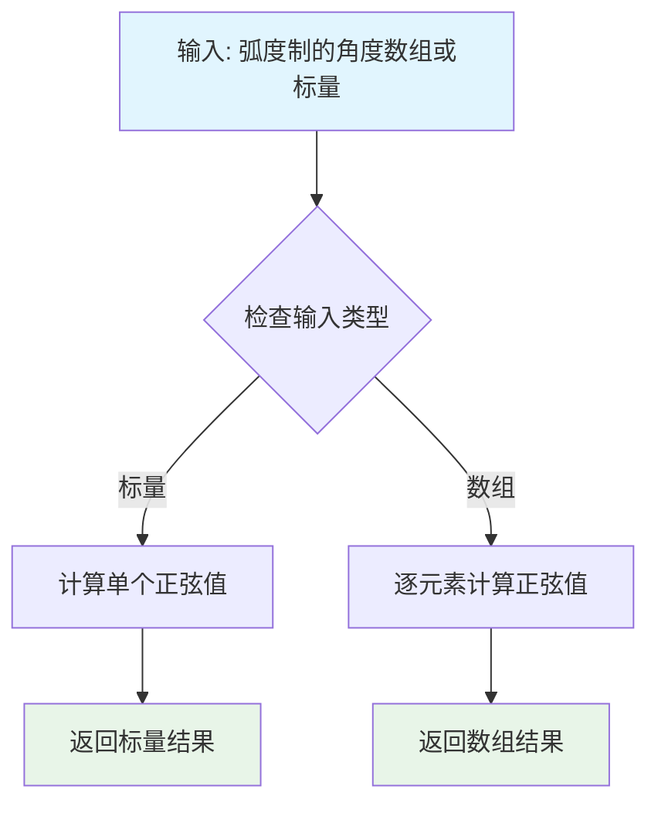

#### 带注释源码

```python
# np.sin 函数使用示例（在给定代码中）

# 1. 定义角度数组（0 到 π 弧度，共36个点）
theta = np.linspace(0, np.pi, 36)

# 2. 计算每个角度的正弦值
#    np.sin 接收弧度制的角度，返回 [-1, 1] 范围内的正弦值
#    输入: theta (numpy.ndarray) - 弧度数组
#    输出: 正弦值数组 (numpy.ndarray)
sine_values = np.sin(theta)

# 3. 在实际代码中的应用：创建半圆弧线
#    r * np.cos(theta) 计算 x 坐标
#    r * np.sin(theta) 计算 y 坐标
#    这里 np.sin 用于将角度转换为半圆弧的 y 坐标
arc = np.column_stack([r * np.cos(theta), r * np.sin(theta)])
#    结果: 形状为 (36, 2) 的二维数组，包含半圆弧上每点的 (x, y) 坐标
```


### `plt.subplots`

`plt.subplots` 是 Matplotlib 库中的核心函数，用于创建一个新的图形窗口（Figure）和一个或多个坐标轴（Axes）对象，并返回这些对象的引用，支持快速创建单或多子图的图形界面。

参数：

- `nrows`：`int`，可选，默认值为 1，表示图形的行数。
- `ncols`：`int`，可选，默认值为 1，表示图形的列数。
- `figsize`：`tuple of float`，可选，指定图形的宽和高（英寸）。
- `dpi`：`int`，可选，指定图形的分辨率（每英寸点数）。
- `facecolor`：`color`，可选，图形背景颜色。
- `edgecolor`：`color`，可选，图形边框颜色。
- `frameon`：`bool`，可选，是否绘制图形框架。
- `sharex`：`bool`，可选，是否共享x轴。
- `sharey`：`bool`，可选，是否共享y轴。
- `squeeze`：`bool`，可选，是否压缩返回的坐标轴数组维度。
- `subplot_kw`：`dict`，可选，传递给底层 `add_subplot` 的关键字参数。
- `gridspec_kw`：`dict`，可选，传递给 GridSpec 构造函数的关键字参数。
- `**kwargs`：其他关键字参数，传递给 Figure 的构造函数。

返回值：`tuple of (Figure, Axes or array of Axes)`，返回图形对象和单个坐标轴对象或坐标轴数组。

#### 流程图

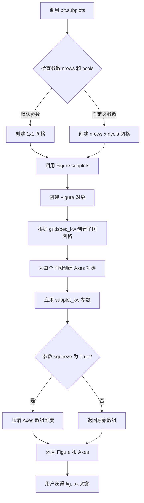

#### 带注释源码

```python
# 在示例代码中的调用方式
fig, ax = plt.subplots(figsize=(6.4, 3.2))

# 参数说明：
# figsize=(6.4, 3.2) - 设置图形宽度为6.4英寸，高度为3.2英寸
# 返回值：
# fig - Figure 对象，代表整个图形窗口
# ax - Axes 对象，代表图形中的坐标轴

# 第二次调用
fig, ax = plt.subplots(figsize=(6.4, 3))  # 创建另一个图形
```

### 文件的整体运行流程

本示例文件展示了使用 `LineCollection` 绘制多条线段的功能。整体流程如下：

1. **导入阶段**：导入必要的库（`matplotlib.pyplot`、`numpy`、`matplotlib.collections`）
2. **数据准备阶段**：创建颜色列表、角度数组和半径数组
3. **第一部分 - 基本用法**：
   - 调用 `plt.subplots` 创建图形和坐标轴
   - 设置坐标轴参数（限制、纵横比）
   - 创建 `LineCollection` 对象并指定颜色和线宽
   - 将集合添加到坐标轴
   - 调用 `plt.show()` 显示图形
4. **第二部分 - 颜色映射**：
   - 创建新的图形和坐标轴
   - 使用 `array` 参数进行颜色映射
   - 添加颜色条
   - 设置标题并显示图形

### 关键组件信息

- **LineCollection**：用于高效绘制多条线段的集合类，支持单独或统一设置属性
- **Figure**：图形对象，代表整个绘图窗口
- **Axes**：坐标轴对象，代表图形中的绘图区域
- **colormap**：颜色映射对象，用于将数值映射到颜色

### 潜在的技术债务或优化空间

1. **硬编码参数**：图形大小、颜色、线宽等参数硬编码在代码中，缺乏灵活性
2. **重复代码**：两段图形创建代码有大量重复，可以封装成函数
3. **缺乏错误处理**：没有对输入数据进行验证（如数组长度匹配）
4. **魔法数字**：如 `36`、`4`、`5` 等数值缺乏命名常量

### 其它项目

#### 设计目标与约束
- 目标：展示如何使用 `LineCollection` 高效绘制多条线段
- 约束：Collections 不参与自动缩放，需要手动设置坐标轴限制

#### 错误处理与异常设计
- 如果 `arcs` 列表中的数组维度不一致，可能导致绘制错误
- 如果 `colors` 列表长度与 `arcs` 不匹配，可能引发索引错误

#### 数据流与状态机
- 数据流：numpy数组 → LineCollection → Axes → Figure → 显示
- 状态机：创建图形 → 设置参数 → 添加集合 → 渲染显示

#### 外部依赖与接口契约
- 依赖：`matplotlib`、`numpy`
- 接口：遵循 Matplotlib 的标准 Figure/Axes 接口约定


### `plt.show`

`plt.show` 是 matplotlib.pyplot 模块中的函数，用于显示所有当前打开的图形窗口并进入事件循环。在本代码中，该函数被调用两次，分别用于展示两个使用 LineCollection 绘制的半圆弧线图形。

参数： 无

返回值：`None`，该函数不返回任何值，只是将图形渲染到屏幕并显示。

#### 流程图

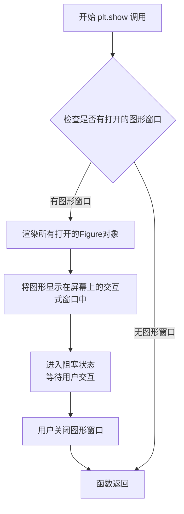

#### 带注释源码

```python
# plt.show() 的实际定义位于 matplotlib 库中
# 以下是调用流程的示意：

# 1. 在本代码中，plt.show() 被调用来显示第一个 LineCollection 图形
fig, ax = plt.subplots(figsize=(6.4, 3.2))
# ... 设置 axes 属性和创建 LineCollection ...
line_collection = LineCollection(arcs, colors=colors, linewidths=4)
ax.add_collection(line_collection)

# 2. 调用 plt.show() 显示第一个图形
plt.show()  # <--- 第一次调用：显示带有指定颜色的半圆弧线

# 3. 创建第二个图形
fig, ax = plt.subplots(figsize=(6.4, 3))
# ... 再次设置和创建 LineCollection ...
line_collection = LineCollection(arcs, array=radii, cmap="rainbow")
ax.add_collection(line_collection)
fig.colorbar(line_collection, label="Radius")

# 4. 再次调用 plt.show() 显示第二个图形
plt.show()  # <--- 第二次调用：显示带有颜色映射的半圆弧线

# 注意：在某些后端（如 Qt5Agg, TkAgg）中，
# 第一个 plt.show() 会阻塞代码执行直到图形窗口被关闭
# 而在某些交互式环境中可能会立即返回
```

#### 关键说明

| 项目 | 说明 |
|------|------|
| **函数位置** | `matplotlib.pyplot.show()` |
| **阻塞行为** | 在大多数交互式后端中会阻塞主线程，直到用户关闭图形窗口 |
| **调用次数** | 本代码中调用了两次，分别显示两个不同的图形 |
| **与 Figure 的关系** | 显示当前所有通过 `plt.subplots()` 或 `plt.figure()` 创建的 Figure 对象 |
| **常见后端** | Qt5Agg, TkAgg, Agg, WebAgg 等，不同后端可能有不同的显示行为 |


### plt.figure

创建新的图形（Figure）对象并返回，是 matplotlib 中用于初始化图形窗口的核心函数。

#### 参数

- **figsize**：`tuple of (float, float)`，图形的宽和高（英寸），例如 (6.4, 3.2) 表示宽度6.4英寸、高度3.2英寸
- **dpi**：`int`，图形分辨率（每英寸点数），默认为 100
- **facecolor**：`str` 或 `tuple`，图形背景颜色，默认为白色 ('white')
- **edgecolor**：`str` 或 `tuple`，图形边框颜色
- **frameon**：`bool`，是否绘制边框，默认为 True
- **num**：`int` 或 `str`，图形编号或名称，用于标识图形窗口
- **clear**：`bool`，如果为 True 且存在同名图形，则清除现有图形内容，默认为 False

#### 返回值

`matplotlib.figure.Figure`，返回新创建的图形对象

#### 流程图

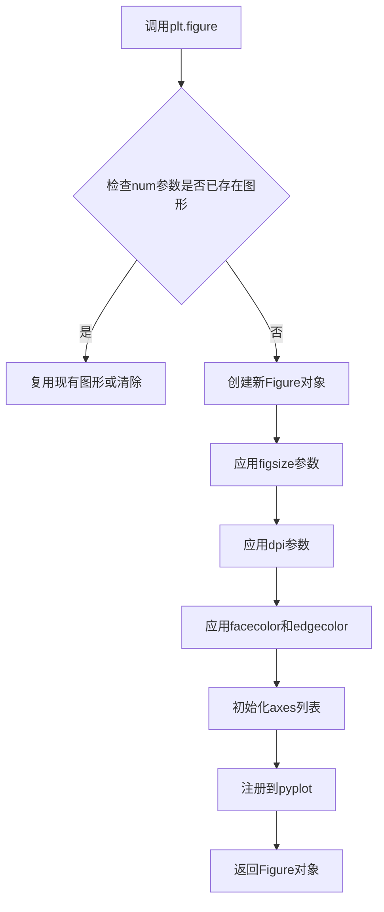

#### 带注释源码

```python
import matplotlib.pyplot as plt
import numpy as np

# ==========================================
# 使用 plt.figure 创建新图形
# ==========================================

# 方法1: 使用默认参数创建图形
fig1 = plt.figure()

# 方法2: 创建指定尺寸的图形
# figsize=(6.4, 3.2) 设置图形宽6.4英寸，高3.2英寸
# dpi=100 设置分辨率为100 dots per inch
fig2 = plt.figure(figsize=(6.4, 3.2), dpi=100)

# 方法3: 创建带背景色的图形
# facecolor='white' 设置背景为白色
# edgecolor='black' 设置边框为黑色
fig3 = plt.figure(facecolor='lightgray', edgecolor='black')

# 方法4: 复用或替换现有图形
# num='my_figure' 指定图形名称，如果已存在则复用
fig4 = plt.figure(num='my_figure', clear=True)

# 在实际代码中，通常使用 plt.subplots() 间接调用 figure
# plt.subplots() 内部会先调用 plt.figure() 创建图形
# 然后创建 Axes 并返回 (fig, ax) 元组

# 下面是代码中的实际用法（plt.subplots 内部隐式调用了 plt.figure）：
fig, ax = plt.subplots(figsize=(6.4, 3.2))  # 内部调用: fig = plt.figure(figsize=(6.4, 3.2))
ax.set_xlim(-6, 6)
ax.set_ylim(0, 6)
# ... 继续绘图操作 ...

plt.show()  # 显示所有图形
```


### `LineCollection.__init__`

`LineCollection` 的构造函数，用于创建一个线集合对象，该对象可以高效地绘制多条线段，支持逐线设置属性（如颜色、线宽）或使用颜色映射来根据数值显示颜色。

参数：

- `segments`：`list of array-like`，要绘制的线段列表，每个元素是一个形状为 (N, 2) 的数组，表示一条线的坐标点
- `colors`：`color list or tuple or str or matplotlib color array or None`，线条颜色，可以是颜色列表、单一颜色值或 None
- `linewidths`：`float or list of floats`，线条宽度，可以是单一数值或与线段数量匹配的数值列表
- `antialiaseds`：`bool or list of bools`，是否启用抗锯齿渲染，可以是单一布尔值或布尔值列表
- `transOffset`：`matplotlib transforms.Transform`， offsets 的变换
- `norm`：`matplotlib.colors.Normalize`，用于将数据值映射到颜色映射的颜色数据归一化对象
- `cmap`：`str or matplotlib colormap`，用于颜色映射的调色板名称
- `zorder`：`float`，绘制顺序，数值越大越晚绘制

返回值：`LineCollection`，返回新创建的线集合对象

#### 流程图

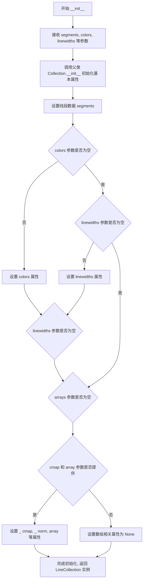

#### 带注释源码

```python
def __init__(self, segments, *,
             colors=None,
             linewidths=None,
             antialiaseds=None,
             offsets=None,
             transOffset=None,
             norm=None,
             cmap=None,
             arrays=None,
             zorder=2,
             **kwargs):
    """
    Parameters
    ----------
    segments : list of array-like
        A sequence of (N, 2) ndarray, where N is the number of points in the line.
        Each line can have a different number of points.
    colors : color list or tuple or str or matplotlib color array or None
        Collection colors. If None, the colors will be chosen by the colormap.
    linewidths : float or list of floats
        The width of each line in points.
    antialiaseds : bool or list of bools
        The antialiased state of each line.
    offsets : (N, 2) array-like
        Offsets for the collection.
    transOffset : matplotlib transforms.Transform
        Transform for the offsets.
    norm : matplotlib.colors.Normalize
        A Normalize instance to map data values to the colormap.
    cmap : str or matplotlib colormap
        The colormap to use for colors.
    arrays : list of array-like
        A sequence of arrays mapping each line to a value.
    zorder : float
        The drawing order.
    **kwargs
        All other parameters are passed to the `~matplotlib.collections.Collection`
        constructor.
    """
    # 初始化 LineCollection 实例的空列表用于存储线段
    self._paths = []
    
    # 调用父类 Collection 的初始化方法
    super().__init__(
        offsets=offsets,
        transOffset=transOffset,
        zorder=zorder,
        **kwargs,
    )
    
    # 设置线段数据
    self.set_segments(segments)
    
    # 设置颜色和线宽属性
    if colors is not None:
        self.set_colors(colors)
    if linewidths is not None:
        self.set_linewidths(linewidths)
    if antialiaseds is not None:
        self.set_antialiased(antialiaseds)
    
    # 设置数组和颜色映射相关属性
    if arrays is not None:
        self.set_arrays(arrays)
    if cmap is not None and norm is not None:
        self.set_cmap(cmap)
        self.set_norm(norm)
    # 注意: LineCollection 实际实现可能使用 set_array 而不是 set_arrays
```


### Figure.colorbar

向图形添加颜色条（colorbar），用于显示图形中颜色映射的数值对应关系。在matplotlib中，颜色条通常与使用colormap的可视化元素（如`LineCollection`、`Image`等）配合使用，用于解释颜色与数值的对应关系。

参数：

- `mappable`：第一个位置参数，可以是`ScalarMappable`对象（如`LineCollection`、`Image`、`ContourSet`等），也就是需要添加颜色条的可映射对象。该对象应该包含colormap和array数据。
- `label`：`str`，可选参数，用于设置颜色条的标签文字，示例中设置为"Radius"。
- `ax`：`Axes`或`axes列表`，可选参数，指定颜色条所在的axes。如果不指定，默认使用图形的主axes。
- `use_gridspec`：`bool`，可选参数，如果为True且ax为None，则使用gridspec来定位颜色条。

返回值：`Colorbar`，返回创建的颜色条对象，可用于进一步自定义颜色条的外观和行为。

#### 流程图

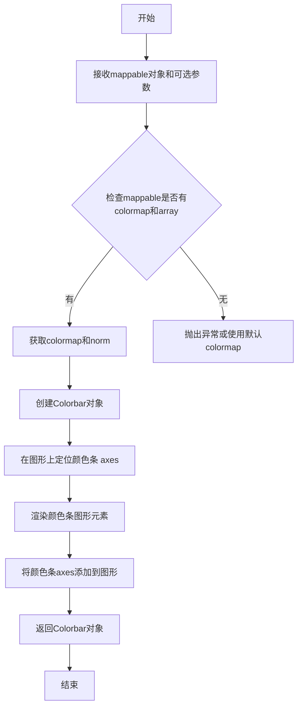

#### 带注释源码

```python
# matplotlib.figure.Figure.colorbar 方法的调用示例
# 源代码位于 matplotlib/lib/matplotlib/figure.py 中

# 示例代码中的实际调用：
fig, ax = plt.subplots(figsize=(6.4, 3))
# ... (创建LineCollection的代码省略)

# 创建颜色条
# 参数1: mappable - 可映射对象，这里是LineCollection
# 参数2: label - 颜色条的标签
cbar = fig.colorbar(line_collection, label="Radius")

# colorbar 方法内部大致逻辑：
# 1. 验证 mappable 对象是否有效
#    - 检查是否具有 get_cmap() 方法获取colormap
#    - 检查是否具有 get_array() 方法获取数值数组
#    - 检查是否具有 get_norm() 方法获取归一化对象

# 2. 创建 Colorbar 实例
#    colorbar = Colorbar(ax, mappable, **kwargs)

# 3. 绘制颜色条
#    colorbar.draw_all()

# 4. 将颜色条axes添加到图形
#    self.colorbars.append(colorbar)

# 返回颜色条对象，可用于后续定制
# 例如：cbar.set_label("新标签") 或 cbar.set_ticks([...])
```

#### 关键组件信息

| 组件名称 | 一句话描述 |
|---------|-----------|
| ScalarMappable | 可映射标量数据的基类，提供colormap和norm管理，LineCollection继承自此类 |
| Colorbar | 颜色条类，负责渲染颜色条图形，包括颜色梯度、刻度、标签等元素 |
| Colormap | 颜色映射对象，将数值映射到颜色 |
| Normalize | 归一化对象，将数据值映射到[0,1]区间供colormap使用 |

#### 潜在技术债务或优化空间

1. **颜色条位置自动布局**：当图形包含多个子图时，颜色条的自动定位可能不够智能，有时需要手动调整位置
2. **性能问题**：对于大数据量的图像或线条集合，颜色条的渲染可能较慢，可以考虑使用稀疏采样
3. **API一致性**：colorbar方法在Figure和Axes层面都有实现，API参数略有差异，可能造成用户困惑

#### 其它项目

**设计目标与约束**：
- 颜色条应该与主图形元素保持视觉一致性
- 支持多种定位方式（手动、gridspec、constrained layout）
- 必须与matplotlib的colormap和normalization系统配合工作

**错误处理与异常设计**：
- 如果mappable对象没有colormap会抛出`ValueError: Imageable does not have a colormap`
- 如果mappable对象没有array数据会抛出`ValueError: Imageable does not have an array`

**外部依赖与接口契约**：
- 依赖`matplotlib.colorbar.Colorbar`类
- 依赖`matplotlib.cm`模块中的ScalarMappable接口
- 返回的Colorbar对象遵循Artist接口，可以添加到图形或移除


### Axes.set_xlim

`Axes.set_xlim` 是 matplotlib 库中 `Axes` 类的方法，用于设置 Axes 的 x 轴范围（最小值和最大值）。在提供的代码示例中，该方法被调用两次以设置 x 轴的可视范围，确保 LineCollection 图形能够正确显示。

参数：

- `left`：`float` 或 `int`，x 轴的左边界（最小值）
- `right`：`float` 或 `int`，x 轴的右边界（最大值）
- `**kwargs`：可选的关键字参数，用于传递给底层的 `set_xlim` 方法

返回值：`tuple`，返回新的 x 轴范围 `(left, right)`

#### 流程图

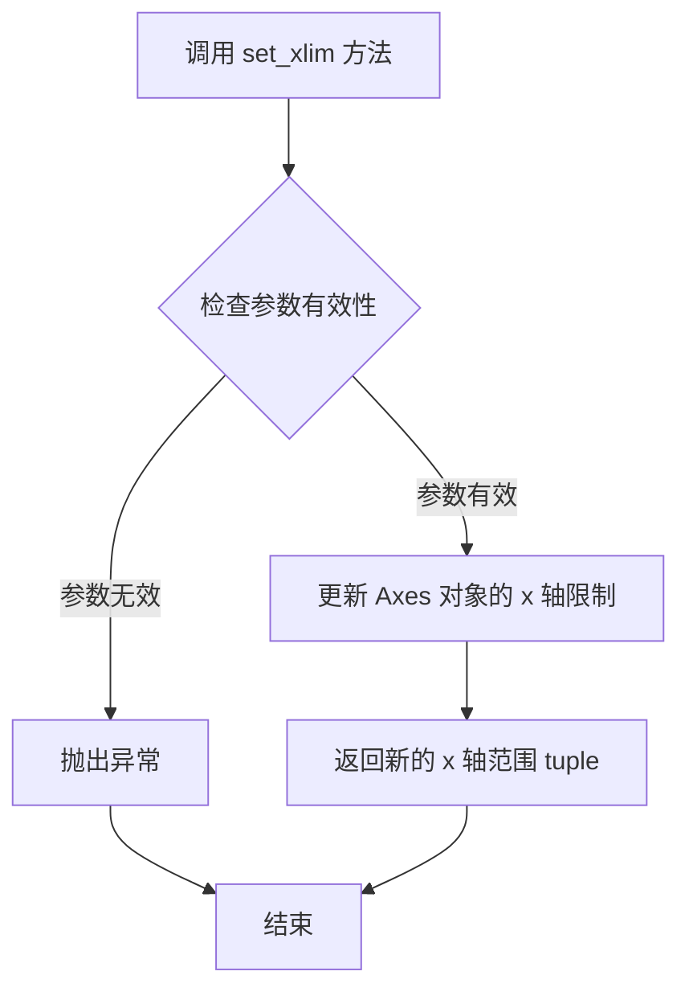

#### 带注释源码

```python
# 在提供的代码示例中，set_xlim 的调用方式如下：

# 设置 x 轴范围从 -6 到 6
ax.set_xlim(-6, 6)

# 方法内部实现逻辑（matplotlib 库源码逻辑）
def set_xlim(self, left=None, right=None, emit=False, auto=False, **kwargs):
    """
    设置 axes 的 x 轴范围
    
    参数:
        left: x 轴左边界
        right: x 轴右边界
        emit: 是否在改变时触发事件
        auto: 是否自动调整视图
    
    返回:
        tuple: 新的 x 轴范围 (left, right)
    """
    # 获取当前轴的范围
    self._validate_limits(left, right)  # 验证输入参数有效性
    
    # 更新内部存储的 x 轴限制
    self._set_lim((left, right))
    
    # 如果 emit 为 True，通知观察者范围已更改
    if emit:
        self._request_autoscale_view()
    
    # 返回新的范围
    return (left, right)
```

**注意**：提供的代码是 matplotlib 的使用示例，`Axes.set_xlim` 是 matplotlib 库内部实现的方法，上述源码是基于该方法功能的逻辑重构，并非实际的源代码。该方法的实际实现位于 matplotlib 库的 `lib/matplotlib/axes/_base.py` 文件中。


### `Axes.set_ylim`

设置 Axes 对象的 Y 轴显示范围（y 轴下限和上限），用于控制图表在垂直方向的显示区间。

参数：

- `bottom`：`float` 或 `None`，Y 轴的最小值（下限）。设置为 `None` 时自动确定。
- `top`：`float` 或 `None`，Y 轴的最大值（上限）。设置为 `None` 时自动确定。
- `emit`：可选参数，`bool`，默认为 `True`。当边界变化时是否通知观察者。
- `auto`：可选参数，`bool`，默认为 `False`。是否启用自动调整边界。
- `ymin`：已废弃参数，可忽略。
- `ymax`：已废弃参数，可忽略。

返回值：`tuple`，返回新的 Y 轴范围 `(bottom, top)`。

#### 流程图

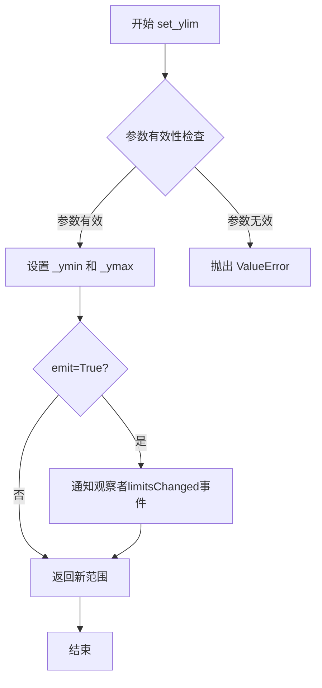

#### 带注释源码

```python
# 示例代码来源于用户提供的内容
# 在 matplotlib 中设置 Y 轴范围
ax.set_ylim(0, 6)  # 设置 Y 轴下限为 0，上限为 6
# 等效于:
# ax.set_ylim(bottom=0, top=6)

# 另一种用法：只设置下限，让上限自动确定
# ax.set_ylim(bottom=0)  # top 默认为 None，自动确定

# 获取当前 Y 轴范围
# ylim = ax.get_ylim()  # 返回 (0.0, 6.0)
```

#### 补充说明

| 项目 | 说明 |
|------|------|
| **所属类** | `matplotlib.axes.Axes` |
| **定义位置** | matplotlib 库源码（`lib/matplotlib/axes/_base.py`） |
| **调用示例** | `ax.set_ylim(0, 6)` 设置 Y 轴范围为 [0, 6] |
| **相关方法** | `set_xlim()`（设置 X 轴范围）、`get_ylim()`（获取当前 Y 轴范围） |
| **注意事项** | 当使用 `LineCollection` 等 Collection 对象时，需要手动设置轴范围，因为这些对象不参与自动缩放（autoscaling） |

#### 用户代码中的应用

在提供的用户代码中，`ax.set_ylim(0, 6)` 的作用是手动设置 Y 轴范围，因为 `LineCollection` 对象不参与 matplotlib 的自动缩放机制，必须显式设置轴范围以确保图形正确显示。


### `Axes.set_aspect`

设置坐标轴的纵横比（aspect ratio），用于控制 x 轴和 y 轴的单位长度比例，使图形能够正确显示对称性（如圆形、正方形等）。

参数：

- `aspect`：可接受多种类型，包括 `str`、`float` 或 `None`。当为 `"equal"` 时，表示 x 轴和 y 轴的单位长度相同；当为 `"auto"` 时，表示自动调整；当为数值时，表示指定的纵横比。
- `adjustable`：可选参数，类型为 `str`，默认为 `"box"`。控制哪个对象被调整以适应纵横比变化，可选值包括 `"box"`（调整 axes 框）、`"datalim"`（调整数据限制）等。
- `anchor`：可选参数，类型为 `str` 或 `2-tuple`，指定纵横比变化时的锚点位置。
- `share`：可选参数，类型为 `bool`，默认为 `False`。当为 `True` 时，会将设置共享给其他共享该 axes 的坐标轴。

返回值：返回修改后的 Axes 对象本身（`matplotlib.axes.Axes`），允许链式调用。

#### 流程图

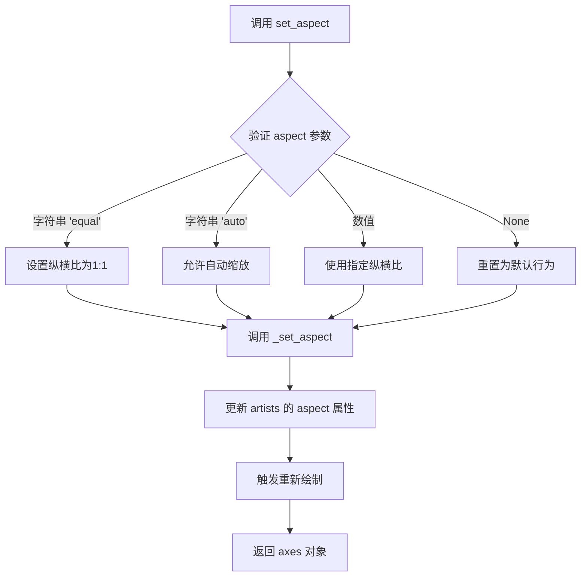

#### 带注释源码

```python
def set_aspect(self, aspect, adjustable=None, anchor=None, share=False):
    """
    设置坐标轴的纵横比。
    
    参数:
        aspect: 字符串'equal'、'auto'或数值或None
            'equal': x和y轴单位长度相同
            'auto': 自动缩放
            数值: 指定纵横比
            None: 重置为默认
        adjustable: 字符串,可选
            'box': 调整axes框
            'datalim': 调整数据限制
        anchor: 字符串或(2,)序列,可选
            锚点位置，如'C'居中,'SW'左下等
        share: bool,可选
            是否共享设置给其他坐标轴
    
    返回:
        Axes: 返回self以支持链式调用
    """
    # 验证aspect参数的有效性
    if aspect == 'equal':
        self._aspect = 1.0  # 设置纵横比为1:1
    elif aspect == 'auto':
        self._aspect = np.nan  # 自动模式
    elif aspect is None:
        self._aspect = None  # 重置为默认
    else:
        # 将数值转换为浮点数
        self._aspect = float(aspect)
    
    # 设置adjustable参数
    if adjustable is None:
        adjustable = 'box'
    self._adjustable = adjustable
    
    # 设置anchor参数
    if anchor is None:
        anchor = 'C'
    self.set_anchor(anchor)
    
    # 如果share为True，则处理共享坐标轴的aspect设置
    if share:
        for ax in self._shared_axes['aspect'].values():
            if ax is not self:
                ax.set_aspect(aspect, adjustable=adjustable, 
                            anchor=anchor, share=False)
    
    # 通知数据已更改，需要重新计算
    self.stale_callback = None  # 标记为需要重绘
    
    return self
```

**注意**：提供的代码是一个使用 matplotlib 的示例，代码中调用了 `ax.set_aspect("equal")` 来设置坐标轴为等比例显示，从而使半圆弧看起来像圆形。上述源码是基于 matplotlib 库中 `Axes.set_aspect` 方法的典型实现结构重构的，展示了该方法的核心逻辑。


### `Axes.add_collection`

将图形集合（Collection）添加到 Axes 坐标轴中，并可选地自动更新坐标轴的数据限制。

参数：

- `collection`：`matplotlib.collections.Collection`，要添加的图形集合对象（如 LineCollection、PathCollection 等）
- `autolim`：布尔值（可选，默认 True），是否自动更新坐标轴的数据限制（autolim）

返回值：`matplotlib.collections.Collection`，返回添加的集合对象本身，便于链式调用或进一步操作

#### 流程图

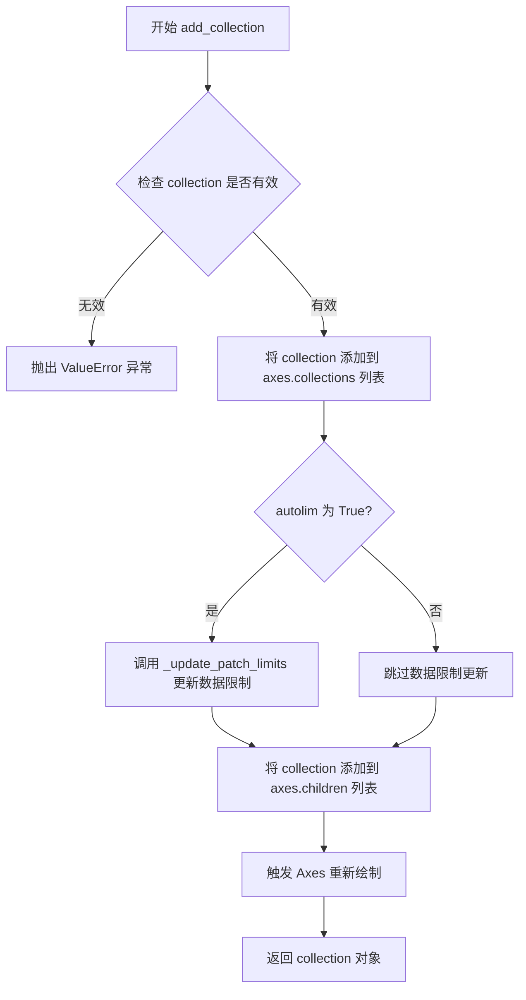

#### 带注释源码

```python
def add_collection(self, collection, autolim=True):
    """
    将图形集合（Collection）添加到坐标轴。
    
    参数:
        collection: Collection 对象，要添加的图形集合
        autolim: bool，是否自动更新坐标轴的数据限制
    
    返回值:
        添加的 Collection 对象本身
    """
    # 验证 collection 是否为有效的 Collection 实例
    if not isinstance(collection, collections.Collection):
        raise ValueError(...)
    
    # 将 collection 添加到 axes 的集合列表中
    self.collections.append(collection)
    # 关联 collection 到当前 axes
    collection.set_axes(self)
    
    # 如果启用自动限制更新，则更新坐标轴范围
    if autolim:
        self._update_patch_limits(collection)
    
    # 将 collection 添加到子对象列表（用于渲染）
    self._children.append(collection)
    
    # 标记 axes 需要重新绘制
    self.stale_callback(True)
    
    # 返回添加的 collection，便于链式调用
    return collection
```


### `Axes.set_title`

设置Axes对象的标题，用于在图表顶部显示标题文本。

参数：

- `label`：`str`，要显示的标题文本内容
- `loc`：`str`，标题对齐方式，可选值为 'center'、'left'、'right'，默认 'center'
- `pad`：`float`，标题与 Axes 顶部的间距（以点为单位），默认根据 rcParams 确定
- `fontdict`：`dict`，可选，用于控制标题文本样式的字典（如 fontsize、fontweight、color 等）
- `**kwargs`：其他可选参数，用于设置 Text 对象的属性，如 fontsize、fontweight、color、ha、va 等

返回值：`matplotlib.text.Text`，返回创建的标题文本对象，可用于后续修改标题样式

#### 流程图

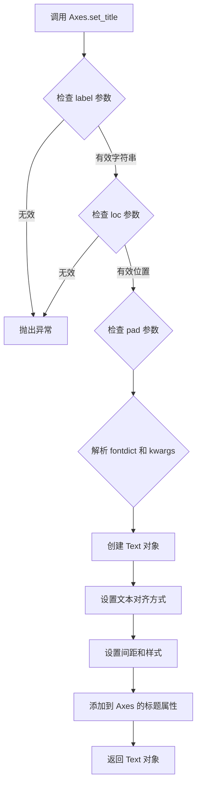

#### 带注释源码

```python
# matplotlib/axes/_axes.py 中的 set_title 方法源码注释

def set_title(self, label, loc=None, pad=None, *, fontdict=None, **kwargs):
    """
    Set a title for the Axes.
    
    Parameters
    ----------
    label : str
        The title text string.
    
    loc : {'center', 'left', 'right'}, default: 'center'
        The title horizontal alignment.
    
    pad : float
        The distance in points between the Axes and the title.
    
    fontdict : dict
        A dictionary controlling the appearance of the title text,
        e.g., {'fontsize': 12, 'fontweight': 'bold', 'color': 'red'}.
    
    **kwargs
        Additional parameters passed to the Text constructor.
    
    Returns
    -------
    text : Text
        The created Text instance.
    """
    
    # 验证标题文本
    if label is None:
        return None
    
    # 设置默认位置为 'center'
    if loc is None:
        loc = 'center'
    
    # 验证位置参数
    if loc not in ['center', 'left', 'right']:
        raise ValueError("'loc' must be one of 'center', 'left', or 'right'")
    
    # 解析字体字典和额外参数，优先使用 kwargs
    if fontdict is not None:
        fontdict = fontdict.copy()
        fontdict.update(kwargs)
        kwargs = fontdict
    
    # 根据位置设置水平对齐方式
    loc_dict = {'left': 'left', 'right': 'right', 'center': 'center'}
    kwargs.setdefault('ha', loc_dict[loc])
    
    # 设置默认的垂直位置
    if pad is None:
        pad = mpl.rcParams['axes.titlepad']
    
    # 将 pad 转换为_points（如果需要）
    # 创建标题文本对象
    title = Text(
        x=0.5, y=1.0,  # 相对坐标
        text=label,
        verticalalignment='bottom',  # 从底部对齐，以便 pad 生效
        horizontalalignment=loc_dict[loc],
        **kwargs
    )
    
    # 设置标题的垂直偏移（pad）
    title.set_y(1.0 - (pad / self.figure.dpi * 72))
    
    # 将标题对象添加到 Axes
    self._axtitle = title  # 存储标题引用
    self.texts.append(title)  # 添加到文本列表
    
    # 重新排列以确保标题在顶部
    self.stale_callback = None  # 可能需要重新布局
    
    return title
```


## 关键组件


### LineCollection

Matplotlib的集合类，用于高效绘制多条线段，支持逐线设置属性或通过array参数进行颜色映射

### numpy.linspace

用于生成等间距数值序列的函数，在这里创建角度数组theta和半径数组radii

### numpy.column_stack

用于将两个一维数组按列堆叠成二维坐标数组，形成弧线的(x, y)坐标对

### 颜色映射（Colormap）

通过cmap参数和array参数实现基于数值（半径）的颜色编码，使用"rainbow"调色板将数值映射为颜色

### 坐标轴比例设置

ax.set_aspect("equal")确保x轴和y轴比例相同，使半圆弧正确显示为圆形而非椭圆

### 颜色条（Colorbar）

通过fig.colorbar为LineCollection添加颜色图例，显示数值与颜色的对应关系，并添加标签"Radius"

### 集合的轴域限制

由于Collection不参与自动缩放，需要手动设置ax.set_xlim和ax.set_ylim来确定显示范围


## 问题及建议


### 已知问题

-   **代码重复**：两段绘图代码存在大量重复逻辑（创建图形、设置坐标轴范围、设置 aspect 等），违反 DRY 原则，增加维护成本
-   **魔法数字与硬编码**：多处使用硬编码数值（如 `36`、`-6, 6`、`0, 6`、`4, 5` 等），缺乏语义化命名，降低代码可读性和可维护性
-   **缺乏类型注解**：Python 代码中未使用类型提示（Type Hints），不利于静态分析和 IDE 智能提示
-   **资源管理不明确**：连续创建两个 `fig, ax` 且未显式关闭图形对象，在某些运行环境下可能导致资源泄漏或内存占用增加
-   **函数/方法封装缺失**：所有代码均为模块级执行，无函数封装，阻碍代码复用和单元测试
-   **输入验证缺失**：未对 `theta`、`radii`、`arcs` 等数据生成逻辑进行边界条件和合法性检查
-   **可测试性差**：代码直接调用 `plt.show()`，无法在自动化测试环境中运行或验证绘图结果

### 优化建议

-   **提取公共函数**：将图形创建、坐标轴设置等重复逻辑封装为独立函数（如 `create_axes()`），接收参数以提高复用性
-   **使用命名常量**：将魔法数字定义为模块级常量（如 `NUM_POINTS = 36`、`X_LIMITS = (-6, 6)`），增强代码可读性
-   **添加类型提示**：为函数参数和返回值添加类型注解（如 `def create_arcs(theta: np.ndarray, radii: np.ndarray) -> list[np.ndarray]:`）
-   **改进资源管理**：使用 `with` 语句或显式调用 `fig.close()` 管理图形生命周期；或考虑使用面向对象方式封装绘图器
-   **数据与视图分离**：将数据生成逻辑（`theta`、`radii`、`arcs`）与绘图逻辑分离，便于单元测试和独立使用
-   **增加输入验证**：对 `radii` 的取值范围、`colors` 列表长度与 `arcs` 的一致性等进行校验，提升鲁棒性
-   **配置对象或 dataclass**：使用配置类或 dataclass 封装绘图参数（如线宽、颜色映射、坐标轴范围），提高代码可配置性


## 其它


### 设计目标与约束

本示例代码的核心设计目标是演示如何使用matplotlib的LineCollection高效地绘制多条半圆弧线，并展示两种颜色设置方式：直接指定颜色序列和通过colormap进行数值映射。主要约束包括：Collections组件不参与自动坐标轴缩放、需手动设置axes limits、aspect ratio需设为"equal"以保证弧线显示为圆形。

### 错误处理与异常设计

代码中未显式包含错误处理逻辑。在实际应用中需要处理的潜在错误包括：数组维度不匹配（arcs中每个元素的形状必须一致）、无效的颜色值或colormap名称、radii数组与arcs数量不匹配导致的映射错误、空数组输入导致的渲染失败等。Matplotlib库自身会抛出相应的异常（如ValueError、KeyError等）供调用者捕获。

### 数据流与状态机

数据流从输入参数（colors、radii、theta）开始，经过numpy数组运算生成arcs坐标列表，然后创建LineCollection对象，最后通过ax.add_collection()添加到Axes中并通过plt.show()渲染输出。状态机包含：初始化状态（创建figure/axes）→ 数据准备状态（计算arcs坐标）→ 对象创建状态（实例化LineCollection）→ 添加到图表状态 → 渲染显示状态。

### 外部依赖与接口契约

主要依赖包括：matplotlib.pyplot（绘图接口）、numpy（数值计算）、matplotlib.collections.LineCollection（线集合类）。关键接口契约：LineCollection构造函数接受segments（线段坐标列表）、colors（颜色序列或colormap名称）、linewidths（线宽）等参数；add_collection()方法将集合添加到axes；colorbar()需要配合Figure对象创建颜色条。

### 性能考虑

使用LineCollection相比单独绘制多条线具有显著的性能优势，因为它将多条线组合为单一集合进行渲染，减少了图形对象的数量和绘制调用开销。对于大量线条（示例中演示了6条和15条）的场景，性能提升尤为明显。colormap方式下，array参数传递的数值数组会被用于颜色映射计算。

### 内存管理

arcs列表存储了所有半圆的坐标数据，每个元素是36×2的numpy数组。LineCollection对象在内存中保持对这些数组的引用。plt.show()会触发图形渲染，渲染完成后matplotlib会保持figure对象在内存中供后续操作使用。如需释放内存，应显式关闭figure或使用plt.close()。

### 线程安全性

matplotlib的pyplot接口并非线程安全，多个线程同时操作同一figure或axes可能导致不可预期的行为。本示例代码为单线程设计，在多线程环境下需要使用锁机制或为每个线程创建独立的figure对象。

### 版本兼容性

代码使用了现代matplotlib API（LineCollection、set_array、colormap等）。需要确保matplotlib版本支持这些功能（matplotlib 3.4+推荐）。numpy的np.column_stack、np.linspace等函数在常用版本中均稳定支持。

### 代码组织与模块化

当前代码为单个脚本文件，包含两个主要的代码块（使用%%分隔），分别演示两种不同的LineCollection使用方式。代码结构清晰，先展示基本用法再展示高级用法（colormap映射），符合循序渐进的教学示例风格。

### 配置管理

代码中的硬编码配置包括：figure尺寸（figsize参数）、坐标轴范围（set_xlim/set_ylim）、aspect比例、colormap名称（"rainbow"）、颜色列表（indigo到red的渐变）等。在实际项目中这些应作为参数或配置文件提取，以便灵活调整。

### 资源清理与生命周期管理

plt.show()调用后，程序会进入事件循环等待用户交互。figure对象会保持活跃直到窗口关闭。在脚本式使用中，可以通过plt.close(fig)或plt.close('all')显式关闭figure以释放相关资源。LineCollection对象在add_collection后由axes对象管理其生命周期。

    