# `matplotlib\galleries\examples\shapes_and_collections\patch_collection.py` 详细设计文档

这是一个 matplotlib 示例代码，演示如何使用 PatchCollection 一次性绘制和展示多个几何图形（圆形、楔形和多边形），并通过颜色条展示数值映射。

## 整体流程

```mermaid
graph TD
A[开始] --> B[设置随机种子 np.random.seed]
B --> C[创建图表 fig, ax = plt.subplots]
C --> D[生成N个圆形 Circle]
D --> E[生成N个楔形 Wedge]
E --> F[添加预设楔形(圆环、扇形等)]
F --> G[生成N个多边形 Polygon]
G --> H[生成随机颜色数组 colors]
H --> I[创建 PatchCollection]
I --> J[设置颜色数组 set_array]
J --> K[添加到坐标轴 add_collection]
K --> L[添加颜色条 colorbar]
L --> M[显示图表 show]
```

## 类结构

```
此代码为脚本形式，非面向对象
主要使用 matplotlib.patches 模块的图形类:
├── Circle (圆形)
├── Wedge (楔形/扇形)
└── Polygon (多边形)
matplotlib.collections 模块:
└── PatchCollection (图形集合)
```

## 全局变量及字段


### `np`
    
NumPy库导入，用于数值计算和随机数组生成

类型：`numpy module`
    


### `plt`
    
Matplotlib.pyplot模块导入，用于绘图和图表显示

类型：`matplotlib.pyplot module`
    


### `PatchCollection`
    
从matplotlib.collections导入的图形集合类，用于批量管理图形

类型：`class`
    


### `Circle`
    
从matplotlib.patches导入的圆形类，用于创建圆形图形

类型：`class`
    


### `Polygon`
    
从matplotlib.patches导入的多边形类，用于创建多边形图形

类型：`class`
    


### `Wedge`
    
从matplotlib.patches导入的楔形类，用于创建扇形/环形扇区图形

类型：`class`
    


### `fig`
    
Matplotlib图表对象，表示整个图形窗口

类型：`matplotlib.figure.Figure`
    


### `ax`
    
Matplotlib坐标轴对象，用于放置图形元素

类型：`matplotlib.axes.Axes`
    


### `resolution`
    
顶点分辨率参数，值为50，用于控制图形精度

类型：`int`
    


### `N`
    
图形数量参数，值为3，指定随机生成的图形个数

类型：`int`
    


### `x`
    
随机生成的x坐标数组，用于圆形和多边形的定位

类型：`numpy.ndarray`
    


### `y`
    
随机生成的y坐标数组，用于圆形和多边形的定位

类型：`numpy.ndarray`
    


### `radii`
    
随机生成的半径数组，用于控制图形大小

类型：`numpy.ndarray`
    


### `theta1`
    
随机生成的起始角度数组，用于Wedge图形

类型：`numpy.ndarray`
    


### `theta2`
    
随机生成的结束角度数组，用于Wedge图形

类型：`numpy.ndarray`
    


### `patches`
    
图形对象列表，用于存储所有创建的Circle、Wedge和Polygon对象

类型：`list`
    


### `colors`
    
随机生成的颜色数组，用于为图形着色

类型：`numpy.ndarray`
    


### `p`
    
PatchCollection实例对象，用于管理和显示图形集合

类型：`PatchCollection`
    


### `i`
    
循环变量，用于遍历生成多边形的索引

类型：`int`
    


### `Circle.Circle.(x, y)`
    
圆心坐标参数，指定圆形在图表中的位置

类型：`tuple`
    


### `Circle.Circle.r`
    
圆形半径参数，指定圆形的大小

类型：`float`
    


### `Wedge.Wedge.(x, y)`
    
圆心坐标参数，指定楔形在图表中的位置

类型：`tuple`
    


### `Wedge.Wedge.r`
    
外半径参数，指定楔形的外边缘距离圆心的距离

类型：`float`
    


### `Wedge.Wedge.theta1`
    
起始角度参数，以度为单位指定楔形的起始边界

类型：`float`
    


### `Wedge.Wedge.theta2`
    
结束角度参数，以度为单位指定楔形的结束边界

类型：`float`
    


### `Wedge.Wedge.width`
    
内半径参数，可选，用于创建环形扇区

类型：`float`
    


### `Polygon.Polygon.vertices`
    
顶点坐标数组，定义多边形的各个顶点位置

类型：`numpy.ndarray`
    


### `Polygon.Polygon.closed`
    
闭合参数，指定多边形是否首尾相连形成闭合图形

类型：`bool`
    


### `PatchCollection.PatchCollection.patches`
    
图形列表属性，存储集合中包含的所有图形对象

类型：`list`
    


### `PatchCollection.PatchCollection.alpha`
    
透明度属性，控制图形集合的整体透明度

类型：`float`
    


### `PatchCollection.PatchCollection.array`
    
颜色数组属性，存储用于着色的数值数据

类型：`numpy.ndarray`
    
    

## 全局函数及方法


### `np.random.seed`

设置随机数生成器的种子，使得随机数序列可重现。

参数：

- `seed`：`int` 或 `array_like`，可选，用于初始化随机数生成器的种子值

返回值：`None`，该函数无返回值，直接修改全局随机数生成器状态

#### 流程图

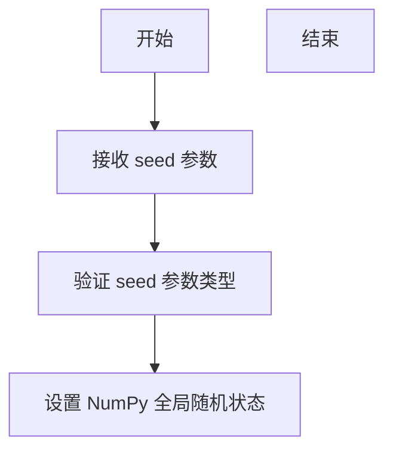

#### 带注释源码

```python
# 设置随机种子为 19680801，确保随机数可重现
# 这个特定值常用于 Matplotlib 示例的随机数据生成
np.random.seed(19680801)
```

## 代码整体设计文档

### 一段话描述

该代码是一个 Matplotlib 可视化示例，演示如何使用 `PatchCollection` 批量绘制和渲染多个图形元素（圆形、楔形和多边形），并通过颜色条展示数值映射。

### 文件的整体运行流程

1. **初始化设置**：导入必要库（matplotlib、numpy），设置随机种子确保可重现性
2. **创建画布**：创建 Figure 和 Axes 对象
3. **生成图形数据**：使用随机数生成圆形、楔形和多边形的参数
4. **创建 Patch 集合**：将所有图形元素添加到 patches 列表
5. **创建集合对象**：使用 PatchCollection 批量管理 patches
6. **设置颜色映射**：为集合设置颜色数组和透明度
7. **添加到 Axes**：将集合添加到坐标轴并显示颜色条
8. **渲染显示**：调用 plt.show() 显示图像

### 类的详细信息

#### 全局变量

| 名称 | 类型 | 描述 |
|------|------|------|
| `fig` | `matplotlib.figure.Figure` | 图形窗口对象 |
| `ax` | `matplotlib.axes.Axes` | 坐标轴对象 |
| `resolution` | `int` | 多边形顶点数（50） |
| `N` | `int` | 随机图形数量（3） |
| `x`, `y` | `numpy.ndarray` | 随机生成的坐标数组 |
| `radii` | `numpy.ndarray` | 随机生成的半径数组 |
| `theta1`, `theta2` | `numpy.ndarray` | 楔形的起始和终止角度 |
| `patches` | `list` | 存储所有图形对象的列表 |
| `colors` | `numpy.ndarray` | 随机生成的颜色数值 |
| `p` | `PatchCollection` | 图形集合对象 |

### 关键组件信息

| 组件名称 | 描述 |
|----------|------|
| `PatchCollection` | 批量管理和渲染多个图形元素的集合类 |
| `Circle` | 表示圆形的图形类 |
| `Wedge` | 表示楔形/扇形的图形类 |
| `Polygon` | 表示多边形的图形类 |
| `set_array()` | 为集合设置颜色数值的方法 |
| `add_collection()` | 将集合添加到坐标轴的方法 |
| `colorbar()` | 创建颜色条的方法 |

### 潜在的技术债务或优化空间

1. **硬编码参数**：分辨率(50)、图形数量(3)等参数可以提取为配置常量
2. **重复代码**：两段生成圆形/楔形的代码结构类似，可以抽象为函数
3. **魔法数字**：如 `0.1`、`100` 等数值缺乏明确语义，建议使用具名常量
4. **缺少类型注解**：代码中未使用类型提示，建议添加以提高可维护性

### 其它项目

#### 设计目标与约束

- 目标：展示 PatchCollection 的使用方法
- 约束：使用 matplotlib 内置图形类

#### 错误处理与异常设计

- 未包含显式错误处理，依赖 Matplotlib 和 NumPy 的默认异常机制

#### 数据流与状态机

- 随机状态 → 数据生成 → 图形创建 → 集合管理 → 渲染显示

#### 外部依赖与接口契约

- 依赖：matplotlib、numpy
- 无外部接口调用


### `np.random.rand`

生成指定形状的随机数组，数组中的值服从[0, 1)区间内的均匀分布。

参数：

-  `*shape`：`int`或`tuple of ints`，可变长度参数，输出数组的维度。可以是单个整数（生成一维数组）或多个整数（生成多维数组），例如`N`生成N个随机数，`(N, 2)`生成N行2列的数组。

返回值：`ndarray`，返回值为[0, 1)区间内均匀分布的随机数组成的数组，形状由shape参数指定。

#### 流程图

```mermaid
graph TD
    A[调用np.random.rand函数] --> B{传入参数数量}
    B -->|无参数| C[返回单个Python浮点数]
    B -->|一个参数N| D[生成形状为N的一维数组]
    B -->|多个参数N1, N2, ...| E[生成形状为N1×N2×...的多维数组]
    D --> F[填充[0, 1)均匀分布随机数]
    E --> F
    C --> G[返回结果]
    F --> G
```

#### 带注释源码

```python
# 在代码中的实际调用示例：

# 示例1：生成3个随机数的一维数组
x = np.random.rand(N)  # N=3，生成形状为(3,)的数组，值为0-1之间的随机浮点数

# 示例2：生成3个随机数的一维数组（用于y坐标）
y = np.random.rand(N)  # 生成形状为(3,)的数组

# 示例3：生成3个随机浮点数乘以0.1，用于半径
radii = 0.1*np.random.rand(N)  # 生成形状为(3,)的数组，值在[0, 0.1)区间

# 示例4：生成N个随机角度（0-360度）
theta1 = 360.0*np.random.rand(N)  # 生成形状为(3,)的数组，值在[0, 360)区间
theta2 = 360.0*np.random.rand(N)  # 生成形状为(3,)的数组，值在[0, 360)区间

# 示例5：生成多维数组，用于Polygon顶点的随机坐标
polygon = Polygon(np.random.rand(N, 2), closed=True)
# 生成形状为(3, 2)的二维数组，每行包含一个顶点的(x, y)坐标

# 示例6：生成与patches数量相同的随机颜色值
colors = 100 * np.random.rand(len(patches))
# 生成形状为(len(patches),)的数组，值在[0, 100)区间，用于设置颜色映射
```

#### 源码解析

```python
# np.random.rand函数底层实现逻辑（简化版）
def rand(*shape):
    """
    生成[0, 1)区间内均匀分布的随机数数组
    
    参数:
        *shape: 输出数组的形状
        
    返回:
        ndarray: 指定形状的随机数数组
    """
    # 内部调用random模块生成随机数
    # 使用Mersenne Twister算法生成高质量随机数
    # 返回值类型为float64
    pass

# 在本代码中的具体作用：
# 1. 生成圆的圆心坐标(x, y)和半径
# 2. 生成扇形的起始和终止角度
# 3. 生成多边形的顶点坐标
# 4. 生成用于颜色映射的数值
```


### plt.subplots

创建图表（Figure）和坐标轴（Axes）或子图数组，用于后续图形绘制。

参数：

- `nrows`：`int`，可选，默认值为1，子图的行数。
- `ncols`：`int`，可选，默认值为1，子图的列数。
- `sharex`：`bool`或`str`，可选，默认值为`False`，是否共享x轴。
- `sharey`：`bool`或`str`，可选，默认值为`False`，是否共享y轴。
- `squeeze`：`bool`，可选，默认值为`True`，是否压缩返回的Axes数组维度。
- `width_ratios`：`array-like`，可选，指定子图列的宽度比例。
- `height_ratios`：`array-like`，可选，指定子图行的高度比例。
- `subplot_kw`：`dict`，可选，传递给创建子图的`add_subplot`的关键字参数。
- `gridspec_kw`：`dict`，可选，传递给`GridSpec`的关键字参数。
- `**fig_kw`：可选，关键字参数，传递给`Figure`构造函数。

返回值：`tuple`，返回`(fig, ax)`，其中`fig`是`matplotlib.figure.Figure`对象，`ax`是`matplotlib.axes.Axes`对象（当`squeeze=True`且子图数量为1时）或`numpy`数组。

#### 流程图

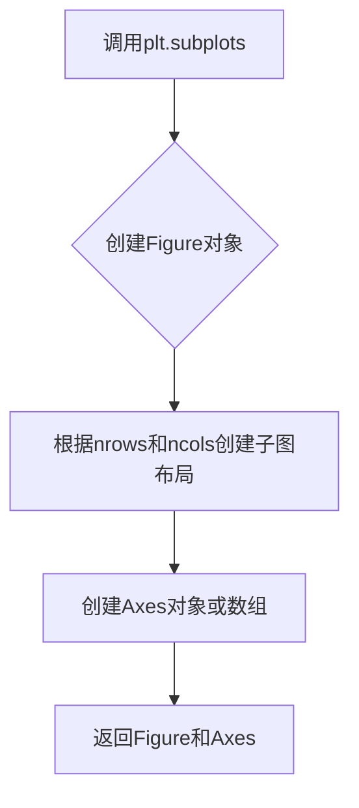

#### 带注释源码

```python
# 导入matplotlib.pyplot模块
import matplotlib.pyplot as plt

# 调用plt.subplots创建图表和坐标轴
# 参数nrows=1, ncols=1表示创建一个包含单个子图的图表
# 返回fig（图表对象）和ax（坐标轴对象）
fig, ax = plt.subplots(nrows=1, ncols=1)

# 之后可以在ax上绘制图形，例如：
# ax.plot([1, 2, 3], [1, 2, 3])

# 显示图表
plt.show()
```


### `plt.show`

`plt.show()` 是 Matplotlib.pyplot 模块中的核心显示函数，用于将所有当前打开的图形窗口呈现给用户，并阻塞程序执行直到用户关闭图形（在交互式后端中）。

参数： 无

返回值：`None`，该函数不返回任何值

#### 流程图

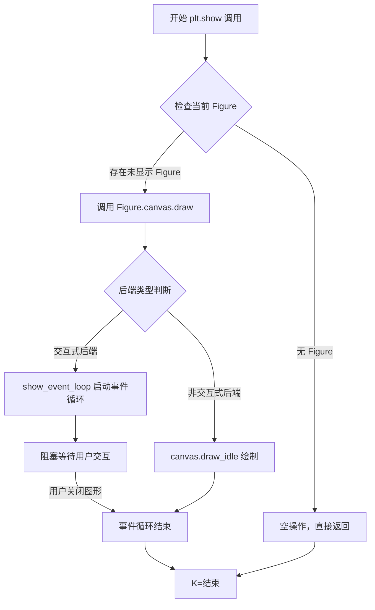

#### 带注释源码

```python
# 导入 matplotlib.pyplot 并重命名为 plt
import matplotlib.pyplot as plt

# ... [前文代码创建图形元素] ...

# fig: matplotlib.figure.Figure 对象，包含所有子图
# ax: matplotlib.axes.Axes 对象，当前图形的坐标轴
# p: PatchCollection 对象，包含所有几何图形（圆形、扇形、多边形）
# colors: numpy.ndarray，包含每个图形的颜色映射值

# 为图形添加颜色条
# 参数 p: PatchCollection 对象
# 参数 ax=ax: 指定颜色条所在的坐标轴
fig.colorbar(p, ax=ax)

# 调用 plt.show() 显示图形
# 作用：
# 1. 触发底层图形库的渲染引擎
# 2. 将 Figure 画布内容绘制到窗口
# 3. 对于交互式后端（如 Qt、Tkinter），启动事件循环并阻塞
# 4. 对于非交互式后端（如 Agg），仅执行必要的绘制操作
# 注意：在 Jupyter Notebook 中通常使用 %matplotlib inline 或 %matplotlib widget
plt.show()  # <--- 目标函数调用在此处

# plt.show() 执行后的效果：
# - 用户看到包含圆形、扇形和多边形的可视化图形
# - 图形窗口显示颜色条，颜色对应数值范围 0-100
# - 程序在此处暂停（交互式后端），等待用户关闭窗口
# - 函数返回 None，不影响后续代码执行（因后面无代码）
```


### `matplotlib.figure.Figure.colorbar`

添加颜色条（colorbar）到图形中，用于显示颜色映射的数值对应关系。颜色条通常与图像、等高线图、散点图等一起使用，以展示数据值与颜色的对应关系。

参数：

- `mappable`：`matplotlib.cm.ScalarMappable`，需要显示颜色映射的可映射对象（如图像、Collection等）
- `ax`：`matplotlib.axes.Axes`，可选，要绑定颜色条的Axes对象，默认为None时会自动找到关联的Axes
- `cax`：`matplotlib.axes.Axes`，可选，指定颜色条专用的Axes
- `use_gridspec`：`bool`，可选，如果为True且未指定cax，则使用gridspec创建颜色条Axes
- `**kwargs`：其他关键字参数传递给`colorbar`函数

返回值：`matplotlib.colorbar.Colorbar`，颜色条对象

#### 流程图

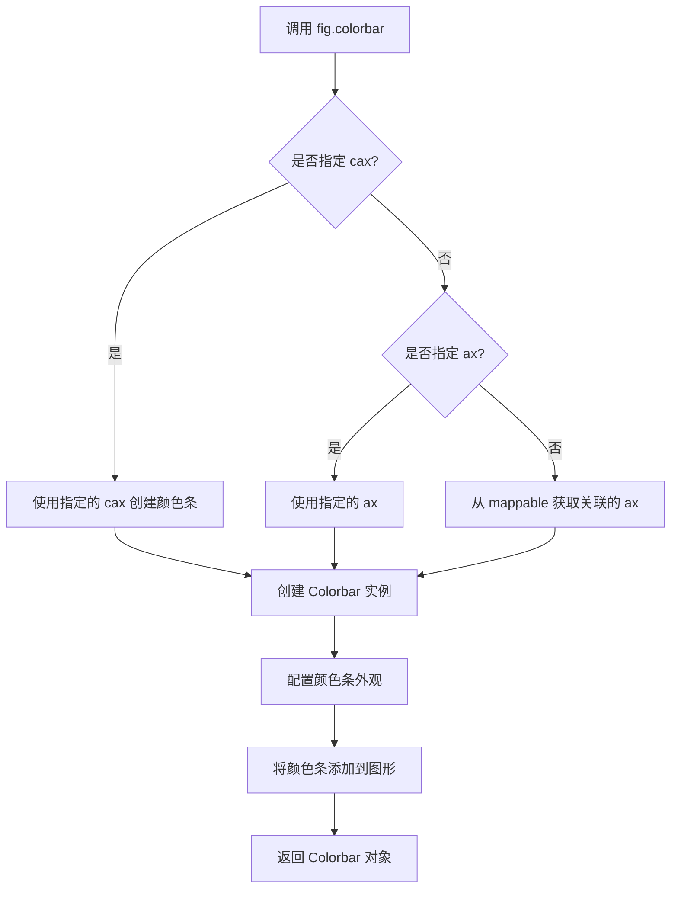

#### 带注释源码

```python
# 调用示例：fig.colorbar(p, ax=ax)
# 其中 p 是 PatchCollection 对象，ax 是 Axes 对象

# 内部实现逻辑（简化版）
def colorbar(self, mappable, cax=None, ax=None, use_gridspec=None, **kwargs):
    """
    为图形添加颜色条
    
    参数:
        mappable: ScalarMappable 对象（如 Image, Collection, ContourSet 等）
        cax: 可选的专门用于颜色条的 Axes
        ax: 可选的关联 Axes
        use_gridspec: 是否使用 gridspec 布局
    """
    
    # 1. 获取或创建颜色条所在的 Axes
    if cax is None:
        if ax is None:
            # 从 mappable 推断 ax（通过 _A 或 similar 属性）
            ax = getattr(mappable, '_A', None)
            if ax is not None:
                ax = ax.axes
        
        # 根据 use_gridspec 创建新的 axes 或使用现有 axes
        if use_gridspec:
            # 从当前的 subplot 分割出空间给颜色条
            cax = self.add_subplot(gs[-1, 0])
        else:
            cax = ax
    
    # 2. 创建颜色条对象
    cb = Colorbar(cax, mappable, **kwargs)
    
    # 3. 将颜色条对象挂载到 mappable 上
    mappable.colorbar = cb
    
    # 4. 返回颜色条对象
    return cb
```

#### 关键组件信息

| 组件名称 | 一句话描述 |
|---------|-----------|
| `PatchCollection` | 批量管理多个补丁图形（Circle、Wedge、Polygon）的集合类 |
| `ScalarMappable` | 包含颜色映射数组和颜色映射器的基类 |
| `Colorbar` | 管理颜色条外观和行为的类 |
| `Figure` | matplotlib 中的图形顶层容器 |

#### 潜在的技术债务或优化空间

1. **颜色条位置计算**：当自动推断ax时，如果mappable没有关联的axes，可能会导致错误
2. **布局冲突**：使用gridspec创建颜色条时可能与已有的subplot布局冲突
3. **性能考虑**：对于大数据量的图像，颜色条的渲染可能影响整体性能

#### 其它项目

- **设计目标**：提供直观的数据可视化，帮助用户理解数据的数值与颜色对应关系
- **约束**：颜色条需要绑定到有效的 ScalarMappable 对象
- **错误处理**：如果mappable没有设置颜色映射（array），会抛出ValueError
- **外部依赖**：依赖 matplotlib.cm、matplotlib.colorbar 等模块
- **数据流**：用户数据 → ScalarMappable → Colorbar → Figure 渲染


### `matplotlib.axes.Axes.add_collection`

将图形集合（PatchCollection）添加到坐标轴（Axes）中，并自动调整坐标轴的显示范围以容纳该集合。

参数：

- `collection`：`matplotlib.collections.Collection`，要添加的图形集合对象（如 PatchCollection）
- `autolim`：`bool`，是否自动更新坐标轴的数据限制范围，默认为 `True`

返回值：`matplotlib.collections.Collection`，返回添加的集合对象本身

#### 流程图

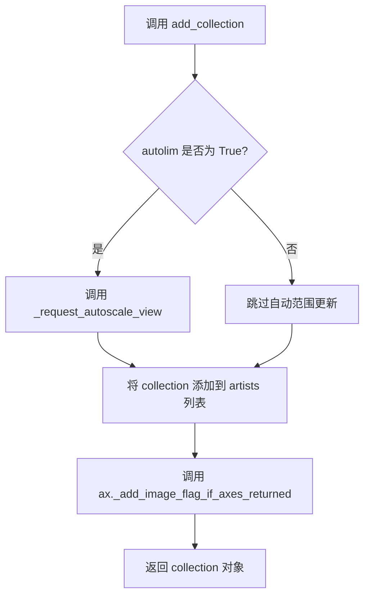

#### 带注释源码

```python
def add_collection(self, collection, autolim=True):
    """
    Add a collection to the axes.
    
    Parameters
    ----------
    collection : matplotlib.collections.Collection
        The collection to add to the axes.
    autolim : bool, default: True
        Whether to update the data limits automatically.
    
    Returns
    -------
    matplotlib.collections.Collection
        The added collection.
    """
    # 将集合对象添加到 axes 的 artists 列表中进行管理
    self._set_artist_list(collection)
    
    # 如果 autolim 为 True，则标记需要自动更新视图范围
    # 这样 axes 会自动调整以显示整个集合
    if autolim:
        self._request_autoscale_view()
    
    # 将集合添加到 axes 的 collections 列表中
    self.collections.append(collection)
    
    # 设置集合的 axes 引用，establish the relationship
    collection.set_axes(self)
    
    # 设置集合的 figure 引用
    collection.set_figure(self.figure)
    
    # 返回添加的集合对象，方便链式调用
    return collection
```

> **注意**：上述源码是基于 matplotlib 经典版本的 `add_collection` 方法逻辑重构的示例，实际实现细节可能因版本不同而略有差异。核心流程是：添加 collection 到 artists 列表、更新数据范围限制、返回 collection 对象。


### PatchCollection.set_array

该方法用于设置 PatchCollection 的颜色数组值，这些值将映射到颜色条（colorbar）上以显示不同的颜色。

参数：

-  `A`：`numpy.ndarray` 或 array-like，需要映射到颜色的数值数组，每个元素对应一个 patch 元素

返回值：`numpy.ndarray`，设置后的颜色值数组

#### 流程图

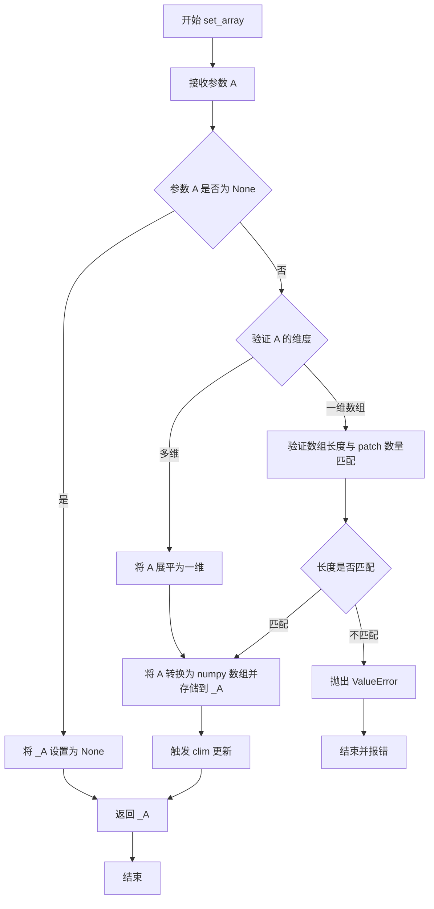

#### 带注释源码

```python
def set_array(self, A):
    """
    Set the value array of the ScalarMappable.

    Parameters
    ----------
    A : array-like or None
        The values that are mapped to color.

        If None, the colorbar will display the values as given in
        the `levels` argument, if set.

    Returns
    -------
    ndarray
        The color values. For a detailed explanation see the
        *value* argument docstring.
    """
    # A 为 None 时，直接设置为 None
    if A is None:
        self._A = None
    else:
        # 将输入转换为 numpy 数组
        A = np.asarray(A)
        # 如果数组维度 > 1，展平为一维
        if A.ndim > 1:
            A = A.ravel()
        # 验证数组为浮点类型
        if not np.issubdtype(A.dtype, np.floating):
            A = A.astype(np.float64)
        # 存储到内部属性 _A
        self._A = A

    # 标记需要更新视图
    self.stale = True
    # 返回设置后的数组
    return self._A
```


### Circle.__init__

该方法用于创建一个真正的圆形（圆），通过指定圆心坐标和半径来初始化圆形对象，并可设置旋转角度和其他艺术家属性。

参数：

- `xy`：`(float, float)`，圆心的坐标 (x, y)
- `r`：`float`，圆的半径
- `angle`：`float`，旋转角度（逆时针），默认为 0.0
- `**kwargs`：可变关键字参数，接受 Matplotlib 的 Artist 属性（如 facecolor、edgecolor、alpha 等）

返回值：`None`，无返回值（__init__ 方法用于初始化对象状态）

#### 流程图

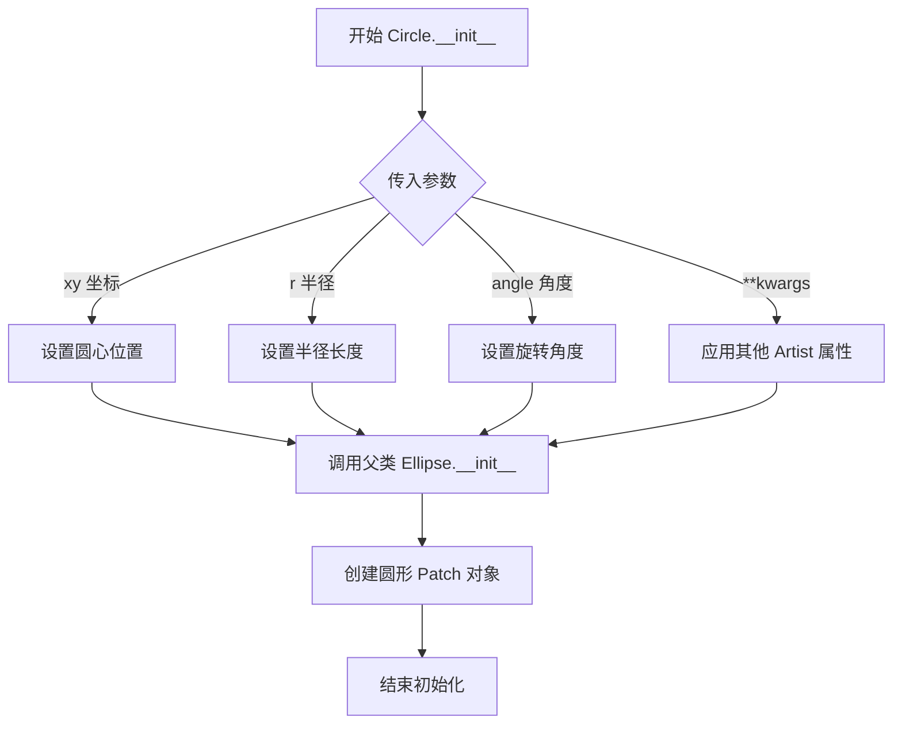

#### 带注释源码

```python
# matplotlib/patches.py 中 Circle 类的简化实现

class Circle(Ellipse):
    """
    Create a true circle at center *xy* = (*x*, *y*) with radius *r*.
    
    A Circle is a special case of an Ellipse where both axes are equal.
    """
    
    def __init__(self, xy, r, angle=0.0, **kwargs):
        """
        初始化圆形对象
        
        参数:
            xy: (float, float) 圆心坐标 (x, y)
            r: float 圆的半径
            angle: float 旋转角度（度），默认为 0.0
            **kwargs: 其他艺术家属性（颜色、透明度、边框等）
        """
        # 圆心坐标
        self._center = xy
        
        # 半径值
        self.radius = r
        
        # 调用父类 Ellipse 的初始化方法
        # 圆形是椭圆的特殊情况：两个轴半径相等
        # 父类需要：中心坐标、x轴半径、y轴半径、旋转角度
        super().__init__(xy, 2*r, 2*r, angle=angle, **kwargs)
        
        # 内部重新设置圆形的半径属性（覆盖父类的宽高设置）
        # 确保 radius 属性正确存储
        self.set_radius(r)
    
    def get_radius(self):
        """获取圆的半径"""
        return self.radius
    
    def set_radius(self, r):
        """
        设置圆的半径
        
        参数:
            r: float 新的半径值
        """
        self.radius = r
        # 同时更新父类 Ellipse 的宽高（直径）
        super().set_width(2 * r)
        super().set_height(2 * r)
        # 标记需要重新计算路径
        self.stale = True
```

#### 补充说明

**在代码中的实际使用：**

```python
# 从提供的代码示例中提取
for x1, y1, r in zip(x, y, radii):
    circle = Circle((x1, y1), r)  # 创建圆形对象
    patches.append(circle)         # 添加到 patches 列表
```

- `xy=(x1, y1)`：圆心坐标（从随机数据中获取）
- `r`：半径长度（0.1倍的随机值）

**设计目标与约束：**

- Circle 继承自 Ellipse，利用椭圆实现圆形（两个轴相等）
- 半径存储在独立的 `self.radius` 属性中
- 设置半径时会同步更新父类的宽高属性

**错误处理与异常：**

- 如果传入负数半径，可能导致显示异常或绘制错误
- xy 坐标类型必须是可迭代的 (float, float) 形式

**外部依赖：**

- 依赖 `matplotlib.patches.Ellipse` 父类
- 继承自 `matplotlib.patches.Patch` 基类
- 使用 Matplotlib 的 Artist 属性系统


### Wedge.__init__

该方法用于初始化一个楔形（Wedge）对象，用于绘制扇形或环形图形。在 matplotlib 中，楔形由中心点、半径、起始角度和结束角度定义，可选地通过宽度参数创建环形（圆环）效果。

参数：

-  `center`：`tuple`，楔形的中心点坐标，格式为 (x, y)
-  `r`：`float`，楔形的半径
-  `theta1`：`float`，楔形的起始角度（单位：度）
-  `theta2`：`float`，楔形的结束角度（单位：度）
-  `width`：`float`，可选参数，楔形的宽度。当指定此参数时，创建的是环形楔形（即内半径 = r - width），默认为 None，表示创建实心扇形

返回值：`Wedge`，返回初始化的楔形对象

#### 流程图

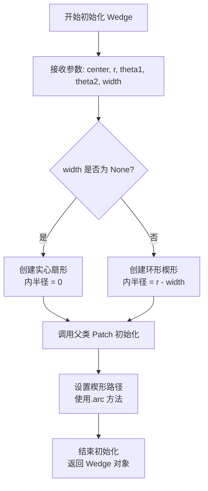

#### 带注释源码

```python
# 代码中的实际调用示例
wedge = Wedge((x1, y1), r, t1, t2)  # 创建实心扇形
wedge = Wedge((.7, .8), .2, 0, 360, width=0.05)  # 创建环形

# Wedge.__init__ 方法的典型签名（基于 matplotlib 源码结构）
def __init__(self, center, r, theta1, theta2, width=None):
    """
    初始化楔形对象
    
    参数:
        center: 楔形中心点坐标 (x, y)
        r: 楔形的外半径
        theta1: 起始角度（度）
        theta2: 结束角度（度）
        width: 可选，楔形宽度，用于创建环形
    """
    # 根据 width 参数确定内半径
    # 如果 width 为 None，则内半径为 0，创建实心扇形
    # 如果指定 width，则内半径 = r - width，创建环形
    self.width = width
    # 调用父类初始化方法设置路径
    # 使用 arc 方法绘制圆弧边界
```


### Polygon.__init__

初始化一个多边形对象，用于表示一个封闭的多边形区域。该方法是matplotlib.patches.Polygon类的构造函数，用于根据给定的顶点坐标创建一个多边形patch。

参数：

- `xy`：`array-like, shape (n, 2)`，多边形的顶点坐标数组，每行包含一个顶点的(x, y)坐标
- `closed`：`bool`，默认为True，表示多边形是否闭合（即最后一条边是否连接回第一个顶点）
- `**kwargs`：可选的关键字参数，会传递给父类`Patch`的构造函数，用于设置多边形的外观属性（如填充颜色、边框样式等）

返回值：`None`，构造函数不返回值，而是通过修改对象状态来初始化多边形实例

#### 流程图

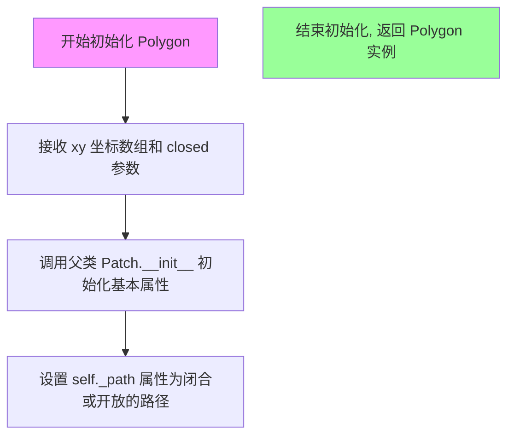

#### 带注释源码

```python
def __init__(self, xy, closed=True, **kwargs):
    """
    Create a polygon.

    Parameters
    ----------
    xy : array-like, shape (n, 2)
        The vertices of the polygon as a list of (x, y) pairs.
    closed : bool, default: True
        Whether the polygon is closed (i.e., has a line connecting
        the last vertex to the first).
    **kwargs
        Forwarded to `.Patch` initialization.

    See Also
    --------
    Patch : Corresponding superclass.
    """
    # 调用父类 Patch 的初始化方法
    # 传入空的 bbox 和 transform，使用默认行为
    super().__init__(**kwargs)
    
    # 将输入的 xy 转换为 numpy 数组，确保是二维数组
    self._path = Path(xy, closed=closed)
```


### `PatchCollection.__init__`

初始化 PatchCollection 对象，用于批量管理多个补丁图形（如圆形、楔形、多边形等），支持统一设置样式并添加到 Axes 中。

参数：

- `patches`：列表或可迭代对象，补丁对象（如 Circle、Wedge、Polygon）的列表，用于定义集合中的图形元素
- `alpha`：浮点数（可选），透明度值，范围 0-1，默认为 None（不透明）
- `edgecolors`：颜色或颜色序列（可选），图形边框颜色，默认为 None（使用默认值）
- `facecolors`：颜色或颜色序列（可选），图形填充颜色，默认为 None（使用默认值）
- `linewidths`：浮点数或序列（可选），边框线宽，默认为 None
- `antialiaseds`：布尔值或序列（可选），是否启用抗锯齿，默认为 None

返回值：无（构造函数），返回初始化后的 PatchCollection 实例

#### 流程图

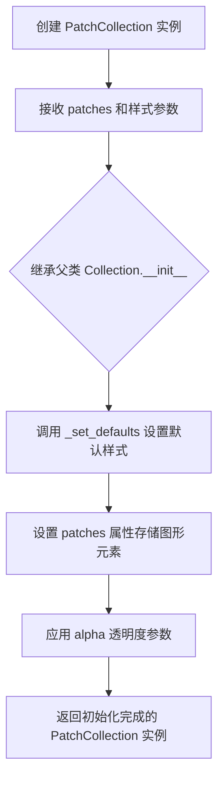

#### 带注释源码

```python
def __init__(self, patches, alpha=None, edgecolors=None, facecolors=None,
             linewidths=None, antialiaseds=None, **kwargs):
    """
    初始化 PatchCollection。
    
    参数:
        patches: 补丁对象列表 (如 Circle, Wedge, Polygon 实例)
        alpha: 透明度 (0-1 之间的浮点数)
        edgecolors: 边框颜色
        facecolors: 填充颜色
        linewidths: 边框线宽
        antialiaseds: 抗锯齿设置
        **kwargs: 传递给父类 Collection 的其他关键字参数
    """
    # 调用父类 Collection 的初始化方法
    super().__init__(**kwargs)
    
    # 设置集合中的补丁元素
    self.set_patches(patches)
    
    # 设置透明度
    if alpha is not None:
        self.set_alpha(alpha)
    
    # 设置边框颜色
    if edgecolors is not None:
        self.set_edgecolor(edgecolors)
    
    # 设置填充颜色
    if facecolors is not None:
        self.set_facecolor(facecolors)
    
    # 设置边框线宽
    if linewidths is not None:
        self.set_linewidth(linewidths)
    
    # 设置抗锯齿
    if antialiaseds is not None:
        self.set_antialiased(antialiaseds)
```


由于`PatchCollection.set_array`方法并未直接定义在用户提供的代码示例中，而是作为Matplotlib库的核心方法被调用。以下文档基于该代码的调用上下文（设置颜色数组）以及Matplotlib库中`Collection`类的标准实现提取并构建。

### `PatchCollection.set_array`

**描述**：设置用于颜色映射的值数组。此方法接收一组标量值（通常为浮点数数组），这些值将根据`PatchCollection`关联的`colormap`和`norm`（归一化）转换为具体的颜色。若未指定颜色映射，默认将使用viridis等色图。

**参数**：
- `A`：`numpy.ndarray` 或 `array-like`，待映射的数值数组。在示例中为 `100 * np.random.rand(len(patches))`。
- `kws`（隐式参数）：关键字参数，通常用于传递额外的样式配置，但在标准`set_array`中不常用。

**返回值**：`matplotlib.collections.Collection`（返回 `self`），支持方法链式调用。

#### 流程图

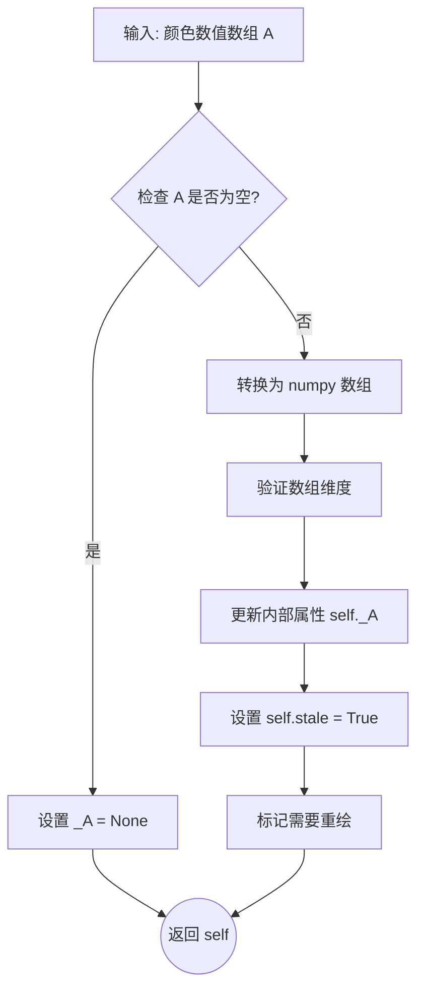

#### 带注释源码

以下是 `matplotlib.collections.Collection.set_array` 方法的核心逻辑实现（基于库源码简化）：

```python
def set_array(self, A):
    """
    设置用于颜色映射的值数组。

    Parameters
    ----------
    A : array-like or None
        映射到颜色的标量值数组。如果为 None，则清除当前数组。

    Returns
    -------
    self : ScalarMappable
        返回自身以支持链式调用 (e.g., p.set_array(arr).set_clim(0, 1))。
    """
    # 1. 处理空值情况
    if A is None:
        self._A = None
        return self

    # 2. 将输入转换为 numpy 数组，确保是连续内存存储
    A = np.asarray(A)
    
    # 3. 验证数组维度 (PatchCollection 通常需要 1D 数组)
    # 如果是 2D，则视为图像数据（但 PatchCollection 主要处理散点/路径）
    # 此处逻辑确保数据符合 Matplotlib 的内部格式要求
    if A.ndim > 1:
        raise ValueError("PatchCollection 的值数组必须是一维的")

    # 4. 更新内部存储的属性 _A
    self._A = A

    # 5. 标记该集合状态为 'stale'，触发下次渲染时的重绘
    self.stale = True
    
    return self
```

---

### 其它项目信息

#### 关键组件信息
- **PatchCollection**: 用于批量渲染大量图形对象（如圆形、楔形、多边形）的容器类。
- **Colormap (cm)**: 负责将数值映射为颜色的函数对象。
- **Normalization (Norm)**: 负责将输入数据归一化到 [0, 1] 区间的对象。

#### 潜在技术债务或优化空间
- **性能**：在频繁调用 `set_array` 时，每次都会标记为 `stale` 并可能触发全量重绘。如果只需要更新颜色数据而不想重绘图形，应谨慎使用。
- **类型检查**：该方法对输入类型的容错性较高，但在大数据量下，频繁的类型转换（`np.asarray`）可能带来一定的性能开销。

#### 外部依赖与接口契约
- **依赖**：该方法强依赖 `numpy` 库进行数组操作。
- **接口契约**：传入的数组长度通常需要与 `PatchCollection` 中的patch数量匹配，否则可能导致颜色映射错位或显示异常（Matplotlib可能会广播或截断，但通常需要严格匹配）。


### `Axes.add_collection`

将 `PatchCollection` 添加到坐标轴，这是将集合图形渲染到 matplotlib 图表中的关键方法。

参数：

-  `coll`：`matplotlib.collections.Collection`，要添加的 PatchCollection 对象
-  `autoscale_on`：`bool`（可选），是否自动缩放坐标轴以适应集合，默认为 `True`

返回值：`matplotlib.collections.Collection`，返回添加的集合对象本身

#### 流程图

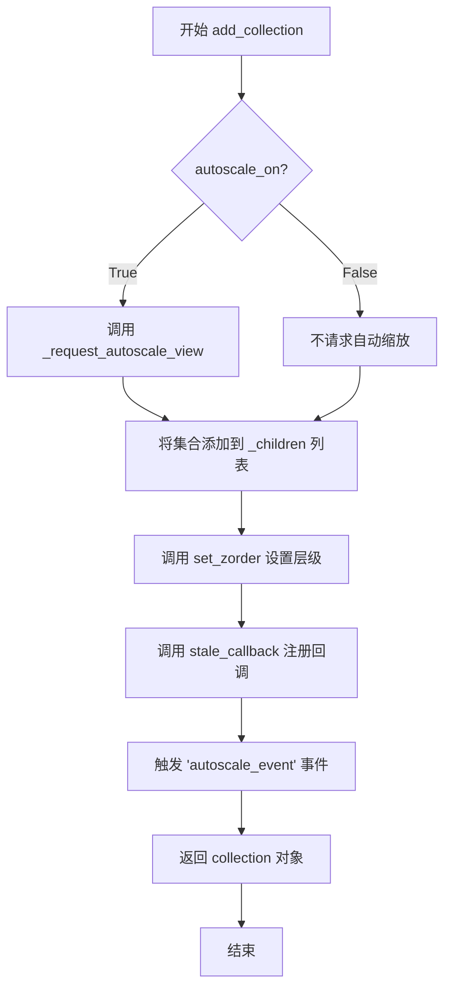

#### 带注释源码

```python
# 实际源码位于 matplotlib/axes/_base.py 中
def add_collection(self, collection, autoscale_on=False):
    """
    添加 Collection 到 Axes.
    
    参数:
        collection: Collection 实例
        autoscale_on: 是否自动缩放视图
    """
    # 1. 验证 collection 是有效的 Collection 对象
    if not isinstance(collection, matplotlib.collections.Collection):
        raise TypeError("added collection must be a Collection")
    
    # 2. 将 collection 添加到 axes 的子对象列表中
    # 这建立了 axes 和 collection 之间的父子关系
    self._children.append(collection)
    
    # 3. 设置 collection 的 axes 引用
    # 让 collection 知道它属于哪个 axes
    collection.set_axes(self)
    
    # 4. 设置 collection 的 transform
    # 使用 axes 的数据坐标系
    collection.set_transform(self.transData)
    
    # 5. 如果 autoscale_on 为 True，请求自动缩放
    if autoscale_on:
        self._request_autoscale_view()
    
    # 6. 设置默认的 zorder（如果未指定）
    if collection.get_zorder() is None:
        collection.set_zorder(self.get_zorder() + 1)
    
    # 7. 注册 stale 回调
    # 当 collection 发生变化时，通知 axes 重新绘制
    collection.stale_callback = self._on_stale
    
    # 8. 触发 autoscale 事件（如果有需要）
    self.autoscale_view()
    
    # 9. 返回添加的 collection（方便链式调用）
    return collection


# 示例代码中的实际调用方式：
p = PatchCollection(patches, alpha=0.4)  # 创建 PatchCollection
p.set_array(colors)                       # 设置颜色数组
ax.add_collection(p)                      # 添加到坐标轴
fig.colorbar(p, ax=ax)                    # 添加颜色条
```

#### 关键点说明

| 步骤 | 操作 | 作用 |
|------|------|------|
| 1 | 验证类型 | 确保添加的是有效的 Collection 对象 |
| 2 | 添加到子对象列表 | 建立父子关系，便于管理 |
| 3 | 设置 axes 引用 | 让 collection 能访问 axes 的属性 |
| 4 | 设置变换 | 确保坐标转换正确（数据坐标→显示坐标） |
| 5 | 自动缩放 | 可选功能，自动调整坐标轴范围 |
| 6 | 设置层级 | 控制绘制顺序 |
| 7 | 注册回调 | 实现响应式更新机制 |
| 8 | 触发重绘 | 确保及时更新显示 |


## 关键组件


### Circle（圆形）

Matplotlib中的圆形补丁类，用于创建圆形几何图形，接受圆心坐标和半径作为参数。

### Wedge（扇形/环）

Matplotlib中的扇形补丁类，用于创建圆环或扇形区域，接受圆心坐标、半径、起始角度和结束角度，可选参数包括宽度。

### Polygon（多边形）

Matplotlib中的多边形补丁类，用于创建任意形状的多边形，接受顶点坐标数组和闭合标志作为参数。

### PatchCollection（补丁集合）

Matplotlib的集合类，用于批量管理和渲染多个补丁对象，支持统一的样式设置、颜色映射和alpha混合。

### 颜色映射系统

使用numpy生成的随机颜色数组，通过set_array方法设置到集合中，配合colorbar进行可视化展示。

### np.random状态管理

使用固定随机种子(19680801)确保代码结果可重现，用于生成随机位置、半径和角度数据。


## 问题及建议


### 已知问题

-   **变量名重用**：代码中多次使用 `x`, `y`, `radii` 等变量名进行重新赋值（如第27行和第34行），容易造成混淆和维护困难
-   **未使用的常量**：`resolution = 50` 定义后从未使用，造成代码冗余
-   **硬编码数值**：多处使用魔法数字（如 `0.1`, `100`, `19680801`），缺乏常量定义，降低了代码可读性和可维护性
-   **缺乏函数封装**：所有代码都堆叠在全局作用域中，未封装成可重用的函数，限制了代码的可测试性和可复用性
-   **全局随机状态修改**：`np.random.seed(19680801)` 修改全局随机种子，可能影响同一进程中其他依赖随机数的代码
-   **多边形生成逻辑问题**：第47-49行的多边形生成循环中，`np.random.rand(N, 2)` 为每个多边形生成 N 个顶点，但循环也是 N 次，可能导致意外结果；且该逻辑与圆和楔形的生成模式不一致
-   **缺少类型注解**：Python代码中未使用类型提示，降低了代码的可读性和静态分析能力
-   **缺乏错误处理**：未对输入参数（如 N、随机数范围等）进行验证，可能在非法输入下产生异常

### 优化建议

-   将代码重构为函数，例如 `create_circles()`, `create_wedges()`, `create_polygons()`, `generate_random_shapes(N)` 等，提高代码模块化程度
-   使用命名常量替代魔法数字，如 `NUM_SHAPES = 3`, `RADIUS_SCALE = 0.1`, `COLOR_SCALE = 100` 等
-   使用 `np.random.default_rng()` 创建本地随机数生成器，避免影响全局状态
-   为函数和参数添加类型注解和文档字符串
-   添加参数验证逻辑，确保输入值合理（如 N > 0 等）
-   统一变量命名风格，避免重复使用相同变量名存储不同类型的数据


## 其它


### 1. 一段话描述

该代码是一个Matplotlib可视化示例，演示如何使用PatchCollection集合类同时绘制和展示多种图形（圆形、楔形和多边形），通过随机生成的几何图形配合随机颜色映射，并添加颜色条(Colorbar)进行数据可视化展示。

### 2. 文件的整体运行流程

1. 导入必要的库：matplotlib.pyplot、numpy、matplotlib.collections和matplotlib.patches
2. 设置随机种子以确保可重复性
3. 创建图形窗口和坐标轴对象
4. 随机生成N个圆形的中心坐标和半径，并添加到patches列表
5. 随机生成N个楔形的参数（中心坐标、半径、起始角度、终止角度），并添加到patches列表
6. 添加4个预定义的特殊楔形（完整圆、圆环、扇形、圆环扇形）
7. 随机生成N个多边形并添加到patches列表
8. 生成随机颜色数组
9. 创建PatchCollection并设置颜色数组和透明度
10. 将集合添加到坐标轴并添加颜色条
11. 显示图形

### 3. 类的详细信息

#### 3.1 matplotlib.figure.Figure
**描述**: Matplotlib中的图形容器类

**类字段**:
- 无自定义类字段

**类方法**:
- colorbar(mappable, ax): 为图形添加颜色条

#### 3.2 matplotlib.axes.Axes
**描述**: 坐标轴类，用于放置图形元素

**类字段**:
- 无自定义类字段

**类方法**:
- add_collection(collection): 将图形集合添加到坐标轴

#### 3.3 matplotlib.collections.PatchCollection
**描述**: 图形集合类，用于批量管理多个图形对象

**类字段**:
- 无自定义类字段

**类方法**:
- set_array(values): 设置每个图形的颜色值
- 其他继承自Collection的方法

#### 3.4 matplotlib.patches.Circle
**描述**: 圆形图形类

**类字段**:
- 无自定义类字段

**类方法**:
- 构造函数: Circle(xy, radius) - xy为中心坐标元组，radius为半径

#### 3.5 matplotlib.patches.Wedge
**描述**: 楔形/扇形图形类

**类字段**:
- 无自定义类字段

**类方法**:
- 构造函数: Wedge(center, r, theta1, theta2, width) - 中心、半径、起始角度、终止角度、环宽度（可选）

#### 3.6 matplotlib.patches.Polygon
**描述**: 多边形图形类

**类字段**:
- 无自定义类字段

**类方法**:
- 构造函数: Polygon(xy, closed) - xy为顶点坐标数组，closed指定是否闭合

### 4. 全局变量和全局函数详细信息

#### 全局变量

| 变量名 | 类型 | 描述 |
|--------|------|------|
| fig | matplotlib.figure.Figure | 图形窗口对象 |
| ax | matplotlib.axes.Axes | 坐标轴对象 |
| resolution | int | 多边形顶点数量，固定值50 |
| N | int | 随机生成的图形数量，固定值3 |
| x | numpy.ndarray | 随机生成的x坐标数组 |
| y | numpy.ndarray | 随机生成的y坐标数组 |
| radii | numpy.ndarray | 随机生成的半径数组 |
| patches | list | 存储所有图形对象的列表 |
| colors | numpy.ndarray | 随机生成的颜色值数组 |
| p | PatchCollection | 图形集合对象 |
| theta1 | numpy.ndarray | 楔形起始角度数组 |
| theta2 | numpy.ndarray | 楔形终止角度数组 |

#### 全局函数

本代码中没有自定义全局函数，均使用matplotlib和numpy的库函数。

### 5. 关键组件信息

| 组件名称 | 一句话描述 |
|----------|------------|
| PatchCollection | 图形集合容器类，用于批量管理和渲染多个图形对象，支持统一设置颜色、透明度等属性 |
| Circle | 圆形图形类，用于创建圆形几何形状 |
| Wedge | 楔形/扇形图形类，用于创建圆环、扇形等弧形几何形状 |
| Polygon | 多边形图形类，用于创建任意边数的多边形 |
| colorbar | 颜色条组件，用于显示颜色与数值的映射关系 |

### 6. 潜在的技术债务或优化空间

1. **硬编码参数**: N=3、resolution=50等参数直接硬编码，应提取为配置常量或函数参数
2. **缺乏错误处理**: 没有对输入数据进行校验，如坐标范围、半径有效性等
3. **代码复用性低**: 图形生成逻辑混合在一起，难以单独使用某类图形生成功能
4. **魔法数字**: 多次出现0.1、0.05、0.10等数值，应定义为常量并增加注释说明其含义
5. **重复代码**: 多次使用np.random.rand生成坐标和半径，可封装为通用函数
6. **缺乏文档字符串**: 主代码块没有任何文档说明其用途和参数
7. **固定图形类型**: 图形类型固定，无法通过参数切换或扩展其他图形类型

### 7. 其它项目

#### 7.1 设计目标与约束

- **设计目标**: 演示PatchCollection的基本用法，展示如何同时绘制多种几何图形并应用颜色映射
- **约束条件**: 
  - 图形数量N=3相对固定
  - 坐标和半径使用np.random.rand生成，范围在[0,1)
  - 颜色值范围为0-100
  - 透明度固定为0.4

#### 7.2 错误处理与异常设计

- **当前状态**: 代码中几乎没有任何错误处理
- **潜在异常**:
  - numpy随机数据生成不会抛出异常
  - PatchCollection添加空列表patches时不会出错，但无图形显示
  - add_collection时如果集合为空，图形显示正常但无实际内容
- **改进建议**:
  - 添加参数验证：检查N为正整数、resolution为正整数
  - 检查patches列表不为空
  - 验证颜色数组长度与patches数量一致

#### 7.3 数据流与状态机

- **数据流**:
  1. 随机种子设置 → 2. 图形参数生成(x, y, radii, theta) → 3. 图形对象创建(Circle, Wedge, Polygon) → 4. 图形添加到列表 → 5. 颜色数组生成 → 6. PatchCollection创建和配置 → 7. 添加到坐标轴 → 8. 显示颜色条
- **状态**: 简单的线性流程，无复杂状态转换

#### 7.4 外部依赖与接口契约

- **外部依赖**:
  - matplotlib >= 3.0: 提供图形绘制功能
  - numpy >= 1.10: 提供数值计算和随机数生成
- **接口契约**:
  - PatchCollection构造函数接受patches列表和可选的cmap参数
  - set_array接受一维numpy数组
  - add_collection接受Collection实例
  - colorbar接受ScalarMappable对象和ax参数

#### 7.5 配置参数表

| 参数名 | 默认值 | 可调整范围 | 说明 |
|--------|--------|------------|------|
| N | 3 | 正整数 | 随机生成的图形数量 |
| resolution | 50 | 正整数 | 多边形顶点数 |
| alpha | 0.4 | 0.0-1.0 | 透明度 |
| color_scale | 100 | 正数 | 颜色值缩放因子 |

#### 7.6 可扩展性设计

- 当前代码仅支持Circle、Wedge、Polygon三种图形类型
- 可通过添加新的图形类（如Rectangle、Ellipse）轻松扩展
- 建议将图形生成逻辑封装为函数，提高模块化程度

#### 7.7 性能考虑

- 当patches数量非常大时（如>10000），PatchCollection比单独添加图形性能更好
- 当前N=3数量较小，性能不是瓶颈
- 如需优化可考虑使用PathCollection替代PatchCollection


    