# `matplotlib\galleries\examples\shapes_and_collections\path_patch.py` 详细设计文档

该代码是Matplotlib官方示例，演示了如何使用matplotlib.path.Path和matplotlib.patches.PathPatch API创建自定义形状的路径并将其渲染到图形中，通过定义一系列路径命令（移动、贝塞尔曲线、直线、闭合多边形）绘制一个矢量图形。

## 整体流程

```mermaid
graph TD
    A[开始] --> B[导入模块]
B --> C[创建图形和坐标轴: plt.subplots()]
C --> D[定义Path路径数据]
D --> E[从路径数据提取codes和verts]
E --> F[创建Path对象: mpath.Path(verts, codes)]
F --> G[创建PathPatch对象: mpatches.PathPatch(path)]
G --> H[添加Patch到坐标轴: ax.add_patch(patch)]
H --> I[提取顶点并绘制控制点和连接线: ax.plot()]
I --> J[设置网格: ax.grid()]
J --> K[设置等比例坐标轴: ax.axis('equal')]
K --> L[显示图形: plt.show()]
```

## 类结构

```
Matplotlib API (外部库)
├── matplotlib.pyplot
│   └── plt.subplots()
│   └── plt.show()
├── matplotlib.path
│   └── Path 类
│   │   ├── MOVETO 常量
│   │   ├── CURVE4 常量
│   │   ├── LINETO 常量
│   │   └── CLOSEPOLY 常量
│   └── Path.vertices 属性
└── matplotlib.patches
│   └── PathPatch 类
└── matplotlib.axes.Axes
    ├── add_patch() 方法
    ├── plot() 方法
    ├── grid() 方法
    └── axis() 方法
```

## 全局变量及字段


### `fig`
    
图形对象，表示整个matplotlib图形窗口

类型：`matplotlib.figure.Figure`
    


### `ax`
    
坐标轴对象，用于在图形上绘制元素

类型：`matplotlib.axes.Axes`
    


### `Path`
    
matplotlib.path.Path的别名，用于创建路径对象

类型：`matplotlib.path.Path`
    


### `path_data`
    
路径数据元组列表，包含路径命令和坐标点

类型：`list[tuple]`
    


### `codes`
    
从path_data提取的路径命令代码元组

类型：`tuple`
    


### `verts`
    
从path_data提取的顶点坐标元组

类型：`tuple`
    


### `path`
    
Path对象实例，表示一个完整的路径

类型：`matplotlib.path.Path`
    


### `patch`
    
PathPatch对象实例，用于在坐标轴上绘制填充的路径形状

类型：`matplotlib.patches.PathPatch`
    


### `x`
    
路径顶点x坐标列表

类型：`tuple`
    


### `y`
    
路径顶点y坐标列表

类型：`tuple`
    


### `line`
    
绘制的线条对象，表示控制点和连接线

类型：`matplotlib.lines.Line2D`
    


### `Path.vertices`
    
路径顶点坐标列表

类型：`numpy.ndarray`
    


### `Path.codes`
    
路径命令代码列表

类型：`numpy.ndarray`
    


### `PathPatch.path`
    
PathPatch对象包含的路径对象

类型：`matplotlib.path.Path`
    


### `PathPatch.facecolor`
    
PathPatch的填充颜色

类型：`str`
    


### `PathPatch.alpha`
    
PathPatch的透明度

类型：`float`
    
    

## 全局函数及方法


### `plt.subplots()`

创建图形（Figure）和一个或多个坐标轴（Axes）的函数，是 matplotlib 中最常用的图形初始化方法之一。该函数返回一个 Figure 对象和一个 Axes 对象（或 Axes 数组），用于后续的绘图操作。

参数：

- `nrows`：`int`，默认值 1，子图的行数
- `ncols`：`int`，默认值 1，子图的列数
- `sharex`：`bool` 或 `str`，默认值 False，是否共享 x 轴
- `sharey`：`bool` 或 `str`，默认值 False，是否共享 y 轴
- `squeeze`：`bool`，默认值 True，是否返回压缩后的数组
- `width_ratios`：`array-like`，可选，行宽度比例
- `height_ratios`：`array-like`，可选，列高度比例
- `subplot_kw`：`dict`，可选，传递给 `add_subplot` 的关键字参数
- `gridspec_kw`：`dict`，可选，传递给 `GridSpec` 的关键字参数
- `figsize`：`tuple`，可选，图形大小 (width, height)，单位英寸
- `dpi`：`int`，可选，每英寸点数（dots per inch）

返回值：`tuple`，返回 `(Figure, Axes)` 或 `(Figure, Axes array)`。第一个元素是 Figure 对象，第二个元素是 Axes 对象（当 `squeeze=True` 且 `nrows*ncols=1` 时）或是 Axes 数组（当 `nrows*ncols>1` 时）。

#### 流程图

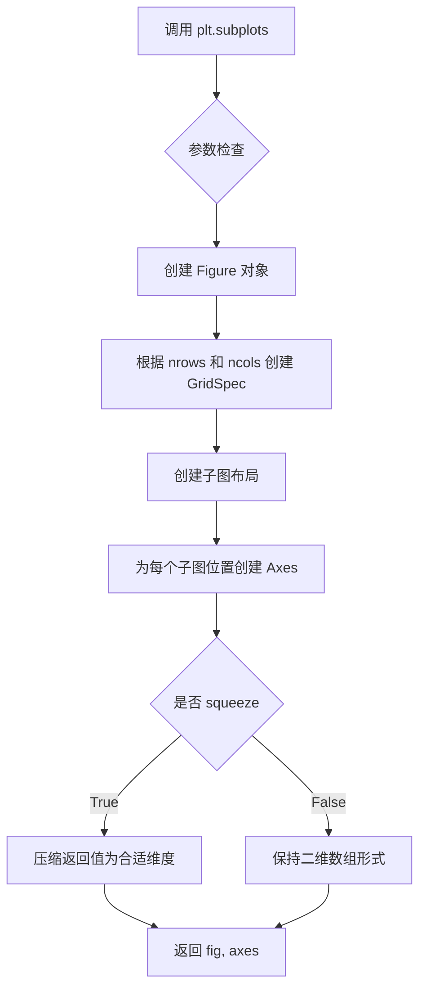

#### 带注释源码

```python
# plt.subplots() 的典型调用方式
fig, ax = plt.subplots()

# 等价于以下两步操作：
# 1. 创建图形
# fig = plt.figure()
# 2. 创建子图（这里创建1行1列的子图）
# ax = fig.add_subplot(1, 1, 1)

# 示例代码中的实际使用：
# fig, ax = plt.subplots()  # 创建图形对象 fig 和坐标轴对象 ax
# Path = mpath.Path  # 获取 Path 类
# path_data = [...]  # 定义路径数据点
# codes, verts = zip(*path_data)  # 分离路径代码和顶点
# path = mpath.Path(verts, codes)  # 创建 Path 对象
# patch = mpatches.PathPatch(path, facecolor='r', alpha=0.5)  # 创建路径补丁
# ax.add_patch(patch)  # 将补丁添加到坐标轴
```


### `plt.show()`

显示当前figure的所有图形窗口。该函数会阻塞程序的执行（取决于后端设置），直到用户关闭图形窗口，或者在某些交互式后端中立即返回并允许继续执行。

参数：

- `block`：`bool`，可选，默认为 `True`。如果设置为 `True`，在交互式后端中会阻塞程序执行直到图形窗口被关闭；如果设置为 `False`，函数会立即返回。

返回值：`None`，该函数不返回任何值。

#### 流程图

```mermaid
flowchart TD
    A[开始 plt.show()] --> B{图形是否存在?}
    B -->|是| C[调用后端显示函数]
    B -->|否| D[无操作，直接返回]
    C --> E{block参数?}
    E -->|True| F[阻塞程序执行]
    E -->|False| G[非阻塞模式]
    F --> H[等待用户关闭图形窗口]
    G --> I[立即返回继续执行]
    H --> J[用户关闭窗口]
    J --> K[结束]
    D --> K
    I --> K
```

#### 带注释源码

```python
# 导入matplotlib.pyplot模块，通常使用别名plt
import matplotlib.pyplot as plt

# ... (前面的代码创建了图形和路径对象) ...

# 设置网格
ax.grid()

# 设置坐标轴为等比例
ax.axis('equal')

# 显示图形
# 作用：显示当前figure的所有打开的图形窗口
# 参数block默认为True，表示阻塞程序执行直到用户关闭图形窗口
# 在某些后端（如TkAgg, Qt5Agg）中会弹出交互式窗口
# 在某些非交互式后端（如Agg, SVG）中可能会保存到文件或进行其他操作
plt.show()

# 阻塞说明：
# - block=True（默认）：在交互式后端中，程序会暂停并等待用户关闭窗口
# - block=False：在交互式后端中，函数立即返回，程序继续执行
# - 在某些后端（如nbAgg, %matplotlib inline）中可能无效
```


### `Axes.add_patch`

该方法用于将补丁（Patch）对象添加到坐标轴（Axes）的补丁列表中，是Matplotlib中向图表添加几何形状（如矩形、圆形、多边形等）的核心方法。

参数：

-  `p`：`matplotlib.patches.Patch`，要添加到坐标轴的补丁对象（如Rectangle、Circle、PathPatch等）

返回值：`matplotlib.patches.Patch`，返回添加的补丁对象本身，以便进行链式调用或进一步操作

#### 流程图

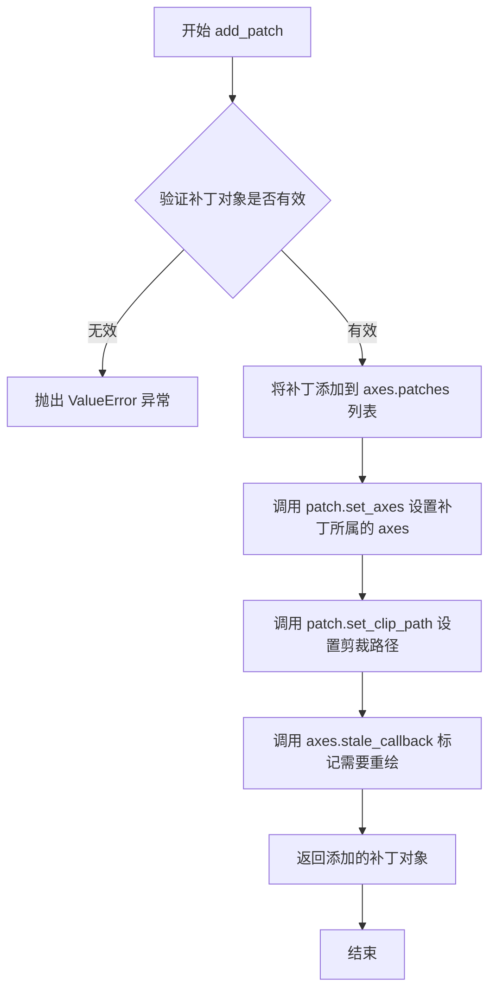

#### 带注释源码

```python
def add_patch(self, p):
    """
    Add a :class:`~matplotlib.patches.Patch` to the
    :attr:`axes <matplotlib.axes.Axes.patches>` list; return the patch.

    Parameters
    ----------
    p : Patch
        The patch to add.

    Returns
    -------
    Patch
        The added patch.

    See Also
    --------
    add_patch
    """
    # 验证输入对象是否为 Patch 类型
    self._check_class_is_safe(patches.Patch)
    
    # 将补丁添加到 patches 列表中
    self.patches.append(p)
    
    # 设置补丁的 transform，关联到当前 axes
    p.set_axes(self)
    
    # 设置剪裁路径（如果有的话）
    p.set_clip_path(self.patch)
    
    # 标记 axes 需要重绘
    self.stale_callback(p)
    
    # 返回添加的补丁对象，便于链式调用
    return p
```


### `matplotlib.axes.Axes.plot`

`ax.plot()` 是 Matplotlib 中 Axes 类的核心方法，用于在图表上绘制线图。该方法接收 x 和 y 坐标数据以及可选的格式字符串，创建 Line2D 对象并将其添加到坐标轴中，最后返回包含线条对象的列表。

参数：

- `x`：`array-like`，x 轴坐标数据，可以是列表、NumPy 数组或 Pandas Series
- `y`：`array-like`，y 轴坐标数据，可以是列表、NumPy 数组或 Pandas Series
- `fmt`：`str`（可选），格式字符串，组合颜色和样式（如 'go-' 表示绿色圆圈标记的实线）
- `**kwargs`：其他关键字参数，用于设置 Line2D 的属性（如 linewidth、markerfacecolor 等）

返回值：`list of matplotlib.lines.Line2D`，返回添加到图表中的线条对象列表

#### 流程图

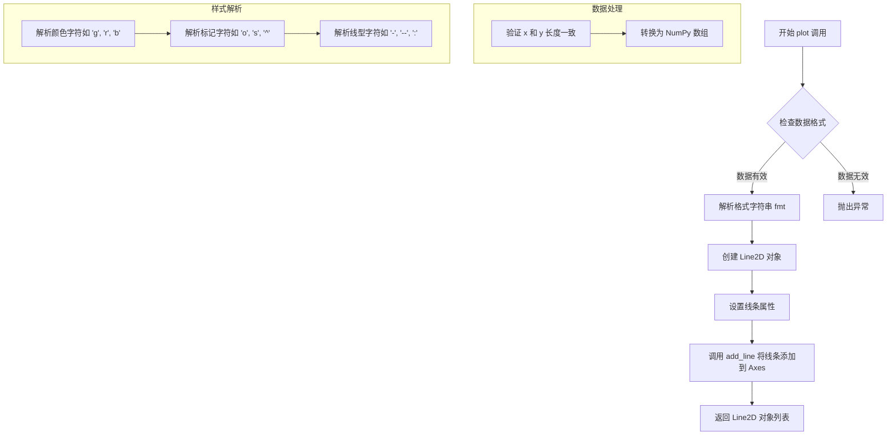

#### 带注释源码

```python
# 模拟的 ax.plot() 方法实现框架
def plot(self, x, y, fmt=None, **kwargs):
    """
    在 Axes 上绘制线条
    
    参数:
        x: x 坐标数据
        y: y 坐标数据  
        fmt: 格式字符串如 'go-' (绿色圆圈实线)
        **kwargs: Line2D 的其他属性
    """
    
    # 步骤 1: 数据验证与预处理
    # 确保 x 和 y 是相同长度的数组
    x = np.asarray(x)
    y = np.asarray(y)
    
    # 步骤 2: 解析格式字符串
    if fmt is not None:
        # 提取颜色、标记、线型信息
        color, marker, linestyle = parse_format_string(fmt)
    else:
        # 使用默认样式
        color = kwargs.get('color', None)
        marker = kwargs.get('marker', None)
        linestyle = kwargs.get('linestyle', '-')
    
    # 步骤 3: 创建 Line2D 对象
    # 这是表示线条的核心对象
    line = mlines.Line2D(x, y)
    
    # 步骤 4: 设置线条属性
    # 从 kwargs 和解析的格式设置属性
    line.set_color(color)
    line.set_marker(marker)
    line.set_linestyle(linestyle)
    
    # 应用其他用户提供的属性
    for key, value in kwargs.items():
        getattr(line, f'set_{key}')(value)
    
    # 步骤 5: 将线条添加到 Axes
    # 调用 Axes 的 add_line 方法
    self.add_line(line)
    
    # 步骤 6: 返回线条对象
    # 注意: 返回的是列表，支持同时绘制多条线
    return [line]
```


### `Axes.grid`

设置坐标轴的网格线，用于可视化参考线。

参数：

- `b`：`bool` 或 `None`，可选参数。指定是否显示网格线。`True` 显示网格，`False` 不显示，`None` 切换当前状态。默认为 `None`。
- `which`：`str`，可选参数。指定显示哪些网格线，可选值为 `'major'`（主刻度线）、`'minor'`（次刻度线）或 `'both'`。默认为 `'major'`。
- `axis`：`str`，可选参数。指定在哪个轴上显示网格线，可选值为 `'both'`（两个轴）、`'x'`（仅 x 轴）或 `'y'`（仅 y 轴）。默认为 `'both'`。
- `**kwargs`：关键字参数，可选。传递给 `matplotlib.lines.Line2D` 的属性，如 `color`、`linestyle`、`linewidth`、`alpha` 等。

返回值：`None`，无返回值，该方法直接修改 Axes 对象的显示状态。

#### 流程图

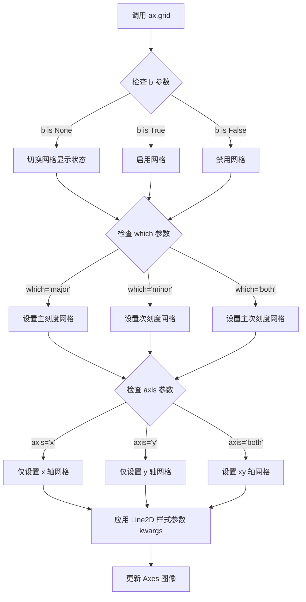

#### 带注释源码

```python
def grid(self, b=None, which='major', axis='both', **kwargs):
    """
    Configure the grid lines.
    
    Parameters
    ----------
    b : bool or None, optional
        Whether to show the grid lines. If *b* is *None* and 
        there are no kwargs, toggle the visibility. If there 
        are kwargs, it is treated as True. Default is *None*.
    
    which : {'major', 'minor', 'both'}, optional
        The grid lines to apply the changes on. Default is 'major'.
    
    axis : {'both', 'x', 'y'}, optional
        The axis to apply the changes on. Default is 'both'.
    
    **kwargs
        Keyword arguments are passed to `Line2D` and can be used
        to control the grid line appearance (e.g., color, linestyle,
        linewidth, alpha).
    
    Returns
    -------
    list of Line2D
        A list of grid lines. If there are no grid lines, an empty
        list is returned.
    
    See Also
    --------
    XAxis.grid, YAxis.grid
    """
    # 获取对应的轴对象（x轴或y轴或两者）
    axis_name = self._get_axis_name(axis)
    
    # 处理 b 参数：如果 kwargs 存在则默认启用网格
    if b is None and not kwargs:
        # 切换网格显示状态
        b = not self._gridOnMajor
    
    # 根据 which 参数设置网格
    if which in ('major', 'both'):
        # 设置主刻度网格
        self.xaxis.grid(b, which=which, axis=axis_name, **kwargs)
        self.yaxis.grid(b, which=which, axis=axis_name, **kwargs)
    
    if which in ('minor', 'both'):
        # 设置次刻度网格
        self.xaxis.grid(b, which='minor', axis=axis_name, **kwargs)
        self.yaxis.grid(b, which='minor', axis=axis_name, **kwargs)
```


### `matplotlib.axes.Axes.axis`

设置坐标轴的属性和限制。该方法可以设置坐标轴的纵横比、缩放模式，或直接设置坐标轴的范围。

参数：

- `*args`：`str` 或 `list` 或 `tuple`，可选参数
  - 当为字符串时（如 'equal', 'scaled', 'tight', 'off', 'on', 'auto'），用于设置坐标轴的模式
  - 当为列表或元组时（如 [xmin, xmax, ymin, ymax]），用于设置坐标轴的范围
  - 当不传参数时，返回当前轴域范围
- `**kwargs`：`dict`，可选关键字参数
  - 传递给 xlim 和 ylim 的关键字参数

返回值：

- 当无参数调用时：返回 `list` [xmin, xmax, ymin, ymin]，表示当前坐标轴范围
- 当设置参数时：返回 `Axes` (self)，返回 Axes 对象本身以便链式调用

#### 流程图

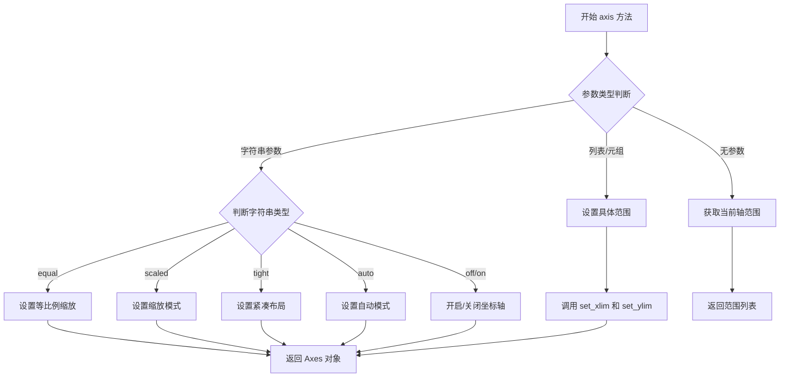

#### 带注释源码

```python
def axis(self, *args, **kwargs):
    """
    设置坐标轴的范围和属性。
    
    参数:
    -------
    *args : 多种形式
        - 无参数: 返回当前范围 [xmin, xmax, ymin, ymax]
        - 字符串: 'equal', 'scaled', 'tight', 'off', 'on', 'auto'
        - 列表/元组: [xmin, xmax, ymin, ymax]
    
    **kwargs : dict
        传递给 xlim 和 ylim 的参数
    
    返回值:
    -------
    根据调用形式返回范围列表或 Axes 对象
    """
    # 获取当前图形
    g = self.figure.canvas.get_renderer()
    
    if not args:
        # 无参数调用，返回当前轴范围 [xmin, xmax, ymin, ymax]
        return [self._xmin, self._xmax, self._ymin, self._ymax]
    
    # 获取第一个参数
    v = args[0]
    
    if isinstance(v, str):
        # 字符串参数处理
        if v == 'equal':
            # 设置等比例，使 x 和 y 轴单位长度相同
            self.set_aspect('equal', adjustable='box')
            self.autoscale_view()
        elif v == 'scaled':
            # 根据数据范围自动缩放
            self.autoscale_view()
        elif v == 'tight':
            # 紧凑布局，留出一定边距
            self.autoscale_view(tight=True)
        elif v == 'auto':
            # 自动模式
            self.autoscale()
        elif v == 'off':
            # 隐藏坐标轴
            self.axis('off')
        elif v == 'on':
            # 显示坐标轴
            self.axis('on')
    elif len(v) == 4 and isinstance(v, (list, tuple)):
        # 列表/元组参数 [xmin, xmax, ymin, ymax]
        self.set_xlim([v[0], v[1]])
        self.set_ylim([v[2], v[3]])
    
    # 返回 Axes 对象本身以支持链式调用
    return self
```


### `zip`

将多个可迭代对象中对应的元素打包成元组迭代器。

参数：

- `*iterables`：任意数量的可迭代对象（可变参数），表示需要打包的可迭代对象序列
- 返回值：元组迭代器，其中每个元组包含各个可迭代对象中对应位置的元素

返回值：`zip` 对象（迭代器），生成由输入可迭代对象对应位置元素组成的元组

#### 流程图

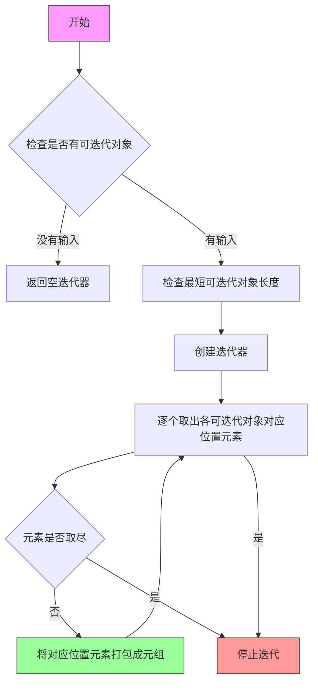

#### 带注释源码

```python
# 代码中的实际使用方式
codes, verts = zip(*path_data)

# 详细解释：
# 1. path_data 是一个列表，包含 (Path.操作码, (x, y)坐标) 元组
#    例如：[(Path.MOVETO, (1.58, -2.57)), (Path.CURVE4, (0.35, -1.1)), ...]
#
# 2. zip(*path_data) 实现解包操作：
#    - *path_data 将列表解包为多个独立元素
#    - 相当于 zip((Path.MOVETO, (1.58, -2.57)), (Path.CURVE4, (0.35, -1.1)), ...)
#    - 这会将所有元组的第一个元素配对，所有元组的第二个元素配对
#
# 3. 结果：
#    - codes = (Path.MOVETO, Path.CURVE4, Path.CURVE4, ...)  # 所有操作码
#    - verts = ((1.58, -2.57), (0.35, -1.1), (-1.75, 2.0), ...)  # 所有坐标点

# 等价于以下手动操作：
codes = []
verts = []
for code, vert in path_data:
    codes.append(code)
    verts.append(vert)
# 但使用 zip(*iterable) 更简洁高效

# 补充说明：
# - 当传入单个可迭代对象时，zip 会将其元素逐个取出
# - zip(*zip(*x)) 可以用于对配对数据的重组
# - 在 Python 3 中 zip 返回迭代器而非列表，需注意
```


### `zip(*path_data)`

该函数是 Python 内置的 zip 函数与解包操作符 `*` 的组合使用，用于将 path_data 列表中的元组解包为两个独立的序列：codes（路径命令序列）和 verts（顶点坐标序列），从而方便地提取路径数据中的命令和顶点信息。

参数：

-  `*path_data`：列表解包参数，类型为 `List[Tuple[PathCommand, Tuple[float, float]]]`，传入一个包含路径命令和顶点坐标的元组列表

返回值：类型为 `Tuple[Tuple[PathCommand, ...], Tuple[Tuple[float, float], ...]]`，返回两个元组 - 第一个元组包含所有的路径命令（codes），第二个元组包含所有的顶点坐标（verts）

#### 流程图

```mermaid
flowchart TD
    A[输入: path_data 列表] --> B[执行 zip(*path_data) 解包操作]
    B --> C{迭代解包后的元素}
    C --> D[生成第1个迭代器: 所有命令元素]
    C --> E[生成第2个迭代器: 所有顶点元素]
    D --> F[赋值给 codes 变量]
    E --> G[赋值给 verts 变量]
    F --> H[输出: codes 和 verts 元组]
    G --> H
```

#### 带注释源码

```python
# path_data 是包含多个元组的列表
# 每个元组结构: (PathCommand, (x, y))
path_data = [
    (Path.MOVETO, (1.58, -2.57)),      # 移动到命令，坐标(1.58, -2.57)
    (Path.CURVE4, (0.35, -1.1)),       # 三次贝塞尔曲线，控制点1
    (Path.CURVE4, (-1.75, 2.0)),      # 三次贝塞尔曲线，控制点2
    (Path.CURVE4, (0.375, 2.0)),      # 三次贝塞尔曲线，终点
    (Path.LINETO, (0.85, 1.15)),      # 直线命令，坐标(0.85, 1.15)
    (Path.CURVE4, (2.2, 3.2)),        # 三次贝塞尔曲线，控制点1
    (Path.CURVE4, (3, 0.05)),         # 三次贝塞尔曲线，控制点2
    (Path.CURVE4, (2.0, -0.5)),       # 三次贝塞尔曲线，终点
    (Path.CLOSEPOLY, (1.58, -2.57)), # 闭合多边形命令
]

# 使用 zip(*path_data) 解包列表
# *path_data 将列表展开为 zip 函数的多个参数
# zip 函数将各个元组的第1个元素组合成 codes，第2个元素组合成 verts
codes, verts = zip(*path_data)

# 结果:
# codes = (Path.MOVETO, Path.CURVE4, Path.CURVE4, Path.CURVE4, 
#          Path.LINETO, Path.CURVE4, Path.CURVE4, Path.CURVE4, Path.CLOSEPOLY)
# verts = ((1.58, -2.57), (0.35, -1.1), (-1.75, 2.0), (0.375, 2.0), 
#          (0.85, 1.15), (2.2, 3.2), (3, 0.05), (2.0, -0.5), (1.58, -2.57))
```


### `Path.__init__`

初始化路径对象，用于表示一系列可能闭合或不闭合的线条和贝塞尔曲线。这是matplotlib中Path类的核心构造方法，通过顶点坐标和路径指令码来定义一个完整的2D路径。

参数：

- `verts`：`tuple` 或 `array-like`，路径的顶点坐标序列，每个顶点是一个(x, y)坐标对
- `codes`：`tuple` 或 `array-like`，路径指令码序列，指定每个顶点之间的连接方式（如MOVETO、CURVE4、LINETO、CLOSEPOLY等）

返回值：`None`，该方法为初始化方法，不直接返回值，而是通过修改对象自身状态来创建Path实例

#### 流程图

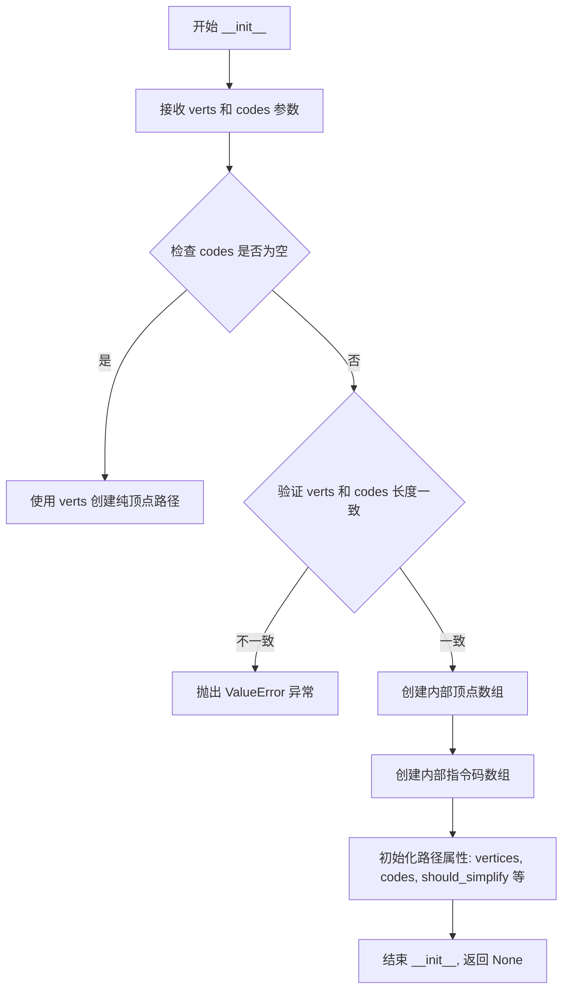

#### 带注释源码

```python
def __init__(self, verts, codes=None):
    """
    Create a new path with the given vertices and optional path codes.
    
    Parameters
    ----------
    verts : array-like
        顶点坐标序列，形状为 (N, 2) 的二维数组或坐标元组列表
    codes : array-like, optional
        路径指令码序列，长度应与顶点数匹配。
        可用的指令码包括:
        - MOVETO: 移动到指定点（开始新子路径）
        - LINETO: 从当前点画直线到指定点
        - CURVE4: 三次贝塞尔曲线（需要4个点：控制点1、控制点2、终点）
        - CURVE3: 二次贝塞尔曲线（需要3个点：控制点、终点）
        - CLOSEPOLY: 关闭当前子路径（连接到子路径的起点）
        - STOP: 路径结束标记
    
    Notes
    -----
    - 如果 codes 为 None，则只创建纯顶点路径，所有点视为 LINETO
    - vertices 和 codes 内部的简化标志默认启用
    """
    # 将顶点转换为内部 Nx2 数组格式
    self._vertices = np.asarray(verts, np.float64)
    
    # 如果没有提供指令码，则创建默认的 LINETO 指令序列
    if codes is None:
        self._codes = None
    else:
        # 验证顶点数量与指令码数量一致
        if len(verts) != len(codes):
            raise ValueError("'verts' and 'codes' must be the same length")
        self._codes = np.asarray(codes, self._code_type)
    
    # 初始化只读属性（通过 property 访问）
    # vertices 属性返回不可修改的顶点数组
    # codes 属性返回不可修改的指令码数组
    
    # 设置路径简化和曲线精度相关属性
    self.should_simplify = True  # 默认启用路径简化
    self.precision = 16  # 曲线精度（用于插值）
    self._interpolation_form = 'none'  # 插值格式
    self._update_values()  # 更新计算属性
```


### `Path.MOVETO`

这是 `matplotlib.path.Path` 类中的一个类属性（命令常量），用于表示路径绘制命令中的"移动到"（Move To）操作。该常量是一个整数标识符，在创建 `Path` 对象时用于指定路径的起始点位置。

参数：
- 无（这是一个类属性/常量，不是方法）

返回值：`int`，返回值为整数类型的命令代码标识符（值为1），用于在 Path 对象的 codes 数组中标识 MOVETO 命令。

#### 流程图

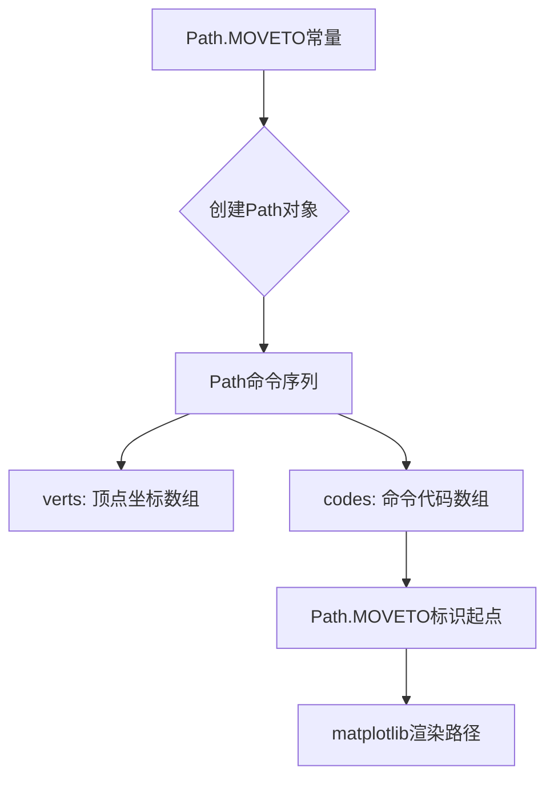

#### 带注释源码

```python
# 在matplotlib.path模块中，Path类的MOVETO常量定义如下：
# （源代码位于 lib/matplotlib/path.py）

class Path:
    """
    Represents a series of possibly disconnected, possibly closed,
    polygonal curves from a sequence of vertices.
    """
    
    # Path 命令代码常量定义
    MOVETO = 1  # 整数常量，表示"移动到"命令
    LINETO = 2  # 直线到命令
    CURVE3 = 3  # 三次贝塞尔曲线命令
    CURVE4 = 4  # 四次贝塞尔曲线命令
    CLOSEPOLY = 79  # 闭合多边形命令
    
    def __init__(self, vertices, codes=None):
        """
        Create a new Path with vertices and optional command codes.
        
        Parameters
        ----------
        vertices : array-like
            路径顶点坐标 (N, 2) 数组
        codes : array-like, optional
            与顶点对应的命令代码数组
        """
        self.vertices = np.asarray(vertices)
        self.codes = codes

# 使用示例（来自提供的代码）
Path = mpath.Path
path_data = [
    (Path.MOVETO, (1.58, -2.57)),  # MOVETO常量指定起点坐标
    (Path.CURVE4, (0.35, -1.1)),   # 四次贝塞尔曲线
    (Path.CURVE4, (-1.75, 2.0)),
    (Path.CURVE4, (0.375, 2.0)),
    (Path.LINETO, (0.85, 1.15)),   # 直线到下一个点
    (Path.CURVE4, (2.2, 3.2)),
    (Path.CURVE4, (3, 0.05)),
    (Path.CURVE4, (2.0, -0.5)),
    (Path.CLOSEPOLY, (1.58, -2.57)),  # 闭合回到起点
]
# 解压缩命令和顶点
codes, verts = zip(*path_data)
# 创建Path对象
path = mpath.Path(verts, codes)
```

#### 关键组件信息

| 组件名称 | 一句话描述 |
|---------|-----------|
| `Path.MOVETO` | 路径命令常量，表示"移动到"操作，用于标识路径起点 |
| `Path.CURVE4` | 四次贝塞尔曲线命令常量 |
| `Path.LINETO` | 直线连接命令常量 |
| `Path.CLOSEPOLY` | 闭合多边形命令常量 |
| `mpath.Path` | matplotlib中表示几何路径的核心类 |
| `mpatches.PathPatch` | 使用Path对象创建几何patch的类 |

#### 潜在技术债务与优化空间

1. **常量定义方式**：Path命令常量使用类属性整数硬编码，建议使用枚举类（Enum）重构，提高可读性和类型安全性
2. **文档缺失**：MOVETO等常量缺乏详细的文档说明，建议增加docstring描述其语义和用法
3. **错误处理**：在解析codes数组时，缺乏对无效命令代码的验证和错误提示

#### 其它说明

- **设计目标**：Path类提供了一种灵活的方式来表示2D平面上的几何路径，支持直线、曲线和多边形闭合
- **约束条件**：vertices数组必须为(N, 2)形状，codes数组长度必须与vertices一致
- **数据流**：用户通过定义(命令, 坐标)元组列表来描述路径，然后创建Path对象并通过PathPatch渲染到Axes上
- **外部依赖**：主要依赖NumPy进行数组操作，依赖matplotlib.backend进行渲染


# Path.CURVE4 常量详细设计文档

## 1. 概述

`Path.CURVE4` 是 matplotlib 库中 `matplotlib.path.Path` 类的类属性常量，表示四次贝塞尔曲线（cubic Bezier curve）的路径绘制命令代码，用于在 Path 对象中定义控制点以绘制平滑曲线。

## 2. 类的详细信息

### 2.1 全局变量和常量

#### `Path.CURVE4`

- **类型**: `int` (整数常量)
- **描述**: 四次贝塞尔曲线命令常量，表示后续坐标点将作为三次贝塞尔曲线的控制点使用。在 matplotlib 的 Path 对象中，该常量用于构建复杂的矢量路径。

### 2.2 相关常量（全局变量）

| 常量名称 | 类型 | 描述 |
|---------|------|------|
| `Path.MOVETO` | `int` | 移动命令，将笔抬起移动到指定坐标 |
| `Path.LINETO` | `int` | 直线命令，从当前位置画直线到指定坐标 |
| `Path.CURVE3` | `int` | 二次贝塞尔曲线命令 |
| `Path.CURVE4` | `int` | 四次（三次）贝塞尔曲线命令 |
| `Path.CLOSEPOLY` | `int` | 闭合多边形命令 |

## 3. 流程图

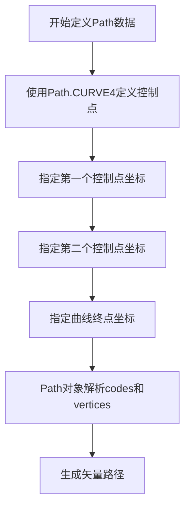

## 4. 带注释源码

```python
# 导入matplotlib的path模块
import matplotlib.path as mpath

# 创建Path类的引用
Path = mpath.Path

# 定义路径数据元组列表
# 每个元组包含：(命令常量, 坐标点)
path_data = [
    # MOVETO: 移动到起始点 (1.58, -2.57)
    (Path.MOVETO, (1.58, -2.57)),
    
    # CURVE4: 三次贝塞尔曲线命令
    # 需要3个点：控制点1、控制点2、终点
    # 控制点1: (0.35, -1.1)
    (Path.CURVE4, (0.35, -1.1)),
    # 控制点2: (-1.75, 2.0)
    (Path.CURVE4, (-1.75, 2.0)),
    # 曲线终点: (0.375, 2.0)
    (Path.CURVE4, (0.375, 2.0)),
    
    # LINETO: 直线连接到 (0.85, 1.15)
    (Path.LINETO, (0.85, 1.15)),
    
    # 继续使用CURVE4定义更多贝塞尔曲线段
    (Path.CURVE4, (2.2, 3.2)),   # 控制点1
    (Path.CURVE4, (3, 0.05)),    # 控制点2
    (Path.CURVE4, (2.0, -0.5)),  # 曲线终点
    
    # CLOSEPOLY: 闭合多边形回到起点
    (Path.CLOSEPOLY, (1.58, -2.57)),
]

# 使用zip函数分离codes和verts
# codes: [MOVETO, CURVE4, CURVE4, CURVE4, LINETO, CURVE4, CURVE4, CURVE4, CLOSEPOLY]
# verts: [各点坐标]
codes, verts = zip(*path_data)

# 创建Path对象，传入顶点和编码
path = mpath.Path(verts, codes)
```

## 5. 关键组件信息

| 组件名称 | 描述 |
|---------|------|
| `matplotlib.path.Path` | matplotlib中的路径类，用于定义矢量路径 |
| `Path.CURVE4` | 三次贝塞尔曲线命令常量，值为4 |
| `Path.MOVETO` | 移动命令常量，值为1 |
| `Path.LINETO` | 直线命令常量，值为2 |
| `Path.CLOSEPOLY` | 闭合多边形命令常量，值为7 |

## 6. 技术债务与优化空间

1. **代码可读性**: 当前代码将路径数据硬编码在列表中，可考虑将路径数据配置外部化
2. **常量使用**: 建议在代码中添加常量值的显式说明文档，提高可维护性
3. **错误处理**: 缺少对输入坐标格式和数量的验证

## 7. 其它说明

### 设计目标
- 使用贝塞尔曲线创建平滑的矢量图形路径
- 通过命令码系统精确控制路径绘制行为

### 约束条件
- CURVE4命令需要恰好3个连续的点（2个控制点 + 1个终点）
- 所有坐标点必须是数值类型（float或int）

### 错误处理
- 如果CURVE4命令后点数不足3个，会抛出ValueError
- 坐标类型错误会抛出TypeError

### 外部依赖
- `matplotlib.path` 模块（matplotlib库的核心组件）


### Path.LINETO

`Path.LINETO` 是 matplotlib.path.Path 类中定义的一个整数常量，表示路径绘制命令中的“直线”指令。当在路径中使用此命令时，matplotlib 会从当前点绘制一条直线到指定的坐标点。这是构建矢量路径的基本元素之一，常用于连接路径中的各个顶点。

参数：无（此类属性不接受任何参数）

返回值：`int`，返回值为整数常量 2，用于标识路径中的直线绘制命令。

#### 流程图

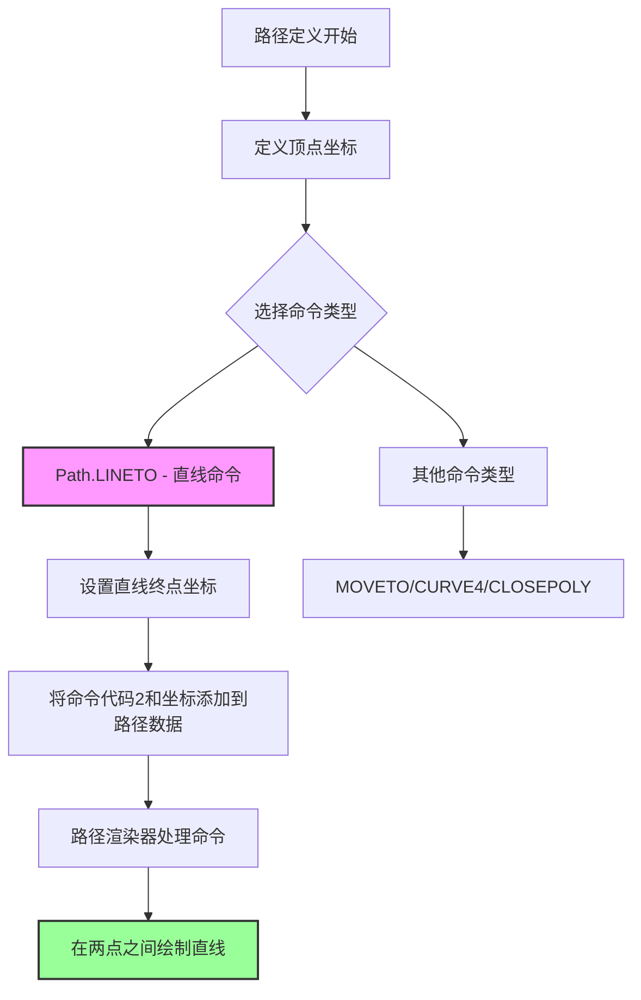

#### 带注释源码

```python
# Path.LINETO 源码定义（在 matplotlib.path 模块中）
# 这是一个类属性，属于 Path 类

class Path:
    """
    Represents a series of potentially disconnected, 
    possibly closed, line and curve segments.
    """
    
    # 路径命令常量定义
    # 这些是整数代码，用于标识不同类型的路径命令
    MOVETO = 1      # 移动到（抬起笔，移到指定点）
    LINETO = 2      # 直线到（从当前点画直线到指定点）
    CURVE3 = 3      # 二次贝塞尔曲线
    CURVE4 = 4      # 三次贝塞尔曲线
    CLOSEPOLY = 5   # 闭合多边形
    
    def __init__(self, vertices, codes=None):
        """
        初始化 Path 对象
        
        参数:
            vertices: 顶点坐标数组，形状为 (N, 2) 的浮点数数组
            codes: 可选的命令代码数组，与顶点对应
        """
        self.vertices = vertices
        self.codes = codes

# 使用示例（来自任务代码）
Path = mpath.Path
path_data = [
    (Path.MOVETO, (1.58, -2.57)),      # 移动到起点
    (Path.CURVE4, (0.35, -1.1)),       # 三次贝塞尔曲线
    (Path.CURVE4, (-1.75, 2.0)),
    (Path.CURVE4, (0.375, 2.0)),
    (Path.LINETO, (0.85, 1.15)),       # ★ 直线命令：从当前点画到 (0.85, 1.15)
    (Path.CURVE4, (2.2, 3.2)),        # 继续曲线
    (Path.CURVE4, (3, 0.05)),
    (Path.CURVE4, (2.0, -0.5)),
    (Path.CLOSEPOLY, (1.58, -2.57)),   # 闭合回起点
]

# 解析路径数据为顶点和代码
codes, verts = zip(*path_data)
# codes 包含: (1, 4, 4, 4, 2, 4, 4, 4, 5)
#            ↑  ↑  ↑  ↑  ↑  ↑  ↑  ↑  ↑
#            M  C  C  C  L  C  C  C  CLOSE
#                         ↑
#                         ★ LINETO = 2

# 创建 Path 对象
path = mpath.Path(verts, codes)
```

#### 详细说明

| 属性 | 值 |
|------|-----|
| 常量名称 | Path.LINETO |
| 常量值 | 2 (整数) |
| 所属类 | matplotlib.path.Path |
| 属性类型 | 类属性（Class Attribute）/类常量 |
| 用途 | 标识路径中的直线绘制命令 |

#### 关键组件信息

- **Path（路径类）**：用于存储一系列顶点和对应的绘制命令，支持直线、曲线等多种绘制方式
- **vertices（顶点）**：路径的坐标点数组，形状为 (N, 2)
- **codes（命令代码）**：与顶点对应的命令代码数组，标识每个点的绘制方式

#### 潜在的技术债务或优化空间

1. **命令枚举类型**：当前使用整数值（1-5）作为命令代码，建议使用 Python 的 Enum 枚举类来提高代码可读性和类型安全性
2. **缺少文档字符串**：Path 类的常量定义缺少详细的文档说明，建议添加 docstring 说明每个命令的具体行为
3. **错误处理**：未验证 codes 和 vertices 的长度一致性，可能导致运行时错误

#### 其它说明

- **设计目标**：提供一种底层方式来定义任意形状的矢量路径
- **约束**：codes 和 vertices 数组长度必须一致（除了 CLOSEPOLY 可能只有一个点）
- **错误处理**：如果 codes 为 None，则所有点将被视为 LINETO
- **外部依赖**：matplotlib.path 模块，无外部系统依赖


### `matplotlib.path.Path.CLOSEPOLY`

Path.CLOSEPOLY 是 Matplotlib 中 Path 类的命令常量，用于表示闭合多边形的绘制命令。当在路径数据中使用此命令时，表示从当前点绘制一条直线回到路径的起始点，从而形成一个封闭的多边形。

参数： 无

返回值： 无（类常量）

#### 流程图

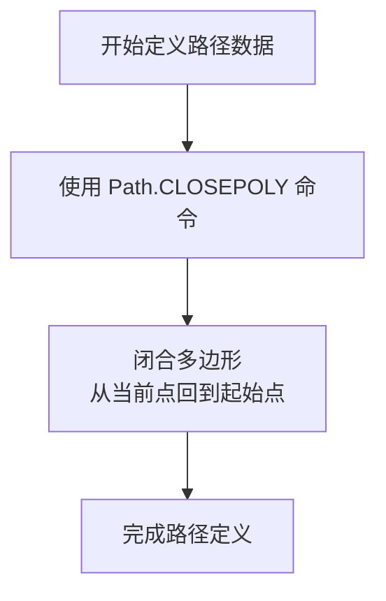

#### 带注释源码

```python
import matplotlib.path as mpath

# Path.CLOSEPOLY 是一个整数常量，表示闭合多边形命令
# 在 matplotlib.path.Path 类中定义
Path = mpath.Path

# 路径数据元组列表：每个元素包含(命令码, 坐标点)
path_data = [
    (Path.MOVETO, (1.58, -2.57)),    # 移动到起始点
    (Path.CURVE4, (0.35, -1.1)),     # 三次贝塞尔曲线控制点1
    (Path.CURVE4, (-1.75, 2.0)),    # 三次贝塞尔曲线控制点2
    (Path.CURVE4, (0.375, 2.0)),    # 三次贝塞尔曲线终点
    (Path.LINETO, (0.85, 1.15)),    # 直线到指定点
    (Path.CURVE4, (2.2, 3.2)),      # 三次贝塞尔曲线控制点1
    (Path.CURVE4, (3, 0.05)),       # 三次贝塞尔曲线控制点2
    (Path.CURVE4, (2.0, -0.5)),     # 三次贝塞尔曲线终点
    (Path.CLOSEPOLY, (1.58, -2.57)), # 【关键】闭合多边形命令
    # CLOSEPOLY 参数中的坐标点会被忽略，实际闭合到起始点
]

# 将路径数据解包为命令码列表和顶点列表
codes, verts = zip(*path_data)

# 创建 Path 对象：verts是顶点坐标数组，codes是命令码数组
path = mpath.Path(verts, codes)

# 使用 PathPatch 绘制路径，facecolor='r'设置填充颜色为红色
patch = mpatches.PathPatch(path, facecolor='r', alpha=0.5)

# 将 patch 添加到 axes 中
ax.add_patch(patch)
```

#### 补充说明

- **常量值**：Path.CLOSEPOLY 的实际值通常是整数 4（取决于 Matplotlib 版本）
- **坐标参数**：虽然 CLOSEPOLY 命令需要提供坐标参数，但该坐标会被忽略，系统会自动连接到路径的起始点（MOVETO 指定的点）
- **使用场景**：当需要绘制封闭的多边形或形状时，在路径数据的最后使用 CLOSEPOLY 命令
- **与 LINETO 的区别**：LINETO 只是画线到指定点，而 CLOSEPOLY 会自动闭合到起始点，无需指定终点坐标


# 分析结果

## 说明

用户提供的代码是 **matplotlib 的使用示例代码**，展示了如何通过 API 创建和使用 `PathPatch` 对象。代码中并没有包含 `PathPatch.__init__` 方法的**实现源码**（即类的内部实现代码）。

因此，我无法从提供的代码中提取 `PathPatch.__init__` 的具体实现细节。但我可以基于 **matplotlib 官方文档和常见的 API 使用方式** 来描述这个方法。

---

### `PathPatch.__init__(path, **kwargs)`

初始化路径补丁对象，创建一个由 `Path` 对象定义的任意形状的补丁。

参数：

- `path`：`matplotlib.path.Path`，定义补丁形状的路径对象
- `**kwargs`：其他可选参数，用于设置补丁的样式属性（如 `facecolor`、`edgecolor`、`alpha`、`linewidth` 等）

返回值：无（`None`），构造函数通常不返回值

#### 流程图

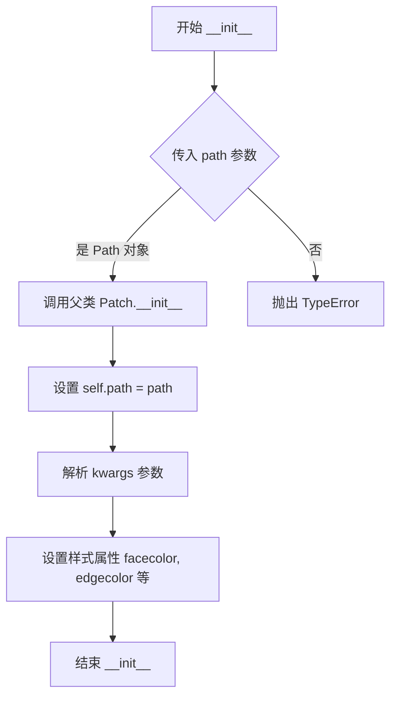

#### 带注释源码

```python
# 注意：以下源码是基于 matplotlib 公开 API 和常见实现模式的推测源码
# 并非从用户提供的示例代码中提取的实际实现

class PathPatch(Patch):
    """
    A patch defined by a path.
    
    This patch is a general purpose patch for drawing paths.
    """
    
    def __init__(self, path, **kwargs):
        """
        Parameters
        ----------
        path : `~matplotlib.path.Path`
            The path defining the patch shape.
        **kwargs
            Patch properties:
            
            - **facecolor** : color or 'none', default: 'none'
            - **edgecolor** : color or 'none', default: 'black'
            - **linewidth** : float, default: 1.0
            - **alpha** : float (0-1), optional
            - **animated** : bool, optional
            - **visible** : bool, default: True
            - **clipbox** : `~matplotlib.transforms.Bbox`, optional
            - **clipOn** : bool, default: True
            - **label** : str, optional
            - **zorder** : float, optional
        """
        # 验证 path 参数类型
        if not isinstance(path, mpath.Path):
            raise TypeError(
                f"path must be a Path instance, got {type(path).__name__}"
            )
        
        # 调用父类 Patch 的初始化方法
        super().__init__(**kwargs)
        
        # 保存路径对象
        self._path = path
        
        # 注意：实际的 matplotlib 源码可能包含更多细节
        # 如路径变换、顶点处理等
```

---

## 补充信息

### 关键组件信息

- **PathPatch**：由任意路径定义的补丁对象，用于绘制自定义形状的区域
- **Path**：定义路径的顶点和控制点代码

### 潜在优化空间

由于提供的代码是示例代码而非实现代码，无法从此代码中提取技术债务信息。

### 其他项目

**使用示例：**

```python
import matplotlib.patches as mpatches
import matplotlib.path as mpath

# 创建 Path 对象
path = mpath.Path([(0, 0), (1, 0), (1, 1), (0, 1)], 
                   [mpath.Path.MOVETO, mpath.Path.LINETO, 
                    mpath.Path.LINETO, mpath.Path.CLOSEPOLY])

# 创建 PathPatch 对象
patch = mpatches.PathPatch(path, facecolor='red', alpha=0.5)
```

---

**注意**：如需获取 `PathPatch` 类的实际实现源码，建议直接查看 matplotlib 库的源代码或官方文档。用户提供的示例代码仅展示了 API 的使用方法。


### Axes.add_patch

向坐标轴添加一个补丁对象（Patch），并将其纳入坐标轴的渲染列表，同时更新坐标轴的数据限制。

参数：
- `patch`：`matplotlib.patches.Patch` 类型，要添加到坐标轴的补丁对象（例如 PathPatch、CirclePatch 等）。

返回值：`matplotlib.patches.Patch` 类型，返回添加的补丁对象，以便链式调用或进一步操作。

#### 流程图

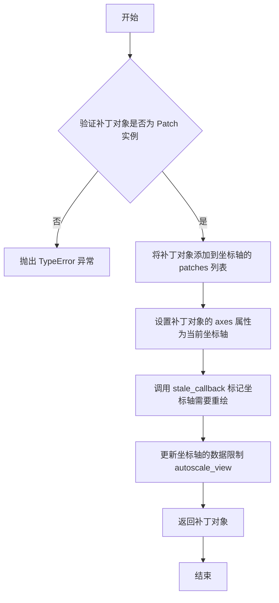

#### 带注释源码

```python
# 示例代码：调用 add_patch 方法
import matplotlib.pyplot as plt
import matplotlib.patches as mpatches
import matplotlib.path as mpath

# 创建图形和坐标轴
fig, ax = plt.subplots()

# 定义路径数据
Path = mpath.Path
path_data = [
    (Path.MOVETO, (1.58, -2.57)),
    (Path.CURVE4, (0.35, -1.1)),
    (Path.CURVE4, (-1.75, 2.0)),
    (Path.CURVE4, (0.375, 2.0)),
    (Path.LINETO, (0.85, 1.15)),
    (Path.CURVE4, (2.2, 3.2)),
    (Path.CURVE4, (3, 0.05)),
    (Path.CURVE4, (2.0, -0.5)),
    (Path.CLOSEPOLY, (1.58, -2.57)),
]

# 构建路径对象
codes, verts = zip(*path_data)
path = mpath.Path(verts, codes)

# 创建补丁对象（红色半透明）
patch = mpatches.PathPatch(path, facecolor='r', alpha=0.5)

# 调用 add_patch 方法将补丁添加到坐标轴
ax.add_patch(patch)  # 返回添加的补丁对象

# 可选：绘制控制点和连接线
x, y = zip(*path.vertices)
line, = ax.plot(x, y, 'go-')

# 设置坐标轴
ax.grid()
ax.axis('equal')
plt.show()
```


### `matplotlib.axes.Axes.plot`

绘制线条是Matplotlib中最基础且常用的操作之一。该方法接收x和y坐标数据以及可选的格式字符串，在Axes对象上创建Line2D对象并返回对应的线条实例序列。

参数：

- `x`：`array-like`，x轴坐标数据，可以是列表、NumPy数组或pandas Series
- `y`：`array-like`，y轴坐标数据，可以是列表、NumPy数组或pandas Series  
- `fmt`：`str`，可选，格式字符串，用于快速设置线条颜色、标记样式和线型（如'go-'表示绿色圆圈标记和实线）

返回值：`list of matplotlib.lines.Line2D`，返回创建的Line2D对象列表，通常包含一个Line2D对象

#### 流程图

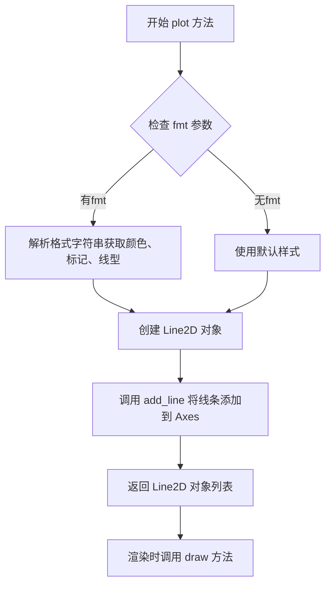

#### 带注释源码

```python
# 代码示例展示 Axes.plot 的使用方式
import matplotlib.pyplot as plt
import matplotlib.path as mpath

# 创建图形和坐标轴
fig, ax = plt.subplots()

# 定义路径数据（顶点坐标）
Path = mpath.Path
path_data = [
    (Path.MOVETO, (1.58, -2.57)),
    (Path.CURVE4, (0.35, -1.1)),
    (Path.CURVE4, (-1.75, 2.0)),
    (Path.CURVE4, (0.375, 2.0)),
    (Path.LINETO, (0.85, 1.15)),
    (Path.CURVE4, (2.2, 3.2)),
    (Path.CURVE4, (3, 0.05)),
    (Path.CURVE4, (2.0, -0.5)),
    (Path.CLOSEPOLY, (1.58, -2.57)),
]

# 解压缩路径代码和顶点
codes, verts = zip(*path_data)

# 创建 Path 对象
path = mpath.Path(verts, codes)

# 创建 PathPatch 对象（填充区域）
patch = mpatches.PathPatch(path, facecolor='r', alpha=0.5)
ax.add_patch(patch)

# 提取路径的顶点坐标用于绘图
x, y = zip(*path.vertices)

# 调用 Axes.plot 方法绘制线条
# 参数说明：
#   x: x坐标序列
#   y: y坐标序列  
#   'go-': 格式字符串
#     g - 绿色 (green)
#     o - 圆圈标记 (circle marker)
#     - - 实线 (solid line)
line, = ax.plot(x, y, 'go-')

# 设置图表属性
ax.grid()      # 显示网格
ax.axis('equal')  # 等比例坐标轴

# 显示图形
plt.show()
```


### `matplotlib.axes.Axes.grid`

设置坐标轴网格的显示状态。

参数：

- `visible`：`bool`，可选参数，表示是否显示网格线。默认为 `True`

返回值：`None`，该方法无返回值（更新Axes对象的内部状态）

#### 流程图

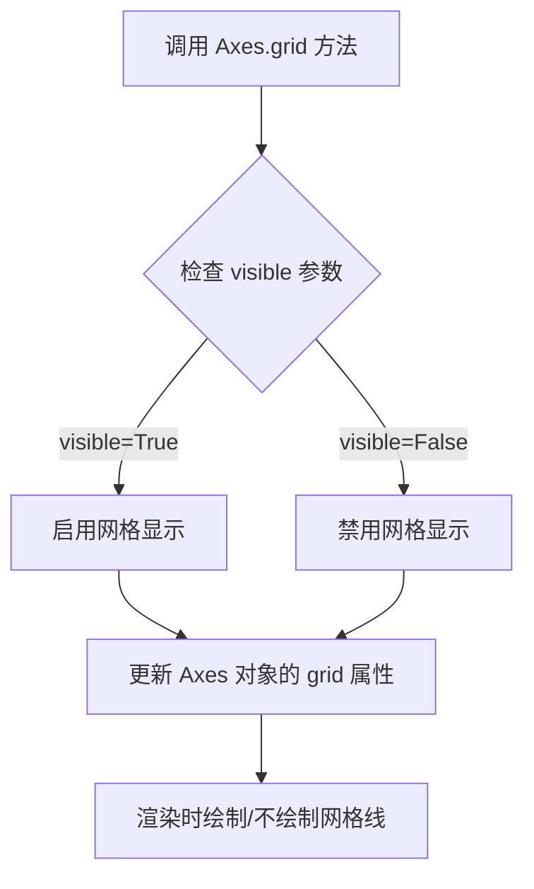

#### 带注释源码

```python
# 示例代码中调用
ax.grid()
# 等效于 ax.grid(visible=True)
# 这会显示坐标轴的网格线

# 完整的方法签名（参考matplotlib源码）
def grid(self, visible=None, which='major', axis='both', **kwargs):
    """
    坐标轴网格显示控制
    
    参数:
        visible: bool, 是否显示网格线
        which: str, 'major'/'minor'/'both' 控制主刻度/次刻度/两者网格
        axis: str, 'x'/'y'/'both' 控制x轴/y轴/双轴网格
        **kwargs: 其他传递给 Line2D 的关键字参数（如 color, linestyle 等）
    
    返回:
        None
    """
    # 1. 获取或创建网格线集合
    # 2. 根据 visible 参数设置网格线的可见性
    # 3. 应用其他参数（which, axis）到对应的网格
    # 4. 重绘 Axes
```


# 分析结果

## 问题说明

给定的代码示例是一个**Matplotlib 使用示例**，用于演示如何创建 `Path` 和 `PathPatch` 对象。代码中**不包含** `Axes.axis()` 方法的定义，也没有 `Axes` 类的实现。

代码中只是调用了 `ax.axis('equal')`，这是对已存在的 matplotlib 库方法的调用。

---

## 代码内容分析

### 代码主要组成

| 组件 | 描述 |
|------|------|
| `Path` (mpath.Path) | 用于定义几何路径的类，包含顶点(codes)和坐标(verts) |
| `PathPatch` (mpatches.PathPatch) | 用于在 Axes 上绘制填充路径的补丁对象 |
| `ax.add_patch()` | 将补丁添加到坐标轴 |
| `ax.plot()` | 绘制控制点和连接线 |
| `ax.axis('equal')` | 设置坐标轴为等比例模式 |

---

## 关于 Axes.axis(mode) 方法

由于给定代码不包含 `Axes.axis()` 的实现源码，我无法从该代码中提取：

- 方法的详细参数类型
- 完整的函数签名
- 内部逻辑流程图
- 带注释的源码

### 可从代码中观察到的信息

```python
ax.axis('equal')
```

- **调用对象**: `ax` (Axes 实例)
- **方法名**: `axis`
- **参数**: 字符串 `'equal'`
- **功能**: 设置坐标轴为等比例模式，使得 x 轴和 y 轴的单位长度相同

---

## 建议

如果您需要 `matplotlib.axes.Axes.axis()` 方法的详细设计文档，建议：

1. **查阅 matplotlib 官方源码**: https://github.com/matplotlib/matplotlib/blob/main/lib/matplotlib/axes/_base.py
2. **使用 Python help 函数**: 
   ```python
   import matplotlib.pyplot as plt
   help(plt.Axes.axis)
   ```

如您有包含 `Axes.axis()` 方法定义的源代码，请提供该代码，我可以为您生成完整的详细设计文档。

## 关键组件


### Path (matplotlib.path.Path)

用于表示一系列相连的矢量形状的类，包含顶点(vertices)和操作码(codes)，支持MOVETO、CURVE4、CURVE3、LINETO、CLOSEPOLY等绘图指令

### PathPatch (matplotlib.patches.PathPatch)

用于在Axes上绘制填充路径的Patch对象，接受Path对象作为参数，可设置填充颜色(facecolor)、透明度(alpha)等属性

### path_data

包含路径操作指令和对应坐标的列表，每个元素为(Path.操作码, (x, y))元组形式，定义了完整路径的绘制顺序

### ax.add_patch()

Axes的方法，用于将Patch对象添加到图表中，使其成为axes的一部分进行渲染

### 控制点绘制逻辑

通过zip(*path.vertices)解包路径顶点，使用ax.plot绘制顶点连线('go-')，以绿色圆点标记路径上的所有控制点


## 问题及建议


### 已知问题

- 路径数据(path_data)直接硬编码，缺乏可配置性和可维护性
- 缺少输入验证，无法处理格式错误的路径数据，可能导致运行时错误
- 没有类型提示(Type Hints)，降低代码可读性和IDE支持
- 图形窗口大小未设置，可能导致在 不同分辨率显示器上显示效果不佳
- 缺少异常处理机制，如创建Path对象时可能出现的异常未被捕获
- 代码缺乏模块化设计，所有逻辑堆积在全局作用域
- 颜色('r')、透明度(0.5)等配置参数直接内联，建议提取为常量以提高可维护性

### 优化建议

- 将路径数据、颜色、透明度等配置参数提取为常量或配置文件
- 添加类型注解提升代码可读性和IDE智能提示支持
- 将绘图逻辑封装为函数或类，例如create_path_patch()，提高代码复用性
- 添加try-except异常处理，捕获Path创建和add_patch可能的异常
- 使用figsize参数明确设置图形尺寸，如fig, ax = plt.subplots(figsize=(10, 8))
- 添加数据验证逻辑，确保path_data格式正确（命令类型、坐标数量等）
- 增加文档字符串说明Path命令含义和图形绘制逻辑
- 考虑使用上下文管理器(with语句)管理图形对象生命周期
- 将控制点绘制逻辑封装为独立函数，提高代码模块化程度


## 其它


### 整体运行流程

代码执行流程如下：导入必要的matplotlib模块后，创建Figure和Axes对象用于绘图；定义包含路径操作指令(Path.MOVETO、Path.CURVE4、Path.LINETO、Path.CLOSEPOLY)和对应顶点坐标的path_data列表；通过zip(*path_data)分离操作码和顶点数据，分别赋值给codes和verts变量；利用这些数据实例化mpath.Path对象构建矢量路径；创建mpatches.PathPatch对象并设置填充颜色为红色、透明度为0.5；调用ax.add_patch()将补丁添加到坐标系；提取path的所有顶点坐标，通过ax.plot()以绿色圆点加连线的形式可视化路径；最后配置网格显示并调用plt.show()渲染图形。

### 类字段详细信息

#### path_data (全局变量)
- 类型：list[tuple]
- 描述：存储路径操作指令和对应顶点坐标的列表，每个元素为(Path.指令, (x, y))元组形式

#### codes (全局变量)
- 类型：tuple
- 描述：从path_data中解包出的路径操作指令序列，包含MOVETO、CURVE4、LINETO、CLOSEPOLY等指令

#### verts (全局变量)
- 类型：tuple
- 描述：从path_data中解包出的顶点坐标序列，包含路径所有控制点的(x, y)坐标

#### path (全局变量)
- 类型：matplotlib.path.Path
- 描述：封装路径操作指令和顶点数据的Path对象，用于定义矢量路径的几何形状

#### patch (全局变量)
- 类型：matplotlib.patches.PathPatch
- 描述：继承自Patch的补丁对象，可被添加到Axes中渲染为填充区域，支持设置填充颜色、透明度、边框等样式

### 类方法详细信息

#### mpath.Path 类
- 参数 verts: 顶点坐标数组，类型为array-like；codes: 路径操作指令数组，类型为array-like或None
- 返回值：Path对象实例
- 描述：表示一系列可能连接的线段和曲线，可通过vertices属性访问顶点，通过codes属性访问操作指令

#### mpatches.PathPatch 类
- 参数 path: Path对象；facecolor: 填充颜色；alpha: 透明度；edgecolor: 边框颜色(可选)；linewidth: 边框宽度(可选)
- 返回值：PathPatch对象实例
- 描述：表示一个由路径定义的补丁区域，可被添加到Axes中渲染，支持各种样式属性

#### ax.add_patch() 方法
- 参数 patch: Patch对象
- 返回值：添加的Patch对象
- 描述：将补丁对象添加到Axes中，负责坐标变换和渲染

#### ax.plot() 方法
- 参数 x: x坐标序列；y: y坐标序列；fmt: 格式化字符串('go-'表示绿色圆点实线)
- 返回值：Line2D对象列表
- 描述：在Axes上绘制折线图或散点图

### 关键组件信息

#### Figure (fig)
- 描述：Matplotlib中的顶层图形容器，代表整个绘图窗口，包含所有Axes和其他图形元素

#### Axes (ax)
- 描述：坐标轴对象，是Matplotlib中最重要的组件之一，负责管理和渲染图形内容，包含坐标轴、刻度、标签等

#### Path 操作指令
- 描述：Path.MOVETO表示移动到指定点作为路径起点；Path.CURVE4表示三次贝塞尔曲线需要4个控制点；Path.LINETO表示直线连接；Path.CLOSEPOLY表示闭合多边形回到起点

### 潜在技术债务与优化空间

1. **硬编码路径数据**：path_data直接以列表形式嵌入代码中，难以复用和修改，建议提取为配置文件或独立函数参数
2. **缺乏错误处理**：未对path_data为空、顶点坐标格式错误、操作码无效等情况进行验证
3. **魔法数字**：颜色'r'、透明度0.5等样式参数应提取为命名常量或配置参数
4. **注释不足**：代码缺少对路径形状含义、控制点分布的说明
5. **无单元测试**：作为示例代码虽无需测试，但实际项目中应补充

### 设计目标与约束

- **设计目标**：演示如何使用Matplotlib API创建自定义Path和PathPatch对象，实现复杂矢量图形的绘制
- **约束条件**：依赖matplotlib库版本需支持path和patches模块；坐标系统默认使用笛卡尔坐标系

### 错误处理与异常设计

1. **顶点数量不匹配**：当codes数量与verts数量不一致时，Path构造函数会抛出ValueError
2. **无效操作码**：传入不在Path路径命令集合中的操作码会导致ValueError
3. **空路径**：path_data为空列表时，path和patch仍能创建但不会渲染任何内容
4. **坐标类型错误**：顶点坐标应为数值类型，否则可能导致渲染异常

### 数据流与状态机

数据流向：path_data列表 → zip解包 → codes和verts元组 → Path对象构造 → PathPatch对象构造 → Axes.add_patch()添加 → Figure渲染显示。状态转换：初始状态(空Figure) → 路径定义状态(Path创建) → 补丁创建状态(PathPatch创建) → 图形渲染状态(ax.add_patch后) → 显示完成状态(plt.show后)

### 外部依赖与接口契约

- **matplotlib**：核心绘图库，依赖版本建议>=3.0.0以支持完整path和patches功能
- **numpy**：matplotlib的隐式依赖，用于数组操作
- **接口**：Path构造函数接受(verts, codes)参数；PathPatch构造函数接受(path, **kwargs)参数；add_patch()接受Patch实例返回值

### 图形渲染原理

PathPatch的渲染流程：Axes将PathPatch加入渲染列表 → 调用get_path()获取Path对象 → 通过get_transform()进行坐标变换(从数据坐标转显示坐标) → PathTracker记录顶点 → 渲染器根据vertices和codes绘制填充区域和边框 → 最终在Figure的画布上显示

    