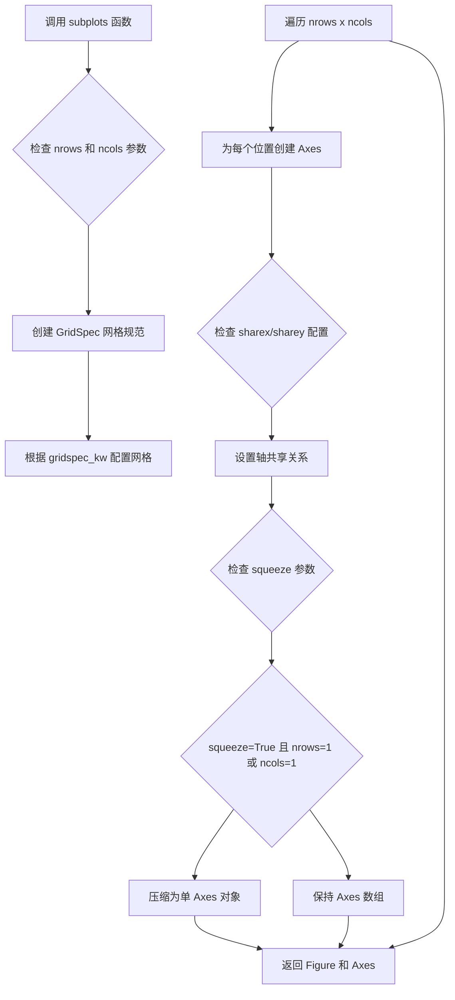
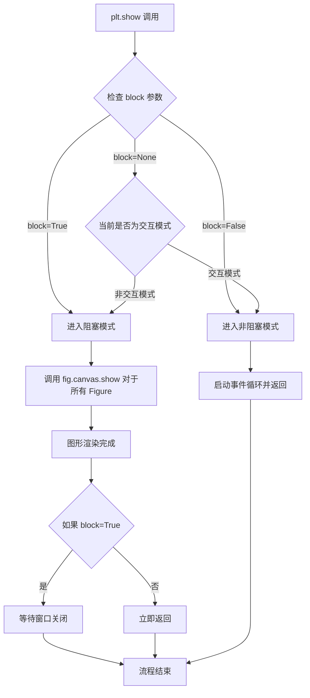
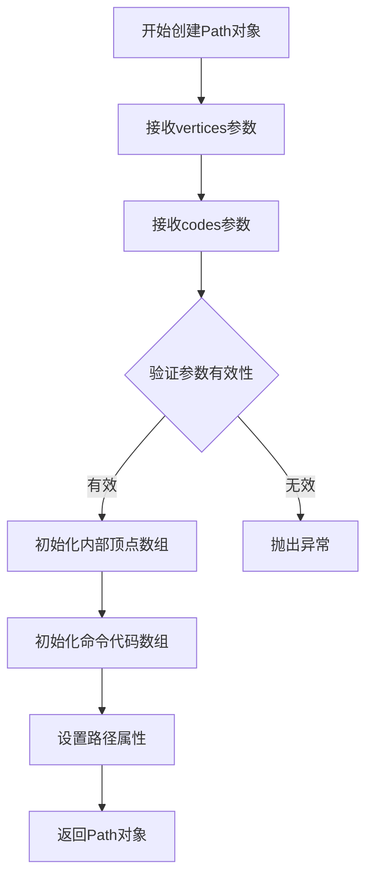
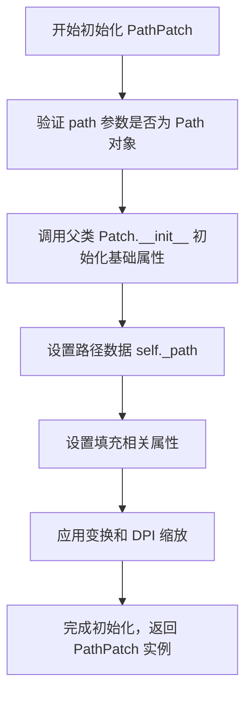
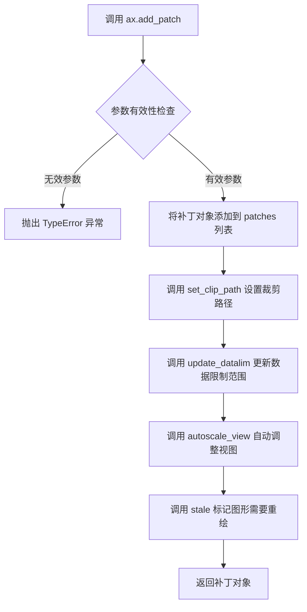
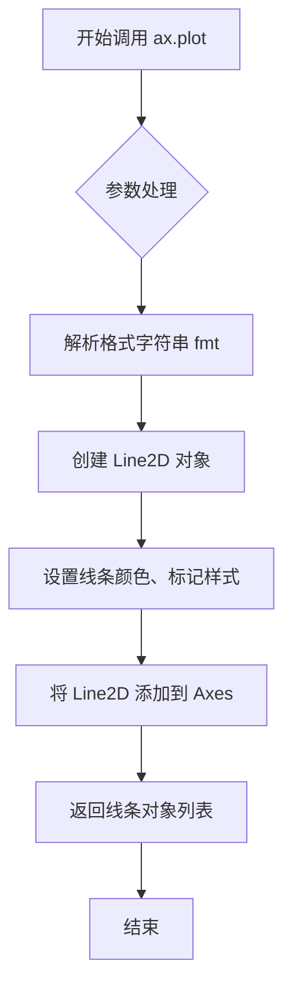
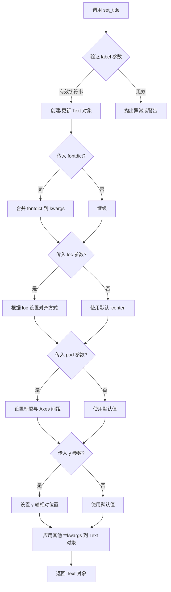

# `matplotlib\galleries\examples\shapes_and_collections\quad_bezier.py` 详细设计文档

这段代码使用 matplotlib 库在图形坐标轴上绘制了一个贝塞尔曲线路径补丁（PathPatch），并在该路径上标记了一个红点，用于演示如何使用 PathPatch 创建贝塞尔曲线。

## 整体流程

```mermaid
graph TD
    A[开始] --> B[导入 matplotlib.pyplot, matplotlib.patches, matplotlib.path]
    B --> C[创建图形和坐标轴: fig, ax = plt.subplots()]
    C --> D[定义 Path 对象: 包含贝塞尔曲线点 和 控制命令]
    D --> E[创建 PathPatch 对象: pp1 = mpatches.PathPatch(Path(...), fc='none', transform=ax.transData)]
    E --> F[将 PathPatch 添加到坐标轴: ax.add_patch(pp1)]
    F --> G[绘制红点: ax.plot([0.75], [0.25], 'ro')]
    G --> H[设置标题: ax.set_title('The red point should be on the path')]
    H --> I[显示图形: plt.show()]
    I --> J[结束]
```

## 类结构

```
matplotlib.pyplot (plt)
├── subplots() -> Figure, Axes
└── show()
matplotlib.patches (mpatches)
└── PathPatch
matplotlib.path (mpath)
└── Path
```

## 全局变量及字段


### `Path`
    
指向matplotlib Path类的变量，用于创建和管理路径对象

类型：`matplotlib.path.Path`
    


### `pp1`
    
PathPatch实例，用于在Axes上绘制Bezier曲线路径补丁

类型：`matplotlib.patches.PathPatch`
    


### `fig`
    
Figure实例，表示整个图形窗口或画布

类型：`matplotlib.figure.Figure`
    


### `ax`
    
Axes实例，表示图形中的坐标轴区域，用于放置图形元素

类型：`matplotlib.axes.Axes`
    


### `Path.MOVETO`
    
Path命令常量，表示移动到指定坐标点

类型：`int (类常量)`
    


### `Path.CURVE3`
    
Path命令常量，表示三次贝塞尔曲线命令

类型：`int (类常量)`
    


### `Path.CLOSEPOLY`
    
Path命令常量，表示闭合多边形命令

类型：`int (类常量)`
    
    

## 全局函数及方法


### `matplotlib.pyplot.subplots`

`matplotlib.pyplot.subplots` 是 Matplotlib 库中的核心函数，用于创建一个新的图形窗口（Figure）以及一个或多个坐标轴（Axes）子图。该函数简化了创建复杂多子图布局的过程，支持网格布局、轴共享、子图间距控制等功能，是进行数据可视化时最常用的接口之一。

参数：

- `nrows`： `int`，默认值 1，子图网格的行数
- `ncols`： `int`，默认值 1，子图网格的列数
- `sharex`： `bool` 或 `{'none', 'all', 'row', 'col'}`，默认值 False，控制是否共享 x 轴
- `sharey`： `bool` 或 `{'none', 'all', 'row', 'col'}`，默认值 False，控制是否共享 y 轴
- `squeeze`： `bool`，默认值 True，如果为 True，则返回的 axes 数组被压缩为一维
- `width_ratios`： `array-like`，可选，定义每列的相对宽度
- `height_ratios`： `array-like`，可选，定义每行的相对高度
- `subplot_kw`： `dict`，可选，传递给每个子图的关键字参数
- `gridspec_kw`： `dict`，可选，传递给 GridSpec 的关键字参数
- `**fig_kw`： 额外关键字参数，传递给 `figure()` 函数

返回值： `tuple(Figure, Axes or array of Axes)`，返回一个元组，包含图形对象（Figure）和坐标轴对象（Axes）或坐标轴数组

#### 流程图



#### 带注释源码

```python
def subplots(nrows=1, ncols=1, sharex=False, sharey=False, squeeze=True,
             width_ratios=None, height_ratios=None,
             subplot_kw=None, gridspec_kw=None, **fig_kw):
    """
    创建包含子图的图形框。
    
    参数
    ----------
    nrows : int, 默认值 1
        子图网格的行数
    ncols : int, 默认值 1
        子图网格的列数
    sharex : bool 或 {'none', 'all', 'row', 'col'}, 默认值 False
        如果为 True，所有子图共享 x 轴
        'col': 每列共享 x 轴
        'row': 每行共享 x 轴
    sharey : bool 或 {'none', 'all', 'row', 'col'}, 默认值 False
        如果为 True，所有子图共享 y 轴
        'col': 每列共享 y 轴
        'row': 每行共享 y 轴
    squeeze : bool, 默认值 True
        如果为 True，从多余的维度中压缩返回的 Axes 对象
    width_ratios : array-like, 可选
        定义列的相对宽度
    height_ratios : array-like, 可选
        定义行的相对高度
    subplot_kw : dict, 可选
        传递给 add_subplot 的关键字参数
    gridspec_kw : dict, 可选
        传递给 GridSpec 构造函数的关键字参数
    **fig_kw
        传递给 figure() 的所有额外关键字参数
        
    返回值
    -------
    fig : Figure 对象
        图形对象
    ax : Axes 对象或 Axes 数组
        坐标轴对象
    """
    
    # 1. 创建或获取图形对象
    fig = figure(**fig_kw)
    
    # 2. 创建 GridSpec 对象，定义网格布局
    gs = GridSpec(nrows, ncols, width_ratios=width_ratios,
                  height_ratios=height_ratios, **gridspec_kw)
    
    # 3. 创建子图数组
    axarr = np.empty((nrows, ncols), dtype=object)
    
    # 4. 遍历每个网格位置创建 Axes
    for i in range(nrows):
        for j in range(ncols):
            # 创建子图位置
            kw = subplot_kw.copy()
            # 添加子图位置到关键字参数
            kw['projection'] = gs[i, j].get_subplotspec()
            
            # 创建 Axes 对象
            ax = fig.add_subplot(gs[i, j], **kw)
            axarr[i, j] = ax
    
    # 5. 配置轴共享
    if sharex == 'col':
        # 每列共享 x 轴
        for i in range(nrows):
            for j in range(ncols - 1):
                axarr[i, j].shared_x_axes.join(axarr[i, j], axarr[i, j+1])
    # ... 其他 sharex/sharey 配置
    
    # 6. 根据 squeeze 参数处理返回值
    if squeeze:
        # 压缩多余的维度
        if nrows == 1 and ncols == 1:
            return fig, axarr[0, 0]
        elif nrows == 1 or ncols == 1:
            # 减少一维
            axarr = axarr.flatten()
            if nrows == 1:
                return fig, axarr
            else:
                return fig, axarr.T
    
    return fig, axarr
```


### `plt.show`

显示所有当前打开的图形窗口。该函数调用底层图形后端来渲染并展示所有活跃的 Figure 对象，是 matplotlib 交互式绘图流程中的最后一步，负责将内存中的图形数据渲染到屏幕或输出设备。

参数：

- `block`：`bool`，可选参数。控制函数是否阻塞主线程直到所有图形窗口关闭。默认为 `None`（根据交互模式自动决定：交互模式下为 `False`，非交互模式下为 `True`）。

返回值：`None`，该函数无返回值，仅执行图形显示的副作用操作。

#### 流程图



#### 带注释源码

```python
def show(*, block=None):
    """
    显示所有打开的图形窗口。
    
    该函数会刷新所有待渲染的图形，并将它们显示在屏幕上。
    在交互式后端中，它会启动事件循环以处理用户交互。
    
    Parameters
    ----------
    block : bool, optional
        是否阻塞程序执行直到所有图形窗口关闭。
        - True: 阻塞直到用户关闭所有窗口
        - False: 立即返回，不阻塞
        - None: 根据当前后端和交互模式自动决定（默认）
    
    Returns
    -------
    None
    
    Notes
    -----
    在某些后端（如 Qt、Tkinter 等交互式后端）中，show() 会启动
    一个新的事件循环。对于非交互式后端（如Agg、PDF 等），
    show() 可能会保存文件或执行其他输出操作。
    
    重要提示：在某些 IDE（如 Jupyter Notebook）中使用时，
    可能需要使用 %matplotlib inline 或 %matplotlib widget 魔术命令
    来正确显示图形。
    """
    # 获取当前所有打开的 Figure 对象
    # _pylab_helpers 模块管理着所有活跃的 Figure 窗口
    global _showRegistry
    
    # 如果 block 参数为 None，根据交互模式决定是否阻塞
    # _interactive 是 matplotlib 的全局交互标志
    if block is None:
        # 在交互模式下（如 ipython -pylab），默认不阻塞
        # 在脚本模式下，默认阻塞以保持窗口显示
        block = _interactive and not is_interactive()
    
    # 遍历所有已注册的 Figure 管理器（图形窗口）
    for manager in Gcf.get_all_fig_managers():
        # 调用每个 Figure 画布的 show 方法进行渲染
        # 这会触发后端将图形绘制到实际窗口或输出设备
        manager.canvas.draw_idle()
        
        # 调用后端的 show 方法
        # 不同后端实现不同：
        # - Qt/Tkinter: 显示窗口并启动事件循环
        # - Agg: 可能保存文件
        # - SVG: 生成 SVG 字符串
        manager.show()
    
    # 如果需要阻塞，等待所有窗口关闭
    if block:
        # 进入阻塞状态，处理窗口事件直到用户关闭
        # 这是一个阻塞循环，会持续运行直到所有图形窗口关闭
        for manager in Gcf.get_all_fig_managers():
            # 调用后端的 mainloop 或等效方法
            # 这里的实现因后端而异
            manager.start_event_loop()
    
    # 触发所有已注册的回调函数
    # 允许其他模块在 show 完成后执行自定义操作
    for callback in _showRegistry:
        callback()
    
    # 清除注册表，避免重复调用
    _showRegistry.clear()

# 全局回调注册表，用于存储 show 执行后的回调函数
_showRegistry = []

# 全局变量：标识当前是否处于交互模式
_interactive = False
```

#### 关键组件信息

| 组件名称 | 一句话描述 |
|---------|-----------|
| `Gcf` (Get Current Figure) | 管理所有图形窗口生命周期的核心类，负责跟踪和检索活跃的 Figure 管理器 |
| `FigureCanvas` | 图形画布抽象基类，负责将图形渲染到具体设备（如屏幕、文件） |
| `FigureManager` | 图形窗口管理器，封装特定后端的窗口创建、显示和事件处理逻辑 |
| `_showRegistry` | 全局回调注册表，存储在 `show()` 执行后需要触发的函数列表 |

#### 潜在的技术债务与优化空间

1. **后端实现差异巨大**：不同后端（Qt、Tkinter、Agg、SVG 等）对 `show()` 的实现完全不同，导致行为不一致。建议：统一抽象层，提供更一致的行为保证。

2. **阻塞模式实现不优雅**：当前使用阻塞循环等待窗口关闭，效率较低且在某些后端中可能冻结界面。建议：使用异步事件处理机制。

3. **全局状态管理**：依赖大量全局变量（如 `_interactive`、`_showRegistry`），增加了测试难度和并发风险。建议：封装到配置对象或状态机中。

4. **回调机制设计**：`_showRegistry` 是简单的列表，缺少错误处理和优先级机制。建议：增强为观察者模式，支持优先级和错误隔离。

#### 其他项目

- **设计目标**：提供统一且简洁的图形显示入口，屏蔽不同后端的实现差异。

- **错误处理**：
  - 如果没有打开的图形，`show()` 不会报错，静默返回。
  - 如果后端不支持显示操作，会抛出 `NotImplementedError`。

- **外部依赖**：
  - 强依赖底层图形后端（如 Qt5/6、Tkinter、GTK 等）。
  - 依赖 `Gcf` 模块进行 Figure 管理。

- **接口契约**：
  - 调用 `show()` 后，对 Figure 的进一步修改可能需要再次调用 `draw_idle()` 或 `canvas.draw()` 才能更新显示。
  - 在脚本模式下，`show()` 通常是程序的最后一步，之后程序会退出。


### Path.__init__

这是matplotlib中Path类的构造函数，用于创建一个新的路径对象。在给定的示例代码中，Path类被用来定义一个Bezier曲线路径，包含顶点坐标和路径命令。

参数：

- `vertices`：`list of tuple` 或 `array-like`，路径的顶点坐标列表，每个元素是一个(x, y)坐标元组。在示例中为`[(0, 0), (1, 0), (1, 1), (0, 0)]`
- `codes`：`list` 或 `None`，路径命令代码列表，用于指定每个顶点之间的连接方式。示例中为`[Path.MOVETO, Path.CURVE3, Path.CURVE3, Path.CLOSEPOLY]`

返回值：`Path`，返回一个新创建的Path对象

#### 流程图



#### 带注释源码

```python
# 在示例代码中调用Path.__init__的方式：
Path = mpath.Path  # 从matplotlib.path模块导入Path类

# 创建Path对象，传入两个参数：
# 参数1: vertices - 4个顶点的坐标列表
# 参数2: codes - 对应的路径命令代码列表
path_object = Path(
    [(0, 0), (1, 0), (1, 1), (0, 0)],  # vertices: 起点(0,0) -> 控制点1(1,0) -> 控制点2(1,1) -> 终点(0,0)
    [Path.MOVETO, Path.CURVE3, Path.CURVE3, Path.CLOSEPOLY]  # codes: 移动到起点 -> 三次贝塞尔曲线 -> 三次贝塞尔曲线 -> 闭合多边形
)

# 注意：示例代码中并没有Path类的实际定义源代码
# Path类来自matplotlib库，是内置类，其完整实现在matplotlib第三方库中
# 以下是基于matplotlib官方文档的调用方式说明：
#
# Path类的__init__方法签名大致为：
# def __init__(self, vertices, codes=None, _interpolation_steps=1, closed=False, readonly=False):
#
# vertices: array-like, 形状为 (N, 2) 的顶点坐标
# codes: 可选的路径命令列表，长度应与vertices一致
#     - MOVETO: 移动到指定点，开始一个新的子路径
#     - LINETO: 从当前点画直线到指定点
#     - CURVE3: 三次贝塞尔曲线（需要2个控制点）
#     - CURVE4: 四次贝塞尔曲线（需要3个控制点）
#     - CLOSEPOLY: 闭合到子路径的起始点
```


---

**说明**：上述示例代码并未包含`Path`类的实际源代码定义，而是导入了matplotlib库的`Path`类并使用它。上述源码部分是**调用方**的代码，而非`Path.__init__`的内部实现。`Path`类的实际实现在matplotlib第三方库中，如果需要获取其完整源代码，需要查看matplotlib库的GitHub仓库或安装包中的`lib/matplotlib/path.py`文件。


### `matplotlib.patches.PathPatch.__init__`

`PathPatch` 是 matplotlib 中用于创建基于 `Path` 对象的二维平面多边形或曲线补丁的类。其 `__init__` 方法用于初始化补丁对象，接受路径数据、填充颜色、边框样式等参数，创建一个可以在坐标系中渲染的图形对象。

参数：

- `path`：`matplotlib.path.Path`，定义补丁的轮廓路径（包含顶点和指令）
- `dpi_cor`：`float`，可选，默认 1.0，用于调整补丁在屏幕显示时的缩放比例（针对高 DPI 屏幕的缩放因子）
- `fill`：`bool`，可选，默认 True，是否填充路径内部区域
- `closed`：`bool`，可选，是否将路径视为闭合区域（deprecated 参数，已废弃）
- `**kwargs`：其他关键字参数传递给 `Patch` 基类，包括：
  - `facecolor`：填充颜色
  - `edgecolor`：边框颜色
  - `linewidth`：边框线宽
  - `linestyle`：边框线型
  - `antialiased`：是否抗锯齿
  - `alpha`：透明度
  - `transform`：坐标变换

返回值：`无`（`__init__` 方法不返回值，初始化后对象通过引用修改）

#### 流程图



#### 带注释源码

```python
# 注意：以下为基于 matplotlib 库结构的推断源码
# 实际源码位于 matplotlib 库内部，此处为根据公开 API 重建的逻辑流程

class PathPatch(Patch):
    """
    A patch constructed from a Path.
    
    用于通过 Path 对象创建二维补丁的类，继承自 Patch 基类。
    """
    
    def __init__(self, path, **kwargs):
        """
        Initialize a PathPatch.
        
        参数:
            path: Path object defining the patch shape
                定义补丁形状的 Path 对象
        """
        # 获取默认的填充状态（默认为 True）
        fill = kwargs.pop('fill', True)
        
        # 调用父类 Patch 的初始化方法
        # 设置颜色、线型、线宽等从 kwargs 中提取的属性
        super().__init__(**kwargs)
        
        # 设置 Path 对象
        # 这是 PathPatch 的核心，定义了补丁的几何形状
        self._path = path
        
        # 设置填充标志
        # 控制是否填充路径内部区域
        self._fill = fill
        
        # 获取 DPI 缩放因子
        # 用于在高 DPI 显示器上正确渲染
        self._dpi_cor = kwargs.pop('dpi_cor', 1.0)
        
        # 注意：实际源码中还包括更多初始化逻辑
        # 如变换处理、路径验证等
```

#### 说明

提供的代码文件是一个使用 `PathPatch` 的示例程序，并非 `PathPatch` 类的实现源码。`PathPatch` 是 matplotlib 库的内置类，其完整实现位于 matplotlib 库的 `lib/matplotlib/patches.py` 文件中。上述信息基于 matplotlib 公开的 API 文档和常见用法模式推断得出。


### `Axes.add_patch`

该方法用于将补丁对象添加到 Axes 坐标系中，并自动调整坐标轴视图范围以确保补丁可见。

参数：

- `p`：`matplotlib.patches.Patch`，要添加到坐标轴的补丁对象（如 `PathPatch`、`Rectangle`、`Circle` 等）

返回值：`matplotlib.patches.Patch`，返回添加的补丁对象（与输入相同）

#### 流程图



#### 带注释源码

```python
def add_patch(self, p):
    """
    Add a :class:`~matplotlib.patches.Patch` to the axes.

    Parameters
    ----------
    p : `.patches.Patch`
        The patch to add.

    Returns
    -------
    `.patches.Patch`
        The added patch.

    Examples
    --------
    ::

        >>> import matplotlib.pyplot as plt
        >>> >>> import matplotlib.patches as mpatches
        >>> fig, ax = plt.subplots()
        >>> rectangle = mpatches.Rectangle((0, 0), 1, 1)
        >>> ax.add_patch(rectangle)
    """
    # 验证参数是否为 Patch 对象
    self._check_xyz_data(None)
    p.remove()  # 如果补丁已存在于其他坐标系中，则移除
    
    # 将补丁添加到 patches 列表
    self.patches.append(p)
    p.set_axes(self)  # 设置补丁所属的坐标轴
    
    # 设置裁剪路径（如果有）
    if p.get_clip_path() is not None:
        p.set_clip_path(self.patch)
    
    # 更新数据限制范围
    p.update_datalim(self.dataLim)
    
    # 自动调整视图以确保补丁可见
    self.autoscale_view()
    
    # 标记图形需要重绘
    self.stale = True
    
    return p  # 返回添加的补丁对象
```


### Axes.plot

在给定的代码中，`ax.plot([0.75], [0.25], "ro")` 调用了 matplotlib 的 `Axes.plot` 方法。该方法用于在 Axes 上绘制线条和/或标记。

#### 参数

- `x`：`array-like`，X 坐标数据
- `y`：`array-like`，Y 坐标数据
- `fmt`：可选参数，格式字符串（如 `"ro"` 表示红色圆点），用于快速设置线条样式和颜色

#### 返回值

`list`，返回线条（Line2D）对象的列表

#### 流程图



#### 带注释源码

```python
# 代码中的实际调用示例
ax.plot([0.75], [0.25], "ro")

# 参数说明：
# [0.75] - x 坐标，类型为 list（array-like）
# [0.25] - y 坐标，类型为 list（array-like）
# "ro"    - 格式字符串：
#           'r' = red（红色）
#           'o' = circle marker（圆点标记）
#
# 等效的显式参数调用：
# ax.plot([0.75], [0.25], color='red', marker='o', linestyle='None')
#
# 返回值：包含一个 Line2D 对象的列表
# 可用于后续自定义线条属性，如：
# line = ax.plot([0.75], [0.25], "ro")[0]
# line.set_markersize(10)
```


### `matplotlib.axes.Axes.set_title`

设置 Axes 对象的标题文本和样式。

参数：

- `label`：`str`，要显示的标题文本内容
- `fontdict`：`dict`，可选，控制标题字体属性的字典（如 fontsize、fontweight 等）
- `loc`：`str`，可选，标题对齐方式，默认为 'center'，可选 'left' 或 'right'
- `pad`：`float`，可选，标题与 Axes 顶部的间距（以点为单位），默认为 None（使用 rcParams 中的值）
- `y`：`float`，可选，标题在 y 轴方向上的相对位置，默认为 None（使用 rcParams 中的值）
- `**kwargs`：接受其他关键字参数，这些参数将传递给 `matplotlib.text.Text` 对象，用于控制文本的样式属性

返回值：`matplotlib.text.Text`，返回创建的标题文本对象，可以进一步用于自定义样式

#### 流程图



#### 带注释源码

```python
# matplotlib.axes.Axes 类中的 set_title 方法简化实现

def set_title(self, label, fontdict=None, loc=None, pad=None, y=None, **kwargs):
    """
    设置 Axes 的标题。
    
    参数:
        label: 标题文本内容
        fontdict: 字体属性字典
        loc: 对齐方式 ('left', 'center', 'right')
        pad: 与顶部的间距（点为单位）
        y: y 轴相对位置
        **kwargs: 传递给 Text 的其他参数
    """
    
    # 1. 获取默认的 title 文本对象，如果不存在则创建一个新的 Text 对象
    title = self._get_title()
    # self._get_title() 内部会调用 Text 对象来创建标题容器
    
    # 2. 设置标题文本内容
    title.set_text(label)
    
    # 3. 如果传入了 fontdict，将其合并到 kwargs 中
    # fontdict 用于批量设置字体属性
    if fontdict is not None:
        kwargs.update(fontdict)
    
    # 4. 设置对齐方式（loc 参数）
    # 根据 loc 参数设置水平对齐
    if loc is not None:
        title.set_ha('center')  # 设置水平对齐方式
    
    # 5. 设置 pad（标题与 Axes 顶部的间距）
    # 如果传入了 pad 参数，设置文本与顶部的偏移
    if pad is None:
        # 从 rcParams 获取默认 pad 值
        pad = rcParams['axes.titlepad']
    
    # 6. 设置 y 轴位置
    # 控制标题在 y 方向的相对位置（0-1 之间）
    if y is None:
        y = rcParams['axes.titley']
    
    # 7. 应用所有属性到 Text 对象
    # **kwargs 会传递给 Text.set() 方法
    title.set(**kwargs)
    
    # 8. 设置位置相关的属性
    title.set_position((0.5, y))  # 设置在 Axes 顶部居中位置
    
    # 9. 返回 Text 对象供进一步自定义
    return title
```


## 关键组件


### Path对象

用于定义Bezier曲线的路径对象，包含顶点坐标和路径指令（MOVETO, CURVE3, CLOSEPOLY），其中CURVE3表示二次Bezier曲线段

### PathPatch对象

将Path对象转换为可渲染的图形补丁，通过fc="none"设置无填充，通过transform=ax.transData将路径坐标映射到数据坐标

### Bezier曲线控制点

定义曲线形状的三个控制点：(0,0)为起点，(1,0)和(1,1)为二次Bezier曲线的控制点，(0,0)同时作为终点形成闭合路径

### add_patch方法

Axes类的方法，将PathPatch对象添加到坐标系中，使其可以被渲染和显示

### transData变换

Matplotlib的坐标变换系统，将用户定义的数据坐标转换为显示坐标


## 问题及建议


### 已知问题

-   **硬编码坐标值**：Bezier曲线的控制点坐标 (0,0), (1,0), (1,1), (0,0) 被硬编码，缺乏可配置性和可复用性
-   **缺少文档注释**：代码块内没有Python docstring来说明函数/类的用途和参数
-   **未设置坐标轴范围**：未调用 `ax.set_xlim()` 和 `ax.set_ylim()`，可能导致图形显示比例不理想或裁剪问题
-   **未设置图形尺寸**：未指定 `figsize` 参数，无法控制输出图像的尺寸
-   **导入顺序不规范**：标准库导入（matplotlib.pyplot）应在第三方库之前，且可以使用更简洁的导入方式
-   **魔法数字缺乏解释**：Path.MOVETO, Path.CURVE3, Path.CLOSEPOLY 等操作码的含义未在代码中说明
-   **变量命名可读性**：pp1 命名不够语义化，应使用更具描述性的名称如 bezier_patch
-   **注释与实际不符**：注释"The red point should be on the path"暗示验证需求，但未包含实际验证逻辑
-   **plt.show() 阻塞显示**：在某些环境下可能导致程序hang住，缺乏非交互模式的支持

### 优化建议

-   将控制点坐标提取为配置变量或函数参数，提高代码复用性
-   添加必要的文档字符串，说明Bezier曲线绘制的工作原理
-   显式设置坐标轴范围和图形尺寸，确保一致的显示效果
-   重构导入语句，使用 from-import 语法直接导入需要的类
-   为 Path 操作码添加常量定义或枚举，提高代码可读性
-   添加图形尺寸参数 (figsize) 的配置选项
-   考虑使用面向对象方式封装曲线绘制逻辑，提高模块化程度
-   在脚本开头添加 if __name__ == "__main__": 保护，支持模块导入
-   添加类型注解（type hints）增强代码可维护性


## 其它


### 1. 一段话描述

该代码演示了如何使用matplotlib的PathPatch和Path类创建并绘制一条Bezier曲线（三次Bezier曲线），通过定义路径控制点并在图表上添加路径补丁，最后在曲线附近绘制一个红色参考点来验证曲线位置。

### 2. 文件整体运行流程

1. **导入阶段**：导入matplotlib.pyplot、matplotlib.patches和matplotlib.path模块
2. **初始化阶段**：创建图形窗口和坐标轴对象（fig, ax = plt.subplots()）
3. **路径创建阶段**：使用Path类构造Bezier曲线路径数据，包含控制点坐标和路径操作指令
4. **补丁创建阶段**：创建PathPatch对象，将路径包装为可渲染的补丁，设置填充样式为"none"
5. **添加到图表**：通过ax.add_patch()将PathPatch添加到坐标轴
6. **参考点绘制**：在指定位置(0.75, 0.25)绘制红色圆点
7. **显示配置**：设置图表标题并调用plt.show()显示最终结果

### 3. 类详细信息

#### 3.1 Path类 (matplotlib.path.Path)

**类说明**：表示一系列可能相连的直线和Bezier曲线的几何路径

**类字段**：
- MOVETO: 整数类型，表示移动到指定点的路径指令
- CURVE3: 整数类型，表示三次Bezier曲线的路径指令
- CLOSEPOLY: 整数类型，表示闭合多点的路径指令

**类方法**：
- __init__(vertices, codes): 初始化路径对象
  - 参数vertices: 列表类型，控制点坐标数组
  - 参数codes: 列表类型，对应的路径指令代码
  - 返回值: Path对象实例

#### 3.2 PathPatch类 (matplotlib.patches.PathPatch)

**类说明**：表示一个由路径定义的补丁区域，可用于绘制复杂形状

**类字段**：
- fc: 字符串类型，填充颜色属性（"none"表示无填充）
- transform: 变换类型，数据坐标变换

**类方法**：
- __init__(path, **kwargs): 初始化路径补丁
  - 参数path: Path对象，要渲染的路径
  - 参数kwargs: 关键字参数，包含fc、transform等属性
  - 返回值: PathPatch对象实例

#### 3.3 Axes类 (matplotlib.axes.Axes)

**类说明**：坐标轴类，管理图表的绘制区域

**类方法**：
- add_patch(patch): 添加补丁对象到坐标轴
  - 参数patch: Patch对象，要添加的补丁
  - 返回值: None
- plot(*args, **kwargs): 绘制数据点或线
  - 参数args: 位置参数，包含x坐标、y坐标和格式字符串
  - 参数kwargs: 关键字参数
  - 返回值: Line2D对象列表
- set_title(label): 设置图表标题
  - 参数label: 字符串类型，标题文本
  - 返回值: Text对象

### 4. 全局变量详细信息

**fig**: 
- 类型: Figure对象
- 描述: matplotlib图形窗口对象，表示整个图形容器

**ax**: 
- 类型: Axes对象
- 描述: 坐标轴对象，管理图表的绘图区域和数据映射

**pp1**: 
- 类型: PathPatch对象
- 描述: Bezier曲线路径补丁对象，包含定义的曲线几何信息

**Path**: 
- 类型: 类引用（alias）
- 描述: matplotlib.path.Path类的别名引用，用于创建曲线路径

### 5. 全局函数详细信息

**plt.subplots()**: 
- 参数: nrows=1, ncols=1, figsize=None（可选）
- 参数描述: 创建图形和坐标轴的便捷函数
- 返回值类型: (Figure, Axes)元组
- 返回值描述: 返回图形对象和坐标轴对象的元组

**plt.show()**: 
- 参数: None
- 参数描述: 显示所有打开的图形窗口
- 返回值类型: None
- 返回值描述: 阻塞程序直到图形窗口关闭

**plt.plot()**: 
- 参数: *args
- 参数描述: 绘制线条和标记
- 返回值类型: Line2D列表
- 返回值描述: 返回创建的线条对象列表

### 6. 关键组件信息

**Bezier曲线路径**: 
- 由4个控制点组成：起点(0,0)、控制点1(1,0)、控制点2(1,1)、终点(0,0)
- 使用CURVE3指令创建三次Bezier曲线段
- CLOSEPOLY指令闭合路径形成完整形状

**PathPatch对象**: 
- 作为Bezier曲线在matplotlib中的可视化载体
- fc="none"设置使其只显示边框不填充内部
- transform=ax.transData确保使用数据坐标系

**参考红点**: 
- 坐标(0.75, 0.25)位于Bezier曲线上
- 用于验证曲线绘制正确性的视觉参考

### 7. 潜在技术债务与优化空间

1. **硬编码坐标问题**: 控制点坐标和参考点坐标直接硬编码在代码中，缺乏灵活性，建议参数化或配置化
2. **缺乏错误处理**: 代码未对Path构造函数的参数进行有效性验证，如顶点数量与指令代码不匹配时缺乏异常处理
3. **注释和文档缺失**: 缺少对Bezier曲线数学原理和路径指令含义的详细注释
4. **魔法数值**: Path.MOVETO、Path.CURVE3等指令代码的使用缺乏解释，建议添加常量定义或枚举
5. **未设置坐标轴范围**: 未显式设置xlim和ylim，可能导致不同数据时坐标轴显示不当
6. **缺乏可复用性**: 代码封装为独立脚本，未提供可重用的函数接口

### 8. 设计目标与约束

**设计目标**:
- 演示PathPatch创建Bezier曲线路径的基本用法
- 展示如何在matplotlib中绘制自定义路径形状
- 提供可视化验证参考点与曲线位置关系

**设计约束**:
- 依赖matplotlib库的实现
- 路径顶点必须与指令代码数量匹配
- PathPatch需要添加到Axes才能渲染显示

### 9. 错误处理与异常设计

**潜在错误场景**:
- vertices和codes长度不匹配时抛出ValueError
- 无效的路径指令代码导致Path构建失败
- add_patch接收到非Patch对象时抛出TypeError
- 坐标数据为空或格式不正确时的处理

**当前实现缺陷**: 
- 代码未包含任何try-except异常捕获机制
- 缺乏输入参数有效性验证
- 未对matplotlib后端兼容性进行检查

### 10. 数据流与状态机

**数据流向**:
1. 控制点坐标数据 → Path类构建路径对象
2. Path对象 + 样式属性 → PathPatch类创建补丁对象
3. PathPatch对象 → Axes.add_patch()添加到坐标轴
4. 参考点数据 → Axes.plot()绘制标记
5. 整体渲染 → plt.show()输出图形

**状态转换**:
- 初始状态 → 模块导入完成
- 创建Figure/Axes → 图形容器就绪
- Path对象构造 → 路径数据定义完成
- PathPatch创建 → 补丁对象生成
- add_patch调用 → 补丁注册到坐标轴
- plot调用 → 参考点添加到图表
- set_title调用 → 标题设置完成
- show调用 → 图形渲染显示

### 11. 外部依赖与接口契约

**外部依赖**:
- matplotlib.pyplot: 图形创建和显示
- matplotlib.patches: PathPatch类提供
- matplotlib.path: Path类和路径指令常量提供
- numpy（隐式依赖）: 数组数据结构支持

**接口契约**:
- Path构造函数接受(vertices, codes)两个参数，vertices为N×2数组，codes为N个指令代码
- PathPatch构造函数接受path位置参数和**kwargs关键字参数
- add_patch方法接受Patch对象参数
- plot方法接受位置参数和fmt格式字符串

### 12. 扩展性与可配置项

**可配置项**:
- Bezier曲线控制点坐标（当前为[(0, 0), (1, 0), (1, 1), (0, 0)]）
- 参考点位置（当前为(0.75, 0.25)）
- PathPatch的样式属性（fc、ec、lw等）
- 图表标题文本
- 坐标轴范围和刻度

**扩展方向**:
- 支持任意数量控制点的Bezier曲线
- 支持多次Bezier曲线（多段曲线连接）
- 支持交互式控制点拖拽
- 支持导出为图像文件而非显示


    