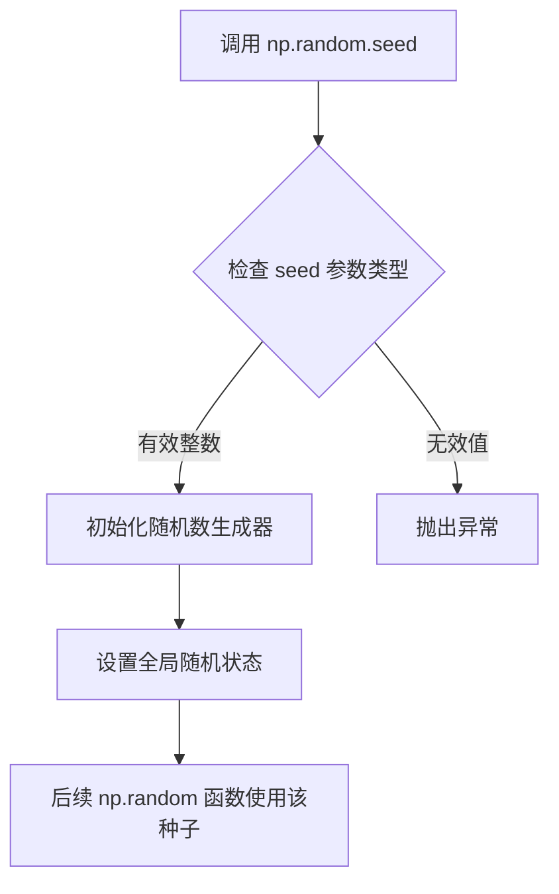
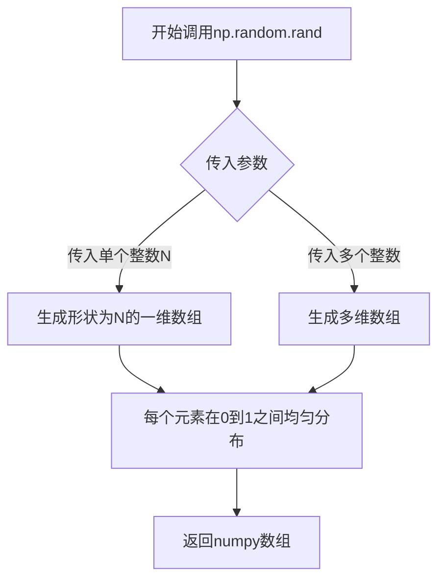
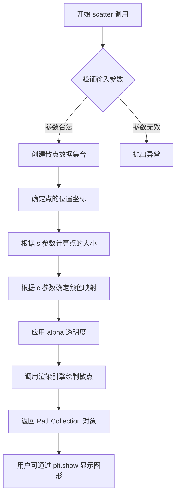
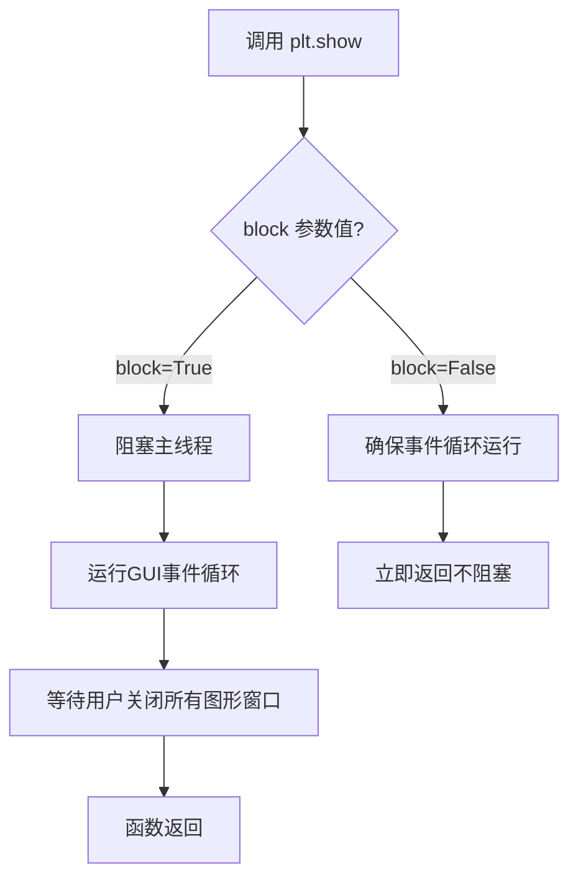

# `matplotlib\galleries\examples\shapes_and_collections\scatter.py` 详细设计文档

这是一个简单的matplotlib散点图示例，通过生成50个随机坐标点、颜色和面积数据，使用plt.scatter绘制二维散点图并展示数据分布

## 整体流程

```mermaid
graph TD
    A[开始] --> B[导入matplotlib.pyplot和numpy库]
    B --> C[设置随机种子np.random.seed(19680801)]
    C --> D[定义数据点数量N=50]
    D --> E[生成N个随机x坐标: np.random.rand(N)]
    E --> F[生成N个随机y坐标: np.random.rand(N)]
    F --> G[生成N个随机颜色值: np.random.rand(N)]
    G --> H[生成N个随机面积: (30*np.random.rand(N))**2]
    H --> I[调用plt.scatter绘制散点图]
    I --> J[调用plt.show()显示图表]
    J --> K[结束]
```

## 类结构

```
无自定义类层次结构
该脚本为过程式代码，仅使用第三方库函数
```

## 全局变量及字段


### `N`
    
数据点数量，固定值50

类型：`int`
    


### `x`
    
N个随机生成的x坐标值

类型：`numpy.ndarray`
    


### `y`
    
N个随机生成的y坐标值

类型：`numpy.ndarray`
    


### `colors`
    
N个随机生成的颜色值(0-1之间)

类型：`numpy.ndarray`
    


### `area`
    
N个随机生成的散点面积值

类型：`numpy.ndarray`
    


    

## 全局函数及方法


### `np.random.seed`

设置随机数种子，确保随机数生成可重现，用于让每次运行代码时生成相同的随机数序列。

参数：

- `seed`：`int`，随机数种子值，用于初始化随机数生成器

返回值：`None`，该函数不返回任何值

#### 流程图



#### 带注释源码

```python
# 设置随机数种子为 19680801
# 这个特定的值来源于 Matplotlib 库的创建年份 (1968) 和发布日期 (08/01)
# 目的是确保每次运行代码时，np.random 生成的随机数序列相同
# 从而保证绘图结果的可重现性
np.random.seed(19680801)
```


### `np.random.rand`

生成指定数量的[0,1)区间随机数，返回一个包含随机浮点数的数组。

参数：

- `*shape`：`int`，表示输出数组的维度。在本例中传入参数`N`（值为50），表示生成50个随机数。

返回值：`ndarray`，返回一个在[0, 1)区间内均匀分布的随机浮点数数组，形状由shape参数决定。本例中返回形状为(50,)的一维数组。

#### 流程图



#### 带注释源码

```python
# 设置随机种子以确保可重复性
np.random.seed(19680801)

# 定义生成随机数的数量
N = 50

# 调用np.random.rand(N)生成50个[0,1)区间内的随机浮点数
# 参数：N=50，指定生成50个随机数
# 返回值：形状为(50,)的numpy数组，每个元素在[0,1)区间内均匀分布
x = np.random.rand(N)

# 再次调用np.random.rand(N)生成y坐标随机数
y = np.random.rand(N)

# 调用np.random.rand(N)生成50个[0,1)区间内的随机浮点数
# 这些值将作为散点图的颜色映射值
colors = np.random.rand(N)

# 面积参数：生成随机半径，然后平方得到面积
# (30 * np.random.rand(N))**2 生成范围在0到22500之间的随机面积值
area = (30 * np.random.rand(N))**2  # 0 to 15 point radii

# 使用matplotlib绘制散点图
# x, y: 散点的坐标
# s: 散点的大小（面积）
# c: 散点的颜色（使用随机生成的colors数组）
# alpha: 透明度设置为0.5
plt.scatter(x, y, s=area, c=colors, alpha=0.5)

# 显示最终的散点图
plt.show()
```


### `plt.scatter`

绘制散点图，用于展示两个变量之间的关系，其中每个点的位置由 x 和 y 坐标决定，可以进一步通过大小、颜色和透明度来编码额外的维度信息。

参数：

- `x`：`array-like`，x轴坐标数据
- `y`：`array-like`，y轴坐标数据
- `s`：`array-like` 或 `scalar`，散点的大小（可以是每个点的独立值或统一值）
- `c`：`array-like` 或 `color`，散点的颜色（可以是每个点的独立颜色值或统一颜色）
- `alpha`：`float`，透明度，范围从 0（完全透明）到 1（完全不透明），默认为 1

返回值：`matplotlib.collections.PathCollection`，返回包含所有散点信息的集合对象，可用于进一步自定义图表样式

#### 流程图



#### 带注释源码

```python
# 调用 matplotlib 的 scatter 函数绘制散点图
# 参数说明：
# x: 随机生成的50个x坐标值，范围在[0, 1]之间
# y: 随机生成的50个y坐标值，范围在[0, 1]之间
# s: 散点面积，值为 (30 * 随机数)^2，范围约在 0 到 225 之间
# c: 散点颜色，50个随机颜色值，用于色彩映射
# alpha: 透明度0.5，使散点半透明以便观察重叠部分
plt.scatter(x, y, s=area, c=colors, alpha=0.5)

# 显示最终生成的图形
plt.show()
```


### `plt.show`

显示包含所有当前figure的图表窗口。该函数会阻塞程序执行（除非设置了block=False），直到窗口关闭。

参数：

- `block`：`bool`，可选参数，默认为`True`。当设置为`True`时，函数会阻塞主线程以运行GUI事件循环；当设置为`False`时，确保事件循环正在运行但不阻塞主程序。

返回值：`None`，无返回值。

#### 流程图



#### 带注释源码

```python
plt.show()  # 显示matplotlib创建的figure窗口
# 内部会遍历所有当前的Figure对象并显示它们
# 如果block=True（默认），会进入交互式模式并阻塞程序
# 直到用户关闭所有图形窗口才继续执行后续代码
# 在Jupyter notebook中通常使用 %matplotlib inline 而不是 show()
```


## 关键组件


### 核心功能概述

该代码是一个Matplotlib散点图可视化示例，通过生成随机坐标、颜色和面积数据，使用`plt.scatter()`函数绘制具有颜色映射和大小变化的散点图，并调用`plt.show()`展示最终图形结果。

### 文件整体运行流程

1. 导入matplotlib.pyplot和numpy模块
2. 设置随机种子以确保结果可复现
3. 生成50个随机样本点：x坐标、y坐标、颜色值和面积
4. 调用scatter函数绑定数据并渲染散点图
5. 调用show函数显示最终图形

### 关键组件信息

### numpy.random

NumPy随机数生成模块，提供rand()和seed()等函数用于生成均匀分布的随机数和设置随机状态。

### numpy.random.seed

随机种子设置函数，确保每次运行代码时生成的随机数序列相同，实现结果可复现性。

### numpy.random.rand

生成指定形状的[0,1)区间均匀分布随机数的函数，这里用于生成x坐标、y坐标和颜色数组。

### matplotlib.pyplot.scatter

散点图绘制核心函数，接收坐标数组、大小数组、颜色数组和透明度参数，将数据点渲染为散点图，支持颜色映射和大小映射。

### matplotlib.pyplot.show

图形显示函数，调用底层图形后端将figure对象渲染到屏幕或保存为文件。

### 潜在的技术债务或优化空间

1. 硬编码的样本数量N=50，缺乏配置化和可扩展性
2. 面积计算公式`30 * np.random.rand(N))**2`中30magic number缺乏注释说明
3. 缺少错误处理机制，如数据验证、异常捕获等
4. 未设置图形标题、坐标轴标签等辅助信息，图形可读性不足
5. 缺乏单元测试和文档字符串

### 其它项目

**设计目标与约束**：以最小代码量展示matplotlib散点图的基本用法，适用于快速原型开发和教学演示。

**错误处理与异常设计**：代码未包含任何异常处理逻辑，假设输入参数始终合法。

**数据流与状态**：数据流为单向流动：随机数生成 → 数据绑定 → 图形渲染 → 图形展示，无状态回溯。

**外部依赖与接口契约**：依赖matplotlib和numpy两个第三方库，scatter函数接受x、y、s(大小)、c(颜色)、alpha(透明度)等参数，返回PathCollection对象。


## 问题及建议


### 已知问题

- **硬编码的随机种子**：使用硬编码的 `np.random.seed(19680801)`，虽然注释说明是为了可重复性，但这种方式缺乏灵活性，难以通过参数配置
- **Magic Numbers 遍布**：代码中存在多个魔数（如 N=50、30、area计算中的**2），缺乏明确的常量定义，注释 "0 to 15 point radii" 与实际计算结果(0到225)不符
- **缺乏函数封装**：代码以脚本形式直接执行，未封装为可复用的函数或类，难以作为模块被其他代码导入调用
- **无输入验证**：对生成的数据没有做任何边界检查或验证，如 N 必须为正整数等
- **缺少类型注解**：未使用 Python 类型提示（type hints），降低了代码的可读性和 IDE 支持
- **变量命名可改进**：变量名如 `x`、`y`、`colors`、`area` 较为通用，缺乏业务语义表达
- **plt.show() 阻塞调用**：使用 `plt.show()` 会阻塞主线程，在某些应用场景（如 GUI 应用）中不适合
- **无错误处理**：未对 matplotlib 或 numpy 可能抛出的异常进行捕获处理
- **资源未显式释放**：未使用上下文管理器或显式关闭图形对象，可能导致资源泄漏

### 优化建议

- **封装为函数**：将散点图生成逻辑封装为函数，接受参数如 `n_points`、`seed`、`point_size_range` 等，提高可配置性和可复用性
- **定义常量类**：创建配置类或使用枚举定义所有魔数，如 `class PlotConfig: N_POINTS = 50; BASE_RADIUS = 30`
- **添加类型注解**：为函数参数和返回值添加类型提示，如 `def create_scatter(n: int, seed: int) -> None`
- **使用面向对象设计**：创建 `ScatterPlotGenerator` 类，将数据生成和绘图逻辑封装，提供更清晰的接口
- **改进错误处理**：添加 try-except 块捕获 `numpy.random` 和 `matplotlib` 可能抛出的异常
- **使用 plt.savefig() 替代或补充 plt.show()**：在非交互式环境中更适用，如 Web 服务或批处理
- **修正注释**：area 的注释应与实际计算一致，或调整计算方式使其符合注释描述
- **添加配置选项**：提供是否显示图形、是否保存图形、图形格式（如 PNG、SVG）等选项


## 其它


### 一段话描述

该代码是一个简单的散点图可视化示例，通过生成随机数据点展示matplotlib库中scatter函数的基本用法，包括设置点的大小、颜色和透明度。

### 文件的整体运行流程

1. 导入必要的库：matplotlib.pyplot 和 numpy
2. 设置随机种子以确保结果可重现
3. 生成50个随机数据点（x坐标、y坐标、颜色值）
4. 生成随机面积数据用于点的大小
5. 调用scatter函数绘制散点图
6. 显示最终的图表

### 类的详细信息

该代码不包含类定义，是一个简单的脚本文件。

### 类字段和类方法

该代码不包含类定义，无类字段和类方法。

### 全局变量

| 名称 | 类型 | 描述 |
|------|------|------|
| N | int | 数据点数量，固定为50 |
| x | numpy.ndarray | x坐标的随机数组 |
| y | numpy.ndarray | y坐标的随机数组 |
| colors | numpy.ndarray | 随机生成的颜色值数组 |
| area | numpy.ndarray | 随机生成的面积数组，用于控制点的大小 |

### 全局函数

该代码不包含自定义全局函数，仅使用matplotlib和numpy的库函数。

### 关键组件信息

| 名称 | 一句话描述 |
|------|------------|
| np.random.rand(N) | 生成指定数量的[0,1)区间随机数数组 |
| plt.scatter() | matplotlib库中用于绘制散点图的核心函数 |
| plt.show() | 显示当前所有打开的图形窗口 |

### 潜在的技术债务或优化空间

1. **硬编码参数**：数据点数量N为硬编码值，缺乏灵活性
2. **缺乏错误处理**：没有对输入参数进行验证
3. **无配置化**：颜色、面积等参数直接写在代码中，难以调整
4. **无文档注释**：缺少对代码功能和参数的详细说明
5. **函数封装缺失**：所有代码直接执行，未封装为可复用的函数

### 其它项目

#### 设计目标与约束

- **主要目标**：展示matplotlib散点图的基本用法，提供简洁的代码示例
- **约束条件**：需要matplotlib和numpy库支持，依赖Python科学计算生态

#### 错误处理与异常设计

- 当前代码未实现错误处理机制
- 潜在的异常情况：内存不足导致数组分配失败、图形后端不可用等
- 建议改进：添加异常捕获块处理可能的ImportError、MemoryError等

#### 数据流与状态机

- 数据流：随机数生成 → 数据预处理 → 可视化渲染 → 图形显示
- 状态转换：初始化 → 数据生成 → 绘图 → 显示
- 无复杂状态管理，属于线性执行流程

#### 外部依赖与接口契约

- **matplotlib.pyplot.scatter()**: 接收x, y, s(大小), c(颜色), alpha(透明度)参数，返回AxesPathCollection对象
- **numpy.random.rand()**: 接收形状参数，返回指定形状的随机数组
- **numpy.random.seed()**: 设置随机数生成器的种子，确保可重现性

#### 代码执行环境要求

- Python 3.x
- numpy >= 1.0
- matplotlib >= 2.0
- 建议在Jupyter Notebook或支持matplotlib图形显示的环境中运行

#### 性能考虑

- 当前数据量较小（50个点），性能无明显瓶颈
- 若数据量增大，建议使用向量化操作替代循环
- 大数据集时考虑使用更高效的渲染后端


    