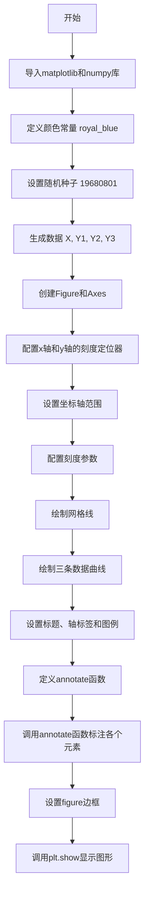
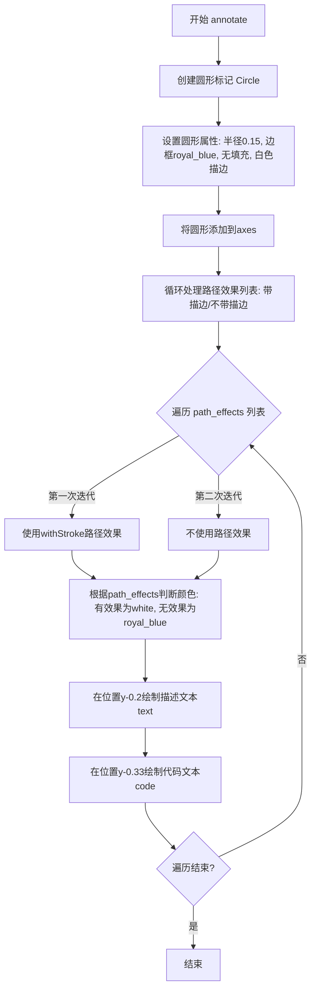

# `matplotlib\galleries\examples\showcase\anatomy.py` 详细设计文档

这是一个matplotlib教程示例代码，用于创建一个展示图表各组成部分名称的示意图，通过绘制数据曲线并添加注释来标注figure、axes、title、xlabel、ylabel、legend、grid等元素的名称和位置。

## 整体流程



## 类结构

```
脚本文件（无类定义）
├── 全局函数: annotate(x, y, text, code)
└── 全局变量: royal_blue, X, Y1, Y2, Y3, fig, ax
```

## 全局变量及字段


### `royal_blue`
    
RGB颜色值 [0, 20/256, 82/256]

类型：`list`
    


### `X`
    
从0.5到3.5的100个等间距点

类型：`numpy.ndarray`
    


### `Y1`
    
3+cos(X) 计算的曲线数据

类型：`numpy.ndarray`
    


### `Y2`
    
1+cos(1+X/0.75)/2 计算的曲线数据

类型：`numpy.ndarray`
    


### `Y3`
    
Y1和Y2之间的随机数据点

类型：`numpy.ndarray`
    


### `fig`
    
创建的图表对象

类型：`matplotlib.figure.Figure`
    


### `ax`
    
图表的坐标轴对象

类型：`matplotlib.axes.Axes`
    


    

## 全局函数及方法


### `annotate`

该函数用于在matplotlib图表的指定坐标位置添加圆形标记和两层文本注释（上层为描述性文本，下层为对应的代码引用），通过描边效果增强文本在复杂背景下的可读性。

参数：

- `x`：`float`，目标位置的X轴坐标
- `y`：`float`，目标位置的Y轴坐标
- `text`：`str`，要显示的描述性文本（如"Major tick label"）
- `code`：`str`，要显示的代码引用文本（如"ax.yaxis.set_major_formatter"）

返回值：`None`，该函数直接操作matplotlib的axes对象，无返回值

#### 流程图



#### 带注释源码

```python
def annotate(x, y, text, code):
    """
    在指定位置添加圆形标记和文本注释
    
    参数:
        x: float - X轴坐标
        y: float - Y轴坐标  
        text: str - 描述性文本
        code: str - 代码引用文本
    """
    
    # ========== 第一部分: 创建圆形标记 ==========
    # 创建圆形对象，设置位置为(x,y)，半径0.15
    # clip_on=False: 不裁剪圆形在axes范围外的内容
    # zorder=10: 确保圆形在网格线之上
    # edgecolor: 边框颜色为royal_blue加上透明度0.6
    # facecolor='none': 无填充色（透明）
    # path_effects: 添加白色描边效果使圆形更显眼
    c = Circle((x, y), radius=0.15, clip_on=False, zorder=10, linewidth=2.5,
               edgecolor=royal_blue + [0.6], facecolor='none',
               path_effects=[withStroke(linewidth=7, foreground='white')])
    
    # 将圆形标记添加到axes画布上
    ax.add_artist(c)

    # ========== 第二部分: 绘制文本注释 ==========
    # 使用path_effects作为文本背景，使文本在复杂图表上更清晰
    # 分别绘制有描边和无描边的文本，确保描边效果不会遮挡其他文本
    
    # 遍历两个path_effects配置: [带描边效果], [无描边效果]
    for path_effects in [[withStroke(linewidth=7, foreground='white')], []]:
        
        # 根据是否有path_effects确定文本颜色
        # 有描边时文本为白色(与描边配合)，无描边时为royal_blue
        color = 'white' if path_effects else royal_blue
        
        # 在(x, y-0.2)位置绘制描述性文本
        # zorder=100确保文本在最上层
        # ha='center', va='top': 水平居中，顶部对齐
        # weight='bold': 粗体，style='italic': 斜体
        # fontfamily='monospace': 等宽字体
        ax.text(x, y-0.2, text, zorder=100,
                ha='center', va='top', weight='bold', color=color,
                style='italic', fontfamily='monospace',
                path_effects=path_effects)

        # 根据是否有path_effects确定代码文本颜色
        # 有描边时为白色，无描边时为黑色
        color = 'white' if path_effects else 'black'
        
        # 在(x, y-0.33)位置绘制代码引用文本
        # weight='normal': 正常粗细，不使用斜体
        # fontsize='medium': 中等字号
        ax.text(x, y-0.33, code, zorder=100,
                ha='center', va='top', weight='normal', color=color,
                fontfamily='monospace', fontsize='medium',
                path_effects=path_effects)
```

## 关键组件


### 图形创建模块

使用 plt.figure() 创建 7.5x7.5 尺寸的 Figure 对象，并通过 fig.add_axes() 添加 Axes 子图，设置宽高比为 1:1

### 坐标轴配置模块

通过 MultipleLocator 和 AutoMinorLocator 设置主刻度和次刻度定位器，配置 x 和 y 轴的刻度间隔及次刻度分割数

### 数据绘图模块

使用 np.linspace 生成 X 轴数据，Y1 和 Y2 通过三角函数计算，Y3 通过 np.random.uniform 生成随机数据，最后用 ax.plot() 绘制三条曲线

### 图形标注函数 annotate()

定义通用的标注辅助函数，接受坐标、文本和代码参数，使用 Circle 创建圆形标记，通过 withStroke 实现文字描边效果

### 刻度格式化模块

使用 ax.xaxis.set_minor_formatter("{x:.2f}") 设置次刻度标签格式为两位小数显示

### 网格线配置模块

通过 ax.grid() 配置网格线样式，设置虚线线型、0.5 宽度、0.25 颜色和 -10 的 zorder

### 标题与标签模块

使用 ax.set_title()、ax.set_xlabel()、ax.set_ylabel() 分别设置图表标题、X 轴标签和 Y 轴标签

### 图例模块

通过 ax.legend() 配置图例显示在右上角，字体大小设置为 14 磅

### 标记符号模块

使用 ax.plot() 的 marker 参数绘制方形标记点，通过 markerfacecolor='none' 实现空心标记效果

### 边框样式模块

通过 fig.patch.set() 设置图形边框的线宽为 4 和边缘颜色为 0.5（灰色）

### 路径效果模块

使用 matplotlib.patheffects.withStroke 为文字添加白色描边效果，增强文字在背景上的可读性

### 颜色定义模块

定义 royal_blue 颜色变量 [0, 20/256, 82/256]，用于图形元素的颜色配置

### 刻度参数配置模块

通过 ax.tick_params() 分别配置主刻度（宽度 1.0、长度 10、字号 14）和次刻度（宽度 1.0、长度 5、字号 10、标签颜色 0.25）的显示参数


## 问题及建议


### 已知问题

- **全局变量污染**：代码中存在大量全局变量（`fig`, `ax`, `X`, `Y1`, `Y2`, `Y3`, `royal_blue`），可能导致命名空间污染和意外的副作用
- **硬编码的魔法数字**：图表的位置坐标、注释坐标、图形尺寸等大量硬编码（如`0.2, 0.17, 0.68, 0.7`、`3.5, -0.13`等），缺乏可配置性
- **缺乏面向对象设计**：所有功能堆积在全局作用域中，`annotate`函数作为独立函数而非类方法，扩展性差
- **数据生成与可视化耦合**：数据生成逻辑与绘图代码紧密耦合，难以单独测试或复用数据处理部分
- **重复代码模式**：`annotate`函数中存在重复的文本绘制逻辑（循环两次分别绘制带路径效果和不带路径效果的文本）
- **缺少类型注解**：函数参数和返回值缺乏类型提示，降低了代码的可读性和IDE支持
- **可访问性不足**：图表的配色和字体大小设置可能影响可访问性，缺乏对比度考虑
- **资源管理**：使用`np.random.seed(19680801`)设置随机种子，但没有明确文档说明其目的

### 优化建议

- **封装为类**：将图表创建逻辑封装到`FigureBuilder`类中，将全局变量转换为类属性或实例变量
- **配置驱动设计**：使用配置文件或参数化方式替代硬编码的坐标和样式值
- **数据层分离**：将数据生成逻辑（`X`, `Y1`, `Y2`, `Y3`）抽取为独立的数据生成函数
- **函数参数化**：为`annotate`函数添加更多参数（如字体大小、颜色、偏移量等）以提高灵活性
- **添加类型注解**：为所有函数添加类型提示，包括参数类型和返回值类型
- **代码复用**：将`annotate`中的重复文本绘制逻辑抽象为私有方法
- **文档完善**：添加详细的docstring说明函数目的、参数和返回值
- **可访问性改进**：提供高对比度配色方案选项，考虑色盲友好配色


## 其它


### 设计目标与约束

本示例代码的设计目标是创建一个教育性的可视化图形，直观展示matplotlib图表的各个组成部分（如坐标轴、标题、图例、网格等），帮助用户理解图表的结构。约束条件包括：使用matplotlib作为唯一绘图库，图形尺寸固定为7.5x7.5英寸，需要在Python 3.6+环境中运行，且依赖numpy和matplotlib两个核心库。

### 错误处理与异常设计

代码本身较为简单，主要依赖matplotlib和numpy的内部错误处理机制。未对输入参数进行显式验证，因此潜在的异常包括：numpy的随机数生成可能抛出内存错误（当len(X)极大时），matplotlib的图形渲染可能抛出显示相关错误（当无图形后端可用时），Circle半径为负数时可能抛出几何参数错误。代码采用静默失败策略，不捕获任何异常。

### 数据流与状态机

代码执行流程分为三个主要状态：初始化状态（创建图形和坐标轴）、绘图状态（绘制曲线和散点）、标注状态（添加注释和标签）。数据流：np.random.seed() → X/Y数据生成 → fig/ax对象创建 → plot()调用 → annotate()函数多次调用 → 最终渲染。状态转换是线性的，不存在条件分支或回退机制。

### 外部依赖与接口契约

代码依赖以下外部包：matplotlib.pyplot（图形创建和显示）、numpy（数值计算和随机数生成）、matplotlib.patches.Circle（圆形标注）、matplotlib.patheffects.withStroke（文本描边效果）、matplotlib.ticker（坐标轴刻度定位）。接口契约：np.linspace()返回等间距数组、plt.figure()返回Figure对象、fig.add_axes()返回Axes对象、ax.plot()返回Line2D对象列表、ax.text()返回Text对象。所有依赖均为matplotlib生态的标准组件。

### 性能考虑

代码性能开销主要集中在三个环节：numpy数组生成（100个数据点，规模较小）、图形渲染（matplotlib的固有开销，标注对象较多时更明显）、plt.show()的显示调用。优化建议：对于更大规模数据，可考虑使用ax.scatter()代替ax.plot()的散点方式；对于静态图像，可使用fig.savefig()直接保存以避免GUI显示开销；标注函数annotate()内部循环可提取到外部以减少重复计算。

### 安全性考虑

代码不涉及用户输入、网络通信或文件操作，因此不存在安全漏洞。潜在的代码注入风险：annotate()函数的text和code参数直接传递给ax.text()，虽然此处为硬编码常量，但若未来接受外部输入需进行适当转义。matplotlib默认配置可防止大多数渲染相关的安全问题。

### 可维护性与扩展性

代码结构较为扁平，主要问题包括：全局函数annotate()依赖外部变量ax和royal_blue，建议改为显式传递；硬编码的魔法数字（如0.15、0.2、0.33等）缺乏解释性；15次annotate()调用重复性强，可考虑使用配置列表批量生成。扩展方向：可增加更多图表元素的标注、可将标注配置外部化为YAML/JSON文件、可添加交互式悬停提示功能。

### 测试策略

由于这是可视化示例代码，传统单元测试适用性有限。推荐的测试策略包括：快照测试（使用matplotlib的baseline图像对比）、导入测试（验证所有依赖可正确加载）、语法测试（使用ast模块验证代码有效性）、基本渲染测试（创建图形对象但不显示，验证无异常）。可使用pytest框架配合pytest-mpl插件进行图像对比测试。

### 配置与参数说明

核心配置参数包括：图形尺寸figsize=(7.5, 7.5)、坐标轴范围xlim/ylim=(0, 4)、主刻度间隔MultipleLocator(1.0)、次刻度细分数AutoMinorLocator(4)、线条宽度(lw=2.5)、标记大小(markersize=9)。颜色配置：royal_blue=[0, 20/256, 82/256]为标注边框色。标注位置采用绝对坐标，硬编码在图表的特定位置以确保视觉对齐。

### 使用示例与用例

本代码的主要用途是作为matplotlib教学示例，帮助开发者理解图表的组成结构。使用方式：直接运行脚本查看可视化结果，或作为文档嵌入到sphinx教程中。典型用例包括：嵌入到matplotlib官方文档、作为代码审查的参考实现、用于自动化测试的baseline图像生成。代码展示了matplotlib的核心概念：Figure、Axes、Axis、Artist层次结构，以及text()、plot()、grid()等关键API的使用模式。


    