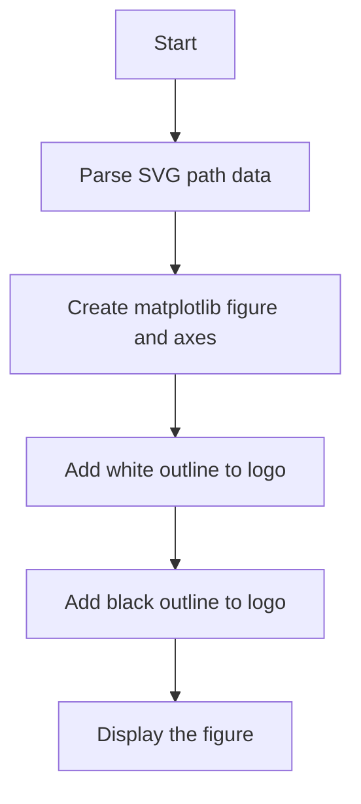
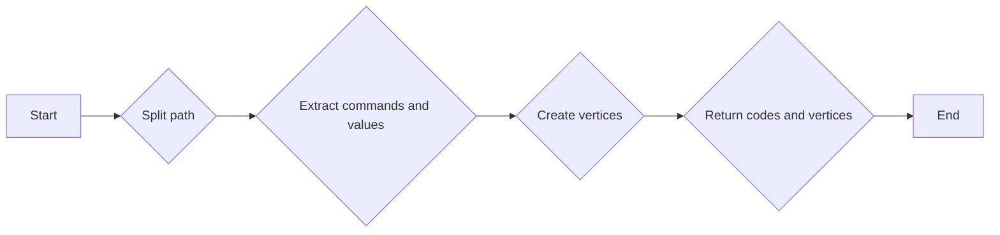
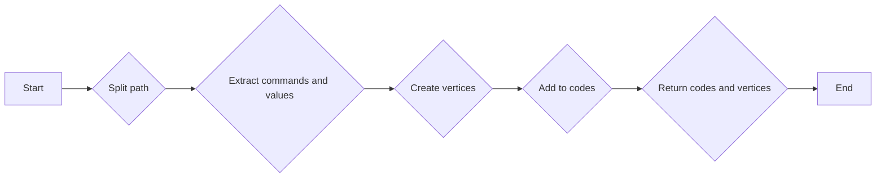

# `matplotlib\galleries\examples\showcase\firefox.py` 详细设计文档

This code generates the Firefox logo using SVG path data and matplotlib for plotting.

## 整体流程



## 类结构

```
AbstractSVGParser (抽象SVG解析器)
├── FirefoxLogoParser (Firefox标志解析器)
│   ├── svg_parse (SVG解析函数)
```

## 全局变量及字段


### `firefox`
    
The SVG path string representing the Firefox logo.

类型：`str`
    


    

## 全局函数及方法


### svg_parse

This function parses an SVG path string and converts it into a sequence of commands and vertices that can be used to create a matplotlib path object.

参数：

- `path`：`str`，SVG path string to be parsed.

返回值：`tuple`，A tuple containing two elements: a numpy array of codes and a numpy array of vertices.

#### 流程图

```mermaid
graph LR
A[Start] --> B{Split path into commands and values}
B --> C{Loop over commands and values}
C -->|cmd.islower()| D{Add points to vertices}
C -->|cmd.isupper()| E{Extend vertices}
D --> F[Update vertices]
E --> F
F --> G{Add codes}
G --> C
C -->|End of path| H[End]
H --> I[Return codes and vertices]
```

#### 带注释源码

```python
def svg_parse(path):
    commands = {'M': (Path.MOVETO,),
                'L': (Path.LINETO,),
                'Q': (Path.CURVE3,)*2,
                'C': (Path.CURVE4,)*3,
                'Z': (Path.CLOSEPOLY,)}
    vertices = []
    codes = []
    cmd_values = re.split("([A-Za-z])", path)[1:]  # Split over commands.
    for cmd, values in zip(cmd_values[::2], cmd_values[1::2]):
        # Numbers are separated either by commas, or by +/- signs (but not at
        # the beginning of the string).
        points = ([*map(float, re.split(",|(?<!^)(?=[+-])", values))] if values
                  else [(0., 0.)])  # Only for "z/Z" (CLOSEPOLY).
        points = np.reshape(points, (-1, 2))
        if cmd.islower():
            points += vertices[-1][-1]
        codes.extend(commands[cmd.upper()])
        vertices.append(points)
    return np.array(codes), np.concatenate(vertices)
```


### svg_parse

This function parses an SVG path string and converts it into a sequence of commands and vertices that can be used to create a matplotlib path object.

参数：

- `path`：`str`，The SVG path string to be parsed.

返回值：`tuple`，A tuple containing two elements: a numpy array of codes and a numpy array of vertices.

#### 流程图



#### 带注释源码

```python
def svg_parse(path):
    commands = {'M': (Path.MOVETO,),
                'L': (Path.LINETO,),
                'Q': (Path.CURVE3,)*2,
                'C': (Path.CURVE4,)*3,
                'Z': (Path.CLOSEPOLY,)}
    vertices = []
    codes = []
    cmd_values = re.split("([A-Za-z])", path)[1:]  # Split over commands.
    for cmd, values in zip(cmd_values[::2], cmd_values[1::2]):
        # Numbers are separated either by commas, or by +/- signs (but not at
        # the beginning of the string).
        points = ([*map(float, re.split(",|(?<!^)(?=[+-])", values))] if values
                  else [(0., 0.)])  # Only for "z/Z" (CLOSEPOLY).
        points = np.reshape(points, (-1, 2))
        if cmd.islower():
            points += vertices[-1][-1]
        codes.extend(commands[cmd.upper()])
        vertices.append(points)
    return np.array(codes), np.concatenate(vertices)
```


### svg_parse

This function parses an SVG path string and converts it into a sequence of commands and vertices that can be used to create a matplotlib path object.

参数：

- `path`：`str`，SVG path string to be parsed.

返回值：`tuple`，A tuple containing two elements: a numpy array of codes and a numpy array of vertices.

#### 流程图



#### 带注释源码

```python
def svg_parse(path):
    commands = {'M': (Path.MOVETO,),
                'L': (Path.LINETO,),
                'Q': (Path.CURVE3,)*2,
                'C': (Path.CURVE4,)*3,
                'Z': (Path.CLOSEPOLY,)}
    vertices = []
    codes = []
    cmd_values = re.split("([A-Za-z])", path)[1:]  # Split over commands.
    for cmd, values in zip(cmd_values[::2], cmd_values[1::2]):
        # Numbers are separated either by commas, or by +/- signs (but not at
        # the beginning of the string).
        points = ([*map(float, re.split(",|(?<!^)(?=[+-])", values))] if values
                  else [(0., 0.)])  # Only for "z/Z" (CLOSEPOLY).
        points = np.reshape(points, (-1, 2))
        if cmd.islower():
            points += vertices[-1][-1]
        codes.extend(commands[cmd.upper()])
        vertices.append(points)
    return np.array(codes), np.concatenate(vertices)
```


## 关键组件


### 张量索引与惰性加载

张量索引与惰性加载是深度学习框架中常用的技术，用于高效地处理大型数据集。它允许在需要时才计算张量的值，从而减少内存消耗和提高计算效率。

### 反量化支持

反量化支持是深度学习模型优化中的一种技术，它通过将量化后的模型转换回浮点模型，以便进行进一步的分析或训练。

### 量化策略

量化策略是深度学习模型压缩中的一种方法，它通过将模型的权重和激活值从浮点数转换为低精度整数来减少模型的大小和计算量。


## 问题及建议


### 已知问题

-   **代码重复性**：`svg_parse` 函数中的代码重复性较高，特别是在处理命令和值的分割以及点的计算上。
-   **SVG 解析的健壮性**：代码假设 SVG 路径格式是正确的，没有进行错误处理或异常处理来处理格式错误或不合规的 SVG 路径。
-   **全局变量**：代码中使用了全局变量 `firefox`，这可能导致代码难以维护和理解。
-   **性能**：对于复杂的 SVG 图形，解析和渲染可能需要较长时间，尤其是在没有优化的情况下。

### 优化建议

-   **代码重构**：将 `svg_parse` 函数中的重复代码提取到单独的函数中，以减少代码重复并提高可读性。
-   **错误处理**：增加错误处理逻辑来处理不合规的 SVG 路径，例如通过抛出异常或返回错误信息。
-   **局部变量**：将 `firefox` 变量移至函数作用域内，以避免全局变量的使用。
-   **性能优化**：考虑使用更高效的算法或数据结构来处理 SVG 解析和渲染，例如使用缓存或并行处理。
-   **代码注释**：增加代码注释来解释复杂逻辑和算法，以提高代码的可读性和可维护性。
-   **测试**：编写单元测试来验证代码的功能和健壮性，确保代码在各种情况下都能正常工作。


## 其它


### 设计目标与约束

- 设计目标：
  - 将SVG路径转换为matplotlib可用的路径对象。
  - 使用matplotlib绘制Firefox标志。
  - 确保绘制的标志具有清晰的轮廓和填充颜色。

- 约束条件：
  - 必须使用matplotlib库进行绘图。
  - SVG路径必须符合特定格式。
  - 绘图区域应适当调整以适应标志的尺寸。

### 错误处理与异常设计

- 错误处理：
  - 如果SVG路径格式不正确，应抛出异常。
  - 如果matplotlib库不可用，应抛出异常。

- 异常设计：
  - 使用try-except块捕获并处理异常。
  - 提供清晰的错误消息，以便用户了解问题所在。

### 数据流与状态机

- 数据流：
  - SVG路径字符串 -> svg_parse函数 -> codes和verts数组 -> matplotlib路径对象 -> 图形绘制。

- 状态机：
  - 无状态机，程序按顺序执行。

### 外部依赖与接口契约

- 外部依赖：
  - matplotlib库。
  - numpy库。

- 接口契约：
  - svg_parse函数接受SVG路径字符串，返回matplotlib路径对象。
  - matplotlib库提供绘图功能。

### 安全性与隐私

- 安全性：
  - 确保代码不会执行恶意SVG路径。
  - 使用matplotlib库的安全功能绘制图形。

- 隐私：
  - 无隐私相关数据。

### 性能与可扩展性

- 性能：
  - 确保svg_parse函数高效处理SVG路径。
  - 使用matplotlib库的优化功能绘制图形。

- 可扩展性：
  - 代码结构清晰，易于添加新功能。
  - 可以扩展以支持其他SVG路径格式。

### 维护与支持

- 维护：
  - 确保代码遵循最佳实践。
  - 定期更新依赖库。

- 支持：
  - 提供文档和示例代码。
  - 回应用户反馈和问题。

### 代码审查与测试

- 代码审查：
  - 确保代码符合编码标准。
  - 检查代码质量和可读性。

- 测试：
  - 编写单元测试验证svg_parse函数的正确性。
  - 测试matplotlib绘图功能。

### 文档与示例

- 文档：
  - 提供详细的设计文档。
  - 编写用户文档和API文档。

- 示例：
  - 提供使用示例代码。
  - 提供API示例。

### 法律与合规

- 法律：
  - 确保代码遵守相关法律法规。

- 合规：
  - 确保代码符合行业标准和最佳实践。

### 依赖管理

- 依赖管理：
  - 使用pip或其他工具管理依赖库。
  - 确保依赖库版本兼容。

### 版本控制

- 版本控制：
  - 使用Git或其他版本控制系统管理代码。
  - 确保代码版本与文档一致。

### 构建与部署

- 构建与部署：
  - 提供构建脚本。
  - 确保代码可以轻松部署到目标环境。

### 监控与日志

- 监控：
  - 监控代码运行状态。
  - 记录关键事件和错误。

- 日志：
  - 使用日志记录系统记录运行信息。

### 性能监控

- 性能监控：
  - 监控代码性能指标。
  - 分析性能瓶颈。

### 安全监控

- 安全监控：
  - 监控潜在的安全威胁。
  - 及时响应安全事件。

### 用户反馈

- 用户反馈：
  - 收集用户反馈。
  - 分析反馈并改进产品。

### 项目管理

- 项目管理：
  - 使用项目管理工具跟踪项目进度。
  - 确保项目按时完成。

### 质量保证

- 质量保证：
  - 确保代码质量符合标准。
  - 定期进行代码审查和测试。

### 风险管理

- 风险管理：
  - 识别潜在风险。
  - 制定风险管理计划。

### 资源管理

- 资源管理：
  - 管理项目资源。
  - 确保资源有效利用。

### 项目范围

- 项目范围：
  - 明确项目目标和范围。
  - 确保项目目标可实现。

### 项目目标

- 项目目标：
  - 实现Firefox标志的SVG路径到matplotlib图形的转换。
  - 使用matplotlib绘制Firefox标志。

### 项目里程碑

- 项目里程碑：
  - 完成SVG路径解析。
  - 完成matplotlib绘图。
  - 完成代码审查和测试。

### 项目预算

- 项目预算：
  - 确定项目预算。
  - 管理项目成本。

### 项目团队

- 项目团队：
  - 组建项目团队。
  - 分配任务和责任。

### 项目沟通

- 项目沟通：
  - 确保项目团队成员之间的沟通。
  - 使用适当的沟通工具。

### 项目决策

- 项目决策：
  - 制定项目决策流程。
  - 确保决策透明和可追溯。

### 项目评估

- 项目评估：
  - 评估项目进度和成果。
  - 识别改进机会。

### 项目交付

- 项目交付：
  - 准备项目交付物。
  - 确保交付物符合要求。

### 项目验收

- 项目验收：
  - 进行项目验收。
  - 确保项目满足验收标准。

### 项目总结

- 项目总结：
  - 总结项目经验教训。
  - 制定改进计划。

### 项目文档

- 项目文档：
  - 编写项目文档。
  - 确保文档完整和准确。

### 项目报告

- 项目报告：
  - 准备项目报告。
  - 提供项目成果和总结。

### 项目里程碑

- 项目里程碑：
  - 确定项目里程碑。
  - 跟踪项目进度。

### 项目风险

- 项目风险：
  - 识别项目风险。
  - 制定风险应对计划。

### 项目变更

- 项目变更：
  - 管理项目变更。
  - 确保变更得到控制。

### 项目质量

- 项目质量：
  - 确保项目质量符合标准。
  - 进行质量保证活动。

### 项目进度

- 项目进度：
  - 跟踪项目进度。
  - 确保项目按时完成。

### 项目资源

- 项目资源：
  - 管理项目资源。
  - 确保资源有效利用。

### 项目目标

- 项目目标：
  - 实现Firefox标志的SVG路径到matplotlib图形的转换。
  - 使用matplotlib绘制Firefox标志。

### 项目范围

- 项目范围：
  - 明确项目目标和范围。
  - 确保项目目标可实现。

### 项目预算

- 项目预算：
  - 确定项目预算。
  - 管理项目成本。

### 项目团队

- 项目团队：
  - 组建项目团队。
  - 分配任务和责任。

### 项目沟通

- 项目沟通：
  - 确保项目团队成员之间的沟通。
  - 使用适当的沟通工具。

### 项目决策

- 项目决策：
  - 制定项目决策流程。
  - 确保决策透明和可追溯。

### 项目评估

- 项目评估：
  - 评估项目进度和成果。
  - 识别改进机会。

### 项目交付

- 项目交付：
  - 准备项目交付物。
  - 确保交付物符合要求。

### 项目验收

- 项目验收：
  - 进行项目验收。
  - 确保项目满足验收标准。

### 项目总结

- 项目总结：
  - 总结项目经验教训。
  - 制定改进计划。

### 项目文档

- 项目文档：
  - 编写项目文档。
  - 确保文档完整和准确。

### 项目报告

- 项目报告：
  - 准备项目报告。
  - 提供项目成果和总结。

### 项目里程碑

- 项目里程碑：
  - 确定项目里程碑。
  - 跟踪项目进度。

### 项目风险

- 项目风险：
  - 识别项目风险。
  - 制定风险应对计划。

### 项目变更

- 项目变更：
  - 管理项目变更。
  - 确保变更得到控制。

### 项目质量

- 项目质量：
  - 确保项目质量符合标准。
  - 进行质量保证活动。

### 项目进度

- 项目进度：
  - 跟踪项目进度。
  - 确保项目按时完成。

### 项目资源

- 项目资源：
  - 管理项目资源。
  - 确保资源有效利用。

### 项目目标

- 项目目标：
  - 实现Firefox标志的SVG路径到matplotlib图形的转换。
  - 使用matplotlib绘制Firefox标志。

### 项目范围

- 项目范围：
  - 明确项目目标和范围。
  - 确保项目目标可实现。

### 项目预算

- 项目预算：
  - 确定项目预算。
  - 管理项目成本。

### 项目团队

- 项目团队：
  - 组建项目团队。
  - 分配任务和责任。

### 项目沟通

- 项目沟通：
  - 确保项目团队成员之间的沟通。
  - 使用适当的沟通工具。

### 项目决策

- 项目决策：
  - 制定项目决策流程。
  - 确保决策透明和可追溯。

### 项目评估

- 项目评估：
  - 评估项目进度和成果。
  - 识别改进机会。

### 项目交付

- 项目交付：
  - 准备项目交付物。
  - 确保交付物符合要求。

### 项目验收

- 项目验收：
  - 进行项目验收。
  - 确保项目满足验收标准。

### 项目总结

- 项目总结：
  - 总结项目经验教训。
  - 制定改进计划。

### 项目文档

- 项目文档：
  - 编写项目文档。
  - 确保文档完整和准确。

### 项目报告

- 项目报告：
  - 准备项目报告。
  - 提供项目成果和总结。

### 项目里程碑

- 项目里程碑：
  - 确定项目里程碑。
  - 跟踪项目进度。

### 项目风险

- 项目风险：
  - 识别项目风险。
  - 制定风险应对计划。

### 项目变更

- 项目变更：
  - 管理项目变更。
  - 确保变更得到控制。

### 项目质量

- 项目质量：
  - 确保项目质量符合标准。
  - 进行质量保证活动。

### 项目进度

- 项目进度：
  - 跟踪项目进度。
  - 确保项目按时完成。

### 项目资源

- 项目资源：
  - 管理项目资源。
  - 确保资源有效利用。

### 项目目标

- 项目目标：
  - 实现Firefox标志的SVG路径到matplotlib图形的转换。
  - 使用matplotlib绘制Firefox标志。

### 项目范围

- 项目范围：
  - 明确项目目标和范围。
  - 确保项目目标可实现。

### 项目预算

- 项目预算：
  - 确定项目预算。
  - 管理项目成本。

### 项目团队

- 项目团队：
  - 组建项目团队。
  - 分配任务和责任。

### 项目沟通

- 项目沟通：
  - 确保项目团队成员之间的沟通。
  - 使用适当的沟通工具。

### 项目决策

- 项目决策：
  - 制定项目决策流程。
  - 确保决策透明和可追溯。

### 项目评估

- 项目评估：
  - 评估项目进度和成果。
  - 识别改进机会。

### 项目交付

- 项目交付：
  - 准备项目交付物。
  - 确保交付物符合要求。

### 项目验收

- 项目验收：
  - 进行项目验收。
  - 确保项目满足验收标准。

### 项目总结

- 项目总结：
  - 总结项目经验教训。
  - 制定改进计划。

### 项目文档

- 项目文档：
  - 编写项目文档。
  - 确保文档完整和准确。

### 项目报告

- 项目报告：
  - 准备项目报告。
  - 提供项目成果和总结。

### 项目里程碑

- 项目里程碑：
  - 确定项目里程碑。
  - 跟踪项目进度。

### 项目风险

- 项目风险：
  - 识别项目风险。
  - 制定风险应对计划。

### 项目变更

- 项目变更：
  - 管理项目变更。
  - 确保变更得到控制。

### 项目质量

- 项目质量：
  - 确保项目质量符合标准。
  - 进行质量保证活动。

### 项目进度

- 项目进度：
  - 跟踪项目进度。
  - 确保项目按时完成。

### 项目资源

- 项目资源：
  - 管理项目资源。
  - 确保资源有效利用。

### 项目目标

- 项目目标：
  - 实现Firefox标志的SVG路径到matplotlib图形的转换。
  - 使用matplotlib绘制Firefox标志。

### 项目范围

- 项目范围：
  - 明确项目目标和范围。
  - 确保项目目标可实现。

### 项目预算

- 项目预算：
  - 确定项目预算。
  - 管理项目成本。

### 项目团队

- 项目团队：
  - 组建项目团队。
  - 分配任务和责任。

### 项目沟通

- 项目沟通：
  - 确保项目团队成员之间的沟通。
  - 使用适当的沟通工具。

### 项目决策

- 项目决策：
  - 制定项目决策流程。
  - 确保决策透明和可追溯。

### 项目评估

- 项目评估：
  - 评估项目进度和成果。
  - 识别改进机会。

### 项目交付

- 项目交付：
  - 准备项目交付物。
  - 确保交付物符合要求。

### 项目验收

- 项目验收：
  - 进行项目验收。
  - 确保项目满足验收标准。

### 项目总结

- 项目总结：
  - 总结项目经验教训。
  - 制定改进计划。

### 项目文档

- 项目文档：
  - 编写项目文档。
  - 确保文档完整和准确。

### 项目报告

- 项目报告：
  - 准备项目报告。
  - 提供项目成果和总结。

### 项目里程碑

- 项目里程碑：
  - 确定项目里程碑。
  - 跟踪项目进度。

### 项目风险

- 项目风险：
  - 识别项目风险。
  - 制定风险应对计划。

### 项目变更

- 项目变更：
  - 管理项目变更。
  - 确保变更得到控制。

### 项目质量

- 项目质量：
  - 确保项目质量符合标准。
  - 进行质量保证活动。

### 项目进度

- 项目进度：
  - 跟踪项目进度。
  - 确保项目按时完成。

### 项目资源

- 项目资源：
  - 管理项目资源。
  - 确保资源有效利用。

### 项目目标

- 项目目标：
  - 实现Firefox标志的SVG路径到matplotlib图形的转换。
  - 使用matplotlib绘制Firefox标志。

### 项目范围

- 项目范围：
  - 明确项目目标和范围。
  - 确保项目目标可实现。

### 项目预算

- 项目预算：
  - 确定项目预算。
  - 管理项目成本。

### 项目团队

- 项目团队：
  - 组建项目团队。
  - 分配任务和责任。

### 项目沟通

- 项目沟通：
  - 确保项目团队成员之间的沟通。
  - 使用适当的沟通工具。

### 项目决策

- 项目决策：
  - 制定项目决策流程。
  - 确保决策透明和可追溯。

### 项目评估

- 项目评估：
  - 评估项目进度和成果。
  - 识别改进机会。

### 项目交付

- 项目交付：
  - 准备项目交付物。
  - 确保交付物符合要求。

### 项目验收

- 项目验收：
  - 进行项目验收。
  - 确保项目满足验收标准。

### 项目总结

- 项目总结：
  - 总结项目经验教训。
  - 制定改进计划。

### 项目文档

- 项目文档：
  - 编写项目文档。
  - 确保文档完整和准确。

### 项目报告

- 项目报告：
  - 准备项目报告。
  - 提供项目成果和总结。

### 项目里程碑

- 项目里程碑：
  - 确定项目里程碑。
  - 跟踪项目进度。

### 项目风险

- 项目风险：
  - 识别项目风险。
  - 制定风险应对计划。

### 项目变更

- 项目变更：
  - 管理项目变更。
  - 确保变更得到控制。

### 项目质量

- 项目质量：
  - 确保项目质量符合标准。
  - 进行质量保证活动。

### 项目进度

- 项目进度：
  - 跟踪项目进度。
  - 确保项目按时完成。

### 项目资源

- 项目资源：
  - 管理项目资源。
  - 确保资源有效利用。

### 项目目标

- 项目目标：
  - 实现Firefox标志的SVG路径到matplotlib图形的转换。
  - 使用matplotlib绘制Firefox标志。

### 项目范围

- 项目范围：
  - 明确项目目标和范围。
  - 确保项目目标可实现。

### 项目预算

- 项目预算：
  - 确定项目预算。
  - 管理项目成本。

### 项目团队

- 项目团队：
  - 组建项目团队。
  - 分配任务和责任。

### 项目沟通

- 项目沟通：
  - 确保项目团队成员之间的沟通。
  - 使用适当的沟通工具。

### 项目决策

- 项目决策：
  - 制定项目决策流程。
  - 确保决策透明和可追溯。

### 项目评估

- 项目评估：
  - 评估项目进度和成果。
  - 识别改进机会。

### 项目交付

- 项目交付：
  - 准备项目交付物。
  - 确保交付物符合要求。

### 项目验收

- 项目验收：
  - 进行项目验收。
  - 确保项目满足验收标准。

### 项目总结

- 项目总结：
  - 总结项目经验教训。
  - 制定改进计划。

### 项目文档

- 项目文档：
  - 编写项目文档。
  - 确保文档完整和准确。

### 项目报告

- 项目报告：
  - 准备项目报告。
  - 提供项目成果和总结。

### 项目里程碑

- 项目里程碑：
  - 确定项目里程碑。
  - 跟踪项目进度。

### 项目风险

- 项目风险：
  - 识别项目风险。
  - 制定风险应对
    