# `matplotlib\galleries\examples\showcase\mandelbrot.py` 详细设计文档

该代码实现Mandelbrot分形集合的计算与可视化渲染。通过NumPy进行高效的迭代计算，采用平滑归一化计数算法和基于光照的着色技术（PowerNorm + LightSource），最终使用matplotlib生成带有阴影效果的彩色分形图像。

## 整体流程

```mermaid
graph TD
    A[开始] --> B[设置渲染参数]
    B --> C{xmin, xmax, ymin, ymax, xn, yn, maxiter, horizon}
C --> D[调用 mandelbrot_set]
D --> E[计算复数网格C]
E --> F[迭代计算Z = Z² + C]
F --> G{迭代次数 < maxiter?}
G -- 是 --> H[记录逃逸时间N]
G -- 否 --> I[返回Z, N]
I --> J[归一化计数 M = N + 1 - log2(log(|Z|)) + log_horizon]
J --> K[创建LightSource光源对象]
K --> L[shade方法渲染: cmap=hot, PowerNorm(gamma=0.3), blend_mode=hsv]
L --> M[创建figure和axes]
M --> N[imshow显示渲染图像]
N --> O[添加水印文本]
O --> P[plt.show显示窗口]
```

## 类结构

```
无类定义 (纯函数式编程)
└── 模块级函数: mandelbrot_set
    └── 主程序脚本
```

## 全局变量及字段


### `xmin`
    
复平面坐标范围最小值（实部）

类型：`float`
    


### `xmax`
    
复平面坐标范围最大值（实部）

类型：`float`
    


### `ymin`
    
复平面坐标范围最小值（虚部）

类型：`float`
    


### `ymax`
    
复平面坐标范围最大值（虚部）

类型：`float`
    


### `xn`
    
水平方向网格分辨率（像素数）

类型：`int`
    


### `yn`
    
垂直方向网格分辨率（像素数）

类型：`int`
    


### `maxiter`
    
Mandelbrot迭代最大次数，决定计算精度

类型：`int`
    


### `horizon`
    
逃逸半径阈值，点到原点的距离超过此值视为发散

类型：`float`
    


### `log_horizon`
    
horizon的对数值，用于平滑迭代计数计算

类型：`float`
    


### `X`
    
复平面实部坐标数组，通过linspace生成

类型：`ndarray`
    


### `Y`
    
复平面虚部坐标数组，通过linspace生成

类型：`ndarray`
    


### `C`
    
复数网格坐标矩阵，由X和Y张量积构成

类型：`ndarray`
    


### `N`
    
迭代计数数组，记录每个点逃逸所需的迭代次数

类型：`ndarray`
    


### `Z`
    
迭代值数组，存储Z(n+1)=Z(n)^2+C的中间结果

类型：`ndarray`
    


### `M`
    
归一化渲染值数组，经过平滑计数和功率归一化处理

类型：`ndarray`
    


### `dpi`
    
图像分辨率（每英寸点数）

类型：`int`
    


### `width`
    
图像宽度（英寸）

类型：`float`
    


### `height`
    
图像高度（英寸）

类型：`float`
    


### `fig`
    
matplotlib图形对象，用于承载整个图像

类型：`Figure`
    


### `ax`
    
matplotlib坐标轴对象，用于绘制图像和文本

类型：`Axes`
    


### `light`
    
光源着色对象，用于生成阴影效果

类型：`LightSource`
    


### `year`
    
当前年份字符串，用于水印标注

类型：`str`
    


### `text`
    
水印文本内容，包含渲染信息和matplotlib版本

类型：`str`
    


    

## 全局函数及方法


### `mandelbrot_set`

该函数是Mandelbrot集合的核心计算函数，通过迭代公式 Z(n+1) = Z(n)² + C 计算复平面每个点是否属于Mandelbrot集合，返回迭代过程中Z的值和每个点的逃逸迭代次数。

参数：

- `xmin`：`float`，复平面x轴左边界
- `xmax`：`float`，复平面x轴右边界
- `ymin`：`float`，复平面y轴下边界
- `ymax`：`float`，复平面y轴上边界
- `xn`：`int`，x轴方向的采样点数量
- `yn`：`int`，y轴方向的采样点数量
- `maxiter`：`int`，最大迭代次数，控制计算精度
- `horizon`：`float`，逃逸半径阈值（默认为2.0），用于判断点是否逃逸

返回值：`(Z, N)`，`tuple`，其中Z为复数数组包含最终迭代值，N为整型数组包含每个点的迭代次数（未逃逸的点为0）

#### 流程图

```mermaid
flowchart TD
    A[开始 mandelbrot_set] --> B[生成X轴采样点数组]
    B --> C[生成Y轴采样点数组]
    C --> D[构建复数网格C = X + Y*1j]
    D --> E[初始化迭代次数数组N为零]
    E --> F[初始化Z为零数组]
    F --> G{当前迭代次数 < maxiter?}
    G -->|是| H[计算abs(Z) < horizon的掩码I]
    H --> I[更新N[I] = n]
    I --> J[更新Z[I] = Z[I]² + C[I]]
    J --> K[n = n + 1]
    K --> G
    G -->|否| L[将N中值为maxiter-1的设为0]
    L --> M[返回Z, N]
```

#### 带注释源码

```python
def mandelbrot_set(xmin, xmax, ymin, ymax, xn, yn, maxiter, horizon=2.0):
    """
    计算Mandelbrot集合的迭代值和迭代次数
    
    参数:
        xmin, xmax: 复平面x轴范围
        ymin, ymax: 复平面y轴范围
        xn, yn: 采样点数量
        maxiter: 最大迭代次数
        horizon: 逃逸半径阈值
    
    返回:
        Z: 复数数组，最终迭代值
        N: 整型数组，每个点的迭代次数
    """
    # 生成x轴方向的采样点，使用float32以提高性能
    X = np.linspace(xmin, xmax, xn).astype(np.float32)
    # 生成y轴方向的采样点
    Y = np.linspace(ymin, ymax, yn).astype(np.float32)
    # 构建复数网格，C[i,j] = X[j] + Y[i]*1j
    C = X + Y[:, None] * 1j
    # 初始化迭代次数数组，记录每个点逃逸时的迭代次数
    N = np.zeros_like(C, dtype=int)
    # 初始化Z数组，从0开始迭代
    Z = np.zeros_like(C)
    # 主迭代循环，最多迭代maxiter次
    for n in range(maxiter):
        # 创建一个布尔掩码，标记尚未逃逸的点（|Z| < horizon）
        I = abs(Z) < horizon
        # 对于未逃逸的点，记录当前迭代次数
        N[I] = n
        # 对未逃逸的点应用迭代公式 Z = Z² + C
        Z[I] = Z[I]**2 + C[I]
    # 将从未逃逸的点（迭代次数为maxiter-1）的迭代次数设为0
    # 这些点属于Mandelbrot集合内部
    N[N == maxiter-1] = 0
    return Z, N
```


### `np.linspace`

`np.linspace` 是 NumPy 库中的一个函数，用于生成指定范围内均匀间隔的数值序列。在 Mandelbrot 集合渲染代码中，该函数用于生成复平面坐标系的 x 轴和 y 轴坐标数组。

参数：

- `start`：`float` 或 `array_like`，序列的起始值（在代码中为 `xmin` 或 `ymin`）
- `stop`：`float` 或 `array_like`，序列的结束值（在代码中为 `xmax` 或 `ymax`）
- `num`：`int`，要生成的样本数量（在代码中为 `xn` 或 `yn`）

返回值：`ndarray`，返回 `num` 个在闭区间 `[start, stop]` 内均匀间隔的样本

#### 流程图

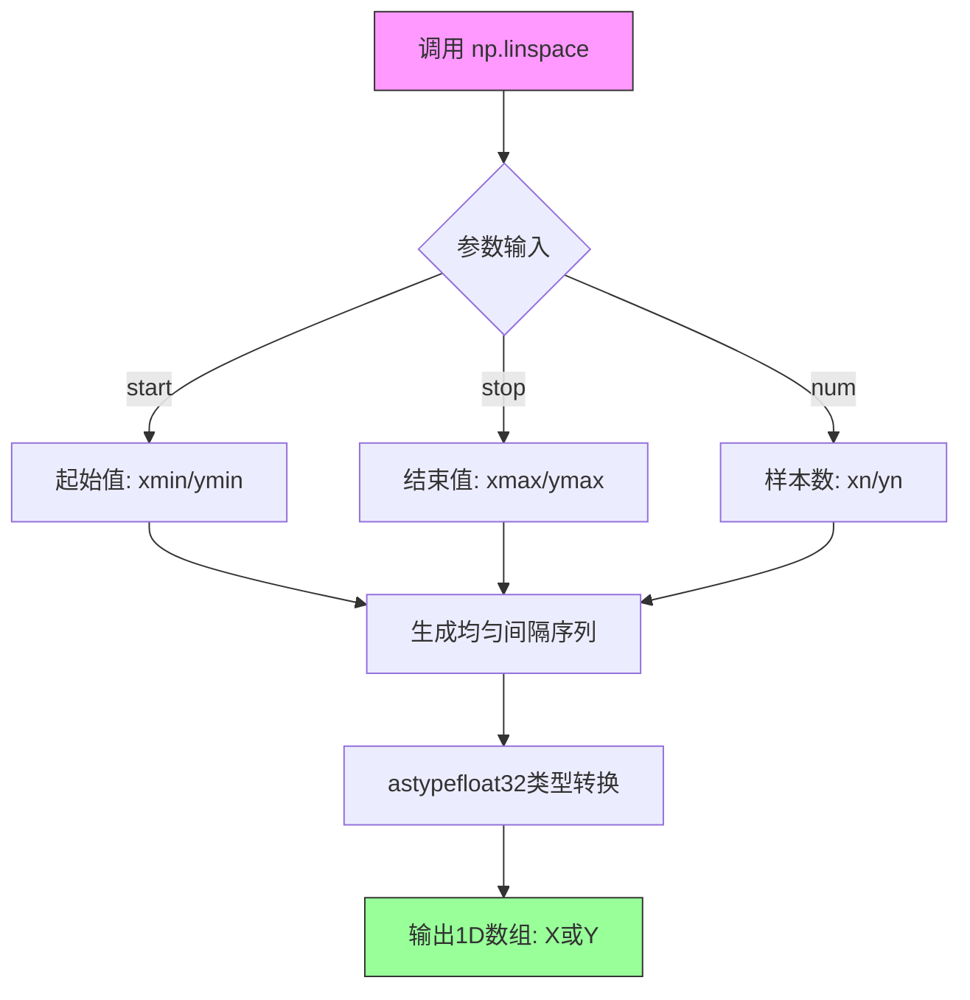

#### 带注释源码

```python
# np.linspace 在代码中的实际使用示例（位于 mandelbrot_set 函数内）:

# 生成 x 轴坐标数组：从 xmin 到 xmax，生成 xn 个均匀间隔的浮点32位数
X = np.linspace(xmin, xmax, xn).astype(np.float32)

# 参数说明：
# - xmin: 复平面 x 方向最小值（例如 -2.25）
# - xmax: 复平面 x 方向最大值（例如 +0.75）
# - xn:    x 方向采样点数量（例如 1500）
# - .astype(np.float32): 将默认的 float64 转换为 float32 以提高性能

# 生成 y 轴坐标数组：从 ymin 到 ymax，生成 yn 个均匀间隔的浮点32位数
Y = np.linspace(ymin, ymax, yn).astype(np.float32)

# 参数说明：
# - ymin: 复平面 y 方向最小值（例如 -1.25）
# - ymax: 复平面 y 方向最大值（例如 +1.25）
# - yn:   y 方向采样点数量（例如 1250）
# - .astype(np.float32): 转换为 float32 类型以节省内存和加速计算

# 后续通过 Y[:, None] * 1j 将 1D 数组 Y 转换为 2D 列向量
# 并与 X 形成网格，用于构建复数矩阵 C = X + Y*1j
```


### `np.zeros_like`

NumPy 库中的函数，用于创建一个与给定数组具有相同形状（shape）、数据类型（dtype）和内存布局的零数组，常用于初始化与输入数组结构相同的数组。

参数：

- `a`：`array_like`，输入数组，决定输出数组的形状和数据类型
- `dtype`：`data-type`，可选，覆盖结果的数据类型，默认值与输入数组相同
- `order`：`{'C', 'F', 'A', 'K'}`，可选，覆盖结果的内存布局（C行优先，F列优先，A任意，K保持原布局），默认值为 'K'
- `subok`：`bool`，可选，是否允许使用子类，默认值为 True
- `shape`：`tuple`，可选，覆盖结果的形状，默认值与输入数组相同

返回值：`ndarray`，与输入数组 `a` 具有相同形状和数据类型的零数组

#### 流程图

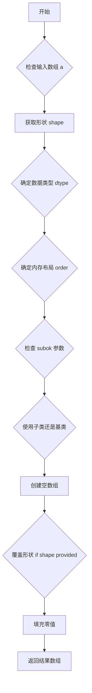

#### 带注释源码

```python
def zeros_like(a, dtype=None, order='K', subok=True, shape=None):
    """
    创建与给定数组形状和数据类型相同的零数组。
    
    参数:
        a: array_like - 输入数组
        dtype: data-type, optional - 覆盖结果的数据类型
        order: {'C', 'F', 'A', 'K'}, optional - 内存布局
        subok: bool, optional - 是否允许使用子类
        shape: tuple, optional - 覆盖结果的形状
    
    返回:
        ndarray - 零数组
    """
    # 获取输入数组的元数据
    res = empty_like(a, dtype=dtype, order=order, subok=subok, shape=shape)
    # 使用零填充数组
    res.fill(0)
    return res
```

#### 使用示例

在提供的 Mandelbrot 代码中，有两处使用场景：

```python
# 场景1：创建整数类型的迭代计数数组
N = np.zeros_like(C, dtype=int)  # 创建与C形状相同的整数零数组

# 场景2：创建复数类型的Z数组（用于迭代计算）
Z = np.zeros_like(C)  # 创建与C形状相同的复数零数组，默认dtype为complex
```

#### 关键组件信息

| 名称 | 描述 |
|------|------|
| `empty_like` | 底层函数，用于创建空数组 |
| `fill` | 用于填充零值的方法 |

#### 潜在技术债务或优化空间

1. **性能优化**：对于大规模数组，可考虑使用 `np.zeros` 配合显式形状参数，避免中间数组创建
2. **内存效率**：在 Mandelbrot 计算中，每次迭代都重新创建索引掩码，可考虑预分配策略

#### 其它说明

- 设计目标：提供与输入数组结构一致的零数组创建接口
- 错误处理：输入 `a` 必须为 array-like 对象，否则抛出 TypeError
- 外部依赖：NumPy 库


### `np.log2`

计算浮点数数组以 2 为底的对数

参数：

-  `x`：numpy.ndarray 或 scalar，输入值，必须为正数
  - 类型：`numpy.ndarray` 或 `float`
  - 描述：需要计算以 2 为底的对数的输入数组或标量值

返回值：`numpy.ndarray` 或 `float`，输入值的以 2 为底的对数
- 类型：`numpy.ndarray` 或 `float`

#### 流程图

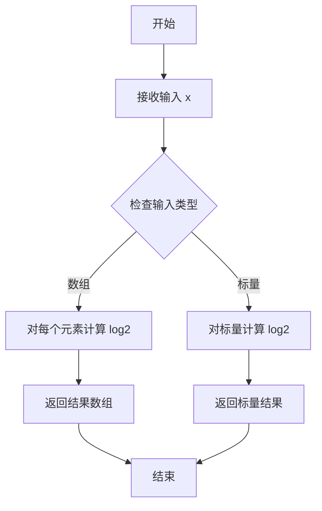

#### 带注释源码

```python
# 在本代码中的使用方式：
# 第一次使用：计算 horizon 的对数
log_horizon = np.log2(np.log(horizon))
# np.log(horizon) 先计算自然对数，然后 np.log2 计算以 2 为底的对数
# horizon 是一个很大的数 (2.0 ** 40)，用于确定逃逸半径

# 第二次使用：在归一化计数公式中
M = np.nan_to_num(N + 1 - np.log2(np.log(abs(Z))) + log_horizon)
# 这里 np.log(abs(Z)) 计算 Z 绝对值的自然对数
# np.log2(...) 计算以 2 为底的对数
# 用于平滑过渡的归一化计数，参考 Linas 的方法
```

---

### `np.log`

计算浮点数数组的自然对数（以 e 为底）

参数：

-  `x`：numpy.ndarray 或 scalar，输入值，必须为正数
  - 类型：`numpy.ndarray` 或 `float`
  - 描述：需要计算自然对数的输入数组或标量值

返回值：`numpy.ndarray` 或 `float`，输入值的自然对数
- 类型：`numpy.ndarray` 或 `float`

#### 流程图

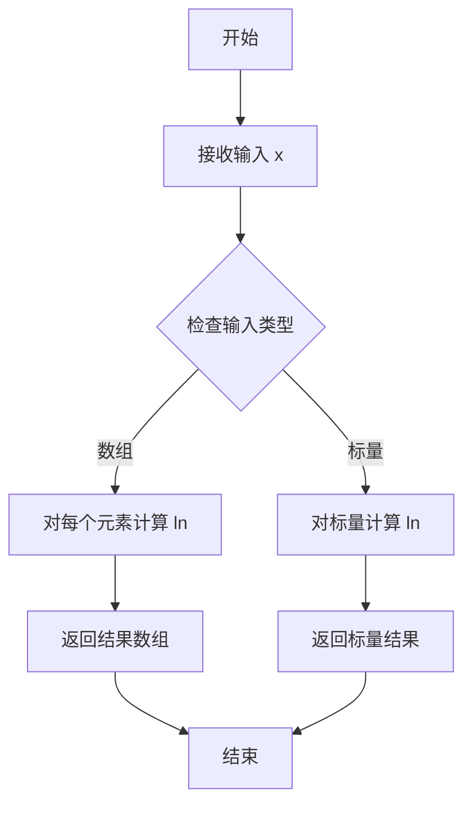

#### 带注释源码

```python
# 在本代码中的使用方式：
# 第一次使用：计算 horizon 的自然对数
log_horizon = np.log2(np.log(horizon))
# np.log(horizon) 计算 horizon = 2.0 ** 40 的自然对数
# 结果作为 np.log2 的输入

# 第二次使用：在归一化计数公式中
M = np.nan_to_num(N + 1 - np.log2(np.log(abs(Z))) + log_horizon)
# np.log(abs(Z)) 计算迭代值 Z 绝对值的自然对数
# 用于 Mandelbrot 集合的平滑着色算法
# 这里的归一化技术使得颜色过渡更加平滑
```

---

### 在 `mandelbrot_set` 函数上下文中的使用总结

这两个数学函数在代码中用于实现平滑着色的 Mandelbrot 集合渲染算法：

1. **计算 log_horizon**：预先计算逃逸半径的对数，用于归一化计数
2. **计算平滑着色因子**：对每个迭代点的模长取对数，实现连续的颜色过渡

这种技术消除了 Mandelbrot 集合渲染中的条纹效应（banding），提供了更平滑、更美观的视觉效果。


### `np.abs`

`np.abs` 是 NumPy 库中的绝对值函数，用于计算输入数组中每个元素的绝对值。对于复数输入，返回其模（magnitude），即复平面上该点到原点的欧几里得距离。

参数：

-  `x`：`array_like`，输入数组或标量，可以是整数、浮点数或复数
-  返回值：`ndarray` 或 `scalar`，返回输入数组中每个元素的绝对值。对于复数 `z = a + bj`，返回 `sqrt(a² + b²)`

#### 流程图

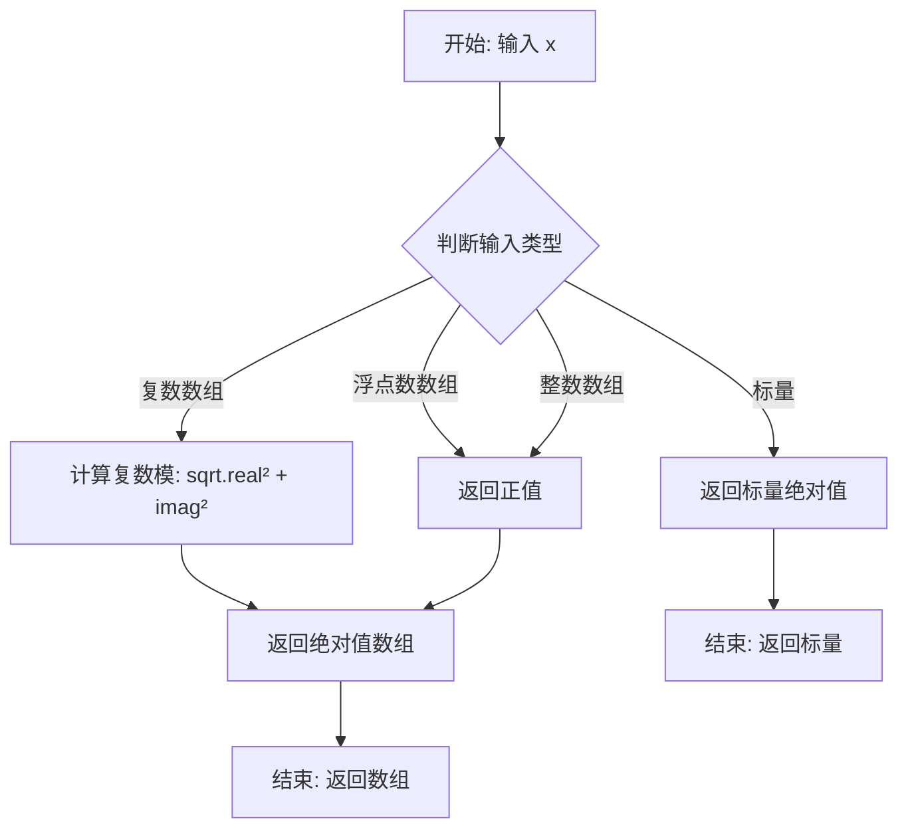

#### 带注释源码

```python
# 在 mandelbrot_set 函数中，np.abs 的使用方式：
# 这是一个隐式调用，实际调用的是 Python 内置的 abs() 函数
# 但当输入是 NumPy 数组时，abs() 会调用 np.abs()

I = abs(Z) < horizon  # 判断哪些点的模小于 horizon（逃逸阈值）
# Z 是复数数组（由 1j 构成），abs(Z) 计算每个复数的模（欧几里得距离）
# I 是一个布尔数组，标记哪些点还在迭代中（未逃逸）

# 在主程序中，同样使用了 abs(Z)：
M = np.nan_to_num(N + 1 - np.log2(np.log(abs(Z))) + log_horizon)
# 这里 abs(Z) 用于计算逃逸点的模值，用于平滑着色计算
# 平滑计数公式：N + 1 - log2(log|Z|) + log_horizon
```


### `np.nan_to_num`

将数组中的 NaN 替换为 0，将正无穷大替换为大的有限数，将负无穷大替换为小的有限数。在 Mandelbrot 渲染中用于处理 log 计算可能产生的无效值（如 log(0) 产生的 NaN 或溢出产生的 Inf）。

参数：

- `x`：`numpy.ndarray` 或标量，输入数组，包含可能包含 NaN、Inf 或 -Inf 的值
- `nan`：`float`，可选，用于替换 NaN 值的数值，默认为 0.0
- `posinf`：`float`，可选，用于替换正无穷大的数值，默认为数组 dtype 能表示的最大值
- `neginf`：`float`，可选，用于替换负无穷大的数值，默认为数组 dtype 能表示的最小值

返回值：`numpy.ndarray`，返回替换后的数组，其中所有 NaN 被替换为 nan，所有正无穷大被替换为 posinf，所有负无穷大被替换为 neginf

#### 流程图

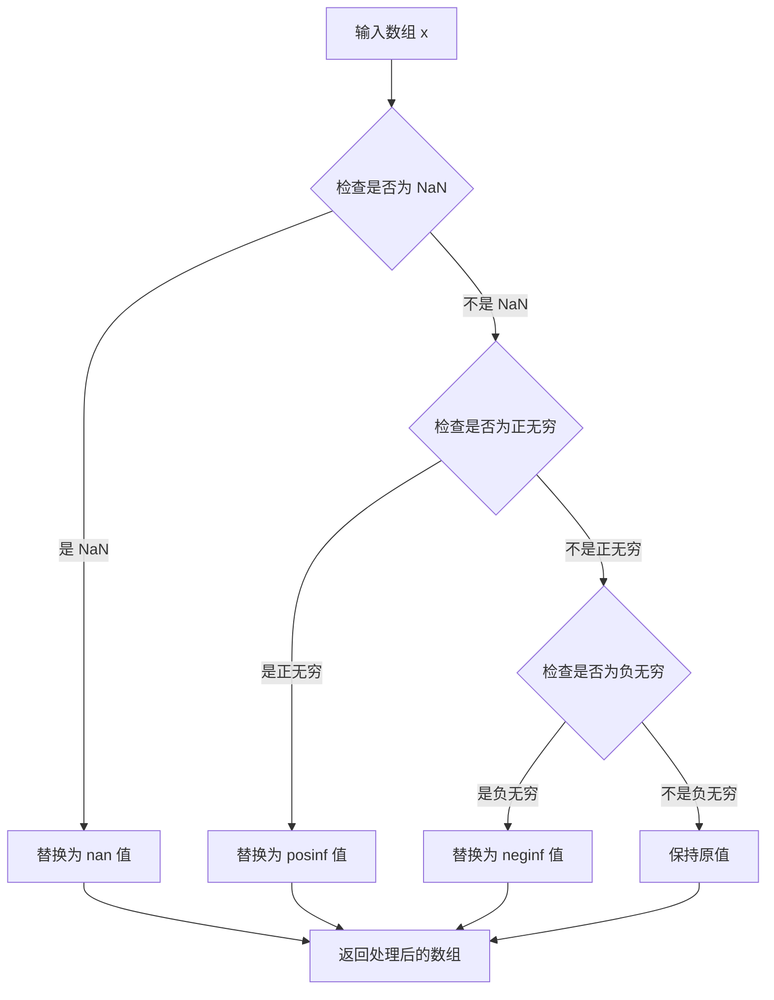

#### 带注释源码

```python
# np.nan_to_num 函数使用示例（来自 Mandelbrot 渲染代码）
# 处理 Mandelbrot 计算中产生的无效值

with np.errstate(invalid='ignore'):
    # 计算 M 值，涉及 log2(log(abs(Z)))
    # 当 Z 为 0 时，log(0) 会产生 -inf
    # 当 Z 溢出时，log 可能产生 inf
    M = np.nan_to_num(N + 1 - np.log2(np.log(abs(Z))) + log_horizon)

# 等价于手动处理：
# M = np.where(np.isnan(M), 0.0, M)
# M = np.where(np.isposinf(M), np.finfo(np.float64).max, M)
# M = np.where(np.isneginf(M), np.finfo(np.float64).min, M)
```


### `colors.LightSource`

`colors.LightSource` 是 matplotlib 库中用于生成带光照效果的着色数据的类，通过模拟光源的方位角和高度角来计算阴影和高光，从而增强数据可视化的立体感。

#### 构造函数参数

-  `azdeg`：`float`，方位角（azimuth angle），表示光源在水平方向上的角度，0度为正北，顺时针方向增加，默认值为 315（西北方向）
-  `altdeg`：`float`，高度角（altitude angle），表示光源与水平面的夹角，90度为正上方，默认值为 10（低角度光源，产生较长阴影）

#### 常用方法参数（以 `shade` 方法为例）

-  `data`：`ndarray`，需要着色的二维数据数组
-  `cmap`：`Colormap`，颜色映射对象（如 `plt.colormaps["hot"]`）
-  `vert_exag`：`float`，垂直夸张因子，用于增强地形或其他数据的起伏效果，默认值为 1.5
-  `norm`：`Normalize`，归一化对象（如 `colors.PowerNorm(0.3)`），用于对数据进行幂律归一化
-  `blend_mode`：`str`，混合模式，可选值包括 'hsv'、'soft'、'additive'、'clip' 等，默认值为 'hsv'

#### 返回值

- `shade` 方法返回：`ndarray`，经过光照处理和着色后的 RGB 图像数据，类型为 float32，范围在 [0, 1]

#### 流程图

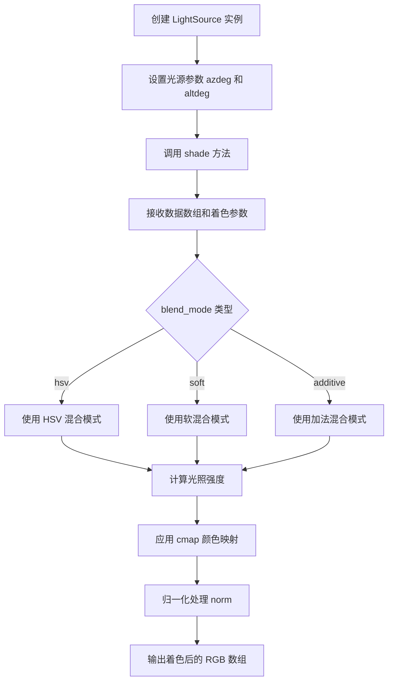

#### 带注释源码

```python
# colors.LightSource 类的典型实现结构（简化版）
# 实际源码位于 matplotlib/lib/matplotlib/colors.py

class LightSource:
    """
    创建一个光源对象用于计算阴影和光照效果
    
    该类通过模拟自然光照条件（方位角和高度角）来为二维数据
    （如地形高度图、分形图像等）添加立体感和深度效果
    """
    
    def __init__(self, azdeg=315, altdeg=45):
        """
        初始化光源参数
        
        参数:
            azdeg: 方位角，0-360度，默认为315度（西北方向）
            altdeg: 高度角，0-90度，默认为45度（中等高度）
        """
        # 将角度转换为弧度
        self.azdeg = azdeg
        self.altdeg = altdeg
        
    def shade(self, data, cmap, vert_exag=1.5, norm=None, blend_mode='hsv'):
        """
        对数据进行着色处理
        
        参数:
            data: ndarray - 输入的二维数据数组（可以是高度、迭代次数等）
            cmap: Colormap - matplotlib 颜色映射对象
            vert_exag: float - 垂直夸张因子，增强起伏效果
            norm: Normalize - 数据归一化对象（如 PowerNorm、Normalize）
            blend_mode: str - 颜色混合模式
            
        返回:
            ndarray - 着色后的 RGB 图像数据
        """
        # 步骤1: 计算梯度（坡度）
        # 使用有限差分法计算数据在x和y方向的梯度
        grad_x, grad_y = np.gradient(data * vert_exag)
        
        # 步骤2: 计算光照强度
        # 根据光源的方位角和高度角计算每个点的亮度
        shade = self._calc_shade(grad_x, grad_y)
        
        # 步骤3: 应用颜色映射
        # 将原始数据通过颜色映射转换为RGB
        rgb = cmap(norm(data))
        
        # 步骤4: 混合光照效果
        # 根据blend_mode将阴影与颜色混合
        if blend_mode == 'hsv':
            # HSV混合：保持色相不变，调整饱和度和值
            shaded_rgb = self._blend_hsv(rgb, shade)
        elif blend_mode == 'soft':
            # 软混合：柔和叠加
            shaded_rgb = self._blend_soft(rgb, shade)
        else:
            # 其他混合模式
            shaded_rgb = rgb * shade
            
        return np.clip(shaded_rgb, 0, 1)
    
    def _calc_shade(self, grad_x, grad_y):
        """
        计算基于梯度的阴影强度
        
        使用三角函数计算光照向量与表面法线的点积
        """
        # 光源方向向量
        az_rad = np.deg2rad(self.azdeg)
        alt_rad = np.deg2rad(self.altdeg)
        
        # 计算光源在x、y、z方向的分量
        light_vec = np.array([
            np.cos(az_rad) * np.cos(alt_rad),
            np.sin(az_rad) * np.cos(alt_rad),
            np.sin(alt_rad)
        ])
        
        # 假设z方向梯度为1（近似法线）
        # 计算光照强度（表面法线与光线方向的点积）
        shade = (light_vec[0] * grad_x + 
                 light_vec[1] * grad_y + 
                 light_vec[2]) / np.sqrt(1 + grad_x**2 + grad_y**2)
        
        # 归一化到 [0, 1]
        return (shade + 1) / 2
```

#### 关键组件信息

| 组件名称 | 功能描述 |
|---------|---------|
| `azdeg` | 方位角参数，控制光源在水平方向的位置 |
| `altdeg` | 高度角参数，控制光源在垂直方向的高度 |
| `shade()` | 核心方法，执行光照计算和颜色混合 |
| `_calc_shade()` | 私有方法，计算基于梯度的阴影强度 |
| `blend_mode` | 混合模式选择，影响最终着色效果 |
| `vert_exag` | 垂直夸张因子，增强数据的视觉起伏 |

#### 技术债务与优化空间

1. **性能优化**：梯度计算使用 `np.gradient`，对于超大图像可以考虑使用 scipy 的 Sobel 算子或 GPU 加速
2. **混合模式扩展**：当前 blend_mode 支持有限，可考虑添加更多艺术化混合模式
3. **内存效率**：对于大规模数据，shade 方法会创建多个中间数组，可考虑就地操作减少内存分配
4. **文档完善**：部分内部方法的文档字符串可以更加详细

#### 使用示例（在给定代码中）

```python
# 创建光源实例，方位角315度（西北方向），高度角10度（低角度）
light = colors.LightSource(azdeg=315, altdeg=10)

# 使用光源对着色后的Mandelbrot数据进行二次处理
M = light.shade(M,                          # 输入数据（归一化后的迭代次数）
                 cmap=plt.colormaps["hot"],  # 使用hot颜色映射
                 vert_exag=1.5,              # 垂直夸张1.5倍增强立体感
                 norm=colors.PowerNorm(0.3), # 幂律归一化(gamma=0.3)增强暗部细节
                 blend_mode='hsv')           # HSV混合模式产生彩虹般的光照效果
```


### colors.PowerNorm

`colors.PowerNorm` 是 matplotlib 库中的一个颜色归一化类，通过幂函数（power law）对数据进行归一化处理，常用于调整图像对比度或实现非线性颜色映射。在本代码中，它被用于增强 Mandelbrot 集合渲染的视觉效果，通过 gamma=0.3 的幂函数变换来调整颜色带的分布。

参数：

- `gamma`：`float`，幂函数的指数（gamma 值），用于控制对比度增强程度。值小于 1 会增强低亮度区域的对比度，值大于 1 会增强高亮度区域的对比度。
- `vmin`：`float`（可选），数据范围的最小值，默认为 None。
- `vmax`：`float`（可选），数据范围的最大值，默认为 None。
- `clip`：`bool`（可选），是否将超出范围的值裁剪到 [0, 1] 区间，默认为 False。

返回值：`colors.PowerNorm`，返回一个归一化对象，该对象实现了 `__call__` 方法，可接受数据数组并返回归一化后的值。

#### 流程图

```mermaid
graph TD
    A[输入数据 M] --> B[PowerNorm 实例化]
    B --> C{设置 vmin, vmax}
    C --> D[应用幂函数变换: normalized = value<sup>gamma</sup>]
    D --> E[可选: 裁剪到 [0, 1]]
    E --> F[返回归一化后的数据]
    
    G[colors.LightSource.shade 调用] --> H[传入 PowerNorm 对象]
    H --> I[使用归一化后的数据进行着色渲染]
    I --> J[生成最终图像]
```

#### 带注释源码

```python
# colors.PowerNorm 的使用示例（来自 provided code）

# 导入 matplotlib 的 colors 模块
from matplotlib import colors

# 创建 PowerNorm 实例，gamma=0.3
# 这将创建一个幂律归一化器，用于调整颜色映射的对比度
# gamma < 1 会增强暗部的可见性，使Mandelbrot集合的细节更清晰
norm = colors.PowerNorm(0.3)

# 在 LightSource.shade() 方法中使用
# 参数说明:
#   M: 原始 Mandelbrot 迭代计数数据
#   cmap='hot': 使用热力图色彩映射
#   vert_exag=1.5: 垂直 exaggeration 值，控制阴影强度
#   norm=colors.PowerNorm(0.3): 应用幂律归一化，gamma=0.3
#   blend_mode='hsv': 使用 HSV 混合模式进行着色
light = colors.LightSource(azdeg=315, altdeg=10)
M = light.shade(M, cmap=plt.colormaps["hot"], vert_exag=1.5,
                norm=colors.PowerNorm(0.3), blend_mode='hsv')

# PowerNorm 类的内部实现逻辑（简化版）
# class PowerNorm(colors.Normalize):
#     def __init__(self, gamma, vmin=None, vmax=None, clip=False):
#         self.gamma = gamma  # 存储 gamma 值
#         super().__init__(vmin, vmax, clip)  # 调用父类初始化
#     
#     def __call__(self, value, clip=None):
#         # 将值归一化到 [0, 1] 范围
#         result = super().__call__(value, clip)
#         # 应用幂函数: y = x^gamma
#         # 当 gamma=0.3 时，低值会被提升，高值被压缩
#         # 这增强了暗部细节的可见性
#         return np.power(result, self.gamma)
```

---

#### 补充说明

**设计目标与约束**：
- `PowerNorm` 的主要目的是实现非线性归一化，使得颜色映射能够更好地适应人眼对亮度变化的感知特性
- Gamma 值的选择直接影响渲染效果，0.3 是一个较激进的值，适用于 Mandelbrot 这类具有宽动态范围的数据

**外部依赖**：
- 依赖 matplotlib 的基类 `colors.Normalize`
- 依赖 numpy 库进行数值计算

**潜在优化空间**：
- 如果性能是关键考虑因素，可以考虑使用 numba 等 JIT 编译工具加速归一化计算
- 对于更大的图像，可以预先计算查找表（LUT）以减少实时计算开销


### `plt.figure`

创建并返回一个新的图形窗口（Figure对象）。

参数：

- `figsize`：`tuple of (float, float)`，图形的宽和高（英寸），例如`(width, height)`
- `dpi`：`int`，图形的分辨率（每英寸点数）
- `facecolor`：`color`，图形背景颜色
- `edgecolor`：`color`，图形边框颜色
- `frameon`：`bool`，是否显示图形的框架
- `num`：`int or str`，图形的编号或名称，如果已存在则激活该图形而不是创建新的
- `clear`：`bool`，如果为True且num指定的图形已存在，则清除该图形

返回值：`matplotlib.figure.Figure`，返回创建的图形对象

#### 流程图

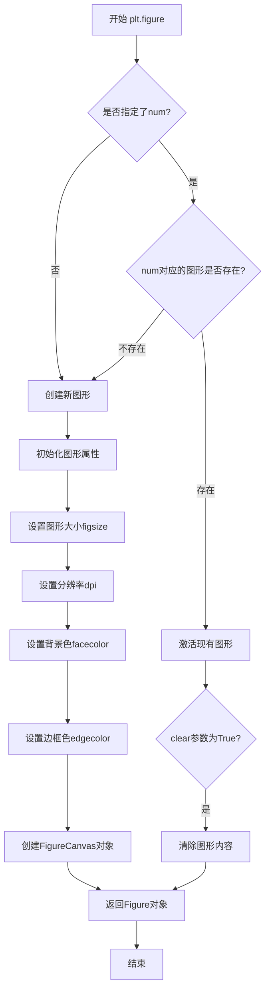

#### 带注释源码

```python
# plt.figure 源码示例（简化版）
def figure(figsize=None, dpi=None, facecolor=None, edgecolor=None, 
           frameon=True, num=None, clear=False, **kwargs):
    """
    创建一个新的图形窗口
    
    参数:
        figsize: 图形尺寸 (宽度, 高度)，单位英寸
        dpi: 每英寸点数，分辨率
        facecolor: 背景颜色
        edgecolor: 边框颜色
        frameon: 是否显示框架
        num: 图形编号或名称
        clear: 是否清除现有图形
    """
    # 获取全局图形管理器
    manager = _pylab_helpers.Gcf.get_fig_manager(num)
    
    if manager is None:
        # 创建新的图形管理器
        manager = new_figure_manager(num, *args, **kwargs)
    else:
        # 如果图形已存在且clear为True，则清除
        if clear:
            manager.canvas.draw_idle()
    
    # 返回Figure对象
    return manager.canvas.figure
```

---

### `plt.show`

显示所有打开的图形窗口，阻塞程序执行直到用户关闭所有图形。

参数：

- `block`：`bool`，是否阻塞调用。如果设置为True，则会阻塞主线程直到用户关闭所有图形窗口；如果是False，则可能立即返回（取决于后端）

返回值：`None`

#### 流程图

```mermaid
flowchart TD
    A[开始 plt.show] --> B[获取所有打开的图形管理器]
    B --> C[遍历所有图形窗口]
    C --> D{是否有更多图形?}
    D -->|是| E[显示当前图形]
    E --> F[调用show()方法]
    F --> G[是否block=True?]
    G -->|是| H[阻塞等待用户交互]
    G -->|否| I[继续执行]
    H --> J{用户是否关闭图形?}
    J -->|是| K[继续到下一个图形]
    J -->|否| H
    K --> D
    D -->|否| L[结束]
    I --> L
```

#### 带注释源码

```python
# plt.show 源码示例（简化版）
def show(block=None):
    """
    显示所有打开的图形窗口
    
    参数:
        block: 是否阻塞执行。
               - True: 阻塞直到所有图形窗口关闭
               - False: 非阻塞模式
               - None: 默认值，根据后端决定
    """
    # 获取所有活动的图形管理器
    managers = _pylab_helpers.Gcf.get_all_fig_managers()
    
    if not managers:
        # 没有打开的图形，直接返回
        return
    
    # 对于每个图形，调用其show()方法
    for manager in managers:
        # 强制图形重绘，确保内容是最新的
        manager.canvas.draw()
        # 调用后端的show方法
        manager.show()
    
    # 如果block为True或None（默认行为），则阻塞
    if block:
        # 进入事件循环，等待用户交互
        # 这通常会调用后端的mainloop
        import matplotlib._pylab_helpers as _pylab_helpers
        # 等待所有图形关闭
        for manager in managers:
            manager._show = True
        # 进入阻塞状态
        import matplotlib.pyplot as plt
        plt._pylab_helpers.Gcf.block(True)
```

---

### 在用户代码中的实际使用

用户代码中`plt.figure`和`plt.show`的实际使用示例：

```python
# 创建图形
# 参数：figsize=(width, height) - 图形尺寸，dpi=dpi - 分辨率
fig = plt.figure(figsize=(width, height), dpi=dpi)

# ... 添加坐标轴和绘制内容 ...

# 显示图形
plt.show()  # 阻塞执行，等待用户关闭图形窗口
```


### `Figure.add_axes`

向当前图形（Figure）添加一个 Axes（坐标轴）对象。该方法是 matplotlib 中创建子图的核心方法之一，用于在图形中创建一个新的坐标系，并返回对应的 Axes 对象供后续绘图操作使用。

#### 参数

- `rect`：`list` 或 `tuple` of 4 elements，指定 Axes 在图形中的位置，格式为 `[left, bottom, width, height]`，其中各值表示相对于图形宽高的比例（0 到 1 之间的浮点数）。
- `polar`：`bool`（可选），指定是否使用极坐标投影，默认为 `False`。
- `projection`：`str` 或 `None`（可选），指定坐标轴的投影类型（如 `'3d'`、`'aitoff'` 等），默认为 `None`（标准 2D 投影）。
- `label`：`str`（可选），Axes 的标识符，用于图例引用。
- `xscale`：`str`（可选），X 轴的缩放类型（如 `'linear'`、`'log'`）。
- `yscale`：`str`（可选），Y 轴的缩放类型（如 `'linear'`、`'log'`）。

#### 返回值

- `axes`：`matplotlib.axes.Axes`，返回新创建的 Axes 对象，后续可调用 `imshow()`、`plot()`、`set_xticks()` 等方法进行数据可视化。

#### 流程图

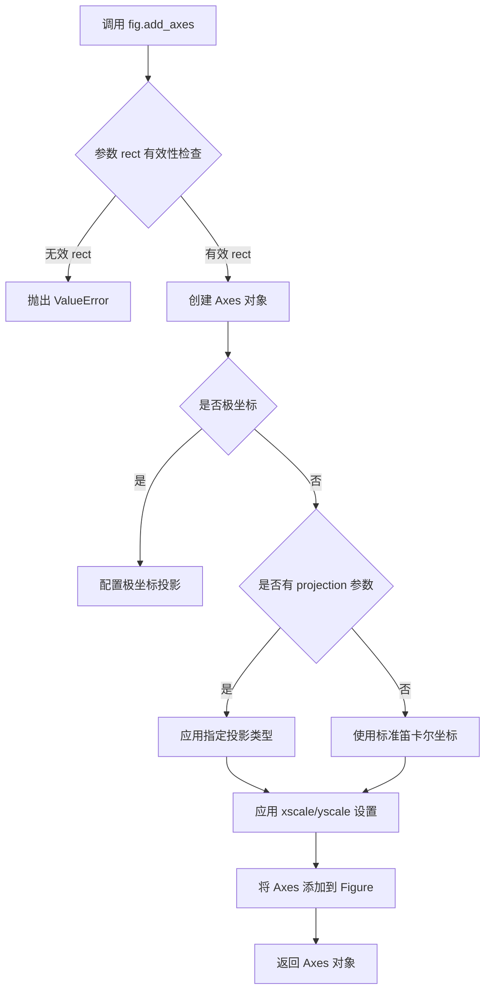

#### 带注释源码

```python
# 代码示例来源：Mandelbrot 渲染示例
# 创建一个图形对象，设置尺寸为 10x10 英寸，DPI 为 72
fig = plt.figure(figsize=(width, height), dpi=dpi)

# 调用 add_axes 方法添加坐标轴
# 参数 (0, 0, 1, 1) 表示：
#   - left = 0:   左边距为图形宽度的 0%
#   - bottom = 0: 底边距为图形高度的 0%
#   - width = 1:  宽度占图形宽度的 100%
#   - height = 1: 高度占图形高度的 100%
# frameon=False: 不显示坐标轴边框
# aspect=1:      保持 1:1 的宽高比
ax = fig.add_axes((0, 0, 1, 1), frameon=False, aspect=1)

# 后续使用返回的 ax 对象进行图像渲染
# 使用 LightSource 进行着色处理
light = colors.LightSource(azdeg=315, altdeg=10)
M = light.shade(M, cmap=plt.colormaps["hot"], vert_exag=1.5,
                norm=colors.PowerNorm(0.3), blend_mode='hsv')
# 显示处理后的图像
ax.imshow(M, extent=[xmin, xmax, ymin, ymax], interpolation="bicubic")
# 移除刻度线
ax.set_xticks([])
ax.set_yticks([])
```


### `matplotlib.axes.Axes.imshow`

该方法用于在Axes上显示图像或二维数据数组，是Mandelbrot集合可视化渲染的核心组件，负责将处理后的图像数据渲染到图形区域。

参数：

- `X`：`<class 'array-like'>`，要显示的图像数据，可以是2D数组（灰度）或3D数组（RGB/RGBA）
- `cmap`：`<class 'str' or <class 'Colormap'>>`，可选，颜色映射名称或Colormap对象，默认为None
- `norm`：`<class 'Normalize'>`，可选，用于将数据值映射到颜色空间的Normalize实例，此处使用PowerNorm(0.3)实现幂律归一化
- `aspect`：`<class 'float' or 'auto'>`，可选，控制Axes的纵横比，此处设为1保持正方形比例
- `interpolation`：`<class 'str'>`，可选，图像插值方法，此处使用"bicubic"实现平滑渲染
- `alpha`：`<class 'float'>`，可选，图像透明度，值为0.0到1.0之间
- `vmin, vmax`：`<class 'float'>`，可选，颜色映射的最小值和最大值
- `origin`：`<class 'str'>`，可选，图像原点位置 ('upper' 或 'lower')
- `extent`：`<class 'list' or <class 'tuple'>>`可选，数据坐标范围 [xmin, xmax, ymin, ymax]，用于将图像映射到实际坐标系
- `resample`：`<class 'bool'>`，可选，是否重采样图像
- `filterrad`：`<class 'float'>`，可选，重采样滤波器的半径

返回值：`<class 'matplotlib.image.AxesImage'>`，返回AxesImage对象，可用于进一步操作（如添加颜色条）

#### 流程图

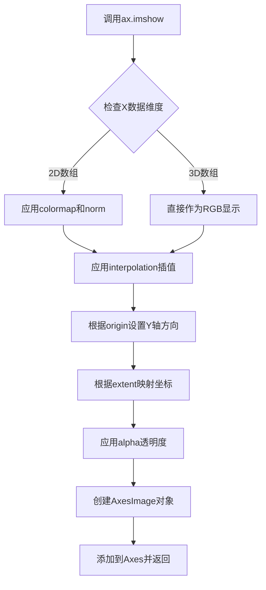

#### 带注释源码

```python
# 在main函数中调用ax.imshow的源码
# 参数说明：
# M: 经过LightSource.shade()处理后的阴影渲染图像数据，形状为(yn, xn, 4)的RGBA数组
# extent: [xmin, xmax, ymin, ymax] 将图像坐标映射到Mandelbrot集合的实际复平面坐标
# interpolation: "bicubic" 使用双三次插值实现高质量平滑渲染，避免锯齿效应
ax.imshow(M,                    # 输入图像数据：经过着色和幂律归一化处理的Mandelbrot集合图像
          extent=[xmin, xmax, ymin, ymax],  # 图像的坐标范围，对应复平面区间
          interpolation="bicubic")  # 插值方法，bicubic提供平滑的放大效果
```

---

### `matplotlib.axes.Axes.text`

该方法用于在Axes的指定位置添加文本标签，是可视化中添加标题、注释和元信息的标准方式，在此示例中用于显示matplotlib版本信息和项目URL。

参数：

- `x`：`<class 'float'>`，文本插入的X坐标，此处为xmin+0.025
- `y`：`<class 'float'>`，文本插入的Y坐标，此处为ymin+0.025
- `s`：`<class 'str'>`，要显示的文本字符串内容
- `fontdict`：`<class 'dict'>`，可选，字体属性字典
- `color`：`<class 'str' or <class 'tuple'>>`，可选，文本颜色，此处设为"white"
- `fontsize`：`<class 'float'>`，可选，字体大小，此处设为12
- `alpha`：`<class 'float'>`，可选，文本透明度，此处设为0.5实现半透明效果
- `fontfamily`：`<class 'str'>`，可选，字体系列
- `fontstyle`：`<class 'str'>`，可选，字体样式 ('normal', 'italic', 'oblique')
- `fontweight`：`<class 'str' or <class 'int'>>`，可选，字体粗细
- `horizontalalignment`：`<class 'str'>`，可选，水平对齐方式 ('center', 'left', 'right')
- `verticalalignment`：`<class 'str'>`，可选，垂直对齐方式 ('center', 'top', 'bottom')
- `rotation`：`<class 'float'>`，可选，文本旋转角度
- `linespacing`：`<class 'float'>`，可选，行间距

返回值：`<class 'matplotlib.text.Text'>`，返回Text对象，可用于后续文本样式和位置调整

#### 流程图

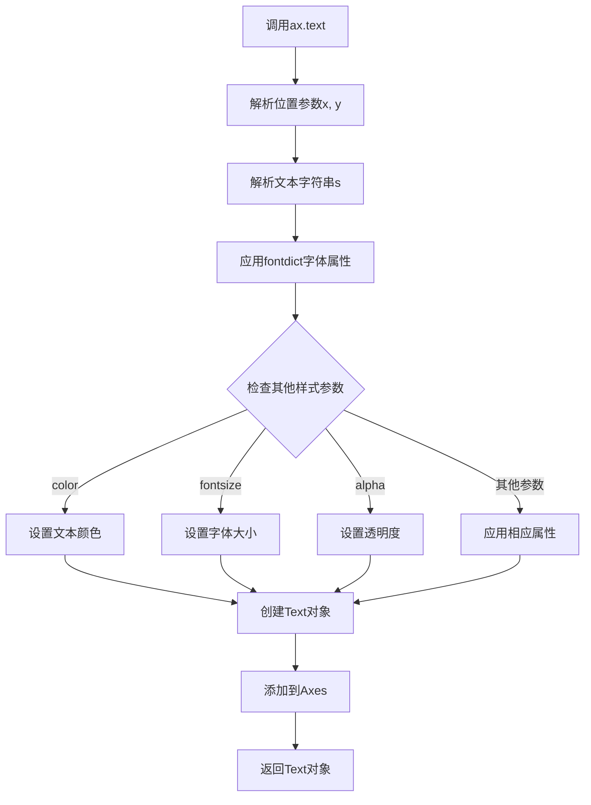

#### 带注释源码

```python
# 在main函数中调用ax.text的源码
# 参数说明：
# xmin+.025, ymin+.025: 文本位置，位于图像左下角，留有边距避免贴近边界
# text: 要显示的文本内容，包含Mandelbrot集合渲染器和matplotlib版本信息
# color: "white" 白色文字在深色背景上形成良好对比
# fontsize: 12 适中字体大小，不过分抢眼
# alpha: 0.5 半透明效果，让文本不会完全遮挡下方图像细节
ax.text(xmin+.025,             # X坐标：图像左边界向右偏移0.025
        ymin+.025,             # Y坐标：图像下边界向上偏移0.025
        text,                  # s: 文本内容，包含Mandelbrot集合标题、matplotlib版本和当前年份
        color="white",         # color: 文本颜色设为白色，与hot colormap的深色背景形成对比
        fontsize=12,           # fontsize: 字体大小12磅，适中显示
        alpha=0.5)             # alpha: 透明度0.5，半透明显示以免完全遮挡底层图像细节
```


### `time.strftime`

`time.strftime` 是 Python 标准库 `time` 模块中的函数，用于将时间元组格式化为可读字符串，在本代码中用于获取当前年份以便在图表上显示渲染时间信息。

参数：

- `format`：`str`，格式字符串，指定输出时间的格式（如 `"%Y"` 表示四位数年份）
- `t`：`time.struct_time`，可选参数，默认值为本地时间的时间元组

返回值：`str`，返回格式化后的时间字符串

#### 流程图

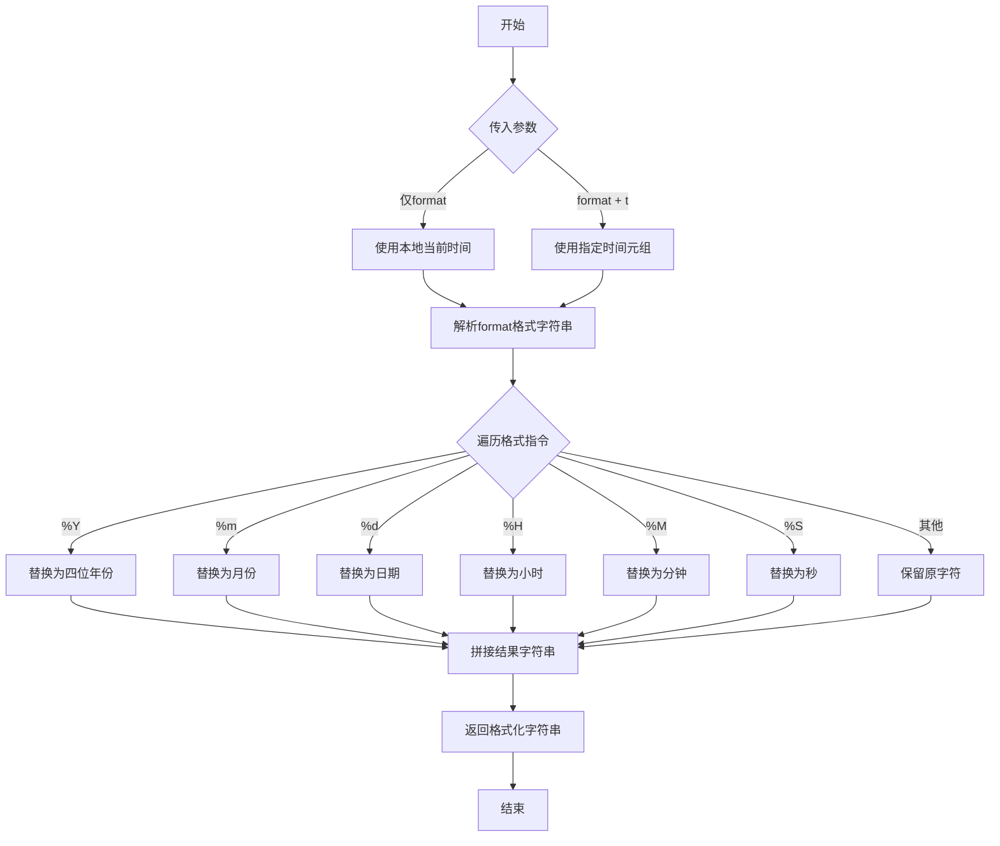

#### 带注释源码

```python
def strftime(format, t=None):
    """
    格式化时间元组为字符串
    
    参数:
        format: 格式字符串，支持以下指令:
            %Y  - 四位年份 (如 2024)
            %m  - 月份 (01-12)
            %d  - 日期 (01-31)
            %H  - 小时 (00-23)
            %M  - 分钟 (00-59)
            %S  - 秒 (00-59)
            等等...
        t: 可选的time.struct_time对象，默认为当前本地时间
    
    返回:
        格式化后的时间字符串
    """
    # 如果未提供时间参数，获取本地当前时间
    if t is None:
        t = localtime()  # 获取本地时间元组
    
    # 解析格式字符串并替换为对应的时间值
    # 在本代码中的用法:
    # year = time.strftime("%Y")
    # 结果: year = "2024" (当前年份)
    
    return result_string  # 返回格式化后的字符串
```

#### 在本项目中的实际使用

```python
# 代码第68行
year = time.strftime("%Y")
# 获取当前年份用于图表标注
# 返回值示例: "2024"
```

---

### 补充信息

#### 关键组件信息

- **time 模块**：Python 标准库时间处理模块
- **strftime 函数**：时间格式化函数，将时间结构转换为字符串

#### 潜在的技术债务或优化空间

- 本代码中 `time.strftime` 的使用非常简单，无明显技术债务

#### 其它项目

- **设计目标**：在 Mandelbrot 渲染图上显示 matplotlib 版本和渲染年份
- **错误处理**：如传入非法格式字符串，会抛出 `ValueError` 异常
- **外部依赖**：依赖 Python 标准库 `time` 模块，无额外依赖

## 关键组件


### 张量索引与惰性加载

代码使用布尔索引 `I = abs(Z) < horizon` 实现惰性加载策略，仅对尚未逃逸的点进行迭代计算，避免重复计算已确定发散的点，显著提升计算效率。

### 反量化支持

通过 `np.nan_to_num(N + 1 - np.log2(np.log(abs(Z))) + log_horizon)` 处理反量化，将NaN和Inf值转换为有效数值，确保后续渲染流程的数值稳定性。

### 量化策略

使用 `colors.PowerNorm(0.3)` 实现幂律归一化（gamma=0.3），将Mandelbrot集合的迭代计数映射到可视化色彩空间，增强图像的对比度和视觉层次。

### 光照渲染

通过 `colors.LightSource(azdeg=315, altdeg=10)` 创建光源对象，结合 `blend_mode='hsv'` 和 `vert_exag=1.5` 参数实现凹凸贴图光照效果，增强 fractal 的三维视觉感知。

### 平滑着色算法

采用 normalized recount 技术（参考 Linas 的平滑着色算法），通过 `N + 1 - np.log2(np.log(abs(Z))) + log_horizon` 公式消除迭代计数的离散锯齿，实现从离散到连续的颜色过渡。

### 逃逸时间算法

核心 Mandelbrot 迭代计算 `Z[I] = Z[I]**2 + C[I]`，通过复数平方迭代判断点是否属于集合，配合 horizon 阈值确定逃逸边界。


## 问题及建议


### 已知问题

- **性能瓶颈**：使用纯Python循环 `for n in range(maxiter)` 进行迭代计算，没有利用NumPy向量化操作或并行计算（如Numba、Cython、GPU加速），在大分辨率下运行缓慢
- **内存效率低**：创建了多个大型数组（C, N, Z），未采用原地操作或内存映射技术，3000x2500的分辨率下内存占用较高
- **数值精度风险**：使用 `np.float32` 进行计算，复数迭代可能累积精度损失，建议根据实际需求评估是否需要 float64
- **错误处理不完善**：主程序中 `np.log2(np.log(abs(Z)))` 在某些边界情况下可能产生 NaN 或警告，虽然使用了 `np.errstate` 和 `nan_to_num`，但逻辑不够健壮
- **代码组织混乱**：核心计算函数 `mandelbrot_set` 与可视化代码、 advertisement 文本混合在 `__main__` 块中，缺乏清晰的分层架构
- **缺乏参数验证**：函数入口没有对输入参数（xmin, xmax, ymin, ymax, xn, yn, maxiter）进行合法性校验，可能导致运行时错误或不可预测结果
- **魔法数字与硬编码**：horizon=2.0**40、log_horizon 的计算逻辑、shading 参数（azdeg=315, altdeg=10）等关键数值缺少注释和配置化
- **可维护性差**：没有类型注解、缺少函数文档字符串（docstring），后续扩展困难

### 优化建议

- **性能优化**：使用 Numba JIT 编译或 Cython 重写核心迭代循环，或引入 numexpr 加速表达式计算；考虑分块计算和内存映射处理超大图像
- **向量化重构**：消除 Python 循环，改用完全向量化的迭代实现（如基于 mask 的迭代），大幅提升计算效率
- **内存优化**：使用 `np.float32` 配合原地操作（in-place operation），或考虑生成器/分块处理模式减少峰值内存
- **代码重构**：将 `mandelbrot_set` 函数独立到专用模块，可视化逻辑封装为独立函数，配置参数提取为配置文件或命令行参数
- **健壮性增强**：添加输入参数校验（如 xmin < xmax, xn > 0），改进 NaN/Inf 处理逻辑，添加详细的异常抛出和日志
- **可维护性提升**：添加类型注解（typing）、完整的 docstring、关键计算步骤的注释，提取魔法数字为具名常量
- **扩展性设计**：支持自定义 colormap、着色算法、迭代终止条件，提供回调机制支持实时进度展示

## 其它


### 设计目标与约束

本代码旨在实现Mandelbrot集合的高质量渲染，通过normalized recount技术和power normalized colormap (gamma=0.3)提升视觉效果，并结合 shading 技术增强立体感。设计约束包括：计算精度由maxiter参数控制（默认200），渲染分辨率基于xn和yn参数（默认1500x1250），必须使用numpy进行向量化计算以保证性能，渲染结果通过matplotlib展示。

### 错误处理与异常设计

代码在以下场景进行错误处理：
1. **数值警告处理**：使用`np.errstate(invalid='ignore')`忽略对null值计算log时产生的无效值警告，后续通过`np.nan_to_num`处理
2. **除零保护**：在normalized recount计算中，log2(log(abs(Z)))可能产生-inf值，通过nan_to_num转换为有限数值
3. **参数边界检查**：未在函数内部进行参数有效性检查，调用者需保证xmin<xmax, ymin<ymax, xn>0, yn>0, maxiter>0
4. **图形渲染异常**：plt.show()可能因无显示环境失败，此为运行时环境问题

### 数据流与状态机

**数据输入流**：
- 原始参数：xmin, xmax, ymin, ymax, xn, yn, maxiter, horizon
- 生成网格：X (float32数组, shape[xn]), Y (float32数组, shape[yn])
- 复数网格：C = X + Y[:, None] * 1j (shape[yn, xn])

**核心计算状态机**：
- 初始化状态：Z = 0, N = 0
- 迭代状态：对n in [0, maxiter)，执行Z = Z² + C，记录逃逸时间
- 终止状态：达到maxiter或所有点逃逸

**渲染数据流**：
- N (逃逸次数) → M (normalized值) → shade处理 → RGB图像 → 显示

### 外部依赖与接口契约

**必需依赖**：
- `numpy` - 数值计算核心库
- `matplotlib` - 绘图和可视化
- `matplotlib.colors` - 颜色映射和LightSource

**模块级接口**：
- `mandelbrot_set(xmin, xmax, ymin, ymax, xn, yn, maxiter, horizon=2.0)` → 返回(Z, N)元组
- Z: 最终迭代值（复数数组），N: 逃逸次数（整型数组）

**主程序接口**：
- 无命令行参数接口
- 配置参数硬编码在if __name__ == '__main__'块中

### 算法复杂度分析

**时间复杂度**：
- 网格生成：O(xn * yn)
- Mandelbrot迭代：O(xn * yn * maxiter)，最坏情况O(3000*2500*200) ≈ 1.5×10⁹次基本运算
- 归一化处理：O(xn * yn)
- 着色渲染：O(xn * yn)

**空间复杂度**：
- C, Z, N数组：各需xn*yn个元素
- float32: 4字节，int: 4字节
- 峰值内存：3 * 1500 * 1250 * 4 ≈ 22.5MB + 开销

### 性能优化空间

1. **Numba/JIT编译**：可使用@jit装饰器加速核心循环
2. **GPU加速**：使用CUDA或OpenCL将迭代计算移至GPU
3. **早停优化**：当前实现对所有点执行完整maxiter迭代，可记录已逃逸点并跳过
4. **分块渲染**：对大图像进行分块计算以提高缓存局部性
5. **向量化改进**：当前使用Python循环，可探索完全向量化实现

### 参数配置说明

| 参数 | 类型 | 默认值 | 说明 |
|------|------|--------|------|
| xmin, xmax | float | -2.25, 0.75 | 复平面实部范围 |
| ymin, ymax | float | -1.25, 1.25 | 复平面虚部范围 |
| xn, yn | int | 1500, 1250 | 网格分辨率 |
| maxiter | int | 200 | 最大迭代次数 |
| horizon | float | 2.0 | 逃逸半径（主程序用2^40） |
| log_horizon | float | 计算值 | log₂(log(horizon))用于平滑 |

### 可视化渲染流程

1. 创建Figure和Axes，设置尺寸和DPI
2. 初始化LightSource（方位角315°，高度角10°）
3. 应用PowerNorm(gamma=0.3)进行功率归一化
4. 使用'hot' colormap和'hsv'混合模式执行shade
5. 使用bicubic插值显示图像
6. 添加元数据文本标注

### 数值稳定性考虑

1. **log(0)防护**：abs(Z)可能为0，log(0)产生-inf，已通过nan_to_num处理
2. **溢出处理**：Z在迭代中可能溢出变为inf，abs(Z)仍能正确判断
3. **浮点精度**：使用float32（而非float64）可能在边界情况下引入误差
4. **NaN传播**：迭代过程中不产生NaN，仅在后续计算中可能产生

    