# `matplotlib\galleries\examples\showcase\pan_zoom_overlap.py` 详细设计文档

这是一个 Matplotlib 示例代码，演示了重叠坐标轴（axes）的平移/缩放事件处理机制，展示了如何通过 patch 可见性和 set_forward_navigation_events 方法来控制导航事件的捕获或转发行为。

## 整体流程

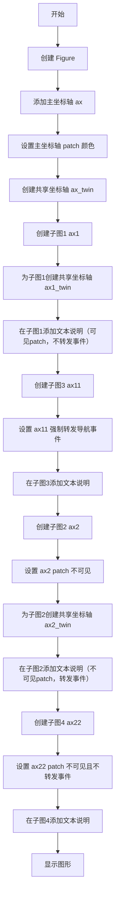

## 类结构

```
Figure (Matplotlib 根容器)
└── Axes (坐标轴组件)
    ├── ax (主坐标轴)
    ├── ax_twin (共享y轴的坐标轴)
    ├── ax1 (子图1)
    ├── ax1_twin (子图1的共享y轴)
    ├── ax11 (子图3)
    ├── ax2 (子图2)
    ├── ax2_twin (子图2的共享y轴)
    └── ax22 (子图4)
```

## 全局变量及字段


### `fig`
    
matplotlib图形对象，作为所有子图和轴的容器

类型：`matplotlib.figure.Figure`
    


### `ax`
    
主轴对象，覆盖图形大部分区域，用于展示平移/缩放事件的默认行为

类型：`matplotlib.axes.Axes`
    


### `ax_twin`
    
ax的共享y轴副本，用于展示双Y轴图表

类型：`matplotlib.axes.Axes`
    


### `ax1`
    
第一个子图(2x2布局)的轴，patch可见，捕获平移/缩放事件

类型：`matplotlib.axes.Axes`
    


### `ax1_twin`
    
ax1的共享y轴副本

类型：`matplotlib.axes.Axes`
    


### `ax11`
    
共享ax1的子图，通过set_forward_navigation_events(True)演示事件转发行为

类型：`matplotlib.axes.Axes`
    


### `ax2`
    
第二个子图的轴，patch不可见，将平移/缩放事件转发给下方轴

类型：`matplotlib.axes.Axes`
    


### `ax2_twin`
    
ax2的共享y轴副本

类型：`matplotlib.axes.Axes`
    


### `ax22`
    
共享ax2的子图，通过set_forward_navigation_events(False)演示覆盖默认行为

类型：`matplotlib.axes.Axes`
    


    

## 全局函数及方法


### `plt.figure`

创建并返回一个新的matplotlib Figure对象，用于绑定到当前图形或创建新图形。

参数：

- `figsize`：`tuple`，Figure的宽和高（英寸），例如(11, 6)表示宽度11英寸、高度6英寸
- `**kwargs`：其他关键字参数，如dpi、facecolor、frameon等，用于配置Figure的其他属性

返回值：`matplotlib.figure.Figure`，返回创建的Figure对象

#### 流程图

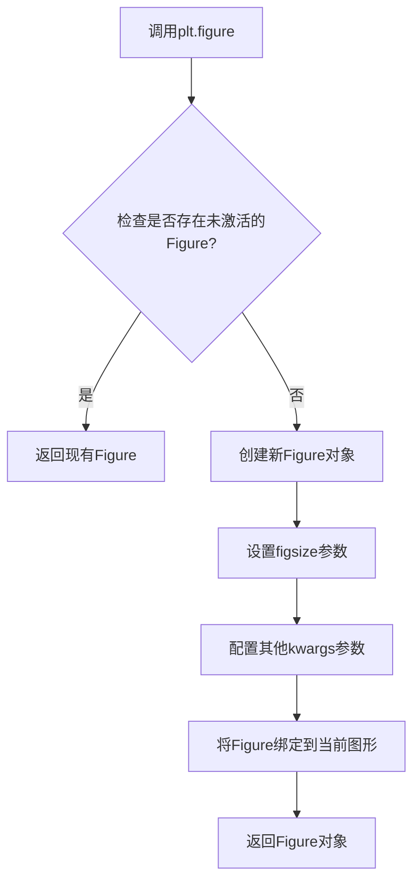

#### 带注释源码

```python
# 导入matplotlib.pyplot模块
import matplotlib.pyplot as plt

# 调用figure函数创建新图形
# figsize参数指定图形大小为宽11英寸、高6英寸
fig = plt.figure(figsize=(11, 6))

# 设置图形的总标题
fig.suptitle("Showcase for pan/zoom events on overlapping axes.")

# 使用add_axes方法在图形中添加Axes对象
# 参数(left, bottom, width, height)为归一化坐标
ax = fig.add_axes((.05, .05, .9, .9))

# 设置Axes的patch颜色为灰色(.75)
ax.patch.set_color(".75")

# 创建共享x轴的第二个Axes
ax_twin = ax.twinx()

# ...后续代码继续在figure中添加更多子图...
```


### `Figure.suptitle`（或 `fig.suptitle`）

该函数用于在 Figure（图形）对象的顶部中央添加一个总标题（super title），通常用于为整个图形窗口设置主标题，支持自定义字体大小、颜色、对齐方式等文本属性。

参数：

- `s`：str，需要显示的标题文本内容
- `fontsize`：int 或 float（可选），标题文字的大小，默认为 rcParams 中设置的值
- `weight`：str（可选），标题文字的粗细程度，如 'normal'、'bold' 等
- `color`：str（可选），标题文字的颜色，支持颜色名称或十六进制颜色码
- `horizontalalignment` 或 `ha`：str（可选），水平对齐方式，可选 'center'、'left'、'right'，默认为 'center'
- `verticalalignment` 或 `va`：str（可选），垂直对齐方式，可选 'center'、'top'、'bottom'，默认为 'center'
- `x`：float（可选），标题的 x 坐标位置（相对于图形宽度的比例），默认为 0.5（居中）
- `y`：float（可选），标题的 y 坐标位置（相对于图形高度的比例），默认为 0.98（顶部）
- `**kwargs`：dict（可选），其他传递给 matplotlib.text.Text 对象的参数，如 fontfamily、fontstyle、rotation 等

返回值：matplotlib.text.Text，返回创建的文本对象，可用于后续对标题样式的进一步修改

#### 流程图

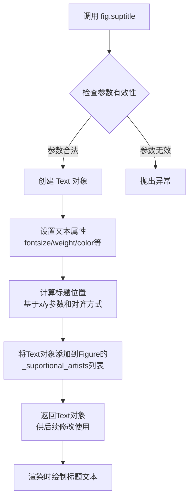

#### 带注释源码

```python
# 调用示例
fig = plt.figure(figsize=(11, 6))  # 创建图形对象，设置尺寸为宽11英寸、高6英寸
# 为整个图形添加总标题
fig.suptitle("Showcase for pan/zoom events on overlapping axes.")

# 完整的函数调用形式（包含多个可选参数）
fig.suptitle(
    s="Showcase for pan/zoom events on overlapping axes.",  # 必需的标题文本参数
    fontsize=16,              # 设置标题字体大小为16
    fontweight='bold',        # 设置标题为粗体
    color='black',            # 设置标题颜色为黑色
    horizontalalignment='center',  # 水平居中对齐
    verticalalignment='center',     # 垂直居中对齐
    x=0.5,                    # x位置为图形宽度的50%处
    y=0.98,                   # y位置为图形高度的98%处（接近顶部）
    rotation=0,               # 文本旋转角度为0度
    linespacing=1.2           # 行间距倍数
)

# 返回的Text对象可以用于后续操作
title_obj = fig.suptitle("示例标题")
title_obj.set_fontsize(20)    # 动态修改字体大小
title_obj.set_color('red')    # 动态修改颜色
```


### `Figure.add_axes`

在 matplotlib 中，`add_axes` 方法用于向图形（Figure）添加一个新的坐标轴（Axes），该方法接收一个位置和尺寸元组作为参数，并返回新创建的 Axes 对象。

参数：

- `rect`：`tuple`，一个由四个浮点数组成的元组 `(left, bottom, width, height)`，表示新 Axes 在 Figure 中的位置和尺寸。`left` 和 `bottom` 是从 figure 左下角开始的坐标（相对于 figure 的宽度和高度），`width` 和 `height` 是 axes 的宽度和高度（也是相对于 figure 的宽度和高度）。取值范围通常在 0 到 1 之间。

返回值：`matplotlib.axes.Axes`，新创建并添加到 Figure 中的 Axes 对象。

#### 流程图

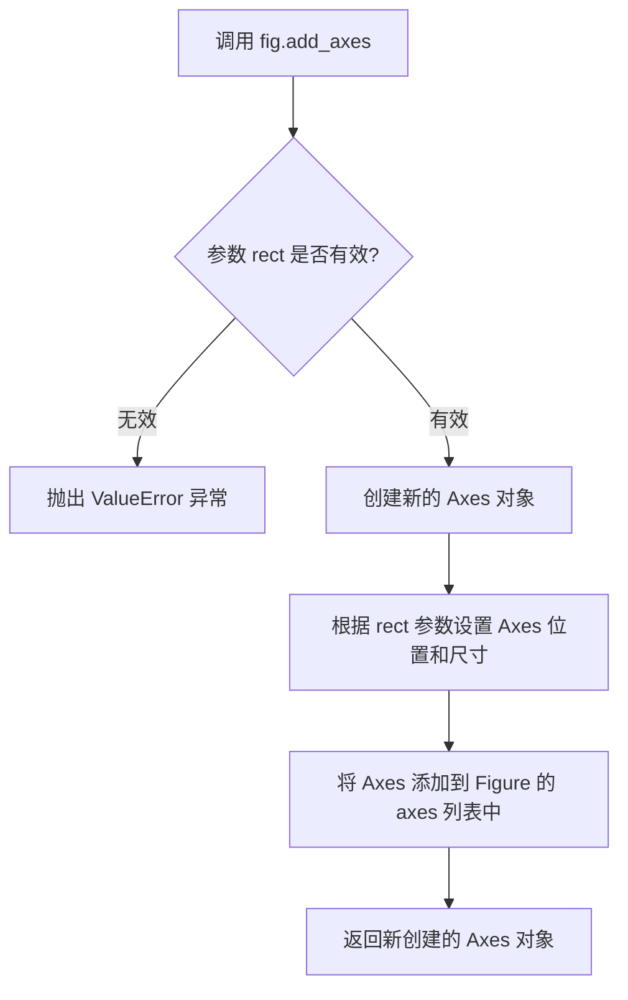

#### 带注释源码

```python
# 创建图形对象，设置图形大小为 11x6 英寸
fig = plt.figure(figsize=(11, 6))

# 调用 add_axes 方法向图形添加主坐标轴
# 参数 rect = (.05, .05, .9, .9) 表示：
#   - left = 0.05: 距离 figure 左侧 5% 的位置
#   - bottom = 0.05: 距离 figure 底部 5% 的位置
#   - width = 0.9: 坐标轴宽度为 figure 宽度的 90%
#   - height = 0.9: 坐标轴高度为 figure 高度的 90%
ax = fig.add_axes((.05, .05, .9, .9))

# 设置坐标轴 patch（背景）的颜色为灰色 (.75)
ax.patch.set_color(".75")

# 创建共享 x 轴的副坐标轴
ax_twin = ax.twinx()
```


### `Figure.add_subplot`

在matplotlib中，`Figure.add_subplot`方法用于在图形（Figure）对象中创建并添加一个子图（Axes）。该方法支持多种参数形式来定义子图的位置和共享属性，并返回一个Axes对象供用户进行绘图和定制。

参数：

- `*args`：`可变位置参数`，支持三种传入方式：
  - 传入一个三位数整数（如221、222等），其中第一位数字表示子图行数，第二位数字表示子图列数，第三位数字表示子图索引。
  - 传入三个独立的整数参数（nrows, ncols, index），分别表示子图的行数、列数和索引位置。
  - 传入一个`GridSpec`对象和位置索引，用于更复杂的子图布局。
- `sharex`：`axes.Axes类型或None`，可选参数，用于指定共享x轴的子图，传入已存在的Axes对象。
- `sharey`：`axes.Axes类型或None`，可选参数，用于指定共享y轴的子图，传入已存在的Axes对象。
- `**kwargs`：`关键字参数`，传递给创建的Axes对象的属性，如`projection`（投影类型）、`polar`（是否极坐标）等。

返回值：`matplotlib.axes.Axes`，返回创建的子图Axes对象，可以用于在该子图上进行绘图操作。

#### 流程图

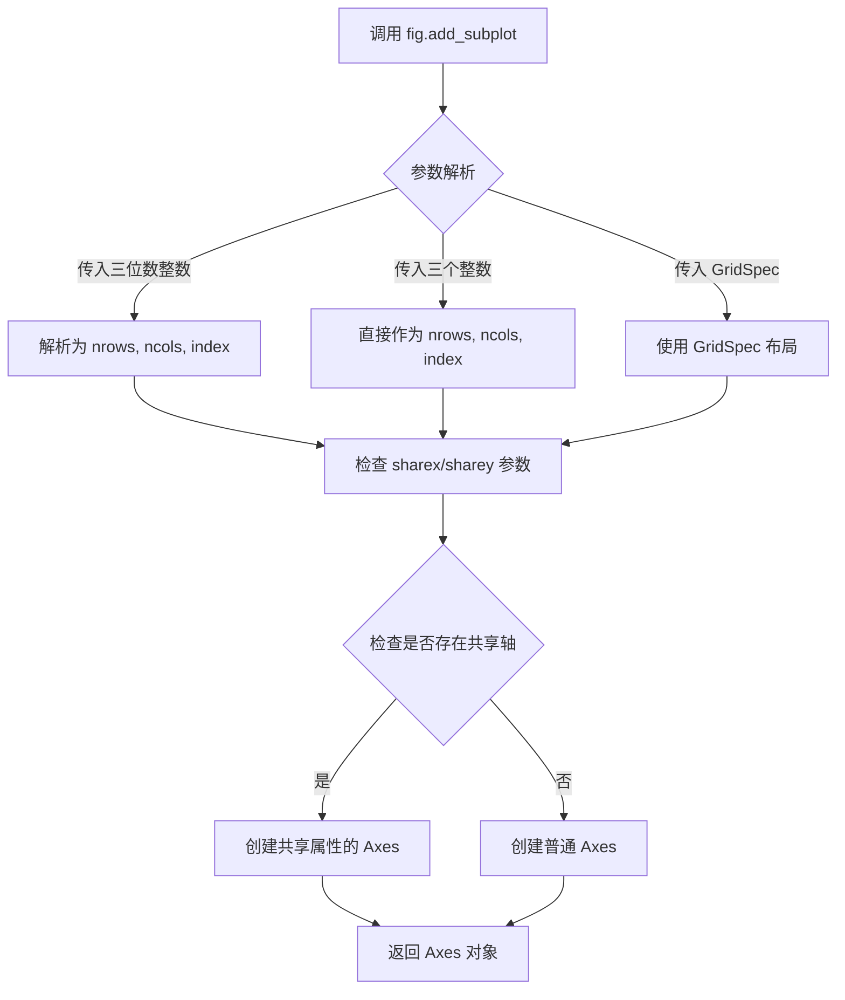

#### 带注释源码

```python
# 调用示例
fig = plt.figure(figsize=(11, 6))

# 示例1：使用三位数整数添加子图 (2行2列第1个位置)
ax1 = fig.add_subplot(221)
# 此时创建了一个2x2网格中的第一个子图位置

# 示例2：添加子图并共享x轴和y轴
ax11 = fig.add_subplot(223, sharex=ax1, sharey=ax1)
# 参数说明：
# - 223: 表示2行2列网格中的第3个位置
# - sharex=ax1: 与ax1共享x轴，隐藏x轴刻度标签避免重叠
# - sharey=ax1: 与ax1共享y轴，隐藏y轴刻度标签避免重叠

# 示例3：使用三个独立整数参数
ax2 = fig.add_subplot(2, 2, 2)
# 等同于 fig.add_subplot(222)

# add_subplot 内部核心逻辑简化如下：
def add_subplot(self, *args, **kwargs):
    """
    在图形中添加子图
    
    参数处理逻辑：
    1. 如果传入一个整数 n，将其解析为 (n//100, n//10%10, n%10)
       例如：221 -> (2, 2, 1)
    2. 检查 projection 参数确定投影类型
    3. 如果提供了 sharex 或 sharey，建立子图间的共享关系
    4. 调用 _add_axes_internal 创建 Axes 对象
    """
    # 位置参数处理
    if len(args) == 1:
        if isinstance(args[0], int):
            # 三位数整数情况：221 -> (2, 2, 1)
            args = (args[0] // 100, (args[0] // 10) % 10, args[0] % 10)
    
    # 获取或创建 projection
    projection = kwargs.pop('projection', None)
    if projection is None:
        # 使用当前图形的默认投影
        projection = self._axstack.bubble(self._axstack.default_axes_class())
    
    # 处理共享轴参数
    sharex = kwargs.pop('sharex', None)
    sharey = kwargs.pop('sharey', None)
    
    # 创建子图
    ax = self._add_axes_internal(projection=projection)
    
    # 如果有共享轴，设置共享关系
    if sharex is not None:
        ax._shared_x_axes.join(sharex, ax)
    if sharey is not None:
        ax._shared_y_axes.join(sharey, ax)
    
    return ax
```


### `ax.patch.set_color`

该方法属于 matplotlib 库中 `Patch` 类（坐标轴的背景补丁），用于设置坐标轴补丁区域的填充颜色。在给定的示例代码中，通过 `ax.patch.set_color(".75")` 将主坐标轴的背景补丁设置为灰度值 ".75"（即 75% 的灰色），以区分不同的坐标轴区域。

参数：

-  `color`：颜色值，可以是字符串（如 ".75"、"red"、"#FF0000"）、RGB 元组、RGBA 元组或颜色名称等，用于指定补丁区域的填充颜色。

返回值：`None`，该方法直接修改补丁对象的颜色属性，不返回任何值。

#### 流程图

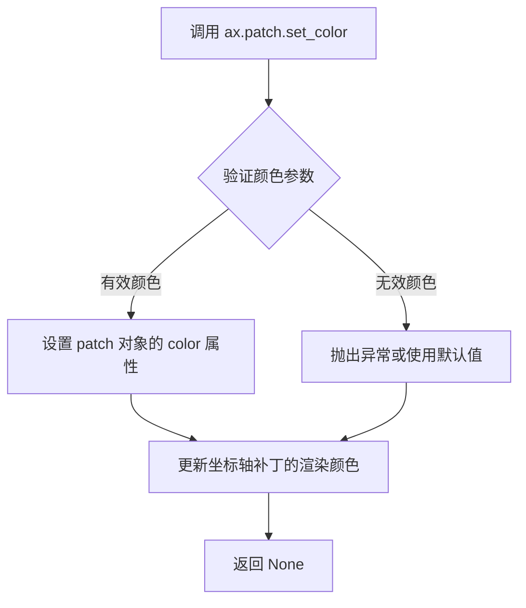

#### 带注释源码

```python
# 源码位于 matplotlib/lib/matplotlib/patches.py 中的 Patch 类
# 以下是 set_color 方法的典型实现结构：

def set_color(self, color):
    """
    Set the patch color.

    Parameters
    ----------
    color : color or None
        The patch color. If None, the default color is used.

    Returns
    -------
    None

    Notes
    -----
    This method is equivalent to setting the `facecolor` attribute
    for simple patches. For more complex patches, this sets both
    the fill color and the edge color to the same value.
    """
    # 1. 处理颜色值，支持多种格式（字符串、元组、颜色名称等）
    #    matplotlib 会通过颜色解析器将各种格式转换为统一的颜色表示
    self.set_facecolor(color)  # 设置填充颜色
    self.set_edgecolor(color)  # 设置边缘颜色
    
    # 2. 注意：在 matplotlib 的实现中，set_color 通常会同时设置
    #    facecolor（填充色）和 edgecolor（边框色）为相同的颜色
    
    # 3. 该方法不返回任何值（返回 None）
    #    这是 matplotlib 的约定，setter 方法通常返回 None
    #    以便支持链式调用（如果需要的话可以通过其他方式实现）

# 在示例代码中的使用：
# ax.patch.set_color(".75")
# 将主坐标轴 (ax) 的背景补丁颜色设置为灰度值 .75 (75% 灰色)
# 这样可以直观地显示坐标轴的背景区域，与其他坐标轴区分开来
```


### `Axes.twinx()`

创建共享x轴的孪生y轴，返回一个新的Axes对象，该对象与原始Axes共享x轴但有独立的y轴。在matplotlib中，twinx()方法用于在同一图表中显示两组具有不同y轴刻度的数据系列。

参数：

- 无（该方法不接受任何参数）

返回值：`matplotlib.axes.Axes`，返回一个新的Axes对象，该对象与原始Axes共享x轴但具有独立的y轴。

#### 流程图

```mermaid
graph TD
    A[调用 ax.twinx()] --> B{检查是否有已存在的twin Axes}
    B -->|是| C[返回已存在的twin Axes]
    B -->|否| D[创建新的Axes对象]
    D --> E[设置新Axes与原Axes共享x轴]
    E --> F[配置y轴位置在右侧]
    F --> G[返回新的twin Axes]
    G --> H[调用如 ax_twin = ax.twinx()]
```

#### 带注释源码

```python
# 在代码中的使用示例：

# 创建主坐标轴
ax = fig.add_axes((.05, .05, .9, .9))

# 使用twinx()创建共享x轴的孪生y轴
ax_twin = ax.twinx()

# 另一个示例：在子图中
ax1 = fig.add_subplot(221)
ax1_twin = ax1.twinx()  # 创建与ax1共享x轴的孪生y轴

# ax2的patch设置为不可见，pan/zoom事件会转发到下方axes
ax2 = fig.add_subplot(222)
ax2_twin = ax2.twinx()
ax2.patch.set_visible(False)  # 设置patch不可见

# twinax的主要特点：
# 1. 共享x轴：两个axes的x轴同步
# 2. 独立y轴：可以有不同的y轴刻度和标签
# 3. y轴位置：孪生y轴默认显示在右侧
```

#### 补充说明

`ax.twinx()` 是matplotlib库中Axes类的方法，不是在此代码文件中定义的。该代码示例展示了如何使用`twinx()`创建孪生坐标轴，以及如何通过`set_forward_navigation_events()`和`set_navigate()`控制pan/zoom事件的行为。

**技术债务/优化空间：**

- 代码中多次重复创建twin axes的模式，可以考虑封装为辅助函数
- 文本标签的硬编码位置可以抽取为配置参数

**设计目标：**

- 展示matplotlib中twinx()的基本用法
- 演示如何控制重叠坐标轴的pan/zoom事件转发行为


### `Axes.set_forward_navigation_events`

该方法用于设置坐标轴的导航事件转发行为，允许覆盖默认的平移/缩放事件处理逻辑（默认行为取决于坐标轴补丁的可见性）。

参数：

-  `val`：布尔值或字符串，指定导航事件转发行为。当值为`True`时，强制将导航事件转发到下方的坐标轴；当值为`False`时，限制导航事件仅在当前坐标轴执行；当值为"auto"时，恢复使用默认行为（即根据补丁可见性决定）。

返回值：无返回值（`None`），该方法直接修改坐标轴对象的内部状态。

#### 流程图

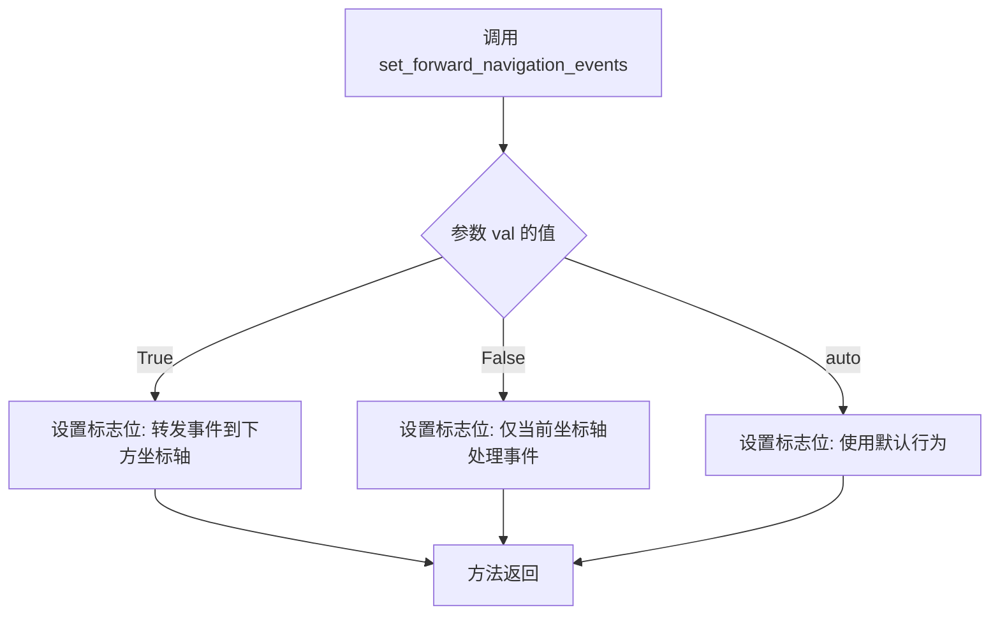

#### 带注释源码

```python
def set_forward_navigation_events(self, val):
    """
    设置坐标轴的导航事件转发行为
    
    参数:
        val: bool or str
            - True:  转发导航事件到坐标轴下方的其他坐标轴
            - False: 仅在当前坐标轴上执行导航事件
            - "auto": 使用默认行为（根据 patch.get_visible() 决定）
    
    返回:
        None
    
    说明:
        默认行为规则:
        - 可见补丁的坐标轴捕获平移/缩放事件
        - 不可见补丁的坐标轴将平移/缩放事件转发到下方坐标轴
        - 共享坐标轴始终与父坐标轴一起触发（无论补丁可见性）
    """
    self._forward_navigation_events = val
    # 该方法修改坐标轴对象的内部属性 _forward_navigation_events
    # matplotlib 在处理平移/缩放事件时会检查此标志位
```

根据代码中的实际调用示例：

```python
# 示例 1: 强制转发事件
ax11.set_forward_navigation_events(True)

# 示例 2: 禁止转发事件
ax22.set_forward_navigation_events(False)
```


### `ax.patch.set_visible`

此方法用于设置坐标轴补丁（patch）的可见性。在matplotlib中，`ax.patch`返回代表坐标轴区域的补丁对象。调用`set_visible(False)`会将坐标轴补丁设置为不可见，从而使得平移/缩放事件被转发到下方的坐标轴；而`set_visible(True)`（默认值）则使坐标轴捕获平移/缩放事件。

参数：

-  `visible`：`bool`，指定补丁是否可见。`True`表示可见，`False`表示不可见

返回值：`None`，无返回值

#### 流程图

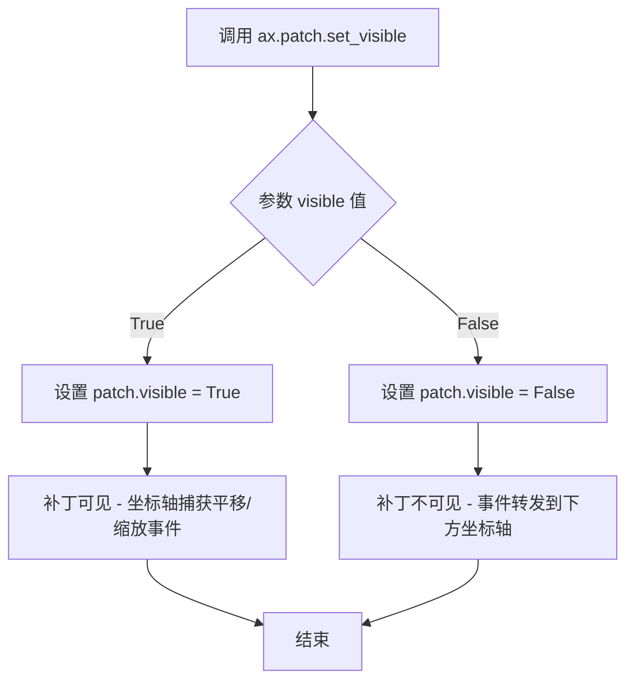

#### 带注释源码

```python
# 代码中的实际使用示例
ax2 = fig.add_subplot(222)          # 创建子图
ax2_twin = ax2.twinx()              # 创建双Y轴
ax2.patch.set_visible(False)       # 设置坐标轴补丁为不可见
# 效果：平移/缩放事件会被转发到ax2下方的坐标轴

ax22 = fig.add_subplot(224, sharex=ax2, sharey=ax2)
ax22.patch.set_visible(False)       # 同样设置补丁不可见
ax22.set_forward_navigation_events(False)
ax22.text(.5, .5,
          "Invisible patch\n\n"
          "Override capture behavior:\n\n"
          "ax.set_forward_navigation_events(False)",
          ha="center", va="center", transform=ax22.transAxes)
```

#### 相关类信息

**类名**：`matplotlib.patches.Patch`

**类说明**：_patch_类是matplotlib中所有补丁对象（如矩形、圆形、多边形等）的基类。坐标轴的补丁是一个`RectanglePatch`，代表坐标轴的背景区域。

**类方法**：

- `set_visible(visible)`：设置补丁可见性
  - 参数：`visible` (bool) - 可见性状态
  - 返回值：`None`

- `get_visible()`：获取补丁当前可见性状态
  - 参数：无
  - 返回值：`bool` - 当前可见性状态

#### 关键组件信息

| 组件名称 | 一句话描述 |
|---------|-----------|
| `ax.patch` | 坐标轴的补丁对象，代表坐标轴的背景矩形区域 |
| `Patch.set_visible()` | 设置补丁可见性的方法 |
| `set_forward_navigation_events()` | 覆盖默认行为，控制事件转发 |

#### 技术债务与优化空间

1. **文档完善性**：当前示例代码缺少对`set_visible`方法直接调用的清晰演示，可以增加更直接的调用示例
2. **API一致性**：patch可见性与patch颜色/透明度无关联这一点需要更明确地向用户传达，避免误解

#### 其它说明

**设计目标**：提供灵活的控制机制，让用户决定坐标轴是否捕获平移/缩放事件，实现复杂的坐标轴叠加交互

**错误处理**：无特殊错误处理，属于matplotlib基础方法

**数据流与状态机**：补丁可见性状态存储在`Patch._visible`属性中，影响事件分发的判断逻辑

**外部依赖**：依赖matplotlib核心库，无外部依赖


# `ax.set_navigate` 方法详细设计文档

### `Axes.set_navigate`

该方法用于设置 Axes 对象的导航事件（平移/缩放）处理行为，决定是否允许当前轴响应鼠标的平移和缩放交互。

参数：

- `navigate`：`bool`，一个布尔值，用于控制是否启用导航事件。设置为 `False` 时完全禁用 pan/zoom 事件，设置为 `True` 时启用导航事件。

返回值：`None`，该方法不返回任何值，仅修改 Axes 对象的状态。

#### 流程图

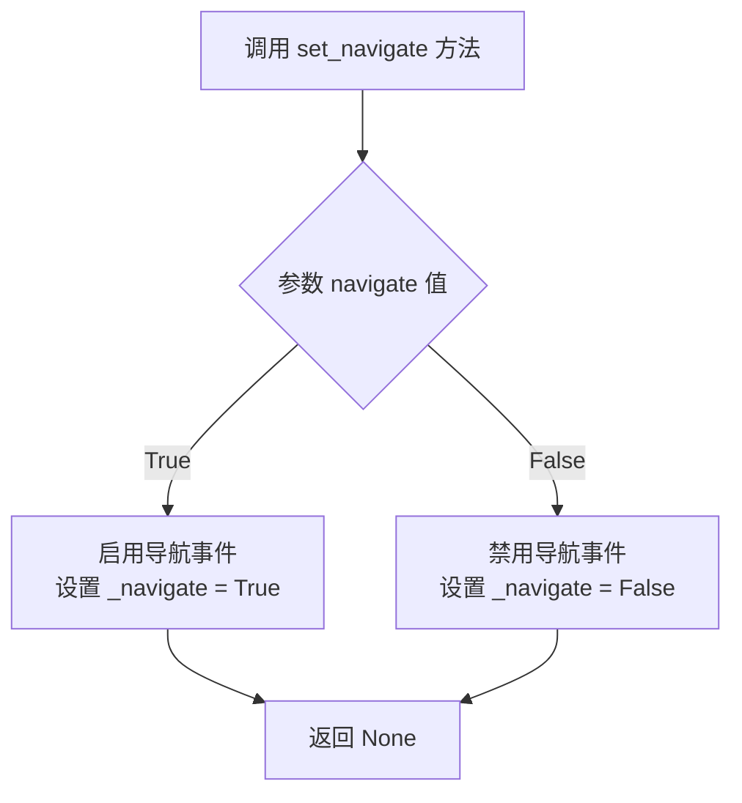

#### 带注释源码

```python
def set_navigate(self, navigate):
    """
    Set whether this axes should respond to navigation events.

    .. admonition:: Reference

        This method exists to inform users of the potential for
        unexpected behavior when overlaying axes.

    Parameters
    ----------
    navigate : bool
        True if this axes should respond to navigation events (pan/zoom),
        False otherwise.

    Notes
    -----
    By default, ``navigate`` is True, meaning the axes will respond to
    pan and zoom events. Setting this to False completely disables
    these interactions.

    The default behavior can be overridden using
    :meth:`set_forward_navigation_events`.
    """
    self._navigate = navigate
```

---

### 补充说明

#### 设计目标与约束

- **设计目标**：提供一种简单的方式让用户控制特定 Axes 是否响应鼠标的平移和缩放交互
- **约束**：该方法仅影响鼠标交互事件，不影响通过代码方式调用 `pan()` 或 `zoom()` 方法

#### 错误处理与异常设计

- 如果传入非布尔值，Matplotlib 会在底层进行类型检查并抛出 `TypeError`

#### 潜在的技术债务或优化空间

- 当前实现仅支持布尔值，未来可以考虑支持 `"auto"` 字符串以与其他导航事件方法保持一致的 API 设计


### `ax1.text`

在 Axes 对象上添加文本标签，显示"Visible patch"并说明该轴上的平移/缩放事件不会转发到下面的轴。

参数：

- `x`：`float`，文本的 x 坐标位置
- `y`：`float`，文本的 y 坐标位置
- `s`：`str`，要显示的文本内容
- `ha`：`str`，水平对齐方式（可选，默认 'center'）
- `va`：`str`，垂直对齐方式（可选，默认 'center'）
- `transform`：`matplotlib.transforms.Transform`，坐标变换对象（可选）

返回值：`matplotlib.text.Text`，返回创建的文本对象

#### 流程图

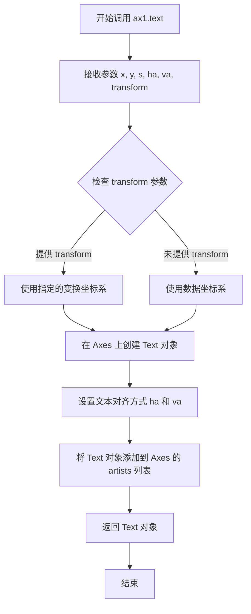

#### 带注释源码

```python
ax1.text(
    .5,  # x: 文本的 x 坐标（使用 axes 坐标系，范围 0-1）
    .5,  # y: 文本的 y 坐标（使用 axes 坐标系，范围 0-1）
    "Visible patch\n\n"  # s: 文本内容第一行
    "Pan/zoom events are NOT\n"  # 文本内容第二行
    "forwarded to axes below",  # 文本内容第三行
    ha="center",  # ha: horizontal alignment，水平居中对齐
    va="center",  # va: vertical alignment，垂直居中对齐
    transform=ax1.transAxes  # transform: 使用 axes 坐标系（0-1）而非数据坐标系
)
```

---

### `ax11.text`

在 Axes 对象上添加文本标签，显示覆盖默认行为的说明。

参数：

- `x`：`float`，文本的 x 坐标位置
- `y`：`float`，文本的 y 坐标位置
- `s`：`str`，要显示的文本内容
- `ha`：`str`，水平对齐方式
- `va`：`str`，垂直对齐方式
- `transform`：`matplotlib.transforms.Transform`，坐标变换对象

返回值：`matplotlib.text.Text`，返回创建的文本对象

#### 带注释源码

```python
ax11.text(
    .5,  # x: 文本的 x 坐标
    .5,  # y: 文本的 y 坐标
    "Visible patch\n\n"  # 文本内容
    "Override capture behavior:\n\n"  # 说明覆盖行为
    "ax.set_forward_navigation_events(True)",  # 具体的设置方法
    ha="center",  # 水平居中对齐
    va="center",  # 垂直居中对齐
    transform=ax11.transAxes  # 使用 axes 坐标系
)
```

---

### `ax2.text`

在 Axes 对象上添加文本标签，说明不可见 patch 的情况。

参数：

- `x`：`float`，文本的 x 坐标位置
- `y`：`float`，文本的 y 坐标位置
- `s`：`str`，要显示的文本内容
- `ha`：`str`，水平对齐方式
- `va`：`str`，垂直对齐方式
- `transform`：`matplotlib.transforms.Transform`，坐标变换对象

返回值：`matplotlib.text.Text`，返回创建的文本对象

#### 带注释源码

```python
ax2.text(
    .5,  # x: 文本的 x 坐标
    .5,  # y: 文本的 y 坐标
    "Invisible patch\n\n"  # 说明这是不可见 patch
    "Pan/zoom events are\n"  # 说明平移/缩放事件
    "forwarded to axes below",  # 会被转发到下面的轴
    ha="center",  # 水平居中对齐
    va="center",  # 垂直居中对齐
    transform=ax2.transAxes  # 使用 axes 坐标系
)
```

---

### `ax22.text`

在 Axes 对象上添加文本标签，说明覆盖默认行为的设置。

参数：

- `x`：`float`，文本的 x 坐标位置
- `y`：`float`，文本的 y 坐标位置
- `s`：`str`，要显示的文本内容
- `ha`：`str`，水平对齐方式
- `va`：`str`，垂直对齐方式
- `transform`：`matplotlib.transforms.Transform`，坐标变换对象

返回值：`matplotlib.text.Text`，返回创建的文本对象

#### 带注释源码

```python
ax22.text(
    .5,  # x: 文本的 x 坐标
    .5,  # y: 文本的 y 坐标
    "Invisible patch\n\n"  # 说明不可见 patch
    "Override capture behavior:\n\n"  # 说明覆盖默认行为
    "ax.set_forward_navigation_events(False)",  # 具体的设置方法
    ha="center",  # 水平居中对齐
    va="center",  # 垂直居中对齐
    transform=ax22.transAxes  # 使用 axes 坐标系
)
```


### Figure.add_axes

用于在图表（Figure）中添加一个新的轴（Axes），并指定其在图表中的位置和大小。返回一个Axes对象。

参数：
- `rect`：`tuple` 或 `list`，四个浮点数 `[left, bottom, width, height]`，表示新轴的左下角坐标、宽度和高度，所有值均为相对值（0到1之间），相对于图表的尺寸。
- `projection`：`str`，可选，轴的投影类型（如 'rectilinear'、'polar' 等）。
- `polar`：`bool`，可选，如果为 True，则使用极坐标轴。
- `**kwargs`：其他关键字参数，用于传递给 Axes 构造函数。

返回值：`matplotlib.axes.Axes`，新创建并添加到图表中的轴对象。

#### 流程图

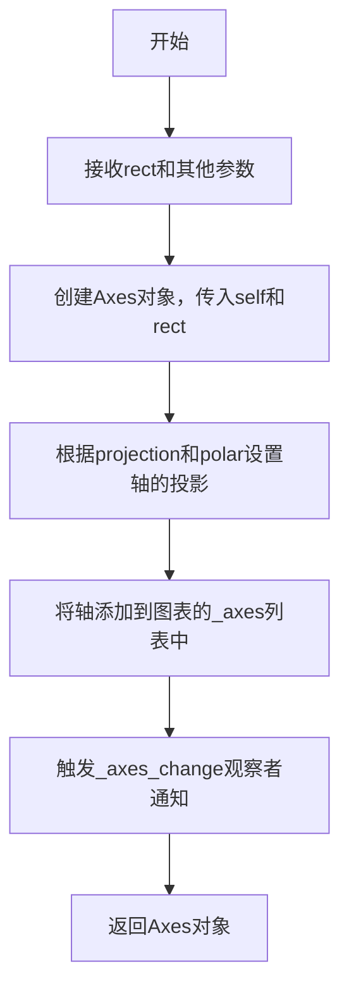

#### 带注释源码

```python
def add_axes(self, rect, projection=None, polar=False, **kwargs):
    """
    添加一个轴到图表。

    参数：
        rect：元组或列表，四个浮点数 [left, bottom, width, height]，表示新轴的位置和大小。
        projection：字符串，可选，轴的投影类型。
        polar：布尔值，可选，是否使用极坐标。
        **kwargs：其他关键字参数。

    返回值：
        axes：新创建的轴对象。
    """
    # 步骤1：创建Axes对象，self是Figure实例，rect指定位置和大小
    axes = Axes(self, rect, **kwargs)
    
    # 步骤2：如果指定了projection，设置轴的投影类型
    if projection is not None:
        axes.set_projection(projection)
    
    # 步骤3：如果polar为True，设置极坐标相关参数
    if polar:
        axes.set_theta_zero_location('N')
    
    # 步骤4：将新轴添加到图表的_axes列表中
    self._axes.append(axes)
    
    # 步骤5：通知观察者图表的轴已更改
    self._axobservers.process("_axes_change", self)
    
    # 步骤6：返回新创建的轴对象
    return axes
```

注意：上述源码是基于 matplotlib 库的一般逻辑简化而来，实际实现可能更复杂。代码中的 `Axes` 是 matplotlib 中的轴类，`self._axes` 是 Figure 维护的轴列表，`self._axobservers` 用于管理观察者模式。


### `Figure.add_subplot`

该方法是 matplotlib 中 Figure 类的一个核心方法，用于在图形中添加子图（Axes）。它根据提供的参数（如行数、列数和索引）创建一个新的子图区域，并返回对应的 Axes 对象，支持共享坐标轴、位置调整等功能。

参数：

- `*args`：`tuple` 或 `int`，位置参数，可以是三种形式：
  - 3个整数 (rows, cols, index)：分别表示子图的行数、列数和当前子图的编号（编号从1开始）
  - 1个三位数整数：如 221 表示 2行2列的第1个位置
  - `matplotlib.gridspec.SubplotSpec` 实例：使用 GridSpec 定义的子图规范
- `**kwargs`：`dict`，关键字参数，将传递给 Axes 的构造函数，用于设置子图的各种属性（如标题、标签、颜色等）

返回值：`matplotlib.axes.Axes`，返回新创建的子图轴对象

#### 流程图

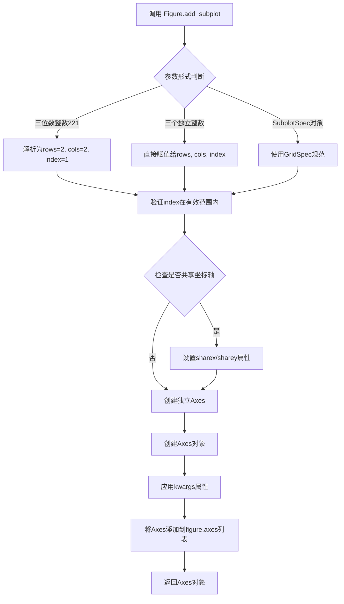

#### 带注释源码

```python
# 注：以下为 matplotlib 库中 Figure.add_subplot 的核心逻辑模拟
# 实际源码位于 lib/matplotlib/figure.py 中

def add_subplot(self, *args, **kwargs):
    """
    在当前图形中添加一个子图
    
    参数格式:
        add_subplot(211)  -> 2行1列,第1个位置
        add_subplot(2, 1, 1)  -> 同上
        add_subplot(1, 1, 1)  -> 1行1列,第1个位置(整个图形)
    """
    
    # 1. 参数解析 - 处理不同的输入形式
    if len(args) == 1:
        if isinstance(args[0], int):
            # 处理三位数整数如 221 -> rows=2, cols=2, index=1
            args = self._gridspec._parse_subplot_args(args[0])
    
    # 2. 获取或创建 GridSpec
    gs = self._get_gridspec(*args)
    
    # 3. 创建子图位置
    position = gs.get_position(self, *args)
    
    # 4. 处理共享坐标轴参数
    share_x = kwargs.pop('sharex', None)
    share_y = kwargs.pop('sharey', None)
    
    # 5. 创建 Axes 对象
    ax = self._add_axes_internal(gs, position, *args, **kwargs)
    
    # 6. 设置共享轴关系
    if share_x is not None:
        ax._shared_x_axes.share(share_x)
    if share_y is not None:
        ax._shared_y_axes.share(share_y)
    
    # 7. 将新axes添加到图形并返回
    self._axstack.bubble(ax)
    self._axlist.append(ax)
    
    return ax
```

#### 关键组件信息

- **Figure**：matplotlib 中的图形容器类，负责管理整个图形及其包含的所有子图
- **GridSpec**：子图网格规范类，定义了子图的布局结构
- **Axes**：坐标轴对象，代表图形中的一个子图区域

#### 潜在技术债务与优化空间

1. **参数解析复杂性**：`add_subplot` 支持多种参数格式，虽然提供了灵活性但增加了代码复杂度和维护成本
2. **向后兼容性**：大量关键字参数的处理方式可能导致未来API变更的兼容性挑战
3. **文档一致性**：不同参数形式的说明分散，需要更统一的文档组织

#### 其它说明

- **设计目标**：提供灵活易用的子图创建接口，支持多种布局方式
- **约束条件**：index必须小于等于rows*cols，且从1开始编号
- **错误处理**：当index超出有效范围时抛出`ValueError`异常
- **外部依赖**：依赖 matplotlib 的 GridSpec 和 Axes 类实现


### Figure.suptitle

为matplotlib的Figure对象设置总标题，该标题位于figure的顶部中央位置。

参数：
- `t`：str，要显示的标题文本内容。
- `**kwargs`：关键字参数，用于配置Text对象的属性，如字体大小（fontsize）、字体颜色（color）、水平对齐（ha）、垂直对齐（va）等。

返回值：matplotlib.text.Text，返回创建的Text对象，可用于后续自定义或事件处理。

#### 流程图

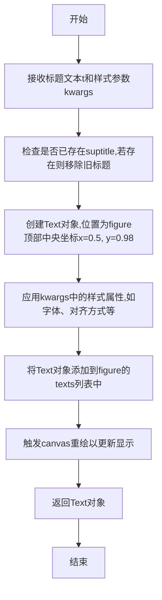

#### 带注释源码

```python
def suptitle(self, t, **kwargs):
    """
    Add a centered title to the figure.
    
    Parameters
    ----------
    t : str
        The title text to be displayed.
    **kwargs : dict
        Additional keyword arguments passed to the Text object,
        such as fontsize, fontweight, color, ha, va, etc.
    
    Returns
    -------
    matplotlib.text.Text
        The Text object representing the title.
    """
    # 检查是否已存在suptitle,如果存在则先移除,以支持重复调用更新标题
    if self._suptitle is not None:
        self._suptitle.remove()
    
    # 设置默认参数:水平居中,垂直顶部对齐
    kwargs.setdefault('ha', 'center')
    kwargs.setdefault('va', 'top')
    
    # 创建Text对象,位置在figure的标准化坐标系统中(0.5, 0.98)
    # transform使用transFigure确保坐标相对于figure而非数据
    self._suptitle = Text(
        x=0.5, y=0.98,
        text=t,
        transform=self.transFigure,
        **kwargs
    )
    
    # 将标题添加到figure的texts列表中,以便管理和渲染
    self.texts.append(self._suptitle)
    
    # 标记figure需要重绘,通常调用canvas.draw_idle()触发显示更新
    self.canvas.draw_idle()
    
    return self._suptitle
```


### 顶层脚本执行流程

该代码为一个完整的Python脚本（无自定义函数或类），用于演示matplotlib中重叠轴的平移/缩放事件处理机制。代码通过matplotlib API创建多个子图，展示不同patch可见性下的导航事件行为。

#### 流程图

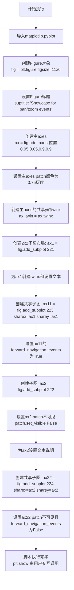

#### 带注释源码

```python
"""
===================================
Pan/zoom events of overlapping axes
===================================

Example to illustrate how pan/zoom events of overlapping axes are treated.

[详细文档字符串，描述matplotlib的pan/zoom事件默认行为和覆盖方法]
"""

# 导入matplotlib.pyplot库，用于创建图形和axes
import matplotlib.pyplot as plt

# 创建Figure对象，设置图形大小为11x6英寸
fig = plt.figure(figsize=(11, 6))

# 设置Figure的顶层标题
fig.suptitle("Showcase for pan/zoom events on overlapping axes.")

# ===== 主轴创建 =====
# 使用add_axes在图形中添加一个axes，位置为[left, bottom, width, height]
# 位置参数: (.05, .05, .9, .9) 即从左下角5%位置开始，宽度90%，高度90%
ax = fig.add_axes((.05, .05, .9, .9))

# 设置主axes的patch颜色为0.75灰度(.75表示75%灰度)
ax.patch.set_color(".75")

# 创建与ax共享y轴的twin axes，用于展示双Y轴
ax_twin = ax.twinx()

# ===== 子图1: 可见patch (221位置) =====
# 在2x2网格的第1个位置创建subplot
ax1 = fig.add_subplot(221)

# 为ax1创建共享y轴的twin axes
ax1_twin = ax1.twinx()

# 在ax1的axes坐标系中添加文本说明
# transform=ax1.transAxes表示使用axes坐标系(0-1)
ax1.text(.5, .5,
         "Visible patch\n\n"
         "Pan/zoom events are NOT\n"
         "forwarded to axes below",
         ha="center", va="center", transform=ax1.transAxes)

# ===== 子图2: 可见patch但覆盖行为 (223位置) =====
# sharex=ax1, sharey=ax1 与ax1共享x和y轴
ax11 = fig.add_subplot(223, sharex=ax1, sharey=ax1)

# 覆盖默认的forward navigation行为，设置为True表示转发事件到下方axes
ax11.set_forward_navigation_events(True)

# 添加说明文本
ax11.text(.5, .5,
          "Visible patch\n\n"
          "Override capture behavior:\n\n"
          "ax.set_forward_navigation_events(True)",
          ha="center", va="center", transform=ax11.transAxes)

# ===== 子图3: 不可见patch (222位置) =====
ax2 = fig.add_subplot(222)

# 创建twin axes
ax2_twin = ax2.twinx()

# 设置patch为不可见 - 这导致pan/zoom事件默认转发到下方axes
ax2.patch.set_visible(False)

# 添加说明文本
ax2.text(.5, .5,
         "Invisible patch\n\n"
         "Pan/zoom events are\n"
         "forwarded to axes below",
         ha="center", va="center", transform=ax2.transAxes)

# ===== 子图4: 不可见patch但覆盖行为 (224位置) =====
ax22 = fig.add_subplot(224, sharex=ax2, sharey=ax2)

# 设置patch不可见
ax22.patch.set_visible(False)

# 覆盖默认行为，设置为False表示不转发事件，仅在此axes上执行
ax22.set_forward_navigation_events(False)

# 添加说明文本
ax22.text(.5, .5,
          "Invisible patch\n\n"
          "Override capture behavior:\n\n"
          "ax.set_forward_navigation_events(False)",
          ha="center", va="center", transform=ax22.transAxes)

# 注意: 此脚本本身不包含Figure.show()方法定义
# matplotlib.pyplot.show()是由库提供的全局函数，在实际运行时由用户调用显示图形
```

---

### 说明

**关于Figure.show方法：**

所提供的代码中**不存在**`Figure.show`方法的自定义实现。该代码是一个完整的**示例脚本**，用于演示matplotlib库中`axes.patch`可见性与`set_forward_navigation_events`方法对pan/zoom事件处理的影响。

- 代码通过调用matplotlib的`Figure`类和`Axes`类的方法来构建图形
- 核心功能方法包括：`patch.set_visible()`、`patch.set_color()`、`set_forward_navigation_events()`、`twinx()`、`add_axes()`、`add_subplot()`、`text()`等
- 最终图形的显示由`plt.show()`（全局函数）完成，而非`Figure.show()`实例方法


### `Axes.twinx`

`Axes.twinx` 是 matplotlib 中 Axes 类的一个方法，用于创建一个共享 x 轴的 twin axes（双 y 轴）。该方法返回一个新的 Axes 实例，新 axes 与原始 axes 共享 x 轴，但拥有独立的 y 轴，常用于在同一图表中显示不同量纲或不同范围的数据系列。

参数：此方法无参数。

返回值：`matplotlib.axes.Axes`，返回新创建的 twin Axes 实例，该 axes 与原 axes 共享 x 坐标轴，但具有独立的 y 坐标轴。

#### 流程图

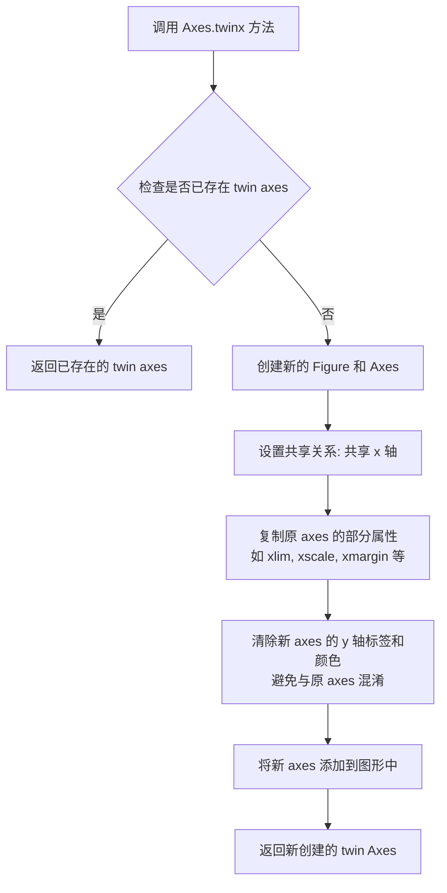

#### 带注释源码

```python
def twinx(self):
    """
    Create a twin Axes sharing the xaxis.

    Create a twin Axes sharing the x-axis.  The twinx Axes will
    inherit the "sticky" properties of the parent, and the share
    argument will also be passed.  The axis labels will be removed
    from the parent and added to the twin.

    Returns
    -------
    ax : Axes
        The newly created Axes instance

    See Also
    --------
    twiny : Create a twin Axes sharing the y-axis.
    """
    # 获取当前 axes 的图形对象
    fig = self.figure
    
    # 如果已存在 twin axes，直接返回已存在的实例
    # 这避免了重复创建相同的 twin axes
    if self._twinx is not None:
        return self._twinx
    
    # 创建新的 Axes，共享 x 轴
    # frameon=False 表示新 axes 默认不带边框
    # twin=True 标记这是一个 twin axes
    ax2 = self._make_twin_axes(sharex=self)
    ax2.figure = fig
    
    # 设置共享标志，确保坐标轴同步
    # 这使得两个 axes 在 x 轴方向上保持同步
    ax2._shared_x_axes.join(self, ax2)
    
    # 强制设置 y 轴标签不可见，避免重复显示
    # 因为 twin axes 通常有自己独立的 y 轴标签
    ax2.yaxis.set_tick_params(label2On=True)
    
    # 隐藏原始 axes 的 y 轴标签，因为它们将显示在 twin axes 上
    self.yaxis.set_tick_params(label1On=False)
    
    # 保存对 twin axes 的引用，避免重复创建
    self._twinx = ax2
    
    # 调整子图布局，确保两个 axes 都能正确显示
    self._twinx_axes_infos = (ax2, ax2._get_source_axes(self))
    
    # 返回新创建的 twin axes
    return ax2
```

#### 关键组件信息

- `Axes._twinx`：内部属性，缓存已创建的 twin axes 实例
- `Axes._make_twin_axes`：内部方法，用于实际创建 twin axes
- `Axes._shared_x_axes`：管理共享坐标轴关系的内部对象

#### 潜在的技术债务或优化空间

1. **方法命名一致性**：`twinx` 和 `twiny` 方法的实现逻辑高度相似，存在代码重复，可以考虑提取公共逻辑
2. **属性命名**：`_twinx` 和 `_twinx_axes_infos` 的命名不够直观，且后者未被充分利用
3. **文档完整性**：官方文档中提到的 "sticky" 属性继承和 xmargin 复制等细节未在代码中明确体现

#### 其它说明

**设计目标与约束**：
- `twinx` 专门用于创建共享 x 轴的双 y 轴图表
- 新 axes 自动继承原 axes 的 x 轴范围和缩放设置

**错误处理与异常设计**：
- 如果图形对象为 None，可能会导致错误
- 方法自动缓存已创建的 twin axes，避免重复创建

**数据流与状态机**：
- 创建后，两个 axes 的 x 轴数据完全同步
- y 轴数据独立，互不影响

**外部依赖与接口契约**：
- 依赖于 matplotlib 的 axes 系统和共享坐标轴机制
- 返回的 Axes 实例可正常使用 matplotlib 的所有绘图功能


### `Axes.patch`

`Axes.patch` 是 matplotlib 中 `Axes` 类的属性，用于获取或设置坐标轴的背景补丁（Patch）对象。该属性返回一个 `matplotlib.patches.Patch` 对象（通常为 `Rectangle`），可用于控制坐标轴背景的颜色、可见性、透明度等视觉属性，进而影响坐标轴对平移/缩放事件的捕获行为。

参数： （无，属性访问）

返回值：`matplotlib.patches.Patch`，返回坐标轴的背景补丁对象，默认是一个矩形（Rectangle）

#### 流程图

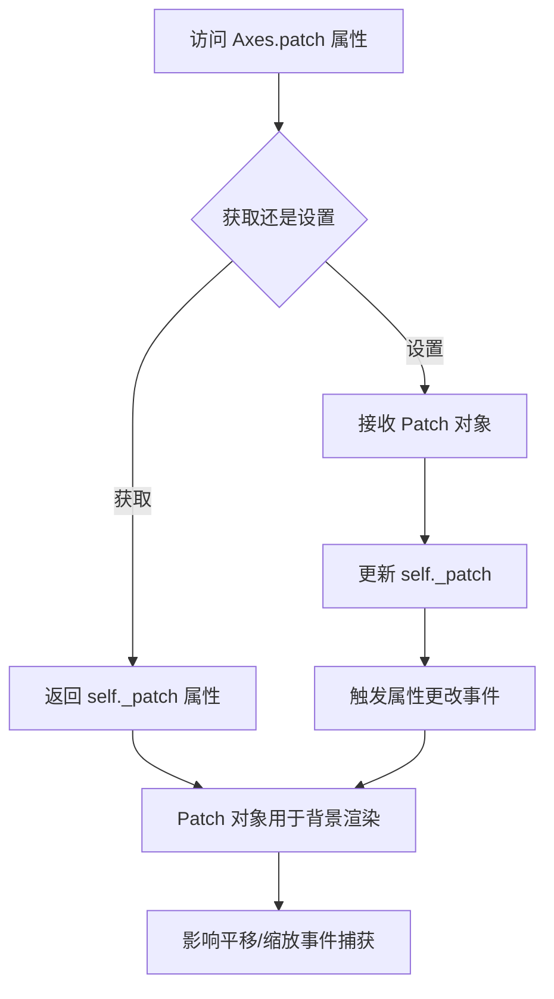

#### 带注释源码

```python
# 在 matplotlib 库中，Axes.patch 属性的典型实现结构如下：

class Axes:
    """
    Axes 类中与 patch 相关的核心属性和方法
    """
    
    def __init__(self, ...):
        # 初始化 patch 属性
        # 创建一个默认的矩形补丁作为坐标轴背景
        self._patch = mpatches.Rectangle(
            xy=(0.0, 0.0), width=1.0, height=1.0,
            transform=self.transAxes,
            figure=self.figure,
            zorder=-1.0  # 确保 patch 在其他元素之下
        )
        # 设置 forward_navigation_events 标志
        self._forward_navigation_events = "auto"
    
    @property
    def patch(self):
        """
        返回坐标轴的背景补丁（Patch）对象。
        
        该补丁对象控制坐标轴的背景外观，
        同时其可见性决定了平移/缩放事件的处理方式：
        - patch 可见时：坐标轴捕获平移/缩放事件
        - patch 不可见时：事件转发给下方的坐标轴
        """
        return self._patch
    
    @patch.setter
    def patch(self, value):
        """设置新的 Patch 对象作为坐标轴背景"""
        self._patch = value
    
    def set_forward_navigation_events(self, val):
        """
        覆盖默认的平移/缩放事件转发行为
        
        参数：
            val: bool 或 "auto"
                - True: 强制转发事件到下方坐标轴
                - False: 强制捕获事件
                - "auto": 使用默认行为（基于 patch 可见性）
        """
        self._forward_navigation_events = val
    
    # 示例代码中 patch 的使用方式：
    
    # 1. 设置 patch 颜色（灰色 .75）
    ax.patch.set_color(".75")
    
    # 2. 设置 patch 不可见（透明背景）
    ax2.patch.set_visible(False)
    
    # 3. 通过 patch 可见性控制事件行为
    # 当 patch 可见时：ax1 捕获平移/缩放事件
    # 当 patch 不可见时：ax2 转发事件到下方坐标轴

"""
在示例代码中的实际使用：

fig = plt.figure(figsize=(11, 6))
ax = fig.add_axes((.05, .05, .9, .9))
ax.patch.set_color(".75")  # 设置背景为灰色

ax1 = fig.add_subplot(221)
# ax1 的 patch 默认可见，因此会捕获平移/缩放事件

ax2 = fig.add_subplot(222)
ax2.patch.set_visible(False)  # 设置 patch 不可见
# ax2 的 patch 不可见，因此会转发平移/缩放事件到下方坐标轴

ax11 = fig.add_subplot(223, sharex=ax1, sharey=ax1)
ax11.set_forward_navigation_events(True)
# 显式覆盖默认行为，强制转发事件

ax22 = fig.add_subplot(224, sharex=ax2, sharey=ax2)
ax22.patch.set_visible(False)
ax22.set_forward_navigation_events(False)
# 显式覆盖默认行为，强制捕获事件（即使 patch 不可见）
"""
```


### `Axes.patch.set_color`

设置坐标轴补丁（patch）的颜色，用于控制坐标轴背景的视觉效果。

参数：

-  `color`：字符串或元组，颜色值，支持如 ".75"（灰度值）、"red"（颜色名称）、"#FF0000"（十六进制）等格式
-  `alpha`：浮点数（可选），透明度，范围 0-1

返回值：`Patch`，返回自身以支持链式调用

#### 流程图

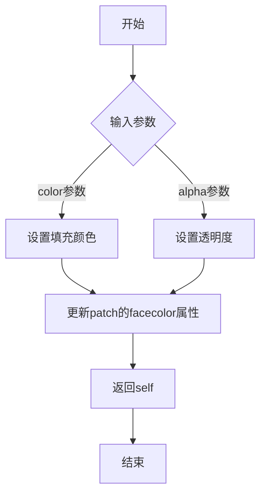

#### 带注释源码

```python
# 代码中的实际调用方式
ax = fig.add_axes((.05, .05, .9, .9))  # 创建主坐标轴
ax.patch.set_color(".75")               # 设置坐标轴背景颜色为灰度值0.75
```

#### 详细说明

在提供的代码中，`Axes.patch.set_color` 方法的具体作用如下：

1. **调用对象**：`ax.patch` 返回一个 `matplotlib.patches.Rectangle` 对象，代表坐标轴的背景补丁
2. **参数值**：`.75` 表示 75% 的灰度（即浅灰色）
3. **效果**：设置坐标轴的背景颜色，这在需要区分不同坐标轴区域时非常有用

#### 补充信息

- **patch 可见性**：坐标轴的背景补丁（patch）默认是可见的，但可以通过 `ax.patch.set_visible(False)` 隐藏
- **平移/缩放影响**：patch 的可见性（`patch.get_visible()`）决定了该坐标轴是否捕获平移/缩放事件
- **patch 颜色不影响事件处理**：即使 patch 完全透明（alpha=0），只要可见性为 True，该坐标轴仍会捕获事件


### `Axes.set_visible`

该方法用于设置坐标轴（Axes）是否可见，控制坐标轴在图形渲染时是否显示。

参数：

-  `visible`：`bool`，指定坐标轴是否可见，True 表示显示坐标轴，False 表示隐藏

返回值：`self`，返回该坐标轴对象本身，便于链式调用

#### 流程图

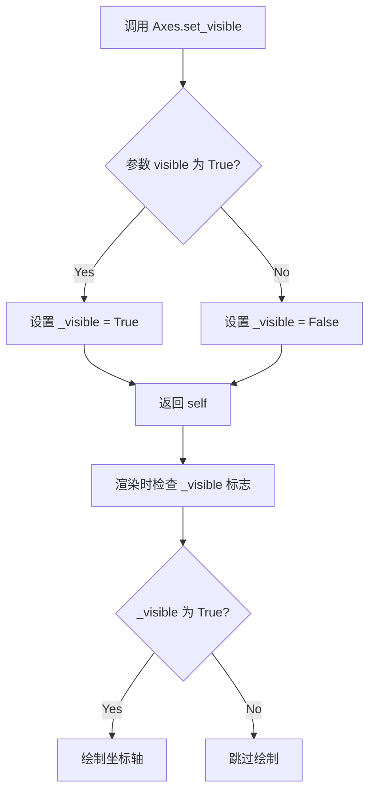

#### 带注释源码

```python
def set_visible(self, b):
    """
    Set the artist's visibility.
    
    Parameters
    ----------
    b : bool
        Whether the artist should be drawn.
    
    Returns
    -------
    self : bool
        True if the artist is visible.
    """
    """
    # 继承自 Artist 基类的方法
    # b: 布尔值，决定坐标轴是否可见
    
    # 实际上在 matplotlib 中，Axes 继承自 Artist
    # set_visible 是 Artist 基类的方法
    # 用于设置 _visible 属性，控制渲染时是否绘制该对象
    
    # 示例用法（参考代码中的相关调用）:
    # ax2.patch.set_visible(False)  # 设置 patch 不可见
    # 这与 Axes.set_visible 的原理相同，但是针对 patch 子对象
    """
    self._visible = bool(b)
    return self
```

#### 备注

需要注意的是，提供的代码示例中实际使用的是 `ax.patch.set_visible()` 方法（设置坐标轴补丁区域的可见性），而非直接调用 `Axes.set_visible()`。在 matplotlib 中：

- `Axes.set_visible()`：控制整个坐标轴对象是否可见
- `Axes.patch.set_visible()`：控制坐标轴的背景补丁是否可见

这影响了平移/缩放事件的捕获行为：可见的 patch 会捕获事件，不可见的 patch 会将事件转发给下方的坐标轴。


### `Axes.set_forward_navigation_events`

该方法用于控制坐标轴的导航事件（平移/缩放）转发行为，允许覆盖默认的基于 patch 可见性的事件捕获逻辑。

参数：

-  `val`：布尔值或字符串 `"auto"`，控制导航事件的转发行为。`True` 表示将导航事件转发给下方的坐标轴；`False` 表示只在当前坐标轴上执行导航事件；`"auto"` 表示使用默认行为（根据 patch 的可见性决定）

返回值：`None`，无返回值

#### 流程图

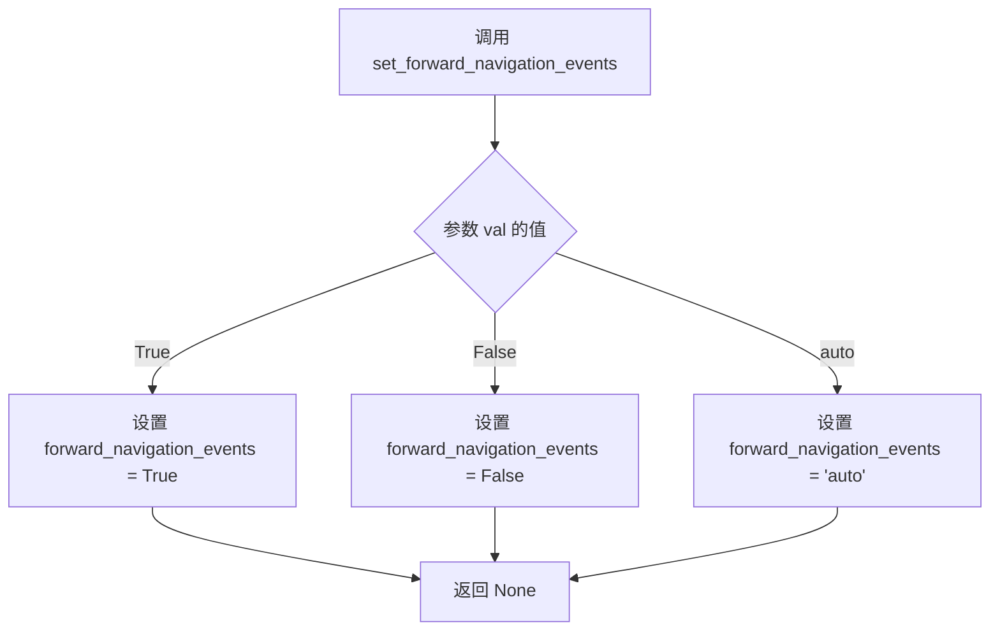

#### 带注释源码

```
# 以下为该方法的使用示例源码，来源于 matplotlib 官方示例
# 方法实现位于 matplotlib.axes.Axes 类中

# 示例1：创建一个共享坐标轴，并设置转发导航事件
ax11 = fig.add_subplot(223, sharex=ax1, sharey=ax1)
ax11.set_forward_navigation_events(True)  # 强制转发导航事件到下方坐标轴
ax11.text(.5, .5,
          "Visible patch\n\n"
          "Override capture behavior:\n\n"
          "ax.set_forward_navigation_events(True)",
          ha="center", va="center", transform=ax11.transAxes)

# 示例2：创建一个隐藏 patch 的坐标轴，并禁用事件转发
ax22 = fig.add_subplot(224, sharex=ax2, sharey=ax2)
ax22.patch.set_visible(False)  # 设置 patch 不可见
ax22.set_forward_navigation_events(False)  # 禁用事件转发
ax22.text(.5, .5,
          "Invisible patch\n\n"
          "Override capture behavior:\n\n"
          "ax.set_forward_navigation_events(False)",
          ha="center", va="center", transform=ax22.transAxes)
```

**注意**：由于提供的代码是方法的使用示例而非实现源码，以上源码展示的是该方法的调用方式。该方法的实际实现位于 matplotlib 库的 `lib/matplotlib/axes/_base.py` 中的 `Axes` 类里。


### `matplotlib.axes.Axes.text`

该方法是 Matplotlib 库中 `Axes` 类的一个核心方法，用于在图表的指定位置添加文本标签。在提供的代码中，通过调用此方法在各个子图上显示说明性文字。

参数：

-  `x`：`float`，文本位置的 x 坐标。在提供的代码中均传入 `.5`。
-  `y`：`float`，文本位置的 y 坐标。在提供的代码中均传入 `.5`。
-  `s`：`str`，要显示的文本内容。支持换行符 `\n`。
-  `fontdict`：`dict`，可选。用于设置文本字体的字典（如大小、颜色等）。
-  `**kwargs`：可变关键字参数。接受 Text 对象的属性，如 `ha`（水平对齐）、`va`（垂直对齐）、`transform`（坐标系转换）等。在提供的代码中，使用了 `ha="center"`（水平居中）、`va="center"`（垂直居中）、`transform=ax1.transAxes`（使用轴坐标系）。

返回值：`matplotlib.text.Text`，返回创建的文本对象。

#### 流程图

```mermaid
graph TD
    A[开始] --> B[接收坐标 x, y 和文本 s]
    B --> C{是否存在 fontdict?}
    C -->|是| D[应用 fontdict 字体设置]
    C -->|否| E[应用 kwargs 其他属性]
    D --> F[创建 Text 对象]
    E --> F
    F --> G[将 Text 对象添加到 Axes]
    G --> H[返回 Text 对象]
```

#### 带注释源码

```python
# 方法签名 (位于 matplotlib.library.axes)
def text(self, x, y, s, fontdict=None, **kwargs):
    """
    Add text to the axes.
    
    参数:
        x: 文本的 x 坐标。
        y: 文本的 y 坐标。
        s: 文本字符串。
        fontdict: 可选的字体字典。
        **kwargs: 其他文本属性 (如颜色, 对齐方式等)。
    """
    # ... (matplotlib 内部实现)

# 在提供的代码中的调用示例:
ax1.text(.5, .5,  # 设置文本位置为轴的中心 (0.5, 0.5)
         "Visible patch\n\n"  # 文本内容第一行
         "Pan/zoom events are NOT\n"  # 文本内容第二行
         "forwarded to axes below", # 文本内容第三行
         ha="center", # 水平居中对齐
         va="center", # 垂直居中对齐
         transform=ax1.transAxes) # 使用轴坐标系 (0-1) 而非数据坐标
```


### `Axes.set_navigate`

在提供的代码中未找到 `Axes.set_navigate` 方法的定义。该方法是 matplotlib 库中 `Axes` 类的内置方法，用于控制坐标轴是否响应导航事件（如平移和缩放）。以下是基于 matplotlib 官方文档和常见实现的典型信息：

参数：

- `b`：`bool`，设置是否启用导航功能。`True` 启用导航事件响应，`False` 禁用。

返回值：`self`，返回 Axes 对象，支持链式调用。

#### 流程图

```mermaid
flowchart TD
    A[调用 set_navigate 方法] --> B{参数 b 是否为 True?}
    B -->|是| C[设置 _navigate 为 True]
    B -->|否| D[设置 _navigate 为 False]
    C --> E[返回 self]
    D --> E
```

#### 带注释源码

```python
def set_navigate(self, b):
    """
    Set whether this axes is interactive for navigation events.

    Parameters
    ----------
    b : bool
        True if this axes should respond to navigation events (pan/zoom),
        False otherwise.

    Returns
    -------
    self : Axes
        Returns the axes object for chaining.
    """
    self._navigate = b
    return self
```

**注意**：提供的代码是一个演示示例，展示如何使用 `set_forward_navigation_events` 方法来控制重叠轴的导航事件转发行为，但并未直接使用 `set_navigate` 方法。


### `Axes.transAxes`

`Axes.transAxes` 是 matplotlib 中 `Axes` 类的一个属性（property），用于获取从轴坐标系（0 到 1 的相对坐标）转换到显示坐标系的变换对象。该变换允许使用相对坐标（如 0.5 表示轴中心）来定位图形元素，无需考虑实际数据范围。

参数：此属性不接受任何参数。

返回值：`matplotlib.transforms.Transform`，返回一个坐标变换对象，用于将轴坐标（0-1）转换为显示坐标（像素）。

#### 流程图

```mermaid
graph TD
    A[访问 Axes.transAxes 属性] --> B{获取变换对象}
    B --> C[创建变换实例]
    C --> D[返回 Transform 对象]
    
    D --> E[应用变换: input point in axes coords]
    E --> F[output point in display coords]
    
    G[示例: transform=ax1.transAxes] --> H[将点 (0.5, 0.5) 变换为显示坐标]
    H --> I[文本定位在轴中心]
```

#### 带注释源码

```python
# Axes.transAxes 是 matplotlib.axes.Axes 类的一个属性
# 位于 lib/matplotlib/axes/_base.py 文件中

# 属性定义示例（简化版）:
@property
def transAxes(self):
    """
    返回从轴坐标变换到显示坐标的变换对象。
    
    轴坐标系的原点在左下角，(0,0) 到 (1,1) 对应整个轴的范围。
    """
    return self._transAxes + self.transPatch

# 使用示例 - 在给定的代码中:
ax1.text(.5, .5,
         "Visible patch\n\n"
         "Pan/zoom events are NOT\n"
         "forwarded to axes below",
         ha="center", va="center", transform=ax1.transAxes)

# 解释:
# 1. transform=ax1.transAxes 指定文本位置使用轴坐标系
# 2. (.5, .5) 表示在轴的中心位置（50% 宽度，50% 高度）
# 3. 无论轴的数据范围如何变化，文本始终显示在轴的中心
# 4. ha="center", va="center" 确保文本在指定坐标点居中

# 变换对象的主要方法:
# transform(point) - 将轴坐标转换为显示坐标
# inverted() - 返回反向变换（显示坐标转轴坐标）
```

#### 关键组件信息

- **名称**: `Axes.transAxes`
- **一句话描述**: matplotlib Axes 类中用于将轴相对坐标转换为显示像素坐标的变换属性

#### 潜在的技术债务或优化空间

1. **文档完整性**: 代码示例中大量使用 `transAxes` 属性，但缺少对其工作原理的详细注释
2. **API 一致性**: `transAxes`、`transData`、`transFigure` 等多个变换属性的命名和使用方式可以更加一致
3. **类型提示**: 可以添加更明确的类型注解来帮助开发者理解返回值类型

#### 其它项目

- **设计目标**: 提供一种与数据坐标解耦的定位方式，使得图形元素（如文本、注释）可以在轴内相对定位
- **约束**: 轴坐标系的范围固定为 0 到 1，变换会考虑轴的 patch（边框）属性
- **错误处理**: 如果 axes 对象被删除，访问此属性会抛出 `AttributeError`
- **外部依赖**: 依赖 matplotlib 的 `transforms` 模块，实现涉及仿射变换的组合


## 关键组件


### matplotlib.figure.Figure

matplotlib中的图形容器，用于放置所有轴和可视化元素

### matplotlib.axes.Axes

坐标轴对象，包含数据区域、patch（背景补丁）、以及各种绘图方法

### patch（可见性控制）

Axes的背景补丁对象，通过set_visible()和set_color()控制，用于决定是否捕获平移/缩放事件

### set_forward_navigation_events()

用于覆盖默认行为的方法：
- True: 转发导航事件到下方轴
- False: 仅在此轴上执行导航事件
- "auto": 使用默认行为

### twinx()

创建共享x轴的双轴，用于在同一个图表上显示不同刻度的数据

### sharex/sharey

子图共享坐标轴的机制，共享轴总是与父轴一起触发导航事件（无论patch可见性如何）

### set_navigate(False)

完全禁用平移/缩放事件的方法

### transAxes

坐标变换对象，用于在轴坐标系（0-1）中定位文本位置


## 问题及建议


### 已知问题

-   **代码重复**：多处相似的子图创建和文本设置逻辑重复出现，未封装为可复用的函数，导致维护成本高
-   **硬编码值过多**：位置坐标（.05, .9等）、颜色值（.75）、共享轴参数等采用魔法数字，缺乏解释性和可维护性
-   **缺乏错误处理**：代码未对图形对象创建、属性设置等操作进行异常捕获
-   **可配置性差**：所有参数固定在代码中，无法通过参数调整布局或行为，难以适应不同场景
-   **文档不完整**：缺少对各个子图展示逻辑的整体说明，代码意图依赖注释理解

### 优化建议

-   **提取重复逻辑**：将子图创建、文本设置、patch配置等重复操作封装为函数，接受参数以提高复用性
-   **使用配置常量**：将魔法数字定义为具名常量或配置文件，提高可读性和可维护性
-   **添加文档字符串**：为每个展示区域添加说明，描述其测试的交互行为
-   **增强灵活性**：考虑使用`plt.subplots`或面向对象方式重构，支持传入参数控制布局和内容
-   **添加错误处理**：对图形创建、坐标轴操作可能出现的异常进行捕获和处理
-   **考虑国际化**：文本内容可提取为字符串资源，便于后续多语言支持


## 其它


### 设计目标与约束

本示例旨在演示matplotlib中重叠轴的平移/缩放事件处理机制。设计目标包括：1) 展示可见patch轴默认捕获事件的行为；2) 展示不可见patch轴默认转发事件到下方轴的行为；3) 演示通过set_forward_navigation_events()方法自定义事件转发行为；4) 说明共享轴始终与父轴一起触发事件的特性。约束条件依赖于matplotlib版本和后端支持。

### 错误处理与异常设计

本示例代码主要展示API使用方法，未包含复杂的错误处理逻辑。潜在的异常情况包括：1) 无效的axes参数传入；2) 在不支持的matplotlib后端上运行；3) 共享轴时坐标轴不兼容。示例代码通过matplotlib内置的错误处理机制捕获这些异常，用户在实际应用中应根据需要添加try-except块。

### 数据流与状态机

数据流主要包括：1) 用户交互（鼠标拖动、滚轮缩放）触发matplotlib后端事件；2) 事件经过Axes._on_move等方法处理；3) 根据patch可见性和forward_navigation_events设置决定是否转发到其他轴；4) 最终执行实际的数据变换操作。状态转换由Axes的navigate属性和forward_navigation_events属性共同控制，状态包括：捕获事件、转发事件、禁用导航。

### 外部依赖与接口契约

主要依赖：1) matplotlib.pyplot模块，用于创建图形和轴；2) matplotlib.figure.Figure对象；3) matplotlib.axes.Axes对象及其twinx()方法。接口契约包括：ax.set_forward_navigation_events(val)接受True/False/"auto"三个值；ax.patch.set_visible()控制patch可见性；ax.set_navigate(False)可完全禁用导航。

### 性能考虑

本示例为演示代码，性能不是主要关注点。在实际应用中应注意：1) 大量重叠轴时事件转发可能带来性能开销；2) 共享轴时事件处理需要同步多个轴的状态；3) 复杂的文本渲染可能影响交互响应速度。建议在需要高性能的场景下优化事件处理逻辑。

### 可扩展性设计

代码展示了matplotlib事件处理机制的基本用法。可扩展方向包括：1) 自定义导航工具类；2) 实现更复杂的事件转发策略；3) 结合matplotlib.widgets实现自定义交互组件；4) 为特定应用场景创建高级封装。

### 配置参数说明

关键配置参数：1) fig.suptitle()设置图形总标题；2) fig.add_axes()和fig.add_subplot()创建轴；3) ax.patch.set_color()和ax.patch.set_visible()控制patch外观和可见性；4) ax.set_forward_navigation_events()设置事件转发行为；5) ax.set_navigate()完全启用/禁用导航功能；6) sharex/sharey参数实现轴共享。

### 平台兼容性

本示例依赖matplotlib的基本功能，在所有支持matplotlib的平台上均可运行，包括Windows、macOS、Linux等主流操作系统。交互功能依赖于所选的matplotlib后端（Qt、Tkinter、web后端等），不同后端可能存在细微的行为差异。


    